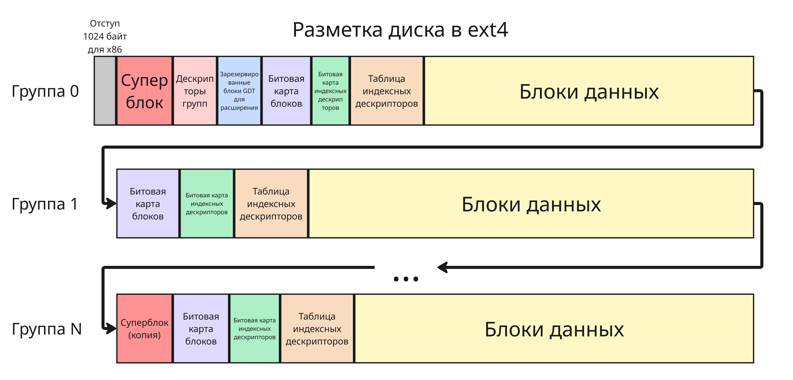

## Лекция 3. Файловые системы

Файловая система - это способ организации информации на носителе данных

Файловая система выполняет такие функции:

* Организацию хранения данных
* Управление доступом
* Учет и распределение дискового пространства
* Обеспечение целостности
* Поддержка операций ввода-вывода

Файловая система является посредником в общении между пользователем, использующим ОС, и жестким диском

Позднее число файловых систем стало настолько большим, что в архитектуре операционных систем стала появляется виртуальная файловая система - стандартизованный интерфейс между системными вызовами и конкретной файловой системой

---

Файловые системы могут использовать множество методов организации:

1. Линейное размещение
2. Связный список
3. Таблица аллокаций файлов
4. Индексные дескрипторы

Подробнее об этом описано в курсе ["Операционные системы"](https://pelmesh619.github.io/itmo_conspects/opersys/opersys_superconspect.html#-%D0%BB%D0%B5%D0%BA%D1%86%D0%B8%D1%8F-14-%D1%84%D0%B0%D0%B9%D0%BB%D0%BE%D0%B2%D0%B0%D1%8F-%D1%81%D0%B8%D1%81%D1%82%D0%B5%D0%BC%D0%B0)

Современные операционные системы используют файловые системы с индексными дескрипторами для дисков, на которых установлена система. Так, Windows использует NTFS (New Technology File System), а для Linux рекомендуется ext4 (от Fourth Extended, Четвертая расширенная файловая система)

В файловой системе ext4 в начале блочного устройства есть участок с названием суперблок (Superblock). Суперблок - это структура, состоящая из данных, которые определяют организацию данных:

| Поле                       | Тип данных  | Назначение                                  |
| -------------------------- | ----------- | ------------------------------------------- |
| `s_inodes_count`           | `__le32`    | Общее количество индексных дескрипторов     |
| `s_blocks_count_lo`        | `__le32`    | Общее количество блоков (младшие 32 бита)   |
| `s_r_blocks_count_lo`      | `__le32`    | Зарезервированные блоки (младшие 32 бита)   |
| `s_free_blocks_count_lo`   | `__le32`    | Свободные блоки (младшие 32 бита)           |
| `s_free_inodes_count`      | `__le32`    | Количество свободных индексных дескрипторов |
| `s_first_data_block`       | `__le32`    | Первый блок данных                          |
| `s_log_block_size`         | `__le32`    | Логарифм размера блока в килобайтах по основанию 2       |
| `s_log_cluster_size`       | `__le32`    | Логарифм размера кластера в килобайтах по основанию 2    |
| `s_blocks_per_group`       | `__le32`    | Блоков в группе                             |
| `s_clusters_per_group`     | `__le32`    | Кластеров в группе                          |
| `s_inodes_per_group`       | `__le32`    | Индексных дескрипторов в группе             |
| `s_mtime`                  | `__le32`    | Время последнего монтирования               |
| `s_wtime`                  | `__le32`    | Время последней записи                      |
| `s_mnt_count`              | `__le16`    | Счётчик монтирований после проверки диска   |
| `s_max_mnt_count`          | `__le16`    | Максимальное число монтирований, после который нужна проверка диска |
| `s_magic`                  | `__le16`    | Магическое число, для ext4 - это `0xEF53`   |
| `s_state`                  | `__le16`    | Состояние файловой системы                  |
| `s_errors`                 | `__le16`    | Поведение при ошибках                       |
| `s_minor_rev_level`        | `__le16`    | Минорная версия                             |
| `s_lastcheck`              | `__le32`    | Время последней проверки                    |
| `s_checkinterval`          | `__le32`    | Интервал проверки                           |
| `s_creator_os`             | `__le32`    | Операционная система, создавшая раздел (Linux - это `0x0000`, FreeBSD - это `0x0003`) |
| `s_first_ino`              | `__le32`    | Первый незарезервированный индексный дескриптор |
| `s_inode_size`             | `__le16`    | Размер индексного дескриптора (обычно 256 байт) |
| `s_block_group_nr`         | `__le16`    | Номер группы (для копии суперблока)         |
| `s_uuid`                   | `__u8[16]`  | UUID файловой системы                       |
| `s_volume_name`            | `char[16]`  | Имя тома                                    |

... и много других

Здесь `__le16`, `__le32` - беззнаковые целые числа, записанные в Little-endian, размером 16 бит и 32 бита соответственно, `__u8[16]` - 16-байтный массив беззнаковый 8-битных чисел, а `char[16]` - символьная последовательность

> Источник: <https://docs.kernel.org/next/filesystems/ext4/super.html>

Со временем появилась идея размещать блоки больших файлов рядом друг с другом, чтобы уменьшать движение читающей головки жесткого диска по секторам

Для решения этого появились группы блоков. Группы содержат свои битовые карты, таблицы индексных дескрипторов и блоки данных

Первая группа под индексом 0 хранит суперблок и таблицу дескрипторов блочных групп (Block Group Descriptors) - структуры с данными полями:

| Поле                      | Тип данных | Назначение                                  |
| ------------------------- | ---------- | ------------------------------------------- |
| `bg_block_bitmap_lo`      | `__le32`   | Номер блока битовой карты блоков (младшие 32 бита) |
| `bg_inode_bitmap_lo`      | `__le32`   | Номер блока битовой карты дескрипторов (младшие 32 бита)  |
| `bg_inode_table_lo`       | `__le32`   | Первый блок таблицы индексных дескрипторов (младшие 32 бита) |
| `bg_free_blocks_count_lo` | `__le16`   | Количество свободных блоков в группе        |
| `bg_free_inodes_count_lo` | `__le16`   | Количество свободных дескрипторов в группе         |
| `bg_used_dirs_count_lo`   | `__le16`   | Количество каталогов в группе               |
| `bg_flags`                | `__le16`   | Флаги состояния группы                      |
| `bg_exclude_bitmap_lo`    | `__le32`   | Блок битовой карты снимков исключения (Exclusion Snapshot)          |
| `bg_block_bitmap_csum_lo` | `__le16`   | Контрольная сумма битовой карты блоков                  |
| `bg_inode_bitmap_csum_lo` | `__le16`   | Контрольная сумма битовой карты дескрипторов            |
| `bg_itable_unused_lo`     | `__le16`   | Количество неинициализированных индексных дескрипторов  |
| `bg_checksum`             | `__le16`   | Контрольная сумма дескриптора группы        |

... и другие поля

Последующие группы могут хранить также избыточные копии суперблока и таблицы дескрипторов групп, но система будет обращаться к ним в том случае, если начало диска было повреждено

> Источник: <https://docs.kernel.org/next/filesystems/ext4/group_descr.html>

Далее идет битовая карта блоков (Block Bitmap). В ней один бит, равный 1, обозначает, занят ли конкретный блок с тем же индексом

Затем расположена подобная битовая карта для индексных дескрипторов (Inode Bitmap), где бит 1 обозначает, занят ли индексный дескриптор в таблице дескрипторов

> Источник: <https://docs.kernel.org/next/filesystems/ext4/bitmaps.html>

После этого расположена сама таблица индексных дескрипторов. Таблица представляет собой массив дескрипторов, где индекс - это номер индексного дескриптора

Для специальных индексных дескрипторов выделены особые индексы:

* `0` для дескриптора, который не существует
* `1` для списка бракованных блоков
* `2` для корневого каталога `/`
* `3` для пользовательской квоты
* `4` для квоты групп

    Квоты хранят информацию о том, сколько разрешено максимально иметь дескрипторов и/или блоков пользователям и группам

* `5` для загрузчика. Сейчас он редко используется, так как рекомендуется устанавливать загрузчик на другой раздел диска
* `6` для каталога восстановления
* `7` для зарезервированной группы дескрипторов для увеличения количества дескрипторов файловой системы
* `8` для журнала, чтобы обеспечивать надежность данных во время сбоя

9-ый и 10-ый дескрипторы зарезервированы и используются для функций, который обозначены `?` в документации, а 11-ый дескриптор - первый не зарезервированный, но обычно используется для каталога `/lost+found/`, который предназначен для восстановленный утилитой `fsck` файлов после сбоя

> Источник: <https://www.kernel.org/doc/html//latest/filesystems/ext4/special_inodes.html>

Наконец, после таблицы индексных дескрипторов дальше идут сами блоки данных

---

В файловой системе ext3 добавилась система журналирования - способ восстановления данных в результате нештатной работы ОС или диска

Всего есть три типа журналов в ext3:

1. Journal - самый медленный, но самый надежный журнал. Сначала в журнал пишутся блоки данных, потом они копируются в нужное место, а дескриптор изменяется
2. Ordered - то же самое, но записываем только метаданные файла, что быстрее
3. Writeback - сначала пишем весь файл, а потом изменяем все метаданные в дескрипторе и журнале

В системе ext4 добавилось много новых функций, которые убирали ограничения старых версий системы:

* Экстенты вместо блочной адресации

    Вместо хранения списка отдельных блоков используются экстенты, что уменьшает фрагментацию и ускоряет работу с большими файлами

* Поддержка больших файлов (до 16 Тб в стандартной конфигурации) и файловой системы (теоретически до 1 Эб)
* Отложенное выделение блоков - блоки выделяются не сразу при записи, а позже, что улучшает размещение данных и снижает фрагментацию
* Контрольные суммы журнала уменьшают риск повреждения данных при сбоях
* Возможность дефрагментации без размонтирования файловой системы
* Можно увеличить размер файловой системы во время работы диска
* Предварительное выделение места для файлов
* Метки времени с точностью до наносекунд, тогда как в ext3 только до секунд
* Индексация больших каталогов с использованием хеш-дерева

---

Хорошей практикой является разделение диска на 6 разделов:

* Раздел для EFI (Extensible Firmware Interface), который хранит загрузчики (например, GRUB) и отформатирован в файловую систему FAT
* Раздел для каталога `/boot/`, хранящий ядро и `initramfs`
* Раздел для корневого каталога `/`
* Раздел для файла подкачки
* Раздел для домашнего каталога `/home/`
* И раздел для каталога `/var/`, содержащего изменяемые файлы

В корневом каталоге Linux создает множество подкаталогов для работы системы, структура которых подчиняется стандарту (FHS) Filesystem Hierarchy Standard:

* `/bin/` - каталог с готовыми к исполнению основными программами (например, `/bin/bash`). Оболочки, такие как bash, ищут исполняемые файлы с именем там
* `/sbin/` - системные исполняемые файлы для администрирования (например, `fsck`, `mount`), которые обычно предназначены для суперпользователя
* `/boot/` - файлы, необходимые для загрузки системы: ядро Linux, `initramfs`, конфигурация загрузчика
* `/dev/` - файловые дескрипторы устройств
* `/etc/` (от Editable Text Configuration или Extended Tool Chest) - системные конфигурационные файлы такие, как настройки служб, сети, пользователей и всей системы

* `/home/` - домашние каталоги обычных пользователей
* `/root/` - домашний каталог суперпользователя

* `/lib/`, `/lib64/` - системные библиотеки, необходимые для работы программ из `/bin/` и `/sbin/`
* `/media/` - точки монтирования съемных носителей
* `/mnt/` - временное монтирование файловых систем администратором
* `/opt/` - дополнительные пакеты
* `/proc/` - виртуальная файловая система с информацией о процессах и ядре, создающаяся динамически
* `/sys/` - виртуальная файловая система с информацией о устройствах и драйверах.
* `/run/` - временные данные времени выполнения, например, текущие вошедшие пользователи или запущенные демоны
* `/tmp/` - временные файлы, которые очищаются после перезагрузки. В некоторых случаях каталог `/tmp/` может храниться непосредственно в оперативной памяти

* `/usr/` - пользовательские программы и данные (большинство установленного ПО):

    * `/usr/bin` - программы
    * `/usr/lib` - библиотеки
    * `/usr/src/` - исходный код
    * `/usr/share` - общие данные, которые не зависят от архитектуры

* `/var/` - изменяемые данные, такие как:
    * `/var/log/` - логи
    * `/var/lib/` - персистентная информация программ (например, базы данных)
    * `/var/lock/` - блокировки ресурсов
    * `/var/cache/` - кэш
    * `/var/spool/` - очереди печати, почтовых запросов и так далее
    * `/var/mail/` - данные почтовых серверов
    * `/var/tmp/` - временные файлы, которые нужно сохранить после перезагрузки
