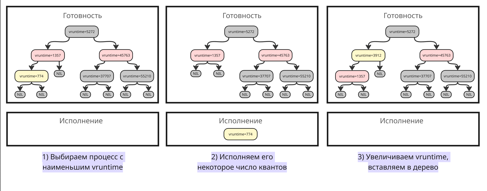
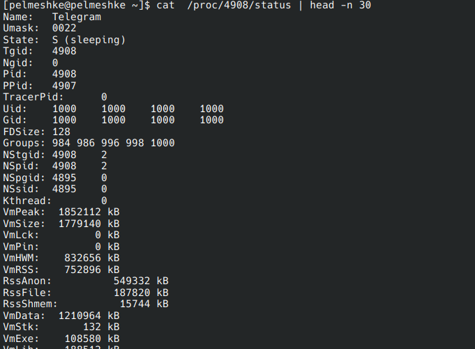
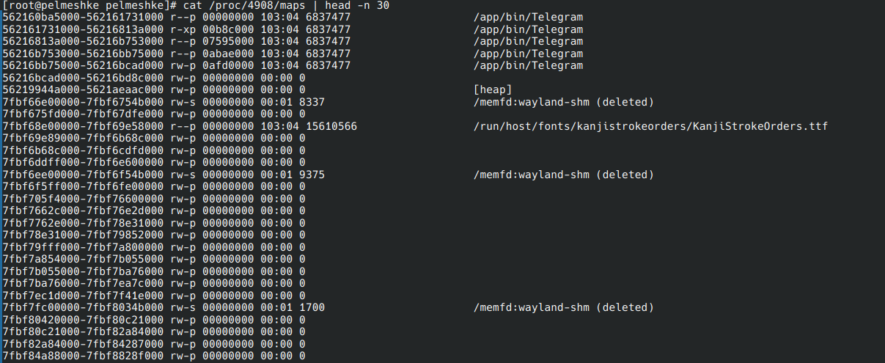
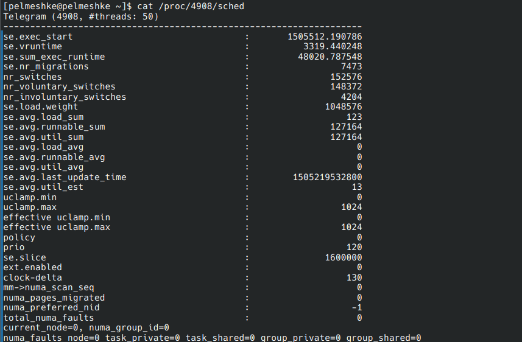
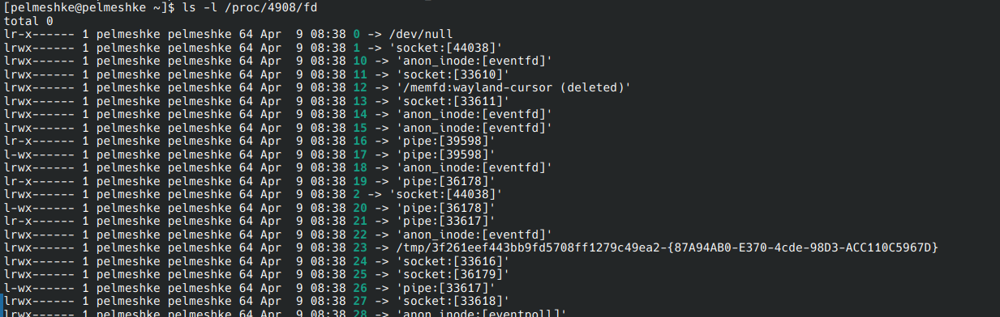
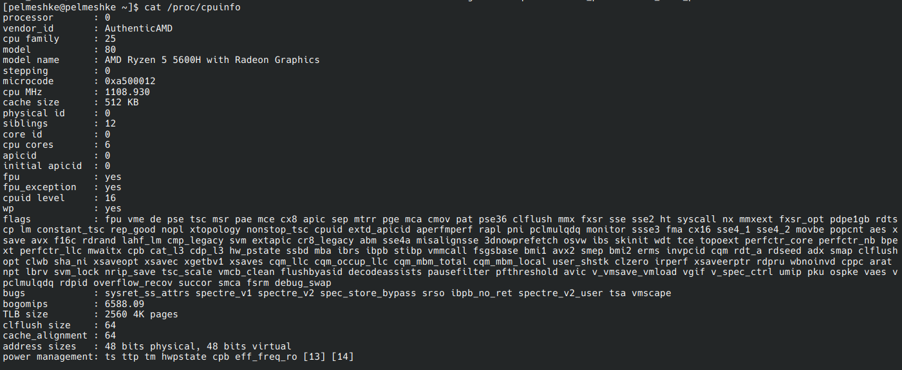
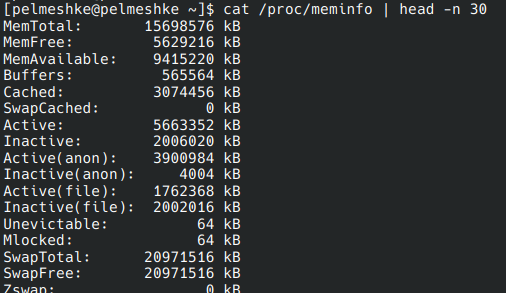

## Лекция 5. Процессы, часть II

### Сигнал

В операционной системе процессы имеют изолированное адресное пространство, изолированное исполнение, изолированное планирование и не могут повлиять на другие процессы. Поэтому для общения процессы помимо файловой системы могут использовать сигналы

Сигнал - это сообщение, которое процесс получает от операционной системы или другого процесса. С точки зрения процесса сигнал выглядит как прерывание

Согласно стандарту POSIX, сигналы делятся на стандартные и сигналы реального времени

В Linux всего 31 стандартный сигнал. Рассмотрим самые распространенные из них:

| Имя       | Код | Назначение | Действие по умолчанию |
|-----------|-------|------------|-|
| `SIGHUP` (от hang up) | 1  | Процесс завершается, а дочерние процессы получает этот сигнал, чтобы тоже завершиться. Ранее использовался для обозначения прерывания телефонной связи между терминалом и пользователем (дословно "положить трубку") | 🛑 |
| `SIGINT` (от interrupt) | 2  | Прерывание выполнения команд от клавиатуры (в терминале вызывается по комбинации Ctrl+C) | 🛑 |
| `SIGQUIT` | 3  | Прерывание с дампом ядра (обычно Ctrl+\\), посылается всем процессам группы | 🛑📦 |
| `SIGILL` (от illegal) | 4  | Сигнал, посланный ядром, который означает, что выполнявшаяся инструкция является неправильной с точки зрения архитектуры процессора | 🛑📦 |
| `SIGFPE` (от floating point exception) | 8  | Ошибочная арифметическая операция | 🛑📦 |
| `SIGKILL` | 9  | Немедленное принудительное завершение процесса | 🛑 |
| `SIGUSR1` и `SIGUSR2` | 10 и 12 | Сигналы, определенные пользователем | 🛑 |
| `SIGSEGV` (от segmentation fault) | 11 | Нарушение доступа к памяти, например, доступ к еще невыделенной странице | 🛑📦 |
| `SIGPIPE` | 13 | Процесс написал в именованный канал, но нет процесса, который мог бы прочитать это | 🛑 |
| `SIGTERM` (от terminate) | 15 | Сигнал завершения | 🛑 |
| `SIGCHLD`, также `SIGCLD` (от child) | 17 | Дочерний процесс завершился, был остановлен или продолжил исполнение | 🙈 |
| `SIGCONT` (от continue) | 18 | Процесс продолжает исполнение | ▶️ |
| `SIGSTOP` | 19 | Перевод процесса в состояние "Остановлен" | ⏸️ |
| `SIGTSTR` | 20 | Сигнал остановки с терминала по комбинации Ctrl+Z | ⏸️ |

По умолчанию каждый процесс имеет таблицу обработчиков сигналов, наследованную от первого процесса (`init` или `systemd`). Такие обработчики обычно могут совершать такие действия:

* 🛑 - завершение исполнение процесса (🛑📦 - завершение с сохранением памяти процесса в момент получения сигнала)
* ⏸️ - процесс останавливает исполнение
* 🙈 - игнорирование сигнала
* ▶️ - продолжение исполнения

Здесь код сигнала указан для архитектур x86 и ARM. В других архитектурах (например, MIPS или SPARC) код сигнала может отличаться

Среди этих все, кроме `SIGKILL` и `SIGSTOP`, можно перехватить и переопределить обработчики, например, назначить на `SIGINT` правильной завершение процесса. На сигналы `SIGKILL` и `SIGSTOP` операционная система принудительно убивает или переводит процесс в состояние "Остановлен" соответственно

Сигналы реального времени используются для обычных программ. Они не имеют определенного значения, и всего их может быть до 33 -- они определены интервалом от `SIGRTMIN` (чаще всего `34` или `35`) и `SIGRTMAX` (`64`). Так как разные имплементации потоков библиотеки glibc используют первые 1 или 2 сигнала для своих задач, рекомендуется использовать `SIGRTMIN + 3` вместо `37` или `38`

Гарантируется, что сигналы реального времени придут процессу в том же порядке, что они были отправлены. Также, если такой сигнал был послан функцией `sigqueue`, то процесс-приемник может получить число или указатель на дополнительные данные

> Источник: <https://www.man7.org/linux/man-pages/man7/signal.7.html>

### Планирование процессов

> Подробнее про планирование процессов описано в курсе ["Операционные системы"](https://pelmesh619.github.io/itmo_conspects/opersys/opersys_superconspect.html#-%D0%BB%D0%B5%D0%BA%D1%86%D0%B8%D1%8F-10-%D0%BF%D0%BB%D0%B0%D0%BD%D0%B8%D1%80%D0%BE%D0%B2%D1%89%D0%B8%D0%BA%D0%B8-%D0%B2-windows-%D0%B8-linux)

За время развития операционной системы Linux существовало множество планировщиков:

* O(n) scheduler, использовавшийся в версиях ядра с 2.4 до 2.6
* O(1) scheduler, использовавшийся в версиях ядра с 2.6 до 2.6.23
* Completely Fair Scheduler (CFS, Полностью справедливый планировщик), использовавшийся долгое время (16 лет) в версиях ядра с 2.6.23 до 6.6
* Earliest eligible virtual deadline first (EEVDF, "С самого раннего подходящего для виртуального дедлайна"), использующийся с версии ядра 6.6

В Linux можно выделить 2 типа процессов:

* Процессы реального времени - обычно, это демоны ядра. Их выполнение приоритетно, так как от их работы зависит работа остальных процессов, поэтому система выполняет сначала их

    Для их исполнения используются алгоритм "Первым пришел - первым обслужен" (FCFS) или циклический алгоритм (Round Robin)

* Пользовательские процессы. У каждого такого процесса есть собственный приоритет исполнения (значение nice), поэтому для них используются более изощренные алгоритмы, такие как CFS и EEVDF

Рассмотрим, как работает Completely Fair Scheduler

Ключевая идея планировщика - каждый процесс должен получать долю процессорного времени, пропорциональную её весу (то есть приоритету). Вместо фиксированных очередей планировщик CFS использует виртуальное время `vruntime` для каждой задачи

* Когда процесс порождается другим, его виртуальное время `vruntime` устанавливается таким же, как и у его родителя
* После того, как другой процесс исполнялся некоторое число квантов, планировщик находит процесс с наименьшим `vruntime` и начинает его исполнение. Его исполнение заканчивается, если:

    * Он был остановлен, завершил исполнение или перешел в ожидание ввода/вывода
    * Появилась другая задача с меньшим `vruntime`
    * Время его исполнения превысилось некоторое число квантов исполнения (условных единиц). Это число зависит от веса процесса и текущего множества готовых к исполнению процессов

* После исполнения `delta_exec` секунд планировщик обновляет `vruntime` по такой формуле:

    ```txt
    vruntime += delta_exec * weight / lw.weight
    ```

    Здесь `weight` - вес текущего процесса (примерно `1024 / (1.25 ^ nice_value)`, `nice_value` - это значение параметра nice), а `lw.weight` - вес опорной сущности, например, вес для процесса с nice=0 или установленный вес для группы процессов

* Выбирается следующий процесс с минимальным `vruntime` и так далее

Сами процессы с `vruntime` должны где-то храниться, причем операции добавления удаления должны быть быстрыми. По этой причине выбрали красно-черное дерево - процессы отсортированы по величине `vruntime`, а само дерево является самобалансирующимся, то есть в любой момент времени его высота примерно равна `log N`, а все операции имеют сложность `O(log N)`



> Подробнее про CFS: <https://www.kernel.org/doc/html/latest/scheduler/sched-design-CFS.html>, <https://developer.ibm.com/tutorials/l-completely-fair-scheduler/>  
> Исходный код CFS: <https://github.com/torvalds/linux/blob/v6.5/kernel/sched/fair.c>

---

Completely Fair Scheduler полагался на множество эвристик и параметров, чтобы корректно работать с интерактивными и фоновыми задачами

Новый алгоритм Earliest eligible virtual deadline first вместо этого имеет математический подход. В нем есть три понятия:

* Виртуальное время выполнения, как и в CFS
* Лаг - разница между тем, сколько процессорного времени задача должна была получить (согласно своему приоритету), и тем, сколько она реально получила
* Виртуальный дедлайн - момент времени, к которому задача должна получить свое процессорное время

На каждом шаге EEVDF:

* Находит задачи с положительным лагом. Такие задачи называются подходящими (eligible)
* Среди них выбирает ту, у которой самый ранний виртуальный дедлайн (earliest virtual deadline)

Однако процессы могут кратковременно засыпать, чтобы повышать свой лаг, что делает планировщик несправедливым. Чтобы бороться с этим, планировщик не убирает такие задачи из очереди "Готовность", а также меньше уменьшает их лаг

> Статья про EEVDF: <https://citeseerx.ist.psu.edu/document?doi=805acf7726282721504c8f00575d91ebfd750564&repid=rep1&type=pdf>
> Документация про EEVDF: <https://docs.kernel.org/scheduler/sched-eevdf.html>

### Псевдофайловая система `/proc/`

Для доступа к сведениям процессов есть псевдофайловая система `/proc/`, которая представляет из себя набор файлов для каждого процесса. При чтении одного из файлов в этом подкаталоге данные достаются не из диска, а из оперативной памяти

Директория `/proc/` содержит множество поддиректорий вида `/proc/<PID>` с числовыми названиями. Это число представляет из себя идентификатор процесса, а поддиректория хранит информацию о процессе, а именно:

* файл `/proc/<PID>/cmdline` - полная командная строка запуска процесса
* символьная ссылка `/proc/<PID>/exe` на исполняемый файл. Иногда команда запуска может быть вида `nano test.sh`, где программа `nano` может быть в `/bin/nano`, а может быть другой утилитой из другого места
* символьная ссылка `/proc/<PID>/cwd` на текущий каталог, относительного которого процесс исполняется (от current working directory)
* файл `/proc/<PID>/environ`, содержащий переменные окружения процесса

* файл `/proc/<PID>/status`, содержащий общую информацию о процессе

    

    Также есть файл `/proc/<PID>/stat`, содержащий статистику в машиночитаемом виде

* файл `/proc/<PID>/io`, содержащий статистику операциям хранилища в таком виде:

    ```txt
    rchar: 131804676
    wchar: 1467923
    syscr: 30982
    syscw: 40879
    read_bytes: 296783872
    write_bytes: 1097728
    cancelled_write_bytes: 8192
    ```

* файл `/proc/<PID>/maps`, содержащий информацию о выделенных страницах памяти

    

    Вместе с ним есть файл `/proc/<PID>/pagemap`, который содержит 64-битные числа, представляющие каждую страницу в машиночитаемом виде

* файл `/proc/<PID>/statm`, хранящий информацию о размерах структуры памяти процесса в 7 числах. Например:

    ```txt
    440853 192627 48735 27145 0 300709 0
    ```

    Здесь:

    * `440853` - общий размер программы
    * `192627` - размер резидентной части (та часть используемой памяти, которая находится в ОЗУ)
    * `48735` - размер разделенной памяти, которая используется несколькими программами
    * `27145` - размер сегмента, отведенного под код программы
    * `0` - размер библиотек, не используется с версии ядра 2.6
    * `300709` - размер данных и стека
    * `0` - размер грязных страниц, не используется с версии ядра 2.6

* файл `/proc/<PID>/sched`, содержащий статистику планировщика

    

* директория `/proc/<PID>/fd`, содержащая информацию об открытых файловых дескрипторах

    

---

Помимо информации для каждого процесса `/proc/` хранит общую информацию об операционной системе

* Файл `/proc/cmdline` - аргументы запуска ядра, например:

    ```txt
    BOOT_IMAGE=/vmlinuz-linux-zen root=UUID=90811ff5-ecb7-4e78-8406-1be8785fe758 rw loglevel=3 quiet
    ```

* Файл `/proc/cpuinfo`, содержащий информацию о процессорах:

    

    Здесь можно узнать модель процессоров и поддерживаемые инструкции и технологии

* Файл `/proc/diskstats`, содержащий статистику операций со всеми дисками
* Файл `/proc/meminfo`, содержащий сведения об оперативной памяти:

    

* Файл `/proc/devices` - список устройств
* Файл `/proc/mounts` - список смонтированных файловых систем
* Файл `/proc/modules` - список загруженный модулей ядра
* Файл `/proc/filesystem` - список поддерживаемых ядром файловых систем
* Файл `/proc/swaps` - список разделов подкачки
* Файл `/proc/version` - версия ядра и дата сборки
* Каталог `/proc/sys/kernel/` - изменяемые параметры ядра
