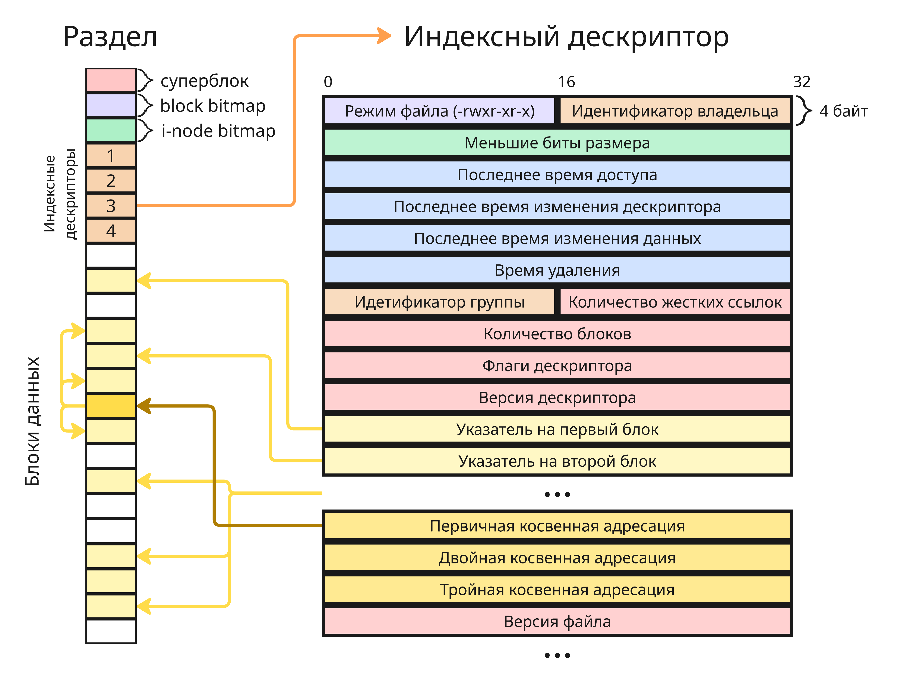
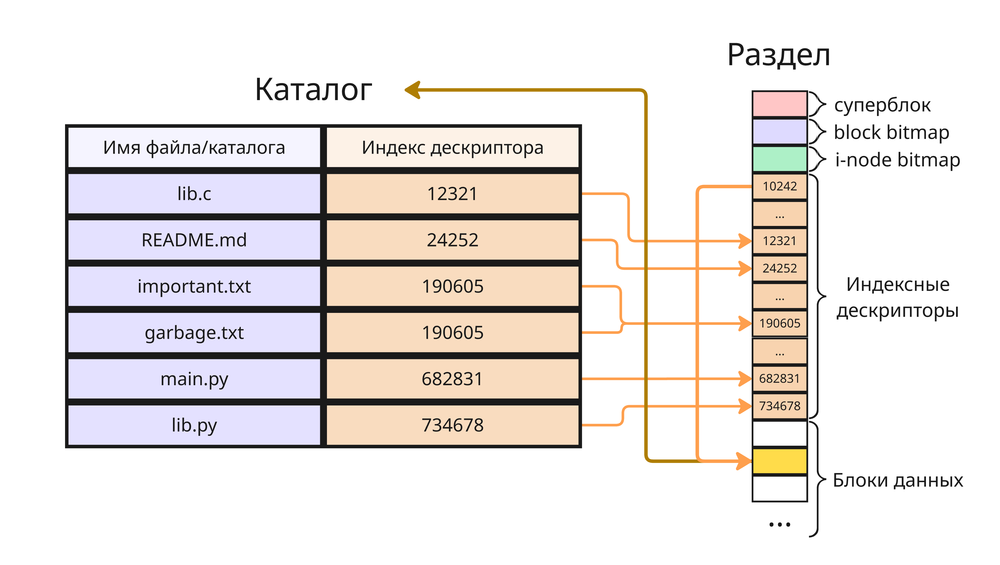

# <a name="%D0%B0%D0%B4%D0%BC%D0%B8%D0%BD%D0%B8%D1%81%D1%82%D1%80%D0%B8%D1%80%D0%BE%D0%B2%D0%B0%D0%BD%D0%B8%D0%B5-%D0%B2-%D0%BE%D1%81-linux"></a> Администрирование в ОС Linux


* [Администрирование в ОС Linux](#%D0%B0%D0%B4%D0%BC%D0%B8%D0%BD%D0%B8%D1%81%D1%82%D1%80%D0%B8%D1%80%D0%BE%D0%B2%D0%B0%D0%BD%D0%B8%D0%B5-%D0%B2-%D0%BE%D1%81-linux)
  * [Лекция 1. Введение в Linux](#%D0%BB%D0%B5%D0%BA%D1%86%D0%B8%D1%8F-1.-%D0%B2%D0%B2%D0%B5%D0%B4%D0%B5%D0%BD%D0%B8%D0%B5-%D0%B2-linux)
  * [Лекция 2. Файлы и права доступа](#%D0%BB%D0%B5%D0%BA%D1%86%D0%B8%D1%8F-2.-%D1%84%D0%B0%D0%B9%D0%BB%D1%8B-%D0%B8-%D0%BF%D1%80%D0%B0%D0%B2%D0%B0-%D0%B4%D0%BE%D1%81%D1%82%D1%83%D0%BF%D0%B0)


> **Операционная система** - это базовое системное программное обеспечение, управляющее работой вычислительного узла и реализующее универсальный интерфейс между аппаратным обеспечением, программным обеспечением и пользователем

Возможности по изменению аппаратного обеспечения часто ограничены, поэтому на практике стремятся извлечь максимальную производительность и гибкость за счёт программного обеспечения и грамотного администрирования ОС

Курс разделен на несколько блоков:

1. Работа с файлами
2. Файловые системы
3. Процессы и управление ресурсами
4. Межпроцессорное взаимодействие
5. Загрузка операционной системы
6. Механизмы контейнеризации
7. Управление пользовательским ПО
8. Графические среды

## <a name="%D0%BB%D0%B5%D0%BA%D1%86%D0%B8%D1%8F-1.-%D0%B2%D0%B2%D0%B5%D0%B4%D0%B5%D0%BD%D0%B8%D0%B5-%D0%B2-linux"></a> Лекция 1. Введение в Linux

> **Linux** (в части случаев GNU/Linux) - это семейство открытых и свободных Unix-подобных операционных систем на базе ядра Linux, включающих набор утилит и программ проекта GNU, а также другие системные и прикладные компоненты

Linux начал своё развитие в 1991 году, когда Линус Торвальдс, будучи студентом Хельсинкского университета, опубликовал первую версию ядра Linux как учебный и исследовательский проект

Со временем вокруг ядра Linux сформировалось большое сообщество разработчиков, а сам Linux стал использоваться в серверах, настольных системах, мобильных и других устройствах

Разделяют бесплатное ПО, открытое ПО и свободное ПО

Бесплатное ПО (Freeware) - программное обеспечение, распространяющееся бесплатно конечному пользователю в виде исполняемых файлов

Открытое ПО (Open-Source Software) - программное обеспечение с открытым исходным кодом, чаще всего распространяющимся по [разрешительной лицензии](https://pelmesh619.github.io/itmo_conspects/devtools/devtools_superconspect.html#%D0%BE%D1%82%D0%BA%D1%80%D1%8B%D1%82%D0%BE%D0%B5-%D0%BF%D0%BE)

Свободное ПО (Free and Open-Source Software, FOSS) - открытое программное обеспечение, лицензия которого заставляет авторов производных от него работ лицензировать их под той же [свободной лицензией](https://pelmesh619.github.io/itmo_conspects/devtools/devtools_superconspect.html#%D1%81%D0%B2%D0%BE%D0%B1%D0%BE%D0%B4%D0%BD%D0%BE%D0%B5-%D0%BF%D0%BE)

Linux является свободным программным обеспечением и распространяется под лицензией **GNU General Public License 2.0**. Это означает, что операционная система Linux гарантирует пользователю 4 свободы, сформулированные Ричардом Столлманом, основателем проекта GNU:

* Свобода запускать программу в любых целях (свобода 0).
* Свобода изучения работы программы и адаптация её к вашим нуждам (свобода 1). Доступ к исходным текстам является необходимым условием.
* Свобода распространять копии, так что вы можете помочь вашему товарищу (свобода 2).
* Свобода улучшать программу и публиковать ваши улучшения, так что всё общество выиграет от этого (свобода 3). Доступ к исходным текстам является необходимым условием.

Лицензия GNU General Public License 2.0 накладывает обязательство на то, что производные работы также должны распространяться на условиях этой лицензии

Linux включает набор утилит и программ GNU, такие как Bash или GNU Compiler Collection, которые тоже являются свободным ПО

Linux распространяется не только в виде ядра, но и в виде *дистрибутивов* - готовых комплектов программного обеспечения, включающих ядро, системные утилиты, менеджер пакетов, установщик и часто графическую среду. Сейчас популярные дистрибутивы - это Debian, Ubuntu, Fedora, Arch Linux и другие

Дистрибутивы Linux бесплатные, но не все. Так, например, Red Hat Enterprise Linux распространяется по платной модели, имея открытый код, но за плату предлагается расширенная корпоративная поддержка и сервис

---

Ключевые отличия свободного ПО и проприетарного ПО заключаются:

* *В доступу к исходному коду*

* *В модели поддержки*. В свободном ПО поддержка часто осуществляется сообществом или сторонними компаниями, а в проприетарном ПО - официальным производителем

* *В поиске и исправлении уязвимостей*. Открытый код позволяет независимый аудит безопасности, тогда как при использовании проприетарного ПО пользователь вынужден доверять разработчику

* *В гибкости и кастомизации*. Свободное ПО можно модифицировать под конкретные нужды, проприетарное, как правило, нет

---

Долгое время наиболее популярной настольной операционной системой остаётся Microsoft Windows. Рассмотрим ключевые концептуальные отличия Linux от Windows:

* Работа с файлами

    В Linux все объекты, в том числе файлы, сетевые сокеты, устройства, каналы, - это файловые дескрипторы, поэтому взаимодействие с ними осуществляется через файловую систему

    В Windows пользователь чаще взаимодействует с действиями и приложениями, а не с абстрактными объектами файловой системы

* Иерархия файловой системы

    Linux использует единую иерархию каталогов, начинающуюся с корня `/`, тогда как в Windows используется несколько корней: диски `C:`, `D:` и так далее

* Права доступа

    В Linux строгая модель прав доступа: владелец, группа и остальные; В Windows используется модель NTFS-разрешений, менее прозрачная для пользователя.

* Обновления и установка ПО

    В Linux программное обеспечение обычно устанавливается из централизованных репозиториев через менеджеры пакетов. В Windows чаще используются отдельные установщики для каждого приложения

## <a name="%D0%BB%D0%B5%D0%BA%D1%86%D0%B8%D1%8F-2.-%D1%84%D0%B0%D0%B9%D0%BB%D1%8B-%D0%B8-%D0%BF%D1%80%D0%B0%D0%B2%D0%B0-%D0%B4%D0%BE%D1%81%D1%82%D1%83%D0%BF%D0%B0"></a> Лекция 2. Файлы и права доступа

В Linux и других Unix-подобных системах все объекты являются файловыми дескрипторами, то есть все действия совершаются через универсальный интерфейс

Файловый дескриптор - это идентификатор, за которым закреплен определенный поток ввода и вывода. Через файловые дескрипторы в Linux можно работать:

* с устройствами
* с процессами
* с файлами и каталогами в памяти хранилища
* и с другими объектами

Получаем единый набор операций с файловым дескриптором: открытие, чтение, запись и закрытие

Всего можно выделить 7 типов файлов:

* Регулярный файл

    Регулярный файл - это файл в обычном его понимании, то есть именованная область памяти хранилища, которая структурирована иерархически

    По умолчанию, Linux рекомендует использовать файловую систему ext4, которая использует индексные дескрипторы. Поэтому на диске файл представлен индексным дескриптором в начале блочного устройства

    

    Когда файл создается, в таблице индексных дескрипторов появляется индексный дескриптор файла. При записи операционная система выделяет новые блоки на блочном устройстве и добавляет ссылки на эти блоки в индексном дескрипторе, а при удалении удаляется индексный дескриптор

    При этом файл в Linux не хранит свое имя - это ответственность каталога

* Каталог

    Каталог - это таблица, содержащая имя файла, его индексный дескриптор и опционально другие данные. В разных операционных системах применяет разная терминология, в Windows применяется офисный термин "папка" (folder), а в Linux каталоги называются директориями (directory)

    Каталоги позволяют задавать иерархическую структуру на блочном устройстве. Так как это таблица, где ключ - это имя файла или каталога, нельзя создать в одном каталоге файл и каталог с одним и тем же именем, в отличие от Windows

    

    Linux позволяет создавать не просто файлы в каталоге, а жесткие ссылки на файлы в каталоге. При создании жесткой ссылки:

    ```bash
    ln исходный_файл новый_файл
    ```

    Файлы `исходный_файл` и `новый_файл` будут иметь те же содержимое и индексный дескриптор, однако храниться в разных каталогах одновременно. Удаление одного из них не приведет к потери ссылок на блоки, где хранятся данные. Чтобы удалился сам индексный дескриптор, нужно, что бы счетчик жестких ссылок достиг нуля

    Жесткие ссылки нельзя создавать:

    * на каталоги, так как в этом случае может получиться циклическая зависимость, из-за чего рекурсивные алгоритмы для работы с файловым деревом ломаются
    * в каталогах, находящихся в разных файловых системах (то есть в разных разделах или устройствах), так как они имеют разные таблицы с индексными дескрипторами или же не иметь вовсе таковой (как, например, в системе FAT)

* Символическая (или мягкая) ссылка

    Символическая ссылка (symlink или softlink) - это еще один тип файла, который внутри хранит путь до другого файла в файловой системе. При обращении путь к ссылке подменяется операционной системой на содержащийся внутри путь файла, что позволяет обойти ограничения, связанные с жесткой ссылкой

    Символическая ссылка может быть сломанной или битой, если она указывает на файл или каталог, который не существует

    Символическую ссылку можно сделать с помощью команды `ln`:

    ```bash
    ln -s исходный_файл имя_ссылки
    ```

* Файлы-дырки

    Файлы-дырки (filehole) не хранят ничего на жестком диске компьютера непосредственно, однако с помощью них осуществляется доступ к подключенным устройствам и объектам операционном системы

    Файлами-дырками могут быть:

    * сокеты - объекты для сетевой коммуникации компьютеров
    * именованные каналы (также пайп) - очереди символов для передачи данных между процессами
    * блочные устройства - устройства, в которых данные хранятся блоками, например жесткие диски, флешки, DVD и так далее
    * символьные устройства - такие устройства, как мышь, консоль и другие

    Особое место занимает каталог `/dev/`. В нем содержатся все устройства, в том числе виртуальные, к которым операционная система имеет доступ. Есть два типа организации этого каталога:

    * Статическая - в этом случае список подключаемых устройств известен заранее, поэтому ядро имеет все нужны драйвера, а системный администратор вручную заводит файловый дескриптор в `/dev/` для каждого устройства
    * Динамическая - в этом случае ядро автоматически загружает необходимый драйвер для устройства и создает файловый дескриптор, по сути аналог Plug-and-Play от Microsoft

    Так `/dev/` содержит:

    * `/dev/console` - консоль для вывода системных сообщений при запуске и завершении системы
    * `/dev/tty` - консоль текущего процесса
    * `/dev/tty1`, `/dev/tty2`, ... - виртуальные консоли, доступные через Ctrl+Alt+F1 и так далее
    * `/dev/sda` (аналогично `/dev/sd+буква`) - жесткий диск, подключенный через SATA
    * `/dev/nvme0n1` (аналогично `/dev/nvme0n+цифра`) - твердотельный накопитель с технологией NVMe, в данном случае `nvme0` - это номер PCIe-шины
    * `/dev/nvme0n1p1` - первый раздел на этом накопителе

    * `/dev/fb0` - буфер кадра в видеопамяти графического процессора
    * `/dev/mouse0` - мышь
    * `/dev/null` - канал, в который можно перевести символьный поток (например, вывод процесса), чтобы уничтожить его
    * `/dev/zero` - поток, который генерирует нули
    * `/dev/random` - поток, который генерирует рандомные символы
    * `/dev/full` - поток, который возвращает ошибку "Недостаточно места"

    Каждый процесс (кроме демонов) при создании получает 3 символьных файловых дескриптора: стандартный поток ввода с номером `0`, стандартный поток вывода с номером `1` и стандартный поток ошибок с номером `2`. На них есть символические ссылки `/dev/stdin`, `/dev/stdout` и `/dev/stderr`

---

Используя команду `ls -l`, можно посмотреть на информацию о файлах в каталоге, например:

```bash
crw-r--r--   1 root      root       10,   235 Feb 13 17:59 autofs
drwxr-xr-x   2 root      root             180 Feb 13 17:59 block
crw-rw----   1 root      disk       10,   234 Feb 13 17:59 btrfs-control
drwxr-xr-x   3 root      root              60 Feb 13 17:59 bus
drwxr-xr-x   2 root      root            4920 Feb 13 17:59 char
crw-------   1 root      root        5,     1 Feb 13 17:59 console
lrwxrwxrwx   1 root      root              11 Feb 13 17:59 core -> /proc/kcore
drwxr-xr-x  14 root      root             280 Feb 13 17:59 cpu
crw-------   1 root      root       10,   259 Feb 13 17:59 cpu_dma_latency
```

Первый столбец обозначает тип файла и его модификаторы доступа. Первая буква - это тип файла, так:

* `-` - это регулярный файл
* `d` - это директория (от directory)
* `l` - это символическая ссылка (от link)
* `s` - это сокет (от socket)
* `b` - это блочное устройство (от block)
* `c` - это символьное устройство (от character)
* `p` - это именованный канал (от pipe)

Следующие 9 букв задают права доступа для файла. В Linux действует [ролевая модель доступа](https://pelmesh619.github.io/itmo_conspects/databases/databases_superconspect.html#role_access_control), поэтому есть такие понятия:

* Пользователь файла (User) - его непосредственный владелец, тот, кто создал файл
* Группа владельца файла (Group) - другие пользователи, входящие в ту же группу
* Все остальные пользователи в системе (Other)

Так модификаторы доступа делятся на три тройки букв, каждая тройка из которых показывает права для определенной выборки пользователей

* Буква `r` - право на чтение файла или чтение имен файлов внутри каталога
* Буква `w` - право на запись в файл
* Буква `x` - право на исполнение файла или чтение свойств файлов внутри каталога

Так `-rwxr-xr-x` означает регулярный файл, читать и исполнять который могут все, а записывать только владелец

Помимо этих 9 модификаторов есть еще 3 скрытых:

* SUID (Set User ID upon execution) - пользователи, которые могут запустить выполнение файл, запускают его с правами владельца. Для каталогов этот флаг ничего не делает. В `ls -l` обозначается как `--s------` (если установлен `x` для владельца) или `--S------`
* SGID (Set Group ID upon execution) - пользователи, которые могут запустить выполнение файл, запускают его с правами группы владельца. Для каталог этот флаг означает то, что новые файлы создают с той же группой, которая привязана к каталогу, а не основной группой для пользователя. В `ls -l` обозначается как `-----s---` (если установлен `x` для пользователей группы) или `-----S---`
* T-бит или Sticky Bit - файлы в каталоге с таким флагом может удалить или переименовать только владелец файла. В `ls -l` обозначается как `--------t` (если установлен `x` для остальных пользователей) или `--------T`

Права можно установить для файла с помощью команды `chmod` (от change mode):

```bash
chmod права файл
```

Права указываются:

* В двоичном формате, так, `101101000` означает `r-xr-x---`, при этом 10-ый бит предназначен для T-бита, 11-ый бит - для SGID, 12-ый бит - для SUID
* В восьмеричном формате, например, `754` означает `rwxr-xr--`, `2555` означает `r-xr-sr-x`
* В символьном формате, то есть `rwxr-xr--`
* С указанием выборки пользователей. Например:

    * `chmod u+x file` добавляет право на исполнение файла владельцу
    * `chmod u+w,o-w file` добавляет право на запись владельцу и убирает право на запись пользователям вне группы
    * `chmod g+s file` добавляет флаг SUID
    * `chmod o+s file` добавляет флаг Sticky Bit
    * `chmod g=rx file` устанавливает права на чтение и запись группе вместо тех права, что были до этого

Второй столбец - это число жесткий ссылок на файл

Третий столбец из вывода `ls -l` указывает на владельца файла, а четвертый - на группу владельца (так как пользователь может состоять в нескольких группах). Сменить владельца можно с помощью команды `chown` (от change owner):

```bash
# меняет владельца на pelmeshke
chown pelmeshke /var/log/mylogs/app.log

# меняет владельца на pelmeshke и группу на supercoolusers
chown pelmeshke:supercoolusers /var/log/mylogs/app.log

# меняет владельца на pelmeshke рекурсивно 
# для всех файлов и каталогов в /var/log/mylogs
chown -R pelmeshke /var/log/mylogs/
```

Для смены группы также есть команда `chgrp` (от change group):

```bash
# меняет группу на supercoolusers
chown supercoolusers /var/log/mylogs/app.log
```

