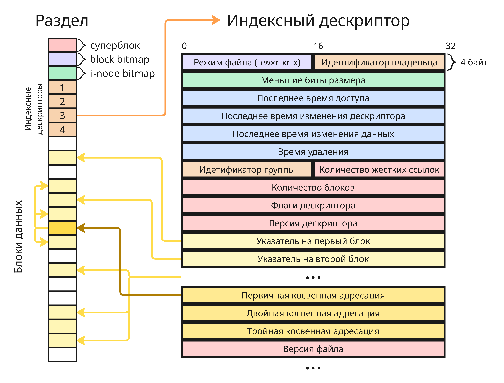
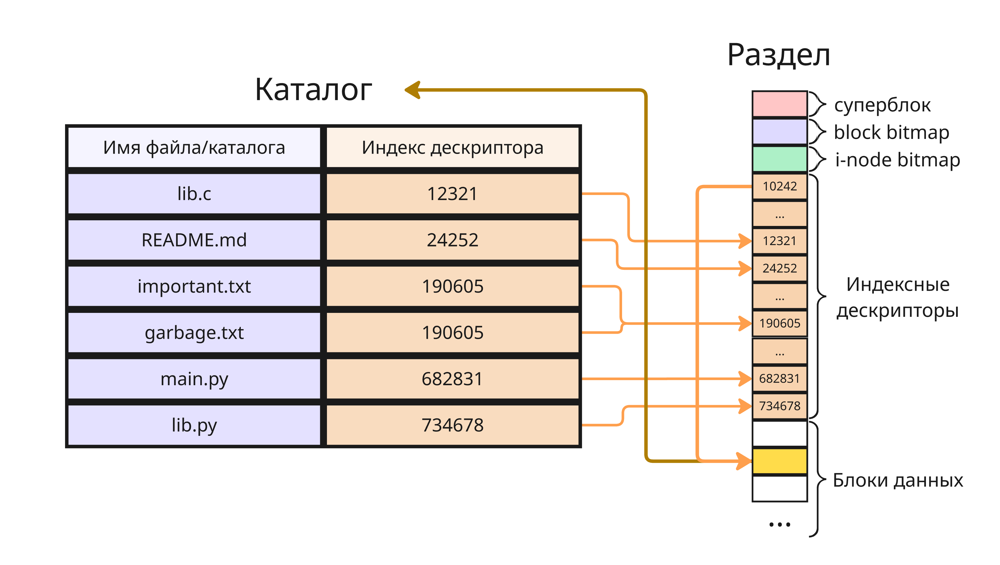
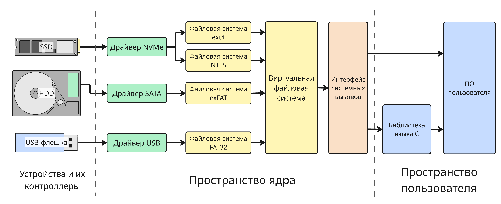
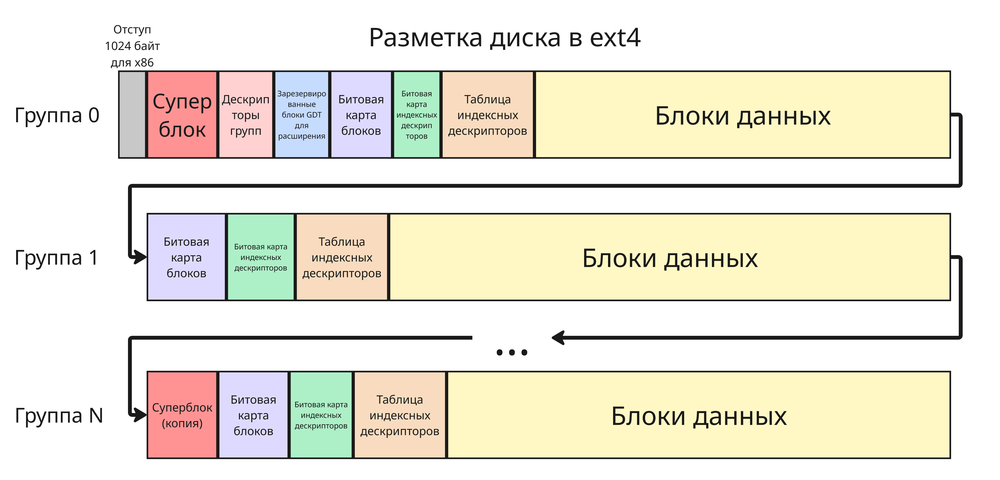
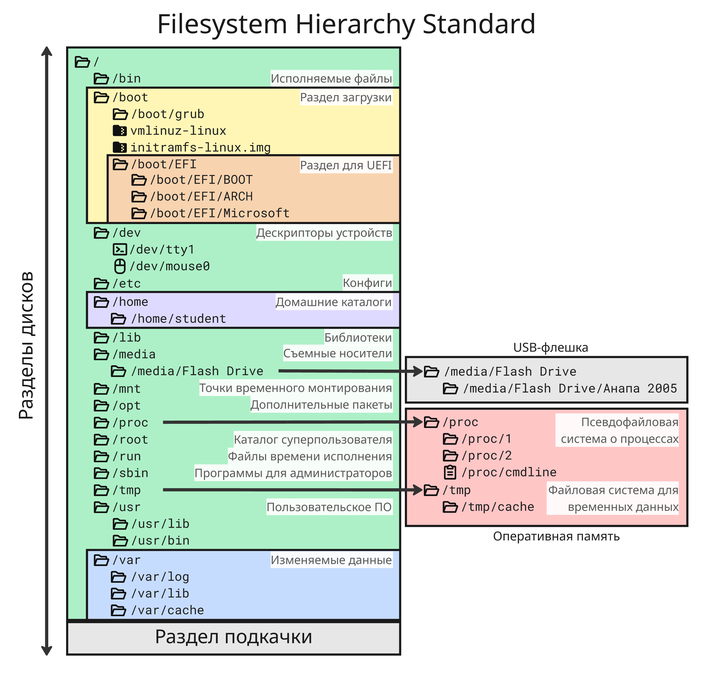
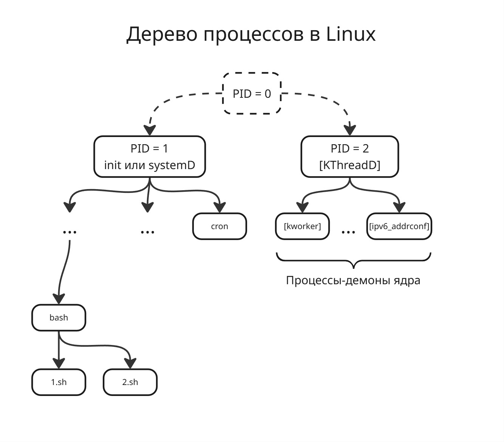
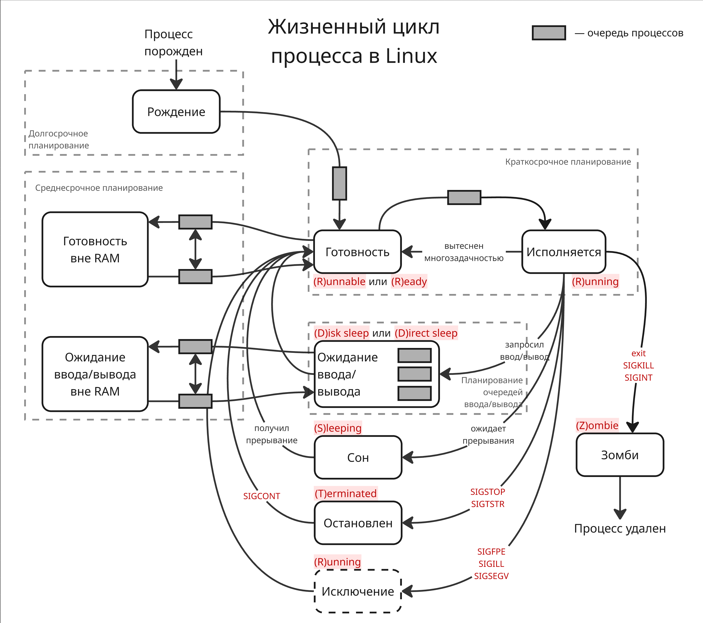
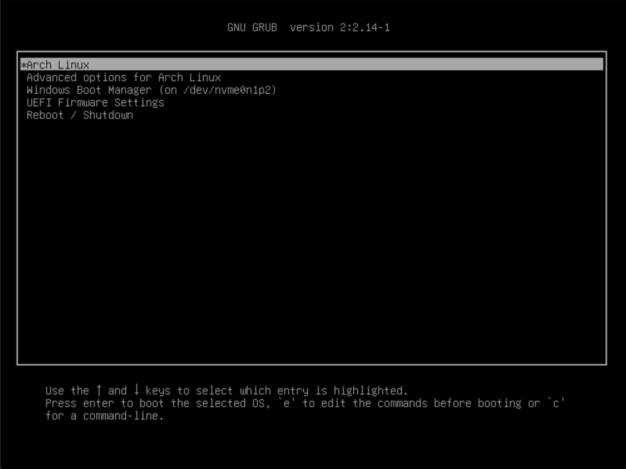
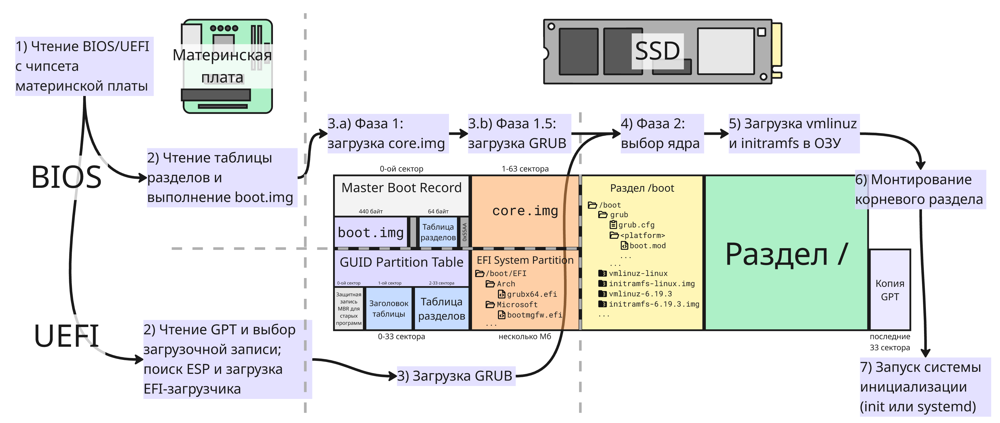

<!-- This file is generated by assets.build.markdown.superconspect_builder. All changes to it will be lost -->


# <a name="%D0%B0%D0%B4%D0%BC%D0%B8%D0%BD%D0%B8%D1%81%D1%82%D1%80%D0%B8%D1%80%D0%BE%D0%B2%D0%B0%D0%BD%D0%B8%D0%B5-%D0%B2-%D0%BE%D1%81-linux"></a> Администрирование в ОС Linux

* [Администрирование в ОС Linux](#%D0%B0%D0%B4%D0%BC%D0%B8%D0%BD%D0%B8%D1%81%D1%82%D1%80%D0%B8%D1%80%D0%BE%D0%B2%D0%B0%D0%BD%D0%B8%D0%B5-%D0%B2-%D0%BE%D1%81-linux)
  * [Лекция 1. Введение в Linux](#%D0%BB%D0%B5%D0%BA%D1%86%D0%B8%D1%8F-1.-%D0%B2%D0%B2%D0%B5%D0%B4%D0%B5%D0%BD%D0%B8%D0%B5-%D0%B2-linux)
  * [Лекция 2. Файлы и права доступа](#%D0%BB%D0%B5%D0%BA%D1%86%D0%B8%D1%8F-2.-%D1%84%D0%B0%D0%B9%D0%BB%D1%8B-%D0%B8-%D0%BF%D1%80%D0%B0%D0%B2%D0%B0-%D0%B4%D0%BE%D1%81%D1%82%D1%83%D0%BF%D0%B0)
  * [Лекция 3. Файловые системы](#%D0%BB%D0%B5%D0%BA%D1%86%D0%B8%D1%8F-3.-%D1%84%D0%B0%D0%B9%D0%BB%D0%BE%D0%B2%D1%8B%D0%B5-%D1%81%D0%B8%D1%81%D1%82%D0%B5%D0%BC%D1%8B)
  * [Лекция 4. Процессы, часть I](#%D0%BB%D0%B5%D0%BA%D1%86%D0%B8%D1%8F-4.-%D0%BF%D1%80%D0%BE%D1%86%D0%B5%D1%81%D1%81%D1%8B%2C-%D1%87%D0%B0%D1%81%D1%82%D1%8C-i)
    * [Создание процесса](#%D1%81%D0%BE%D0%B7%D0%B4%D0%B0%D0%BD%D0%B8%D0%B5-%D0%BF%D1%80%D0%BE%D1%86%D0%B5%D1%81%D1%81%D0%B0)
    * [Жизненный цикл процесса](#%D0%B6%D0%B8%D0%B7%D0%BD%D0%B5%D0%BD%D0%BD%D1%8B%D0%B9-%D1%86%D0%B8%D0%BA%D0%BB-%D0%BF%D1%80%D0%BE%D1%86%D0%B5%D1%81%D1%81%D0%B0)
    * [Завершение процесса](#%D0%B7%D0%B0%D0%B2%D0%B5%D1%80%D1%88%D0%B5%D0%BD%D0%B8%D0%B5-%D0%BF%D1%80%D0%BE%D1%86%D0%B5%D1%81%D1%81%D0%B0)
    * [Демоны](#%D0%B4%D0%B5%D0%BC%D0%BE%D0%BD%D1%8B)
  * [Лекция 5. Процессы, часть II](#%D0%BB%D0%B5%D0%BA%D1%86%D0%B8%D1%8F-5.-%D0%BF%D1%80%D0%BE%D1%86%D0%B5%D1%81%D1%81%D1%8B%2C-%D1%87%D0%B0%D1%81%D1%82%D1%8C-ii)
    * [Сигнал](#%D1%81%D0%B8%D0%B3%D0%BD%D0%B0%D0%BB)
    * [Планирование процессов](#%D0%BF%D0%BB%D0%B0%D0%BD%D0%B8%D1%80%D0%BE%D0%B2%D0%B0%D0%BD%D0%B8%D0%B5-%D0%BF%D1%80%D0%BE%D1%86%D0%B5%D1%81%D1%81%D0%BE%D0%B2)
    * [Псевдофайловая система `/proc/`](#%D0%BF%D1%81%D0%B5%D0%B2%D0%B4%D0%BE%D1%84%D0%B0%D0%B9%D0%BB%D0%BE%D0%B2%D0%B0%D1%8F-%D1%81%D0%B8%D1%81%D1%82%D0%B5%D0%BC%D0%B0-%60%2Fproc%2F%60)
  * [Лекция 6. Загрузка ОС Linux](#%D0%BB%D0%B5%D0%BA%D1%86%D0%B8%D1%8F-6.-%D0%B7%D0%B0%D0%B3%D1%80%D1%83%D0%B7%D0%BA%D0%B0-%D0%BE%D1%81-linux)
    * [Загрузка BIOS/UEFI](#%D0%B7%D0%B0%D0%B3%D1%80%D1%83%D0%B7%D0%BA%D0%B0-bios%2Fuefi)
    * [Загрузчик GRUB](#%D0%B7%D0%B0%D0%B3%D1%80%D1%83%D0%B7%D1%87%D0%B8%D0%BA-grub)
      * [BIOS](#bios)
      * [UEFI](#uefi)
    * [Загрузка ядра](#%D0%B7%D0%B0%D0%B3%D1%80%D1%83%D0%B7%D0%BA%D0%B0-%D1%8F%D0%B4%D1%80%D0%B0)
    * [Система инициализации](#%D1%81%D0%B8%D1%81%D1%82%D0%B5%D0%BC%D0%B0-%D0%B8%D0%BD%D0%B8%D1%86%D0%B8%D0%B0%D0%BB%D0%B8%D0%B7%D0%B0%D1%86%D0%B8%D0%B8)

<!-- begin admlinux_2026_02_06.md -->
> **Операционная система** - это базовое системное программное обеспечение, управляющее работой вычислительного узла и реализующее универсальный интерфейс между аппаратным обеспечением, программным обеспечением и пользователем

Возможности по изменению аппаратного обеспечения часто ограничены, поэтому на практике стремятся извлечь максимальную производительность и гибкость за счёт программного обеспечения и грамотного администрирования ОС

Курс разделен на несколько блоков:

1. Работа с файлами
2. Файловые системы
3. Процессы и управление ресурсами
4. Межпроцессорное взаимодействие
5. Загрузка операционной системы
6. Механизмы контейнеризации
7. Управление пользовательским ПО
8. Графические среды

## <a name="%D0%BB%D0%B5%D0%BA%D1%86%D0%B8%D1%8F-1.-%D0%B2%D0%B2%D0%B5%D0%B4%D0%B5%D0%BD%D0%B8%D0%B5-%D0%B2-linux"></a> Лекция 1. Введение в Linux

> **Linux** (в части случаев GNU/Linux) - это семейство открытых и свободных Unix-подобных операционных систем на базе ядра Linux, включающих набор утилит и программ проекта GNU, а также другие системные и прикладные компоненты

Linux начал своё развитие в 1991 году, когда Линус Торвальдс, будучи студентом Хельсинкского университета, опубликовал первую версию ядра Linux как учебный и исследовательский проект

Со временем вокруг ядра Linux сформировалось большое сообщество разработчиков, а сам Linux стал использоваться в серверах, настольных системах, мобильных и других устройствах

Разделяют бесплатное ПО, открытое ПО и свободное ПО

Бесплатное ПО (Freeware) - программное обеспечение, распространяющееся бесплатно конечному пользователю в виде исполняемых файлов

Открытое ПО (Open-Source Software) - программное обеспечение с открытым исходным кодом, чаще всего распространяющимся по [разрешительной лицензии](https://pelmesh619.github.io/itmo_conspects/devtools/devtools_superconspect.html#%D0%BE%D1%82%D0%BA%D1%80%D1%8B%D1%82%D0%BE%D0%B5-%D0%BF%D0%BE)

Свободное ПО (Free and Open-Source Software, FOSS) - открытое программное обеспечение, лицензия которого заставляет авторов производных от него работ лицензировать их под той же [свободной лицензией](https://pelmesh619.github.io/itmo_conspects/devtools/devtools_superconspect.html#%D1%81%D0%B2%D0%BE%D0%B1%D0%BE%D0%B4%D0%BD%D0%BE%D0%B5-%D0%BF%D0%BE)

Linux является свободным программным обеспечением и распространяется под лицензией **GNU General Public License 2.0**. Это означает, что операционная система Linux гарантирует пользователю 4 свободы, сформулированные Ричардом Столлманом, основателем проекта GNU:

* Свобода запускать программу в любых целях (свобода 0).
* Свобода изучения работы программы и адаптация её к вашим нуждам (свобода 1). Доступ к исходным текстам является необходимым условием.
* Свобода распространять копии, так что вы можете помочь вашему товарищу (свобода 2).
* Свобода улучшать программу и публиковать ваши улучшения, так что всё общество выиграет от этого (свобода 3). Доступ к исходным текстам является необходимым условием.

Лицензия GNU General Public License 2.0 накладывает обязательство на то, что производные работы также должны распространяться на условиях этой лицензии

Linux включает набор утилит и программ GNU, такие как Bash или GNU Compiler Collection, которые тоже являются свободным ПО

Linux распространяется не только в виде ядра, но и в виде *дистрибутивов* - готовых комплектов программного обеспечения, включающих ядро, системные утилиты, менеджер пакетов, установщик и часто графическую среду. Сейчас популярные дистрибутивы - это Debian, Ubuntu, Fedora, Arch Linux и другие

Дистрибутивы Linux бесплатные, но не все. Так, например, Red Hat Enterprise Linux распространяется по платной модели, имея открытый код, но за плату предлагается расширенная корпоративная поддержка и сервис

---

Ключевые отличия свободного ПО и проприетарного ПО заключаются:

* *В доступу к исходному коду*

* *В модели поддержки*. В свободном ПО поддержка часто осуществляется сообществом или сторонними компаниями, а в проприетарном ПО - официальным производителем

* *В поиске и исправлении уязвимостей*. Открытый код позволяет независимый аудит безопасности, тогда как при использовании проприетарного ПО пользователь вынужден доверять разработчику

* *В гибкости и кастомизации*. Свободное ПО можно модифицировать под конкретные нужды, проприетарное, как правило, нет

---

Долгое время наиболее популярной настольной операционной системой остаётся Microsoft Windows. Рассмотрим ключевые концептуальные отличия Linux от Windows:

* Работа с файлами

    В Linux все объекты, в том числе файлы, сетевые сокеты, устройства, каналы, - это файловые дескрипторы, поэтому взаимодействие с ними осуществляется через файловую систему

    В Windows пользователь чаще взаимодействует с действиями и приложениями, а не с абстрактными объектами файловой системы

* Иерархия файловой системы

    Linux использует единую иерархию каталогов, начинающуюся с корня `/`, тогда как в Windows используется несколько корней: диски `C:`, `D:` и так далее

* Права доступа

    В Linux строгая модель прав доступа: владелец, группа и остальные; В Windows используется модель NTFS-разрешений, менее прозрачная для пользователя.

* Обновления и установка ПО

    В Linux программное обеспечение обычно устанавливается из централизованных репозиториев через менеджеры пакетов. В Windows чаще используются отдельные установщики для каждого приложения
<!-- end admlinux_2026_02_06.md -->

<!-- begin admlinux_2026_02_13.md -->
## <a name="%D0%BB%D0%B5%D0%BA%D1%86%D0%B8%D1%8F-2.-%D1%84%D0%B0%D0%B9%D0%BB%D1%8B-%D0%B8-%D0%BF%D1%80%D0%B0%D0%B2%D0%B0-%D0%B4%D0%BE%D1%81%D1%82%D1%83%D0%BF%D0%B0"></a> Лекция 2. Файлы и права доступа

В Linux и других Unix-подобных системах все объекты являются файловыми дескрипторами, то есть все действия совершаются через универсальный интерфейс

Файловый дескриптор - это идентификатор, за которым закреплен определенный поток ввода и вывода. Через файловые дескрипторы в Linux можно работать:

* с устройствами
* с процессами
* с файлами и каталогами в памяти хранилища
* и с другими объектами

Получаем единый набор операций с файловым дескриптором: открытие, чтение, запись и закрытие

Всего можно выделить 7 типов файлов:

* Регулярный файл

    Регулярный файл - это файл в обычном его понимании, то есть именованная область памяти хранилища, которая структурирована иерархически

    По умолчанию, Linux рекомендует использовать файловую систему ext4, которая использует индексные дескрипторы. Поэтому на диске файл представлен индексным дескриптором в начале блочного устройства

    

    Когда файл создается, в таблице индексных дескрипторов появляется индексный дескриптор файла. При записи операционная система выделяет новые блоки на блочном устройстве и добавляет ссылки на эти блоки в индексном дескрипторе, а при удалении удаляется индексный дескриптор

    При этом файл в Linux не хранит свое имя - это ответственность каталога

* Каталог

    Каталог - это таблица, содержащая имя файла, его индексный дескриптор и опционально другие данные. В разных операционных системах применяет разная терминология, в Windows применяется офисный термин "папка" (folder), а в Linux каталоги называются директориями (directory)

    Каталоги позволяют задавать иерархическую структуру на блочном устройстве. Так как это таблица, где ключ - это имя файла или каталога, нельзя создать в одном каталоге файл и каталог с одним и тем же именем

    

    Linux позволяет создавать не просто файлы в каталоге, а жесткие ссылки на файлы в каталоге. При создании жесткой ссылки:

    ```bash
    ln исходный_файл новый_файл
    ```

    Файлы `исходный_файл` и `новый_файл` будут иметь те же содержимое и индексный дескриптор, однако храниться в разных каталогах одновременно. Удаление одного из них не приведет к потери ссылок на блоки, где хранятся данные. Чтобы удалился сам индексный дескриптор, нужно, что бы счетчик жестких ссылок достиг нуля

    Жесткие ссылки нельзя создавать:

    * на каталоги, так как в этом случае может получиться циклическая зависимость, из-за чего рекурсивные алгоритмы для работы с файловым деревом ломаются
    * в каталогах, находящихся в разных файловых системах (то есть в разных разделах или устройствах), так как они имеют разные таблицы с индексными дескрипторами или же не иметь вовсе таковой (как, например, в системе FAT)

* Символическая (или мягкая) ссылка

    Символическая ссылка (symlink или softlink) - это еще один тип файла, который внутри хранит путь до другого файла в файловой системе. При обращении путь к ссылке подменяется операционной системой на содержащийся внутри путь файла, что позволяет обойти ограничения, связанные с жесткой ссылкой

    Символическая ссылка может быть сломанной или битой, если она указывает на файл или каталог, который не существует

    Символическую ссылку можно сделать с помощью команды `ln`:

    ```bash
    ln -s исходный_файл имя_ссылки
    ```

* Файлы-дырки

    Файлы-дырки (filehole) не хранят ничего на жестком диске компьютера непосредственно, однако с помощью них осуществляется доступ к подключенным устройствам и объектам операционном системы

    Файлами-дырками могут быть:

    * сокеты - объекты для сетевой коммуникации компьютеров
    * именованные каналы (также пайп) - очереди символов для передачи данных между процессами
    * блочные устройства - устройства, в которых данные хранятся блоками, например жесткие диски, флешки, DVD и так далее
    * символьные устройства - такие устройства, как мышь, консоль и другие

    Особое место занимает каталог `/dev/`. В нем содержатся все устройства, в том числе виртуальные, к которым операционная система имеет доступ. Есть два типа организации этого каталога:

    * Статическая - в этом случае список подключаемых устройств известен заранее, поэтому ядро имеет все нужны драйвера, а системный администратор вручную заводит файловый дескриптор в `/dev/` для каждого устройства
    * Динамическая - в этом случае ядро автоматически загружает необходимый драйвер для устройства и создает файловый дескриптор, по сути аналог Plug-and-Play от Microsoft

    Так `/dev/` содержит:

    * `/dev/console` - консоль для вывода системных сообщений при запуске и завершении системы
    * `/dev/tty` - консоль текущего процесса
    * `/dev/tty1`, `/dev/tty2`, ... - виртуальные консоли, доступные через Ctrl+Alt+F1 и так далее
    * `/dev/sda` (аналогично `/dev/sd+буква`) - жесткий диск, подключенный через SATA
    * `/dev/nvme0n1` (аналогично `/dev/nvme0n+цифра`) - твердотельный накопитель с технологией NVMe, в данном случае `nvme0` - это номер PCIe-шины
    * `/dev/nvme0n1p1` - первый раздел на этом накопителе

    * `/dev/fb0` - буфер кадра в видеопамяти графического процессора
    * `/dev/mouse0` - мышь
    * `/dev/null` - канал, в который можно перевести символьный поток (например, вывод процесса), чтобы уничтожить его
    * `/dev/zero` - поток, который генерирует нули
    * `/dev/random` - поток, который генерирует рандомные символы
    * `/dev/full` - поток, который возвращает ошибку "Недостаточно места"

    Каждый процесс (кроме демонов) при создании получает 3 символьных файловых дескриптора: стандартный поток ввода с номером `0`, стандартный поток вывода с номером `1` и стандартный поток ошибок с номером `2`. На них есть символические ссылки `/dev/stdin`, `/dev/stdout` и `/dev/stderr`

---

Используя команду `ls -l`, можно посмотреть на информацию о файлах в каталоге, например:

```bash
crw-r--r--   1 root      root       10,   235 Feb 13 17:59 autofs
drwxr-xr-x   2 root      root             180 Feb 13 17:59 block
crw-rw----   1 root      disk       10,   234 Feb 13 17:59 btrfs-control
drwxr-xr-x   3 root      root              60 Feb 13 17:59 bus
drwxr-xr-x   2 root      root            4920 Feb 13 17:59 char
crw-------   1 root      root        5,     1 Feb 13 17:59 console
lrwxrwxrwx   1 root      root              11 Feb 13 17:59 core -> /proc/kcore
drwxr-xr-x  14 root      root             280 Feb 13 17:59 cpu
crw-------   1 root      root       10,   259 Feb 13 17:59 cpu_dma_latency
```

Первый столбец обозначает тип файла и его модификаторы доступа. Первая буква - это тип файла, так:

* `-` - это регулярный файл
* `d` - это директория (от directory)
* `l` - это символическая ссылка (от link)
* `s` - это сокет (от socket)
* `b` - это блочное устройство (от block)
* `c` - это символьное устройство (от character)
* `p` - это именованный канал (от pipe)

Следующие 9 букв задают права доступа для файла. В Linux действует [ролевая модель доступа](https://pelmesh619.github.io/itmo_conspects/databases/databases_superconspect.html#role_access_control), поэтому есть такие понятия:

* Пользователь файла (User) - его непосредственный владелец, тот, кто создал файл
* Группа владельца файла (Group) - другие пользователи, входящие в ту же группу
* Все остальные пользователи в системе (Other)

Так модификаторы доступа делятся на три тройки букв, каждая тройка из которых показывает права для определенной выборки пользователей

* Буква `r` - право на чтение файла или чтение имен файлов внутри каталога
* Буква `w` - право на запись в файл
* Буква `x` - право на исполнение файла или чтение свойств файлов внутри каталога

Так `-rwxr-xr-x` означает регулярный файл, читать и исполнять который могут все, а записывать только владелец

Права доступа проверяются слева направо. Так, если файл имеет права `----r-xr-x`, то его владелец не сможет с ним ничего сделать, несмотря на то, что он находится в группе файла

Помимо этих 9 модификаторов есть еще 3 скрытых:

* SUID (Set User ID upon execution) - пользователи, которые могут запустить выполнение файл, запускают его с правами владельца. Для каталогов этот флаг ничего не делает. В `ls -l` обозначается как `--s------` (если установлен `x` для владельца) или `--S------`
* SGID (Set Group ID upon execution) - пользователи, которые могут запустить выполнение файл, запускают его с правами группы владельца. Для каталог этот флаг означает то, что новые файлы создают с той же группой, которая привязана к каталогу, а не основной группой для пользователя. В `ls -l` обозначается как `-----s---` (если установлен `x` для пользователей группы) или `-----S---`

    Биты SUID и SGID полезны для осуществления особых ограничений на файлы. Например, если в системе зарегистрированы пользователи, чьи пароли хранятся в недоступном ими файле, то можно сделать скрипт с битом SUID, которым владеет суперпользователь, и который только изменяет пароль в файле пользователя, который его вызвал

* T-бит или липкий бит (Sticky Bit) - файлы в каталоге, имеющем липкий бит, могут быть удалены или переименованы только владельцем файла. В `ls -l` обозначается как `--------t` (если установлен `x` для остальных пользователей) или `--------T`

    В ранних версиях ядра липкий бит использовался на исполняемых программах. Тогда было непозволительно долго ждать, когда программа, закончившая исполнение пару минут назад, снова загружалась в оперативную память. Поэтому программы с липким битом при первом исполнении загружались в оперативную память, а после завершения память не высвобождалась, благодаря чему при следующем исполнении ядро могло назначить эту область память процессу и не загружать программу повторно

Права можно установить для файла с помощью команды `chmod` (от change mode):

```bash
chmod права файл
```

Права указываются:

* В двоичном формате, так, `101101000` означает `r-xr-x---`, при этом 10-ый бит предназначен для T-бита, 11-ый бит - для SGID, 12-ый бит - для SUID
* В восьмеричном формате, например, `754` означает `rwxr-xr--`, `2555` означает `r-xr-sr-x`
* В символьном формате, то есть `rwxr-xr--`
* С указанием выборки пользователей. Например:

    * `chmod u+x file` добавляет право на исполнение файла владельцу
    * `chmod u+w,o-w file` добавляет право на запись владельцу и убирает право на запись пользователям вне группы
    * `chmod g+s file` добавляет флаг SUID
    * `chmod o+s file` добавляет флаг Sticky Bit
    * `chmod g=rx file` устанавливает права на чтение и запись группе вместо тех права, что были до этого

Второй столбец - это число жесткий ссылок на файл

Третий столбец из вывода `ls -l` указывает на владельца файла, а четвертый - на группу владельца (так как пользователь может состоять в нескольких группах). Сменить владельца можно с помощью команды `chown` (от change owner):

```bash
# меняет владельца на pelmeshke
chown pelmeshke /var/log/mylogs/app.log

# меняет владельца на pelmeshke и группу на supercoolusers
chown pelmeshke:supercoolusers /var/log/mylogs/app.log

# меняет владельца на pelmeshke рекурсивно 
# для всех файлов и каталогов в /var/log/mylogs
chown -R pelmeshke /var/log/mylogs/
```

По умолчанию, при создании пользователя в Linux ядро создает группу с таким же именем. Для смены группы файла есть команда `chgrp` (от change group):

```bash
# меняет группу на supercoolusers
chgrp supercoolusers /var/log/mylogs/app.log
```
<!-- end admlinux_2026_02_13.md -->

<!-- begin admlinux_2026_02_20.md -->
## <a name="%D0%BB%D0%B5%D0%BA%D1%86%D0%B8%D1%8F-3.-%D1%84%D0%B0%D0%B9%D0%BB%D0%BE%D0%B2%D1%8B%D0%B5-%D1%81%D0%B8%D1%81%D1%82%D0%B5%D0%BC%D1%8B"></a> Лекция 3. Файловые системы

Файловая система - это способ организации информации на носителе данных

Файловая система выполняет такие функции:

* Организацию хранения данных
* Управление доступом
* Учет и распределение дискового пространства
* Обеспечение целостности
* Поддержка операций ввода-вывода

Файловая система является посредником в общении между пользователем, использующим ОС, и жестким диском

Позднее число файловых систем стало настолько большим, что в архитектуре операционных систем стала появляется виртуальная файловая система - стандартизованный интерфейс между системными вызовами и конкретной файловой системой



---

Файловые системы могут использовать множество методов организации:

1. Линейное размещение
2. Связный список
3. Таблица аллокаций файлов
4. Индексные дескрипторы

Подробнее об этом описано в курсе ["Операционные системы"](https://pelmesh619.github.io/itmo_conspects/opersys/opersys_superconspect.html#-%D0%BB%D0%B5%D0%BA%D1%86%D0%B8%D1%8F-14-%D1%84%D0%B0%D0%B9%D0%BB%D0%BE%D0%B2%D0%B0%D1%8F-%D1%81%D0%B8%D1%81%D1%82%D0%B5%D0%BC%D0%B0)

Современные операционные системы используют файловые системы с индексными дескрипторами для дисков, на которых установлена система. Так, Windows использует NTFS (New Technology File System), а для Linux рекомендуется ext4 (от Fourth Extended, Четвертая расширенная файловая система)

В файловой системе ext4 в начале блочного устройства есть участок с названием суперблок (Superblock). Суперблок - это структура, состоящая из данных, которые определяют организацию данных:

| Поле                       | Тип данных  | Назначение                                  |
| -------------------------- | ----------- | ------------------------------------------- |
| `s_inodes_count`           | `__le32`    | Общее количество индексных дескрипторов     |
| `s_blocks_count_lo`        | `__le32`    | Общее количество блоков (младшие 32 бита)   |
| `s_r_blocks_count_lo`      | `__le32`    | Зарезервированные блоки (младшие 32 бита)   |
| `s_free_blocks_count_lo`   | `__le32`    | Свободные блоки (младшие 32 бита)           |
| `s_free_inodes_count`      | `__le32`    | Количество свободных индексных дескрипторов |
| `s_first_data_block`       | `__le32`    | Первый блок данных                          |
| `s_log_block_size`         | `__le32`    | Логарифм размера блока в килобайтах по основанию 2       |
| `s_log_cluster_size`       | `__le32`    | Логарифм размера кластера в килобайтах по основанию 2    |
| `s_blocks_per_group`       | `__le32`    | Блоков в группе                             |
| `s_clusters_per_group`     | `__le32`    | Кластеров в группе                          |
| `s_inodes_per_group`       | `__le32`    | Индексных дескрипторов в группе             |
| `s_mtime`                  | `__le32`    | Время последнего монтирования               |
| `s_wtime`                  | `__le32`    | Время последней записи                      |
| `s_mnt_count`              | `__le16`    | Счётчик монтирований после проверки диска   |
| `s_max_mnt_count`          | `__le16`    | Максимальное число монтирований, после который нужна проверка диска |
| `s_magic`                  | `__le16`    | Магическое число, для ext4 - это `0xEF53`   |
| `s_state`                  | `__le16`    | Состояние файловой системы                  |
| `s_errors`                 | `__le16`    | Поведение при ошибках                       |
| `s_minor_rev_level`        | `__le16`    | Минорная версия                             |
| `s_lastcheck`              | `__le32`    | Время последней проверки                    |
| `s_checkinterval`          | `__le32`    | Интервал проверки                           |
| `s_creator_os`             | `__le32`    | Операционная система, создавшая раздел (Linux - это `0x0000`, FreeBSD - это `0x0003`) |
| `s_first_ino`              | `__le32`    | Первый незарезервированный индексный дескриптор |
| `s_inode_size`             | `__le16`    | Размер индексного дескриптора (обычно 256 байт) |
| `s_block_group_nr`         | `__le16`    | Номер группы (для копии суперблока)         |
| `s_uuid`                   | `__u8[16]`  | UUID файловой системы                       |
| `s_volume_name`            | `char[16]`  | Имя тома                                    |

... и много других

Здесь `__le16`, `__le32` - беззнаковые целые числа, записанные в Little-endian, размером 16 бит и 32 бита соответственно, `__u8[16]` - 16-байтный массив беззнаковый 8-битных чисел, а `char[16]` - символьная последовательность

> Источник: <https://docs.kernel.org/next/filesystems/ext4/super.html>

Со временем появилась идея размещать блоки больших файлов рядом друг с другом, чтобы уменьшать движение читающей головки жесткого диска по секторам

Для решения этого появились группы блоков. Группы содержат свои битовые карты, таблицы индексных дескрипторов и блоки данных

Первая группа под индексом 0 хранит суперблок и таблицу дескрипторов блочных групп (Block Group Descriptors) - структуры с данными полями:

| Поле                      | Тип данных | Назначение                                  |
| ------------------------- | ---------- | ------------------------------------------- |
| `bg_block_bitmap_lo`      | `__le32`   | Номер блока битовой карты блоков (младшие 32 бита) |
| `bg_inode_bitmap_lo`      | `__le32`   | Номер блока битовой карты дескрипторов (младшие 32 бита)  |
| `bg_inode_table_lo`       | `__le32`   | Первый блок таблицы индексных дескрипторов (младшие 32 бита) |
| `bg_free_blocks_count_lo` | `__le16`   | Количество свободных блоков в группе        |
| `bg_free_inodes_count_lo` | `__le16`   | Количество свободных дескрипторов в группе         |
| `bg_used_dirs_count_lo`   | `__le16`   | Количество каталогов в группе               |
| `bg_flags`                | `__le16`   | Флаги состояния группы                      |
| `bg_exclude_bitmap_lo`    | `__le32`   | Блок битовой карты снимков исключения (Exclusion Snapshot)          |
| `bg_block_bitmap_csum_lo` | `__le16`   | Контрольная сумма битовой карты блоков                  |
| `bg_inode_bitmap_csum_lo` | `__le16`   | Контрольная сумма битовой карты дескрипторов            |
| `bg_itable_unused_lo`     | `__le16`   | Количество неинициализированных индексных дескрипторов  |
| `bg_checksum`             | `__le16`   | Контрольная сумма дескриптора группы        |

... и другие поля

Последующие группы могут хранить также избыточные копии суперблока и таблицы дескрипторов групп, но система будет обращаться к ним в том случае, если начало диска было повреждено

> Источник: <https://docs.kernel.org/next/filesystems/ext4/group_descr.html>

Далее идет битовая карта блоков (Block Bitmap). В ней один бит, равный 1, обозначает, занят ли конкретный блок с тем же индексом

Затем расположена подобная битовая карта для индексных дескрипторов (Inode Bitmap), где бит 1 обозначает, занят ли индексный дескриптор в таблице дескрипторов

> Источник: <https://docs.kernel.org/next/filesystems/ext4/bitmaps.html>

После этого расположена сама таблица индексных дескрипторов. Таблица представляет собой массив дескрипторов, где индекс - это номер индексного дескриптора

Для специальных индексных дескрипторов выделены особые индексы:

* `0` для дескриптора, который не существует
* `1` для списка бракованных блоков
* `2` для корневого каталога `/`
* `3` для пользовательской квоты
* `4` для квоты групп

    Квоты хранят информацию о том, сколько разрешено максимально иметь дескрипторов и/или блоков пользователям и группам

* `5` для загрузчика. Сейчас он редко используется, так как рекомендуется устанавливать загрузчик на другой раздел диска
* `6` для каталога восстановления
* `7` для зарезервированной группы дескрипторов для увеличения количества дескрипторов файловой системы
* `8` для журнала, чтобы обеспечивать надежность данных во время сбоя

9-ый и 10-ый дескрипторы зарезервированы и используются для функций, который обозначены `?` в документации, а 11-ый дескриптор - первый не зарезервированный, но обычно используется для каталога `/lost+found/`, который предназначен для восстановленный утилитой `fsck` файлов после сбоя

> Источник: <https://www.kernel.org/doc/html//latest/filesystems/ext4/special_inodes.html>

Наконец, после таблицы индексных дескрипторов дальше идут сами блоки данных



---

В файловой системе ext3 добавилась система журналирования - способ восстановления данных в результате нештатной работы ОС или диска

Всего есть три типа журналов в ext3:

1. Journal - самый медленный, но самый надежный журнал. Сначала в журнал пишутся блоки данных, потом они копируются в нужное место, а дескриптор изменяется
2. Ordered - то же самое, но записываем только метаданные файла, что быстрее
3. Writeback - сначала пишем весь файл, а потом изменяем все метаданные в дескрипторе и журнале

В системе ext4 добавилось много новых функций, которые убирали ограничения старых версий системы:

* Экстенты вместо блочной адресации

    Вместо хранения списка отдельных блоков используются экстенты, что уменьшает фрагментацию и ускоряет работу с большими файлами

* Поддержка больших файлов (до 16 Тб в стандартной конфигурации) и файловой системы (теоретически до 1 Эб)
* Отложенное выделение блоков - блоки выделяются не сразу при записи, а позже, что улучшает размещение данных и снижает фрагментацию
* Контрольные суммы журнала уменьшают риск повреждения данных при сбоях
* Возможность дефрагментации без размонтирования файловой системы
* Можно увеличить размер файловой системы во время работы диска
* Предварительное выделение места для файлов
* Метки времени с точностью до наносекунд, тогда как в ext3 только до секунд
* Индексация больших каталогов с использованием хеш-дерева

---

Хорошей практикой является разделение диска на 6 разделов:

* Раздел для EFI (Extensible Firmware Interface), который хранит загрузчики (например, GRUB) и отформатирован в файловую систему FAT
* Раздел для каталога `/boot/`, хранящий ядро и `initramfs`
* Раздел для корневого каталога `/`
* Раздел для файла подкачки
* Раздел для домашнего каталога `/home/`
* И раздел для каталога `/var/`, содержащего изменяемые файлы

В корневом каталоге Linux создает множество подкаталогов для работы системы, структура которых подчиняется стандарту (FHS) Filesystem Hierarchy Standard:

* `/bin/` - каталог с готовыми к исполнению основными программами (например, `/bin/bash`). Оболочки, такие как bash, ищут исполняемые файлы с именем там
* `/sbin/` - системные исполняемые файлы для администрирования (например, `fsck`, `mount`), которые обычно предназначены для суперпользователя
* `/boot/` - файлы, необходимые для загрузки системы: ядро Linux, `initramfs`, конфигурация загрузчика
* `/dev/` - файловые дескрипторы устройств
* `/etc/` (от Editable Text Configuration или Extended Tool Chest) - системные конфигурационные файлы такие, как настройки служб, сети, пользователей и всей системы

* `/home/` - домашние каталоги обычных пользователей
* `/root/` - домашний каталог суперпользователя

* `/lib/`, `/lib64/` - системные библиотеки, необходимые для работы программ из `/bin/` и `/sbin/`
* `/media/` - точки монтирования съемных носителей
* `/mnt/` - временное монтирование файловых систем администратором
* `/opt/` - дополнительные пакеты
* `/proc/` - виртуальная файловая система с информацией о процессах и ядре, создающаяся динамически
* `/sys/` - виртуальная файловая система с информацией о устройствах и драйверах.
* `/run/` - временные данные времени выполнения, например, текущие вошедшие пользователи или запущенные демоны
* `/tmp/` - временные файлы, которые очищаются после перезагрузки. В некоторых случаях каталог `/tmp/` может храниться непосредственно в оперативной памяти

* `/usr/` - пользовательские программы и данные (большинство установленного ПО):

    * `/usr/bin` - программы
    * `/usr/lib` - библиотеки
    * `/usr/src/` - исходный код
    * `/usr/share` - общие данные, которые не зависят от архитектуры

* `/var/` - изменяемые данные, такие как:
    * `/var/log/` - логи
    * `/var/lib/` - персистентная информация программ (например, базы данных)
    * `/var/lock/` - блокировки ресурсов
    * `/var/cache/` - кэш
    * `/var/spool/` - очереди печати, почтовых запросов и так далее
    * `/var/mail/` - данные почтовых серверов
    * `/var/tmp/` - временные файлы, которые нужно сохранить после перезагрузки


<!-- end admlinux_2026_02_20.md -->

<!-- begin admlinux_2026_03_06.md -->
## <a name="%D0%BB%D0%B5%D0%BA%D1%86%D0%B8%D1%8F-4.-%D0%BF%D1%80%D0%BE%D1%86%D0%B5%D1%81%D1%81%D1%8B%2C-%D1%87%D0%B0%D1%81%D1%82%D1%8C-i"></a> Лекция 4. Процессы, часть I

> Процесс - совокупность набора исполняемых команд, ассоциированных с ним ресурсов и контекста исполнения, находящиеся под управлением операционной системы

Сам же процесс в Linux хранится структурой `task_struct` с множеством полей, таких как:

* Идентификатор процесса (PID, Process ID)
* Идентификатор группы потоков (TGID, Thread Group ID). Для главного потока равен идентификатору процесса
* Указатель на структуру родительского процесса, который породил этот процесс
* Имя исполняемого файла
* Идентификаторы пользователя и группы пользователя, создавшего процесс
* Состояние (об этом позже)
* Указатель на таблицы страниц памяти
* Рабочая директория
* Таблица открытых файловых дескрипторов
* Контекст процессора, то есть регистры, указатель на стек, номер инструкции и так далее

В Linux процессы порождаются с помощью других процессов, таким образом, образуя дерево



Дерево как структура было выбрано по нескольким причинам:

* Процессы имеют только одного создателя - структура уже выходит иерархической, поэтому дерево самое подходящее отображение такой структуры

* Обработка ошибок

    Когда дочерний процесс умирает по своей причине или из-за исключения, кто-то должен прочитать его код выхода, сделать дамп памяти и другое, чтобы пользователь узнал, что не так случилось в ходе работы

* Распространение сигналов

    Для общения между процессами используются сигналы. Дерево позволяет сделать отправку одного сигнала группе процессов намного проще, например, сигнала `SIGHUP` (от SIGnal Hang UP) для завершения процесса и их детей

Первый процесс - это процесс `init` или `systemD`, который является корнем одного поддерева процессов

### <a name="%D1%81%D0%BE%D0%B7%D0%B4%D0%B0%D0%BD%D0%B8%D0%B5-%D0%BF%D1%80%D0%BE%D1%86%D0%B5%D1%81%D1%81%D0%B0"></a> Создание процесса

Для создания процессов могут использоваться три системных вызова:

* `pid_t fork(void)` делает копию процесса. Новый процесс имеет те же указатель на таблицу страниц память (то есть ту же память, что и родитель), те же файловые дескрипторы, те же обработчики сигналов, и **те же права доступа**, что и родитель, но получает новый идентификатор

    Для того, чтобы не копировать все адресного пространство, копируют лишь таблицы, а сами страницы помечают флагом "только для чтения". При попытке записи родителем или ребенком конкретной страницы, возникнет прерывание отказа страницы, вследствие которого ядро скопирует страницу для ребенка. Такой подход называется "копия при записи" (Copy-on-Write)

    `fork()` возвращает `-1`, если копирование не удалось, `0`, если процесс является родителей, и идентификатор дочернего процесса в другом случае:

    ```c
    pid_t pid = fork();

    switch (pid) {
    case -1:
        perror("Копия не удалась");
    case 0:
        puts("Этот процесс - ребенок");
    default:
        puts("Этот процесс - родитель");
        printf("PID дочернего процесса - %jd\n", (intmax_t) pid);
    }
    ```

    > Источник: <https://www.man7.org/linux/man-pages/man2/fork.2.html>

* `exec` - семейство вызовов, которые заменяют код программы текущего процесса на выбранный в параметрах и удаляет память этого процесса (по сути дает новый указатель на таблицу страниц)

    Обычно вызов `exec` делают сразу же после `fork`

    Всего в этом семействе есть 7 системных вызовов:

    * `int execl(const char *path, const char *arg, ... /*, (char *) NULL */)`
    * `int execlp(const char *path, const char *arg, ... /*, (char *) NULL */)`
    * `int execle(const char *file, const char *arg, ... /*, (char *) NULL, char *const envp[] */)`
    * `int execv(const char *path, char *const argv[]);`
    * `int execvp(const char *file, char *const argv[]);`
    * `int execvpe(const char *file, char *const argv[], char *const envp[]);`
    * `int execve(const char *path, char *const _Nullable argv[], char *const _Nullable envp[])`

    Буквы после `exec` обозначают тип принимаемых значений:

    * `l` - аргументы принимаются как список указателей, оканчивающийся нуль-терминатором
    * `v` - аргументы принимаются как указатель на массив указателей, оканчивающийся нуль-терминатором
    * `e` - новые переменные окружения для процесса указаны в аргументе `envp`
    * `p` - если указанный путь до исполняемого файла не содержит `/`, то он ищется в директориях, указанных в переменной окружения `PATH`

    Все эти вызовы, кроме `execve`, являются обертками над `execve`

    ```c
    execve("/bin/ls", newargv, newenviron);
    /* Если ошибки не возникло, то исполнение 
     * не перейдет на строки ниже */
    puts("Ошибка");
    ```

    > Источник: <https://www.man7.org/linux/man-pages/man2/execve.2.html>

* `clone()` - более мощная версия `fork()`, которая дает больше контроля над тем, что разделяют родительский процесс и ребенок. Сигнатура у `clone()` такая:

    ```c
    int clone(typeof(int (void *_Nullable)) *fn,
              void *stack,
              int flags,
              void *_Nullable arg, ...
              /* pid_t *_Nullable parent_tid,
                 void *_Nullable tls,
                 pid_t *_Nullable child_tid */ );
    ```

    Здесь передает указатель на функцию `fn` (процесс уничтожается, если функция возвращает значение), указатель на стек `stack` для дочернего процесса, флаги `flags` - результат побитового "ИЛИ" констант

    Среди интересных есть флаги:

    * `CLONE_PARENT` - делает родителем нового процесса родителя текущего процесса, таким образом, делая их братьями
    * `CLONE_SIGHAND` - делает так, что ребенок и родитель имеют одну таблицу обработчиков сигналов
    * `CLONE_STOPPED` - делает так, что ребенок находится в состоянии "Остановлен"
    * `CLONE_VM` - делает так, что ребенок и родитель разделяют между собой адресное пространство
    * `CLONE_THREAD` - делает так, что ребенок помещен в ту же группу потоков, что и родитель

    Как можно заметить, системный вызов `clone()` делает создание потоков намного проще

    В результате `clone()` возвращает идентификатор потока в случае успеха

    Помимо `clone()` есть также вызов `__clone2()` для архитектуры IA64 (на ней основана линейка процессоров Intel Itanium) и `clone3()`, принимающий структуру `cl_args`, благодаря которой возможно более гибкое создание процесса

    > Источник: <https://www.man7.org/linux/man-pages/man2/clone.2.html>

### <a name="%D0%B6%D0%B8%D0%B7%D0%BD%D0%B5%D0%BD%D0%BD%D1%8B%D0%B9-%D1%86%D0%B8%D0%BA%D0%BB-%D0%BF%D1%80%D0%BE%D1%86%D0%B5%D1%81%D1%81%D0%B0"></a> Жизненный цикл процесса

У процесса в Linux есть состояние в зависимости от того, исполняется ли он прямо сейчас, ждет потока ввода/вывода или находится вне оперативной памяти. Состояние помогает при управлении планировании исполнения процессов:



Подробнее о состояниях процессов описано в курсе ["Операционные системы"](https://pelmesh619.github.io/itmo_conspects/opersys/opersys_superconspect.html#%D0%BB%D0%B5%D0%BA%D1%86%D0%B8%D1%8F-8.-%D1%83%D0%BF%D1%80%D0%B0%D0%B2%D0%BB%D0%B5%D0%BD%D0%B8%D0%B5-%D0%BF%D1%80%D0%BE%D1%86%D0%B5%D1%81%D1%81%D0%B0%D0%BC%D0%B8)

### <a name="%D0%B7%D0%B0%D0%B2%D0%B5%D1%80%D1%88%D0%B5%D0%BD%D0%B8%D0%B5-%D0%BF%D1%80%D0%BE%D1%86%D0%B5%D1%81%D1%81%D0%B0"></a> Завершение процесса

После того, как процесс окончил исполнения (то есть вызвал системный вызов `_exit(status_code)`), процесс переходит в состояние "Зомби". В нем он будет находится до тех пор, пока родительский процесс не прочитает код выхода процесса. Родитель может сделать это несколькими способами:

* Синхронно с помощью системных вызовов `wait`, `waitid`, `waitpid`

    Эти системные вызовы приостанавливают исполнение до тех пор, пока дочерний процесс не окончит исполнение. `wait` ждет смерти любого дочернего процесса, в вызове `waitpid` можно выбрать идентификатор дочернего процесса, а `waitid` позволяет обрабатывать смену некоторых состояний дочернего процесса

    > Источник: <https://www.man7.org/linux/man-pages/man2/wait.2.html>

* Асинхронно с помощью обработчика сигнала `SIGCHLD`:

    ```c
    signal(SIGCHLD, handler);

    void handler(int sig) {
        int status;
        waitpid(-1, &status, WNOHANG);
    }
    ```

### <a name="%D0%B4%D0%B5%D0%BC%D0%BE%D0%BD%D1%8B"></a> Демоны

Отдельное место в Linux занимают демоны. Демон (Daemon) - это фоновый процесс, который работает непрерывно и независимо от пользовательской сессии. Он ожидает событий или запросов и обрабатывает их без участия пользователя

Название "демон" происходит из греческой мифологии — демон был фоновым духом, действующим от имени других

Стандартные потоки ввода, вывода и ошибок у демонов перенаправлены в `/dev/null`. Вместо них демоны используют системный журнал или собственный файл с логами. Также демоны записывают свои идентификаторы процессов, чтобы другие процессы знали, как к ним обратиться

Первый демон, появляющийся при запуске Linux, - это поток `[kthreadd]` с идентификатором 2. Он является корнем поддерева фоновых потоков ядра, таких как `[kswapd0]` - демон для страничного обмена, `[migration/0]` - демон для переноса процессов между ядрами и так далее

---

Для создания демонов можно:

* В терминале остановленный процесс (например, с помощью `Ctrl+Z`) можно обратно вывести в "Готовность" с помощью команды `fg` (от foreground), а можно вывести в "Готовность" в качестве демона с помощью команды `bg`

    Альтернативно терминал позволяет запустить процесс в фоновом режиме, если после команды написать `&`:

    ```bash
    python3 script.py &
    ```

    В таком случае у демона будет стандартный поток вывода, который перенаправлен в терминал

    Также после закрытия терминала дочерние фоновые процессы также завершаются. Чтобы этого избежать, можно применить команду `disown`:

    ```bash
    python3 script.py &
    disown %1
    ```

    Или команду `nohup` (от no hang up):

    ```bash
    nohup python3 script.py &
    ```

* На языке C можно:

    * Создать копию процесса с помощью `fork()`
    * В родительском процессе сделать `_exit()`
    * В дочернем процессе отсоединиться от терминала с помощью `setsid()`
    * Переопределить обработчик сигнала `SIGHUP` на пустой
    * Создать новый процесс с помощью `fork()` и завершить текущий
    * В третьем процессе выдать нужные права с помощью `umask()`, сменить директорию на корень `chdir("/")`, закрыть наследованные файловые дескрипторы и перенаправить стандартные потоки в `/dev/null`

* Более современный способ состоит из создания службы - демона, управляемого другим процессом

    В большинстве дистрибутивах (Ubuntu, Debian, Fedora, Arch Linux, CentOS, Red Hat Enterprise Linux) роль менеджера служб играет система `systemd`

    Чтобы создать демон, управляемый `systemd`, нужно создать файл объявления:

    ```ini
    # /etc/systemd/system/myapp.service

    [Unit]
    Description=My Application
    After=network.target        # запустить после запуска демона networkd

    [Service]
    Type=simple
    User=myappuser              # запустить от имени myappuser
    ExecStart=/usr/bin/myapp    # исполняемый файл
    Restart=on-failure          # перезапустить при падении
    StandardOutput=journal      # записывать логи в журнал systemd
    ```

    Далее он управляется с помощью команд:

    ```sh
    systemctl start myapp       # запустить сейчас
    systemctl stop myapp        # остановить
    systemctl enable myapp      # запускать при старте системы
    systemctl status myapp      # статус службы
    systemctl restart myapp     # перезапустить
    ```

    Критика вокруг `systemd` заключается в том, что кодовая база `systemd` чересчур большая, система нарушает философию Unix "одна программа делает одно дело", так как `systemd` пишет логи, занимается монтированием и так далее. Поэтому используют альтернативы:

    * `SysV init`, использующийся в Unix и дистрибутиве Slackware, является простой системой, но демоны запускаются последовательно
    * `runit` - минималистичная система, где сервис создается символической ссылкой `/etc/sv/myapp/run` на исполняемый файл, используется в Void Linux и Docker-контейнерах
    * `OpenRC` - улучшенный `SysV init`, используется в Gentoo Linux и Alpine Linux
<!-- end admlinux_2026_03_06.md -->

<!-- begin admlinux_2026_03_20.md -->
## <a name="%D0%BB%D0%B5%D0%BA%D1%86%D0%B8%D1%8F-5.-%D0%BF%D1%80%D0%BE%D1%86%D0%B5%D1%81%D1%81%D1%8B%2C-%D1%87%D0%B0%D1%81%D1%82%D1%8C-ii"></a> Лекция 5. Процессы, часть II

### <a name="%D1%81%D0%B8%D0%B3%D0%BD%D0%B0%D0%BB"></a> Сигнал

В операционной системе процессы имеют изолированное адресное пространство, изолированное исполнение, изолированное планирование и не могут повлиять на другие процессы. Поэтому для общения процессы помимо файловой системы могут использовать сигналы

Сигнал - это сообщение, которое процесс получает от операционной системы или другого процесса. С точки зрения процесса сигнал выглядит как прерывание

Согласно стандарту POSIX, сигналы делятся на стандартные и сигналы реального времени

В Linux всего 31 стандартный сигнал. Рассмотрим самые распространенные из них:

| Имя       | Код | Назначение | Действие по умолчанию |
|-----------|-------|------------|-|
| `SIGHUP` (от hang up) | 1  | Процесс завершается, а дочерние процессы получает этот сигнал, чтобы тоже завершиться. Ранее использовался для обозначения прерывания телефонной связи между терминалом и пользователем (дословно "положить трубку") | 🛑 |
| `SIGINT` (от interrupt) | 2  | Прерывание выполнения команд от клавиатуры (в терминале вызывается по комбинации Ctrl+C) | 🛑 |
| `SIGQUIT` | 3  | Прерывание с дампом ядра (обычно Ctrl+\\), посылается всем процессам группы | 🛑📦 |
| `SIGILL` (от illegal) | 4  | Сигнал, посланный ядром, который означает, что выполнявшаяся инструкция является неправильной с точки зрения архитектуры процессора | 🛑📦 |
| `SIGFPE` (от floating point exception) | 8  | Ошибочная арифметическая операция | 🛑📦 |
| `SIGKILL` | 9  | Немедленное принудительное завершение процесса | 🛑 |
| `SIGUSR1` и `SIGUSR2` | 10 и 12 | Сигналы, определенные пользователем | 🛑 |
| `SIGSEGV` (от segmentation fault) | 11 | Нарушение доступа к памяти, например, доступ к еще невыделенной странице | 🛑📦 |
| `SIGPIPE` | 13 | Процесс написал в именованный канал, но нет процесса, который мог бы прочитать это | 🛑 |
| `SIGTERM` (от terminate) | 15 | Сигнал завершения | 🛑 |
| `SIGCHLD`, также `SIGCLD` (от child) | 17 | Дочерний процесс завершился, был остановлен или продолжил исполнение | 🙈 |
| `SIGCONT` (от continue) | 18 | Процесс продолжает исполнение | ▶️ |
| `SIGSTOP` | 19 | Перевод процесса в состояние "Остановлен" | ⏸️ |
| `SIGTSTR` | 20 | Сигнал остановки с терминала по комбинации Ctrl+Z | ⏸️ |

По умолчанию каждый процесс имеет таблицу обработчиков сигналов, наследованную от первого процесса (`init` или `systemd`). Такие обработчики обычно могут совершать такие действия:

* 🛑 - завершение исполнение процесса (🛑📦 - завершение с сохранением памяти процесса в момент получения сигнала)
* ⏸️ - процесс останавливает исполнение
* 🙈 - игнорирование сигнала
* ▶️ - продолжение исполнения

Здесь код сигнала указан для архитектур x86 и ARM. В других архитектурах (например, MIPS или SPARC) код сигнала может отличаться

Среди этих все, кроме `SIGKILL` и `SIGSTOP`, можно перехватить и переопределить обработчики, например, назначить на `SIGINT` правильной завершение процесса. На сигналы `SIGKILL` и `SIGSTOP` операционная система принудительно убивает или переводит процесс в состояние "Остановлен" соответственно

Сигналы реального времени используются для обычных программ. Они не имеют определенного значения, и всего их может быть до 33 -- они определены интервалом от `SIGRTMIN` (чаще всего `34` или `35`) и `SIGRTMAX` (`64`). Так как разные имплементации потоков библиотеки glibc используют первые 1 или 2 сигнала для своих задач, рекомендуется использовать `SIGRTMIN + 3` вместо `37` или `38`

Гарантируется, что сигналы реального времени придут процессу в том же порядке, что они были отправлены. Также, если такой сигнал был послан функцией `sigqueue`, то процесс-приемник может получить число или указатель на дополнительные данные

> Источник: <https://www.man7.org/linux/man-pages/man7/signal.7.html>

### <a name="%D0%BF%D0%BB%D0%B0%D0%BD%D0%B8%D1%80%D0%BE%D0%B2%D0%B0%D0%BD%D0%B8%D0%B5-%D0%BF%D1%80%D0%BE%D1%86%D0%B5%D1%81%D1%81%D0%BE%D0%B2"></a> Планирование процессов

> Подробнее про планирование процессов описано в курсе ["Операционные системы"](https://pelmesh619.github.io/itmo_conspects/opersys/opersys_superconspect.html#-%D0%BB%D0%B5%D0%BA%D1%86%D0%B8%D1%8F-10-%D0%BF%D0%BB%D0%B0%D0%BD%D0%B8%D1%80%D0%BE%D0%B2%D1%89%D0%B8%D0%BA%D0%B8-%D0%B2-windows-%D0%B8-linux)

За время развития операционной системы Linux существовало множество планировщиков:

* O(n) scheduler, использовавшийся в версиях ядра с 2.4 до 2.6
* O(1) scheduler, использовавшийся в версиях ядра с 2.6 до 2.6.23
* Completely Fair Scheduler (CFS, Полностью справедливый планировщик), использовавшийся долгое время (16 лет) в версиях ядра с 2.6.23 до 6.6
* Earliest eligible virtual deadline first (EEVDF, "С самого раннего подходящего для виртуального дедлайна"), использующийся с версии ядра 6.6

В Linux можно выделить 2 типа процессов:

* Процессы реального времени - обычно, это демоны ядра. Их выполнение приоритетно, так как от их работы зависит работа остальных процессов, поэтому система выполняет сначала их

    Для их исполнения используются алгоритм "Первым пришел - первым обслужен" (FCFS) или циклический алгоритм (Round Robin)

* Пользовательские процессы. У каждого такого процесса есть собственный приоритет исполнения (значение nice), поэтому для них используются более изощренные алгоритмы, такие как CFS и EEVDF

Рассмотрим, как работает Completely Fair Scheduler

Ключевая идея планировщика - каждый процесс должен получать долю процессорного времени, пропорциональную её весу (то есть приоритету). Вместо фиксированных очередей планировщик CFS использует виртуальное время `vruntime` для каждой задачи

* Когда процесс порождается другим, его виртуальное время `vruntime` устанавливается таким же, как и у его родителя
* После того, как другой процесс исполнялся некоторое число квантов, планировщик находит процесс с наименьшим `vruntime` и начинает его исполнение. Его исполнение заканчивается, если:

    * Он был остановлен, завершил исполнение или перешел в ожидание ввода/вывода
    * Появилась другая задача с меньшим `vruntime`
    * Время его исполнения превысилось некоторое число квантов исполнения (условных единиц). Это число зависит от веса процесса и текущего множества готовых к исполнению процессов

* После исполнения `delta_exec` секунд планировщик обновляет `vruntime` по такой формуле:

    ```txt
    vruntime += delta_exec * weight / lw.weight
    ```

    Здесь `weight` - вес текущего процесса (примерно `1024 / (1.25 ^ nice_value)`, `nice_value` - это значение параметра nice), а `lw.weight` - вес опорной сущности, например, вес для процесса с nice=0 или установленный вес для группы процессов

* Выбирается следующий процесс с минимальным `vruntime` и так далее

Сами процессы с `vruntime` должны где-то храниться, причем операции добавления удаления должны быть быстрыми. По этой причине выбрали красно-черное дерево - процессы отсортированы по величине `vruntime`, а само дерево является самобалансирующимся, то есть в любой момент времени его высота примерно равна `log N`, а все операции имеют сложность `O(log N)`


> Подробнее про CFS: <https://www.kernel.org/doc/html/latest/scheduler/sched-design-CFS.html>, <https://developer.ibm.com/tutorials/l-completely-fair-scheduler/>  
> Исходный код CFS: <https://github.com/torvalds/linux/blob/v6.5/kernel/sched/fair.c>

---

Completely Fair Scheduler полагался на множество эвристик и параметров, чтобы корректно работать с интерактивными и фоновыми задачами

Новый алгоритм Earliest eligible virtual deadline first вместо этого имеет математический подход. В нем есть три понятия:

* Виртуальное время выполнения, как и в CFS
* Лаг - разница между тем, сколько процессорного времени задача должна была получить (согласно своему приоритету), и тем, сколько она реально получила
* Виртуальный дедлайн - момент времени, к которому задача должна получить свое процессорное время

На каждом шаге EEVDF:

* Находит задачи с положительным лагом. Такие задачи называются подходящими (eligible)
* Среди них выбирает ту, у которой самый ранний виртуальный дедлайн (earliest virtual deadline)

Однако процессы могут кратковременно засыпать, чтобы повышать свой лаг, что делает планировщик несправедливым. Чтобы бороться с этим, планировщик не убирает такие задачи из очереди "Готовность", а также меньше уменьшает их лаг

> Статья про EEVDF: <https://citeseerx.ist.psu.edu/document?doi=805acf7726282721504c8f00575d91ebfd750564&repid=rep1&type=pdf>  
> Документация про EEVDF: <https://docs.kernel.org/scheduler/sched-eevdf.html>

### <a name="%D0%BF%D1%81%D0%B5%D0%B2%D0%B4%D0%BE%D1%84%D0%B0%D0%B9%D0%BB%D0%BE%D0%B2%D0%B0%D1%8F-%D1%81%D0%B8%D1%81%D1%82%D0%B5%D0%BC%D0%B0-%60%2Fproc%2F%60"></a> Псевдофайловая система `/proc/`

Для доступа к сведениям процессов есть псевдофайловая система `/proc/`, которая представляет из себя набор файлов для каждого процесса. При чтении одного из файлов в этом подкаталоге данные достаются не из диска, а из оперативной памяти

Директория `/proc/` содержит множество поддиректорий вида `/proc/<PID>` с числовыми названиями. Это число представляет из себя идентификатор процесса, а поддиректория хранит информацию о процессе, а именно:

* файл `/proc/<PID>/cmdline` - полная командная строка запуска процесса
* символьная ссылка `/proc/<PID>/exe` на исполняемый файл. Иногда команда запуска может быть вида `nano test.sh`, где программа `nano` может быть в `/bin/nano`, а может быть другой утилитой из другого места
* символьная ссылка `/proc/<PID>/cwd` на текущий каталог, относительного которого процесс исполняется (от current working directory)
* файл `/proc/<PID>/environ`, содержащий переменные окружения процесса

* файл `/proc/<PID>/status`, содержащий общую информацию о процессе

    

    Также есть файл `/proc/<PID>/stat`, содержащий статистику в машиночитаемом виде

* файл `/proc/<PID>/io`, содержащий статистику операциям хранилища в таком виде:

    ```txt
    rchar: 131804676
    wchar: 1467923
    syscr: 30982
    syscw: 40879
    read_bytes: 296783872
    write_bytes: 1097728
    cancelled_write_bytes: 8192
    ```

* файл `/proc/<PID>/maps`, содержащий информацию о выделенных страницах памяти

    

    Вместе с ним есть файл `/proc/<PID>/pagemap`, который содержит 64-битные числа, представляющие каждую страницу в машиночитаемом виде

* файл `/proc/<PID>/statm`, хранящий информацию о размерах структуры памяти процесса в 7 числах. Например:

    ```txt
    440853 192627 48735 27145 0 300709 0
    ```

    Здесь:

    * `440853` - общий размер программы
    * `192627` - размер резидентной части (та часть используемой памяти, которая находится в ОЗУ)
    * `48735` - размер разделенной памяти, которая используется несколькими программами
    * `27145` - размер сегмента, отведенного под код программы
    * `0` - размер библиотек, не используется с версии ядра 2.6
    * `300709` - размер данных и стека
    * `0` - размер грязных страниц, не используется с версии ядра 2.6

* файл `/proc/<PID>/sched`, содержащий статистику планировщика

    

* директория `/proc/<PID>/fd`, содержащая информацию об открытых файловых дескрипторах

    

---

Помимо информации для каждого процесса `/proc/` хранит общую информацию об операционной системе

* Файл `/proc/cmdline` - аргументы запуска ядра, например:

    ```txt
    BOOT_IMAGE=/vmlinuz-linux-zen root=UUID=90811ff5-ecb7-4e78-8406-1be8785fe758 rw loglevel=3 quiet
    ```

* Файл `/proc/cpuinfo`, содержащий информацию о процессорах:

    

    Здесь можно узнать модель процессоров и поддерживаемые инструкции и технологии

* Файл `/proc/diskstats`, содержащий статистику операций со всеми дисками
* Файл `/proc/meminfo`, содержащий сведения об оперативной памяти:

    

* Файл `/proc/devices` - список устройств
* Файл `/proc/mounts` - список смонтированных файловых систем
* Файл `/proc/modules` - список загруженный модулей ядра
* Файл `/proc/filesystem` - список поддерживаемых ядром файловых систем
* Файл `/proc/swaps` - список разделов подкачки
* Файл `/proc/version` - версия ядра и дата сборки
* Каталог `/proc/sys/kernel/` - изменяемые параметры ядра
<!-- end admlinux_2026_03_20.md -->

<!-- begin admlinux_2026_04_03.md -->
## <a name="%D0%BB%D0%B5%D0%BA%D1%86%D0%B8%D1%8F-6.-%D0%B7%D0%B0%D0%B3%D1%80%D1%83%D0%B7%D0%BA%D0%B0-%D0%BE%D1%81-linux"></a> Лекция 6. Загрузка ОС Linux

Каждый раз, когда пользователь нажимает кнопку питания своего компьютера, до того, как система полностью будет загружена, происходят несколько ключевых этапов:

* Загрузка BIOS/UEFI
* Работа загрузчика
* Загрузка ядра и его инициализация

### <a name="%D0%B7%D0%B0%D0%B3%D1%80%D1%83%D0%B7%D0%BA%D0%B0-bios%2Fuefi"></a> Загрузка BIOS/UEFI

Сначала запускается BIOS - Basic Input/Output System (Базовая система ввода/вывода). BIOS не является полноценной операционной системой: это прошивка материнской платы, которая выполняет начальную инициализацию оборудования и передает управление загрузчику. В начале запуска компьютера BIOS проводит процедуру POST (Power-On Self-Test) - проверяет работоспособность оборудования (процессора, ОЗУ и так далее)

BIOS узнает о загрузочном коде напрямую из таблицы MBR (Master Boot Record, Главная загрузочная запись), которая расположена в начале любого диска, с которого можно загрузится (или через PXE - Preboot eXecution Environment)

Master Boot Record занимает первый 512 байт (первый сектор на диске) и содержит:

* 440 байт под код загрузчика
* 16 байт на каждый из четырех разделов
* 2 байта под сигнатуру `0x55AA`
* 4 байта под сигнатуру диска

Сейчас же вместо BIOS повсеместно используется UEFI - Unified Extensible Firmware Interface (Единый расширяемый интерфейс прошивки). UEFI - это более современная прошивка, которая поддерживает графический интерфейс, управление мышью и обычно работает с таблицей разделов GPT (GUID Partition Table)

Программный код BIOS и UEFI расположены непосредственно на микросхеме на материнской плате компьютера

### <a name="%D0%B7%D0%B0%D0%B3%D1%80%D1%83%D0%B7%D1%87%D0%B8%D0%BA-grub"></a> Загрузчик GRUB

Далее рассмотрим загрузку Linux в BIOS. BIOS загружает выбранный исполняемый код, который находится в MBR, в ОЗУ, и процессор исполняет его. Для загрузки Linux используют особой компонент - загрузчик. Сейчас самый используемый - это GNU GRUB (GRand Unified Bootloader) версии 2

#### <a name="bios"></a> BIOS

Код из Master Boot Record содержит 1 фазу загрузчика GRUB `boot.img` - он занимает 440 байт, что недостаточно для полноценной загрузки

`boot.img` далее запускает фазу 1.5 загрузчика - `core.img`. Он находится между MBR и первым разделом диска, в нем расположен код базового набора драйверов для файловых систем (ext4, xfs и так далее), для работы с массивом RAID или LVM (Logical Volume Manager, менеджер логических томов). Как правило, размер `core.img` составляет от 30 до 40 Кб (как правило 62 сектора на диске, максимальный размер - 458 240 байт)

После этого `core.img` уже может читать файлы из раздела загрузчика (после загрузки он монтируется как `/boot/grub` и как правило, находится на другом разделе, чем `/`). `core.img` загружает код загрузчика из `/boot/grub`, который прочитывает файл `grub.cfg`, где находится выбор ОС (в случае Linux это выбор ядра или его версии) - так начинается фаза 2. GRUB запускает графическое меню, где можно выбрать ядро и его параметры:



#### <a name="uefi"></a> UEFI

Для компьютеров с UEFI все намного проще. UEFI является намного более умным, чем BIOS, и его память на материнской плате содержит драйвера для работы с дисками (в частности для файловых систем FAT16 и FAT32), устройствами USB и сетью

Также UEFI хранит загрузочные записи - они хранят идентификатор GUID раздела и путь до кода загрузчика в специальном разделе ESP (EFI System Partition)

Далее при запуске UEFI ищет на диске этот скрытый раздел ESP, который отформатирован в FAT16 или FAT32. На этом разделе хранятся загрузчики разных ОС и другие инструменты (например, для проверки памяти или для отладки ядра)

При загрузке Linux этот раздел монтируется в `/boot/EFI`. Структура этого каталога выглядит примерно так:

```txt
/boot/EFI
├── ARCH
│   └── grubx64.efi
├── BOOT
│   ├── BOOTIA32.EFI
│   ├── BOOTX64.EFI
│   ├── fbia32.efi
│   └── fbx64.efi
├── Microsoft
│   ├── Boot
│   │   ├── bootmgfw.efi
│   │   ├── bootmgr.efi
│   │   ├── boot.stl
│   │   ├── memtest.efi
│   │   ├── SecureBootRecovery.efi
│   │   └── ...
│   └── Recovery
│       └── ...
└── systemd
    └── systemd-bootx64.efi
```

Главный загрузчик для Windows, Windows Boot Manager, находится в файле `Microsoft/bootmgfw.efi`. Для Linux (в данном случае дистрибутива Arch Linux) загрузчик расположен в `ARCH/grubx64.efi`. В `BOOT` лежит загрузчик по умолчанию: операционная система сначала создает свой загрузчик в `BOOT`, затем копирует его в отдельную директорию и создает запись в памяти UEFI

Сам файл `grubx64.efi` представляет собой код из `core.img` - набор базовый модулей, необходимый для чтения раздела в ext4, конфигурационного файла `grub.cfg` и загрузки дополнительных модулей

Помимо этого UEFI еще может загружаться через сеть. Для этого он, предварительно получив IP-адрес по протоколу DHCP, скачивает по протоколу TFTP файл `bootx64.efi` и запускает его

### <a name="%D0%B7%D0%B0%D0%B3%D1%80%D1%83%D0%B7%D0%BA%D0%B0-%D1%8F%D0%B4%D1%80%D0%B0"></a> Загрузка ядра

После выбора записи загрузчик GRUB помещает в память образ ядра Linux `vmlinuz` и образ начальной файловой системы `initramfs`, а затем передает управление ядру

Сам файл `vmlinuz` - это сжатый образ ядра. Исторически название расшифровывают как `vm` (`virtual memory`, виртуальная память) + `linu` (`linux`) + `z` (`zipped` - сжатый образ). В оперативной памяти ядро распаковывается, переходит в защищенный режим работы процессора, настраивает таблицы страниц, обработчики прерываний, планировщик и начинает обнаружение устройств

На этом этапе ядро еще не может сразу смонтировать настоящую корневую файловую систему `/`, потому что для этого часто нужны дополнительные модули и драйверы

Именно поэтому вместе с ядром загружается `initramfs` (от Initial RAM Filesystem) - небольшой архив, который распаковывается в оперативную память и превращается во временную корневую файловую систему

Внутри `initramfs` обычно находятся:

* утилиты для начальной загрузки
* необходимые модули ядра
* сценарии поиска настоящего корневого раздела
* средства для расшифровки диска, активации массива RAID и менеджер логических томов

Раньше до версии ядра 2.6 вместо `initramfs` использовался `initrd` (Initial RAM Disk), который монтировался как блочное устройства

Обычно дальше идут такие процессы:

1. Ядро распаковывает `initramfs` в память
2. Запускается ранняя пользовательская программа `/init`. `/init` загружает нужные модули ядра и подготавливает устройства
3. Находится и монтируется настоящий корневой раздел. Затем выполняется переключение корня из `initramfs`, который находится в ОЗУ, в файловую систему раздела на диске
4. Управление передается уже обычной системе в корневом разделе

Если корневой раздел недоступен, система часто попадает в аварийную оболочку из `initramfs`, где администратор может вручную диагностировать проблему

### <a name="%D1%81%D0%B8%D1%81%D1%82%D0%B5%D0%BC%D0%B0-%D0%B8%D0%BD%D0%B8%D1%86%D0%B8%D0%B0%D0%BB%D0%B8%D0%B7%D0%B0%D1%86%D0%B8%D0%B8"></a> Система инициализации

Когда настоящее корневое дерево каталогов уже доступно, ядро запускает первый пользовательский процесс с идентификатором `PID = 1`. Исторически это была программа `init`, а в современных дистрибутивах чаще всего таким процессом становится `systemd`

Процесс `PID = 1` - это особый процесс, так как:

* Он является предком почти всех остальных процессов в системе
* Он отвечает за запуск пользовательского пространства
* Он "усыновляет" процессы, потерявшие родителя
* Он участвует в корректном завершении работы системы

Если ядро не может запустить процесс с `PID = 1`, загрузка прекращается с паникой ядра

---

Классическая система инициализации `init`, которая появилась в UNIX System III и получила развитие в UNIX System V (сейчас такой `init` называют `SysV init`), использовала набор sh-скриптов из каталогов вида `/etc/rc*.d/`. Они запускались последовательно в соответствии с выбранным уровнем выполнения (так называемым runlevel), который описаны в `/etc/inittab`.Формат строк в `/etc/inittab` такой:

```txt
<идентификатор>:<уровни исполнения>:<действие>:<командная строка запуска>
```

В System V уровни выполнения в init были такими:

* `0` - остановка системы
* `1` - однопользовательский режим
* `2` - многопользовательский режим без доступа в Интернет
* `3` - многопользовательский режим
* `4` - не используется или переопределяется пользователем
* `5` - многопользовательский графический режим
* `6` - перезагрузка

В распространенных дистрибутивах, таких как Debian, уровни означали другое:

* `0` - остановка системы
* `1` - режим восстановления
* `2`, `3`, `4` - частичный режим, где не все службы запущены
* `5` - полноценный режим
* `6` - перезагрузка

Уровень `1` обычно предназначен для загрузки ОС и ее восстановления

В файле `/etc/inittab` поле `<действие>` определяет режим запуска процесса, например: `wait` - запустить и ждать завершения, `respawn` - перезапускать после завершения, `sysinit` - выполнить на раннем этапе загрузки

---

В большинстве современных дистрибутивов вместо `SysV init` используется `systemd`. Он запускает службы параллельно, использует декларативные файлы вида `/etc/systemd/system/myapp.type` и умеет отслеживать зависимости между компонентами системы

Службы в `systemd` имеют тип:

* `.service` - служба
* `.target` - логическая цель загрузки
* `.mount` - точка монтирования
* `.socket` - сокет для активации службы
* и другие

Тип службы определяет показывает, какой объект системы он описывает. Так, `/etc/systemd/system/myapp.service` - это служба. Внутри текстовый файл содержит ее описание:

```ini
[Unit]
Description=My Application
After=network.target        # запустить после запуска демона networkd

[Service]
Type=simple
User=myappuser              # запустить от имени myappuser
ExecStart=/usr/bin/myapp    # исполняемый файл
Restart=on-failure          # перезапустить при падении
StandardOutput=journal      # записывать логи в журнал systemd
```

При загрузке `systemd` читает конфигурацию, монтирует файловые системы, поднимает сеть, запускает системные службы и доводит систему до нужного целевого состояния, например до `multi-user.target` (многопользовательский режим) или `graphical.target` (режим с графической оболочкой)

---

Подытоживая, загрузку ОС Linux можно описать так:

* BIOS/UEFI выполняет начальную инициализацию оборудования и находит загрузчик
* Загрузчик GRUB считывает конфигурацию, позволяет выбрать ОС или ядро и загружает `vmlinuz` и `initramfs`
* Ядро Linux инициализирует память, процессор, драйверы и базовые подсистемы
* `initramfs` помогает ядру найти и смонтировать настоящий корневой раздел
* После переключения на основную файловую систему ядро запускает первый процесс
* Процесс с `PID = 1` (`init` или `systemd`) запускает службы и переводит систему в рабочее состояние



Последовательность загрузок разных частей операционной системы расширяет функционал до тех пор, пока система может взаимодействовать с оборудованием, и решает проблему "курицы и яйца"
<!-- end admlinux_2026_04_03.md -->

