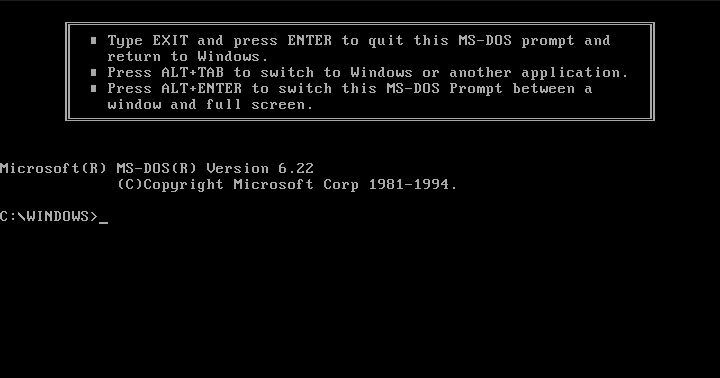
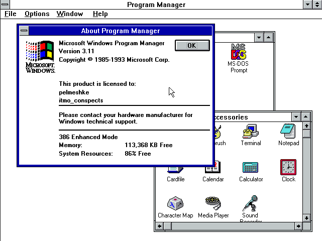
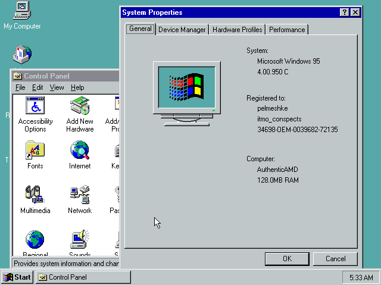
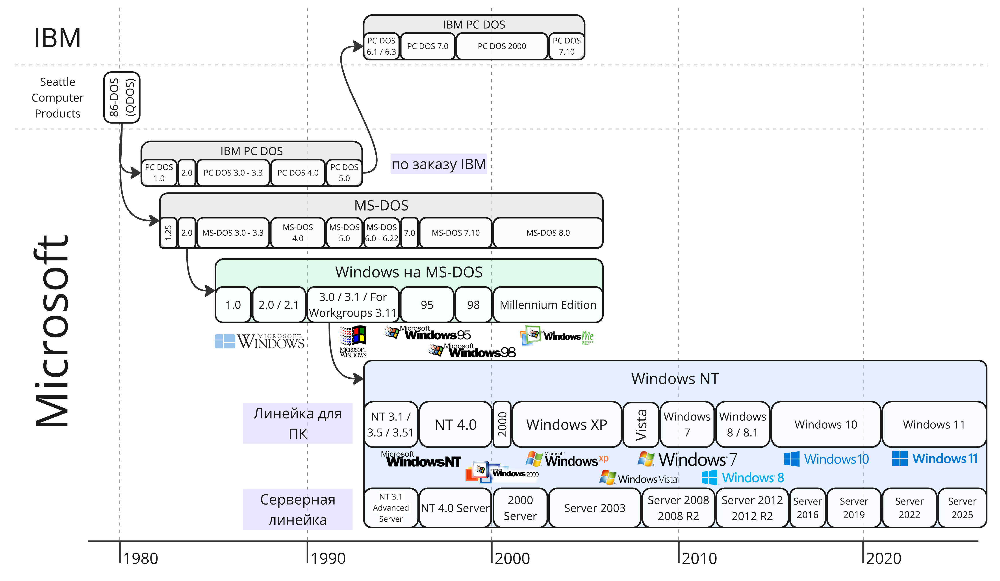
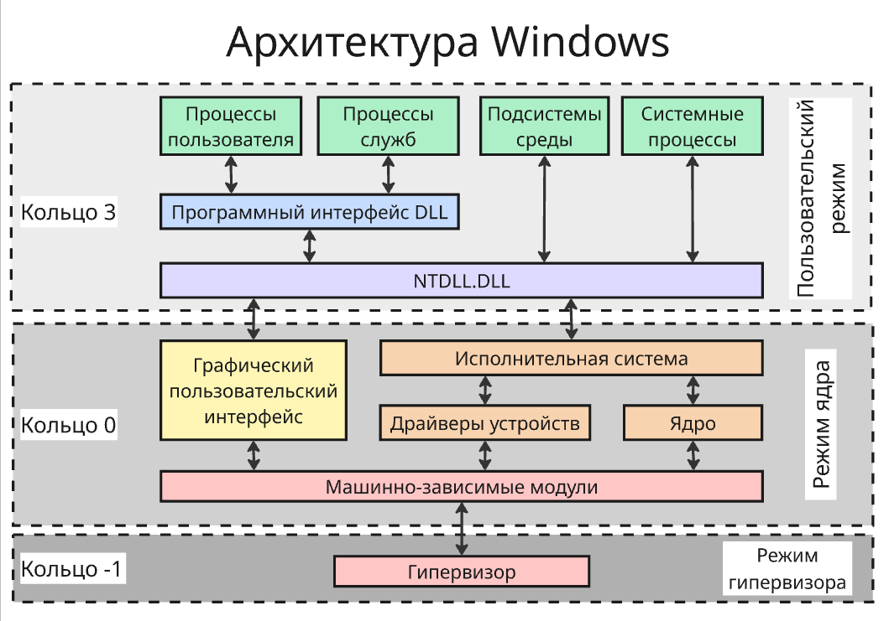
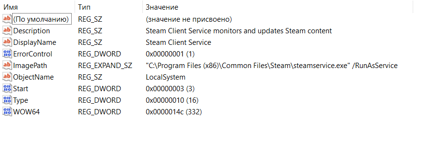

<!-- This file is generated by assets.build.markdown.superconspect_builder. All changes to it will be lost -->

#  Администрирование в ОС Windows

* [Администрирование в ОС Windows](#%D0%B0%D0%B4%D0%BC%D0%B8%D0%BD%D0%B8%D1%81%D1%82%D1%80%D0%B8%D1%80%D0%BE%D0%B2%D0%B0%D0%BD%D0%B8%D0%B5-%D0%B2-%D0%BE%D1%81-windows)
  * [Лекция 1. История Windows и общая характеристика](#%D0%BB%D0%B5%D0%BA%D1%86%D0%B8%D1%8F-1.-%D0%B8%D1%81%D1%82%D0%BE%D1%80%D0%B8%D1%8F-windows-%D0%B8-%D0%BE%D0%B1%D1%89%D0%B0%D1%8F-%D1%85%D0%B0%D1%80%D0%B0%D0%BA%D1%82%D0%B5%D1%80%D0%B8%D1%81%D1%82%D0%B8%D0%BA%D0%B0)
    * [Ситуация на рынке](#%D1%81%D0%B8%D1%82%D1%83%D0%B0%D1%86%D0%B8%D1%8F-%D0%BD%D0%B0-%D1%80%D1%8B%D0%BD%D0%BA%D0%B5)
    * [История Windows](#%D0%B8%D1%81%D1%82%D0%BE%D1%80%D0%B8%D1%8F-windows)
    * [Издания Windows Server](#%D0%B8%D0%B7%D0%B4%D0%B0%D0%BD%D0%B8%D1%8F-windows-server)
    * [Характеристика ОС](#%D1%85%D0%B0%D1%80%D0%B0%D0%BA%D1%82%D0%B5%D1%80%D0%B8%D1%81%D1%82%D0%B8%D0%BA%D0%B0-%D0%BE%D1%81)
  * [Лекция 2. Архитектура, управление и конфигурация Windows](#%D0%BB%D0%B5%D0%BA%D1%86%D0%B8%D1%8F-2.-%D0%B0%D1%80%D1%85%D0%B8%D1%82%D0%B5%D0%BA%D1%82%D1%83%D1%80%D0%B0%2C-%D1%83%D0%BF%D1%80%D0%B0%D0%B2%D0%BB%D0%B5%D0%BD%D0%B8%D0%B5-%D0%B8-%D0%BA%D0%BE%D0%BD%D1%84%D0%B8%D0%B3%D1%83%D1%80%D0%B0%D1%86%D0%B8%D1%8F-windows)
    * [Архитектура Windows](#%D0%B0%D1%80%D1%85%D0%B8%D1%82%D0%B5%D0%BA%D1%82%D1%83%D1%80%D0%B0-windows)
    * [Управление](#%D1%83%D0%BF%D1%80%D0%B0%D0%B2%D0%BB%D0%B5%D0%BD%D0%B8%D0%B5)
    * [Файловая структура](#%D1%84%D0%B0%D0%B9%D0%BB%D0%BE%D0%B2%D0%B0%D1%8F-%D1%81%D1%82%D1%80%D1%83%D0%BA%D1%82%D1%83%D1%80%D0%B0)
    * [Конфигурация](#%D0%BA%D0%BE%D0%BD%D1%84%D0%B8%D0%B3%D1%83%D1%80%D0%B0%D1%86%D0%B8%D1%8F)
    * [Установка компонентов](#%D1%83%D1%81%D1%82%D0%B0%D0%BD%D0%BE%D0%B2%D0%BA%D0%B0-%D0%BA%D0%BE%D0%BC%D0%BF%D0%BE%D0%BD%D0%B5%D0%BD%D1%82%D0%BE%D0%B2)
    * [Системный службы](#%D1%81%D0%B8%D1%81%D1%82%D0%B5%D0%BC%D0%BD%D1%8B%D0%B9-%D1%81%D0%BB%D1%83%D0%B6%D0%B1%D1%8B)

<!-- begin admwindows_2026_09_07.md -->
На этом курсе будут рассматриваться технологии, инструменты, использующиеся в Windows Server, а также архитектура системы

##  Лекция 1. История Windows и общая характеристика

###  Ситуация на рынке

Сейчас лидирующее положение среди операционных систем на персональных компьютерах занимает Microsoft Windows

В серверах же преобладает ОС Linux, доля Windows составляет около 20%. При этом ОС Windows не популярна как платформа для веб-серверов (примерно 8% сайтов используют Windows) и суперкомпьютеров

Несмотря на это, около половину заработка компании Microsoft составляет облачные услуги и офисные продукты. Облачная платформа Microsoft Azure принесла более 100 млрд долларов за 2026 финансовый год, что составляет около 30% от прибыли компании. Сейчас Microsoft Azure на рынке облачных услуг уступает только Amazon Web Services

Ключевой технологией является Windows Server, которая используется:

* Для бизнес-функционала и работы сервисов Microsoft, таких как Active Directory (служба каталогов, авторизации), Microsoft SQL Server, Exchange (почтовый сервер Microsoft), SharePoint (ПО для организации совместной работы), Dynamics 365 (решение для автоматизации управления) и другие
* Для виртуализации
* Для организации сетей хранения данных
* Для построения гибридных облаков и для интеграции с Azure

Помимо Azure и Windows Server экосистема Microsoft включает:

* Офисные продукты Microsoft 365 - текстовый редактор Word, сервис видеообщения Teams и другое
* Операционная система для ПК Windows
* Игровое подразделение XBOX, включающее консоли, издательства и игровые студии
* Устройства для обычных пользователей, такие как ноутбуки Surface

###  История Windows

Историю Microsoft можно разделить на 3 эпохи:

* Основание Биллом Гейтсом и Полом Алленом, правление Билла Гейтса (1975 - 2000)
* Правление Стива Балмера (2000 - 2014)
* Правление Сатьи Наделлы (2014 - настоящее время)

Предпосылками создания компании были желанием IBM выйти на рынок персональных компьютеров и Билла Гейтса заработать на ПО. IBM нуждалась в простенькой операционной системе, которая использовалась бы на аппаратном обеспечении IBM. До этого Microsoft разработали интерпретаторы языков BASIC, FORTRAN, COBOL и форк ОС Unix - Xenix

Первой версией стала **MS-DOS** (от MicroSoft Disk Operating System), выпущенная в 1981 году и основанная на выкупленной 86-DOS у Seattle Computer Products. MS-DOS имела только интерфейс консольной строки:

В 1985 году вышла **Windows 1.0**, которая представляла графическую оболочку и набор приложений для MS-DOS. В 1987 году **Windows 2.0**, а в 1993 году вышла **Windows 3.11 for Workgroups**, в которой появился интегрированный сетевой стек

Параллельно с развитием MS-DOS компании IBM и Microsoft совместно разрабатывали операционную систему OS/2. В 1991 году Microsoft прекращает участие, а наработки использует для создания ядра **Windows NT** (от New Technology). Новое ядро получило поддержку многопоточности, работы со множеством пользователей, 32-битной адресации, собственной файловой системы NTFS (New Technology File System) и стало архитектурнонезависимым

В 1993 году выходит **Windows NT 3.1** для серверов и рабочих станций. В 1994 году появляется **Windows NT 3.5**, которая получила сертификат безопасности C2, определенный [_Критериями определения безопасности компьютерных систем_](https://ru.wikipedia.org/wiki/%D0%9A%D1%80%D0%B8%D1%82%D0%B5%D1%80%D0%B8%D0%B8_%D0%BE%D0%BF%D1%80%D0%B5%D0%B4%D0%B5%D0%BB%D0%B5%D0%BD%D0%B8%D1%8F_%D0%B1%D0%B5%D0%B7%D0%BE%D0%BF%D0%B0%D1%81%D0%BD%D0%BE%D1%81%D1%82%D0%B8_%D0%BA%D0%BE%D0%BC%D0%BF%D1%8C%D1%8E%D1%82%D0%B5%D1%80%D0%BD%D1%8B%D1%85_%D1%81%D0%B8%D1%81%D1%82%D0%B5%D0%BC) (так называемая ["Оранжевая книга"](https://pelmesh619.github.io/itmo_conspects/databases/databases_superconspect.html#-orange-book))

Параллельно с этим выходят **Windows 95** и **Windows 98**, развивающую основную ветвь Windows. В Windows 95 графическая подсистема полностью встраивается в ядро ОС, а MS-DOS при этом продолжала использоваться для загрузки и обеспечения совместимости со старым ПО

Далее:

* В 2000 году появляется **Windows 2000** - первая массовая ОС для потребительских ПК на ядре Windows NT
* В 2001 году появляется культовая **Windows XP**
* В **Windows Server 2003** появляется поддержка платформы .NET Framework
* В 2007 году выходит **Windows Vista** с поддержкой ReadyBoost (технология для кеширования данных с дисков HDD на USB-флешку или карту памяти), UAC (User Account Control, контроль учетных записей), BitLocker (система шифрования диска)
* В 2008 году выходит **Windows Server 2008**, в которой появляется поддержка Hyper-V
* В 2009 году рождается **Windows 7** и **Windows Server 2008 R2**, в 2012 - **Windows 8** и **Windows Server 2012**, в 2013 - **Windows 8.1** и **Windows Server 2012 R2**
* В 2015 году выходит **Windows 10**, получившая в 2016 поддержку WSL (Windows Subsystem for Linux) - слой совместимости для запуска Linux-приложений, транслирующий системные вызовы. Поздняя версия WSL2 уже использует легковесно ядро Linux
* В 2016 году выходит **Windows Server 2016**
* В 2018 году появляется **Windows Server 2019**
* В 2021 году выходит **Windows 11** и **Windows Server 2022**
* В 2024 году выходит **Windows Server 2025** с улучшенной поддержкой NVMe-накопителей, распределения ресурсов графических процессоров (GPU-P, от GPU Partitioning), DTrace - инструментом для мониторинга и диагностики, поддержкой протокола SMB через QUIC, использующегося для обмена файлами и многое другое

Сейчас операционные системы Windows для ПК и Windows Server используют одно ядро, однако серверные ОС отличаются набором компонентов. На 2026 году поддерживаются Windows Server 2016 (до января 2027), Windows Server 2019 (до января 2029), Windows Server 2022 (до октября 2031) и Windows Server 2025 (до ноября 2034)

###  Издания Windows Server

Как и обычная версия Windows, которая издается в изданиях "Домашняя" (Home), "Профессиональная" (Pro) и "Корпоративная" (Enterprise), отличающиеся функционалом, Windows Server издается в нескольких редакциях:

* **Datacenter** - содержит все функциональные возможности и предназначена для крупных организаций, широко использующих виртуализацию, поэтому разрешает запуск неограниченного числа виртуальных машин
* **Standard** - содержит все те же возможности что и Datacenter, однако одна лицензия Standard позволяет запуск не более двух виртуальных машин. При необходимости можно увеличить разрешенное количество запускаемых виртуальных машин путем назначения серверу дополнительных лицензий
* **Essentials** имеет ограниченный функционал и предназначена для
небольших организаций. Лицензия Essential не требует покупки клиентских лицензий и разрешает подключение до 25 пользователей и до 50 устройств. Может быть запущена в физической или виртуальной среде
* **Datacenter: Azure Edition** - специализированная версия серверной операционной системы Windows Server, которая оптимизирована для работы в облачной платформе Microsoft Azure и гибридных облачных средах. Поставляется, начиная с Windows Server 2022, не предназначена для локальной установки

Устаревшие редакции включают:

* **Hyper-V Server** - бесплатная платформа виртуализации c интерфейсом Server Core. Последней версией стала Hyper-V Server 2019, далее функционал Hyper-V поставляется только внутри других платных редакций
* **Nano Server** - компактная платформа без графического интерфейса и платформы .NET Framework, но с поддержкой .NET Core. Используется преимущественно как образ для контейнеров
* **Multipoint Server** - редакция, позволяющая нескольким пользователям одновременно и независимо работать за одним физическим компьютером (сейчас упразднена как отдельная редакция и встроена как возможность внутри **Datacenter**, **Standard** и **Datacenter: Azure Edition**)

Отдельно существует сервис **Windows 365 Cloud PC** - облачная настольная среда в Azure, доступная по сети

Также Windows Server имеет несколько вариантов установки:

* Server with Desktop Experience - полноценный сервер с графическим интерфейсом и локальными инструментами управления
* Server Core - минимальная установка без стандартного графического интерфейса, что уменьшает количество установленных компонентов, требования к ресурсам и поверхность возможных атак. Управление осуществляется через PowerShell и SCONFIG (Server Configuration) или диспетчер серверов и MMC (Microsoft Management Console) на другом узле с Windows

Отдельно существовал Minimal Server Interface в старых версиях Windows Server, начиная с Windows Server 2012, но в современных версиях отдельным вариантом установки не является

###  Характеристика ОС

Операционная система - это слой абстракции между пользователем, программным обеспечением и аппаратным обеспечением

Операционная система решает такие задачи:

* Взаимодействие с оборудованием, в том числе с процессором, оперативной памятью, графическими ускорителями и устройствами ввода/вывода
* Управление ресурсами - процессорным временем, памятью, файловыми
системами
* Защита данных и безопасность
* Сетевое взаимодействие
* Программный интерфейс для взаимодействия ПО и АО
* Предоставление пользовательского интерфейса

Windows является гибридной операционной системой нереального времени (которая делает приоритетом максимальную пропускную способность вместо гарантированного времени отклика) с вытесняющей многозадачностью

В отличии от Linux система Windows:

* Не предоставляет исходный код широкой публике
* Имеет гибридную архитектуру - часть механизмов, характерных для микроядерного подхода, организована через отдельные компоненты, но значительная часть системных служб и драйверов работает в пространстве ядра для повышения производительности
* Используется ACL (Access Control List) для контроля доступа к файлам вместо Unix-подобных флагов доступа
* Графическая подсистема работает в пространстве ядра
* Поддерживает работу нескольких пользователей, но есть ограничения у разных изданий
* Имеет реестр (Registry) для хранения конфигурации вместо текстовых файлов
* Имеет разные механизмы взаимодействия с устройствами
<!-- end admwindows_2026_09_07.md -->

<!-- begin admwindows_2026_09_21.md -->
##  Лекция 2. Архитектура, управление и конфигурация Windows

Windows, как и другие операционные системы, представляет собой слой абстракции между программным обеспечение и устройством, на котором обеспечение запускается

###  Архитектура Windows

Изначально, проект Multics, прародитель Unix, ставил цель сделать ОС для многих пользователей, поэтому в Multics было 8 колец защиты (или привилегий). Кольцо 0 было наиболее привилегированным и использовалось для ядра или супервизора системы, а остальные 7 колец использовались для других подсистем, служб супервизора и пользовательских приложений. Чем больше номер кольца, тем менее возможностей взаимодействия с устройствами ПК имел процесс

Операционная система Windows же разрабатывалась для IBM-PC-совместимых компьютеров, то есть компьютеров с процессором архитектуры x86. Компания Intel, разработавшая архитектуру x86 и процессор Intel 80286, аппаратно реализовала 4 кольца привилегий в процессоре:

* Кольцо 0 - ядро операционной системы и драйвера
* Кольцо 1 - вспомогательные службы
* Кольцо 2 - системы ввода/вывода и драйвера файловых систем
* Кольцо 3 - пользовательские приложения

Процессор знает, в каком кольце исполняется текущий код благодаря машинному регистру, отвечающему за это, из-за чего понимал, что делать, если инструкция обращается к памяти чужого процесса или выполняемая инструкция неправильная

На практике ранние версии Windows (3.x, 95, 98 и Millennium Edition) использовали 2 кольца - 0 и 3. Затем при создании Windows NT учитывалось, что операционная система будет работать на процессорах не только архитектуры x86, но MIPS, Alpha и PowerPC, которые имеют только 2 кольца привилегий: привилегированный и пользовательский режимы. Также, Поэтому кольца 1 и 2 в системе Windows (как и в других системах, таких как Linux и macOS) не используются

---

Современное ядро Windows NT имеет гибридную архитектуру, хотя изначально OS/2 планировалась как система с микроядерной архитектурой. Из-за этого некоторые существенные компоненты работают в пользовательском режиме

В пользовательском режиме работают:

* 32-разрядные и 64-разрядные пользовательские приложения Windows (а также приложения POSIX)
* Процессы служб, например, службы планировщика задач и диспетчера печати
* Системные процессы, такие как диспетчера сеанса Windows (`smss.exe`, от Session Manager Subsystem), программа входа в систему Windows (`winlogon.exe`) и согласованный пользовательский интерфейс для административных приложений (`consent.exe`)
* Подсистемы окружения Windows, которые дают среды выполнения ля приложений разных программных программ, например, WSL (с Windows 10) или OS/2 (до Windows 2000)

Отличия пользовательских приложений и процесс служб от системных процессов и подсистем окружения являются в использовании разных интерфейсов:

* Программный интерфейс DLL, который хорошо задокументирован
* NTDLL.DLL, у которого нет публичной документации, но имеет расширенные возможности

В режим ядра работают:

* Исполнительная система - низкоуровневые функции операционной системы, такие как диспетчеризация потоков, диспетчеризация прерываний и исключений и мультипроцессорная синхронизация

    Исполнительная система состоит из этих компонентов:

    * Менеджер ввода/вывода связывает устройства с подсистемами пользовательского режима и преобразует команды чтения и записи пользовательского режима в I/O Request Packets, которые передаются драйверам устройств
    * Контрольный монитор безопасности (SRM, Security Reference Monitor) обеспечивает соблюдение правил безопасности и определяет, можно ли получить доступ к объекту или ресурсу, используя ACL
    * Диспетчер PnP (от Plug-and-Play, "подключи и играй") управляет и поддерживает обнаружение и установку устройства во время загрузки, остановку и запуск устройств, основная часть фактически реализована в пользовательском режиме, в службе Plug-and-Play
    * Диспетчер памяти управляет виртуальной памятью, ее защитой и подкачкой из физической
    * Менеджер питания работает с событиями питания (отключение питания, режим ожидания, спящий режим) и уведомляет затронутые драйверы, используя внутрипроцессные коммуникации
    * Менеджер процессов управляет созданием и завершением процессов, потоков и задач (Job - группы процессов, которые могут быть завершены как единое целое или помещены под общие ограничения)
    * Локальный вызов процедур (Local Procedure Call, LPC) - компонент, который предоставляет порты межпроцессного взаимодействия. Порты LPC используются подсистемами пользовательского режима для связи со своими клиентами, подсистемами исполнительной системы для связи с подсистемами пользовательского режима и в качестве основы для локального транспорта для Microsoft RPC
    * Диспетчер объектов - интерфейс между модулями исполнительной подсистемы и ядром с драйверами, который транслирует системные вызовы в ядро

* Графический пользовательский интерфейс (GUI) - реализация функция графического интерфейса, работа с окнами, элементы пользовательского интерфейса и графический вывод

* Ядро Windows (`ntoskrnl.exe`) - низкоуровневые функции ОС: планирование потоков, диспетчеризация прерываний и исключений и многопроцессорная синхронизация. Оно
также предоставляет набор функций и базовых объектов, которые используются исполнительной системой для
реализации высокоуровневых конструкций

* Драйверы устройств (`*.sys` в папке `Windows\System32\Drivers`) - драйверы физических устройств, преобразующие вызовы пользовательских функций ввода/вывода в конкретные запросы к устройству, и драйверы устройств, не относящихся к физическому оборудованию, например драйверы файловой системы, сети

* Слой абстрагирования оборудования (он же HAL, Hardware Abstraction Layer или машинно-зависимые модули, `hal.dll`), который изолирует ядро, драйверы устройств и прочий исполняемый код от платформенно-зависимых различий в работе оборудования

Отдельно уровнем ниже существует гипервизор, который состоит из нескольких внутренних уровней и служб: собственный диспетчер памяти, планировщик виртуальных процессов, управление прерываниями и таймером, функции синхронизации, разделы (экземпляры виртуальных машин), внутрипроцессные коммуникации (IPC, Inter-Process Communication) и другое

---

Сейчас Windows 11 работает на процессорах с архитектурой x86-64 и ARM64. Версии с Windows 95 по Windows 10 поддерживают 32-битные процессоры архитектуры x86. Отдельная версия Windows RT (основанная на Windows 8 и 8.1) поддерживает процессоры архитектуры ARM32 (в том числе отдельные системы на чипе из семейства Nvidia Tegra). Ранние версии Windows работали на процессорах с архитектурой Itanium, DEC Alpha, PowerPC, MIPS

Сама система Windows написана на языках C, C++ и на языке ассемблера. Независимость от архитектуры в Windows обеспечивается изменение машинно-зависимых модулей и ядра

Ядро Windows поддерживает симметричную мультипроцессорность, то есть потоки процесса исполняются на любых ядрах с общей памятью, а также многоядерные, гиперпотоковые (Hyper-Threading) процессоры и технологию доступа к неоднородной памяти NUMA (Non-Uniform Memory Architecture) для систем с несколькими процессорами (память в NUMA разделяется NUMA-группы, которые распределяются отдельным процессорам)

Также Windows имеет ограничения до 64 физических процессоров (при этом неограниченное число логических ядер) и до 20 сокетов NUMA

###  Управление

Операционная система Windows Server может управляться с помощью таких инструментов:

* Microsoft Management Console (`mmc.exe`) - консоль управления Microsoft
* Windows Admin Center
* Microsoft System Center - программный пакет для управления и мониторинга, а именно:
    * System Center Configuration Manager - управление и развертывание
    * System Center Data Protection Manager - бекап и антивирус
    * System Center Operations Manager - мониторинг
    * System Center Orchestrator - оркестрация, автоматизация развертывания
    * System Center Service Manager - HelpDesk и ServiceDesk
    * System Center Virtual Machine Manager - управляет HyperV, VMWare ESXi, VMWare vCenter
* Оболочка PowerShell
* Командная строка и скрипты BAT/CMD
* WMI (Windows Management Instrumentation)

###  Файловая структура

Windows имеет стандартную структуру каталогов:

* Системный каталог `Windows` (в пользовательских компьютерах чаще всего `C:\Windows`, полный путь хранится в переменной окружения `SystemRoot`). В качестве ссылки на каталог `Windows` используются `%SystemRoot%` или `%WinDir%`
    * `Windows\System32` - основные 64-битные системные файлы (динамические библиотеки `.dll` и исполняемые файлы `.exe`)
    * `Windows\SysWOW64` (от Windows on Windows 64-bit) - 32-битные версии файлов для запуска старых программ
    * `Windows\WinSxS` (от Side-by-Side) и `Windows\Servicing\Packages` - компоненты Windows
    * `Windows\SoftwareDistribution` и `Windows\servicing\LCU` (от Last Cumulative Update) - каталоги пакетов обновлений
* Каталог `ProgramData` для хранения данных приложений и установочных файлов
* Каталоги `Program Files` и `Program Files (x86)` для приложений (соответственно 64-битные и 32-битные)
* Каталог `PerfLogs` для хранения журналов производительности
* Каталог `Recovery` для хранения образа среды восстановления
* Каталог `$Recycle.Bin`, который представляет "Корзину"
* Каталог `System Volume Information`, который хранит файлы, позволяющие восстановить состояние системы в случае серьезных сбоев
* Каталог `Users` (в русской версии отображается как `Пользователи`) для хранения данных пользователей
    * Каталоги `Users/All Users` и `Users/Default` для хранения специальных профилей
    * `Users\%имя-пользователя%\Documents` (`Документы`) - документы
    * `Users\%имя-пользователя%\Desktop` (`Рабочий стол`) - каталог файлов, иконки которых отображаются на рабочем столе системы
    * `Users\%имя-пользователя%\AppData` - данные приложений этого пользователя
        * `Users\%имя-пользователя%\AppData\Local` - локальные для этого компьютера данные приложений (например, кэш браузера)
        * `Users\%имя-пользователя%\AppData\LocalLow` - данные приложений, работающих в изолированной среде
        * `Users\%имя-пользователя%\AppData\Roaming` - данные приложений, которые должны следовать за пользователем при входе в одну учетную запись на разных компьютерах (полезно для офисов)
* `pagefile.sys` - виртуальный файл подкачки
* `swapfile.sys` - аналог `pagefile.sys` для приложений, созданных на UWP (Universal Windows Platform)
* `hiberfil.sys` - файл для работы гибернации. При входе в режим гибернации оперативная память копируется в этот файл, из-за чего экономится больше энергии, чем в спящем режиме

Каталоги `Windows`, `Recovery` и файл `Hiberfil.sys` обязаны находится на системного разделе диска, а `Program Files`, `ProgramData` и `Users` могут находится вне, но через костыли

###  Конфигурация

Конфигурация Windows хранится в конфигурационных файлах разных форматов (`.ini`, `.xml`, `.json`, `.conf`) и в реестре

Реестр Windows - это набор бинарных файлов для хранения конфигурации в виде дерева

Преимущества:

* Единое хранилище конфигурации и единый механизм хранения настроек
* Типизация параметров
* Встроенная безопасность
* Возможность бекапов

Недостатки:

* Единая точка отказа
* Затрудненность работы с параметрами
* Плохая документированность и читаемость

Реестр хранит значения этих типов:

* Двоичный. Получил наибольшее распространение и используется во всех разделах. При выдаче в редакторе реестра предусматривается применение 16х формата.
* DWORD - 4-байтное слово. Необходимо для осуществления хранения параметров драйверов и различных программ
* Расширяемая строка данных. Основное отличие от строкового параметра заключается в отсутствии четкого фиксирования длины.
* Многострочный. Используется более чем одна строка. Довольно часто применяется при необходимости хранения табличных данных.
* Строковый. Строка текста, которая обладает фиксированной длиной.
* QWORD - 8-байтное слово
* Ссылка - символическая ссылка в формате Unicode

* `REG_SZ` - обычная текстовая строка, используется для хранения путей, имен и других текстовых данных фиксированной длины.
* `REG_DWORD` - 32-разрядное число, применяется для хранения числовых параметров конфигурации, флагов и настроек
* `REG_QWORD` - 64-разрядное число
* `REG_BINARY`- двоичные данные, информация отображается в шестнадцатеричном формате, чаще всего применяется для параметров оборудования и графических настроек
* `REG_MULTI_SZ` - множественная строковая последовательность (список строк, разделенных нулевым символом `\0`)
* `REG_EXPAND_SZ` - расширяемая строковая переменная. Текст, содержащий переменные окружения (например, `%SystemRoot%`), которые автоматически заменяются на реальные пути при чтении
* `REG_LINK` - символическая Unicode-ссылка на другой раздел реестра

Реестр также поддерживает ACL (Access Control List) - список управления доступом, который определяет, какие пользователи или группы имеют права на чтение, запись, изменение или удаление конкретных разделов и параметров в реестре

Значения в реестре разбиты на несколько основных веток:

* `HKEY_LOCAL_MACHINE` (HKLM) - глобальные настройки компьютера, которые применяются ко всем пользователям и самой операционной системе
    * `HKEY_LOCAL_MACHINE\HARDWARE` - информация о текущем аппаратном обеспечении компьютера, создаваемая динамически (аналог `/dev` в Linux)
* `HKEY_USERS` (HKU) - профили всех пользователей, зарегистрированных в системе
* `HKEY_CURRENT_USER` (HKCU) - настройки текущего вошедшего пользователя (ссылка на подраздел внутри `HKEY_USERS`)
* `HKEY_CLASSES_ROOT` (HKCR) - сопоставления типов файлов и регистрация COM-компонентов. Эта ветка указывает системе, какое приложение должно открывать конкретный формат (например, `.txt` или `.pdf`), а также хранит настройки для контекстного меню проводника. Она является динамическим объединением данных из `HKLM\Software\Classes` (для всех пользователей) и `HKCU\Software\Classes` (личные ассоциации пользователя, которые имеют приоритет)
* `HKEY_CURRENT_CONFIG` (HKCC) - текущая конфигурация оборудования (ссылка на ветку `HKLM\SYSTEM\CurrentControlSet\Hardware Profiles\Current`). Здесь хранятся временные параметры подключенных в данный момент устройств, профили мониторов, принтеров и других аппаратных средств, которые активны при текущем запуске системы.

Сам реестр хранится во множестве файлов. Расположение основных веток:

* `HKEY_LOCAL_MACHINE\BCD00000000` хранится в `%SystemRoot%\Boot\BCD`
* `HKEY_LOCAL_MACHINE\SYSTEM` - хранится в `%SystemRoot%\System32\config\SYSTEM`
* `HKEY_LOCAL_MACHINE\SOFTWARE` - хранится в `%SystemRoot%\System32\config\SOFTWARE`
* `HKEY_LOCAL_MACHINE\SECURITY` - параметры безопасности, хранящиеся в `%SystemRoot%\System32\config\SECURITY`
* `HKEY_LOCAL_MACHINE\SAM` - формируется в `%SystemRoot%\System32\config\SAM`
* `HKEY_USERS\DEFAULT` - формируется из `%SystemRoot%\System32\config\DEFAULT`
* `HKEY_USERS\S-1-5-18`, `HKEY_USERS\S-1-5-19` и `HKEY_USERS\S-1-5-20` - формируются из документов `NTUSER.DAT`, которые лежат в директориях `%SystemRoot%\System32\config\systemprofile\`, `%SystemRoot%\ServiceProfiles\LocalService\` и `%SystemRoot%\ServiceProfiles\NetworkService\`
* `HKEY_USERS\%SID_пользователя%` - формируется из `%USERPROFILE%\NTUSER.DAT`
* `HKEY_USERS\%SID_пользователя%_Classes` - формируется из `%USERPROFILE%\AppData\Local\Microsoft\Windows\UsrClass.dat`

Также каталог `%SystemRoot%\System32\config\RegBak` применяется для бекапа реестра

Для изменения реестра существуют:

* Графическое приложение `regedit.exe` (или `regedt32.exe` - устаревший редактор для Windows NT/2000, сейчас является ссылкой на `regedit.exe`)
* Консольная утилита `reg.exe`
* Или командами в PowerShell, таким как `Get-ChildItem`, `Get-ItemProperty`, `Set-ItemProperty`, `New-Item`, `New-ItemProperty`, `Remove-Item`

###  Установка компонентов

* Раньше было обслуживание на основе файлов (File-Based Servicing, FBS): были `.inf` файлы с описанием изменений, а обновляемые системные файлы
    перезаписывались новыми версиями непосредственно в `%SystemRoot%\System32`, а копия новой версии помещалась еще и в кэш защищенных системных файлов `%SystemRoot%\System32\DLLcache`

* Сейчас используется обслуживание на основе компонентов (Component-Based
Servicing, CBS) с помощью `TrustedInstaller.exe`
    
    Компонент представляет набор файлов, сгруппированных по назначению, функциональности и возможности многократного использования. В компонент входят библиотеки, исполняемые файлы, манифесты и так далее

    Также появились статусы компонентов/обновлений (такие как установлен, активирован) и возможность ставить определенный функционал в операционной системе по мере необходимости

    Благодаря этому обеспечиваются:

    * полный цикл сопровождения (установка/удаление/предоставление/восстановление) всех версий общих модулей/библиотек,
    * надежный, стабильный и безопасный механизм обновлений
    * более управляемый процесс установки, позволяющий добавлять драйверы и компоненты
    * возможность упаковывать любые компоненты и виде небольших модулей, которые обеспечивают весь функционал компонента
    * обеспечивает хранение множества версий объектов (файлов) при помощи механизма WinSxS

Управление компонентами осуществляется через:

* Графическое приложение "Компоненты Windows" (`OptionalFeatures.exe`)
* Консольная утилита `Dism.exe`
* Команды PowerShell `Get-WindowsFeature` и `Enable-WindowsOptionalFeature`
* Консольная утилита `winget` для установки пакетов:
    * `winget install <пакет>` - установка пакета
    * `winget uninstall <пакет>` - удаление пакета
    * `winget list` - список установленных пакетов
    * `winget show <пакет>` - показать информацию о пакете
    * `winget source <опции>` - управление репозиториями пакетов
    * и другие

###  Системный службы

Службы могут быть:

* Как `.exe`-файл, которые перечислены в реестре `HKLM\SYSTEM\CurrentControlSet\Services`
* Как `.dll`-библиотека, запускаемые через `svchost.exe`, например "Брандмауер Защитника Windows"

Для служб в реестре есть поля:

* тип службы (служба относится к запускаемым в собственном процессе или делит процесс с другими службами)
* размещение исполняемого файла службы
* (необязательное) отображаемое имя службы
* учетная запись запуска службы
* тип запуска (автоматически, произвольно, запрещено)
* код ошибки, показывающий, как система должна реагировать при обнаружении службой ошибки в процессе запуска
* если служба запускается автоматически, дополнительную информацию, указывающую, когда служба должна запускаться относительно других служб

<!-- end admwindows_2026_09_21.md -->

