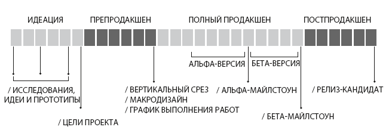

# A Playful Production Process for Game Designers (and Everyone)

## Вступление

Этот конспект - конспект книги "A Playful Production Process for Game Designers (and Everyone)"
("Игровая разработка без боли и кранчей. Как выжить в игровой индустрии и сохранить вдохновение" в русском издательстве)
автора и гейм-дизайнера Ричарда Лемаршана, работавшего с 2004 по 2012 в Naughty Dog над играми серии Uncharted.

Сейчас Лемаршан преподает в Университете Южной Калифорнии (USC, University of Southern California) и создает игры в
команде USC Games

В основу книги вошел опыт автора и содержание курса дизайна и разработки, который преподается в USC. Курс объединяет два
понятия:

* Гейм-дизайн - процесс придумывания идей и воплощение их в геймплее
* Гейм-продакшен - продакт-менеджемент, который гарантирует конечный результата

Весь процесс разработки игры можно разделить на 4 этапа: формирование идеи (идеация), препродакшен, полный продакшен,
постпродакшен

Так как творческая работа дизайнера - полный хаос, возникают **кранчи** - неконтролируемые переработки, которые вредят
здоровью людей и качеству продукта. Из-за этого появляется потребность этот хаос организовывать и направлять в нужное
русло

В течение прочтения книги читатель поймет:

* для чего разработчику нужны **"гибкие навыки"** (soft skills)
* как и зачем определять **цели проекта**
* как использовать методы **полета мыслей** и **исследования**
* что такое **вертикальный срез**, **макродизайн игры**
* как подогнать **скоуп** проекта - масштаб, объем проекта - для обеспечения качества продукта
* как пройти через альфа и бета-версии и выпустить продукт

На протяжении игры используются 3 ключевые концепции, лежащие в основе сотрудничества: уважение, доверие и согласие. *
**Уважение** подразумевает, что вы понимаете и уважаете мысли, чувства и желания других людей, ценность их жизненного
опыта. **Доверие** облегчает сложную работу и дает возможность делиться и опираться друг на друга. **Согласие**
гарантирует, что взаимодействующие с нами люди добровольно согласны работать ограниченное число часов, а пользователи
согласны с тем, что предложит им наша игра.
