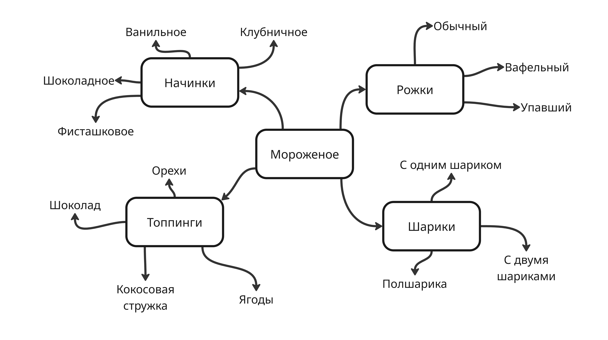
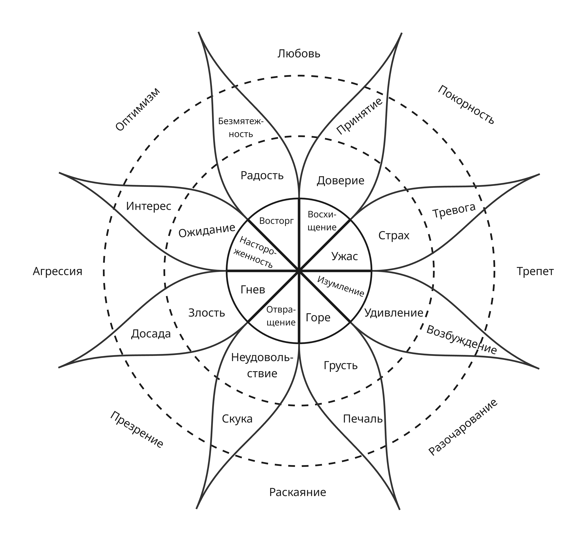

# A Playful Production Process for Game Designers (and Everyone)

## Вступление

Этот конспект - конспект книги "A Playful Production Process for Game Designers (and Everyone)" ("Игровая разработка без боли и кранчей. Как выжить в игровой индустрии и сохранить вдохновение" в русском издательстве) автора и гейм-дизайнера Ричарда Лемаршана, работавшего с 2004 по 2012 в Naughty Dog над играми серии Uncharted.

Сейчас Лемаршан преподает в Университете Южной Калифорнии (USC, University of Southern California) и создает игры в команде USC Games

В основу книги вошел опыт автора и содержание курса дизайна и разработки, который преподается в USC. Курс объединяет два понятия:

* Гейм-дизайн - процесс придумывания идей и воплощение их в геймплее
* Гейм-продакшен - продакт-менеджемент, который гарантирует конечный результата

Весь процесс разработки игры можно разделить на 4 этапа: формирование идеи (идеация), препродакшен, полный продакшен, постпродакшен

Так как творческая работа дизайнера - полный хаос, возникают **кранчи** - неконтролируемые переработки, которые вредят здоровью людей и качеству продукта. Из-за этого появляется потребность этот хаос организовывать и направлять в нужное русло

В течение прочтения книги читатель поймет:

* для чего разработчику нужны **"гибкие навыки"** (soft skills)
* как и зачем определять **цели проекта**
* как использовать методы **полета мыслей** и **исследования**
* что такое **вертикальный срез**, **макродизайн игры**
* как подогнать **скоуп** проекта - масштаб, объем проекта - для обеспечения качества продукта
* как пройти через альфа и бета-версии и выпустить продукт

На протяжении игры используются 3 ключевые концепции, лежащие в основе сотрудничества: уважение, доверие и согласие. **Уважение** подразумевает, что вы понимаете и уважаете мысли, чувства и желания других людей, ценность их жизненного опыта. **Доверие** облегчает сложную работу и дает возможность делиться и опираться друг на друга. **Согласие** гарантирует, что взаимодействующие с нами люди добровольно согласны работать ограниченное число часов, а пользователи согласны с тем, что предложит им наша игра.
# Первый этап: формирование идей - идеация

## Глава 1. Как начать.

Трейси Фуллертон, профессор USC, в своей книге "Game Design Workshop. A Playcentric Approach to Creating Innovative Games" пишет:

> Суть целей опыта игрока заключается в их же названии: это те цели, которые гейм-дизайнер устанавливает для того типа игрового опыта, который игрок получит во время игры. Это не особенности игры, а скорее описание интересных и уникальных ситуаций, к которым вы надеетесь привести игрока

Когда возникает работа над новым проектом, появляется проблема "чистого листа" - чрезмерная свобода выбора. Чтобы правильно решить эту проблему, нужно перестать думать об общей картине и о сразу готовом проекте. 

Следует начать с одного из трех методов формирования идей:

* полет мыслей (придумывание идей)
* исследование (поиск в книгах, интернете)
* прототипирование (сборка простых вещей, с которыми можно поиграть и оценить результат)

На этапе формирования идей определятся одна, две или три вещи, которые делают нашу игру уникальной и выделяющейся. Из этого можно сформировать цели нашего проекта, которые послужат дирекшеном - направлением для нас.
## Глава 2. Полёт мыслей

Полёт мысли - вид деятельности, при котором возникают спонтанные и неожиданные мысли. Его цель - уйти от всего известного и знакомого

### Мозговой штурм

Мозговой штурм - групповое или индивидуальное занятие, когда мы спонтанно придумываем и записываем идеи. Это отличный способ сгенерировать длинный список идей и узнать свою команду поближе. При работе с ним следует руководствовать правилами:

* **Установите ограничение по времени**. Новички часто нарушают это правило. Двадцать минут побуждают всех работать быстро, а тридцать минут - уже хороший максимум
* **Сосредоточьтесь на _количестве_, а не на качестве**. Во время мозгового штурма вы пытаетесь уловить все идеи. Поощряйте вашу команду говорить первое, что придет им в голову.
* **Назначьте организатора**. Назначьте человека, который будет поощрять, вносить первые идеи и следить за тем, чтобы...
* **Одновременно говорил только один человек**. Так мозговой штурм не превратиться в бесконтрольный хаос, а члены команды смогут продемонстрировать уважение и доверие.
* **У каждого есть возможность высказаться**. Хорошие идеи есть у всех, но некоторые люди стесняются что-то высказать. Организатор должен помочь ему влиться в обсуждение. Также организатору или другому члену стоит поручить...
* **Все записывать**. Фиксируйте все свои идеи, оптимально на доске, чтобы их все видели, или же в электронную таблицу
* **Приветствуйте необычные идеи - чем страннее, тем лучше**. Помните, что во время мозгового штурма вы пытаетесь убежать от всего известного и обыденного
* **Говорите "да, и" - объединяйте и улучшайте идеи**. Это отличный способ продвинуться вперед, когда в голове становится пусто.
* **Не обсуждайте идеи во время мозгового штурма**. Обсудить их можно потом - главное сосредоточиться на количестве идей

#### Оценка результатов мозгового штурма

Зачастую немногие разработчики возвращаются к идеям мозгового штурма, а развивают те, которые особенно отложились им в голову. Обсудите идеи с товарищами и рассмотрите каждую из них.

Также полезно вести таблицу с идеями и их приоритетом заинтересованность для каждого члена команды. Так вы будете видеть, что интересует команду, и будете двигаться в нужном направлении, а не кругами.

### Ментальная карта

Ментальная карта (майнд-карта) - более структуризированная версия мозгового штурма. По мере возникновения идей записывайте их на доске и соединяйте линиями, обозначая взаимосвязи между ними. Майнд-карта особенна полезна, когда вы определили центральную идею

 

> Майнд-карта по теме "мороженое"

### Автоматизм

Техника, придуманная сюрреалистами в начале XX века, заключается в том, чтобы автоматически (спонтанно) писать или рисовать на листе бумаге пришедшие в голову вещи за определенный промежуток времени - от 4 минут до часа. Следуйте потоку сознания, не мешкайте на каждой идеи, возможно, многие вещи окажутся белибердой

### Другие техники полета мыслей

Это всего лишь некоторые методы полетов мыслей. В своей книге "Game Design Workshop" Трейси Фуллертон приводит метод нарезки и многие другие. Вы также можете делать раскадровку, открывать случайные статьи на Википедии или использовать любимую технику гадания.

### Дизайнеры, электронные таблицы и сила списка

По ходу работы гейм-дизайнер составляет множество списков: список игровых механик и уровней, сырых идей, фич, контента и задач. Электронные таблицы благодаря своему разделению помогают всю эту информацию структуризировать и не допускать ошибок в дальнейшем

## Глава 3. Исследование

Исследование является хорошим методом формирования идей для "приземленных", реалистичных проектов.

### Исследования в интернете

До эры интернета приходилось идти в библиотеку или покупать кучу книг, чтобы провести исследование для игры. Сейчас же можно воспользоваться Google, Reddit, Википедией и 366 доменными именами интернета. С помощью них можно основательное погрузиться в тему, родившуюся во время мозгового штурма и дополнять свой майнд-карту.

### Поиск изображений

Обычно изображения передают информацию быстрее, чем текст, и навевают разные мысли. Поэтому полезно искать всякие изображения и составлять из них мудборд (коллаж). Размещение двух казалось бы различных картинок может привести к уникальным идеям и чувствам, подобно [эффекту Кулешова](https://ru.wikipedia.org/wiki/%D0%AD%D1%84%D1%84%D0%B5%D0%BA%D1%82_%D0%9A%D1%83%D0%BB%D0%B5%D1%88%D0%BE%D0%B2%D0%B0).

### Не пренебрегайте библиотекой

Кажущийся безграничным интернет может легко удержать вас внутри невидимых стен ваших предубеждений. Поэтому опытный библиотекарь и физическое собрание книг помогут легко найти то, что иначе бы вы не открыли в интернете.

### Экскурсии

Некоторые из лучших исследований проводятся за пределами студий, например, как Райский водопад из мультфильма "Вверх"был вдохновлен столовыми горами Тепуи в нацпарке Канайма в Венесуэле. Но возможно подходящее место окажется рядом - подмечайте детали в людях и окружающем мире, чтобы найти вдохновение

### Интервью

Позже будет рассмотрено, как важно ставить людей в центр вашего дизайн процесса, используя плейтесты и другие методы. Однако на этапе идеации **интервью** - отличный способ обсудить с людьми ваши идеи и дизайн вашей игры. Порасспрашивайте своих друзей и знакомых об их досуге, интересах. Записывайте ответы и делайте аудиозапись ваших интервью.

### Теневой повтор

Иногда трудно получить информацию от людей, поговорив с ними - из-за их предубеждений и эмоций информация искажается и теряет детали, важные гейм-дизайнерам. **Теневой повтор** предполагает сопровождение кого-либо (с его разрешения) и записи наблюдения за этим человеком. Мы собираем информацию о том, где и как исследуемый проводит время, чтобы лучше понять его поведение и мотивы. Также теневой повтор дает понять, как люди проводят время вместе, что полезно для кооперативных или соревновательных игр.

### Исследовательские заметки

Записывайте свои выводы. Гуляя по интернету, легко впасть в клик-транс и выйти из него, ничего не имея. Потратьте немного времени на копирование и вставку в ваш исследовательский документ, к которому вы сможете все время возвращаться. Установите ограничение по времени, чтобы не затеряться в интернете, как в кроличьей норе. Возвращайтесь к изначальной концепции и придерживайтесь ей, чтобы не сбиваться с пути и не ходить кругами.
## Глава 4. Прототипирование игры: обзор

Мозговой штурм и исследования - это хорошо, но жизненная сила идеи состоит не в придумывании, а в создании. Как отметил сотрудник Autodesk Том Вуйец в выступлении ["Построишь башню - построишь и команду"](https://www.youtube.com/watch?v=H0_yKBitO8M):

> Дизайн - это контактный вид спорта

Пока мы не начнем создавать что-то, мы не обнаружим то, что можем навредить или помочь проекту.

Также зачастую разработчики пытаются сразу создавать полноценную игру вместо прототипа, из-за чего выгорают еще до начала разработки. Поэтому очень важно, что

> Ваши прототипы - это не демоверсии игры
 
Позже будет рассмотрено, как сделать вертикальный срез и демоверсию, но пока:
 
> Каждый созданный прототип исследует одну или несколько идей игры

### Игровая механика, глаголы и игровые активности

**Игровые механики** - правила и процессы, которые определяют функциональность и интерактивность игры. Игровые механики делают возможным то, что гейм-дизайнеры называют **глаголами** - словами, обозначающие действия.

Иногда глаголы бывают _атомарными_, например, нажать кнопку для прыжка. Другие могут быть _молекулярными_, например, исследование состоит из атомарных действий ходить, прыгать, лазить, ползать, перемещать камеру. Также могут быть и _субатомными_, например, лазить можно разбить на составляющие, как двигаться влево, вправо, спрыгнуть и т. д.

**Игровая активность** - описание того, как игрок пользуется глаголами, например, поиск выхода - игровая активность, состоящая из ходьбы, бега и перемещения взгляда. Игровая активность - результат сочетания механики, глаголов и повествования, а также восприятия, мыслей, действий и намерений игрока.

Наиболее известное описание паттерном игровых активностей представлено [Ричардом Бартлом](https://en.wikipedia.org/wiki/Bartle_taxonomy_of_player_types) и включает в себя киллеров, ачиверов, социальщиков и исследователей.

Для каждого созданного вами прототипа спросите себя:

* какую игровую активность я прототипирую?
* какие игровые глаголы я исследую?
* какой опыт дает эта активность?
* какой тон или настроение у игровой активности?
* что интересного в геймплее и сюжете я могу сразу реализовать с помощью этой активности?
* как много я мог бы сделать с этой игровой активностью, если бы у меня было время для разработки ситуаций и сценариев, в которых ее можно было бы использовать?
* **на какой вопрос я пытаюсь ответить этим прототипом?**

Последний вопрос очень важен. В своем эссе ["Catastrophic Prototyping and Other Stories"](https://www.levitylab.com/blog/2011/01/catastrophic-prototyping-and-other-stories/) Хайм Гингольд советует разрабатывать прототипы, отвечая на поставленный вопрос:

> Например, вы думаете о том, как взаимодействовать с косяком рыб компьютерной мышью. Ваш вопрос таков: 
> как мне управлять этими рыбами с помощью мыши?

Также Хайм указывает, что создание прототипа может быть хорошим способом убеждения команды в работоспособности идеи

### Три вида прототипирования

На этапе идеации можно воспользоваться помощью трех типов прототипирования: игровое, физическое и цифровое.

#### Игровое прототипирование

Например, с помощью фигурки и нескольких коробок можно представить, как персонаж игрока будет карабкаться по скалам. Или можно самим разыграть движение заглядывания в замочную скважину, ползания в узком проходе. Таким образом, это иллюстрирует игровое действие и раскрывает другие стороны дизайнерских идей, например, не слишком ли низко расположена замочная скважина?

#### Физическое прототипирование

Физическое прототипирование включает в себя создание настольной игры, карточной игр и других видов нецифровой активности. Например, стратегия Killer Queen изначально создавалась физическая командная игра.

Создать физических прототип можно из различных материалов: бумага, картон, скотч, клей. Подумайте об игровой активности и том, как ее можно обобщить в пригодную для настольной игры сущности. Таким образом можно начать исследование игровой активности.

Как только вы создадите физический прототип, настанет время для его плейтеста. Напишите правила игры, чтобы игроки могли изучить их, не спрашивая вас. Записывая действия плейтестера, наблюдайте, за тем, как поймут ваш прототип, не пользуясь вашей помощью. Понимают ли они, что они могут сделать, а что не могут? Что в таком случае они пытаются сделать? Чего они не понимают? От чего они приходят в радость и что их расстраивает?

Одним из достоинством физического прототипа является быстрота их создания и итерирования - его улучшения и изменения. Итерируйте свой прототип после каждого теста и опроса плейтестеров.

Игрок никогда не "играет неправильно" и редко "просто не понимают" (так оправдываются те, чей дизайн не работает). Впечатления и действия игрока по-настоящему отражают работоспособность дизайна.

#### Цифровое прототипирование

Если стоит цель создать цифровую игру, то цифровое прототипирование обеспечит быстрое продвижение в процессе идеации и приведет к дизайну и сборке игры. В общем случае цифровое прототипирование - процесс использования ПО для создания прототипа игр, которые запускаются на компьютере. Как и в других случаях, цифровой прототип должен исследовать одну игровую активность.

### Каждый разработчик игр тоже гейм-дизайнер

Каждый разработчик игр - также и гейм-дизайнер, потому что сиюминутные решения, которые они принимают, оказывают фундаментальное влияния на дизайн игры. Это следует помнить гейм-дизайнеру, как ответственному в объединение лучшего в разработчиках в единое целое.

## Глава 5. Создание цифрового прототипа

### Выбор игрового движка

Процесс цифрового прототипирования начинается с выбора движка - ПО для создания игры. Наиболее широко используемые - это Unity и Unreal Engine. Разные движки предоставляют разный инструментарий для разработки. После выбора следует научиться пользоваться инструментами игрового движка.

### Выбор операционной системы и аппаратной платформы

После этого следует выбрать аппаратную платформу, на которой будет работать игра, будь то ПК, телефон и игровая консоль. Следует изучить особенность разработки под ту или иную платформу, а также требования к сертификации для игровых консолей.

### Создайте прототип как игрушку, а не как игру

Как упоминалось ранее, люди совершают игру и создают полноценную игру, а не прототип. Вы ищите основные глаголы и активности, которые будете использовать в дальнейшей разработке. Старайтесь, чтобы ваши прототипы были сосредоточены на изучении игровых активностей:

1. могут ли они вызвать эмоции и казаться интересными;
2. просты ли они для понимания и использования игроками;
3. пригодятся ли они в той игре, которую вы планируете.

### Важность звукового сопровождения в цифровом прототипе

Некоторые склонны пренебрегать звуковым дизайном, что является большой ошибкой. Стив Суинк в книге "Game Feel: A Game Designer's Guide to Virtual Sensation" пишет:

> Звуковой эффект может полностью изменить восприятие объекта в игре

и приводит пример анимации двух приближающихся и отдаляющихся кругов. Со звуковым эффектом "боньк" у зрителя сразу возникает ассоциация с мячом. Звукорежиссер и обладатель "Оскара" Рэнди Том перечисляет в своей статье ["Designing a Movie for Sound"](https://www.filmsound.org/articles/designing_for_sound.htm):

> Музыка, диалоги и звуковые эффекты могут выполнять любую из следующих задач и многое другое
> * внушить настроение, вызвать чувство;
> * установить темп;
> * указать географическое положение;
> * указать исторический период;
> * прояснить сюжет;
> * ...

В фильмах и играх изображение и звук передают логическую и эмоциональную информацию, но изображение не так эмоционально связано как звук.

### Плейтесты и итерирование цифрового прототипа

Старайтесь не тратить больше часа на создание геймплея. Протестируйте ваш прототип. Во время плейтеста помните:

* Не объясняйте слишком много. Не объясняйте вообще ничего, если такая возможность есть
* Вообще не помогайте своему плейтестеру и никак не вмешивайтесь в то, что он делает
* Наблюдайте за игрой плейтестеров. Обращайте внимание на то, что они делают и что они говорят.
* Делайте заметки о том, что вы видите и слышите во время игры.
* Когда будете беседовать с игроком после плейтеста сопротивляйтесь желанию что-либо объяснить. Вместо этого задавайте вопросы, которые помогут узнать о полученном опыте.

После тестирования сделайте опрос:

* Что следует улучшить, потому что показало себя успешным?
* Что нужно исправить, потому что в конечном счете это может сработать?
* Что следует убрать, потому что это не работает и, вероятно, так и не будет работаеть?

### Сколько нужно сделать цифровых прототипов

Вы должны сделать как можно больше различных прототипов за выделенное под идеацию время. Главное - не впасть в уныние и продолжать создавать что-то новое.

### Следовать ли за тем, куда ведет прототип

Не отказывайтесь от хороших прототипов. Во время формирования идей мы должны согласовывать наше видение с нашей открытостью новым направлениям и задумкам

### Результаты идеации: создание прототипа

Лучший способ предоставить прототип - предоставить его в исполняемом файле. Таким образом, его проще использовать и передавать друзьям или стейкхолдерам. Также для собранного билда необходимо составить некоторую документацию: описание управления, список любых приобритенных ассетов и необходимые дополнительные инструкции, а также титры вашей игры.

### Синдром завышенных ожиданий

Когда творческих людей так переполняют возбуждение и высокие ожидания, появляется синдром завышенных ожиданий, и их раздавливает грузом ответственности. Вы хотите сделать самую лучшую игру, и это давление словно парализует вас. Верный способ справиться с этим - меньше думать, больше действовать и мириться с неудачей. 

### Эмоциональная составляющая плейтестов прототипов

Несмотря на фестивальную атмосферу на плейтестах, люди, которые создавали прототип, очень тревожны за работу, которую они делали в условиях нехватки времени и под синдромом завышенных ожиданий. Поэтому стоит поддерживать свою команду, указывая то, что нравится в их работе, не забывая о конструктивной критике.
## Глава 6. Коммуникация как навык гейм-дизайна

Работа гейм-дизайнеров завязана на общении и не только с игроком, но и с другими разработчиками. Процесс общения сложен и изощрен, он дает как и проблемы, так и возможности

### Коммуникация, сотрудничество, лидерство и конфликты

Основное внимание следует уделять коммуникации, сотрудничеству, лидерству и конфликтам как основным аспектам разработки игр. Эти "гибкие навыки" - такая же часть производства отличной видеоигры, как и сильный гейм-дизайн или красивые арт и аудио.

Создание игры невозможно без **коммуникации** - обсуждении абстрактных концепций, связанных с дизайном игр, и конкретных фактов, связанных с реализацией. Не все мы так хороши в общении - даже самые простые беседы могут сбить с толку и расстраивать. Ситуацию ухудшает то, что все очень сильно зависит от эмоций. Коммуникация важна для большинства разработчиков игр, потому что работа с другими увлекает, вдохновляет и заряжает.

**Сотрудничество** заложено как основной аспект разработку в основе обучения в USC Games. Сообщество сотрудничающих для создания творческой работы людей и сама работа глубоко взаимосвязаны. Лучше всего, когда люди готовы уважительно бросить друг другу вызов и убедиться, что в итоге они примут наилучшие дизайнерские решения.

**Лидерство** - ключевой навык в разработке игр. Хорошее лидерство заключается в понимании, когда над чем-то нужно еще поработать, а когда начать делать что-то новое. Лидерство - это распознавать эмоциональное состояние команды разработчиков. Лидерство - это помогать членам команды разрешать конфликты.

**Конфликт** между членами команды - важный аспект сотрудничества. Конфликт необходим и является неотъемлемой частью каждого коллективного творческого процесса. Ищя компромисс, мы находим наилучшие решения в дизайне.

### Базовые коммуникационные навыки

Есть 3 основных навыка, лежащие в основе любого эффективного общения: ясность, краткость и активное слушание.

#### Будьте ясны

Идеи, которые предлагают гейм-дизайнеры, зачастую абстрактны и не понятны. Это усложняется тем, что
в среде нет устоявших терминов: то, что люди называют блокмешем, другие называют грейбоксом.
Верный способ внести ясность - сказать об этом. Не бойтесь спрашивать пояснений у собеседника.

#### Будьте кратки

У каждого человека внимание, необходимое для того, чтобы выслушать нас, ограничено, поэтому следует излагать свои мысли кратко. Лучше сказать немного меньше, чтобы вносить ясность, - собеседник с помощью дополнительных вопросов сам дополнит беседу.

#### Активно слушайте

Когда вы активно слушаете вашего собеседника, вы проявляете к нему уважение. Чтобы подтвердить собеседнику, что вы его слушаете, можно воспользоваться техникой отзеркаливания: после рассказа собеседника кратко изложите то, что вы поняли, чтобы собеседник согласился с этим и подправил вас, внесся дополнительные детали.

### Техника сэндвича

Чтобы дать конструктивную критику, можно воспользоваться техникой сэндвича, которая состоит из 3 шагов:

1) Дать комплимент работе. Это подкрепит уважение и доверие между вами и дает позитивное начало акту общения
2) Дать конструктивную критику. Главное быть прямолинейным, конкретным и критиковать работу, а не человека
3) Дать второй комплимент, например: "Над элементами управления прыжками предстоит еще поработать. Уверен, что та часть, которая мне понравилось, - анимация и звуковые эффекты - станет еще лучше, как только проблемы с механикой будут решены."

Со временем развития и укрепления отношений эти два куска хлеба комплиментов будут становиться все тоньше и тоньше

### Уважение, доверие и согласие

Самые сильные команды - те, где люди уважают друг друга. Мы проявляем уважение друг к другу в ходе коммуникаций. Когда мы работаем в атмосфере уважения, возникает доверие. Согласие важно повсеместно - мы должны быть уверены, что все члены команды согласны работать добровольно и бзе переработок.
## Глава 7. Цели проекта

### Целевой опыт пользователя

Целевой опыт пользователя - тот опыт, который должны получить игроки. Его часто описывают терминами эмоционального опыта. Сосредоточившись на том опыте, который должен получить игрок, мы можем начать освобождаться от наших предубеждений о том, на что похожа игра, а на что нет.

Знаменитый фреймворк МДЭ (MDA) - механика, динамика, эстетика - уделяет особое внимание игровому опыту. Эстетика в МДЭ - это переживания, возникающие в то время, как игрок взаимодействует с динамической системой, определяемой правилами механик игры. Одна из целей автора МДЭ состояла в том, чтобы помочь понять глубже часто туманную идею "веселья"

Иметь опыт - значит ощущать свое "я", когда с этим "я" что-то исходит. Опыт может быть физическим, умственным, эмоциональным, духовным, социальным, субъективным и виртуальным. Интеллект и сознание порождают разные виды ментального опыта, такие как мышление, восприятие, память, эмоции, воля и воображение. 

Мышление, память, воображение и воля - фундаментальные составляющие игрового опыта. Наше восприятие - это опыт и переживания, которые мы получаем в результате работы органов чувств. Эмоции - это то, что вовлекает нас в игру и заставлять играть. Работа психолога Роберта Плутчик может быть полезной для описания эмоций.

Хорошим упражнением будет сделать небольшую игру, которая вызывает одну из эмоций на колесе.

### Записывайте, какой опыт вы хотите видеть в вашей игре

Целевой опыт пользователя, возможно, самая важная цель проекта. Не пытайтесь описать, как игра реализует получение такого опыта. Обозначьте основные цели и сосредоточьте на выбранного виде опыта кратко и ясно. Выбранный вами опыт должен учитываться в вашем прототипе. 

### Цели дизайна

Ваши дизайн цели дополняют ваш целевой пользовательский опыт. Вот некоторые общие категории целей дизайна:

* Оборудование, на которым будет работать ваша игра. Эта цель также связана с целевой аудиторией.
* Игровые механики, глаголы и игровые активности.
* Интерфейс.
* Специальное оборудование или программное обеспечение, которое вы хотите использовать
* Жанр вашей игры
* Главная идея вашей игры
* Тема вашей игры
* Арт-дирекшен вашей игры
* Художественные цели вашей игры
* Цели воздействия вашей игры

### Целевой опыт и цели дизайна образуют цели проекта

Цели нашего проекта - приверженность определенному направлению, дирекшену. Вам решать, как вы будете сочетать целевой опыт пользователя и цели дизайна, формулируя цели проекта. Иногда цели меняются из-за сделанного нами в ходе идеации открытия.

### Репертуар и рост

У многих творческих групп есть репертуар: совокупность работ в определенном стиле, которые они мастерски создают и хорошо исполняют. Профессиональная студия разработки игр будет использовать свои сильные стороны, работая со своим репертуаром - тем, что они уже умеют делать, - и при этом изучать в каждом проекте что-то новое, развиваясь в процессе

### Учитывайте возможную аудиторию вашей игры

Какую бы игру вы ни создавали, в разработке вам могут помочь размышлений о вашей возможной аудитории. Для гейм-дизайнеров может оказаться полезным подумать об интересах своей аудитории

### Разработка для специализированной игровой платформы

Для разработки игры для консолей Sony, Microsoft или Nintendo потребуется отправить заявку и получить девкит - консоль для отладки игры. Для этого пойдет время конца этапа идеации,

### Советы, как сформировать цели проекта

Тщательно продумайте цели вашего проекта и постарайтесь следовать тому, что вы узнали, создавая успешный прототип. Не игнорируйте успешный прототип. Вернитесь к первоначальным исследованиям и мозговым штурмам. Цели вашего проекта будут направлять вас на протяжении всего процесса разработки. 
## Глава 8. Конец этапа идеации

### Как долго должен длиться этап идеации

В Naughty Dog во время разработки Uncharted этап идеации длился 3-4 месяца осенью и перед рождественскими каникулами. Обычно идеация занимает около 15% от всего времени разработки игры. Но не рекомендуется затягивать процесс идеации.

### Несколько заключительных советов по созданию прототипов

Создавайте как можно больше прототипов и исследуйте ваши идеи так широко, так глубоко, так быстро и так радикально, как только сможете. Рассматривайте каждую идею с как можно большего числа разных точек зрения, создавая, строя, придумывая и постоянно тестируя.

### Краткое изложение артефактов этапа идеации

| Артефакты                  | Когда над ними работать                                             |
|----------------------------|---------------------------------------------------------------------|
| Результаты "полета мыслей" | В начале этапа идеации и на протяжении всего этапа по необходимости |
| Исследовательские заметки  | На протяжении всего этапа идеации                                   |
| Прототипы                  | На протяжении всего этапа идеации                                   |
| Цели проекта               | В конце этапа идеации                                               |
