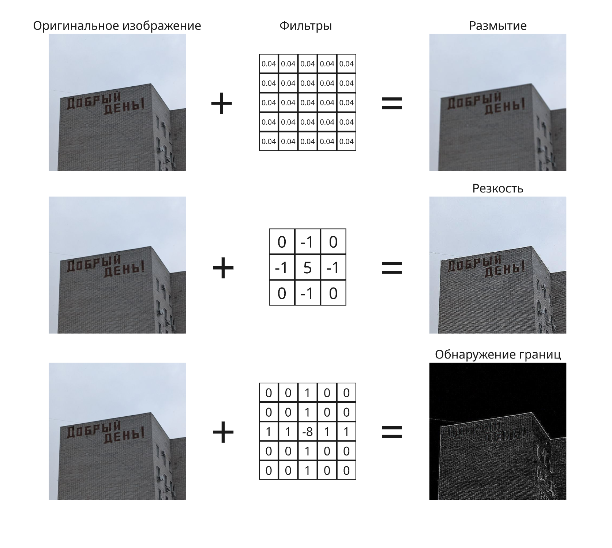
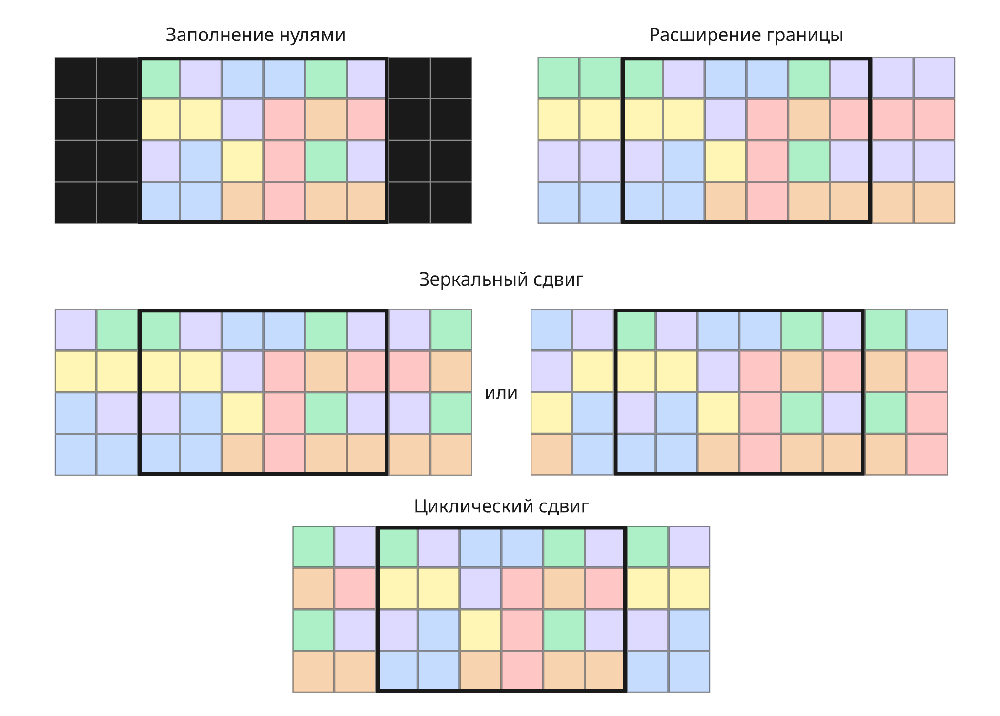
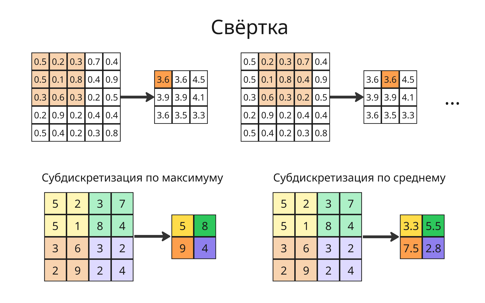
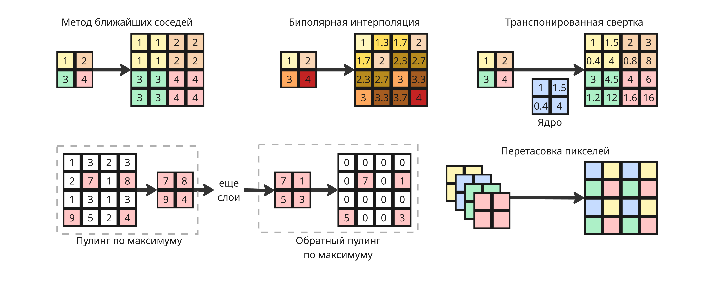
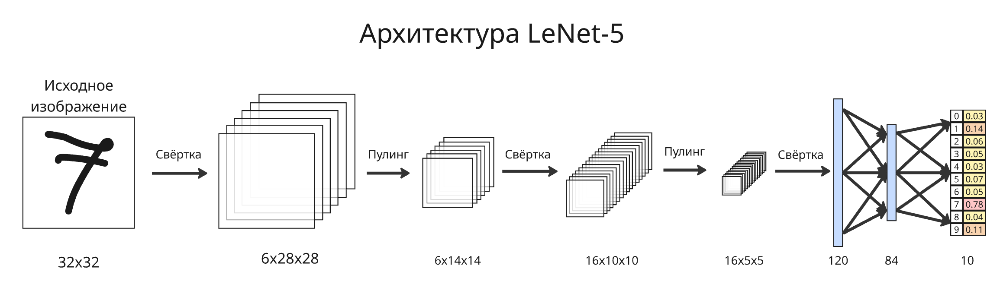
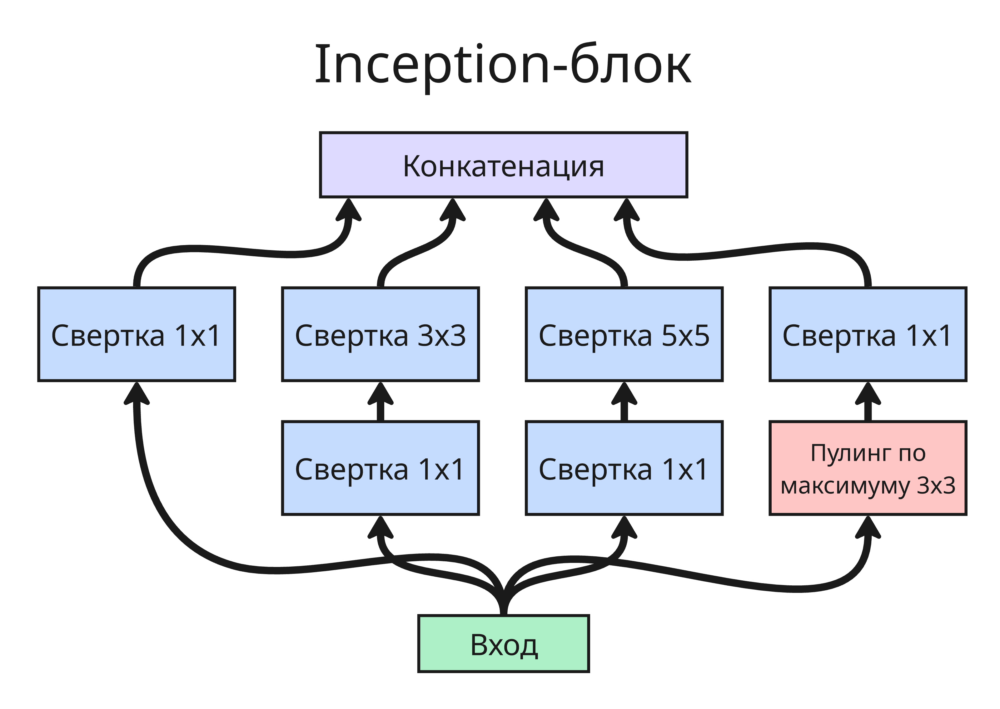
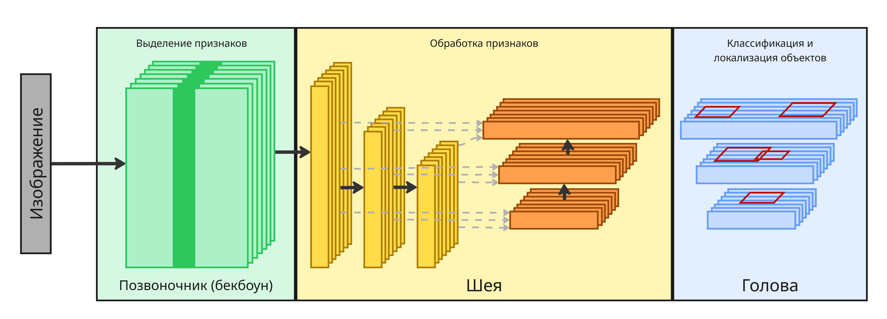

## Лекция 4. Сверточные нейронные сети

Свертка — это операция, при которой к входной матрице (например, изображению) применяется ядро (или фильтр) - небольшая матрица весов. Каждый элемент результата получается как сумма поэлементных произведений фрагмента входа и ядра - то есть линейная операция, выделяющая локальные признаки

Ядро свертки может быть тензором одномерным, двумерным, трехмерным и так далее в зависимости от размерности входных данных

Примерами свертки являются:

* Размытие
* Оператор Собеля

В сверточных нейросетях фильтры не задаются вручную, а обучаются под конкретную задачу

---

Но во время свертки появляются проблемы:

* После свертки мы получаем матрицу меньшего размера. Чтобы исправить это, применяют отступ - заполнение значениями за границей матрицей:

    

* Для того, чтобы ускорить свертку, матрицу свертки можно применять не через каждый пиксель, а через каждые несколько пикселей. Это значение называют шагом (или страйдом, от stride) свертки

Ширина матрицы после свертки определяется так -- $O = \frac{I - K + 2 P}{S} + 1$, где $I$ -- ширина исходной матрицы, $K$ -- размер ядра, $P$ -- добавленный отступ, $S$ -- шаг свёртки

Для уменьшения размерности матрицы применяют субдискретизацию (или пулинг, от pooling) -- в участке матрицы выбирается одно значение в зависимости от тех, что находятся в этом участке. Применяют пулинг по среднему значению или по максимуму

Пулинг прекрасен тем, что у него нет обучаемых параметров

Для борьбы с переобучением в сверточных нейросетях применяют индивидуальную нормализацию (Instance normalization), где она происходит по каждому отдельному объекту

$$\mu_{ni} = \frac{1}{HW} \sum_{l=1}^{H} \sum_{m=1}^{W} x_{nilm}$$

Для увеличения изображения применяют:

* Метод ближайших соседей - каждый пиксель просто копируется в соседние
* Билинейная интерполяция - значения интерполируются по пикселям
* Обратный пулинг по максимуму (Max Unpooling) - во время пулинга по максимуму запоминаем, какой элемент в области был максимумов, и после слоев в конце кладем соответствующие числа в их прошлые места, а остальные заполняем нулями
* Перетасовка пикселей (Pixel Shuffle) - если есть четырехслойное изображение размером $n \times n$, то можно сделать один слой $2n \times 2n$, перемешав пиксели
* Транспонированная свертка (Transposed convolution) - обучаемая операция, обратная свёртке, она увеличивает размер с помощью изучаемых весов

---

Популярным примером сверточной нейросети является LeNet-5, которая использовалась для распознавания рукописных цифр. Ее архитектура показывает типичную структуру CNN: чередование сверточных и субдискретизирующих слоев, затем полносвязные слои

На первых слоях сеть выделяет простые, малые признаки (края, углы, цветовые переходы). На следующих слоях из них собираются более сложные признаки (формы, части объектов), а в конце — целые объекты

---

Основными идеями обработки изображений в сверточных нейросетях являются:

* Локальность восприятия - свёртка действует на малую часть изображения, а не на всё сразу
* Общие параметры - одно ядро применяется ко всему изображению, что резко сокращает число параметров
* Уменьшение размерности - пулинг снижает пространственный размер карт признаков
* Разреженность связей: выходное значение зависит от малого числа входов

Как рассматривалось ранее, основными задачи анализа изображения являются:

* Классификация - определение класса объекта на изображении
* Обнаружение объектов - классификация и локализация объектов
* Сегментация, она бывает нескольких типов:
    * Семантическая сегментация - выделение объектов разных класса
    * Сегментация сущностей - выделение отдельных объектов одного класса
    * Паноптическая сегментация - выделение отдельных объектов разных классов (например, фоновые области в виде деревьев и отдельные автомобили)

В последнее время, с развитием Интернета и технологий, тренировочных данных стало кратно больше. Если раньше надо было своими силами создавать датасеты, то сейчас для обучения можно использовать:

* Существующие наборы данных с готовой разметкой
* Синтетические данные, например, помещение объектов на панорамные изображения
* Аугментация данных - легкая модификация существующих данных. В контексте изображений используются:
    * Изменение цветов
    * Поворот вокруг точки или осевая симметрия
    * Размытие
    * Сдвиг и обрезка
    * Сжатие и растяжение
* Сбор своих данных и их разметка. Часто есть хороший датасет, но он не содержит меток, из-за чего модель нельзя обучить их предсказывать

    Хорошим подходом является разметка небольшой части данных, на которых можно протестировать эффективность и сделать Proof-of-Concept новой архитектуры модели

Самыми популярными датасетами являются:

* MNIST - набор черно-белых изображений 28x28 рукописных цифр, ~70000 изображения
* MNIST-Fashion - набор черно-белых изображений 28x28 предметов одежды, ~70000 изображения
* Imagenet - датасет из ~14 миллионов изображений различных объектов
* MS COCO (Microsoft Common Objects in Context) - датасет из 328000 изображений сложных повседневных сцен и объектов в естественном окружении
* CelebA и CelebAHQ (CelebFaces Attributes Dataset) - 200 тысяч изображений лиц знаменитостей с размеченными атрибутами (такими как наличие шляпы, усов и тому подобное)
* CityScapes - 5 тысяч изображений городских сцен с разметкой сущностей на них
* ADE20K - ~22 000 изображений с семантической разметкой сцен
* ICDAR 2003-2019 - семейство датасетов фотографий с текстом на английском языке
* COCO-Text - датасет из 63686 изображений для распознавания текста
* Total-Text - датасет из изображений текста произвольной формы (изогнутый, наклонный)
* DeepFashion2 - одежда с детальной разметкой
* Cat 256
* MVS Data Set
* 3D-FRONT
* LSUN
* Oxford Flowers 102 - датасет изображений цветов
* SynthText in the Wild - 800 тысяч синтетических изображений с текстом
* CARLA - библиотека для работы с городскими ландшафтами в 3D

### Классификация

Для классификации применяют метрики из машинного обучения:

* **Аккуратность** (Accuracy): $\displaystyle \mathrm{Accuracy} = \frac{\mathrm{TP} + \mathrm{TN}}{\mathrm{TP} + \mathrm{TN} + \mathrm{FP} + \mathrm{FN}}$

* **Точность** (Precision): $\displaystyle \mathrm{Precision} = \frac{\mathrm{TP}}{\mathrm{TP} + \mathrm{FP}}$

* **Запоминание** (или полнота, Recall): $\displaystyle \mathrm{Recall} = \frac{\mathrm{TP}}{\mathrm{TP} + \mathrm{FN}}$

* **F-мера** (F-score или F1-score): $\displaystyle F_1 = \frac{2}{\frac{1}{\mathrm{Precision}} + \frac{1}{\mathrm{Recall}}} = \frac{2 \mathrm{Precision} \cdot \mathrm{Recall}}{\mathrm{Precision} + \mathrm{Recall}} = \frac{2\mathrm{TP}}{2\mathrm{TP} + \mathrm{FN} + \mathrm{FP}}$

В качестве функции потерь используют:

* Для бинарной классификации бинарную перекрестную энтропию (BCE, Binary Cross-Entropy):

    $$\mathcal{L}_{\mathrm{BCE}} (y, p) = -(y \log p + (1 - y) \log (1 - p)),$$

    где $y$ - точное значение класса ($0$ или $1$), а $p$ - вероятность принадлежности классу $1$

* Для классификации в общем случае перекрестную энтропию (CE, Cross-Entropy):

    $$\mathcal{L}_{\mathrm{CE}} (y, p) = -\sum_k y_k \log p_k$$

---

Рассмотрим популярные архитектуры таких сверточных сетей:

* AlexNet - первая глубокая модель из 6 миллионов параметров, состоящая из 5 сверток и 2 пулингов, где в основном применяется функция ReLU

* VGG16 и VGG19 - глубокие сети с сотнями миллионов параметрами с маленькими ядрами свёртки 3x3

* ResNet

    На практике глубокие сети не обучаются с ростом слоев

    Остаточный блок - подход, где информация с одного слоя передается вперед через два слоя. Это позволило уменьшить число параметров, но увеличить эффективность

    Также в ResNet применили поточечную свертку (свертка с ядром 1x1xN), позволяющая менять число каналов без изменения пространственного размера

* Inception (Inception v1-4, Inception-ResNet)

    Ключевым решением является выбор числа фильтром. Увеличение числа фильтров позволяет выполнять сложные задачи, а уменьшение числа позволяет выполнять простые задание

    Вместо этого можно применить Inception-блоки. В Inception-блоке параллельно применяются свёртки разных размеров (1x1, 3x3, 5x5) и пулинг. Результаты конкатенируются, а они в свою очередь позволяют модели самой выбирать нужный масштаб признаков

    

    Также можно создавать вспомогательные выходы из Inception-блоки, чтобы бороться с затуханием градиента

* MobileNet - лёгкая модель, разработанная для работы на мобильных устройствах. MobileNet использует алгоритм Depthwise Separable Convolution, разделяющую стандартную свёртку на два шага для резкого снижения числа вычислений

* EfficientNet - семейство моделей, где глубина, ширина и разрешение входа масштабируются совместно с помощью составного масштабирования (Compound Model Scaling). Для каждой задачи подбирается нужный размер модели, что позволяет увеличить точность и эффективность

* Vision Transformer (ViT) - модель, применяющая архитектуру трансформера

    Изображение разбивается на патчи, каждый патч кодируется в вектор, и последовательность патчей подаётся на вход трансформеру с механизмом самовнимания

* Swin Transformer (Shifted Windows Transformer) - модель, где самовнимание ограничено в пределах сдвигаемого окна, что снижает вычислительную сложность до линейной от размера изображения

    Механизм самовнимания способен решать нелинейные задачи без функций активации

---

Сейчас современные модели часто строятся по трехуровневой архитектуре:

Backbone (бекбоун, позвоночник) - сеть для извлечения признаков изображения
Neck (шея) - сеть для обработки признаков разных масштабов

Head (голова) - модель для получения результата для конкретной задачи

Такая архитектура позволяет заменять голову для решения разных задач, сохраняя общий бекбоун

