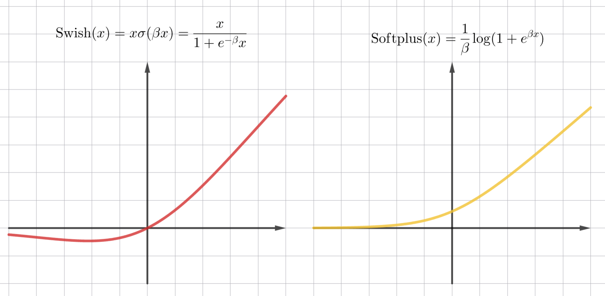

<!-- This file is generated by assets.build.markdown.superconspect_builder. All changes to it will be lost -->

#  Методы машинного обучения в компьютерном зрении

* [Методы машинного обучения в компьютерном зрении](#%D0%BC%D0%B5%D1%82%D0%BE%D0%B4%D1%8B-%D0%BC%D0%B0%D1%88%D0%B8%D0%BD%D0%BD%D0%BE%D0%B3%D0%BE-%D0%BE%D0%B1%D1%83%D1%87%D0%B5%D0%BD%D0%B8%D1%8F-%D0%B2-%D0%BA%D0%BE%D0%BC%D0%BF%D1%8C%D1%8E%D1%82%D0%B5%D1%80%D0%BD%D0%BE%D0%BC-%D0%B7%D1%80%D0%B5%D0%BD%D0%B8%D0%B8)
  * [Лекция 1. Введение в компьютерное зрение](#%D0%BB%D0%B5%D0%BA%D1%86%D0%B8%D1%8F-1.-%D0%B2%D0%B2%D0%B5%D0%B4%D0%B5%D0%BD%D0%B8%D0%B5-%D0%B2-%D0%BA%D0%BE%D0%BC%D0%BF%D1%8C%D1%8E%D1%82%D0%B5%D1%80%D0%BD%D0%BE%D0%B5-%D0%B7%D1%80%D0%B5%D0%BD%D0%B8%D0%B5)
  * [Лекция 2. Обработка изображений](#%D0%BB%D0%B5%D0%BA%D1%86%D0%B8%D1%8F-2.-%D0%BE%D0%B1%D1%80%D0%B0%D0%B1%D0%BE%D1%82%D0%BA%D0%B0-%D0%B8%D0%B7%D0%BE%D0%B1%D1%80%D0%B0%D0%B6%D0%B5%D0%BD%D0%B8%D0%B9)
  * [Лекция 3. Основы глубокого обучения](#%D0%BB%D0%B5%D0%BA%D1%86%D0%B8%D1%8F-3.-%D0%BE%D1%81%D0%BD%D0%BE%D0%B2%D1%8B-%D0%B3%D0%BB%D1%83%D0%B1%D0%BE%D0%BA%D0%BE%D0%B3%D0%BE-%D0%BE%D0%B1%D1%83%D1%87%D0%B5%D0%BD%D0%B8%D1%8F)

<!-- begin cvmethods_2026_02_10.md -->
Компьютерное зрение (Computer Vision, CV) - это область создания технологий, позволяющих анализировать и интерпретировать визуальную информацию (то есть изображения и видео) с помощью алгоритмов машинного и глубокого обучения

На этом курсе будут рассматриваться базовые операции и цифровая обработка над изображениями, свёрточные нейронные сети, детектирование, основы трекинга объектов и генерация изображений

##  Лекция 1. Введение в компьютерное зрение

Компьютерное зрение появилось в 1960-ых годах в университетах, изучающих искусственный интеллект. В 1970-ых были разработаны базовые алгоритмы обнаружение углов, контуров, краев, а в 1990-ых годах методы компьютерного зрения применялись в компьютерной графике. В наше время машинное и глубокое обучение применяется в компьютерном зрении

Сейчас компьютерное зрение применяется в таких областях:

- Улучшение качества изображений, например, с помощью увеличения размерности
- Выделение признаков
- Распознавание лиц
- Локализация и классификация объектов
- Предсказание позы человека (Pose estimation)
- Работа с двумя изображениями (Stereo Vision)
- Генерация изображений и видео

---

Основной объект при работе с изображениями - это тензор. Тензор - это многомерный массив

Ранг тензора определяет размерность массива. Так тензор ранга 0 - это скалярное число, тензор ранга 1 - вектор, ранга 2 - матрица

Изображение в памяти компьютера хранится в виде матриц, как правило состоящих из беззнаковых 8-битных чисел

Сейчас самая распространенная цветовая модель - это модель RGB (Red-Green-Blue, Красный-Зеленый-Синий), поэтому изображения можно представить в виде 3 матриц, где каждая определяет цвет какого-либо пикселя

Самые распространенные операции, которые нам пригодятся:

- Скалярное произведение векторов $\vec a$ и $\vec b$: $(\vec a, \vec b) = \sum_{i = 0}^n a_i b_i = \vert \vec a \vert \vert \vec b \vert \cos \varphi$, где $\varphi$ - угол между векторами

- Произведение матриц $A_{m \times n}$ и $B_{n \times p}$:

    $A_{m \times n} \times B_{n \times p} = \begin{pmatrix}a_{1 1} & a_{1 2} & \dots & a_{1 n} \\\\ a_{2 1} & a_{2 2} & \dots & a_{2 n} \\\\ \vdots & \vdots & \ddots & \vdots \\\\ a_{m 1} & a_{m 2} & \dots & a_{m n}\end{pmatrix} \times \begin{pmatrix}b_{1 1} & b_{1 2} & \dots & b_{1 p} \\\\ b_{2 1} & b_{2 2} & \dots & b_{2 p} \\\\ \vdots & \vdots & \ddots & \vdots \\\\ b_{n 1} & b_{n 2} & \dots & b_{n p}\end{pmatrix} = \sum_{i = 1}^n \sum_{j = 1}^m \sum_{k = 1}^p a_{j i} \cdot b_{i k}$

- Произведение Адамара матриц $A_{m \times n}$ и $B_{m \times n}$:

    $A_{m \times n} \odot B_{m \times n} = \begin{pmatrix}a_{1 1} & a_{1 2} & \dots & a_{1 n} \\\\ a_{2 1} & a_{2 2} & \dots & a_{2 n} \\\\ \vdots & \vdots & \ddots & \vdots \\\\ a_{m 1} & a_{m 2} & \dots & a_{m n}\end{pmatrix} \odot \begin{pmatrix}b_{1 1} & b_{1 2} & \dots & b_{1 n} \\\\ b_{2 1} & b_{2 2} & \dots & b_{2 n} \\\\ \vdots & \vdots & \ddots & \vdots \\\\ b_{m 1} & b_{m 2} & \dots & b_{m n}\end{pmatrix} = \begin{pmatrix}a_{1 1} b_{1 1} & a_{1 2} b_{1 2} & \dots & a_{1 n} b_{1 n} \\\\ a_{2 1} b_{2 1} & a_{2 2} b_{2 2} & \dots & a_{2 n} b_{2 n} \\\\ \vdots & \vdots & \ddots & \vdots \\\\ a_{m 1} b_{m 1} & a_{m 2} b_{m 2} & \dots & a_{m n} b_{m n}\end{pmatrix}$

- Гомография

    $H \begin{pmatrix} x \\\\ y \\\\ 1 \end{pmatrix} = \begin{pmatrix} h_{1 1} & h_{1 2} & h_{1 3} \\\\ h_{2 1} & h_{2 2} & h_{2 3} \\\\ h_{3 1} & h_{3 2} & h_{3 3} \end{pmatrix} \begin{pmatrix} x \\\\ y \\\\ 1 \end{pmatrix} = \begin{pmatrix} x^\prime \\\\ y^\prime \\\\ 1 \end{pmatrix}$

    Гомография преобразует пространство, например, меняет перспективу изображения
<!-- end cvmethods_2026_02_10.md -->

<!-- begin cvmethods_2026_02_17.md -->
##  Лекция 2. Обработка изображений

Помимо RGB-модели, где цвет пикселя кодируется используют и другие цветовые пространства:

* HSV (Hue, Saturation, Value или Brightness) - Тон, Насыщенность, Значение (или Яркость)
* HSL (Hue, Saturation, Lightness) - Тон, Насыщенность, Светлота

Если модель RGB представить как куб, где оси определяют значения в красном, зеленом и синем каналах, то этот куб можно деформировать так, что бы получить цилиндры, представляющие модели HSV и HSL

Алгебраически преобразования из RBG в HSL и HSV выглядят так:

1. Вычисляются максимум, минимум и диапазон значений RBG:

    $M = \max(R, G, B)$

    $m = \min(R, G, B)$

    $C = \mathrm{range}(R, G, B) = M - m$

2. Тон вычисляется так:

    $$H^\prime = \begin{cases}
        \text{не определено} & \text{если } C = 0 \\
        \frac{G - B}{C} \ \mathrm{mod} \ 6 & \text{если } M = R \\
        \frac{B - R}{C} + 2 & \text{если } M = G \\ 
        \frac{R - G}{C} + 4 & \text{если } M = B \end{cases}$$

    $$H = 60^\circ \cdot H^\prime$$

    Как можно заметить, тон - это угол между лучами из центра цилиндра, направленным к красному цвету (#FF0000) и целевому цвету

3. Светлота находится как среднее в интервале: $L = \mathrm{mid}(R, G, B) = \frac{1}{2} (M + m)$

4. Значение определяется как максимум: $V = \max(R, G, B) = M$

5. Насыщенность вычисляется так:

    $$S_V = \begin{cases}0 & \text{если } V = 0 \\ \frac{C}{V} & \text{в других случаях}\end{cases}$$

    $$S_L = \begin{cases}0 & \text{если } L = 1 \text{ или } L = 0 \\ \frac{C}{1 - \vert 2L - 1 \vert} & \text{в других случаях}\end{cases}$$

Также некоторые модели вместо значения и светлоты используют:

* Интенсивность (Intensity) - $I = \mathrm{avg}(R, G, B) = \frac{1}{3} (R + G + B)$

* Яркость (Luma), которая вычисляется как взвешенное среднее

    В разных стандартах сектора радиосвязи Международного союза электросвязи (ITU-R) применяют разные веса. Так для телевидения высокой четкости (HDTV, 1080p) применяют $Y^\prime_{709} = 0.2126R + 0.7152G + 0.0722B$, а для телевидения сверхвысокой четкости (UHDTV, то есть 4K и 8K) и с расширенным динамическим диапазоном (HDR) используют $Y^\prime_{2020} = 0.2627 R + 0.6780 G + 0.0593 B$

---

Теперь рассмотрим базовые алгоритмы обработки изображений:

* Смешивание (Blending) - алгоритм, позволяющий смешать два изображения в одно

    В тривиальное случае смешивание - это среднее взвешенное значений двух пикселей изображения:

    

    Вес пикселя первого изображения обозначается $\alpha$. Значение конечного пикселя вычисляется как $\mathrm{dst}(x, y) = \alpha \cdot \mathrm{src}_1 (x, y) + (1 + \alpha) \cdot \mathrm{src}_2 (x, y)$, где $\mathrm{src}_1 (x, y)$ - значение пикселя на первой картинке, а $\mathrm{src}_2 (x, y)$ - на второй

    В более усложненном алгоритме значение конечного пикселя выглядит так: $\mathrm{dst}(x, y) = \alpha \cdot \mathrm{src}_1 (x, y) + \beta \cdot \mathrm{src}_2 (x, y) + \gamma$, где $\alpha, \beta$ - веса, а $\gamma$ - смещение

    Смешивание полезно, чтобы добавить водяной знак на изображение. Обычно водяной знак изображается на белом фоне, который можно убрать с помощью маски:

    

    > Код примера: [cvmethods_blending.py](./examples/cvmethods_blending.py)

* Пороговая обработка (Image Thresholding) - алгоритм, который преобразует пиксели исходного изображения, значения которых проходят порог $T$, в один цвет, а те, которые не проходят порог $T$, в другой:

    $\mathrm{dst}(x, y) = \mathrm{src}(x + i, y + j) \cdot I(\mathrm{src}(x + i, y + j) \geq T)$ (здесь $I(x)$ - индикатор, равный 1, если выражение $x$ верно, иначе 0)

    Порог может быть глобальным для всех сегментов изображения, но если на изображении яркость меняется (например, есть тень), то глобальный порог работает плохо

    Чтобы исправить это, используют адаптивный порог. Есть два популярных подхода:

    * Средняя пороговая обработка. В нем порог равен среднему от соседних в окне $k \times k$ пикселях

        $\mathrm{dst}(x, y) = \frac{1}{(2k + 1)(2k + 1)} \sum_{i = -k}^k \sum_{j = -k}^k \mathrm{src}(x + i, y + j)$

    * Гауссовская пороговая обработка. Здесь значение пикселя взвешивается относительно того, насколько он далеко от целевого, с помощью функции Гаусса: $\displaystyle G(x, y) = \frac{1}{2\pi \sigma^2} e^{-\frac{x^2 + y^2}{2 \sigma^2}}$

        $\mathrm{dst}(x, y) = \frac{1}{(2k + 1)(2k + 1)} \sum_{i = -k}^k \sum_{j = -k}^k \mathrm{src}(x + i, y + j) G(i, j)$

    

    > Код примера: [cvmethods_thresholding.py](./examples/cvmethods_thresholding.py)

* Размытие (Blurring) - обработка изображения так, что число деталей уменьшается, но при этом не теряется общая структура изображения

    Сейчас самый распространенный алгоритм - это гауссовское размытие, который использует функцию Гаусса

    С помощью окна свертки выбранного размера $k \times k$ вычисляется значение конечного пикселя: $\displaystyle \mathrm{dst}(x, y) = \sum_{i = -k}^k \sum_{j = -k}^k G(i, j) \mathrm{src}(x + i, y + j)$

    

    > Код примера: [cvmethods_blur.py](./examples/cvmethods_blur.py)

* Градиент (Gradient)

    Градиент позволяет обнаруживать резкие переходы цветов на картинке. Выходное изображение показывает светлые пиксели там, где значение пикселей исходного изображения меняются сильно

    Градиент определяется аналогично, как и в матанализе: $\nabla f = \begin{pmatrix}\frac{\partial f}{\partial x} \\ \frac{\partial f}{\partial y}\end{pmatrix}$ - направление наискорейшего роста

    Вместо градиентов используют приближение в виде операторов Собеля: для градиента по оси $Ox$ - $\begin{pmatrix}-1 & 0 & 1 \\ -2 & 0 & 2 \\ -1 & 0 & 1\end{pmatrix}$, для градиента по оси $Oy$ - $\begin{pmatrix}-1 & -2 & -1 \\ 0 & 0 & 0 \\ 1 & 2 & 1\end{pmatrix}$

    

    Градиент помогает найти края объектов

    > Код примера: [cvmethods_gradient.py](./examples/cvmethods_gradient.py)

* Цветовая гистограмма

    Цветовая гистограмма показывает частоты значений пикселей красного, зеленого и синего (или других) каналов

    

    Здесь на картинке большинство пикселей голубые, поэтому видим три большие пика, которые составляют голубой цвет

    К гистограмме можно применить эквализацию, что позволяет повысить контрастность изображения

    Эквализация работает так:

    1. На основе цветовой гистограммы строится кумулятивная функция $F(x)$, которая равна доли пикселей, значения которых не больше $x$, из всех

    2. Значение конечного пикселя вычисляется как $\mathrm{dst}(x, y) = \mathrm{round}((N - 1) \cdot F(\mathrm{src}(x, y)))$, где $N$ - максимальное допустимое значение для пикселя

    Это работает на черно-белой картинке, но не на цветной, так как оттенки меняются слишком сильно. Вместо этого изображение конвертируют в HSV и эквализацию применяют на канале со значением Value:

    

    > Код примера: [cvmethods_color_hist.py](./examples/cvmethods_color_hist.py)
<!-- end cvmethods_2026_02_17.md -->

<!-- begin cvmethods_2026_02_24.md -->
##  Лекция 3. Основы глубокого обучения

Ключевым открытием в машинном обучении стало разработка архитектуры нейронных сетей

В человеческом мозге примерно 100 миллиардов нейронов, которые обмениваются сигналами

Человек распознает картинки с помощью множества областей в мозге. Сам нейрон выдает сигналы с частотой ~200 Гц в активированном состоянии, из-за чего мозг распознает изображение за ~200 мс, а также способен обучаться на малой выборке, благодаря пластичность (способности перестраиваться) мозга

Сейчас процессор компьютера работает с частотой 3-6 ГГц (на 7 порядков больше), что позволяется использоваться модели сетей из нейронов для решения задач с нетривиальной зависимостью

Сейчас предпринимается множество попыток смоделировать работу структур мозга. Ученые уже смогли построить трехмерную модель синапса, включающего 300 тысяч белков, с помощью которого нейроны общаются

---

Из курса математического анализа известно, что сколь угодно сложную функцию можно представить как композицию наиболее простых (например, преобразование Фурье), поэтому решать сложные задачи можно с помощью кучи нейронов

В 1943 году появилась модель нейрона МакКаллока-Питтса, в 1948 Алан Тьюринг высказал идею искусственных сетей, а в 1958 году Розенблатт разработал первый перцептрон - полносвязную нейросеть

В 1969 году Брисон и Хобэк разработали алгоритм обратного распространения, который применили в 1974 году к нейросетям, благодаря чему стало возможным обучение нейросети

В 1990-ых развитие пришло в тупик из-за слабых мощностей железа, но в 2000-ых появились графические ускорители, алгоритмы инициализации весов и регуляризации и так далее. С середины 2010-ых нейросети начали применятся в обработке текстов на естественном языке, что привело к созданию ChatGPT, Gemini, Grok и так далее

---

Нейрон в типичной нейронной сети представляет из себя линейную комбинацию значений на предыдущем слое и применение функции активации

> Подробнее нейронные сети описаны в курсе [машинного обучения](https://pelmesh619.github.io/itmo_conspects/machlearn/machlearn_superconspect.html#%D0%BB%D0%B5%D0%BA%D1%86%D0%B8%D1%8F-11.-%D0%B3%D0%BB%D1%83%D0%B1%D0%BE%D0%BA%D0%BE%D0%B5-%D0%BE%D0%B1%D1%83%D1%87%D0%B5%D0%BD%D0%B8%D0%B5)

Вместо функции активации используют:

* Функцию сигмоиды, использующаяся в задача логистической регрессии:

    $$\sigma(x) = \frac{1}{1 + e^{-x}}$$

* Гиперболический тангенс:

    $$\mathrm{tanh}(x) = \frac{e^x - e^{-x}}{e^x + e^{-x}}$$

* ReLU (Rectified Linear Unit):

    $$\mathrm{ReLU}(x) = \begin{cases}0 & x < 0 \\ x & x \geq 0\end{cases}$$

* Leaky ReLU:

    $$\mathrm{LeakyReLU}(x) = \begin{cases}\alpha x, & x < 0, \\ x, & x \geq 0,\end{cases}$$

* GELU (Gaussian Error Linear Unit), использующийся в моделировании языка:

    $$\mathrm{GELU}(x) = x P(X \leq x) = x \Phi(x) \text{ , где } X \in N(0, 1)$$

    Обычно используют приближение $\mathrm{GELU}(x) = x \sigma(1.702 \cdot x)$

* Softplus:

    $$\mathrm{Softplus}(x) = \frac{1}{\beta} \log(1 + e^{\beta x})$$

* Swish:

    $$\mathrm{Swish}(x) = x \sigma(\beta x) = \frac{x}{1 + e^{-\beta} x}$$

<!-- https://www.geogebra.org/calculator/x7qfg7yz -->

<!-- https://www.geogebra.org/calculator/xsvh3cn8 -->

---

Нейросеть представляет композицию нейронов или же большую сложную функцию. Такую нейросеть можно задать графом вычислений

Оптимизировать сложную функцию можно с помощью градиентного спуска. Мы измеряем эффективность нашей нейросети с помощью функции потерь $\mathcal{L}(W)$, которая представляет различие между предсказанным результатом и истинным, где $W$ - это веса нейронов, поэтому можно найти градиент от этой функции, который равен вектору наибольшего роста функции потерь

Если веса изменять в противоположном направлении градиента:

$$W^\prime = W - \eta \nabla \mathcal{L}(W),$$

где $\eta$ - скорость обучения, то функция потерь будет уменьшаться

Проблем с градиентным спуском есть несколько:

* Возможность прийти к локальному минимуму, а не глобальному
* Градиентный спуск все время "прыгает" вокруг минимума, но не достигает его

Эти проблемы решаются с помощью правильного выбора оптимизатора и скорости обучения

Далее с помощью обратного распространения находится градиент от функции потерь для каждого нейрона, что позволяет отрегулировать его веса

Еще одним полезным приемом являются стохастический или пакетный градиентные спуски. Вместо всей тренировочной выборки используются лишь часть для обновления весов

Рассмотрим подходы для адаптивной скорости обучения и оптимизаторы:

* Линейное уменьшение (Linear Decay). При линейном уменьшении скорость обучения $\eta$ (eta, шаг) убывает пропорционально номеру эпохи или итерации: $\eta_t = \eta_0 \cdot \gamma^{\lfloor \frac{t}{s} \rfloor}$, где $s$ - шаг, через сколько эпох уменьшать скорость

* Экспоненциальное уменьшение (Exponential Decay). При экспоненциальном уменьшении скорость обучения падает в геометрической прогрессии. С каждой эпохой текущую скорость обучения умножается на постоянный коэффициент $\gamma$, который меньше 1: $\eta_t = \eta_0 \cdot \gamma^t$ или $\eta_t = \eta_0 \cdot e^{-kt}$

* Градиентный спуск с импульсом: $w^{(t + 1)} = w^{(t)} - \eta v_{t + 1}$, где $v_{t + 1} = \mu v_t + \frac{\partial \mathcal{L}}{\partial w^{(t)}}$

    Более быстрый при малых градиентах, чем обычный градиентный спуск, также менее чувствителен к шуму, чем стохастический градиентный спуск

* Метод Нестерова (Nesterov Accelerated Gradient, NAG) - это развитие идеи спуска с импульсом. Обычный метод импульса помогает сглаживать колебания и ускоряться в нужном направлении, но у него есть недостаток: он может не вовремя замедляться, так как использует текущее положение для расчета градиента

    Метод Нестерова использует значение градиента от функции потерь для уже измененных весов: $w^{(t + 1)} = w^{(t)} - \eta v_{t}$, где $v_{t} = \mu v_{t - 1} + \eta \cdot \frac{\partial \mathcal{L}}{\partial (w^{(t)} + \mu v_{t - 1})}$

* Адаптивный градиент (Adagrad, от **Ada**ptive **Grad**ient)

    Adagrad стал первым методом, который ввел понятие адаптивной скорости обучения для каждого параметра. Adagrad накапливает сумму квадратов всех прошлых градиентов для каждого параметра $G_{t} = G_{t-1} + \left(\frac{\partial \mathcal{L}}{\partial (w^{(t)})}\right)^2$ и использует ее для масштабирования скорости обучения: $w^{(t + 1)} = w^{(t)} — \frac{\eta}{\sqrt{G_{t} + \varepsilon}} \cdot \frac{\partial \mathcal{L}}{\partial (w^{(t)})}$

* RMSProp (Root Mean Square Propagation): $w^{(t + 1)} = w^{(t)} - \frac{\eta}{\sqrt{s_{t + 1}} + \varepsilon} \frac{\partial \mathcal{L}}{\partial w^{(t)}}$, где $s_{t + 1} = \rho s_t + (1 - \rho) \left(\frac{\partial \mathcal{L}}{\partial w^{(t)}}\right)^2$

    Здесь $\varepsilon$ - число, близкое к 0, чтобы избежать деления на 0

* Adam (Adaptive Moment Estimation): $w^{(t + 1)} = w^{(t)} - \frac{\eta}{\sqrt{\hat v_{t + 1}} + \varepsilon} \hat m_{t + 1}$

    Здесь $m_{t + 1} = \beta_1 m_t + (1 - \beta_1) \frac{\partial \mathcal{L}}{\partial w^{(t)}}$ - оценка первого момента, $v_{t + 1} = \beta_2 v_t + (1 - \beta_2) \left(\frac{\partial \mathcal{L}}{\partial w^{(t)}}\right)^2$, а $\hat m_{t + 1} = \frac{m_{t + 1}}{1 - \beta^t_1}$, $\hat v_{t + 1} = \frac{v_{t + 1}}{1 - \beta^t_2}$ - коррекция смещения

    $\beta_1$ и $\beta_2$ - настраиваемые параметры, рекомендуется $\beta_1 = 0.9, \beta_2 = 0.999, \varepsilon = 10^{-8}$

Оптимизатор Adam получился настолько удачным, что его применяют в большинстве публикаций, и он получается множество модификаций

---

Роль функции потерь могут исполнять:

* Для бинарной классификации это бинарная перекрестная энтропия (BCE, Binary Cross-Entropy): 

    $$\mathcal{L}_{\mathrm{BCE}} (y, p) = -(y \log p + (1 - y) \log (1 - p)),$$

    где $y$ - точное значение класса ($0$ или $1$), а $p$ - вероятность принадлежности классу $1$

    Если нейросеть дает несколько предсказаний объекту, имеющему несколько классов, то применяют такую формулу (Multi-label BCE):

    $$\mathcal{L}_{\mathrm{BCE}} (y, p) = -\sum_k (y_k \log p_k + (1 - y_k) \log (1 - p_k))$$

* Для регрессии используют среднее значение абсолютных разностей (MAE) $$\mathcal{L}_\mathrm{MAE} (y, \hat y) = \frac{1}{n} \sum_{i = 1}^n \vert y_i - \hat y_i \vert $$ или среднее значение квадратов разностей (MSE) $$\mathcal{L}_\mathrm{MSE} (y, \hat y) = \frac{1}{n} \sum_{i = 1}^n (y_i - \hat y_i)^2$$

    Помимо них еще используется функция потерь Хубера:

    $$\mathcal{L}_\delta (a) = \begin{cases}\frac{1}{2} a^2, & \vert a \vert \leq \delta, \\ \delta (\vert a \vert - \frac{1}{2} \delta), & \vert a \vert > \delta, \\ \end{cases}$$

    где $a = y - \hat y$, а $\delta$ - параметр чувствительности

    Такая функция менее чувствительна к тем выбросам, что дальше $\delta$: квадратичная к маленьких ошибкам и линейна к большим

---

Как и с другими методами машинного обучения, нейросети подвержены переобучению - ситуации, в которой функция потерь для тренировочных данных низка, а для тестовых данных высока, то есть модель не запомнила общие закономерности, а просто подстраивается под тренировочные данные и при этом сильно реагирует на шумы

Для борьбы с переобучением используются:

* L2-регуляризация (Weight Decay) - вводим штраф за большие веса для функции потерь: $\mathcal{L}^\prime = \mathcal{L} + \frac{\lambda}{2} \sum_l \| W^{(l)} \|^2$

* Ранняя остановка - если метрика на проверочных данных достигла минимума на определенной эпохи и начала расти, то оптимально остановить обучение

* Исключение или дропаут (Dropout) - случайным образом с некой вероятностью (обычно $p = \frac{1}{2}$) отключаем нейроны в процессе обучения, таким образом, нейроны обучаются осмысленным признакам самостоятельно

* Сглаживание меток (Label Smoothing) - с определенной вероятностью $\varepsilon$ изменяем метку $y^\prime_i = y_i (1 - \alpha) + \frac{\alpha}{N}$

* Инициализация весов

    При первой инициализации весов мы можем посчитать дисперсию распределения

    Если дисперсия весов меньше 1, то со временем градиенты затухают, а если больше 1, то градиенты взрываются. Из-за чего появились методы инициализации весов как случайные величины нормального или равномерного распределения:

    * Метод инициализации Xavier, предложенный Ксавье Глоро и Йошуа Бенджио в 2010, предполагает инициализировать веса как $w_i \in U\left(-\frac{\sqrt{6}}{\sqrt{f_{\text{in}} + f_{\text{out}}}}, \frac{\sqrt{6}}{\sqrt{f_{\text{in}} + f_{\text{out}}}}\right)$ или как $w_i \in N\left(0, \frac{2}{f_{\text{in}} + f_{\text{out}}}\right)$, где $f_{\text{in}}$ - размерность предыдущего слоя, а $f_{\text{out}}$ - размерность этого

        В результате этого подхода дисперсия значений на входе и на выходе слоя совпадает

        Такой метод отлично подходит для симметричных функций активации (например, гиперболический тангенс), но плохо для таких, как ReLU

    * Метод инициализации He, предложенный Каймингом Хе в 2015, предполагает инициализировать веса как $w_i \in N\left(0, \frac{2}{f_{\text{in}}}\right)$

        Такой метод хорошо работает с ReLU, LeakyReLU, GELU и другими несимметричными функциями

* Нормализация - приведение к одному масштабу значение нейрона. Без нормализации распределение значений нейронов по слоям могут сильно меняться, обучение может проходить нестабильно и медленно. Используют:

    * Пакетная нормализация (Batch Normalization) - для пакета (батча) объектов из выборки вычисляют значения конкретного нейрона, далее от этих значений считается среднее и отклонение, чтобы затем масштабировать значения этого нейрона, то есть $\hat z_i = \frac{z_i - \mu}{\sqrt{\sigma^2 + \varepsilon}}$, где $\varepsilon$ - близкое к 0 число (например, $10^{-5}$)

        Обучение небольшими пакетами позволяют параллельно вычислять значения нейронов

        После пакетной нормализации обычно применяют канальное масштабирование $y_i = \gamma z_i + \beta$, где $\gamma$ и $\beta$ - обучаемые параметры, а под каналом подразумевается один или несколько нейронов

    * Нормализация слоев (Layer Normalization) работает аналогично пакетной, только значения нейронов масштабируются относительно среднего и отклонения значений всех нейронов слоя
<!-- end cvmethods_2026_02_24.md -->

