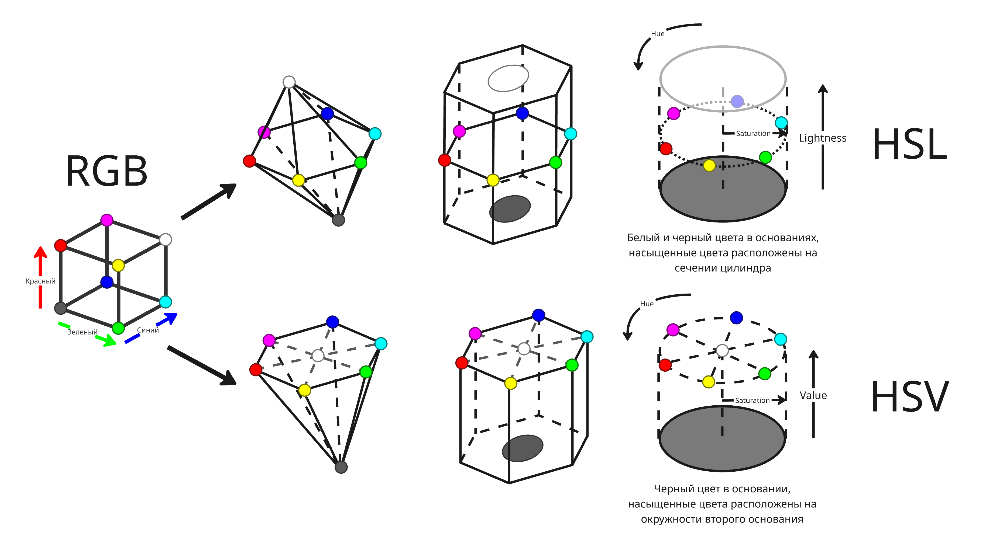
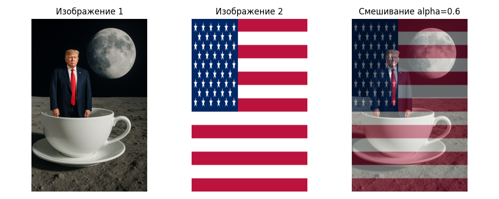
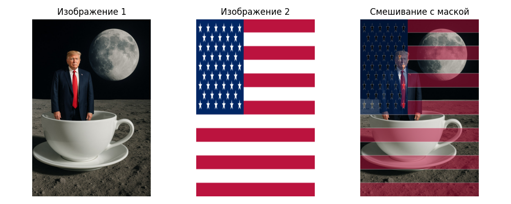
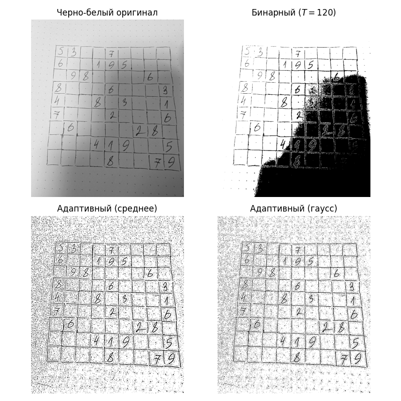
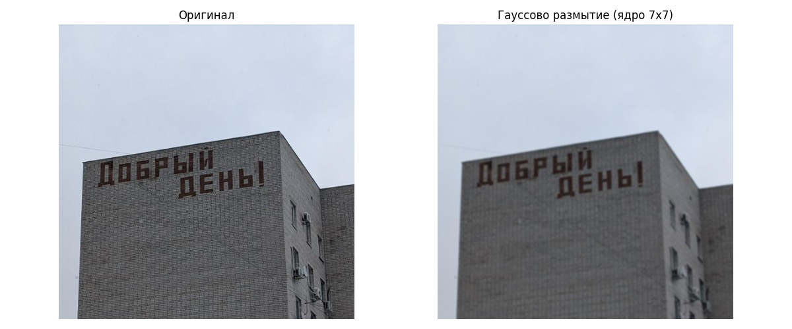
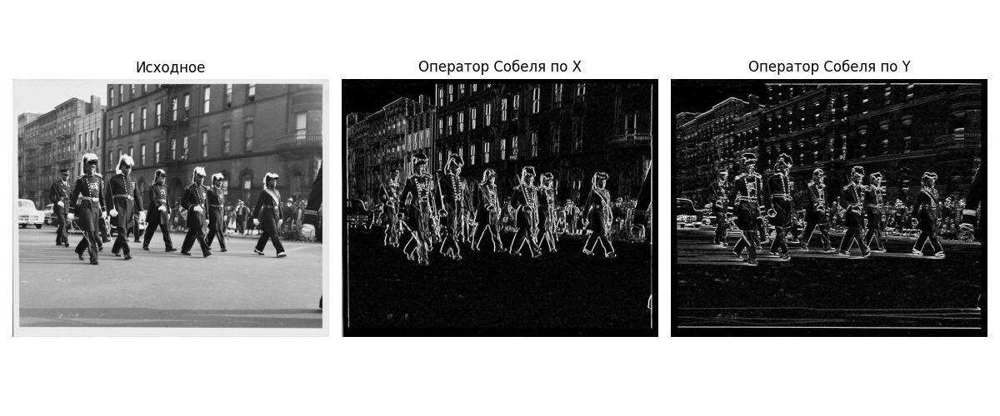
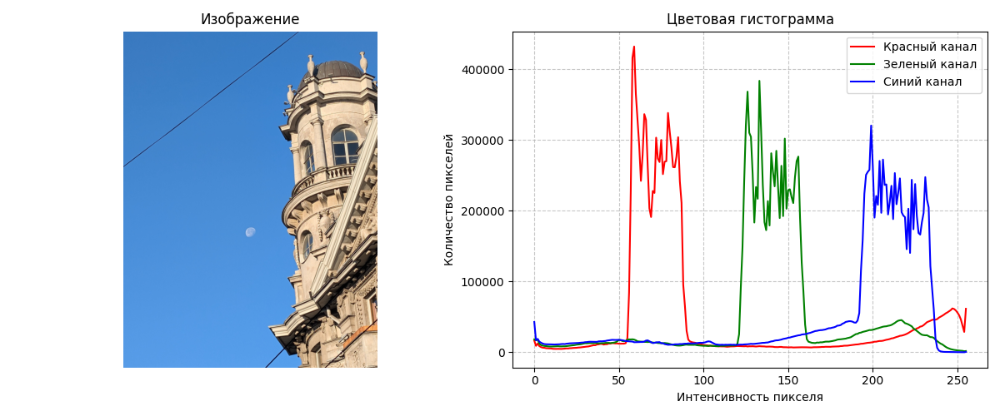
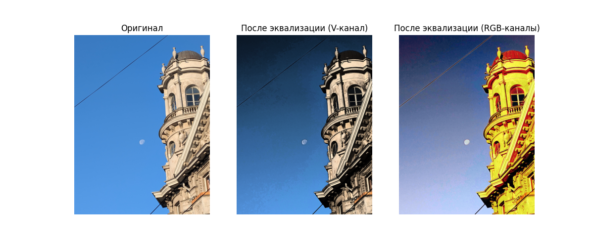

#  Методы машинного обучения в компьютерном зрении

* [Методы машинного обучения в компьютерном зрении](#%D0%BC%D0%B5%D1%82%D0%BE%D0%B4%D1%8B-%D0%BC%D0%B0%D1%88%D0%B8%D0%BD%D0%BD%D0%BE%D0%B3%D0%BE-%D0%BE%D0%B1%D1%83%D1%87%D0%B5%D0%BD%D0%B8%D1%8F-%D0%B2-%D0%BA%D0%BE%D0%BC%D0%BF%D1%8C%D1%8E%D1%82%D0%B5%D1%80%D0%BD%D0%BE%D0%BC-%D0%B7%D1%80%D0%B5%D0%BD%D0%B8%D0%B8)
  * [Лекция 1. Введение в компьютерное зрение](#%D0%BB%D0%B5%D0%BA%D1%86%D0%B8%D1%8F-1.-%D0%B2%D0%B2%D0%B5%D0%B4%D0%B5%D0%BD%D0%B8%D0%B5-%D0%B2-%D0%BA%D0%BE%D0%BC%D0%BF%D1%8C%D1%8E%D1%82%D0%B5%D1%80%D0%BD%D0%BE%D0%B5-%D0%B7%D1%80%D0%B5%D0%BD%D0%B8%D0%B5)
  * [Лекция 2. Обработка изображений](#%D0%BB%D0%B5%D0%BA%D1%86%D0%B8%D1%8F-2.-%D0%BE%D0%B1%D1%80%D0%B0%D0%B1%D0%BE%D1%82%D0%BA%D0%B0-%D0%B8%D0%B7%D0%BE%D0%B1%D1%80%D0%B0%D0%B6%D0%B5%D0%BD%D0%B8%D0%B9)

Компьютерное зрение (Computer Vision, CV) - это область создания технологий, позволяющих анализировать и интерпретировать визуальную информацию (то есть изображения и видео) с помощью алгоритмов машинного и глубокого обучения

На этом курсе будут рассматриваться базовые операции и цифровая обработка над изображениями, свёрточные нейронные сети, детектирование, основы трекинга объектов и генерация изображений

##  Лекция 1. Введение в компьютерное зрение

Компьютерное зрение появилось в 1960-ых годах в университетах, изучающих искусственный интеллект. В 1970-ых были разработаны базовые алгоритмы обнаружение углов, контуров, краев, а в 1990-ых годах методы компьютерного зрения применялись в компьютерной графике. В наше время машинное и глубокое обучение применяется в компьютерном зрении

Сейчас компьютерное зрение применяется в таких областях:

- Улучшение качества изображений, например, с помощью увеличения размерности
- Выделение признаков
- Распознавание лиц
- Локализация и классификация объектов
- Предсказание позы человека (Pose estimation)
- Работа с двумя изображениями (Stereo Vision)
- Генерация изображений и видео

---

Основной объект при работе с изображениями - это тензор. Тензор - это многомерный массив

Ранг тензора определяет размерность массива. Так тензор ранга 0 - это скалярное число, тензор ранга 1 - вектор, ранга 2 - матрица

Изображение в памяти компьютера хранится в виде матриц, как правило состоящих из беззнаковых 8-битных чисел

Сейчас самая распространенная цветовая модель - это модель RGB (Red-Green-Blue, Красный-Зеленый-Синий), поэтому изображения можно представить в виде 3 матриц, где каждая определяет цвет какого-либо пикселя

Самые распространенные операции, которые нам пригодятся:

- Скалярное произведение векторов $\vec a$ и $\vec b$: $(\vec a, \vec b) = \sum_{i = 0}^n a_i b_i = \vert \vec a \vert \vert \vec b \vert \cos \varphi$, где $\varphi$ - угол между векторами

- Произведение матриц $A_{m \times n}$ и $B_{n \times p}$:

    $A_{m \times n} \times B_{n \times p} = \begin{pmatrix}a_{1 1} & a_{1 2} & \dots & a_{1 n} \\\\ a_{2 1} & a_{2 2} & \dots & a_{2 n} \\\\ \vdots & \vdots & \ddots & \vdots \\\\ a_{m 1} & a_{m 2} & \dots & a_{m n}\end{pmatrix} \times \begin{pmatrix}b_{1 1} & b_{1 2} & \dots & b_{1 p} \\\\ b_{2 1} & b_{2 2} & \dots & b_{2 p} \\\\ \vdots & \vdots & \ddots & \vdots \\\\ b_{n 1} & b_{n 2} & \dots & b_{n p}\end{pmatrix} = \sum_{i = 1}^n \sum_{j = 1}^m \sum_{k = 1}^p a_{j i} \cdot b_{i k}$

- Произведение Адамара матриц $A_{m \times n}$ и $B_{m \times n}$:

    $A_{m \times n} \odot B_{m \times n} = \begin{pmatrix}a_{1 1} & a_{1 2} & \dots & a_{1 n} \\\\ a_{2 1} & a_{2 2} & \dots & a_{2 n} \\\\ \vdots & \vdots & \ddots & \vdots \\\\ a_{m 1} & a_{m 2} & \dots & a_{m n}\end{pmatrix} \odot \begin{pmatrix}b_{1 1} & b_{1 2} & \dots & b_{1 n} \\\\ b_{2 1} & b_{2 2} & \dots & b_{2 n} \\\\ \vdots & \vdots & \ddots & \vdots \\\\ b_{m 1} & b_{m 2} & \dots & b_{m n}\end{pmatrix} = \begin{pmatrix}a_{1 1} b_{1 1} & a_{1 2} b_{1 2} & \dots & a_{1 n} b_{1 n} \\\\ a_{2 1} b_{2 1} & a_{2 2} b_{2 2} & \dots & a_{2 n} b_{2 n} \\\\ \vdots & \vdots & \ddots & \vdots \\\\ a_{m 1} b_{m 1} & a_{m 2} b_{m 2} & \dots & a_{m n} b_{m n}\end{pmatrix}$

- Гомография

    $H \begin{pmatrix} x \\\\ y \\\\ 1 \end{pmatrix} = \begin{pmatrix} h_{1 1} & h_{1 2} & h_{1 3} \\\\ h_{2 1} & h_{2 2} & h_{2 3} \\\\ h_{3 1} & h_{3 2} & h_{3 3} \end{pmatrix} \begin{pmatrix} x \\\\ y \\\\ 1 \end{pmatrix} = \begin{pmatrix} x^\prime \\\\ y^\prime \\\\ 1 \end{pmatrix}$

    Гомография преобразует пространство, например, меняет перспективу изображения

##  Лекция 2. Обработка изображений

Помимо RGB-модели, где цвет пикселя кодируется используют и другие цветовые пространства:

* HSV (Hue, Saturation, Value или Brightness) - Тон, Насыщенность, Значение (или Яркость)
* HSL (Hue, Saturation, Lightness) - Тон, Насыщенность, Светлота

Если модель RGB представить как куб, где оси определяют значения в красном, зеленом и синем каналах, то этот куб можно деформировать так, что бы получить цилиндры, представляющие модели HSV и HSL

Алгебраически преобразования из RBG в HSL и HSV выглядят так:

1. Вычисляются максимум, минимум и диапазон значений RBG:

    $M = \max(R, G, B)$

    $m = \min(R, G, B)$

    $C = \mathrm{range}(R, G, B) = M - m$

2. Тон вычисляется так:

    $$H^\prime = \begin{cases}
        \text{не определено} & \text{если } C = 0 \\
        \frac{G - B}{C} \ \mathrm{mod} \ 6 & \text{если } M = R \\
        \frac{B - R}{C} + 2 & \text{если } M = G \\ 
        \frac{R - G}{C} + 4 & \text{если } M = B \end{cases}$$

    $$H = 60^\circ \cdot H^\prime$$

    Как можно заметить, тон - это угол между лучами из центра цилиндра, направленным к красному цвету (#FF0000) и целевому цвету

3. Светлота находится как среднее в интервале: $L = \mathrm{mid}(R, G, B) = \frac{1}{2} (M + m)$

4. Значение определяется как максимум: $V = \max(R, G, B) = M$

5. Насыщенность вычисляется так:

    $$S_V = \begin{cases}0 & \text{если } V = 0 \\ \frac{C}{V} & \text{в других случаях}\end{cases}$$

    $$S_L = \begin{cases}0 & \text{если } L = 1 \text{ или } L = 0 \\ \frac{C}{1 - \vert 2L - 1 \vert} & \text{в других случаях}\end{cases}$$

Также некоторые модели вместо значения и светлоты используют:

* Интенсивность (Intensity) - $I = \mathrm{avg}(R, G, B) = \frac{1}{3} (R + G + B)$

* Яркость (Luma), которая вычисляется как взвешенное среднее

    В разных стандартах сектора радиосвязи Международного союза электросвязи (ITU-R) применяют разные веса. Так для телевидения высокой четкости (HDTV, 1080p) применяют $Y^\prime_{709} = 0.2126R + 0.7152G + 0.0722B$, а для телевидения сверхвысокой четкости (UHDTV, то есть 4K и 8K) и с расширенным динамическим диапазоном (HDR) используют $Y^\prime_{2020} = 0.2627 R + 0.6780 G + 0.0593 B$

---

Теперь рассмотрим базовые алгоритмы обработки изображений:

* Смешивание (Blending) - алгоритм, позволяющий смешать два изображения в одно

    В тривиальное случае смешивание - это среднее взвешенное значений двух пикселей изображения:

    

    Вес пикселя первого изображения обозначается $\alpha$. Значение конечного пикселя вычисляется как $\mathrm{dst}(x, y) = \alpha \cdot \mathrm{src}_1 (x, y) + (1 + \alpha) \cdot \mathrm{src}_2 (x, y)$, где $\mathrm{src}_1 (x, y)$ - значение пикселя на первой картинке, а $\mathrm{src}_2 (x, y)$ - на второй

    В более усложненном алгоритме значение конечного пикселя выглядит так: $\mathrm{dst}(x, y) = \alpha \cdot \mathrm{src}_1 (x, y) + \beta \cdot \mathrm{src}_2 (x, y) + \gamma$, где $\alpha, \beta$ - веса, а $\gamma$ - смещение

    Смешивание полезно, чтобы добавить водяной знак на изображение. Обычно водяной знак изображается на белом фоне, который можно убрать с помощью маски:

    

    > Код примера: [cvmethods_blending.py](./examples/cvmethods_blending.py)

* Пороговая обработка (Image Thresholding) - алгоритм, который преобразует пиксели исходного изображения, значения которых проходят порог $T$, в один цвет, а те, которые не проходят порог $T$, в другой:

    $\mathrm{dst}(x, y) = \mathrm{src}(x + i, y + j) \cdot I(\mathrm{src}(x + i, y + j) \geq T)$ (здесь $I(x)$ - индикатор, равный 1, если выражение $x$ верно, иначе 0)

    Порог может быть глобальным для всех сегментов изображения, но если на изображении яркость меняется (например, есть тень), то глобальный порог работает плохо

    Чтобы исправить это, используют адаптивный порог. Есть два популярных подхода:

    * Средняя пороговая обработка. В нем порог равен среднему от соседних в окне $k \times k$ пикселях

        $\mathrm{dst}(x, y) = \frac{1}{(2k + 1)(2k + 1)} \sum_{i = -k}^k \sum_{j = -k}^k \mathrm{src}(x + i, y + j)$

    * Гауссовская пороговая обработка. Здесь значение пикселя взвешивается относительно того, насколько он далеко от целевого, с помощью функции Гаусса: $\displaystyle G(x, y) = \frac{1}{2\pi \sigma^2} e^{-\frac{x^2 + y^2}{2 \sigma^2}}$

        $\mathrm{dst}(x, y) = \frac{1}{(2k + 1)(2k + 1)} \sum_{i = -k}^k \sum_{j = -k}^k \mathrm{src}(x + i, y + j) G(i, j)$

    

    > Код примера: [cvmethods_thresholding.py](./examples/cvmethods_thresholding.py)

* Размытие (Blurring) - обработка изображения так, что число деталей уменьшается, но при этом не теряется общая структура изображения

    Сейчас самый распространенный алгоритм - это гауссовское размытие, который использует функцию Гаусса

    С помощью окна свертки выбранного размера $k \times k$ вычисляется значение конечного пикселя: $\displaystyle \mathrm{dst}(x, y) = \sum_{i = -k}^k \sum_{j = -k}^k G(i, j) \mathrm{src}(x + i, y + j)$

    

    > Код примера: [cvmethods_blur.py](./examples/cvmethods_blur.py)

* Градиент (Gradient)

    Градиент позволяет обнаруживать резкие переходы цветов на картинке. Выходное изображение показывает светлые пиксели там, где значение пикселей исходного изображения меняются сильно

    Градиент определяется аналогично, как и в матанализе: $\nabla f = \begin{pmatrix}\frac{\partial f}{\partial x} \\ \frac{\partial f}{\partial y}\end{pmatrix}$ - направление наискорейшего роста

    Вместо градиентов используют приближение в виде операторов Собеля: для градиента по оси $Ox$ - $\begin{pmatrix}-1 & 0 & 1 \\ -2 & 0 & 2 \\ -1 & 0 & 1\end{pmatrix}$, для градиента по оси $Oy$ - $\begin{pmatrix}-1 & -2 & -1 \\ 0 & 0 & 0 \\ 1 & 2 & 1\end{pmatrix}$

    

    Градиент помогает найти края объектов

    > Код примера: [cvmethods_gradient.py](./examples/cvmethods_gradient.py)

* Цветовая гистограмма

    Цветовая гистограмма показывает частоты значений пикселей красного, зеленого и синего (или других) каналов

    

    Здесь на картинке большинство пикселей голубые, поэтому видим три большие пика, которые составляют голубой цвет

    К гистограмме можно применить эквализацию, что позволяет повысить контрастность изображения

    Эквализация работает так:

    1. На основе цветовой гистограммы строится кумулятивная функция $F(x)$, которая равна доли пикселей, значения которых не больше $x$, из всех

    2. Значение конечного пикселя вычисляется как $\mathrm{dst}(x, y) = \mathrm{round}((N - 1) \cdot F(\mathrm{src}(x, y)))$, где $N$ - максимальное допустимое значение для пикселя

    Это работает на черно-белой картинке, но не на цветной, так как оттенки меняются слишком сильно. Вместо этого изображение конвертируют в HSV и эквализацию применяют на канале со значением Value:

    

    > Код примера: [cvmethods_color_hist.py](./examples/cvmethods_color_hist.py)

