<!-- This file is generated by assets.build.markdown.superconspect_builder. All changes to it will be lost -->

#  Методы машинного обучения в компьютерном зрении

* [Методы машинного обучения в компьютерном зрении](#%D0%BC%D0%B5%D1%82%D0%BE%D0%B4%D1%8B-%D0%BC%D0%B0%D1%88%D0%B8%D0%BD%D0%BD%D0%BE%D0%B3%D0%BE-%D0%BE%D0%B1%D1%83%D1%87%D0%B5%D0%BD%D0%B8%D1%8F-%D0%B2-%D0%BA%D0%BE%D0%BC%D0%BF%D1%8C%D1%8E%D1%82%D0%B5%D1%80%D0%BD%D0%BE%D0%BC-%D0%B7%D1%80%D0%B5%D0%BD%D0%B8%D0%B8)
  * [Лекция 1. Введение в компьютерное зрение](#%D0%BB%D0%B5%D0%BA%D1%86%D0%B8%D1%8F-1.-%D0%B2%D0%B2%D0%B5%D0%B4%D0%B5%D0%BD%D0%B8%D0%B5-%D0%B2-%D0%BA%D0%BE%D0%BC%D0%BF%D1%8C%D1%8E%D1%82%D0%B5%D1%80%D0%BD%D0%BE%D0%B5-%D0%B7%D1%80%D0%B5%D0%BD%D0%B8%D0%B5)
  * [Лекция 2. Обработка изображений](#%D0%BB%D0%B5%D0%BA%D1%86%D0%B8%D1%8F-2.-%D0%BE%D0%B1%D1%80%D0%B0%D0%B1%D0%BE%D1%82%D0%BA%D0%B0-%D0%B8%D0%B7%D0%BE%D0%B1%D1%80%D0%B0%D0%B6%D0%B5%D0%BD%D0%B8%D0%B9)
  * [Лекция 3. Основы глубокого обучения](#%D0%BB%D0%B5%D0%BA%D1%86%D0%B8%D1%8F-3.-%D0%BE%D1%81%D0%BD%D0%BE%D0%B2%D1%8B-%D0%B3%D0%BB%D1%83%D0%B1%D0%BE%D0%BA%D0%BE%D0%B3%D0%BE-%D0%BE%D0%B1%D1%83%D1%87%D0%B5%D0%BD%D0%B8%D1%8F)
  * [Лекция 4. Сверточные нейронные сети](#%D0%BB%D0%B5%D0%BA%D1%86%D0%B8%D1%8F-4.-%D1%81%D0%B2%D0%B5%D1%80%D1%82%D0%BE%D1%87%D0%BD%D1%8B%D0%B5-%D0%BD%D0%B5%D0%B9%D1%80%D0%BE%D0%BD%D0%BD%D1%8B%D0%B5-%D1%81%D0%B5%D1%82%D0%B8)
    * [Классификация](#%D0%BA%D0%BB%D0%B0%D1%81%D1%81%D0%B8%D1%84%D0%B8%D0%BA%D0%B0%D1%86%D0%B8%D1%8F)
  * [Лекция 5. Задача детектирования объектов](#%D0%BB%D0%B5%D0%BA%D1%86%D0%B8%D1%8F-5.-%D0%B7%D0%B0%D0%B4%D0%B0%D1%87%D0%B0-%D0%B4%D0%B5%D1%82%D0%B5%D0%BA%D1%82%D0%B8%D1%80%D0%BE%D0%B2%D0%B0%D0%BD%D0%B8%D1%8F-%D0%BE%D0%B1%D1%8A%D0%B5%D0%BA%D1%82%D0%BE%D0%B2)
    * [Одностадийная детекция](#%D0%BE%D0%B4%D0%BD%D0%BE%D1%81%D1%82%D0%B0%D0%B4%D0%B8%D0%B9%D0%BD%D0%B0%D1%8F-%D0%B4%D0%B5%D1%82%D0%B5%D0%BA%D1%86%D0%B8%D1%8F)
    * [Двухстадийная детекция](#%D0%B4%D0%B2%D1%83%D1%85%D1%81%D1%82%D0%B0%D0%B4%D0%B8%D0%B9%D0%BD%D0%B0%D1%8F-%D0%B4%D0%B5%D1%82%D0%B5%D0%BA%D1%86%D0%B8%D1%8F)
    * [Детектирование на основе точек](#%D0%B4%D0%B5%D1%82%D0%B5%D0%BA%D1%82%D0%B8%D1%80%D0%BE%D0%B2%D0%B0%D0%BD%D0%B8%D0%B5-%D0%BD%D0%B0-%D0%BE%D1%81%D0%BD%D0%BE%D0%B2%D0%B5-%D1%82%D0%BE%D1%87%D0%B5%D0%BA)
    * [Распознавание текста](#%D1%80%D0%B0%D1%81%D0%BF%D0%BE%D0%B7%D0%BD%D0%B0%D0%B2%D0%B0%D0%BD%D0%B8%D0%B5-%D1%82%D0%B5%D0%BA%D1%81%D1%82%D0%B0)
  * [Лекция 6. Сегментация изображений и обработка видеопотока](#%D0%BB%D0%B5%D0%BA%D1%86%D0%B8%D1%8F-6.-%D1%81%D0%B5%D0%B3%D0%BC%D0%B5%D0%BD%D1%82%D0%B0%D1%86%D0%B8%D1%8F-%D0%B8%D0%B7%D0%BE%D0%B1%D1%80%D0%B0%D0%B6%D0%B5%D0%BD%D0%B8%D0%B9-%D0%B8-%D0%BE%D0%B1%D1%80%D0%B0%D0%B1%D0%BE%D1%82%D0%BA%D0%B0-%D0%B2%D0%B8%D0%B4%D0%B5%D0%BE%D0%BF%D0%BE%D1%82%D0%BE%D0%BA%D0%B0)
    * [Сегментация изображений](#%D1%81%D0%B5%D0%B3%D0%BC%D0%B5%D0%BD%D1%82%D0%B0%D1%86%D0%B8%D1%8F-%D0%B8%D0%B7%D0%BE%D0%B1%D1%80%D0%B0%D0%B6%D0%B5%D0%BD%D0%B8%D0%B9)
    * [Обработка видеопотока](#%D0%BE%D0%B1%D1%80%D0%B0%D0%B1%D0%BE%D1%82%D0%BA%D0%B0-%D0%B2%D0%B8%D0%B4%D0%B5%D0%BE%D0%BF%D0%BE%D1%82%D0%BE%D0%BA%D0%B0)
      * [Оптический поток](#%D0%BE%D0%BF%D1%82%D0%B8%D1%87%D0%B5%D1%81%D0%BA%D0%B8%D0%B9-%D0%BF%D0%BE%D1%82%D0%BE%D0%BA)
      * [Отслеживание объектов](#%D0%BE%D1%82%D1%81%D0%BB%D0%B5%D0%B6%D0%B8%D0%B2%D0%B0%D0%BD%D0%B8%D0%B5-%D0%BE%D0%B1%D1%8A%D0%B5%D0%BA%D1%82%D0%BE%D0%B2)
  * [Лекция 7. Методы оценки положения объектов в пространстве](#%D0%BB%D0%B5%D0%BA%D1%86%D0%B8%D1%8F-7.-%D0%BC%D0%B5%D1%82%D0%BE%D0%B4%D1%8B-%D0%BE%D1%86%D0%B5%D0%BD%D0%BA%D0%B8-%D0%BF%D0%BE%D0%BB%D0%BE%D0%B6%D0%B5%D0%BD%D0%B8%D1%8F-%D0%BE%D0%B1%D1%8A%D0%B5%D0%BA%D1%82%D0%BE%D0%B2-%D0%B2-%D0%BF%D1%80%D0%BE%D1%81%D1%82%D1%80%D0%B0%D0%BD%D1%81%D1%82%D0%B2%D0%B5)
    * [Карта глубины](#%D0%BA%D0%B0%D1%80%D1%82%D0%B0-%D0%B3%D0%BB%D1%83%D0%B1%D0%B8%D0%BD%D1%8B)
    * [Поиск похожих изображений](#%D0%BF%D0%BE%D0%B8%D1%81%D0%BA-%D0%BF%D0%BE%D1%85%D0%BE%D0%B6%D0%B8%D1%85-%D0%B8%D0%B7%D0%BE%D0%B1%D1%80%D0%B0%D0%B6%D0%B5%D0%BD%D0%B8%D0%B9)
    * [Распознавание лиц](#%D1%80%D0%B0%D1%81%D0%BF%D0%BE%D0%B7%D0%BD%D0%B0%D0%B2%D0%B0%D0%BD%D0%B8%D0%B5-%D0%BB%D0%B8%D1%86)
  * [X. Программа экзамена 2025/2026](#x.-%D0%BF%D1%80%D0%BE%D0%B3%D1%80%D0%B0%D0%BC%D0%BC%D0%B0-%D1%8D%D0%BA%D0%B7%D0%B0%D0%BC%D0%B5%D0%BD%D0%B0-2025%2F2026)

<!-- begin cvmethods_2026_02_10.md -->
Компьютерное зрение (Computer Vision, CV) - это область создания технологий, позволяющих анализировать и интерпретировать визуальную информацию (то есть изображения и видео) с помощью алгоритмов машинного и глубокого обучения

На этом курсе будут рассматриваться базовые операции и цифровая обработка над изображениями, свёрточные нейронные сети, детектирование, основы трекинга объектов и генерация изображений

##  Лекция 1. Введение в компьютерное зрение

Компьютерное зрение появилось в 1960-ых годах в университетах, изучающих искусственный интеллект. В 1970-ых были разработаны базовые алгоритмы обнаружение углов, контуров, краев, а в 1990-ых годах методы компьютерного зрения применялись в компьютерной графике. В наше время машинное и глубокое обучение применяется в компьютерном зрении

Сейчас компьютерное зрение применяется в таких областях:

- Улучшение качества изображений, например, с помощью увеличения размерности
- Выделение признаков
- Распознавание лиц
- Локализация и классификация объектов
- Предсказание позы человека (Pose estimation)
- Работа с двумя изображениями (Stereo Vision)
- Генерация изображений и видео

---

Основной объект при работе с изображениями - это тензор. Тензор - это многомерный массив

Ранг тензора определяет размерность массива. Так тензор ранга 0 - это скалярное число, тензор ранга 1 - вектор, ранга 2 - матрица

Изображение в памяти компьютера хранится в виде матриц, как правило состоящих из беззнаковых 8-битных чисел

Сейчас самая распространенная цветовая модель - это модель RGB (Red-Green-Blue, Красный-Зеленый-Синий), поэтому изображения можно представить в виде 3 матриц, где каждая определяет цвет какого-либо пикселя

Самые распространенные операции, которые нам пригодятся:

- Скалярное произведение векторов $\vec a$ и $\vec b$: $(\vec a, \vec b) = \sum_{i = 0}^n a_i b_i = \vert \vec a \vert \vert \vec b \vert \cos \varphi$, где $\varphi$ - угол между векторами

- Произведение матриц $A_{m \times n}$ и $B_{n \times p}$:

    $A_{m \times n} \times B_{n \times p} = \begin{pmatrix}a_{1 1} & a_{1 2} & \dots & a_{1 n} \\\\ a_{2 1} & a_{2 2} & \dots & a_{2 n} \\\\ \vdots & \vdots & \ddots & \vdots \\\\ a_{m 1} & a_{m 2} & \dots & a_{m n}\end{pmatrix} \times \begin{pmatrix}b_{1 1} & b_{1 2} & \dots & b_{1 p} \\\\ b_{2 1} & b_{2 2} & \dots & b_{2 p} \\\\ \vdots & \vdots & \ddots & \vdots \\\\ b_{n 1} & b_{n 2} & \dots & b_{n p}\end{pmatrix} = \sum_{i = 1}^n \sum_{j = 1}^m \sum_{k = 1}^p a_{j i} \cdot b_{i k}$

- Произведение Адамара матриц $A_{m \times n}$ и $B_{m \times n}$:

    $A_{m \times n} \odot B_{m \times n} = \begin{pmatrix}a_{1 1} & a_{1 2} & \dots & a_{1 n} \\\\ a_{2 1} & a_{2 2} & \dots & a_{2 n} \\\\ \vdots & \vdots & \ddots & \vdots \\\\ a_{m 1} & a_{m 2} & \dots & a_{m n}\end{pmatrix} \odot \begin{pmatrix}b_{1 1} & b_{1 2} & \dots & b_{1 n} \\\\ b_{2 1} & b_{2 2} & \dots & b_{2 n} \\\\ \vdots & \vdots & \ddots & \vdots \\\\ b_{m 1} & b_{m 2} & \dots & b_{m n}\end{pmatrix} = \begin{pmatrix}a_{1 1} b_{1 1} & a_{1 2} b_{1 2} & \dots & a_{1 n} b_{1 n} \\\\ a_{2 1} b_{2 1} & a_{2 2} b_{2 2} & \dots & a_{2 n} b_{2 n} \\\\ \vdots & \vdots & \ddots & \vdots \\\\ a_{m 1} b_{m 1} & a_{m 2} b_{m 2} & \dots & a_{m n} b_{m n}\end{pmatrix}$

- Гомография

    $H \begin{pmatrix} x \\\\ y \\\\ 1 \end{pmatrix} = \begin{pmatrix} h_{1 1} & h_{1 2} & h_{1 3} \\\\ h_{2 1} & h_{2 2} & h_{2 3} \\\\ h_{3 1} & h_{3 2} & h_{3 3} \end{pmatrix} \begin{pmatrix} x \\\\ y \\\\ 1 \end{pmatrix} = \begin{pmatrix} x^\prime \\\\ y^\prime \\\\ 1 \end{pmatrix}$

    Гомография преобразует пространство, например, меняет перспективу изображения
<!-- end cvmethods_2026_02_10.md -->

<!-- begin cvmethods_2026_02_17.md -->
##  Лекция 2. Обработка изображений

Помимо RGB-модели, где цвет пикселя кодируется используют и другие цветовые пространства:

* HSV (Hue, Saturation, Value или Brightness) - Тон, Насыщенность, Значение (или Яркость)
* HSL (Hue, Saturation, Lightness) - Тон, Насыщенность, Светлота

Если модель RGB представить как куб, где оси определяют значения в красном, зеленом и синем каналах, то этот куб можно деформировать так, что бы получить цилиндры, представляющие модели HSV и HSL

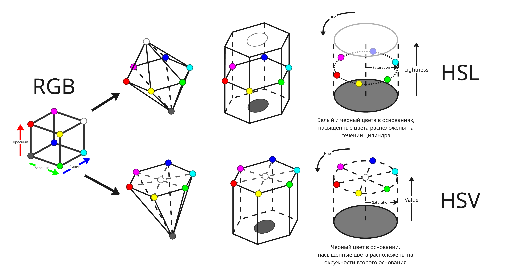

Алгебраически преобразования из RBG в HSL и HSV выглядят так:

1. Вычисляются максимум, минимум и диапазон значений RBG:

    $M = \max(R, G, B)$

    $m = \min(R, G, B)$

    $C = \mathrm{range}(R, G, B) = M - m$

2. Тон вычисляется так:

    $$H^\prime = \begin{cases}
        \text{не определено} & \text{если } C = 0 \\
        \frac{G - B}{C} \ \mathrm{mod} \ 6 & \text{если } M = R \\
        \frac{B - R}{C} + 2 & \text{если } M = G \\ 
        \frac{R - G}{C} + 4 & \text{если } M = B \end{cases}$$

    $$H = 60^\circ \cdot H^\prime$$

    Как можно заметить, тон - это угол между лучами из центра цилиндра, направленным к красному цвету (#FF0000) и целевому цвету

3. Светлота находится как среднее в интервале: $L = \mathrm{mid}(R, G, B) = \frac{1}{2} (M + m)$

4. Значение определяется как максимум: $V = \max(R, G, B) = M$

5. Насыщенность вычисляется так:

    $$S_V = \begin{cases}0 & \text{если } V = 0 \\ \frac{C}{V} & \text{в других случаях}\end{cases}$$

    $$S_L = \begin{cases}0 & \text{если } L = 1 \text{ или } L = 0 \\ \frac{C}{1 - \vert 2L - 1 \vert} & \text{в других случаях}\end{cases}$$

Также некоторые модели вместо значения и светлоты используют:

* Интенсивность (Intensity) - $I = \mathrm{avg}(R, G, B) = \frac{1}{3} (R + G + B)$

* Яркость (Luma), которая вычисляется как взвешенное среднее

    В разных стандартах сектора радиосвязи Международного союза электросвязи (ITU-R) применяют разные веса. Так для телевидения высокой четкости (HDTV, 1080p) применяют $Y^\prime_{709} = 0.2126R + 0.7152G + 0.0722B$, а для телевидения сверхвысокой четкости (UHDTV, то есть 4K и 8K) и с расширенным динамическим диапазоном (HDR) используют $Y^\prime_{2020} = 0.2627 R + 0.6780 G + 0.0593 B$

---

Теперь рассмотрим базовые алгоритмы обработки изображений:

* Смешивание (Blending) - алгоритм, позволяющий смешать два изображения в одно

    В тривиальное случае смешивание - это среднее взвешенное значений двух пикселей изображения:

    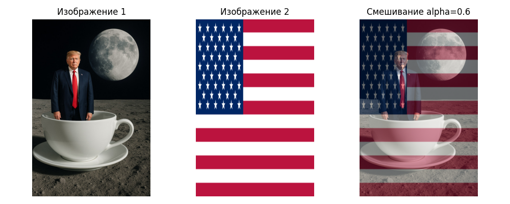

    Вес пикселя первого изображения обозначается $\alpha$. Значение конечного пикселя вычисляется как $\mathrm{dst}(x, y) = \alpha \cdot \mathrm{src}_1 (x, y) + (1 + \alpha) \cdot \mathrm{src}_2 (x, y)$, где $\mathrm{src}_1 (x, y)$ - значение пикселя на первой картинке, а $\mathrm{src}_2 (x, y)$ - на второй

    В более усложненном алгоритме значение конечного пикселя выглядит так: $\mathrm{dst}(x, y) = \alpha \cdot \mathrm{src}_1 (x, y) + \beta \cdot \mathrm{src}_2 (x, y) + \gamma$, где $\alpha, \beta$ - веса, а $\gamma$ - смещение

    Смешивание полезно, чтобы добавить водяной знак на изображение. Обычно водяной знак изображается на белом фоне, который можно убрать с помощью маски:

    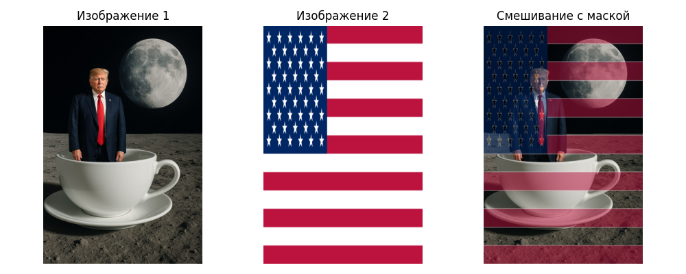

    > Код примера: [cvmethods_blending.py](./examples/cvmethods_blending.py)

* Пороговая обработка (Image Thresholding) - алгоритм, который преобразует пиксели исходного изображения, значения которых проходят порог $T$, в один цвет, а те, которые не проходят порог $T$, в другой:

    $\mathrm{dst}(x, y) = \mathrm{src}(x + i, y + j) \cdot I(\mathrm{src}(x + i, y + j) \geq T)$ (здесь $I(x)$ - индикатор, равный 1, если выражение $x$ верно, иначе 0)

    Порог может быть глобальным для всех сегментов изображения, но если на изображении яркость меняется (например, есть тень), то глобальный порог работает плохо

    Чтобы исправить это, используют адаптивный порог. Есть два популярных подхода:

    * Средняя пороговая обработка. В нем порог равен среднему от соседних в окне $k \times k$ пикселях

        $\mathrm{dst}(x, y) = \frac{1}{(2k + 1)(2k + 1)} \sum_{i = -k}^k \sum_{j = -k}^k \mathrm{src}(x + i, y + j)$

    * Гауссовская пороговая обработка. Здесь значение пикселя взвешивается относительно того, насколько он далеко от целевого, с помощью функции Гаусса: $\displaystyle G(x, y) = \frac{1}{2\pi \sigma^2} e^{-\frac{x^2 + y^2}{2 \sigma^2}}$

        $\mathrm{dst}(x, y) = \frac{1}{(2k + 1)(2k + 1)} \sum_{i = -k}^k \sum_{j = -k}^k \mathrm{src}(x + i, y + j) G(i, j)$

    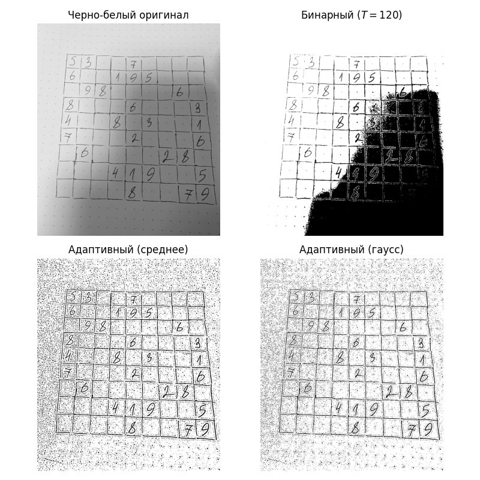

    > Код примера: [cvmethods_thresholding.py](./examples/cvmethods_thresholding.py)

* Размытие (Blurring) - обработка изображения так, что число деталей уменьшается, но при этом не теряется общая структура изображения

    Сейчас самый распространенный алгоритм - это гауссовское размытие, который использует функцию Гаусса

    С помощью окна свертки выбранного размера $k \times k$ вычисляется значение конечного пикселя: $\displaystyle \mathrm{dst}(x, y) = \sum_{i = -k}^k \sum_{j = -k}^k G(i, j) \mathrm{src}(x + i, y + j)$

    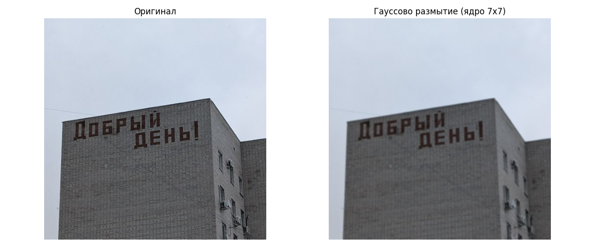

    > Код примера: [cvmethods_blur.py](./examples/cvmethods_blur.py)

* Градиент (Gradient)

    Градиент позволяет обнаруживать резкие переходы цветов на картинке. Выходное изображение показывает светлые пиксели там, где значение пикселей исходного изображения меняются сильно

    Градиент определяется аналогично, как и в матанализе: $\nabla f = \begin{pmatrix}\frac{\partial f}{\partial x} \\ \frac{\partial f}{\partial y}\end{pmatrix}$ - направление наискорейшего роста

    Вместо градиентов используют приближение в виде операторов Собеля: для градиента по оси $Ox$ - $$\begin{pmatrix}-1 & 0 & 1 \\ -2 & 0 & 2 \\ -1 & 0 & 1\end{pmatrix}$$, для градиента по оси $Oy$ - $$\begin{pmatrix}-1 & -2 & -1 \\ 0 & 0 & 0 \\ 1 & 2 & 1\end{pmatrix}$$

    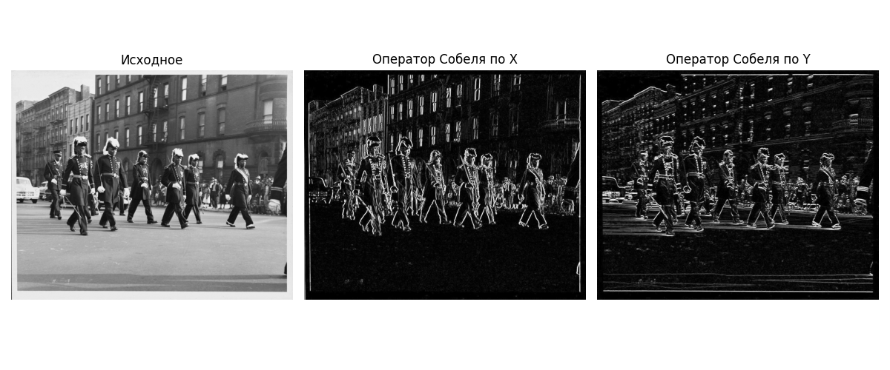

    Градиент помогает найти края объектов

    > Код примера: [cvmethods_gradient.py](./examples/cvmethods_gradient.py)

* Цветовая гистограмма

    Цветовая гистограмма показывает частоты значений пикселей красного, зеленого и синего (или других) каналов

    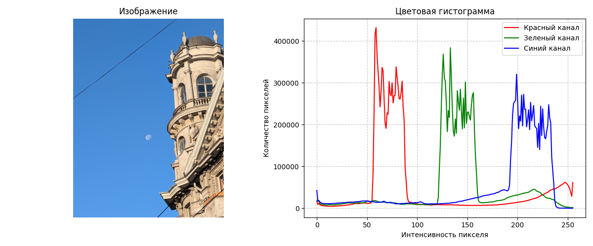

    Здесь на картинке большинство пикселей голубые, поэтому видим три большие пика, которые составляют голубой цвет

    К гистограмме можно применить эквализацию, что позволяет повысить контрастность изображения

    Эквализация работает так:

    1. На основе цветовой гистограммы строится кумулятивная функция $F(x)$, которая равна доли пикселей, значения которых не больше $x$, из всех

    2. Значение конечного пикселя вычисляется как $\mathrm{dst}(x, y) = \mathrm{round}((N - 1) \cdot F(\mathrm{src}(x, y)))$, где $N$ - максимальное допустимое значение для пикселя

    Это работает на черно-белой картинке, но не на цветной, так как оттенки меняются слишком сильно. Вместо этого изображение конвертируют в HSV и эквализацию применяют на канале со значением Value:

    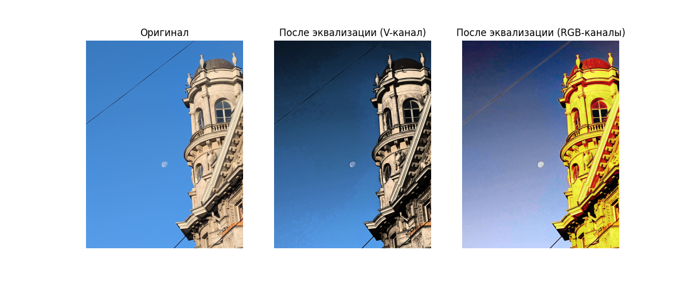

    > Код примера: [cvmethods_color_hist.py](./examples/cvmethods_color_hist.py)
<!-- end cvmethods_2026_02_17.md -->

<!-- begin cvmethods_2026_02_24.md -->
##  Лекция 3. Основы глубокого обучения

Ключевым открытием в машинном обучении стало разработка архитектуры нейронных сетей

В человеческом мозге примерно 100 миллиардов нейронов, которые обмениваются сигналами

Человек распознает картинки с помощью множества областей в мозге. Сам нейрон выдает сигналы с частотой ~200 Гц в активированном состоянии, из-за чего мозг распознает изображение за ~200 мс, а также способен обучаться на малой выборке, благодаря пластичность (способности перестраиваться) мозга

Сейчас процессор компьютера работает с частотой 3-6 ГГц (на 7 порядков больше), что позволяется использоваться модели сетей из нейронов для решения задач с нетривиальной зависимостью

Сейчас предпринимается множество попыток смоделировать работу структур мозга. Ученые уже смогли построить трехмерную модель синапса, включающего 300 тысяч белков, с помощью которого нейроны общаются

---

Из курса математического анализа известно, что сколь угодно сложную функцию можно представить как композицию наиболее простых (например, преобразование Фурье), поэтому решать сложные задачи можно с помощью кучи нейронов

В 1943 году появилась модель нейрона МакКаллока-Питтса, в 1948 Алан Тьюринг высказал идею искусственных сетей, а в 1958 году Розенблатт разработал первый перцептрон - полносвязную нейросеть

В 1969 году Брисон и Хобэк разработали алгоритм обратного распространения, который применили в 1974 году к нейросетям, благодаря чему стало возможным обучение нейросети

В 1990-ых развитие пришло в тупик из-за слабых мощностей железа, но в 2000-ых появились графические ускорители, алгоритмы инициализации весов и регуляризации и так далее. С середины 2010-ых нейросети начали применятся в обработке текстов на естественном языке, что привело к созданию ChatGPT, Gemini, Grok и так далее

---

Нейрон в типичной нейронной сети представляет из себя линейную комбинацию значений на предыдущем слое и применение функции активации

> Подробнее нейронные сети описаны в курсе [машинного обучения](https://pelmesh619.github.io/itmo_conspects/machlearn/machlearn_superconspect.html#%D0%BB%D0%B5%D0%BA%D1%86%D0%B8%D1%8F-11.-%D0%B3%D0%BB%D1%83%D0%B1%D0%BE%D0%BA%D0%BE%D0%B5-%D0%BE%D0%B1%D1%83%D1%87%D0%B5%D0%BD%D0%B8%D0%B5)

Вместо функции активации используют:

* Функцию сигмоиды, использующаяся в задача логистической регрессии:

    $$\sigma(x) = \frac{1}{1 + e^{-x}}$$

* Гиперболический тангенс:

    $$\mathrm{tanh}(x) = \frac{e^x - e^{-x}}{e^x + e^{-x}}$$

* ReLU (Rectified Linear Unit):

    $$\mathrm{ReLU}(x) = \begin{cases}0 & x < 0 \\ x & x \geq 0\end{cases}$$

* Leaky ReLU:

    $$\mathrm{LeakyReLU}(x) = \begin{cases}\alpha x, & x < 0, \\ x, & x \geq 0,\end{cases}$$

* GELU (Gaussian Error Linear Unit), использующийся в моделировании языка:

    $$\mathrm{GELU}(x) = x P(X \leq x) = x \Phi(x) \text{ , где } X \in N(0, 1)$$

    Обычно используют приближение $\mathrm{GELU}(x) = x \sigma(1.702 \cdot x)$

* Softplus:

    $$\mathrm{Softplus}(x) = \frac{1}{\beta} \log(1 + e^{\beta x})$$

* Swish:

    $$\mathrm{Swish}(x) = x \sigma(\beta x) = \frac{x}{1 + e^{-\beta} x}$$

<!-- https://www.geogebra.org/calculator/x7qfg7yz -->

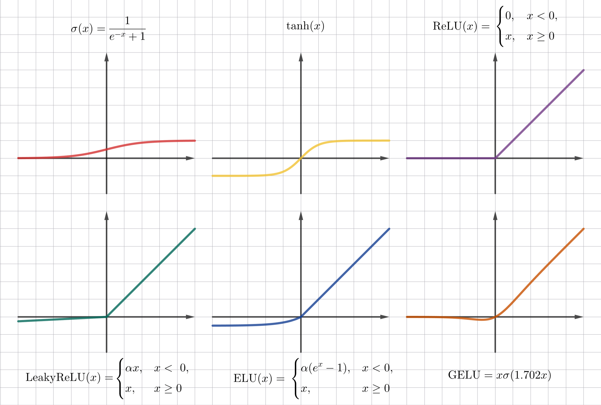

<!-- https://www.geogebra.org/calculator/xsvh3cn8 -->

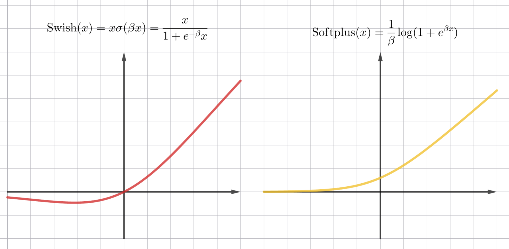

---

Нейросеть представляет композицию нейронов или же большую сложную функцию. Такую нейросеть можно задать графом вычислений

Оптимизировать сложную функцию можно с помощью градиентного спуска. Мы измеряем эффективность нашей нейросети с помощью функции потерь $\mathcal{L}(W)$, которая представляет различие между предсказанным результатом и истинным, где $W$ - это веса нейронов, поэтому можно найти градиент от этой функции, который равен вектору наибольшего роста функции потерь

Если веса изменять в противоположном направлении градиента:

$$W^\prime = W - \eta \nabla \mathcal{L}(W),$$

где $\eta$ - скорость обучения, то функция потерь будет уменьшаться

Проблем с градиентным спуском есть несколько:

* Возможность прийти к локальному минимуму, а не глобальному
* Градиентный спуск все время "прыгает" вокруг минимума, но не достигает его

Эти проблемы решаются с помощью правильного выбора оптимизатора и скорости обучения

Далее с помощью обратного распространения находится градиент от функции потерь для каждого нейрона, что позволяет отрегулировать его веса

Еще одним полезным приемом являются стохастический или пакетный градиентные спуски. Вместо всей тренировочной выборки используются лишь часть для обновления весов

Рассмотрим подходы для адаптивной скорости обучения и оптимизаторы:

* Линейное уменьшение (Linear Decay). При линейном уменьшении скорость обучения $\eta$ (eta, шаг) убывает пропорционально номеру эпохи или итерации: $\eta_t = \eta_0 \cdot \gamma^{\lfloor \frac{t}{s} \rfloor}$, где $s$ - шаг, через сколько эпох уменьшать скорость

* Экспоненциальное уменьшение (Exponential Decay). При экспоненциальном уменьшении скорость обучения падает в геометрической прогрессии. С каждой эпохой текущую скорость обучения умножается на постоянный коэффициент $\gamma$, который меньше 1: $\eta_t = \eta_0 \cdot \gamma^t$ или $\eta_t = \eta_0 \cdot e^{-kt}$

* Градиентный спуск с импульсом: $w^{(t + 1)} = w^{(t)} - \eta v_{t + 1}$, где $v_{t + 1} = \mu v_t + \frac{\partial \mathcal{L}}{\partial w^{(t)}}$

    Более быстрый при малых градиентах, чем обычный градиентный спуск, также менее чувствителен к шуму, чем стохастический градиентный спуск

* Метод Нестерова (Nesterov Accelerated Gradient, NAG) - это развитие идеи спуска с импульсом. Обычный метод импульса помогает сглаживать колебания и ускоряться в нужном направлении, но у него есть недостаток: он может не вовремя замедляться, так как использует текущее положение для расчета градиента

    Метод Нестерова использует значение градиента от функции потерь для уже измененных весов: $w^{(t + 1)} = w^{(t)} - \eta v_{t}$, где $v_{t} = \mu v_{t - 1} + \eta \cdot \frac{\partial \mathcal{L}}{\partial (w^{(t)} + \mu v_{t - 1})}$

* Адаптивный градиент (Adagrad, от **Ada**ptive **Grad**ient)

    Adagrad стал первым методом, который ввел понятие адаптивной скорости обучения для каждого параметра. Adagrad накапливает сумму квадратов всех прошлых градиентов для каждого параметра $G_{t} = G_{t-1} + \left(\frac{\partial \mathcal{L}}{\partial (w^{(t)})}\right)^2$ и использует ее для масштабирования скорости обучения: $w^{(t + 1)} = w^{(t)} — \frac{\eta}{\sqrt{G_{t} + \varepsilon}} \cdot \frac{\partial \mathcal{L}}{\partial (w^{(t)})}$

* RMSProp (Root Mean Square Propagation): $w^{(t + 1)} = w^{(t)} - \frac{\eta}{\sqrt{s_{t + 1}} + \varepsilon} \frac{\partial \mathcal{L}}{\partial w^{(t)}}$, где $s_{t + 1} = \rho s_t + (1 - \rho) \left(\frac{\partial \mathcal{L}}{\partial w^{(t)}}\right)^2$

    Здесь $\varepsilon$ - число, близкое к 0, чтобы избежать деления на 0

* Adam (Adaptive Moment Estimation): $w^{(t + 1)} = w^{(t)} - \frac{\eta}{\sqrt{\hat v_{t + 1}} + \varepsilon} \hat m_{t + 1}$

    Здесь $m_{t + 1} = \beta_1 m_t + (1 - \beta_1) \frac{\partial \mathcal{L}}{\partial w^{(t)}}$ - оценка первого момента, $v_{t + 1} = \beta_2 v_t + (1 - \beta_2) \left(\frac{\partial \mathcal{L}}{\partial w^{(t)}}\right)^2$, а $\hat m_{t + 1} = \frac{m_{t + 1}}{1 - \beta^t_1}$, $\hat v_{t + 1} = \frac{v_{t + 1}}{1 - \beta^t_2}$ - коррекция смещения

    $\beta_1$ и $\beta_2$ - настраиваемые параметры, рекомендуется $\beta_1 = 0.9, \beta_2 = 0.999, \varepsilon = 10^{-8}$

Оптимизатор Adam получился настолько удачным, что его применяют в большинстве публикаций, и он получается множество модификаций

---

Роль функции потерь могут исполнять:

* Для бинарной классификации это бинарная перекрестная энтропия (BCE, Binary Cross-Entropy): 

    $$\mathcal{L}_{\mathrm{BCE}} (y, p) = -(y \log p + (1 - y) \log (1 - p)),$$

    где $y$ - точное значение класса ($0$ или $1$), а $p$ - вероятность принадлежности классу $1$

    Если нейросеть дает несколько предсказаний объекту, имеющему несколько классов, то применяют такую формулу (Multi-label BCE):

    $$\mathcal{L}_{\mathrm{BCE}} (y, p) = -\sum_k (y_k \log p_k + (1 - y_k) \log (1 - p_k))$$

* Для регрессии используют среднее значение абсолютных разностей (MAE) $$\mathcal{L}_\mathrm{MAE} (y, \hat y) = \frac{1}{n} \sum_{i = 1}^n \vert y_i - \hat y_i \vert $$ или среднее значение квадратов разностей (MSE) $$\mathcal{L}_\mathrm{MSE} (y, \hat y) = \frac{1}{n} \sum_{i = 1}^n (y_i - \hat y_i)^2$$

    Помимо них еще используется функция потерь Хубера:

    $$\mathcal{L}_\delta (a) = \begin{cases}\frac{1}{2} a^2, & \vert a \vert \leq \delta, \\ \delta (\vert a \vert - \frac{1}{2} \delta), & \vert a \vert > \delta, \\ \end{cases}$$

    где $a = y - \hat y$, а $\delta$ - параметр чувствительности

    Такая функция менее чувствительна к тем выбросам, что дальше $\delta$: квадратичная к маленьких ошибкам и линейна к большим

---

Как и с другими методами машинного обучения, нейросети подвержены переобучению - ситуации, в которой функция потерь для тренировочных данных низка, а для тестовых данных высока, то есть модель не запомнила общие закономерности, а просто подстраивается под тренировочные данные и при этом сильно реагирует на шумы

Для борьбы с переобучением используются:

* L2-регуляризация (Weight Decay) - вводим штраф за большие веса для функции потерь: $\mathcal{L}^\prime = \mathcal{L} + \frac{\lambda}{2} \sum_l \| W^{(l)} \|^2$

* Ранняя остановка - если метрика на проверочных данных достигла минимума на определенной эпохи и начала расти, то оптимально остановить обучение

* Исключение или дропаут (Dropout) - случайным образом с некой вероятностью (обычно $p = \frac{1}{2}$) отключаем нейроны в процессе обучения, таким образом, нейроны обучаются осмысленным признакам самостоятельно

* Сглаживание меток (Label Smoothing) - с определенной вероятностью $\varepsilon$ изменяем метку $y^\prime_i = y_i (1 - \alpha) + \frac{\alpha}{N}$

* Инициализация весов

    При первой инициализации весов мы можем посчитать дисперсию распределения

    Если дисперсия весов меньше 1, то со временем градиенты затухают, а если больше 1, то градиенты взрываются. Из-за чего появились методы инициализации весов как случайные величины нормального или равномерного распределения:

    * Метод инициализации Xavier, предложенный Ксавье Глоро и Йошуа Бенджио в 2010, предполагает инициализировать веса как $w_i \in U\left(-\frac{\sqrt{6}}{\sqrt{f_{\text{in}} + f_{\text{out}}}}, \frac{\sqrt{6}}{\sqrt{f_{\text{in}} + f_{\text{out}}}}\right)$ или как $w_i \in N\left(0, \frac{2}{f_{\text{in}} + f_{\text{out}}}\right)$, где $f_{\text{in}}$ - размерность предыдущего слоя, а $f_{\text{out}}$ - размерность этого

        В результате этого подхода дисперсия значений на входе и на выходе слоя совпадает

        Такой метод отлично подходит для симметричных функций активации (например, гиперболический тангенс), но плохо для таких, как ReLU

    * Метод инициализации He, предложенный Каймингом Хе в 2015, предполагает инициализировать веса как $w_i \in N\left(0, \frac{2}{f_{\text{in}}}\right)$

        Такой метод хорошо работает с ReLU, LeakyReLU, GELU и другими несимметричными функциями

* Нормализация - приведение к одному масштабу значение нейрона. Без нормализации распределение значений нейронов по слоям могут сильно меняться, обучение может проходить нестабильно и медленно. Используют:

    * Пакетная нормализация (Batch Normalization) - для пакета (батча) объектов из выборки вычисляют значения конкретного нейрона, далее от этих значений считается среднее и отклонение, чтобы затем масштабировать значения этого нейрона, то есть $\hat z_i = \frac{z_i - \mu}{\sqrt{\sigma^2 + \varepsilon}}$, где $\varepsilon$ - близкое к 0 число (например, $10^{-5}$)

        Обучение небольшими пакетами позволяют параллельно вычислять значения нейронов

        После пакетной нормализации обычно применяют канальное масштабирование $y_i = \gamma z_i + \beta$, где $\gamma$ и $\beta$ - обучаемые параметры, а под каналом подразумевается один или несколько нейронов

    * Нормализация слоев (Layer Normalization) работает аналогично пакетной, только значения нейронов масштабируются относительно среднего и отклонения значений всех нейронов слоя
<!-- end cvmethods_2026_02_24.md -->

<!-- begin cvmethods_2026_03_03.md -->
##  Лекция 4. Сверточные нейронные сети

Свертка — это операция, при которой к входной матрице (например, изображению) применяется ядро (или фильтр) - небольшая матрица весов. Каждый элемент результата получается как сумма поэлементных произведений фрагмента входа и ядра - то есть линейная операция, выделяющая локальные признаки

Ядро свертки может быть тензором одномерным, двумерным, трехмерным и так далее в зависимости от размерности входных данных

Примерами свертки являются:

* Размытие
* Оператор Собеля

В сверточных нейросетях фильтры не задаются вручную, а обучаются под конкретную задачу

---

Но во время свертки появляются проблемы:

* После свертки мы получаем матрицу меньшего размера. Чтобы исправить это, применяют отступ - заполнение значениями за границей матрицей:

    

* Для того, чтобы ускорить свертку, матрицу свертки можно применять не через каждый пиксель, а через каждые несколько пикселей. Это значение называют шагом (или страйдом, от stride) свертки

Ширина матрицы после свертки определяется так -- $O = \frac{I - K + 2 P}{S} + 1$, где $I$ -- ширина исходной матрицы, $K$ -- размер ядра, $P$ -- добавленный отступ, $S$ -- шаг свёртки

Для уменьшения размерности матрицы применяют субдискретизацию (или пулинг, от pooling) -- в участке матрицы выбирается одно значение в зависимости от тех, что находятся в этом участке. Применяют пулинг по среднему значению или по максимуму

Пулинг прекрасен тем, что у него нет обучаемых параметров

Для борьбы с переобучением в сверточных нейросетях применяют индивидуальную нормализацию (Instance normalization), где она происходит по каждому отдельному объекту

$$\mu_{ni} = \frac{1}{HW} \sum_{l=1}^{H} \sum_{m=1}^{W} x_{nilm}$$

Для увеличения изображения применяют:

* Метод ближайших соседей - каждый пиксель просто копируется в соседние
* Билинейная интерполяция - значения интерполируются по пикселям
* Обратный пулинг по максимуму (Max Unpooling) - во время пулинга по максимуму запоминаем, какой элемент в области был максимумов, и после слоев в конце кладем соответствующие числа в их прошлые места, а остальные заполняем нулями
* Перетасовка пикселей (Pixel Shuffle) - если есть четырехслойное изображение размером $n \times n$, то можно сделать один слой $2n \times 2n$, перемешав пиксели
* Транспонированная свертка (Transposed convolution) - обучаемая операция, обратная свёртке, она увеличивает размер с помощью изучаемых весов

---

Популярным примером сверточной нейросети является LeNet-5, которая использовалась для распознавания рукописных цифр. Ее архитектура показывает типичную структуру CNN: чередование сверточных и субдискретизирующих слоев, затем полносвязные слои

На первых слоях сеть выделяет простые, малые признаки (края, углы, цветовые переходы). На следующих слоях из них собираются более сложные признаки (формы, части объектов), а в конце — целые объекты

---

Основными идеями обработки изображений в сверточных нейросетях являются:

* Локальность восприятия - свёртка действует на малую часть изображения, а не на всё сразу
* Общие параметры - одно ядро применяется ко всему изображению, что резко сокращает число параметров
* Уменьшение размерности - пулинг снижает пространственный размер карт признаков
* Разреженность связей: выходное значение зависит от малого числа входов

Как рассматривалось ранее, основными задачи анализа изображения являются:

* Классификация - определение класса объекта на изображении
* Обнаружение объектов - классификация и локализация объектов
* Сегментация, она бывает нескольких типов:
    * Семантическая сегментация - выделение объектов разных класса
    * Сегментация сущностей - выделение отдельных объектов одного класса
    * Паноптическая сегментация - выделение отдельных объектов разных классов (например, фоновые области в виде деревьев и отдельные автомобили)

В последнее время, с развитием Интернета и технологий, тренировочных данных стало кратно больше. Если раньше надо было своими силами создавать датасеты, то сейчас для обучения можно использовать:

* Существующие наборы данных с готовой разметкой
* Синтетические данные, например, помещение объектов на панорамные изображения
* Аугментация данных - легкая модификация существующих данных. В контексте изображений используются:
    * Изменение цветов
    * Поворот вокруг точки или осевая симметрия
    * Размытие
    * Сдвиг и обрезка
    * Сжатие и растяжение
* Сбор своих данных и их разметка. Часто есть хороший датасет, но он не содержит меток, из-за чего модель нельзя обучить их предсказывать

    Хорошим подходом является разметка небольшой части данных, на которых можно протестировать эффективность и сделать Proof-of-Concept новой архитектуры модели

Самыми популярными датасетами являются:

* MNIST - набор черно-белых изображений 28x28 рукописных цифр, ~70000 изображения
* MNIST-Fashion - набор черно-белых изображений 28x28 предметов одежды, ~70000 изображения
* Imagenet - датасет из ~14 миллионов изображений различных объектов
* MS COCO (Microsoft Common Objects in Context) - датасет из 328000 изображений сложных повседневных сцен и объектов в естественном окружении
* CelebA и CelebAHQ (CelebFaces Attributes Dataset) - 200 тысяч изображений лиц знаменитостей с размеченными атрибутами (такими как наличие шляпы, усов и тому подобное)
* CityScapes - 5 тысяч изображений городских сцен с разметкой сущностей на них
* ADE20K - ~22 000 изображений с семантической разметкой сцен
* ICDAR 2003-2019 - семейство датасетов фотографий с текстом на английском языке
* COCO-Text - датасет из 63686 изображений для распознавания текста
* Total-Text - датасет из изображений текста произвольной формы (изогнутый, наклонный)
* DeepFashion2 - одежда с детальной разметкой
* Cat 256
* MVS Data Set
* 3D-FRONT
* LSUN
* Oxford Flowers 102 - датасет изображений цветов
* SynthText in the Wild - 800 тысяч синтетических изображений с текстом
* CARLA - библиотека для работы с городскими ландшафтами в 3D

###  Классификация

Для классификации применяют метрики из машинного обучения:

* **Аккуратность** (Accuracy): $\displaystyle \mathrm{Accuracy} = \frac{\mathrm{TP} + \mathrm{TN}}{\mathrm{TP} + \mathrm{TN} + \mathrm{FP} + \mathrm{FN}}$

* **Точность** (Precision): $\displaystyle \mathrm{Precision} = \frac{\mathrm{TP}}{\mathrm{TP} + \mathrm{FP}}$

* **Запоминание** (или полнота, Recall): $\displaystyle \mathrm{Recall} = \frac{\mathrm{TP}}{\mathrm{TP} + \mathrm{FN}}$

* **F-мера** (F-score или F1-score): $\displaystyle F_1 = \frac{2}{\frac{1}{\mathrm{Precision}} + \frac{1}{\mathrm{Recall}}} = \frac{2 \mathrm{Precision} \cdot \mathrm{Recall}}{\mathrm{Precision} + \mathrm{Recall}} = \frac{2\mathrm{TP}}{2\mathrm{TP} + \mathrm{FN} + \mathrm{FP}}$

В качестве функции потерь используют:

* Для бинарной классификации бинарную перекрестную энтропию (BCE, Binary Cross-Entropy):

    $$\mathcal{L}_{\mathrm{BCE}} (y, p) = -(y \log p + (1 - y) \log (1 - p)),$$

    где $y$ - точное значение класса ($0$ или $1$), а $p$ - вероятность принадлежности классу $1$

* Для классификации в общем случае перекрестную энтропию (CE, Cross-Entropy):

    $$\mathcal{L}_{\mathrm{CE}} (y, p) = -\sum_k y_k \log p_k$$

---

Рассмотрим популярные архитектуры таких сверточных сетей:

* AlexNet - первая глубокая модель из 6 миллионов параметров, состоящая из 5 сверток и 2 пулингов, где в основном применяется функция ReLU

* VGG16 и VGG19 - глубокие сети с сотнями миллионов параметрами с маленькими ядрами свёртки 3x3

* ResNet

    На практике глубокие сети не обучаются с ростом слоев

    Остаточный блок - подход, где информация с одного слоя передается вперед через два слоя. Это позволило уменьшить число параметров, но увеличить эффективность

    Также в ResNet применили поточечную свертку (свертка с ядром 1x1xN), позволяющая менять число каналов без изменения пространственного размера

* Inception (Inception v1-4, Inception-ResNet)

    Ключевым решением является выбор числа фильтром. Увеличение числа фильтров позволяет выполнять сложные задачи, а уменьшение числа позволяет выполнять простые задание

    Вместо этого можно применить Inception-блоки. В Inception-блоке параллельно применяются свёртки разных размеров (1x1, 3x3, 5x5) и пулинг. Результаты конкатенируются, а они в свою очередь позволяют модели самой выбирать нужный масштаб признаков

    

    Также можно создавать вспомогательные выходы из Inception-блоки, чтобы бороться с затуханием градиента

* MobileNet - лёгкая модель, разработанная для работы на мобильных устройствах. MobileNet использует алгоритм Depthwise Separable Convolution, разделяющую стандартную свёртку на два шага для резкого снижения числа вычислений

* EfficientNet - семейство моделей, где глубина, ширина и разрешение входа масштабируются совместно с помощью составного масштабирования (Compound Model Scaling). Для каждой задачи подбирается нужный размер модели, что позволяет увеличить точность и эффективность

* Vision Transformer (ViT) - модель, применяющая архитектуру трансформера

    Изображение разбивается на патчи, каждый патч кодируется в вектор, и последовательность патчей подаётся на вход трансформеру с механизмом самовнимания

* Swin Transformer (Shifted Windows Transformer) - модель, где самовнимание ограничено в пределах сдвигаемого окна, что снижает вычислительную сложность до линейной от размера изображения

    Механизм самовнимания способен решать нелинейные задачи без функций активации

---

Сейчас современные модели часто строятся по трехуровневой архитектуре:

Backbone (бекбоун, позвоночник) - сеть для извлечения признаков изображения
Neck (шея) - сеть для обработки признаков разных масштабов

Head (голова) - модель для получения результата для конкретной задачи

Такая архитектура позволяет заменять голову для решения разных задач, сохраняя общий бекбоун

<!-- end cvmethods_2026_03_03.md -->

<!-- begin cvmethods_2026_03_10.md -->
##  Лекция 5. Задача детектирования объектов

Задача детектирования объекта - обнаружение местоположения (ограничивающего прямоугольника, bounding box) и класса объекта на изображении

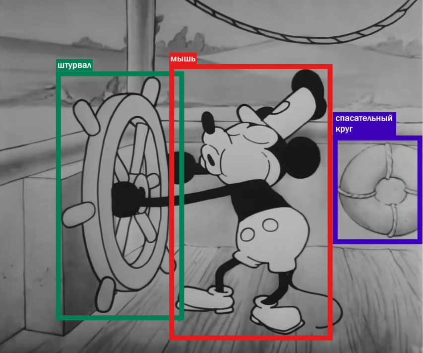

Допустим, модель нашла прямоугольник, в котором находится объект. Чтобы понять, насколько прямоугольник $D$ хорош, по сравнению с тем прямоугольником $T$, который мы задали в качестве истинного, используют метрики:

* Точность (Precision): $\mathrm{Precision} = \frac{\vert T \cap D \vert}{\vert D \vert}$
* Запоминание (Recall): $\mathrm{Recall} = \frac{\vert T \cap D \vert}{\vert T \vert}$
* Доля пересечения от объединения (Intersection over Union, IoU, или индекс Жаккара): $\mathrm{IoU} = \frac{\vert T \cap D \vert}{\vert T \cup D \vert}$

Для оценки качества на уровне классификации используют:

* Средную точность (Average Precision) - площадь под кривой Точность-Запоминание
* mAP (Mean Average Precision) - среднее взвешенное значение средней точности по всем классам

Всего модели по принципу работы можно разделить:

* На одностадийные: YOLO, SSD, RetinaNet
* На двухстадийные: R-CNN, Fast R-CNN, Mask R-CNN
* На основе точек: CenterNet, CornerNet

###  Одностадийная детекция

Самая популярная модуль одностадийной детекции - YOLO (от You Only Look Once). Работает она так:

* Позвоночник этой модели в виде сверточной нейросети (например, ResNet, VGG или MobileNet) выделяет признаки изображения и выдает большой тензор признаков

* Далее голова модели по признакам изображения предсказываются ограничивающие прямоугольники, уверенность в них в виде вероятности и метки классов

* Постобработка предсказаний

    После предсказания возникает проблема: два объекта могут попасть в одну ячейку. Поэтому можно добавить якоря - характерные размеры или пропорции объектов, задающиеся заранее

    Такие нейронные сети для детекции генерируют очень много ограничивающих прямоугольников, поэтому нужно отсечь лишние, например:

    * Отсечь те, у которых уверенность ниже какого-либо порога
    * Использовать алгоритм Non-maximum suppression (NMS), оставляющий только наиболее уверенные боксы среди сильно перекрывающихся

Первая версия YOLO появилась в 2016 и получила развитие в виде семи последующих версий

Другая более ранняя модель SSD (Single-Shot Multibox Detector) предсказывала объекты с карт признаков разных масштабов

В SSD крупные объекты предсказываются из поздних карт признаков. Мелкие же объекты предсказываются из ранних карт, но в них нет информации о контексте, что является недостатком модели

---

В задаче детекции возникает проблема, что при детектировании количество фонового класса (отрицательных примеров) сильно превосходит количество объектов (положительных примеров). Стандартная функция потерь уделяет слишком много внимания лёгким примерам, поэтому используют функцию фокальных потерь (Focal Loss):

$$\mathrm{FL}(p_t) = -(1 - p_t)^\gamma \cdot \log(p_t),$$

где $p_t$ - вероятность правильного класса, $\gamma > 0$ - параметр фокусировки

Модулирующий множитель $(1 - p_t)^\gamma$ уменьшает вклад хорошо классифицированных (лёгких) объектов, заставляя модель фокусироваться на сложных примерах

###  Двухстадийная детекция

Двухстадийный подход разделяет задачу на два этапа:

1. Генерация кандидатов - нахождение областей, где вероятно есть объект. Такую роль может играть модель Region Proposal Network (RPN), основанная на классических методах компьютерного зрения
2. Классификация и уточнение боксов - анализ каждого кандидата. Такие действия выполняет модель RoI Pooling (Region of Interest Polling), которая приводит области разного размера к единому размеру для последующей классификации

Для каждого кандидата предсказываются: координаты центра $(b_x, b_y)$, ширина и высота $(b_w, b_h)$, метка класса и уверенность

Самые популярных модели двухстадийной детекции - семейство R-CNN:

* R-CNN - кандидаты генерируются классическими методами компьютерного зрения
* Fast R-CNN - кандидаты генерируются нейронной сетью RPN
* Faster R-CNN - признаки RPN и RoI Pooling используют общий позвоночник
* Mask R-CNN - дополнительное предсказание маски сегментации объекта

###  Детектирование на основе точек

Есть две популярных модели, работающих на основе точек:

* CenterNet - вместо ограничивающих прямоугольников напрямую предсказываются ключевые точки:

    * Центр объекта
    * Ширина и высота бокса
    * Уверенность в наличии объекта в каждой точке

    Дополнительно можно предсказывать глубину объекта, позу человека, положение суставов и так далее

* EfficientDet - модель, где позвоночник - EfficientNet, а шея - это BiFPN (Bidirectional Feature Pyramid Network), двунаправленная сеть пирамиды признаков для лучшего объединения признаков разных масштабов

---

На практике детектируются множество объектов в реальной среде:

* Автотранспорт для реализации автопилота
* Люди для подсчета, расстояния между людьми, контроля на заводах
* Лица
* Текст на картинке

###  Распознавание текста

Задача распознавания текста (или оптическое распознавание символов) - задача нахождения расположения текста на изображении и предсказывания содержимое текста

Проблема реализации состоит в том, что текст на изображении может быть расположен в тени, наклонен или деформирован (например, на помятой бумаге), зашумлен или частично перекрыт

Чтобы убрать это, применяют:

* Выравнивание
* Подавление шума
* Бинаризация
* Удаление лишних линий

Существуют:

* Классические методы, например, предобработка, локализация символов, сегментация и распознавание символов
* Глубокое обучение, то есть локализация и распознавание символов с помощью нейросетей. Для этого используются сверточные сети, рекуррентные сети и архитектуру кодировщика-декодера

    Самая базовая модель - это сверточная рекуррентная нейросеть (Convolutional Recurrent Neural Network, CRNN), но такие сети вычислительно сложные, сложно тренировать

    Более эффективная модель - EAST (Efficient Accurate Scene Text Detector), где есть две стадии - сверточная сеть и алгоритм Non-Maximum Suppression

Для распознавания текста существуют популярные библиотеки:

* Tesseract OCR - <https://github.com/tesseract-ocr/tesseract>
* PaddleOCR - <https://github.com/PaddlePaddle/PaddleOCR>
* EasyOCR - <https://github.com/JaidedAI/EasyOCR>
* Kraken - <https://github.com/mittagessen/kraken>
<!-- end cvmethods_2026_03_10.md -->

<!-- begin cvmethods_2026_03_17.md -->
##  Лекция 6. Сегментация изображений и обработка видеопотока

###  Сегментация изображений

Задача сегментации изображений заключается в разбиении изображения на области и в присвоении пикселям меток классов или конкретных объектов

Выделяют несколько постановок задачи:

* Семантическая сегментация (Semantic Segmentation) - каждому пикселю сопоставляется класс объекта, но разные объекты одного класса не разделяются
* Сегментация сущностей (Instance Segmentation) - объекты одного класса разделяются на отдельные экземпляры
* Паноптическая сегментация (Panoptic Segmentation) объединяет семантическую сегментацию и сегментацию сущностей: каждый пиксель размечен, а объекты одного класса различаются между собой

В задачах сегментации сеть должна выдавать не один класс для всего изображения, а карту предсказаний того же или близкого пространственного размера, что и входное изображение

На последних слоях образуются карты активации классов. По ним можно понять, какие части изображения повлияли на предсказание и где модель ошибается

Чаще всего используют полносверточные сети (Fully Convolutional Networks, FCN). Обычно такая архитектура состоит из двух частей:

* Кодировщик (encoder или backbone) - последовательно извлекает признаки и уменьшает пространственное разрешение
* Декодировщик (decoder) - восстанавливает пространственное разрешение и строит карту сегментации

При уменьшении разрешения из-за пулинга и страйдов часть точной пространственной информации теряется. Поэтому при восстановлении разрешения часто используют соединения с пропуском (skip-connections): признаки из ранних слоев кодировщика передаются в декодировщик и помогают точнее восстановить границы объектов

Именно по такому принципу устроена U-Net. В ней:

* левая часть сети сжимает изображение и извлекает признаки
* правая часть постепенно восстанавливает разрешение
* на каждом уровне объединяются признаки кодировщика и декодировщика

В качестве кодировщика могут использоваться обычные CNN, например ResNet

Для сегментации часто применяют следующие функции потерь:

* поклассовую кросс-энтропию
* Функцию потерь Dice, особенно если классы несбалансированы и важна точность масок
* комбинации кросс-энтропии и Dice Loss

Коэффициент Dice для бинарной сегментации можно записать так: $\mathrm{Dice} = \frac{2 \sum_{x, y} p_{x,y} t_{x,y}}{\sum_{x, y} p_{x,y} + \sum_{x, y} t_{x,y}}$, где $p_{x,y}$ - предсказание модели, а $t_{x,y}$ - истинная разметка

На основе U-Net появились различные модификации:

* Multi-Input U-Net - сеть с несколькими входами
* 3D U-Net - вариант для объемных данных, например результатов компьютерной томографии или МРТ
* RefineNet - архитектура с блоками уточнения признаков

Также существуют и другие семейства моделей:

* PSPNet (Pyramid Scene Parsing Network) - использует пирамидальный пулинг, чтобы учитывать контекст на нескольких масштабах
* DeepLab - использует расширенные свертки (dilated, atrous convolution), позволяющие увеличивать рецептивное поле без сильной потери разрешения

Расширенная свертка применяет ядро не к соседним пикселям подряд, а с промежутками. Это позволяет захватывать более широкий контекст, не увеличивая число параметров слишком сильно

---

Сегментация активно применяется:

* в автономном вождении
* в промышленности, например для обнаружения дефектов
* в медицине, например для выделения органов, сосудов и опухолей
* в робототехнике и анализе спутниковых снимков

###  Обработка видеопотока

Видео - это упорядоченная последовательность кадров одинакового разрешения, отображаемая с определенной частотой. Частота обычно измеряется в кадрах в секунду (Frames Per Second, FPS)

Обработка видео сложнее обработки одиночного изображения, потому что нужно учитывать:

* движение объектов и камеры
* размытие из-за движения
* изменения освещенности
* ограничение по скорости обработки, особенно в задачах реального времени

Обработка видеопотока позволяет решать такие задачи:

* распознавание объектов и лиц на видео
* трекинг объектов
* распознавание действий
* стабилизация и улучшение видео
* восстановление 3D-структуры сцены

Обычно обработка видео включает:

* декодирование видеопотока
* обработку кадров
* кодирование результата

Важно соблюдать баланс между точностью и скоростью, поскольку во многих задачах результат нужен в реальном времени.

Для ускорения моделей могут использоваться:

* дистилляция знаний - обучение компактной модели по предсказаниям более крупной
* квантование и pruning
* специализированные устройства, например GPU и TPU

####  Оптический поток

Одна из классических задач обработки видео - оценка оптического потока

Оптический поток - это поле векторов смещения пикселей между соседними кадрами. Для каждого пикселя или характерной точки оценивается, куда она переместилась на следующем кадре

Оптический поток применяют для:

* трекинга объектов
* стабилизации видео
* оценки движения камеры
* реконструкции 3D-сцены
* интерполяции кадров

Классический подход - метод Лукаса-Канаде. Его идея состоит в следующем:

* выбирается точка или небольшое окно вокруг точки на первом кадре
* на втором кадре ищется область, наиболее похожая на это окно
* смещение оценивается по максимуму сходства или из локальной линейной модели яркости

У такого подхода есть ограничения:

* поворот и деформация окна ухудшают качество сопоставления
* на изображении могут быть несколько похожих областей
* изменение освещенности нарушает предположение о сохранении яркости
* полный перебор слишком дорог по вычислениям

Для обучения нейросетевых моделей оптического потока используют, например, датасеты:

* Middlebury
* KITTI
* MPI Sintel
* Flying Chairs

В нейросетевых методах часто используют ошибку конечной точки (End-Point Error, EPE): $\mathcal{L} = \frac{1}{H W} \sum_{i = 1}^{H W} \vert \hat{u}_i - u_i \vert_2^2$, где $\hat{u}_i$ - предсказанный вектор смещения, а $u_i$ - истинный.

Примеры моделей для оценки оптического потока:

* FlowNet - одна из первых популярных сверточных моделей для этой задачи
* FlowFormer - более современная архитектура, использующая идеи transformer-подходов

####  Отслеживание объектов

Отслеживание объектов (Object tracking) - задача обнаружения и сопровождения объекта или нескольких объектов в видеопоследовательности с сохранением их идентичности между кадрами

Обычно в многообъектном трекинге на входе есть:

* множество детекций на каждом кадре
* координаты ограничивающего прямоугольника
* необходимость присвоить каждому объекту устойчивый идентификатор

Трекинг нужен потому, что:

* детектор может пропускать объект на отдельных кадрах
* важно понимать траекторию движения объекта
* во многих системах требуется работа в реальном времени

Во многих системах используются два основных шага:

* детекция объектов
* предсказание движения и сопоставление детекций между кадрами

SORT (Simple Online Realtime Tracking) - простой и быстрый алгоритм многообъектного трекинга. Основные шаги SORT:

1. Детекция объектов на текущем кадре любым детектором, например YOLO или Faster R-CNN
2. Предсказание новых положений уже известных объектов с помощью фильтра Калмана
3. Сопоставление старых треков и новых детекций по IoU с использованием венгерского алгоритма
4. Создание новых треков и удаление пропавших

Преимущество SORT - высокая скорость. Недостаток - зависимость почти только от геометрии движения

Далее появилась модификация DeepSORT (Deep Simple Online Realtime Tracking), которая расширяет SORT и использует не только движение, но и внешний вид объекта. Дополнительно:

* для каждого объекта извлекается эмбеддинг внешнего вида с помощью CNN
* сопоставление выполняется не только по IoU и предсказанному движению, но и по визуальному сходству

Это делает трекинг устойчивее при перекрытиях, пропаданиях детекций и сложных траекториях
<!-- end cvmethods_2026_03_17.md -->

<!-- begin cvmethods_2026_03_31.md -->
##  Лекция 7. Методы оценки положения объектов в пространстве

<!-- Лектор - Насибуллина К. Ф. -->

###  Карта глубины

Карта глубины - изображение, в котором для каждого пикселя вместо цвета хранится его расстояние до камеры

Для того, чтобы построить карту глубины, используют:

* LIDAR (LIght Detection And Ranging) - технология, в которой лазер отражается от объекта, оценивая его дальность от камеры. Работает на расстоянии 1-100 метров с точностью в 3-7 см
* ToF-камеры (Time-of-Flight) - камеры, которые замеряют задержку посланного света, отраженного от объектов. Работает на расстоянии 0.1-10 метров
* Профилометр - устройство, использующее лазерный луч под углом. Обладает точностью до 0.07 мм, используется в промышленности
* Структурированные световые камеры - камеры, которые проецируют на объект горизонтальные и вертикальные инфракрасные полоски света, далее по смещению полосок можно определить расстояния до объекта
* Стереокамера - камера, использующие два фотосенсора, расположенных на расстоянии
* Пленоптическая камера (Light Field camera) - камера, фиксирующая векторное поле световых лучей, создаваемого изображением

Если такого дорогого оборудования нет, то используют нейросети. Применяют несколько подходов:

* По одному изображению
* По двум изображениям, сделанных на расстоянии
* По нескольким изображениям (такой подход называется фотограмметрией)

Рассмотрим модели, которые распознают по одному изображению:

* Модель MiDaS, основанный на сверточной сети ResNet (поздние версии используют другие бэкбоуны)

    Такие модели предсказывают не абсолютную глубину в метрах, а относительную, то есть насколько далек объект по сравнению с остальными на изображении. Это помогает универсально обучать и применять модели на разных изображениях

    В качестве метрик используют MAE, RMSE или Weighted Human Disagreement Rate (WHDR)

* Другая модель NeW CRFs (Neural Window CRFs), в основе которой модель Conditional Random Fields (CRFs), разбивает изображения на окна и обрабатывает их, используя многоголовое внимание. В качестве кодировщика используется swin-transformer, а декодер основан на FC-CRF

* Еще одна нейросеть PlaneNet (на основе DRN, Dilated Residual Networks) вместо глубины предсказывает плоскости, ее параметры и сегментацию плоскости. Полезна для работы со зданиями

Карты глубины используются для:

* Поиска дефектов
* Распознавания жестов
* Навигации роботов и беспилотных автомобилей
* Приложений дополненной реальности
* Построения 3D-моделей (людей, улиц и других объектов)
* Распознавания лица

Также карты глубины используются для разделения объекта на переднем фоне и задний фон, определив маску прозрачности (такой процесс извлечения объекта называется альфа-маттингом, Alpha matting)

Чтобы сделать альфа-маттинг, используют алгоритмы из библиотек Pymatting, RemBg, OpenCV

Для этого также можно использовать нейросеть MODNet, которая в реальном времени может разделить объект (например, человека) от фона, что можно применять, например, в конференциях в Zoom

Такие модели принимают на вход изображение и маску, в которой выделен объект, или тернарную маску, где указаны объект, задний фон и места в изображении, которые не определены

###  Поиск похожих изображений

В компьютере изображения представлены в виде чисел. Поиск похожих изображений - сложная задача, так как представления будут сильно отличаться при малейшем несоответствии изображений

Как же тогда сравнивать изображения:

* Можно искать по шаблону через корреляцию или разницу квадратов, но на реальных фотографиях не сработает из-за вариаций
* Сравнение цветовых гистограмм
* Преобразование Фурье, позволяющее перейти от яркостей пикселей к частотам
* Представление изображения как взвешенную сумму других изображений, то есть разложение изображения по базису, например, с помощью метода главных компонент
* Можно описать картинку в виде вектора с помощью дескрипторов ключевых точек (такими как SIFT и ORB), которые используют классические алгоритмы
* Также векторное представление изображения (или эмбеддинг) как результат сверточной нейросети (такого как VGG или ResNet) может быть сравнено с представлениями других изображений

    Обычно такие сети имеют два разных входа, на которые подаются изображения, в результате получаются вектора, расстояния между которыми сравниваются (используя евклидово или косинусное расстояние)

    Такие сети называются сиамскими

Нейросети, которые ищут похожие изображения, обучают несколькими способами:

* Обучение без предпросмотра (Zero-shot learning) - нейросеть при обучении не видела примеров из тестовой выборки
* Обучение с первого взгляда (One-shot learning) - нейросеть видела ровно одно изображение каждого объекта
* Обучение с нескольких взглядов (Few shot learning) - обучение на 2-5 объектах из каждого интересующего класса

Можно улучшать поиск картинок, добавляя картинки того же объекта в разных положениях (например, из видео), мета-информацию об объекте (теги, размеры), текстовое описание картинки или объекта

###  Распознавание лиц

Чтобы распознавать лица на изображении, изображение можно представить в виде эмбеддинга (вектора чисел). Далее можно сравнить расстояние между векторами лиц

Скалярное произведение двух нормализованных векторов лиц одного и того же человека должно быть как можно ближе к 1

Далее задача распознавания лиц сводится к тренировке такого бэкбоуна модели, который выдает вектора лиц, которые можно сравнить, причем лица разных людей должны давать наиболее далекие эмбеддинги друг от друга

В обучении ест два подхода:

1. Метрическое обучение - можно научить модель оценивать сходство, прямо работая с парами или тройками изображений

    Здесь используют функции потерь:

    * Contrastive Loss (Контрастная потеря)

        Основная цель - минимизировать расстояние между векторами похожих изображений и максимизировать его для разных

        Модели подаются пары изображений с лицами. Если лица принадлежат одному человеку, сеть учится делать их эмбеддинги максимально близкими. Если разным, то наоборот, отдалять их друг от друга, но только до определенного порога

    * Triplet Loss (Триплетная потеря)

        Этот метод стал известен благодаря работе FaceNet от Google. Вместо пары он использует триплет, состоящий из якоря (базовое изображение человека), положительного изображения (другое изображение того же человека) и негативного изображения (другого человека)

        Цель обучения: сделать так, чтобы эмбеддинг якоря был значительно ближе к положительную, чем к негативному изображения, на заданную величину отступа $\alpha$

        Это позволяет не просто отдалять классы, а создавать четкую иерархию сходства. Функция выглядит так: $L = \max(d(a, p) - d(a, n) + \alpha, 0)$, где $a$ - якорь, $p$ - положительное, $n$ - негативное изображение, $d$ - функция расстояния

        Основной недостаток - сложность и время обучения, так как число возможных триплетов в датасете огромно

2. Классификационные функции отступа (margin-функции) - модифицировать функцию Softmax, чтобы она принудительно "раздвигала" разные классы и сильнее "сжимала" схожие

    * Softmax Loss

        У базовой функции Softmax есть два серьёзных недостатка:

        * Она не оптимизирует метрики напрямую: Минимизируя ошибку классификации, он не гарантирует, что похожие лица будут близки в пространстве признаков.

        * Она не гарантирует "разрывов" между классами: Качество разделения может быть разным в зависимости от данных.

    * Center Loss делает признаки внутри каждого класса (для одного человека) более компактными, одновременно с этим удерживая центры классов друг от друга

        Работает так: сеть обучается вместе с двумя функциями: основная - стандартный Softmax для классификации, и Center Loss - для притягивания признаков каждого лица к центру их класса

    * SphereFace (или A-Softmax)

        Работает так: функция вводит угловой отступ $m$, на который нужно умножить угол между вектором признака и вектором весов класса: $\cos(\theta \cdot m)$

    * CosFace (Large Margin Cosine Loss) - такой метод уже напрямую работает с косинусом угла, делая его основой для сравнения лиц

        Работает так: добавляется косинусный отступ $m$ к целевому значению косинуса, напрямую увеличивая требуемое сходство для правильного класса: $L(y_i) = -\log \frac{e^{s (\cos \theta_{y_i} - m)}}{e^{s (\cos \theta_{y_i} - m)} + \sum_{j \neq y_i} e^{s \cos \theta_j}}$, где $s$ - масштабирующий коэффициент, а $m$ - гиперпараметр отступа

    * ArcFace (Additive Angular Margin Loss)

        На сегодняшний день ArcFace считается одним из самых эффективных и популярных решений в задачах распознавания лиц

        Ключевое отличие: если CosFace штрафует косинус угла, то ArcFace применяет аддитивный угловой отступ $m$, который вычитается непосредственно из угла $\theta$ между признаком и вектором весов: $\cos(\theta + m)$

        Получаем: $L(y_i) = -\log \frac{e^{s \cos (\theta_{y_i} + m)}}{e^{s \cos (\theta_{y_i} + m)} + \sum_{j \neq y_i} e^{s \cos \theta_j}}$

        Это лучше, потому что работая напрямую с углом, ArcFace обеспечивает более четкое разделение классов на гиперсфере и часто показывает лучшие результаты, чем CosFace и SphereFace в большинстве реальных сценариев

    * AirFace (Additive Angular Margin Loss)

        Аналогичен ArcFace, но используется $\frac{\pi - 2 \theta}{\pi}$ вместо косинуса угла $\theta$

        Получаем: $L(y_i) = -\log \frac{e^{s \frac{\pi - 2 (\theta_{y_i} + m)}{\pi}}}{e^{s \frac{\pi - 2 (\theta_{y_i} + m)}{\pi}} + \sum_{j \neq y_i} e^{s \frac{\pi - 2 \theta_{j}}{\pi}}}$

Для современных решений оптимальным выбором будет ArcFace - такой метод обеспечивает высокое качество и является отраслевым стандартом. Для обучения и экспериментов, особенно когда датасет небольшой, стоит начать с Triplet Loss. Простота реализации подхода поможет быстро получить работающий прототип
<!-- end cvmethods_2026_03_31.md -->

<!-- begin cvmethods_exam_list.md -->
##  X. Программа экзамена 2025/2026

1. Задачи компьютерного зрения, классические методы компьютерного зрения.
2. Ключевые точки и их дескрипторы, сопоставление ключевых точек, матрица гомографии. Методы сопоставления ключевых точек.
3. Полносвязные нейронные сети, метод обратного распространения ошибки, стохастический градиентный спуск, его виды, использование для изображений.
4. Параметры и гиперпараметры. Обучающая, тестовая и валидационная выборка. Регуляризация. Дропаут. Батчевая нормализация.
5. Сверточные нейронные сети. Виды сверток. Пуллинг. Увеличение изображения. Обратная свертка.
6. Задача классификации, известные архитектуры (VGG, ResNet, Inception), перенос знаний.
7. Задача детектирования объектов на изображении, одностадийные детекторы.
8. Задача детектирования объектов на изображении, двустадийные детекторы.
9. Задача семантической сегментации, архитектуры нейронных сетей.
10. Построение карты глубины, вырезание объектов.
11. Особенности обработки видеопотока.
12. Автокодировщики. Вариационные автокодировщики, базовые метрики качества для генерации изображений.
13. VQ-VAE, VQ-VAE 2
14. Архитектура генеративно-состязательных сетей, их виды (условный, сверточный). Проблемы GAN и способы улучшения сходимости. Задачи генерации изображения, для решения которых применяется GAN.
15. Трансляция изображения в изображение, генерация изображения по сегментации. Модели Pix2Pix, Pix2PixHD, SPADE, GauGAN, OASIS.
16. Модель StyleGAN, ее архитектура, применение и эволюция.
17. Механизм внимания, Vision Transformer.
18. Авторегрессионные методы генерации изображений, модель VQ-GAN.
19. Условная генерация изображений, распутывание вектора шума, обход латентного пространства GAN, модели CLIP и StyleCLIP.
20. NeRF, описание задачи и методы решения, архитектуры.
21. Диффузионные модели, принципы их работы, применение для генерации изображений, Imagen, ControlNet.
<!-- end cvmethods_exam_list.md -->

