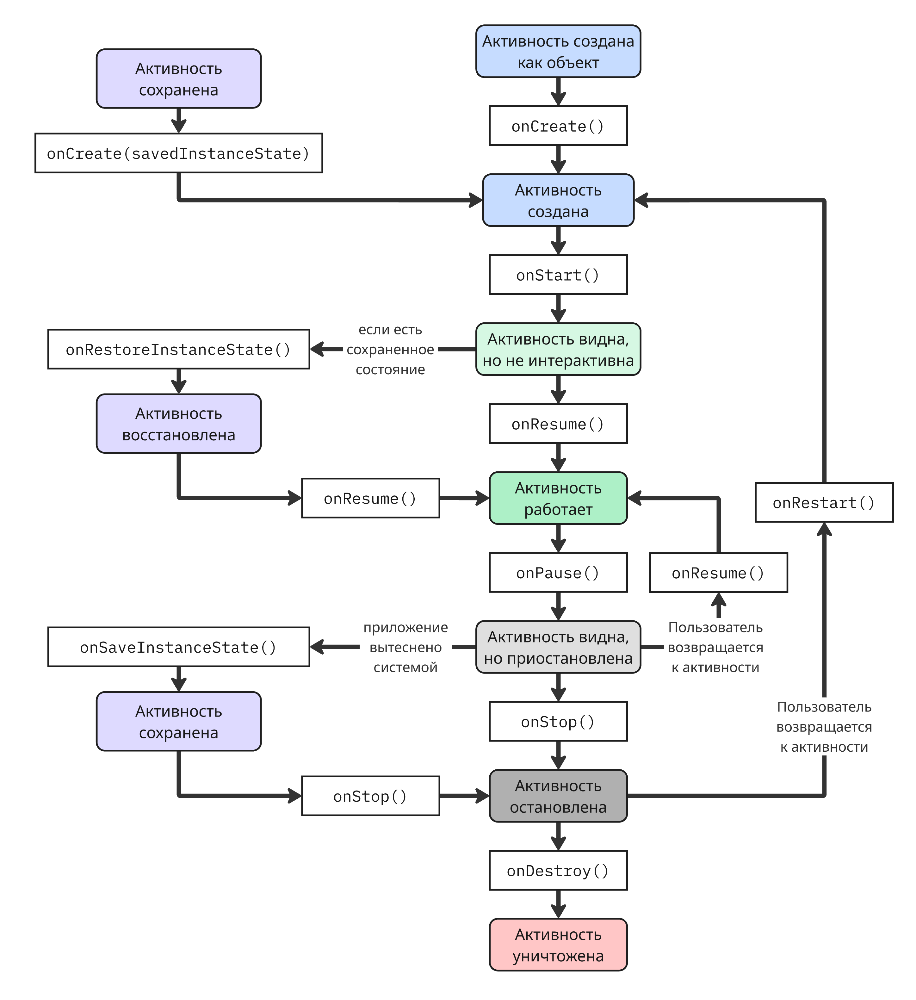

# Backend-driven UI на Android

## Лекция 1

Интерфейс, управляемый бэкендом (Backend-driven UI или Server-driven UI) - это архитектурный подход, при котором бэкенд определяет не только данные, но и саму структуру, логику и внешний вид интерфейса клиентского приложения

Клиент в таком подходе выступает как рендерер - он получает описание интерфейса (обычно в формате JSON) и отображает его. Это позволяет:

* менять пользовательский интерфейс без выпуска новой версии приложения, что помогает быстро исправлять ошибки
* проводить A/B-тесты
* управлять функциями приложения централизованно

Недостатки такого подхода:

* усложнение клиентской архитектуры
* необходимость универсального рендеринга
* зависимость от сети

### Язык Kotlin

До недавнего времени Android-приложения разрабатывались на языке Java, но в 2010-ых начал свое развитие язык программирования Kotlin, и индустрия начала переход на него

Kotlin - статически типизируемый, объектно-ориентированный язык, использующий виртуальную машину Java для исполнения. При создании целью было сделать язык лаконичным, удобным и безопасным по сравнению с Java

Типы, как и в Java, делятся на примитивные и ссылочные. Переменные примитивных типов хранят значение непосредственно (то есть оно копируется при передаче), а ссылочных - ссылку на объект в памяти

Переменные объявляются двумя способами:

* `var` - переменная с изменяемым значением/ссылкой
* `val` - переменная с неизменяемой ссылкой, но с изменяемыми полями (аналогично слову `final` в Java)

```kotlin
var a = 10
var b: Long = 10
val c = 20
```

Тип можно указать явно в объявлении переменной. В Kotlin существуют такие же примитивные типы, как и в Java:

* `Byte` - 8-битное целое число со знаком
* `Short` - 16-битное целое число со знаком
* `Int` - 32-битное целое число со знаком
* `Long` - 64-битное целое число со знаком
* `Float` - 32-битное число с плавающей точкой
* `Double` - 64-битное число с плавающей точкой

Примитивы на уровне языка Kotlin являются объектами, то есть имеют соответствующие методы, однако на уровне байткода оптимизируются до примитивов виртуальной машины

Для сравнения переменных есть операторы:

* `==`, который сравнивает значения полей структур
* и `===`, который сравнивает сами ссылки (а если ссылки равны, то и равны значения)

Оператор `is` используется для соответствия переменной типу:

```kotlin
if (obj is String) {
    println("This is String!")
}
```

#### Обнуляемые типы

Язык Kotlin расширяет систему типов, добавляя типы с допустимым отсутствием значения `null`. Такие типы называются обнуляемыми (nullable) и обозначаются как `X?`, например, `String?`. Соответственно типы, которые не допускают `null`, называются необнуляемыми (non-nullable)

Перед тем, как производить операции над переменной обнуляемого типа, нужно убедиться, что значение переменной не равно `null`. Компилятор не позволяет производить операции с обнуляемыми типами, поэтому нужно сделать проверку одним из этих способов:

* Проверка на `null` с помощью `if`:

    ```kotlin
    if (x != null) {
        val y = x + 10
    }
    ```

* Оператор `!!`, который выбрасывает `NullPointerException`, если значение равно `null`:

    ```kotlin
    val y = x!! + 10
    ```

* Оператор `?.`, применяемый для полей объекта, который возвращает `null`, если исходное значение объекта равно `null`:

    ```kotlin
    val length: Int? = name?.length
    ```

    Его прелесть в том, что, несмотря на длину цепочки, вернется все равно `null`, если исходная переменная равна `null`

* Оператор Элвиса `?:` (ну он похоже на Элвиса Пресли сбоку), который позволяет установить значение по умолчанию:

    ```kotlin
    val length = name?.length ?: 0
    ```

    По сути оператор Элвиса - синтаксический сахар для `a ? a != null : b`

Другой оператор `as` используется для приведения объект к типу:

```kotlin
val x: String = y as String
val x: String? = y as String?
```

В случае если объект нельзя привести к другому, то `as` вызывает исключение `NullPointerException`. Чтобы избежать этого, есть оператор `as?`, который в случаю неприведения типа возвращает `null`:

```kotlin
val x: String? = y as? String
```

В этом случае `x` равен `null`, если `y` нельзя привести к `String`

#### Управление потоком

Для управления потоком Kotlin предлагает такой же набор инструментов, что и другие языки:

* `if` для условий:

    ```kotlin
    if (x == 10) {
        println("10")
    } else if (x == 11) {
        println("11")
    } else {
        println("other")
    }
    ```

* `when`, аналог `switch`-`case`:

    ```kotlin
    when (x) {
        10 -> println("10")
        11 -> println("11")
        else -> println("other")
    }
    ```

* Объявление функции:

    ```kotlin
    fun myFunction(a: Int): Int {
        return a * 2
    }
    ```

    У каждой функции есть тип `(T, ...) -> R`, в данном случае это `(Int) -> Int`, что позволяет ее передавать в аргументы как делегат. Если функция ничего не возвращает, то ее тип возврата равен `Unit`, например, `() -> Unit`

* `for`-цикл:

    ```kotlin
    for (i in 1..10) {
        println(i)
    }
    ```

* `while`-цикл:

    ```kotlin
    var i = 1

    while (i < 10) {
        println(i)

        i += 1
    }
    ```

* `do`-`while`-цикл, гарантированно выполняет первую итерацию:

    ```kotlin
    var i = 1

    do {
        println(i)

        i += 1
    } while (i < 10)
    ```

Для управления циклами есть ключевые слова:

* `continue`, которое пропускает одну итерацию
* `break`, которое прерывает цикл

Для циклов, функций и скоупов применимы метки - идентификаторы, указывающиеся с помощью `@`:

```kotlin
loop@ for (i in 1..10) {
    for (j in 1..10) {
        if (i > 4)
            break@loop
    }
}
```

Метки помогают управлять потоком, но ухудшают читаемость кода. Так, в примере выше внешний цикл прерывается

С помощью меток можно прерывать исполнение не только в циклах, но и в анонимных функциях:

```kotlin
run loop@{
    listOf(1, 2, 3, 4, 5).forEach {
        if (it == 3)
            return@loop
        print(it)
    }
}
```

Помимо такого бесконтекстного блока `run` есть еще способы выполнить блок кода в контексте объекта:

* `let`

    ```kotlin
    val name: String? = "Alex"

    val length = name?.let {
        println(it)
        it.length
    }
    ```

    Если `name == null`, блок не выполнится. Основное применение - работа с обнуляемыми типами и преобразование значения

* `run`:

    ```kotlin
    val result = "Hello".run {
        println(length)
        length * 2
    }
    ```

    В блоке `run` `this` можно не писать, члены вызываются напрямую. Основное применение - вычисление результата и группировка операций над объектом

* `apply`

    ```kotlin
    val user = User().apply {
        name = "Alex"
        age = 20
    }
    ```

    Основное применение - инициализация объектов и реализация паттерна "Строитель"

* `also`:

    ```kotlin
    val number = 10
        .also { println("Initial: $it") }
        .also { println("Still: $it") }
    ```

    Основное применение - логирование и промежуточные действия в цепочке вызовов

Главные различия - это то, как передается, и то, что возвращается:

| Ключевое слово | Как передается объект | Что возвращает   |
| ------- | --------------------- | ---------------- |
| `let`   | `it`                  | результат лямбды |
| `run`   | `this`                | результат лямбды |
| `apply` | `this`                | сам объект       |
| `also`  | `it`                  | сам объект       |

---

Исключения обрабатываются с помощью `try`-`catch`:

```kotlin
try {
    // опасный код
} catch (e: SomeException) {
    // обрабатываем исключение
} finally {
    // выполняется в любом случае
}
```

В Kotlin нет проверяемых исключений - компилятор не требует их обязательной обработки

#### ООП в Kotlin

В Kotlin ООП схоже с тем, что в языке Java

В Kotlin есть основной конструктор и вторичные конструкторы

1. Основной конструктор (Primary Constructor) объявляется в заголовке класса:

    ```kotlin
    class User(val name: String, var age: Int)
    ```

    Здесь `name` и `age` - параметры конструктора, а `val`/`var` означают, что параметры сразу становятся свойствами класса

    Если убрать `val/var`, это будут просто параметры ```class User(name: String, age: Int)```, тогда внутри класса их нужно присвоить вручную

    Далее код инициализации выполняется в блоке `init`:

    ```kotlin
    class User(val name: String, var age: Int) {

        init {
            require(age >= 0) { "Age must be positive" }
            println("User created")
        }
    }
    ```

    При создании объекта вызывается основной конструктор, и выполняются инициализация свойств и блоки `init` (в порядке объявления). Можно объявлять несколько `init` - тогда они выполняются сверху вниз

    Ключевое слово `constructor` обычно опускается:

    ```kotlin
    class User constructor(val name: String)
    ```

    Оно пишется явно только если нужен модификатор доступа:

    ```kotlin
    class User private constructor(val name: String)
    ```

2. Вторичный конструктор (Secondary Constructor) объявляется внутри класса с ключевым словом `constructor`:

    ```kotlin
    class User {

        var name: String
        var age: Int

        constructor(name: String, age: Int) {
            this.name = name
            this.age = age
        }
    }
    ```

    Если в классе есть основной конструктор, то каждый вторичный конструктор обязан вызвать его через `this(...)`:

    ```kotlin
    class User(val name: String, var age: Int) {

        constructor(name: String) : this(name, 0)
    }
    ```

    В этом случае 1) вызывается основной конструктор; 2) выполняются `init` блоки; 3) выполняется тело вторичного конструктора

Если основной конструктор отсутствует, то класс может иметь только вторичный:

```kotlin
class User {

    var name: String
    var age: Int

    constructor(name: String) {
        this.name = name
        this.age = 0
    }
}
```

В Kotlin чаще используют значения по умолчанию, `companion object` (аналог статичных полей) с фабричными методами и слово `apply`, поэтому вторичные конструкторы используются реже, чем в Java

---

В Kotlin все объекты неявно наследуются от `Any`. По умолчанию класс нельзя наследовать. Чтобы один класс смог наследоваться от другого, класс-родитель должен иметь модификатор `open`:

```kotlin
open class Base(p: Int)
class Derived(p: Int) : Base(p)
```

Аналогично с методами: чтобы их можно было переопределить, они должны иметь модификатор `open`

Абстрактные классы объявляются с помощью `abstract`:

```kotlin
abstract class Shape {
    abstract fun draw()
}
```

Абстрактные методы подразумевают, что они не имеют готовой реализации, поэтому ее нужно определить в классе-наследнике. Из-за этого абстрактные классы и методы не нуждаются в модификаторе `open`

Свойства определяются через `var` и `val`:

```kotlin
class Address {
    var a: String = "A"
    val b: String = "B"
    val c: String
        get() = this.toString() + "."

    var counter = 0
        set(value) {
            if (value >= 0)
                field = value 
                // field - специальное слово, 
                //которое ссылается на значение свойства
        }
}
```

Интерфейсы схожи с теми, что присутствуют в других языках:

```kotlin
interface MyInterface {
    fun bar()
    fun foo() {
        // метод с реализацией по умолчанию
    }
}
```

Отличие интерфейсов от абстрактных классов заключается в невозможности создания экземпляров. Они могут иметь свойства, но те должны быть либо абстрактными, либо предоставлять реализацию методов доступа

Также Kotlin имеет модификаторы доступа для свойств и методов:

* `public` - поле доступно везде, стоит по умолчанию
* `private` - поле доступно только в методах этого класса (исключая наследников)
* `protected` - поле доступно в методах этого класса и классов-наследников
* `internal` - поле доступно только в пределах модуля

---

Помимо обычных классов, в Kotlin есть классы данных. Класс данных (Data Class) - синтаксический сахар для упрощенного создания DTO (Data Transfer Object). Класс данных:

* имеет автоматически сгенерированные методы `equals()`, `hashCode()` и `copy()`
* имеет метод `toString()`, возвращающий строку в формате `ClassName(property1=value1, property2=value2, ...)`
* методы `componentN()` (например, `component2()`), которые возвращают поля в порядке их объявления конструктора, но делать так не рекомендуется

Пример:

```kotlin
data class User(val name: String = "", val age: Int = 0)
```

Для этого основной конструктор должен иметь как минимум один параметр, все параметры основного конструктора должны быть отмечены как свойства (через `var` или `val`), и классы данных не могут быть абстрактными или иметь модификаторы `open`, `sealed` и `inner`

---

Как в C#, Kotlin позволяет расширить функциональность класса добавлением методов расширения (Extension Method):

```kotlin
data class Book(
    val id: Long,
    val author: String,
    val title: String,
    val price: BigDecimal
)

class SomeService {
    fun analyzeBook(book: Book) {
        val formattedInfo = book.getFormattedInfo() // вызов метода
        
    }

    // его объявление
    private fun Book.getFormattedInfo(): String = "Book $author - $title has price - $price"
}
```

При компиляции метод `Book.getFormattedInfo()` превращается в подобное:

```java
public String getFormattedInfo() {
    return "Book " + author + " - " + title + " has price - " + price;
}
```

---

Kotlin позволяется генерировать код во время исполнения, что позволяет генерировать класс-родитель на этапе исполнения и сделать так, чтобы целевой класс наследовался от него

Для борьбы с этим есть модификатор `sealed`. `sealed` запрещает наследование от данного класса только на этапе исполнения, когда как на этапе компиляции наследование разрешено

---

Вложенные классы - классы, вложенные в другие классы:

```kotlin
class Outer {
    private val bar: Int = 1
    class Nested {
        fun foo() = 2
    }
}

val value = Outer.Nested().foo() // == 2
```

Вложенные классы не имеют доступа к приватным полям внешнего класса, поэтому существуют внутренние классы:

```kotlin
class Outer {
    private val bar: Int = 1
    inner class Inner {
        fun foo() = bar
    }
}

val demo = Outer().Inner().foo() // == 1
```

---

В Kotlin есть возможность создать класс-перечисление:

```kotlin
enum class Direction {
    NORTH, SOUTH, WEST, EAST
}

enum class Color(val rgb: Int) {
    RED(0xFF0000),
    GREEN(0x00FF00),
    BLUE(0x0000FF)
}
```

Каждый элемент перечисления является объектов этого класса

---

В Kotlin есть возможность создания анонимных объектов:

```kotlin
val obj = object {
    val x = 10
}
```

Их в том числе можно наследовать от других классов:

```kotlin
val listener = object : View.OnClickListener {
    override fun onClick(v: View?) { }
}
```

#### Функции

Функции объявляются с помощью ключевого слова `fun`:

```kotlin
fun sum(a: Int, b: Int = 1): Int {
    return a + b
}
```

Аргументы функции могут иметь значения по умолчанию, а для отсутствия возвращаемого значения используют `Unit` (аналог `void`)

Вызов функции осуществляется так:

```kotlin
sum(3, 5)
// или
sum(3)
// или
sum(a = 3)
// или
sum(a = 3, b = 5)
```

Функция высшего порядка - функция, принимающая другую функцию:

```kotlin
fun operate(x: Int, op: (Int) -> Int): Int {
    return op(x)
}
```

Kotlin поддерживает создание функций, вложенных в другую функцию:

```kotlin
fun dfs(graph: Graph) {
    val visited = HashSet<Vertex>()

    fun dfs(current: Vertex) {
        if (!visited.add(current)) return
        for (v in current.neighbors)
            dfs(v)
    }

    dfs(graph.vertices[0])
}
```

Функции могут иметь обобщенные параметры (Generic):

```kotlin
fun <T> singletonList(item: T): List<T> { 
    /*...*/
}
```

---

В Kotlin функции являются функциями первого класса, то есть могут храниться в контейнерах. Для этого функции представляются объектами функционального типа, который описывается так: ```(A, B) -> C```

Здесь функция такого типа принимает параметры типов `A` и `B` и возвращает значение типа `C`

На уровне JVM функциональные типы компилируются в объекты, реализующие интерфейсы

Если параметров нет, то кортеж пуст: ```() -> A```

Если возвращаемого типа нет, то пишут `Unit` в объявлении: ```() -> Unit```

Также существуют функциональные типы с получателем, которые записываются так: ```A.(B) -> C```

Это означает, что есть объект-получатель типа `A`, есть параметр типа `B` и возвращается `C`

Например, можно создать метод расширения:

```kotlin
val repeatFun: String.(Int) -> String = { times ->
    this.repeat(times)
}

val result = "Hi".repeatFun(3)
```

Внутри лямбды словом `this` описан объект-получатель

Для таких типов (как и для других) можно задать псевдоним:

```kotlin
typealias ClickHandler = (Button, ClickEvent) -> Unit
```

---

Kotlin позволяет создавать встроенные функции. Код таких функций на этапе компиляции встраивается внутри другого кода

Иногда это приводит к улучшению производительности, но наибольший смысл встроенные функции имеют, если их аргумент - это лямбда-функция. Тогда код лямбда функции вставиться в тело функции:

```kotlin
inline fun test(block: () -> Unit) {
    println("Before")
    block()
    println("After")
}

test {
    println("Hello")
}
```

Поэтому такой код превращается в:

```kotlin
println("Before")
println("Hello")
println("After")
```

Побочные эффекты: встроенные функции увеличивают размер байткода, могут ухудшить стек исполнения и увеличить размер APK

Также встроенные функции нельзя сохранить. Если встроенная функция имеет аргумент-функцию, то она тоже становится встроенной, и чтобы ее сделать невстроенной и сохраняемой, есть слово `noinline`:

```kotlin
inline fun process(
    inlineBlock: () -> Unit,
    noinline normalBlock: () -> Unit
) {
    inlineBlock()

    val stored = normalBlock   // можно сохранить
    stored()
}
```

Встроенные лямбда-функции поддерживают нелокальные возвраты, то есть использование `return` внутри лямбда-функции вынудит выйти из внешней функции:

```kotlin
inline fun test(block: () -> Unit) {
    block()
    println("After block")
}

fun example() {
    test {
        return   // выйдет из example()
    }
    println("This won't print")
}
```

Это работает, потому что лямбда встроена. Чтобы устранить это, есть слово `crossinline`, которое запрещает слово `return` внутри лямбды:

```kotlin
inline fun test(crossinline block: () -> Unit) {
    block()
    println("After block")
}

fun example() {
    test {
        // return
        // ошибка компиляции
    }
    println("This will print")
}
```

Наконец, слово `reified` позволяет использовать тип во время выполнения

Обычно обобщенные типы стираются на этапе компиляции (так как на нем вместо `T` подставляет `Object`, проверяется соответствии типу), то есть нельзя написать:

```kotlin
fun <T> check(value: Any): Boolean {
    return value is T  // ошибка
}
```

потому что тип `T` неизвестен во время выполнения в виртуальной машине. Для решения этого можно применить встроенную функцию и слово `reified`:

```kotlin
inline fun <reified T> check(value: Any): Boolean {
    return value is T
}

val result = check<String>("Hello")
```

Теперь компилятор подставляет реальный тип вместо `T`

### Архитектура Android-приложений

Устройства на Android представляют внушительную долю рынка мобильных устройства и являются смартфонами, планшетами, телевизорами, часами и другими подобными

Операционная система Android начала свое развитие в 2000-ых, а версия 1.0 появилась в 2008. Сейчас на начало 2026 года актуальной является Android 16, а по статистике от Google примерно 99% устройств имеют Android версии 7.0 и новее

Android имеет такой программный стек из 5 уровней:

1. Приложения

    Это сами Android-приложения, в том числе системные (Телефон, Камера, Контакты и другие) и сторонние приложения из Google Play

    Каждое приложение: работает в своём процессе, имеет свой UID и изолировано в "песочнице" (sandbox)

2. Application Framework

    Это набор Java/Kotlin API, с которыми работают разработчики

3. Android Runtime (ART)

    Android Runtime - виртуальная машина для исполнения, которая пришла на замену другой машины Dalvik

    ART отвечает за выполнение байткода, сборку мусора, управление памятью, AOT- и JIT-компиляцию

    Каждое приложение запускается в своём экземпляре ART

4. Native Libraries и машиннозависимые модули (HAL)

    Это включает:

    * libc, SSL, SQLite, OpenGL и другие библиотеки, которые используются через Java Native Interface
    * драйвера для камеры, аудио, сенсоров и других модулей, которые используются в устройстве

5. Ядро Linux

    Android использует модифицированное ядро Linux как фундамент. Оно отвечает за управление памятью, процессы и потоки, безопасность, драйвера и энергопотребление

---

Простенькое Android-приложение состоит из:

* директории `manifests` и файла `AndroidManifest.xml`, содержащую базовую информацию для сборщика (например, первый экран при запуске, заголовок)
* директории `java` или `kotlin`, содержащую файлы с программным кодом
* директории `res`, содержащую медиа-ресурсы (логотипы, картинки и так далее)

Для сборки используется система Gradle. Результатом сборки является:

* архив `.apk` (Android Package)
* или бандл `.aab` (Android App Bundle)

App Bundle содержит все ресурсы, а магазин (например, Google Play) генерирует оптимизированный APK для устройства пользователя

Так как Android основан на Linux, запущенное приложение представляет собой созданный процесс

Этот процесс обычно живет в системе до тех пор, пока операционная система сама не решит его убить или через ручную принудительную остановку в настройках системы

---

В основе главного потока лежит `android.os.Looper`, который содержит очередь сообщений `MessageQueue` и обрабатывает сообщения последовательно

Обработчик `Handler` используется для работы с очередью сообщений, получая, обрабатывая их и отправляя новые с задержкой или без

Как правило, нет каких-либо гарантий, что новое сообщение обработается точно через данное число секунд

Далее `Looper` работает с этим компонентами:

* `android.app.Activity`
* `android.app.Service`
* `android.content.BroadcastReceiver`
* `android.content.ContentProvider`

---

Сущность `android.app.Activity` - это активность, один экран с элементами Android-приложения

Для создания активности необходимо создать класс-наследник и указать его в манифесте. Жизненный цикл для активности внутри приложения выглядит так:



Как можно заметить на протяжении жизненного цикла операционная система вызывает методы активности, которые выделяют или освобождают ресурсы

Также, если системе не хватает доступной оперативной памяти, она может сохранить приостановленные активности в хранилище и по надобности восстановить

Активности представляют из себя стек, что позволяет по кнопке "Назад" возвращаться к предыдущей активности

---

Контекст `android.content.Context` предоставляет информацию о текущем окружении приложения, в том числе предоставляющий доступ:

* к ресурсам
* к системе
* к запуску компонентов
* к работе с файлами

У сущностей `Application`, `Activity`, `Service`, `ContentProvider` и `BroadcastProvider` есть свои контексты
