<!-- This file is generated by assets.build.markdown.superconspect_builder. All changes to it will be lost -->


# <a name="backend-driven-ui-%D0%BD%D0%B0-android"></a> Backend-driven UI на Android

* [Backend-driven UI на Android](#backend-driven-ui-%D0%BD%D0%B0-android)
  * [Лекция 1](#%D0%BB%D0%B5%D0%BA%D1%86%D0%B8%D1%8F-1)
    * [Язык Kotlin](#%D1%8F%D0%B7%D1%8B%D0%BA-kotlin)
      * [Обнуляемые типы](#%D0%BE%D0%B1%D0%BD%D1%83%D0%BB%D1%8F%D0%B5%D0%BC%D1%8B%D0%B5-%D1%82%D0%B8%D0%BF%D1%8B)
      * [Управление потоком](#%D1%83%D0%BF%D1%80%D0%B0%D0%B2%D0%BB%D0%B5%D0%BD%D0%B8%D0%B5-%D0%BF%D0%BE%D1%82%D0%BE%D0%BA%D0%BE%D0%BC)
      * [ООП в Kotlin](#%D0%BE%D0%BE%D0%BF-%D0%B2-kotlin)
      * [Функции](#%D1%84%D1%83%D0%BD%D0%BA%D1%86%D0%B8%D0%B8)
    * [Архитектура Android-приложений](#%D0%B0%D1%80%D1%85%D0%B8%D1%82%D0%B5%D0%BA%D1%82%D1%83%D1%80%D0%B0-android-%D0%BF%D1%80%D0%B8%D0%BB%D0%BE%D0%B6%D0%B5%D0%BD%D0%B8%D0%B9)
  * [Лекция 2. Намерение, стек активностей, фрагмент](#%D0%BB%D0%B5%D0%BA%D1%86%D0%B8%D1%8F-2.-%D0%BD%D0%B0%D0%BC%D0%B5%D1%80%D0%B5%D0%BD%D0%B8%D0%B5%2C-%D1%81%D1%82%D0%B5%D0%BA-%D0%B0%D0%BA%D1%82%D0%B8%D0%B2%D0%BD%D0%BE%D1%81%D1%82%D0%B5%D0%B9%2C-%D1%84%D1%80%D0%B0%D0%B3%D0%BC%D0%B5%D0%BD%D1%82)
    * [Намерение](#%D0%BD%D0%B0%D0%BC%D0%B5%D1%80%D0%B5%D0%BD%D0%B8%D0%B5)
    * [Стек активностей](#%D1%81%D1%82%D0%B5%D0%BA-%D0%B0%D0%BA%D1%82%D0%B8%D0%B2%D0%BD%D0%BE%D1%81%D1%82%D0%B5%D0%B9)
    * [Фрагмент](#%D1%84%D1%80%D0%B0%D0%B3%D0%BC%D0%B5%D0%BD%D1%82)
  * [Лекция 3. Работа с сетью и UI](#%D0%BB%D0%B5%D0%BA%D1%86%D0%B8%D1%8F-3.-%D1%80%D0%B0%D0%B1%D0%BE%D1%82%D0%B0-%D1%81-%D1%81%D0%B5%D1%82%D1%8C%D1%8E-%D0%B8-ui)
    * [Сетевое взаимодействие](#%D1%81%D0%B5%D1%82%D0%B5%D0%B2%D0%BE%D0%B5-%D0%B2%D0%B7%D0%B0%D0%B8%D0%BC%D0%BE%D0%B4%D0%B5%D0%B9%D1%81%D1%82%D0%B2%D0%B8%D0%B5)
    * [UI](#ui)
      * [Объект представления `View`](#%D0%BE%D0%B1%D1%8A%D0%B5%D0%BA%D1%82-%D0%BF%D1%80%D0%B5%D0%B4%D1%81%D1%82%D0%B0%D0%B2%D0%BB%D0%B5%D0%BD%D0%B8%D1%8F-%60view%60)
      * [Объект макета `Layout`](#%D0%BE%D0%B1%D1%8A%D0%B5%D0%BA%D1%82-%D0%BC%D0%B0%D0%BA%D0%B5%D1%82%D0%B0-%60layout%60)
      * [Процесс надувания](#%D0%BF%D1%80%D0%BE%D1%86%D0%B5%D1%81%D1%81-%D0%BD%D0%B0%D0%B4%D1%83%D0%B2%D0%B0%D0%BD%D0%B8%D1%8F)
      * [Объекты связки](#%D0%BE%D0%B1%D1%8A%D0%B5%D0%BA%D1%82%D1%8B-%D1%81%D0%B2%D1%8F%D0%B7%D0%BA%D0%B8)
      * [Фреймворк Jetpack Compose](#%D1%84%D1%80%D0%B5%D0%B9%D0%BC%D0%B2%D0%BE%D1%80%D0%BA-jetpack-compose)
      * [Адаптивный дизайн](#%D0%B0%D0%B4%D0%B0%D0%BF%D1%82%D0%B8%D0%B2%D0%BD%D1%8B%D0%B9-%D0%B4%D0%B8%D0%B7%D0%B0%D0%B9%D0%BD)
  * [Лекция 4. Архитектура Android-приложения](#%D0%BB%D0%B5%D0%BA%D1%86%D0%B8%D1%8F-4.-%D0%B0%D1%80%D1%85%D0%B8%D1%82%D0%B5%D0%BA%D1%82%D1%83%D1%80%D0%B0-android-%D0%BF%D1%80%D0%B8%D0%BB%D0%BE%D0%B6%D0%B5%D0%BD%D0%B8%D1%8F)
    * [MVC](#mvc)
    * [MVP](#mvp)
    * [MVVM](#mvvm)
    * [MVI](#mvi)
  * [Лекция 5. Дизайн-система и интерфейс, управляемый бэкендом](#%D0%BB%D0%B5%D0%BA%D1%86%D0%B8%D1%8F-5.-%D0%B4%D0%B8%D0%B7%D0%B0%D0%B9%D0%BD-%D1%81%D0%B8%D1%81%D1%82%D0%B5%D0%BC%D0%B0-%D0%B8-%D0%B8%D0%BD%D1%82%D0%B5%D1%80%D1%84%D0%B5%D0%B9%D1%81%2C-%D1%83%D0%BF%D1%80%D0%B0%D0%B2%D0%BB%D1%8F%D0%B5%D0%BC%D1%8B%D0%B9-%D0%B1%D1%8D%D0%BA%D0%B5%D0%BD%D0%B4%D0%BE%D0%BC)
    * [Дизайн-система](#%D0%B4%D0%B8%D0%B7%D0%B0%D0%B9%D0%BD-%D1%81%D0%B8%D1%81%D1%82%D0%B5%D0%BC%D0%B0)
    * [Интерфейс, управляемый бэкендом](#%D0%B8%D0%BD%D1%82%D0%B5%D1%80%D1%84%D0%B5%D0%B9%D1%81%2C-%D1%83%D0%BF%D1%80%D0%B0%D0%B2%D0%BB%D1%8F%D0%B5%D0%BC%D1%8B%D0%B9-%D0%B1%D1%8D%D0%BA%D0%B5%D0%BD%D0%B4%D0%BE%D0%BC)

<!-- begin uiandroid_2026_02_05.md -->
## <a name="%D0%BB%D0%B5%D0%BA%D1%86%D0%B8%D1%8F-1"></a> Лекция 1

Интерфейс, управляемый бэкендом (Backend-driven UI или Server-driven UI) - это архитектурный подход, при котором бэкенд определяет не только данные, но и саму структуру, логику и внешний вид интерфейса клиентского приложения

Клиент в таком подходе выступает как рендерер - он получает описание интерфейса (обычно в формате JSON) и отображает его. Это позволяет:

* менять пользовательский интерфейс без выпуска новой версии приложения, что помогает быстро исправлять ошибки
* проводить A/B-тесты
* управлять функциями приложения централизованно

Недостатки такого подхода:

* усложнение клиентской архитектуры
* необходимость универсального рендеринга
* зависимость от сети

### <a name="%D1%8F%D0%B7%D1%8B%D0%BA-kotlin"></a> Язык Kotlin

До недавнего времени Android-приложения разрабатывались на языке Java, но в 2010-ых начал свое развитие язык программирования Kotlin, и индустрия начала переход на него

Kotlin - статически типизируемый, объектно-ориентированный язык, использующий виртуальную машину Java для исполнения. При создании целью было сделать язык лаконичным, удобным и безопасным по сравнению с Java

Типы, как и в Java, делятся на примитивные и ссылочные. Переменные примитивных типов хранят значение непосредственно (то есть оно копируется при передаче), а ссылочных - ссылку на объект в памяти

Переменные объявляются двумя способами:

* `var` - переменная с изменяемым значением/ссылкой
* `val` - переменная с неизменяемой ссылкой, но с изменяемыми полями (аналогично слову `final` в Java)

```kotlin
var a = 10
var b: Long = 10
val c = 20
```

Компилятор может угадать тип по типу литерала значения. Тип можно указать явно в объявлении переменной. В Kotlin существуют такие же примитивные типы, как и в Java:

* `Byte` - 8-битное целое число со знаком
* `Short` - 16-битное целое число со знаком
* `Int` - 32-битное целое число со знаком
* `Long` - 64-битное целое число со знаком
* `Float` - 32-битное число с плавающей точкой
* `Double` - 64-битное число с плавающей точкой

Примитивы на уровне языка Kotlin являются объектами, то есть имеют соответствующие методы, однако на уровне байткода они оптимизируются до примитивов виртуальной машины

Для сравнения переменных есть операторы:

* `==`, который сравнивает значения полей структур
* и `===`, который сравнивает сами ссылки (а если ссылки равны, то и равны значения)

Оператор `is` используется для соответствия переменной типу:

```kotlin
if (obj is String) {
    println("This is String!")
}
```

#### <a name="%D0%BE%D0%B1%D0%BD%D1%83%D0%BB%D1%8F%D0%B5%D0%BC%D1%8B%D0%B5-%D1%82%D0%B8%D0%BF%D1%8B"></a> Обнуляемые типы

Язык Kotlin расширяет систему типов, добавляя типы с допустимым отсутствием значения `null`. Такие типы называются обнуляемыми (nullable) и обозначаются как `X?`, например, `String?`. Соответственно типы, которые не допускают `null`, называются необнуляемыми (non-nullable)

Перед тем, как производить операции над переменной обнуляемого типа, нужно убедиться, что значение переменной не равно `null`. Компилятор не позволяет производить операции с обнуляемыми типами, поэтому нужно сделать проверку одним из этих способов:

* Проверка на `null` с помощью `if`:

    ```kotlin
    if (x != null) {
        val y = x + 10
    }
    ```

* Оператор `!!`, который выбрасывает `NullPointerException`, если значение равно `null`:

    ```kotlin
    val y = x!! + 10
    ```

* Оператор `?.`, применяемый для полей объекта, который возвращает `null`, если исходное значение объекта равно `null`:

    ```kotlin
    val length: Int? = name?.length
    ```

    Его прелесть в том, что, несмотря на длину цепочки, вернется все равно `null`, если исходная переменная равна `null`

* Оператор Элвиса `?:` (ну он похоже на Элвиса Пресли сбоку), который позволяет установить значение по умолчанию:

    ```kotlin
    val length = name?.length ?: 0
    ```

    По сути оператор Элвиса - синтаксический сахар для `a ? a != null : b`

Другой оператор `as` используется для приведения объект к типу:

```kotlin
val x: String = y as String
val x: String? = y as String?
```

В случае если объект нельзя привести к другому, то `as` вызывает исключение `ClassCastException`. Чтобы избежать этого, есть оператор `as?`, который в случаю неприведения типа возвращает `null`:

```kotlin
val x: String? = y as? String
```

В этом случае `x` равен `null`, если `y` нельзя привести к `String`

#### <a name="%D1%83%D0%BF%D1%80%D0%B0%D0%B2%D0%BB%D0%B5%D0%BD%D0%B8%D0%B5-%D0%BF%D0%BE%D1%82%D0%BE%D0%BA%D0%BE%D0%BC"></a> Управление потоком

Для управления потоком Kotlin предлагает такой же набор инструментов, что и другие языки:

* `if` для условий:

    ```kotlin
    if (x == 10) {
        println("10")
    } else if (x == 11) {
        println("11")
    } else {
        println("other")
    }
    ```

* `when`, аналог `switch`-`case`:

    ```kotlin
    when (x) {
        10 -> println("10")
        11 -> println("11")
        else -> println("other")
    }
    ```

* Объявление функции:

    ```kotlin
    fun myFunction(a: Int): Int {
        return a * 2
    }
    ```

    У каждой функции есть тип `(T, ...) -> R`, в данном случае это `(Int) -> Int`, что позволяет ее передавать в аргументы как делегат. Если функция ничего не возвращает, то ее тип возврата равен `Unit`, например, `() -> Unit`

* `for`-цикл:

    ```kotlin
    for (i in 1..10) {
        println(i)
    }
    ```

* `while`-цикл:

    ```kotlin
    var i = 1

    while (i < 10) {
        println(i)

        i += 1
    }
    ```

* `do`-`while`-цикл, гарантированно выполняет первую итерацию:

    ```kotlin
    var i = 1

    do {
        println(i)

        i += 1
    } while (i < 10)
    ```

Для управления циклами есть ключевые слова:

* `continue`, которое пропускает одну итерацию
* `break`, которое прерывает цикл

Для циклов, функций и скоупов применимы метки - идентификаторы, указывающиеся с помощью `@`:

```kotlin
loop@ for (i in 1..10) {
    for (j in 1..10) {
        if (i > 4)
            break@loop
    }
}
```

Метки помогают управлять потоком, но ухудшают читаемость кода. Так, в примере выше внешний цикл прерывается

С помощью меток можно прерывать исполнение не только в циклах, но и в анонимных функциях:

```kotlin
run loop@{
    listOf(1, 2, 3, 4, 5).forEach {
        if (it == 3)
            return@loop
        print(it)
    }
}
```

Помимо такого бесконтекстного блока `run` есть еще способы выполнить блок кода в контексте объекта:

* `let`

    ```kotlin
    val name: String? = "Alex"

    val length = name?.let {
        println(it)
        it.length
    }
    ```

    Если `name == null`, блок не выполнится. Основное применение - работа с обнуляемыми типами и преобразование значения

* `run`:

    ```kotlin
    val result = "Hello".run {
        println(length)
        length * 2
    }
    ```

    В блоке `run` `this` можно не писать, члены вызываются напрямую. Основное применение - вычисление результата и группировка операций над объектом

* `apply`

    ```kotlin
    val user = User().apply {
        name = "Alex"
        age = 20
    }
    ```

    Основное применение - инициализация объектов и реализация паттерна "Строитель"

* `also`:

    ```kotlin
    val number = 10
        .also { println("Initial: $it") }
        .also { println("Still: $it") }
    ```

    Основное применение - логирование и промежуточные действия в цепочке вызовов

Главные различия - это то, как передается, и то, что возвращается:

| Ключевое слово | Как передается объект | Что возвращает   |
| ------- | --------------------- | ---------------- |
| `let`   | `it`                  | результат лямбды |
| `run`   | `this`                | результат лямбды |
| `apply` | `this`                | сам объект       |
| `also`  | `it`                  | сам объект       |

---

Исключения обрабатываются с помощью `try`-`catch`:

```kotlin
try {
    // опасный код
} catch (e: SomeException) {
    // обрабатываем исключение
} finally {
    // выполняется в любом случае
}
```

В Kotlin нет проверяемых исключений - компилятор не требует их обязательной обработки

#### <a name="%D0%BE%D0%BE%D0%BF-%D0%B2-kotlin"></a> ООП в Kotlin

В Kotlin ООП схоже с тем, что в языке Java

В Kotlin есть основной конструктор и вторичные конструкторы

1. Основной конструктор (Primary Constructor) объявляется в заголовке класса:

    ```kotlin
    class User(val name: String, var age: Int)
    ```

    Здесь `name` и `age` - параметры конструктора, а `val`/`var` означают, что параметры сразу становятся свойствами класса

    Если убрать `val/var`, это будут просто параметры ```class User(name: String, age: Int)```, тогда внутри класса их нужно присвоить вручную

    Далее код инициализации выполняется в блоке `init`:

    ```kotlin
    class User(val name: String, var age: Int) {

        init {
            require(age >= 0) { "Age must be positive" }
            println("User created")
        }
    }
    ```

    При создании объекта вызывается основной конструктор, и выполняются инициализация свойств и блоки `init` (в порядке объявления). Можно объявлять несколько `init` - тогда они выполняются сверху вниз

    Ключевое слово `constructor` обычно опускается:

    ```kotlin
    class User constructor(val name: String)
    ```

    Оно пишется явно только если нужен модификатор доступа:

    ```kotlin
    class User private constructor(val name: String)
    ```

2. Вторичный конструктор (Secondary Constructor) объявляется внутри класса с ключевым словом `constructor`:

    ```kotlin
    class User {

        var name: String
        var age: Int

        constructor(name: String, age: Int) {
            this.name = name
            this.age = age
        }
    }
    ```

    Если в классе есть основной конструктор, то каждый вторичный конструктор обязан вызвать его через `this(...)`:

    ```kotlin
    class User(val name: String, var age: Int) {

        constructor(name: String) : this(name, 0)
    }
    ```

    В этом случае 1) вызывается основной конструктор; 2) выполняются `init` блоки; 3) выполняется тело вторичного конструктора

Если основной конструктор отсутствует, то класс может иметь только вторичный:

```kotlin
class User {

    var name: String
    var age: Int

    constructor(name: String) {
        this.name = name
        this.age = 0
    }
}
```

В Kotlin чаще используют значения по умолчанию, `companion object` (аналог статичных полей) с фабричными методами и слово `apply`, поэтому вторичные конструкторы используются реже, чем в Java

---

В Kotlin все объекты неявно наследуются от `Any`. По умолчанию класс нельзя наследовать. Чтобы один класс смог наследоваться от другого, класс-родитель должен иметь модификатор `open`:

```kotlin
open class Base(p: Int)
class Derived(p: Int) : Base(p)
```

Аналогично с методами: чтобы их можно было переопределить, они должны иметь модификатор `open`

Абстрактные классы объявляются с помощью `abstract`:

```kotlin
abstract class Shape {
    abstract fun draw()
}
```

Абстрактные методы подразумевают, что они не имеют готовой реализации, поэтому ее нужно определить в классе-наследнике. Из-за этого абстрактные классы и методы не нуждаются в модификаторе `open`

Свойства определяются через `var` и `val`:

```kotlin
class Address {
    var a: String = "A"
    val b: String = "B"
    val c: String
        get() = this.toString() + "."

    var counter = 0
        set(value) {
            if (value >= 0)
                field = value 
                // field - специальное слово, 
                //которое ссылается на значение свойства
        }
}
```

Интерфейсы схожи с теми, что присутствуют в других языках:

```kotlin
interface MyInterface {
    fun bar()
    fun foo() {
        // метод с реализацией по умолчанию
    }
}
```

Отличие интерфейсов от абстрактных классов заключается в невозможности создания экземпляров. Они могут иметь свойства, но те должны быть либо абстрактными, либо предоставлять реализацию методов доступа

Также Kotlin имеет модификаторы доступа для свойств и методов:

* `public` - поле доступно везде, стоит по умолчанию
* `private` - поле доступно только в методах этого класса (исключая наследников)
* `protected` - поле доступно в методах этого класса и классов-наследников
* `internal` - поле доступно только в пределах модуля

---

Помимо обычных классов, в Kotlin есть классы данных. Класс данных (Data Class) - синтаксический сахар для упрощенного создания DTO (Data Transfer Object). Класс данных:

* имеет автоматически сгенерированные методы `equals()`, `hashCode()` и `copy()`
* имеет метод `toString()`, возвращающий строку в формате `ClassName(property1=value1, property2=value2, ...)`
* методы `componentN()` (например, `component2()`), которые возвращают поля в порядке их объявления конструктора, но делать так не рекомендуется

Пример:

```kotlin
data class User(val name: String = "", val age: Int = 0)
```

Для этого основной конструктор должен иметь как минимум один параметр, все параметры основного конструктора должны быть отмечены как свойства (через `var` или `val`), и классы данных не могут быть абстрактными или иметь модификаторы `open`, `sealed` и `inner`

---

Как в C#, Kotlin позволяет расширить функциональность класса добавлением методов расширения (Extension Method):

```kotlin
data class Book(
    val id: Long,
    val author: String,
    val title: String,
    val price: BigDecimal
)

class SomeService {
    fun analyzeBook(book: Book) {
        val formattedInfo = book.getFormattedInfo() // вызов метода
        
    }

    // его объявление
    private fun Book.getFormattedInfo(): String = "Book $author - $title has price - $price"
}
```

При компиляции метод `Book.getFormattedInfo()` превращается в подобное:

```java
public String getFormattedInfo() {
    return "Book " + author + " - " + title + " has price - " + price;
}
```

---

Kotlin позволяется генерировать код во время исполнения, что позволяет генерировать класс-родитель на этапе исполнения и сделать так, чтобы целевой класс наследовался от него

Для борьбы с этим есть модификатор `sealed`. `sealed` ограничивает наследование на этапе компиляции, то есть все подклассы должны быть объявлены в том же файле, а также запрещает наследование от данного класса на этапе исполнения

---

Вложенные классы - классы, вложенные в другие классы:

```kotlin
class Outer {
    private val bar: Int = 1
    class Nested {
        fun foo() = 2
    }
}

val value = Outer.Nested().foo() // == 2
```

Вложенные классы не имеют доступа к приватным полям внешнего класса, поэтому существуют внутренние классы, которые имеют ссылку на объект внешнего класса:

```kotlin
class Outer {
    private val bar: Int = 1
    inner class Inner {
        fun foo() = bar
    }
}

val demo = Outer().Inner().foo() // == 1
```

---

В Kotlin есть возможность создать класс-перечисление:

```kotlin
enum class Direction {
    NORTH, SOUTH, WEST, EAST
}

enum class Color(val rgb: Int) {
    RED(0xFF0000),
    GREEN(0x00FF00),
    BLUE(0x0000FF)
}
```

Каждый элемент перечисления является объектов этого класса

---

В Kotlin есть возможность создания анонимных объектов:

```kotlin
val obj = object {
    val x = 10
}
```

Их в том числе можно наследовать от других классов:

```kotlin
val listener = object : View.OnClickListener {
    override fun onClick(v: View?) { }
}
```

#### <a name="%D1%84%D1%83%D0%BD%D0%BA%D1%86%D0%B8%D0%B8"></a> Функции

Функции объявляются с помощью ключевого слова `fun`:

```kotlin
fun sum(a: Int, b: Int = 1): Int {
    return a + b
}
```

Аргументы функции могут иметь значения по умолчанию, а для отсутствия возвращаемого значения используют `Unit` (аналог `void`)

Вызов функции осуществляется так:

```kotlin
sum(3, 5)
// или
sum(3)
// или
sum(a = 3)
// или
sum(a = 3, b = 5)
```

Функция высшего порядка - функция, принимающая другую функцию:

```kotlin
fun operate(x: Int, op: (Int) -> Int): Int {
    return op(x)
}
```

Kotlin поддерживает создание функций, вложенных в другую функцию:

```kotlin
fun dfs(graph: Graph) {
    val visited = HashSet<Vertex>()

    fun dfs(current: Vertex) {
        if (!visited.add(current)) return
        for (v in current.neighbors)
            dfs(v)
    }

    dfs(graph.vertices[0])
}
```

Функции могут иметь обобщенные параметры (Generic):

```kotlin
fun <T> singletonList(item: T): List<T> { 
    /*...*/
}
```

---

В Kotlin функции являются функциями первого класса, то есть могут храниться в контейнерах. Для этого функции представляются объектами функционального типа, который описывается так: ```(A, B) -> C```

Здесь функция такого типа принимает параметры типов `A` и `B` и возвращает значение типа `C`

На уровне JVM функциональные типы компилируются в объекты, реализующие интерфейсы

Если параметров нет, то кортеж пуст: ```() -> A```

Если возвращаемого типа нет, то пишут `Unit` в объявлении: ```() -> Unit```

Также существуют функциональные типы с получателем, которые записываются так: ```A.(B) -> C```

Это означает, что есть объект-получатель типа `A`, есть параметр типа `B` и возвращается `C`

Например, можно создать метод расширения:

```kotlin
val repeatFun: String.(Int) -> String = { times ->
    this.repeat(times)
}

val result = "Hi".repeatFun(3)
```

Внутри лямбды словом `this` описан объект-получатель

Для таких типов (как и для других) можно задать псевдоним:

```kotlin
typealias ClickHandler = (Button, ClickEvent) -> Unit
```

---

Kotlin позволяет создавать встроенные функции. Код таких функций на этапе компиляции встраивается внутри другого кода

Иногда это приводит к улучшению производительности, но наибольший смысл встроенные функции имеют, если их аргумент - это лямбда-функция. Тогда код лямбда функции вставиться в тело функции:

```kotlin
inline fun test(block: () -> Unit) {
    println("Before")
    block()
    println("After")
}

test {
    println("Hello")
}
```

Поэтому такой код превращается в:

```kotlin
println("Before")
println("Hello")
println("After")
```

Побочные эффекты: встроенные функции увеличивают размер байткода, могут ухудшить стек исполнения и увеличить размер APK

Также встроенные функции нельзя сохранить. Если встроенная функция имеет аргумент-функцию, то она тоже становится встроенной, и чтобы ее сделать невстроенной и сохраняемой, есть слово `noinline`:

```kotlin
inline fun process(
    inlineBlock: () -> Unit,
    noinline normalBlock: () -> Unit
) {
    inlineBlock()

    val stored = normalBlock   // можно сохранить
    stored()
}
```

Встроенные лямбда-функции поддерживают нелокальные возвраты, то есть использование `return` внутри лямбда-функции вынудит выйти из внешней функции:

```kotlin
inline fun test(block: () -> Unit) {
    block()
    println("After block")
}

fun example() {
    test {
        return   // выйдет из example()
    }
    println("This won't print")
}
```

Это работает, потому что лямбда встроена. Чтобы устранить это, есть слово `crossinline`, которое запрещает слово `return` внутри лямбды:

```kotlin
inline fun test(crossinline block: () -> Unit) {
    block()
    println("After block")
}

fun example() {
    test {
        // return
        // ошибка компиляции
    }
    println("This will print")
}
```

Наконец, слово `reified` позволяет использовать тип во время выполнения

Обычно обобщенные типы стираются на этапе компиляции (так как на нем вместо `T` подставляется `Object`), то есть нельзя написать:

```kotlin
fun <T> check(value: Any): Boolean {
    return value is T  // ошибка, так как T - это Object
}
```

потому что тип `T` неизвестен во время выполнения в виртуальной машине. Для решения этого можно применить встроенную функцию и слово `reified`:

```kotlin
inline fun <reified T> check(value: Any): Boolean {
    return value is T
}

val result = check<String>("Hello")
```

Теперь компилятор подставляет реальный тип вместо `T`

### <a name="%D0%B0%D1%80%D1%85%D0%B8%D1%82%D0%B5%D0%BA%D1%82%D1%83%D1%80%D0%B0-android-%D0%BF%D1%80%D0%B8%D0%BB%D0%BE%D0%B6%D0%B5%D0%BD%D0%B8%D0%B9"></a> Архитектура Android-приложений

Устройства на Android представляют внушительную долю рынка мобильных устройства и являются смартфонами, планшетами, телевизорами, часами и другими подобными

Операционная система Android начала свое развитие в 2000-ых, а версия 1.0 появилась в 2008. Сейчас на начало 2026 года актуальной является Android 16, а по статистике от Google примерно 99% устройств имеют Android версии 7.0 и новее

Android имеет такой программный стек из 5 уровней:

1. Приложения

    Это сами Android-приложения, в том числе системные (Телефон, Камера, Контакты и другие) и сторонние приложения из Google Play

    Каждое приложение: работает в своём процессе, имеет свой UID и изолировано в "песочнице" (sandbox)

2. Application Framework

    Это набор Java/Kotlin API, с которыми работают разработчики

3. Android Runtime (ART)

    Android Runtime - виртуальная машина для исполнения, которая пришла на замену другой машины Dalvik

    ART отвечает за выполнение байткода, сборку мусора, управление памятью, AOT- и JIT-компиляцию

    Каждое приложение запускается в своём экземпляре ART

4. Нативные библиотеки и машиннозависимые модули (HAL)

    Это включает:

    * libc, SSL, SQLite, OpenGL и другие библиотеки, которые используются через Java Native Interface
    * драйвера для камеры, аудио, сенсоров и других модулей, которые используются в устройстве

5. Ядро Linux

    Android использует модифицированное ядро Linux как фундамент. Оно отвечает за управление памятью, процессы и потоки, безопасность, драйвера и энергопотребление

---

Простенькое Android-приложение состоит из:

* директории `manifests` и файла `AndroidManifest.xml`, содержащую базовую информацию для сборщика (например, первый экран при запуске, заголовок)
* директории `java` или `kotlin`, содержащую файлы с программным кодом
* директории `res`, содержащую медиа-ресурсы (логотипы, картинки и так далее)

Для сборки используется система Gradle. Результатом сборки является:

* архив `.apk` (Android Package)
* или бандл `.aab` (Android App Bundle)

App Bundle содержит все ресурсы, а магазин (например, Google Play) генерирует оптимизированный APK для устройства пользователя

Так как Android основан на Linux, запущенное приложение представляет собой созданный процесс

Этот процесс обычно живет в системе до тех пор, пока операционная система сама не решит его убить или через ручную принудительную остановку в настройках системы

---

В основе главного потока лежит `android.os.Looper`, который содержит очередь сообщений `MessageQueue` и обрабатывает сообщения последовательно

Обработчик `Handler` используется для работы с очередью сообщений, получая, обрабатывая их и отправляя новые с задержкой или без

Как правило, нет каких-либо гарантий, что новое сообщение обработается точно через данное число секунд

Далее `Looper` работает с этим компонентами:

* `android.app.Activity` - активность, один экран с интерфейс, через который взаимодействует пользователь
* `android.app.Service` - компонент-служба для исполнения на заднем фоне задач, не требующих взаимодействие пользователя
* `android.content.BroadcastReceiver` - компонент для получения сообщений от других приложений или системы
* `android.content.ContentProvider` - компонент для передачи контента между сообщениями

---

Сущность `android.app.Activity` - это активность, один экран с элементами Android-приложения

Для создания активности необходимо создать класс-наследник и указать его в манифесте. Жизненный цикл для активности внутри приложения выглядит так:


Как можно заметить на протяжении жизненного цикла операционная система вызывает методы активности, которые выделяют или освобождают ресурсы

Также, если системе не хватает доступной оперативной памяти, она может сохранить приостановленные активности в хранилище и по надобности восстановить

Активности представляют из себя стек, что позволяет по кнопке "Назад" возвращаться к предыдущей активности

---

Контекст `android.content.Context` предоставляет информацию о текущем окружении приложения, в том числе предоставляющий доступ:

* к ресурсам
* к системе
* к запуску компонентов
* к работе с файлами

У сущностей `Application`, `Activity`, `Service`, `ContentProvider` и `BroadcastProvider` есть свои контексты
<!-- end uiandroid_2026_02_05.md -->

<!-- begin uiandroid_2026_02_12.md -->
## <a name="%D0%BB%D0%B5%D0%BA%D1%86%D0%B8%D1%8F-2.-%D0%BD%D0%B0%D0%BC%D0%B5%D1%80%D0%B5%D0%BD%D0%B8%D0%B5%2C-%D1%81%D1%82%D0%B5%D0%BA-%D0%B0%D0%BA%D1%82%D0%B8%D0%B2%D0%BD%D0%BE%D1%81%D1%82%D0%B5%D0%B9%2C-%D1%84%D1%80%D0%B0%D0%B3%D0%BC%D0%B5%D0%BD%D1%82"></a> Лекция 2. Намерение, стек активностей, фрагмент

### <a name="%D0%BD%D0%B0%D0%BC%D0%B5%D1%80%D0%B5%D0%BD%D0%B8%D0%B5"></a> Намерение

Активности не вызывают друг друга непосредственно. Вместо этого одна активность выражает намерение создать (или сделать что-то другое) активность

Намерение выражается в объекте `Intent` - объекте для запроса действия от другого компонента Android, например, для создания службы `Service`

Есть три основных способа использования намерений:

* Создание новой активности:

    ```kotlin
    val intent = Intent(this, MyNewActivity::class.java)
    startActivity(intent)
    ```

* Запуск службы

    ```kotlin
    // Запуск Service
    val intent = Intent(this, MyService::class.java)
    intent.putExtra("action", "start_sync")
    startService(intent)

    // Остановка Service
    stopService(intent)
    ```

* Отправка широковещательного сообщения для его получения объектами `BroadcastReceiver`

    ```kotlin
    // Отправка своего Broadcast
    val intent = Intent("com.example.MY_PAGE_IS_LOADED")
    sendBroadcast(intent)
    ```

К намерениям можно добавлять дополнительные данные с помощью метода `putExtra`

Также есть два типа намерений: явные и неявные

* Явные (Explicit Intent) указывают на конкретный компонент по имени класса:

    ```kotlin
    val intent = Intent(this, MyService::class.java)
    ```

* Неявные (Implicit Intent) указывают только действие. Далее система сама находит подходящий компонент, например, открытие ссылки в браузере:

    ```kotlin
    val intent = Intent(Intent.ACTION_VIEW, Uri.parse("https://example.com"))
    startActivity(intent)
    ```

Само намерение состоит из:

* `component` - имени конкретного компонента (для явных намерений)
* `action` - действия, которое нужно выполнить (например, `ACTION_VIEW`)
* `data` - URI данных для действия
* `category` - дополнительная информация о действии
* `type` - явный тип данных намерения
* `extras` - пары ключ-значение для передачи данных. Данные можно положить в намерение с помощью метода `putExtra(key, value)`, а извлечь с помощью `getStringExtra(key)`
* `flags` - флаги управления поведением намерения

Для того, чтобы иметь возможность принимать неявные намерения от операционной системы, нужно указать их типы в манифесте `AndroidManifest.xml`. Например, можно ограничиться намерениями, действия которых заключаются в просмотре веб-контента по `https://my_host`

```xml
<intent-filter>
   <action android:name="android.intent.action.VIEW" />
   <category android:name="android.intent.category.DEFAULT" />
   <category android:name="android.intent.category.BROWSABLE" />
   <data android:scheme="https" android:host="my_host" />
</intent-filter>
```

Такой блок называется фильтром намерений

### <a name="%D1%81%D1%82%D0%B5%D0%BA-%D0%B0%D0%BA%D1%82%D0%B8%D0%B2%D0%BD%D0%BE%D1%81%D1%82%D0%B5%D0%B9"></a> Стек активностей

Одной из архитектурных целей, которые разработчики Android преследовали во время разработки, - это предсказуемость навигации. Для этого на нижней навигационной панели каждого приложения есть три универсальные кнопки: кнопка "Назад", кнопка "Домой" и кнопка "Недавние" (в более поздних версиях есть возможность заменить эти кнопки на управление свайпами)

Кнопка "Назад" необходима для того, чтобы возвращаться на предыдущий экран с интерфейсом, а, чтобы иметь такую возможность, нужно хранить их

Для этого в каждом приложении есть стек активностей - Back Stack

Когда нажимается иконка приложения в телефоне, вызывается стартовая активность, которая кладется на вершину стека. Если из нее перейти в другую, то она положиться на вершину, тем самым по кнопке "Назад" можно возвращаться к предыдущим активностям

При повторном открытии приложения стек восстанавливается, при этом одна активность может существовать в стеке несколько раз

Правила дополнения стека и снятия со стека для конкретной активности можно переопределить с помощью свойства `launchMode` в манифесте `AndroidManifest.xml`:

* `standard` - при каждом запуске создается новый экземпляр активности, а активности может находиться в стеке несколько раз
* `singleTop` - если активность уже находится на вершине стека, то новый экземпляр не создаётся, вызывается метод `onNewIntent()`; если не на вершине, то создаётся новый экземпляр
* `singleTask` - разрешается только один экземпляр активности; если она существует, то вызывается `onNewIntent()`, а все активности поверх нее удаляются
* `singleInstance` - разрешается иметь только эту активность в одной задаче, все остальные запущенные активности будут созданы в другой задаче. Под задачей подразумевается коллекция активностей

> Источник: <https://developer.android.com/guide/components/activities/tasks-and-back-stack>

Вместе с режимом запуска можно использовать флаги, который используется при создании намерения и имеют больший приоритет, чем `launchMode`

* `FLAG_ACTIVITY_NEW_TASK` - аналог `singleTask`, запускает в новом таске
* `FLAG_ACTIVITY_SINGLE_TOP` - аналог `singleTop`, не создаёт новый экземпляр, если активности на вершине
* `FLAG_ACTIVITY_CLEAR_TOP` - удаляет все активности поверх целевой, вызывает `onNewIntent()`
* и другие

### <a name="%D1%84%D1%80%D0%B0%D0%B3%D0%BC%D0%B5%D0%BD%D1%82"></a> Фрагмент

Фрагмент (Fragment, `androidx.fragment.app.Fragment`) - модульная часть интерфейса внутри активности. Фрагмент имеет свой жизненный цикл и может быть переиспользован в разных активностей. Также несколько фрагментов могут находиться в одной активности одновременно

Фрагменты преимущественно созданы для того, чтобы изменять разметку в зависимости о размеров экрана устройства

Позднее начали использовать одну активность, которая просто меняет фрагменты. Из плюсов такого подхода можно выделить, что смена фрагментов тратит меньше времени, чем смена активностей на ~100 мс. Из недостатков то, что фрагменты не имеют своего стека активностей, поэтому навигация реализовывается силами разработчиков

У фрагмента такой жизненный цикл:

* `onAttach()` - фрагмент прикрепляется к активности
* `onCreate()` - фрагмент инициализируется, но без интерфейса
* `onCreateView()` - здесь создаётся и возвращается представление (View) фрагмента. Обычно фрагмент представлен соответствующим XML-файлом, поэтому тут создается связывающий объект (binding), который представляет XML в виде объекта JVM
* `onViewCreated()` - представление создана, здесь инициализируется интерфейс, элементы и подписки на события
* `onStart()` - фрагмент становится видимым
* `onResume()` - фрагмент активен, пользователь может с ним взаимодействовать
* `onPause()` - фрагмент теряет фокус
* `onStop()` - фрагмент больше не виден
* `onDestroyView()` - представление фрагмента уничтожается, здесь освобождается связывающий объект
* `onDestroy()` - фрагмент уничтожается
* `onDetach()` - фрагмент отсоединяется от активности

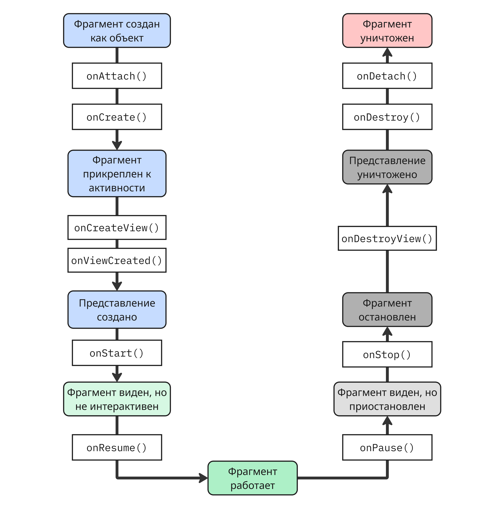

Фрагмент создается как класс, наследующийся от `Fragment`:

```kotlin
class MyFragment : Fragment(R.layout.fragment_main)
```

Или вручную с созданием представления:

```kotlin
override fun onCreateView(inflater: LayoutInflater, container: ViewGroup?, savedInstanceState: Bundle?): View {
    _binding = FragmentMyBinding.inflate(inflater, container, false)
    return binding.root
}
```

В само приложение фрагмент добавляется:

* Статически через XML-файл:

    ```xml
    <androidx.fragment.app.FragmentContainerView
        android:name="com.example.MyFragment"
        android:layout_width="match_parent"
        android:layout_height="match_parent" />
    ```

* Динамически в коде:

    ```kotlin
    supportFragmentManager.beginTransaction()
        .replace(R.id.container, MyFragment())
        .commit()
    ```

Здесь создается транзакция, которая позволяет условно атомарно изменить фрагмент. Для навигации между фрагментами у `FragmentTransaction` есть три основных метода:

* `add` - добавляет фрагмент поверх существующего, оба живут одновременно
* `remove` - удаляет фрагмент
* `replace` - удаляет текущий фрагмент и добавляет новый

Другой метод, `addToBackStack()`, добавляет транзакцию в стек. При нажатии на кнопку "Назад" транзакция откатится и вернётся предыдущий фрагмент. Без этого нажатие кнопки "Назад" закроет активность

```kotlin
supportFragmentManager.beginTransaction()
    .replace(R.id.container, DetailFragment())
    .addToBackStack(null)
    .commit()
```

Для передачи данных между фрагментами можно использовать объект `Bundle`:

```kotlin
companion object {
    fun newInstance(name: String) = MyFragment().apply {
        arguments = Bundle().apply { putString("key", name) }
    }
}
```

Получить данные можно с помощью свойства `arguments`

```kotlin
val name = arguments?.getString("key")
```
<!-- end uiandroid_2026_02_12.md -->

<!-- begin uiandroid_2026_02_26.md -->
## <a name="%D0%BB%D0%B5%D0%BA%D1%86%D0%B8%D1%8F-3.-%D1%80%D0%B0%D0%B1%D0%BE%D1%82%D0%B0-%D1%81-%D1%81%D0%B5%D1%82%D1%8C%D1%8E-%D0%B8-ui"></a> Лекция 3. Работа с сетью и UI

### <a name="%D1%81%D0%B5%D1%82%D0%B5%D0%B2%D0%BE%D0%B5-%D0%B2%D0%B7%D0%B0%D0%B8%D0%BC%D0%BE%D0%B4%D0%B5%D0%B9%D1%81%D1%82%D0%B2%D0%B8%D0%B5"></a> Сетевое взаимодействие

Сейчас самым распространенным сетевым стеком является TCP/IP. Он состоит из:

* Физический уровень - Ethernet, Wi-Fi и другие протоколы и технологии
* Сетевой уровень - протоколы IP 4-ой и 6-ой версий
* Транспортный уровень - протоколы TCP и UDP
* Прикладной уровень - протокол HTTP/HTTPS

> Подробнее о нем описано в курсе ["Телекоммуникационные системы и технологии"](https://pelmesh619.github.io/itmo_conspects/telecomm/telecomm_superconspect.html#%D0%BB%D0%B5%D0%BA%D1%86%D0%B8%D1%8F-5.-%D1%81%D1%82%D0%B5%D0%BA-tcp%2Fip)

Чтобы Android-приложение могло работать с сетью, необходимо в `AndroidManifest.xml` прописать нужные разрешения:

```xml
<uses-permission android:name="android.permission.INTERNET" />
<uses-permission android:name="android.permission.ACCESS_NETWORK_STATE" />
```

Для доступа к сетевому API все чаще используется HTTP (HyperText Transfer Protocol). Обычно HTTP работает так:

* Клиент запрашивает ресурс от сервера по заранее заданному IP-адресу или доменному имени и порту (обычно 80 или 443)
* Сервер, зная адрес отправителя, отправляет ответ

> Подробнее про HTTP описано в курсе ["Web-разработка: Backend"](https://pelmesh619.github.io/itmo_conspects/webbackend/webbackend_superconspect.html#%D0%BB%D0%B5%D0%BA%D1%86%D0%B8%D1%8F-1.-%D0%B2%D0%B2%D0%B5%D0%B4%D0%B5%D0%BD%D0%B8%D0%B5)

HTTP поддерживает типы запросов, которые семантически обозначают, что надо сделать с ресурсом, самые используемые это:

* `GET` - получение информации о ресурсе
* `POST` - создание нового ресурса
* `PUT` - обновление существующего ресурса
* `DELETE` - удаление ресурса

По умолчанию, протокол HTTP не поддерживает шифрование запросов, и любой участник передачи сообщения может его прочитать. Для борьбы с этим был создан протокол HTTPS (HTTP Secure)

Чаще всего ответом сервера на запрос будут данные в формате JSON (JavaScript Object Notation). Чтобы перевести JSON-текст в объектную модель, в Android-экосистеме используют:

* [GSON](https://github.com/google/gson) - библиотека с открытым исходным кодом для Java, разработанная Google
* [Jackson](https://github.com/FasterXML/jackson) - еще одна библиотека с открытым исходным кодом для Java
* Встроенный в экосистему Java пакет `org.json` с классом `JSONObject`:

    ```java
    String json = "{\"name\":\"Alice\",\"age\":30}";
    JSONObject obj = new JSONObject(json);
    String name = obj.getString("name");
    int age = obj.getInt("age");
    ```

Рассмотрим библиотеку GSON. Ее возможности включают автоматически маппинг JSON-объекта в сущность домена в виде POJO (Plain Old Java Object):

```kotlin
data class Person(
    @SerializedName("full_name")
    val name: String,
    val age: Int,

    @SerializedName(value = "email_address", alternate = ["email", "e"])
    val email: String? = null
)

val gson = Gson()

// Сериализация
val p = Person("Alice", 30)
val json: String = gson.toJson(p)
println(json) // {"name":"Alice","age":30}

// Десериализация
val jsonString = """{"name":"Bob","age":25,"email":"bob@example.com"}"""
val person: Person = gson.fromJson(jsonString, Person::class.java)
println(person) // Person(name="Bob", age=25, email="bob@example.com")
```

GSON позволяет задать имя ключа при сериализации и дополнительные имени для десериализации (в примере выше электронную почту можно указать как `e` и `email`). Также GSON производит автоматические преобразование к нужному типу, например, `0` и `false`, выданные сервером, преобразуются к булевому типу

Помимо обычного конвертера `Gson()`, можно указать дополнительные параметры в `GsonBuilder()`, например:

```kotlin
val gson = GsonBuilder()
   .setDateFormat("секунды ss, минуты mm, день dd, месяц MM, год yyyy")
   .setFieldNamingPolicy(FieldNamingPolicy.UPPER_CAMEL_CASE)
   .create()
```

Здесь указаны формат даты и политика полей имен (в данном случае свойство `firstName` сконвертируется в `FirstName` в JSON)

---

Одной из популярных библиотек для HTTP-обмена в Android является [Retrofit](https://github.com/square/retrofit). Это библиотека позволяется превратить API веб-приложений в интерфейс языка Java

Работает она так: сначала описываем сущности домены, которые приходят из API

```kotlin
data class Post(
    val userId: Int,
    val id: Int,
    val title: String,
    val body: String
)
```

Далее создаем интерфейс, аналогичный API:

```kotlin
interface JsonPlaceholderApi {
    // на GET запрос по http://host.com/posts
    // вернуть список постов
    @GET("posts")
    suspend fun getPosts(): List<Post>
}
```

Далее создает сервис и оборачивающая его функция:

```kotlin
val service = retrofit.create(JsonPlaceholderApi::class.java)

suspend fun fetchData() {
    try {
        val posts = service.getPosts()
        posts.forEach { println(it.title) }
    } catch (e: Exception) {
        println("Ошибка: ${e.message}")
    }
}
```

Также этот сервис можно настраивать под свои нужды, например, можно заказать конвертер из библиотеки GSON:

```kotlin
val service = retrofit.Builder()
    .baseUrl("http://example.com")
    .addConverterFactory(GsonConverterFactory.create())
    .build()
    .create(PokeApiService::class.java)
```

Далее этот сервис работает так:

* Создается прокси (паттерн ["Заместитель"](https://pelmesh619.github.io/itmo_conspects/oopcsharp/oopcsharp_superconspect.html#proxy)), который реализует интерфейс `JsonPlaceholderApi`
* Вызов сервиса передается прокси
* На основе аннотаций и аргументов собирается HTTP-запрос
* Запрос отправляется через библиотеку OkHttp, которая выполняет реальную передачу данных
* Полученный ответ конвертируется с помощью конвертора (например, `GsonConverterFactory.create()`) в объекты языка

Здесь в интерфейсе и функции `fetchData` есть ключевое слово `suspend`. Оно говорит о том, что метод и функции являются корутинами, то есть объектами асинхронного исполнения

До этого вместо корутин использовали интерфейс `Call<T>`:

```kotlin
interface MyApiService {
    @GET("users")
    fun getUsers(): Call<List<User>> 
}
```

Возвращенный тип представлял собой обертку над исполнением запроса, которое можно было запустить:

```kotlin
val call: Call<List<User>> = service.getUsers() // запрос создан, но не отправлен

call.enqueue(object : Callback<List<User>> {
    override fun onResponse(call: Call<List<User>>, response: Response<List<User>>) {
        if (response.isSuccessful) {
            val users = response.body()
            println("Получено пользователей: ${users?.size}")
        } else {
            println("Ошибка сервера: ${response.code()}")
        }
    }

    override fun onFailure(call: Call<List<User>>, t: Throwable) {
        println("Ошибка сети: ${t.message}")
    }
})
```

---

Также библиотека OkHttp позволяет работать с протоколом WebSocket:

```kotlin
val ws = OkHttpClient().newWebSocket(
    Request.Builder().url("ws:sample").build(), 
    object: WebSocketListener() {
        override fun onMessage(webSocket: WebSocket, text: String) {
            super.onMessage(webSocket, text)
        }

        override fun onOpen(webSocket: WebSocket, response: Response) {
            super.onOpen(webSocket, response)
        }

        override fun onClosed(webSocket: WebSocket, code: Int, reason: String) {
            super.onClosed(webSocket, code, reason)
        }

        override fun onClosing(webSocket: WebSocket, code: Int, reason: String) {
            super.onClosing(webSocket, code, reason)
        }
    }
)
ws.send("Hello")
```

Здесь в методе создания веб-сокета передается объект класса, реализующий 4 метода

---

Помимо HTTP-запросов можно отправлять сырые запросы по TCP или UDP

Так работает передача по TCP:

```kotlin
// Создаем TCP-сокет
val echoSocket = Socket(hostName, portNumber)

// Достаем из него поток для отправки текста
val out = PrintWriter(echoSocket.getOutputStream(), true)

// Перенаправляем стандартный поток ввода в наш сокет
System.setIn(echoSocket.getInputStream())
```

Так создаются UDP-сокеты:

```kotlin
// Создание сокета
val socket = DatagramSocket(1024, InetAddress.getByName("0.0.0.0"))
socket.reuseAddress = true
socket.broadcast = true

// Ждем датаграмму
val recvBuf = ByteArray(10)
val packet = DatagramPacket(recvBuf, recvBuf.size)
socket.receive(packet)
```

### <a name="ui"></a> UI

Android позволяет создавать интерфейсы несколькими способами:

* Через объявление в XML-файле (eXtensible Markup Language)
* Программно в коде, например, с помощью фреймворка Jetpack Compose

Объявление в XML-файле и программные можно комбинировать

Рассмотрим объявления в формате XML. Все XML-файлы хранятся в папке `/res/`, в частности:

* `/res/layout/` - набор описания интерфейса активностей и макетов
* `/res/values/` - файлы с наборами значений, такими как:

    * `/res/values/strings.xml` - локализованные строки
    * `/res/values/colors.xml` - цветовая схема приложения
    * `/res/values/styles.xml` - стили приложения
    * `/res/values/themes.xml` - темы приложения (темы отличаются от стилей тем, что тема глобальная для всего приложения)
    * `/res/values/dimens.xml` (от dimensions) - значения размеров элементов интерфейса
* анимации, иконки и прочее

В `/res/layout` как раз-таки описано то, как выглядит интерфейс приложения, а именно его элементы на соответствующих экранах, как они расположены, каких цветов и так далее

Обычно один такой файл выглядит так:

```xml
<?xml version="1.0" encoding="utf-8"?>
<LinearLayout xmlns:android="http://schemas.android.com/apk/res/android"
    android:id="@+id/root"
    android:layout_width="match_parent"
    android:layout_height="match_parent"
    android:orientation="vertical"
    android:gravity="center"
    android:padding="24dp">

    <TextView
        android:id="@+id/textCount"
        android:layout_width="wrap_content"
        android:layout_height="wrap_content"
        android:text="Count: 0"
        android:textSize="32sp"
        android:layout_marginBottom="16dp" />

    <Button
        android:id="@+id/buttonIncrement"
        android:layout_width="wrap_content"
        android:layout_height="wrap_content"
        android:text="Increment" />

    <Space
        android:layout_width="wrap_content"
        android:layout_height="12dp" />

    <Button
        android:id="@+id/buttonReset"
        android:layout_width="wrap_content"
        android:layout_height="wrap_content"
        android:text="Reset" />

</LinearLayout>
```

Здесь интерфейс описан как линейный макет с объектами представления

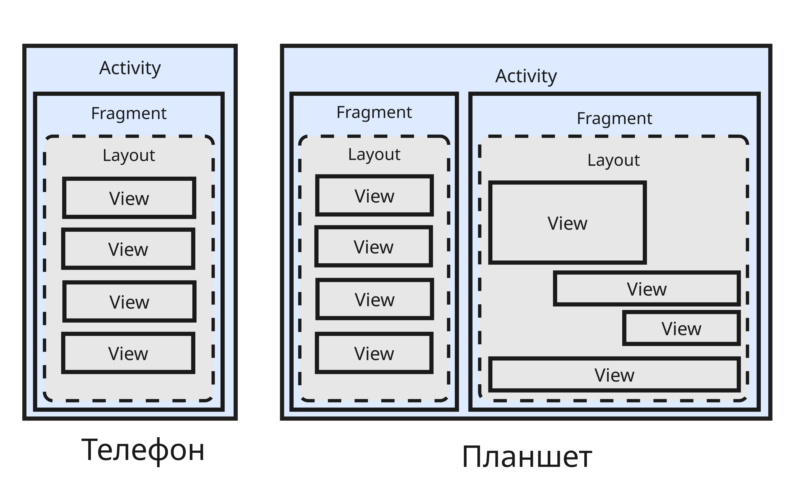

#### <a name="%D0%BE%D0%B1%D1%8A%D0%B5%D0%BA%D1%82-%D0%BF%D1%80%D0%B5%D0%B4%D1%81%D1%82%D0%B0%D0%B2%D0%BB%D0%B5%D0%BD%D0%B8%D1%8F-%60view%60"></a> Объект представления `View`

Класс `View` - это базовый класс, который представляет элемент интерфейса

`View` является классом-родителем для множества других элементов:

* `ImageView` - элемент с изображением
* `ProgressBar` - элемент с полосой загрузки
* `Space` - пустое пространство
* `TextView` - элемент с текстом
* `ViewGroup` - элемент, представляющий группу из других элементов. От `ViewGroup` наследуются:

    * `LinearLayout`
    * `RelativeLayout`
    * `ConstraintLayout`
    * `ScrollView`
    * и другие

В XML-файле объект представления задается тегом его класса, например:

```xml
    <TextView
        android:id="@+id/textCount"
        android:layout_width="wrap_content"
        android:layout_height="wrap_content"
        android:text="Count: 0"
        android:textSize="32sp"
        android:layout_marginBottom="16dp" />
```

Далее идут атрибуты объекта представления, такие как:

* `android:id` - идентификатор. Объявление идентификатора указывается в формате `@+id/myview`, а используется в виде `@id/myview`
* `android:layout_width` - ширина элемента
* `android:layout_height` - высота элемента
* `android:text` - текст, который отображается в элементе
* `android:padding` - внутренний отступ
* `android:margin` - внешний отступ
* `android:orientation` - ориентация элемента
* `android:visibility` - видимость элемента
* `android:enabled` - доступность элемента
* и другие

Жизненный цикл `View` состоит из следующих этапов:

* `View` создана и прикреплена к экрану, вызывается метод `onAttachedToWindow()`
* Далее вызывается метод `onMeasure()`, который определяет желаемые размеры, например, из XML-файла или другим образом
* Далее вызывается метод `onLayout`, который вычислять позицию этой `View`, а также размеры и позицию своих дочерних представлений. Для обычной `View`, а не `ViewGroup` этот метод ничего не делает
* После этого вызывается метод `onDraw()`, который отрисовывает на экране `View`. Этот метод исполняется в основном потоке, в котором работает интерфейс, поэтому он должен быть максимально быстрый (не задействовать операции ввода/вывода), чтобы не блокировать поток
* Метод `onDetachedFromWindow()` вызывается, когда `View` отсоединяется от окна

Если `View` некорректна или неактуальна, можно воспользоваться следующими методами:

* `invalidate()` - планирует перерисовку `View` (то есть вызов `onDraw`). Используется когда изменился внешний вид, но не размер
* `requestLayout()` - запускает полный цикл `onMeasure()` и `onLayout()`, но не гарантирует вызов `onDraw()`. Используется когда изменились размеры `View`
* `forceLayout()` - инвалидирует кэшированные размеры дочерних `View` в `ViewGroup`. Используется только вместе с `requestLayout()`

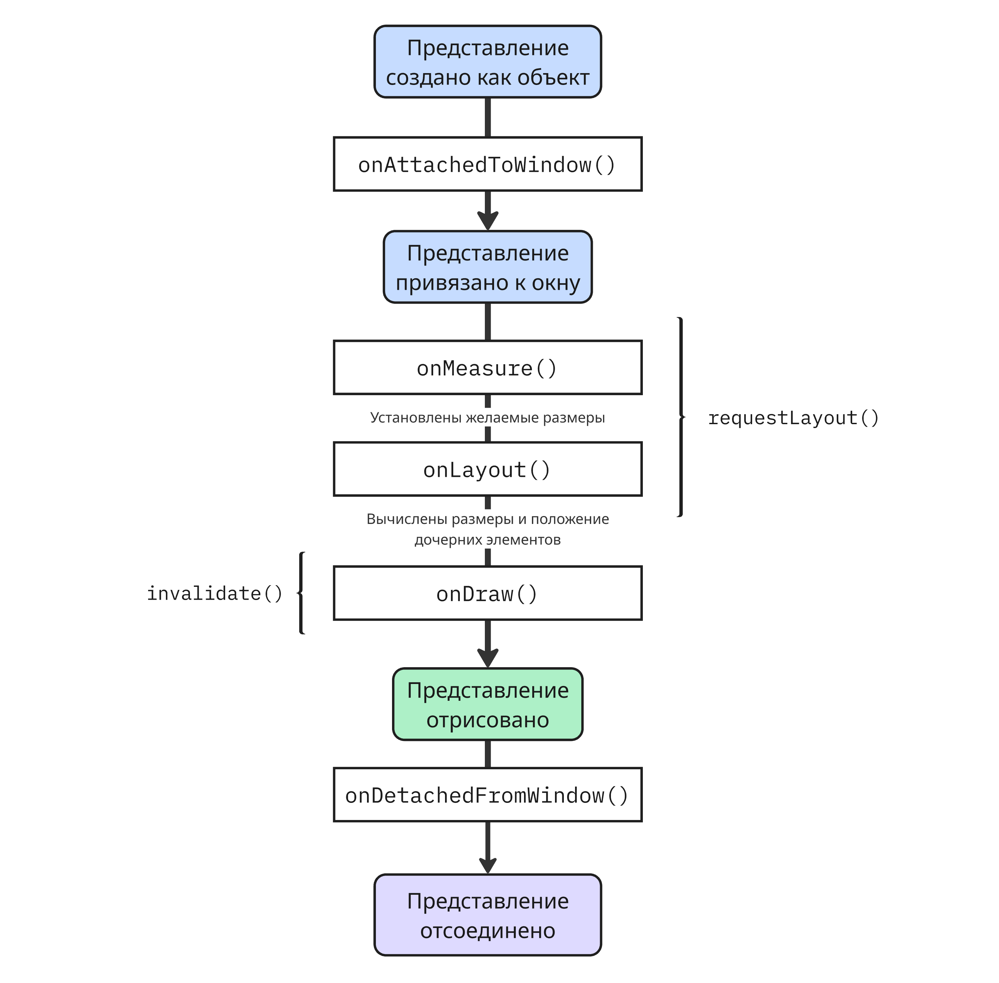

---

Также можно создать свой наследник `View`. Для этого создаем класс:

```kotlin
class CircleView @JvmOverloads constructor(
    context: Context,
    attrs: AttributeSet? = null
) : View(context, attrs) {

    private val paint = Paint(Paint.ANTI_ALIAS_FLAG).apply {
        color = Color.RED
    }

    fun setColor(color: Int) {
        paint.color = color
        invalidate()  // перерисовать
    }

    override fun onDraw(canvas: Canvas) {
        super.onDraw(canvas)
        // Рисуем круг по центру View
        val cx = width / 2f
        val cy = height / 2f
        val radius = min(width, height) / 2f
        canvas.drawCircle(cx, cy, radius, paint)
    }
}
```

Далее использовать программно или в XML:

```xml
<com.example.exampleapp.CircleView
    android:layout_width="100dp"
    android:layout_height="100dp" />
```

Для таких `View` можно объявлять свои атрибуты в файле `/res/values/attrs.xml`, например:

```xml
<?xml version="1.0" encoding="utf-8"?>
<resources>
    <declare-styleable name="CircleView">
        <attr name="circleColor" format="color" />
    </declare-styleable>
</resources>
```

Далее в классе читать атрибуты:

```kotlin
class CircleView @JvmOverloads constructor(
    context: Context,
    attrs: AttributeSet? = null,
    defStyleAttr: Int = 0
) : View(context, attrs, defStyleAttr) {

    init {
        // Читаем атрибуты
        val typedArray = context.obtainStyledAttributes(attrs, R.styleable.CircleView)
        val defaultColor = Color.RED
        val color = typedArray.getColor(R.styleable.CircleView_circleColor, defaultColor)
        typedArray.recycle()

        paint.color = color
    }

    // ...
}
```

Здесь `defStyleAttr` указывает на атрибут в теме, содержащий стиль по уполчанию для `CircleView`

Далее цвет можно указать так:

```xml
    <com.example.exampleapp.CircleView
        android:layout_width="100dp"
        android:layout_height="100dp"
        app:circleColor="@color/blue" />
```

#### <a name="%D0%BE%D0%B1%D1%8A%D0%B5%D0%BA%D1%82-%D0%BC%D0%B0%D0%BA%D0%B5%D1%82%D0%B0-%60layout%60"></a> Объект макета `Layout`

Так в Android-приложении весь интерфейс одного экрана живет в одной активности. Для компоновки элементов интерфейса используют объект макета `Layout`. Сам макет с его элементами описывается в XML-файле в папке `/res/layout` (или программно)

Рассмотрим основные классы, которые наследуются от `Layout`:

* `LinearLayout` располагает внутренние элементы в строку или в столбец, используется для списков
* `RelativeLayout` позволяет располагать элементы относительно друг друга
* `FrameLayout` позволяет располагать элементы в столбец в рамках одного экрана
* `GridLayout` позволяет задать сетку из элементов
* `ConstraintLayout` позволяет располагать элементы, привязывая их к границам экрана или к другим компонентам

Самый быстрый - это `FrameLayout`. Далее идут `LinearLayout`, `GridLayout` и другие

Разметка элементов регулируется атрибутами в объектах макетов и дочерних элементах

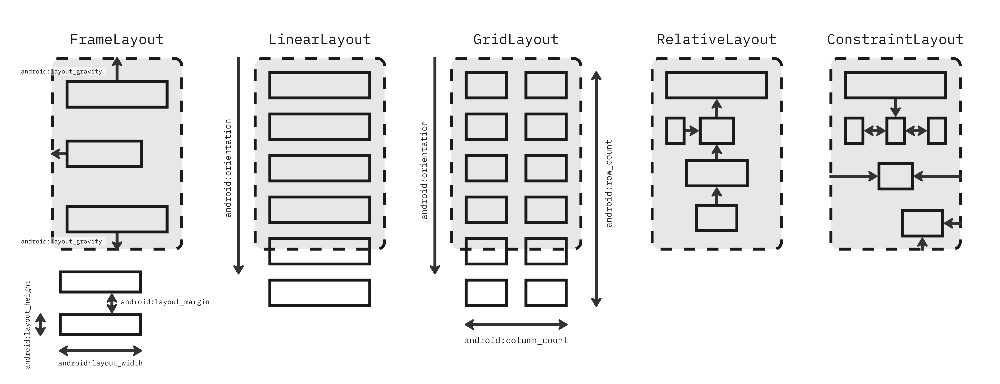

Главное правило - избегать излишней вложенности. `RelativeLayout` и `LinearLayout` могут два раза пробегаться по элементам при отрисовке. Если интерфейс сложный, то лучше использовать `ConstraintLayout`

Также для удобства макеты можно вкладывать друг в друга, указывая имя XML-файла с помощью тега `<include>`. Например, если есть `res/layout/header.xml`:

```xml
<?xml version="1.0" encoding="utf-8"?>
<LinearLayout xmlns:android="http://schemas.android.com/apk/res/android"
    android:layout_width="match_parent"
    android:layout_height="wrap_content"
    android:background="#2196F3"
    android:padding="16dp">

    <TextView
        android:layout_width="wrap_content"
        android:layout_height="wrap_content"
        android:text="Заголовок приложения"
        android:textColor="#FFFFFF" />
</LinearLayout>
```

То можно его включить в другом макете так:

```xml
<include
    android:id="@+id/main_header"
    layout="@layout/header" />
```

А если нужно не весь `Layout`, а только его содержимое, то можно применить тег `<merge>`:

```xml
<?xml version="1.0" encoding="utf-8"?>
<merge xmlns:android="http://schemas.android.com/apk/res/android">

    <TextView
        android:layout_width="wrap_content"
        android:layout_height="wrap_content"
        android:text="Заголовок приложения"
        android:textColor="#FFFFFF" />
</merge>
```

```xml
<include layout="@layout/header" />
```

Это позволяет улучшить производительность и уменьшить вложенность иерархии

---

Программно создание макета выглядит так:

```java
public class MainActivity extends Activity {
    @Override
    protected void onCreate(Bundle savedInstanceState) {
        super.onCreate(savedInstanceState);

        // Создаем LinearLayout
        LinearLayout layout = new LinearLayout(this);
        layout.setOrientation(LinearLayout.VERTICAL);
        layout.setLayoutParams(new LayoutParams(LayoutParams.MATCH_PARENT, LayoutParams.MATCH_PARENT));

        // Создаем кнопку
        Button button = new Button(this);
        button.setText("Нажми меня");
        button.setLayoutParams(new LayoutParams(LayoutParams.WRAP_CONTENT, LayoutParams.WRAP_CONTENT));

        // Добавляем кнопку в LinearLayout
        layout.addView(button);

        // Устанавливаем LinearLayout как корневой элемент Activity
        setContentView(layout);
    }
}
```

#### <a name="%D0%BF%D1%80%D0%BE%D1%86%D0%B5%D1%81%D1%81-%D0%BD%D0%B0%D0%B4%D1%83%D0%B2%D0%B0%D0%BD%D0%B8%D1%8F"></a> Процесс надувания

Далее, когда запускается приложение и создается активность, происходит процесс надувания (inflate) - специальный сервис `LayoutInflater` превращает XML-теги в объекты языка, с которыми можно работать внутри кода

```kotlin
// Получаем экземпляр LayoutInflater
val inflater = LayoutInflater.from(context) 
// или getLayoutInflater()

// Надувание
val rootView: View = inflater.inflate(R.layout.item_view, null)

// Теперь находим дочерние представления по их идентификатору,
// используя findViewById<T>
val title = rootView.findViewById<TextView>(R.id.titleTextView)
val button = rootView.findViewById<Button>(R.id.actionButton)

// Устанавливаем текст и обработчик
title.text = "Заголовок"
button.setOnClickListener {
    // действие
}

// Добавляем rootView на какой-нибудь макет
someLinearLayout.addView(rootView)
```

Здесь `R` в `R.layout.item_view`, `R.id.titleTextView`, `R.id.actionButton` - это автоматически сгенерированный класс, создающийся на этапе компиляции и состоящий из указателей на ресурсы приложений (в данном случае мы заказали кнопку из файла или `/res/layout/item_button.xml`)

Метод `inflate` имеет такую сигнатуру:

```kotlin
inflate(@LayoutRes resource: Int, root: ViewGroup?, attachToRoot: Boolean): View
```

Здесь `resource` - указатель из `R`, `root` - родительский элемент, который будет использоваться для вычисления размеров и отступов, `attachToRoot` - надо ли сразу добавить надутый элемент в родителю

Внутри `LayoutInflater`:

* Читает XML-файл
* Определяет, какой объект нужно создать, и создает с помощью фабрики
* Применяет атрибуты, описанные в XML-файле
* Рекурсивно создает дочерние элементы, если они есть
* Привязывает их к указанному родителю, если надо

#### <a name="%D0%BE%D0%B1%D1%8A%D0%B5%D0%BA%D1%82%D1%8B-%D1%81%D0%B2%D1%8F%D0%B7%D0%BA%D0%B8"></a> Объекты связки

Android SDK позволяет использовать объекты связки (binding)

Сначала появился объект Synthetic Binding - плагин `kotlin-android-extensions` позволял обращаться к `View` по идентификатору напрямую, без `findViewById`, как к свойствам

Плагин подключался в `build.gradle`:

```groovy
plugins {
    id 'kotlin-android-extensions'
}
```

В коде импортировался `kotlinx.android.synthetic.main.<layout>.*` и класс использовался:

```kotlin
import kotlinx.android.synthetic.main.activity_main.*
textView.text = "Hello, world"
```

Плагин автоматически генерировал кэш в хешмапе, избегая повторного вызова методов `findViewById`, но мог вернуть `null`, если объект представления не существует

Также была проблема с конфликтами имен, поэтому от такого решения отказались

---

Далее появился объект связки представления - View Binding

Для его использования нужно добавить флаг в `build.gradle.kts`:

```kotlin
android {
    buildFeatures {
        viewBinding = true
    }
}
```

Далее объект связки представляет свойство в объекте активности или фрагмента, которое можно надуть:

```kotlin
class MainActivity : AppCompatActivity() {
    private lateinit var binding: ActivityMainBinding

    override fun onCreate(savedInstanceState: Bundle?) {
        super.onCreate(savedInstanceState)
        binding = ActivityMainBinding.inflate(layoutInflater)
        setContentView(binding.root)

        // непосредственное изменение
        binding.button.text = "Нажми"
    }
}
```

ViewBinding позволяет обращаться к внутренним элементами интерфейса, описанных в XML, не через метод `findViewById`, а через свойства объекта автоматически сгенерированного класса `___Binding`

При этом поля имеют названия указанных идентификаторов, но в camelCase (то есть `@+id/button_ok` преобразовывается в `buttonOk`), работает быстрее, чем `findViewById`, и более типобезопасно

---

Для реактивного интерфейса придумали объект связки данных Data Binding

Реактивный интерфейс - подход к разработке интерфейсов, который использует реактивное программирование для управления потоками данных и событий, позволяя автоматически обновлять интерфейс при изменении данных

Data Binding позволяет связывать компоненты интерфейса напрямую с источниками данных прямо в XML. Включается Data Binding в `build.gradle.kts`:

```kotlin
android {
    buildFeatures {
        dataBinding = true
    }
}
```

Далее в XML-файле добавляется тег `<data>`, например:

```xml
<layout xmlns:android="http://schemas.android.com/apk/res/android">
    <data>
        <variable name="viewModel" type="com.example.MyViewModel" />
    </data>
    <LinearLayout>
        <TextView android:text="@{viewModel.userName}" />
        <Button android:onClick="@{() -> viewModel.onButtonClick()}" />
        <EditText android:text="@={viewModel.userInput}" />
    </LinearLayout>
</layout>
```

В теге `<data>` объявляется переменная, значения свойств которой можно записать в объектах представления

Программно `viewModel` привязывается к объектам интерфейса так:

```kotlin
val binding: ActivityMainBinding = DataBindingUtil.setContentView(this, R.layout.activity_main)
binding.viewModel = myViewModel
binding.lifecycleOwner = this   // для наблюдения
```

Для реактивного подхода используется классы, подобные `LiveData`, за которыми можно закрепить функцию, исполняющуюся при изменении данных (паттерн ["Наблюдатель"](https://pelmesh619.github.io/itmo_conspects/oopcsharp/oopcsharp_superconspect.html#observer))

Data Binding позволяет уменьшить количество кода в активности, поддерживает двухстороннее изменение (если есть поле для ввода, то значение поменяется и в коде), но приложение медленнее компилируется, и его сложнее отлаживать

#### <a name="%D1%84%D1%80%D0%B5%D0%B9%D0%BC%D0%B2%D0%BE%D1%80%D0%BA-jetpack-compose"></a> Фреймворк Jetpack Compose

Jetpack Compose - новый фреймворк, который позволяет декларативно задать интерфейс на языке программирования

Пример его использования:

```kotlin
class MainActivity : ComponentActivity() {
    override fun onCreate(savedInstanceState: Bundle?) {
        super.onCreate(savedInstanceState)
        setContent {
            CounterAppTheme {
                Surface(modifier = Modifier.fillMaxSize(), color = MaterialTheme.colorScheme.background) {
                    CounterScreen()
                }
            }
        }
    }
}

@Composable
fun CounterScreen() {
    var count by remember { mutableStateOf(0) }

    Column(
        modifier = Modifier
            .fillMaxSize()
            .padding(24.dp),
        verticalArrangement = Arrangement.Center,
        horizontalAlignment = Alignment.CenterHorizontally
    ) {
        Text(text = "Count: $count", fontSize = 32.sp, modifier = Modifier.padding(bottom = 16.dp))
        Button(onClick = { count++ }) {
            Text("Increment")
        }
        Spacer(Modifier.height(12.dp))
        OutlinedButton(onClick = { count = 0 }) {
            Text("Reset")
        }
    }
}
```

Здесь задается столбец из элементов: текста с счетчиком, кнопки инкремента и кнопки сброса

#### <a name="%D0%B0%D0%B4%D0%B0%D0%BF%D1%82%D0%B8%D0%B2%D0%BD%D1%8B%D0%B9-%D0%B4%D0%B8%D0%B7%D0%B0%D0%B9%D0%BD"></a> Адаптивный дизайн

Далее будут приведены хорошие практики для создания дизайна, который будет хорошо работать на разных устройствах:

* У телефона или планшета на Android есть две ориентации: книжная (высота по вертикали больше ширины по горизонтали экрана) и альбомная. Интерфейс, созданный для книжной ориентации, может плохо выглядеть на альбомной ориентации, поэтому создают отдельные макеты

    Такие макеты хранятся в `/res/layout-land` (от landscape). В манифест можно указать атрибут `android:screenOrientation`, чтобы показать, какую ориентацию поддерживает приложение

* Вместо пикселей лучше использовать относительные единицы `dp` и `sp`

    `1dp` (от density-independent pixel) - это длина одного пикселя на экране с `160dpi` (dots per inch), то есть примерно 1/160 дюйма. `dp` не зависит от плотности экрана, поэтому ее лучше использовать для высоты, ширины элементов, отступов и прочих размеров элементов интерфейса

    `1sp` (от scale-independent pixel) - это длина, умноженная на масштаб шрифта, установленного в системе. Крайне важно использовать ее для размеров текста, чтобы обеспечивать доступность для всех пользователей

* Для устройств разной плотностью пикселей на экране можно задать свои макеты. Плотность экрана измеряется в `dp`; так,

    * `/res/layout-small` - макеты для экранов с шириной до `320dp`
    * `/res/layout-normal` - для экранов с шириной от `320dp` до `480dp`
    * `/res/layout-large` - для экранов с шириной от `480dp` до `720dp`
    * `/res/layout-xlarge` - для экранов с шириной от `720dp` и более

    Также, непосредственно в коде можно использовать медиа-запросы, например, свойство `getResources().getConfiguration().screenWidthDp` позволяет узнать ширину экрана
<!-- end uiandroid_2026_02_26.md -->

<!-- begin uiandroid_2026_03_19.md -->
## <a name="%D0%BB%D0%B5%D0%BA%D1%86%D0%B8%D1%8F-4.-%D0%B0%D1%80%D1%85%D0%B8%D1%82%D0%B5%D0%BA%D1%82%D1%83%D1%80%D0%B0-android-%D0%BF%D1%80%D0%B8%D0%BB%D0%BE%D0%B6%D0%B5%D0%BD%D0%B8%D1%8F"></a> Лекция 4. Архитектура Android-приложения

Программная архитектура приложения - это то, как приложение устроено на высоком уровне: из каких частей оно состоит, как эти части взаимодействуют и по каким правилам эта система должна развиваться

Цель архитектуры - это уменьшение трудозатрат на создание, содержание и развитие системы

За время развития индустрии в компаниях пришли к многочисленным решениям организации кода, таких как MVC (Model-View-Controller), трехслойная или гексагональная архитектура

Позднее Роберт Мартин сформировал принцип "чистой архитектуры" (Clean Architecture):

* Ответственность строго разделена между программными модулями
* Внутренние программные модули не должны зависеть от внешних
* При взаимодействии между ними передаются только те ресурсы, которые необходимы для выполнения нужной задачи

Из этого следует, что бизнес-логика не должна зависеть от пользовательского интерфейса, от базы данных или другого внешнего сервиса

Из достоинств чистой архитектуры выделяют простоту поддержки, развития и тестирования проект. Из недостатков выделяется большой размер получающейся кодовой базы

Обычно выделяют 4 слоя (от внутреннего к внешнему):

* Бизнес-правила уровня предприятия - в него включают сущностей, которыми оперирует бизнес

    Сущности - это объекты модели прикладной области. Как правило сущность представляет структуру данных с методами

* Бизнес-правила прикладного уровня - в него включают варианты использования сущностей (Use cases)

    Вариант использования (Use case) - это объект, который реализует одно или несколько конкретных бизнес-правил. Сущности не должны зависеть от вариантов использования

    Вариант использования описывает процесс, который может происходит с сущностью. Например, чтобы взять кредит в банке, нужны личные данные заемщика, далее их нужно проверить, сравнить его кредитный рейтинг, а затем одобрить или отклонить кредит. Все эти действия может совершить объект варианта использования

    Набор вариантов использования обычно объединяют в интерактор

* Адаптеры интерфейсов - как правило, их называются контроллерами (Controller), шлюзами (Gateway) или презентаторами (Presenter)

    Адаптеры соединяют варианты использования с внешним миром - они преобразуют данные из формата, удобного для бизнес-логики, в формат, удобных для внешних сервисов (так называемых DTO, Data Transfer Object)

* Фреймворки и драйверы - это пользовательские интерфейсы, API, базы данных и так далее

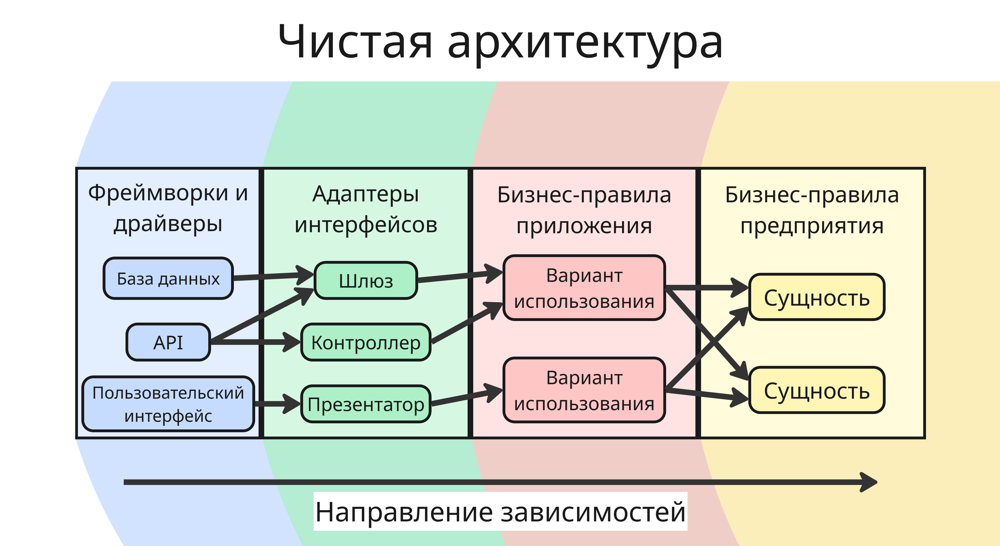

Зависимости в таком положении указываются только из внешнего слоя вовнутрь, то есть сущности и их варианты использования не должны зависеть от пользовательского интерфейса

Чтобы элементы какого-либо внешнего слоя общались между собой, они должны взаимодействовать через элемент внутреннего слоя, который имеет два интерфейса: один для запроса и другой для ответа

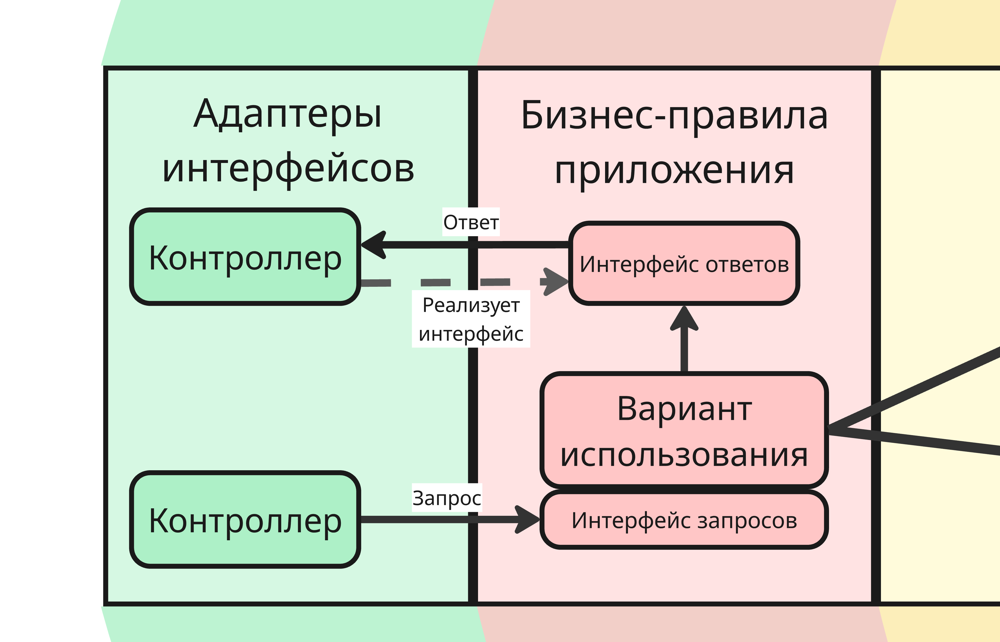

---

Применительно к Android-приложениям архитектуру делят на три слоя:

* Слоя пользовательского интерфейса
* Слой доменной модели
* Слой данных

Слой пользовательского интерфейса включает элементы интерфейса, которые отображаются на экране, и носителей состояния (State holder). Носители состояния хранят данные, которые получили из другого слоя, и предоставляют их пользовательскому интерфейсу

Слой доменной модели опционален и отвечает за инкапсуляцию сложной бизнес-логики

Слой данных определяет, как приложение получает, хранит и синхронизирует данные

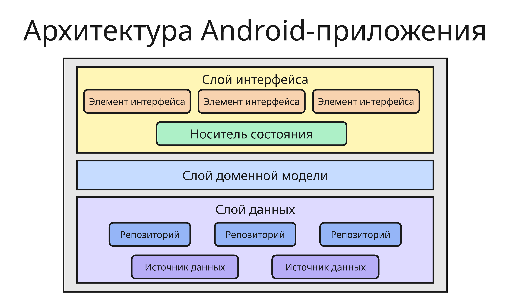

Пример файловой организации проекта может быть таким:

```txt
📁 src
    📁 data
        📁 remote
            📁 api
            📁 dto
        📁 local
            📁 db
            📁 dao
            📁 entities
        📁 mapper
        📁 repository
    📁 domain
        📁 model
        📁 repository
        📁 usecase
    📁 presentation
        📁 screen
            📁 main
                📄 MainActivity
                📄 MainViewModel
                📄 MainUiState
        📁 mapper
```

Также при разработке применяют архитектурные паттерны. Они описывают, как организовать взаимодействие между пользовательским интерфейсом, состоянием и бизнес-логикой приложения.

### <a name="mvc"></a> MVC

Архитектура MVC (Model-View-Controller) состоит из трех компонентов: модели, представления и контроллера.

* Модель хранит данные и бизнес-логику приложения
* Представление отображает данные пользователю
* Контроллер принимает действия пользователя, изменяет модель и обновляет представление

В Android классическая архитектура MVC встречается редко, потому что активность или фрагмент часто берут на себя слишком много обязанностей и превращаются в перегруженные классы

Преимущества MVC:

* простая и понятная структура для небольших приложений
* легко начать разработку без сложной подготовки архитектуры

Недостатки MVC:

* контроллер со временем может стать слишком большим
* код интерфейса и бизнес-логика часто смешиваются
* такой подход сложнее поддерживать и тестировать в крупных проектах

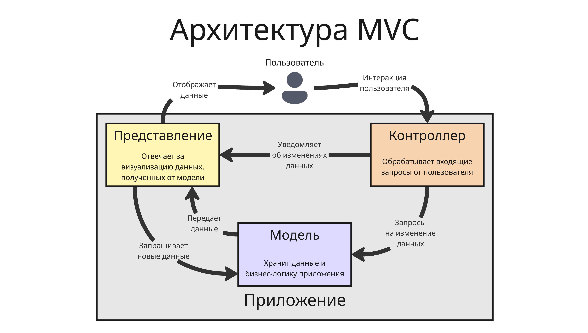

### <a name="mvp"></a> MVP

Архитектура MVP (Model-View-Presenter) разделяет ответственность между моделью, представлением и презентатором

* Модель отвечает за данные и доступ к бизнес-логике
* Представление отображает данные и передает действия пользователя
* Презентатор получает события от представления, обращается к модели и подготавливает данные для отображения

Главная идея архитектуры MVP состоит в том, что представление должно быть максимально простым, а основная логика взаимодействия переносится в презентатор. Такой подход упрощает тестирование, потому что презентатор можно проверять отдельно от пользовательского интерфейса

Преимущества MVP:

* лучшее разделение ответственности по сравнению с MVC
* презентатор удобно тестировать отдельно от пользовательского интерфейса
* представление становится проще и содержит меньше логики

Недостатки MVP:

* увеличивается количество классов и интерфейсов
* при большом количестве экранов растет объем шаблонного кода
* презентатор может стать слишком сложным, если в него переносить слишком много логики

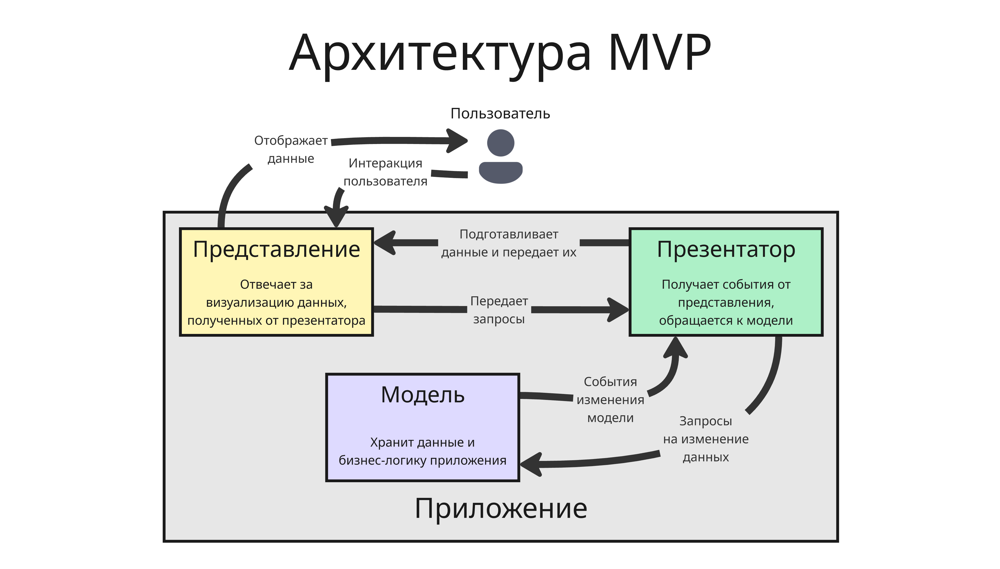

### <a name="mvvm"></a> MVVM

Архитектура MVVM (Model-View-ViewModel) особенно популярна в Android-разработке. В ней:

* Модель отвечает за данные и бизнес-логику
* Представление отображает состояние экрана и передает действия пользователя
* Модель представления (ViewModel) хранит состояние экрана, обрабатывает события и предоставляет данные для представления

В модель представления обычно помещают логику экрана, которая не должна зависеть от жизненного цикла конкретных активности или фрагмента. В Android-разработке этот паттерн часто используют вместе с типами `LiveData`, `StateFlow` или во фреймворке `Jetpack Compose`

Преимущества MVVM:

* хорошо сочетается с современными инструментами Android
* удобно управлять состоянием экрана через модель представления
* упрощается тестирование логики экрана
* уменьшается связность между интерфейсом и логикой

Недостатки MVVM:

* новичкам бывает сложнее понять поток данных
* при неаккуратной реализации модель представления может стать слишком большой
* использование реактивных механизмов требует дополнительного понимания

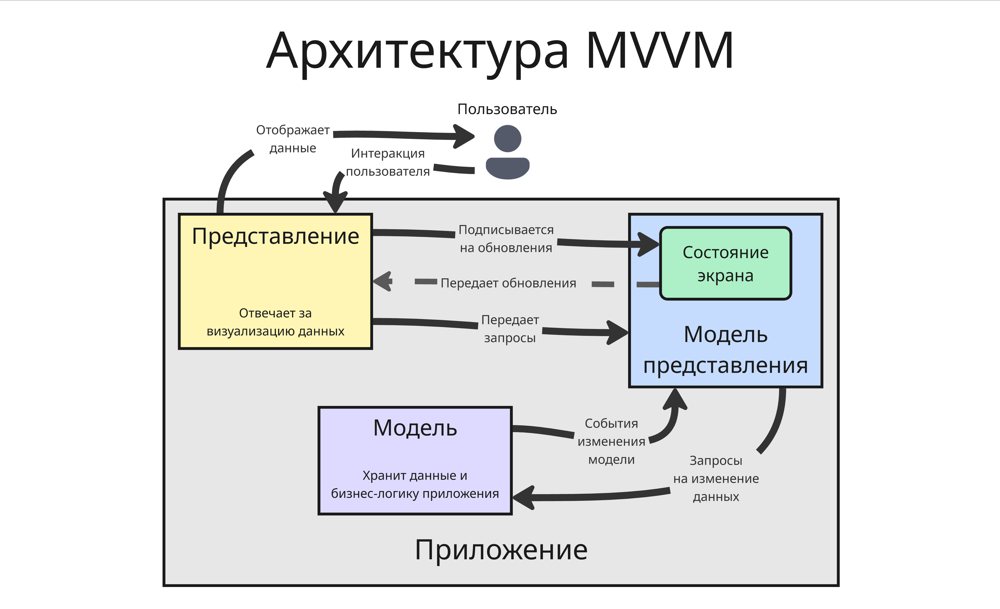

### <a name="mvi"></a> MVI

Архитектура MVI (Model-View-Intent) строится вокруг однонаправленного потока данных (Unidirectional Data Flow)

* Представление отправляет намерения (Intent) пользователя
* Модель или хранилище состояния обрабатывает их и формирует новое состояние
* Представление подписывается на состояние и полностью перерисовывается при его изменении

Главное преимущество MVI состоит в том, что состояние экрана хранится в одном месте и изменяется предсказуемо. Такой подход удобен для сложных экранов с большим количеством состояний, но может требовать больше шаблонного кода

Преимущества MVI:

* предсказуемое изменение состояния благодаря однонаправленному потоку данных
* состояние экрана хранится централизованно
* удобно отслеживать и отлаживать сложные сценарии интерфейса

Недостатки MVI:

* требует больше шаблонного кода
* может быть избыточным для простых экранов
* сложнее в освоении по сравнению с MVC или MVP

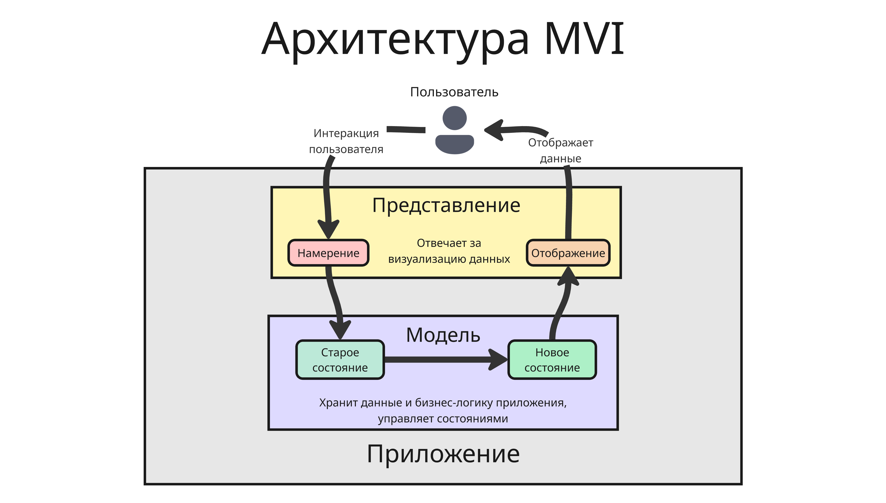

MVVM и MVI чаще всего применяются в современных Android-приложениях, потому что они хорошо сочетаются с реактивным подходом и удобны для сопровождения
<!-- end uiandroid_2026_03_19.md -->

<!-- begin uiandroid_2026_04_02.md -->
## <a name="%D0%BB%D0%B5%D0%BA%D1%86%D0%B8%D1%8F-5.-%D0%B4%D0%B8%D0%B7%D0%B0%D0%B9%D0%BD-%D1%81%D0%B8%D1%81%D1%82%D0%B5%D0%BC%D0%B0-%D0%B8-%D0%B8%D0%BD%D1%82%D0%B5%D1%80%D1%84%D0%B5%D0%B9%D1%81%2C-%D1%83%D0%BF%D1%80%D0%B0%D0%B2%D0%BB%D1%8F%D0%B5%D0%BC%D1%8B%D0%B9-%D0%B1%D1%8D%D0%BA%D0%B5%D0%BD%D0%B4%D0%BE%D0%BC"></a> Лекция 5. Дизайн-система и интерфейс, управляемый бэкендом

### <a name="%D0%B4%D0%B8%D0%B7%D0%B0%D0%B9%D0%BD-%D1%81%D0%B8%D1%81%D1%82%D0%B5%D0%BC%D0%B0"></a> Дизайн-система

Дизайн-система - это система, которая помогает создать единый и последовательный дизайн для всех устройств

Дизайн-система представляет из себя набор правил и компонентов, таких как цветовая схема, типография, готовые макеты из элементов и их компоновка

По сути, дизайн-система выступает общим языком между дизайнерами и разработчиками - она помогает договориться о том, как должен выглядеть и вести себя интерфейс, чтобы разные части приложения не ощущались собранными из несвязанных между собой экранов

Разберем, для чего нужны эти компоненты:

* Цветовая схема - набор цветов, использующихся в дизайне продукта. Этот набор включает основные цвета, второстепенные цвета, цвет фона и так далее

* Типография - это набор шрифтов и правил их использования вкупе с разными размерами и стилями

* Иконография - набор иконок и визуальных элементов, которые используются в дизайне
* Макет - способ организации контента и элементов, которые создают понятный дизайн
* Интерактивные элементы интерфейса - элементы, реагирующие на действия пользователей, такие как кнопки, поля ввода и так далее
* Дизайн-токены - примитивные значения, из которых собирается интерфейс: цвета, размеры текста, радиусы скругления, отступы, тени и так далее
* Паттерны - готовые решения для типовых пользовательских сценариев, например авторизация, оформление заказа, поиск, работа с ошибками
* Правила доступности - требования к контрастности, размеру кликабельных зон, поддержке экранных дикторов и понятной навигации

Дизайн-система должна быть:

* Унифицированной и последовательной - дизайн должен быть единым для всех компонентов продукта
* Масштабируемой - дизайн должен быть расширяемым под разные требования и технологии
* Адаптируемым - дизайн должен быть легко адаптирован под разные контексты и устройства

Дизайн-система позволяет:

* ускорить разработку новых экранов
* уменьшать число визуальных и логических расхождений между экранами
* намного упрощать поддержку за счет переиспользования компонентов

В Android-разработке дизайн-система часто выражается в виде темы приложения, набора стилей, токенов и библиотеки компонентов

Для создания дизайн-системы можно воспользоваться такими инструментами: Sketch, Figma, Adobe XD, Lunacy и так далее

### <a name="%D0%B8%D0%BD%D1%82%D0%B5%D1%80%D1%84%D0%B5%D0%B9%D1%81%2C-%D1%83%D0%BF%D1%80%D0%B0%D0%B2%D0%BB%D1%8F%D0%B5%D0%BC%D1%8B%D0%B9-%D0%B1%D1%8D%D0%BA%D0%B5%D0%BD%D0%B4%D0%BE%D0%BC"></a> Интерфейс, управляемый бэкендом

Сейчас мобильные приложения можно разделить на два типа:

* Локальные - данные обрабатываются только на устройстве и не покидают его (например, будильник или калькулятор)
* Клиент-серверные, в которых устройство общается с сервером или другими сервисами

    В таком подходе клиенты можно разделить на два типа:

    * Толстый клиент - он содержит всю бизнес-логику, обработку данных и работу с API. Сервер только хранит некоторые данные

    * Тонкий клиент - такой клиент имеет только логику интерфейса, все остальное делает сервер

У тонкого клиента есть ряд преимуществ: бизнес-логика менее связана с версией клиента, изменения можно выкатывать быстрее, а часть поведения приложения проще контролировать централизованно. Но у такого клиента обычно сильнее зависимость от сети и сервера

Поэтому появляется архитектура интерфейса, управляемого бэкендом (Backend Driven UI или Server Driven UI), - при таком подходе интерфейс приложения строится на основе данных, полученных с сервера

В этом подходе сервер отдает не только данные, но и описание того, как эти данные должны быть показаны. Клиентское приложение получает структуру экрана, набор блоков, параметры отображения и затем рендерит интерфейс на своей стороне

Обычно это выглядит так:

1. Клиент отправляет запрос на сервер
2. Сервер возвращает схему экрана, например, в формате JSON
3. Клиент разбирает ответ и сопоставляет каждый тип блока с локальным компонентом интерфейса
4. На экране строится итоговый интерфейс

Например, сервер может прислать описание такого вида:

```json
{
  "screen": "profile",
  "components": [
    { "type": "text", "value": "Профиль" },
    { "type": "image", "url": "https://example.com/avatar.png" },
    { "type": "button", "title": "Редактировать" }
  ]
}
```

Тогда клиент должен уметь понять, что `text` нужно отрисовать как текстовый элемент, `image` как изображение, а `button` как кнопку. То есть на клиенте остается универсальный движок отрисовки и набор поддерживаемых компонентов

Преимущества интерфейса, управляемого бэкендом:

* Можно менять интерфейс и логику сценариев без обязательного выпуска новой версии приложения
* Удобно проводить эксперименты и A/B-тесты
* Проще поддерживать единые сценарии в Android-, iOS- и Web-приложениях
* Бизнес-логика и конфигурация экранов централизуются на сервере
* Быстрее исправляются ошибки в описании экранов, если проблема находится в серверной конфигурации

Однако существуют недостатки:

* Клиент становится сложнее, так как ему нужен универсальный механизм рендеринга
* Повышается зависимость от качества серверного API и стабильности сети
* Не все нативные возможности удобно выразить через универсальную схему
* Ошибки в серверной конфигурации могут ломать экран сразу у всех пользователей
* Требуется строгое версионирование схем и обратная совместимость между клиентом и сервером

Полностью универсальный интерфейс построить трудно. Обычно клиент все равно содержит фиксированный набор компонентов и ограничений. Сервер не рисует интерфейс напрямую, а только выбирает, какие из заранее предусмотренных блоков и в каком порядке использовать

Поэтому на практике часто используют гибридный подход: критически важные и сложные экраны остаются нативными, а более простые и быстро меняющиеся части приложения управляются сервером
<!-- end uiandroid_2026_04_02.md -->

