# <a name="%D0%B1%D0%B0%D0%B7%D1%8B-%D0%B4%D0%B0%D0%BD%D0%BD%D1%8B%D1%85"></a> Базы данных


* [Базы данных](#%D0%B1%D0%B0%D0%B7%D1%8B-%D0%B4%D0%B0%D0%BD%D0%BD%D1%8B%D1%85)
  * [Введение](#%D0%B2%D0%B2%D0%B5%D0%B4%D0%B5%D0%BD%D0%B8%D0%B5)
  * [Лекция 1](#%D0%BB%D0%B5%D0%BA%D1%86%D0%B8%D1%8F-1)
  * [Лекция 2](#%D0%BB%D0%B5%D0%BA%D1%86%D0%B8%D1%8F-2)
  * [Лекция 3](#%D0%BB%D0%B5%D0%BA%D1%86%D0%B8%D1%8F-3)
  * [Лекция 4](#%D0%BB%D0%B5%D0%BA%D1%86%D0%B8%D1%8F-4)
  * [Лекция 5](#%D0%BB%D0%B5%D0%BA%D1%86%D0%B8%D1%8F-5)


## <a name="%D0%B2%D0%B2%D0%B5%D0%B4%D0%B5%D0%BD%D0%B8%D0%B5"></a> Введение

Курс базы данных находится в цикле курсов "Управление данными" на направлении ИС

В отличие от математиков, перед которыми не стоят как таковые ограничения, у инженеров существуют ограничения, будь-то
бюджет или время. Поэтому инженеры вынуждены искать компромиссы между тремя главными параметрами: надежность,
производительность и безопасность.

В XX веке был сформулирован закон Мура, который прогнозировал увеличение числа транзисторов в два раза каждые два года,
но в 10-ых годах закон Мура перестал работать из-за физических ограничений. Далее появилось большое желание увеличивать
память, в следствие чего появились распределенные системы, но ограничениями
стала [теорема CAP](https://ru.wikipedia.org/wiki/%D0%A2%D0%B5%D0%BE%D1%80%D0%B5%D0%BC%D0%B0_CAP)

Британский учёный [Эдгар Кодд](https://ru.wikipedia.org/wiki/%D0%9A%D0%BE%D0%B4%D0%B4,_%D0%AD%D0%B4%D0%B3%D0%B0%D1%80) в
70-ых сформулировал основы теории **реляционных баз данных**, на основе которой созданы современные реляционные базы
данных

## <a name="%D0%BB%D0%B5%D0%BA%D1%86%D0%B8%D1%8F-1"></a> Лекция 1

Выделяют 5 информационных процессов:

* Сбор
* Обработка
* Хранение
* Передача
* Представление

И эти процессы хотелось бы автоматизировать

До появления Computer Science как науки все эти процессы существовали в пределах небольших библиотеки, в которых книги
искались линейным или двоичным поисками. После этого библиотеки увеличивались, появились картотеки, каталоги.

Тем не менее определение информации так и не сформулировалось по многим философским вопросам: что такое информация?
Является ли информация атрибутом материи или энергии? Существует ли информация без человека? Поэтому информацию следует
воспринимать как триединство сигнала, данных и знаний.

В начале XX века Гёдель, целью которого была создать систему доказательств в математике, и, следовательно,
автоматизировать их, изобрел систему представления математических доказательств и доказал, что такая система не может
быть
полной ([теорема о неполноте](https://ru.wikipedia.org/wiki/%D0%A2%D0%B5%D0%BE%D1%80%D0%B5%D0%BC%D1%8B_%D0%93%D1%91%D0%B4%D0%B5%D0%BB%D1%8F_%D0%BE_%D0%BD%D0%B5%D0%BF%D0%BE%D0%BB%D0%BD%D0%BE%D1%82%D0%B5))

После Гёделя появился Джон фон Нейман, целью которого была представить информацию в конечном пространстве. Из этой идеи
вывелась архитектура фон Неймана, где числа представлялись в двоичном виде. В итоге получается, что данные - это
информация, которая закодирована заранее обговоренным способом:

> **Данные** (ISO / IEC 2382:2015) - поддающееся многократной интерпретации представление информации в формализованном
> виде, пригодном для передачи, интерпретации или обработке

Из этого появляется потребность моделировать данные. Но у моделей появляются свои ограничения. Приведем пример таблицы
студентов:

| Студент | Группа | Дисциплина | Преподаватель | Аудитория | Время |
|---------|--------|------------|---------------|-----------|-------|
|         |        |            |               |           |       |
|         |        |            |               |           |       |

Поиск конкретного студента реализовать легко, но что если нам нужно иметь в виду несколько дисциплин для одного
студента? Приходит другая реализация:

| Студент | Группа | (Дисциплина1, ...) | (Дисциплина2, ...) |
|---------|--------|--------------------|--------------------|
|         |        |                    |                    |
|         |        |                    |                    |

Но в ней мы не сможем запросто составить расписание для какого-то преподавателя. Тогда приходит идея разделить на
несколько табличек для студентов:

| Номер студента | ФИО студента |
|----------------|--------------|
|                |              |

Для групп:

| Номер группы | Факультет группы |
|--------------|------------------|
|              |                  |

И для предметов:

| Номер дисциплины | Название дисциплины | Преподаватель |
|------------------|---------------------|---------------|
|                  |                     |               |

В этом случае повышается целостность данных, но уменьшается производительность системы, и в итоге мы не сможем найти
идеального решения


## <a name="%D0%BB%D0%B5%D0%BA%D1%86%D0%B8%D1%8F-2"></a> Лекция 2

Откуда появилась идея абстрагирования данных? Сначала все началось с архитектуры фон Неймана, где появилась однородность памяти - концепция хранения данных и инструкций в одном месте. Потом появилась первая абстракция данных - хранение в файле. Если же в оперативной памяти читаемость не нужна, то в постоянной она необходима для упрощенной работы - будь-то имя файла и имя каталога. И так появляется файло-серверная архитектура:

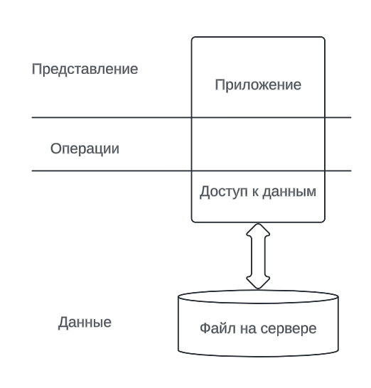

Все хорошо, но что, если приложений будет N? Каждое из них будет блокировать этот файл, таким образом можно соблюдать целостность данных, но файл становиться большим и нельзя поддерживать параллельный доступ (эффект конкурентных транзакций), падает производительность

Можно хранить несколько файлов, каждый из них хранящий группу данных (например: студенты, группы, факультеты), но все равно почти все запросы запрашивают те комбинации файлов, которые так или иначе пересекутся

Можно воспользоваться позиционированием - разбиением данных на группы (студентов на факультеты), но возникают другие проблемы: студенты мигрируют между факультетами, другие студенты ходят на занятия других факультетов

При этом данные растут, а если фрагментировать данные, то придется переписывать логику кода, что не является хорошей идеей. Да и к тому же возникает противоречие скоростей записи и чтения: нельзя обеспечить одинаково быстрые запись и чтение

В итоге появляется клиент-серверная архитектура, появляется СУБД (**Система Управления Базой Данных**) и моделирование данных, из-за чего мы избавляемся от привязанности к определенному формату файла

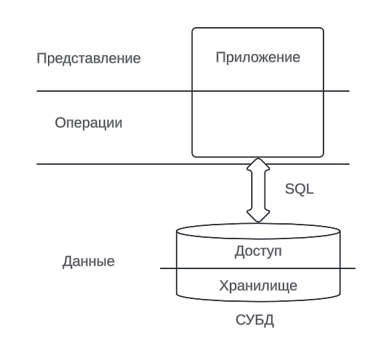

Появляется целостность данных, которая контролируется СУБД, и повышается производительность в следствие группировки запросов по времени и другим параметрам. Появляются правила моделирование бизнес-сущностей.

Но в чем состоит идея моделирования: выделение значимых аспектов у сущностей и для разных целей формирование различного моделирования

Выделяют 2 основания классификаций:

* Трехуровневая архитектура (ANSI/SPARC):
  - Внешний 
  - Концептуальный
  - Внутренний (физический, исходный)

_Внешний уровень_ определяет базу данных с точки зрения конечного пользователя, например: для студофиса важно знать возраст определенного студента, но хранить возраст не удобно

_Концептуальный уровень_ - на этом уровне накладываются ограничения на данные, определяются сущности и атрибуты, семантика данных (например: рейтинг компании на внешнем уровне может быть Excellent, Good, ..., а на концептуальном 5, 4, ... для упрощенной группировки)

_Внутренний уровень_ - то, что организует производительность, безопасность, структуру файлов, шифрование и ограниченный доступ к щекотливым данным

* И уровни моделей данных:
  - Сущность-связь
  - Логический (дата-логический) уровень
  - Физический уровень

Сущность-связь (ER, Entity-Relation) - абстрагирование объектов, появление связей

Логический уровень - то, как мы пытаемся описать сущность-связь, выделив какие-то формальные множества

Физический уровень - выбор СУБД на основе логического уровня (ограничения на типы данных, производительность, безопасность)

В конце концов появляется вот такой граф:

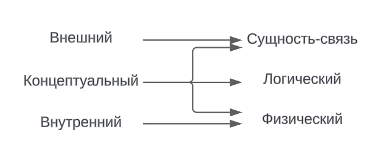

Сущность - множество экземпляров, реальных или абстрактных, однотипных объектов предметной области

Выделяют 2 типа сущности: сильная и слабая

Студент - сильная сущность, потому что может существовать без других

Группа - слабая сущность, потому что не может существовать без студентов (но группа может быть и сильной сущностью)

Также у сущностей могут быть атрибуты

- Составные, например, ФИО
- Простые, например, Фамилия и Имя по отдельности

А также:

- Однозначными - хранят одно значение, например, телефон
- Многозначными - хранят не меньше одного значения, например, контакт, хранящий JSON-объект с множеством телефонов

Появляются 3 вида связи:

* One-To-One: студент `-<>-` паспорт (1 `<->` 1) (паспорт можно выделить в отдельную сущность, чтобы ограничить к нему доступ)

* One-To-Many: группа `-<>-` студент (1 `<->` N)

* Many-To-Many: группы `-<>-` студенты (M `<->` N)

Получается такая картинка в нотации Чена:

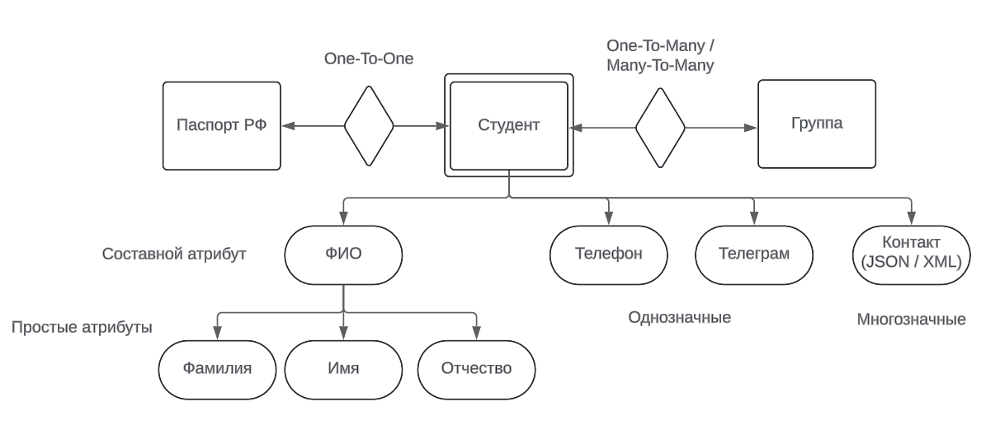


## <a name="%D0%BB%D0%B5%D0%BA%D1%86%D0%B8%D1%8F-3"></a> Лекция 3

Прошлая лекция была про то, что моделировать данные надо с умом и с наделом на будущее, потому перестраивать модели и код будет очень дорого. Сейчас же приведем определение базы данных по нескольким разным источникам:

> 1) (по Коннолли и Беггу) База данных - совместно используемый набор логически связных данных и описание этих данных, предназначенный для удовлетворения информационных потребностей организаций

Здесь идет упор на то, что БД - это не только сами данные, но и их описание (схема, семантика), что подчеркивает целостность БД

> 2) (по Дейту) База данных - набор постоянно хранимых данных, используемых прикладными системами предприятия

В определении по Дейту подчеркивается то, что данные где-то физически хранятся на постоянной основе

> 3) (по Хомоненко) База данных - совокупность специальным образом организованных данных, хранимых в памяти вычислительной системы и отображающих состояние объектов и их взаимосвязей в рассматриваемой предметной области

Хомоненко объединяет другие определения и указывает, что базы данных могут использовать и не предприятиями

Эти же авторы приводят разные определения для Системы Управления Базой Данных (СУБД):

> 1) (по Коннолли, Беггу, Дейту) СУБД - ПО, с помощью которого пользователи могут определять, создавать и поддерживать базу данных, а также осуществлять контролируемый к ней доступ

> 2) (по Хомоненко) СУБД - комплекс языковых и программных средств, предназначенный для создания, ведения и совместного использования базы данных многими пользователями

Теперь рассмотрим несколько способ, каким образом моделировать данные:

**Иерархическая модель данных**

Идея в иерархической модели данных состоит в том, чтобы хранить данные в деревьях. В 60-70 годах вместо таблицы все данные представлялись в виде деревьев, например, на предприятиях продукт изготавливался из компонентов, которые делались из деталей, которые создавались из заготовок. Чаще всего деталей было относительно немного, поэтому иерархическая модель подходила лучше всего. В итоге появляются:

> Поле данных - атомарная (неделимая) единица данных

> Сегмент данных - совокупность полей данных

Пример: ФИО, название отдела, телефон - это **поля данных**, сотрудник с этими полями - **сегмент данных**, а Иванов Иван Иванович с отделе маркетинга с телефоном +7(777)777-77-77 - **экземпляр сегмента сотрудника**. Тут же введем отдел с названием и именем начальника. В конце концов появляется огромное дерево, в котором можно узнать информацию об отделе от конкретного сотрудника.

Тут появляются достоинства:

1) _Легкость проектирования_ - в принципе все в этом мире можно представить как дерево

И недостатки:

1) _Дублирование данных_ - пример: сотрудник числится в нескольких отделах, так как сотрудник не может иметь двух родителей-отделов, то придется создавать нового сотрудника-дублера - тратим память и нарушаем целостности

2) _Сложность поиска сверху вниз_ - мы не сможем быстро получить всех сотрудников конкретного отдела; в этом случае мы можем создать кучу полей `Сотрудник 1`, `Сотрудник 2`, `Сотрудник N`, но число N может быть меньшим, чем нам надо, в таком случае надо будет двигать всю память, чтобы добавить новое поле, либо большая часть этих полей будут не задействованы (такая же проблема в файловых системах ex3, ex4 - количество файлов в них строго ограничено)

> История из жизни:
>
> 4 курс, бакалавриат, девушка защищает диплом, решает выйти замуж и поменять фамилию. Приносит документы о смене, но базы данных разные, между ними период синхронизации. Данные об окончании образования отправляются в ФИС ГИА. Интеграция систем была раз в сутки, данные диплома из ФИС ГИА пришли со старой фамилией, а приложение к диплому печаталось с новой фамилией, но с тем же номером.


**Сетевая модель данных**

В сетевой модели мы разрешаем иметь у экземпляра сегмента нескольких родителей. В итоге получаем граф

Достоинства:

1) _Экономия памяти_

2) _Целостность_

Но мы можем присвоить каждому экземпляру идентификатор и хранить связи пар идентификаторов отдельно и данные отдельно

Недостатки:

1) _Обход графа медленный в больших графах_ - та же задача из иерархической модели, нам придется пройтись по всем сотрудникам, чтобы найти сотрудников конкретного отдела

Можно вспомнить пакетные менеджеры, где для загрузки зависимостей приложения строится граф зависимостей, который обходится, и менеджер принимает решение о загрузке пакетов.


**Реляционная модель данных**

Заметим, что большинство запросов очень однотипные: найти атрибуты конкретного сотрудника, агрегация сотрудников отдела; поэтому все наборы атрибутов можно хранить:

| ID сотрудника | ФИО | Телефон | ID отдела |
|---------------|-----|---------|-----------|
|               |     |         |           |

И для отделов:

| ID отдела | Название | ID начальника |
|-----------|----------|---------------|
|           |          |               |


И с точки зрения реляционной (сущность из таблицы образуют отношение эквивалентности (equivalency relation)) модели связей между таблицами нет - для СУБД ID отдела и ID сотрудника - это одинаковый вещи (например, в SQL возможна подобная конкатенация). Также в случае, если начальника уволили, а его ID отдали новому сотруднику, то возникнет ситуация, когда этот сотрудник будет восприниматься начальником

И тут возникает проблема с реляционной базой данных - она _плохо масштабируется_. Добавлять сотруднику еще один телефон - значит двигать всю память для выделения места под новый столбец

**Постреляционная модель данных**

В постреляционной модели мы снимаем ограничение на неделимость поля, тогда поле можно представить как структуру. 

Например, предприятие продает книги с атрибутами "жанр", "кол-во страниц", "год издания", но внезапно начинает продавать ручки с атрибутом "цвет". В реляционной БД, помимо универсальных атрибутов цены, штрих-кода, большинство полей остается избыточными - ручке не определишь жанр и кол-во страниц. 

Тогда можно хранить все индивидуальные атрибуты в структуре JSON или XML, сериализовать ее и хранить в бинарном виде. Но из-за этого появляются:

1) _Долгий поиск_ по второстепенным атрибутам

2) _Нарушение целостности_ - пример: компания, производящая ручки, сделала ребрендинг, теперь придется менять в каждой структуре бренд

**Многомерная модель данных**

Дается такая таблица фактов

| Товар | Сотрудник | Месяц | Количество проданных товаров |
|-------|-----------|-------|------------------------------|
| T1    | C1        | Янв   | 10                           |
| T2    | C1        | Янв   | 5                            |
| T3    | C3        | Фев   | 15                           |


И чтобы найти количество проданных товаров в марте, нужно пройтись по всей таблице. Тогда сделаем куб (многомерный массив), где оси - это значения товаров, сотрудников и месяцев, диапазоны значений которых фиксированы

Многомерные модели получаются очень разреженными, неэффективными по памяти (какой-то сотрудник может не продавать конкретный товар), но с очень быстрым доступом. Например: в течение дня приходят какие-то данные, ночью, когда трафик минимальный, модель перестраивается, и на следующий день можно составлять разнообразную аналитику


> Анекдот:
> 
> В 80-ых годах к профессору приходит студент: Знаете, вы блестящий преподаватель, но я все-таки решил отчислиться, поэтому хочу извиниться и проститься с вами.
>
> Но почему же вы сдаетесь? - спрашивает профессор.
> 
> Да я вот экзамен точно не сдам, - отвечает студент.
> 
> Ну почему же, голубчик?
> 
> Да вот вы каждую теорему в 9-мерном пространстве доказываете, я ничего из этого не понимаю.
>
> Хорошо, я вам еще один раз объясню, что 9-мерное пространство - это очень легко. Вот представьте обыкновенное n-мерное пространство, а потом возьмите n = 9.


**Объектно-ориентированная модель данных**

Вспомним, что объект - совокупность полей. Тогда появились ORM-модели (Object Relation Model) - создается таблица с атрибутами класса, объект записывается как строка в таблицу.

В этом случае целостность данных гарантируется тем, что данные изменяются только методами объекта, Но если изменить данные в табличке, в файле, получим нецелостный объект

Можно хранить в объекте вместо данных ключ, который ссылается на данные в бинарном файле, а в методах объекта данные сразу же записываются в файл

<hr>

В конечном итоге большинство современных СУБД являются многопарадигмиальными - как компромисс в противоречии между целостностью, выборкой данных и записи данных. Но на данный момент реляционная модель является наиболее оптимальной из-за ее производительности и гарантии целостности данных


## <a name="%D0%BB%D0%B5%D0%BA%D1%86%D0%B8%D1%8F-4"></a> Лекция 4

В конечном итоге появилась реляционная модель данных, созданная Эдгаром Коддом.

Введем следующие термины:

> **Отношение** - двумерная таблица, содержащая данные

> **Столбец отношения** - атрибут, некое свойство, характеризующее сущность

> **Строка отношения** - кортеж, описывающий экземпляр сущности

Причем, не каждое отношение является сущностью - например: у нас есть производители (vendor) и продукты, которые они производят (product), так как разные производители могут производить одни и те же продукты, то необходимо отдельное отношение с парами vendor-product

И к тому же, не каждая сущность является отношением - например: паспорт - не сущность, но может быть выделен в отдельное отношение

> **Степень отношения** - количество атрибутов

> **Кардинальность отношения** - количество кортежей в отношении

> **Домен** - множество допустимых значений атрибута

Эдгар Кодд сформулировал, что отношение - кортеж атрибутов, значений которых принадлежат некоторому домену

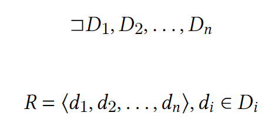


И в отличие от иерархической и сетевой моделей, где хранятся связи (указатели на поля родителей), в реляционной связи связи прямым способом не хранятся

> **Схема отношений** - заголовки отношений

В конечном итоге во время своей работы в IBM Эдгар Кодд сформулировал, что отношение R будет являться отношением тогда, когда выполняются 6 свойств:

1. **Каждое поле содержит только одно неделимое значение**

    Здесь же появляется вопрос, что считать неделимым значение? Например, в SQL существуют строки, которые можно разделить на символы. Помимо этого строки в SQL можно сравнивать при помощи ключевого слова `LIKE`

2. **Каждый кортеж уникален**

    На первый взгляд это свойство выглядит разумно, но при применении инструкции `SELECT` в SQL может создаться временная таблица, в которой могут существовать неуникальные кортежи. Это может быть решено при помощи ключевого слова `DISTINCT`, но дубликаты кортежей могут быть полезны для подсчета сущностей

3. **Уникальность имени отношения в реляционной схеме**

    Тоже разумное свойство, но представим пример: [поглощение СПбГУНиПТ университетом ИТМО в 2011 году](https://ru.wikipedia.org/wiki/%D0%A1%D0%B0%D0%BD%D0%BA%D1%82-%D0%9F%D0%B5%D1%82%D0%B5%D1%80%D0%B1%D1%83%D1%80%D0%B3%D1%81%D0%BA%D0%B8%D0%B9_%D0%B3%D0%BE%D1%81%D1%83%D0%B4%D0%B0%D1%80%D1%81%D1%82%D0%B2%D0%B5%D0%BD%D0%BD%D1%8B%D0%B9_%D1%83%D0%BD%D0%B8%D0%B2%D0%B5%D1%80%D1%81%D0%B8%D1%82%D0%B5%D1%82_%D0%BD%D0%B8%D0%B7%D0%BA%D0%BE%D1%82%D0%B5%D0%BC%D0%BF%D0%B5%D1%80%D0%B0%D1%82%D1%83%D1%80%D0%BD%D1%8B%D1%85_%D0%B8_%D0%BF%D0%B8%D1%89%D0%B5%D0%B2%D1%8B%D1%85_%D1%82%D0%B5%D1%85%D0%BD%D0%BE%D0%BB%D0%BE%D0%B3%D0%B8%D0%B9#%D0%9F%D1%80%D0%B8%D1%81%D0%BE%D0%B5%D0%B4%D0%B8%D0%BD%D0%B5%D0%BD%D0%B8%D0%B5_%D0%BA_%D0%98%D0%A2%D0%9C%D0%9E), в те времена у обоих университетов были базы данных с таблицей `Student`, и казалось бы возникла проблема с объединением этих баз данных

4. **Уникальность имени атрибута в пределах отношения**

    Еще одно очевидное свойство, но при операции `JOIN` (объединения таблиц) в SQL может создаться отношение с одинаковыми атрибутами

5. **Значения атрибута берутся из одного и того же домена**

6. **Порядок следования атрибутов и порядок следования кортежей не имеют значения**

    И от этого свойства сразу же отказались, использовать `ORDER BY` с указанием номера столбца (что означало бы, что атрибуты имеют порядок) было очень удобно 

И как можно заметить, одновременно эти все свойства на практике реализовать нельзя было, да и к тому же было бы супер неудобно для пользователей

Теперь рассмотрим определения ключей:

> **Суперключ** - атрибут или множество атрибутов, единственным образом идентифицирующий кортеж

| ИСУ | ФИО | N группы | Серия паспорта | Номер паспорта |
|-----|-----|----------|----------------|----------------|
|     |     |          |                |                |

В этом случае, номер ИСУ - суперключ. Также очевидно, что в таблице с уникальными кортежами сам кортеж будет являться суперключом

> **Потенциальный ключ** - суперключ, который не содержит подмножества, также являющегося суперключом данного отношения

В примере выше номер ИСУ - потенциальный суперключ, также, как и комбинация из серии и номера паспорта. Поэтому потенциальный ключ - не минимальный суперключ

Потенциальный ключ из одного атрибута называют простыми, а из более одного - составным

> **Первичный ключ** (Primary key) - потенциальный ключ, который выбран для уникальной идентификации кортежа в отношении

> **Внешний ключ** (Foreign key) - атрибут или множество атрибутов, которые соответствуют потенциальному ключу некоторого (может быть того же самого) отношения

В случае со студентами, номер группы у студента - внешний ключ

Внешний ключ, в том числе, может соответствовать ключу в том же отношении:

| ИСУ сотрудника `PK` | ФИО | ИСУ руководителя `FK` |
|---------------------|-----|-----------------------|
|                     |     |                       |


При этом связи One-to-One и One-to-Many означают, что первичные ключи отношения являются внешними ключами в другом, например, номер ИСУ в таблице с паспортами студентов - внешний ключ; номер группы в таблице студентов - внешний ключ, который соотносится с первичным в таблице групп


<!--
Sales Person
ID (PKFK)

Employee
ID (PK) 

why did i wrote it?
-->


А связь Many-to-Many требует уже таблицу-связку, как в примере выше про производителя и продукты (vendor-product)

Тут же выделяем два вида целостности:

* **Целостность сущности**: ни один атрибут первичного ключа не может содержать null-значения
* **Ссылочная целостность**: если в отношении есть внешний ключ, то либо значение внешнего ключа соответствует значению потенциального ключа, с которым он связан, либо внешний ключ полностью состоит из null-значений

Теперь необходимо от этой реляционной модели данных перейти к языку SQL. Но перед этим нужно ввести реляционную алгебру.


## <a name="%D0%BB%D0%B5%D0%BA%D1%86%D0%B8%D1%8F-5"></a> Лекция 5

Уже на протяжении выполнения лабораторных работ можно было столкнуться с теоретико-множественными операциями из реляционный алгебры, 
например, `JOIN`. Причем, стоит заметить, что реляционная алгебра - замкнутая.

Операции, которые ввел Кодд в реляционной алгебре, делятся на унарные и бинарные


1. Проекция: 
    <!-- \[\Pi_{a_1, \dots, a_n} (R)\] -->

    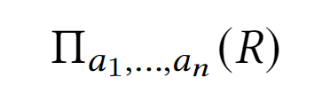

    Результатом проекции является новое отношение, содержащее вертикальное подмножество исходного отношения, создаваемое посредством извлечения значений указанных атрибутов и исключения из результата строк-дубликатов

    В SQL проекция реализована через инструкцию `SELECT` и выбор определенных атрибутов

2. Выборка
    <!-- \[\sigma_{\text{предикат}} (R)\] -->

    
   
    Результатом выборки является новое отношение, которое содержит только те кортежи из исходного отношения, которые удовлетворяют заданному предикату
    
    В SQL выборка реализована через инструкцию ```WHERE Condition```

3. Объединение (Union)
    <!-- \[R \union S\] -->

    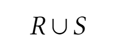

    > Объединение двух наборов кортежей определяет новое отношение, которое включает все кортежи из исходных отношений с исключением кортежей-дубликатов

    Отношения совместимы, если они состоят из одинаковых атрибутов и каждая пара атрибутов имеет одинаковый домен

    В SQL возможно сделать объединение так:

    ```sql
    SELECT * FROM Table1
    UNION
    SELECT * FROM Table2;
    ```

    Синтаксически такие запросы в SQL разрешены, но семантически они не имеют смысла. Приведем пример объединения на таблицах `Item`:

    | ItemID | ItemName |
    |--------|----------|
    |   1    | Ball     |
    |   2    | Pen      |
    |   3    | Notebook |

    И `FavouriteItem`:

    | ItemID | ItemName |
    |--------|----------|
    | 2      | Pen      |
    | 3      | Notebook |
    | 4      | Laptop   |

    Их объединение

    ```sql
    SELECT * FROM Item
    UNION
    SELECT * FROM FavouriteItem;
    ```
   
    даст такое отношение:

    | ItemID | ItemName |
    |--------|----------|
    | 1      | Ball     |
    | 2      | Pen      |
    | 3      | Notebook |
    | 4      | Laptop   |

4. Разность
    <!-- \[R - S\] -->

    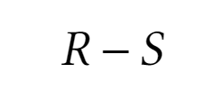

    > Разность отношений - новое отношение, которое включает кортежи из первого отношения и исключает кортежи, входящие во второе отношение

    Аналогично, отношения, к которым применяется разность, должны быть совместимы

    Разность отношений, приведенных выше:

    ```sql
    SELECT * FROM Item
    EXCEPT
    SELECT * FROM FavouriteItem;
    ```
   
    даст такое отношение:

    | ItemID | ItemName |
    |--------|----------|
    | 2      | Pen      |
    | 3      | Notebook |

    

5. Пересечение
    <!-- \[R \cap S\] -->

    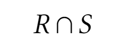

    > Пересечение определяет новое отношение, которое включает кортежи, входящие в обои отношения одновременно

    Аналогично, отношения, к которым применяется пересечение, должны быть совместимы

    Пересечение отношений, приведенных выше:

    ```sql
    SELECT * FROM Item
    INTERSECT
    SELECT * FROM FavouriteItem;
    ```
   
    даст такое отношение:

    | ItemID | ItemName |
    |--------|----------|
    | 1      | Ball     |

Дальше будут приводиться примеры операций на атрибуте `DepartmentID` на таблицах `Employee`:

| EmployeeID | FullName          | DepartmentID |
|------------|-------------------|--------------|
| 1          | Albert Einstein   | 4            |
| 2          | Ernest Rutherford | 4            |
| 3          | Marie Curie       | 10           |
| 4          | Igor Kurchatov    | NULL         |
| 5          | Alexander Fleming | 13           |

И `Department`:

| DepartmentID | DepartmentName      | DirectorID |
|--------------|---------------------|------------|
| 4            | Theoretical Physics | 1          |
| 10           | Chemistry           | 3          |
| 11           | Nuclear Physics     | 2          |
| 13           | Biology             | 5          |

6. Декартовое произведение
    <!-- \[R \times S\] -->

    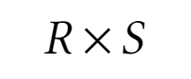

   > Результатом декартового произведения является новое отношение, в которой кортежи являются результатом конкатенации кортежей из первого отношения и кортежей из второго произведения
   
    В SQL декартовое произведение можно сделать так:

    ```sql
    SELECT * FROM Table1, Table2
    ```
   
    Либо так:

    ```sql
    SELECT * FROM Table1 CROSS JOIN Table2
    ```

    Семантически декартовое произведение зачастую не имеет смысла. На таблицах выше декартовым произведением будет такое отношение:

    | EmployeeID | FullName          | DepartmentID | DepartmentID | DepartmentName      | DirectorID |
    |------------|-------------------|--------------|--------------|---------------------|------------|
    | 1          | Albert Einstein   | 4            | 4            | Theoretical Physics | 1          |
    | 2          | Ernest Rutherford | 4            | 4            | Theoretical Physics | 1          |
    | 3          | Marie Curie       | 10           | 4            | Theoretical Physics | 1          |
    | 4          | Igor Kurchatov    | NULL         | 4            | Theoretical Physics | 1          |
    | 5          | Alexander Fleming | 13           | 4            | Theoretical Physics | 1          |
    | 1          | Albert Einstein   | 4            | 10           | Chemistry           | 3          | 
    | 2          | Ernest Rutherford | 4            | 10           | Chemistry           | 3          | 
    | 3          | Marie Curie       | 10           | 10           | Chemistry           | 3          | 
    | 4          | Igor Kurchatov    | NULL         | 10           | Chemistry           | 3          | 
    | 5          | Alexander Fleming | 13           | 10           | Chemistry           | 3          | 
    | 1          | Albert Einstein   | 4            | 11           | Nuclear Physics     | 2          | 
    | 2          | Ernest Rutherford | 4            | 11           | Nuclear Physics     | 2          | 
    | 3          | Marie Curie       | 10           | 11           | Nuclear Physics     | 2          | 
    | 4          | Igor Kurchatov    | NULL         | 11           | Nuclear Physics     | 2          | 
    | 5          | Alexander Fleming | 13           | 11           | Nuclear Physics     | 2          | 
    | 1          | Albert Einstein   | 4            | 13           | Biology             | 5          | 
    | 2          | Ernest Rutherford | 4            | 13           | Biology             | 5          | 
    | 3          | Marie Curie       | 10           | 13           | Biology             | 5          | 
    | 4          | Igor Kurchatov    | NULL         | 13           | Biology             | 5          | 
    | 5          | Alexander Fleming | 13           | 13           | Biology             | 5          | 

7. Тета-соединение
    <!-- \[R \bowtie_F S\] -->
    <!-- \[F = R_{a_i} \Theta S_{b_i} \quad\quad \Theta \in \{<, >, =, \neq, \dots\}\] -->

    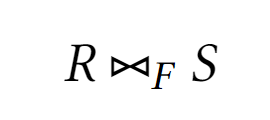

    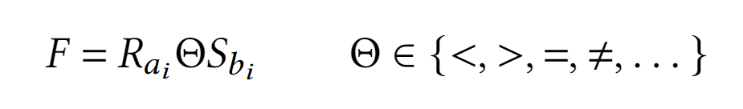

    > Результатом тета-соединения является декартовое соединение, кортежи которого удовлетворяют предикату `F`

    Тета-соединение осуществимо в SQL с помощью инструкции 

    ```sql
    FROM Table1 FULL JOIN Table2 ON Condition
    ```
   
8. Эквисоединение
    <!-- \[R \bowtie_= S\] -->

    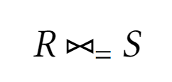

    > Результатом эквисоединения является декартовое соединение, кортежи которого равны по какому-либо атрибуту

    Эквисоединение двух таблиц из примера будет таким результатом:

    | EmployeeID | FullName          | DepartmentID | DepartmentID | DepartmentName      | DirectorID |
    |------------|-------------------|--------------|--------------|---------------------|------------|
    | 1          | Albert Einstein   | 4            | 4            | Theoretical Physics | 1          |
    | 2          | Ernest Rutherford | 4            | 4            | Theoretical Physics | 1          | 
    | 3          | Marie Curie       | 10           | 10           | Chemistry           | 3          | 
    | 5          | Alexander Fleming | 13           | 13           | Biology             | 5          | 


    ```sql
    SELECT *
    FROM Employee 
    INNER JOIN Department 
    ON Employee.DepartmentID = Department.DepartmentID;
    ```

9. Естественное соединение (Natural Join)
    <!-- \[R \bowtie S\] -->

    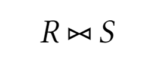

    > Естественное соединение - эквисоединение двух отношений, выполненное по всем общим атрибутам, из результатов которого исключается по одному экземпляру общего атрибута
   
    Естественное соединение удобно, например, когда есть два таблицы с атрибутами серии и номера паспорта. В SQL естественное соединение напрямую не реализовано, но естественное соединение таблиц из примера выглядело бы так:

    | EmployeeID | FullName          | DepartmentName      | DirectorID |
    |------------|-------------------|---------------------|------------|
    | 1          | Albert Einstein   | Theoretical Physics | 1          |
    | 2          | Ernest Rutherford | Theoretical Physics | 1          | 
    | 3          | Marie Curie       | Chemistry           | 3          | 
    | 5          | Alexander Fleming | Biology             | 5          | 

10. Левое внешнее соединение
    <!-- \[R \supset\hspace{-0.4em}\lhd S\] -->

    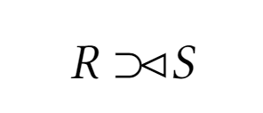

    > Соединение, результирующее отношение которое содержит в себе все кортежи из отношения R, с конкатенации к ним тех кортежей из отношения из S, имеющих совпадающие значения в общих атрибутах

    В SQL левое внешнее соединение на таблицах выше осуществляется так:

    ```sql
    SELECT *
    FROM Employee
    LEFT JOIN Department
    ON Employee.DepartmentID = Department.DepartmentID;
    ```

    | EmployeeID | FullName          | DepartmentID | DepartmentID | DepartmentName      | DirectorID |
    |------------|-------------------|--------------|--------------|---------------------|------------|
    | 1          | Albert Einstein   | 4            | 4            | Theoretical Physics | 1          |
    | 2          | Ernest Rutherford | 4            | 4            | Theoretical Physics | 1          | 
    | 3          | Marie Curie       | 10           | 10           | Chemistry           | 3          | 
    | 4          | Igor Kurchatov    | NULL         | NULL         | NULL                | NULL       | 
    | 5          | Alexander Fleming | 13           | 13           | Biology             | 5          | 

    Аналогично в SQL можно сделать правое внешнее соединение:

    ```sql
    SELECT *
    FROM Employee
    RIGHT JOIN Department
    ON Employee.DepartmentID = Department.DepartmentID;
    ```

    | EmployeeID | FullName          | DepartmentID | DepartmentID | DepartmentName      | DirectorID |
    |------------|-------------------|--------------|--------------|---------------------|------------|
    | 1          | Albert Einstein   | 4            | 4            | Theoretical Physics | 1          |
    | 2          | Ernest Rutherford | 4            | 4            | Theoretical Physics | 1          | 
    | 3          | Marie Curie       | 10           | 10           | Chemistry           | 3          | 
    | NULL       | NULL              | NULL         | 11           | Nuclear Physics     | 2          | 
    | 5          | Alexander Fleming | 13           | 13           | Biology             | 5          | 


    

11. Полусоединение
    <!-- \[R \rhd S\] -->

    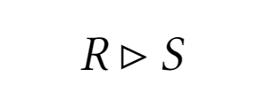

    > Полусоединение - отношение, состоящее из кортежей R, которые входят в экви-соединение R и S

    В SQL полусоединение не реализовано[^innerjoin]

[^innerjoin]: Несмотря на это, полусоединение можно реализовать в SQL при помощи `INNER JOIN`:

    ```sql
    SELECT *
    FROM Employee
    INNER JOIN Department
    ON Employee.DepartmentID = Department.DepartmentID;
    ```

    На отношениях из примера получится такое полусоединение:

    | EmployeeID | FullName          | DepartmentID | DepartmentID | DepartmentName      | DirectorID |
    |------------|-------------------|--------------|--------------|---------------------|------------|
    | 1          | Albert Einstein   | 4            | 4            | Theoretical Physics | 1          |
    | 2          | Ernest Rutherford | 4            | 4            | Theoretical Physics | 1          | 
    | 3          | Marie Curie       | 10           | 10           | Chemistry           | 3          | 
    | 5          | Alexander Fleming | 13           | 13           | Biology             | 5          | 


Рассмотрим запрос выборки в SQL - его можно разделить на 5 частей:

1. **Выбор столбцов отношения**:

```sql
SELECT [ DISTINCT | ALL ] { * | [ColumnExpression [AS NewName] ] [, ...]}
```

Ключевое слово `DISTINCT` определяет выбор только уникальных кортежей, `ALL` - явный выбор кортежей с дубликатами

Далее указываются имена столбцов (также возможны их алиасы) или `*`, которая определяет вывод всех столбцов отношения 


2. **Выбор исходного отношения**:[^fromfootnote]

```sql
FROM TableName [AS NewTableName] 
[{INNER | LEFT OUTER | FULL} JOIN OuterTable [AS NewOuterTableName] 
ON Condition]
```

Здесь же можно определить соединение и его тип на основе условия `Condition` 

[^fromfootnote]: На самом деле синтаксис инструкции `FROM` немного шире:

    ```sql
    FROM TableName [AS NewTableName] 
    [{INNER | { LEFT | RIGHT | FULL } [OUTER]} JOIN OuterTable [AS NewOuterTableName] 
    ON Condition]
    ```

3. **Фильтрация кортежей**:

```sql
[WHERE Condition]
```

В инструкции `WHERE` определяются условия для фильтрации кортежей

4. **Группировка**:

```sql
[GROUP BY ColumnList [, ...] [HAVING Condition]]
```

В инструкции `GROUP BY` производится группировка по указанному набору атрибутов и фильтрации через условие в `HAVING`

5. **Сортировка**:

```sql
[ORDER BY ColumnList [, ...] [{ASC | DESC}]]
```

И, наконец, в инструкции `ORDER BY` происходит сортировка конечного отношения по указанному набору атрибутов

В конечном счете, получаем:

```sql
SELECT [ DISTINCT | ALL ] { * | [ColumnExpression [AS NewName] ] [, ...]}
FROM TableName [AS NewTableName] 
[{INNER | LEFT OUTER | FULL} JOIN OuterTable [AS NewOuterTableName] 
ON Condition]
[WHERE Condition]
[GROUP BY ColumnList [, ...] [HAVING Condition]]
[ORDER BY ColumnList [, ...] [{ASC | DESC}]]
```

Здесь стоит заметить, что желательно общие условия, которые имеют место в инструкции `WHERE` стоит размещать именно там, а не в `HAVING`, так как фильтрация кортежей после группировки работает медленнее и не обеспечивает производительность

Порядок выполнения инструкций в `SELECT` запросе таков:

1. `FROM`
2. `ON` 
3. `JOIN` 
4. `WHERE` 
5. `GROUP BY`
6. `HAVING` 
7. `SELECT` 
8. `DISTINCT` 
9. `ORDER BY`


Рассмотрим две реализации `JOIN`:

1. Наивная:

```
for r in R:
    for s in S:
        if r.a_i Θ S.b_i:
            print(r + s)
```

2. Слиянием:

```
R.sort(a)
S.sort(b)

while not endof(R) and not endof(S):
    if R.a_i < S.b_i:
        next(R)
    if R.a_i > S.b_i:
        next(S)
    if R.a_i == S.b_i:
        print(r + s)
        next(R)
```

Обе реализации имеют свои достоинства и недостатки. Но так как SQL хранит кортежи уже отсортированными (чтобы поддерживать быстроту индексации), вторая реализация зачастую работает лучше

<hr>

В конечном итоге, мы приходим к мысли, что, чтобы поддерживать целостность данных, приходится тратить много средств на сервера и жертвовать производительностью, и в бизнесе намного дешевле содержать ошибки из-за нарушения целостности, чем создавать идеальные системы 


