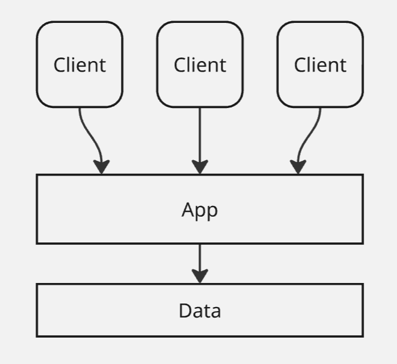
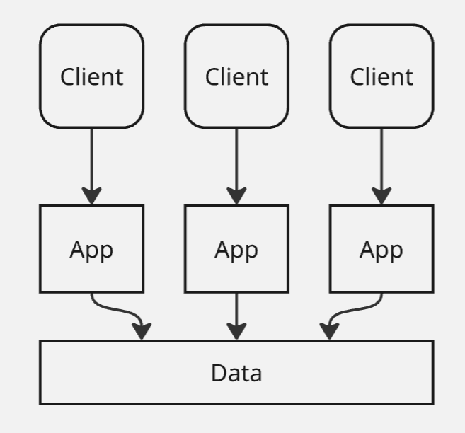
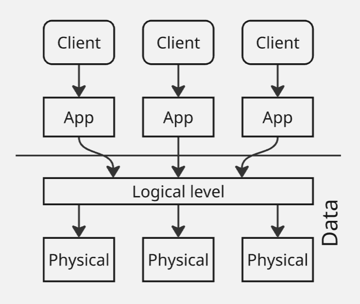

# <a name="%D0%B1%D0%B0%D0%B7%D1%8B-%D0%B4%D0%B0%D0%BD%D0%BD%D1%8B%D1%85"></a> Базы данных


* [Базы данных](#%D0%B1%D0%B0%D0%B7%D1%8B-%D0%B4%D0%B0%D0%BD%D0%BD%D1%8B%D1%85)
  * [Введение](#%D0%B2%D0%B2%D0%B5%D0%B4%D0%B5%D0%BD%D0%B8%D0%B5)
  * [Лекция 1. Что такое данные?](#%D0%BB%D0%B5%D0%BA%D1%86%D0%B8%D1%8F-1.-%D1%87%D1%82%D0%BE-%D1%82%D0%B0%D0%BA%D0%BE%D0%B5-%D0%B4%D0%B0%D0%BD%D0%BD%D1%8B%D0%B5%3F)
  * [Лекция 2. Абстрагирование данных](#%D0%BB%D0%B5%D0%BA%D1%86%D0%B8%D1%8F-2.-%D0%B0%D0%B1%D1%81%D1%82%D1%80%D0%B0%D0%B3%D0%B8%D1%80%D0%BE%D0%B2%D0%B0%D0%BD%D0%B8%D0%B5-%D0%B4%D0%B0%D0%BD%D0%BD%D1%8B%D1%85)
  * [Лекция 3. Модели данных](#%D0%BB%D0%B5%D0%BA%D1%86%D0%B8%D1%8F-3.-%D0%BC%D0%BE%D0%B4%D0%B5%D0%BB%D0%B8-%D0%B4%D0%B0%D0%BD%D0%BD%D1%8B%D1%85)
  * [Лекция 4. Отношение](#%D0%BB%D0%B5%D0%BA%D1%86%D0%B8%D1%8F-4.-%D0%BE%D1%82%D0%BD%D0%BE%D1%88%D0%B5%D0%BD%D0%B8%D0%B5)
  * [Лекция 5. Реляционная алгебра](#%D0%BB%D0%B5%D0%BA%D1%86%D0%B8%D1%8F-5.-%D1%80%D0%B5%D0%BB%D1%8F%D1%86%D0%B8%D0%BE%D0%BD%D0%BD%D0%B0%D1%8F-%D0%B0%D0%BB%D0%B3%D0%B5%D0%B1%D1%80%D0%B0)
    * [Операции реляционной алгебры](#%D0%BE%D0%BF%D0%B5%D1%80%D0%B0%D1%86%D0%B8%D0%B8-%D1%80%D0%B5%D0%BB%D1%8F%D1%86%D0%B8%D0%BE%D0%BD%D0%BD%D0%BE%D0%B9-%D0%B0%D0%BB%D0%B3%D0%B5%D0%B1%D1%80%D1%8B)
    * [Синтаксис `SELECT`](#%D1%81%D0%B8%D0%BD%D1%82%D0%B0%D0%BA%D1%81%D0%B8%D1%81-%60select%60)
  * [Лекция 6. Нормализация](#%D0%BB%D0%B5%D0%BA%D1%86%D0%B8%D1%8F-6.-%D0%BD%D0%BE%D1%80%D0%BC%D0%B0%D0%BB%D0%B8%D0%B7%D0%B0%D1%86%D0%B8%D1%8F)
  * [Лекция 7. Производительность](#%D0%BB%D0%B5%D0%BA%D1%86%D0%B8%D1%8F-7.-%D0%BF%D1%80%D0%BE%D0%B8%D0%B7%D0%B2%D0%BE%D0%B4%D0%B8%D1%82%D0%B5%D0%BB%D1%8C%D0%BD%D0%BE%D1%81%D1%82%D1%8C)
    * [Индекс](#%D0%B8%D0%BD%D0%B4%D0%B5%D0%BA%D1%81)
    * [Представление](#%D0%BF%D1%80%D0%B5%D0%B4%D1%81%D1%82%D0%B0%D0%B2%D0%BB%D0%B5%D0%BD%D0%B8%D0%B5)
  * [Лекция 8. Надежность](#%D0%BB%D0%B5%D0%BA%D1%86%D0%B8%D1%8F-8.-%D0%BD%D0%B0%D0%B4%D0%B5%D0%B6%D0%BD%D0%BE%D1%81%D1%82%D1%8C)
    * [Физическая сохранность](#%D1%84%D0%B8%D0%B7%D0%B8%D1%87%D0%B5%D1%81%D0%BA%D0%B0%D1%8F-%D1%81%D0%BE%D1%85%D1%80%D0%B0%D0%BD%D0%BD%D0%BE%D1%81%D1%82%D1%8C)
    * [Логическая безопасность](#%D0%BB%D0%BE%D0%B3%D0%B8%D1%87%D0%B5%D1%81%D0%BA%D0%B0%D1%8F-%D0%B1%D0%B5%D0%B7%D0%BE%D0%BF%D0%B0%D1%81%D0%BD%D0%BE%D1%81%D1%82%D1%8C)
  * [Лекция 9. Безопасность](#%D0%BB%D0%B5%D0%BA%D1%86%D0%B8%D1%8F-9.-%D0%B1%D0%B5%D0%B7%D0%BE%D0%BF%D0%B0%D1%81%D0%BD%D0%BE%D1%81%D1%82%D1%8C)
    * [Orange Book](#orange-book)
    * [Другие методы защиты](#%D0%B4%D1%80%D1%83%D0%B3%D0%B8%D0%B5-%D0%BC%D0%B5%D1%82%D0%BE%D0%B4%D1%8B-%D0%B7%D0%B0%D1%89%D0%B8%D1%82%D1%8B)
  * [Лекция 10. Распределенные хранилища](#%D0%BB%D0%B5%D0%BA%D1%86%D0%B8%D1%8F-10.-%D1%80%D0%B0%D1%81%D0%BF%D1%80%D0%B5%D0%B4%D0%B5%D0%BB%D0%B5%D0%BD%D0%BD%D1%8B%D0%B5-%D1%85%D1%80%D0%B0%D0%BD%D0%B8%D0%BB%D0%B8%D1%89%D0%B0)
  * [Лекция 11. NoSQL](#%D0%BB%D0%B5%D0%BA%D1%86%D0%B8%D1%8F-11.-nosql)
  * [Лекция 12. Теорема CAP](#%D0%BB%D0%B5%D0%BA%D1%86%D0%B8%D1%8F-12.-%D1%82%D0%B5%D0%BE%D1%80%D0%B5%D0%BC%D0%B0-cap)
  * [Лекция 13. Базы знаний](#%D0%BB%D0%B5%D0%BA%D1%86%D0%B8%D1%8F-13.-%D0%B1%D0%B0%D0%B7%D1%8B-%D0%B7%D0%BD%D0%B0%D0%BD%D0%B8%D0%B9)
  * [X. Программа экзамена 2024/2025](#x.-%D0%BF%D1%80%D0%BE%D0%B3%D1%80%D0%B0%D0%BC%D0%BC%D0%B0-%D1%8D%D0%BA%D0%B7%D0%B0%D0%BC%D0%B5%D0%BD%D0%B0-2024%2F2025)


## <a name="%D0%B2%D0%B2%D0%B5%D0%B4%D0%B5%D0%BD%D0%B8%D0%B5"></a> Введение

Курс базы данных находится в цикле курсов "Управление данными" на направлении ИС

В отличие от математиков, перед которыми не стоят как таковые ограничения, у инженеров существуют ограничения, будь-то
бюджет или время. Поэтому инженеры вынуждены искать компромиссы между тремя главными параметрами: надежность,
производительность и безопасность.

В XX веке был сформулирован закон Мура, который прогнозировал увеличение числа транзисторов в два раза каждые два года,
но в 10-ых годах закон Мура перестал работать из-за физических ограничений. Далее появилось большое желание увеличивать
память, в следствие чего появились распределенные системы, но ограничениями
стала [теорема CAP](https://ru.wikipedia.org/wiki/%D0%A2%D0%B5%D0%BE%D1%80%D0%B5%D0%BC%D0%B0_CAP)

Британский учёный [Эдгар Кодд](https://ru.wikipedia.org/wiki/%D0%9A%D0%BE%D0%B4%D0%B4,_%D0%AD%D0%B4%D0%B3%D0%B0%D1%80) в
70-ых сформулировал основы теории **реляционных баз данных**, на основе которой созданы современные реляционные базы
данных

## <a name="%D0%BB%D0%B5%D0%BA%D1%86%D0%B8%D1%8F-1.-%D1%87%D1%82%D0%BE-%D1%82%D0%B0%D0%BA%D0%BE%D0%B5-%D0%B4%D0%B0%D0%BD%D0%BD%D1%8B%D0%B5%3F"></a> Лекция 1. Что такое данные?

Выделяют 5 информационных процессов:

* Сбор
* Обработка
* Хранение
* Передача
* Представление

И эти процессы хотелось бы автоматизировать

До появления Computer Science как науки все эти процессы существовали в пределах небольших библиотеки, в которых книги
искались линейным или двоичным поисками. После этого библиотеки увеличивались, появились картотеки, каталоги.

Тем не менее определение информации так и не сформулировалось по многим философским вопросам: что такое информация?
Является ли информация атрибутом материи или энергии? Существует ли информация без человека? Поэтому информацию следует
воспринимать как триединство сигнала, данных и знаний.

В начале XX века Гёдель, целью которого была создать систему доказательств в математике, и, следовательно,
автоматизировать их, изобрел систему представления математических доказательств и доказал, что такая система не может
быть
полной ([теорема о неполноте](https://ru.wikipedia.org/wiki/%D0%A2%D0%B5%D0%BE%D1%80%D0%B5%D0%BC%D1%8B_%D0%93%D1%91%D0%B4%D0%B5%D0%BB%D1%8F_%D0%BE_%D0%BD%D0%B5%D0%BF%D0%BE%D0%BB%D0%BD%D0%BE%D1%82%D0%B5))

После Гёделя появился Джон фон Нейман, целью которого была представить информацию в конечном пространстве. Из этой идеи
вывелась архитектура фон Неймана, где числа представлялись в двоичном виде. В итоге получается, что данные - это
информация, которая закодирована заранее обговоренным способом:

> **Данные** (ISO / IEC 2382:2015) - поддающееся многократной интерпретации представление информации в формализованном
> виде, пригодном для передачи, интерпретации или обработке

Из этого появляется потребность моделировать данные. Но у моделей появляются свои ограничения. Приведем пример таблицы
студентов:

| Студент | Группа | Дисциплина | Преподаватель | Аудитория | Время |
|---------|--------|------------|---------------|-----------|-------|
|         |        |            |               |           |       |
|         |        |            |               |           |       |

Поиск конкретного студента реализовать легко, но что если нам нужно иметь в виду несколько дисциплин для одного
студента? Приходит другая реализация:

| Студент | Группа | (Дисциплина1, ...) | (Дисциплина2, ...) |
|---------|--------|--------------------|--------------------|
|         |        |                    |                    |
|         |        |                    |                    |

Но в ней мы не сможем запросто составить расписание для какого-то преподавателя. Тогда приходит идея разделить на
несколько табличек для студентов:

| Номер студента | ФИО студента |
|----------------|--------------|
|                |              |

Для групп:

| Номер группы | Факультет группы |
|--------------|------------------|
|              |                  |

И для предметов:

| Номер дисциплины | Название дисциплины | Преподаватель |
|------------------|---------------------|---------------|
|                  |                     |               |

В этом случае повышается целостность данных, но уменьшается производительность системы, и в итоге мы не сможем найти
идеального решения


## <a name="%D0%BB%D0%B5%D0%BA%D1%86%D0%B8%D1%8F-2.-%D0%B0%D0%B1%D1%81%D1%82%D1%80%D0%B0%D0%B3%D0%B8%D1%80%D0%BE%D0%B2%D0%B0%D0%BD%D0%B8%D0%B5-%D0%B4%D0%B0%D0%BD%D0%BD%D1%8B%D1%85"></a> Лекция 2. Абстрагирование данных

Откуда появилась идея абстрагирования данных? Сначала все началось с архитектуры фон Неймана, где появилась однородность памяти - концепция хранения данных и инструкций в одном месте. Потом появилась первая абстракция данных - хранение в файле. Если же в оперативной памяти читаемость не нужна, то в постоянной она необходима для упрощенной работы - будь-то имя файла и имя каталога. И так появляется файло-серверная архитектура:


Все хорошо, но что, если приложений будет N? Каждое из них будет блокировать этот файл, таким образом можно соблюдать целостность данных, но файл становиться большим и нельзя поддерживать параллельный доступ (эффект конкурентных транзакций), падает производительность

Можно хранить несколько файлов, каждый из них хранящий группу данных (например: студенты, группы, факультеты), но все равно почти все запросы запрашивают те комбинации файлов, которые так или иначе пересекутся

Можно воспользоваться позиционированием - разбиением данных на группы (студентов на факультеты), но возникают другие проблемы: студенты мигрируют между факультетами, другие студенты ходят на занятия других факультетов

При этом данные растут, а если фрагментировать данные, то придется переписывать логику кода, что не является хорошей идеей. Да и к тому же возникает противоречие скоростей записи и чтения: нельзя обеспечить одинаково быстрые запись и чтение

В итоге появляется клиент-серверная архитектура, появляется СУБД (**Система Управления Базой Данных**) и моделирование данных, из-за чего мы избавляемся от привязанности к определенному формату файла


Появляется целостность данных, которая контролируется СУБД, и повышается производительность в следствие группировки запросов по времени и другим параметрам. Появляются правила моделирование бизнес-сущностей.

Но в чем состоит идея моделирования: выделение значимых аспектов у сущностей и для разных целей формирование различного моделирования

Выделяют 2 основания классификаций:

* Трехуровневая архитектура (ANSI/SPARC):
  - Внешний 
  - Концептуальный
  - Внутренний (физический, исходный)

_Внешний уровень_ определяет базу данных с точки зрения конечного пользователя, например: для студофиса важно знать возраст определенного студента, но хранить возраст не удобно

_Концептуальный уровень_ - на этом уровне накладываются ограничения на данные, определяются сущности и атрибуты, семантика данных (например: рейтинг компании на внешнем уровне может быть Excellent, Good, ..., а на концептуальном 5, 4, ... для упрощенной группировки)

_Внутренний уровень_ - то, что организует производительность, безопасность, структуру файлов, шифрование и ограниченный доступ к щекотливым данным

* И уровни моделей данных:
  - Сущность-связь
  - Логический (дата-логический) уровень
  - Физический уровень

Сущность-связь (ER, Entity-Relation) - абстрагирование объектов, появление связей

Логический уровень - то, как мы пытаемся описать сущность-связь, выделив какие-то формальные множества

Физический уровень - выбор СУБД на основе логического уровня (ограничения на типы данных, производительность, безопасность)

В конце концов появляется вот такой граф:


Сущность - множество экземпляров, реальных или абстрактных, однотипных объектов предметной области

Выделяют 2 типа сущности: сильная и слабая

Студент - сильная сущность, потому что может существовать без других

Группа - слабая сущность, потому что не может существовать без студентов (но группа может быть и сильной сущностью)

Также у сущностей могут быть атрибуты

- Составные, например, ФИО
- Простые, например, Фамилия и Имя по отдельности

А также:

- Однозначными - хранят одно значение, например, телефон
- Многозначными - хранят не меньше одного значения, например, контакт, хранящий JSON-объект с множеством телефонов

Появляются 3 вида связи:

* One-To-One: студент `-<>-` паспорт (1 `<->` 1) (паспорт можно выделить в отдельную сущность, чтобы ограничить к нему доступ)

* One-To-Many: группа `-<>-` студент (1 `<->` N)

* Many-To-Many: группы `-<>-` студенты (M `<->` N)

Получается такая картинка в нотации Чена:


## <a name="%D0%BB%D0%B5%D0%BA%D1%86%D0%B8%D1%8F-3.-%D0%BC%D0%BE%D0%B4%D0%B5%D0%BB%D0%B8-%D0%B4%D0%B0%D0%BD%D0%BD%D1%8B%D1%85"></a> Лекция 3. Модели данных

Прошлая лекция была про то, что моделировать данные надо с умом и с наделом на будущее, потому перестраивать модели и код будет очень дорого. Сейчас же приведем определение базы данных по нескольким разным источникам:

> 1) (по Коннолли и Беггу) База данных - совместно используемый набор логически связных данных и описание этих данных, предназначенный для удовлетворения информационных потребностей организаций

Здесь идет упор на то, что БД - это не только сами данные, но и их описание (схема, семантика), что подчеркивает целостность БД

> 2) (по Дейту) База данных - набор постоянно хранимых данных, используемых прикладными системами предприятия

В определении по Дейту подчеркивается то, что данные где-то физически хранятся на постоянной основе

> 3) (по Хомоненко) База данных - совокупность специальным образом организованных данных, хранимых в памяти вычислительной системы и отображающих состояние объектов и их взаимосвязей в рассматриваемой предметной области

Хомоненко объединяет другие определения и указывает, что базы данных могут использовать и не предприятиями

Эти же авторы приводят разные определения для Системы Управления Базой Данных (СУБД):

> 1) (по Коннолли, Беггу, Дейту) СУБД - ПО, с помощью которого пользователи могут определять, создавать и поддерживать базу данных, а также осуществлять контролируемый к ней доступ

> 2) (по Хомоненко) СУБД - комплекс языковых и программных средств, предназначенный для создания, ведения и совместного использования базы данных многими пользователями

Теперь рассмотрим несколько способ, каким образом моделировать данные:

**Иерархическая модель данных**

Идея в иерархической модели данных состоит в том, чтобы хранить данные в деревьях. В 60-70 годах вместо таблицы все данные представлялись в виде деревьев, например, на предприятиях продукт изготавливался из компонентов, которые делались из деталей, которые создавались из заготовок. Чаще всего деталей было относительно немного, поэтому иерархическая модель подходила лучше всего. В итоге появляются:

> Поле данных - атомарная (неделимая) единица данных

> Сегмент данных - совокупность полей данных

Пример: ФИО, название отдела, телефон - это **поля данных**, сотрудник с этими полями - **сегмент данных**, а Иванов Иван Иванович с отделе маркетинга с телефоном +7(777)777-77-77 - **экземпляр сегмента сотрудника**. Тут же введем отдел с названием и именем начальника. В конце концов появляется огромное дерево, в котором можно узнать информацию об отделе от конкретного сотрудника.

Тут появляются достоинства:

1) _Легкость проектирования_ - в принципе все в этом мире можно представить как дерево

И недостатки:

1) _Дублирование данных_ - пример: сотрудник числится в нескольких отделах, так как сотрудник не может иметь двух родителей-отделов, то придется создавать нового сотрудника-дублера - тратим память и нарушаем целостности

2) _Сложность поиска сверху вниз_ - мы не сможем быстро получить всех сотрудников конкретного отдела; в этом случае мы можем создать кучу полей `Сотрудник 1`, `Сотрудник 2`, `Сотрудник N`, но число N может быть меньшим, чем нам надо, в таком случае надо будет двигать всю память, чтобы добавить новое поле, либо большая часть этих полей будут не задействованы (такая же проблема в файловых системах ex3, ex4 - количество файлов в них строго ограничено)

> История из жизни:
>
> 4 курс, бакалавриат, девушка защищает диплом, решает выйти замуж и поменять фамилию. Приносит документы о смене, но базы данных разные, между ними период синхронизации. Данные об окончании образования отправляются в ФИС ГИА. Интеграция систем была раз в сутки, данные диплома из ФИС ГИА пришли со старой фамилией, а приложение к диплому печаталось с новой фамилией, но с тем же номером.


**Сетевая модель данных**

В сетевой модели мы разрешаем иметь у экземпляра сегмента нескольких родителей. В итоге получаем граф

Достоинства:

1) _Экономия памяти_

2) _Целостность_

Но мы можем присвоить каждому экземпляру идентификатор и хранить связи пар идентификаторов отдельно и данные отдельно

Недостатки:

1) _Обход графа медленный в больших графах_ - та же задача из иерархической модели, нам придется пройтись по всем сотрудникам, чтобы найти сотрудников конкретного отдела

Можно вспомнить пакетные менеджеры, где для загрузки зависимостей приложения строится граф зависимостей, который обходится, и менеджер принимает решение о загрузке пакетов.


**Реляционная модель данных**

Заметим, что большинство запросов очень однотипные: найти атрибуты конкретного сотрудника, агрегация сотрудников отдела; поэтому все наборы атрибутов можно хранить:

| ID сотрудника | ФИО | Телефон | ID отдела |
|---------------|-----|---------|-----------|
|               |     |         |           |

И для отделов:

| ID отдела | Название | ID начальника |
|-----------|----------|---------------|
|           |          |               |


И с точки зрения реляционной (сущность из таблицы образуют отношение эквивалентности (equivalency relation)) модели связей между таблицами нет - для СУБД ID отдела и ID сотрудника - это одинаковый вещи (например, в SQL возможна подобная конкатенация). Также в случае, если начальника уволили, а его ID отдали новому сотруднику, то возникнет ситуация, когда этот сотрудник будет восприниматься начальником

И тут возникает проблема с реляционной базой данных - она _плохо масштабируется_. Добавлять сотруднику еще один телефон - значит двигать всю память для выделения места под новый столбец

**Постреляционная модель данных**

В постреляционной модели мы снимаем ограничение на неделимость поля, тогда поле можно представить как структуру. 

Например, предприятие продает книги с атрибутами "жанр", "кол-во страниц", "год издания", но внезапно начинает продавать ручки с атрибутом "цвет". В реляционной БД, помимо универсальных атрибутов цены, штрих-кода, большинство полей остается избыточными - ручке не определишь жанр и кол-во страниц. 

Тогда можно хранить все индивидуальные атрибуты в структуре JSON или XML, сериализовать ее и хранить в бинарном виде. Но из-за этого появляются:

1) _Долгий поиск_ по второстепенным атрибутам

2) _Нарушение целостности_ - пример: компания, производящая ручки, сделала ребрендинг, теперь придется менять в каждой структуре бренд

**Многомерная модель данных**

Дается такая таблица фактов

| Товар | Сотрудник | Месяц | Количество проданных товаров |
|-------|-----------|-------|------------------------------|
| T1    | C1        | Янв   | 10                           |
| T2    | C1        | Янв   | 5                            |
| T3    | C3        | Фев   | 15                           |


И чтобы найти количество проданных товаров в марте, нужно пройтись по всей таблице. Тогда сделаем куб (многомерный массив), где оси - это значения товаров, сотрудников и месяцев, диапазоны значений которых фиксированы

Многомерные модели получаются очень разреженными, неэффективными по памяти (какой-то сотрудник может не продавать конкретный товар), но с очень быстрым доступом. Например: в течение дня приходят какие-то данные, ночью, когда трафик минимальный, модель перестраивается, и на следующий день можно составлять разнообразную аналитику


> Анекдот:
> 
> В 80-ых годах к профессору приходит студент: Знаете, вы блестящий преподаватель, но я все-таки решил отчислиться, поэтому хочу извиниться и проститься с вами.
>
> Но почему же вы сдаетесь? - спрашивает профессор.
> 
> Да я вот экзамен точно не сдам, - отвечает студент.
> 
> Ну почему же, голубчик?
> 
> Да вот вы каждую теорему в 9-мерном пространстве доказываете, я ничего из этого не понимаю.
>
> Хорошо, я вам еще один раз объясню, что 9-мерное пространство - это очень легко. Вот представьте обыкновенное n-мерное пространство, а потом возьмите n = 9.


**Объектно-ориентированная модель данных**

Вспомним, что объект - совокупность полей. Тогда появились ORM-модели (Object Relation Model) - создается таблица с атрибутами класса, объект записывается как строка в таблицу.

В этом случае целостность данных гарантируется тем, что данные изменяются только методами объекта, Но если изменить данные в табличке, в файле, получим нецелостный объект

Можно хранить в объекте вместо данных ключ, который ссылается на данные в бинарном файле, а в методах объекта данные сразу же записываются в файл

<hr>

В конечном итоге большинство современных СУБД являются многопарадигмиальными - как компромисс в противоречии между целостностью, выборкой данных и записи данных. Но на данный момент реляционная модель является наиболее оптимальной из-за ее производительности и гарантии целостности данных


## <a name="%D0%BB%D0%B5%D0%BA%D1%86%D0%B8%D1%8F-4.-%D0%BE%D1%82%D0%BD%D0%BE%D1%88%D0%B5%D0%BD%D0%B8%D0%B5"></a> Лекция 4. Отношение

В конечном итоге появилась реляционная модель данных, созданная Эдгаром Коддом.

Введем следующие термины:

> **Отношение** - двумерная таблица, содержащая данные

> **Столбец отношения** - атрибут, некое свойство, характеризующее сущность

> **Строка отношения** - кортеж, описывающий экземпляр сущности

Причем, не каждое отношение является сущностью - например: у нас есть производители (vendor) и продукты, которые они производят (product), так как разные производители могут производить одни и те же продукты, то необходимо отдельное отношение с парами vendor-product

И к тому же, не каждая сущность является отношением - например: паспорт - не сущность, но может быть выделен в отдельное отношение

> **Степень отношения** - количество атрибутов

> **Кардинальность отношения** - количество кортежей в отношении

> **Домен** - множество допустимых значений атрибута

Эдгар Кодд сформулировал, что отношение - кортеж атрибутов, значений которых принадлежат некоторому домену


И в отличие от иерархической и сетевой моделей, где хранятся связи (указатели на поля родителей), в реляционной связи связи прямым способом не хранятся

> **Схема отношений** - заголовки отношений

В конечном итоге во время своей работы в IBM Эдгар Кодд сформулировал, что отношение R будет являться отношением тогда, когда выполняются 6 свойств:

1. **Каждое поле содержит только одно неделимое значение**

    Здесь же появляется вопрос, что считать неделимым значение? Например, в SQL существуют строки, которые можно разделить на символы. Помимо этого строки в SQL можно сравнивать при помощи ключевого слова `LIKE`

2. **Каждый кортеж уникален**

    На первый взгляд это свойство выглядит разумно, но при применении инструкции `SELECT` в SQL может создаться временная таблица, в которой могут существовать неуникальные кортежи. Это может быть решено при помощи ключевого слова `DISTINCT`, но дубликаты кортежей могут быть полезны для подсчета сущностей

3. **Уникальность имени отношения в реляционной схеме**

    Тоже разумное свойство, но представим пример: [поглощение СПбГУНиПТ университетом ИТМО в 2011 году](https://ru.wikipedia.org/wiki/%D0%A1%D0%B0%D0%BD%D0%BA%D1%82-%D0%9F%D0%B5%D1%82%D0%B5%D1%80%D0%B1%D1%83%D1%80%D0%B3%D1%81%D0%BA%D0%B8%D0%B9_%D0%B3%D0%BE%D1%81%D1%83%D0%B4%D0%B0%D1%80%D1%81%D1%82%D0%B2%D0%B5%D0%BD%D0%BD%D1%8B%D0%B9_%D1%83%D0%BD%D0%B8%D0%B2%D0%B5%D1%80%D1%81%D0%B8%D1%82%D0%B5%D1%82_%D0%BD%D0%B8%D0%B7%D0%BA%D0%BE%D1%82%D0%B5%D0%BC%D0%BF%D0%B5%D1%80%D0%B0%D1%82%D1%83%D1%80%D0%BD%D1%8B%D1%85_%D0%B8_%D0%BF%D0%B8%D1%89%D0%B5%D0%B2%D1%8B%D1%85_%D1%82%D0%B5%D1%85%D0%BD%D0%BE%D0%BB%D0%BE%D0%B3%D0%B8%D0%B9#%D0%9F%D1%80%D0%B8%D1%81%D0%BE%D0%B5%D0%B4%D0%B8%D0%BD%D0%B5%D0%BD%D0%B8%D0%B5_%D0%BA_%D0%98%D0%A2%D0%9C%D0%9E), в те времена у обоих университетов были базы данных с таблицей `Student`, и казалось бы возникла проблема с объединением этих баз данных

4. **Уникальность имени атрибута в пределах отношения**

    Еще одно очевидное свойство, но при операции `JOIN` (объединения таблиц) в SQL может создаться отношение с одинаковыми атрибутами

5. **Значения атрибута берутся из одного и того же домена**

6. **Порядок следования атрибутов и порядок следования кортежей не имеют значения**

    И от этого свойства сразу же отказались, использовать `ORDER BY` с указанием номера столбца (что означало бы, что атрибуты имеют порядок) было очень удобно 

И как можно заметить, одновременно эти все свойства на практике реализовать нельзя было, да и к тому же было бы супер неудобно для пользователей

Теперь рассмотрим определения ключей:

> **Суперключ** - атрибут или множество атрибутов, единственным образом идентифицирующий кортеж

| ИСУ | ФИО | N группы | Серия паспорта | Номер паспорта |
|-----|-----|----------|----------------|----------------|
|     |     |          |                |                |

В этом случае, номер ИСУ - суперключ. Также очевидно, что в таблице с уникальными кортежами сам кортеж будет являться суперключом

> **Потенциальный ключ** - суперключ, который не содержит подмножества, также являющегося суперключом данного отношения

В примере выше номер ИСУ - потенциальный суперключ, также, как и комбинация из серии и номера паспорта. Поэтому потенциальный ключ может не являться суперключом из таблицы, состоящим из минимального числа атрибутов

Потенциальный ключ из одного атрибута называют простыми, а из более одного - составным

> **Первичный ключ** (Primary key) - потенциальный ключ, который выбран для уникальной идентификации кортежа в отношении

> **Внешний ключ** (Foreign key) - атрибут или множество атрибутов, которые соответствуют потенциальному ключу некоторого (может быть того же самого) отношения

В случае со студентами, номер группы у студента - внешний ключ

Внешний ключ, в том числе, может соответствовать ключу в том же отношении:

| ИСУ сотрудника `PK` | ФИО | ИСУ руководителя `FK` |
|---------------------|-----|-----------------------|
|                     |     |                       |


При этом связи One-to-One и One-to-Many означают, что первичные ключи отношения являются внешними ключами в другом, например, номер ИСУ в таблице с паспортами студентов - внешний ключ; номер группы в таблице студентов - внешний ключ, который соотносится с первичным в таблице групп


<!--
Sales Person
ID (PKFK)

Employee
ID (PK) 

why did i wrote it?
-->


А связь Many-to-Many требует уже таблицу-связку, как в примере выше про производителя и продукты (vendor-product)

Тут же выделяем два вида целостности:

* **Целостность сущности**: ни один атрибут первичного ключа не может содержать null-значения
* **Ссылочная целостность**: если в отношении есть внешний ключ, то либо значение внешнего ключа соответствует значению потенциального ключа, с которым он связан, либо внешний ключ полностью состоит из null-значений

Теперь необходимо от этой реляционной модели данных перейти к языку SQL. Но перед этим нужно ввести реляционную алгебру.


## <a name="%D0%BB%D0%B5%D0%BA%D1%86%D0%B8%D1%8F-5.-%D1%80%D0%B5%D0%BB%D1%8F%D1%86%D0%B8%D0%BE%D0%BD%D0%BD%D0%B0%D1%8F-%D0%B0%D0%BB%D0%B3%D0%B5%D0%B1%D1%80%D0%B0"></a> Лекция 5. Реляционная алгебра

Уже на протяжении выполнения лабораторных работ можно было столкнуться с теоретико-множественными операциями из реляционный алгебры, 
например, `JOIN`. Причем, стоит заметить, что реляционная алгебра - замкнутая.

### <a name="%D0%BE%D0%BF%D0%B5%D1%80%D0%B0%D1%86%D0%B8%D0%B8-%D1%80%D0%B5%D0%BB%D1%8F%D1%86%D0%B8%D0%BE%D0%BD%D0%BD%D0%BE%D0%B9-%D0%B0%D0%BB%D0%B3%D0%B5%D0%B1%D1%80%D1%8B"></a> Операции реляционной алгебры

Операции, которые ввел Кодд в реляционной алгебре, делятся на унарные и бинарные

1. Проекция: 
    <!-- \[\Pi_{a_1, \dots, a_n} (R)\] -->

    

    Результатом проекции является новое отношение, содержащее вертикальное подмножество исходного отношения, создаваемое посредством извлечения значений указанных атрибутов и исключения из результата строк-дубликатов

    В SQL проекция реализована через инструкцию `SELECT` и выбор определенных атрибутов

2. Выборка
    <!-- \[\sigma_{\text{предикат}} (R)\] -->

    
   
    Результатом выборки является новое отношение, которое содержит только те кортежи из исходного отношения, которые удовлетворяют заданному предикату
    
    В SQL выборка реализована через инструкцию ```WHERE Condition```

3. Объединение (Union)
    <!-- \[R \union S\] -->

    

    > Объединение двух наборов кортежей определяет новое отношение, которое включает все кортежи из исходных отношений с исключением кортежей-дубликатов

    Отношения совместимы, если они состоят из одинаковых атрибутов и каждая пара атрибутов имеет одинаковый домен

    В SQL возможно сделать объединение так:

    ```sql
    SELECT * FROM Table1
    UNION
    SELECT * FROM Table2;
    ```

    Синтаксически такие запросы в SQL разрешены, но семантически они не имеют смысла. Приведем пример объединения на таблицах `Item`:

    | ItemID | ItemName |
    |--------|----------|
    |   1    | Ball     |
    |   2    | Pen      |
    |   3    | Notebook |

    И `FavouriteItem`:

    | ItemID | ItemName |
    |--------|----------|
    | 2      | Pen      |
    | 3      | Notebook |
    | 4      | Laptop   |

    Их объединение

    ```sql
    SELECT * FROM Item
    UNION
    SELECT * FROM FavouriteItem;
    ```
   
    даст такое отношение:

    | ItemID | ItemName |
    |--------|----------|
    | 1      | Ball     |
    | 2      | Pen      |
    | 3      | Notebook |
    | 4      | Laptop   |

4. Разность
    <!-- \[R - S\] -->

    

    > Разность отношений - новое отношение, которое включает кортежи из первого отношения и исключает кортежи, входящие во второе отношение

    Аналогично, отношения, к которым применяется разность, должны быть совместимы

    Разность отношений, приведенных выше:

    ```sql
    SELECT * FROM Item
    EXCEPT
    SELECT * FROM FavouriteItem;
    ```
   
    даст такое отношение:

    | ItemID | ItemName |
    |--------|----------|
    | 1      | Ball     |

5. Пересечение
    <!-- \[R \cap S\] -->

    

    > Пересечение определяет новое отношение, которое включает кортежи, входящие в обои отношения одновременно

    Аналогично, отношения, к которым применяется пересечение, должны быть совместимы

    Пересечение отношений, приведенных выше:

    ```sql
    SELECT * FROM Item
    INTERSECT
    SELECT * FROM FavouriteItem;
    ```
   
    даст такое отношение:

    | ItemID | ItemName |
    |--------|----------|
    | 2      | Pen      |
    | 3      | Notebook |

    <hr>

    Дальше будут приводиться примеры операций на атрибуте `DepartmentID` (далее `DepartID`) на таблицах `Employee`[^jointablesschema]:

    [^jointablesschema]: Таблицы из примера были созданы так:

        ```sql
        CREATE TABLE Employee (
            EmployeeID BIGINT PRIMARY KEY,
            FullName TEXT,
            DepartmentID BIGINT
        );
        CREATE TABLE Department (
            DepartmentID BIGINT PRIMARY KEY,
            DepartmentName TEXT,
            DirectorID BIGINT
        );
        INSERT INTO Employee VALUES 
            (1, 'Albert Eistein', 4), 
            (2, 'Ernest Rutherford', 5), 
            (3, 'Marie Curie', 10), 
            (5, 'Charles Darwin', 13), 
            (4, 'Igor Kurchatov', NULL);
        INSERT INTO Department VALUES 
            (4, 'Theoretical Physics', 1), 
            (10, 'Chemistry', 3), 
            (13, 'Biology', 5),
            (11, 'Nuclear Physics', 2);
        ```
    
    | EmplID | FullName          | DepartID |
    |--------|-------------------|----------|
    | 1      | Albert Einstein   | 4        |
    | 2      | Ernest Rutherford | 4        |
    | 3      | Marie Curie       | 10       |
    | 4      | Igor Kurchatov    | NULL     |
    | 5      | Alexander Fleming | 13       |
    
    И `Department`:
    
    | DepartID | DepartName          | DirectorID |
    |----------|---------------------|------------|
    | 4        | Theoretical Physics | 1          |
    | 10       | Chemistry           | 3          |
    | 11       | Nuclear Physics     | 2          |
    | 13       | Biology             | 5          |

    <hr>

6. Декартовое произведение
    <!-- \[R \times S\] -->

    

   > Результатом декартового произведения является новое отношение, в которой кортежи являются результатом конкатенации кортежей из первого отношения и кортежей из второго произведения
   
    В SQL декартовое произведение можно сделать так:

    ```sql
    SELECT * FROM Table1, Table2
    ```
   
    Либо так:

    ```sql
    SELECT * FROM Table1 CROSS JOIN Table2
    ```

    Семантически декартовое произведение зачастую не имеет смысла. На таблицах выше декартовым произведением будет такое отношение:

    | EmplID | FullName          | DepartID | DepartID | DepartName          | DirectorID |
    |--------|-------------------|----------|----------|---------------------|------------|
    | 1      | Albert Einstein   | 4        | 4        | Theoretical Physics | 1          |
    | 2      | Ernest Rutherford | 4        | 4        | Theoretical Physics | 1          |
    | 3      | Marie Curie       | 10       | 4        | Theoretical Physics | 1          |
    | 4      | Igor Kurchatov    | NULL     | 4        | Theoretical Physics | 1          |
    | 5      | Alexander Fleming | 13       | 4        | Theoretical Physics | 1          |
    | 1      | Albert Einstein   | 4        | 10       | Chemistry           | 3          | 
    | 2      | Ernest Rutherford | 4        | 10       | Chemistry           | 3          | 
    | 3      | Marie Curie       | 10       | 10       | Chemistry           | 3          | 
    | 4      | Igor Kurchatov    | NULL     | 10       | Chemistry           | 3          | 
    | 5      | Alexander Fleming | 13       | 10       | Chemistry           | 3          | 
    | 1      | Albert Einstein   | 4        | 11       | Nuclear Physics     | 2          | 
    | 2      | Ernest Rutherford | 4        | 11       | Nuclear Physics     | 2          | 
    | 3      | Marie Curie       | 10       | 11       | Nuclear Physics     | 2          | 
    | 4      | Igor Kurchatov    | NULL     | 11       | Nuclear Physics     | 2          | 
    | 5      | Alexander Fleming | 13       | 11       | Nuclear Physics     | 2          | 
    | 1      | Albert Einstein   | 4        | 13       | Biology             | 5          | 
    | 2      | Ernest Rutherford | 4        | 13       | Biology             | 5          | 
    | 3      | Marie Curie       | 10       | 13       | Biology             | 5          | 
    | 4      | Igor Kurchatov    | NULL     | 13       | Biology             | 5          | 
    | 5      | Alexander Fleming | 13       | 13       | Biology             | 5          | 

7. Тета-соединение
    <!-- \[R \bowtie_F S\] -->
    <!-- \[F = R_{a_i} \Theta S_{b_i} \quad\quad \Theta \in \{<, >, =, \neq, \dots\}\] -->

    

    

    > Результатом тета-соединения является декартовое соединение, кортежи которого удовлетворяют предикату `F`

    Тета-соединение осуществимо в SQL с помощью инструкции 

    ```sql
    FROM Table1 FULL JOIN Table2 ON Condition
    ```
   
8. Эквисоединение
    <!-- \[R \bowtie_= S\] -->

    

    > Результатом эквисоединения является декартовое соединение, кортежи которого равны по какому-либо атрибуту

    Эквисоединение двух таблиц из примера будет таким результатом:

    | EmplID | FullName          | DepartID | DepartID | DepartName          | DirectorID |
    |--------|-------------------|----------|----------|---------------------|------------|
    | 1      | Albert Einstein   | 4        | 4        | Theoretical Physics | 1          |
    | 2      | Ernest Rutherford | 4        | 4        | Theoretical Physics | 1          | 
    | 3      | Marie Curie       | 10       | 10       | Chemistry           | 3          | 
    | 5      | Alexander Fleming | 13       | 13       | Biology             | 5          | 

    ```sql
    SELECT *
    FROM Employee 
    INNER JOIN Department 
    ON Employee.DepartmentID = Department.DepartmentID;
    ```

9. Естественное соединение (Natural Join)
    <!-- \[R \bowtie S\] -->

    

    > Естественное соединение - эквисоединение двух отношений, выполненное по всем общим атрибутам, из результатов которого исключается по одному экземпляру общего атрибута
   
    Естественное соединение удобно, например, когда есть два таблицы с атрибутами серии и номера паспорта. В SQL естественное соединение напрямую не реализовано, но естественное соединение таблиц из примера выглядело бы так:

    | EmplID | FullName          | DepartName          | DirectorID |
    |--------|-------------------|---------------------|------------|
    | 1      | Albert Einstein   | Theoretical Physics | 1          |
    | 2      | Ernest Rutherford | Theoretical Physics | 1          | 
    | 3      | Marie Curie       | Chemistry           | 3          | 
    | 5      | Alexander Fleming | Biology             | 5          | 

10. Левое внешнее соединение
    <!-- \[R \supset\hspace{-0.4em}\lhd S\] -->

    

    > Соединение, результирующее отношение которое содержит в себе все кортежи из отношения R, с конкатенации к ним тех кортежей из отношения из S, имеющих совпадающие значения в общих атрибутах

    В SQL левое внешнее соединение на таблицах выше осуществляется так:

    ```sql
    SELECT *
    FROM Employee
    LEFT JOIN Department
    ON Employee.DepartmentID = Department.DepartmentID;
    ```

    | EmplID | FullName          | DepartID | DepartID | DepartName          | DirectorID |
    |--------|-------------------|----------|----------|---------------------|------------|
    | 1      | Albert Einstein   | 4        | 4        | Theoretical Physics | 1          |
    | 2      | Ernest Rutherford | 4        | 4        | Theoretical Physics | 1          | 
    | 3      | Marie Curie       | 10       | 10       | Chemistry           | 3          | 
    | 4      | Igor Kurchatov    | NULL     | NULL     | NULL                | NULL       | 
    | 5      | Alexander Fleming | 13       | 13       | Biology             | 5          | 

    Аналогично в SQL можно сделать правое внешнее соединение:

    ```sql
    SELECT *
    FROM Employee
    RIGHT JOIN Department
    ON Employee.DepartmentID = Department.DepartmentID;
    ```

    | EmplID | FullName          | DepartID | DepartID | DepartName          | DirectorID |
    |--------|-------------------|----------|----------|---------------------|------------|
    | 1      | Albert Einstein   | 4        | 4        | Theoretical Physics | 1          |
    | 2      | Ernest Rutherford | 4        | 4        | Theoretical Physics | 1          | 
    | 3      | Marie Curie       | 10       | 10       | Chemistry           | 3          | 
    | NULL   | NULL              | NULL     | 11       | Nuclear Physics     | 2          | 
    | 5      | Alexander Fleming | 13       | 13       | Biology             | 5          | 

11. Полусоединение
    <!-- \[R \rhd S\] -->

    

    > Полусоединение - отношение, состоящее из кортежей R, которые входят в экви-соединение R и S

    В SQL полусоединение не реализовано[^innerjoin]

[^innerjoin]: Несмотря на это, полусоединение можно реализовать в SQL при помощи `INNER JOIN`:

    ```sql
    SELECT *
    FROM Employee
    INNER JOIN Department
    ON Employee.DepartmentID = Department.DepartmentID;
    ```

    На отношениях из примера получится такое полусоединение:

    | EmplID | FullName          | DepartID | DepartID | DepartName          | DirectorID |
    |--------|-------------------|----------|----------|---------------------|------------|
    | 1      | Albert Einstein   | 4        | 4        | Theoretical Physics | 1          |
    | 2      | Ernest Rutherford | 4        | 4        | Theoretical Physics | 1          | 
    | 3      | Marie Curie       | 10       | 10       | Chemistry           | 3          | 
    | 5      | Alexander Fleming | 13       | 13       | Biology             | 5          |

### <a name="%D1%81%D0%B8%D0%BD%D1%82%D0%B0%D0%BA%D1%81%D0%B8%D1%81-%60select%60"></a> Синтаксис `SELECT`

Рассмотрим запрос выборки в SQL - его можно разделить на 5 частей:

1. **Выбор столбцов отношения**:

    ```sql
    SELECT [ DISTINCT | ALL ] { * | [ColumnExpression [AS NewName] ] [, ...]}
    ```
    
    Ключевое слово `DISTINCT` определяет выбор только уникальных кортежей, `ALL` - явный выбор кортежей с дубликатами
    
    Далее указываются имена столбцов (также возможны их алиасы) или `*`, которая определяет вывод всех столбцов отношения 


2. **Выбор исходного отношения**:[^fromfootnote]

    ```sql
    FROM TableName [AS NewTableName] 
    [{INNER | LEFT OUTER | FULL} JOIN OuterTable [AS NewOuterTableName] 
    ON Condition]
    ```
    
    Здесь же можно определить соединение и его тип на основе условия `Condition` 
    
    [^fromfootnote]: На самом деле синтаксис инструкции `FROM` немного шире:
    
        ```sql
        FROM TableName [AS NewTableName] 
        [{INNER | { LEFT | RIGHT | FULL } [OUTER]} JOIN OuterTable [AS NewOuterTableName] 
        ON Condition]
        ```

3. **Фильтрация кортежей**:

    ```sql
    [WHERE Condition]
    ```
    
    В инструкции `WHERE` определяются условия для фильтрации кортежей

4. **Группировка**:

    ```sql
    [GROUP BY ColumnList [, ...] [HAVING Condition]]
    ```
    
    В инструкции `GROUP BY` производится группировка по указанному набору атрибутов и фильтрации через условие в `HAVING`

5. **Сортировка**:

    ```sql
    [ORDER BY ColumnList [, ...] [{ASC | DESC}]]
    ```
    
    И, наконец, в инструкции `ORDER BY` происходит сортировка конечного отношения по указанному набору атрибутов

В конечном счете, получаем:

```sql
SELECT [ DISTINCT | ALL ] { * | [ColumnExpression [AS NewName] ] [, ...]}
FROM TableName [AS NewTableName] 
[{INNER | LEFT OUTER | FULL} JOIN OuterTable [AS NewOuterTableName] 
ON Condition]
[WHERE Condition]
[GROUP BY ColumnList [, ...] [HAVING Condition]]
[ORDER BY ColumnList [, ...] [{ASC | DESC}]]
```

Здесь стоит заметить, что желательно общие условия, которые имеют место в инструкции `WHERE` стоит размещать именно там, а не в `HAVING`, так как фильтрация кортежей после группировки работает медленнее и не обеспечивает производительность

Порядок выполнения инструкций в `SELECT` запросе таков:

1. `FROM`
2. `ON` 
3. `JOIN` 
4. `WHERE` 
5. `GROUP BY`
6. `HAVING` 
7. `SELECT` 
8. `DISTINCT` 
9. `ORDER BY`


Рассмотрим две реализации `JOIN`:

1. Наивная:

    ```
    for r in R:
        for s in S:
            if r.a_i Θ S.b_i:
                print(r + s)
    ```

2. Слиянием:

    ```
    R.sort(a)
    S.sort(b)
    
    while not endof(R) and not endof(S):
        if R.a_i < S.b_i:
            next(R)
        if R.a_i > S.b_i:
            next(S)
        if R.a_i == S.b_i:
            print(r + s)
            next(R)
    ```

Обе реализации имеют свои достоинства и недостатки. Но так как SQL хранит кортежи уже отсортированными (чтобы поддерживать быстроту индексации), вторая реализация зачастую работает лучше

<hr>

В конечном итоге, мы приходим к мысли, что, чтобы поддерживать целостность данных, приходится тратить много средств на сервера и жертвовать производительностью, и в бизнесе намного дешевле содержать ошибки из-за нарушения целостности, чем создавать идеальные системы 


## <a name="%D0%BB%D0%B5%D0%BA%D1%86%D0%B8%D1%8F-6.-%D0%BD%D0%BE%D1%80%D0%BC%D0%B0%D0%BB%D0%B8%D0%B7%D0%B0%D1%86%D0%B8%D1%8F"></a> Лекция 6. Нормализация

На прошлой лекции мы рассматривали реляционную алгебру Кодда

Рассмотрим такое отношение:

| ФИО | N группы | 
|-----|----------|
|     |          |

Заметим, что здесь номера групп будут дублироваться - мы должны знать группу для каждого студента, поэтому это дублирование не избыточное. Теперь расширим таблицу - добавим столбец с образовательной программой:

| ФИО | N группы | ОП |
|-----|----------|----|
|     |          |    |

Добавление ОП добавляет избыточное дублирование: очевидно, что в одной группе студенты изучают одну образовательную программу

| ФИО | N группы |    ОП    |
|-----|----------|:--------:|
| С1  | M3200    | 09.03.02 |
| С2  | M3200    |    X     |
| С3  | M3200    |    X     |

Здесь же (помимо избыточного выделения памяти) появляются 2 проблемы:

1) Если номер ОП дублировать на все кортежи, то при изменении номера ОП в одном кортеже в других кортежах он не поменяется - нарушается целостность

2) Если номер ОП хранить только в одном кортеже, то при поиске для другого кортежа придется искать именно тот кортеж - тратим больше времени

И в этом случае говорят, что у нашей модели появляется аномалия

> Аномалия - состояние базы данных, которое приводит к противоречию или существенно усложняет обработку данных

Различают 3 типа аномалий:

1. > Аномалия модификации - изменение значения одной записи повлечет за собой изменение значения в другой записи

    Пример: при изменении у одного студента номера ОП, зависящего от группы, приходится изменять номер ОП в других местах

2. > Аномалия удаления - при удалении записи может пропасть и другая информация

    Пример: при удалении всех студентов связь "N группы"-"ОП" теряется

3. > Аномалия добавления - информацию в таблицу нельзя поместить, пока она не полная или требуется дополнительный просмотр таблицы

    Пример: при добавлении нового студента приходится искать номер ОП для других студентов из его группы

Аномалии приводят к нарушению целостности и дополнительным тратам по времени, поэтому, чтобы избежать этого, модели данных нужно нормализовать - избавить их. 

Рассмотрим виды зависимостей атрибутов:

> Функциональная зависимость: в некотором отношении `x -> y` (`y` зависит от `x`) тогда и только тогда, когда каждому значению `x` соответствует в точности одно значение `y`. Тогда `x` - детерминант, `y` - зависимая часть

В примере выше номер ОП зависит от номера группы

> Частичная функциональная зависимость - зависимость неключевого атрибута от части составного потенциального ключа

Пример: создадим такое отношение студентов:

| **ФИО** | **N группы** | ОП | Факультет | Форма обучения | 
|---------|--------------|----|-----------|----------------|
|         |              |    |           |                |

В нем сделаем ФИО и N группы первичным ключом; тогда номер ОП частично зависит от этого ключа (потому что номер ОП зависит от номера группы)

> Полная функциональная зависимость - зависимость неключевого атрибута от всего составного потенциального ключа

> Транзитивная функциональная зависимость: атрибуты `z` транзитивно зависит от `x`, если найдется такой `y`, что `z` зависит от `y`, а `y` зависит от `x` (`x -> z => Ǝ y : x -> y, y -> z`)

Чтобы избежать зависимостей модели декомпозируют в нормальные формы. Разберем типы нормальных форм:

> Отношение является **первой нормальной формой** (1НФ), если все его атрибуты являются простыми

Так как простоту атрибута мы определяем сами, то принадлежность отношения к 1-ой нормальной форме - чисто условность

> Отношение является **второй нормальной формой** (2НФ), если оно находится в 1НФ и каждый неключевой атрибут функционально полно зависит от первичного ключа

Переделаем таблицу выше в две других: "Студент"


| ФИО | N группы | Форма обучения | 
|-----|----------|----------------|
|     |          |                |

и "Группа"

| N группы | ОП | Факультет |
|----------|----|-----------|
|          |    |           |

Все эти отношения являются вторыми нормальными формами. В этом случае мы выиграли по памяти (при большом кол-ве студентов не будет избыточно дублироваться номер ОП), но проигрываем по времени

> Отношение является **третьей нормальной формой** (3НФ), если оно находится во 2НФ и все неключевые атрибуты взаимно независимы и полностью зависят от первичного ключа

Также существует другое эквивалентное определение

> Отношение является **третьей нормальной формой** (3НФ), если оно находится во 2НФ и ни один неключевой атрибут не находится в транзитивной функциональной зависимости от потенциального ключа

Рассмотрим еще раз таблицу с группами:

| N группы | ОП | Факультет |
|----------|----|-----------|
|          |    |           |

Здесь факультет транзитивно зависит от номер группы, исправим это:

Таблица "Группа":

| N группы | ОП |  
|----------|----|
|          |    | 

Таблица "Образовательная программа":

| ОП | Факультет |  
|----|-----------|
|    |           |

В итоге для получения связи Студент-Факультет нужно объединить целых 3 таблицы

Теперь рассмотрим более экзотические варианты. Введем отношение "Проект"

| ИСУ | Паспорт | ID проекта | Роль |
|-----|---------|------------|------|
|     |         |            |      |

Здесь потенциальными ключами являются пары либо "ИСУ"-"ID проекта", либо "Паспорт"-"ID проекта"

Роль студента в проекте функционально полно зависит от выбранного нами первичного ключа - соблюдается 3НФ

Но здесь возникает аномалия - студент поменял паспорт, в одном проекте это заменили, а в другом проекте нет

> Отношение является **нормальной формой Бойса-Кодда** (БКНФ), если оно находится в 3НФ и детерминанты всех зависимостей являются потенциальными ключами

<!-- бойся-кода, ну вы поняли, да? UwU -->

Паспорт зависит от номера ИСУ, но ИСУ - это не потенциальный ключ, а его часть. Поэтому переведем отношение в БКНФ:

Таблица "Проект"

| ИСУ | ID проекта | Роль |
|-----|------------|------|
|     |            |      | 

Таблица "Паспорт"

| ИСУ | Паспорт | 
|-----|---------|
|     |         |

Приведем другой пример - таблица лекторов и практиков:

| ID Дисциплины | ID Лектора | ID Практика |
|---------------|------------|-------------|
|               |            |             | 

Здесь при замене лектора по причине болезни придется заменять его во всех кортежах соответствующей дисциплины.

Чтобы исправить это, определим четвертую нормальную форму:

> Отношение является **четвертой нормальной формой** (4НФ), если оно находится в БКНФ и не содержит нетривиальных многозначных зависимостей

Изменим отношение на такое:

| ID Дисциплины | ID Преподавателя | Роль |
|---------------|------------------|------|
|               |                  |      | 

Здесь нет аномалии модификации, но при этом мы теряем связь лектор-практик (допускается, что некоторые лектора несовместимы с некоторыми практиками 🦆)

Заметим, что в отношении без неключевых атрибутов автоматически выполнена 2НФ и 3НФ.

Помимо этих нормальных форм выделяют 5НФ и 6НФ, но на этом курсе рассматриваться они не будут

<hr>

Заметим, что в ходе декомпозиции модели мы увеличиваем количество отношений, из-за чего скорость поиска уменьшается (добавление дополнительных join не стоят бесплатно)

Заканчивая изучение реляционной модели, мы получаем универсальный метод хранения данных: при помощи одного запроса мы можем получить любую зависимость между сущностями за _прогнозируемое время_. Но за производительность мы, как разработчики, платим ответственностью за семантику связей.


## <a name="%D0%BB%D0%B5%D0%BA%D1%86%D0%B8%D1%8F-7.-%D0%BF%D1%80%D0%BE%D0%B8%D0%B7%D0%B2%D0%BE%D0%B4%D0%B8%D1%82%D0%B5%D0%BB%D1%8C%D0%BD%D0%BE%D1%81%D1%82%D1%8C"></a> Лекция 7. Производительность

В прошлой лекции мы убедились, что нормализация (декомпозиция отношений) увеличивает целостность, но понижает производительность

На этой лекции посмотри на два подхода, позволяющие увеличить производительность

<a name="index_structure"></a>

### <a name="%D0%B8%D0%BD%D0%B4%D0%B5%D0%BA%D1%81"></a> Индекс

Один из таких подходов - использование _индекса_

В случае с хранением в оперативной памяти, где доступ очень быстрый, в диске доступ очень медленный, неговоря о возможной фрагментации диска

Поэтому, чтобы найти условного студента в файле при помощи условного двоичного поиска, нужно а) содержать файл сортированным, что дорого, и б) т. к. файлы на диске расположены блочно, то приходится прочитывать весь блок, что увеличивает время работы

А давайте придумаем некий _индекс_, который представим в виде двоичного дерева, 
в котором хранятся первичный ключ и адрес на место в диске. Помимо этого такой индекс мы можем размещать на
оперативной памяти

Тут же можем выделить 3 типа индекса:

> Первичный индекс - индекс, созданный по первичному ключу отношения, которое упорядочено по первичному ключу

И с первичным индексом можем найти недостаток: хранение отсортированного порядка отношения (дорого, но обеспечиваем дешевый джоин); и преимущество: скорость поиска

> Индекс кластеризации - индекс, созданный по неключевому полю отношения, которое упорядочено по этому полю

Заметим, что индекс получается неплотным - он не указывает на каждый кортеж. Из-за этого отношение группируется в кластеры по значению избранного поля.

> Вторичный индекс - индекс, построенный по полю не упорядоченного по нему отношения

Из определения очевидно, что поле должно быть уникальным ключом - отношение не упорядочено, значит, кластеров не будет.


Заметим, что при этом два индекса сразу мы не можем создать для одной таблицы - и на этом концепция индекса заканчивается

Индекс также различают по плотности на:

> Плотный индекс - индекс, в котором одному узлу соответствует одна запись

> Разреженный индекс - индекс, в которому одному узлу соответствуют несколько записей

А если мы начнем делать индекс для атрибута-строки, то мы неизбежно придем к хеш-фукнциям, и тут тоже есть свои нюансы, например, для электронных почтовых адресов используют хеш от реверса строки, чтобы не допускать естественную кластеризацию

### <a name="%D0%BF%D1%80%D0%B5%D0%B4%D1%81%D1%82%D0%B0%D0%B2%D0%BB%D0%B5%D0%BD%D0%B8%D0%B5"></a> Представление

Второй же подход - это _представления_

Допустим такую модель:

"Студент"

| ИСУ | ФИО | N группы | Форма обучения |
|-----|-----|----------|----------------|
|     |     |          |                |

"Группа"

| N группы | ОП |
|----------|----|
|          |    |

"Образовательная программа"

| ОП | Факультет |
|----|-----------|
|    |           |

"Паспорт"

| ИСУ | Паспорт |
|-----|---------|
|     |         |

Индексы в этом ситуации будут бесполезны

Появляется идея: что, если вместе с нормализованной моделью хранить и денормализованную:


| ИСУ | ФИО | N группы | Форма обучения | ОП | Факультет |
|-----|-----|----------|----------------|----|-----------|
|     |     |          |                |    |           |

Тут приходим к:

<a name="efficiency"></a>

> Представление - динамически сформированный результат одной или нескольких реляционных операций, выполненных с целью получения нового отношения

Представления делятся на _материализованные_ и представления _заменой_

**Материализованное представление** хранится в памяти. В этом случае надо создавать некий таймер или триггер на пересоздание представления, НО:

* нельзя это делать часто, иначе не получим выигрыш на производительность
* нельзя делать редко - получится неконсисентность данных

По сути материализованное представление - это банальный кеш. И тут возникает проблема неактуальности кеша: допустим ситуацию, что база данных актуализируется ночью; студент в день комиссии утром подписывает заявление об академическом отпуске, а вечером комиссия, которая не знает о его уходе, отчисляет его🦆


**Представление заменой** хранится в виде запроса, на который в нужное время заменяется таблица, доступ к котором мы хотим получить. 

Но, как мы знаем, дополнительные абстракции приводят к ухудшению производительности, но зато мы выигрываем в безопасности: мы можем отдать это представление другой конторе и выдать доступ к только нужным по нашему мнению полям

Представления могут быть _обновляемыми_ и _необновляемыми_, но не все представления могут быть обновляемыми из-за race-condition. Хороший пример на эту тему - воскрешение студента: студент подал заявление на перевод между группами в июле, но эта транзакция перевода должна выполниться в сентябре, на комиссии его отчислили, но транзакция по переводу групп выполнилась после отчисления, и, таким образом, его зачислили обратно🦆

Но тем не менее также усложняется запись данных через представление - нам нужно знать его структуру

<a name="efficiency_view_advantages"></a>

Здесь выделим преимущества представления:

* _Независимость данных_ - при рефакторинге базы данных бекенд не будет нуждаться в рефакторинге, так как он опирается на представление

<!-- "Глубокий рефакторинг никто не отменял, но он становится настолько глубоким, что проще переписать ..." -->

* _Повышение защищенности данных_ - как в примерах выше

* _Снижение сложности доступа к данным_ - инженеры баз данных хранят эти сокральные знания об этой модели, и всем остальным разработчикам не надо спрашивать об этом их

<a name="efficiency_view_disadvantages"></a>

И недостатки представления:

* _Ограниченные возможности обновления_

* _Структурные ограничения_ - представления вводят ограничения на рефакторинг базы данных

* _Снижение производительности_

<hr>

И по большей части это все костыли, которые сломали невыполнимую идею Кодда. Но тем не менее все эти недостатки и преимущства - баланс, в котором мы ищем решение


## <a name="%D0%BB%D0%B5%D0%BA%D1%86%D0%B8%D1%8F-8.-%D0%BD%D0%B0%D0%B4%D0%B5%D0%B6%D0%BD%D0%BE%D1%81%D1%82%D1%8C"></a> Лекция 8. Надежность

На прошлой лекции велся разговор о производительности и то, каким способами она добивается (ну или нет)

На этой лекции поговорим о надежности, но казалось бы, что еще обсудить, если мы обсуждали нормализацию моделей данных.
Но дело в том, что надежность - это обеспечение целостности не только в момент хранения данных

Различают два вида сохранности (целостности):

1) Физическая сохранность - обеспечение сохранности данных в случае аппаратных и физических ошибок

2) Логическая сохранность - обеспечение сохранности в ходе чтения и изменения данных

При этом мы пытаемся достичь надежности хранения (данные сохранились) и доступа (данные сохранились и к ним можно
получить доступ)

### <a name="%D1%84%D0%B8%D0%B7%D0%B8%D1%87%D0%B5%D1%81%D0%BA%D0%B0%D1%8F-%D1%81%D0%BE%D1%85%D1%80%D0%B0%D0%BD%D0%BD%D0%BE%D1%81%D1%82%D1%8C"></a> Физическая сохранность

Чтобы достичь физической сохранности, нужно всего лишь воспользоваться простым советский методом: дублирование данных.
Например, рассмотрим массив из 2 дисков - давайте один файл записывать параллельно целиком на два диска. В итоге мы,
конечно же, не исключили аварию, но знатно уменьшили ее вероятность и получили массив RAID1

И если в случае с оперативной памятью, когда, начав работать, она почти с нулевой вероятностью сломается, то у жестких
дисков даже есть специальная метрика - наработка на отказ: количество часов, в ходе которых работающий диск сломается с
некой вероятностью. Причем это значение получают очень интересно: диски заставляют работать в невыносимых условиях (
повышенная частота запросов, температура и т.д.), затем полученные данные умножают на некий коэффициент - и дело в шляпе

Можем сделать так: взять три диска, один из которых будет под избыточные данные; сами данные разделим на две части, которые
параллельно будем записывать на два диска, а на избыточный диск записывать побитовый XOR этих двух частей. Таким
образом, получается, что при отказе одного диска, мы можем восстановить данные. Помимо этого роль избыточного диска
могут и принимают другие диски, чтобы балансировать нагрузку - мы получаем массив RAID5

Кроме этих двух типов RAID есть и [другие](https://ru.wikipedia.org/wiki/RAID), отличающиеся своей надежностью и
количеством затраченных средств

Следующим шагом является создание системы хранения данных (СХД) - специального компьютера со своей операционной системой
и десятками дисков, который анализирует, что ему приходит и куда это положить - например, более востребованные к
доступу данные класть на более быстрый диск

Далее человечество пришло к дата-центрам - специальным зданиям, в которых в специальных условиях крутятся сотни болванок
и хранят данные многих бизнесов. Дата-центры разделяют на тиры, которые
раздает [Uptime Institute](https://uptimeinstitute.com/tier-certification), где 4-ый тир - самый крутой с самым большим
временем безотказной работы

### <a name="%D0%BB%D0%BE%D0%B3%D0%B8%D1%87%D0%B5%D1%81%D0%BA%D0%B0%D1%8F-%D0%B1%D0%B5%D0%B7%D0%BE%D0%BF%D0%B0%D1%81%D0%BD%D0%BE%D1%81%D1%82%D1%8C"></a> Логическая безопасность

Допустим, что мы работаем в банке:

| Пользователь | Остаток на счете |
|--------------|------------------|
| A            | 100              |
| B            | 200              |

Чтобы пользователю A перевести пользователю B 50 шекелей, нужно совершить четыре (или больше) действия:

1. Проверить, что у A есть 50 шекелей
2. Проверить, что B живой, и его счет тоже живой
3. Вычесть 50 шекелей у A
4. Прибавить на счет B 50 шекелей

Заметим, что между 3 и 4 действиями база данных теряет свой инвариант - тогда объединим все эти действия в одну группу.

> Транзакция - это последовательность действий с базой данных, в которой либо все действия выполняются успешно, либо не
> выполняется ни одно из них

Транзакция переводит базу данных из одного логически согласованное состояния в другое логически согласованное
Результатом транзакции может быть либо совершение изменений (commit), либо откат к исходному состоянию (rollback)

Чтобы ваша последовательность действий называлась транзакцией, нужно соблюдение этих свойств ACID:

* Atomicity - атомарность: транзакция неделима - либо выполняются все действия, либо ни одного

* Consistency - согласованность: транзакция переводит одно согласованное состояние базы данных в другое согласованное
  состояние базы данных без соблюдения поддержки согласованности в промежуточных точках

* Isolation - изоляция: если запущено несколько конкурирующих транзакций, то любой обновление, выполненное одной
  транзакцией, скрыто от других до ее завершения

* Durability - долговечность: когда транзакция завершена, ее результаты сохраняются, даже если в следующий момент
  произойдет сбой

Ситуация: пользователи A и C захотели перевести пользователю B по 100 шекелей

| Пользователь | Остаток на счете |
|--------------|------------------|
| A            | 100              |
| B            | 200              |
| С            | 100              |

В итоге может произойти такая последовательность действий:

* Пользователю A присвоили 0 шекелей
* Пользователю С присвоили 0 шекелей
* Пользователю B присвоили 300 шекелей (200 изначальных + 100 от A)
* Пользователю B присвоили 300 шекелей (200 изначальных + 100 от C)

В итоге произошла гонка обновлений (race-condition) - вторая транзакция слишком рано прочитала баланс у пользователя B и
изменила его баланс на 300, когда он и так уже был 300 в ходе работы первой транзакции. Это проблема получила название
_проблемы потерянного обновления_

Решение - 1 уровень изоляции "_Незавершенное чтение_": требуем, что бы только одна транзакция могла записывать данные

Другой кейс: C решил перевести 100 шекелей к A, а A, получив от C деньги, захотел перевести 200 шекелей B

В итоге первая транзакция может где-то после начисления денег A откатиться, но вторая транзакция выполнилась до отката
первой - у A уже нулевой баланс, поэтому у A в ходе отката получится -100

Возникает _проблема грязного чтения_, ее решение - 2 уровень изоляции "_Завершенное чтение_": если какая-то транзакция
изменяет данные, то никакая другая не может их читать

Третий пример: наш банк зачисляет проценты от остатка на счету в конце месяца - есть необходимость прочитать всю
таблицу, сгруппировать ее и сделать другую магию

| Номер счета | Пользователь | Остаток на счете |
|-------------|--------------|------------------|
| 123456      | A            | 800              |
| 243698      | A            | 200              |
| 190428      | С            | 100              |

В этот момент, когда все счета A были уже прочитаны, происходит перевод, который меняет баланс пользователя A, после
этого зачисляются проценты от остатка - но они выходят неактуальными

Произошла _проблема неповторяемого чтения_. Чтобы решить ее, обложим себя 3 уровнем изоляции - "_Воспроизводимое
чтение_": если транзакция считывает данные, то никакая другая транзакция не может изменить их

Четвертый случай - пользователь A решил открыть новый счет:

| Номер счета | Пользователь | Остаток на счете |
|-------------|--------------|------------------|
| 123456      | A            | 800              |
| 243698      | A            | 100              |
| 190428      | С            | 100              |
| 824082      | A            | 1000             |

Расчет процентов начался перед созданием счета - транзакция не заблокировала действие на создание счета, поэтому
начисленный процент опять остался неверным

Появилась _проблема фантомного чтения_ и 4 уровень изоляции, который решает ее - "_Сериализуемость_" (или "_Сериализация_"): если транзакция выполняется к данным, то никакая другая транзакция не может изменять или добавлять
записи, если они могут быть прочитаны изначальной транзакцией

Все эти уровни изоляции, как можем заметить, вредят производительности - в конце концов 4-ый уровень изоляции мало где используют, так как он может заблокировать доступ ко всей базе данных. Все решения сводятся к блокировкам: явным - разработчики сами определяют, где заблокировать запись, прямо внутри транзакции; и неявным - общим правилам для всей базы данных, например, блокировка на запись при изменении любого поля


## <a name="%D0%BB%D0%B5%D0%BA%D1%86%D0%B8%D1%8F-9.-%D0%B1%D0%B5%D0%B7%D0%BE%D0%BF%D0%B0%D1%81%D0%BD%D0%BE%D1%81%D1%82%D1%8C"></a> Лекция 9. Безопасность

На прошлой лекции мы разбирали, как обеспечить надежность систем базы данных. Если задуматься, то "надежность" можно считать синонимом "безопасности", но дело в том, что _надежность_ системы противостоит со случайными ошибками (race-condition, аномалии), тогда как _безопасность_ борется с сознательным нарушением целостности данных - с человеком

### <a name="orange-book"></a> Orange Book

*[Критерии определения безопасности компьютерных систем](https://ru.wikipedia.org/wiki/%D0%9A%D1%80%D0%B8%D1%82%D0%B5%D1%80%D0%B8%D0%B8_%D0%BE%D0%BF%D1%80%D0%B5%D0%B4%D0%B5%D0%BB%D0%B5%D0%BD%D0%B8%D1%8F_%D0%B1%D0%B5%D0%B7%D0%BE%D0%BF%D0%B0%D1%81%D0%BD%D0%BE%D1%81%D1%82%D0%B8_%D0%BA%D0%BE%D0%BC%D0%BF%D1%8C%D1%8E%D1%82%D0%B5%D1%80%D0%BD%D1%8B%D1%85_%D1%81%D0%B8%D1%81%D1%82%D0%B5%D0%BC)* или же просто *оранжевая книга*, выпущенная в 1985 году, описывает критерии безопасной системы

Оранжевой книгой ее назовут по цвету обложки


Оранжевая книга вводит классификацию:

* Класс D

* Класс C и подклассы C1 и C2

* Класс B и подклассы B1, B2, B3

* Класс A

<a name="safety_system_class_D"></a>

**Система класса D** - система, которая не подходит под требования безопасности других классов

Теперь, переходя к другим классам, определим безопасную систему:

> Безопасная система - система контроля доступа (создание, чтение, обновление, удаление - CRUD) данных, которая предоставляет только имеющим нужные полномочия лицам и процессам, действующие от их имени, право на доступ к данным

<a name="safety_system_class_C"></a>

**Система класса C** - система, в которой реализованы:

* подсистемы идентификации, аутенфикации, авторизации

* учет событий (логгирование)

* и сам главное - дискреционный контроль доступа

Начнем с того, что компьютерная система абстрагирована от конечного пользователя и, чтобы связать физическую личность с доступом к данным, существует учетная запись - логическое представление человека в системе. При создании учетной записи субъекту присваивается идентификатор, который при входе проверяется

Выделяют 3 класса идентификаторов:

* То, что пользователь знает: пароль, пинкод

* То, чем пользователь владеет: номер телефона, смарт-карта

* Неотъемлимая характеристика: биометрия - отпечаток пальца, сетчатка радужки и др.

<a name="identification_authentication_authorization">

При этом важно уметь различать эти 3 понятия:

> Идентификация - присвоение пользователю идентификатора в базе данных 

> Аутентификация - сопоставление предъявляемого идентификатора с данным, хранимым в системе

> Авторизация - предоставление доступ после аутентификации к системе

Аутентификация может быть многофакторной: например, пароль + код от смс, или пароль + отпечаток пальца

<a name="discrete_access_control"></a>

Дискреционный контроль доступа представляет собой матрицу субъекты/объекты:

|     | O1 | O2 | ... | On |
|-----|----|----|-----|----|
| S1  | r  |    |     | r  |
| S2  |    | ru |     |    |
| ... |    |    |     |    |
| Sm  |    |    |     |    |

На пересечении столбцов и строчек матрицы определены типы доступа CRUD.

Возникает проблема: как ей пользоваться и как ее хранить? Дискреционная матрица выходит очень разреженной - зачастую только один рабочий отдел имеет доступ к объектам своего типа, поэтому матрицу можно представить как массив списков - хранить для субъектов только те субъекты, в которых есть записи (или наоборот). Помимо этого есть и другие способы хранение

Кто должен назначать эти права?

1) Суперпользователь или суперадмин - единственный человек, который может менять эту матрицу. 
    В этом случае легко определить, кто изменил ее, но этот администратор не может работать круглосуточно

2) Владельцы у объектов: отмечаем для каждого объекта субъекта, который будет владет объектом, и только этот владелец имеет право менять привилегии для своего объекта

3) Право менять поля является правом доступа к данным (CRUD + право менять матрицу)

<a name="safety_system_class_C1"></a>

Система **подкласса C1** предполагает, что существует доверительная вычислительная база - вся процедура от аутентификации до авторизации централизованно контролируется

<a name="safety_system_class_C2"></a>

Система **подкласса C2** гарантируется гранулированность субъектов до конкретного пользователя - в матрице один субъект может представлять не одного пользователя, а нескольких

Класс C защищает от несанкционированного CRUD, но не защищает от того, что пользователь, который имеет доступ к данным, не сможет разгласить его тем, кто такого доступа не имеет

<a name="safety_system_class_B"></a>

**Система класса B** реализует мандатный доступ

<a name="mandat_access_control"></a>

В чем смысл: создаем набор меток M1, M2, ..., Mn; каждому субъекту присваиваем какую-то метку, и каждому объекту какую-то метку (они естественно могут повторяться) - таким образом метки образуют упорядоченный набор множества. Метки можно обозвать так:

* M1 - совершенно секретно

* M2 - секретно

* M3 - для служебного пользования

* M4 - общественная информация и так далее.

Теперь устанавливаем правила: 

* Пользователь с сильной меткой может читать объекты со своей меткой и слабее, 
* А также пользователь может изменять объекты со своей меткой и сильнее

Таким образом, пользователь может "отчитаться руководству" и не разгласить данные, которые секретнее его метки

<a name="safety_system_class_B1"></a>

В **системе подкласса B1** мы сами определяем, какие объекты будут иметь мандатный доступ

<a name="safety_system_class_B2"></a>

В **системе подкласса B2** все объекты имеет только мандатный доступ

<a name="safety_system_class_B3"></a>

В **системе подкласса B3** вводим отдельную роль "администратор безопасности", который назначает эти метки 

Но, что если в компанию наймется разработчик, который оставит в коде бэкдор, который позволит ему украсть из системы много миллионов денег и при этом беспроблемно исчезнуть. Тогда может помочь система класса A

<a name="safety_system_class_A"></a>

**Класс A** предполагает проверенный дизайн: независимая проверка архитектуры, кода на поиск проблем безопасности

### <a name="%D0%B4%D1%80%D1%83%D0%B3%D0%B8%D0%B5-%D0%BC%D0%B5%D1%82%D0%BE%D0%B4%D1%8B-%D0%B7%D0%B0%D1%89%D0%B8%D1%82%D1%8B"></a> Другие методы защиты

Мандатный доступ - это, конечно, круто, но применяется он редко: это не удобно, сложно настраивается

<a name="role_access_control"></a>

Если рассмотреть дискреционный доступ, то может возникнуть такая проблема: человека с должности удалили (или перевели на другую должность), но по всем ячейкам матрицы изменять доступ данных тяжело. Поэтому поможет **ролевая модель доступа**: мы строим матрицу не субъект-объект, а роль-объект; 

|     | O1 | O2 | ... | On   |
|-----|----|----|-----|------|
| R1  | r  |    |     | r    |
| R2  |    | ru |     |      |
| ... |    |    |     |      |
| Rm  |    |    |     | crud |

и отдельно матрицу роль-субъект:

|     | S1 | S2 | ... | Sn |
|-----|----|----|-----|----|
| R1  | X  |    |     | X  |
| R2  |    | X  |     |    |
| ... |    |    |     |    |
| Rm  | X  | X  |     |    |

В этой модели субъект может иметь несколько ролей. Конечно, мы теряем производительность (соединение двух таблиц не бесплатно), к тому же из-за множества ролей может возникнуть противоречие флагов доступа данных

При всем это следует помнить, что система безопасности работает как открытая система - в среде неучтенных угроз. 

<a name="audit"></a>

Существует еще один способ заметить слабые места системы - **аудит** - журналирование, к которому добавляется механизм анализа журнала

<a name="encryption"></a>

Помимо этого, помним, что данные записываются на диск; администратор операционной системы может обратиться к этим незащищеным файлам, тогда можно применить **шифрование данных**. Выделяют 4 вида:

* Прозрачное шифрование базы данных: данные шифруются при записи и дешифруются при чтении

* Шифрование на уровне столбцов: отдельные столбцы дешифруются при чтении

* Шифрование на уровне файловой системы: драйвер файловой системы перед чтением шифрует данные

* Шифрование на уровне приложений: данные шифруются в самой базе данных (но невозможно использовать индексы)

Также в системе может применять **резервное копирование**: если пользователь с высоким доступом внезапно сходит с ума, то его действия можно откатить к валидной версией

В то же время проблема суперадмина, субъекта, имеющего столько власти, не имеет решения - разделить его обязанности просто не получиться.

<!-- СТАНОК!!! -->

---

В итоге, можно сказать, что в отличии от любой ограниченной математической модели, система должна противостоять бесчисленному количеству неучтенных угроз - будь то сумашедший человек, сила обладающего волей естественного интеллекта или сотрудники одной компании, который выходят всей группой за кофе, чтобы приукрасить журнал рабочих часов. Но все приведенные выше методы должны уменьшить вероятность умышленного нападения на систему


## <a name="%D0%BB%D0%B5%D0%BA%D1%86%D0%B8%D1%8F-10.-%D1%80%D0%B0%D1%81%D0%BF%D1%80%D0%B5%D0%B4%D0%B5%D0%BB%D0%B5%D0%BD%D0%BD%D1%8B%D0%B5-%D1%85%D1%80%D0%B0%D0%BD%D0%B8%D0%BB%D0%B8%D1%89%D0%B0"></a> Лекция 10. Распределенные хранилища

Зачем нам нужны распределенные хранилища? Есть 3 причины:

1. Посмотрим на File-Server архитектуру: в ней мы выделили недостаток с тем, что файл блокируется при попытке доступа к нему. Тогда мы сделали прослойку "Приложение", к которому обращаются наши клиенты. 

    

    В этом случае приложение становится бутылочным горлышком. Тогда мы можем разделить слой приложения на несколько узлов:

    

    Здесь, как гласит еврейская пословица:

    > Если проблему можно решить деньгами, то это не проблема, а затраты

    мы можем просто купить просто много серверов, которые будут хостить бэкенд. Проблемы начинаются на слое с данными - все узлы приложения подключаются к нему, и _дальше он становится узким местом_

2. Хорошо, так как мы не можем уменьшить количество транзисторов на чипе из-за физики, мы можем купить огромный сервер и поставить туда огромные плашки памяти. 

    Возникает проблема: подводя к серверу N кВт, мы должны эти N кВт в виде тепла отвести от сервера, иначе полупроводники расплавятся.

    Так как затраты энергии возрастают экспоненциально, мы не можем сделать огромный компьютер, но можем сделать много маленьких
    
3. Естественная распределенность данных: зачем хранить данные про питерский склад маркетплейса в центральном сервере в Москве? Не проще ли их хранить там, где они непосредственно нужны.

    В случае маркетплейса мы не можем клиентскую базу разделить на какие-то части, но данные логистики мы можем разделить так, чтобы они  действовали в едином информационном поле

---

Получается, что нам надо сделать распределенную систему:



<a name="decentralized_database"></a>

> Распределенная база данных - набор логически связанных между собой разделяемых данных и их описаний, которые физически располагаются на нескольких вычислительных узлах распределительной сети

Как же это сделать? Мы можем распологать таблицы по разным узлам, но тогда сделаем операцию JOIN еще медленнее.

<!-- анекдот про нейрохирурга и механика 

Знаменитый нейрохирург заезжает на СТО. Там он просит механика починить его машину. Механик справляется за 2 часа и просит 50$. Позднее механик узнает в нейрохирурге знаменитого специалиста и говорит:

- Слушайте, я читал про вас в газете, как вы провели уникальную операцию за 2 часа и получили за нее 50 000$. Тогда как я проработал 2 часа и получил 50$ - это же несправедливо.

- Хорошо, давайте вы мне найдете поломку в двигателе за 2 часа, тогда я вам дам 50 000$.

- А в чем подвох? - спрашивает механик.

Тут нейрохирург включает двигатель...

-->

Но мы можем сделать с табличками фрагментацию

* Горизонтальную (также партиционирование) - храним одни строки на одном узле, другие строки на другом 

* Вертикальную - храним одни столбцы с первичным ключом в одном узле, другие столбцы + пк в другом (достаточно редко применяют, сложнее в этом случае соблюдать целостность)

* Смешанную - храним "квадратики" из таблицы

Также мы можем применять репликацию. **Реплика** - копия объекта, для которого поддерживается синхронизация с исходным объектом

<a name="replication_strategies"></a>

Есть 3 стратегии репликации

* Раздельное размещение: каждый фрагмент хранится в единственном экземпляре 

    \- медленный узел становится слабым местом

    \+ не надо поддерживать целостность

* Размещение с полной репликацией: все фрагменты данных реплицируются на всех узлах

    \- надо поддерживать целостность

    \+ надежность (умер один узел, данные есть на других)

* Размещение с выборочной репликацией: реплицируем какие-то востребованные данные

    \- нужно думать, что куда реплицировать

    \+ оптимально👍

Здесь мы приходим к определению распределенной СУБД

<a name="decentralized_dbms"></a>

> Распределенная СУБД - комплекс программ, предназначенный для управления базой данных и позволяющий сделать распределенность информации прозрачной для конечного пользователя

<a name="transparency"></a>

"Прозрачная" в определении означает, что распределенная база данных ощущается как единое целое. Тут можно выделить 4 уровня прозрачности:

* Прозрачность фрагментации: не знаем, как сделаны фрагменты

* Прозрачность расположения объектов: не знаем, где они расположены

<!-- gfs 2, история про двух инженеров гугла  -->

* Прозрачность количества реплик: не знаем, сколько их

* Прозрачность контроля доступа: не знаем, как устроен контроль доступа к данным

Распределенные баз данных бывает:

* гомогенными - узлами управляет одна субд

* гетерогенными - на узлах разные субд

<a name="twelve_dates_rules"></a>

Дальше Дейт конкретизировал требования прозрачных СУБД, вышло 12 правил:

1. Локальная автономность: локальные данные принадлежат локальным владельцам и сопровождаются локально (данные не могут передаваться горизонтально)

2. Отсутствие опоры на центральный узел: в системе не должно быть ни одного узла, без которого не может функционировать система

3. Непрерывное функционирование: в системе не должна возникать потребность в плановой остановке ее функционирования

<!-- копать отсюда и до обеда -->

4. Независимость от расположения фрагментов: пользователь должен получать доступ, начиная с текущего узла

5. Независимость от репликации

6. Независимость от фрагментации

7. Обработка распределенных запросов: система должна поддерживать обработку запросов с данными, расположенных более чем на одном узле

8. Обработка распределенных транзакций: система должна поддерживать обработку транзакций с данными, расположенных более чем на одном узле, включая необходимые блокировки

9. Независимость от типа оборудования

10. Независимость от сетевой архитектуры

11. Независимость от операционной системы

12. Независимость от типа СУБД


И при составлении запроса к распределенном СУБД нужно знать ответы на такие вопросы:

* К какому фрагменту нужно обратиться?

* Какую реплику необходимо использовать?

* Какое из местоположений должно использоваться для тех или иных структур, какие данные и в каком порядке их хранить и перемещать?

И здесь возникают проблемы с распределенными транзакциями: пусть есть 2 реплики одного фрагмента, одна транзакция пишет что-то в одну реплику, из-за этого она блокируют к чтению все реплики, но в это время вторая транзакция пишет что-то во вторую реплику, которая еще не успели заблокировать. Тогда придумали [2-фазное выполнение транзакции](https://en.wikipedia.org/wiki/Two-phase_commit_protocol)

1 фаза: любая транзакция пытается блокировать все ресурсы, которые ей понадобятся, если где-то не получается заблокировать, то предпринимается откат 

2 фаза: выполняются изменения в базу данных

---

И чтобы решить все эти проблемы с реляционными базами данных приходят NoSQL решения, о которых будет следующая лекция


## <a name="%D0%BB%D0%B5%D0%BA%D1%86%D0%B8%D1%8F-11.-nosql"></a> Лекция 11. NoSQL

На прошлой лекции разбирали, что такое распределенные хранилища. Вспомним, зачем мы их так хотели:

* **Производительность** - несколько маленьких узлов работают быстрее, чем один большой
* **Надежность** - с помощью репликаций мы можем сделать так, чтобы система работала после сбоя какого-то узла
* **Модульность** - разбиваем громоздкую систему на небольшие модули
* **Локальная автономность** - данные расположены там, где они чаще всего нужны

Минусы:

* **Сложность** - сложно согласовать все эти узлы
* **Стоимость** - люди, занимающиеся этим, стоят дорого
* **Защита** - создать отдельный "контур" безопасности для распределенного хранилища почти невозможно
* **Контроль целостности данных** - в том числе сложность распределенных транзакций

---

<a name="nosql_causes"></a>

Но что же привело к проблеме NoSQL?

1. **Большие данные** (Big Data)

    В наше время возрастает прирост появления данных. По оценкам к 2030 году количество всех созданных данных будет размером в 100 зеттабайт (10^23 байт)

    Сейчас же 47% всех данных - это сфера развлечений, 23% всех данных имеет _потенциальную_ ценность, а 3% доступных нам данных используются

    В связи с этим появилось такое являние, как датамайнинг

2. **Взаимосвязность данных**

    Раньши книги были в каком-то смысле автономны; потом в книгах появились ссылки на другие книги - так называемые явные связи.

    Помимо этих есть неявные связи, например, камеры в супермаркете могут отследить, какие товары купил какой-либо покупатель

    <!-- wtf пример -->

3. **Слабоструктурированная информация**

    Пример: вначале маркетплейс продавал телевизоры, потом начал продавать планшеты. В связи с этим мы не можем создать базу данных с какой-то жесткой структурой, потому что товары могут обладать разные свойствами
    
4. **Архитектура информационных систем**

    С появлением микросервисов, у которых чаще всего стек технологий отличается друг от друга, появились гетерогенные хранилища, использующие разные СУБД

---

<a name="nosql_properties"></a>

Считается, что есть 4 свойства, определяющие NoSQL решение:

1. No SQL - не использует язык SQL для запросов к себе

    Однако современное развитие NoSQL-языков привело к похожести на SQL😯

2. Schemaless - неструктурность

    Допустим, у студентов есть 15 атрибутов и появляется студент с 16-ым атрибутом. С помощью Schemaless мы можем менять количество атрибутов или расширять домен значения

3. Aggregates - аггрегированность

    Целью SQL и реляционных БД была декомпозиция отношений с целью нормализации и сохранения целостности

    Aggregates гласит, что давайте хранить сразу аггрегированные данные. Тем самым мы улучшим производительность в жертву целостности. При правильном использовании мы можем достичь баланса целостности и скорости

    Получается, что с одной стороны получаем быстроту одних запросов (например, чтения данных), с другой - медленность других

4. Weak ACID - не делаем ACID

    Все свойства ACID выполнить почти невозможно, поэтому проще допустить где-то ошибку в базе данных и потом извиниться перед клиентом за овербукинг

    Вместо ACID появилась модель BASE:

    * Вasic Availability - базовая доступность: хранилище обязано ответить через гарантированный определенный промежуток времени

    <!-- есть ли товар? нету? скажи есть, потом разберемся -->

    * Soft state - гибкое состояние: допускаем, что в какой-то момент данные будут не целостны
    * Evential consistency - итоговая консистентность: в конечном счете, целостность данных соблюдется

    В итоге, в NoSQL базах данных существует некий алгоритм, который в фоновом режиме согласует все противоречия и исправляет нарушения целостности данных


Здесь же при выборе СУБД надо понимать, что больше всего подходит под задачи проекта, и найти баланс между производительностью и надежностью

На следующей лекции будет рассмотрено, почему распределенные хранилища невозможны из-за CAP-теоремы


## <a name="%D0%BB%D0%B5%D0%BA%D1%86%D0%B8%D1%8F-12.-%D1%82%D0%B5%D0%BE%D1%80%D0%B5%D0%BC%D0%B0-cap"></a> Лекция 12. Теорема CAP

В одной из предыдущих лекций обсуждали, почему невозможно сделать идеальное распределенное хранилище. Сейчас докажем, почему:

<a name="cap_theorem"></a>

> Теорема CAP гласит, что в распределенной системе хранения данных невозможно соблюсти все эти три свойства: \
**Consistency** - Согласованность \
**Availability** - Доступность \
**Partition tolerance** - Устойчивость к разбиению

**Согласованность** - во всех узлах в один момент времени данные не противоречат друг другу

**Доступность** - любой запрос к распределенной системе завершается корректным откликом в пределах заданного интервала времени, однако без гарантии, что ответы узлов совпадают

Под корректным откликом подразумевается то, что база данных не ответила "не знаю" или "ошибка сервера" - в этом случае корректным откликом будут считаться неправильные данные от базы

**Устойчивость к разбиению** - расщепление системы на несколько изолированных секций не приводит к некорректности отклика от каждой из секций

Принцип CAP сформулирован в 2000 году профессором Брюером, а позже в 2002 году был доказан как теорема

---

<a name="cap_theorem_example"></a>

Так как доказательство нудное, продемострируем CAP теорему на таком примере:

Есть телефонный сервис, позвонив на который, можно совершить три операции:

* Записать на дату в будущем какое-то событие

* Изменить запись (в том числе удалить)

* Узнать все события на конкретную дату

Для реализации данного сервиса покупается блокнотик, на каждого клиента есть бесконечный листочек в блокнотике. В ходе звонка специальный человек делает операции с блокнотом

Данный сервис становится очень востребованным

Заметим, что в этом случае блокнотик - централизованная система, поэтому клиенты вынуждены стоять в очереди, пока работник делает записи. Наружается Availability. К тому же эту систему попросту нельзя обслужить

Но зато в этой системе соблюдаются Consistency (потому что блокнотик один) и Partition tolerance (потому что блокнотик один)

---

В ходе расширения бизнес покупается второй блокнотик, а телефонная очередь делится на две части

При помощи теории вероятности мы можем определить сколько нам нужно таких блокнотиков, чтобы быть достаточно эффективными и не потратить все состояние

Первое время все хорошо, но потом выясняется, что клиент позвонил в первый блокнотик, потом телефонная очередь направила его ко второму блокнотику, но они имеют разные данные - мы их никак не синхронизируем

Такая система называется систему с независимыми узлами с балансировкой нагрузки. В ней соблюдаются Availability и  Partition tolerance

---

Тогда есть третий вариант: распределенная система с транзакционной репликацией данных

В ходе звонка клиента, требуемое изменение вносится в первый блокнотик, потом вносится во второй блокнотик (и так далее), а клиенту сообщается, что все хорошо, трубка вешается

Здесь соблюдаются Consistency и Partition tolerance

Так как блокнотики общаются между собой, производительность (а значит доступность) немного пострадала - 
увеличение узлов приводит к увеличению нужных запросов к другим участникам для соблюдения целостности

С помощью теории вероятности мы можем понять, какое максимальное число узлов можем поставить, чтобы соблюдать поддерживать Availability на нужном нам уровне

Также на каждой связи между двумя узлами можем сделать очередь запросов. Таким образом, если человек за каким-то блокнотиком внезапно умер, целостность данных не нарушится

Но если нет связи со вторым узлом, как понять: умер ли сервер либо нарушилась ли связь?

---

Мы можем сделать 3 варианта:

* CA, тогда P будет нарушаться с какой-то вероятностью

* CP, тогда ждем таймаут от другого узла

* AP, тогда заранее даем клиент какие-то данные (пусть даже неправильные)

Почти все централизованные SQL-решения соблюдают CA, большинство NoSQL-решений соблюдают AP. Разберем их поподробнее:

<a name="key_value_store"></a>

* **Key-Value**

    В классическом значении база данных хранит пары ключ-значения и имеет операции добавления пары и удаления пары (изменение можно сделать как удаление+добавление). В этой тривиальной модели производительность очень высока

    Одним и примеров Key-Value базы данных является Amazon DynamoDB

<a name="document_store"></a>

* **Document**
    
    В Document базы данных похожи на Key-Value, но в них Value - это структура, в которой тоже могут быть ключ-значения - получается иерархия

    Document-решения могут соблюдать Consistency

    Например, Document база данных MongoDB может быть или CA, или AP

<a name="column_based_store"></a>

* **Column Based** (или же [Wide-column store](https://en.wikipedia.org/wiki/Wide-column_store)):

    В колоночных базах данных формат столбца для двух строк в таблице может быть разным.
    Такой формат может быть полезен для создания описанного раньше маркетплейса, где товары могут иметь разные атрибуты

    Также можно заметить, что колоночные базы являются двухмерными Key-Value хранилищами. Также они соблюдают CA 

<a name="graph_store"></a>

* **Графовые СУБД**

    Обычно сущности доменной области и атрибуты можно представить в виде графа. 
    В графовых базах данных мы можем наделять связи какими-то свойствами.
    А также в них мы можем сделать комплементарный граф, где ребра -> узлы, а узлы -> ребра

    Таким образом, мы можем сделать запросы по типу "сколько есть связей такого типа"

    Пример: язык GraphQL используется для формирования запросов к графовым базам данных


В конечном итоге можем заметить, что все NoSQL-решения похожи на Key-Value модель.
SQL требует строгой структуры, тогда как Key-Value не формализована

На следующей лекции будем разбирать базы знаний, чем отличаются знания от данных


## <a name="%D0%BB%D0%B5%D0%BA%D1%86%D0%B8%D1%8F-13.-%D0%B1%D0%B0%D0%B7%D1%8B-%D0%B7%D0%BD%D0%B0%D0%BD%D0%B8%D0%B9"></a> Лекция 13. Базы знаний

Чем отличаются знания от данных? Данные декларативны, а знания продукционны. Знания мы не получаем - мы их создаем

К тому же знания не существуют без контекста. Например, в школьной среде принято, что деление на ноль невозможно. Потом, в университете, на изучении теории пределов возникает парадокс, что делить на ноль можно (то есть на бесконечно малую величину)

К тому же знания не постояны. Мы, как интеллектуальные существа, способны создавать "гладкое продолжение", например, на основе 5 чисел предположить, какое число будет следующим. Оно позволяет нам предсказывать события, в отличии от других существ, например, лисы. Лисы почти с рождения учаться мышкованию - ловле мышей под снегом. Пустив лис на охоту в другой среде, люди заметили, что лисы совсем не были способны к ней


При этом биологической разницы между нейронными сетями высших млекопитающих почти нет. Мы используем знания, мы их научились передовать и обобщать

Но все же определить, что такое знания, очень трудно. Но вещи, которые мы не можем объяснить, мы можем смоделировать. Например, электрон - на самом деле никто не знает, как он выглядит и где он находится. Или же разложение света.

<!-- кто нюхал кварк? -->

Когда Ньютон делал свои опыты, он заметил, что если после разложения закрыть все цвета, кроме красного, желтого и зеленого, и преломить их в точку, то точка будет белой.

Другой физик Максвелл проводил эксперимент с волчком, на котором были цветные сектора. Вращая его, он замечал, что если сектора по площади равны и красного, зеленого и синего цветов, то получался белый. Изменяя площадь каждого сектора можно было получить разные оттенки серого.

<!-- забавно, что и призма, и цветная юла были в журнале "Галилео. Опытным путем", который я выписывал в детстве х) -->

В итоге оказалось, что цвет - это восприятие человека, а точнее его колбочек

Поэтому, как и с физикой, мы хотим построить модель, которая через данные хранит знания

<a name="knowledge_base_definition"></a>

> База знаний - совокупность единиц знаний, которые представляют собой формализованные с помощью некоторого метода представления знаний, отражение объектов предметной области и их взаимосвязей, действий над объектами и, возможно, неопределенностей, с которыми эти действия осуществляются

<a name="open_closed_knowledge_base"></a>

Базы знаний делятся на открытые и замнкнутые:

* Замкнутые продуцируют знаний на основе заложенных в них знаний - если такую систему спросить о чем-то, что она не знает и не может вывести из существующих знаний, она ответит "не знаю"

* Открытые базы знаний могут вместо "не знаю" запросить еще данных (допобучение) и к тому же выявлять противоречия

Например, большие языковые модели являются закрытыми базами данных - они (пока что) не могут дообучаться, да и к тому же могут галлюцинировать знания. Разберем некоторые модели баз знаний:

<a name="logic_knowledge_model"></a>

1. Логическая модель `<T, P, A, B>`, где 

    * `T` - конечный набор неделимых элементов знаний, словарь
    * `P` - множество синтаксических правил или формул, на основании которых из `T` можно получить синтаксически верную конструкцию
    * `A` - набор аксиом, подмножество `P`, которое является истинно, например, `A + B = B + A`
    * `B` - правила вывода, конструкции, с помощью которых из одних верных конструкций получить другие верные конструкции

<a name="network_knowledge_model"></a>

2. Сетевая модуль `<I, C_1, C_2, ..., C_n, G_1, G_2, ..., G_n>`, где

    * `I` - набор информационных единиц
    * `C_i` - типы связей, например, `X является видом Y`, `из X следует Y`
    * `G_i` - графы для каждого типа связей

        Если раскрасить ребра графов и совместить их, то получим онтологию нашей предметной области

<a name="frame_knowledge_model"></a>

3. Фреймовая модель

    Фреймовая модель состоит из фреймов, в которых есть пары слотов и значений. Значением может быть какая-то константа либо процедура получения значения

<a name="production_knowledge_model"></a>

4. Продукционная модель `<I, Q, P, A -> B, N>`

    * `I` - идентификатор продукции
    * `A -> B` - ядро продукции
    * `Q` - область применения продукции
    * `P` - условия применимость этой продукции
    * `N` - пост-условие выполнения продукции


## <a name="x.-%D0%BF%D1%80%D0%BE%D0%B3%D1%80%D0%B0%D0%BC%D0%BC%D0%B0-%D1%8D%D0%BA%D0%B7%D0%B0%D0%BC%D0%B5%D0%BD%D0%B0-2024%2F2025"></a> X. Программа экзамена 2024/2025

Экзаменационный билет состоит из двух вопросом: один вопрос из списка из диапазона 1-25, второй - из диапазона 26-50. Данный список может быть приблизительным на тот, что будет на экзамене

1.	База данных как компонент информационной системы. Определение понятия данные, связь с функциями ИС. Абстрагирование данных от методов их обработки. Многозвенная архитектура ИС.
2.	Определения базы данных и СУБД по Конноли, Дейту и Хомоненко. Их сходства и различия.
3.	Файловые хранилища. Недостатки. Упорядоченные и неупорядоченные файлы.
4.	Трехуровневая архитектура ANSI/SPARC.
5.	Модель сущность-связь. Классификации сущностей, атрибутов и связей. Нотация Чена для представления модели сущность-связь.
6.	Логическая и физическая модели данных. Содержание уровней.
7.	Иерархическая и сетевая модели данных: составы моделей, преимущества и недостатки.
8.	Реляционная и постреляционная модели данных: составы моделей, преимущества и недостатки.
9.	Многомерная и объектно-ориентированная модели данных: составы моделей, преимущества и недостатки.
10.	Реляционная модель данных: терминология, свойства отношения.
11.	Реляционная модель данных: виды ключей, реализация различных типов связей, виды целостности.
12.	Операции реляционной алгебры: проекция, выборка, объединение, разность, пересечение.
13.	Операции реляционной алгебры: Тета-соединение, эквисоединение, естественное соединение, левое внешнее соединение, полусоединение.
14.	Структура и порядок выполнения предложения Select в SQL.
15.	Алгоритмы реализации соединений отношений в SQL.
16.	Нормализация реляционной модели: избыточность, аномалии, суть метода нормальных форм. Виды зависимостей между атрибутами.
17.	Первая и вторая нормальные формы. Примеры.
18.	Третья нормальная форма. Примеры.
19.	Нормальная форма Бойса-Кодда. Примеры.
20.	Четвертая нормальная форма. Примеры.
21.	Использование индексов для повышения производительности. Виды индексов.

    [Индекс](#index_structure) - двоичное дерево (или другая структура данных), 
    в котором хранятся какой-то атрибут кортежа и адрес на место кортежа на диске. Такую структуру можно хранить в оперативной памяти и с помощью нее по данному атрибуту быстро находить весь кортеж

    > Первичный индекс - индекс, созданный по первичному ключу отношения, которое упорядочено по первичному ключу. 

    > Индекс кластеризации - индекс, созданный по неключевому полю отношения, которое упорядочено по этому полю. Из-за этого отношение группируется в кластеры по значению избранного поля.

    > Вторичный индекс - индекс, построенный по полю не упорядоченного по нему отношения

    > Плотный индекс - индекс, в котором одному узлу соответствует одна запись

    > Разреженный индекс - индекс, в которому одному узлу соответствуют несколько записей

22.	Использование представлений для повышений производительности и безопасности. Виды представлений. Преимущества и недостатки представлений.

    > [Представление](#efficiency_view) - динамически сформированный результат одной или нескольких реляционных операций, выполненных с целью получения нового отношения

    **Материализованное представление** хранится в памяти. В этом случае надо создавать некий таймер или триггер на пересоздание представления, НО:

    * нельзя это делать часто, иначе не получим выигрыш на производительность
    * нельзя делать редко - получится неконсисентность данных

    **Представление заменой** хранится в виде запроса, на который в нужное время заменяется таблица, доступ к котором мы хотим получить. 

    Но, как мы знаем, дополнительные абстракции приводят к ухудшению производительности, но зато мы выигрываем в безопасности: мы можем отдать это представление другой конторе и выдать доступ к только нужным по нашему мнению полям

    [Преимущества представления](#efficiency_view_advantages):

    * _Независимость данных_

    * _Повышение защищенности данных_

    * _Снижение сложности доступа к данным_

    И [недостатки представления](#efficiency_view_disadvantages):

    * _Ограниченные возможности обновления_

    * _Структурные ограничения_

    * _Снижение производительности_

23.	Транзакции. Понятие транзакции. Свойства транзакции.
24.	Проблемы конкурирующих транзакций и методы их решения. Уровни изоляции транзакций.

25.	Иерархия уровней безопасности по оранжевой книге. Понятия идентификации и аутентификации.

    [**Система класса D**](#safety_system_class_D) - система, которая не подходит под требования безопасности других классов

    [**Система класса C**](#safety_system_class_C) - система, в которой реализованы _подсистемы идентификации, аутенфикации, авторизации_, _учет событий (логгирование)_ и _дискреционный контроль доступа_

    [Система **подкласса C1**](#safety_system_class_C1) предполагает, что существует доверительная вычислительная база - вся процедура от аутентификации до авторизации централизованно контролируется

    [Система **подкласса C2**](#safety_system_class_C2) гарантируется гранулированность субъектов до конкретного пользователя

    [**Система класса B**](#safety_system_class_B) - система, в которой реализован мандатный доступ

    В [**системе подкласса B1**](#safety_system_class_B1) мы сами определяем, какие объекты будут иметь мандатный доступ

    В [**системе подкласса B2**](#safety_system_class_B2) все объекты имеет только мандатный доступ

    В [**системе подкласса B3**](#safety_system_class_B3) вводим отдельную роль "администратор безопасности", который назначает эти метки 

    [**Система класса A**](#safety_system_class_A) предполагает проверенный дизайн: независимая проверка архитектуры, кода на поиск проблем безопасности

    [Понятия](#identification_authentication_authorization) идентификации, аутентификации и авторизации:
    
    > Идентификация - присвоение пользователю идентификатора в базе данных 

    > Аутентификация - сопоставление предъявляемого идентификатора с данным, хранимым в системе

    > Авторизация - предоставление доступ после аутентификации к системе


26.	Избирательный (дискреционный) контроль доступа. Ролевой контроль доступа.

    [Дискреционный контроль доступа](#discrete_access_control) представляет собой матрицу субъекты/объекты:

    |     | O1 | O2 | ... | On |
    |-----|----|----|-----|----|
    | S1  | r  |    |     | r  |
    | S2  |    | ru |     |    |
    | ... |    |    |     |    |
    | Sm  |    |    |     |    |

    На пересечении столбцов и строчек матрицы определены типы доступа CRUD конкретного пользователя для конкретного объекта

    [Ролевая модель доступа](#role_access_control) основана на дискреционном контроле доступе. В ролевой модели мы строим матрицы роли/объекты 

    |     | O1 | O2 | ... | On   |
    |-----|----|----|-----|------|
    | R1  | r  |    |     | r    |
    | R2  |    | ru |     |      |
    | ... |    |    |     |      |
    | Rm  |    |    |     | crud |

    и отдельно матрицу роль-субъект:

    |     | S1 | S2 | ... | Sn |
    |-----|----|----|-----|----|
    | R1  | X  |    |     | X  |
    | R2  |    | X  |     |    |
    | ... |    |    |     |    |
    | Rm  | X  | X  |     |    |

    Благодаря этому субъект может иметь несколько ролей

27.	Мандатный контроль доступа. 

    [Мандатный контроль доступа](#mandat_access_control) работает так: создаем упорядоченный по приоритету набор меток, каждому объекту и субъекту присваиваем эту метку и устанавливаем правила:

    * Пользователь может читать объекты со своей меткой и слабее
    * Пользователь может изменять объекты со своей меткой и сильнее

28.	Аудит и шифрование данных в БД.

    [**Аудит**](#audit) - журналирование, к которому добавляется механизм анализа журнала. Применяется для выявления аномалий в поведении системы и пользователей.

    [**Шифрование**](#encryption) - преобразование информации в целях сокрытия доступа к ней. Выделяют 4 вида:

    * Прозрачное шифрование базы данных: данные шифруются при записи и дешифруются при чтении

    * Шифрование на уровне столбцов: отдельные столбцы дешифруются при чтении

    * Шифрование на уровне файловой системы: драйвер файловой системы перед чтением шифрует данные

    * Шифрование на уровне приложений: данные шифруются в самой базе данных (но невозможно использовать индексы)

29.	Распределенные БД. Определение. Стратегии размещения данных в системе, их достоинства и недостатки. Понятие прозрачности.

    > [Распределенная база данных](#decentralized_database) - набор логически связанных между собой разделяемых данных и их описаний, которые физически располагаются на нескольких вычислительных узлах распределительной сети

    [3 стратегии репликации](#replication_strategies):

    * Раздельное размещение: каждый фрагмент хранится в единственном экземпляре 

        \- медленный узел становится слабым местом

        \+ не надо поддерживать целостность

    * Размещение с полной репликацией: все фрагменты данных реплицируются на всех узлах

        \- надо поддерживать целостность

        \+ надежность (умер один узел, данные есть на других)

    * Размещение с выборочной репликацией: реплицируем какие-то востребованные данные

        \- нужно думать, что куда реплицировать

        \+ оптимально👍

    > [Распределенная СУБД](#decentralized_dbms) - комплекс программ, предназначенный для управления базой данных и позволяющий сделать распределенность информации прозрачной для конечного пользователя

    ["Прозрачная"](#transparency) в определении означает, что распределенная база данных ощущается как единое целое. Тут можно выделить 4 уровня прозрачности:

    * Прозрачность фрагментации: не знаем, как сделаны фрагменты

    * Прозрачность расположения объектов: не знаем, где они расположены

    * Прозрачность количества реплик: не знаем, сколько их

    * Прозрачность контроля доступа: не знаем, как устроен контроль доступа к данным

30.	Двенадцать правил Дейта для распределенных БД.

    [12 правил Дейта](#twelve_dates_rules):

    1. Локальная автономность: локальные данные принадлежат локальным владельцам и сопровождаются локально (данные не могут передаваться горизонтально)

    2. Отсутствие опоры на центральный узел: в системе не должно быть ни одного узла, без которого не может функционировать система

    3. Непрерывное функционирование: в системе не должна возникать потребность в плановой остановке ее функционирования

    4. Независимость от расположения фрагментов: пользователь должен получать доступ, начиная с текущего узла

    5. Независимость от репликации

    6. Независимость от фрагментации

    7. Обработка распределенных запросов: система должна поддерживать обработку запросов с данными, расположенных более чем на одном узле

    8. Обработка распределенных транзакций: система должна поддерживать обработку транзакций с данными, расположенных более чем на одном узле, включая необходимые блокировки

    9. Независимость от типа оборудования

    10. Независимость от сетевой архитектуры

    11. Независимость от операционной системы

    12. Независимость от типа СУБД

31.	Предпосылки к появлению NoSQL баз данных.

    [Предпосылки](#nosql_causes):

    1. Большие данные

    2. Взаимосвязность данных

    3. Слабоструктурированная информация

    4. Архитектура информационных систем

32.	Общие характеристики NoSQL баз данных.

    [4 свойства, определяющие NoSQL решение](#nosql_properties):

    1. No SQL - не использует язык SQL для запросов к себе

    2. Schemaless - неструктурность

    3. Aggregates - аггрегированность

    4. Weak ACID - не делаем ACID, делаем BASE:

        * Вasic Availability - базовая доступность: хранилище обязано ответить через гарантированный определенный промежуток времени
        * Soft state - гибкое состояние: допускаем, что в какой-то момент данные будут не целостны
        * Evential consistency - итоговая консистентность: в конечном счете, целостность данных соблюдется

33.	CAP теорема. Пример.

    > [Теорема CAP](#cap_theorem) гласит, что в распределенной системе хранения данных невозможно соблюсти все эти три свойства: \
    **Consistency** - Согласованность \
    **Availability** - Доступность \
    **Partition tolerance** - Устойчивость к разбиению

    [Пример](#cap_theorem_example):

    Есть бесконечный блокнотик, сотрудник и телефонный номер. Клиенты звонят по телефону, просят одну из трех вещей: добавить запись в блокнотик, удалить запись из блокнотика и посмотреть все записи в блокнотике; сотрудник вносит изменения в блокнотик.

    Если блокнотик один (централизованная система), то очередь к нему может быстро переполнится - соблюдаются только CP

    Если блокнотиков несколько, но они не связаны (система с независимыми узлами с балансировкой нагрузки), то данные между ними не синхронизируются - соблюдаются только AP

    Если блокнотики связаны между собой (распределенная система с транзакционной репликацией данных) и:
    
    * расположены далеко, то не гарантируется, что данные дойдут до них - нарушается Availability

    * расположены близко, чтобы гарантировать доставку данные, то их невозможно разбить на части - нарушается Partition tolerance

34.	NoSQL решения: хранилища ключ-значение и документоориентированные БД.

    [Key-Value](#key_value_store): храним таблицу с двумя колонками: уникальным ключом и примитивным значением; таким образом, соблюдаем высокую производительность

    [Document](#document_store): храним таблицу с двумя колонками: уникальным ключом и значением, которое может быть структурой (словарем с другими ключами, массивом)

35.	NoSQL решения: колоночные и графовые БД.

    [Column based](#column_based_store): храним таблицу, в которой для ячейки может быть расширен или переопределен домен столбца или же добавлен новый столбец, хранящийся отдельно

    [Графовые](#graph_store): храним граф, где вершины - сущности и атрибуты, а связи могут иметь свои свойства

36.	База знаний. Определение, отличие от базы данных, замкнутые и открытые БЗ.

    > [База знаний](#knowledge_base_definition) - совокупность единиц знаний, которые представляют собой формализованные с помощью некоторого метода представления знаний, отражение объектов предметной области и их взаимосвязей, действий над объектами и, возможно, неопределенностей, с которыми эти действия осуществляются

    Базы знаний делятся на [открытые и замнкнутые](#open_closed_knowledge_base):

    * Замкнутые продуцируют знаний на основе заложенных в них знаний - если такую систему спросить о чем-то, что она не знает и не может вывести из существующих знаний, она ответит "не знаю"

    * Открытые базы знаний могут вместо "не знаю" запросить еще данных (допобучение) и к тому же выявлять противоречия


37.	Логическая модель представления знаний.

    [Логическая модель](#logic_knowledge_model) `<T, P, A, B>`, где 

    * `T` - конечный набор неделимых элементов знаний, словарь
    * `P` - множество синтаксических правил или формул, на основании которых из `T` можно получить синтаксически верную конструкцию
    * `A` - набор аксиом, подмножество `P`, которое является истинно, например, `A + B = B + A`
    * `B` - правила вывода, конструкции, с помощью которых из одних верных конструкций получить другие верные конструкции

38.	Сетевая модель представления знаний, виды сетей, онтология.

    [Сетевая модуль](#network_knowledge_model) `<I, C_1, C_2, ..., C_n, G_1, G_2, ..., G_n>`, где

    * `I` - набор информационных единиц
    * `C_i` - типы связей, например, `X является видом Y`, `из X следует Y`
    * `G_i` - графы для каждого типа связей

        Если раскрасить ребра графов и совместить их, то получим онтологию нашей предметной области


39.	Фреймовая модель представления знаний.

    [Фреймовая модель](#frame_knowledge_model) состоит из фреймов, в которых есть пары слотов и значений. Значением может быть какая-то константа либо процедура получения значения

40.	Продукционная модель представления знаний.

    [Продукционная модель](#production_knowledge_model) `<I, Q, P, A -> B, N>`

    * `I` - идентификатор продукции
    * `A -> B` - ядро продукции
    * `Q` - область применения продукции
    * `P` - условия применимость этой продукции
    * `N` - пост-условие выполнения продукции


