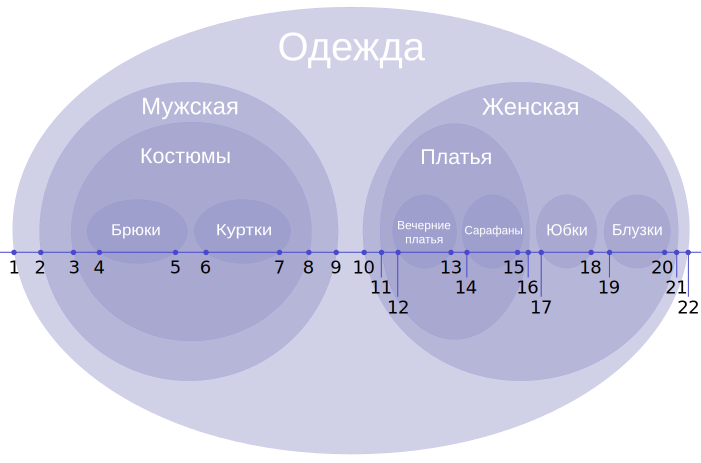

## Лекция 3

### Функциональные требования

При проектировании баз данных надо правильно уметь читать и составлять функциональные требования. Функциональные требования - это такой документ, который формально описывает сущности бизнес-логики, их свойства/связи и действия, которые они совершают или над которыми они совершают

Разберем функциональные требования для аналога Twitter:

* Система должна позволять пользователю зарегистрироваться, указав адрес электронной почты (или номер телефона), имя пользователя и пароль
* При регистрации должна осуществляться валидация введенных данных и отправка подтверждения
* Пользователь должен иметь возможность просматривать и редактировать свой профиль
* Пользователь может подписываться на других пользователей и видеть список своих подписок и подписчиков
* Пользователь должен иметь возможность создавать сообщения (твиты) длиной до 280 символой
* Система должна позволять прикреплять к твитам изображения, видео или ссылки
* После публикации твита пользователь может удалить его (либо неявно скрыть его ото всех)
* Пользователь должен иметь возможность ставить лайки
* Пользователь должен иметь возможность переопубликовать чужие твиты
* Пользователь должен иметь возможность отвечать на твиты
* Пользователь должен иметь возможность искать твиты по ключевым словам и хештегам
* Пользователь может управлять параметрами уведомлений
* Пользователь должен иметь возможность управлять видимостью своих твитов
* Возможность блокировки или ограничения доступа для отдельных пользователей

### Нейминг

В PostgreSQL используется `snake_case`, отношения называются в множественном числе, а атрибуты в единственном.

В первичных и внешних ключах указывается название отношения, чтобы избежать коллизии при объединении отношений, например, `user_id` и `chat_id`

### Паттерны

**Многое-ко-многим**

Тривиальной реализацией связи многое-ко-многим будет являться атрибут первого отношения, в котором будут указаны первичные ключи второго отношения (в формате JSON, через запятую или по-другому), однако это будет не оптимально

Правильно будет сделать отдельное отношение с двумя столбцами, в котором первичным ключом будет пара из ключей первого и второго отношений

**Вертикальное разделение**

Вместо того, чтобы добавлять новые атрибуты в исходное отношение, мы можем создать новое отношение с этим атрибутами. Например:

| user_id | username | email |
| ------- | -------- | ----- |
|         |          |       |

| user_id | big_string | big_binary | biography |
| ------- | ---------- | ---------- | --------- |
|         |            |            |           |

Если во втором отношении поместить малоиспользуемые атрибуты, то мы получим выигрыш в оптимизации

**Фиксированный набор значений**

Фиксированный набор значений можно реализовать несколькими способами:

* Ограничение на уровне кода - например, валидация на уровне бекенда
* Перечисление -`ENUM` в PostgreSQL
* Ограничение -`CONSTRAINT` в PostgreSQL
* Триггер - обработчик, реагирующий на изменения базы данных
* Справочник - отдельная таблица, которая ремаппит значения; позволяет расширять набор

**EAV (Entity-Attribute-Value)**

EAV - отношение с тремя атрибутами:

* Entity - уникальный идентификатор объекта
* Attribute - имя атрибута
* Value - его значение

EAV позволяет хранить данные с динамически изменяемой структурой, когда новые атрибуты могут добавлять без необходимости изменения структуры

**Полиморфные связи**

Допустим, что комментарии можем ставить и на посты, и на картинки. Тогда отношение с комментариями можем представить так:

| comment_id | content | commantable_id | commantable_type |
| ---------- | ------- | -------------- | ---------------- |
|            |         |                |                  |

Здесь `commentable_type` определяет, из какого отношения `commentable_id` будет являться ключом. Однако такой паттерн делает невозможным использование внешнего ключа

**Список смежных вершин**

Каждый кортеж будет хранить в себе указатель на родителя, тем самым моделируя дерево.

Пример:

| name      | id | parent |
| --------- | -- | ------ |
| food      | 1  | null   |
| vegetable | 2  | 1      |
| potato    | 3  | 2      |
| tomato    | 4  | 2      |
| fruit     | 5  | 1      |
| apple     | 6  | 5      |
| banana    | 7  | 5      |

**Вложенное множество**

Вложенное множество (Nested set) - еще один способ моделирования дерева. Дерево можно представить как вложенное множество:

Вместо хранения указателя на родителя, мы будем хранить указатели на левый и правый концы отрезков:

| name                          | left_end | right_end |
| ----------------------------- | -------- | --------- |
| Одежда                  | 1        | 22        |
| Мужская                | 2        | 9         |
| Женская                | 10       | 21        |
| Костюмы                | 3        | 8         |
| Брюки                    | 4        | 5         |
| Куртки                  | 6        | 7         |
| Платья                  | 11       | 16        |
| Юбки                      | 17       | 18        |
| Блузки                  | 19       | 20        |
| Вечерние платья | 12       | 13        |
| Сарафаны              | 14       | 15        |

Благодаря этому, мы можем с легкостью определить, является ли какой-либо узел потомком другого узла. Изменять структуру такого дерева - задача нетривиальная, поэтому вложенные множества подойдут для тех деревьев, которые будут чаще всего просматриваемые, нежели изменяемые

**Материализованный путь**

Материализованный путь (Materialized path) - еще один способ моделирования дерева, в которым для каждого узла мы храним его путь из корня. Например:

| name      | path  |
| --------- | ----- |
| food      | 1     |
| vegetable | 1.1   |
| potato    | 1.1.1 |
| tomato    | 1.1.2 |
| fruit     | 1.2   |
| apple     | 1.2.1 |
| banana    | 1.2.2 |

При помощи инструкции `LIKE` в SQL мы можем найти всех потомков какого-либо узла. Как и вложенные множества, такой паттерн рекомендуется применять для почти неизменяемых деревьев
