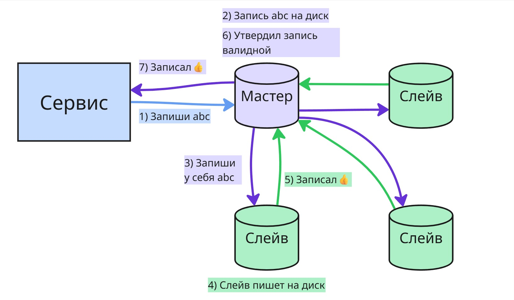
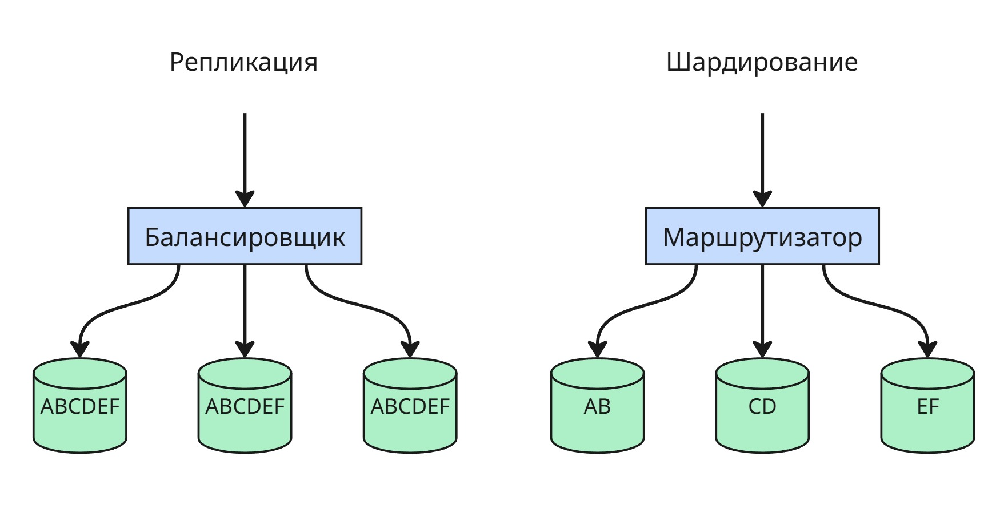

## Лекция 12. Распределенные базы данных

**Репликация** — это процесс копирования данных между несколькими серверами. Основная цель репликации — **повышение отказоустойчивости** и **масштабируемости** системы. Если один сервер выходит из строя, другие продолжают обслуживать запросы, сохранив актуальные копии данных.

Обычно запись сначала отправляется на **основной (главный) сервер**, который подтверждает её прием, а затем изменения передаются на другие серверы (реплики). Реплики возвращают подтверждение, и в зависимости от настроек кворума (например, в системе с 3 нодами достаточно 2 подтверждений) данные могут считаться зафиксированными.

Существует несколько моделей репликации:

* **Master-slave (мастер-слейв)** — только один сервер (мастер) принимает изменения (запись, обновление, удаление), а остальные (слейвы) получают эти изменения либо по push-механизму (мастер сам отправляет), либо по pull-механизму (слейвы запрашивают сами). Слейвы, как правило, предназначены только для чтения. Такая схема хорошо подходит для масштабирования чтения.

    

* **Master-master** — обе (или все) ноды могут принимать запросы на запись. Это даёт гибкость, но создаёт трудности с **обеспечением согласованности данных**, особенно при конфликтах. Поэтому эта схема используется редко, в основном там, где бизнес-логика допускает временные расхождения.

    

Иногда упоминается термин **линейная масштабируемость** — это означает, что при добавлении новых серверов производительность системы пропорционально растёт. Однако в реальности этого добиться сложно, особенно при синхронной репликации, потому что накладные расходы на поддержание согласованности возрастают.

Одна из проблем в распределённых системах — это **"split-brain"**, или "расщепление мозга" системы. Это происходит, когда часть узлов оказывается изолированной от других (например, из-за сетевого сбоя), и возникает ситуация, когда две (или более) группы узлов считают себя основными. Это может привести к **рассогласованию и потере данных**.

Чтобы избежать конфликтов и хаоса при отказе одного из серверов, используется **шардирование** (sharding, shard - осколок) — это стратегия, при которой **разные подмножества данных хранятся на разных серверах**. Например, пользователи с id от 1 до 10000 — на одной ноде, от 10001 до 20000 — на другой и т.д. Это не репликация, а **распределение нагрузки по горизонтали**. Основная сложность в шардировании — правильный выбор ключа и маршрутизация запросов к нужному шарду.

Если основной узел (мастер) выходит из строя, возникает вопрос: **кто станет новым мастером?** Чтобы решить эту задачу, в распределённых системах применяются алгоритмы **распределённого консенсуса** — например, **Raft**.

В таких системах каждый узел может находиться в одном из трёх состояний:

* **лидер** (leader) — принимает записи;
* **фолловер** (follower) — принимает указания от лидера;
* **кандидат** (candidate) — претендует на лидерство, если лидер не отвечает.

Механизм работы примерно следующий:

* Лидер регулярно отправляет фолловерам **heartbeat-сообщения**, которое означает, что лидер работает.
* Если фолловер не получает heartbeat в течение определённого времени (так называемого `electionTimeout`), он становится кандидатом.
* Кандидат рассылает другим узлам запросы на голосование (`RequestVote`) и голосует за себя
* Если фолловеры еще не голосовали в пределах одного терма (term, по сути просто счетчик), то они голосуют за кандидата. Терм увеличивается с приходом фолловеру `RequestVote` или с истечением `electionTimeout`.
* Если нашлись два кандидата с одинаковым числом голосов, то у кандитатов начинается новый терм после истечения `electionTimeout` и они рассылают `RequestVote`
* Если кандидат получает **большинство голосов** и у него наивысшее значение терма, он становится новым лидером.

Чтобы уменьшить вероятность появления двух кандидатов одновременно, параметр `electionTimeout` для каждого узла ставится рандомный

После выбора нового лидера происходит **согласование записей**. Чтобы избежать конфликтов:

* Если запись уже есть на **большинстве узлов**, она **коммитится** (фиксируется).
* Если записи нет на большинстве — на других узлах происходит **откат (rollback)** до согласованного состояния.

Это помогает обеспечить согласованность данных даже в условиях сбоев и восстановления.

---

Для настройки отказоустойчивого кластера PostgreSQL можно использовать сторонние инструменты, например:

* **Patroni** — инструмент для управления высокодоступным кластером PostgreSQL, использующий Etcd или Consul для хранения состояния и выбора лидера.
* **Stolon** — другой менеджер кластера, построенный по принципу контроллера и хранителя состояния (keeper), тоже поддерживает автоматическое переключение мастера.

Оба решения реализуют механизм управления репликами и автоматический failover (переключение при сбое), используя внутренние правила согласованности.

