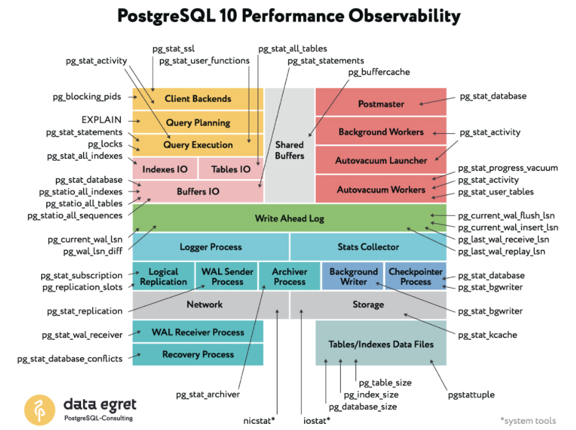

## Лекция 14. Мониторинг базы данных

Мониторинг баз данных - это множество инструментов и методов, используемых для создания и обслуживания инфраструктуры приложения, обладающих высокой доступностью и скоростью работы. 

В случае с PostgreSQL существует множество встроенных представлений (view) и системных таблиц, которые позволяют получить разностороннюю информацию о текущем состоянии базы данных.

Мониторинг необходим не только для предупреждения сбоев, но и для быстрого выявления аномалий в поведении пользователей или приложений. Например, мониторинг может выявить подозрительно активного клиента, создающего чрезмерную нагрузку, или показать, что дисковое пространство заканчивается, а количество одновременных подключений приближается к лимиту

Ключевые параметры, которые следует отслеживать при мониторинге PostgreSQL:

* Нагрузка на CPU и память - ресурсы сервера напрямую влияют на скорость выполнения запросов
* Количество активных подключений (`SELECT sum(numbackends) FROM pg_stat_database;`)
* Объем занятого дискового пространства (`pg_relation_size`, `pg_total_relation_size`)
* Производительность запросов, например, QPS (Queries Per Second) и TPS (Transactions Per Second)
* Время работы PostgreSQL - вычисляется через выражение: `uptime = now() - pg_postmaster_start_time()`

Для общего анализа состояния системы используются дашборды — визуальные панели, которые агрегируют метрики и представляют их в виде графиков и таблиц. Это позволяет быстро выявить появившиеся узкие места или сбои

### Основные источники статистики в PostgreSQL

1. `pg_stat_database` — агрегированные статистики по каждой базе данных:

   * количество завершённых транзакций (успешных и неуспешных)
   * количество возвратов и выборок
   * чтение и запись на диск
   * количество блокировок и конфликтов

2. `pg_stat_statements` — расширение, позволяющее анализировать производительность SQL-запросов:

   * количество вызовов каждого запроса
   * среднее/максимальное время выполнения
   * количество чтений с диска и из кеша
   * общий объём переданных данных

   Важно: `pg_stat_statements` нужно установить и включить отдельно

3. `pg_stat_activity` — отображает текущее состояние всех подключений. Позволяет увидеть:

   * активные и ожидающие соединения
   * выполняемые запросы
   * длительность выполнения запроса
   * состояние транзакции

   Этот системный вид часто называют «лучшим другом DBA», так как он позволяет быстро определить, кто "тормозит" систему прямо сейчас

### Мониторинг таблиц и индексов

Понимание размера таблиц и индексов позволяет оценить, насколько они влияют на производительность:

* `pg_relation_size('имя_таблицы')` — размер самой таблицы (без индексов)
* `pg_total_relation_size('имя_таблицы')` — общий размер таблицы

Если таблица большая, а индексов нет или они не используются, это может привести к медленным `SELECT`-запросам. В таком случае мониторинг количества неиндексированных сканирований подскажет, что стоит пересмотреть стратегию индексации

### Прочие источники метрик

* `pg_stat_kcache` (дополнительное расширение) позволяет анализировать использование CPU, системных вызовов и чтения из файловой системы на уровне отдельных запросов
* Информация о checkpoint и автоматических вакуумах доступна в `pg_stat_bgwriter`, `pg_stat_user_tables` и через функции `pg_stat_progress_vacuum`

Часто, именно оптимизация SQL-запросов даёт больший прирост производительности, чем масштабирование железа. Например, неэффективные `JOIN`-инструкции или отсутствующие `WHERE`-условия могут сильно нагружать систему

### Сбор и визуализация метрик

Существует множество инструментов и экосистем для сбора и отображения метрик:

* Prometheus, Victoria Metrics - системы сбора и хранения метрик
* Grafana — визуализация этих данных в виде дашбордов
* Zabbix — классическая система мониторинга с алертами и графиками
* Loki, Fluent Bit — системы для сбора и анализа логов.

Чтобы подключить PostgreSQL к этим инструментам, используются экспортеры:

* postgres_exporter — основной экспортёр метрик для Prometheus.
* sql_exporter — более гибкий вариант, позволяющий собирать кастомные SQL-запросы

Экспортеры запускаются как отдельные процессы (или контейнеры) и предоставляют API, с которого Prometheus или другой сборщик метрик может регулярно забирать данные

Таким образом, экспортер, например, postgres_exporter предоставляет интерфейс для системы сбора Prometheus, которая по сути является БД поменьше и которая забирают данные и статистики базы данных. Далее Grafana собирает эти данные и агрегирует в удобный дашборд

