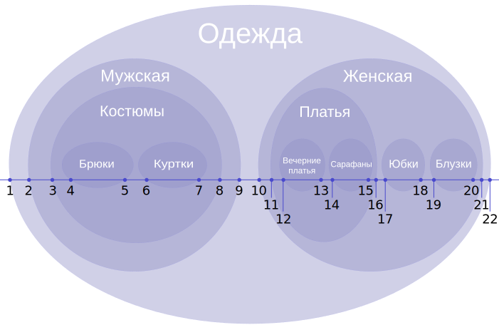

# <a name="%D0%BF%D1%80%D0%BE%D0%B5%D0%BA%D1%82%D0%B8%D1%80%D0%BE%D0%B2%D0%B0%D0%BD%D0%B8%D0%B5-%D0%B1%D0%B0%D0%B7-%D0%B4%D0%B0%D0%BD%D0%BD%D1%8B%D1%85"></a> Проектирование баз данных


* [Проектирование баз данных](#%D0%BF%D1%80%D0%BE%D0%B5%D0%BA%D1%82%D0%B8%D1%80%D0%BE%D0%B2%D0%B0%D0%BD%D0%B8%D0%B5-%D0%B1%D0%B0%D0%B7-%D0%B4%D0%B0%D0%BD%D0%BD%D1%8B%D1%85)
  * [Лекция 1. Терминология](#%D0%BB%D0%B5%D0%BA%D1%86%D0%B8%D1%8F-1.-%D1%82%D0%B5%D1%80%D0%BC%D0%B8%D0%BD%D0%BE%D0%BB%D0%BE%D0%B3%D0%B8%D1%8F)
  * [Лекция 2. Модели данных](#%D0%BB%D0%B5%D0%BA%D1%86%D0%B8%D1%8F-2.-%D0%BC%D0%BE%D0%B4%D0%B5%D0%BB%D0%B8-%D0%B4%D0%B0%D0%BD%D0%BD%D1%8B%D1%85)
    * [Реляционная](#%D1%80%D0%B5%D0%BB%D1%8F%D1%86%D0%B8%D0%BE%D0%BD%D0%BD%D0%B0%D1%8F)
    * [Колоночная](#%D0%BA%D0%BE%D0%BB%D0%BE%D0%BD%D0%BE%D1%87%D0%BD%D0%B0%D1%8F)
    * [Документоориентированная](#%D0%B4%D0%BE%D0%BA%D1%83%D0%BC%D0%B5%D0%BD%D1%82%D0%BE%D0%BE%D1%80%D0%B8%D0%B5%D0%BD%D1%82%D0%B8%D1%80%D0%BE%D0%B2%D0%B0%D0%BD%D0%BD%D0%B0%D1%8F)
    * [Графовая](#%D0%B3%D1%80%D0%B0%D1%84%D0%BE%D0%B2%D0%B0%D1%8F)
    * [Ключ-значение](#%D0%BA%D0%BB%D1%8E%D1%87-%D0%B7%D0%BD%D0%B0%D1%87%D0%B5%D0%BD%D0%B8%D0%B5)
    * [Временные ряды](#%D0%B2%D1%80%D0%B5%D0%BC%D0%B5%D0%BD%D0%BD%D1%8B%D0%B5-%D1%80%D1%8F%D0%B4%D1%8B)
    * [Векторная](#%D0%B2%D0%B5%D0%BA%D1%82%D0%BE%D1%80%D0%BD%D0%B0%D1%8F)
    * [Хранилище данных](#%D1%85%D1%80%D0%B0%D0%BD%D0%B8%D0%BB%D0%B8%D1%89%D0%B5-%D0%B4%D0%B0%D0%BD%D0%BD%D1%8B%D1%85)
  * [Лекция 3. Функциональные требования и паттерны](#%D0%BB%D0%B5%D0%BA%D1%86%D0%B8%D1%8F-3.-%D1%84%D1%83%D0%BD%D0%BA%D1%86%D0%B8%D0%BE%D0%BD%D0%B0%D0%BB%D1%8C%D0%BD%D1%8B%D0%B5-%D1%82%D1%80%D0%B5%D0%B1%D0%BE%D0%B2%D0%B0%D0%BD%D0%B8%D1%8F-%D0%B8-%D0%BF%D0%B0%D1%82%D1%82%D0%B5%D1%80%D0%BD%D1%8B)
    * [Функциональные требования](#%D1%84%D1%83%D0%BD%D0%BA%D1%86%D0%B8%D0%BE%D0%BD%D0%B0%D0%BB%D1%8C%D0%BD%D1%8B%D0%B5-%D1%82%D1%80%D0%B5%D0%B1%D0%BE%D0%B2%D0%B0%D0%BD%D0%B8%D1%8F)
    * [Нейминг](#%D0%BD%D0%B5%D0%B9%D0%BC%D0%B8%D0%BD%D0%B3)
    * [Паттерны](#%D0%BF%D0%B0%D1%82%D1%82%D0%B5%D1%80%D0%BD%D1%8B)
  * [Лекция 4. Архитектура PostgreSQL, часть 1](#%D0%BB%D0%B5%D0%BA%D1%86%D0%B8%D1%8F-4.-%D0%B0%D1%80%D1%85%D0%B8%D1%82%D0%B5%D0%BA%D1%82%D1%83%D1%80%D0%B0-postgresql%2C-%D1%87%D0%B0%D1%81%D1%82%D1%8C-1)
    * [Postmaster](#postmaster)
    * [Фоновые процессы (Background Workers)](#%D1%84%D0%BE%D0%BD%D0%BE%D0%B2%D1%8B%D0%B5-%D0%BF%D1%80%D0%BE%D1%86%D0%B5%D1%81%D1%81%D1%8B-%28background-workers%29)
    * [Работа с памятью и хранением данных](#%D1%80%D0%B0%D0%B1%D0%BE%D1%82%D0%B0-%D1%81-%D0%BF%D0%B0%D0%BC%D1%8F%D1%82%D1%8C%D1%8E-%D0%B8-%D1%85%D1%80%D0%B0%D0%BD%D0%B5%D0%BD%D0%B8%D0%B5%D0%BC-%D0%B4%D0%B0%D0%BD%D0%BD%D1%8B%D1%85)
    * [Обработка SQL-запросов](#%D0%BE%D0%B1%D1%80%D0%B0%D0%B1%D0%BE%D1%82%D0%BA%D0%B0-sql-%D0%B7%D0%B0%D0%BF%D1%80%D0%BE%D1%81%D0%BE%D0%B2)
    * [MVCC](#mvcc)
    * [Vacuum и Autovacuum](#vacuum-%D0%B8-autovacuum)
  * [Лекция 5. Встреча с Олегом Сергеевичем Бартуновым](#%D0%BB%D0%B5%D0%BA%D1%86%D0%B8%D1%8F-5.-%D0%B2%D1%81%D1%82%D1%80%D0%B5%D1%87%D0%B0-%D1%81-%D0%BE%D0%BB%D0%B5%D0%B3%D0%BE%D0%BC-%D1%81%D0%B5%D1%80%D0%B3%D0%B5%D0%B5%D0%B2%D0%B8%D1%87%D0%B5%D0%BC-%D0%B1%D0%B0%D1%80%D1%82%D1%83%D0%BD%D0%BE%D0%B2%D1%8B%D0%BC)
  * [Лекция 6. Контейнеризация](#%D0%BB%D0%B5%D0%BA%D1%86%D0%B8%D1%8F-6.-%D0%BA%D0%BE%D0%BD%D1%82%D0%B5%D0%B9%D0%BD%D0%B5%D1%80%D0%B8%D0%B7%D0%B0%D1%86%D0%B8%D1%8F)
  * [Лекция 7. Миграция базы данных](#%D0%BB%D0%B5%D0%BA%D1%86%D0%B8%D1%8F-7.-%D0%BC%D0%B8%D0%B3%D1%80%D0%B0%D1%86%D0%B8%D1%8F-%D0%B1%D0%B0%D0%B7%D1%8B-%D0%B4%D0%B0%D0%BD%D0%BD%D1%8B%D1%85)
  * [Лекция 8. Транзакции](#%D0%BB%D0%B5%D0%BA%D1%86%D0%B8%D1%8F-8.-%D1%82%D1%80%D0%B0%D0%BD%D0%B7%D0%B0%D0%BA%D1%86%D0%B8%D0%B8)
  * [Лекция 9. Индекс](#%D0%BB%D0%B5%D0%BA%D1%86%D0%B8%D1%8F-9.-%D0%B8%D0%BD%D0%B4%D0%B5%D0%BA%D1%81)
    * [Хеш-индекс](#%D1%85%D0%B5%D1%88-%D0%B8%D0%BD%D0%B4%D0%B5%D0%BA%D1%81)
    * [B-дерево](#b-%D0%B4%D0%B5%D1%80%D0%B5%D0%B2%D0%BE)
    * [GiST (Generilized Search Tree)](#gist-%28generilized-search-tree%29)
    * [GIN (Generalized Inverted Index)](#gin-%28generalized-inverted-index%29)
  * [Лекция 10. Архитектура PostgreSQL, часть 2](#%D0%BB%D0%B5%D0%BA%D1%86%D0%B8%D1%8F-10.-%D0%B0%D1%80%D1%85%D0%B8%D1%82%D0%B5%D0%BA%D1%82%D1%83%D1%80%D0%B0-postgresql%2C-%D1%87%D0%B0%D1%81%D1%82%D1%8C-2)
    * [Модель доступа](#%D0%BC%D0%BE%D0%B4%D0%B5%D0%BB%D1%8C-%D0%B4%D0%BE%D1%81%D1%82%D1%83%D0%BF%D0%B0)
    * [Обработка SQL-запроса](#%D0%BE%D0%B1%D1%80%D0%B0%D0%B1%D0%BE%D1%82%D0%BA%D0%B0-sql-%D0%B7%D0%B0%D0%BF%D1%80%D0%BE%D1%81%D0%B0)
    * [Статистика](#%D1%81%D1%82%D0%B0%D1%82%D0%B8%D1%81%D1%82%D0%B8%D0%BA%D0%B0)
    * [Методы доступа к таблице](#%D0%BC%D0%B5%D1%82%D0%BE%D0%B4%D1%8B-%D0%B4%D0%BE%D1%81%D1%82%D1%83%D0%BF%D0%B0-%D0%BA-%D1%82%D0%B0%D0%B1%D0%BB%D0%B8%D1%86%D0%B5)
    * [Другое](#%D0%B4%D1%80%D1%83%D0%B3%D0%BE%D0%B5)
  * [Лекция 11. Общение в распределенных хранилищах](#%D0%BB%D0%B5%D0%BA%D1%86%D0%B8%D1%8F-11.-%D0%BE%D0%B1%D1%89%D0%B5%D0%BD%D0%B8%D0%B5-%D0%B2-%D1%80%D0%B0%D1%81%D0%BF%D1%80%D0%B5%D0%B4%D0%B5%D0%BB%D0%B5%D0%BD%D0%BD%D1%8B%D1%85-%D1%85%D1%80%D0%B0%D0%BD%D0%B8%D0%BB%D0%B8%D1%89%D0%B0%D1%85)
  * [Лекция 12. Распределенные базы данных](#%D0%BB%D0%B5%D0%BA%D1%86%D0%B8%D1%8F-12.-%D1%80%D0%B0%D1%81%D0%BF%D1%80%D0%B5%D0%B4%D0%B5%D0%BB%D0%B5%D0%BD%D0%BD%D1%8B%D0%B5-%D0%B1%D0%B0%D0%B7%D1%8B-%D0%B4%D0%B0%D0%BD%D0%BD%D1%8B%D1%85)
  * [Лекция 13. Тестирование миграций](#%D0%BB%D0%B5%D0%BA%D1%86%D0%B8%D1%8F-13.-%D1%82%D0%B5%D1%81%D1%82%D0%B8%D1%80%D0%BE%D0%B2%D0%B0%D0%BD%D0%B8%D0%B5-%D0%BC%D0%B8%D0%B3%D1%80%D0%B0%D1%86%D0%B8%D0%B9)
* [X. Программа экзамена в 2024/2025](#x.-%D0%BF%D1%80%D0%BE%D0%B3%D1%80%D0%B0%D0%BC%D0%BC%D0%B0-%D1%8D%D0%BA%D0%B7%D0%B0%D0%BC%D0%B5%D0%BD%D0%B0-%D0%B2-2024%2F2025)


На этом курсе мы будем проектировать реляционные базы данных с помощью СУБД [PostgreSQL](https://www.postgresql.org/)

Также будут разбираться другие СУБД, реализующие другие модели данных, а также работа с контейнерами.

## <a name="%D0%BB%D0%B5%D0%BA%D1%86%D0%B8%D1%8F-1.-%D1%82%D0%B5%D1%80%D0%BC%D0%B8%D0%BD%D0%BE%D0%BB%D0%BE%D0%B3%D0%B8%D1%8F"></a> Лекция 1. Терминология

> Модель данных - это концептуальное описание структуры данных, их взаимосвязей, а также правил и ограничений, регулирующих работу с данными. Система управления БД реализует определенную модель данных

Можно выделить такие модели данных: 

* реляционная
* документоориентированная
* колоночная
* графовая
* ключ-значение
* векторная
* временных рядов (time series)

Модели данных помогают нам преобразовать объекты доменной области в понятные компьютеру образы.

> Нормализация базы данных - это процесс структурирования данных в базе данных в соответствии с определенными правилами, направленный на устранение избыточности данных и обеспечение их целостности. Основная идея нормализации заключается в разбиении больших таблиц на несколько меньших, логически связанных между собой, с целью обеспечения целостности и согласованности данных

Нормальные формы ведут за собой потери производительности при агрегации данных. В каких-то случаях применяется денормализация - обратный процесс, целью которого является увеличение избыточности и производительности

На курсе "Базы данных" мы изучали виды ключей записей в реляционной БД:

> Суперключ - набор одного или нескольких атрибутов, которые в совокупности позволяют уникально идентифицировать каждую запись в таблице

> Потенциальный ключ - минимальный суперключ, который не содержит избыточных атрибутов

> Первичный ключ - один из потенциальных ключей, выбранный для уникальной идентификации записей в таблице

> Внешний ключ - атрибут или множество атрибутов, которые соответствуют потенциальному ключу некоторого (может быть того же самого) отношения

Также ключ может быть естественным и суррогатным

> **Естественный ключ** - это атрибут (или комбинация), который уже присутствует в данных и имеет смысл с точки зрения предметной области 

Пример: адрес электронной почты в базе клиентов

Плюсы: экономия памяти

Минусы: может измениться, может быть неопределенной длины

> **Суррогатный ключ** - искусственно созданный уникальный идентификатор 

Плюсы: не может потребоваться его менять, занимает мало места

Минусы: избыточные данные

Роль суррогатного ключа может принять автоинкремент (увеличенное на 1 значение ключа предыдущей созданной записи) или UUID


Также в PostgreSQL существуют такие типы данных:

* Целочисленные типы - smallint, int, bigint, (serial, big serial)

* С плавающей точкой - real, double, money, decimal

* Строки - varchar, char, text

* Дата и время - date, time, timestamp, interval

* Логический - bool

* Геометрические типы - point, path, line


## <a name="%D0%BB%D0%B5%D0%BA%D1%86%D0%B8%D1%8F-2.-%D0%BC%D0%BE%D0%B4%D0%B5%D0%BB%D0%B8-%D0%B4%D0%B0%D0%BD%D0%BD%D1%8B%D1%85"></a> Лекция 2. Модели данных

Как уже говорилось, модели данных со своими преимуществами и недостатками имеют свои области применения, в которых они будут наиболее эффективны

### <a name="%D1%80%D0%B5%D0%BB%D1%8F%D1%86%D0%B8%D0%BE%D0%BD%D0%BD%D0%B0%D1%8F"></a> Реляционная

По статистике реляционные базы данных имеют наибольшую популярность в разработке

Реляционная модель организует данные в виде двухмерных таблиц со строгой структурой. Данные вносятся как строки, колонки которых соответствуют определенным типам данных.
Между таблицами, отношениями, можно настроить семантические связи. Реляционные базы данных используют структурированный язык запросов SQL и соответствуют ACID свойствам

Преимущества реляционных баз данных:

* Благодаря строгой структуре и ACID свойствами, обеспечивается целостность данных

* Использование SQL как стандарта облегчает разработку, миграцию и поддержку

* Возможность выполнения сложные агрегирующих запросов

* Большое сообщество

Недостатки:

* Трудно хранить слабоструктурированные данные

* Горизонтальное масштабирование реляционных БД зачастую сложнее реализовать, чем в NoSQL решениях

* При большом количестве взаимосвязанных таблиц схемы становятся громоздким, что бьет по производительности

Применения реляционных БД:

* OLTP-системы ([Online transaction processing](https://ru.wikipedia.org/wiki/OLTP), транзакции небольшого размера обрабатываются с минимальным временем отклика)

* Системы с высокими требованиям к целостности данных

* Данные имеют строгую структуру

Распространенные реализации: PostgreSQL, MySQL, SQLite, MariaDB, Microsoft SQL Server, Oracle DB, YandexDB

### <a name="%D0%BA%D0%BE%D0%BB%D0%BE%D0%BD%D0%BE%D1%87%D0%BD%D0%B0%D1%8F"></a> Колоночная

В колоночных БД вместо того, чтобы хранить каждую запись целиком, данные организуются по столбцам, то есть значения одного атрибута хранятся последовательно, что позволяет оптимизировать запросы над конкретными наборами данных. Колоночные БД считаются NoSQL

Преимущества:

* Оптимизация запросов

* Если атрибут имеет маленький домен (например, перечисление), то, храня их последовательно, можно кодировать их более оптимально, что позволяет сэкономить память

Недостатки:

* Операции, характерные OLTP, работают менее эффективно

* При частых изменениях данных могут возникать проблемы с синхронизацией

Применение:

* Big Data

* OLAP-системы ([Online Analytical Processing](https://ru.wikipedia.org/wiki/OLAP))

* Бизнес-аналитика (отчеты, дашборды)

* Исторические данные 

Реализации: Cassandra, ScyllaDB, Google BigQuery, ClickHouse (колоночная реляционная СУБД)

### <a name="%D0%B4%D0%BE%D0%BA%D1%83%D0%BC%D0%B5%D0%BD%D1%82%D0%BE%D0%BE%D1%80%D0%B8%D0%B5%D0%BD%D1%82%D0%B8%D1%80%D0%BE%D0%B2%D0%B0%D0%BD%D0%BD%D0%B0%D1%8F"></a> Документоориентированная

Данные хранятся в виде документов (обычно представляющиеся в формате [BSON](https://ru.wikipedia.org/wiki/BSON)), а не в виде строк таблицы. 
Документы объединяются в коллекции (по аналогии с таблицами, но без обязательного соответствия единой схеме). Причисляется к NoSQL

Преимущества:

* Возможность изменения структуры документов без необходимости модифицировать общую схему БД

* Документы в формате JSON или BSON естественным образом отображаются на объекты в языках программирования

* Простота горизонтальной масштабируемости

Недостатки: 

* Слабая структура (необходимость валидации)

Применение:

* Хранение логов

* OLTP-системы

* Разработка [MVP](https://ru.wikipedia.org/wiki/%D0%9C%D0%B8%D0%BD%D0%B8%D0%BC%D0%B0%D0%BB%D1%8C%D0%BD%D0%BE_%D0%B6%D0%B8%D0%B7%D0%BD%D0%B5%D1%81%D0%BF%D0%BE%D1%81%D0%BE%D0%B1%D0%BD%D1%8B%D0%B9_%D0%BF%D1%80%D0%BE%D0%B4%D1%83%D0%BA%D1%82)

* Неструктурированные данные

* Обработка больших объемов данных

Реализации: MongoDB, Firebase Realtime Database, Elasticsearch, Amazon DynamoDB, CouchDB

### <a name="%D0%B3%D1%80%D0%B0%D1%84%D0%BE%D0%B2%D0%B0%D1%8F"></a> Графовая

Вместо таблиц и кортежей в графовой БД объектами являются узлы, ребра и их свойства. Графовые БД считаются NoSQL

Преимущества:

* Запросы на поиск путей, обход графа, анализ связей выполняются быстро

* Нет жесткой структуры

* Легко добавлять новые типы связей и узлов без изменения общей схемы

Недостатки: 

* Узкая специализация

Применение:

* Социальные сети

* Системы рекомендаций

* Управление цепочками поставок

* Фрод-анализ (поиск мошеннических активностей)

Реализации: Neo4j, Dgraph

### <a name="%D0%BA%D0%BB%D1%8E%D1%87-%D0%B7%D0%BD%D0%B0%D1%87%D0%B5%D0%BD%D0%B8%D0%B5"></a> Ключ-значение

Данные в "ключ-значение" БД хранятся в виде ключ-значение

Преимущества:

* Операции получаения, вставки, удаления работают за `O(1)`

* Быстрые и требуют мало ресурсов

Недостатки:

* Сложно агрегировать данные или составлять выборку

* Слабая структура

Применение:

* Кэширование данных

* Хранение сессионных данных

* Реализация очередей

* Хранение конфигурационных данных

Реализации: Redis, Memcached, Etcd, Kafka

### <a name="%D0%B2%D1%80%D0%B5%D0%BC%D0%B5%D0%BD%D0%BD%D1%8B%D0%B5-%D1%80%D1%8F%D0%B4%D1%8B"></a> Временные ряды

Данные упорядочены по времени (в данном случае ключ - это метка времени)

Преимущества:

* Высокая скорость записи

* Легко делать агрегацию и интерполяцию

* Хранение больших объемов данных

* Анализ данных за определенный промежуток времени

Недостатки: 

* Узкая специализация

Применение:

* Мониторинг и логирование

* Финансовые рынки

* Интернет вещей

Реализации: InfluxDB, TimescaleDB, Prometheus

### <a name="%D0%B2%D0%B5%D0%BA%D1%82%D0%BE%D1%80%D0%BD%D0%B0%D1%8F"></a> Векторная

Данные хранятся в виде векторов вещественных чисел

Преимущества:

* Легко осуществим поиск похожих векторов (например, алгоритм [HNSW](https://en.wikipedia.org/wiki/Hierarchical_navigable_small_world))

Недостатки:

* Узкая специализация

Применение: кластеры, техническое зрение, машинное обучение

Реализации: Pinecone, Milvus

### <a name="%D1%85%D1%80%D0%B0%D0%BD%D0%B8%D0%BB%D0%B8%D1%89%D0%B5-%D0%B4%D0%B0%D0%BD%D0%BD%D1%8B%D1%85"></a> Хранилище данных

Данных хранятся в виде файлах (текст, аудио, видео и др.) в файловой системе. Помимо этого каждый файл хранит метаданные.
Доступ к файлам осуществляется по их именам и путям в файловой системы

Преимущества:

* Интеграция с ОС и стандартными файловыми менеджерами

* Возможность выстраивания сложной модели доступа

* Возможность сделать CDN (Content Delivery Network)

Недостатки:

* Поиск по содержимому файла непроизводителен

Применение: хранение и распространение файлов

Реализации: Amazon S3, MinIO


## <a name="%D0%BB%D0%B5%D0%BA%D1%86%D0%B8%D1%8F-3.-%D1%84%D1%83%D0%BD%D0%BA%D1%86%D0%B8%D0%BE%D0%BD%D0%B0%D0%BB%D1%8C%D0%BD%D1%8B%D0%B5-%D1%82%D1%80%D0%B5%D0%B1%D0%BE%D0%B2%D0%B0%D0%BD%D0%B8%D1%8F-%D0%B8-%D0%BF%D0%B0%D1%82%D1%82%D0%B5%D1%80%D0%BD%D1%8B"></a> Лекция 3. Функциональные требования и паттерны

### <a name="%D1%84%D1%83%D0%BD%D0%BA%D1%86%D0%B8%D0%BE%D0%BD%D0%B0%D0%BB%D1%8C%D0%BD%D1%8B%D0%B5-%D1%82%D1%80%D0%B5%D0%B1%D0%BE%D0%B2%D0%B0%D0%BD%D0%B8%D1%8F"></a> Функциональные требования

При проектировании баз данных надо правильно уметь читать и составлять функциональные требования. Функциональные требования - это такой документ, который формально описывает сущности бизнес-логики, их свойства/связи и действия, которые они совершают или над которыми они совершают

Разберем функциональные требования для аналога Twitter:

* Система должна позволять пользователю зарегистрироваться, указав адрес электронной почты (или номер телефона), имя пользователя и пароль
* При регистрации должна осуществляться валидация введенных данных и отправка подтверждения
* Пользователь должен иметь возможность просматривать и редактировать свой профиль
* Пользователь может подписываться на других пользователей и видеть список своих подписок и подписчиков
* Пользователь должен иметь возможность создавать сообщения (твиты) длиной до 280 символой
* Система должна позволять прикреплять к твитам изображения, видео или ссылки
* После публикации твита пользователь может удалить его (либо неявно скрыть его ото всех)
* Пользователь должен иметь возможность ставить лайки
* Пользователь должен иметь возможность переопубликовать чужие твиты
* Пользователь должен иметь возможность отвечать на твиты
* Пользователь должен иметь возможность искать твиты по ключевым словам и хештегам
* Пользователь может управлять параметрами уведомлений
* Пользователь должен иметь возможность управлять видимостью своих твитов
* Возможность блокировки или ограничения доступа для отдельных пользователей

### <a name="%D0%BD%D0%B5%D0%B9%D0%BC%D0%B8%D0%BD%D0%B3"></a> Нейминг

В PostgreSQL используется `snake_case`, отношения называются в множественном числе, а атрибуты в единственном.

В первичных и внешних ключах указывается название отношения, чтобы избежать коллизии при объединении отношений, например, `user_id` и `chat_id`

### <a name="%D0%BF%D0%B0%D1%82%D1%82%D0%B5%D1%80%D0%BD%D1%8B"></a> Паттерны

**Многое-ко-многим**

Тривиальной реализацией связи многое-ко-многим будет являться атрибут первого отношения, в котором будут указаны первичные ключи второго отношения (в формате JSON, через запятую или по-другому), однако это будет не оптимально

Правильно будет сделать отдельное отношение с двумя столбцами, в котором первичным ключом будет пара из ключей первого и второго отношений

**Вертикальное разделение**

Вместо того, чтобы добавлять новые атрибуты в исходное отношение, мы можем создать новое отношение с этим атрибутами. Например:

| user_id | username | email |
| ------- | -------- | ----- |
|         |          |       |

| user_id | big_string | big_binary | biography |
| ------- | ---------- | ---------- | --------- |
|         |            |            |           |

Если во втором отношении поместить малоиспользуемые атрибуты, то мы получим выигрыш в оптимизации

**Фиксированный набор значений**

Фиксированный набор значений можно реализовать несколькими способами:

* Ограничение на уровне кода - например, валидация на уровне бекенда
* Перечисление -`ENUM` в PostgreSQL
* Ограничение -`CONSTRAINT` в PostgreSQL
* Триггер - обработчик, реагирующий на изменения базы данных
* Справочник - отдельная таблица, которая ремаппит значения; позволяет расширять набор

**EAV (Entity-Attribute-Value)**

EAV - отношение с тремя атрибутами:

* Entity - уникальный идентификатор объекта
* Attribute - имя атрибута
* Value - его значение

EAV позволяет хранить данные с динамически изменяемой структурой, когда новые атрибуты могут добавлять без необходимости изменения структуры

**Полиморфные связи**

Допустим, что комментарии можем ставить и на посты, и на картинки. Тогда отношение с комментариями можем представить так:

| comment_id | content | commantable_id | commantable_type |
| ---------- | ------- | -------------- | ---------------- |
|            |         |                |                  |

Здесь `commentable_type` определяет, из какого отношения `commentable_id` будет являться ключом. Однако такой паттерн делает невозможным использование внешнего ключа

**Список смежных вершин**

Каждый кортеж будет хранить в себе указатель на родителя, тем самым моделируя дерево.

Пример:

| name      | id | parent |
| --------- | -- | ------ |
| food      | 1  | null   |
| vegetable | 2  | 1      |
| potato    | 3  | 2      |
| tomato    | 4  | 2      |
| fruit     | 5  | 1      |
| apple     | 6  | 5      |
| banana    | 7  | 5      |

**Вложенное множество**

Вложенное множество (Nested set) - еще один способ моделирования дерева. Дерево можно представить как вложенное множество:



Вместо хранения указателя на родителя, мы будем хранить указатели на левый и правый концы отрезков:

| name                          | left_end | right_end |
| ----------------------------- | -------- | --------- |
| Одежда                  | 1        | 22        |
| Мужская                | 2        | 9         |
| Женская                | 10       | 21        |
| Костюмы                | 3        | 8         |
| Брюки                    | 4        | 5         |
| Куртки                  | 6        | 7         |
| Платья                  | 11       | 16        |
| Юбки                      | 17       | 18        |
| Блузки                  | 19       | 20        |
| Вечерние платья | 12       | 13        |
| Сарафаны              | 14       | 15        |

Благодаря этому, мы можем с легкостью определить, является ли какой-либо узел потомком другого узла. Изменять структуру такого дерева - задача нетривиальная, поэтому вложенные множества подойдут для тех деревьев, которые будут чаще всего просматриваемые, нежели изменяемые

**Материализованный путь**

Материализованный путь (Materialized path) - еще один способ моделирования дерева, в которым для каждого узла мы храним его путь из корня. Например:

| name      | path  |
| --------- | ----- |
| food      | 1     |
| vegetable | 1.1   |
| potato    | 1.1.1 |
| tomato    | 1.1.2 |
| fruit     | 1.2   |
| apple     | 1.2.1 |
| banana    | 1.2.2 |

При помощи инструкции `LIKE` в SQL мы можем найти всех потомков какого-либо узла. Как и вложенные множества, такой паттерн рекомендуется применять для почти неизменяемых деревьев


## <a name="%D0%BB%D0%B5%D0%BA%D1%86%D0%B8%D1%8F-4.-%D0%B0%D1%80%D1%85%D0%B8%D1%82%D0%B5%D0%BA%D1%82%D1%83%D1%80%D0%B0-postgresql%2C-%D1%87%D0%B0%D1%81%D1%82%D1%8C-1"></a> Лекция 4. Архитектура PostgreSQL, часть 1

### <a name="postmaster"></a> Postmaster

При запуске PostgreSQL сервере первым делом создается процесс Postmaster. **Postmaster** - главный процесс, который принимает входящие подключения от клиентов, управляет созданием и завершением дочерних процессов

Для каждого нового подключения Postmaster порождает отдельный процесс, который обрабатывает SQL-запросы, выполняет планирование и возвращает результаты клиенту. Такой подход изолирует сессии и повышает стабильность системы

### <a name="%D1%84%D0%BE%D0%BD%D0%BE%D0%B2%D1%8B%D0%B5-%D0%BF%D1%80%D0%BE%D1%86%D0%B5%D1%81%D1%81%D1%8B-%28background-workers%29"></a> Фоновые процессы (Background Workers)

PostgreSQL использует дополнительные фоновые процессы для выполнения служебных задач:

* **Checkpointer** периодически сбрасывает измененные данные из общей памяти (shared buffers) на диск. Это снижает время на восстановление после сбоев и оптимизирует запись: данные сначала попадают в буфер, а затем периодически записываются на диск

* **WAL Writer** обеспечивает запись журналов предзаписи (Write-Ahead Logging, WAL), что гарантирует, что изменения сначала фиксируются в журнале, прежде чем быть записанными на диск. WAL Writer используется для обеспечения надежности и возможности восстановления

* **Background Writer** фоново записывает изменённые страницы из буферного кэша на диск, помогая поддерживать актуальность данных и снижать пик нагрузок при массовых запросах

* **Stats Collector** собирает статистику, ведёт учет выполнения запросов, использования ресурсов и другой информации, необходимой для работы планировщика запросов и оптимизации системы

* **Autovacuum** - процесс очистки (об этом далее)

### <a name="%D1%80%D0%B0%D0%B1%D0%BE%D1%82%D0%B0-%D1%81-%D0%BF%D0%B0%D0%BC%D1%8F%D1%82%D1%8C%D1%8E-%D0%B8-%D1%85%D1%80%D0%B0%D0%BD%D0%B5%D0%BD%D0%B8%D0%B5%D0%BC-%D0%B4%D0%B0%D0%BD%D0%BD%D1%8B%D1%85"></a> Работа с памятью и хранением данных

PostgreSQL выделяет область общей памяти, используемую для:
  
* Хранения буферов данных (shared buffers)
* Управления системными блокировками
* Отслеживания состояния транзакций
* Хранения WAL-буферов

Данные хранятся в виде файлов на диске. Для взаимодействия с хранилищем данных используются специализированные модули доступа и загрузчик данных

### <a name="%D0%BE%D0%B1%D1%80%D0%B0%D0%B1%D0%BE%D1%82%D0%BA%D0%B0-sql-%D0%B7%D0%B0%D0%BF%D1%80%D0%BE%D1%81%D0%BE%D0%B2"></a> Обработка SQL-запросов

PostgreSQL обрабатывает запросы так:

1. **Прием запроса**. Запрос поступает через клиент к дочернему процессу, созданному Postmaster

2. **Парсинг**. SQL-текст разбивается на токены и строится синтаксическое дерево. Здесь производится проверка на ошибки 

3. **Рерайтинг**. Запрос преобразуется с учетом представлений, правил и триггеров

4. **Планирование и оптимизация**. Планировщик запросов анализирует различные стратегии выполнения, используя собранную статистику, и выбирает наиболее оптимальный план

5. **Исполнение**. Выполнение плана запроса: данные извлекаются, обрабатываются через узлы (фильтрация, сортировка, соединения и т.д.) и формируется результат

6. **Возврат результатов**. После выполнения запроса результаты возвращаются клиенту. Для операций, изменяющий данные, делается коммит изменений
   
### <a name="mvcc"></a> MVCC

PostgreSQL реализует механизм MVCC (multiversion concurrency control, многоверсионный контроль согласованности), позволяющий обеспечить согласованность данных при одновременном доступе множества пользователей

Внутри себя PostgreSQL хранит счетчик транзакций, который можно получить функцией `txid_current()`. При выполнении транзакции этот счетчик увеличивается. Каждая запись в отношении имеет системные атрибуты `xmin` и `xmax`

* Когда запись создается, ей присваивается значение счетчика в поле `xmin`
* Когда запись удаляется, она не удаляется, а просто присваивается значение счетчика в ее поле `xmax`
* Когда запись изменяется, на самом деле создается ее копия с изменными атрибутами, старой записи присваивается значение счетчика в поле `xmax`, а новой присваивается в поле `xmin`

Таким образом, эти атрибуты задают жизненный цикл каждого снимка каждой записи, чтобы соблюдать целостность данных.  
Помимо них есть еще `cmin` и `cmax`. Они обозначают жизненный цикл самой записи и не затрагиваются при обновлении записи

### <a name="vacuum-%D0%B8-autovacuum"></a> Vacuum и Autovacuum

Так как MVCC требует очень много памяти на диске, нужны инструменты, очищающие неактуальные данные. В PostgreSQL есть:

* **Vacuum** - команда для очистки базы данных, которая удаляет "мертвые" строки (устаревшие версии записей, помеченные как удаленные) и сбрасывает счетчик транзакций, участвующий в механизме MVCC, тем самым предотвращая его переполнение

* **Autovacuum** - автоматическая версия процесса очистки, которая определяет необходимость очистки таблиц на основании внутренней статистики и автоматически запускает процесс Vacuum для удаления устаревших данных и реорганизации таблиц, что помогает поддерживать оптимальную производительность базы данных


## <a name="%D0%BB%D0%B5%D0%BA%D1%86%D0%B8%D1%8F-5.-%D0%B2%D1%81%D1%82%D1%80%D0%B5%D1%87%D0%B0-%D1%81-%D0%BE%D0%BB%D0%B5%D0%B3%D0%BE%D0%BC-%D1%81%D0%B5%D1%80%D0%B3%D0%B5%D0%B5%D0%B2%D0%B8%D1%87%D0%B5%D0%BC-%D0%B1%D0%B0%D1%80%D1%82%D1%83%D0%BD%D0%BE%D0%B2%D1%8B%D0%BC"></a> Лекция 5. Встреча с Олегом Сергеевичем Бартуновым

_Вместо этой лекции была встреча с Олегом Сергеевичем Бартуновым, сооснователем компании Postgres Professional, развивающей форк PostgreSQL для enterprise-решений. Здесь же представлено краткое содержание того, что на ней было - крайне рекомендуется послушать все самим_

[Часть 1](https://github.com/user-attachments/assets/09e264f8-1360-4fdc-85ad-c5ef61c7b858)

[Часть 2](https://github.com/user-attachments/assets/0bf6b561-4110-471c-937c-4cd256c42e7e)

[Часть 3](https://github.com/user-attachments/assets/f27d6250-e56f-40c5-ba9c-29db9311767a)

[Часть 4](https://github.com/user-attachments/assets/59f662e4-25d2-4a29-9bcd-98a51441ee56)

[Часть 5](https://github.com/user-attachments/assets/06a7db5e-6821-4855-8996-3ebba50dc041)

[Часть 6](https://github.com/user-attachments/assets/85a47574-d555-4f41-afe7-62232f7b8a37)

---

Первые данные появились, когда человек захотел с кем-то пообщаться или что-то сохранить. Например, астрономия. Астрономические наблюдения требуют больших объемов хранения данных

Сначала примитивными базам данных были шумерские таблички для учета казны и налогом, потом появились каталоги по авторам в библиотеках. Файлы стали первой попыткой организовать данные

Первой настоящей базой данных стала IMS (Information Management System, другое название DB1). IBM создала ее по тендеру для ракеты Saturn V. Она была иерархической и хранила в себе состояние компонентов ракеты

После этого Кодд выпускает свою статью о реляционной модели данных и реляционной алгебре. После этого, Дональд Чемберлин и Рэймонд Бойс создают язык SEQUEL, который изменит свое название на SQL

В период с 75-ого по 82-ой создаются прототипы реляционной СУБД System R (или же DB2)

До этого, узнав о статье Кодда, ученые из университета Беркли Майкл Стоунбрейкер и Юджин Вонг создают свою СУБД под названием Ingres (Interactive Graphics Retrieval System)

Намного позднее Стоунбрейкер с 1986 по 1994 создает реляционную СУБД Postgres (производное от Post Ingres). Postgres изначально распространялся с открытым исходным кодом. Изначальный язык запрос POSTQUEL был заменен на SQL - с тех пор она стала называться PostgreSQL

Олег Бартунов начал вносить вклад в код PostgreSQL в 1995 году. С тех пор благодаря ему и другим разработчикам из России PostgreSQL обзавелся интернационализацией, поддержкой локалей, полнотекстовым поиском, jsonb. В частности благодаря Вадиму Михееву в PostgreSQL появился WAL, MVCC, vacuum и другие фичи

Сейчас же компания Postgres Professional является вторым вкладчиком в мире в кодовую базу PostgreSQL


## <a name="%D0%BB%D0%B5%D0%BA%D1%86%D0%B8%D1%8F-6.-%D0%BA%D0%BE%D0%BD%D1%82%D0%B5%D0%B9%D0%BD%D0%B5%D1%80%D0%B8%D0%B7%D0%B0%D1%86%D0%B8%D1%8F"></a> Лекция 6. Контейнеризация

Контейнеризация - абстракция вокруг группы процессов, позволяющая их изолировать и предоставляющая виртуализацию на уровне операционной системы. В отличии от полной виртуализации операционной системы, контейнеризация не загружают все ядро ОС целиком, а лишь использует механизмы ядра Linux - в частности для этого используются две фичи Linux: контрольные группы (cgroups) и пространства имен (namespaces)

[Пространства имен](https://ru.wikipedia.org/wiki/%D0%9F%D1%80%D0%BE%D1%81%D1%82%D1%80%D0%B0%D0%BD%D1%81%D1%82%D0%B2%D0%BE_%D0%B8%D0%BC%D1%91%D0%BD_(Linux)) - набор инструментов (функции ядра) для контроля того, что видит отдельный процесс и какие действия может выполнять как процесс, так и пользователь внутри пространства имен

Раньше процесс можно было ограничивать только по процессорному времени. С появлением [контрольных групп](https://ru.wikipedia.org/wiki/%D0%9A%D0%BE%D0%BD%D1%82%D1%80%D0%BE%D0%BB%D1%8C%D0%BD%D0%B0%D1%8F_%D0%B3%D1%80%D1%83%D0%BF%D0%BF%D0%B0_(Linux)) стало возможным ограничивать использование ресурсов сетевых, памяти и так далее. Контрольные группы включают в себя контроллеры для учета и управления ресурсами

Самая популярная утилита для управления контейнерами - Docker.  
Docker, помимо реализации пространства имен и контрольных групп, включает в себя управление образами, CLI для работы с контейнером и прочее

Образ (Image) - это по сути архив с предустановленными заранее программами и библиотеками для работы приложения.
Образ может определяться специальным файлом с названием `Dockerfile`, [например](https://docs.docker.com/get-started/docker-concepts/building-images/writing-a-dockerfile/#explanation):

```dockerfile
# Делаем форк на основе готового образа с установленным Python
FROM python:3.12
WORKDIR /usr/local/app

# Устанавливаем зависимости приложения
COPY requirements.txt ./
RUN pip install --no-cache-dir -r requirements.txt

# Копируем исходники
COPY src ./src
EXPOSE 5000

# Создает нового пользователя, чтобы не запускать приложение от лица root
RUN useradd app
USER app

CMD ["uvicorn", "app.main:app", "--host", "0.0.0.0", "--port", "8080"]
```

Каждая строчка в файле `Dockerfile` называется слоем (layer). Чтобы собрать из `Dockerfile` полноценный образ, воспользуемся командой

```bash
docker build -t my-python-app .
```

В Docker Desktop можно посмотреть на слои образа:


Также можно посмотреть публичные образы в [Docker Hub](https://hub.docker.com/explore). 

Собранный образ теперь можно запустить в контейнере.  
В файле `docker-compose.yml` можно указать конфигурацию контейнера

```yml
# Версия параметров Compose
version: "2"

services:
  postgres:
    # Имя образа (в данном случае с готовым PostgreSQL 14)
    image: postgres:14

    # Имя контейнера
    container_name: postgres_db

    # Переназначение портов между контейнером и хостом
    ports:
      - "5432:5432"

    # Привязка файловой системы контейнера с файловой системой хоста
    volumes:
      - ./scripts:/docker-entrypoint-initdb.d
      - ./pgdata:/var/lib/postgresql/data

    # Переменные среды: имя, пароль и название БД в PostgreSQL
    environment:
      POSTGRES_USER: myuser
      POSTGRES_PASSWORD: mypass
      POSTGRES_DB: mydb
```

Чтобы запустить контейнер, воспользуемся командой

```bash
docker compose up
```

в каталоге с `docker-compose.yml`. Флаг `-d` запустит контейнер в фоновом режиме. Команда 

```bash
docker compose down
```

прервет выполнение в контейнере, а команда

```bash
docker compose stop
```

остановит контейнер с возможностью возобновления. При помощи 

```bash
docker ps
```

можно посмотреть все запущенные контейнеры.

В примере выше мы связали локальную папку `./scripts` с `/docker-entrypoint-initdb.d`. При запуске PostgreSQL выполнит все `.sql` и `.sh`-скрипты, находящиеся в ней, таким образом, можно задать начальную схему базы данных


## <a name="%D0%BB%D0%B5%D0%BA%D1%86%D0%B8%D1%8F-7.-%D0%BC%D0%B8%D0%B3%D1%80%D0%B0%D1%86%D0%B8%D1%8F-%D0%B1%D0%B0%D0%B7%D1%8B-%D0%B4%D0%B0%D0%BD%D0%BD%D1%8B%D1%85"></a> Лекция 7. Миграция базы данных

Миграция описывает последовательность изменений, которые необходимо применить к базе данных. Эти изменения могут включать создание новых таблиц, изменение существующих, добавление или удаление столбцов, создание индексов, изменение ограничений и так далее

Миграция должна удовлетворять свойству идемпотентности - свойство объекта или операции при повторном применении операции к объекту давать тот же результат, что и при первом. Для осуществления этого в PostgreSQL есть фраза `IF NOT EXISTS`

Скрипты с миграциями лучше всего версионировать, например, называть:

* `00001.sql`, `00002.sql` 
* или `0.0.1.sql`, `0.1.0.sql` (семантическое версионирование)
* или `20250326_193204.sql`, `20250330_074332.sql`

Помимо скрипта применения миграции рекомендуется иметь скрипт для отката. Тогда прямые изменения называют up-миграцией, а обратные - down-миграцией

Миграции можно генерировать при помощи:

* описания на xml и подобных языках (например, как в утилитах для деплоя баз данных Liquibase и Flyway)

* ООП-кода и фреймворков, делающих ORM-преобразования; это позволяет синхронизировать доменные модели со схемой базы данных, однако теряется контроль над сырыми SQL-запросами (например, Django в Python или Hibernate, Spring в Java)

Также хорошей практикой будет иметь служебную табличку в базе данных, которая хранит список примененных миграций

Во время совершения миграций могут возникнуть сложности, такие как нарушение обратной совместимости или повышенная нагрузка на БД

Например, операция

```sql
ALTER TABLE table_name ADD COLUMN SET DEFAULT;
```

является небезопасной, приводящая к даунтауму, так как она блокирует всю таблицу, пока ставит дефолтные значения каждой записи. Правильным решением будет:

```sql
ALTER TABLE table_name ADD COLUMN column_name data_type;
ALTER TABLE table_name ALTER COLUMN column_name SET DEFAULT default_value;
```

Чтобы изменить схему таблицы и переместить даные в ходе миграции, можно поступить так:

* Создать новой таблицы с обновленной схемой в целевой базе
* Настроить логическую репликацию из старой таблицы в новую
* После синхронизации данных можно переключить приложение на новую таблицу

Такие ETL-инструменты (от Extract-Transform-Load) как Apache NiFi, Pentaho Data Integration, Apache Airflow могут автоматически производить миграции данных


## <a name="%D0%BB%D0%B5%D0%BA%D1%86%D0%B8%D1%8F-8.-%D1%82%D1%80%D0%B0%D0%BD%D0%B7%D0%B0%D0%BA%D1%86%D0%B8%D0%B8"></a> Лекция 8. Транзакции

Транзакция - последовательность операций с базой данных, которая выполняется как единое целое. Транзакция либо завершается успешно, либо полностью отменяется, чтобы гарантировать целостность данных

Транзакция должна соблюдать свойства ACID:

* Atomicity - атомарность: транзакция неделима - либо выполняются все действия, либо ни одного
* Consistency - согласованность: транзакция переводит одно согласованное состояние базы данных в другое согласованное состояние базы данных без соблюдения поддержки согласованности в промежуточных точках
* Isolation - изоляция: если запущено несколько конкурирующих транзакций, то любой обновление, выполненное одной транзакцией, скрыто от других до ее завершения
* Durability - долговечность: когда транзакция завершена, ее результаты сохраняются, даже если в следующий момент произойдет сбой

Чтобы соблюдать согласованность и целостность данных, в PostgreSQL можно установить ограничения на атрибуты:

* `NOT NULL` - значение атрибута не может принимать NULL
* `UNIQUE` - значения атрибута должны быть уникальны
* `PRIMARY KEY` - первичный ключ (по сути `NOT NULL` + `UNIQUE`)
* `FOREIGN KEY` - внешний ключ (значение атрибута должна быть ключом в другом отношении)
* `CHECK` - проверка условий
* `EXCLUSION CONSTRAINTS` - расширенные условия

Чтобы соблюдать изоляцию транзакций, в PostgreSQL существуют [4 уровня изоляции](https://www.postgresql.org/docs/current/transaction-iso.html):

| Уровень изоляции             | Грязное чтение                 | Неповторяемое чтение | Фантомное чтение             | Аномалия сериализации |
| ------------------------------------------- | ------------------------------------------- | --------------------------------------- | ------------------------------------------- | ----------------------------------------- |
| Незавершенное чтение     | Разрешено, но не в PostgreSQL | Возможно                        | Возможно                            | Возможно                          |
| Завершенное чтение         | Невозможно                        | Возможно                        | Возможно                            | Возможно                          |
| Воспроизводимое чтение | Невозможно                        | Невозможно                    | Разрешено, но не в PostgreSQL | Возможно                          |
| Сериализуемость              | Невозможно                        | Невозможно                    | Невозможно                        | Невозможно                      |

* Незавершенное чтение (или Read uncommitted) позволяет только одной транзакции изменять кортеж (не используется в PostgreSQL)

* Завершенное чтение (или Read committed) по умолчанию включено в PostgreSQL - транзакция видит только закоммиченные изменения

* Воспроизводимое чтение (или Repeatable read) запрещает транзакциям изменять кортежи, которые читает другая транзакция

* Сериализуемость (или Serializable) запрещает добавлять кортежи в отношении, если другая транзакция может их прочитать

Для управления транзакция в PostgreSQL есть такие инструкции:

* Для начала транзакции:

  ```sql
  BEGIN;
  ```

* Для начала транзакции с определенным уровнем:

  ```sql
  BEGIN ISOLATION LEVEL READ UNCOMMITTED;
  BEGIN ISOLATION LEVEL READ COMMITTED;
  BEGIN ISOLATION LEVEL REPEATABLE READ;
  BEGIN ISOLATION LEVEL SERIALIZABLE;
  ```

* Для коммита обновлений:

  ```sql
  COMMIT;
  ```

* Для отката:

  ```sql
  ROLLBACK;
  ```

---

Опишем проблемы, которые решают данные уровни изоляции:

**Грязная запись** - аномалия, при которой обе транзакции записывают данные в один и тот же кортеж до коммита. Если какая-либо из них откатиться, то потеряется запись другой:

| **Транзакция 1**                | **Транзакция 2**                |                                                                                            |
| ----------------------------------------------- | ----------------------------------------------- | ------------------------------------------------------------------------------------------ |
| `BEGIN;`                                      | `BEGIN;`                                      |                                                                                            |
| `UPDATE accounts SET balance=200 WHERE id=1;` |                                                 |                                                                                            |
|                                                 | `UPDATE accounts SET balance=300 WHERE id=1;` |                                                                                            |
| `COMMIT;`                                     |                                                 | Транзакция 1 коммитит 300                                                |
|                                                 | `ROLLBACK;`                                   | Откат до 100, хотя транзакция 1 выполнилась успешно |

**Потерянное обновление** - такая аномалия возникает, когда две транзакции читают одну и ту же строку таблицы, затем одна транзакция обновляет эту строку, а после этого вторая транзакция тоже обновляет ту же строку, не учитывая изменений, сделанных первой транзакцией:

| **Транзакция 1**                   | **Транзакция 2**                   |                                                            |
| -------------------------------------------------- | -------------------------------------------------- | ---------------------------------------------------------- |
| `BEGIN;`                                         | `BEGIN;`                                         | Обе читают исходное значение      |
| `SELECT balance FROM accounts WHERE id=1;`       |                                                    | Транзакция 1 читает 100                    |
|                                                    | `SELECT balance FROM accounts WHERE id=1;`       | Транзакция 2 читает 100                    |
| `UPDATE accounts SET balance=100+50 WHERE id=1;` |                                                    | Транзакция 1 записывает 150            |
|                                                    | `UPDATE accounts SET balance=100+20 WHERE id=1;` | Транзакция 2 записывает 120            |
| `COMMIT;`                                        |                                                    |                                                            |
|                                                    | `COMMIT;`                                        | Обновление транзации 1 потеряно |

**Грязное чтение** - такая аномалия возникает, когда транзакция читает еще не зафиксированные изменения, сделанные другой транзакцией:


| **Транзакция 1**                | **Транзакция 2**               |                                         |
| ----------------------------------------------- | ---------------------------------------------- | --------------------------------------- |
| `BEGIN;`                                      | `BEGIN;`                                     |                                         |
| `UPDATE accounts SET balance=200 WHERE id=1;` |                                                |                                         |
|                                                 | `SELECT balance FROM accounts WHERE id = 1;` | Транзакция 2 читает 200 |
| `ROLLBACK;`                                   |                                                | Откат от 200 к 100              |
|                                                 | `SELECT balance FROM accounts WHERE id = 1;` | Транзакция 2 читает 100 |


**Неповторяющееся чтение** возникает, когда транзакция читает одну и ту же строку два раза, а в промежутке между чтениями вторая транзакция изменяет ее, таким образом результат чтения разный:


| **Транзакция 1**             | **Транзакция 2**                |                                                                             |
| -------------------------------------------- | ----------------------------------------------- | --------------------------------------------------------------------------- |
| `BEGIN;`                                   | `BEGIN;`                                      |                                                                             |
| `SELECT balance FROM accounts WHERE id=1;` |                                                 | Транзакция 1 читает 100                                     |
|                                              | `UPDATE accounts SET balance=200 WHERE id=1;` |                                                                             |
|                                              | `COMMIT;`                                     | Коммит значения 200                                           |
| `SELECT balance FROM accounts WHERE id=1;` |                                                 | Транзакция 1 читает 200 в той же транзакции |


**Фантомное чтение** возникает, когда между чтениям кортежей в одной транзакции другая транзакция добавляет новый кортеж:

| **Транзакция 1**                | **Транзакция 2**                       |                                                              |
| ----------------------------------------------- | ------------------------------------------------------ | ------------------------------------------------------------ |
| `BEGIN;`                                      | `BEGIN;`                                             |                                                              |
| `SELECT * FROM accounts WHERE balance > 100;` |                                                        | Транзакция 1 видит 2 строки             |
|                                                 | `INSERT INTO accounts(id, balance) VALUES (3, 300);` |                                                              |
|                                                 | `COMMIT;`                                            |                                                              |
| `SELECT * FROM accounts WHERE balance > 100;` |                                                        | Tранзакция 1 теперь видит 3 строки |

Например, здесь

```sql
IF (SELECT amount FROM accounts WHERE id = 1) >= 1000 THEN
  UPDATE accounts SET amount = amount - 1000 WHERE id = 1;
END IF;
```

может возникнуть фантомное чтение или грязное чтение. Чтобы исправить, можно:

* использовать `UPDATE ON CONFLICT`

* использовать `SELECT ... FOR UPDATE`

* использовать другой уровень изоляции


## <a name="%D0%BB%D0%B5%D0%BA%D1%86%D0%B8%D1%8F-9.-%D0%B8%D0%BD%D0%B4%D0%B5%D0%BA%D1%81"></a> Лекция 9. Индекс

Индекс - объект базы данных, предназначенные для ускорения поиска и выборки строк из таблицы. Помимо этого индексы могут служить для поддержания некоторых ограничений целостности

Индекс устанавливает соответствие между ключом (например, значением проиндексированного столбца) и строками таблицы, в которых этот ключ встречается. Строки идентифицируются с помощью TID (Tuple ID), который состоит из номера блока файла и позиции строки внутри блока

Несмотря на то, что индекс ускоряет поиск записи внутри таблицы (а также выборку, сортировку, агрегирование), изменение записей (а также создание новой, удаление и другие) в таблице требует перестройку индекса

Индекс может быть реализован как:

* B-дерево

* Хеш-таблица

* GIN ([Generalized INverted index](https://ru.wikipedia.org/wiki/GIN))

* GiST ([Generalized Search Tree](https://ru.wikipedia.org/wiki/GiST))

* BRIN ([Block Range INdex](https://ru.wikipedia.org/wiki/BRIN))

### <a name="%D1%85%D0%B5%D1%88-%D0%B8%D0%BD%D0%B4%D0%B5%D0%BA%D1%81"></a> Хеш-индекс

Хеш-функция - функция, преобразующая массив входных данных произвольного размера в выходную битовую строку определённого (установленного) размера в соответствии с определённым алгоритмом

Так как хеш-функция может дать все, что угодно, то единственная операция, которую поддерживает хеш-индекс, - поиск по условию равенства

Хеш-индекс устроен так:

* Изначально есть одна корзина, в которую складыываются все кортежи

* После того, как она достигнет определенного размера, она делится на две части: в первую складываются кортежи с хеш-ключом, оканчивающимся на 0, во вторую на 1

* По мере их увеличения они снова делятся пополам, и дальше смотрятся последние 2 бита и так далее

Элементы корзин упорядочены по хеш-кодам ключей, а подходящие идентификаторы эффективно находятся двоичным поиском

До версии PostgreSQL 10 хеш-индексы не журналировались

Недостатки: кластеризация таблицы по хешу нет, упорядочить кортежи нельзя, а также не работает с null-атрибутами

### <a name="b-%D0%B4%D0%B5%D1%80%D0%B5%D0%B2%D0%BE"></a> B-дерево

B-дерево - сбалансированное дерево поиска

B-деревом называется дерево, удовлетворяющее следующим свойствам:

* Ключи в каждом узле обычно упорядочены для быстрого доступа к ним. 
    Корень содержит от `1` до `2t-1` ключей. Любой другой узел содержит от `t-1` до `2t-1` ключей. 
    Листья не являются исключением из этого правила. Здесь `t` - параметр дерева, не меньший `2` (и обычно принимающий значения от `50` до `2000`).
* У листьев потомков нет. Любой другой узел, содержащий ключи `K_1`, ..., `K_n`, содержит `n+1` потомков. При этом

    * Первый потомок и все его потомки содержат ключи из интервала `(-∞,K_1)`
    * Для `2 ≤ i ≤ n`, `i`-й потомок и все его потомки содержат ключи из интервала `(K_{i-1},K_i)`,
    * `(n+1)`-й потомок и все его потомки содержат ключи из интервала `(K_n, ∞)`

* Глубина всех листьев одинакова.

 

Каждый узел дерева содержит несколько элементов, состоящих из ключа индексирования и ссылки

B-дерево является очень распространенным

### <a name="gist-%28generilized-search-tree%29"></a> GiST (Generilized Search Tree)

GiST - фреймворк, который позволяет создавать пользовательские реализации для различных видов данных

Например: для географических данных, полнотекстового поиска, интервалов, деревьев

GiST реализует B-дерево, R-дерево и другие деревья

Идея R-дерева состоит в том, что плоскость разбивается на прямоугольники, которые в сумме покрывают все индексируемые точки

Индексная запись хранит ограничивающий прямоугольник, а предикат можно сформулировать так: точка лежит внутри данного ограничивающего прямоугольника


Также GiST используется для выбора из набора документов те, которые соответствуют поисковому запросу (то есть полнотекстовый поиск, Full Text Search). Чтобы полнотекстовый поиск работал быстро, его нужно поддержать индексом. Поскольку индексируются не сами документы, а значения типа tsvector, есть два варианта: построить индекс по выражению, с приведением типа, или создать отдельный столбец типа tsvector и индексировать его

### <a name="gin-%28generalized-inverted-index%29"></a> GIN (Generalized Inverted Index)

GIN — это обобщённый инвертированный индекс.
Он строит обратную карту: ключ → список документов (или позиций).
Применяется там, где у одной записи много значений, каждое из которых нужно индексировать.
GIN используется для полнотекстового поиска, индексации массивов, индексации JSONB


## <a name="%D0%BB%D0%B5%D0%BA%D1%86%D0%B8%D1%8F-10.-%D0%B0%D1%80%D1%85%D0%B8%D1%82%D0%B5%D0%BA%D1%82%D1%83%D1%80%D0%B0-postgresql%2C-%D1%87%D0%B0%D1%81%D1%82%D1%8C-2"></a> Лекция 10. Архитектура PostgreSQL, часть 2

### <a name="%D0%BC%D0%BE%D0%B4%D0%B5%D0%BB%D1%8C-%D0%B4%D0%BE%D1%81%D1%82%D1%83%D0%BF%D0%B0"></a> Модель доступа

В PostgreSQL изначально была реализована **дискреционная модель**: владельцы объектов (таблиц, схем, баз данных и т.д.) самостоятельно определяют, кто и какие действия может выполнять с их объектами

В PostgreSQL каждый объект имеет владельца — пользователя или роль, создавшую объект. Владелец обладает полным контролем над этим объектом

**Ролевая модель доступа** (появилась в PostgreSQL 10): роль может быть назначена отдельному пользователю или группе. Роли удобны для централизованного управления правами

```sql
-- Создание роли с набором атрибутов
CREATE ROLE имя_роли WITH
    LOGIN          -- возможность входа
    CREATEDB       -- право создавать базы
    CREATEROLE     -- право изменять роли
    SUPERUSER      -- суперпользовательские права
    INHERIT;       -- унаследование прав от других ролей
```

Роли могут наследоваться (INHERIT) и передавать свои привилегии

Ролям можно присваивать следующие права для доступа к операциям над таблицами:

  * SELECT
  * INSERT
  * UPDATE
  * DELETE
  * TRUNCATE
  * REFERENCES
  * TRIGGER

> **TRUNCATE** быстрее **DELETE**, потому что:
>
> * Не записывает удаление каждой строки в WAL по отдельности
> * Освобождает целые страницы данных за один вызов
> * Не вызывает сканирования таблицы для удаления строк

Привилегии на базы данных:

  * CREATE — право создавать схемы и объекты внутри базы
  * CONNECT — право подключаться к базе
  * TEMPORARY (или TEMP) — право создавать временные таблицы

По умолчанию PostgreSQL создаёт новую базу как копию `template0` или `template1`

**Схемы** — логические контейнеры объектов внутри базы

  * По умолчанию создаётся схема `public`
  * Привилегия USAGE позволяет обращаться к объектам схемы
  * Создание объектов требует права CREATE на схему

### <a name="%D0%BE%D0%B1%D1%80%D0%B0%D0%B1%D0%BE%D1%82%D0%BA%D0%B0-sql-%D0%B7%D0%B0%D0%BF%D1%80%D0%BE%D1%81%D0%B0"></a> Обработка SQL-запроса

1. Лексический анализ 

    На этом этапе сервер принимает SQL-текст запроса и анализирует его на наличие синтакcических ошибок. Результатом является дерево разбора (parse tree), представляющее структуру запроса

2. Семантический разбор

    Здесь заменяются представления на их определения, обрабатываются правила, определенные для таблиц, а так же проверяются права у пользователя к этим объектам

3. Планирование

    PostgreSQL может выполнять один и тот же запрос разными способами. Планировщик генерирует альтернативные планы (деревья с физическими операциями)
    
    Планировщик принимает переписанное дерево запроса и генерирует один или несколько вариантов выполнения запроса. Количество возможных планов экспоненциально зависит от количества соединяемых таблиц. Для сокращения пространства перебора традиционно используется алгоритм динамического программирования с эвристиками

    С помощью ключевого слова `EXPLAIN` можно узнать структуру плана запроса, а с помощью `EXPLAIN ANALYZE` можно, выполнив его, узнать реальные затраты

    Оптимизатор оценивает стоимость каждого варианта плана, используя статистические данные о таблицах. Точное решение задачи оптимизации не гарантирует, что найденный план будет действительно лучшим

    Планы делятся на _общие_ и _частные_. При выполнении подготовленных запросов план выполнения может быть сохранен и повторно использован

    Общий план, который строится один раз без учета конкретных значений параметров, предоставленных во время исполнения

    Частный план, который создается при каждом выполнении подготовленного запроса и учитывает конкретные значения параметров

    Если запрос, выполненный по частному плану, поступает многократно, то частный план становится общим. Однако, если время ответа увеличилось, то он обратно становится частным

4. Выполнение

    После выбора оптимального плана исполнитель запускает последовательность операций, предусмотренных планом. Он последовательно проходит по узлам плана

    При выполнении запросов осуществляется доступ к данным через буферный менеджер, который минимизирует количество операций ввода/вывода на диск

    Если запрос рассчитан на параллельное выполнение, результат собирается из нескольких рабочих процессов

### <a name="%D1%81%D1%82%D0%B0%D1%82%D0%B8%D1%81%D1%82%D0%B8%D0%BA%D0%B0"></a> Статистика

Статистика - набор данных, который собирается системой для оценки распределения значений в таблицах и столбцах, что затем используется планировщиком

PostgreSQL хранит статистику в системной таблице `pg_statistic`. Обычно используют представление `pg_stats`

Базовая статистика отношений хранится в таблице `pg_class`

`pg_stats` хранит:

* `reltuples` - число строк в таблице
* `n_distinct` - оценка уникальных значений
* `most_common_vals`, `most_common_freqs` - список наиболее часто встречающихся значений и их частоты
* `histogram_bounds` - границы гистограммы распределения значений, которые используются для оценки селективности диапазонных запросов
* `correlation` - оценка корреляции между порядком значений в столбце и порядком их хранения
* `null_frac` - доля NULL-значений

Статистика собирается при анализе (ручном или автоматическом). Однако ввиду особой важности базовая статистика рассчитывается также при выполнении некоторых операций и уточняется при очистке

Для анализа случайно выбираются `300*default_statistics_target ` строк. Поскольку размер выборки, достаточной для построения статистики заданной точности, слабо зависит от объема анализируемых данных, размер таблицы не учитывается

Для уточнения оценки при неравномерном распределении собирается статистика по наиболее часто встречающимся значениям и частоте их появления. Представление `pg_stats` показывает два этих массива в столбцах `most_common_vals` и `most_common_freq`

Список частых значений используется и для оценки селективности условий с неравенствами. Например, для условия вида "столбец < значение" надо найти в `most_common_vals` все значения, меньшие искомого, и просуммировать частоты из `most_common_freqs`

Когда число различных значений слишком велико, чтобы записать их в массив, на помощь приходит гистограмма. Гистограмма состоит из нескольких корзин, представляющих некий диапазон

Поле `correlation` показывается корреляцию между физическим расположением данных и логических порядком в смысле операций сравнения. Если значения хранятся строго по возрастанию, корреляция будет близка к 1; если по убыванию, то к -1. Если данные расположены хаотично, то корреляция близка к 0. Корреляция используется для оценки стоимости индексного сканирования


### <a name="%D0%BC%D0%B5%D1%82%D0%BE%D0%B4%D1%8B-%D0%B4%D0%BE%D1%81%D1%82%D1%83%D0%BF%D0%B0-%D0%BA-%D1%82%D0%B0%D0%B1%D0%BB%D0%B8%D1%86%D0%B5"></a> Методы доступа к таблице

* Последовательное сканирование

    Полностью читается файл основного слоя таблицы. На каждой прочитанной странице проверяется видимость каждой версии строки

    Чтение происходит через буферный кеш. При этом другие процессы, одновременно сканирующие ту же таблицу, присоединяются к кольцу и тем самым экономят операции дисковых чтений. Поэтому в общем случае сканирование может стартовать не с начала файла

    Последовательное сканирование - самый эффективный способ прочитать всю таблицу или значительную ее часть. Последовательное сканирование хорошо работает при низкой селективности

    В оценки стоимости оптимизатор учитывает, сколько будет стоить дисковый ввод-вывод и ресурсы процессора.  Стоимость ввода-вывода рассчитывается как произведение числа страниц в таблице на стоимость чтения одной страницы

    Соотношение по умолчанию подходит для HDD; для SDD имеет смысл существенно уменьшить значение параметра `random_page_cost` - стоимость рандомного доступа к страницу (значение стоимости последовательного доступа `seq_page_cost`, как правило, оставляют равным единице)

* Параллельное последовательное сканирование

    Чтение выполняется несколькими параллельно работающими процессами. Процессы синхронизируются между собой с помощью специально отведенного участка памяти

* Сканирование только индекса

    Быстро для точечных запросов

    Эффективность зависит от `correlation` и `random_page_cost`

    Использует карту видимости, чтобы пропустить удалённые/невидимые строки. На оценку сканирования только индекса влияет доля табличных страниц, отмеченных в карте видимости

* Сканирование по битовой карте

    Ограничение индексного сканирования связано с тем, что при уменьшении корреляции увеличивается количество обращений к страницам, а характер чтения меняется с последовательного на случайный

    PostgreSQL использует обычные индексы для получения списка идентификаторов строк, удовлетворяющих условию запроса. Вместо того, чтобы сразу возвращать строки, создается битовая карта - массив для какого-то условия, где 1 в нем - подходит ли кортеж в отношении этому условию. 
    
    Когда запрос использует несколько условий, можно создать битовые карты для каждого условия, а затем объединить их

### <a name="%D0%B4%D1%80%D1%83%D0%B3%D0%BE%D0%B5"></a> Другое

Соединение можно делать:

* Вложенными циклам (Nested Loop) - хорошо подходит для небольших таблиц или при наличии индексов

* Сортировкой и слиянием (Merge Join) - алгоритм эффективен при предварительной сортировке

* Хеш-соединение (Hash Join) - быстрое, используется хеш-таблица с цепочками

* Параллельное хеш-соединение - для ускорения на многоядерных системах

PostgreSQL использует быструю сортировку (quicksort), чтобы выполнить операцию соединения. Размер выделенной памяти для сортировки контролируется параметром `work_mem`. Если объем данных превышает `work_mem`, PostgreSQL может производить сортировку с временным сохранением промежуточных результатов на диске

---

Агрегацию (вычисление значений, таких как `COUNT`, `AVG` и так далее) можно делать:

* Хеш-агрегация — быстрая при достаточной памяти

* Сортировочная агрегация — эффективна при ограничениях по памяти для хеш-агрегации или когда используются группировки по нехешируемым типам

---

Shared buffers - область оперативной памяти, где PostgreSQL хранит копии страниц таблиц и индексов. 
Повторный доступ к данным из буфера ускоряет работу

Управляется параметром `shared_buffers` (рекомендуется ставить значение, равное 25–40% от объема оперативной памяти)


## <a name="%D0%BB%D0%B5%D0%BA%D1%86%D0%B8%D1%8F-11.-%D0%BE%D0%B1%D1%89%D0%B5%D0%BD%D0%B8%D0%B5-%D0%B2-%D1%80%D0%B0%D1%81%D0%BF%D1%80%D0%B5%D0%B4%D0%B5%D0%BB%D0%B5%D0%BD%D0%BD%D1%8B%D1%85-%D1%85%D1%80%D0%B0%D0%BD%D0%B8%D0%BB%D0%B8%D1%89%D0%B0%D1%85"></a> Лекция 11. Общение в распределенных хранилищах

В распределённых хранилищах данных ключевую роль играют **брокеры сообщений** — специализированные компоненты, которые получают, хранят и пересылают сообщения между производителями (producers) и потребителями (consumers)

У каждого сообщения, передаваемого через брокер, как правило, есть идентификатор, время отправки и топик (topic).  
**Топик** — это логическая категория или канал, через который сообщения публикуются и читаются. Он помогает организовать данные по смыслу. Например, можно создать отдельные топики для логов, заказов или уведомлений

Одной из популярных используемых систем является Kafka.  
Для управления кластером брокеров Kafka раньше использовалась отдельная система — **Zookeeper**, которая обеспечивала согласованность, отслеживание состояния брокеров и выбор лидера. Zookeeper представляет собой суперсущность, которая управляет брокерами, что усложняет архитектуру

С недавних пор Kafka постепенно переходит на **KRaft** (Kafka Raft) — это встроенный механизм управления метаданными, основанный на алгоритме Raft. Он упрощает архитектуру, избавляя от необходимости в Zookeeper и делает настройку более удобной и надёжной

Когда **консьюмер** (то есть потребитель сообщений) подписывается на какую-то тему, важно понимать, что каждый топик может быть разбит на **несколько партиций** (partitions). Эти партиции хранятся на **разных нодах** (узлах) кластера. Таким образом, чтобы прочитать весь поток данных из топика, консьюмер должен обращаться к нескольким нодам — по одной на каждую партицию

Чтобы масштабировать потребление и избежать дублирования, можно создать **группу консьюмеров** (consumer group). Тогда Kafka гарантирует, что каждую партицию будет обрабатывать только один участник группы, а сообщения будут делиться между участниками. Это позволяет обрабатывать данные параллельно, повышая производительность и отказоустойчивость


## <a name="%D0%BB%D0%B5%D0%BA%D1%86%D0%B8%D1%8F-12.-%D1%80%D0%B0%D1%81%D0%BF%D1%80%D0%B5%D0%B4%D0%B5%D0%BB%D0%B5%D0%BD%D0%BD%D1%8B%D0%B5-%D0%B1%D0%B0%D0%B7%D1%8B-%D0%B4%D0%B0%D0%BD%D0%BD%D1%8B%D1%85"></a> Лекция 12. Распределенные базы данных

**Репликация** — это процесс копирования данных между несколькими серверами. Основная цель репликации — **повышение отказоустойчивости** и **масштабируемости** системы. Если один сервер выходит из строя, другие продолжают обслуживать запросы, сохранив актуальные копии данных.

Обычно запись сначала отправляется на **основной (главный) сервер**, который подтверждает её прием, а затем изменения передаются на другие серверы (реплики). Реплики возвращают подтверждение, и в зависимости от настроек кворума (например, в системе с 3 нодами достаточно 2 подтверждений) данные могут считаться зафиксированными.

Существует несколько моделей репликации:

* **Master-slave (мастер-слейв)** — только один сервер (мастер) принимает изменения (запись, обновление, удаление), а остальные (слейвы) получают эти изменения либо по push-механизму (мастер сам отправляет), либо по pull-механизму (слейвы запрашивают сами). Слейвы, как правило, предназначены только для чтения. Такая схема хорошо подходит для масштабирования чтения.

    

* **Master-master** — обе (или все) ноды могут принимать запросы на запись. Это даёт гибкость, но создаёт трудности с **обеспечением согласованности данных**, особенно при конфликтах. Поэтому эта схема используется редко, в основном там, где бизнес-логика допускает временные расхождения.

    

Иногда упоминается термин **линейная масштабируемость** — это означает, что при добавлении новых серверов производительность системы пропорционально растёт. Однако в реальности этого добиться сложно, особенно при синхронной репликации, потому что накладные расходы на поддержание согласованности возрастают.

Одна из проблем в распределённых системах — это **"split-brain"**, или "расщепление мозга" системы. Это происходит, когда часть узлов оказывается изолированной от других (например, из-за сетевого сбоя), и возникает ситуация, когда две (или более) группы узлов считают себя основными. Это может привести к **рассогласованию и потере данных**.

Чтобы избежать конфликтов и хаоса при отказе одного из серверов, используется **шардирование** (sharding, shard - осколок) — это стратегия, при которой **разные подмножества данных хранятся на разных серверах**. Например, пользователи с id от 1 до 10000 — на одной ноде, от 10001 до 20000 — на другой и т.д. Это не репликация, а **распределение нагрузки по горизонтали**. Основная сложность в шардировании — правильный выбор ключа и маршрутизация запросов к нужному шарду.


Если основной узел (мастер) выходит из строя, возникает вопрос: **кто станет новым мастером?** Чтобы решить эту задачу, в распределённых системах применяются алгоритмы **распределённого консенсуса** — например, **Raft**.

В таких системах каждый узел может находиться в одном из трёх состояний:

* **лидер** (leader) — принимает записи;
* **фолловер** (follower) — принимает указания от лидера;
* **кандидат** (candidate) — претендует на лидерство, если лидер не отвечает.

Механизм работы примерно следующий:

* Лидер регулярно отправляет фолловерам **heartbeat-сообщения**, которое означает, что лидер работает.
* Если фолловер не получает heartbeat в течение определённого времени (так называемого `electionTimeout`), он становится кандидатом.
* Кандидат рассылает другим узлам запросы на голосование (`RequestVote`) и голосует за себя
* Если фолловеры еще не голосовали в пределах одного терма (term, по сути просто счетчик), то они голосуют за кандидата. Терм увеличивается с приходом фолловеру `RequestVote` или с истечением `electionTimeout`.
* Если нашлись два кандидата с одинаковым числом голосов, то у кандитатов начинается новый терм после истечения `electionTimeout` и они рассылают `RequestVote`
* Если кандидат получает **большинство голосов** и у него наивысшее значение терма, он становится новым лидером.

Чтобы уменьшить вероятность появления двух кандидатов одновременно, параметр `electionTimeout` для каждого узла ставится рандомный

После выбора нового лидера происходит **согласование записей**. Чтобы избежать конфликтов:

* Если запись уже есть на **большинстве узлов**, она **коммитится** (фиксируется).
* Если записи нет на большинстве — на других узлах происходит **откат (rollback)** до согласованного состояния.

Это помогает обеспечить согласованность данных даже в условиях сбоев и восстановления.

---

Для настройки отказоустойчивого кластера PostgreSQL можно использовать сторонние инструменты, например:

* **Patroni** — инструмент для управления высокодоступным кластером PostgreSQL, использующий Etcd или Consul для хранения состояния и выбора лидера.
* **Stolon** — другой менеджер кластера, построенный по принципу контроллера и хранителя состояния (keeper), тоже поддерживает автоматическое переключение мастера.

Оба решения реализуют механизм управления репликами и автоматический failover (переключение при сбое), используя внутренние правила согласованности.


## <a name="%D0%BB%D0%B5%D0%BA%D1%86%D0%B8%D1%8F-13.-%D1%82%D0%B5%D1%81%D1%82%D0%B8%D1%80%D0%BE%D0%B2%D0%B0%D0%BD%D0%B8%D0%B5-%D0%BC%D0%B8%D0%B3%D1%80%D0%B0%D1%86%D0%B8%D0%B9"></a> Лекция 13. Тестирование миграций

> Презентацию можно посмотреть тут - [slides.pdf](https://github.com/realkarych/slides/blob/master/2025-06-03_SPbPython_testing-migrations/slides.pdf)

Типичный пайплайн в компаниях для разработчиков миграций состоит из:

1. разработки миграции
2. ее ревьювят другие разработчики
3. она деплоится на продакшен-базу

Проблема заключается во втором этапе. SQL-инструкции очень тяжело читается, а ревью для разработчиком - не их первостепенная работа. Поэтому со временем пайплайн деградирует - ревьюверы начинают невдумчиво читать код, из-за чего миграции могут принести вред базе

Тогда появляется потребность эти миграции тестировать

1. Простой накат

Самый простой тест - сделать миграцию up, потом откатную миграцию down и надеяться на ошибку от интерпретатора СУБД. Но, если в таком примере миграции

```sql
-- up
ALTER TYPE mood ADD VALUE 'happy' AFTER 'ok';

-- down

```

сделать миграцию up, миграцию down (она пуста, так как PostgreSQL не поддерживает удаление значения из перечисления), а потом снова up - то мы получим ошибку, так как такое значение уже есть

Поэтому можно сделать два вывода:

* Накат up-down не проверяет идемпотентность миграций

* Миграция down важнее up, так как она отвечает за приведение к инвариантному, рабочему состоянию базы данных

2. Staircase-тест

Второй способ - Staircase-тест:

* Сначала накатываем все миграции
* Далее делаем down-up-down миграции, пока не дойдем до изначального состояния
* Снова накатываем все миграции

Если миграций четыре, то база данных пройдет через миграции так: 


Такой подход проверяет идемпотентность, но не приведение к инварианту. Пример:

```sql
-- up
DO $$
BEGIN
    IF NOT EXISTS (
        SELECT 1
        FROM pg_enum
        WHERE enumlabel = 'happy'
          AND enumtypid = 'mood'::regtype
    ) THEN
        ALTER TYPE mood ADD VALUE 'happy' AFTER 'ok';
    END IF;
END;
$$;

-- down

```

Такая миграция при откате не удалит `'happy'` из перечисления

Поэтому стоит проверять сами состояния базы данных. Для этого при первом накате будем делать снапшоты схем базы данных
снапшоты схем. Снапшоты схем можно делать при помощи специальных служебных таблиц, которые есть в каждой базе данных

Если снапшоты после up-down равны, то инвариант соблюдается и миграция работает. Для проведения Staircase-теста можно воспользоваться утилитой [seqwall](http://github.com/realkarych/seqwall)

3. Проверка снапшотов

Пока что все тесты миграции мы проводили со схемой базы данных, но не с данными. Взглянем на этот пример:

```sql
-- up
ALTER TABLE users
  ALTER COLUMN updated_at TYPE timestamp
  USING updated_at::timestamp;

-- down
ALTER TABLE users
  ALTER COLUMN updated_at TYPE text
  USING updated_at::text;
```

Здесь текст, содержащий дату и время, кастится к встроенному типу `timestamp`. Однако, если в базе дата и время записывается как `2025-03-14 12:00:00+03`, то при касте информация о часовом поясе `+03` теряется, поэтому корректнее использовать каст к `timestamptz`

Чтобы выявлять подобные ошибки, надо наполнить тестовую базу данных какими-то данными. Можно:

* Генерировать данные, например, с помощью faker, greenmask, hypothesis, regex

    Это зачастую не репрезентативно, сгенерированные ранее данные устаревают. Очень сложно работать с внешними фидами - когда типы и данные предоставляются third-party сервисами. Также это практически невозможно на больших схемах

* Сэпмлировать данные, то есть брать их из базы данных в продакшене

    Для этого нужна инфраструктура. Зачастую некоторые данные нельзя передать (например, данные паспорта). Хорошо сэмплировать, то есть подобрать репрезентативную выборку, довольно сложно

Поэтому генерация используется, если:

* Нельзя сэплировать
* Мало схем
* Слабые связи

А сэмплы, когда:

* Много схем
* Сложные связи и составные схемы
* Внешние фиды и неочевидные констрейнты

Теперь мы можем разделить миграции на:

* возвратные - после up-down данные не меняются
* невозвратные - up-миграция влечет потерю данных

Теперь перед каждой up-миграцией можем сделать снапшот данных (например, с помощью `pg_dump`), затем после up-down сравнивать снапшот. Таким образом,

* так можно отлавливать невозвратные миграции
* тестировать миграции без данных - плохо

4. Проверка блокировок

Теперь заметим другое: каст делается для всех значений атрибута, поэтому нужна глобальная блокировка таблицы (Access Exclusive Lock). В продакшене такая миграция вызовет задержку всех запросов. Однако это можно отследить: все блокировки записываются в таблицу `pg_locks`, а из таблицы `pg_stat_activity` можно получить дополнительную информацию

Также блокировки можно отлавливать при помощи утилиты [squawk](https://github.com/sbdchd/squawk)

При написании миграций рекомендуется использовать линтеры (например, [SQLFluff](https://github.com/sqlfluff/sqlfluff) или [Sqruff](https://github.com/quarylabs/sqruff)) и форматтеры 

---

Резюме:

1. Пишем интеграционные тесты
2. Включаем статический анализ или линтеры для SQL-кода
3. Тестируем изменения схемы, блокировки
4. Тестируем на данных
5. Тестируем многофазные миграции, отслеживаем упадки производительности и так далее


# <a name="x.-%D0%BF%D1%80%D0%BE%D0%B3%D1%80%D0%B0%D0%BC%D0%BC%D0%B0-%D1%8D%D0%BA%D0%B7%D0%B0%D0%BC%D0%B5%D0%BD%D0%B0-%D0%B2-2024%2F2025"></a> X. Программа экзамена в 2024/2025

Предварительно на экзамене будет сдача 4 этапа и устная сдача. Здесь приведен список тем, затрагиваемых на курсе

1. Модели данных. Их плюсы, минусы, применимость.
2. Паттерны проектирования. Типы данных.
3. Нормальные формы, нормализация и денормализация данных.
4. Миграции.
5. Индексация, виды индексов, применимость индексов. В каких случаях мы хотим их использовать или нет.
6. Кластеризация СУБД: Mongo и Postgres    
7. Etcd. Haproxy. Устройство. Применимость. 
8. Устройство Postgres и его компоненты.
9. Устройство Mongo и его компоненты.
10. Мониторинг баз данных. Системные таблицы. Какие компоненты нужно мониторить, что стоит выделить? Инструменты.
11. Транзакции, уровни в Postgres. Аномалии которые могут быть. MVCC.
12. Журналирование Postgres. Уровни репликация данных. Логическая, физическая. Синхронная, Асинхронная.
13. Алгоритмы консенсуса в СУБД.
14. Планы выполнения запросов. Статистика. Explain.
15. Устройство Kafka.


