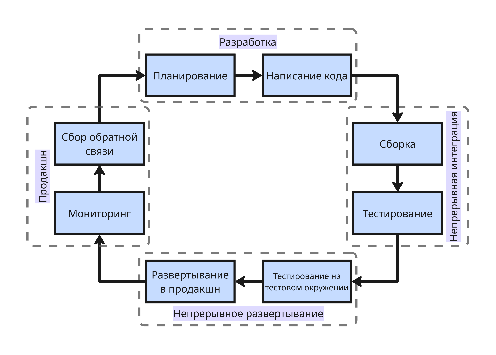
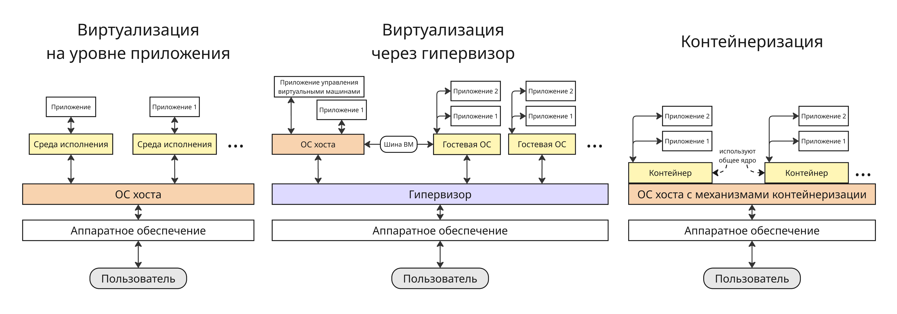

# Технологии сборки и развертывания программного обеспечения (DevOps). Трек от Nexign

В курс будет входить изучение DevOps-технологий, необходимых для непрерывных сборки и развертывания ПО, таких как Docker, Ansible, Kubernetes и виртуальные машины

## Лекция 1. Введение

DevOps (от англ. **Dev**elopment & **Op**eration**s**) - методология автоматизации технологических процессов сборки, настройки и развертывания программного обеспечения

До выделения DevOps, как отдельной области, разработка и развертывание ПО в каскадной модели разработки проходили в 3 этапа:

1. Разработчики разрабатывают ПО, стремясь как можно быстрее внедрять новые функции и изменения
2. Тестировщики тестируют ПО
3. Системные администраторы запускают ПО в эксплуатацию и отвечают за стабильность работающей системы и поэтому неохотно принимают любые обновления, способные её сломать

Такой цикл работал медленно, так как зачастую разработчики, тестировщики и сисадмины - это разные отделы, работающие по отдельности в разных комнатах и использующие разные среды исполнения, из-за чего результат у разработчиков, тестировщиков и сисадминов отличались

С появлением гибкой модели Agile и необходимость обновлять проект очень часто появилась потребность согласовать процессы разработки (development), тестирования и эксплуатации (operations) ПО

DevOps появился в конце 2000-ых годов как решение проблемы плохого взаимодействия между разработчиками ПО и специалистами по системному администрированию (эксплуатации)

Область DevOps развилась благодаря тому, что специалисты перестали быть изолированными отделами и превратились в единую команду, что стало необходимым из-за перехода к гибкой разработки

---

Ключевая концепция DevOps заключается в непрерывной интеграции и непрерывной доставке (CI/CD, Continuous Integration и Continuous Delivery/Deployment)

Цикл разработки получается таким:

* Планирование изменений и нововведений
* Разработчики пишут код и запускают модульные тесты, статические анализаторы кода на своих компьютерах
* Происходит интеграция, автоматически запускается сборка и все модульные и интеграционные тесты
* Далее тестировщики в тестовой среде проводят тесты пользовательского интерфейса, сквозные тесты и стресс-тестирование
* В продакшн-среде развертывается рабочее и стабильное приложение, которое поступает конечному пользователю
* Продакшн-среда производит мониторинг приложения: собирает логи, метрики и другое
* Пользователь дает обратную связь, которая анализируется маркетологами, аналитиками, прочими специалистами, которые создают техзадание разработчикам, и цикл начинается заново

Роль DevOps-инженера в этом цикле - это строить конвейер автоматизации, управлять инфраструктурой и конфигурациями так, что развертывание происходит эффективно и стабильно

---

В основе работы с аппаратным обеспечением стоит операционная система. Операционная система, а именно ядро, имеет алгоритмы, которые распределяют ресурсы аппаратного обеспечения разным программам

Подробнее об этом описано в курсе ["Операционные системы"](https://pelmesh619.github.io/itmo_conspects/opersys/opersys_superconspect.html)

Чтобы абстрагировать среды исполнения от аппаратного обеспечения, используют виртуализацию. Всего можно выделить 3 применяющихся метода:

* Виртуализация на уровне приложения

    Виртуализация на уровне приложения - технология, которая изолирует приложение от операционной системы, позволяя ему работать в собственной среде. Такая среда является прослойкой между приложением и ОС, изолирующая приложение и перенаправляющая запросы от приложения к ОС

    Такой средой исполнения может быть отдельное ПО (например, Microsoft App-V или VMware ThinApp) или виртуальная машина, запускающая байт-код языка программирования (например, Java Virtual Machine)

* Виртуализация через гипервизор

    Гипервизор - специальное ПО, которое распределяет физические ресурсы между ОС хоста и гостевыми ОС, на которых запущены изолировано друг от друга приложения

    Подробнее об этом описано в курсе ["Операционные системы"](https://pelmesh619.github.io/itmo_conspects/opersys/opersys_superconspect.html#-%D1%82%D0%B5%D1%85%D0%BD%D0%BE%D0%BB%D0%BE%D0%B3%D0%B8%D0%B8-%D0%B2%D0%B8%D1%80%D1%82%D1%83%D0%B0%D0%BB%D0%B8%D0%B7%D0%B0%D1%86%D0%B8%D0%B8)

* Контейнеризация

    Контейнеризация позволяет использовать один и тот же код ядра, не используя абстракцию в виде гипервизора, что экономит ресурсы процессора и оперативную память. Контейнеры, запускающие среды исполнения и приложения, представляют из себя процессы, которые изолированы между собой с помощью механизмов ядра ОС

    Подробнее о механизмах контейнеризации в Linux описано в курсе ["Администрирование ОС Linux"](https://pelmesh619.github.io/itmo_conspects/admlinux/admlinux_superconspect.html#extra-2.-%D0%BC%D0%B5%D1%85%D0%B0%D0%BD%D0%B8%D0%B7%D0%BC%D1%8B-%D0%BA%D0%BE%D0%BD%D1%82%D0%B5%D0%B9%D0%BD%D0%B5%D1%80%D0%B8%D0%B7%D0%B0%D1%86%D0%B8%D0%B8)

Все эти методы позволяют запускать приложения в разных средах исполнения, но на одном и том же физическом сервере

В больших проектах зачастую используется микросервисная архитектура, из-за чего микросервисы проще хранить в отдельных контейнерах, поэтому контейнеризация получила большее распространение
