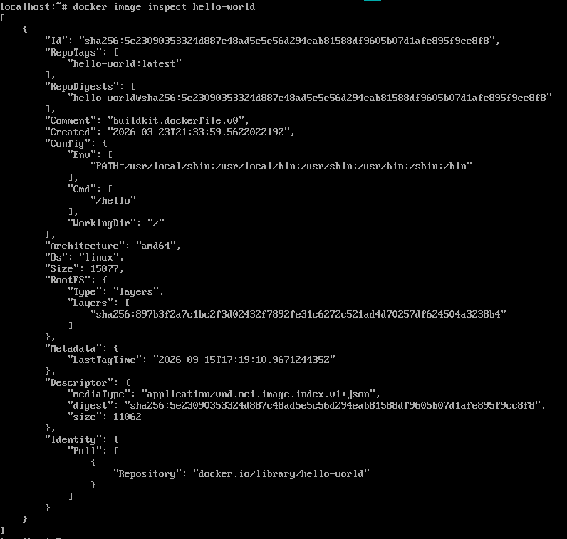

<!-- This file is generated by assets.build.markdown.superconspect_builder. All changes to it will be lost -->


# <a name="%D1%82%D0%B5%D1%85%D0%BD%D0%BE%D0%BB%D0%BE%D0%B3%D0%B8%D0%B8-%D1%81%D0%B1%D0%BE%D1%80%D0%BA%D0%B8-%D0%B8-%D1%80%D0%B0%D0%B7%D0%B2%D0%B5%D1%80%D1%82%D1%8B%D0%B2%D0%B0%D0%BD%D0%B8%D1%8F-%D0%BF%D1%80%D0%BE%D0%B3%D1%80%D0%B0%D0%BC%D0%BC%D0%BD%D0%BE%D0%B3%D0%BE-%D0%BE%D0%B1%D0%B5%D1%81%D0%BF%D0%B5%D1%87%D0%B5%D0%BD%D0%B8%D1%8F-%28devops%29.-%D1%82%D1%80%D0%B5%D0%BA-%D0%BE%D1%82-nexign"></a> Технологии сборки и развертывания программного обеспечения (DevOps). Трек от Nexign

* [Технологии сборки и развертывания программного обеспечения (DevOps). Трек от Nexign](#%D1%82%D0%B5%D1%85%D0%BD%D0%BE%D0%BB%D0%BE%D0%B3%D0%B8%D0%B8-%D1%81%D0%B1%D0%BE%D1%80%D0%BA%D0%B8-%D0%B8-%D1%80%D0%B0%D0%B7%D0%B2%D0%B5%D1%80%D1%82%D1%8B%D0%B2%D0%B0%D0%BD%D0%B8%D1%8F-%D0%BF%D1%80%D0%BE%D0%B3%D1%80%D0%B0%D0%BC%D0%BC%D0%BD%D0%BE%D0%B3%D0%BE-%D0%BE%D0%B1%D0%B5%D1%81%D0%BF%D0%B5%D1%87%D0%B5%D0%BD%D0%B8%D1%8F-%28devops%29.-%D1%82%D1%80%D0%B5%D0%BA-%D0%BE%D1%82-nexign)
  * [Лекция 1. Введение](#%D0%BB%D0%B5%D0%BA%D1%86%D0%B8%D1%8F-1.-%D0%B2%D0%B2%D0%B5%D0%B4%D0%B5%D0%BD%D0%B8%D0%B5)
  * [Лекция 2. Контейнеризация](#%D0%BB%D0%B5%D0%BA%D1%86%D0%B8%D1%8F-2.-%D0%BA%D0%BE%D0%BD%D1%82%D0%B5%D0%B9%D0%BD%D0%B5%D1%80%D0%B8%D0%B7%D0%B0%D1%86%D0%B8%D1%8F)
    * [Механизмы контейнеризации](#%D0%BC%D0%B5%D1%85%D0%B0%D0%BD%D0%B8%D0%B7%D0%BC%D1%8B-%D0%BA%D0%BE%D0%BD%D1%82%D0%B5%D0%B9%D0%BD%D0%B5%D1%80%D0%B8%D0%B7%D0%B0%D1%86%D0%B8%D0%B8)
    * [Работа с Docker](#%D1%80%D0%B0%D0%B1%D0%BE%D1%82%D0%B0-%D1%81-docker)

<!-- begin devopstech-nexign_2026_09_01.md -->
В курс будет входить изучение DevOps-технологий, необходимых для непрерывных сборки и развертывания ПО, таких как Docker, Ansible, Kubernetes и виртуальные машины

## <a name="%D0%BB%D0%B5%D0%BA%D1%86%D0%B8%D1%8F-1.-%D0%B2%D0%B2%D0%B5%D0%B4%D0%B5%D0%BD%D0%B8%D0%B5"></a> Лекция 1. Введение

DevOps (от англ. **Dev**elopment & **Op**eration**s**) - методология автоматизации технологических процессов сборки, настройки и развертывания программного обеспечения

До выделения DevOps, как отдельной области, разработка и развертывание ПО в каскадной модели разработки проходили в 3 этапа:

1. Разработчики разрабатывают ПО, стремясь как можно быстрее внедрять новые функции и изменения
2. Тестировщики тестируют ПО
3. Системные администраторы запускают ПО в эксплуатацию и отвечают за стабильность работающей системы и поэтому неохотно принимают любые обновления, способные её сломать

Такой цикл работал медленно, так как зачастую разработчики, тестировщики и сисадмины - это разные отделы, работающие по отдельности в разных комнатах и использующие разные среды исполнения, из-за чего результат у разработчиков, тестировщиков и сисадминов отличались

С появлением гибкой модели Agile и необходимость обновлять проект очень часто появилась потребность согласовать процессы разработки (development), тестирования и эксплуатации (operations) ПО

DevOps появился в конце 2000-ых годов как решение проблемы плохого взаимодействия между разработчиками ПО и специалистами по системному администрированию (эксплуатации)

Область DevOps развилась благодаря тому, что специалисты перестали быть изолированными отделами и превратились в единую команду, что стало необходимым из-за перехода к гибкой разработки

---

Ключевая концепция DevOps заключается в непрерывной интеграции и непрерывной доставке (CI/CD, Continuous Integration и Continuous Delivery/Deployment)

Цикл разработки получается таким:

* Планирование изменений и нововведений
* Разработчики пишут код и запускают модульные тесты, статические анализаторы кода на своих компьютерах
* Происходит интеграция, автоматически запускается сборка и все модульные и интеграционные тесты
* Далее тестировщики в тестовой среде проводят тесты пользовательского интерфейса, сквозные тесты и стресс-тестирование
* В продакшн-среде развертывается рабочее и стабильное приложение, которое поступает конечному пользователю
* Продакшн-среда производит мониторинг приложения: собирает логи, метрики и другое
* Пользователь дает обратную связь, которая анализируется маркетологами, аналитиками, прочими специалистами, которые создают техзадание разработчикам, и цикл начинается заново


Роль DevOps-инженера в этом цикле - это строить конвейер автоматизации, управлять инфраструктурой и конфигурациями так, что развертывание происходит эффективно и стабильно

---

В основе работы с аппаратным обеспечением стоит операционная система. Операционная система, а именно ядро, имеет алгоритмы, которые распределяют ресурсы аппаратного обеспечения разным программам

Подробнее об этом описано в курсе ["Операционные системы"](https://pelmesh619.github.io/itmo_conspects/opersys/opersys_superconspect.html)

Чтобы абстрагировать среды исполнения от аппаратного обеспечения, используют виртуализацию. Всего можно выделить 3 применяющихся метода:

* Виртуализация на уровне приложения

    Виртуализация на уровне приложения - технология, которая изолирует приложение от операционной системы, позволяя ему работать в собственной среде. Такая среда является прослойкой между приложением и ОС, изолирующая приложение и перенаправляющая запросы от приложения к ОС

    Такой средой исполнения может быть отдельное ПО (например, Microsoft App-V или VMware ThinApp) или виртуальная машина, запускающая байт-код языка программирования (например, Java Virtual Machine)

* Виртуализация через гипервизор

    Гипервизор - специальное ПО, которое распределяет физические ресурсы между ОС хоста и гостевыми ОС, на которых запущены изолировано друг от друга приложения

    Подробнее об этом описано в курсе ["Операционные системы"](https://pelmesh619.github.io/itmo_conspects/opersys/opersys_superconspect.html#-%D1%82%D0%B5%D1%85%D0%BD%D0%BE%D0%BB%D0%BE%D0%B3%D0%B8%D0%B8-%D0%B2%D0%B8%D1%80%D1%82%D1%83%D0%B0%D0%BB%D0%B8%D0%B7%D0%B0%D1%86%D0%B8%D0%B8)

* Контейнеризация

    Контейнеризация позволяет использовать один и тот же код ядра, не используя абстракцию в виде гипервизора, что экономит ресурсы процессора и оперативную память. Контейнеры, запускающие среды исполнения и приложения, представляют из себя процессы, которые изолированы между собой с помощью механизмов ядра ОС

    Подробнее о механизмах контейнеризации в Linux описано в курсе ["Администрирование ОС Linux"](https://pelmesh619.github.io/itmo_conspects/admlinux/admlinux_superconspect.html#extra-2.-%D0%BC%D0%B5%D1%85%D0%B0%D0%BD%D0%B8%D0%B7%D0%BC%D1%8B-%D0%BA%D0%BE%D0%BD%D1%82%D0%B5%D0%B9%D0%BD%D0%B5%D1%80%D0%B8%D0%B7%D0%B0%D1%86%D0%B8%D0%B8)

Все эти методы позволяют запускать приложения в разных средах исполнения, но на одном и том же физическом сервере


В больших проектах зачастую используется микросервисная архитектура, из-за чего микросервисы проще хранить в отдельных контейнерах, поэтому контейнеризация получила большее распространение
<!-- end devopstech-nexign_2026_09_01.md -->

<!-- begin devopstech-nexign_2026_09_12.md -->
## <a name="%D0%BB%D0%B5%D0%BA%D1%86%D0%B8%D1%8F-2.-%D0%BA%D0%BE%D0%BD%D1%82%D0%B5%D0%B9%D0%BD%D0%B5%D1%80%D0%B8%D0%B7%D0%B0%D1%86%D0%B8%D1%8F"></a> Лекция 2. Контейнеризация

Одним из распространенных инструментов для контейнеризации приложений является Docker. Docker использует механизмы ядра Linux, которые позволяют изолировать процессы, ограничивать ресурсы для них и использовать общее ядро

### <a name="%D0%BC%D0%B5%D1%85%D0%B0%D0%BD%D0%B8%D0%B7%D0%BC%D1%8B-%D0%BA%D0%BE%D0%BD%D1%82%D0%B5%D0%B9%D0%BD%D0%B5%D1%80%D0%B8%D0%B7%D0%B0%D1%86%D0%B8%D0%B8"></a> Механизмы контейнеризации

Этими механизмами являются пространства имен и контрольные группы:

С помощью пространств имен можно изолировать процессы друг от друга. Для этого существует 8 пространств имен:

1. Cgroup - изолирует корневую директорию контрольных групп, чтобы процесс в контейнере видел свою иерархию контрольных групп.
2. IPC (от Inter-Process Communication) - изолирует ресурсы для межпроцессного взаимодействия (такие как очереди сообщений или разделяемая память)
3. Network - изолирует сетевые устройства, стеки, порты и таблицы маршрутизации
4. Mount - изолирует точки монтирования файловых систем
5. PID (от Process ID) изолирует пространство идентификаторов процессов. Процесс внутри контейнера видит только свои процессы и считает, что его идентификатор равен 1, а не реальному идентификатору на хосте
6. Time - изолирует системное время, позволяя контейнеру иметь своё представление о времени (появилось в Linux 5.6)
7. User - изолирует идентификаторы пользователей и групп, что позволяет процессу в контейнере быть пользователем `root` внутри контейнера
8. UTS (от UNIX Time-Sharing System) - изолирует имена хоста и домена NIS (Network Information Service, системы для распространения конфигурации между несколькими узлами)

Пространства имен можно создавать с помощью утилиты `unshare`:

```bash
sudo unshare --uts /bin/bash
```

Оболочка Bash запуститься в окружении в изолированном пространстве UTS. Для создания пространств имен используются флаги `--ipc`, `--mount`, `--net`, `--pid`, `--uts`, `--user`, `--cgroup`, `--time`

Для создания контейнеров интересны три пространства: PID, Network и Mount

* Чтобы создать пространство имен идентификаторов процессов, можно использовать команду:

    ```bash
    sudo unshare --pid --mount-proc --fork /bin/bash
    ```

    Без флага `--fork` только дети процесса `/bin/bash` будут иметь новое пространство, а флаг `--mount-proc` автоматически создает пространство имен Mount и монтирует виртуальную файловую систему `/proc` для корректной работы утилит `ps` и других

    После выполнения команды процесс `/bin/bash` будет иметь идентификатор 1

* Чтобы создать сетевое пространство имен, используется команда:

    ```bash
    sudo unshare --net /bin/bash
    ```

    Такой способ применятся, если нужно, чтобы пространство имен имело срок жизни, определенный процессом `/bin/bash`. Для большей персистентности используют команду:

    ```bash
    ip netns add <имя-нового-пространства>
    ```

    Далее исполняемый файл можно запустить с помощью команды:

    ```bash
    ip netns exec <имя-нового-пространства> /bin/bash
    ```

    Процессы в этом пространстве будут иметь свой список сетевых интерфейсов. Для общения процессов из пространства обычно создают виртуальный сетевой мост, который перенаправляет запросы из контейнера на существующие в операционной системе сетевые интерфейсы

* Для изоляции точек монтирования используется команда:

    ```bash
    unshare --mount /bin/bash
    ```

    Процесс `/bin/bash` получит свою таблицу с точками монтирования

    ---

    Далее для изоляции файловой системы используется команда `chroot` (от *ch*ange *root*). Для этого создается директория, которая станет будущим корнем, и в нужном окружении выполняется команда:

    ```bash
    chroot <новый-корень>
    ```

    Процессы после выполнения `chroot` будут видеть `<новый-корень>` как `/`

    Более современным способом является команда `pivot_root`, которая перемещает корневую файловую систему текущего процесса в другую директорию, а на её место монтирует новую. Этот системный вызов предпочтительнее для контейнеров, так как он позволяет корректно размонтировать старую корневую файловую систему и обеспечивает более строгую изоляцию

Чтобы ограничивать ресурсы процессора, ОЗУ, ПЗУ и прочего, используется механизм контрольных групп. Для создания контрольных групп есть три способа:

* Использование виртуальной файловой системы `/sys/fs/cgroup`. Для этого нужно:

    1. Для новой группы создать директорию:

        ```bash
        sudo mkdir /sys/fs/cgroup/my-group
        ```

        Созданная директория наполнится нужными файлами. Группы могут выстраивать иерархию с наследованием ограничений

    2. Настроить лимиты в нужных файлах

    3. Запустить процесс и поместить его в группу - для этого нужно записать идентификатор процесса в файл `cgroup.procs`:

        ```bash
        echo $APP_PID | sudo tee /sys/fs/cgroup/my-group/cgroup.procs
        ```

* Использование функций системы инициализации `systemd`

    ```bash
    systemd-run --scope --pids-max=100 --memory-max=2G --unit=my-limited-app.service <команда>
    ```

    Здесь указаны: максимальное число процессов в группе, максимальный объем ОЗУ, имя создаваемой службы и исполняемая команда. Указание имени позволяет управлять службой в рамках `systemd`

    Другим способом является создание файла, который описывает службы и наложенные на нее ограничения:

    ```ini
    # /etc/systemd/system/myapp.service

    [Unit]
    Description=My Application
    # ...

    [Service]
    # ...
    MemoryMax=1G
    CPUWeight=100
    ```

* Через утилиты пакета `libcgroup`

    1. Для создания группы используется команда

        ```bash
        sudo cgcreate -g cpu,memory:/my_group
        ```

        Здесь `cpu,memory` - это контроллеры, которые ограничивают ресурсы в контрольной группе

    2. Далее задаются лимиты (например, ОЗУ):

        ```bash
        sudo cgset -r memory.limit_in_bytes=500M my_group
        ```

    3. А затем исполняется команда внутри контрольной группы:

        ```bash
        sudo cgexec -g cpu,memory:/my_group firefox &
        ```

### <a name="%D1%80%D0%B0%D0%B1%D0%BE%D1%82%D0%B0-%D1%81-docker"></a> Работа с Docker

В Docker управлением контейнерами занимается демон `containerd`. Этот демон управляется утилитой командной строки `docker-cli`

Чтобы создать контейнер в Docker, нужен соответствующий образ. Образ контейнера содержит нужные файлы для процесса, включая зависимости нужных версий

Образы можно создавать, а можно использовать готовые образы из репозитория, которые включают нужное приложение. Чтобы запустить образ, используется команда:

```bash
docker run hello-world
```

Здесь `hello-world` - минимальный образ, который был загружен из репозитория Docker Hub (<https://hub.docker.com/_/hello-world>). При запуске запускается контейнер, который выводит обучающую информацию о Docker

Чтобы создать образ, используется `Dockerfile` - специальный файл, который описывает создание образа. Например, для `hello-world` файл `Dockerfile` выглядит так:

```Dockerfile
FROM scratch
COPY hello /
CMD ["/hello"]
```

Здесь инструкциями указано, что:

1. Образ основан на другом образе `scratch` (который представляет из себя пустой образ)
2. Далее копируется исполняемый файл `hello` в корень контейнера
3. А затем запускается команда `/hello`

В `Dockerfile` также могут использоваться другие команды ([\*тык\*](https://docs.docker.com/reference/dockerfile/))

Далее используется команда:

```bash
docker build -t hello-world:v1 .
```

Здесь `hello-world:v1` - это имя и версия образа, а `.` - корневой путь контейнера, относительно которого выполняются команды в `Dockerfile`. По умолчанию `docker build` будет искать файл `./Dockerfile`, но можно указать флагом `-f ./otherfolder/Dockerfile` другое местоположение

Чтобы узнать список загруженных и созданных образов, используется команда `docker images`:

```text
IMAGE                ID           DISK USAGE   CONTENT SIZE   EXTRA
hello-world:latest   5e2309035332     25.9kB         9.49kB    U
```

Здесь указаны идентификатор образа и объем на диске

Команда `docker image inspect <image-name>:<version>` позволяет изучить образ:



Сам образ представляет из себя слои. Каждая инструкция в `Dockerfile` представляет слой, который описывает изменения файловой системы в образе. Далее после применения инструкции из `Dockerfile` запоминается хеш слоя

Если какая-либо команда в `Dockerfile` изменилась, то Docker берет предыдущий слой, на основе которого собирает новый образ. При запуске контейнера весь образ остается в режиме "только для чтения" - последующие изменения файлов в ходе работы контейнера сохраняются в слое контейнера, а при чтении используется механизм объединенной файловой системы

Далее образ можно запустить:

```bash
docker run -d -p 8000:80 --name <container-name> <image-name>
```

Здесь применены флаги:

* `-d` (от detached) означает, что контейнер запускается в отсоединенном режиме
* `-p` означает, что порт `8000` локальной машины соотносится с портом `80` контейнера для доступа контейнера к сети
* `--name` устанавливает имя контейнера
<!-- end devopstech-nexign_2026_09_12.md -->

