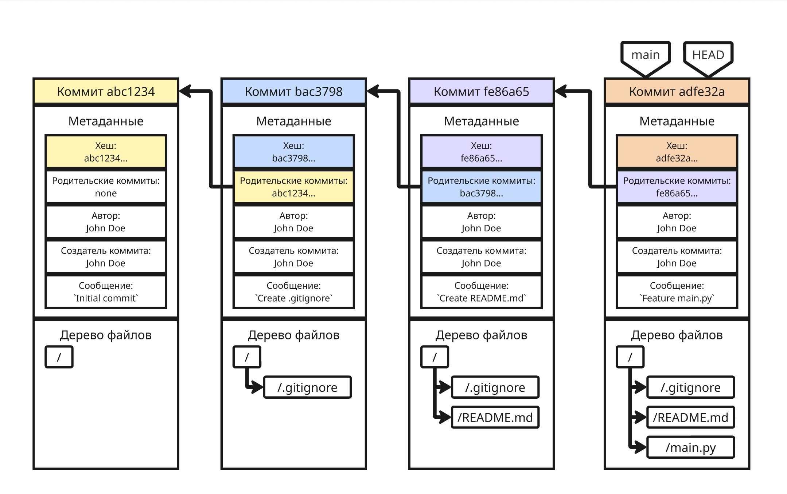
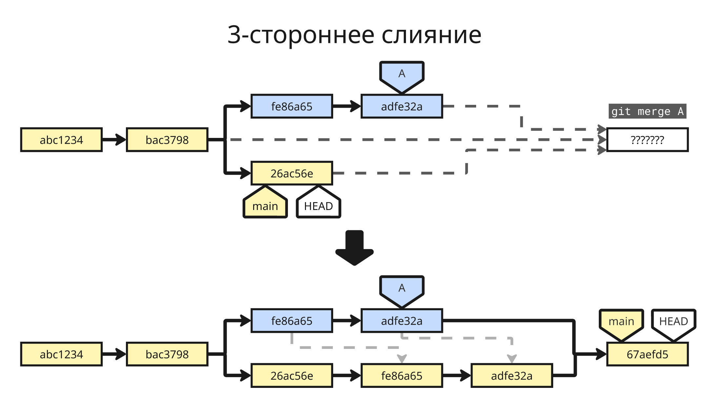
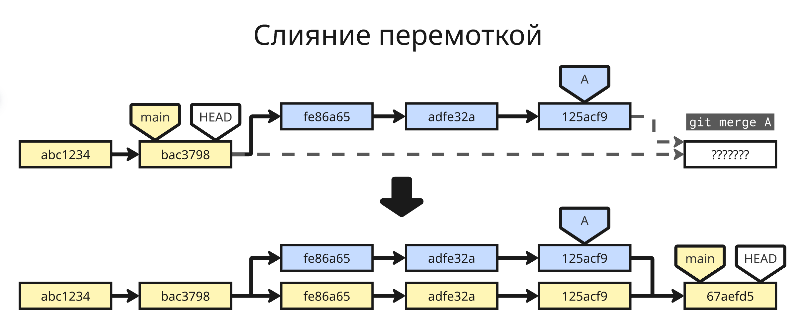
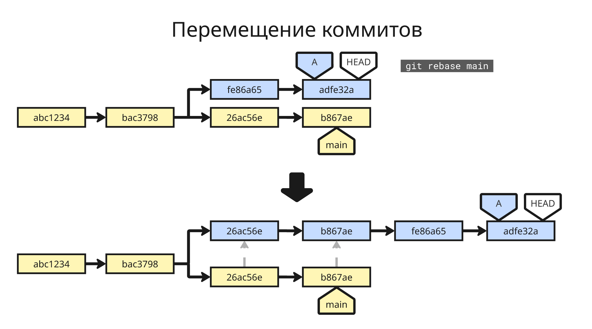
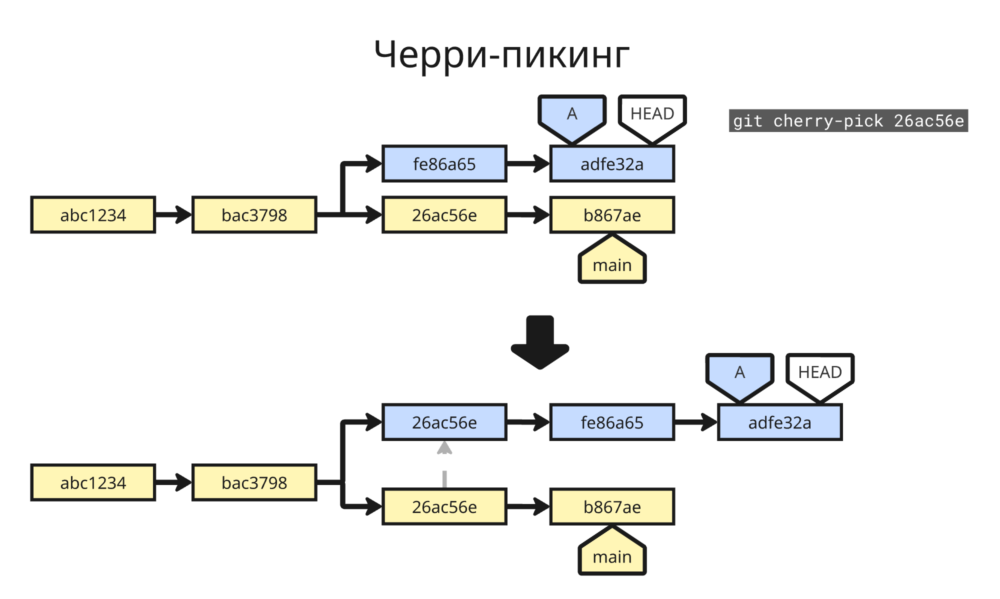

## Система версионного контроля

В процессе разработки любого проекта часто возникает необходимость фиксировать изменения, экспериментировать с новыми идеями, параллельно работать над разными задачами и объединять результаты труда нескольких специалистов. Системы контроля версий (VCS, Version Control System) решают эти задачи, предоставляя структурированный и автоматизированный подход к управлению изменениями

При работе с проектом одному VCS может не пригодиться, но при работе в команде система позволяет откатить какие-либо изменения какого-либо разработчика. Сейчас самой распространенной является Git, разработанная Линусом Торвальдсом в 2005 году для разработки Linux

До этого существовала локальная система Subversion, и она работала так:

1) Система загружает файл в базу данных
2) При изменениях файла в базу данных заносятся конкретные его изменения (так называемая дельта или дифф)

На локальном сервере хранилась эта база данных, администратор которой давал доступ к отдельным модулям (условно папкам) проекта разработчикам.

С приходом интернета появились удаленные серверы, но у них была проблема: при сбои сервера могла возникнуть потеря исходных данных. С Git пришла возможность скачивать весь проект на локальную машину и уже с ней работать. Таким образом, упростилась разработка, но появилась проблема безопасности и риск утечки информации.

Но на самом деле Git сохраняет не изменения файлов, а снапшоты – представим, что в системе 500 коммитов, если мы хотим откатиться, системе придется проходиться по этим 500 коммитам. Git сохраняет файл, если он был изменен, а если не был изменен, то оставляет ссылку на тот файл, где он был в последний раз изменен

Сейчас существуют 3 популярные хостинга, поддерживающие Git:

* GitHub, сейчас во владении Microsoft
* BitBucket (он же в прошлом Stash) от Atlassian
* GitLab

Git можно скачать с официального сайта <https://git-scm.com/>

У Git есть командный интерфейс. Перед тем, как начать работать с Git, нужно создать git-репозиторий в рабочей директории командой:

```shell
git init
```

После этого можно совершать коммиты. **Коммит** (от commit - совершать, фиксировать) – информация о фиксации репозитория

Коммит содержит информацию об авторе коммита, дате, измененных файлах и т. д. Перед созданием коммита нужно добавить измененные файлы в локальный индекс Git командой:

```shell
git add script.py
```

Также можно добавить файлы, которые совпадают с паттерном: ```git add *.py```. Или добавить все текущие файлы: ```git add -A``` или ```git add .```. Таким образом, файлы в системе могут иметь три состояния:

* Измененные (modified) - содержимое таких файлов изменено, но файлы не добавлены в индекс Git
* Подготовленные (staged) - файлы добавлены в индекс Git для последующего коммита
* Закоммитенные (committed) - изменения подготовленных файлов были успешно зафиксированы в базе данных

Командой ```git status``` можно посмотреть измененные и добавленные в Git файлы

После этого можно сделать коммит командой `git commit -m "added hello.py"`

Параметр `-m “added hello.py”` обозначает сообщение коммита. Сообщение должно быть у каждого коммита для того, чтобы другие разработчики понимали вкратце, какие изменения внесены этим коммитом

При первой встрече Git может пожаловаться на то, что у вас нет учетной записи – система не позволяет делать анонимные коммиты, поэтому надо внести данные о себе:

```shell
git config --global user.email "почта@example.com"
git config --global user.name "Имя"
```

Также параметр `--add` в команде `git commit --add` позволяет автоматически закоммитить подготовленные файлы, которые были добавлены ранее с помощью `git add`

Все данные в Git хранятся в виде 4 объектов:

* Блоб (blob, от Binary Large OBject) хранит в себе содержимое файла в бинарном виде. Все файлы проекта в разные моменты времени хранятся как блобы
* Дерево (tree) представляет собой директорию репозитория. В дереве хранятся указатели на блобы и поддеревья
* Коммит представляет собой:
    1. Ссылку на корневое дерево снапшота, повторяющее файловую структуру репозитория, где вместо файлов ссылки на актуальные блобы, вместо директорий - другие деревья
    2. Метаданные, то есть автора изменений, автора коммита, сообщение, описание и так далее
    3. Ссылки на один или несколько коммитов для построения истории
    4. Хеш коммита, вычисляющийся на основе предыдущих данных
* И тег - указатель на конкретный коммит. Теги используются, например, для метки номерной версии проекта:

    ```shell
    git tag -a v1.0 -m "Версия 1.0: бла-бла-бла"
    ```



Чтобы переключатся между разными коммитами, можно воспользоваться командой:

```shell
git checkout хеш_коммита
```

Особый тег `HEAD` указывает на текущий, выбранный командой `checkout`, коммит. Команда `git log` позволяет посмотреть всю историю коммитов, а `git log хеш_коммита1..хеш_коммита2` - ее отрезок в указанных пределах. С помощью `git show хеш_коммита` можно посмотреть информацию о коммите

Помимо тегов существуют и другие указатели на коммиты - ветви. Ветви (branch) позволяют создавать параллельные изменения в проекте. По умолчанию все коммиты происходят в ветви `main` (или `master`). В отличии от тегов ветви - двигающиеся указатели

Ветви позволяют редактировать весь проект, добавлять экспериментальные функции, но при этом не трогая главный стабильный код

Создать ветку можно с помощью команды `git branch dev`. Чтобы перейти на эту ветку, можно воспользоваться командой `git checkout dev`. В этой ветке мы можем делать коммиты, которые не затронут основную ветвь `main`. Чтобы удалить ветку, можно воспользоваться командой `git branch -d dev`


Самое интересное, что можно делать слияние веток (или мердж, от merge). Когда все изменения зафиксированы в экспериментальной ветке, ее коммиты можно слить в главную или любую другую:

```shell
git checkout main
git merge dev
```

Если найдутся файлы, у которые на одинаковых строчках разное содержимое, Git предложит вручную решить конфликт. Для решения конфликтов слияния, Git помещает в файлы метки такого типа:

```text
<<<<<<< HEAD
Текст из текущей ветки
=======
Текст из сливаемой ветки
>>>>>>> branch-name
```

Удаление этих меток и сохранению нужного содержания даст понять системе Git, какую версию оставить в финальном коммите. Помимо ручного изменения можно принять изменения конкретной ветки для всего файла:

```shell
# Принять версию текущей ветки (то есть HEAD)
git checkout --ours file.txt

# Принять версию сливаемой ветки
git checkout --theirs file.txt
```

или использовать специальные утилиты для слияния, такие как vimdiff или прямо в среде разработке. Потом измененные файлы нужно добавить с помощью `git add` и закоммитить с помощью `git commit`. Слияние тоже представляет из себя коммит

Новые ветки полезны для исправления багов – баг можно исправить в тестовой ветке, а потом слить ее в основную

Всего различают 2 вида слияния:

* 3-стороннее слияние (3-way merge) – две ветки параллельно развивались, а файл при мерже изменяется на основе 3 версий: версии с основной ветки, версии с второй и версии файла, которая была в момент разветвления

    

* Слияние перемоткой (Fast-forward merge) – основная ветка не развивалась, поэтому изменения с дополнительной ветки просто накатываются на основную

    

Также, если нужно актуализировать стороннюю ветку неконфликтующими изменениями из другой, применяют команду `git rebase название_ветки` в сторонней, которая копирует коммиты из другой в стороннюю



Если нужно копировать отдельный коммит из одной ветки в другую (то есть совершить [черри-пикинг](https://ru.wikipedia.org/wiki/%D0%92%D1%8B%D0%B1%D0%BE%D1%80%D0%BE%D1%87%D0%BD%D0%BE%D0%B5_%D0%BF%D1%80%D0%B5%D0%B4%D1%81%D1%82%D0%B0%D0%B2%D0%BB%D0%B5%D0%BD%D0%B8%D0%B5_%D1%84%D0%B0%D0%BA%D1%82%D0%BE%D0%B2)), можно применить `git cherry-pick хеш_коммита1 хеш_коммита2`, которая копирует изменения из указанного коммита и создаёт новый коммит в текущей ветке



---

Если репозиторий находится на удаленном сервере (например, на GitHub), то его можно склонировать на локальный компьютер:

```shell
git clone https://github.com/pelmesh619/itmo_conspects.git
```

После этого совершенные коммиты можно отправить на сервер при помощи команды `git push` или `git push origin`, если к репозиторию есть доступ на платформе. Здесь `origin` - это адрес удаленного сервера, `origin` обозначает адрес, из которого репозиторий был склонирован

Внутри Git создаются отдельные ветви с префиксом `origin/` (например, `origin/main` или `origin/dev`), которые показывают, где находятся ветви на сервере при последнем обновлении

А чтобы подтянуть изменения других разработчиков из сервера, используют эти команды:

* `git fetch` только загружает изменения с сервера ветвей с префиксом `origin/`, не изменяя рабочий код

* `git pull` загружает и применяет изменения, то есть делает слияние ветви `origin/XYZ` в ветвь `XYZ`

    По умолчанию, если в репозитории на локальном компьютере и на удаленном сервере есть разные, но не конфликтующие коммиты, `git pull` делает коммит слияния. Чтобы история коммитов выглядела чище и понятнее для просмотра, рекомендуется сначала сделать `git pull --rebase`

Хостинги обычно предусматривают возможно сделать форк репозитория (от fork - вилка). Контрибутор может сделать форк репозитория другого пользователя, внести нужные изменения, а затем сделать пулл реквест (_pull request_ в GitHub или _merge request_ в GitLab - запрос на слияние). Далее владелец репозитория рассматривает изменения (делает ревью кода) и выносит вердикт - сливать ветвь или нет. Таким образом, происходит вклад других пользователей в open-source проекты
