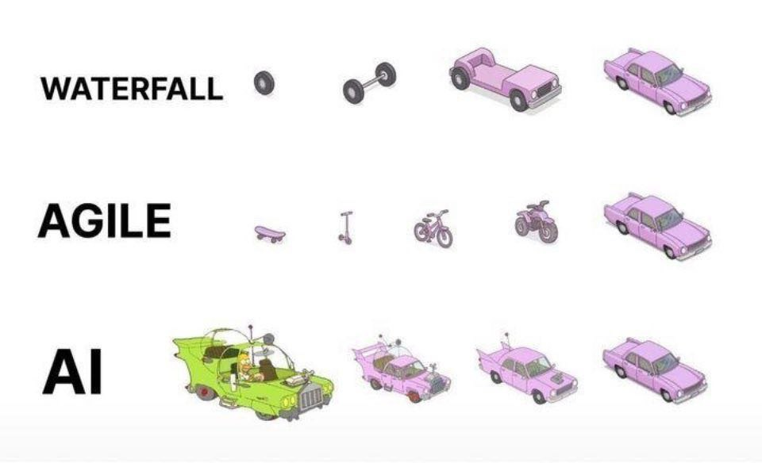

## Методология разработки

Большую роль в разработке программного обеспечения играет планирование этапов разработки и работы команды разработчиков. В ходе многолетней истории IT-индустрии сформировались готовые фреймворки - модель процесса разработки, которым следует команда для создания надежного и завершенного продукта

### Каскадная модель

Каскадная модель, также известная как модель "Водопад" (Waterfall model), была описана в статье Уинстона Уокера Ройса в 1970 году. Она представляла собой прямой "поток" из следующих этапов:

1. Определение требований
    На этом этапе анализируются требования заказчика. Позже составляется техническое задание, которое согласуется с заказчиком

2. Проектирование
    На основе требований архитекторы и разработчики создают технический дизайн системы: выбираются технологии, проектируется архитектура, схемы баз данных и интерфейсы. Результат - набор проектных документов.

3. Конструирование
    Непосредственно написание кода программистами строго в соответствии с документацией, созданной на этапе проектирования

4. Тестирование и отладка
    Готовый продукт передается тестировщикам, которые проверяют его на соответствие требованиям, ищут ошибки и дефекты

5. Инсталляция
    Развертывание продукта на рабочих серверах или его публикация в магазинах приложений. Система передается заказчику и конечным пользователям для повседневного использования

6. Поддержка
    Постоянная фаза, на которой команда исправляет вновь обнаруженные ошибки, обеспечивает работоспособность системы и, в очень ограниченном объеме, может добавлять незначительные улучшения

Количество этапов и их содержание может строго не соблюдаться. 

Ключевой принцип "водопад" - этапы идут строго последовательно

Из плюсов "водопада":

* Простота понимания и управления
* Четкий план и структура на весь проект - легко подсчитать бюджет и человекочасы проекта
* На выходе получается хорошая документация
* Легко измерить прогресс (прошли ли мы фазу или нет)

Из недостатков:

* Структура очень негибкая - изменения требований в середине проекта крайне затратны
* Пользователь видит результат только в самом конце, что может привести к разочарованию
* Высокие риски, так как тестирование тоже происходит в конце, и все ошибки проектирования всплывают поздно.

Каскадная модель подходит для проектов с жесткими требованиями, сроками и бюджетом (госзаказы, критичные системы с жестким регулированием)

### Agile

Agile представляет собой принципы "гибкой" разработки. Эти принципы были описаны в [манифесте Agile](https://agilemanifesto.org/iso/ru/manifesto.html) в 2001 году. В нем были сформулированы главные ценности:

1. Люди и взаимодействие важнее процессов и инструментов
2. Работающий продукт важнее исчерпывающей документации
3. Сотрудничество с заказчиком важнее согласования условий контракта
4. Готовность к изменениям важнее следования первоначальному плану

На основе принципов Agile появились конкретные фреймворки для разработки ПО

### Scrum

Подход был описан в 1986 году: небольшие команды, состоящих из разных специалистов, справлялись лучше. Позже подход был назван Scrum - термин из регби, обозначающий схватку или толкотню

Scrum позволяет за небольшие промежутки времени - спринты - вести разработку и предоставлять рабочий продукт с новыми бизнес-возможностями конечному пользователю

В конце спринта, который длится несколько (от 1 до 4) недель, команда встречается на совещании результатов спринта с заказчиком - так называемый ревью спринта. Небольшая длительность спринта позволяет снизить риски сделать что-то не так и сделать продукт, более подходящий заказчику

В подходе Scrum существует Scrum-мастер - человек, который проводит митинги и следит за соблюдением принципов Scrum

Ключевые понятия Scrum:

* Беклог проекта (Project Backlog) - живой список всех пожеланий и требований к продукту
* Беклог спринта (Sprint Backlog) - список задач, выбранных командой для выполнения в текущем спринте
* Стендап (или дейлик, от Daily Stand-up) - ежедневные 15-минутные встречи команды для синхронизации ("что сделал вчера? что сделаю сегодня? какие есть препятствия?")
* Sprint Retrospective - встреча команды для обсуждения, что прошло хорошо, а что можно улучшить в процессе.

Scrum подходит для проектов с нечеткими или часто меняющимися требованиями, где важна быстрая обратная связь от пользователя (стартапы, веб-приложения, мобильная разработка)

### Канбан

Канбан (от японского "рекламный щит") является другой Agile-медотолодией. В канбане процесс разработки должен быть наглядным и прозрачным для разработчиков. Канбан жестко ограничивает количество задач, находящихся в работе. Это достигается тем, что задачи расположены на ограниченной канбан-доске, тем самым отсутствует многозадачность у работников

В канбане нет жестких ролей и фиксированных спринтов, в отличии от Scrum. Задачи поступают в работу по мере освобождения ресурсов. Более гибкий и постепенный подход к изменениям

Канбан подходит для осуществления поддержки и доработки существующих продуктов, проектов с постоянным и непредсказуемым потоком задач

---

Чаще всего применяются гибридные модели разработки. Например в крупных игровых компаниях существует такая модель:

1. Идеация: брейншторминг новых идей и механик для проекта, составление прототипов
2. Препродакшен: составление документа геймдизайна, прототипирование механик
3. Продакшен: разработка, плейтесты
4. Постпродакжен: фикс багов, подготовка к релизу

Однако на этапах препродакшена и продакшена действует итеративная модель: разрабатывается прототип, проводятся их плейтесты, собирается обратная связь, игровые механики изменяются на основе обратной связи
