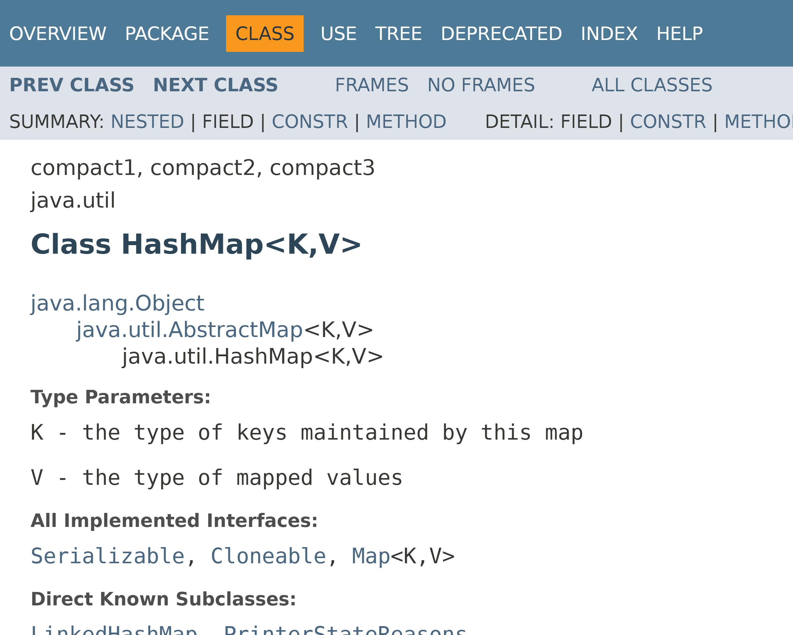

## Документация и базы знаний

В крупных IT-компаниях могут работать тысячи сотрудников. Над одним проектом обычно работает несколько десятков человек, в то время как над проектированием архитектуры - всего пара ключевых специалистов.

Поэтому критически важно фиксировать знания, полученные в ходе разработки. Если ключевой разработчик уходит из проекта или проект передается другой команде, знания также должны быть записаны

---

В IT-индустрии знания могут быть разбиты на 4 уровня:

1. Данные - сырые объективные данные и факты без явного контекста, такие как записи журналов запросов или поток битов
2. Информация - данные, обработанные и структурированные для понимания контекста, например, отчет об ошибках, график нагрузки на сеть
3. Знания - понимание закономерностей, принципов и причинно-следственных связей на основе информации

    Знания представляет собой ответы на вопросы "как?" и "почему?", то есть механизм использования, например, "в 21:00 начинается рекламная пауза, жители включают электрические чайники, из-за чего вырастает потребление электроэнергии, поэтому нужно [быстро ввести резервные источники энергии](https://en.wikipedia.org/wiki/TV_pickup)"

4. Мудрость или экспертиза - способность применять знания для стратегического выбора, предвидения проблем и создания инноваций

    Мудрость - ответ на вопрос "Что делать в будущем?", то есть условия использования, например, для приложений, ориентированных на большую аудиторию, целесообразнее выбрать микросервисную архитектуру для простоты масштабируемости

Вместе эти 4 уровня образуют пирамиду DIKW (Data, Information, Knowledge, Wisdom)

В контексте информационных технологий знания - это:

* Документация: как устроены сигнатуры функций, для чего созданы те или иные классы, как делаются базовые задачи в созданных компанией библиотеках
* История решений и мотивация: почему выбрали те или иные технологии
* Процессы в команде
* Договоренности, например, стандарт оформления кода

---

Где же могут храниться знания?

1. Непосредственно код и тесты

    Комментарии в коде могут содержать формат функций и классов, примеры использования и мотивацию тех или иных решений

    Тесты также могут рассказать то, как система должна себя вести, какие граничные условия важны и как разные компоненты взаимодействуют

2. Системы версионного контроля

    Системы контроля версий содержат исторические знания, коммиты могут в описании указывать на исправления багов и добавление функций

    Хостинги, такие как GitHub и GitLab, имеют функцию отправки вопросов и проблем (issue) и пулл реквестов для данного репозитория, которые содержат обсуждения проблем и контекст принятия решений

3. Внутренние вики-системы

    Википедия имеет движок с открытым исходным кодом, поэтому любой желающий может создать свою Википедию

    Помимо этого, существуют современные системы управления знаниями, такие как Notion, Confluence (от Atlassian) или встроенная Wiki в GitHub/GitLab

    Вики-системы содержат вступительные материалы для новичков (как настроить окружение и так далее), архитектурные решения (ADR, Architecture Decision Records), описания бизнес-процессов, инструкции по эксплуатации и глоссарии (термины проекта)

4. Системы документирования кода

    Для популярных языков существуют фреймворки, например, javadoc для Java, которые превращают комментарии в коде в готовые веб-страницы документаций

    

    Для небольших проектов папки `docs` с файлами на языке Markdown достаточно. Если что-то пришлось объяснять дважды, то самое время это задокументировать

5. Базы инцидентов

    Инциденты также должны быть задокументированы для их предотвращения. Для такого используются OpsGenie и другие системы

---

Для работы со знаниями следует помнить следующие принципы:

1. "Документация как код" (Docs as Code)

    Документация хранится в Git, проходит код-ревью и автоматически деплоится

2. Единый источник истины - знания должны храниться в одном месте

3. Знания должны быть находимыми, для этого должна быть единая система поиска и чёткая структура папок

4. Знания должны быть актуальными

5. Культура обмена знаниями

    Знания должны активно распространяться, а не просто храниться. Это включает: регулярные техдоки (tech talks), парное программирование, код-ревью как обучение, внутренние блоги и "обеды с обучением" (lunch & learn)

---

В компаниях для управления знаниями существуют отведенные роли:

1. Технический писатель (Technical Writer)
    
    Пишет документацию для пользователей, редактирует технические тексты, создаёт туториалы

2. Технический амбассадор (Developer Advocate)
    
    Делится знаниями внутри компании, готовит материалы для конференций и помогает с введением в курс дела новых сотрудников

3. Менеджер знаний (Knowledge Manager)

    Отвечает за систему управления знаниями, следит за актуальностью, обучает сотрудников работать с базой знаний

4. В конечном счете, каждый разработчик должен документировать свой код, писать понятные сообщения в коммитах и делиться знаниями в чатах и на собраниях
