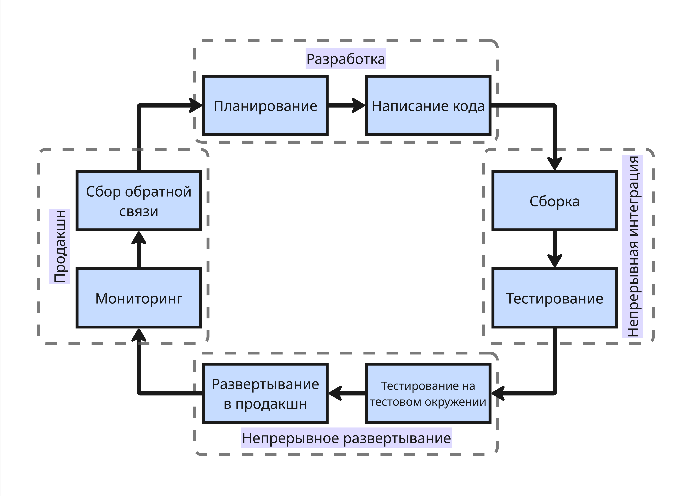

## Непрерывное интеграция и непрерывная доставка

CI/CD (Continuous Integration и Continuous Delivery/Deployment) включает две основные практики, которые позволяют автоматизировать процесс разработки, тестирования и развертывания ПО. Целью CI/CD является достижение быстрого, безопасного и предсказуемого выпуска обновлений

До CI/CD традиционный подход был таковым: разработка завершается внедрение нового функционала, ручное тестирование находит баги, которые к вечеру пятницы исправляются, чтобы потом в субботу опять сломаться

Автоматизация процесса позволяет разработчику сразу же протестировать новое решение и выкатить его в продакшн, тем самым экономя очень много времени

### Непрерывная интеграция

Непрерывная интеграция (Continuous Integration, CI) - практика, которая заключается в постоянном слиянии рабочих веток в общую основную ветвь разработки и выполнении автоматизированных сборок проекта

Идея заключается в том, чтобы несколько раз в день сливать изменения всех разработчиков в основную ветку, автоматически проверяя каждое изменение

Непрерывная интеграция работает так: очередной `git push origin` приводит к автоматическому запуску процесса

1. Сборка проекта
2. Запуск модульных тестов
3. Статический анализ кода (то есть линтеры)
4. Сборка контейнера
5. Запуск интеграционных тестов

Непрерывная интеграция позволяет обнаружить баги заранее и избежать конфликтов при слиянии долго разрабатывающихся веток

### Непрерывная доставка и развертывание

Непрерывная доставка (Continuous Delivery, CD) - еще одна практика, которая заключается в автоматизированной подготовке проекта к развертыванию в продакшн. Идея в том, что каждое изменение, прошедшее непрерывную интеграцию, можно в любой момент безопасно выкатить в продакшн. Непрерывная интеграция проверяет, что код работает, а непрерывная доставка гарантирует, что его можно развернуть

Непрерывная доставка может выглядеть так: после успешной непрерывной интеграции происходят

1. Сборка артефакта (это может быть exe-файл, архив или образ Docker)
2. Развертывание на тестовом окружении (так называемом staging)
3. Автоматические E2E-тесты на тестовом окружении
4. Готовность к развертыванию в рабочей производственной среде

Непрерывное развертывание (Continuous Deployment, CD) - все то же самое, но изменения автоматически развертываются в продакшн для пользователей. То есть:

1. Непрерывная интеграция прошла успешно
2. Сборка артефакта
3. Развертывание на тестовом окружении
4. E2E-тесты на тестовом окружении
5. Автоматическое развертывание в продакшн-среде
6. Мониторинг развернутой версии

---

Для непрерывных интеграции и развертывания существует открытая платформа Jenkins. Для Kubernetes существуют платформы ArgoCD, FLux и Tekton

GitHub и GitLab предоставляют свои инструментарии для непрерывных интеграции и развертывания проектов. Так, например, GitHub Actions позволяет запускать этапы CI/CD в конфиг-файле на языке YAML для исполнения на серверах GitHub или ваших машинах

Пример файла может выглядеть так:

```yaml
# .github/workflows/deploy.yml
name: CI/CD Pipeline

# Определяем, в каких случаях CI/CD запускается автоматически
on:
  push:
    branches: [main]
  pull_request:
    branches: [main]

jobs:
  # Сборка и тестирование
  build-and-test:
    runs-on: ubuntu-latest  # ОС для запуска
    
    steps:
    # Получение кода из репозитория
    - name: Checkout code
      uses: actions/checkout@v4
    
    # Установка Node.js
    - name: Setup Node.js
      uses: actions/setup-node@v4
      with:
        node-version: '18'
        cache: 'npm'
    
    # Установка зависимостей
    - name: Install dependencies
      run: npm ci
    
    # Запуск линтера
    - name: Run linter
      run: npm run lint || echo "No lint script found, skipping"
    
    # Запуск тестов
    - name: Run tests
      run: npm test -- --passWithNoTests
    
    # Сборка проекта
    - name: Build project
      run: npm run build
      env:
        CI: false
    
    # Сохранение собранного проекта как артефакт
    - name: Upload build artifact
      uses: actions/upload-artifact@v4
      with:
        name: build-output
        path: ./dist  # Папка с собранным проектом


  # Развертывание
  deploy:
    needs: build-and-test  # Выполняется после сборки
    runs-on: ubuntu-latest
    
    # Запускается только при пуше в основную ветку
    if: github.ref == 'refs/heads/main'
    
    steps:
    # Скачиваем артефакт сборки
    - name: Download build artifact
      uses: actions/download-artifact@v4
      with:
        name: build-output
    
    # Развертываем на GitHub Pages
    - name: Deploy to GitHub Pages
      uses: peaceiris/actions-gh-pages@v3
      with:
        github_token: ${{ secrets.GITHUB_TOKEN }}
        publish_dir: ./
```

Здесь две работы: сборка-тестирование и развертывание

* Сборка включает в себя установку Node.js, зависимостей, проверку тестов и сборку в артефакт
* Развертывание включает в себя загрузку сделанного артефакта и непосредственно развертывание

Полный CI/CD цикл для коммерческих проектов может включать 8+ этапов:

* Планирование изменений и нововведений
* Написание кода и локальное тестирование
* Сборка проекта
* Тестирование и анализ кода
* Тестирование артефакта сборки в тестовой среде
* Развертывание в продакшн-среде
* Мониторинг
* Сбор обратной связи и метрик производительности, ошибок




Также существует несколько стратегий развертывания:

* Постепенное обновление (Rolling Update) - старые сущности приложений (например, Docker-контейнеры) постепенно заменяются на новые, тем самым проверяется постепенно нарастающая нагрузка на измененное приложение

* Сине-зеленое обновление (Blue-Green Update)

    Здесь есть синяя среда с работающим в продакшене кодом и зеленая среда с новым кодом. Балансировщик или маршрутизатор сразу перенаправляет весь трафик с синей среды на зеленую, тем самым обеспечивая возможность быстро отката, если зеленая среда сломается

* Канареечное обновление (Canary Release) - новая версия развернута одновременно со старой, но доступна только ограниченному ряду пользователей

* Теневое развертывание - новая версия запущена и получает реальный трафик пользователей, обрабатывает запросы параллельно со старой версией, но не возвращает ответы пользователям, что позволяет проверить производительность и стабильность в реальных условиях без риска