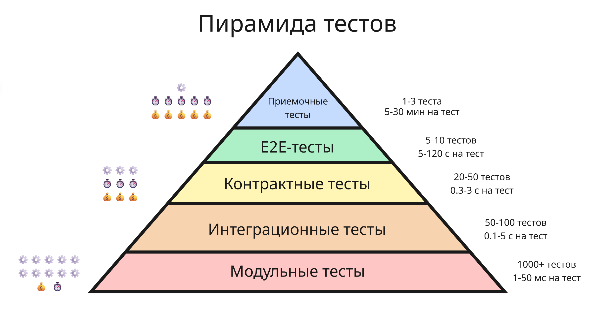

# <a name="%D0%B8%D0%BD%D1%81%D1%82%D1%80%D1%83%D0%BC%D0%B5%D0%BD%D1%82%D0%B0%D0%BB%D1%8C%D0%BD%D1%8B%D0%B5-%D1%81%D1%80%D0%B5%D0%B4%D1%81%D1%82%D0%B2%D0%B0-%D1%80%D0%B0%D0%B7%D1%80%D0%B0%D0%B1%D0%BE%D1%82%D0%BA%D0%B8-%D0%BF%D1%80%D0%BE%D0%B3%D1%80%D0%B0%D0%BC%D0%BC%D0%BD%D0%BE%D0%B3%D0%BE-%D0%BE%D0%B1%D0%B5%D1%81%D0%BF%D0%B5%D1%87%D0%B5%D0%BD%D0%B8%D1%8F"></a> Инструментальные средства разработки программного обеспечения


* [Инструментальные средства разработки программного обеспечения](#%D0%B8%D0%BD%D1%81%D1%82%D1%80%D1%83%D0%BC%D0%B5%D0%BD%D1%82%D0%B0%D0%BB%D1%8C%D0%BD%D1%8B%D0%B5-%D1%81%D1%80%D0%B5%D0%B4%D1%81%D1%82%D0%B2%D0%B0-%D1%80%D0%B0%D0%B7%D1%80%D0%B0%D0%B1%D0%BE%D1%82%D0%BA%D0%B8-%D0%BF%D1%80%D0%BE%D0%B3%D1%80%D0%B0%D0%BC%D0%BC%D0%BD%D0%BE%D0%B3%D0%BE-%D0%BE%D0%B1%D0%B5%D1%81%D0%BF%D0%B5%D1%87%D0%B5%D0%BD%D0%B8%D1%8F)
  * [Интегрированная среда разработки и дебаггер](#%D0%B8%D0%BD%D1%82%D0%B5%D0%B3%D1%80%D0%B8%D1%80%D0%BE%D0%B2%D0%B0%D0%BD%D0%BD%D0%B0%D1%8F-%D1%81%D1%80%D0%B5%D0%B4%D0%B0-%D1%80%D0%B0%D0%B7%D1%80%D0%B0%D0%B1%D0%BE%D1%82%D0%BA%D0%B8-%D0%B8-%D0%B4%D0%B5%D0%B1%D0%B0%D0%B3%D0%B3%D0%B5%D1%80)
    * [Интегрированная среда разработки](#%D0%B8%D0%BD%D1%82%D0%B5%D0%B3%D1%80%D0%B8%D1%80%D0%BE%D0%B2%D0%B0%D0%BD%D0%BD%D0%B0%D1%8F-%D1%81%D1%80%D0%B5%D0%B4%D0%B0-%D1%80%D0%B0%D0%B7%D1%80%D0%B0%D0%B1%D0%BE%D1%82%D0%BA%D0%B8)
    * [Дебаггер](#%D0%B4%D0%B5%D0%B1%D0%B0%D0%B3%D0%B3%D0%B5%D1%80)
  * [Система версионного контроля](#%D1%81%D0%B8%D1%81%D1%82%D0%B5%D0%BC%D0%B0-%D0%B2%D0%B5%D1%80%D1%81%D0%B8%D0%BE%D0%BD%D0%BD%D0%BE%D0%B3%D0%BE-%D0%BA%D0%BE%D0%BD%D1%82%D1%80%D0%BE%D0%BB%D1%8F)
  * [Методология разработки](#%D0%BC%D0%B5%D1%82%D0%BE%D0%B4%D0%BE%D0%BB%D0%BE%D0%B3%D0%B8%D1%8F-%D1%80%D0%B0%D0%B7%D1%80%D0%B0%D0%B1%D0%BE%D1%82%D0%BA%D0%B8)
    * [Каскадная модель](#%D0%BA%D0%B0%D1%81%D0%BA%D0%B0%D0%B4%D0%BD%D0%B0%D1%8F-%D0%BC%D0%BE%D0%B4%D0%B5%D0%BB%D1%8C)
    * [Agile](#agile)
    * [Scrum](#scrum)
    * [Канбан](#%D0%BA%D0%B0%D0%BD%D0%B1%D0%B0%D0%BD)
  * [Документация и базы знаний](#%D0%B4%D0%BE%D0%BA%D1%83%D0%BC%D0%B5%D0%BD%D1%82%D0%B0%D1%86%D0%B8%D1%8F-%D0%B8-%D0%B1%D0%B0%D0%B7%D1%8B-%D0%B7%D0%BD%D0%B0%D0%BD%D0%B8%D0%B9)
  * [Тестирование](#%D1%82%D0%B5%D1%81%D1%82%D0%B8%D1%80%D0%BE%D0%B2%D0%B0%D0%BD%D0%B8%D0%B5)
  * [Непрерывное интеграция и непрерывная доставка](#%D0%BD%D0%B5%D0%BF%D1%80%D0%B5%D1%80%D1%8B%D0%B2%D0%BD%D0%BE%D0%B5-%D0%B8%D0%BD%D1%82%D0%B5%D0%B3%D1%80%D0%B0%D1%86%D0%B8%D1%8F-%D0%B8-%D0%BD%D0%B5%D0%BF%D1%80%D0%B5%D1%80%D1%8B%D0%B2%D0%BD%D0%B0%D1%8F-%D0%B4%D0%BE%D1%81%D1%82%D0%B0%D0%B2%D0%BA%D0%B0)
    * [Непрерывная интеграция](#%D0%BD%D0%B5%D0%BF%D1%80%D0%B5%D1%80%D1%8B%D0%B2%D0%BD%D0%B0%D1%8F-%D0%B8%D0%BD%D1%82%D0%B5%D0%B3%D1%80%D0%B0%D1%86%D0%B8%D1%8F)
    * [Непрерывная доставка и развертывание](#%D0%BD%D0%B5%D0%BF%D1%80%D0%B5%D1%80%D1%8B%D0%B2%D0%BD%D0%B0%D1%8F-%D0%B4%D0%BE%D1%81%D1%82%D0%B0%D0%B2%D0%BA%D0%B0-%D0%B8-%D1%80%D0%B0%D0%B7%D0%B2%D0%B5%D1%80%D1%82%D1%8B%D0%B2%D0%B0%D0%BD%D0%B8%D0%B5)
  * [Лицензия ПО](#%D0%BB%D0%B8%D1%86%D0%B5%D0%BD%D0%B7%D0%B8%D1%8F-%D0%BF%D0%BE)
    * [Проприетарное ПО](#%D0%BF%D1%80%D0%BE%D0%BF%D1%80%D0%B8%D0%B5%D1%82%D0%B0%D1%80%D0%BD%D0%BE%D0%B5-%D0%BF%D0%BE)
    * [Открытое ПО](#%D0%BE%D1%82%D0%BA%D1%80%D1%8B%D1%82%D0%BE%D0%B5-%D0%BF%D0%BE)
    * [Свободное ПО](#%D1%81%D0%B2%D0%BE%D0%B1%D0%BE%D0%B4%D0%BD%D0%BE%D0%B5-%D0%BF%D0%BE)
    * [Другие лицензии](#%D0%B4%D1%80%D1%83%D0%B3%D0%B8%D0%B5-%D0%BB%D0%B8%D1%86%D0%B5%D0%BD%D0%B7%D0%B8%D0%B8)
    * [Какую же выбрать лицензию?](#%D0%BA%D0%B0%D0%BA%D1%83%D1%8E-%D0%B6%D0%B5-%D0%B2%D1%8B%D0%B1%D1%80%D0%B0%D1%82%D1%8C-%D0%BB%D0%B8%D1%86%D0%B5%D0%BD%D0%B7%D0%B8%D1%8E%3F)


Разработка IT-продуктов обычно ведется в небольших командах, и эффективность их работы напрямую зависит от правильно выстроенного инструментального стека

На этом курсе будут детально разбираться ключевые инструменты и практики, которые являются стандартом де-факто в индустрии:

* Системы контроля версий (Git)
* Непрерывное развертывание (CI/CD): автоматизация сборки, тестирования
* Методологии разработки проекта в команде
* Платформы для совместной работы над кодом (GitHub, GitLab, Bitbucket)
* Как вести документацию и совершать тестирование


## <a name="%D0%B8%D0%BD%D1%82%D0%B5%D0%B3%D1%80%D0%B8%D1%80%D0%BE%D0%B2%D0%B0%D0%BD%D0%BD%D0%B0%D1%8F-%D1%81%D1%80%D0%B5%D0%B4%D0%B0-%D1%80%D0%B0%D0%B7%D1%80%D0%B0%D0%B1%D0%BE%D1%82%D0%BA%D0%B8-%D0%B8-%D0%B4%D0%B5%D0%B1%D0%B0%D0%B3%D0%B3%D0%B5%D1%80"></a> Интегрированная среда разработки и дебаггер

### <a name="%D0%B8%D0%BD%D1%82%D0%B5%D0%B3%D1%80%D0%B8%D1%80%D0%BE%D0%B2%D0%B0%D0%BD%D0%BD%D0%B0%D1%8F-%D1%81%D1%80%D0%B5%D0%B4%D0%B0-%D1%80%D0%B0%D0%B7%D1%80%D0%B0%D0%B1%D0%BE%D1%82%D0%BA%D0%B8"></a> Интегрированная среда разработки

**Интегрированная среда разработки** (IDE, Integrated Development Environment) - это инструмент, который объединяет в едином интерфейсе все инструменты, необходимые для разработки ПО

На ранних этапах развития компьютерных технологий почти весь код писался на перфокартах, которые считывались компьютером. Далее после создания ОС Unix в 1970-ых появились базовые текстовые редакторы, такие как vi и emacs, а сборка происходила в командной строке

Далее в 80-ых догадались, что к текстовому редактору можно прикрутить кнопку сборки, чтобы все делалось в одном окошке - так появилась среда разработки для Turbo Pascal

Сейчас же современные IDE и редакторы кода, такие как Visual Studio Code, Neovim и среды от JetBrains обладают широким функционалом написания и редактирования кода:

* подсветка синтаксиса кода
* автодополнение кода
* автоматические исправления ошибок
* инструменты рефакторинга
* удобный поиск по проекту

Помимо них в среды разработки встроены продвинутые инструменты:

* Инструменты сборки и выполнения, по сути можно в графическом интерфейсе сделать то, что IDE будет делать через консоль
* Графический интерфейс для git, в том числе просмотр истории коммитов и сравнение изменений двух файлов
* Инструменты для просмотра баз данных и выполнения SQL-запросов

Самый мощный инструмент в современных средах разработки - это плагины или расширения. Плагины обычно создаются другими разработчиками и сильно дополняют возможности IDE, например, добавляют подсветку синтаксиса для мало распространенного языка или проверку орфографических ошибок. При этом большое количество плагинов может усложнить настройку среды и повлиять на производительность

---

Сейчас популярными решениями являются:

* [Visual Studio](https://visualstudio.microsoft.com/) от Microsoft - IDE для работы над приложениями на языках C++ и C#

    Visual Studio доступна на Windows и macOS, существуют бесплатная и платная версии

    Достоинства: мощный встроенный отладчик, поддержка большего числа технологий Microsoft

    Недостатки: высокие системные требования, большой размер установки

* [Visual Studio Code](https://code.visualstudio.com/) от Microsoft - легкий редактор кода с расширяемым функционалом

    Visual Studio Code доступен на Windows, Linux и macOS и имеет открытый исходный код под лицензией MIT

    Достоинства: легкий, не требует много ресурсов, есть огромное число пользовательских расширений

    Недостатки: многое требует ручной настройки

    Хотя исходный код Visual Studio Code имеет разрешительную лицензию, бинарные файлы имеют другую лицензию и встроенную телеметрию, поэтому довольно популярен форк [VSCodium](https://vscodium.com/), в котором отключена телеметрия

* Среды разработки от [JetBrains](https://www.jetbrains.com/ides/)

    JetBrains предлагает линейку IDE для разных технологических стеков:

    * IntelliJ IDEA для работы в экосистеме Java и Kotlin (есть бесплатная версия)
    * PyCharm для работы с приложениями на Python (есть бесплатная версия)
    * Rider для платформы .NET и разработки на C# (бесплатен для некоммерческого использования)
    * CLion для разработки на C и C++ (бесплатен для некоммерческого использования)
    * WebStorm для веб-разработки (бесплатен для некоммерческого использования)
    * и другие

    Некоторые из них бесплатные, другие доступны только по подписке, также доступна студенческая лицензия. IDE от JetBrains имеют схожий интерфейс, поддерживают плагины и доступны на Windows, macOS и Linux

    Достоинства: широкий инструментарий, все работает "из коробки"

    Недостатки: высокое потребление памяти, большой размер установки, некоторые среды имеют платную лицензию

* [Neovim](https://neovim.io/) - консольный редактор кода

    Neovim - наследник редактора Vim (Vi IMproved), который был улучшенным аналогом редактора vi 

    Этот редактор кода запускается прямо в терминале, что позволяет ему быть очень производительным на слабом железе. Также Neovim не требует для управления компьютерную мышь, но особо эффективен при использовании горячих клавиш - так называемых вим-моушенов

    Neovim бесплатен, доступен на Windows, macOS, Linux и имеет открытый исходный код под лицензией Apache License 2.0

    Достоинства: суперлегкий, не требует мыши, подходит для удаленной работы (например, через SSH-сессию), поддерживает плагины

    Недостатки: имеет высокий порог вхождения

* [Sublime Text](https://www.sublimetext.com/) - легкий редактор кода

    Sublime Text - простой редактор кода с возможностью расширения плагинами. Доступен по условно-бесплатной лицензии на Windows, macOS и Linux. Часто используется как быстрый редактор для текстовых файлов и небольших проектов


Выбор среды разработки в первую очередь должен исходить из личного удобства

### <a name="%D0%B4%D0%B5%D0%B1%D0%B0%D0%B3%D0%B3%D0%B5%D1%80"></a> Дебаггер

Отладчик или дебаггер (от debug, устранять баги) - инструмент, предназначенный для анализа выполнения разрабатываемой программы и поиска ошибок в ней

Дебаггер позволяет останавливать выполнение программы, наблюдать за ее состоянием, значениями переменных и анализировать поток выполнения, стек вызовов (то есть список функций, которые были вызваны и еще не завершили выполнение) и потоки выполнения

Код запускается в режиме отладки под управлением дебаггера. Основной функционал дебаггеров представляются точками останова (breakpoint) - дебаггер останавливает исполнения, когда находит такую точку в коде и ждет действий от пользователя

Для разных языков существуют разные дебаггеры, например, для проектов на C и C++, скомпилированных с помощью GCC, существует gdb (GNU DeBugger). Предварительно сборка проектов осуществляется в дебаг-режиме, что отключает оптимизации компилятора и добавляет отладочную информацию в готовый исполняемый файл. В release-режиме код оптимизируется, что затрудняет отладку

Рассмотрим встроенный дебаггер pdb для языка Python на таком примере:

```python
import pdb

def complicated_function(a, b):
    c = a + b

    d = c**a

    pdb.set_trace()
    return d

print(complicated_function(4.5, 2))
```

Здесь `pdb.set_trace()` - точка останова. Среды разработки предлагают визуально отметить точку останова красной точкой рядом с номером строки

При запуске `python -m pdb code.py` появляется командная строка дебаггера:

* Команда `n` выполняет текущую строку кода и переходит к следующей
* Команда `c` продолжает выполнение до первой точки останова
* Команда `p variable` позволяет узнать значение переменной `variable`
* Команда `w` позволяет узнать стек вызовов

---

Несмотря на то, что дебаггеры существенно облегчают жизнь, рекомендуется писать понятный и тестируемый код, чтобы минимизировать необходимость сложной отладки


## <a name="%D1%81%D0%B8%D1%81%D1%82%D0%B5%D0%BC%D0%B0-%D0%B2%D0%B5%D1%80%D1%81%D0%B8%D0%BE%D0%BD%D0%BD%D0%BE%D0%B3%D0%BE-%D0%BA%D0%BE%D0%BD%D1%82%D1%80%D0%BE%D0%BB%D1%8F"></a> Система версионного контроля

В процессе разработки любого проекта часто возникает необходимость фиксировать изменения, экспериментировать с новыми идеями, параллельно работать над разными задачами и объединять результаты труда нескольких специалистов. Системы контроля версий (VCS, Version Control System) решают эти задачи, предоставляя структурированный и автоматизированный подход к управлению изменениями

При работе с проектом одному VCS может не пригодиться, но при работе в команде система позволяет откатить какие-либо изменения какого-либо разработчика. Сейчас самой распространенной является Git, разработанная Линусом Торвальдсом в 2005 году для разработки Linux

До этого существовала локальная система Subversion, и она работала так:

1) Система загружает файл в базу данных
2) При изменениях файла в базу данных заносятся конкретные его изменения (так называемая дельта или дифф)

На локальном сервере хранилась эта база данных, администратор которой давал доступ к отдельным модулям (условно папкам) проекта разработчикам.

С приходом интернета появились удаленные серверы, но у них была проблема: при сбои сервера могла возникнуть потеря исходных данных. С Git пришла возможность скачивать весь проект на локальную машину и уже с ней работать. Таким образом, упростилась разработка, но появилась проблема безопасности и риск утечки информации.

Но на самом деле Git сохраняет не изменения файлов, а снапшоты – представим, что в системе 500 коммитов, если мы хотим откатиться, системе придется проходиться по этим 500 коммитам. Git сохраняет файл, если он был изменен, а если не был изменен, то оставляет ссылку на тот файл, где он был в последний раз изменен

Сейчас существуют 3 популярные хостинга, поддерживающие Git:

* GitHub, сейчас во владении Microsoft
* BitBucket (он же в прошлом Stash) от Atlassian
* GitLab

Git можно скачать с официального сайта <https://git-scm.com/>

У Git есть командный интерфейс. Перед тем, как начать работать с Git, нужно создать git-репозиторий в рабочей директории командой:

```shell
git init
```

После этого можно совершать коммиты. **Коммит** (от commit - совершать, фиксировать) – информация о фиксации репозитория

Коммит содержит информацию об авторе коммита, дате, измененных файлах и т. д. Перед созданием коммита нужно добавить измененные файлы в локальный индекс Git командой:

```shell
git add script.py
```

Также можно добавить файлы, которые совпадают с паттерном: ```git add *.py```. Или добавить все текущие файлы: ```git add -A``` или ```git add .```. Таким образом, файлы в системе могут иметь три состояния:

* Измененные (modified) - содержимое таких файлов изменено, но файлы не добавлены в индекс Git
* Подготовленные (staged) - файлы добавлены в индекс Git для последующего коммита
* Закоммитенные (committed) - изменения подготовленных файлов были успешно зафиксированы в базе данных

Командой ```git status``` можно посмотреть измененные и добавленные в Git файлы

После этого можно сделать коммит командой `git commit -m "added hello.py"`

Параметр `-m “added hello.py”` обозначает сообщение коммита. Сообщение должно быть у каждого коммита для того, чтобы другие разработчики понимали вкратце, какие изменения внесены этим коммитом

При первой встрече Git может пожаловаться на то, что у вас нет учетной записи – система не позволяет делать анонимные коммиты, поэтому надо внести данные о себе:

```shell
git config --global user.email "почта@example.com"
git config --global user.name "Имя"
```

Также параметр `--add` в команде `git commit --add` позволяет автоматически закоммитить подготовленные файлы, которые были добавлены ранее с помощью `git add`

Все данные в Git хранятся в виде 4 объектов:

* Блоб (blob, от Binary Large OBject) хранит в себе содержимое файла в бинарном виде. Все файлы проекта в разные моменты времени хранятся как блобы
* Дерево (tree) представляет собой директорию репозитория. В дереве хранятся указатели на блобы и поддеревья
* Коммит представляет собой:
    1. Ссылку на корневое дерево снапшота, повторяющее файловую структуру репозитория, где вместо файлов ссылки на актуальные блобы, вместо директорий - другие деревья
    2. Метаданные, то есть автора изменений, автора коммита, сообщение, описание и так далее
    3. Ссылки на один или несколько коммитов для построения истории
    4. Хеш коммита, вычисляющийся на основе предыдущих данных
* И тег - указатель на конкретный коммит. Теги используются, например, для метки номерной версии проекта:

    ```shell
    git tag -a v1.0 -m "Версия 1.0: бла-бла-бла"
    ```


Чтобы переключатся между разными коммитами, можно воспользоваться командой:

```shell
git checkout хеш_коммита
```

Особый тег `HEAD` указывает на текущий, выбранный командой `checkout`, коммит. Команда `git log` позволяет посмотреть всю историю коммитов, а `git log хеш_коммита1..хеш_коммита2` - ее отрезок в указанных пределах. С помощью `git show хеш_коммита` можно посмотреть информацию о коммите

Помимо тегов существуют и другие указатели на коммиты - ветви. Ветви (branch) позволяют создавать параллельные изменения в проекте. По умолчанию все коммиты происходят в ветви `main` (или `master`). В отличии от тегов ветви - двигающиеся указатели

Ветви позволяют редактировать весь проект, добавлять экспериментальные функции, но при этом не трогая главный стабильный код

Создать ветку можно с помощью команды `git branch dev`. Чтобы перейти на эту ветку, можно воспользоваться командой `git checkout dev`. В этой ветке мы можем делать коммиты, которые не затронут основную ветвь `main`. Чтобы удалить ветку, можно воспользоваться командой `git branch -d dev`


Самое интересное, что можно делать слияние веток (или мердж, от merge). Когда все изменения зафиксированы в экспериментальной ветке, ее коммиты можно слить в главную или любую другую:

```shell
git checkout main
git merge dev
```

Если найдутся файлы, у которые на одинаковых строчках разное содержимое, Git предложит вручную решить конфликт. Для решения конфликтов слияния, Git помещает в файлы метки такого типа:

```text
<<<<<<< HEAD
Текст из текущей ветки
=======
Текст из сливаемой ветки
>>>>>>> branch-name
```

Удаление этих меток и сохранению нужного содержания даст понять системе Git, какую версию оставить в финальном коммите. Помимо ручного изменения можно принять изменения конкретной ветки для всего файла:

```shell
# Принять версию текущей ветки (то есть HEAD)
git checkout --ours file.txt

# Принять версию сливаемой ветки
git checkout --theirs file.txt
```

или использовать специальные утилиты для слияния, такие как vimdiff или прямо в среде разработке. Потом измененные файлы нужно добавить с помощью `git add` и закоммитить с помощью `git commit`. Слияние тоже представляет из себя коммит

Новые ветки полезны для исправления багов – баг можно исправить в тестовой ветке, а потом слить ее в основную

Всего различают 2 вида слияния:

* 3-стороннее слияние (3-way merge) – две ветки параллельно развивались, а файл при мерже изменяется на основе 3 версий: версии с основной ветки, версии с второй и версии файла, которая была в момент разветвления

    

* Слияние перемоткой (Fast-forward merge) – основная ветка не развивалась, поэтому изменения с дополнительной ветки просто накатываются на основную

    

Также, если нужно актуализировать стороннюю ветку неконфликтующими изменениями из другой, применяют команду `git rebase название_ветки` в сторонней, которая копирует коммиты из другой в стороннюю


Если нужно копировать отдельный коммит из одной ветки в другую (то есть совершить [черри-пикинг](https://ru.wikipedia.org/wiki/%D0%92%D1%8B%D0%B1%D0%BE%D1%80%D0%BE%D1%87%D0%BD%D0%BE%D0%B5_%D0%BF%D1%80%D0%B5%D0%B4%D1%81%D1%82%D0%B0%D0%B2%D0%BB%D0%B5%D0%BD%D0%B8%D0%B5_%D1%84%D0%B0%D0%BA%D1%82%D0%BE%D0%B2)), можно применить `git cherry-pick хеш_коммита1 хеш_коммита2`, которая копирует изменения из указанного коммита и создаёт новый коммит в текущей ветке


---

Если репозиторий находится на удаленном сервере (например, на GitHub), то его можно склонировать на локальный компьютер:

```shell
git clone https://github.com/pelmesh619/itmo_conspects.git
```

После этого совершенные коммиты можно отправить на сервер при помощи команды `git push` или `git push origin`, если к репозиторию есть доступ на платформе. Здесь `origin` - это адрес удаленного сервера, `origin` обозначает адрес, из которого репозиторий был склонирован

Внутри Git создаются отдельные ветви с префиксом `origin/` (например, `origin/main` или `origin/dev`), которые показывают, где находятся ветви на сервере при последнем обновлении

А чтобы подтянуть изменения других разработчиков из сервера, используют эти команды:

* `git fetch` только загружает изменения с сервера ветвей с префиксом `origin/`, не изменяя рабочий код

* `git pull` загружает и применяет изменения, то есть делает слияние ветви `origin/XYZ` в ветвь `XYZ`

    По умолчанию, если в репозитории на локальном компьютере и на удаленном сервере есть разные, но не конфликтующие коммиты, `git pull` делает коммит слияния. Чтобы история коммитов выглядела чище и понятнее для просмотра, рекомендуется сначала сделать `git pull --rebase`

Хостинги обычно предусматривают возможно сделать форк репозитория (от fork - вилка). Контрибутор может сделать форк репозитория другого пользователя, внести нужные изменения, а затем сделать пулл реквест (_pull request_ в GitHub или _merge request_ в GitLab - запрос на слияние). Далее владелец репозитория рассматривает изменения (делает ревью кода) и выносит вердикт - сливать ветвь или нет. Таким образом, происходит вклад других пользователей в open-source проекты


## <a name="%D0%BC%D0%B5%D1%82%D0%BE%D0%B4%D0%BE%D0%BB%D0%BE%D0%B3%D0%B8%D1%8F-%D1%80%D0%B0%D0%B7%D1%80%D0%B0%D0%B1%D0%BE%D1%82%D0%BA%D0%B8"></a> Методология разработки

Большую роль в разработке программного обеспечения играет планирование этапов разработки и работы команды разработчиков. В ходе многолетней истории IT-индустрии сформировались готовые фреймворки - модель процесса разработки, которым следует команда для создания надежного и завершенного продукта

### <a name="%D0%BA%D0%B0%D1%81%D0%BA%D0%B0%D0%B4%D0%BD%D0%B0%D1%8F-%D0%BC%D0%BE%D0%B4%D0%B5%D0%BB%D1%8C"></a> Каскадная модель

Каскадная модель, также известная как модель "Водопад" (Waterfall model), была описана в статье Уинстона Уокера Ройса в 1970 году. Она представляла собой прямой "поток" из следующих этапов:

1. Определение требований

    На этом этапе анализируются требования заказчика. Позже составляется техническое задание, которое согласуется с заказчиком

2. Проектирование

    На основе требований архитекторы и разработчики создают технический дизайн системы: выбираются технологии, проектируется архитектура, схемы баз данных и интерфейсы. Результат - набор проектных документов.

3. Конструирование

    Непосредственно написание кода программистами строго в соответствии с документацией, созданной на этапе проектирования

4. Тестирование и отладка

    Готовый продукт передается тестировщикам, которые проверяют его на соответствие требованиям, ищут ошибки и дефекты

5. Инсталляция

    Развертывание продукта на рабочих серверах или его публикация в магазинах приложений. Система передается заказчику и конечным пользователям для повседневного использования

6. Поддержка

    Постоянная фаза, на которой команда исправляет вновь обнаруженные ошибки, обеспечивает работоспособность системы и, в очень ограниченном объеме, может добавлять незначительные улучшения

Количество этапов и их содержание может строго не соблюдаться.

Ключевой принцип "водопад" - этапы идут строго последовательно

Из плюсов "водопада":

* Простота понимания и управления
* Четкий план и структура на весь проект - легко подсчитать бюджет и человеко-часы проекта
* На выходе получается хорошая документация
* Легко измерить прогресс (прошли ли мы фазу или нет)

Из недостатков:

* Структура очень негибкая - изменения требований в середине проекта крайне затратны
* Пользователь видит результат только в самом конце, что может привести к разочарованию
* Высокие риски, так как тестирование тоже происходит в конце, и все ошибки проектирования всплывают поздно.

Каскадная модель подходит для проектов с жесткими требованиями, сроками и бюджетом (госзаказы, критичные системы с жестким регулированием)

### <a name="agile"></a> Agile

Agile представляет собой принципы "гибкой" разработки. Эти принципы были описаны в [манифесте Agile](https://agilemanifesto.org/iso/ru/manifesto.html) в 2001 году. В нем были сформулированы главные ценности:

1. Люди и взаимодействие важнее процессов и инструментов
2. Работающий продукт важнее исчерпывающей документации
3. Сотрудничество с заказчиком важнее согласования условий контракта
4. Готовность к изменениям важнее следования первоначальному плану


На основе принципов Agile появились конкретные фреймворки для разработки ПО

### <a name="scrum"></a> Scrum

Подход был описан в 1986 году: небольшие команды, состоящих из разных специалистов, справлялись лучше. Позже подход был назван Scrum - термин из регби, обозначающий схватку или толкотню

Scrum позволяет за небольшие промежутки времени - спринты - вести разработку и предоставлять рабочий продукт с новыми бизнес-возможностями конечному пользователю

В конце спринта, который длится несколько (от 1 до 4) недель, команда встречается на совещании результатов спринта с заказчиком - так называемый ревью спринта. Небольшая длительность спринта позволяет снизить риски сделать что-то не так и сделать продукт, более подходящий заказчику

В подходе Scrum существует Scrum-мастер - человек, который проводит митинги и следит за соблюдением принципов Scrum

Ключевые понятия Scrum:

* Беклог проекта (Project Backlog) - живой список всех пожеланий и требований к продукту
* Беклог спринта (Sprint Backlog) - список задач, выбранных командой для выполнения в текущем спринте
* Стендап (или дейлик, от Daily Stand-up) - ежедневные 15-минутные встречи команды для синхронизации ("что сделал вчера? что сделаю сегодня? какие есть препятствия?")
* Sprint Retrospective - встреча команды для обсуждения, что прошло хорошо, а что можно улучшить в процессе.

Scrum подходит для проектов с нечеткими или часто меняющимися требованиями, где важна быстрая обратная связь от пользователя (стартапы, веб-приложения, мобильная разработка)

### <a name="%D0%BA%D0%B0%D0%BD%D0%B1%D0%B0%D0%BD"></a> Канбан

Канбан (от японского "рекламный щит") является другой Agile-методологией. В канбане процесс разработки должен быть наглядным и прозрачным для разработчиков. Канбан жестко ограничивает количество задач, находящихся в работе. Это достигается тем, что задачи расположены на ограниченной канбан-доске, тем самым отсутствует многозадачность у работников

В канбане нет жестких ролей и фиксированных спринтов, в отличии от Scrum. Задачи поступают в работу по мере освобождения ресурсов. Более гибкий и постепенный подход к изменениям

Канбан подходит для осуществления поддержки и доработки существующих продуктов, проектов с постоянным и непредсказуемым потоком задач

---

Чаще всего применяются гибридные модели разработки. Например в крупных игровых компаниях существует такая модель:

1. Идеация: брейншторминг новых идей и механик для проекта, составление прототипов
2. Препродакшен: составление документа геймдизайна, прототипирование механик
3. Продакшен: разработка, плейтесты
4. Постпродакшен: фикс багов, подготовка к релизу

Однако на этапах препродакшена и продакшена действует итеративная модель: разрабатывается прототип, проводятся их плейтесты, собирается обратная связь, игровые механики изменяются на основе обратной связи


## <a name="%D0%B4%D0%BE%D0%BA%D1%83%D0%BC%D0%B5%D0%BD%D1%82%D0%B0%D1%86%D0%B8%D1%8F-%D0%B8-%D0%B1%D0%B0%D0%B7%D1%8B-%D0%B7%D0%BD%D0%B0%D0%BD%D0%B8%D0%B9"></a> Документация и базы знаний

В крупных IT-компаниях могут работать тысячи сотрудников. Над одним проектом обычно работает несколько десятков человек, в то время как над проектированием архитектуры - всего пара ключевых специалистов.

Поэтому критически важно фиксировать знания, полученные в ходе разработки. Если ключевой разработчик уходит из проекта или проект передается другой команде, знания также должны быть записаны

---

В IT-индустрии знания могут быть разбиты на 4 уровня:

1. Данные - сырые объективные данные и факты без явного контекста, такие как записи журналов запросов или поток битов
2. Информация - данные, обработанные и структурированные для понимания контекста, например, отчет об ошибках, график нагрузки на сеть
3. Знания - понимание закономерностей, принципов и причинно-следственных связей на основе информации

    Знания представляет собой ответы на вопросы "как?" и "почему?", то есть механизм использования, например, "в 21:00 начинается рекламная пауза, жители включают электрические чайники, из-за чего вырастает потребление электроэнергии, поэтому нужно [быстро ввести резервные источники энергии](https://en.wikipedia.org/wiki/TV_pickup)"

4. Мудрость или экспертиза - способность применять знания для стратегического выбора, предвидения проблем и создания инноваций

    Мудрость - ответ на вопрос "Что делать в будущем?", то есть условия использования, например, для приложений, ориентированных на большую аудиторию, целесообразнее выбрать микросервисную архитектуру для простоты масштабируемости

Вместе эти 4 уровня образуют пирамиду DIKW (Data, Information, Knowledge, Wisdom)

В контексте информационных технологий знания - это:

* Документация: как устроены сигнатуры функций, для чего созданы те или иные классы, как делаются базовые задачи в созданных компанией библиотеках
* История решений и мотивация: почему выбрали те или иные технологии
* Процессы в команде
* Договоренности, например, стандарт оформления кода

---

Где же могут храниться знания?

1. Непосредственно код и тесты

    Комментарии в коде могут содержать формат функций и классов, примеры использования и мотивацию тех или иных решений

    Тесты также могут рассказать то, как система должна себя вести, какие граничные условия важны и как разные компоненты взаимодействуют

2. Системы версионного контроля

    Системы контроля версий содержат исторические знания, коммиты могут в описании указывать на исправления багов и добавление функций

    Хостинги, такие как GitHub и GitLab, имеют функцию отправки вопросов и проблем (issue) и пулл реквестов для данного репозитория, которые содержат обсуждения проблем и контекст принятия решений

3. Внутренние вики-системы

    Википедия имеет движок с открытым исходным кодом, поэтому любой желающий может создать свою Википедию

    Помимо этого, существуют современные системы управления знаниями, такие как Notion, Confluence (от Atlassian) или встроенная Wiki в GitHub/GitLab

    Вики-системы содержат вступительные материалы для новичков (как настроить окружение и так далее), архитектурные решения (ADR, Architecture Decision Records), описания бизнес-процессов, инструкции по эксплуатации и глоссарии (термины проекта)

4. Системы документирования кода

    Для популярных языков существуют фреймворки, например, javadoc для Java, которые превращают комментарии в коде в готовые веб-страницы документаций

    

    Для небольших проектов папки `docs` с файлами на языке Markdown достаточно. Если что-то пришлось объяснять дважды, то самое время это задокументировать

5. Базы инцидентов

    Инциденты также должны быть задокументированы для их предотвращения. Для такого используются OpsGenie и другие системы

---

Для работы со знаниями следует помнить следующие принципы:

1. "Документация как код" (Docs as Code)

    Документация хранится в Git, проходит код-ревью и автоматически деплоится

2. Единый источник истины - знания должны храниться в одном месте

3. Знания должны быть находимыми, для этого должна быть единая система поиска и чёткая структура папок

4. Знания должны быть актуальными

5. Культура обмена знаниями

    Знания должны активно распространяться, а не просто храниться. Это включает: регулярные техдоки (tech talks), парное программирование, код-ревью как обучение, внутренние блоги и "обеды с обучением" (lunch & learn)

---

В компаниях для управления знаниями существуют отведенные роли:

1. Технический писатель (Technical Writer)

    Пишет документацию для пользователей, редактирует технические тексты, создаёт туториалы

2. Технический амбассадор (Developer Advocate)

    Делится знаниями внутри компании, готовит материалы для конференций и помогает с введением в курс дела новых сотрудников

3. Менеджер знаний (Knowledge Manager)

    Отвечает за систему управления знаниями, следит за актуальностью, обучает сотрудников работать с базой знаний

4. В конечном счете, каждый разработчик должен документировать свой код, писать понятные сообщения в коммитах и делиться знаниями в чатах и на собраниях


## <a name="%D1%82%D0%B5%D1%81%D1%82%D0%B8%D1%80%D0%BE%D0%B2%D0%B0%D0%BD%D0%B8%D0%B5"></a> Тестирование

Тестирование ПО - один из важнейших этапов разработки, целью которого - убедиться в том, что наша программа успешно работает, не имеет ошибок и багов, а также соответствует заявленной планке качества

Тестирование нужно по разным причинам: проще и дешевле проверить во время разработки, что что-то не работает, нежели выслушивать недовольство заказчика и терпеть репутационные риски

Тестирование осуществляется разным методами и на разных этапах. Глобально всякую кодовую базу (хорошо написанную) можно разделить на функциональные модули. Далее тесты можно разделить на уровни проверки этих модулей:

* Модульные тесты (Unit-тесты) проверяют работоспособность отдельных модулей, в том числе методы, функции, классы

    Модульные тесты пишутся непосредственно разработчиками во время написания соответствующего модуля и на соответствующем языке. Подход Test-Driven Development (TDD) предполагает создание тестов до написания модуля, чтобы сразу определить поведение модуля

    Например, на языке Java фреймворк JUnit обладает достаточно мощным инструментарием

    Помимо этого, если тестируемая функция (или класс) требует какую-то зависимость в виде другой функции, применяют заглушки (или моки, mock), которые обладают заданным поведением для конкретного теста

* Интеграционные тесты проверяют корректность взаимодействия и интеграции компонентов системы между собой или с внешними сервисами

    Интеграционные тесты создаются разработчиками или тестировщиками, и в них проверяются реальные критически важные зависимости, такие как работа с настоящей базой данных или получение HTTP-запросов

    Эти тесты проверяют контракты между компонентами. Они медленнее модульных тестов, потому что требуют запуск внешних сервисов

* Контрактные тесты (или API-тесты) проверяют корректность работы программных интерфейсов. Они тестируют бизнес-логику через публичные контракты, не затрагивая пользовательский интерфейс

* Системные тесты (End-to-end или E2E тесты) проверяют, что вся система в сборе работает корректно и бизнес-сценарий выполняется от начала до конца

    Такие тесты обычно пишут тестировщики

    E2E-тесты хрупкие, так как малейшее изменение пользовательского интерфейса может их сломать, а также требуют полного развертывания системы (продакшн-подобного окружения)

* Приемочное тестирование позволяет проверить финальный продукт

    Приемочное тестирование выполняется вручную тестировщиками или заказчиками непосредственно, поэтому это самые долгие и дорогие тесты

Эти уровни образуют "пирамиду тестов". Ближе к вершине количество тестов становится меньше, но сами они становятся дороже и дольше:



Помимо уровней тестирования, существуют различные виды тестирования, сфокусированные на конкретных аспектах качества:

* Нагрузочное или стрессовое тестирование проверяет, как система отрабатывает в условиях повышенной нагрузки. Тут измеряют время отклика, пропускную способность и стабильность системы

* Тесты безопасности проверяет продукт на наличие уязвимостей, например, с помощью SQL-инъекций, небезопасных настроек и так далее

* Тестирование удобства использования (или юзабилити-тестирование) проверяет, что продукт удобен для использования обычному человеку

* Тестирование локализации убеждается, что переведенные тексты корректно переведены и отображаются в интерфейсе

* Тестирование совместимости проверяет работу в разных средах, браузерах, операционных системах

* Регрессионное тестирование убеждается в том, что программа исправно отрабатывает старые сценарии после внедрения нового функционала

---

Главное помнить:

* Тестирование показывает наличие дефектов, но не может доказать их отсутствие. Поэтому исчерпывающее тестирование невозможно: нельзя доказать, что функция, принимающая три 32-битных целых числа, корректно работает, так как это потребовало бы проверки `2^96` (`7.9 * 10^28`) комбинаций, что физически невозможно

* Раннее тестирование экономит время и деньги

* Кластеризация дефектов: большинство ошибок в программном продукте сосредоточены в небольшом количестве его модулей. Связано это со сложностью реализации модуля, его частыми изменениями или плохо задокументированным легаси-кодом

* "Парадокс пестицида": если набор тестов долгое время не обновляется и не дополняется новыми сценариями, он со временем теряет эффективность в поиске новых дефектов

* Контекст применения продукта: принципы тестирования мобильной игры и медицинского ПО, очевидно, отличаются, поэтому нет универсального подхода


## <a name="%D0%BD%D0%B5%D0%BF%D1%80%D0%B5%D1%80%D1%8B%D0%B2%D0%BD%D0%BE%D0%B5-%D0%B8%D0%BD%D1%82%D0%B5%D0%B3%D1%80%D0%B0%D1%86%D0%B8%D1%8F-%D0%B8-%D0%BD%D0%B5%D0%BF%D1%80%D0%B5%D1%80%D1%8B%D0%B2%D0%BD%D0%B0%D1%8F-%D0%B4%D0%BE%D1%81%D1%82%D0%B0%D0%B2%D0%BA%D0%B0"></a> Непрерывное интеграция и непрерывная доставка

CI/CD (Continuous Integration и Continuous Delivery/Deployment) включает две основные практики, которые позволяют автоматизировать процесс разработки, тестирования и развертывания ПО. Целью CI/CD является достижение быстрого, безопасного и предсказуемого выпуска обновлений

До CI/CD традиционный подход был таковым: разработка завершается внедрение нового функционала, ручное тестирование находит баги, которые к вечеру пятницы исправляются, чтобы потом в субботу опять сломаться

Автоматизация процесса позволяет разработчику сразу же протестировать новое решение и выкатить его в продакшн, тем самым экономя очень много времени

### <a name="%D0%BD%D0%B5%D0%BF%D1%80%D0%B5%D1%80%D1%8B%D0%B2%D0%BD%D0%B0%D1%8F-%D0%B8%D0%BD%D1%82%D0%B5%D0%B3%D1%80%D0%B0%D1%86%D0%B8%D1%8F"></a> Непрерывная интеграция

Непрерывная интеграция (Continuous Integration, CI) - практика, которая заключается в постоянном слиянии рабочих веток в общую основную ветвь разработки и выполнении автоматизированных сборок проекта

Идея заключается в том, чтобы несколько раз в день сливать изменения всех разработчиков в основную ветку, автоматически проверяя каждое изменение

Непрерывная интеграция работает так: очередной `git push origin` приводит к автоматическому запуску процесса

1. Сборка проекта
2. Запуск модульных тестов
3. Статический анализ кода (то есть линтеры)
4. Сборка контейнера
5. Запуск интеграционных тестов

Непрерывная интеграция позволяет обнаружить баги заранее и избежать конфликтов при слиянии долго разрабатывающихся веток

### <a name="%D0%BD%D0%B5%D0%BF%D1%80%D0%B5%D1%80%D1%8B%D0%B2%D0%BD%D0%B0%D1%8F-%D0%B4%D0%BE%D1%81%D1%82%D0%B0%D0%B2%D0%BA%D0%B0-%D0%B8-%D1%80%D0%B0%D0%B7%D0%B2%D0%B5%D1%80%D1%82%D1%8B%D0%B2%D0%B0%D0%BD%D0%B8%D0%B5"></a> Непрерывная доставка и развертывание

Непрерывная доставка (Continuous Delivery, CD) - еще одна практика, которая заключается в автоматизированной подготовке проекта к развертыванию в продакшн. Идея в том, что каждое изменение, прошедшее непрерывную интеграцию, можно в любой момент безопасно выкатить в продакшн. Непрерывная интеграция проверяет, что код работает, а непрерывная доставка гарантирует, что его можно развернуть

Непрерывная доставка может выглядеть так: после успешной непрерывной интеграции происходят

1. Сборка артефакта (это может быть exe-файл, архив или образ Docker)
2. Развертывание на тестовом окружении (так называемом staging)
3. Автоматические E2E-тесты на тестовом окружении
4. Готовность к развертыванию в рабочей производственной среде

Непрерывное развертывание (Continuous Deployment, CD) - все то же самое, но изменения автоматически развертываются в продакшн для пользователей. То есть:

1. Непрерывная интеграция прошла успешно
2. Сборка артефакта
3. Развертывание на тестовом окружении
4. E2E-тесты на тестовом окружении
5. Автоматическое развертывание в продакшн-среде
6. Мониторинг развернутой версии

---

Для непрерывных интеграции и развертывания существует открытая платформа Jenkins. Для Kubernetes существуют платформы ArgoCD, FLux и Tekton

GitHub и GitLab предоставляют свои инструментарии для непрерывных интеграции и развертывания проектов. Так, например, GitHub Actions позволяет запускать этапы CI/CD в конфиг-файле на языке YAML для исполнения на серверах GitHub или ваших машинах

Пример файла может выглядеть так:

```yaml
# .github/workflows/deploy.yml
name: CI/CD Pipeline

# Определяем, в каких случаях CI/CD запускается автоматически
on:
  push:
    branches: [main]
  pull_request:
    branches: [main]

jobs:
  # Сборка и тестирование
  build-and-test:
    runs-on: ubuntu-latest  # ОС для запуска
    
    steps:
    # Получение кода из репозитория
    - name: Checkout code
      uses: actions/checkout@v4
    
    # Установка Node.js
    - name: Setup Node.js
      uses: actions/setup-node@v4
      with:
        node-version: '18'
        cache: 'npm'
    
    # Установка зависимостей
    - name: Install dependencies
      run: npm ci
    
    # Запуск линтера
    - name: Run linter
      run: npm run lint || echo "No lint script found, skipping"
    
    # Запуск тестов
    - name: Run tests
      run: npm test -- --passWithNoTests
    
    # Сборка проекта
    - name: Build project
      run: npm run build
      env:
        CI: false
    
    # Сохранение собранного проекта как артефакт
    - name: Upload build artifact
      uses: actions/upload-artifact@v4
      with:
        name: build-output
        path: ./dist  # Папка с собранным проектом


  # Развертывание
  deploy:
    needs: build-and-test  # Выполняется после сборки
    runs-on: ubuntu-latest
    
    # Запускается только при пуше в основную ветку
    if: github.ref == 'refs/heads/main'
    
    steps:
    # Скачиваем артефакт сборки
    - name: Download build artifact
      uses: actions/download-artifact@v4
      with:
        name: build-output
    
    # Развертываем на GitHub Pages
    - name: Deploy to GitHub Pages
      uses: peaceiris/actions-gh-pages@v3
      with:
        github_token: ${{ secrets.GITHUB_TOKEN }}
        publish_dir: ./
```

Здесь две работы: сборка-тестирование и развертывание

* Сборка включает в себя установку Node.js, зависимостей, проверку тестов и сборку в артефакт
* Развертывание включает в себя загрузку сделанного артефакта и непосредственно развертывание

Полный CI/CD цикл для коммерческих проектов может включать 8+ этапов:

* Планирование изменений и нововведений
* Написание кода и локальное тестирование
* Сборка проекта
* Тестирование и анализ кода
* Тестирование артефакта сборки в тестовой среде
* Развертывание в продакшн-среде
* Мониторинг
* Сбор обратной связи и метрик производительности, ошибок


Также существует несколько стратегий развертывания:

* Постепенное обновление (Rolling Update) - старые сущности приложений (например, Docker-контейнеры) постепенно заменяются на новые, тем самым проверяется постепенно нарастающая нагрузка на измененное приложение

* Сине-зеленое обновление (Blue-Green Update)

    Здесь есть синяя среда с работающим в продакшене кодом и зеленая среда с новым кодом. Балансировщик или маршрутизатор сразу перенаправляет весь трафик с синей среды на зеленую, тем самым обеспечивая возможность быстро отката, если зеленая среда сломается

* Канареечное обновление (Canary Release) - новая версия развернута одновременно со старой, но доступна только ограниченному ряду пользователей

* Теневое развертывание - новая версия запущена и получает реальный трафик пользователей, обрабатывает запросы параллельно со старой версией, но не возвращает ответы пользователям, что позволяет проверить производительность и стабильность в реальных условиях без риска


## <a name="%D0%BB%D0%B8%D1%86%D0%B5%D0%BD%D0%B7%D0%B8%D1%8F-%D0%BF%D0%BE"></a> Лицензия ПО

Лицензия - это юридический документ, который определяет права и ограничения на использование, распространение и модификацию программного обеспечения

В отличие от материальных объектов, программный код и другая цифровая информация могут быть с легкостью скопированы и использованы для нарушения авторских прав создателя. Для предотвращения этого вместе с программным кодом или исполняемыми файлами поставляются текст лицензии или условия использования

* Защита авторских прав, то есть определение тех, кто владеет кодом
* Определение условий использования, то есть что можно и нельзя делать с ПО
* Защита разработчиков от ответственности
* Коммерциализация, то есть возможность зарабатывать на своем продукте

Без лицензии код технически принадлежит автору, но юридически не определены рамки его использования другими лицами

Важно различать:

* **Авторское право** (копирайт, &copy;, Copyright) защищает выражение идеи, то есть конкретный код
* **Патентное право**  защищает саму идею, метод, алгоритм
* **Товарный знак** (&trade;, Trademark) защищает названия и бренды

Лицензия ПО регулирует в первую очередь авторские права,
но современные лицензии (Apache 2.0, GPLv3) также затрагивают
патентные аспекты

---

Различают 3 типа программного обеспечения: проприетарное ПО, открытое ПО и свободное ПО

### <a name="%D0%BF%D1%80%D0%BE%D0%BF%D1%80%D0%B8%D0%B5%D1%82%D0%B0%D1%80%D0%BD%D0%BE%D0%B5-%D0%BF%D0%BE"></a> Проприетарное ПО

Проприетарное ПО имеет закрытый исходный код, поставляется в виде исполняемых бинарных файлов, обычно платное и имеет строгие ограничения на использование

Такое ПО имеет собственные лицензионные соглашения (или EULA, End User License Agreement), которые задают правила обычно "только для использования", а изучение кода, модификация, распространение запрещены

Примером проприетарного ПО служат операционные системы Windows и macOS, продукты компании Adobe и другие

Лицензия для проприетарного ПО может выглядеть так:

> УСЛОВИЯ ЛИЦЕНЗИИ НА ПРОГРАММНОЕ ОБЕСПЕЧЕНИЕ MICROSOFT  
> ОПЕРАЦИОННАЯ СИСТЕМА WINDOWS  
> ЕСЛИ ВЫ ПРОЖИВАЕТЕ В США (ИЛИ ЕСЛИ ЭТА СТРАНА ЯВЛЯЕТСЯ ВАШИМ ОСНОВНЫМ МЕСТОМ ВЕДЕНИЯ БИЗНЕСА), ОЗНАКОМЬТЕСЬ С ПОЛОЖЕНИЯМИ ОБ ОБЯЗАТЕЛЬНОМ АРБИТРАЖЕ И ОТКАЗЕ ОТ ГРУППОВОГО ИСКА В РАЗДЕЛЕ 11. ЭТО ВЛИЯЕТ НА СПОСОБ РАЗРЕШЕНИЯ СПОРОВ.  
> Благодарим за выбор Microsoft!  
> В зависимости от того, как вы получили программное обеспечение Windows, настоящий документ является лицензионным соглашением между: (i) вами и изготовителем устройства или установщиком программного обеспечения, который распространяет программное обеспечение вместе с вашим устройством; (ii) вами и корпорацией Microsoft (или одним из ее аффилированных лиц — в зависимости от места вашего проживания либо основного места ведения бизнеса), если вы приобрели программное обеспечение у розничного продавца. Корпорация Microsoft является изготовителем устройств, произведенных Microsoft или одним из ее аффилированных лиц, а также розничным продавцом, если программное обеспечение приобретается непосредственно у Microsoft. Если вы являетесь клиентом программы корпоративного лицензирования, использование данного программного обеспечения регулируется условиями вашего корпоративного лицензионного соглашения.  
> ...

### <a name="%D0%BE%D1%82%D0%BA%D1%80%D1%8B%D1%82%D0%BE%D0%B5-%D0%BF%D0%BE"></a> Открытое ПО

Открытое ПО имеет открытый исходный код, который можно изучать, изменять и распространять. Такое ПО обычно распространяется бесплатно (ведь по исходникам можно собрать исполняемый файл), но также есть исключения

Зачастую открытое ПО использует готовые шаблоны лицензий:

* **MIT License** (или X11 License)

    Лицензия MIT была создана в Массачусетском институте технологий и является одной из самых ранних свободных лицензий

    | ✅Разрешения | ❌Ограничения | ℹ️Условия |
    |--------------|----------------|-----------|
    | Коммерческое использование | Отказ разработчиков от ответственности | Включение текста этой лицензии и авторов кода |
    | Модификация | Отказ гарантии на ПО |  |
    | Распространение |  |  |
    | Частное использование |  |  |

    Лицензию MIT используют платформа .NET и веб-фреймфорк Rails для языка Ruby

    Обычно используется распространенный текст лицензии, написанной для X Window System, а Массачусетский институт написал еще несколько версий лицензий, поэтому Фонд свободного программного обеспечения настоятельно рекомендует использовать название X11 License вместо MIT License

    Лицензия **MIT No Attribution** включает те же разрешения и ограничения, но не принуждает к указанию оригинальных авторов

    | ✅Разрешения | ❌Ограничения | ℹ️Условия |
    |--------------|----------------|-----------|
    | Коммерческое использование | Отказ разработчиков от ответственности |  |
    | Модификация | Отказ гарантии на ПО |  |
    | Распространение |  |  |
    | Частное использование |  |  |

* BSD License

    Лицензии BSD были созданы в Калифорнийском университете в Беркли для дистрибуции операционной системы BSD (Berkeley Software Distribution)

    Существует несколько вариантов лицензий:

    * **BSD 2-Clause License (Simplified)** имеет те же разрешения и ограничения, что и MIT License

        Текст лицензии содержит 2 пункта: дистрибуция этого кода ПО должна содержать эту лицензию и дистрибуция бинарных файлов этого ПО должна содержать эту лицензию в документации или других материалах

        | ✅Разрешения | ❌Ограничения | ℹ️Условия |
        |--------------|----------------|-----------|
        | Коммерческое использование | Отказ разработчиков от ответственности | Включение текста этой лицензии и авторов кода |
        | Модификация | Отказ гарантии на ПО |  |
        | Распространение |  |  |
        | Частное использование |  |  |

    * **BSD 3-Clause License (Revised)** схожа с BSD 2-Clause License (Simplified), но содержит третий пункт, который гласит, что имена авторов не могут использоваться для рекламы производных продуктов без их согласия

        | ✅Разрешения | ❌Ограничения | ℹ️Условия |
        |--------------|----------------|-----------|
        | Коммерческое использование | Отказ разработчиков от ответственности | Включение текста этой лицензии и авторов кода |
        | Модификация | Отказ гарантии на ПО |  |
        | Распространение |  |  |
        | Частное использование |  |  |

    * **BSD Zero Clause License** имеет те же разрешения и ограничения, что и другие лицензии BSD, но не принуждает включение текста лицензии и авторов

        | ✅Разрешения | ❌Ограничения | ℹ️Условия |
        |--------------|----------------|-----------|
        | Коммерческое использование | Отказ разработчиков от ответственности |   |
        | Модификация | Отказ гарантии на ПО |  |
        | Распространение |  |  |
        | Частное использование |  |  |

* **Apache License 2.0**

    Лицензии Apache были созданы фондом Apache Software Foundation (который разработал веб-сервер Apache)

    Сейчас популярна Apache License 2.0, созданная в 2004 году. В 90-х юридическое регулирование ПО было менее развитым и часто противоречивым, поэтому было модно выпускать продукт, код которого реализовывал запатентованную идею, а затем подавать патентный иск на пользователя за использование кода

    Так в 2003 году случился иск группы компании SCO, обвинявший в использовании компании IBM интеллектуальной собственности группы SCO в кодовой базе ОС Linux. Многолетний судебный процесс завершился банкротством SCO Group в 2012 году

    Apache 2.0 решает проблему через принцип взаимности:

    1. Контрибьютор, вносящий код, автоматически предоставляет
    патентную лицензию всем пользователям своего кода
    2. Если пользователь подаёт патентный иск против контрибьютора,
    он теряет эту патентную лицензию
    3. Защита распространяется только на патенты, необходимые
    для использования именно этого кода

    | ✅Разрешения | ❌Ограничения | ℹ️Условия |
    |--------------|----------------|-----------|
    | Коммерческое использование | Отказ разработчиков от ответственности | Включение текста этой лицензии и авторов кода |
    | Модификация | Отказ гарантии на ПО | Изменения к лицензированному коду должны быть задокументированы |
    | Распространение | Отказ на предоставление прав на товарный знак |  |
    | Частное использование |  |  |
    | Патентное использование |  |  |

    Лицензию Apache используют платформа для автоматизации Kubernetes, язык программирования Swift и ОС Android

### <a name="%D1%81%D0%B2%D0%BE%D0%B1%D0%BE%D0%B4%D0%BD%D0%BE%D0%B5-%D0%BF%D0%BE"></a> Свободное ПО

Для борьбы с патентными троллями в далеких 1980-годах Ричард Столлман основал Фонд свободного программного обеспечения и проект GNU, целью которого было создание с нуля Unix-подобной системы без использования проприетарного кода

Тогда Столлман формулирует 4 свободы ПО:

> Свобода запускать программу в любых целях (свобода 0).  
> Свобода изучения работы программы и адаптация её к вашим нуждам (свобода 1). Доступ к исходным текстам является необходимым условием.  
> Свобода распространять копии, так что вы можете помочь вашему товарищу (свобода 2).  
> Свобода улучшать программу и публиковать ваши улучшения, так что всё общество выиграет от этого (свобода 3). Доступ к исходным текстам является необходимым условием.

И понятие "копилефт" (copyleft): если код был лицензирован под копилефтной лицензией, то производные от него продукты должны быть лицензированы под той же или совместимой с ней лицензией

Сейчас распространены две версии свободных лицензий:

* **GNU General Public License v2.0**

    | ✅Разрешения | ❌Ограничения | ℹ️Условия |
    |--------------|----------------|-----------|
    | Коммерческое использование | Отказ разработчиков от ответственности | Включение текста этой лицензии и авторов кода |
    | Модификация | Отказ гарантии на ПО | Изменения к лицензированному коду должны быть задокументированы |
    | Распространение |  | Раскрытие исходного кода при распространении |
    | Частное использование |  | Модификации распространяются под лицензией, подобной этой |

    Ядро Linux использует GNU GPLv2 без возможности обновления до GPLv3

* **GNU General Public License v3.0**

    Отличия третьей версии GPL от второй заключались в двух ограничениях:

  * Запрет на тивоизацию (от названия линейки видеоплееров TiVo) - встроенной в АО защиты для предотвращения запуска модифицированного ПО, распространяемого под этой лицензией, на исходной аппаратной системе; тогда было распространено создавать дешевые и дорогие модели, отличавшиеся только программно

  * GPLv3 содержит более сильную патентную защиту, чем Apache 2.0: любой, кто распространяет GPLv3-программу, автоматически предоставляет патентную лицензию всем получателям; если вы подаёте патентный иск за использование GPLv3-кода, вы полностью теряете права на использование этого кода

    Apache License 2.0 и GPLv3 совместимы: код под Apache 2.0 можно
    использовать в GPLv3 проекте (тогда он становится лицензируемым под GPLv3), но не наоборот

    | ✅Разрешения | ❌Ограничения | ℹ️Условия |
    |--------------|----------------|-----------|
    | Коммерческое использование | Отказ разработчиков от ответственности | Включение текста этой лицензии и авторов кода |
    | Модификация | Отказ гарантии на ПО | Изменения к лицензированному коду должны быть задокументированы |
    | Распространение |  | Раскрытие исходного кода при распространении |
    | Частное использование |  | Модификации распространяются под лицензией, подобной этой |
    | Патентное использование |  |  |

    Лицензию GPLv3 использует коллекция компиляторов GNU Compiler Collection

Помимо General Public License существуют:

* **GNU Lesser General Public License v3.0**

    Изначально называлась GNU Library General Public License и создана для стандартной библиотеки C, входившей в GNU Compiler Collection

    | ✅Разрешения | ❌Ограничения | ℹ️Условия |
    |--------------|----------------|-----------|
    | Коммерческое использование | Отказ разработчиков от ответственности | Включение текста этой лицензии и авторов кода |
    | Модификация | Отказ гарантии на ПО | Изменения к лицензированному коду должны быть задокументированы |
    | Распространение |  | Раскрытие исходного кода при распространении |
    | Частное использование |  | Модификации только этой библиотеки распространяются под лицензией, подобной этой |
    | Патентное использование |  |  |

* **GNU Affero General Public License v3.0**

    Эта лицензия создана для веб-приложений, передающихся через сеть, поэтому пользователь имеет право получить код приложения, лицензированного под этой лицензией

    | ✅Разрешения | ❌Ограничения | ℹ️Условия |
    |--------------|----------------|-----------|
    | Коммерческое использование | Отказ разработчиков от ответственности | Включение текста этой лицензии и авторов кода |
    | Модификация | Отказ гарантии на ПО | Изменения к лицензированному коду должны быть задокументированы |
    | Распространение |  | Раскрытие исходного кода при распространении |
    | Частное использование |  | Модификации распространяются под лицензией, подобной этой |
    | Патентное использование |  | Пользователи, получающие продукт через сеть, имеют право получить исходный код |

### <a name="%D0%B4%D1%80%D1%83%D0%B3%D0%B8%D0%B5-%D0%BB%D0%B8%D1%86%D0%B5%D0%BD%D0%B7%D0%B8%D0%B8"></a> Другие лицензии

Для материалов, не представляющих программный код, популярны лицензии [Creative Commons](https://creativecommons.org/)

* **Creative Commons Zero v1.0 Universal** (CC0) предоставляет отказ от авторских прав на контент и передачу его в общественное достояние

    | ✅Разрешения | ❌Ограничения | ℹ️Условия |
    |--------------|----------------|-----------|
    | Коммерческое использование | Отказ разработчиков от ответственности |  |
    | Модификация | Отказ гарантии на ПО |  |
    | Распространение | Не касается патентных прав |  |
    | Частное использование | Отказ на предоставление прав на товарный знак |  |

Далее к этой базовой лицензии добавляются условия:

* **Creative Commons Attribution 4.0 International** (CC-BY-4.0) требует упоминание оригинального автора в производных работах

    | ✅Разрешения | ❌Ограничения | ℹ️Условия |
    |--------------|----------------|-----------|
    | Коммерческое использование | Отказ разработчиков от ответственности | Включение текста этой лицензии и авторов кода |
    | Модификация | Отказ гарантии на ПО | Изменения к лицензированному контенту должны быть задокументированы |
    | Распространение | Не касается патентных прав |  |
    | Частное использование | Отказ на предоставление прав на товарный знак |  |

    Такую лицензию имеет часть опубликованного контента на YouTube

* **Creative Commons Attribution Share Alike 4.0 International** (CC-BY-SA-4.0) требует помимо упоминания оригинального автора в производных работах также подобной лицензирования производных работ

    | ✅Разрешения | ❌Ограничения | ℹ️Условия |
    |--------------|----------------|-----------|
    | Коммерческое использование | Отказ разработчиков от ответственности | Включение текста этой лицензии и авторов кода |
    | Модификация | Отказ гарантии на ПО | Изменения к лицензированному контенту должны быть задокументированы |
    | Распространение | Не касается патентных прав | Модификации распространяются под лицензией, подобной этой |
    | Частное использование | Отказ на предоставление прав на товарный знак |  |

    Такую лицензию использует Википедия в своих статьях

* **Creative Commons Attribution NonCommercial 4.0 International** (CC-BY-NC-4.0) запрещает коммерческое использование

    | ✅Разрешения | ❌Ограничения | ℹ️Условия |
    |--------------|----------------|-----------|
    | Модификация | Отказ разработчиков от ответственности | Включение текста этой лицензии и авторов кода |
    | Распространение | Отказ гарантии на ПО | Изменения к лицензированному контенту должны быть задокументированы |
    | Частное использование | Не касается патентных прав | Только для некоммерческого использования |
    |  | Отказ на предоставление прав на товарный знак |  |

* **Creative Commons Attribution NoDerivatives 4.0 International** (CC-BY-ND-4.0) запрещает производные работы

    | ✅Разрешения | ❌Ограничения | ℹ️Условия |
    |--------------|----------------|-----------|
    | Распространение | Отказ разработчиков от ответственности | Включение текста этой лицензии и авторов кода |
    | Частное использование | Отказ гарантии на ПО | Изменения к лицензированному контенту должны быть задокументированы |
    |  | Не касается патентных прав | Распространение модификаций запрещено |
    |  | Отказ на предоставление прав на товарный знак |  |
    |  |  |  |

### <a name="%D0%BA%D0%B0%D0%BA%D1%83%D1%8E-%D0%B6%D0%B5-%D0%B2%D1%8B%D0%B1%D1%80%D0%B0%D1%82%D1%8C-%D0%BB%D0%B8%D1%86%D0%B5%D0%BD%D0%B7%D0%B8%D1%8E%3F"></a> Какую же выбрать лицензию?

Выбор лицензий является ключевым на раннем этапе создания проекта, так как определяет права и ограничения на использование, распространение и модификацию

Для того, чтобы выбрать лицензию, могут помочь сайт [https://choosealicense.com/](https://choosealicense.com/) или подобная схема:


Для простых учебных проектов подойдет MIT License или GNU GPLv3. Для корпоративных проектов отлично подходит Apache License 2.0 или GNU GPLv3. Если важно сохранить открытость исходников, то GPLv3 или Affero GPL

Важно помнить, что лицензию сменить можно (если лицензия не копилефтная), но предыдущие версии могут распространяться под старой лицензией

Также некоторые лицензии могут содержать несовместимые условия. Так проект с MIT/BSD/Apache лицензией может включать компонент с MIT/BSD/Apache лицензией. Но нельзя:

* Использовать компонент под GPLv2 в проекте под Apache License 2.0 или наоборот, так как Apache License 2.0 гарантирует патентную защиту, а GPLv2 утверждает запрет на добавление других ограничений
* Использовать компонент под GPL (кроме LGPL) в проекте под MIT/BSD/Apache/проприетарной лицензией

Совместимость лицензий можно проверить с помощью утилит [pip-licenses](https://pypi.org/project/pip-licenses/) или [scancode](https://pypi.org/project/scancode-toolkit/)


