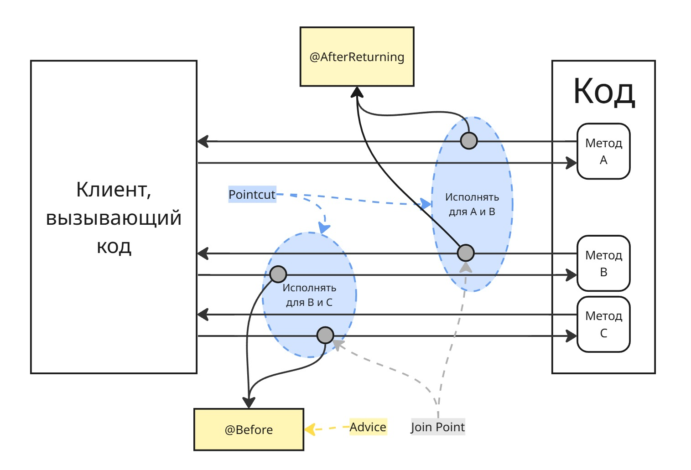

## Лекция 10

### Spring AOP

Аспектно-ориентированное программирование (АОП) - это парадигма программирования, являющаяся дальнейшим развитием процедурного программирования и ООП. Идея АОП заключается в выделении так называемой сквозной функциональности

В Spring AOP существуют следующие понятия:

**Join Point** - точки соединения, в которых внедряется сквозная функциональность

**Pointcut** - срез, выражение, определяющее набор точек соединения, к которым применяется функциональность

**Advice** - действие, выполняемый в определенный момент выполнения метода:

* `@Before` - перед вызовом метода
* `@After` или `@AfterFinally` - после вызова метода
* `@AfterReturning` - если метод что-то вернул
* `@AfterThrowing` - если метод выбросил исключение
* `@Around` - параллельно с работой методом (например, чтобы засечь время работы метода)

Далее они собираются в класс с аннотацией `@Aspect`. Пример: имеется метод, который нужно логировать (так называемый Target). В этом случае, создаем интерфейс:

```java
@Retention(RetentionPolicy.RUNTIME)
@Target(ElementType.METHOD)
public interface Loggable {
}
```

```java
@Aspect
@Component
public class LoggingAspect {

    @Before("@annotation(Loggable)")
    public void logBefore(JoinPoint joinPoint) {
        String methodName = joinPoint.getSignature().getName();
        System.out.println("➡ Вызов метода: " + methodName);
    }

    @AfterReturning(pointcut = "@annotation(Loggable)", returning = "result")
    public void logAfter(JoinPoint joinPoint, Object result) {
        String methodName = joinPoint.getSignature().getName();
        System.out.println("✅ Метод " + methodName + " завершился. Результат: " + result);
    }

    @AfterThrowing(pointcut = "@annotation(Loggable)", throwing = "ex")
    public void logException(JoinPoint joinPoint, Throwable ex) {
        String methodName = joinPoint.getSignature().getName();
        System.out.println("❌ Метод " + methodName + " выбросил исключение: " + ex.getMessage());
    }
}
```

Здесь в качестве pointcut мы отмечаем все методы, которые были аннотированы `@Loggable`. Чтобы не хардкодить строки, можно создать отдельный метод для pointcut:


```java
@Aspect
@Component
public class LoggingAspect {
    @Pointcut("@annotation(Loggable)")
    public void loggableMethods() { }

    @Before("loggableMethods()")
    public void logBefore(JoinPoint joinPoint) {
        String methodName = joinPoint.getSignature().getName();
        System.out.println("➡ Вызов метода: " + methodName);
    }

    ...
}
```

Тогда на сам метод достаточно повесить аннотацию интерфейса:

```java
@Service
public class UserService {

    @Loggable
    public String getUserById(Long id) {
        if (id == null) {
            throw new IllegalArgumentException("ID не может быть null");
        }
        return "Пользователь #" + id;
    }
}
```

Также можно обозначить в pointcut все вызовы методов из определенного пакета: `@Pointcut("execution(* com.example..*(..))")`




АОП работает преимущественно в рантайме, однако расширение AspectJ может скомпилировать бины с аспектами заранее (так называемый [Weaving](https://docs.spring.io/spring-framework/reference/core/aop/using-aspectj.html#aop-aj-ltw)). AspectJ расширяет синтаксис Java:

```java
aspect LoggingAspect {

    pointcut logMethods(): execution(* com.example..*(..));

    before(): logMethods() {
        System.out.println("Вызов метода: " + thisJoinPoint.getSignature());
    }
}
```

Если целевой объект реализует какой-нибудь интерфейс, то Spring AOP будет использовать динамический прокси JDK, позволяющий проксировать интерфейс. Иначе будет использоваться CGLIB-прокси

---

Преимущества AOP:

* **Повышенная модульность**: Сквозные функции определяются один раз и применяются ко многим частям приложения.
* **Улучшенная читаемость**: Бизнес-логика не засоряется кодом сквозных функций.
* **Упрощённое сопровождение**: Изменения в аспектах не требуют модификации основного кода.

Потенциальные недостатки:

* **Сложность отладки**: Поведение программы может изменяться без явных изменений в коде, что усложняет отладку.
* **Зависимость от фреймворков**: Для использования AOP часто требуются дополнительные библиотеки или фреймворки.
* **Потенциальное снижение производительности**: Неправильное использование аспектов может привести к излишним накладным расходам.

