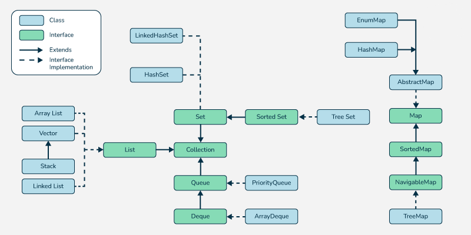

## X. Программа экзамена 2024/2025

1. Что такое виртуальная среда исполнения управляемого кода? Каковы отличия от неуправляемых языков?

    Виртуальная среда, которая управляет выполнением кода, предоставляет сервисы, такие как автоматическое управление памятью (сборка мусора), проверка типов, безопасность, оптимизация в рантайме

    | Критерий         | Управляемый код (Java)                     | Неуправляемый код (C/C++)         |
    |----------------------|-----------------------------------------------|---------------------------------------|
    | **Управление памятью** | Автоматическое (сборщик мусора)              | Ручное (`new`/`delete`, `malloc`/`free`). |
    | **Безопасность**     | Песочница: запрет небезопасных операций      | Прямой доступ к памяти (уязвимости) |
    | **Платформозависимость** | Кросс-платформенный (байт-код)             | Требует перекомпиляции под платформу |
    | **Производительность** | Может быть ниже из-за накладных расходов   | Выше (прямой доступ к железу)        |
    | **Примеры**          | JVM (Java), CLR (.NET)                      | Нативные приложения (ОС, драйверы)   |

2. Что такое спецификация языка? Отличия между основными изданиями Java. Приведите примеры набора API различных изданий.

    Спецификация - формальное описание языка (синтаксис, семантика, JVM) комитетом Java Community Process (JCP)

    **Издания Java:**

    | **Издание** | **Назначение**                     | **Пример API**                          |
    |-------------|-----------------------------------|----------------------------------------|
    | **Java SE** | Базовые приложения.               | `java.lang`, `java.util`, `java.io`.   |
    | **Java EE** | Корпоративные приложения (веб, распределенные системы). | `javax.servlet`, `EJB`, `JPA`. |
    | **Java ME** | Встроенные системы (IoT, мобильные). | `MicroProfile`, `CLDC`.          |

3. Иерархия интерфейсов для работы с коллекциями. Особенности Stream API.

    **Иерархия интерфейсов:**
    
    

    **Map** не наследует `Collection`, но входит в Collections Framework:
    - `HashMap`, `TreeMap`, `LinkedHashMap`.

    **Stream API:**
    Функциональный стиль обработки данных:
    ```java
    List<String> names = users.stream()
        .filter(u -> u.getAge() > 18)
        .map(User::getName)
        .sorted()
        .collect(Collectors.toList());
    ```
    - **Промежуточные операции:** `filter`, `map`, `sorted`.
    - **Терминальные:** `collect`, `forEach`, `count`.

4. Системы сборок, предназначение, ключевые особенности. Понятие модульности и конвенций иерархии пакетов.

    **Назначение систем сборки:**
    Автоматизация: компиляция, управление зависимостями, тестирование, упаковка в JAR/WAR.

    | **Система**       | **Особенности**                              | **Конвенции структуры**              |
    |-------------------|---------------------------------------------|--------------------------------------|
    | **Apache Ant**    | XML-скрипты, гибкость.                      | Нет строгих правил.                  |
    | **Apache Maven**  | Конвенция > конфигурация, архетипы.         | `src/main/java`, `src/test/resources`. |
    | **Gradle**        | DSL на Groovy/Kotlin, высокая производительность. | Аналогично Maven, но гибче.        |

    **Модульность:**
    - Разделение кода на модули (например, с помощью Java Platform Module System (JPMS) в Java 9+).
    - Зависимости декларируются в `pom.xml` (Maven) или `build.gradle` (Gradle).

5. Автоматическое управление памятью. Алгоритмы отчистки.

    **Задачи GC:**
    - Обнаружение мусора (недоступные объекты).
    - Очистка памяти.

    **Алгоритмы обнаружения:**
    - **Reference Counting:** Подсчет ссылок (не работает с циклическими зависимостями).
    - **Tracing:** Поиск достижимых объектов из GC Roots (потоки, статические поля).

    **Алгоритмы очистки:**
    | **Алгоритм**       | **Принцип работы**                          | **Плюсы**                             | **Минусы**                |
    |--------------------|--------------------------------------------|---------------------------------------|---------------------------|
    | **Mark-Sweep**     | Пометить живое → удалить неживое.           | Простота.                             | Фрагментация памяти.      |
    | **Mark-Compact**   | Mark-Sweep + дефрагментация.               | Нет фрагментации.                     | Высокая стоимость.        |
    | **Copying**        | Копирование живых объектов в новую область. | Быстро для young-gen.                 | Требует 2x памяти.        |
    | **Generational**   | Разделение на young/old поколения.         | Оптимизация под характер объектов.    | Сложная реализация.       |

6. Сборка мусора на поколениях. Устройство кучи. Принцип работы.

    **Принцип:**
    Большинство объектов "умирают молодыми" (weak generational hypothesis)

    **Устройство кучи:**
    * Младшее поколение (Young Generation), состоящее из Eden (новые объекты) и Survivor Space (S0, S1 - выжившие после минорной сборки)
    * Старшее поколение (Old Generation) из долгоживущих объектов
    

    **Процесс:**
    1. **Minor GC:** Очистка Young Gen (копирование из Eden → Survivor)
    2. **Major/Full GC:** Очистка Old Gen (алгоритм зависит от GC: G1, CMS, ZGC)

7. Технологии Java EE для работы с данными. Популярные имплементации спецификации JPA.

    **Технологии:**
    - **JDBC:** Низкоуровневый API для SQL-запросов.
    - **JPA (Java Persistence API):** ORM-стандарт (маппинг объектов на таблицы).
    - **JTA (Java Transaction API):** Управление распределенными транзакциями.

    **Популярные реализации JPA:**
    - **Hibernate:** Самая распространенная, с расширенным функционалом.
    - **EclipseLink:** Референсная реализация JPA.
    - **Apache OpenJPA.**

    **Пример JPA-сущности:**
    ```java
    @Entity
    @Table(name = "users")
    public class User {
        @Id
        @GeneratedValue
        private Long id;
        private String name;
    }
    ```


8. Особенности реализации CDI в Spring. Внедрение зависимостей. Инверсия контроля.

    **IoC (Inversion of Control):**
    Контейнер управляет жизненным циклом объектов и зависимостями вместо программиста.

    **DI (Dependency Injection):**
    Способ реализации IoC: зависимости передаются объекту извне (через конструктор, сеттеры, поля).

    **Реализация в Spring:**
    - **Бины:** Объекты, управляемые контейнером (`@Component`, `@Service`).
    - **Внедрение:** `@Autowired`, `@Inject`.
    - **Конфигурация:** Через XML, JavaConfig (`@Configuration`), аннотации (`@ComponentScan`).

    **Пример:**
    ```java
    @Service
    public class UserService {
        private final UserRepository repository;

        @Autowired // DI через конструктор
        public UserService(UserRepository repository) {
            this.repository = repository;
        }
    }
    ```


9.  Что такое «сервлет»? Отличия сервера приложений и контейнеров сервлетов.

    Сервлет - Java-класс, обрабатывающий HTTP-запросы (реализует интерфейс `javax.servlet.Servlet`).

    **Отличия:**
    | **Контейнер сервлетов**     | **Сервер приложений**          |
    |-----------------------------|--------------------------------|
    | Обработка HTTP (Tomcat, Jetty). | Полная Java EE-реализация (WildFly, GlassFish). |
    | Поддержка только сервлетов/JSP. | + EJB, JMS, JTA, CDI.        |
    | Легковесный.                | Тяжелый, требует больше ресурсов. |

10. Жизненный цикл запроса в рамках DispatcherServlet в Spring.

    Этапы обработки HTTP-запроса:
    1. **Запрос приходит** на `DispatcherServlet`.
    2. **Поиск контроллера:** `HandlerMapping` определяет, какой `Controller` обработает запрос.
    3. **Вызов контроллера:** `HandlerAdapter` вызывает метод контроллера.
    4. **Обработка:** Контроллер возвращает имя представления + модель данных.
    5. **Рендеринг:** `ViewResolver` выбирает шаблон (JSP, Thymeleaf).
    6. **Формирование ответа:** `View` генерирует HTML/JSON.
    7. **Ответ клиенту.**

11. Основные задачи решаемые с помощью Spring Boot. С помощью каких инструментов достигается результат?

    Spring Boot упрощает настройку Spring-приложений. Spring Boot использует:

    * **Стартеры** - готовые наборы зависимостей (например, `spring-boot-starter-web`)
    * **Автоконфигурация** - автонастройка бинов на основе зависимостей и classpath
    * **Actuator** - мониторинг и управление приложением
    * **Embedded Server** - встроенный веб-сервер Tomcat/Jetty
    * **Spring Initializr** - GUI-генератор шаблонов проектов

12. Инструменты и типовые решения для аутентификации и авторизации запросов.

    - **Аутентификация:** Проверка логина/пароля (через `AuthenticationManager`).
    - **Авторизация:** Проверка прав доступа (`@PreAuthorize`, `hasRole()`).

    **Механизмы:**
    - **Form Login:** Стандартная HTML-форма.
    - **HTTP Basic:** Заголовок `Authorization: Basic`.
    - **JWT/OAuth2:** Для REST API.
    - **Фильтры:** Цепочка фильтров (`BasicAuthenticationFilter`, `FilterSecurityInterceptor`).

    **Пример конфигурации:**
    ```java
    @Configuration
    @EnableWebSecurity
    public class SecurityConfig {
        @Bean
        public SecurityFilterChain filterChain(HttpSecurity http) throws Exception {
            http
                .authorizeRequests(auth -> auth
                    .antMatchers("/admin").hasRole("ADMIN")
                    .anyRequest().authenticated()
                )
                .formLogin();
            return http.build();
        }
    }
    ```


13. Парадигма аспектно-ориентированного программирования. Отличия от ООП.

    | **Критерий**       | **ООП**                                  | **АОП**                                  |
    |--------------------|------------------------------------------|------------------------------------------|
    | **Парадигма**      | Инкапсуляция, наследование, полиморфизм. | Разделение сквозной функциональности.    |
    | **Решаемая задача**| Моделирование предметной области.        | Логирование, транзакции, безопасность.  |
    | **Единица модульности** | Класс.                                | Аспект (совет + срез).                   |
    | **Пример в Spring**| `@Service`, `@Repository`.              | `@Transactional`, `@Secured`.            |

    **АОП в Spring:**
    ```java
    @Aspect
    @Component
    public class LoggingAspect {
        @Before("execution(* com.example.service.*.*(..))")
        public void logMethodCall(JoinPoint jp) {
            System.out.println("Вызов метода: " + jp.getSignature());
        }
    }
    ```

14. Межсервисное взаимодействие. Микросервисная архитектура.

    **Проблемы монолита:**
    - Сложность масштабирования.
    - Технологическая связанность.

    **Принципы микросервисов:**
    - Каждый сервис решает одну задачу.
    - Независимое развертывание.
    - Слабосвязанность (через API).

    **Способы взаимодействия:**
    - **Синхронное:** HTTP/REST, gRPC (клиент ждет ответ).
    - **Асинхронное:** Брокеры сообщений (Kafka, RabbitMQ).


15. Какие ключевые задачи решают брокеры сообщений? Перечислите известные вам модели обмена сообщениями и протоколы.

    **Задачи:**
    - Асинхронная коммуникация.
    - Гарантии доставки.
    - Буферизация нагрузки.

    **Модели:**
    - **Point-to-Point:** Очереди (1 сообщение → 1 потребитель).
    - **Pub/Sub:** Топики (1 сообщение → N подписчиков).
    - **Гибридная:** Комбинация (например, Kafka).

    **Протоколы:**
    - **JMS:** Java-стандарт (ActiveMQ).
    - **AMQP:** Кросс-языковой (RabbitMQ).
    - **MQTT:** Для IoT.
    - **Собственные:** Kafka Protocol.


16. Ключевые отличия Apache Kafka от RabbitMQ. Паттерн Outbox.

    | **Критерий**         | **Apache Kafka**                            | **RabbitMQ**                        |
    |----------------------|---------------------------------------------|-------------------------------------|
    | **Архитектура**      | Распределенный log-брокер.                  | Классический брокер (очереди).      |
    | **Модель**           | Pub/Sub с сохранением истории.              | P2P, Pub/Sub.                       |
    | **Скорость**         | Очень высокая (миллионы сообщ./сек).        | Высокая (тысячи сообщ./сек).        |
    | **Надежность**       | Сохранение на диск + репликация.            | Сохранение в памяти/на диск.        |
    | **Гарантии доставки**| At-least-once, Exactly-once (Kafka 0.11+). | At-most-once, At-least-once.        |
    | **Использование**    | Стриминг данных, аналитика в реальном времени. | Традиционные задачи (очереди задач). |

    **Паттерн Outbox:**
    Способ надежной доставки событий из микросервиса:
    1. Сохранить событие в БД (в таблицу `outbox`) в той же транзакции.
    2. Отдельный процесс отправляет события из `outbox` в брокер (Kafka/RabbitMQ).
    3. Гарантирует, что событие не потеряется даже при падении сервиса.
