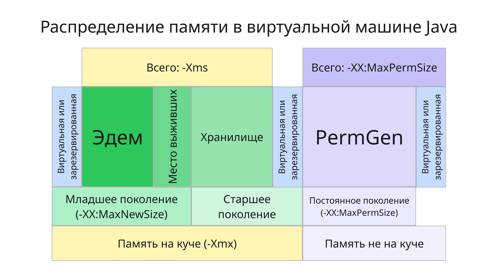
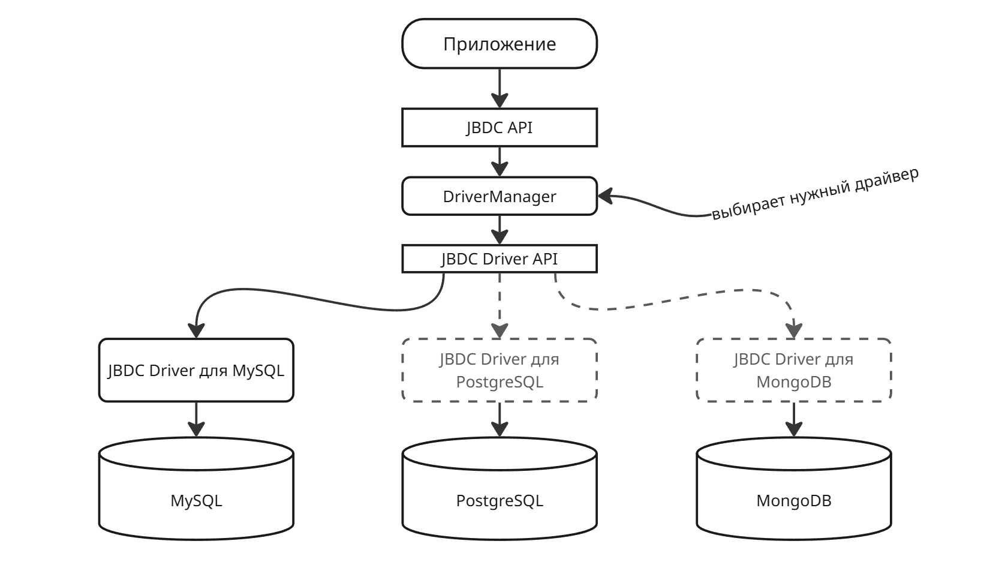
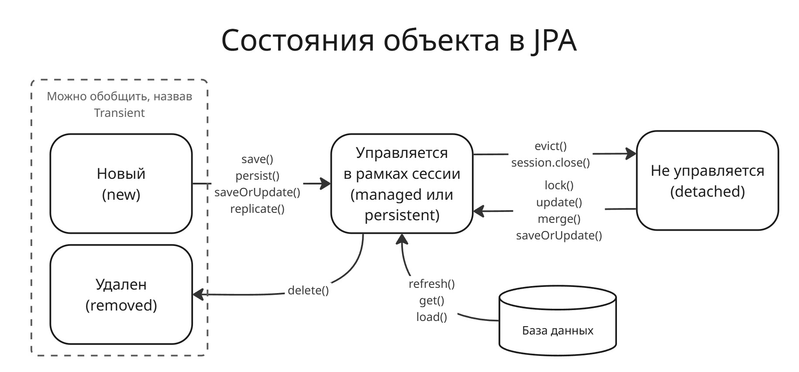
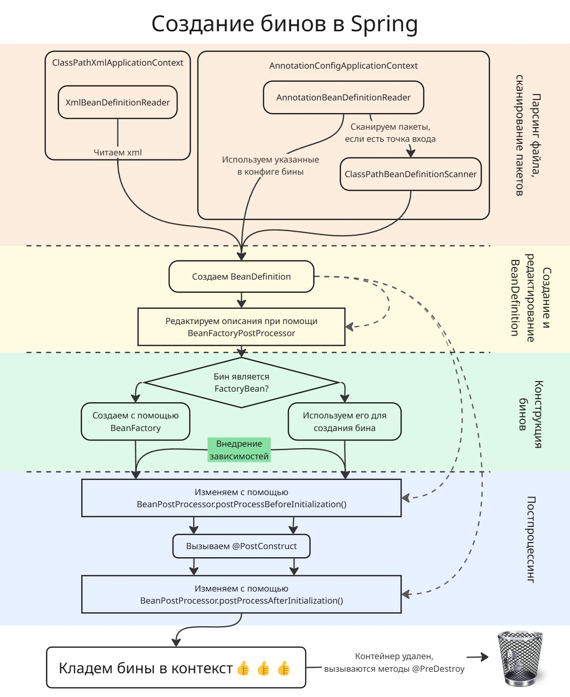
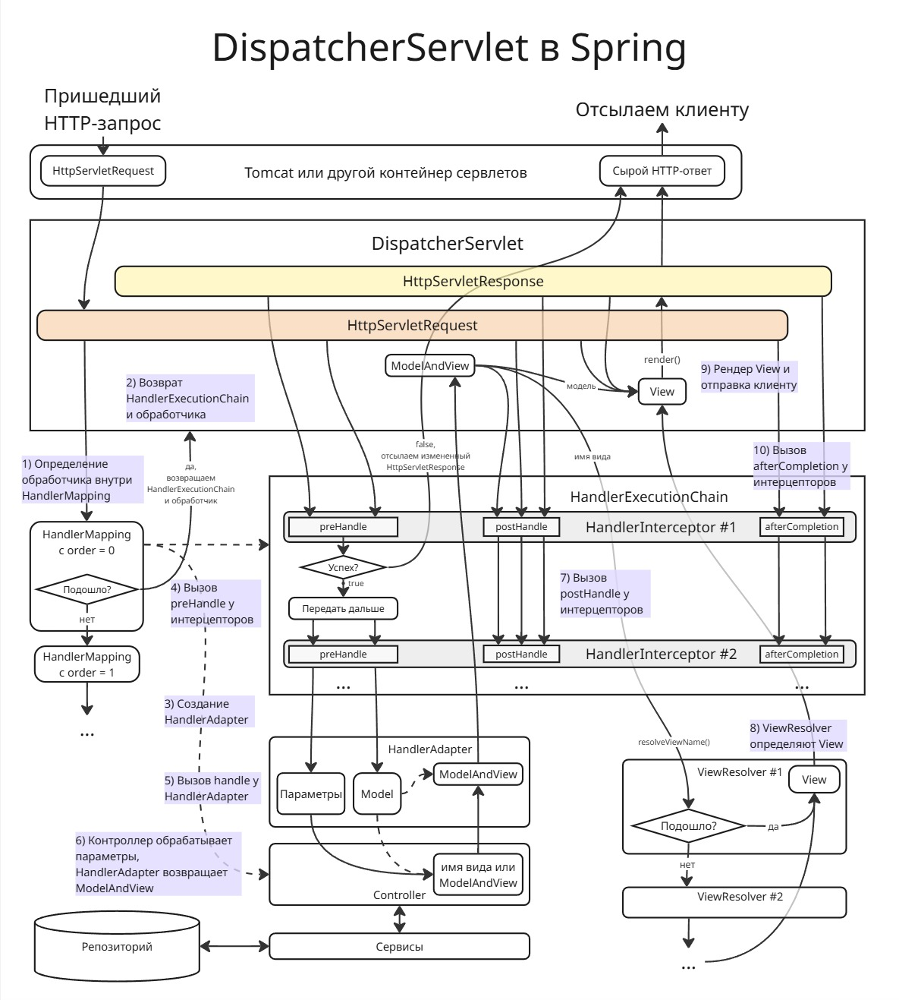
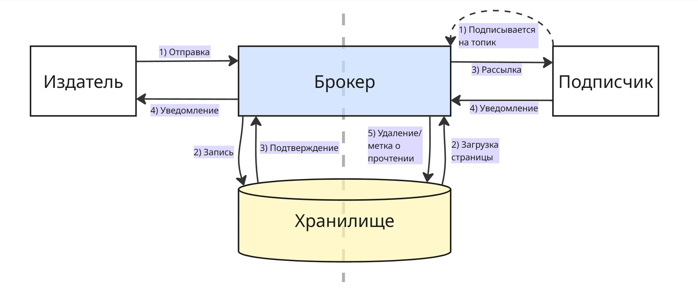

# <a name="%D1%82%D0%B5%D1%85%D0%BD%D0%BE%D0%BB%D0%BE%D0%B3%D0%B8%D0%B8-%D0%BF%D1%80%D0%BE%D0%B3%D1%80%D0%B0%D0%BC%D0%BC%D0%B8%D1%80%D0%BE%D0%B2%D0%B0%D0%BD%D0%B8%D1%8F-%D0%BD%D0%B0-java"></a> Технологии программирования на Java


* [Технологии программирования на Java](#%D1%82%D0%B5%D1%85%D0%BD%D0%BE%D0%BB%D0%BE%D0%B3%D0%B8%D0%B8-%D0%BF%D1%80%D0%BE%D0%B3%D1%80%D0%B0%D0%BC%D0%BC%D0%B8%D1%80%D0%BE%D0%B2%D0%B0%D0%BD%D0%B8%D1%8F-%D0%BD%D0%B0-java)
  * [Лекция 1](#%D0%BB%D0%B5%D0%BA%D1%86%D0%B8%D1%8F-1)
  * [Лекция 2](#%D0%BB%D0%B5%D0%BA%D1%86%D0%B8%D1%8F-2)
  * [Лекция 3](#%D0%BB%D0%B5%D0%BA%D1%86%D0%B8%D1%8F-3)
    * [Apache Ant + Apache Ivy](#apache-ant-%2B-apache-ivy)
    * [Apache Maven](#apache-maven)
    * [Google Gradle](#google-gradle)
  * [Лекция 4](#%D0%BB%D0%B5%D0%BA%D1%86%D0%B8%D1%8F-4)
    * [Обнаружение мусора](#%D0%BE%D0%B1%D0%BD%D0%B0%D1%80%D1%83%D0%B6%D0%B5%D0%BD%D0%B8%D0%B5-%D0%BC%D1%83%D1%81%D0%BE%D1%80%D0%B0)
    * [Очистка мусора](#%D0%BE%D1%87%D0%B8%D1%81%D1%82%D0%BA%D0%B0-%D0%BC%D1%83%D1%81%D0%BE%D1%80%D0%B0)
    * [Реализации сборщиков мусора](#%D1%80%D0%B5%D0%B0%D0%BB%D0%B8%D0%B7%D0%B0%D1%86%D0%B8%D0%B8-%D1%81%D0%B1%D0%BE%D1%80%D1%89%D0%B8%D0%BA%D0%BE%D0%B2-%D0%BC%D1%83%D1%81%D0%BE%D1%80%D0%B0)
  * [Лекция 5](#%D0%BB%D0%B5%D0%BA%D1%86%D0%B8%D1%8F-5)
    * [Java Database Connectivity](#java-database-connectivity)
    * [Java Persistence API](#java-persistence-api)
  * [Лекция 6](#%D0%BB%D0%B5%D0%BA%D1%86%D0%B8%D1%8F-6)
    * [Spring IoC](#spring-ioc)
  * [Лекция 7](#%D0%BB%D0%B5%D0%BA%D1%86%D0%B8%D1%8F-7)
    * [Spring MVC](#spring-mvc)
  * [Лекция 8](#%D0%BB%D0%B5%D0%BA%D1%86%D0%B8%D1%8F-8)
    * [Spring Boot](#spring-boot)
      * [Стартер](#%D1%81%D1%82%D0%B0%D1%80%D1%82%D0%B5%D1%80)
      * [Автоконфигурация](#%D0%B0%D0%B2%D1%82%D0%BE%D0%BA%D0%BE%D0%BD%D1%84%D0%B8%D0%B3%D1%83%D1%80%D0%B0%D1%86%D0%B8%D1%8F)
      * [Initializr](#initializr)
      * [Инструменты разработчика](#%D0%B8%D0%BD%D1%81%D1%82%D1%80%D1%83%D0%BC%D0%B5%D0%BD%D1%82%D1%8B-%D1%80%D0%B0%D0%B7%D1%80%D0%B0%D0%B1%D0%BE%D1%82%D1%87%D0%B8%D0%BA%D0%B0)
      * [События при запуске](#%D1%81%D0%BE%D0%B1%D1%8B%D1%82%D0%B8%D1%8F-%D0%BF%D1%80%D0%B8-%D0%B7%D0%B0%D0%BF%D1%83%D1%81%D0%BA%D0%B5)
      * [Тестирование](#%D1%82%D0%B5%D1%81%D1%82%D0%B8%D1%80%D0%BE%D0%B2%D0%B0%D0%BD%D0%B8%D0%B5)
    * [Spring Data JPA](#spring-data-jpa)
  * [Лекция 9](#%D0%BB%D0%B5%D0%BA%D1%86%D0%B8%D1%8F-9)
    * [Spring Security](#spring-security)
  * [Лекция 10](#%D0%BB%D0%B5%D0%BA%D1%86%D0%B8%D1%8F-10)
    * [Spring AOP](#spring-aop)
  * [Лекция 11](#%D0%BB%D0%B5%D0%BA%D1%86%D0%B8%D1%8F-11)
    * [Point-to-Point](#point-to-point)
    * [Publisher-to-Subscriber](#publisher-to-subscriber)
    * [Гибридная модель](#%D0%B3%D0%B8%D0%B1%D1%80%D0%B8%D0%B4%D0%BD%D0%B0%D1%8F-%D0%BC%D0%BE%D0%B4%D0%B5%D0%BB%D1%8C)
  * [X. Программа экзамена 2024/2025](#x.-%D0%BF%D1%80%D0%BE%D0%B3%D1%80%D0%B0%D0%BC%D0%BC%D0%B0-%D1%8D%D0%BA%D0%B7%D0%B0%D0%BC%D0%B5%D0%BD%D0%B0-2024%2F2025)


Этот курс будет про работу с языком Java (JVM, ООП на Java), с базами данных, со средствами сборки и тестирования, с микросервисами

Первый модуль будет посвящен изучению Java (дополнительно можно ознакомиться на [сайте Георгия Корнеева](https://www.kgeorgiy.info/courses/java-advanced)), второй модуль - Spring и микросервисам

## <a name="%D0%BB%D0%B5%D0%BA%D1%86%D0%B8%D1%8F-1"></a> Лекция 1

До этого существовали большие компьютеры, кушающие перфокарты, далее появились такие языки, как FORTRAN, BASIC и другие

Основной недостаток: ни один из представленных в те времена ЯП не мог удовлетворить одновременно всем критериям:

* простота использования

* предоставляемые возможности

* безопасность

* эффективность

* устойчивость

* расширяемость

Первый таким языком стал C - он был создан для работяг, тогда как более старые языки были созданы в академических целях

Потом появился C++, объединивший в себе ООП, однако C++ - платформо-зависимый язык

К 90-ым годам с распространением компьютеров появились разные платформы. С этим появилась концепция превращения кода в промежуточную стадию, которую можно запускать на процессорах разных архитектур. Ввели термины managed code (управляемый код) и unmanaged code (неуправляемый код). Управляемый код управляется средой выполнения - виртуальной машиной. 

В Java код переводится в байт-код, который транслируется в машинные инструкции при помощи Java Virtual Machine (JVM). При этом понимание Java-программисту устройства виртуальной машины также не нужно, как и понимание устройства компилятора C-программисту ([\*тык\*](https://habr.com/ru/post/568402))

Java Runtime Environment (JRE) - среда выполнения для Java, которая содержит библиотеки классов, загрузчик классов и т. д.

Java Development Kit (JDK) - средства, позволяющие разрабатывать на Java

JVM состоит из:

* спецификации - набором правил, диктующих, как должна быть реализована JVM. "JVM должна правильно запускать программы, написанные на Java"

* реализации - реальной программы, которая будет запускать и позволять разрабатывать программы, написанные на Java

* экземпляра - оболочки над вашим кодом, которая его исполняет и заботится о том, как она это делает

Пример кода на Java:

```java
package ru.butenko.springdatatest; // название пакета

import java.time.LocalDate;

public class Dog {
    public String name;
    private LocalDate birthdate;

    public int calculateAge() {
        return LocalDate.now().getYear() - this.birthdate.getYear();
    }
}
```

Название пакета отражается название организации (или индивидуального человека), название проекта и файловую структуру проекта

При компиляции класс из файла `.java` переводится в байт-код `.class`

Также в Java есть примитивные коллекции, например, Queue, Deque и другие ([\*тык\*](https://javarush.com/groups/posts/1937-klass-collections))

Ошибки в Java делятся на 2 типа:

* `___Error` - ошибки, связанные с JVM

* `___Excetion` - исключения, связанные с работой кода

Если метод может вызвать исключение во время работы, то оно должно быть указано в сигнатуре метода:

```java
    public void Do() throws Exception {
        ...
    }
```

Также хорошим тоном будет указывание документации для классов и методов:

```java
import java.time.LocalDate;

/**
 * Класс "Собака"🐶
 */
public class Dog {
    public String name;
    private LocalDate birthdate;

    /**
     * Метод, вычисляющий возраст собаки
     * 
     * @return int возраст собаки
     */
    public int calculateAge() {
        return LocalDate.now().getYear() - this.birthdate.getYear();
    }

    /**
     * Метод, дающий собаке новое имя
     * 
     * @param String новое имя собаки
     */
    public void setName(String newName) {
        name = newName;
    }

    /**
     * Метод, вычисляющий возраст собаки
     * 
     * @throws Exception исключение
     */
    public void DoException() throws Exception {
        throw new Exception("Yay!");
    }
}
```


## <a name="%D0%BB%D0%B5%D0%BA%D1%86%D0%B8%D1%8F-2"></a> Лекция 2

Сейчас версией с долгосрочной поддержкой является Java 21

Разберемся в изданиях Java:

* Java Platform Standard Edition (Java SE) - стандартная редакция Java, которая использует для разработки простых приложений

* Java Platform Enterprise Edition ([Java EE](https://en.wikipedia.org/wiki/Jakarta_EE)) - редакция для предприятий

* Java Platform Micro Edition (Java ME) - редакция для разработки ПО на микроконтроллерах, мобильные платформы и т.д.

Комитет [Java Community Process](https://ru.wikipedia.org/wiki/Java_Community_Process) определяет, как будут выглядеть будущие спецификации Java

---

Классы в Java как правило объединены в пакеты. По умолчанию, стандартная библиотека Java содержит пакеты `java.lang`, `java.io`, `java.util` и другие. Организация классов в пакеты позволяет избежать коллизии имен.

В Java все коллекции представлены в Java Collections Framework наследуются от интерфейса [`java.util.Collection`](https://docs.oracle.com/javase/8/docs/api/java/util/Collection.html). Сам интерфейс `java.util.Collection` наследуется от интерфейса `java.util.Iterable`, позволяющий итерироваться по коллекции.

В Java в качестве динамического списка используют `ArrayList` (с произвольным доступом по индексу) и `LinkedList` (с последовательный доступом)

`Vector` в Java работает так же, как и `ArrayList`, но `Vector` потокобезопасный. Также `Vector` расширяется вдвое, а `ArrayList` в 1,5 раза

Помимо них есть:

* `Stack` - стек, реализованный на `Vector` 

* `Queue` - односторонняя очередь

* `Deque` - двухсторонняя очередь

* `Set` - множество; реализации на хеш-таблице `HashSet` и на дереве `TreeSet`

* `Map` - словарь; реализации на хеш-таблице `HashMap` и на дереве `TreeMap`

В `java.util.concurrent` существуют потокобезопасные версии коллекций

Помимо Java Collections Framework другие фреймворки, такие как Google Guava и Apache Commons Collections, реализуют свои коллекции

Чтобы обрабатывать коллекции, в Java есть Stream API. Работает он как LINQ в C#:

1. Создаем поток из коллекции: `list.stream()`

2. Применяем промежуточные методы, такие как `filter()`, `map()`, `sorted()`

3. Применяем терминальный метод, например, `count()`, `findFirst()`, `toList()`

Пример:

```java 
list
    .stream()
    .filter(x -> x.toString().length() == 3)
    .forEach(System.out::println);

list.stream().forEach(x -> System.out.println(x));
```


## <a name="%D0%BB%D0%B5%D0%BA%D1%86%D0%B8%D1%8F-3"></a> Лекция 3

По мере роста количества кода появилась потребность в системах сборки, которые связывают необходимые библиотеки с проектом. Впоследствии понадобилась автоматизация сборки, чтобы система сама находила зависимости, скачивала их, прогоняла тесты и деплоила на удаленный сервер

В начале единственным приличным инструментом для сборки был Make, позднее потребовались более функциональные инструменты для сборки. Сейчас можно выделить 3 популярные системы сборки для Java:

* Apache Ant и Apache Ivy
* Apache Maven
* Google Gradle

### <a name="apache-ant-%2B-apache-ivy"></a> Apache Ant + Apache Ivy

Ant вышел в 2000 и был первым среди "современных" инструментов сборки. Для описания сборки Ant использует информацию, написанную в `build.xml`:

```xml
<project>
    <target name="clean">
        <delete dir="classes"/>
    </target>

    <target name="compile" depends="clean">
        <mkdir dir="classes"/>
        <javac srcdir="src" destdir="classes"/>
    </target>

    <target name="jar" depends="compile">
        <mkdir dir="jar"/>
        <jar destfile="jar/HelloWorld.jar" basedir="classes">
            <manifest>
                <attribute name="Main-Class"
                  value="antExample.HelloWorld"/>
            </manifest>
        </jar>
    </target>

    <target name="run" depends="jar">
        <java jar="jar/HelloWorld.jar" fork.="true">
    </target>
</project>
```

Позднее для управления зависимостями появился Apache Ivy. Ivy автоматически ищет в указанном репозитории указанные зависимости и скачивает их.

Во время сборки Ant делает 4 вещи (фазы, цели):

* clean - очистка предыдущих файлов сборки
* compile - компиляция 
* jar - упаковка в jar архив
* run - запуск JVM

### <a name="apache-maven"></a> Apache Maven

Maven вышел в 2004 и стал преемником Ant и Ivy, сочетая в себе функционал этих инструментов. Maven умеет управлять зависимостям, которые загружены на репозиторий [Maven Central](https://mvnrepository.com/)

В отличии от Apache Ant, Maven требует строгой файловой структуры проекта:

```
project
 |_ src
 |   |_ main
 |   |   |_ java
 |   |   |_ resources
 |   |_ test
 |       |_ java
 |       |_ resources
 |_ target
 |_ pom.xml
```

Управлять сборкой в Maven можно с помощью `pom.xml` файла (Project Object Model). В ней

```xml
<?xml version="1.0" encoding="UTF-8"?>
<project xmlns="http://maven.apache.org/POM/4.0.O"
    xmlns:xsi="http://www.w3.org/2001/XMLSchema-instance"
    xsi:schemaLocation="http://maven.apache.org/POM/4.O.O
    http://maven.apache.org/xsd/maven-4.O.O.xsd">

    <modelVersion>4.0.0</modelVersion>

    <groupId>example.com</groupId>
    <artifactId>example</artifactId>

    <version>1.0-SNAPSHOT</version>

    <dependencies>
        <dependency>
            <groupId>commons-io</groupId>
            <artifactId>commons-io</artifactId>
            <version>2.6</version>
        </dependency>
    </dependencies>
</project>
```

Тег `modelVersion` указывает на версию Maven, теги `groupld`, `artifactId`, `version` указывают название и версию нашего артифакта (артифактом будем называть приложение, модуль, библиотему, jar-файл и прочее). В теге `dependencies` в том же формате указаны зависимости нашего проекта, которые будут загружаться из Maven Central

Чтобы изменить структуру проекта, в Maven придумали архетипы - шаблоны проектов. С помощью архетипов можно создать готовые шаблоны проектов для библиотек, для веб-приложений, для плагина и т.д.. Чтобы посмотреть доступные архетипы, можно выполнить команду `mvn archetype:generate`

Так же как и Ant, Maven обладает своим жизненным циклом

| Фаза | Описание                                                                         |
| -------- | ---------------------------------------------------------------------------------------- |
| validate | Проверка корректность метаинформации о проекте |
| compile  | Компиляция файлов                                                        |
| test     | Проверка тестов на скомпилированных файлах         |
| package  | Упаковка в артефакт вида jar, zip и т.д.                         |
| verify   | Проверка артефактов                                                    |
| install  | Коммит артефакта в локальный репозиторий             |
| deploy   | Деплой на продакшен или удаленный репозиторий    |

Жизненный цикл можно расширять при помощи плагинов. Плагины устанавливают при помощи изменения `pom.xml`:

```xml
<plugins>
    <plugin>
        <groupId>org.apache.maven.plugins</groupId>
        <artifactId>maven-checkstyle-plugin</artifactId>
        <version>2.6</version>
    </plugin>
</plugins>
```

### <a name="google-gradle"></a> Google Gradle

Google Gradle был выпущен в 2008 году для облегчения разработки Java-приложений на Android. Вместо громоздкого XML система сборки Gradle поддерживает два языка для описания сборки: предметно-ориентированный языки **Groovy** и **Kotlin**.

В качестве репозитория зависимостей Gradle поддерживает репозитории Ivy, Maven Central и другие.

Так как Gradle постоянно меняется и не имеет совместимость между собой, существует Gradle Wrapper: скрипт `grablew` автоматически скачивает нужную версию Gradle, которая указана в `build.gradle`. Сам `build.gradle`, информация о проекте, выглядит так:

```groovy
plugins {
    id 'application'
}

repositories {
    mavenCentral ( )
}

dependencies {
    testImplementation 'org.junit.jupiter:junit-jupiter:5.9.1'

    implementation 'com.google.guava:guava:31.1-jre'
}

application {
    mainClass = 'demo.Арр'
}

tasks.named('test') {
    useJUnitPlatform()
}
```

Или же можно создать `build.gradle.kts`, где указать то же самое, только на Kotlin:


```kotlin
plugins {
    application
}

repositories {
    mavenCentral ( )
}

dependencies {
    testImplementation("org.junit.jupiter:junit-jupiter:5.9.1")

    implementation("com.google.guava:guava:31.1-jre")
}

application {
    mainClass.set("demo.Арр")
}

tasks.named<Test>("test") {
    useJUnitPlatform()
}
```

Как и Maven, Gradle поддерживает плагины и имеет похожий цикл сборки


## <a name="%D0%BB%D0%B5%D0%BA%D1%86%D0%B8%D1%8F-4"></a> Лекция 4

Сборка мусора - процесс восстановления заполненной памяти среды выполнения путем уничтожения неиспользуемых объектов

В таких языках, как C и C++, программист сам отвечает за жизненный цикл объектов. В случае, если выделенная память для созданного объекта в конце его жизненного цикла не освобождается, то возникает утечка памяти:

```cpp
void foo() {
    // выделили память для 100 символов
    char* array = new char[100];

    // выделили память еще раз, перезаписали старый указатель, 
    // те самым потеряв к старому массиву доступ 
    array = new char[100];
}
```

Чтобы облегчить жизнь программиста и направить всю его концентрацию на создание бизнес-логики, придумали автоматическое управление памятью

В Java автоматическим управлением памятью занимается среда JVM. JVM по надобности выделяет нужный участок памяти на куче, в которой хранятся переменные, созданные программистом, и занимается сборкой мусора, то есть освобождением памяти уже ненужных переменных.

Перед сборщиком мусора (Garbage Collector) стоят 2 задачи:

* Обнаружение мусора
* Очистка мусора

Мусором мы будем считать объекты, ссылки на которые были утрачены, то есть доступ к нему невозможен

### <a name="%D0%BE%D0%B1%D0%BD%D0%B0%D1%80%D1%83%D0%B6%D0%B5%D0%BD%D0%B8%D0%B5-%D0%BC%D1%83%D1%81%D0%BE%D1%80%D0%B0"></a> Обнаружение мусора

Есть 2 способа обнаруживать мусор:

* Счетчик ссылок (Reference counting)
* Трейсинг (Tracing)

Счетчик ссылок считает количество живых ссылок на объект. Если число ссылок достигает 0, то объект удаляется (подобно `shared_ptr` в С++). Несмотря на простоту, счетчик ссылок плохо сочетается с многопоточностью и без дополнительных алгоритмов не может выявлять циклические ссылки (объекты ссылаются друг на друга => счетчики не нулевые)

Трейсинг основан на графе объектов и его обхода. Для начала вводится понятие корневой точки (GC Root). Корневой точкой мы будем считать локальные переменные, статические переменные, потоки, ссылки из Java Native Interface и т.д.. Затем строится дерево ссылок. Мусором считается тот объект, до которого нельзя попасть из корневых точек.

Компилятор знает, когда заканчивается скоуп, в котором живет переменная, поэтому при выходе из скоупа (тела функции, цикла и т.д.) корневые точки прекращают свое существование (за исключением тех, что были возвращены функцией). Пример:

```java
public House doSomething(string[] args) {
    Person person = new Person("Ivan");

    person.setHouse(new House());
    person.getHouse().setRoof(new Roof());
    person.getHouse().setDoor(new Door());

    Person person1 = new Person("Michael");
    Person person2 = new Person("John");
    person1.setFriend(person2);
    person2.setFriend(person1);

    return person;
}
```

Получаем такой лес объектов:

```
 person     
  |- house
      |- roof
      |- door

 person1
  |- person2
      |- ...

 person2
  |- person1
      |- ...
```

После `return` объект `person` остается жить, потому что он был возвращен, а `person1` и `person2` - нет. Несмотря на то, что количество ссылок на них ненулевое количество, из корневых точек в них попасть мы не можем (а таковым они перестают считаться после `return`)

### <a name="%D0%BE%D1%87%D0%B8%D1%81%D1%82%D0%BA%D0%B0-%D0%BC%D1%83%D1%81%D0%BE%D1%80%D0%B0"></a> Очистка мусора

От сборщика мусора нам нужно, что бы он:

* за предсказуемое время завершал свою работу (Latency and Responsiveness)
* не потреблял много оперативной памяти (Memory Footprint)
* не требовал большего количества вычислительных ресурсов (Throughput)

Добиться всех трех свойств нереально, поэтому то, что сейчас есть - это компромиссы между ними

Существует несколько алгоритмов очистки мусора. Один из них - копирующая сборка

Для копирующей сборки память условно делится на две части: **from-space** и **to-space**. Сначала объекты попадают в from-space. Когда она заполняется, происходит stop-the-world (остановка мира), сборщик мусора проходится по объектам, копирует нужные объекты в to-space, а ненужные высвобождаются. После этого области памяти from-space и to-space меняются местами (свапаются указатели)

Stop-the-world гарантирует, что во время очистки не выделится память для новых объектов, тем самым граф объектов будет заморожен

Другим методом является "отслеживание и очистка" (Mark and Sweep). При помощи трейсинга сборщик мусора помечает живые объекты и во время остановки мира пробегается по всем объектам и удаляет те, которые не были помечены живыми. После очистки объекты могут располагаться по всей памяти, тем самым фрагментируя ее. Дополнительно может производиться дефрагментация памяти (такой алгоритм называют Mark and Sweep Compact): сдвиг живых объектов в самое начало. Заметим, что дефрагментация - очень дорогая операция.

Еще один алгоритм основывается на так называемой "слабой гипотезе о поколениях". В процессе наблюдения заметили, что объекты либо живут очень мало, либо очень много, причем чаще всего объекты из одной группы почти никак не связаны с объектами из другой. 

Будем говорить, что быстроживущие объекты принадлежат младшему поколению (young generation), а долгоживущие - старшему поколению (old generation). Наблюдения привели к тому, что большинство объектов принадлежат младшему поколению (итераторы, локальные переменные и т.д.), тогда как если объект принадлежит старшему поколению, то не нужным он будет совсем не скоро.

Поэтому имеет смысл сделать три типа очистки: 

* minor - очистка объектов из младшего поколения
* major - очистка объектов из старшего поколения
* full - очистка всех объектов

Сразу оговоримся, что мы рассматриваем алгоритм, реализованный в HotSpot JVM. Реализация может очень сильно отличаться от виртуальной машины и выбранного сборщика мусора.

Тогда мы можем разделить нашу память на 3 части:

* Эдем (Eden) - здесь хранятся только что созданные объекты
* Пространство выживших (Survivor Space) - здесь хранятся объекты, выжившие одну очистку мусора и перешедшие сюда из Эдема. Survivor Space делится на 2 части, S0 и S1, между которыми работает копирующая сборка
* Хранилище (Tenured) - здесь хранятся объекты старшего поколения

До Java 8 память JVM выглядела так:



Помимо выше указанных существовала область PermGen - постоянное поколение. Там хранились метаданные о классах, и располагалась она на стеке. С Java 8 эту область решили назвать MetaSpace и перенести на кучу

Таким образом, Minor сборка мусора начинается с тех пор, как заполняется Эдем. Из Эдем выжившие объекты переходят в Пространство выживших. В Major сборке очищается хранилище

Сборщики мусора, основывающиеся на поколениях, называют Generational Garbage Collector

### <a name="%D1%80%D0%B5%D0%B0%D0%BB%D0%B8%D0%B7%D0%B0%D1%86%D0%B8%D0%B8-%D1%81%D0%B1%D0%BE%D1%80%D1%89%D0%B8%D0%BA%D0%BE%D0%B2-%D0%BC%D1%83%D1%81%D0%BE%D1%80%D0%B0"></a> Реализации сборщиков мусора

Разберем некоторые реализации сборщиков мусора из HotSpot JVM

**Serial GC**

Простенький сборщик мусора для однопоточных приложений. Во время работы останавливает все приложение, поэтому не рекомендуется в случае, когда необходимы минимальные задержки. Включается флагом `-XX:UseSerialGC` в JVM

**Parallel GC**

Сборщик мусора по умолчанию, работает в несколько потоках, во время работы останавливает все приложение. Включается флагом `-XX:UseParallelGC`

**CMS GC**

Concurrent Mark and Sweep сборщик работает как и Parallel GC, только сводится время остановки мира к минимуму засчет большего потребления ресурсов ЦП. CMS GC не выполняет дефрагментацию. Включается флагом `-XX:UseConcMarkSweepGC`

**G1 GC**

Garbage 1st GC работает как и CMS GC, только вместо разделения памяти на поколения, память разделена на набор областей, каждая из которых может представлять младшее либо старшее поколение. Используется в Minecraft👍. Включается флагом `-XX:UseG1GC`

**Epsilon GC**

Совсем ниче не умеет, используется, когда мусора в вашем коде нет. Сдается, когда память закончилась. Включается флагом `-XX:UnlockExperimentalVMOptions -XX:UseEpsilonGC`

**Shenandoah GC**

Работает как G1 GC, только с меньшими задержками и большими затратами на ЦП. Включается флагом `-XX:UnlockExperimentalVMOptions -XX:UseShenandoahGC`

**ZGC**

Используется, когда нужны очень маленькие задержки и когда есть очень много оперативной памяти. Использовать лучше на сервере с огромном оперативкой, а не на тостере. Включается флагом `-XX:UnlockExperimentalVMOptions -XX:UseZGC`

---

В целом, выбор сборщика мусора зависит от характера разрабатываемого приложения. Однако, если приложение небольшое, то лучше прислушаться к настройкам по умолчанию👍


## <a name="%D0%BB%D0%B5%D0%BA%D1%86%D0%B8%D1%8F-5"></a> Лекция 5

Архитектура большинства приложений состоит из трех уровней:

* клиентский
* промежуточный
* уровень доступа к данным

Для уровня доступа к данным существуют такие инструменты:

* Java Database Connectivity API (JDBC API) - низкоуровневое API для доступа к хранилищу данных. Типичное использование JDBC — написание SQL запросов к конкретной базе данных.
* Java Persistence API - интерфейс для доступа к данным и преобразования этих данных в объекты языка программирования Java и наоборот. Гораздо более высокоуровневое API по сравнению с JDBC.
* Java Transaction API - интерфейс для определения и управления транзакциями, включая распределенные транзакции, а также транзакции, затрагивающие множество хранилищ данных.

### <a name="java-database-connectivity"></a> Java Database Connectivity

JDBC представляет собой общий интерфейс для доступа к базе данных. Для подключения используется менеджер драйверов:

```java
Connection conn = DriverManager.getConnection(
    "jdbc:mysql://localhost:3306/db_name",
    "user", "password");
```

`DriverManager` сам выберет нужный драйвер для указанной базы данных (в данном случае `mysql`)



Чтобы сам класс нужного драйвера появился в проекте, используем менеджер зависимостей:

```xml
<dependency>
    <groupId>mysql</groupId>
    <artifactId>mysql-connector-java</artifactId>
    <version>8.0.29</version>
</dependency>

```

```kotlin
dependencies {
    implementation('mysql:mysql-connector-java:8.0.29')
}
```

<!-- kotlin supremacy -->

Используя JDBC, с базой данных можно работать при помощи сырых SQL-запросов: 

```java
try (Connection conn = DriverManager.getConnection(
        "jdbc:mysql://localhost:3306/db_name", "user", "password");
     Statement stmt = conn.createStatement()) {
    
    // SELECT-запрос
    ResultSet rs = stmt.executeQuery("SELECT * FROM users");

    // Выводим идентификаторы и имена пользователей
    while (rs.next()) {
        System.out.println(rs.getInt("id"));
        System.out.println(rs.getString("name"));
    }

    // INSERT-запрос
    int rows = stmt.executeUpdate("INSERT INTO users (name) VALUES ('John')");
    System.out.println("Добавлено строк: " + rows);
} catch (SQLException e) {
    e.printStackTrace();
}
```

Все SQL-запросы можно разделить на два типа:

* Получение данных - инструкции SELECT и другие
* Изменение данных - инструкции INSERT, UPDATE, DELETE и другие

Для первых запросов используется метод `executeQuery()`, который возвращает `ResultSet`, содержащий данные

Для вторых запросов используется метод `executeUpdate()`, возвращающий количество измененных строк

При помощи JDBC можно создать выполнимую процедуру внутри базы данных:

```java
CallableStatement callableStatement =
    connection.prepareCall("{call calculateStatistics(?, ?)}",
        ResultSet.TYPE_FORWARD_ONLY,
        ResultSet.CONCUR_READ_ONLY,
        ResultSet.CLOSE_CURSORS_OVER_COMMIT
    );
```

Такие функции выполняются на сервере базе данных, то есть выигрывают в производительности, так как работают в одном пространстве памяти

При желании альтернативно можно создать подключение через определенный драйвер для базы данных, объявив DataSource:

```java
OracleDataSource Ods = new OracleDataSource();

ods.setUser("stud");
ods.setPassword("stud");
ods.setDriverType("thin");
ods.setDatabaseName("stud");
ods.setServerName("localhost");
ods.setPortNumber(1521);

Connection conn = ods.getConnection();
```

Методы и их количество могут отличаться от драйвера к драйверу

Здесь `thin` - тип драйвера. Всего существуют 4 типа:

* Первый тип (Type-1) или JDBC-ODBC bridge driver
* Второй тип (Type-2) или Native-API driver
* Третий тип (Type-3) или Network Protocol driver
* Четвертый тип (Type-4) или Thin driver

Если нужно обратиться к одному типу базы данных, предпочтительным типом драйвера является Type-4.  
Если Java-приложение обращается к нескольким типам баз данных одновременно, Type-3 является предпочтительным драйвером.  
Драйверы Type-2 полезны в ситуациях, когда драйвер Type-3 или Type-4 еще недоступен для вашей базы данных.  
Драйвер Type-1 обычно используется только при разработки и тестирования.

Зачастую пользоваться JDBC неудобно, так как все запросы становятся хардкодом, а Java-разработчики могут не знать SQL. Поэтому появился JPA

### <a name="java-persistence-api"></a> Java Persistence API

Java Persistence API - спецификация, описывающая систему управления сохранением Java объектов в таблицы реляционных баз данных в удобном виде. Сама Java не содержит реализации JPA, однако есть существует много реализаций данной спецификации от разных компаний. 

Заметим, что JPA - это не единственный способ сохранения Java-объектов в базы данных (Object-Relational-Model-систем), но один из самых популярных.

Hibernate - одна из самых популярных открытых реализаций JPA версии 2.1. Далее будем рассматривать ее,
как реализацию JPA

Чтобы объявить персистентную сущность, объявим ее аннотацией `@Entity`

```java
@Entity
// явно указываем, из какой таблицы принадлежит сущность
@Table(name = "users")
public class User {
    // говорим, что id - это первичный ключ, который будет генерироваться сам
    @Id
    @GeneratedValue(strategy = GenerationType.IDENTITY)
    private Long id;
    
    // указываем, что имя столбца отличается от имени атрибута
    @Column(name = "user_name")
    private String name;

    // связь многие-к-одному
    @ManyToOne
    @JoinColumn(name = "countries")
    private Country country;
    
    // геттеры, сеттеры, другие методы
}
```

По умолчанию, Hibernate будет искать сущести в базе данных по их именам атрибутов (то есть переводя camelCase полей классов в snake_case атрибутов базы данных)

Далее сущности указываются в так называемой единице персистентности (persistence unit) в файле `resources/META-INF/persistence.xml`:

```xml
<?xml version="1.0" encoding="UTF-8"?>
<persistence version="2.2"
             xmlns="http://xmlns.jcp.org/xml/ns/persistence"
             xmlns:xsi="http://www.w3.org/2001/XMLSchema-instance"
             xsi:schemaLocation="http://xmlns.jcp.org/xml/ns/persistence
     http://xmlns.jcp.org/xml/ns/persistence/persistence_2_2.xsd">

    <!-- Здесь myunit - название группы сущностей -->
    <persistence-unit name="myunit">
        <description>
            Описание
        </description>

        <!-- Здесь перечисляются сущности -->
        <class>org.example.models.User</class>

        <properties>
            <!-- Данные для подключения -->
            <!-- Здесь в качестве примера СУБД PostgreSQL и база данных с именем cats, находящаяся на localhost -->
            <property name="hibernate.connection.driver_class" value="org.postgresql.Driver" />
            <property name="hibernate.connection.url" value="jdbc:postgresql://localhost:5432/cast" />
            <property name="hibernate.connection.username" value="${POSTGRES_USERNAME}" />
            <property name="hibernate.connection.password" value="${POSTGRES_PASSWORD}" />

            <!-- Настройка миграции -->
            <property name="hibernate.hbm2ddl.auto" value="X" />
            <!-- Вместо X подставить нужное значение:
                validate - проверяет, что схема базы данных соответствует объектной модели, но не делает никаких изменений
                update - обновляет схему с сохранением данных
                create - создает схему, удаляя предыдущие данные
                create-drop - создает схему, удаляя предыдущие данные, а также удаляет схему к концу сессии
            -->
        </properties>
    </persistence-unit>
</persistence>
```

А чтобы работать с ними, используют `EntityManager`:

```java
// Создаем EntityManager
EntityManagerFactory emf = Persistence.createEntityManagerFactory("myunit");
EntityManager em = emf.createEntityManager();

// Поиск по идентификатор
User user = em.find(User.class, 1L);
System.out.println(user.getName());

// JPQL-запрос
TypedQuery<User> query = em.createQuery(
    "SELECT u FROM User u WHERE u.name LIKE 'A%'", User.class);
List<User> users = query.getResultList();

// Закрываем сессию
em.close();
```

Сущности, включенные в JPA, имеют свое состояние:

* Новый объект - объект, созданный с помощью `new`, но еще не имеет сгенерированный ключей и не хранится в базе данных
* Удаленный объект - объект, который будет удален из базы данных после совершения транзакции
* Управляемый объект - объект, который управляется JPA
* Отсоединенный объект - объект, который существует в базе данных, но который не управляется JPA




## <a name="%D0%BB%D0%B5%D0%BA%D1%86%D0%B8%D1%8F-6"></a> Лекция 6

Spring Framework (или коротко Spring) — универсальный фреймворк с открытым исходным кодом для Java-платформы.

Spring является собой свободной альтернативной Java EE (или Jakarta EE), предоставляющая функционал для enterprise-разработки. Spring имеет множество расширений (MVC, Data и т.д.) и активной поддерживается сообществом

<!-- раньше Spring был для Java EE, но теперь для воы=щаоектишоишащрощкриащшркщпрщ -->

### <a name="spring-ioc"></a> Spring IoC

Центральной частью Spring является контейнер Inversion of Control (инверсия управления). Он нужен для: 

* управления жизненным циклом объектов
* связывания их между собой

По сути, то же самое, что и Dependency Injection в C#

Сами объекты, находящиеся в контейнере (еще называемом контекстом), называются **бинами** (bean)

Чтобы установить Spring, воспользуемся магическими строчками:

```xml
<dependencies>
    <dependency>
        <groupId>org.springframework</groupId>
        <artifactId>spring-context</artifactId>
        <version>5.3.30</version>
    </dependency>
</dependencies>
```

```kotlin
dependencies {
    implementation('org.springframework:spring-context:5.3.30')
}
```

Зависимый объект может передаваться зависящему:

* напрямую через вызов метода контейнера
* через внедрение зависимостей (как аргумент конструктора, сеттера или свойства)

Чтобы Spring понял, какие классы должны стать бинами и участвовать в инверсии управления, их нужно

* указать в xml-конфиге `context.xml`
* аннотировать нужные сущности и указать пакет, в котором они находятся
* аннотировать нужные сущности и указать класс, который задает конфигурацию

Рассмотрим способ, включающий в себя xml-конфиг. Создадим две сущности - `UserRepository` и `UserService`:

```java
public class UserRepository {
    public String getData() {
        return "Данные из репозитория";
    }
}
```

```java
public class UserService {
    private final UserRepository userRepository;

    private String endpoint;

    public void setEndpoint(String endpoint) { this.endpoint = endpoint; }
    public String getEndpoint() { return this.endpoint; }
    
    // Конструктор для инъекции зависимости
    public UserService(UserRepository userRepository) {
        this.userRepository = userRepository;
    }
    
    public void processData() {
        System.out.println("Обработка данных: " + userRepository.getData());
    }
}
```

Далее заполняем наш `context.xml`:

```xml
<?xml version="1.0" encoding="UTF-8"?>
<beans xmlns="http://www.springframework.org/schema/beans"
       xmlns:xsi="http://www.w3.org/2001/XMLSchema-instance"
       xsi:schemaLocation="http://www.springframework.org/schema/beans
        http://www.springframework.org/schema/beans/spring-beans.xsd">

    <!-- Определяем бин для UserRepository -->
    <bean id="userRepository" class="UserRepository"/>
    
    <!-- Создаем бин UserService с инъекцией зависимости через конструктор -->
    <bean id="userService" class="org.example.models.UserService">
        <constructor-arg ref="userRepository"/>

        <!-- Можно указать свойство -->
        <property name="endpoint" value="google.com"/>
    </bean>
</beans>
```

Теперь в `Main.java` достаем контекст из конфига и используем его:

```java
import org.springframework.context.ApplicationContext;
import org.springframework.context.support.ClassPathXmlApplicationContext;

public class Main {
    public static void main(String[] args) {
        // Загрузка контекста Spring из xml-файла
        ApplicationContext context = new ClassPathXmlApplicationContext("context.xml");
        
        // Получаем бин UserService из контейнера
        UserService userService = context.getBean("userService", UserService.class);
        
        // Используем сервис
        userService.processData();
    }
}
```

Здесь мы вручную создали только `ClassPathXmlApplicationContext` - все остальные объекты создал Spring

Вместо xml-конфига, можно создать конфиг-класс, в котором вручную прокинуть зависимости:

```java
@Configuration
public class AppConfig {
    // Указываем, что это бин
    @Bean
    public UserRepository userRepository() {
        return new UserRepository();
    }

    @Bean
    public UserService userService() {
        return new UserService(userRepository());
    }
}
```

```java
import org.springframework.context.ApplicationContext;
import org.springframework.context.support.ClassPathXmlApplicationContext;

public class Main {
    public static void main(String[] args) {
        ApplicationContext context = new AnnotationConfigApplicationContext(AppConfig.class);
        
        UserService userService = context.getBean("userService", UserService.class);
        
        userService.processData();
    }
}
```

Это все надо делать ручками, поэтому перешли к сканированию пакета и аннотациям. Есть две аннотации, которые способствуют этому:

* `@Component` - так помечаем класс, который будет участвовать во внедрении зависимости
* `@Autowired` - так помечаем метод (в том числе конструктор), которому будут передаваться зависимости из контейнера (также возможно приватное поле, которому будет передано зависимость)

В нашем примере это:

```java
@Component
public class UserRepository {
    public String getData() {
        return "Данные из репозитория";
    }
}
```

```java
@Component
public class UserService {
    private final UserRepository userRepository;
    
    // Указываем, куда надо засунуть зависимость
    @Autowired
    public UserService(UserRepository userRepository) {
        this.userRepository = userRepository;
    }
    
    public void processData() {
        System.out.println("Обработка данных: " + userRepository.getData());
    }
}
```

Далее аннотированные классы можно показать Spring либо с указанием пакета, в котором они находятся:

```java
import org.springframework.context.ApplicationContext;
import org.springframework.context.support.ClassPathXmlApplicationContext;

public class Main {
    public static void main(String[] args) {
        // Загрузка контекста Spring из сканирования пакета
        ApplicationContext context = new AnnotationConfigApplicationContext("org.example.models");
        
        UserService userService = context.getBean("userService", UserService.class);
        
        userService.processData();
    }
}
```

либо через отдельный класс конфига (так называемого JavaConfig), в котором указать пакет:

```java
@Configuration
@ComponentScan("org.example.models")  // Указываем пакет для сканирования
public class AppConfig {
}
```

```java
import org.springframework.context.ApplicationContext;
import org.springframework.context.support.ClassPathXmlApplicationContext;

public class Main {
    public static void main(String[] args) {
        ApplicationContext context = new AnnotationConfigApplicationContext(AppConfig.class);
        
        UserService userService = context.getBean("userService", UserService.class);
        
        userService.processData();
    }
}
```

Вместо `@Component` можно использовать `@Service`, `@Repository`, `@Controller`, чтобы повысить читаемость

Если класс имеет несколько конструкторов, то можно добавить аннотацию `@Primary` для указания главного конструктора, которому будут передаваться зависимости

Чтобы задать скоуп (жизненный цикл) компонента, можно использовать аннотации:

```java
@Scope("prototype") 
@Scope("singleton") 
// или 
@Scope(ConfigurableBeanFactory.SCOPE_PROTOTYPE)
@Scope(ConfigurableBeanFactory.SCOPE_SINGLETON)
// ну и там еще есть request, session, application, websocket
```

или в xml-конфиге:

```xml
    <bean id="userService" class="org.example.models.UserService" scope="singleton"/>   
```

---

Как это работает?

Сначала Spring достает все нужные ему сущности. 

* Если это происходит через xml-файл, то используется объект класса `XmlBeanDefinitionReader`. 
* Если это происходит через сканирование пакетов, то объект класса `AnnotationBeanDefinitionReader` ищет все `@Configuration`, в которых могут быть дополнительные конфиги. Далее `ClassPathBeanDefinitionScanner` сканирует пакет на наличие `@Component`-классов

Теперь все считанные классы и интерфейсы запаковываются в объекты `BeanDefinition`, которые описывают будущие бины

По умолчанию, все `BeanDefinition` остаются не изменными, однако если в бинах случайно затесалась реализация `BeanFactoryPostProcessor`, то он используется для изменения описания бинов до их непосредственного создания. Пример такого `BeanFactoryPostProcessor`:

```java
public class CustomBeanFactoryPostProcessor implements BeanFactoryPostProcessor {

    @Override
    public void postProcessBeanFactory(ConfigurableListableBeanFactory beanFactory) throws BeansException {
        // Модифицируем существующий бин
        BeanDefinition dbConfigDef = beanFactory.getBeanDefinition("dbConfig");
        dbConfigDef.getPropertyValues().add("url", "jdbc:postgresql://default-host:5432/db");
        
        // Создаем новый бин
        GenericBeanDefinition newBeanDef = new GenericBeanDefinition();
        newBeanDef.setBeanClassName("java.lang.String");
        newBeanDef.getConstructorArgumentValues().addGenericArgumentValue("ЛОЛ!");
        
        ((DefaultListableBeanFactory)beanFactory).registerBeanDefinition("myBean", newBeanDef);
    }
}
```

Все эти описания бинов хранятся в мапе. После этого они создаются при помощи `BeanFactory`

Если объект создается суперсложно, то его создание можно делегировать объекту класса, реализующего `FactoryBean`, например:

```java
import org.springframework.beans.factory.FactoryBean;

// Создаем строки
public class StringFactoryBean implements FactoryBean<String> {
    private String prefix;
    private int counter = 0;

    public void setPrefix(String prefix) {
        this.prefix = prefix;
    }

    @Override
    public String getObject() {
        return prefix + "-" + (counter++);
    }

    @Override
    public Class<?> getObjectType() {
        return String.class;
    }

    @Override
    public boolean isSingleton() {
        return false;
    }
}
```

Теперь можно получить объекты или фабрику:

```java
String str = context.getBean("customStringFactory", String.class);
        
StringFactoryBean factory = context.getBean("&customStringFactory", StringFactoryBean.class);
```

ПОСЛЕ ЭТОГО, в ход вступают реализации `BeanPostProcessor`, которые могут дополнительно произвордить действия над созданными бинами перед и/или после инициализации (например, положить в прокси). Под инициализацией понимаются методы бинов, аннотированные `@PostConstruct` или указанные в xml как `init-method`: `<bean id="userService" class="com.example.models.UserService" init-method="init"/>`

```java
import org.springframework.beans.BeansException;
import org.springframework.beans.factory.config.BeanPostProcessor;
import org.springframework.stereotype.Component;

@Component
public class CustomBeanPostProcessor implements BeanPostProcessor {
    
    // Вызывается ПЕРЕД инициализацией бина
    @Override
    public Object postProcessBeforeInitialization(Object bean, String beanName) throws BeansException {
        System.out.println("Преинициализация: " + beanName);
        return bean;
    }

    // Вызывается ПОСЛЕ инициализации бина
    @Override
    public Object postProcessAfterInitialization(Object bean, String beanName) throws BeansException {
        System.out.println("Постинициализация: " + beanName);
        
        // Добавляем прокси для важного сервиса
        if (bean instanceof ImportantService) {
            return makeProxy(bean);
        }
        return bean;
    }

    private Object makeProxy(Object bean) {
        System.out.println("Создаю прокси...");
        return bean;
    }
}
```

Теперь готовые бины кладутся в контекст

Когда контекст закрывается, у всех бинов вызывается метод, помеченный `@PreDestroy` или `destroy-method="..."` в xml




## <a name="%D0%BB%D0%B5%D0%BA%D1%86%D0%B8%D1%8F-7"></a> Лекция 7

### <a name="spring-mvc"></a> Spring MVC

Spring MVC – модуль, который обеспечивает архитектуру паттерна Model - View - Controller (Модель - Отображение (или Вид) - Контроллер) при помощи слабо связанных готовых компонентов. Паттерн MVC разделяет аспекты приложения (логику ввода, бизнес-логику и логику UI), обеспечивая при этом свободную связь между ними.

* **Model** (Модель) инкапсулирует (объединяет) данные приложения, в целом они будут состоять из POJO (Plain Old Java Object - "Старый добрый Java-объект", или бинов).
* **View** (Отображение, Вид) отвечает за отображение данных Модели, - как правило, генерируя HTML, которые мы видим в своём браузере.
* **Controller** (Контроллер) обрабатывает запрос пользователя, создаёт соответствующую Модель и передаёт её для отображения в Вид.


Spring MVC построен вокруг сервлета (объекта, который принимает запросы) `DispatcherServlet`, который распределяет запросы по контроллерам, а также предоставляет другие широкие возможности при разработке веб приложений. 

`DispatcherServlet` уже интегрирован в Spring IoC, поэтому имеет доступ к встроенным в контекст бинам

`DispatcherServlet`, исходя из полученного HTTP-запроса, вызывает нужный контроллер, отмеченный аннотацией `@Controller`. Чтобы установить нужное действие по определенному эндпоинт, воспользуемся аннотацией `@RequestMapping`. В ней можно обозначить эндпоинт (и не только просто строка, а параметризированную ([\*тык\*](https://docs.spring.io/spring-framework/reference/web/webmvc/mvc-controller/ann-requestmapping.html#mvc-ann-requestmapping-uri-templates))), а также метод запроса

```java
@Controller
@RequestMapping("/hello")
public class HelloControtter {
    @RequestMapping(method = RequestMethod.GET)
    public String printHetto(ModelMap model) {
        model.addAttribute("message", "Hello Spring MVC Framework!");
        return "hello";
    }
}
```

Здесь вместо `@RequestMapping(method = RequestMethod.GET)` можно указать `@GetMapping`. Также есть другие специальные аннотации для типов запросов: `@PostMapping`, `@PutMapping`, `@DeleteMapping`, `@PatchMapping`

Еще пример:

```java
@Controller
public class HelloController {
    // Обработка GET-запроса на /hello
    @GetMapping("/hello")
    public String helloForm() {
        return "hello-form"; // Вернет содержимое файла hello-form.html
    }

    // Обработка POST-запроса на /hello
    @PostMapping("/hello")
    public String sayHello(
        @RequestParam("name") String name, 
        Model model
    ) {
        // Здесь мы достаем имя из тела запроса и передаем его модели, 
        // контейнером, который передается слою с отображением
        model.addAttribute("name", name.toUpperCase());
        return "hello-response"; // Шаблон ответа
    }
}
```

Готовые реализации интерфейса `HandlerMapping` могут в ответ на запрос дать нужный метод. По умолчанию есть:

* `RequestMappingHandlerMapping` ищет методы по аннотациям `@RequestMapping` и другим

* `BeanNameUrlHandlerMapping` использует параметры в аннотации `@Bean` ([\*тык\*](https://www.baeldung.com/spring-handler-mappings)):

    ```java
    @Configuration
    public class BeanNameUrlHandlerMappingConfig {
        @Bean
        BeanNameUrlHandlerMapping beanNameUrlHandlerMapping() {
            return new BeanNameUrlHandlerMapping();
        }

        @Bean("/beanNameUrl")
        public WelcomeController welcome() {
            return new WelcomeController();
        }
    }
    ```

    Или в xml-конфиге:

    ```xml
    <bean class="org.springframework.web.servlet.handler.BeanNameUrlHandlerMapping" />
    <bean name="/beanNameUrl" class="org.example.WelcomeController" />
    ```

Можно еще указать через `SimpleUrlHandlerMapping` - он использует явно добавленные методы:

```java
@Configuration
public class WebConfig implements WebMvcConfigurer {

    @Bean
    public SimpleUrlHandlerMapping urlHandlerMapping() {
        SimpleUrlHandlerMapping mapping = new SimpleUrlHandlerMapping();

        // Создаем мапу
        Map<String, Object> urlMap = new HashMap<>();
        urlMap.put("/manual", manualHandler());

        // Указываем, в какой мапе смотреть эндпоинты
        mapping.setUrlMap(urlMap);

        // Указываем порядок обработки
        mapping.setOrder(1);

        return mapping;
    }

    // Обработчик контроллера
    @Bean
    public HttpRequestHandler manualHandler() {
        return (request, response) -> {
            response.getWriter().write("Handled manually!");
        };
    }
}
```

Контроллер чаще всего пишем мы сами, поэтому у него нет привязки к интерфейсу из библиотеки Spring. Поэтому существует `HandlerAdapter`. Выглядит он так:

```java
public interface HandlerAdapter {
    boolean supports(Object handler);
    
    ModelAndView handle(
        HttpServletRequest request,
        HttpServletResponse response, 
        Object handler) throws Exception;
    
    long getLastModified(HttpServletRequest request, Object handler);
}
```

Перед непосредственной обработкой запроса вызывается `supports`, который возвращает, доступен ли обработчик `handler` к работе. Далее вызывается `handle`, который его обрабатывает и возвращает отображение

Помимо этого Spring MVC кладет в контейнер с бинами:

* `HandlerExceptionResolver` решает, что нужно выдавать, если контроллер бросил исключение (например, показывать дефолтную 404 страницу)

* `ViewResolver` преобразовывает имена представления, возвращенное контроллером, в фактическое представление (ну еще рендеринг делает)

* `LocaleResolver` и `LocaleContextResolver` определяют локаль и часовой пояс

* `ThemeResolver` достает из куков, сессии, параметров запроса тему, а затем по ней судит, какие давать стили CSS, картинки и прочее

* `MultipartResolver` обрабатывает составные запросы (с `Content-Type: multipart/form-data`), сохраняет файлы в память/временную папку и передает их контроллеру вместе с другими текстовыми полями

* `FlashMapManager` хранит данные одного запроса для использования в другом (например, между редиректами)

---

Разберем, как работает DispatcherServlet:

1. При получении HTTP-запроса `DispatcherServlet` должен определить при помощи доступных ему `HandlerMapping` какому обработчику (методу контроллера) переправить запрос в виде `HttpServletRequest`.

2. После определения контроллера внутри `HandlerMapping` список `HandlerExecutionChain` (по сути цепочка обязанностей) из реализаций `HandlerInterceptor` возвращается вместе с именем контроллера. Интерцепторы используются для пред- и постобработки запроса, а также после отсылки отображения клиенту

3. Для обработчика создается обертка в виде `HandlerAdapter`, реализации которых были найдены в контексте. По умолчанию, это:

    * `HttpRequestHandlerAdapter` для классов, реализующих `HttpRequestHandler`

    * `SimpleControllerHandlerAdapter` для классов, реализующих интерфейс `Controller` 

    * `RequestMappingHandlerAdapter` для классов/методов, аннотированных `@RequestMapping`

4. Цепочка `HandlerExecutionChain` вызывается, исполняя методы `preHandle` у интерцепторов. Если какой-либо интерцептор вернет `false`, то запрос не дойдет до самого контроллера. Тогда считается, что запрос обработан интерцептором

5. Когда все интерцепторы сказали `true`, вызывается `handle` у `HandlerAdapter`

6. Контроллер принимает запрос, обрабатывает его и:

    * сохраняет атрибуты отображения в `Model` (например, через `model.addAttribute`) и возращает имя отображения. 
    * либо возвращает `ModelAndView` с именем отображения и атрибутами
    
    Если контроллер хочет имплементировать REST API, то он сохранит все нужное в `Model` и вернет `null`. Чтобы определить REST-методы, можно воспользоваться аннотациями `@ResponseBody` для методов или `@RestController` для классов

7. Теперь у интерцепторов цепочки `HandlerExecutionChain` вызываются `postHandle` для постобработки

8. При помощи интерфейса `ViewResolver` `DispatcherServlet` определяет, какое отображение нужно использовать на основании полученного от контроллера имени

9. После того, как отображение создано, `DispatcherServlet` отправляет данные `Model` в виде атрибутов в отображение в метод `render()`, далее отображение в конечном итоге сохраняется в `HttpServletResponse`, а ответ далее идет отображаться в браузере

10. В конце вызываются `afterCompletion` у интерцепторов цепочки (например, для логгирования)



Если на каком-то этапе произошла ошибка, то реализации `HandlerExceptionResolver` возвращают какую-нибудь страничку с "что-то пошло не так". По умолчанию в контексте есть:

* `ExceptionHandlerExceptionResolver` обрабатывает исключения, передавая их аннотированным `@ExceptionHandler` методам:

    ```java
    @ExceptionHandler(UserNotFoundException.class)  
    public ResponseEntity<String> handleUserNotFound(UserNotFoundException ex) {  
        return ResponseEntity  
                .status(HttpStatus.NOT_FOUND)  
                .body(ex.getMessage());  
    }  
    ```

* `ResponseStatusExceptionResolver` может отлавливать аннотированные `@ResponseStatus` исключения:

    ```java
    @ResponseStatus(code = HttpStatus.NOT_FOUND, reason = "This user is not found")  
    public class UserNotFoundException extends RuntimeException {}  
    ```

    Здесь сообщение жестко зафиксировано, такое не получиться со стандартными исключениями, а также не вернуть какой-нибудь JSON

    Также альтернативно можно кидать такие исключения в метода обработчика:

    ```java
    throw new ResponseStatusException(  
        HttpStatus.NOT_FOUND,  
        "User " + id + " not found!"  
    );  
    ```

* `DefaultHandlerExceptionResolver` работает для стандартных Spring-исключений, возвращая подходящие для них HTTP коды статусов. Например, если вызвать GET для `/user?id=abc` при имеющемся обработчике

    ```java
    @GetMapping("/user")  
    public User getUser(@RequestParam int id) { ... } 
    ``` 

    `DispatcherServlet` выбросит ошибку `TypeMismatchException`, а `DefaultHandlerExceptionResolver` вернет 

    ```
    HTTP 400 Bad Request  
    Body: "Failed to convert value of type 'java.lang.String' to required type 'int'"  
    ```

Если HTTP-запрос пришел с заголовком `Accept: <MIME_type>/<MIME_subtype>`, то `HttpMessageConverter` будет искать доступные POJO доменной модели, пока не найдет соответствие с указанным в запросе типом. Далее `HttpMessageConverter` конвертирует тела входящих запросов в POJO, а в конце обработки запроса POJO в тела HTTP-ответов. По умолчанию, Spring Boot определяет набор дефолтных `HttpMessageConverter`


## <a name="%D0%BB%D0%B5%D0%BA%D1%86%D0%B8%D1%8F-8"></a> Лекция 8

### <a name="spring-boot"></a> Spring Boot 

Spring Boot - набор утилит внутри Spring, автоматизирующих настройки фреймворка

Что должен сделать разработчик, чтобы запустить свое приложение без Spring Boot:

* В зависимости от характера приложения импортировать необходимые Spring-модули
* Импортировать библиотеку веб-контейнеров
* Импортировать необходимые сторонние библиотеки (например, Hibernate), при этом совместимые с выбранной версией Spring
* Конфигурировать компоненты DAO
* Определить класс, который загрузит необходимые конфигурации

Spring Boot же:

* Обеспечивает быстрый и широко доступный опыт начальной работы на Spring
* Делает возможным кастомизировать стандартное поведение
* Предоставляет ряд нефункциональных возможностей, таких как, тестирование, конфигурация, метрики и так далее
* Уходит от конфигом на XML


Все это работает благодаря:

* стартерам - готовым конфигурациям c бинами
* автоматической конфигурации библиотек
* преднастроенному Application Server для обеспечения серверного взаимодействия (в Spring используется Apache Tomcat)
* готовым рецептам для широко используемых подходов (метрики, внешняя конфигурация и т.д.)

#### <a name="%D1%81%D1%82%D0%B0%D1%80%D1%82%D0%B5%D1%80"></a> Стартер

Стартер - это пакет зависимостей, собранных под одну задачу и оформленных как один артефакт для Maven или Gradle. Это ключевая особенность Spring Boot, упрощающая подключение библиотек и избавляющая от ручного выбора всех нужных зависимостей

Стартеры избавляют от ручного поиска всех зависимостей и обеспечивают совместимость библиотек между собой. Несколько популярных стартеров:

| Стартер                         | Назначение                                                           |
| ------------------------------- | -------------------------------------------------------------------- |
| `spring-boot-starter-web`       | Для создания REST API и веб-приложений (включает Spring MVC, Tomcat) |
| `spring-boot-starter-data-jpa`  | Для работы с базами данных через JPA/Hibernate                       |
| `spring-boot-starter-security`  | Для добавления механизмов безопасности                               |
| `spring-boot-starter-test`      | Для подключения JUnit, Mockito и других библиотек тестирования       |
| `spring-boot-starter-thymeleaf` | Для серверной генерации HTML через шаблоны Thymeleaf                 |
| `spring-boot-starter-actuator`  | Для мониторинга и управления приложением                             |

В `spring-boot-starter-web` входит Apache Tomcat. Apache Tomcat - комплект серверных программ, предназначенный для тестирования,отладки и исполнения веб-приложений на основе Java. Его обычно называют контейнером сервлетов - дополнительных компонентов, которые расширяют функциональность веб-сервера и позволяют ему выполнять приложения на языке Java.

#### <a name="%D0%B0%D0%B2%D1%82%D0%BE%D0%BA%D0%BE%D0%BD%D1%84%D0%B8%D0%B3%D1%83%D1%80%D0%B0%D1%86%D0%B8%D1%8F"></a> Автоконфигурация

Второй превосходной возможностью Spring Boot является автоматическая конфигурация приложения.  
После выбора подходящего starter-пакета, Spring Boot попытается автоматически настроить Spring-приложение на основе добавленных вами jar-зависимостей. Например:

```java
import org.springframework.boot.SpringApplication;
import org.springframework.boot.autoconfigure.EnableAutoConfiguration;
import org.springframework.web.bind.annotation.GetMapping;
import org.springframework.web.bind.annotation.RestController;
import org.springframework.context.annotation.Configuration;

@Configuration
@EnableAutoConfiguration
@RestController
public class Main {

    public static void main(String[] args) {
        SpringApplication.run(Main.class, args);
    }

    @GetMapping("/")
    public String hello() {
        return "Hello world!";
    }
}
```

С помощью аннотации `@EnableAutoConfiguration` Spring Boot может на основе добавленных зависимостей (например, `spring-boot-starter-web`) угадать, что и как именно нужно сконфигурировать

Другая аннотация, `@SpringBootApplication`, включает в себя аннотации `@EnableAutoConfiguration` и `@ComponentScan` (то есть включает автоконфигурацию и сканирование бинов)

Если сторонняя база данных не используется, а никаких сведений о подключении не предоставлено, Spring Boot автоматически настроит базу в памяти, без какой-либо дополнительной ручной конфигурации (при наличии H2 или HSQL драйверов)

В любой момент можно определить свою собственную конфигурацию, чтобы заменить определенные части автоконфигурации. Например, если добавить свой собственный бин `DataSource`, то средства поддержки встроенной базы данных по умолчанию отключатся.

Если необходимо узнать, какая автоконфигурация применяется в данный момент, можно запустить приложение с параметром `--debug`. Это позволит активировать отладочные журналы для выбранных основных диспетчеров журналирования и вывести отчет об условиях на консоль.

Можно указать, какие части автоконфигурации нужно исключить, например:

```java
import org.springframework.boot.autoconfigure.SpringBootApplication;
import org.springframework.boot.autoconfigure.jdbc.DataSourceAutoConfiguration;

@SpringBootApplication(exclude = { DataSourceAutoConfiguration })
public class Main {
}
```

#### <a name="initializr"></a> Initializr

Чтобы не тыкаться в xml или gradle файлике, гуглить самому зависимости и так далее, можно воспользоваться Spring Initializr ([start.spring.io](https://start.spring.io/)) - сайт, в котором можно выбрать нужную версию Spring, Java, подобрать нужные зависимости. Далее Spring Initializr сам генерирует шаблон проекта, автоматически делает конфиг с зависимостями и так далее

#### <a name="%D0%B8%D0%BD%D1%81%D1%82%D1%80%D1%83%D0%BC%D0%B5%D0%BD%D1%82%D1%8B-%D1%80%D0%B0%D0%B7%D1%80%D0%B0%D0%B1%D0%BE%D1%82%D1%87%D0%B8%D0%BA%D0%B0"></a> Инструменты разработчика

Модуль `spring-boot-devtools` включает в себя инструменты разработки, такие как:

* Автоматическая перезагрузка (auto-restart) - при изменении классов или ресурсов приложение автоматически перезапускается (без полной перезагрузки JVM).

    Это обеспечивает быструю обратную связь при разработке. Такой подход также известен как Hot Module Reload ("горячая" перезагрузка)

    Перезагрузка работает при помощи основного и перезапускающего загрузчика: 
    
    * Классы, которые не будут изменяться (например, классы из сторонних jar-файлов), загружаются в основной загрузчик классов
    * Классы, которые активно разрабатываются, загружаются в перезапускающий загрузчик классов
    * Если приложение перезапускается, перезапускающий загрузчик классов единовременно используется, после чего создается новый, который подменяет старый. Такой подход означает, что перезапуск приложения обычно происходит гораздо быстрее, чем "холодный запуск"
    
* Отключение кеширования - кеш шаблонов (Thymeleaf, Freemarker), статики и т.п. отключается
* Улучшенные сообщения об ошибках - в stack trace отображаются более понятные причины ошибок

Модуль `spring-boot-devtools` выключается при свойстве `spring.profiles.active=prod` или при запуске приложения из jar-файла, чтобы не показывать пользователю подробности разработки


#### <a name="%D1%81%D0%BE%D0%B1%D1%8B%D1%82%D0%B8%D1%8F-%D0%BF%D1%80%D0%B8-%D0%B7%D0%B0%D0%BF%D1%83%D1%81%D0%BA%D0%B5"></a> События при запуске

Spring Boot генерирует специальные события во время жизненного цикла запуска приложения. Эти события позволяют подключаться к нужным этапам старта и выполнять свою логику

1. `ApplicationStartingEvent`
   - Отправляется в самом начале, до инициализации контекста
   - На этом этапе возможна только регистрация слушателей и инициализаторов

2. `ApplicationEnvironmentPreparedEvent`
   - Отправляется, когда доступна переменная `Environment`

3. `ApplicationContextInitializedEvent`
   - Контекст уже создан, но бины ещё не загружены
   - Выполнены `ApplicationContextInitializers`

4. `ApplicationPreparedEvent`
   - Все определения бинов загружены
   - Отправляется перед обновлением контекста

5. `ApplicationStartedEvent`
   - Контекст обновлён и запущен
   - Но ещё не вызваны `ApplicationRunner` и `CommandLineRunner` (средства выполнения приложения и командной строки)

6. `AvailabilityChangeEvent(LivenessState.CORRECT)`
   - Обозначает, что приложение живое
   - Следует сразу после `ApplicationStartedEvent`

7. `ApplicationReadyEvent`
   - Приложение полностью готово
   - Все раннеры (`ApplicationRunner`, `CommandLineRunner`) вызваны

8. `AvailabilityChangeEvent(ReadinessState.ACCEPTING_TRAFFIC)`
   - Приложение готово принимать трафик

9. `ApplicationFailedEvent`
   - Отправляется, если во время старта возникло исключение

После `ApplicationPreparedEvent` и до `ApplicationStartedEvent` могут быть отправлены:

- `WebServerInitializedEvent`
  - Отправляется, когда встроенный веб-сервер готов.
  - Бывает двух видов:
    - `ServletWebServerInitializedEvent` — для обычного сервлета (Tomcat, Jetty и т.д.)
    - `ReactiveWebServerInitializedEvent` — для реактивных приложений (Netty)

- `ContextRefreshedEvent`
  - Отправляется, когда `ApplicationContext` обновляется вручную или при запуске


Этот список касается только событий, относящихся к `SpringApplicationEvent`. Они особенно полезны для расширения поведения приложения на разных этапах запуска


#### <a name="%D1%82%D0%B5%D1%81%D1%82%D0%B8%D1%80%D0%BE%D0%B2%D0%B0%D0%BD%D0%B8%D0%B5"></a> Тестирование

Пакет `spring-boot-starter-test` включает в себя сразу библиотеки для работы с тестирование, а именно:

* JUnit 5 - стандартная библиотека для тестирования
* Spring Test и Spring Boot Test - средства поддержки утилит и интеграционных тестов для приложений Spring Boot. Модуль `spring-boot-test` содержит основные элементы, а модуль `spring-boot-test-autoconfigure` поддерживает автоконфигурацию для тестов
* AssertJ - для создания продвинутых ассертов
* Hamcrest - для создания объектов-сопоставителей (матчеров) 
* Mockito - для мокирования объектов
* JSONassert - для проверки JSON-объектов
* JsonPath - XPath для JSON

Приложение Spring Boot – это `ApplicationContext` для Spring, поэтому для его тестирования не требуется ничего особенного, кроме тех операций, которые выполняются для ванильного контекста Spring

Spring Boot предусматривает аннотацию `@SpringBootTest`, которую по сути используется в качестве альтернативы стандартной аннотации `@ContextConfiguration`. Если Spring MVC доступен, конфигурируется обычный контекст приложения на основе MVC.

При тестировании приложений Spring Boot это обычно не требуется. Аннотации `@*Test` в Spring Boot осуществляют поиск вашей первичной конфигурации автоматически, если она не была определена вами явно. Алгоритм поиска начинает работу с пакета, содержащего тест, пока не найдет класс, аннотированный `@SpringBootApplication` или `@SpringBootConfiguration`


```java
@SpringBootTest
@AutoConfigureMockMvc
public class HelloControllerTest {

    @Autowired
    private MockMvc mockMvc;

    @Test
    public void testHelloEndpoint() throws Exception {
        mockMvc.perform(get("/hello"))
                .andExpect(status().isOk())
                .andExpect(content().string("Hello world!"));
    }
}
```

По умолчанию аннотация @SpringBootTest не запускает сервер, а вместо этого создает имитационное окружение для тестирования конечных веб-точек (так называемых эндпоинтов).

### <a name="spring-data-jpa"></a> Spring Data JPA

Spring Data JPA реализует готовые репозитории для доступа к сущностям через JPA. Конфиг для подключения к базе данных указывается в `application.properties` (или `application.yml`). По умолчанию Spring Boot подключает H2:

```
spring.datasource.url=jdbc:h2:mem:db
DB_CLOSE_DELAY=-1
spring.datasource.username=sa
spring.datasource.password=sa
```

С ними вместо написания своих DAO, использующих EntityManager, можно объявить класс репозитория, реализующий шаблонный интерфейс, а Spring Data JPA сам сделает реализации

```java
public interface UserRepository extends CrudRepository<User, Long> {
}
```

Здесь `User` - класс, помеченный `@Entity`

Интерфейс `CrudRepository` задает базовые операции (создание, чтение, обновление, удаление). Интерфейс `PagingAndSortingRepository` предоставляет операции для пагинации и сортировки сущностей. Другой интерфейс, `JpaRepository`, является их объединением.

Класс, реализующие эти интерфейс, автоматически попадают в контейнер внедрения зависимостей

Традиционно сущности для JPA задаются в `persistence.xml`, но, используя Spring, так можно не делать - Spring сам их найдет по умолчанию с автоконфигурацией

Можно расширить функционал репозитория, при этом не писать своей собственной реализации. Работает это так: Spring по названию метода и аргумента может понять, какой ему нужно сгенерировать SQL-запрос, чтобы все заработало

Метод определяется по ключевым словам в его названии:

| Ключевое слово                | Описание / Поведение                   | Пример метода                             | SQL-аналог                         |
| ----------------------------- | -------------------------------------- | ----------------------------------------- | ---------------------------------- |
| `And`                         | И                                      | `findByUsernameAndEmail`                  | `WHERE username = ? AND email = ?` |
| `Or`                          | ИЛИ                                    | `findByUsernameOrEmail`                   | `WHERE username = ? OR email = ?`  |
| `Is`, `Equals`                | Проверка на равенство (можно опустить) | `findByUsername`, `findByUsernameIs`      | `WHERE username = ?`               |
| `Between`                     | Между двумя значениями                 | `findByAgeBetween(18, 30)`                | `WHERE age BETWEEN 18 AND 30`      |
| `LessThan`, `Before`          | Меньше                                 | `findByAgeLessThan(18)`                   | `WHERE age < 18`                   |
| `GreaterThan`, `After`        | Больше                                 | `findByAgeGreaterThan(30)`                | `WHERE age > 30`                   |
| `LessThanEqual`               | Меньше или равно                       | `findByAgeLessThanEqual(18)`              | `WHERE age <= 18`                  |
| `GreaterThanEqual`            | Больше или равно                       | `findByAgeGreaterThanEqual(30)`           | `WHERE age >= 30`                  |
| `IsNull`                      | Значение = NULL                        | `findByEmailIsNull()`                     | `WHERE email IS NULL`              |
| `IsNotNull`, `NotNull`        | Значение ≠ NULL                        | `findByEmailIsNotNull()`                  | `WHERE email IS NOT NULL`          |
| `Like`                        | SQL LIKE выражение (с %, \_)           | `findByEmailLike("%@gmail.com")`          | `WHERE email LIKE '%@gmail.com'`   |
| `NotLike`                     | LIKE NOT                               | `findByEmailNotLike("%test%")`            | `WHERE email NOT LIKE '%test%'`    |
| `StartingWith` / `StartsWith` | Начинается с                           | `findByUsernameStartingWith("A")`         | `WHERE username LIKE 'A%'`         |
| `EndingWith` / `EndsWith`     | Заканчивается на                       | `findByUsernameEndingWith("ov")`          | `WHERE username LIKE '%ov'`        |
| `Containing` / `Contains`     | Содержит (эквивалент `%...%`)          | `findByUsernameContaining("adm")`         | `WHERE username LIKE '%adm%'`      |
| `In`                          | В списке                               | `findByIdIn(List<Long> ids)`              | `WHERE id IN (...)`                |
| `NotIn`                       | Не в списке                            | `findByUsernameNotIn(List<String> names)` | `WHERE username NOT IN (...)`      |
| `True`, `False`               | Для булевых полей                      | `findByActiveTrue()`                      | `WHERE active = true`              |
| `OrderBy`                     | Сортировка                             | `findByAgeOrderByUsernameAsc()`           | `ORDER BY username ASC`            |
| `Top`, `First`                | Лимит количества результатов           | `findTop3ByOrderByAgeDesc()`              | `LIMIT 3`                          |
| `ExistsBy`                    | Проверка на существование              | `existsByUsername(String username)`       | `SELECT COUNT ... > 0`             |
| `CountBy`                     | Подсчёт                                | `countByEmail(String email)`              | `SELECT COUNT(*) WHERE email = ?`  |

```java
// Поиск по одному полю
Optional<User> findByUsername(String username);

// Поиск по нескольким полям (и)
Optional<User> findByUsernameAndEmail(String username, String email);

// Поиск с сортировкой
List<User> findByAgeGreaterThanOrderByUsernameAsc(int age);

// Проверка на существование
boolean existsByEmail(String email);

// Подсчёт
long countByAgeLessThan(int age);
```

Вместо `findBy`, возвращающего `Optional<T>`, может быть:

* `readBy` делает то же самое
* `getBy` то же самое, но семантически подразумевает, что сущность точно существует
* `queryBy` делает то же самое
* `countBy` возвращает количество сущностей
* `existsBy` возвращает true, если сущность есть

Если очень хочется указывать свои шаблоны SQL-запросов, то это можно делать с помощью аннотации `@Query`

```java
@Query("SELECT u.username, u.email FROM User u WHERE u.age >= :minAge")
List<Object[]> findUsernamesAndEmailsByAge(@Param("minAge") int minAge);
```

Если прям ОЧЕНЬ хочется, то можно реализовать свои методы:

```java
public interface UserRepositoryCustom {
    List<User> findUsersWithLongUsername(int minLength);
}

@Repository
public class UserRepositoryCustomImpl implements UserRepositoryCustom {

    @PersistenceContext
    private EntityManager entityManager;

    @Override
    public List<User> findUsersWithLongUsername(int minLength) {
        return entityManager.createQuery(
                "SELECT u FROM User u WHERE LENGTH(u.username) > :minLength", User.class)
                .setParameter("minLength", minLength)
                .getResultList();
    }
}
```


## <a name="%D0%BB%D0%B5%D0%BA%D1%86%D0%B8%D1%8F-9"></a> Лекция 9

### <a name="spring-security"></a> Spring Security

**Spring Security** – мощный фреймворк для обеспечения безопасности Java-приложений в экосистеме Spring. Он предоставляет **комплексные сервисы безопасности** (аутентификация, авторизация, фильтрация запросов и т.д.) для корпоративных веб-приложений. Spring Security возник из-за того, что встроенные в Java EE механизмы безопасности (Servlet/EJB) оказались слишком ограниченными и мало портируемыми для реальных задач. С помощью Spring Security можно гибко настроить проверку личности пользователя, разграничение прав доступа, защиту от CSRF, встроенную поддержку «remember-me», сессию, а также десятки других возможностей. Фреймворк **автоматически интегрируется** со Spring MVC/Boot и даже сам генерирует простые страницы логина/выхода по умолчанию

Основные понятия:

* **Аутентификация (Authentication).** Процесс проверки и установления личности пользователя (principal) приложения. Обычно происходит проверка логина и пароля. Spring Security поддерживает множество моделей аутентификации (формовая, HTTP Basic/Digest, LDAP, JWT, OAuth2 и др.), при этом наиболее часто после успешного входа формируется объект `Authentication`, содержащий информацию о пользователе

* **Авторизация (Authorization).** Процесс принятия решения, разрешено ли аутентифицированному пользователю выполнить запрошенное действие или получить ресурс. После аутентификации Spring Security сравнивает роли/привилегии пользователя с требованиями защищаемого ресурса. Например, проверяется, имеет ли пользователь роль `ADMIN` или другую необходимую полномочие.

* **Фильтры безопасности (Security Filters).** Весь механизм Spring Security построен как цепочка Servlet-фильтров. Эти фильтры перехватывают каждый HTTP-запрос **до** попадания в контроллер, проверяя аутентификацию и авторизацию. Spring Security по умолчанию подключается в FilterChain через `DelegatingFilterProxy`. Фильтры могут, например, перенаправлять на страницу логина, если пользователь не аутентифицирован, или блокировать доступ, если прав недостаточно

* **Контекст безопасности (Security Context).** Информация о текущем пользователе (принципале) хранится в объекте `SecurityContext`, привязанном к текущему потоку исполнения. Обычно Spring Security использует `SecurityContextHolder` с `ThreadLocal` для хранения текущего `Authentication` (информация о пользователе и его правах). Благодаря этому из любого места кода (в рамках одного HTTP-запроса) можно получить текущий контекст безопасности и узнать, кто залогинен. Spring Security самостоятельно очищает этот контекст после завершения обработки запроса

* **Роли и привилегии (Roles and Authorities).** В Spring Security права доступа пользователя задаются через «предоставленные полномочия» (`GrantedAuthority`). Роли – это лишь особый тип полномочий. По соглашению роли записываются с префиксом `ROLE_` (например, роль администратора называется `ROLE_ADMIN`). Если в конфигурации указывается требование `hasRole("ADMIN")`, то Spring Security автоматически проверит, есть ли у пользователя полномочие `ROLE_ADMIN`. Таким образом «роль» – это только строковый маркер («ROLE\_X»), а реальное решение принимается сравнением значений `GrantedAuthority` у текущего `Authentication` с требуемыми атрибутами

---

Spring Security работает с помощью фильтров. Фильтры последовательно обрабатывают пришедший HTTP-запрос и решают, обрабатывать его дальше или нет. Фильтры образуют цепочку обязанностей:

```java
@Configuration
@EnableWebSecurity
@EnableMethodSecurity
@RequiredArgsConstructor
public class SecurityConfig {

    @Bean
    @SneakyThrows
    public SecurityFilterChain securityFilterChain(HttpSecurity http) {
        return http
            .csrf().disable()
            .cors().disable()
            .authorizeHttpRequests(customizer -> customizer.anyRequest().authenticated())
            .httpBasic()
                .authenticationEntryPoint((request, response, authException) -> response.sendError(401))
            .and()
            .build();
    }
}
```

В этом примере мы:

1. Отключаем для проекта защиту от атак CSRF (Cross-site request forgery). Атака CSRF работает так: вредоносный сайт отправляет от лица пользователя (сессия которого активна и находится в куки-файлах) POST-запрос, например, банку, а банк считает этот запрос валидным. Несмотря на то, что вредоносный сайт не видит куки, они автоматически прикрепляются в запросе браузером. Spring же для защиты от такого в запросе требует токен, который генерирует вместе с сессией
2. Отключаем CORS (Cross-Origin Resource Sharing). По умолчанию браузер запрещают JavaScript-коду обращение к другим доменам, поэтому существует CORS: при запросе к отличающемуся домену сервер должен отправить в заголовке HTTP-запроса `Access-Control-Allow-Origin: https://example.com`. Тогда браузер обработает его
3. Делаем так, что все запросы должны исходить от авторизованного пользователя. Иначе возвращаем 401 Unauthorized или перенаправляем на страницу с авторизацией
4. Возвращаем настроенную цепочку фильтров

По умолчанию, фильтры такие:

1. `WebAsyncManagerIntegrationFilter` -Интеграция безопасности с асинхронными запросами (например, `@Async`)                                       
2. `SecurityContextPersistenceFilter` - Загружает/сохраняет `SecurityContext` в `HttpSession` (или другую стратегию) устанавливает его в `SecurityContextHolder` для текущего потока. Если контекст ещё не создан (первый запрос), он создаёт новый «пустой» контекст. Это обеспечивает получение информации о ранее вошедшем пользователе   
3. `HeaderWriterFilter` - Добавляет HTTP-заголовки безопасности (например, `X-Frame-Options`)                                         
4. `CsrfFilter` - Обрабатывает защиту от CSRF-атак (если включена)                                                            
5. `LogoutFilter` - Обрабатывает POST-запросы на `/logout`. В этом случае удаляется CSRF-токен, завершается сессия, чистится `SecurityContextHolder`
6. `BasicAuthenticationFilter` - Обрабатывает HTTP Basic авторизацию (если используется): извлекает логин\пароль и передает их в `AuthenticationManager`
    `AuthenticationManager` представляет из себя интерфейс с одним методом:

    ```java
    Authentication authenticate(Authentication authentication) throws AuthenticationException;

    ```
    
    В нашем случае имплементацией `Authentication` будет `UsernamePasswordAuthenticationToken`

    `AuthenticationManager` получает объект `Authentication` (например, с username и password) и передаёт его в подходящий `AuthenticationProvider`, чтобы проверить подлинность. `AuthenticationProvider` содержит в себе два метода:

    ```java
    Authentication authenticate(Authentication authentication) throws AuthenticationException;
    boolean supports(Class<?> authentication);
    ```

    Обычно реализуется через `ProviderManager`, который внутри содержит список `AuthenticationProvider`'ов.

    `AuthenticationProvider` проверяет, поддерживает ли он данный тип `Authentication` с помощью метода `supports`. Если поддерживает — проверяет credentials в методе `authenticate` (например, сверяет пароль и логин), а если аутентификация успешна — возвращает полностью заполненный объект `Authentication` с флагом `authenticated=true`.

    Если все провайдеры выкинул исключение, `ProviderManager` выбросит `AuthenticationManager` последнее исключение

    Далее фильтр сохраняет полученный `Authentication` в `SecurityContextHolder`. Если выбросится `AuthenticationException` от провайдеров, то будет сброшен контекст, и вызовется `AuthenticationEntryPoint`

7. `RequestCacheAwareFilter` - Кэширует защищённые запросы, чтобы потом на них вернуть пользователя:
   1. Пользователь заходит на защищенный url.
   2. Его перекидывает на страницу логина.
   3. После успешной авторизации пользователя перекидывает на страницу которую он запрашивал в начале.
   
8. `SecurityContextHolderAwareRequestFilter` - Делает `request.isUserInRole(...)` и `getUserPrincipal()` работающими                                       
9.  `AnonymousAuthenticationFilter` - Назначает "анонимного пользователя", если пользователь не аутентифицирован. Фильтр заполняет объект `SecurityContextHolder` анонимной аутентификацией  `AnonymousAuthenticationToken` с ролью `ROLE_ANONYMOUS`. Это гарантирует что в `SecurityContextHolder` будет объект                              
10. `SessionManagementFilter` - Производится действия, связанные с сессией. Это может быть:
    1. Смена идентификатора сессии
    2. Ограничения количества одновременных сессий
    3. Сохранение `SecurityContext` в `securityContextRepository`
    
    В обычном случае происходит следующее: `SecurityContextRepository` с дефолтной реализацией `HttpSessionSecurityContextRepository` сохраняет `SecurityContext` в сессию. Вызывается `sessionAuthenticationStrategy.onAuthentication`:

    4. По умолчанию, включена защита от Session Fixation Attack, то есть после аутентификации меняется идентификатор сессии.
    5. Если был передан CSRF-токен, генерируется новый CSRF-токен    

11. `ExceptionTranslationFilter` - Перехватывает исключения (например, недостаточно прав или ошибка аутентификации) из более глубоких фильтров. Если пользователь не аутентифицирован, `ExceptionTranslationFilter` перенаправит его на точку входа (например, на страницу логина) или вернёт HTTP 401/403. Этот механизм обеспечивает корректное реагирование на проблемы с безопасностью.                                         
12.  `FilterSecurityInterceptor` - Проверяет соответствие между требуемыми правами доступа и правами текущего пользователя. Здесь происходит сравнение атрибутов защищаемого ресурса (например, требуемой роли) с полномочиями в `Authentication`. Если прав достаточно, запрос пропускается к контроллеру, иначе – генерируется отказ в доступе.

После обработки запроса всеми фильтрами результат либо отдается клиенту (запрос был разрешён), либо возвращается ошибка безопасности. При этом при завершении запроса `SecurityContextPersistenceFilter` может сохранить обновлённый `SecurityContext` (например, если пользователь только что вошёл) обратно в сессию.


Также есть:

* `RememberMeAuthenticationFilter`, читающий куки и восстанавливающий аутентификацию
* `OAuth2LoginAuthenticationFilter` для OAuth2-аутентификации

---

Конфигурация Spring Security может выполняться чисто на Java (без XML). Современный подход – объявлять бины `SecurityFilterChain` и `UserDetailsService` или `WebSecurityCustomizer`. Начиная с Spring Security 5.7 класс `WebSecurityConfigurerAdapter` считается устаревшим, и вместо него рекомендуется использовать `SecurityFilterChain`. Например, класс конфигурации может выглядеть так:

```java
@Configuration
public class SecurityConfig {
    @Bean
    public SecurityFilterChain filterChain(HttpSecurity http) throws Exception {
        http
            .authorizeHttpRequests(authz -> authz.anyRequest().authenticated())
            .httpBasic(Customizer.withDefaults());
        return http.build();
    }

    @Bean
    public InMemoryUserDetailsManager userDetailsService() {
        UserDetails user = User.withDefaultPasswordEncoder()
            .username("user")
            .password("password")
            .roles("USER")
            .build();
        return new InMemoryUserDetailsManager(user);
    }
}
```

В этом примере все запросы к приложению требуют аутентификации (`anyRequest().authenticated()`), и используется HTTP Basic для ввода логина/пароля. Пользователь с именем `user`, паролем `password` и ролью `USER` хранится в памяти внутри `InMemoryUserDetailsManager`. Метод `withDefaultPasswordEncoder()` упрощает демонстрацию (пароль автоматически кодируется), но **не** предназначен для продакшен-использования – в реальном приложении следует хранить пароль в безопасном зашифрованном виде.

При подобной конфигурации Spring Boot создаст простую стандартную форму логина/логаута по умолчанию. Как только разработчик добавляет Spring Security, по умолчанию все URL блокируются и требуют входа (пока не настроено иное поведение). Поведение фильтров (какие URL защищать, какие – открыты) меняется через методы `authorizeHttpRequests()`, `permitAll()`, `hasRole()` и т.д. Дополнительно можно настраивать CSRF-защиту, правила для статических ресурсов, перенаправления и прочее через объект `HttpSecurity`.

Если не настраивать пользователей вручную, Spring Boot по умолчанию создаст одного пользователя с именем `user` и сгенерированным паролем, который выводится в логи при запуске. Но обычно для учебных примеров и небольших приложений проще явно указать своих пользователей (как выше).

---

Продвинутые возможности:

* **JWT (JSON Web Tokens).** Часто Spring Security используют в безсессионном режиме для REST-API. В таком случае после логина выдаётся JWT-токен, который клиент отправляет в заголовке запроса. Затем на каждом запросе можно собственным фильтром извлекать JWT, проверять его подпись и создавать `Authentication` вручную. Spring Security полностью поддерживает работу с JWT (например, через модули `spring-security-oauth2-resource-server`).
* **OAuth2.** Spring Security имеет встроенную поддержку OAuth 2.0. Это позволяет легко настраивать вход через внешние провайдеры (Google, Facebook и др.) – механизм OAuth2 Client, а также реализовывать приложение как Resource Server (проверять входящие OAuth2-токены). С выходом новых версий добавлены удобные DSL и расширения для OAuth2.
* **Кастомная аутентификация.** При необходимости можно реализовать собственные компоненты. Например, создать свой `AuthenticationProvider` или фильтр, чтобы проверить пользователя по 2FA, LDAP, внешним сервисам и т.д. Spring Security предоставляет точки расширения (например, можно сохранить `AuthenticationManager` как бин и вставлять свои фильтры) – фреймворк изначально спроектирован как открытая и расширяемая платформа.
* **Интеграция с базой данных.** Вместо хранения пользователей в памяти часто используют базу данных. Для этого есть готовый `JdbcUserDetailsManager`, который может читать пользователей и роли из таблиц (с помощью SQL), или делают свой сервис, реализующий `UserDetailsService`, и подтягивают `UserDetails` из JPA-Entitiy. Интерфейс `UserDetails` в Spring Security служит как раз «адаптером» между вашей моделью пользователя в БД и тем, что нужно фреймворку. Таким образом вы можете хранить в БД произвольные поля (имя, email, статус и т.д.) и просто реализовать `loadUserByUsername`, возвращая объект, унаследованный от `UserDetails`, содержащий имя, пароль и список ролей. Spring Security позаботится о проверке пароля, установке Authentication в контекст и применении политик доступа.


## <a name="%D0%BB%D0%B5%D0%BA%D1%86%D0%B8%D1%8F-10"></a> Лекция 10

### <a name="spring-aop"></a> Spring AOP

Аспектно-ориентированное программирование (АОП) - это парадигма программирования, являющаяся дальнейшим развитием процедурного программирования и ООП. Идея АОП заключается в выделении так называемой сквозной функциональности

В Spring AOP существуют следующие понятия:

**Join Point** - точки соединения, в которых внедряется сквозная функциональность

**Pointcut** - срез, выражение, определяющее набор точек соединения, к которым применяется функциональность

**Advice** - действие, выполняемый в определенный момент выполнения метода:

* `@Before` - перед вызовом метода
* `@After` или `@AfterFinally` - после вызова метода
* `@AfterReturning` - если метод что-то вернул
* `@AfterThrowing` - если метод выбросил исключение
* `@Around` - параллельно с работой методом (например, чтобы засечь время работы метода)

Далее они собираются в класс с аннотацией `@Aspect`. Пример: имеется метод, который нужно логировать (так называемый Target). В этом случае, создаем интерфейс:

```java
@Retention(RetentionPolicy.RUNTIME)
@Target(ElementType.METHOD)
public interface Loggable {
}
```

```java
@Aspect
@Component
public class LoggingAspect {

    @Before("@annotation(Loggable)")
    public void logBefore(JoinPoint joinPoint) {
        String methodName = joinPoint.getSignature().getName();
        System.out.println("➡ Вызов метода: " + methodName);
    }

    @AfterReturning(pointcut = "@annotation(Loggable)", returning = "result")
    public void logAfter(JoinPoint joinPoint, Object result) {
        String methodName = joinPoint.getSignature().getName();
        System.out.println("✅ Метод " + methodName + " завершился. Результат: " + result);
    }

    @AfterThrowing(pointcut = "@annotation(Loggable)", throwing = "ex")
    public void logException(JoinPoint joinPoint, Throwable ex) {
        String methodName = joinPoint.getSignature().getName();
        System.out.println("❌ Метод " + methodName + " выбросил исключение: " + ex.getMessage());
    }
}
```

Здесь в качестве pointcut мы отмечаем все методы, которые были аннотированы `@Loggable`. Чтобы не хардкодить строки, можно создать отдельный метод для pointcut:


```java
@Aspect
@Component
public class LoggingAspect {
    @Pointcut("@annotation(Loggable)")
    public void loggableMethods() { }

    @Before("loggableMethods()")
    public void logBefore(JoinPoint joinPoint) {
        String methodName = joinPoint.getSignature().getName();
        System.out.println("➡ Вызов метода: " + methodName);
    }

    ...
}
```

Тогда на сам метод достаточно повесить аннотацию интерфейса:

```java
@Service
public class UserService {

    @Loggable
    public String getUserById(Long id) {
        if (id == null) {
            throw new IllegalArgumentException("ID не может быть null");
        }
        return "Пользователь #" + id;
    }
}
```

Также можно обозначить в pointcut все вызовы методов из определенного пакета: `@Pointcut("execution(* com.example..*(..))")`


АОП работает преимущественно в рантайме, однако расширение AspectJ может скомпилировать бины с аспектами заранее (так называемый [Weaving](https://docs.spring.io/spring-framework/reference/core/aop/using-aspectj.html#aop-aj-ltw)). AspectJ расширяет синтаксис Java:

```java
aspect LoggingAspect {

    pointcut logMethods(): execution(* com.example..*(..));

    before(): logMethods() {
        System.out.println("Вызов метода: " + thisJoinPoint.getSignature());
    }
}
```

Если целевой объект реализует какой-нибудь интерфейс, то Spring AOP будет использовать динамический прокси JDK, позволяющий проксировать интерфейс. Иначе будет использоваться CGLIB-прокси

---

Преимущества AOP:

* **Повышенная модульность**: Сквозные функции определяются один раз и применяются ко многим частям приложения.
* **Улучшенная читаемость**: Бизнес-логика не засоряется кодом сквозных функций.
* **Упрощённое сопровождение**: Изменения в аспектах не требуют модификации основного кода.

Потенциальные недостатки:

* **Сложность отладки**: Поведение программы может изменяться без явных изменений в коде, что усложняет отладку.
* **Зависимость от фреймворков**: Для использования AOP часто требуются дополнительные библиотеки или фреймворки.
* **Потенциальное снижение производительности**: Неправильное использование аспектов может привести к излишним накладным расходам.


## <a name="%D0%BB%D0%B5%D0%BA%D1%86%D0%B8%D1%8F-11"></a> Лекция 11

По мере приближения к пределу производительности на одном вычислительном узле мы приходим к тому, что проще разделить наше приложение на несколько частей, микросервисов, расположенных на разных узлах

Поэтому появилась микросервисная архитектура, позволяющая разделить приложения и независимо масштабировать отдельные части. К тому же повышается устойчивость к сбоям - узлы могут дублировать друг друга, а сами узлы использовать разные технологии: один написан на Java, другой на C#, а третий на Python

Однако, если же в монолитной архитектуре общение слоев происходило через функции, то как общаться микросервисам, которые могут располагаться в разных местах и иметь несовместимые интерфейсы?

Очевидным решением является общением по сети: мы можем сделать для каждого узла интерфейс, который отправляет/принимает нужные ему события. Определение этого интерфейса включает выбор транспорта или протокола и согласование форматов сообщений, которыми будут обмениваться системы.  
Пока формат сообщений и порядок их отправки между системами согласованы, они смогут взаимодействовать друг с другом, не заботясь о реализации другой системы. До тех пор, пока поддерживается сам контракт, взаимодействие может продолжаться без изменений с другой стороны. Эти две системы эффективно разделены этим интерфейсом

Разделяют 2 типа связи между микросервисами:

* синхронная - при отправке запроса клиент ожидает ответ от сервиса - задачи выполняются только после того, как сервер пришлет ответ, например, HTTP
* асинхронным - код клиента или отправители сообщения не ждут ответ - сообщения отправляются аналогично передаче в очередь любого брокера, например, протокол AMQP (Advanced Message Queue Protocol)

Поэтому появились брокеры сообщений (или системы обмена сообщениями).  
Брокеры являются независимой прослойкой в общении между микросервисами и в этот же момент базой данных, хранящей все пришедшие сообщения. Брокеры сообщений предоставляют свой интерфейс и свои библиотеки для разных языков, что позволяет объединить микросервисы с разными технологиями

Рассмотрим основные подходы в отправке и получении сообщений:

### <a name="point-to-point"></a> Point-to-Point

Подход Точка-Точка (или Point-to-Point) использует очереди сообщений между отправителем и получателем. Очередь действует как буфер, на который могут подписаться получатели, а очередь пытается справедливо распределить сообщения между потребителями. Таким образом, одно сообщение дойдет только одному потребителю

Очереди являются надежными - то есть очередь гарантирует, что будет сохранять сообщения до тех пор, пока потребители не подпишутся на нее. Тогда при появившейся возможности очередь отправит сообщения найденным потребителям. Очереди предоставляют гарантию, что сообщение будет доставлено хотя бы один раз

Надежность часто путают с персистентностью. Персистентность определяет, записывает ли сообщение система обмена сообщениями в какого-либо рода хранилище между получением и отправкой его потребителю 

Сообщения, отправляемые в очередь, могут быть или не быть персистентными. Обмен сообщениями типа Точка-точка используется, когда требуется однократное действие с сообщением. В качестве примера можно привести внесение средств на счет или выполнение заказа на доставку

### <a name="publisher-to-subscriber"></a> Publisher-to-Subscriber

Подход Издатель-Подписчик (Publisher-to-Subscriber) состоит в следующем: потребители могут подписаться на так называемые топики, в которых издатели отправляют свои сообщения. Издатель транслирует свои сообщения в топик, а подписчики их получают. Подписчики по своему желанию могут отписаться от топика, но тогда до них не дойдут сообщения издателей

Топики являются ненадежными - подписчики после повторной подписки не получат пропущенные сообщения. По этой причине можно сказать, что топики предоставляют гарантию доставки не более одного раза для каждого потребителя.

Издатель-Подписчик полезен, когда сообщения носят чисто информационный характер, например, температура градусника

### <a name="%D0%B3%D0%B8%D0%B1%D1%80%D0%B8%D0%B4%D0%BD%D0%B0%D1%8F-%D0%BC%D0%BE%D0%B4%D0%B5%D0%BB%D1%8C"></a> Гибридная модель

Сценарии использования часто требуют совмещения моделей обмена сообщениями Издатель-Подписчик и Точка-Точка, например, когда нескольким системам требуется копия сообщения, и для предотвращения потери сообщения требуется как надежность, так и персистентность.

В этих случаях требуется адресат (общий термин для очередей и топиков), который распределяет сообщения в основном как топик, так, что каждое сообщение отправляется очереди, предназначенный для конечных потребителей (в этом случае ими могут быть группа потребителей, конкурирующих за сообщение, или один потребитель). Тип чтения в этом случае - один раз для каждой заинтересованной стороны. Эти гибридные адресаты часто требуют надежности, так что, если потребитель отключается, сообщения, которые отправляются в это время, принимаются после повторного подключения потребителя.

Гибридные модели не новы и могут применяться в большинстве систем обмена сообщениями, включая как ActiveMQ (через виртуальные или составные адресаты, которые объединяют топики и очереди), так и Kafka (неявно, как фундаментальное свойство дизайна её адресата).


---


В 2004 году появился брокер сообщений ActiveMQ с открытым кодом. ActiveMQ была разработана как реализация спецификации Java Message Service (JMS).  
JMS же описывает абстракции для отправки и получения сообщений в асинхронном режиме по подписочной модели.
В ней изложены четкие указания по обязанностям клиента системы обмена сообщениями и брокера, с которым он общается, отдавая предпочтение обязательству брокера распределять и доставлять сообщения. 

Основная обязанность клиента - взаимодействовать с адресатом (очередью или топиком) отправляемых им сообщений. Сама спецификация направлена на то, чтобы сделать взаимодействие API с брокером относительно простым.

Хотя API и ожидаемое поведение были хорошо определены в спецификации JMS, фактический протокол связи между клиентом и брокером был намеренно исключен из спецификации, чтобы существующие брокеры могли быть сделаны JMS-совместимыми. Таким образом, ActiveMQ был свободен в определении своего собственного протокола взаимодействия. Поэтому протокол OpenWire используется реализацией клиентской библиотеки ActiveMQ JMS. Помимо протокола OpenWire брокер ActiveMQ поддерживает:

* AMQP (Advanced Message Queuing Protocol) - не имеет понятия клиентов или брокеров и включает в себя такие функции, как управление потоками, транзакции и различные QoS (Quality-of-Service, качество сервиса): не более одного раза, не менее одного раза и точно один раз

* MQTT (Message Queuing Telemetry Transport) - протокол для отправки телеметрии

* ну и другие, такие как STOMP

При работе со сторонними библиотеками и внешними компонентами необходимо учитывать, что они могут быть несовместимы с функциями, предоставляемыми в ActiveMQ. 


---

Сам JMS описывает несколько сущностей:

* `ConnectionFactory` для создания подключения к брокеру
* `Connection` для создания сессии для взаимодействия с брокером
* `Session` для создания `MessageProducer` и `MessageConsumer`
* `MessageProducer` для отправки сообщения
* `MessageConsumer` для получения сообщения
* и сам `Message`

`ConnectionFactory` - это интерфейс, используемый для установления соединений с брокером. В типичном приложении реализация этого интерфейса представляет собой единственный экземпляр. Для ActiveMQ - это `ActiveMQConnectionFactory`. 

`Connection` - это долгоживущий объект, после создания он обычно существует в течение всего жизненного цикла приложения до его закрытия. `Connection` - потокобезопасный и может работать с несколькими потоками одновременно. 

`Session` - это дескриптор потока при взаимодействии с брокером. Объекты `Session` не являются потокобезопасными, что означает, что они не могут быть доступны нескольким потокам одновременно. `Session` - это основной транзакционный дескриптор, с помощью которого программист может закоммитить и откатить (rollback) операции обмена сообщениями, если он работает в транзакционном режиме. Используя этот объект, вы создаете объекты Message, MessageConsumer и MessageProducer, а также получаете указатели (дескрипторы) на объекты `Topic` и `Queue`.

`MessageProducer` - интерфейс позволяющий отправлять сообщение адресату.

`MessageConsumer` - интерфейс позволяющий получать сообщения. Существует два механизма получения сообщения:

* Своя реализация `MessageListener`, у которой при получении будет вызываться метод `onMessage(Message message)` (push-модель):
  
    ```java
        consumer.setMessageListener(new MessageListener() {
            @Override
            public void onMessage(Message message) {
                try {
                    if (message instanceof TextMessage) {
                        TextMessage textMsg = (TextMessage) message;
                        System.out.println("Получено текстовое сообщение: " + textMsg.getText());
                    } else {
                        System.out.println("Получено сообщение другого типа: " + message);
                    }
                } catch (JMSException e) {
                    e.printStackTrace();
                }
            }
        });
    ```

* Опрос на наличие сообщений с помощью методов `consumer.receive()`, `consumer.receive(long timeout)` или `consumer.receiveNoWait()`

`Message` - самая важная структура. Сообщение содержит заголовки, свойства, а также само тело сообщения (полезная нагрузка, payload)

Заголовки - это хорошо известные элементы, определенные спецификацией JMS и доступные напрямую через API, такие как `JMSDestination` и `JMSTimestamp`. Свойства - это произвольные фрагменты информации о сообщении, которые задаются для упрощения обработки или маршрутизации сообщений без необходимости считывания самого тела сообщения.

Из Session может быть создано несколько различных типов сообщений в зависимости от типа содержимого, которое будет отправлено в теле - наиболее распространенными из которых являются `TextMessage` для строк и `BytesMessage` для двоичных данных.

---

Рассмотрим на примере ActiveMQ, как работает отправка сообщения брокеру:

1. Издатель отправляет сообщение брокеру
2. Брокер записал сообщение на диск для сохранения персистентность
3. Брокер получил подтверждение записи
4. Брокер уведомил (применяют сокращение ack от acknowledge) издателя, что его сообщение сохранено

Это ожидание подтверждения персистентных сообщений является базой гарантии, предоставляемой JMS API - если вы хотите, чтобы сообщение было сохранено, для вас, вероятно, также важно, было ли сообщение принято брокером в первую очередь.  
Существует ряд причин, по которым это может оказаться невозможным, например, достигнут предел памяти. Вместо сбоя, брокер либо заставляет издателя ждать, пока не освободится память для обработки сообщения (процесс называется Producer Flow Control), либо он кинет исключение издателю - подобное поведение настраивается в брокере

Обычно, в простом базовом сценарии, никого не интересует, как там себя чувствует брокер сообщений и используют его по сценарию.  

Если брокер записывает сообщения в файл, то перед тем как попасть на диск, данные могут оказаться в буферном кеше, поэтому в этом случае подтверждение получения необязательно означает непосредственную запись

> Кстати, именно поэтому ваш компьютер жалуется, когда вы небезопасно извлекаете USB-накопитель - файлы, которые вы скопировали, на самом деле, возможно, не были записаны! Как только данные выходят за пределы буферного кэша, они попадают на следующий уровень кэширования, на этот раз на аппаратном уровне - кэш контроллера диска.

ActiveMQ включает в себя буфер записи, в который записываются сообщения. Затем данные из буфера записывается в одно действие. После завершения издатели получают уведомление. Таким образом, брокер максимизирует использование пропускной способности хранилища, а время, потраченное на открытие/закрытие файла, минимизируется

---

Как же работает отправка сообщения?

1. Подписчик подписывается на сообщения брокера
2. Брокер читает сообщения из памяти
3. Брокер отправляет сообщения подписчику, часто партиями по несколько сообщений
4. Подписчик принимает их в буфере (чтобы создать равномерный поток сообщений), обрабатывает их, далее уведомляет брокера, что он принял сообщения
5. Брокер принимает, что подписчик сообщение прочитал, и записывает у себя, что сообщение обработано (ну и может удалить его)

Брокер может читать сообщения из памяти страницами, а может использовать механизм курсора между принимающей и перенаправляющей частями брокера для минимизации взаимодействия с хранилищем. Постраничное чтение является одним из режимов, используемым в этом механизме. Курсоры можно рассматривать, как кэш уровня приложения, который необходимо поддерживать в синхронизированном состоянии с хранилищем брокера.

Также в действительности брокер может не удалять сообщения - в журнал может записаться запись о подтверждении. Фактическое удаление файла журнала, содержащего сообщение, будет выполнено сборщиком мусора в фоновым потоке на основе этой информации




## <a name="x.-%D0%BF%D1%80%D0%BE%D0%B3%D1%80%D0%B0%D0%BC%D0%BC%D0%B0-%D1%8D%D0%BA%D0%B7%D0%B0%D0%BC%D0%B5%D0%BD%D0%B0-2024%2F2025"></a> X. Программа экзамена 2024/2025

1. Что такое виртуальная среда исполнения управляемого кода? Каковы отличия от неуправляемых языков?

2. Что такое спецификация языка? Отличия между основными изданиями Java. Приведите примеры набора API различных изданий.

3. Иеррархия интерфейсов для работы с коллекциями. Особенности Stream API.

4. Системы сборок, предназначение, ключевые особенности. Понятие модульности и конвенций иеррархии пакетов.

5. Автоматическое управление памятью. Алгоритмы отчистки.

6. Сборка мусора на поколениях. Устройство кучи. Принцип работы.  

7. Технологии Java EE для работы с данными. Популярные имплементации спецификации JPA.

8. Особенности реализации CDI в Spring. Внедрение зависимостей. Инверсия контроля.

9. Что такое «сервлет»? Отличия сервера приложений и контейнеров сервлетов.

10. Жизненный цикл запроса в рамках DispatcherServlet в Spring.

11. Основные задачи решаемые с помощью Spring Boot. С помощью каких инструментов достигается результат?

12. Инструменты и типовые решения для аутентификации и авторизации запросов.   

13. Парадигма аспектно-ориентированного программирования. Отличия от ООП.

14. Межсервесное взаимодействие. Микросервисная архитектура.

15. Какие ключевые задачи решают брокеры сообщений? Перечислите известные вам модели обмена сообщениями и протоколы.

16. Ключевые отличия Apache Kafka от RabbitMQ. Паттерн Outbox.

