

# Машинное обучение

## Лекция 1. Описательный анализ данных

Пусть дана случайная величина $\xi$. Из курсов теории вероятности и математической статистики мы знаем, что:

* Функция распределения $F_\xi(x)$ - такая функция, что $F_\xi(x) = P(\xi < x)$ - вероятность попадания случайной величины в интервал $(-\infty;x)$

    Функция распределения может быть определена для дискретных и непрерывных распределений

* Функция плотности $f_\xi(x)$ - такая функция, что $\displaystyle f_\xi(x) = \int_{-\infty}^x F_\xi(y) dy$

    С помощью функции распределения и функции плотности можно вычислить вероятность попадания случайной величины в заданный отрезок: $\displaystyle P(a < \xi < b) = F_\xi(b) - F_\xi(a) = \int_a^b f_\xi(x) dx$

* Биномиальное распределение - дискретное распределение вероятностей случайной величины $X$, принимающей целочисленные значения $k = 0, 1, \dots, n$ с вероятностями $P(X = k) = C_n^k p^k (1 - p)^{n - k}$

    Биномиальное распределение обозначается как $B(n, p)$, где $n$ - число испытаний, $p$ - вероятность успеха

    

* Распределение Пуассона - дискретное распределение вероятностей случайной величины $\xi$ с параметром $\lambda$ и функцией распределения $F_\xi(k) = \frac{\lambda^k}{k!} e^\lambda$

    Распределение Пуассона обозначается как $\Pi(\lambda)$, где $\lambda > 0$

    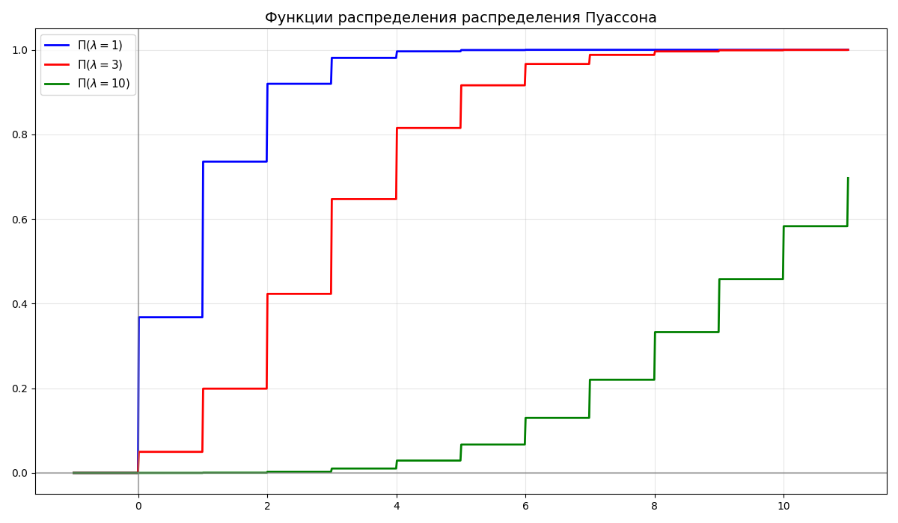

* Равномерное распределение $U(a, b)$ - непрерывное распределение, случайная величина $\xi$ которого имеет функцию плотности $$f_\xi(x) = \begin{cases}0, & x < 0 \\ \frac{1}{b - a}, & a \leq x \leq b \\ 0, & x > b\end{cases}$$

    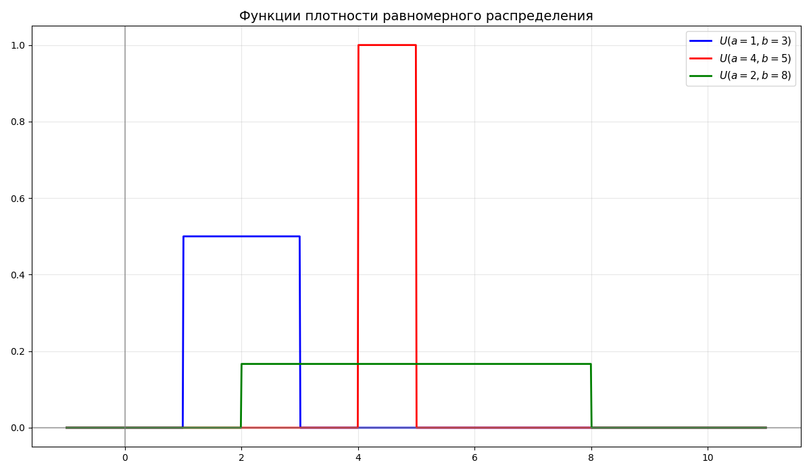

* Случайная величина $\xi$ имеет показательное распределение $E(\alpha)$, если функция плотности имеет вид $$f_\xi(x) = \begin{cases}0, & x < 0 \\ \alpha e^{-\alpha x}, & x \geq 0\end{cases}$$

    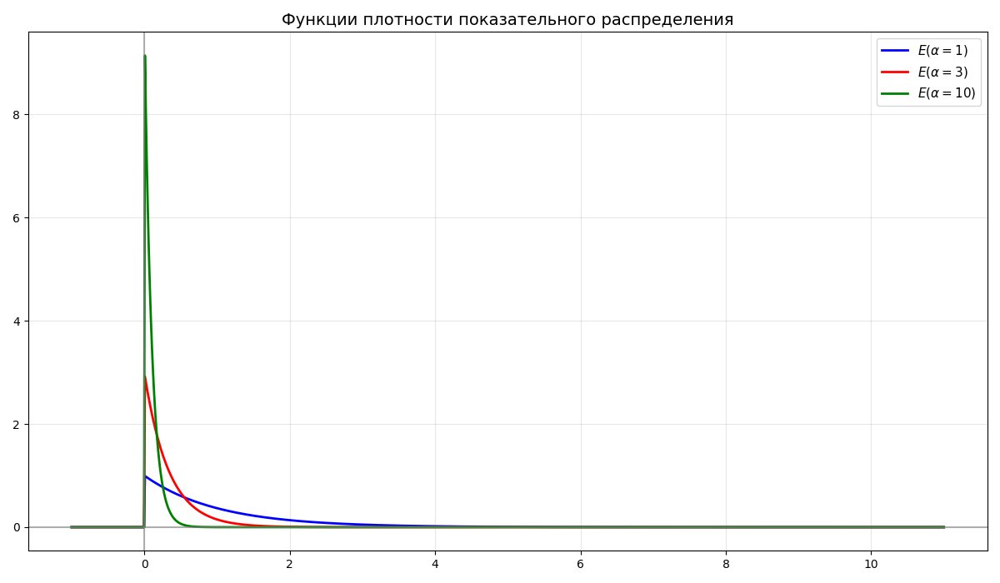

* Случайная величина $\xi$ имеет нормальное распределение $N(a, \sigma^2)$, если функция плотности имеет вид $\displaystyle f_\xi(x) = \frac{1}{\sigma \sqrt{2\pi}} e^{-\frac{(x-a)^2}{2\sigma^2}}$, где $a$ - среднее, $\sigma$ - среднеквадратичное отклонение

    Из этого $\displaystyle F_\xi(x) = \frac{1}{\sigma \sqrt{2\pi}} \int_{-\infty}^x e^{-\frac{(t-a)^2}{2\sigma^2}} dt$

    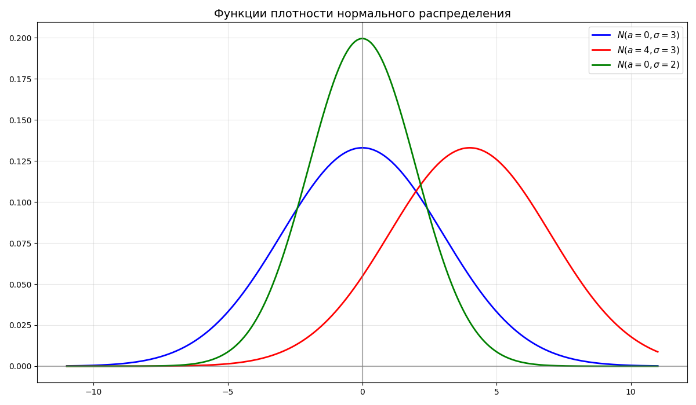

* Случайная величина $\xi$ имеет логарифмически-нормальное (логнормальное) распределение, если $\xi = e^\eta$, где $\eta \in N(a, \sigma^2)$

    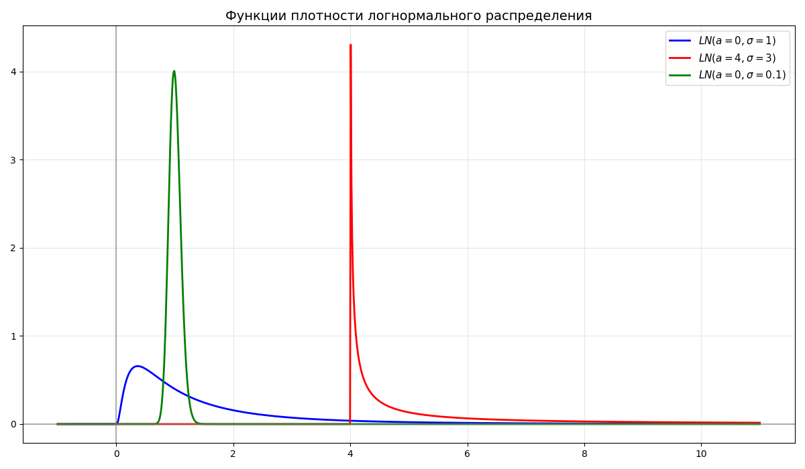

* Случайная величина $\chi^2$ имеет распределение "хи-квадрат" $H(n)$ со степенями свободы $n$, если $\chi^2 = X_1^2 + X_2^2 + \dots + X_n^2$ - сумма $n$ квадратов независимых стандартных нормальных величин

    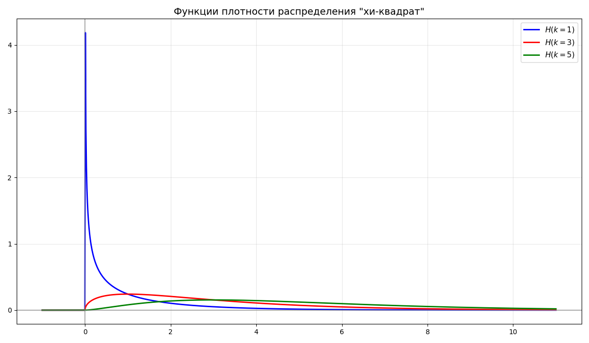

* Случайная величина $t_k$ имеет распределение Стьюдента $T(k)$ со степенями свободы $k$, если $\displaystyle t_k = \frac{X_0}{\frac{1}{k}(X_1^2 + X_2^2 + \dots + X_n^2)} = \frac{X_0}{\frac{\chi^2_k}{k}}$, где $X_0, \dots, X_n$ - независимые стандартные нормальные величины

    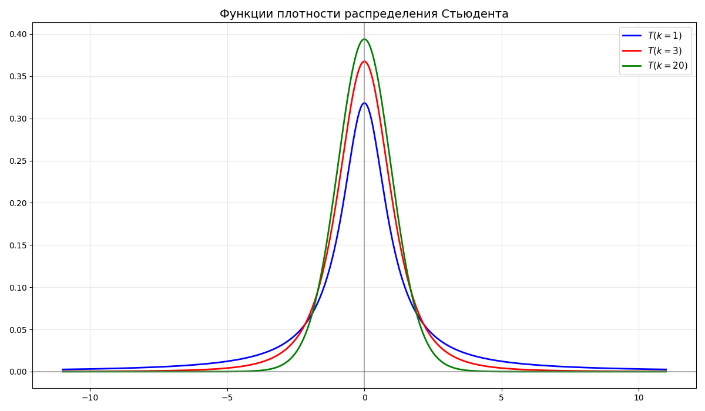

* Случайная величина $f_{n,m}$ имеет распределение Фишера (или F-распределение) $F(n, m)$ со степенями свободы $n$ и $m$, если $\displaystyle f_{n,m} = \frac{\frac{\chi^2_n}{n}}{\frac{\chi^2_m}{m}}$, где $\chi^2_n$, $\chi^2_m$ - независимые случайные величины распределения "хи-квадрат"

    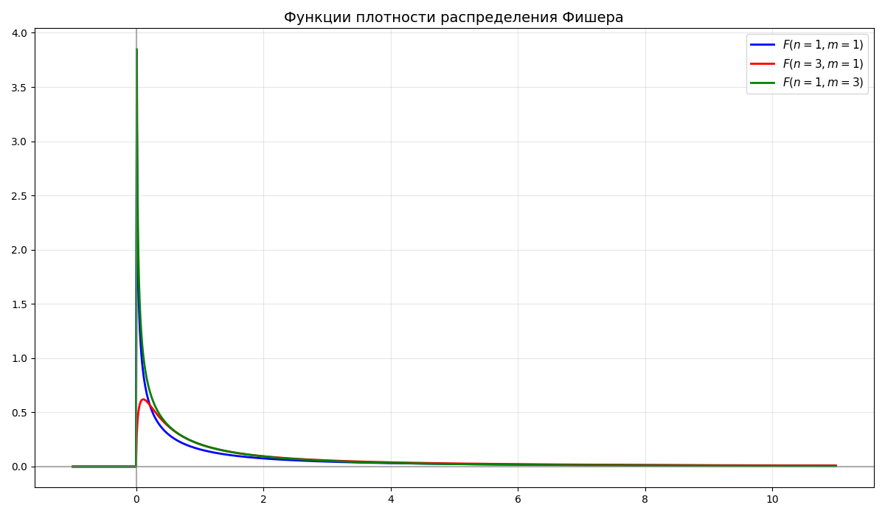

* Математическое ожидание $E \xi$ - взвешенное по вероятности среднее значение случайной величины

    Для дискретного распределения $\displaystyle E \xi = \sum_{i = 1}^n p_i x_i$

    Для непрерывного распределения $\displaystyle E \xi = \int_{-\infty}^\infty x f_\xi(x) dx$

* Дисперсия $D \xi$ - математическое ожидание квадрата отклонения случайной величины от ее математического ожидания. В общем случае $D\xi = E(\xi - E\xi)^2 = E\xi^2 - (E\xi)^2$

    Для дискретного распределения $\displaystyle E \xi = \sum_{i = 1}^n p_i (x_i - E\xi)^2$

    Для непрерывного распределения $\displaystyle E \xi = \int_{-\infty}^\infty f_\xi(x) (x - E\xi)^2 dx$

* Среднеквадратическое отклонение $\sigma_\xi = \sqrt{D \xi}$ определяется как корень дисперсии

* Медиана $Me$ непрерывной случайной величины $\xi$ называется значение случайной величины $\xi$, такое что $P(\xi < Me) = P(\xi > Me) = \frac{1}{2}$

    Вместо среднего обычно берут медиану, так как медиана меньше зависит от выбросов

    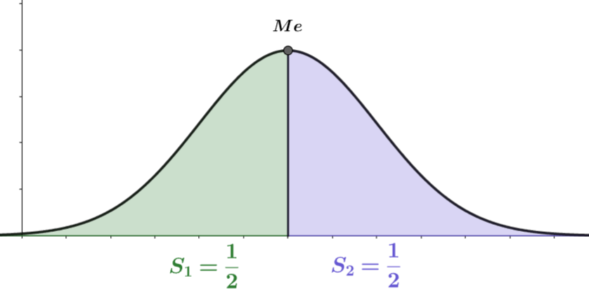

* Мода - значение, вероятность которого выше всего. Если в выборке есть два или больше значения, вероятность которых равна и наибольшая, то они считаются модами

    Функция называется унимодальной, если четко выражена одна мода, иначе - многомодальной

    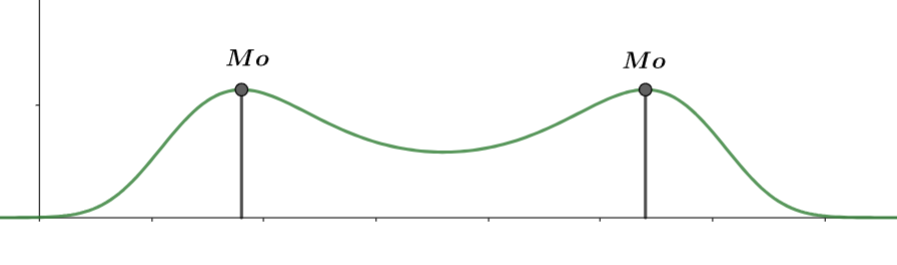

* Размах - разность между максимальным и минимальным значением

* Генеральной совокупностью называются все результаты проведенных экспериментов

    Выборочной совокупностью (выборка) $X$ называются наблюдаемые данные экспериментов

    Выборка называется репрезентативной, если ее распределение совпадает с распределением генеральной совокупности

    Так как описать все проведенные эксперименты невозможно, берут небольшую выборку. Выборка выбирается так, чтобы она была репрезентативной, например, в проведении измерения роста людей нецелесообразно брать 10 людей из Юго-Восточной Азии, так как они не представляют все население Земли

* Выборочным средним называется величина $\overline{X} = \frac{1}{n} \sum X_i$

* Выборочной дисперсией называется величина $D^* = \frac{1}{n} \sum (X_i - \overline{X})^2 = \frac{1}{n} \sum X_i^2 - \overline{X}^2$

* Исправленной выборочной дисперсией называется величина $S^2 = \frac{n}{n - 1} D^* = \frac{1}{n - 1} \sum (X_i - \overline{X})^2$

---

Машинное обучение - класс методов искусственного интеллекта, характерной чертой которых является не прямое решение задачи, а обучение за счёт применения решений множества сходных задач. Обучение основано на выявлении эмпирических закономерностей в данных

Перед тем как датасет (набор данных) применяется в обучении, его необходимо подготовить 

Данные могут быть:

* Числовыми - те, которые могут быть представлены числом, например, возраст, вес, рост. Числовые (или количественные) данные могут быть дискретными или непрерывными
* Качественным (или категориальными) - данные, которые представляют качества или категории. Бывают:
    * Номинальные - данные, которые невозможно отсортировать, например, страна проживания, пол
    * Порядковые - категории, которые представляют иерархический порядок, например, размер одежды, дворянские титулы

Чаще всего, формируя датасет, получается, что некоторых характеристик у объекта нет. Тогда можно прибегнуть к таким способам:

1. Удалить строки с неизвестной переменной или не принимать их во внимание
2. Заполнить средним/медианой/модой (обычно так делать не стоит)
3. Интерполяция 
4. Заполнение на основе соседних данных

Далее данные очищаются от выбросов (аутлаеров, от outlier) - группы значений, выделяющихся из общей выборки

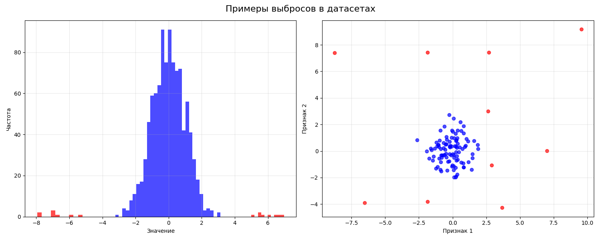

Категориальные переменные принимают только определенный набор значений, которые в общем смысле нельзя сравнить. Методы машинного обучения работают с числовыми значениями, поэтому нужно превратить категориальную характеристику в числовую

Можно представить категориальную переменную в бинарный вектор. Например, цвета "красный", "зеленый", "синий" можно превратить в вектор из трех переменных: `is_red`, `is_green`, `is_blue`. Если цвет красный, то `is_red = 1`, `is_green = 0`, `is_blue = 0`. Такой подход называется [унитарным кодом](https://ru.wikipedia.org/wiki/%D0%A3%D0%BD%D0%B8%D1%82%D0%B0%D1%80%D0%BD%D1%8B%D0%B9_%D0%BA%D0%BE%D0%B4) (или one-hot encoding)

Если просто пронумеровать цвета, то в нашу переменную вносится порядок, что может негативно сказаться в ходе обучения
