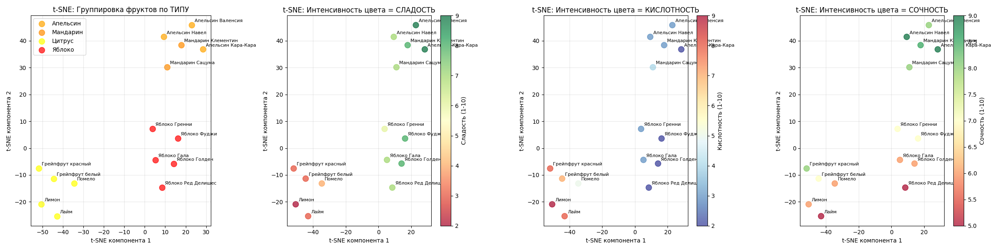

## Лекция 4. Нелинейные методы уменьшения размерности

### Стохастическое вложение соседей с t-распределением

Стохастическое вложение соседей с t-распределением (t-distributed Stochastic Neighbor Embedding, t-SNE) - алгоритм, хорошо подходящий для визуализации данных в низкой размерности

Такой метод моделирует данные так, что близлежащие точки после алгоритма находятся рядом, а далеко стоящие с высокой вероятностью будут далеко друг от друга

Для этого:

1. Для каждой пары точек $x_i$ и $x_j$ вычисляется евклидово расстояние $d_{ij} = \|x_i - x_j\|$

2. Далее определяется вероятность того, что точка $x_j$ будет соседом точки $x_i$:

    $$p_{j|i} = \frac{e^{-\frac{d^2_{ij}}{2\sigma_i^2}}}{\sum_{k \neq i} e^{-\frac{d^2_{ik}}{2\sigma^2_i}}}$$

    То есть доля $F_\xi (d_{ij})$ от суммы $\sum_{k \neq i} F_\xi (d_{ik})$ для всех точек, где $\xi$ - случайная величина из $N(0, \sigma_i^2)$

3. Для метода задается параметр перплексии $\mathrm{Perp}$. От него определяется значение $\sigma_i$ такое, что $\mathrm{Perp}(P_i) = 2^{H(P_i)}$, где $H(P_i) = - \sum_{j\neq i} p_{j\|i} \log_2 p_{j\|i}$ - энтропия Шеннона

    В t-SNE функция перплексии $\mathrm{Perp}(P_i)$ устанавливается на какое-то число (оно называется `perplexity`, обычно от 1 до 100), благодаря которому можно вывести $\sigma_i$

    Чем больше перплексия, тем больше вероятность того, что некоторая точка будет соседом для другой точки

    При этом перплексия не должна быть больше $n - 1$, где $n$ - размер датасета

4. Совместная вероятность $p_{ij}$ определяется как $p_{ij} = \frac{p_{j\|i} + p_{i\|j}}{2n}$, при этом $p_{ii} = 0$

    Заметим, что $p_{j\|i} \neq p_{i\|j}$

5. Пусть точки $y_i$ и $y_j$ - отображения точек $x_i$ и $x_j$ на целевом пространстве низкой размерности. Тогда установим, что вероятность того, что $y_i$ и y_j$ - соседи, равна 

    $$q_{ij} = \frac{(1 + \|y_i - y_j\|^2)^{-1}}{\sum_{k \neq l} (1 + \|y_k - y_l\|^2)^{-1}}$$

    При этом $q_{ii} = 0$

    Здесь берется функция плотности $F_t = \frac{\Gamma\left(\frac{n + 1}{2}\right) \left(1 + \frac{x^2}{n}\right)^{-\frac{n + 1}{2}}}{\sqrt{n\pi} \Gamma\left(\frac{n}{2}\right)}$ случайной величины $t$ из распределения Стьюдента $T_n$ при степени свободы $n = 1$, тогда

    $$q_{ij} = \frac{F_t(\|y_i - y_j\|)}{\sum_{k \neq l} F_t(\|y_k - y_l\|)}$$

6. Если вы дочитали до этого момента, то тут берется функция расстояния Кульбака-Лейблера

    $$\mathrm{KL}(P \| Q) = \sum_{i \neq j} \log \frac{p_{ij}}{q_{ij}},$$

    которая с помощью градиентного спуска (метод нахождения минимума многомерной функции) минимизируется по отношению к точкам $y_i$

    Количеством итераций алгоритма t-SNE называется количество шагов градиентного спуска - чем больше, тем точнее. На больших датасетах берется 500-2000, для приблизительной быстрой оценки 250-500

Наконец-то, мы получили точки $y_i$, которые можно отобразить на плоскости

---

Пример: есть датасет с 15 фруктами (яблоки и цитрусы), для них мы знаем кислотность, сладость и сочность

Алгоритм t-SNE с `perplexity=4` явно отделит их и расположит на плоскости:

При этом также явно можно заметить, что на проекции они кластеризовались по своим признакам

Код пример - [machlearn_tsne_example.py](./examples/machlearn_tsne_example.py)

---

Другой пример - есть датасет с изображениями цифр от 0 до 9. Изображение состоит из сетки 8 на 8 (256 пикселей), где один пиксель - число от 0 до 1, обозначающий оттенок серого

Тогда можно понаблюдать, что происходит при разных `perplexity`:

При маленьком `perplexity` образуются маленькие кластеры, а при большом - они "слипаются"

### UMAP 

> TODO
