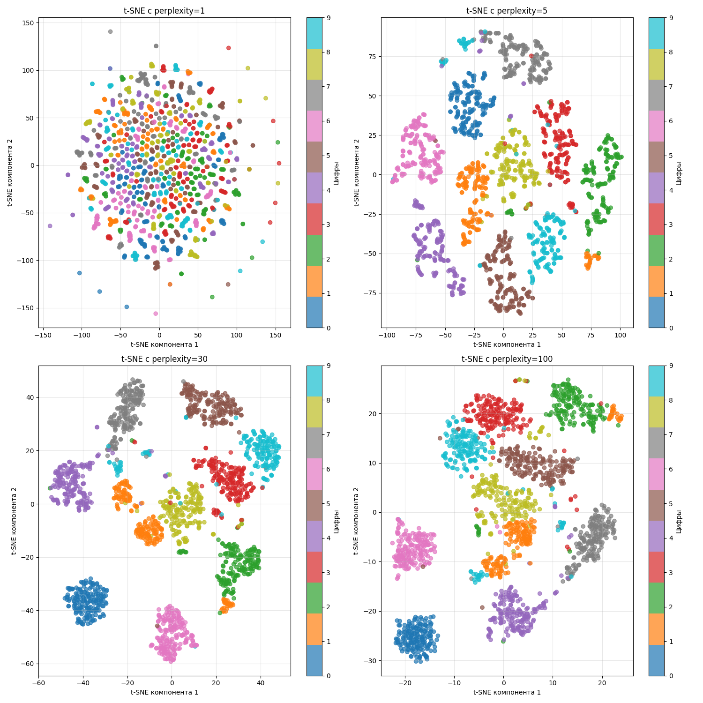
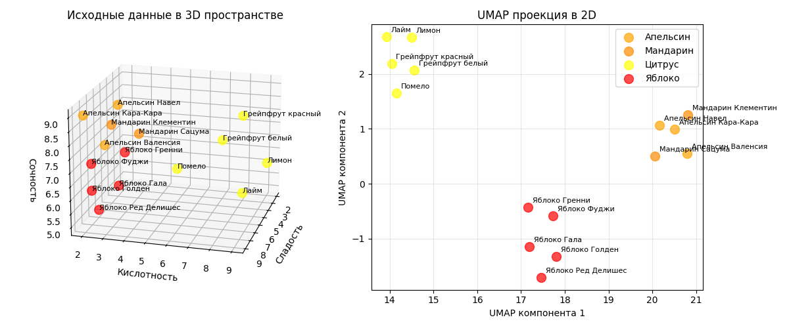
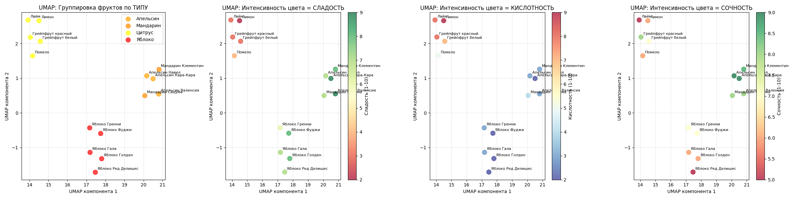
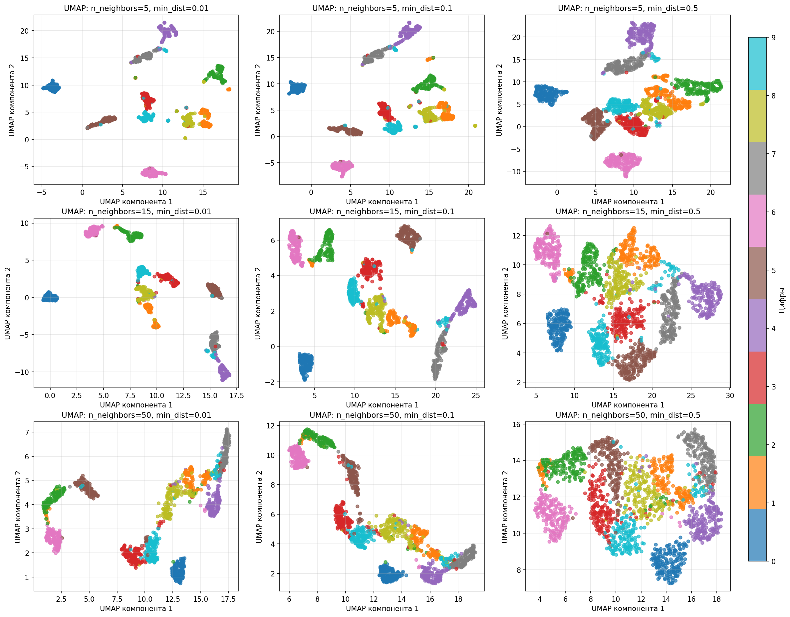

## Лекция 4. Нелинейные методы уменьшения размерности

### Стохастическое вложение соседей с t-распределением

Стохастическое вложение соседей с t-распределением (t-distributed Stochastic Neighbor Embedding, t-SNE) - алгоритм, хорошо подходящий для визуализации данных в низкой размерности

Такой метод моделирует данные так, что близлежащие точки после алгоритма находятся рядом, а далеко стоящие с высокой вероятностью будут далеко друг от друга

Для этого:

1. Для каждой пары точек $x_i$ и $x_j$ вычисляется евклидово расстояние $d_{ij} = \|x_i - x_j\|$

2. Далее определяется вероятность того, что точка $x_j$ будет соседом точки $x_i$:

    $$p_{j|i} = \frac{e^{-\frac{d^2_{ij}}{2\sigma_i^2}}}{\sum_{k \neq i} e^{-\frac{d^2_{ik}}{2\sigma^2_i}}}$$

    То есть доля $F_\xi (d_{ij})$ от суммы $\sum_{k \neq i} F_\xi (d_{ik})$ для всех точек, где $\xi$ - случайная величина из $N(0, \sigma_i^2)$

3. Для метода задается параметр перплексии $\mathrm{Perp}$. От него определяется значение $\sigma_i$ такое, что $\mathrm{Perp}(P_i) = 2^{H(P_i)}$, где $H(P_i) = - \sum_{j\neq i} p_{j\|i} \log_2 p_{j\|i}$ - энтропия Шеннона

    В t-SNE функция перплексии $\mathrm{Perp}(P_i)$ устанавливается на какое-то число (оно называется `perplexity`, обычно от 1 до 100), благодаря которому можно вывести $\sigma_i$

    Чем больше перплексия, тем больше вероятность того, что некоторая точка будет соседом для другой точки

    При этом перплексия не должна быть больше $n - 1$, где $n$ - размер датасета

4. Совместная вероятность $p_{ij}$ определяется как $p_{ij} = \frac{p_{j\|i} + p_{i\|j}}{2n}$, при этом $p_{ii} = 0$

    Заметим, что $p_{j\|i} \neq p_{i\|j}$

5. Пусть точки $y_i$ и $y_j$ - отображения точек $x_i$ и $x_j$ на целевом пространстве низкой размерности. Тогда установим, что вероятность того, что $y_i$ и y_j$ - соседи, равна 

    $$q_{ij} = \frac{(1 + \|y_i - y_j\|^2)^{-1}}{\sum_{k \neq l} (1 + \|y_k - y_l\|^2)^{-1}}$$

    При этом $q_{ii} = 0$

    Здесь берется функция плотности $F_t = \frac{\Gamma\left(\frac{n + 1}{2}\right) \left(1 + \frac{x^2}{n}\right)^{-\frac{n + 1}{2}}}{\sqrt{n\pi} \Gamma\left(\frac{n}{2}\right)}$ случайной величины $t$ из распределения Стьюдента $T_n$ при степени свободы $n = 1$, тогда

    $$q_{ij} = \frac{F_t(\|y_i - y_j\|)}{\sum_{k \neq l} F_t(\|y_k - y_l\|)}$$

6. Если вы дочитали до этого момента, то тут берется функция расстояния Кульбака-Лейблера (или сумма дивергенций Кульбака-Лейблера)

    $$\mathrm{KL}(P \| Q) = \sum_{i \neq j} p_{ij} \log \frac{p_{ij}}{q_{ij}},$$

    которая с помощью градиентного спуска (метод нахождения минимума многомерной функции) минимизируется по отношению к точкам $y_i$, которые изначально были установлены случайным образом (отсюда стохастический)

    Точки $y_i$ в ходе градиентного спуска "притягиваются" к своим местам

    Количеством итераций алгоритма t-SNE называется количество шагов градиентного спуска - чем больше, тем точнее. На больших датасетах берется 500-2000, для приблизительной быстрой оценки 250-500

Наконец-то, мы получили точки $y_i$, которые можно отобразить на плоскости

Распределение Стьюдента с одной степенью свободы имеет более тяжелые хвосты, чем нормальное распределение. Это позволяет близким точкам оставаться очень близкими,а далеким точкам быть очень далекими 

Алгоритмическая сложность вычисляется так:

* Вычисление попарных расстояний - $O(n^2 d)$
* Поиск $\sigma_i$ для каждой точки - $O(n^2 \log \mathrm{Perp})$
* Каждая итерация градиентного спуска - $O(n^2 k)$

где $d$ - размерность исходного пространства, $k$ - размерность целевого

---

Пример: есть датасет с 15 фруктами (яблоки и цитрусы), для них мы знаем кислотность, сладость и сочность

Алгоритм t-SNE с `perplexity=4` явно отделит их и расположит на плоскости:

При этом также явно можно заметить, что на проекции они кластеризовались по своим признакам

Код пример - [machlearn_tsne_example.py](./examples/machlearn_tsne_example.py)

---

Другой пример - есть датасет с изображениями цифр от 0 до 9. Изображение состоит из сетки 8 на 8 (256 пикселей), где один пиксель - число от 0 до 1, обозначающий оттенок серого

Тогда можно понаблюдать, что происходит при разных `perplexity`:

При маленьком `perplexity` образуются маленькие кластеры, а при большом - они "слипаются"

---

Метод t-SNE используется для:

* Для визуализации
* Для кластеризации

Однако надо учитывать его недостатки:

* t-SNE вычислительно дорогой
* Не сохраняет глобальную структуру
* Чувствительный к значению `perplexity`

### Алгоритм UMAP 

Алгоритм UMAP (Uniform Manifold Approximation and Projection) - алгоритм, похожий на t-SNE. Алгоритм UMAP был создан в 2018 году (статья - [\*тык\*](https://arxiv.org/pdf/1802.03426)) с целью получить более сильное математическое обоснование

Работает он так:

1. Даны параметры $k = \text{n_neighbors}$, где `n_neighbors` - заданное число ближайших соседей

2. Далее для каждое точки $x_i$ ищется $k$ ближайших соседей $T = \{t_1, \dots, t_k\}$, используя в качестве расстояния любимую метрику $\mathrm{dist}(x_i, t_i)$ (например, евклидово расстояние $\mathrm{dist}(x_i, t_i) = \|x_i - t_i\|$)

3. Теперь для каждой точки вычисляет расстояние до самого ближнего соседа $\displaystyle \rho_i = \min_{t \in T} \mathrm{dist}(x_i, t)$

    Также вычисляется $\sigma_i$ из уравнения $\sum_{t \in T} e^{-\frac{\mathrm{dist}(x_i, t) - \rho_i}{\sigma_i}} = \log_2 k$

4. Теперь строится взвешенный ориентированный граф, где вес ребра из точки $x_i$ в точку $x_j$ определяется как $v(x_i \to x_j) = e^{-\frac{\mathrm{dist}(x_i, x_j) - \rho_i}{\sigma_i}}$

5. Этот граф превращается в взвешенный неориентированный, тогда вес ребра из точки $x_i$ в точку $x_j$ определяется как $v_{ij} = v(x_i \to x_j) + v(x_j \to x_i) - v(x_i \to x_j) \cdot v(x_j \to x_i)$

6. После этого случайным образом создается новый граф в целевом пространстве меньшей размерности, с тем же количеством вершин, ребер и соответственными степенями вершин. В нем вес ребра считается как

    $$w_{ij} = \frac{1}{1 + a \cdot \mathrm{dist}(y_i, y_j)^{2b}}$$

    Параметры $a$ и $b$ подбираются так, что бы $\frac{1}{1 + a \cdot \text{min_dist}^{2b}} = 0.5$, а значение производной $\frac{\partial w_{ij}}{\partial \mathrm{dist} (y_i, y_j)} = -1$ в точке $\mathrm{dist}(y_i, y_j) = \text{min_dist}$

7. Теперь составляется функция расстояний Кульбака-Лейбнера

    $$\mathrm{KL}(P \| Q) = \sum_{i \neq j} v(x_i, x_j) \log \frac{v(x_i, x_j)}{w(y_i, y_j)} + (1 - v(x_i, x_j)) \log \left(\frac{1 - v(x_i, x_j)}{1 - w(x_i, x_j)}\right),$$

    которая с помощью стохастического градиентного спуска минимизируется

    Алгоритм градиентного спуска работает фиксированное число итераций (так называемых эпох)

Теперь мы получаем координаты точек $y_i$ в пространстве меньшей размерности

Алгоритмическая сложность UMAP вычисляется так:

* Нахождение ближайших соседей - $O(n^2)$ (с оптимизациями можно $O(n \log n)$)
* Построение графа - $O(nk)$
* Градиентный спуск - $O(Tnk)$, где $T$ - количество эпох

Получается $O(n \log n + Tnk)$

Алгоритм UMAP выходит быстрее на больших выборках данных (при $n > T$)

---

Пример: возьмем этот же датасет с 15 фруктами (яблоки и цитрусы). Алгоритм UMAP с `n_neighbors=5` и `min_dist=0.1` отделит фрукты с разными параметрами

На маленьких датасетах, как можно заметить, при правильно подобранных параметрах результат UMAP мало отличим от t-SNE

Код пример - [machlearn_umap_example.py](./examples/machlearn_umap_example.py)

---

Посмотрим, что происходит при разных `n_neighbors` и `min_dist` на датасете с изображениями цифр:

Малое значение `n_neighbors` подчеркивает локальную структуру, а большое - связи между кластерами, то есть `n_neighbors` влияет на масштаб. Расстояние `min_dist` влияет на плотность кластера на графика

---

На практике параметры `n_neighbors` и `min_dist` определяются методом тыка, но хорошими начальными значениями являются $\text{n_neighbors} = \sqrt{n}$, $\text{min_dist} = 0.1$

Таким образом, алгоритм UMAP

1. Обладает высокой скоростью работы на больших наборах данных
2. Сохраняет глобальную структуру
3. Устойчив к разной плотности (что видно на примере выше)
4. Более универсален, в отличии от t-SNE

Также стоит учесть недостатки:

1. Чувствительность к параметрам, результаты сильно зависят от выбора n_neighbors
2. Случайность
3. Сложность интерпретации расстояний

