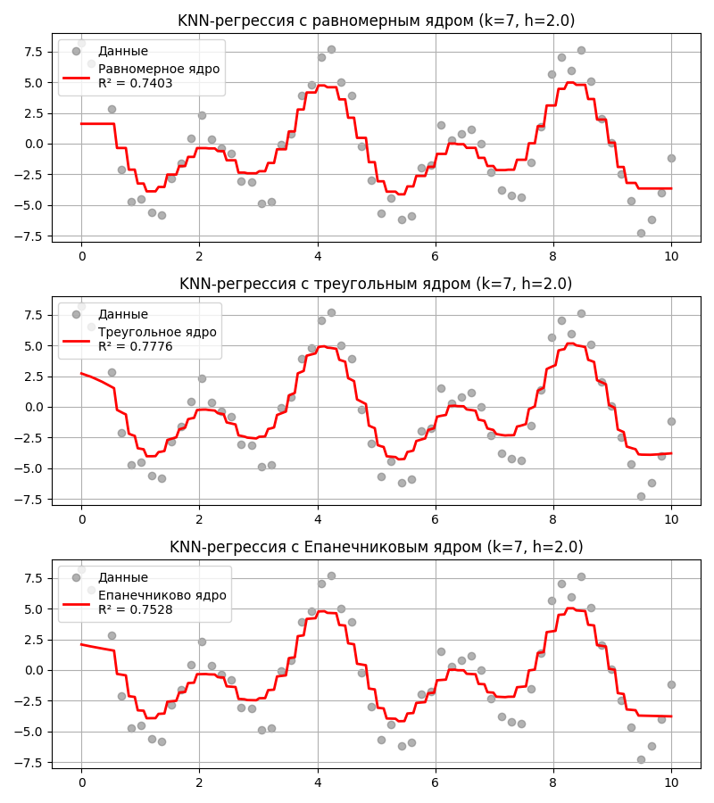

## Лекция 5. Метрики, метод k ближайших соседей

Во время обучения модели возникает компромисс отклонение-дисперсия (Bias-variance tradeoff): ошибку модели, то есть то, насколько ее предсказывание неверно от реального результата, можно поделить на три части:

* Смещение - погрешность оценки, возникающая в результате ошибочного предположения в алгоритме обучения
* Дисперсия - ошибка чувствительности к малым отклонениям в тренировочном наборе
* Шум - дополнительная ошибка, которую никак нельзя предсказать

Более простые, недообученные модели склонны иметь большое смещение, а более сложные, переобученные очень чувствительные к значениям переменных и не способны предсказывать общую закономерность

Поэтому данные делят на три части:

* Тренировочные данные (Train set) - это данные, на которых модель обучается, то есть подбирает свои параметры
* Тестовые данные (Test set) - это данные, на которых оценивается качество модели, которые модель не видела во время обучения
* Данные для проверки (Validation set) - для более точного подбора гиперпараметров модели путем их проверки на этих данных

    Гиперпараметры же находятся с помощью данных для проверки:

    * подбором
    * рандомом
    * техниками оптимизации

Главная цель - проверить, насколько модель обобщается на новые, невиданные данные. Это нужно, чтобы:

* Предотвратить переобучение - ситуацию, когда модель слишком хорошо запомнила тренировочные данные, но при этом плохо обобщает на новые данные (тестовые или реальные)

* Если проверять модель на тех же данных, на которых она обучалась, результат будет чрезмерно оптимистичным

* Модель может запомнить конкретные примеры, но не научится общим закономерностям

В том числе для предотвращения переобучения используется перекрестная проверка (K-Fold Cross Validation):

1. Выборка делится на `k` частей
2. Далее каждая из частей становится тестовыми данными, а остальные - тренировочными
3. Модель обучается на тренировочных, проверяется на тестовых, получаем `k` определенных метрик для `k` обученных моделей
4. Берется общее этих метрик (например, среднее арифметическое), чтобы оценить точность и эффективность с наиболее равномерным использованием имеющихся данных

Зачастую датасеты могут быть несбалансированными, то есть намного чаще обладать одним признаком А, нежели другим признаком B (например, список транзакций, где чаще всего будут успешные), что помешает обучению модели. Для решения этого есть такие методы:

1. Добавление примеров меньшего класса (Oversampling)

    Добавление примеров может привести к переобучению, если просто дублировать данные

    Самый известный метод добавления - SMOTE (о нем позже)

2. Уменьшение примеров большего класса (Undersampling)

    При уменьшении мы случайно удаляем часть примеров из преобладающего класса. При этом мы теряет часть информации из обучающего набора

3. Взвешивание классов: увеличиваем вес редкому классу в функции потерь

4. Изменение порога классификации

### Метрики

Методы машинного обучения в основном решают две задачи:

* Классификация - предсказание принадлежности объекта к классу
* Регрессия - предсказание результата на основе неявной закономерности или корреляции

Чтобы понять, насколько хороша наша модель классификации, допустим, что наша модель выводит 0 или 1 в качестве результата, посчитаем, столько таких результатов:

* Истинно положительные (True Positive, TP) - такие, в которых модель права и выдала 1
* Истинно отрицательные (True Negative, TN) - такие, в которых модель права и выдала 0
* Ложноположительные (False Positive, FP) - такие, в которых модель ошиблась и выдала 1
* Ложноотрицательные (False Negative, FN) - такие, в которых модель ошиблась и выдала 0

Тогда составим следующие метрики:

* **Аккуратностью** (Accuracy) модели называют долю верно предсказанных результатов от всех: $\displaystyle \mathrm{Accuracy} = \frac{\mathrm{TP} + \mathrm{TN}}{\mathrm{TP} + \mathrm{TN} + \mathrm{FP} + \mathrm{FN}}$

    Аккуратность не работает, если классы не сбалансированы в выборке. Например, если в больнице 95 пациентов здоровы, 5 - больны, а модель предсказала, что все здоровы, то аккуратность будет равна 95%, хотя больных мы не нашли

    Аккуратность используется, когда все ошибки одинаково важны

* **Точностью** (Precision) модели называют долю истинно положительных от всех предсказанных положительных результатов: $\displaystyle \mathrm{Precision} = \frac{\mathrm{TP}}{\mathrm{TP} + \mathrm{FP}}$

    Точность полезна, когда мы хотим уменьшить число ложноположительных срабатываний, например, для фильтра спама

* **Запоминанием** (Recall) модели называют долю истинно положительных от всех действительно положительных результатов: $\displaystyle \mathrm{Recall} = \frac{\mathrm{TP}}{\mathrm{TP} + \mathrm{FN}}$

    Запоминание применяют для уменьшения ложноотрицательных результатов, например, в случае выставления медицинского диагноза

* **F-мера** (F-score или F1-score) модели называют гармоническое среднее от точности и запоминания: $\displaystyle F_1 = \frac{2}{\frac{1}{\mathrm{Precision}} + \frac{1}{\mathrm{Recall}}} = \frac{2 \mathrm{Precision} \cdot \mathrm{Recall}}{\mathrm{Precision} + \mathrm{Recall}} = \frac{2\mathrm{TP}}{2\mathrm{TP} + \mathrm{FN} + \mathrm{FP}}$

    F-мера используется, когда нужен компромисс между точностью и запоминанием. Если одна из метрик низкая, то она сильно занизит F-меру

Зачастую, модель возвращает не 0 или 1, а вероятность того, насколько принадлежит объект к классу. Если вероятность выше установленного порога $\alpha$, то считается, что объект принадлежит классу

* ROC-кривая (Receiver Operating Characteristic) показывает, насколько хорошо модель различает классы. Строится она так:

    1. Для каждого порога от 0 до 1 считаем, сколько раз мы угадали правильно и неправильно
    2. Вычисляем две метрики: 
        * частоту истинно положительных - $\displaystyle \mathrm{True\ Positive\ Rate} = \frac{\mathrm{TP}}{\mathrm{TP} + \mathrm{FN}}$
        * частоту ложноположительных - $\displaystyle \mathrm{False\ Positive\ Rate} = \frac{\mathrm{FP}}{\mathrm{FP} + \mathrm{TN}}$

    3. Отмечаем точки $(\mathrm{False\ Positive\ Rate}, \mathrm{True\ Positive\ Rate})$ на плоскости, соединяем их - получаем кривую от $(0, 0)$ до $(1, 1)$

    Полученная линия показывает, как меняется баланс между количеством ложных срабатываний и истинных попаданий

    Площадь под кривой (ROC-AUC, Area Under Curve) - метрика, измеряющая общую способность модели различать классы. Для модели, возвращающей случайные результаты, ROC-кривая представляет прямую из $(0, 0)$ до $(1, 1)$, если полученная кривая располагается выше линии $y = x$ (то есть площадь больше $0.5$), то модель предсказывает лучше, чем случайная модель

* PR-кривая (Precision-Recall) показывает баланс между точностью и запоминанием при разных порогах классификации. Аналогично, отмечаем точки $(\mathrm{Precision}, \mathrm{Recall})$ для каждого порога

    Площадь под кривой PR-AUC высока, если модель находит большинство положительных объектов и делает мало ложных срабатываний. Метрика PR-AUC полезна, если классы в выборке несбалансированны

---

Если модель решает задачу регрессии, то полезны другие метрики:

* Среднее значение абсолютных разностей (Mean Average Error) - $\displaystyle \mathrm{MAE} = \frac{1}{n} \sum_{i = 1}^{n} \vert y_i - y_i^\prime \vert$

    Метрика устойчива к выбросам

* Среднее значение квадратов разности (Mean Squared Error) - $\displaystyle \mathrm{MSE} = \frac{1}{n} \sum_{i = 1}^{n} (y_i - y_i^\prime)^2$

    Метрика сильно увеличивается, если разность большая

* Квадратный корень среднего значения квадратов разности (Rooted Mean Squared Error) - $\displaystyle \mathrm{RMSE} = \sqrt{\mathrm{MSE}} = \sqrt{\frac{1}{n} \sum_{i = 1}^{n} (y_i - y_i^\prime)^2}$

    Метрика в тех же единицах, что и $y_i$

* Коэффициент детерминации $\displaystyle R^2 = 1 - \frac{\sum (y_i - \hat y_i)^2}{\sum (y_i - \overline{y})^2}$ показывает, какая доля дисперсии $y_i$ объясняется моделью через признаки $x_i$

    Если $R^2 = 1$, то модель идеально объясняет все данные. Если $R^2 = 0$, то модель ничего не объясняет, а если $R^2 < 0$ (то есть $\sum (y_i - \hat y_i)^2 > \sum (y_i - \overline{y})^2$), то модель предсказывает хуже, чем модель, которая на каждый запрос выдает среднее $\overline{y_i}$

### Метод k ближайших соседей

Метод $k$ ближайших соседей (K-Nearest Neighbors Method) - алгоритм для автоматической классификации объектов

Как он работает:

1. Отмечаем точки $x_i$ из нашей выборки на пространстве
2. Раскрашиваем их в соответствии с классом (для простоты у нас будут классы 1 и 0)
3. Далее отмечаем точку $A$, класс которой мы хотим предсказать
4. Вычисляем расстояния от точки $A$ до точек $x_i$. Это можно делать с помощью:

    * Евклидова расстояния $\displaystyle \mathrm{dist}(x, y) = \sqrt{\sum_{i} (x_i - y_i)^2}$

    * Метрики Манхэттена $\displaystyle \mathrm{dist}(x, y) = \sum_{i} \vert x_i - y_i \vert$ - лучше устойчива к выбросам в пространствах высокой размерности

    * Метрики Минковского $\displaystyle \mathrm{dist}(x, y) = \sqrt[p]{\sum_{i} (x_i - y_i)^p}$

    * Косинусного расстояния $\displaystyle \mathrm{dist}(x, y) = 1 - \frac{x \cdot y}{\| x \| \cdot \| y \|}$
  
5. Далее находим $k$ ближайших точек $x_i$ к точке $A$, используя выбранную метрику - назовем их $t_i$

6. Пусть $I(t_i, p)$ - индикатор принадлежности к классу $p$. Предсказываем, что точка $A$ принадлежит к классу 1, если среди ее $k$ ближайших соседей больше точек, принадлежащих к 1, чем к 0, то есть $\displaystyle \sum_{i = 1}^k I(t_i, 1) > \sum_{i = 1}^k I(t_i, 0)$

<!-- https://www.geogebra.org/calculator/xh73ajuw -->

Иногда простой подсчет соседей может не точно предсказывать. Тогда можем применить веса к каждой точке, например $w_i = \frac{k + 1 - i}{k}$ - вес точки линейно уменьшается от порядка в наборе ближайших точек, или $w_i = q^i$, где $q \in (0, 1)$

Однако лучше всего учитывать в весе расстояния до точки. Для этого определим ширину окна $h$ (если расстояние до точки за пределами окна, то считаем ее незначимой) и ядерную функцию $K(x)$

Тогда весом для точки считаем $\displaystyle w_i = K\left(\frac{\mathrm{dist}(A, t_i)}{h}\right)$, а в условии будет $\displaystyle \sum_{i = 1}^k K\left(\frac{\mathrm{dist}(A, t_i)}{h}\right) I(t_i, 1)$

В качестве ядерной функции могут быть:

* Равномерная функция (Uniform Kernel) $$K(x) = \begin{cases} \frac{1}{2}, & \vert x \vert \leq 1 \\ 0, & \vert x \vert \geq 1\end{cases}$$ - то есть все веса равны 1
* Треугольная функция (Triangle Kernel) $$K(x) = \begin{cases}1 - \vert x \vert, & \vert x \vert \leq 1 \\ 0, & \vert x \vert \geq 1\end{cases}$$
* Епанечникова (параболическая) функция $$K(x) = \begin{cases}\frac{3}{4} (1 - x^2), & \vert x \vert \leq 1 \\ 0, & \vert x \vert \geq 1\end{cases}$$

Помимо этого метод $k$-ближайших соседей может использоваться для нахождения регрессии. Тогда предсказанное значение $\hat y$ вычисляется как взвешенное среднее $\displaystyle \frac{\sum_{i = 1}^k w_i y_i}{\sum_{i = 1}^k w_i}$ для $k$ ближайших соседей

Преимущества метода $k$-ближайших соседей:

* Довольно простой в реализации
* Достаточно точный
* Подходит для классификации и регрессии

Недостатки:

* Неэффективный по памяти - нужно хранить всю выборку (а она может быть размером в несколько тысяч)
* Вычислительно дорогой - $O(nd)$ для вычисления расстояний ($n$ - размер выборки, $d$ - размер переменных), $O(n \log n)$ на сортировку 
* Чувствителен к масштабу измерений
* Метрическая близость должна совпадать с близостью по семантическому значению, то есть точки с одним классом должны располагаться рядом

---

Метод $k$ ближайших соседей позволяет расширить выборку точками, принадлежащих редкому классу - такая техника известна как SMOTE (Synthetic Minority Over-sampling Technique)

Для этого:

1. Для точки из редкого класса выбираются $k$ ближайших соседей из того же класса
2. Выбирается случайный сосед из этих $k$
3. Новая точка создается на отрезке между точкой и этим соседом

