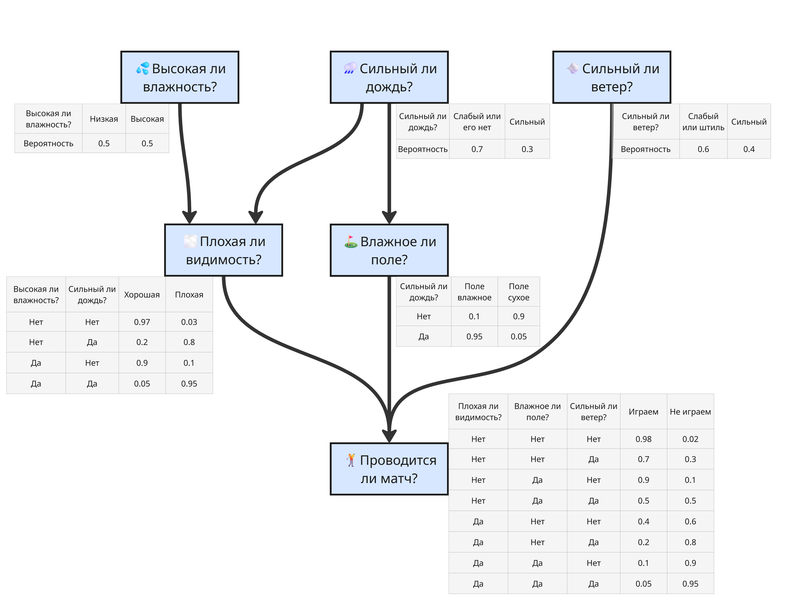
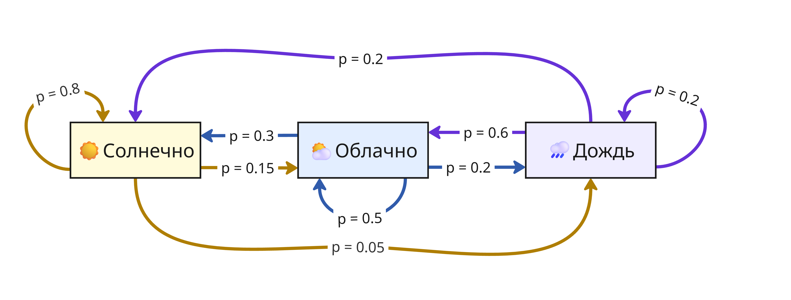

## Лекция 9. Вероятностные подходы

Допустим, есть задача фильтрации спама в письмах

Тогда, вспомнив формулу Байеса:

$$P(A \vert B) = \frac{P(B \vert A) P(A)}{P(B)},$$

мы можем изучить выборку, подсчитать, сколько из них - это спам, а сколько из них содержат такие слова, которые обычно присутствуют в спам-письмах. Тогда вероятность, что письмо является спамом, равна

$$P(\text{письмо - спам} \vert \text{есть слова «выиграли» и др.}) = \frac{P(\text{есть слова «выиграли» и др.} \vert \text{письмо - спам}) P(\text{письмо - спам})}{P(\text{есть слова «выиграли» и др.})}$$

Обозначим $x_i$ - индикатор нахождения $i$-ого слова из спам-словаря в письме, а $y$ - является ли письмо спамом. Мы хотим увеличить апостериорную вероятность $P(y \vert \vec x) = \frac{P(\vec x \vert y) P(y)}{P(\vec x \vert y) P(y) + P(\vec x \vert \overline{y}) P(\overline{y})}$, где $P(\vec x \vert y) = \prod_{i = 1}^n P(x_i \vert y)$, $P(\vec x \vert \overline{y}) = \prod_{i = 1}^n P(x_i \vert \overline{y})$

Вероятность $P(y)$ находится как доля спам-писем от общего числа писем (аналогично $P(\overline{y})$). $P(x_i \vert y)$ может определяться по-разному, например, доля количества спам-писем с $i$-ым словом от числа всех писем $\frac{N_{i,y}}{N_y}$

Такой метод называется наивным байесовский классификатором (Naive Bayes classifier). Такие классификаторы бывают разными в зависимости от выбора $P(x_i \vert y)$:

* Бернулли (Bernoulli Naive Bayes): $P(x_i \vert y) = \frac{N_{i,y}}{N_y}$ - учитываем факт появления слова в письме, поэтому $P(x_i \vert y)$ - доля спам-писем с $i$-ым словом

    Полезен для коротких текстов. Наказывает за отсутствие важных слов. 
    
    Чтобы избежать нулевую вероятность появления редких слов, применяют сглаживание: $P(x_i \vert y) = \frac{N_{i,y} + \alpha}{N_y + \alpha d}$, где обычно $\alpha = 1$, $d = 10$

* Мультиномиальный (Multinomial Naive Bayes): $$P(\vec x \vert y) = \frac{\left( \sum_{i = 1}^n N_i \right)!}{\prod_{i = 1}^n N_i!} \prod \frac{N_{i,y}}{N_y}$$ - здесь учитываем частоту появления слова в письме, где $N_i$ - количество $i$-ых слов в письме

* Гауссовский (Gaussian Naive Bayes): $$P(x_i \vert y) = \frac{1}{\sqrt{2\pi} \sigma_{i,y}} e^{-\frac{(x_i - a_{i,y})^2}{2\sigma_{i,y}^2}}$$ - если признак представляет из себя не количество слов в письме, а нормально распределенное число, то вероятность можно находить как значение функции Гаусса

---

Наивный подход можно расширить, если сделать несколько зависимостей от событий. Получится байесовкая сеть - ориентированный ацикличный граф, вершины которого - это случайные величины, а ребра отражают зависимости

Допустим, что проведение матча зависит от погодных условий. Тогда можно построить такую сеть:

Здесь нам известны явные зависимости, и, исходя из данных, можно найти вероятности

Если зависимости неизвестны, то используют специальные алгоритмы обучения структуры графа:

1. Структурное обучение по ограничениям (constraint-based)

    Структурное обучение по ограничениям ищет зависимости и независимости между переменными с помощью статистических тестов

    1. Берём все переменные $(X_1, X_2, \dots, X_n)$
    2. Проверяем условные независимости двух переменных с помощью критерия "хи-квадрат" или проверки на нулевую корреляцию
        * Если переменные независимы при данном условии - ребра между ними нет
        *  Если зависимы - ребро есть
    1. Далее применяется набор правил, чтобы определить направления стрелок

    Алгоритм Peter-Clark (PC) реализует поиск зависимостей между переменными

    Достоинства:

    * Гарантирует корректную структуру при очень больших данных
    * Основан на строгих статистических тестах

    Недостатки:

    * Плохо работает при малом датасете
    * Экспоненциально растущая сложность при многих переменных, нужно проверять множество условных независимостей

2. Структурное обучение по оценке качества (score-based)

    Структурное обучение по оценке качества не проверяет независимости, а ищет граф, максимизирующий некоторую функцию качества

    1. Задаём функцию качества
        Например, $\mathrm{BIC} = k \ln n - 2 \ln \hat L$ - информационный критерий Байеса (Bayesian Information Criterion), где $k$ - число параметров, $n$ - размер выборки, $\hat L$ - максимальное значение функции правдоподобия

        Функцию $\mathrm{BIC}$ можно пересчитывать для измененного участка, а не для всего графа
    2. Перебираем графы или локально улучшаем текущий граф
    3. Выбираем лучший

    Алгоритмы, реализующие обучение по оценке качества: Tabu Search, Genetic Algorithms, Simulated Annealing

    Достоинства:

    * Гибкость, устойчивость к шуму
    * Даёт хорошую структуру при реальных данных

    Недостатки:

    * Может застрять в локальных максимумах
    * Пространство графов огромно, поэтому нужно много эвристик

Такие алгоритмы могут сочетаться вместе

---

Также используется цепь Маркова - вероятностный автомат, переходы между состояниями которого определяются с некоторой вероятностью

Например, пусть состояния показывают погоду в $i$-ом часу: солнечную, облачную или дождливую. Если погода сейчас солнечная, то с вероятностью $p = 0.8$ она останется такой же, $p = 0.15$ - станет облачной, и $p = 0.05$ - пойдет дождь. Аналогично с другими переходами, тогда получаем такую цепь:

Здесь состояния зависят от предыдущего, но при проведении достаточного числа переходов можно определить вероятность каждого состояния

Цепь Маркова используется в методе Монте-Карло с марковскими цепями (Markov chain Monte Carlo, MCMC) для моделирования вероятностей зависимых событий, например, интенсивность распада в ядерной реакции или наиболее вероятное следующее слово в тексте

