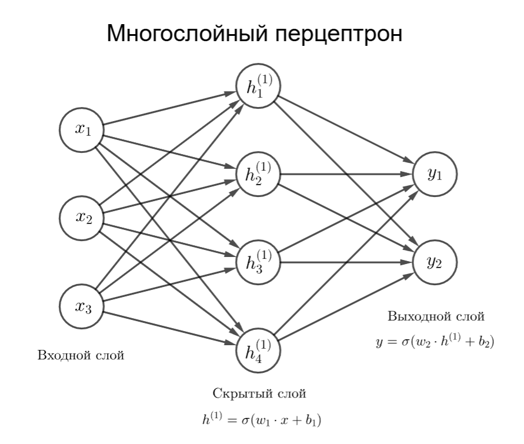
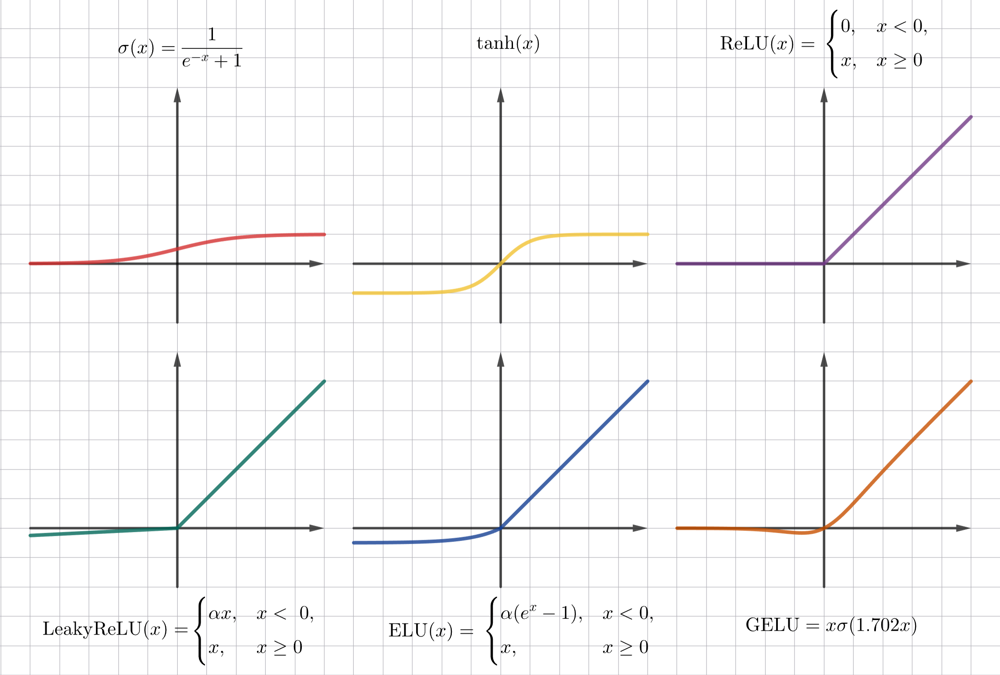

## Лекция 11. Глубокое обучение

Глубокое обучение — это раздел машинного обучения, изучающий методы, основанные на обучении представлениям, а не специализированных алгоритмах под конкретные задачи. Основным понятием, которым оборудует глубокое обучение, - это нейронные сети

Нейронная сеть (или нейросеть) - это параметрическая функция $f_\theta \ : \vert R^d \rightarrow R^k$. На вход этой функцией подаются признаки, а на выходе - результат, необходимый для решения задачи (например, вероятности классов или регрессионное значение)

По структуре функция нейронной сети похожа на нейронную сеть живого организма. Нейронная клетка принимает на вход какие-то числа (то есть сигнал через синапс на дендрит), преобразует их и выводит их другим клеткам или на вывод (то есть на аксон)

Клетки структурируются в слои. В нейросети есть входной слой, выходной слой и некоторой число скрытых слоев

Рассмотрим сеть с тремя слоями. На вход подает вектор. В простейшем случае клетка может применять умножение на матрицу весов и смещения с входным вектором: $w_1 x + b_1$

Тогда функция нейросети для трех слоев выглядит как $f(x) = \sigma(w_2 \sigma(w_1 x + b_1) + b_2)$

<!-- https://www.geogebra.org/calculator/bd7x4h9y -->

Структуру выше, где вывод нейрона зависит от всех нейронов предыдущего слоя, называют многослойным перцептроном. Каждый слой представляет из себя линейное преобразование и нелинейной функции

Здесь $\sigma$ - функция активации. Без нее умножение вектора на матрицы дают линейное преобразование, то есть нейронная сеть будет способна только выявлять линейные зависимости и разделять только линейно разделимые данные

Сейчас нейронные сети используются:

* В компьютерном зрении
* В рекомендательных алгоритмах
* В распознавании и синтезе речи
* В обработке речи: языковые модели, машинный перевод и так далее

В этих задачах зависимости часто нелинейные, поэтому используют следствия теоремы Цыбенко: Многослойный перцептрон с одним скрытым слоем и конечным числом нейронов, использующий любую неполиномиальную ограниченную непрерывную функцию активации, способен аппроксимировать с любой желаемой точностью любую непрерывную функцию на компактном подмножестве $\mathbb{R}^n$

Теоретически глубина сети (то есть число слоев) не ограничивает теорему, но на практике глубокие сети гораздо эффективнее

### Функция активации

Функция активации добавляет необходимое нелинейное преобразование в сеть. Желательно, что бы функция активации была вычислительно простой и почти везде дифференцируемой

Разберем примеры функций активации:

* Сигмоида

    $$\sigma(x) = \frac{1}{1 + e^{x}}$$

    Значения сигмоиды расположены в отрезке $(0, 1)$, что полезно, если предполагаемый результат - это вероятность. Однако, если использовать сигмоиду, то градиенты затухают при больших по модулю $x$, а среднее находится не в 0

* Гиперболический тангенс

    $$\mathrm{tanh}(x) = \frac{e^x - e^{-x}}{e^x + e^{-x}}$$

    Значения гиперболического тангенса расположены в $(-1, 1)$, поэтому среднее расположено в 0, но уже при значениях $\vert x \vert > 2$ гиперболический тангенс стремится к 1, что способствует затуханию градиента

    Гиперболический тангенс используется в рекуррентных нейросетях

* ReLU (Rectified Linear Unit)

    $$\mathrm{ReLU}(x) = \begin{cases}0 & x < 0 \\ x & x \geq 0\end{cases}$$

    Для $x > 0$ нет сильного затухания градиента, однако, если значение нейрона отрицательное, то веса могут перестать обновляться, так как градиент равен 0

* Leaky ReLU 

    $$\mathrm{LeakyReLU}(x) = \begin{cases}\alpha x, & x < 0, \\ x, & x \geq 0,\end{cases}$$

    где $\alpha \ll 1$

    Небольшой наклон в отрицательной области решает проблему нулевого градиента

* ELU (Exponential Linear Unit)

    $$\mathrm{ELU}(x) = \begin{cases}\alpha (e^x - 1), & x < 0, \\ x, & x \geq 0,\end{cases}$$

    где $\alpha \ll 1$

    Аналогичен Leaky ReLU

* GELU (Gaussian Error Linear Unit)

    $$\mathrm{GELU}(x) = x \cdot \frac{1}{2} \left(1 + \mathrm{erf}\left(\frac{x}{\sqrt{2}}\right)\right)$$

    Здесь $\mathrm{erf}(x)$ - функция ошибок Гаусса. Вместо нее используют аппроксимацию:

    $$\mathrm{GELU}(x) = x \cdot \sigma(1.702 x)$$

* SoftMax

    $$\mathrm{SoftMax}(z_i) = \frac{e^{z_i}}{\sum_j e^{z_j}},$$

    где $z$ - это вектор чисел предыдущего слоя

<!-- https://www.geogebra.org/calculator/x7qfg7yz -->

Во внутренних слоях чаще всего используют ReLU или GELU, на выходном слое функция активации выбирается по смыслу задачи:

* Для бинарной классификации это сигмоида
* Для классификации больше числа классов используют SoftMax
* А для регрессии не используют функцию активации

---

В итоге, у нас есть матрица весов $W_i$ и смещение $b_i$ на каждом слое (кроме входного). Как же обучать нейросеть так, чтобы веса и смещение изменялись, давая нужный результат?

* Сначала генерируют случайным образом веса
* Далее на небольшом наборе (батче) тестовых данных находится результат нейросети как значение $f(x)$ - прямой проход
* Находится значение функции потерь $\mathcal{L}$
* Далее находится градиент по всем весам с помощью цепного правила дифференцирования - обратное распространение ошибки. Градиенты показывают в каком направлении изменять веса
* Параметры обновляются, например, с помощью градиентного спуска
* Процесс повторяется для всей тестовой выборки. Проход по всей выборке называется эпохой

### Функция потерь

Функцией потерь $\mathcal{L}$ может быть:

* Для бинарной классификации это бинарная перекрестная энтропия (BCE, Binary Cross-Entropy): 

    $$\mathcal{L}_{\mathrm{BCE}} (y, p) = -(y \log p + (1 - y) \log (1 - p)),$$

    где $y$ - точное значение класса ($0$ или $1$), а $p$ - вероятность принадлежности классу $1$

    Если нейросеть дает несколько предсказаний объекту, имеющему несколько классов, то применяют такую формулу (Multi-label BCE):

    $$\mathcal{L}_{\mathrm{BCE}} (y, p) = -\sum_k (y_k \log p_k + (1 - y_k) \log (1 - p_k))$$

* Для классификации в общем случае применяют перекрестную энтропию (CE, Cross-Entropy):

    $$\mathcal{L}_{\mathrm{CE}} (y, p) = -\sum_k y_k \log p_k$$

    Вероятности $p_k$ могут быть получены как результат функции активации SoftMax

* Для регрессии используют среднее значение абсолютных разностей (MAE) $$\mathcal{L}_\mathrm{MAE} (y, \hat y) = \frac{1}{n} \sum_{i = 1}^n \vert y_i - \hat y_i \vert $$ или среднее значение квадратов разностей (MSE) $$\mathcal{L}_\mathrm{MSE} (y, \hat y) = \frac{1}{n} \sum_{i = 1}^n (y_i - \hat y_i)^2$$

    Помимо них еще используется функция потерь Хубера:

    $$\mathcal{L}_\delta (a) = \begin{cases}\frac{1}{2} a^2, & \vert a \vert \leq \delta, \\ \delta (\vert a \vert - \frac{1}{2} \delta), & \vert a \vert > \delta, \\ \end{cases}$$

    где $a = y - \hat y$, а $\delta$ - параметр чувствительности

    Такая функция менее чувствительна к тем выбросам, что дальше $\delta$

* Для классификации, где классы не сбалансированы, применяют фокальную функцию потерь. Для бинарной классификации это $$\mathcal{L}_\mathrm{focal} (y, p) = -\alpha (1 - p)^\gamma y \log p - (1 - \alpha) p^\gamma (1 - y) \log (1 - p)$$, для мультиклассовой это $$\mathcal{L}_\mathrm{focal} (p_t) = -(1 - p_t)^\gamma \log p_t$$ ($p_t$ - предсказанная вероятность целевого класса)

    $\gamma$ уменьшает вес для легко классифицируемых примеров, обычно $\gamma = 2$. $\alpha$ помогает при сильном дисбалансе

### Оптимизация обучения

Далее цель - уменьшить функцию потерь для всех объектов из выборки. Для этого находятся градиенты по всем весам с помощью обратного распространения ошибки

Пусть есть нейросеть со скрытым слоем $f(x) = w_2 \sigma(w_1 x + b_1) + b_1$, а функция потерь $\mathcal{L} = \frac{1}{2} (y - \hat y)^2$ (константа $\frac{1}{2}$ не изменяет монотонности, но упрощает производную), тогда нужно найти градиенты $\frac{\partial \mathcal{L}}{\partial w_2}$, $\frac{\partial \mathcal{L}}{\partial w_1}$, $\frac{\partial \mathcal{L}}{\partial b_2}$ и $\frac{\partial \mathcal{L}}{\partial b_1}$

1. По цепному правилу дифференцирования $\frac{\partial \mathcal{L}}{\partial w_2} = \frac{\partial \mathcal{L}}{\partial \hat y} \frac{\partial \hat y}{\partial w_2}$

    $\frac{\partial \mathcal{L}}{\partial \hat y} = (y - \hat y)$

    $\frac{\partial \hat y}{\partial w_2} = \frac{\partial (w_2 \sigma(w_1 x + b_1) + b_2)}{\partial w_2} = \sigma(w_1 x + b_1) = \sigma(z)$, где $z$ - значение нейрона на предыдущем слое

    Получаем $\frac{\partial \mathcal{L}}{\partial w_2} = (y - \hat y) \sigma(z)$

2. $\frac{\partial \mathcal{L}}{\partial b_2} = \frac{\partial \mathcal{L}}{\partial \hat y} \frac{\partial \hat y}{\partial b_2}$

    $\frac{\partial \hat y}{\partial b_2} = 1$, тогда $\frac{\partial \mathcal{L}}{\partial b_2} = (y - \hat y) \cdot 1$

3. $\frac{\partial \mathcal{L}}{\partial w_1} = \frac{\partial \mathcal{L}}{\partial \hat y} \frac{\partial \hat y}{\partial \sigma(z)} \frac{\partial \sigma(z)}{\partial z} \frac{\partial z}{\partial w_1}$

    $\frac{\partial \hat y}{\partial \sigma(z)} = w_2$

    $\frac{\partial \sigma(z)}{\partial z} = \sigma^\prime(z)$

    $\frac{\partial z}{\partial w_1} = x$

    Получаем $\frac{\partial \mathcal{L}}{\partial w_1} = (y - \hat y) w_2 \sigma^\prime(z) x$

4. $\frac{\partial \mathcal{L}}{\partial b_1} = \frac{\partial \mathcal{L}}{\partial \hat y} \frac{\partial \hat y}{\partial \sigma(z)} \frac{\partial \sigma(z)}{\partial z} \frac{\partial z}{\partial b_1}$

    $\frac{\partial z}{\partial b_1} = 1$, тогда $\frac{\partial \mathcal{L}}{\partial b_1} = (y - \hat y) w_2 \sigma^\prime(z)$

Аналогичным образом вычисляются градиенты для больших сетей. Далее происходит изменение весов с помощью разных методов:

* Градиентный спуск (в том числе стохастический): $w^{(t + 1)} = w^{(t)} - \eta \frac{\partial \mathcal{L}}{\partial w^{(t)}}$ и $b^{(t + 1)} = b^{(t)} - \eta \frac{\partial \mathcal{L}}{\partial b^{(t)}}$

    Обычный градиентный спуск чувствителен к масштабу признаков и к выбору скорости обучения $\eta$, а также при малых затухающих градиентах медленно обучает модель

* Градиентный спуск с импульсом: $w^{(t + 1)} = w^{(t)} - \eta v_{t + 1}$, где $v_{t + 1} = \mu v_t + \frac{\partial \mathcal{L}}{\partial w^{(t)}}$

    Более быстрый при малых градиентах, чем обычный градиентный спуск, также менее чувствителен к шуму, чем стохастический градиентный спуск

* RMSProp (Root Mean Square Propagation): $w^{(t + 1)} = w^{(t)} - \frac{\eta}{\sqrt{s_{t + 1}} + \varepsilon} \frac{\partial \mathcal{L}}{\partial w^{(t)}}$, где $s_{t + 1} = \rho s_t + (1 - \rho) \left(\frac{\partial \mathcal{L}}{\partial w^{(t)}}\right)^2$

    Здесь $\varepsilon$ - число, близкое к 0, чтобы избежать деления на 0

* Adam (Adaptive Moment Estimation): $w^{(t + 1)} = w^{(t)} - \frac{\eta}{\sqrt{\hat v_{t + 1}} + \varepsilon} \hat m_{t + 1}$

    Здесь $m_{t + 1} = \beta_1 m_t + (1 - \beta_1) \frac{\partial \mathcal{L}}{\partial w^{(t)}}$ - оценка первого момента, $v_{t + 1} = \beta_2 v_t + (1 - \beta_2) \left(\frac{\partial \mathcal{L}}{\partial w^{(t)}}\right)^2$, а $\hat m_{t + 1} = \frac{m_{t + 1}}{1 - \beta^t_1}$, $\hat v_{t + 1} = \frac{v_{t + 1}}{1 - \beta^t_2}$ - коррекция смещения

    $\beta_1$ и $\beta_2$ - настраиваемые параметры

    Оптимизатор Adam хорошо работает, поэтому чаще всего используется, быстрее сходится в начале, удобнее при сильно разном масштабе признаков, но требует ручной настройки параметров

    Стохастический градиентный спуск с импульсом дает лучшее обобщение и очень сильно чувствителен к скорости обучения

Скорость обучения может быть не постоянной:

* Шаговый распад (Step Decay): $\eta_t = \eta_0 \cdot \gamma^{\lfloor \frac{t}{s} \rfloor}$, где $s$ - шаг, через сколько эпох уменьшать скорость

* Косинусный отжиг🤟 (Cosine Annealing): $\eta_t = \eta_\min + \frac{1}{2} (\eta_\max - \eta_\min) \left(1 + \cos \frac{\pi t}{T}\right)$, где $T$ - общее число шагов

* Разминка (Warmup): в начале обучения градиенты могут быть нестабильными, поэтому скорость обучения плавно экспоненциально увеличивается до заданного значения в течение первых нескольких эпох

* Циклическая скорость обучения (Cyclic Learning Rate): скорость обучения колеблется от нижней заданной границе до верхней. Идея в том, что большая скорость обучения может иметь краткосрочный негативный эффект, но долгосрочный положительный в виде ускорения обучения

    Форма колебания может быть треугольной, а верхняя граница может быть постоянной или понижаться экспоненциально

    > Источник: [https://arxiv.org/pdf/1506.01186](https://arxiv.org/pdf/1506.01186)

Слишком большая скорость обучения выражается в колеблющейся или быстро растущей функции потерь, а маленькая скорость обучения - в медленно убывающей функции потерь или попадании при обучении в локальном минимуме или седле
