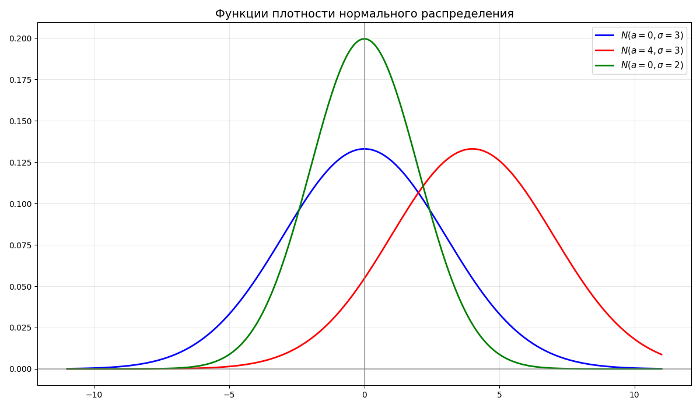
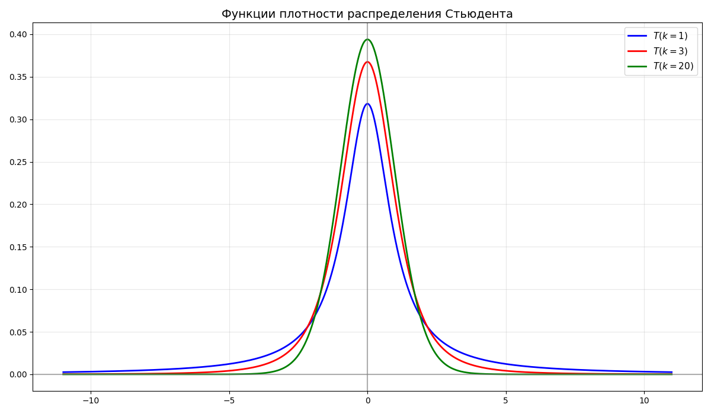
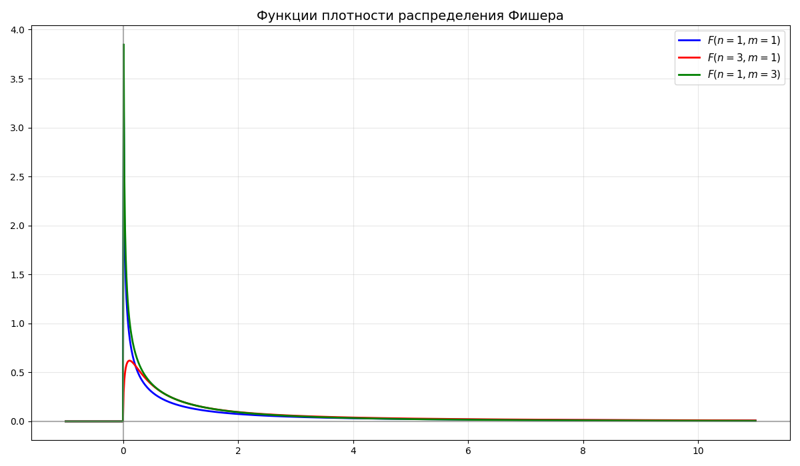

#  Машинное обучение

* [Машинное обучение](#%D0%BC%D0%B0%D1%88%D0%B8%D0%BD%D0%BD%D0%BE%D0%B5-%D0%BE%D0%B1%D1%83%D1%87%D0%B5%D0%BD%D0%B8%D0%B5)
  * [Лекция 1. Описательный анализ данных](#%D0%BB%D0%B5%D0%BA%D1%86%D0%B8%D1%8F-1.-%D0%BE%D0%BF%D0%B8%D1%81%D0%B0%D1%82%D0%B5%D0%BB%D1%8C%D0%BD%D1%8B%D0%B9-%D0%B0%D0%BD%D0%B0%D0%BB%D0%B8%D0%B7-%D0%B4%D0%B0%D0%BD%D0%BD%D1%8B%D1%85)
  * [Лекция 2. Статистические гипотезы](#%D0%BB%D0%B5%D0%BA%D1%86%D0%B8%D1%8F-2.-%D1%81%D1%82%D0%B0%D1%82%D0%B8%D1%81%D1%82%D0%B8%D1%87%D0%B5%D1%81%D0%BA%D0%B8%D0%B5-%D0%B3%D0%B8%D0%BF%D0%BE%D1%82%D0%B5%D0%B7%D1%8B)
  * [Лекция 3. Методы понижения размерности, метод главных компонент](#%D0%BB%D0%B5%D0%BA%D1%86%D0%B8%D1%8F-3.-%D0%BC%D0%B5%D1%82%D0%BE%D0%B4%D1%8B-%D0%BF%D0%BE%D0%BD%D0%B8%D0%B6%D0%B5%D0%BD%D0%B8%D1%8F-%D1%80%D0%B0%D0%B7%D0%BC%D0%B5%D1%80%D0%BD%D0%BE%D1%81%D1%82%D0%B8%2C-%D0%BC%D0%B5%D1%82%D0%BE%D0%B4-%D0%B3%D0%BB%D0%B0%D0%B2%D0%BD%D1%8B%D1%85-%D0%BA%D0%BE%D0%BC%D0%BF%D0%BE%D0%BD%D0%B5%D0%BD%D1%82)
    * [Метод главных компонент](#%D0%BC%D0%B5%D1%82%D0%BE%D0%B4-%D0%B3%D0%BB%D0%B0%D0%B2%D0%BD%D1%8B%D1%85-%D0%BA%D0%BE%D0%BC%D0%BF%D0%BE%D0%BD%D0%B5%D0%BD%D1%82)
  * [Лекция 4. Нелинейные методы уменьшения размерности](#%D0%BB%D0%B5%D0%BA%D1%86%D0%B8%D1%8F-4.-%D0%BD%D0%B5%D0%BB%D0%B8%D0%BD%D0%B5%D0%B9%D0%BD%D1%8B%D0%B5-%D0%BC%D0%B5%D1%82%D0%BE%D0%B4%D1%8B-%D1%83%D0%BC%D0%B5%D0%BD%D1%8C%D1%88%D0%B5%D0%BD%D0%B8%D1%8F-%D1%80%D0%B0%D0%B7%D0%BC%D0%B5%D1%80%D0%BD%D0%BE%D1%81%D1%82%D0%B8)
    * [Стохастическое вложение соседей с t-распределением](#%D1%81%D1%82%D0%BE%D1%85%D0%B0%D1%81%D1%82%D0%B8%D1%87%D0%B5%D1%81%D0%BA%D0%BE%D0%B5-%D0%B2%D0%BB%D0%BE%D0%B6%D0%B5%D0%BD%D0%B8%D0%B5-%D1%81%D0%BE%D1%81%D0%B5%D0%B4%D0%B5%D0%B9-%D1%81-t-%D1%80%D0%B0%D1%81%D0%BF%D1%80%D0%B5%D0%B4%D0%B5%D0%BB%D0%B5%D0%BD%D0%B8%D0%B5%D0%BC)
    * [Алгоритм UMAP](#%D0%B0%D0%BB%D0%B3%D0%BE%D1%80%D0%B8%D1%82%D0%BC-umap)
  * [Лекция 5. Метрики, метод k ближайших соседей](#%D0%BB%D0%B5%D0%BA%D1%86%D0%B8%D1%8F-5.-%D0%BC%D0%B5%D1%82%D1%80%D0%B8%D0%BA%D0%B8%2C-%D0%BC%D0%B5%D1%82%D0%BE%D0%B4-k-%D0%B1%D0%BB%D0%B8%D0%B6%D0%B0%D0%B9%D1%88%D0%B8%D1%85-%D1%81%D0%BE%D1%81%D0%B5%D0%B4%D0%B5%D0%B9)
    * [Метрики](#%D0%BC%D0%B5%D1%82%D1%80%D0%B8%D0%BA%D0%B8)
    * [Метод k ближайших соседей](#%D0%BC%D0%B5%D1%82%D0%BE%D0%B4-k-%D0%B1%D0%BB%D0%B8%D0%B6%D0%B0%D0%B9%D1%88%D0%B8%D1%85-%D1%81%D0%BE%D1%81%D0%B5%D0%B4%D0%B5%D0%B9)
  * [Лекция 6. Линейная регрессия](#%D0%BB%D0%B5%D0%BA%D1%86%D0%B8%D1%8F-6.-%D0%BB%D0%B8%D0%BD%D0%B5%D0%B9%D0%BD%D0%B0%D1%8F-%D1%80%D0%B5%D0%B3%D1%80%D0%B5%D1%81%D1%81%D0%B8%D1%8F)
  * [Лекция 7. Метод опорных векторов](#%D0%BB%D0%B5%D0%BA%D1%86%D0%B8%D1%8F-7.-%D0%BC%D0%B5%D1%82%D0%BE%D0%B4-%D0%BE%D0%BF%D0%BE%D1%80%D0%BD%D1%8B%D1%85-%D0%B2%D0%B5%D0%BA%D1%82%D0%BE%D1%80%D0%BE%D0%B2)
  * [Лекция 8. Деревья, лес, бустинг](#%D0%BB%D0%B5%D0%BA%D1%86%D0%B8%D1%8F-8.-%D0%B4%D0%B5%D1%80%D0%B5%D0%B2%D1%8C%D1%8F%2C-%D0%BB%D0%B5%D1%81%2C-%D0%B1%D1%83%D1%81%D1%82%D0%B8%D0%BD%D0%B3)
  * [Лекция 9. Вероятностные подходы](#%D0%BB%D0%B5%D0%BA%D1%86%D0%B8%D1%8F-9.-%D0%B2%D0%B5%D1%80%D0%BE%D1%8F%D1%82%D0%BD%D0%BE%D1%81%D1%82%D0%BD%D1%8B%D0%B5-%D0%BF%D0%BE%D0%B4%D1%85%D0%BE%D0%B4%D1%8B)
  * [Лекция 10. Кластеризация](#%D0%BB%D0%B5%D0%BA%D1%86%D0%B8%D1%8F-10.-%D0%BA%D0%BB%D0%B0%D1%81%D1%82%D0%B5%D1%80%D0%B8%D0%B7%D0%B0%D1%86%D0%B8%D1%8F)
    * [Кластеризация, основанная на центрах](#%D0%BA%D0%BB%D0%B0%D1%81%D1%82%D0%B5%D1%80%D0%B8%D0%B7%D0%B0%D1%86%D0%B8%D1%8F%2C-%D0%BE%D1%81%D0%BD%D0%BE%D0%B2%D0%B0%D0%BD%D0%BD%D0%B0%D1%8F-%D0%BD%D0%B0-%D1%86%D0%B5%D0%BD%D1%82%D1%80%D0%B0%D1%85)
    * [Кластеризация, основанная на плотностях](#%D0%BA%D0%BB%D0%B0%D1%81%D1%82%D0%B5%D1%80%D0%B8%D0%B7%D0%B0%D1%86%D0%B8%D1%8F%2C-%D0%BE%D1%81%D0%BD%D0%BE%D0%B2%D0%B0%D0%BD%D0%BD%D0%B0%D1%8F-%D0%BD%D0%B0-%D0%BF%D0%BB%D0%BE%D1%82%D0%BD%D0%BE%D1%81%D1%82%D1%8F%D1%85)
    * [Иерархическая кластеризация](#%D0%B8%D0%B5%D1%80%D0%B0%D1%80%D1%85%D0%B8%D1%87%D0%B5%D1%81%D0%BA%D0%B0%D1%8F-%D0%BA%D0%BB%D0%B0%D1%81%D1%82%D0%B5%D1%80%D0%B8%D0%B7%D0%B0%D1%86%D0%B8%D1%8F)
    * [Метрики кластеризации](#%D0%BC%D0%B5%D1%82%D1%80%D0%B8%D0%BA%D0%B8-%D0%BA%D0%BB%D0%B0%D1%81%D1%82%D0%B5%D1%80%D0%B8%D0%B7%D0%B0%D1%86%D0%B8%D0%B8)
  * [Лекция 11. Глубокое обучение](#%D0%BB%D0%B5%D0%BA%D1%86%D0%B8%D1%8F-11.-%D0%B3%D0%BB%D1%83%D0%B1%D0%BE%D0%BA%D0%BE%D0%B5-%D0%BE%D0%B1%D1%83%D1%87%D0%B5%D0%BD%D0%B8%D0%B5)
    * [Функция активации](#%D1%84%D1%83%D0%BD%D0%BA%D1%86%D0%B8%D1%8F-%D0%B0%D0%BA%D1%82%D0%B8%D0%B2%D0%B0%D1%86%D0%B8%D0%B8)
    * [Функция потерь](#%D1%84%D1%83%D0%BD%D0%BA%D1%86%D0%B8%D1%8F-%D0%BF%D0%BE%D1%82%D0%B5%D1%80%D1%8C)
    * [Оптимизация обучения](#%D0%BE%D0%BF%D1%82%D0%B8%D0%BC%D0%B8%D0%B7%D0%B0%D1%86%D0%B8%D1%8F-%D0%BE%D0%B1%D1%83%D1%87%D0%B5%D0%BD%D0%B8%D1%8F)
  * [Лекция 12. Обратное распространение ошибки, борьба с переобучением](#%D0%BB%D0%B5%D0%BA%D1%86%D0%B8%D1%8F-12.-%D0%BE%D0%B1%D1%80%D0%B0%D1%82%D0%BD%D0%BE%D0%B5-%D1%80%D0%B0%D1%81%D0%BF%D1%80%D0%BE%D1%81%D1%82%D1%80%D0%B0%D0%BD%D0%B5%D0%BD%D0%B8%D0%B5-%D0%BE%D1%88%D0%B8%D0%B1%D0%BA%D0%B8%2C-%D0%B1%D0%BE%D1%80%D1%8C%D0%B1%D0%B0-%D1%81-%D0%BF%D0%B5%D1%80%D0%B5%D0%BE%D0%B1%D1%83%D1%87%D0%B5%D0%BD%D0%B8%D0%B5%D0%BC)
  * [Лекция 13. Обучение на графических процессорах](#%D0%BB%D0%B5%D0%BA%D1%86%D0%B8%D1%8F-13.-%D0%BE%D0%B1%D1%83%D1%87%D0%B5%D0%BD%D0%B8%D0%B5-%D0%BD%D0%B0-%D0%B3%D1%80%D0%B0%D1%84%D0%B8%D1%87%D0%B5%D1%81%D0%BA%D0%B8%D1%85-%D0%BF%D1%80%D0%BE%D1%86%D0%B5%D1%81%D1%81%D0%BE%D1%80%D0%B0%D1%85)
  * [Лекция 14. Свёрточные и рекуррентные нейросети](#%D0%BB%D0%B5%D0%BA%D1%86%D0%B8%D1%8F-14.-%D1%81%D0%B2%D1%91%D1%80%D1%82%D0%BE%D1%87%D0%BD%D1%8B%D0%B5-%D0%B8-%D1%80%D0%B5%D0%BA%D1%83%D1%80%D1%80%D0%B5%D0%BD%D1%82%D0%BD%D1%8B%D0%B5-%D0%BD%D0%B5%D0%B9%D1%80%D0%BE%D1%81%D0%B5%D1%82%D0%B8)
    * [Свёрточная нейросеть](#%D1%81%D0%B2%D1%91%D1%80%D1%82%D0%BE%D1%87%D0%BD%D0%B0%D1%8F-%D0%BD%D0%B5%D0%B9%D1%80%D0%BE%D1%81%D0%B5%D1%82%D1%8C)
    * [Обработка естественного языка](#%D0%BE%D0%B1%D1%80%D0%B0%D0%B1%D0%BE%D1%82%D0%BA%D0%B0-%D0%B5%D1%81%D1%82%D0%B5%D1%81%D1%82%D0%B2%D0%B5%D0%BD%D0%BD%D0%BE%D0%B3%D0%BE-%D1%8F%D0%B7%D1%8B%D0%BA%D0%B0)
    * [Рекуррентная нейросеть](#%D1%80%D0%B5%D0%BA%D1%83%D1%80%D1%80%D0%B5%D0%BD%D1%82%D0%BD%D0%B0%D1%8F-%D0%BD%D0%B5%D0%B9%D1%80%D0%BE%D1%81%D0%B5%D1%82%D1%8C)
    * [LSTM](#lstm)

##  Лекция 1. Описательный анализ данных

Пусть дана случайная величина $\xi$. Из курсов теории вероятности и математической статистики мы знаем, что:

* Функция распределения $F_\xi(x)$ - такая функция, что $F_\xi(x) = P(\xi < x)$ - вероятность попадания случайной величины в интервал $(-\infty;x)$

    Функция распределения может быть определена для дискретной и непрерывной распределений

* Функция плотности $f_\xi(x)$ - такая функция, что $\displaystyle f_\xi(x) = \int_{-\infty}^x F_\xi(y) dy$

    С помощью функции распределения и функции плотности можно вычислить вероятность попадания случайной величины в заданный отрезок: $\displaystyle P(a < \xi < b) = F_\xi(b) - F_\xi(a) = \int_a^b f_\xi(x) dx$

* Биномиальное распределение - дискретное распределение вероятностей случайной величины $X$, принимающей целочисленные значения $k = 0, 1, \dots, n$ с вероятностями $P(X = k) = C_n^k p^k (1 - p)^{n - k}$

    Биномиальное распределение обозначается как $B(n, p)$, где $n$ - число испытаний, $p$ - вероятность успеха

    

* Распределение Пуассона - дискретное распределение вероятностей случайной величины $\xi$ с параметром $\lambda$ и функцией распределения $F_\xi(k) = \frac{\lambda^k}{k!} e^\lambda$

    Распределение Пуассона обозначается как $\Pi(\lambda)$, где $\lambda > 0$

    

* Равномерное распределение $U(a, b)$ - непрерывное распределение, случайная величина $\xi$ которого имеет функцию плотности $$f_\xi(x) = \begin{cases}0, & x < 0 \\ \frac{1}{b - a}, & a \leq x \leq b \\ 0, & x > b\end{cases}$$

    

* Случайная величина $\xi$ имеет показательное распределение $E(\alpha)$, если функция плотности имеет вид $$f_\xi(x) = \begin{cases}0, & x < 0 \\ \alpha e^{-\alpha x}, & x \geq 0\end{cases}$$

    

* Случайная величина $\xi$ имеет нормальное распределение $N(a, \sigma^2)$, если функция плотности имеет вид $\displaystyle f_\xi(x) = \frac{1}{\sigma \sqrt{2\pi}} e^{-\frac{(x-a)^2}{2\sigma^2}}$, где $a$ - среднее, $\sigma$ - среднеквадратичное отклонение

    Из этого $\displaystyle F_\xi(x) = \frac{1}{\sigma \sqrt{2\pi}} \int_{-\infty}^x e^{-\frac{(t-a)^2}{2\sigma^2}} dt$

    

* Случайная величина $\xi$ имеет логарифмически-нормальное (логнормальное) распределение, если $\xi = e^\eta$, где $\eta \in N(a, \sigma^2)$

    

* Случайная величина $\chi^2$ имеет распределение "хи-квадрат" $H(n)$ со степенями свободы $n$, если $\chi^2 = X_1^2 + X_2^2 + \dots + X_n^2$ - сумма $n$ квадратов независимых стандартных нормальных величин

    

* Случайная величина $t_k$ имеет распределение Стьюдента $T(k)$ со степенями свободы $k$, если $\displaystyle t_k = \frac{X_0}{\frac{1}{k}(X_1^2 + X_2^2 + \dots + X_n^2)} = \frac{X_0}{\frac{\chi^2_k}{k}}$, где $X_0, \dots, X_n$ - независимые стандартные нормальные величины

    

* Случайная величина $f_{n,m}$ имеет распределение Фишера (или F-распределение) $F(n, m)$ со степенями свободы $n$ и $m$, если $\displaystyle f_{n,m} = \frac{\frac{\chi^2_n}{n}}{\frac{\chi^2_m}{m}}$, где $\chi^2_n$, $\chi^2_m$ - независимые случайные величины распределения "хи-квадрат"

    

* Математическое ожидание $E \xi$ - взвешенное по вероятности среднее значение случайной величины

    Для дискретного распределения $\displaystyle E \xi = \sum_{i = 1}^n p_i x_i$

    Для непрерывного распределения $\displaystyle E \xi = \int_{-\infty}^\infty x f_\xi(x) dx$

* Дисперсия $D \xi$ - математическое ожидание квадрата отклонения случайной величины от ее математического ожидания. В общем случае $D\xi = E(\xi - E\xi)^2 = E\xi^2 - (E\xi)^2$

    Для дискретного распределения $\displaystyle E \xi = \sum_{i = 1}^n p_i (x_i - E\xi)^2$

    Для непрерывного распределения $\displaystyle E \xi = \int_{-\infty}^\infty f_\xi(x) (x - E\xi)^2 dx$

* Среднеквадратическое отклонение $\sigma_\xi = \sqrt{D \xi}$ определяется как корень дисперсии

* Медиана $Me$ непрерывной случайной величины $\xi$ называется значение случайной величины $\xi$, такое что $P(\xi < Me) = P(\xi > Me) = \frac{1}{2}$

    Вместо среднего могут взять медиану, так как медиана меньше зависит от выбросов

    

* Мода - значение, вероятность которого выше всего. Если в выборке есть два или больше значения, вероятность которых равна и наибольшая, то они считаются модами

    Функция называется унимодальной, если четко выражена одна мода, иначе - многомодальной

    

* Размах - разность между максимальным и минимальным значением

* Генеральной совокупностью называются все результаты проведенных экспериментов

    Выборочной совокупностью (выборка) $X$ называются наблюдаемые данные экспериментов

    Выборка называется репрезентативной, если ее распределение совпадает с распределением генеральной совокупности

    Так как описать все проведенные эксперименты невозможно, берут небольшую выборку. Выборка выбирается так, чтобы она была репрезентативно, например, в проведении измерения роста людей нерепрезентативно брать 10 людей из Юго-Восточной Азии, так как они не представляют все население Земли

* Выборочным средним называется величина $\overline{X} = \frac{1}{n} \sum X_i$

* Выборочной дисперсией называется величина $D^* = \frac{1}{n} \sum (X_i - \overline{X})^2 = \frac{1}{n} \sum X_i^2 - \overline{X}^2$

* Исправленной выборочной дисперсией называется величина $S^2 = \frac{n}{n - 1} D^* = \frac{1}{n - 1} \sum (X_i - \overline{X})^2$

---

Машинное обучение - класс методов искусственного интеллекта, характерной чертой которых является не прямое решение задачи, а обучение за счёт применения решений множества сходных задач. Обучение основано на выявлении эмпирических закономерностей в данных

Перед тем как датасет (набор данных) применяется в обучении, его необходимо подготовить 

Данные могут быть:

* Числовыми - те, которые могут быть представлены числом, например, возраст, вес, рост. Числовые (или количественные) данные могут быть дискретными или непрерывными
* Качественным (или категориальными) - данные, которые представляют качества или категории. Бывают:
    * Номинальные - данные, которые невозможно отсортировать, например, страна проживания, пол
    * Порядковые - категории, которые представляют иерархический порядок, например, размер одежды, дворянские титулы

Чаще всего, формируя датасет, получается, что некоторых характеристик у объекта нет. Тогда можно прибегнуть к таким способам:

1. Удалить строки с неизвестной переменной или не принимать их во внимание
2. Заполнить средним/медианой/модой (обычно так делать не стоит)
3. Интерполяция 
4. Заполнение на основе соседних данных

Далее данные очищаются от выбросов (аутлаеров, от outlier) - группы значений, выделяющихся из общей выборки

Категориальные переменные принимают только определенный набор значений, которые в общем смысле нельзя сравнить. Методы машинного обучения работают с числовыми значениями, поэтому нужно превратить категориальную в числовую. 

Можно представить категориальную переменную в бинарный вектор. Например, цвета "красный", "зеленый", "синий" можно превратить в вектор из трех переменных: `is_red`, `is_green`, `is_blue`. Если цвет красный, то `is_red = 1`, `is_green = 0`, `is_blue = 0`. Такой подход называется [унитарным кодом](https://ru.wikipedia.org/wiki/%D0%A3%D0%BD%D0%B8%D1%82%D0%B0%D1%80%D0%BD%D1%8B%D0%B9_%D0%BA%D0%BE%D0%B4) (или one-hot encoding)

Если просто пронумеровать цвета, то в нашу переменную вносится порядок, что на самом деле не так

---

После данные нужно нормализовать. Нормализация (или масштабирование) данных - приведение их к единому масштабу. Начальные данные могут быть различными единицами измерения. Если не стандартизировать данные, модели машинного обучения станут слишком чувствительны к масштабу признаков, а не к их реальной важности

Методов нормализации существует много, разберем 3 основных:

1. Минимальная-максимальная нормализация

    [Минимальная-максимальная нормализация](https://en.wikipedia.org/wiki/Feature_scaling#Rescaling_(min-max_normalization)) - подход, при котором величины в выборке приводятся к диапазону $[0, 1]$. Такая нормализация полезна, если алгоритм принимает числа в некотором диапазоне

    $$x_{\text{норм}} = \frac{x - x_{\text{мин}}}{x_{\text{макс}} - x_{\text{мин}}}$$

2. Стандартизация

    [Стандартизация](https://en.wikipedia.org/wiki/Feature_scaling#Standardization_(Z-score_Normalization)) (или Z-масштабирование) преобразует выборка так, что бы среднее было равно 0, а дисперсия - 1:

    $$x_{\text{норм}} = \frac{x - \overline{x}}{\sigma_x}$$

    Выбросы очень сильно влияют на среднее значение выборки, так как изменяют выборочное среднее

3. Robust-масштабирование

    [Robust-масштабирование](https://en.wikipedia.org/wiki/Feature_scaling#Robust_Scaling) (от robust - устойчивый) - метод нормализации, похожий на стандартизацию. Вместо выборочного среднего robust-масштабирование использует устойчивую к выбросам медиану, а вместо отклонения - разницу между 25-ым и 75-ым квантилем

    $x_{\text{норм}} = \frac{x - \mathrm{median}(x)}{\mathrm{IQR}(x)}$, где $\mathrm{median}(x)$ - медиана, $\mathrm{IQR}(x)$ - разница между 25-ым и 75-ым квантилем

    Также формулу можно представить так: $x_{\text{норм}} = \frac{x - \mathrm{Q_2}(x)}{\mathrm{Q_3}(x) - \mathrm{Q_1}(x)}$, где $\mathrm{Q_1}(x), \mathrm{Q_2}(x), \mathrm{Q_3}(x)$ - квантили выборки уровней $0.25$, $0.5$, $0.75$ соответственно

Примеры работы этих методов:

---

После этого выборку можно наглядно представить в виде гистограммы. При построении гистограммы для ее лучшей читаемости следует помнить, что:

* Столбцы должны быть одинаковой ширины
* Не рекомендуется помещать более двух гистограмм на одной плоскости
* Гистограмма должна занимать все пространство графика
* Высоты столбцов для гистограмм разных выборок должны соответствовать одной оси ординат

---

Одним из способов визуализации распределения является [ящик с усами](https://ru.wikipedia.org/wiki/%D0%AF%D1%89%D0%B8%D0%BA_%D1%81_%D1%83%D1%81%D0%B0%D0%BC%D0%B8) (или box plot)

Ящик с усами представляет собой прямоугольник, высота которого равна разнице между 25-ым и 75-ым квантилем. Внутри прямоугольника изображается линий, обозначающая медиану

По сторонам прямоугольника располагаются отрезки, так называемые усы. Усы могут строиться как:

* Минимальное и максимальное значения в выборке
* Выборочное среднее $\pm$ стандартное отклонение
* $\text{25-ый квантиль} - 1.5 \cdot \text{разница между 25-ым и 75-ым квантилем}$, аналогично с 75-ым квантилем
* 9-ый и 91-ый квантили
* 2-ой и 98-ой квантили

За пределами усов могут располагать точки, обозначающие выбросы. Ящик с усами позволяет наглядно сравнить распределения:

##  Лекция 2. Статистические гипотезы

**Доверительный интервал** уровня $\alpha$ - диапазон значений такой, что вероятность попадания значения в него равна $1 - \alpha$. Интервалы бывают двухсторонними $(a; b)$ и односторонними $(a; +\infty)$

Например, при нормальном распределении почти все значения (99.73%) попадают в доверительный интервал $(a - 3\sigma; a + 3\sigma)$

**Статистической гипотезой** $H$ называется предположение о распределении наблюдаемой случайной величины. Обычно гипотезы формулируют в паре $H_0$ и $H_1$, где $H_0$ - основная гипотеза, а $H_1$ - альтернативная

Пример: среднее количество лет работы американца до выхода на пенсию равно 64. Нулевой гипотезой будет утверждение "матожидание распределения равно 34", то есть $H_0 \ : \ \mu = 64$

Гипотезы бывают:

* левосторонними (left-tailed)

    $$
    \begin{cases}
        H_0 \ : \ p \geq \alpha \\ 
        H_1 \ : \ p < \alpha \\ 
    \end{cases}
    $$

* правосторонними (right-tailed)

    $$
    \begin{cases}
        H_0 \ : \ p \leq \alpha \\ 
        H_1 \ : \ p > \alpha \\ 
    \end{cases}
    $$

* двусторонними (two-tailed)

    $$
    \begin{cases}
        H_0 \ : \ p = \alpha \\ 
        H_1 \ : \ p \neq \alpha \\ 
    \end{cases}
    $$

Гипотеза называется **простой**, если она однозначно определяет распределение. В другом случае гипотеза называется **сложной**, и она является объединением конечного или бесконечного числа гипотез

**Ошибка первого рода** состоит в том, что $H_0$ отклоняется, хотя она верна. 
Аналогично, **ошибка второго рода** состоит в том, что $H_1$ отклоняется (то есть $H_0$ принимается), хотя она верна

Вероятность $\alpha$ ошибки первого рода называется **уровнем значимости критерия**. Вероятность ошибки второго рода обозначаем $\beta$. **Мощностью критерия** называется вероятность $1 - \beta$ (вероятность
недопущения ошибки второго рода)

---

P-значение (P-value, от **p**robability) - это вероятность (при условии, что нулевая гипотеза верна) получить такое же или более экстремальное значение какой-либо статистики (например, математического ожидания)

Малое p-значение (обычно меньше 0.05) говорит о том, что наблюдаемые данные маловероятны при справедливости основной гипотезы. В таком случае часто отвергают нулевую гипотезу.  
Большое p-value означает, что данные согласуются с основной гипотезой, и оснований отвергать её нет

Пример: пусть есть стандартное нормальное распределение и выборка из него. Для выборки нашли среднее и получили $2$

Проверим гипотезу, что математическое ожидание выборки равно $0$:

$$
\begin{cases}
    H_0 \ : \ a = a_0 = 0, & \text{ если } |K| < t_\text{кр} \\ 
    H_1 \ : \ a \neq a_0, & \text{ если } |K| \geq t_\text{кр}
\end{cases}
$$

Здесь $K = \sqrt{n} \frac{\overline{x} - a_0}{\sigma}$ - критерий, а $t_\text{кр}$ - квантиль стандартного нормального распределения уровня $1 - \frac{\alpha}{2}$

Пусть размер выборки $n = 4$, тогда $K = 4$

Вероятность получить выборочное среднее, равное или большее $2$, при условии, что нулевая гипотеза верна (то есть $a = 0$), равна

$P(X \leq -K) + P(X \geq K) = 2 P(\|X\| \geq K) = 2 (\Phi(+\infty) - \Phi(K)) = 1 - 2 \Phi(K)$

Здесь $P(X \leq a)$ - вероятность того, что случайная величина $X \in N(0, 1)$ будет меньше или равна $a$, $\Phi(x) = \frac{1}{\sqrt{2\pi}} \int_0^x e^{-\frac{z^2}{2}} dz$ - функция Лапласа. Так как тест в гипотезе учитывает модуль, то мы считаем сумму интервалов с двух сторон

Полученное значение называют p-значением. В нашем случае оно равно $0.00008$ - данные маловероятны при такой принятой гипотезе

P-значение не показывает вероятность того, что гипотеза верна или неверна. Также p-значение не говорит о величине эффекта - оно только показывает, насколько данные редки при нулевой гипотезе, но не измеряет силу или практическую важность эффекта, так как зависит от статистики критерия, гипотезы и выборки. Поэтому сравнивать p-значения для разные выборок из разных задач не покажет, какая из них имеет меньшую вероятность на существование

---

Некоторые часто используемые гипотезы называются тестами:

* T-тест используется для проверки гипотезы о равенстве матожидания распределения выборки конкретному числу

    Пусть дана $\vec X = (X_1, \dots, X_n) \in N(a, \sigma^2)$ с неизвестным матожиданием и дисперсией. Поставим наш критерий $K = \sqrt{n} \frac{\overline{x} - a_0}{S}$, а гипотезу

    $$
    \begin{cases}
        H_0 \ : \ a = a_0 = 0, & \text{ если } |K| < t_\text{кр} \\ 
        H_1 \ : \ a \neq a_0, & \text{ если } |K| \geq t_\text{кр}
    \end{cases}
    $$

    где $t_\text{кр}$ - квантиль распределения Стьюдента $T_{n - 1}$ уровня $1 - \frac{\alpha}{2}$

    Также существует двухвыборочный T-тест (критерий Стьюдента): пусть $(X_1, \dots, X_n)$ и $(Y_1, \dots, Y_m)$ из нормальных распределений $X \in N(a_1, \sigma^2)$ и $Y \in N(a_2, \sigma^2)$

    Проверяется $H_0 : a_1 = a_2$ против $H_1 : a_1 \neq a_2$

    В качестве статистики возьмем $K = \frac{\overline x - \overline y}{S_p \sqrt{\frac{1}{n} + \frac{1}{m}}}$, где $S^2_p = \frac{(n - 1) S_X^2 + (m - 1) S_Y^2}{n + m - 2}$

    Если нулевая гипотеза верна, то при $a_1 = a_2$ получаем, что $K \in T_{n + m - 2}$, если верна альтернативная гипотеза, то $K \longrightarrow \infty$

    Критерий: $t_\alpha$ - квантиль $\|T_{n + m - 2}\|$ уровня $\alpha$

    $$
    \begin{cases}
        H_0 : a_1 = a_2, & \text{если } K < t_\alpha \\
        H_1 : a_1 \neq a_2, & \text{если } K \geq t_\alpha
    \end{cases}
    $$

* Критерий знаков используется для проверки гипотезы о медиане распределения выборки

    Пусть дана выборка $\vec X = (X_1, \dots, X_n)$, не предполагая нормальности распределения. Проверяется гипотеза о медиане $m$

    Считаем количество элементов, больших гипотетической медианы $m_0$: $$S = \text{\#}\{ i : X_i > m_0 \}$$

    При нулевой гипотезе $H_0 \ : \ m = m_0$, вероятность того, что наблюдение окажется выше или ниже медианы, равна $\frac{1}{2}$. Следовательно, статистика $S$ имеет биномиальное распределение: $S \in B(n, p = \frac{1}{2}).$

    $$
    \begin{cases}
        H_0 : m = m_0, & \text{если } 2 \cdot P(S \geq s_\text{набл}) > \alpha, \\
        H_1 : m \neq m_0, & \text{если } 2 \cdot P(S \geq s_\text{набл}) \leq \alpha,
    \end{cases}
    $$

    где $s_\text{набл}$ - наблюдаемое значение статистики.

    Для больших $n$ биномиальное распределение аппроксимируется нормальным: $S \approx N\left(\frac{n}{2}, \frac{n}{4}\right)$

    Тогда используем нормированную статистику $K = \frac{S - n/2}{\sqrt{n}/2}$, и решение гипотезы строится аналогично Z-тесту.

    Тогда продолжаем в том же стиле и добавим двухвыборочный критерий знаков:

    
    Аналогично двухвыборочный критерий знаков используется для проверки гипотезы о равенстве медиан двух связанных выборок

    Для двухмерной выборки $(X_1, Y_1), \, (X_2, Y_2), \, \dots, \, (X_n, Y_n)$ рассмотрим разности $D_i = X_i - Y_i$

    Нулевая гипотеза формулируется как $H_0 : \text{медиана распределения } D_i = 0$, то есть медианы выборок равны.

    В качестве статистики берём число положительных разностей: $$S = \text{\#}\{ i : D_i > 0 \}$$

    При $H_0$ вероятность знака разности равна $\frac{1}{2}$. Тогда $S \in B(n, \frac{1}{2})$

    $$
    \begin{cases}
        H_0 : \text{медианы равны}, & \text{если } 2 \cdot P(S \geq s_\text{набл}) > \alpha, \\
        H_1 : \text{медианы различаются}, & \text{если } 2 \cdot P(S \geq s_\text{набл}) \leq \alpha,
    \end{cases}
    $$

    где $s_\text{набл}$ - наблюдаемое значение статистики.

    Для больших $n$ можно использовать нормальную аппроксимацию: $K = \frac{S - n/2}{\sqrt{n}/2} \approx N(0,1)$

* Критерий Манна–Уитни (или U-критерий) применяется для проверки гипотезы о равенстве распределений двух независимых выборок

    Пусть имеются выборки $X_1, \dots, X_n, \quad Y_1, \dots, Y_m$ из распределений с одинаковой формой, но, возможно, разными сдвигами

    Формулируем гипотезы:

    $$
    \begin{cases}
        H_0 : F_X = F_Y \quad \text{(распределения совпадают)}, \\
        H_1 : F_X \neq F_Y \quad \text{(есть сдвиг по медиане)}
    \end{cases}
    $$

    Статистику строим по следующим правилам:

    1. Объединяем все $n+m$ наблюдений и присваиваем им ранги
    2. Считаем сумму рангов первой выборки: $R_X = \sum_{i=1}^n r(X_i)$
    3. Определяем статистику Манна-Уитни: $U = R_X - \frac{n(n+1)}{2}$

    При нулевой гипотезе $U$ имеет известное распределение с матожиданием $E U = \frac{nm}{2}, \quad D U = \frac{nm(n+m+1)}{12}$

    Для больших выборок берем статистику $Z = \frac{U - nm/2}{\sqrt{nm(n+m+1)/12}} \approx N(0,1)$

    $$
    \begin{cases}
        H_0 : F_X = F_Y, & \text{если } |Z| < z_{1-\frac{\alpha}{2}}, \\
        H_1 : F_X \neq F_Y, & \text{если } |Z| \geq z_{1-\frac{\alpha}{2}},
    \end{cases}
    $$

    где $z_{1-\frac{\alpha}{2}}$ - квантиль стандартного нормального распределения

---

Для определения связи между распределениями двух выборок существует понятие корреляции. Коэффициент корреляции $r$ - величина в диапазоне от -1 до 1, показывающая силу и направления связи

* Коэффициент линейной корреляции (или корреляции Пирсона) измеряет линейную зависимость между случайными величинами из двух выборок

    $r = \frac{\mathrm{cov}(X, Y)}{\sigma_x \sigma_y}$

* Так как связь может быть не строго линейной, существует коэффициент корреляции Спирмана

    Для случайной величины $(X_i, Y_i)$ из выборки отдельно считают ранг для $X_i$ и для $Y_i$, далее берется сумма разность рангов для случайных величин из выборки

    $\displaystyle \rho = 1 - \frac{6 \sum_i d^2}{n (n^2 - 1)}$, где $d_i$ - разность рангов

    Коэффициент корреляции Спирмана показывает монотонную зависимость и основана на рангах, поэтому устойчива к выбросам

##  Лекция 3. Методы понижения размерности, метод главных компонент

Зачастую данные нам данные имеют очень много переменных. Это может привести к "проклятью размерности":

* Точки становятся разряженными, так как 10-мерный куб заполнять тяжелее, чем 2-мерный квадрат
* Модель становится сложнее, так как нужно учитывать больше признаков
* Алгоритмы, такие как метод k ближайших соседей, становятся сложнее
* Расстояния становятся относительно близкими

    Если рассмотреть расстояние между двумя случайным точками $a$ и $b$ в $k$-мерном кубе $[0, 1]^k$ как случайную величину, то обнаружится, что

    * Матожидание для $(a_i - b_i)^2$ равно $\displaystyle E (a_i - b_i)^2 = \int_0^1 \int_0^1 (x - y)^2 dx dy = \int_0^1 \frac{(x - y)^3}{3} \Big\vert_{x = 0}^{x = 1} dy = \int_0^1 \left(\frac{(1 - y)^3}{3} + \frac{y^3}{3}\right) dy = -\frac{(1 - y)^4}{12} \Big\vert_0^1 + \frac{y^4}{12} \Big\vert_0^1 = \frac{1}{12} + \frac{1}{12} = \frac{1}{6}$

    * $\displaystyle E (a_i - b_i)^4 = \int_0^1 \int_0^1 (x - y)^4 dx dy = \int_0^1 \frac{(x - y)^5}{5} \Big\vert_{x = 0}^{x = 1} dy = \int_0^1 \left(\frac{(1 - y)^5}{5} + \frac{y^5}{5}\right) dy = \frac{1}{30} + \frac{1}{30} = \frac{1}{15}$

    * Дисперсия для $(a_i - b_i)^2$ равна $D (a_i - b_i)^2 = E (a_i - b_i)^4 - (E (a_i - b_i)^2)^2 = \frac{1}{15} - \frac{1}{36} = \frac{7}{180}$

    * Для $\displaystyle \sum_{i = 1}^k (a_i - b_i)^2$ матожидание равно $\frac{k}{6}$, дисперсия - $\frac{7k}{180}$

    * По центральной предельной теореме $\displaystyle \sum_{i = 1}^k (a_i - b_i)^2$ стремится к $N\left(\frac{k}{6}, \frac{7k}{180}\right)$, применяя дельта-метод, получаем, что у случайной величины $\displaystyle \sum_1^k (a_i - b_i)^2$ при $k \to \infty$ матожидание равно $\sqrt{\frac{k}{6}}$, а дисперсия $\left(\left(\sqrt{x}\right)^\prime_{\frac{k}{6}}\right)^2 \cdot \frac{7k}{180} = \frac{6}{4k} \frac{7k}{180} = \frac{7}{120}$

    То есть матожидание пропорционально размерности, а дисперсия - нет, поэтому средние расстояния между точками с высоком вероятностью оказываются в окрестности $\sqrt{\frac{k}{6}}$

Поэтому нужно уменьшить размерность, не разрушая структуру данных

Существуют несколько методов уменьшения размерности:

* Линейные: PCA, MDS и другие
* Нелинейные: t-SNE, UMAP и другие

###  Метод главных компонент

Метод главных компонент (Principal Component Analysis, PCA) строится на создании прямых (осей, или главных компонент), которые будут иметь наибольшее отклонение от других осей

Выбирается число этих компонент $n$ - зачастую $n = 2$, так как проще отобразить на графике - и ищутся столько прямых, дисперсия которых максимальна

Для этого:

1. Строится матрица ковариаций $D \vec X = \{\mathrm{cov} (X_i, X_j)\}_{i, j}$
2. Далее для нее находятся собственные числа $\lambda_i$ (такие, что $\lvert (D \vec X) - E \cdot \lambda \rvert = 0$)

    Найденные собственные числа показывают долю дисперсии по одной из компонент (умноженную на сумму всех собственных чисел)

3. Берутся $n$ наибольших собственных чисел, для них вычисляются собственные вектора $\vec b$ (такие, что $(D \vec X) \cdot \vec b = \lambda_i \vec b$, при этом $\vec b \neq 0$)

    Собственные вектора показывают направления главных компонент. Они сортируются по убыванию по собственному числу, первая компонента (PC1) - это вектор с наибольшим числом, вторая компонента (PC2) - после него и так далее

4. Далее формируется матрица проекций, где столбцы - выбранные собственные вектора. Далее вектор из выборки умножается на матрицу проекции и получается точка в новом пространстве

Заметим, что, так как метод главных компонент вычисляет прямые с наибольшим отклонением (то есть дисперсия) от точек, то переменные, имеющие больший диапазон в отличии от других, будут больше влиять на поиск компонент. Поэтому данных перед методом главных компонент нужно стандартизовать

Пример использования PCA: пусть имеется датасет студентов с параметрами `hours_studied` (среднее время обучения в часах за день), `practice_problems` (среднее количество решенных задач) и `sleep_hours` (среднее время сна в часах)

| Номер студента | `hours_studied` | `practice_problems` | `sleep_hours` |
|---:|----------------:|--------------------:|--------------:|
|  0 |         5.80159 |             6.10648 |       7.39829 |
|  1 |         5.16314 |             3.63228 |       9.85228 |
|  2 |         7.01063 |             4.53442 |       7.9865  |
|  3 |         4.65311 |             3.35642 |       6.94229 |
|  4 |         3.17847 |             3.18283 |       8.82254 |
|  5 |         4.92243 |             3.96921 |       6.77916 |
|  6 |         6.05997 |             3.72426 |       8.20886 |
|  7 |         7.23881 |             4.98804 |       6.04033 |
|  8 |         4.16849 |             2.9506  |       6.67181 |
|  9 |         4.4241  |             4.02976 |       8.19686 |

После стандартизации получаем такую матрицу ковариаций:

|                     | `hours_studied` | `practice_problems` | `sleep_hours` |
|:--------------------|----------------:|--------------------:|--------------:|
| `hours_studied`     |        1        |            0.65042  |     -0.274431 |
| `practice_problems` |        0.65042  |            1        |     -0.241426 |
| `sleep_hours`       |       -0.274431 |           -0.241426 |      1        |

Для нее находятся собственные числа `2.01551082`, `0.93050171` и `0.38732081`

Далее находятся собственные вектора:

|                     |     `PC1` |    `PC2` |      `PC3` |
|:--------------------|----------:|---------:|-----------:|
| `hours_studied`     |  0.649822 | 0.258358 |  0.71483   |
| `practice_problems` |  0.640601 | 0.320023 | -0.698008  |
| `sleep_hours`       | -0.409098 | 0.911502 |  0.0424537 |

Получаем матрицу проекций

|           |          |   |
|-----------|----------|---|
|  0.649822 | 0.258358 | 0 |
|  0.640601 | 0.320023 | 0 |
| -0.409098 | 0.911502 | 0 |

Далее умножаем вектора из датасета на матрицу, получаем 10 точек на плоскости:

> Код примера - [machlearn_pca_example.py](./examples/machlearn_pca_example.py)

---

Результат PCA часто используется для:

* Визуализации многомерных данных
* Ускорения обучения моделей за счет уменьшения числа признаков
* Подавления шума - последние компоненты часто содержат в основном шум
* Решение проблемы мультиколлинеарности - новые признаки ортогональны

Так как главные компоненты - линейные комбинации исходных признаков, метод главных компонент плохо подходит для нелинейных связей

Для визуализации лучше всего выбрать 2-3 компоненты

Для обучения лучше оставить как можно больше компонент. Для стандартизованных данных можно выбрать столько компонент, для которых собственные числа больше единицы (правило Кайзера) или пока доля объясненной дисперсии не составит не меньше порога (обычно 85%-95%)

##  Лекция 4. Нелинейные методы уменьшения размерности

###  Стохастическое вложение соседей с t-распределением

Стохастическое вложение соседей с t-распределением (t-distributed Stochastic Neighbor Embedding, t-SNE) - алгоритм, хорошо подходящий для визуализации данных в низкой размерности

Такой метод моделирует данные так, что близлежащие точки после алгоритма находятся рядом, а далеко стоящие с высокой вероятностью будут далеко друг от друга

Для этого:

1. Для каждой пары точек $x_i$ и $x_j$ вычисляется евклидово расстояние $d_{ij} = \|x_i - x_j\|$

2. Далее определяется вероятность того, что точка $x_j$ будет соседом точки $x_i$:

    $$p_{j|i} = \frac{e^{-\frac{d^2_{ij}}{2\sigma_i^2}}}{\sum_{k \neq i} e^{-\frac{d^2_{ik}}{2\sigma^2_i}}}$$

    То есть доля $F_\xi (d_{ij})$ от суммы $\sum_{k \neq i} F_\xi (d_{ik})$ для всех точек, где $\xi$ - случайная величина из $N(0, \sigma_i^2)$

3. Для метода задается параметр перплексии $\mathrm{Perp}$. От него определяется значение $\sigma_i$ такое, что $\mathrm{Perp}(P_i) = 2^{H(P_i)}$, где $H(P_i) = - \sum_{j\neq i} p_{j\|i} \log_2 p_{j\|i}$ - энтропия Шеннона

    В t-SNE функция перплексии $\mathrm{Perp}(P_i)$ устанавливается на какое-то число (оно называется `perplexity`, обычно от 1 до 100), благодаря которому можно вывести $\sigma_i$

    Чем больше перплексия, тем больше вероятность того, что некоторая точка будет соседом для другой точки

    При этом перплексия не должна быть больше $n - 1$, где $n$ - размер датасета

4. Совместная вероятность $p_{ij}$ определяется как $p_{ij} = \frac{p_{j\|i} + p_{i\|j}}{2n}$, при этом $p_{ii} = 0$

    Заметим, что $p_{j\|i} \neq p_{i\|j}$

5. Пусть точки $y_i$ и $y_j$ - отображения точек $x_i$ и $x_j$ на целевом пространстве низкой размерности. Тогда установим, что вероятность того, что $y_i$ и $y_j$ - соседи, равна 

    $$q_{ij} = \frac{(1 + \|y_i - y_j\|^2)^{-1}}{\sum_{k \neq l} (1 + \|y_k - y_l\|^2)^{-1}}$$

    При этом $q_{ii} = 0$

    Здесь берется функция плотности $F_t = \frac{\Gamma\left(\frac{n + 1}{2}\right) \left(1 + \frac{x^2}{n}\right)^{-\frac{n + 1}{2}}}{\sqrt{n\pi} \Gamma\left(\frac{n}{2}\right)}$ случайной величины $t$ из распределения Стьюдента $T_n$ при степени свободы $n = 1$, тогда

    $$q_{ij} = \frac{F_t(\|y_i - y_j\|)}{\sum_{k \neq l} F_t(\|y_k - y_l\|)}$$

6. Если вы дочитали до этого момента, то тут берется функция расстояния Кульбака-Лейблера (или сумма дивергенций Кульбака-Лейблера)

    $$\mathrm{KL}(P \| Q) = \sum_{i \neq j} p_{ij} \log \frac{p_{ij}}{q_{ij}},$$

    которая с помощью градиентного спуска (метод нахождения минимума многомерной функции) минимизируется по отношению к точкам $y_i$, которые изначально были установлены случайным образом (отсюда стохастический)

    Точки $y_i$ в ходе градиентного спуска "притягиваются" к своим местам

    Количеством итераций алгоритма t-SNE называется количество шагов градиентного спуска - чем больше, тем точнее. На больших датасетах берется 500-2000, для приблизительной быстрой оценки 250-500

Наконец-то, мы получили точки $y_i$, которые можно отобразить на плоскости

Распределение Стьюдента с одной степенью свободы имеет более тяжелые хвосты, чем нормальное распределение. Это позволяет близким точкам оставаться очень близкими,а далеким точкам быть очень далекими 

Алгоритмическая сложность вычисляется так:

* Вычисление попарных расстояний - $O(n^2 d)$
* Поиск $\sigma_i$ для каждой точки - $O(n^2 \log \mathrm{Perp})$
* Каждая итерация градиентного спуска - $O(n^2 k)$

где $d$ - размерность исходного пространства, $k$ - размерность целевого

---

Пример: есть датасет с 15 фруктами (яблоки и цитрусы), для них мы знаем кислотность, сладость и сочность

Алгоритм t-SNE с `perplexity=4` явно отделит их и расположит на плоскости:

При этом также явно можно заметить, что на проекции они кластеризовались по своим признакам

> Код примера - [machlearn_tsne_example.py](./examples/machlearn_tsne_example.py)

---

Другой пример - есть датасет с изображениями цифр от 0 до 9. Изображение состоит из сетки 8 на 8 (256 пикселей), где один пиксель - число от 0 до 1, обозначающий оттенок серого

Тогда можно понаблюдать, что происходит при разных `perplexity`:

При маленьком `perplexity` образуются маленькие кластеры, а при большом - они "слипаются"

---

Метод t-SNE используется для:

* Для визуализации
* Для кластеризации

Однако надо учитывать его недостатки:

* t-SNE вычислительно дорогой
* Не сохраняет глобальную структуру
* Чувствительный к значению `perplexity`

###  Алгоритм UMAP 

Алгоритм UMAP (Uniform Manifold Approximation and Projection) - алгоритм, похожий на t-SNE. Алгоритм UMAP был создан в 2018 году (статья - [\*тык\*](https://arxiv.org/pdf/1802.03426)) с целью получить более сильное математическое обоснование

Работает он так:

1. Даны параметры $k = \text{n\\_neighbors}$ - заданное число ближайших соседей у точки и $\text{min\\_dist}$ - минимальное расстояние между точками в целевом пространстве

2. Далее для каждое точки $x_i$ ищется $k$ ближайших соседей $T = \{t_1, \dots, t_k\}$, используя в качестве расстояния любимую метрику $\mathrm{dist}(x_i, t_i)$ (например, евклидово расстояние $$\mathrm{dist}(x_i, t_i) = \|x_i - t_i\|$$)

3. Теперь для каждой точки вычисляет расстояние до самого ближнего соседа $\displaystyle \rho_i = \min_{t \in T} \mathrm{dist}(x_i, t)$

    Также вычисляется $\sigma_i$ из уравнения $\displaystyle \sum_{t \in T} e^{-\frac{\mathrm{dist}(x_i, t) - \rho_i}{\sigma_i}} = \log_2 k$

4. Теперь строится взвешенный ориентированный граф, где вес ребра из точки $x_i$ в точку $x_j$ определяется как $v(x_i \to x_j) = e^{-\frac{\mathrm{dist}(x_i, x_j) - \rho_i}{\sigma_i}}$

5. Этот граф превращается в взвешенный неориентированный, тогда вес ребра из точки $x_i$ в точку $x_j$ определяется как $v_{ij} = v(x_i \to x_j) + v(x_j \to x_i) - v(x_i \to x_j) \cdot v(x_j \to x_i)$

6. После этого случайным образом создается новый граф в целевом пространстве меньшей размерности, с тем же количеством вершин, ребер и соответственными степенями вершин. В нем вес ребра считается как

    $$w_{ij} = \frac{1}{1 + a \cdot \mathrm{dist}(y_i, y_j)^{2b}}$$

    Параметры $a$ и $b$ подбираются так, что бы $\frac{1}{1 + a \cdot \text{min \\_ dist}^{2b}} = 0.5$, а значение производной $\frac{\partial w_{ij}}{\partial \mathrm{dist} (y_i, y_j)} = -1$ в точке $\mathrm{dist}(y_i, y_j) = \text{min \\_ dist}$

7. Теперь составляется функция расстояний Кульбака-Лейбнера

    $$\mathrm{KL}(P \| Q) = \sum_{i \neq j} v(x_i, x_j) \log \frac{v(x_i, x_j)}{w(y_i, y_j)} + (1 - v(x_i, x_j)) \log \left(\frac{1 - v(x_i, x_j)}{1 - w(x_i, x_j)}\right),$$

    которая с помощью стохастического градиентного спуска минимизируется

    Алгоритм градиентного спуска работает фиксированное число итераций (так называемых эпох)

Теперь мы получаем координаты точек $y_i$ в пространстве меньшей размерности

Алгоритмическая сложность UMAP вычисляется так:

* Нахождение ближайших соседей - $O(n^2)$ (с оптимизациями можно $O(n \log n)$)
* Построение графа - $O(nk)$
* Градиентный спуск - $O(Tnk)$, где $T$ - количество эпох

Получается $O(n \log n + Tnk)$

Алгоритм UMAP выходит быстрее на больших выборках данных (при $n > T$)

---

Пример: возьмем этот же датасет с 15 фруктами (яблоки и цитрусы). Алгоритм UMAP с `n_neighbors=5` и `min_dist=0.1` отделит фрукты с разными параметрами

На маленьких датасетах, как можно заметить, при правильно подобранных параметрах результат UMAP мало отличим от t-SNE

> Код примера - [machlearn_umap_example.py](./examples/machlearn_umap_example.py)

---

Посмотрим, что происходит при разных `n_neighbors` и `min_dist` на датасете с изображениями цифр:

Малое значение `n_neighbors` подчеркивает локальную структуру, а большое - связи между кластерами, то есть `n_neighbors` влияет на масштаб. Расстояние `min_dist` влияет на плотность кластера на графика

---

На практике параметры `n_neighbors` и `min_dist` определяются методом тыка, но хорошими начальными значениями являются $\text{n\\_neighbors} = \sqrt{n}$, $\text{min\\_dist} = 0.1$

Таким образом, алгоритм UMAP

1. Обладает высокой скоростью работы на больших наборах данных
2. Сохраняет глобальную структуру
3. Устойчив к разной плотности (что видно на примере выше)
4. Более универсален, в отличии от t-SNE

Также стоит учесть недостатки:

1. Чувствительность к параметрам, результаты сильно зависят от выбора `n_neighbors`
2. Случайность
3. Сложность интерпретации расстояний

##  Лекция 5. Метрики, метод k ближайших соседей

Во время обучения модели возникает компромисс отклонение-дисперсия (Bias-variance tradeoff): ошибку модели, то есть то, насколько ее предсказывание неверно от реального результата, можно поделить на три части:

* Смещение - погрешность оценки, возникающая в результате ошибочного предположения в алгоритме обучения
* Дисперсия - ошибка чувствительности к малым отклонениям в тренировочном наборе
* Шум - дополнительная ошибка, которую никак нельзя предсказать

Более простые, недообученные модели склонны иметь большое смещение, а более сложные, переобученные очень чувствительные к значениям переменных и не способны предсказывать общую закономерность

Поэтому данные делят на три части:

* Тренировочные данные (Train set) - это данные, на которых модель обучается, то есть подбирает свои параметры
* Тестовые данные (Test set) - это данные, на которых оценивается качество модели, которые модель не видела во время обучения
* Данные для проверки (Validation set) - для более точного подбора гиперпараметров модели путем их проверки на этих данных

    Гиперпараметры же находятся с помощью данных для проверки:

    * подбором
    * рандомом
    * техниками оптимизации

Главная цель - проверить, насколько модель обобщается на новые, невиданные данные. Это нужно, чтобы:

* Предотвратить переобучение - ситуацию, когда модель слишком хорошо запомнила тренировочные данные, но при этом плохо обобщает на новые данные (тестовые или реальные)

* Если проверять модель на тех же данных, на которых она обучалась, результат будет чрезмерно оптимистичным

* Модель может запомнить конкретные примеры, но не научится общим закономерностям

В том числе для предотвращения переобучения используется перекрестная проверка (K-Fold Cross Validation):

1. Выборка делится на `k` частей
2. Далее каждая из частей становится тестовыми данными, а остальные - тренировочными
3. Модель обучается на тренировочных, проверяется на тестовых, получаем `k` определенных метрик для `k` обученных моделей
4. Берется общее этих метрик (например, среднее арифметическое), чтобы оценить точность и эффективность с наиболее равномерным использованием имеющихся данных

Зачастую датасеты могут быть несбалансированными, то есть намного чаще обладать одним признаком А, нежели другим признаком B (например, список транзакций, где чаще всего будут успешные), что помешает обучению модели. Для решения этого есть такие методы:

1. Добавление примеров меньшего класса (Oversampling)

    Добавление примеров может привести к переобучению, если просто дублировать данные

    Самый известный метод добавления - SMOTE (о нем позже)

2. Уменьшение примеров большего класса (Undersampling)

    При уменьшении мы случайно удаляем часть примеров из преобладающего класса. При этом мы теряет часть информации из обучающего набора

3. Взвешивание классов: увеличиваем вес редкому классу в функции потерь

4. Изменение порога классификации

###  Метрики

Методы машинного обучения в основном решают две задачи:

* Классификация - предсказание принадлежности объекта к классу
* Регрессия - предсказание результата на основе неявной закономерности или корреляции

Чтобы понять, насколько хороша наша модель классификации, допустим, что наша модель выводит 0 или 1 в качестве результата, посчитаем, столько таких результатов:

* Истинно положительные (True Positive, TP) - такие, в которых модель права и выдала 1
* Истинно отрицательные (True Negative, TN) - такие, в которых модель права и выдала 0
* Ложноположительные (False Positive, FP) - такие, в которых модель ошиблась и выдала 1
* Ложноотрицательные (False Negative, FN) - такие, в которых модель ошиблась и выдала 0

Тогда составим следующие метрики:

* **Аккуратностью** (Accuracy) модели называют долю верно предсказанных результатов от всех: $\displaystyle \mathrm{Accuracy} = \frac{\mathrm{TP} + \mathrm{TN}}{\mathrm{TP} + \mathrm{TN} + \mathrm{FP} + \mathrm{FN}}$

    Аккуратность не работает, если классы не сбалансированы в выборке. Например, если в больнице 95 пациентов здоровы, 5 - больны, а модель предсказала, что все здоровы, то аккуратность будет равна 95%, хотя больных мы не нашли

    Аккуратность используется, когда все ошибки одинаково важны

* **Точностью** (Precision) модели называют долю истинно положительных от всех предсказанных положительных результатов: $\displaystyle \mathrm{Precision} = \frac{\mathrm{TP}}{\mathrm{TP} + \mathrm{FP}}$

    Точность полезна, когда мы хотим уменьшить число ложноположительных срабатываний, например, для фильтра спама

* **Запоминанием** (Recall) модели называют долю истинно положительных от всех действительно положительных результатов: $\displaystyle \mathrm{Recall} = \frac{\mathrm{TP}}{\mathrm{TP} + \mathrm{FN}}$

    Запоминание применяют для уменьшения ложноотрицательных результатов, например, в случае выставления медицинского диагноза

* **F-мера** (F-score или F1-score) модели называют гармоническое среднее от точности и запоминания: $\displaystyle F_1 = \frac{2}{\frac{1}{\mathrm{Precision}} + \frac{1}{\mathrm{Recall}}} = \frac{2 \mathrm{Precision} \cdot \mathrm{Recall}}{\mathrm{Precision} + \mathrm{Recall}} = \frac{2\mathrm{TP}}{2\mathrm{TP} + \mathrm{FN} + \mathrm{FP}}$

    F-мера используется, когда нужен компромисс между точностью и запоминанием. Если одна из метрик низкая, то она сильно занизит F-меру

Зачастую, модель возвращает не 0 или 1, а вероятность того, насколько принадлежит объект к классу. Если вероятность выше установленного порога $\alpha$, то считается, что объект принадлежит классу

* ROC-кривая (Receiver Operating Characteristic) показывает, насколько хорошо модель различает классы. Строится она так:

    1. Для каждого порога от 0 до 1 считаем, сколько раз мы угадали правильно и неправильно
    2. Вычисляем две метрики: 
        * частоту истинно положительных - $\displaystyle \mathrm{True\ Positive\ Rate} = \frac{\mathrm{TP}}{\mathrm{TP} + \mathrm{FN}}$
        * частоту ложноположительных - $\displaystyle \mathrm{False\ Positive\ Rate} = \frac{\mathrm{FP}}{\mathrm{FP} + \mathrm{TN}}$

    3. Отмечаем точки $(\mathrm{False\ Positive\ Rate}, \mathrm{True\ Positive\ Rate})$ на плоскости, соединяем их - получаем кривую от $(0, 0)$ до $(1, 1)$

    Полученная линия показывает, как меняется баланс между количеством ложных срабатываний и истинных попаданий

    Площадь под кривой (ROC-AUC, Area Under Curve) - метрика, измеряющая общую способность модели различать классы. Для модели, возвращающей случайные результаты, ROC-кривая представляет прямую из $(0, 0)$ до $(1, 1)$, если полученная кривая располагается выше линии $y = x$ (то есть площадь больше $0.5$), то модель предсказывает лучше, чем случайная модель

* PR-кривая (Precision-Recall) показывает баланс между точностью и запоминанием при разных порогах классификации. Аналогично, отмечаем точки $(\mathrm{Precision}, \mathrm{Recall})$ для каждого порога

    Площадь под кривой PR-AUC высока, если модель находит большинство положительных объектов и делает мало ложных срабатываний. Метрика PR-AUC полезна, если классы в выборке несбалансированны

---

Если модель решает задачу регрессии, то полезны другие метрики:

* Среднее значение абсолютных разностей (Mean Average Error) - $\displaystyle \mathrm{MAE} = \frac{1}{n} \sum_{i = 1}^{n} \vert y_i - y_i^\prime \vert$

    Метрика устойчива к выбросам

* Среднее значение квадратов разности (Mean Squared Error) - $\displaystyle \mathrm{MSE} = \frac{1}{n} \sum_{i = 1}^{n} (y_i - y_i^\prime)^2$

    Метрика сильно увеличивается, если разность большая

* Квадратный корень среднего значения квадратов разности (Rooted Mean Squared Error) - $\displaystyle \mathrm{RMSE} = \sqrt{\mathrm{MSE}} = \sqrt{\frac{1}{n} \sum_{i = 1}^{n} (y_i - y_i^\prime)^2}$

    Метрика в тех же единицах, что и $y_i$

* Коэффициент детерминации $\displaystyle R^2 = 1 - \frac{\sum (y_i - \hat y_i)^2}{\sum (y_i - \overline{y})^2}$ показывает, какая доля дисперсии $y_i$ объясняется моделью через признаки $x_i$

    Если $R^2 = 1$, то модель идеально объясняет все данные. Если $R^2 = 0$, то модель ничего не объясняет, а если $R^2 < 0$ (то есть $\sum (y_i - \hat y_i)^2 > \sum (y_i - \overline{y})^2$), то модель предсказывает хуже, чем модель, которая на каждый запрос выдает среднее $\overline{y_i}$

###  Метод k ближайших соседей

Метод $k$ ближайших соседей (K-Nearest Neighbors Method) - алгоритм для автоматической классификации объектов

Как он работает:

1. Отмечаем точки $x_i$ из нашей выборки на пространстве
2. Раскрашиваем их в соответствии с классом (для простоты у нас будут классы 1 и 0)
3. Далее отмечаем точку $A$, класс которой мы хотим предсказать
4. Вычисляем расстояния от точки $A$ до точек $x_i$. Это можно делать с помощью:

    * Евклидова расстояния $\displaystyle \mathrm{dist}(x, y) = \sqrt{\sum_{i} (x_i - y_i)^2}$

    * Метрики Манхеттена $\displaystyle \mathrm{dist}(x, y) = \sum_{i} \vert x_i - y_i \vert$ - лучше устойчива к выбросам в пространствах высокой размерности

    * Метрики Минковского $\displaystyle \mathrm{dist}(x, y) = \sqrt[p]{\sum_{i} (x_i - y_i)^p}$

    * Косинусного расстояния $\displaystyle \mathrm{dist}(x, y) = 1 - \frac{x \cdot y}{\| x \| \cdot \| y \|}$
  
5. Далее находим $k$ ближайших точек $x_i$ к точке $A$, используя выбранную метрику - назовем их $t_i$

6. Пусть $I(t_i, p)$ - индикатор принадлежности к классу $p$. Предсказываем, что точка $A$ принадлежит к классу 1, если среди ее $k$ ближайших соседей больше точек, принадлежащих к 1, чем к 0, то есть $\displaystyle \sum_{i = 1}^k I(t_i, 1) > \sum_{i = 1}^k I(t_i, 0)$

<!-- https://www.geogebra.org/calculator/xh73ajuw -->

Иногда простой подсчет соседей может не точно предсказывать. Тогда можем применить веса к каждой точке, например $w_i = \frac{k + 1 - i}{k}$ - вес точки линейно уменьшается от порядка в наборе ближайших точек, или $w_i = q^i$, где $q \in (0, 1)$

Однако лучше всего учитывать в весе расстояния до точки. Для этого определим ширину окна $h$ (если расстояние до точки за пределами окна, то считаем ее незначимой) и ядерную функцию $K(x)$

Тогда весом для точки считаем $\displaystyle w_i = K\left(\frac{\mathrm{dist}(A, t_i)}{h}\right)$, а в условии будет $\displaystyle \sum_{i = 1}^k K\left(\frac{\mathrm{dist}(A, t_i)}{h}\right) I(t_i, 1)$

В качестве ядерной функции могут быть:

* Равномерная функция (Uniform Kernel) $$K(x) = \begin{cases} \frac{1}{2}, & \vert x \vert \leq 1 \\ 0, & \vert x \vert \geq 1\end{cases}$$ - то есть все веса равны 1
* Треугольная функция (Triangle Kernel) $$K(x) = \begin{cases}1 - \vert x \vert, & \vert x \vert \leq 1 \\ 0, & \vert x \vert \geq 1\end{cases}$$
* Епанечникова (параболическая) функция $$K(x) = \begin{cases}\frac{3}{4} (1 - x^2), & \vert x \vert \leq 1 \\ 0, & \vert x \vert \geq 1\end{cases}$$

Помимо этого метод $k$-ближайших соседей может использоваться для нахождения регрессии. Тогда предсказанное значение $\hat y$ вычисляется как взвешенное среднее $\displaystyle \frac{\sum_{i = 1}^k w_i y_i}{\sum_{i = 1}^k w_i}$ для $k$ ближайших соседей

> Код примера - [machlearn_knn_regression.py](./examples/machlearn_knn_regression.py)

Преимущества метода $k$-ближайших соседей:

* Довольно простой в реализации
* Достаточно точный
* Подходит для классификации и регрессии

Недостатки:

* Неэффективный по памяти - нужно хранить всю выборку (а она может быть размером в несколько тысяч)
* Вычислительно дорогой - $O(nd)$ для вычисления расстояний ($n$ - размер выборки, $d$ - размер переменных), $O(n \log n)$ на сортировку 
* Чувствителен к масштабу измерений
* Метрическая близость должна совпадать с близостью по семантическому значению, то есть точки с одним классом должны располагаться рядом

---

Метод $k$ ближайших соседей позволяет расширить выборку точками, принадлежащих редкому классу - такая техника известна как SMOTE (Synthetic Minority Over-sampling Technique)

Для этого:

1. Для точки из редкого класса выбираются $k$ ближайших соседей из того же класса
2. Выбирается случайный сосед из этих $k$
3. Новая точка создается на отрезке между точкой и этим соседом

##  Лекция 6. Линейная регрессия

Регрессия - односторонняя зависимость, устанавливающая соответствие между случайными величинами. Регрессию не стоит путать с классификацией, потому что, хотя обе задачи относятся к предсказательному моделированию, их цели и тип выходных данных принципиально различаются.

В регрессии модель пытается предсказать непрерывное числовое значение, а в классификации модель решает задачу отнесения объекта к одному из заранее известных классов

Рассмотрим линейную регрессию, которая предполагает, что зависимость между данными линейная. Модель линейной регрессии формулируется так:

$$a(x) = \sum_i w_i x_i = (\vec w, \vec x),$$

где $a(x)$ - предсказанный результат, $\vec w$ - вектор весов, а $\vec x$ - вектор факторов, для которых предсказывается результат

Чтобы регрессия насколько можно хорошо предсказывала результат, нужно уменьшиться количество ошибок - для этого вводят функцию потерь $L(w)$. Значения весов находятся в результате минимизации функции потерь. За функцию потерь можно взять:

* Дисперсия ошибок $\mathrm{MSE}(w) = \frac{1}{n} \sum_{i = 1}^n (\vec x^{(i)} \cdot \vec w - y_i)^2$ - тогда получается метод наименьших квадратов

    $\mathrm{MSE}(w)$ возводит в квадрат значения, поэтому штрафует за выбросы и большие ошибки, однако квадрат размерности плохо интерпретируется
* Среднее значение абсолютных разностей $\mathrm{MAE}(w) = \frac{1}{n} \sum_{i = 1}^{n} \vert x^{(i)} \cdot \vec w - y_i \vert$
* Среднее квадратическое отклонение $\mathrm{RMSE}(w) = \sqrt{\mathrm{MSE}(x)}$

Чтобы найти минимум функции, продифференцируем ее, но продифференцировать нужно по всем компонентам $w$, то есть взять градиент: 

$$\nabla L(w) = \begin{pmatrix}\frac{\partial L}{\partial w_0} \\ \frac{\partial L}{\partial w_1} \\ \vdots \\ \frac{\partial L}{\partial w_d} \end{pmatrix}$$

Для метода наименьших квадратов это превращается в такую систему линейных алгебраических уравнений: $\nabla L(\hat w) = 2 \sum_{i = 1}^n \vec x_i (\vec x_i \cdot \hat w - y_i) = 0$, где ищем вектор $\hat w$

Или $\hat w \sum_{i = 1}^n \vert \vec x_i \vert^2 = \sum_{i = 1}^n \vec x_i y_i$

В матричной форме это $\hat w = (X^T X)^{-1} X^T Y$

Такой подход, аналитический, дает оптимальное решение, однако очень медленно вычисляется (инверсия матрицы занимает $O(n \cdot d^2 + d^3)$), а если матрица $X$ линейно зависима (то есть в выборке две одинаковых строки или один признак линейно зависит от других), то определитель будет равен 0, что делает невозможным вычисление обратной матрицы

Градиент указывает на направление наибольшего роста, тогда в противоположном направлении будет находится локальный минимум функции

В итоге численный метод вычисления локального минимума вектора $w$ будет выглядеть так:

$$w^{(k + 1)} = w^{(k)} - \alpha_{k} \Delta L(w^{(k)})$$

где $w^{(k)}$ - веса на текущей итерации, $w^{(k + 1)}$ - веса на следующей итерации, $\alpha_{k}$ - коэффициент, определяющий скорость сходимости (так называемый learning rate)

Скорость спуска $\alpha_{k}$ подбирается эмпирически, и его эффективность зависит от характера функции потерь. Например, в простейшем случае для вектора $w$ из одного элемента и функции $L(w)$ при разных $\alpha_{k}$ можем получить такую картину:

Здесь при `lr = 0.3` (синяя ломаная) алгоритм нашел локальный минимум функции в точке -5, но не глобальный. Также и при `lr = 2` (красная ломаная) алгоритм перепрыгнул глобальный минимум. При `lr = 1` (желтая ломаная) минимум был найден, но при `lr = 1.5` (зеленая ломаная) алгоритму было недостаточно 8 итераций, чтобы его найти 

Из-за этого скорость спуска делает непостоянной, например, убывающей:

> Код примера - [machlearn_gradient_descent.py](./examples/machlearn_gradient_descent.py)

Помимо скорости спуска, сходимость градиентного спуска также зависит от:

* топологии функции, например, в седловой точке, на плато или в местах смены выпуклости производные по некоторым переменным равны 0
* типа функции потерь
* шума в градиенте при использовании стохастического или пакетного спусков (о них позже)
* методов оптимизации
* начальной точки

Также использование всей выборки (а ее размер может быть порядка тысяч) может замедлять вычисления (такой подход называется полный градиентный спуском). Поэтому можно:

* Вычислять градиент для одного случайного элемента из выборки - стохастический градиентный спуск (Stochastic Gradient Descent):

    $$w^{(k + 1)} = w^{(k)} - \alpha_{k} \nabla Q(w^{(k)}),$$

    где $Q(w^{(k)})$ - функция потерь для одного случайного элемента

    Стохастическому градиентному спуску требуется больше итераций, но итерация длится меньше

    Чтобы ускорить сходимость, можно воспользоваться стохастическим градиентным спуском с инерцией:

    $$w^{(k + 1)} = w^{(k)} - \alpha_{k} \nabla Q(w^{(k)}) + \mu \Delta w^{(k)},$$

    где $\Delta w^{(k + 1)} = \Delta w^{(k)} - \alpha_{k} \nabla Q(w^{(k)})$

* Вычислять градиент для нескольких случайных элементов из выборки - пакетный градиентный спуск (Mini-batch Gradient Descent)

    $$w^{(k + 1)} = w^{(k)} - \alpha_{k} \nabla L_B (w^{(k)}),$$

    где $L_B(w^{(k)})$ - функция потерь для подвыборки размером $B$

    Сходимость пакетного спуска зависит от размера пакета, набора элементов из выборки. Чем больше пакет, тем меньше шумов и длиннее итерация

Также начальная точка спуска может выбираться случайно, чтобы наиболее вероятно найти глобальный минимум

---

Ключевой метрикой линейной регрессии является $R^2 = 1 - \frac{\sum (y_i - \hat y_i)^2}{\sum (y_i - \overline{y})^2}$ - коэффициент детерминации, показывающий, какую долю дисперсии предсказываемого признака способна модель объяснить

На основе его вводят другую метрику $R^2_{\text{adj}} = 1 - \left(\frac{(1 - R^2) (n - 1)}{n - p - 1}\right)$ - скорректированный коэффициент детерминации, где $n$ - размер выборки, $p$ - число независимых признаков. Такая метрика сильно понижается, если параметров слишком много, тем самым, предотвращая переобучение

Чтобы сделать модель проще, введем штраф за число весов. Есть несколько подходов:

* Лассо (L1-регуляризация) добавляет штраф за сумму модулей весов:

    $$L_1 (w) = L(w) + \lambda \sum_i \vert w_i \vert$$

    Подходит для разреженных данных, но не устойчив к коррелированным признакам

* Ридж-регрессия (Ridge Regression, L2-регуляризация или регуляризация Тихонова) добавляет штраф за квадрат нормы вектора весов:

    $$L_2 (w) = L(w) + \lambda \sum_i w_i^2$$

    Наказывает большие веса, хорошо работает при коррелированных признаках

* Эластичная сеть (Elastic net regularization) является комбинацией предыдущий двух регуляризаций:

    $$L_{1,2} (w) = L(w)+ \lambda_1 \sum_i \vert w_i \vert + \lambda_2 \sum_i w_i^2$$

    Почти всегда устойчив к коррелированным признакам, подходит для разреженных данных

---

Также с помощью регрессии можно решить задачу классификации. Пусть положительное $y_i$ означает, что точка $x_i$ принадлежит классу 1, а отрицательное - классу -1. Тогда $\hat y = \mathrm{sign}((\vec w, \vec x))$

Помимо этого мы хотим быть уверены в предсказании, поэтому нужна функция, которая для $(\vec w, \vec x) \in \mathbb{R}$ даст вероятность принадлежности из отрезка $[0, 1]$. В качестве нее можно взять сигмоиду: $f(\vec w, \vec x) = \frac{1}{1 + e^{-(\vec w, \vec x)}}$

<!-- https://www.geogebra.org/calculator/mj2ydpjw -->

Отсюда $(\vec w, \vec x) = \ln \left(\frac{p}{1 - p}\right)$

Тогда функция потерь формулируется так: $L(w) = \sum_{i = 1}^n \left(y_i \ln(p) + (1 - y_i) \ln(1 - p)\right)$

Такой подход решения классификации с помощью регрессии называется логистической регрессией

##  Лекция 7. Метод опорных векторов

Метод опорных векторов (Support Vector Machine, SVM) - это алгоритм классификации, который ищет гиперплоскость, разделяющую данные разных классов с максимальным зазором (margin)

Пусть дана выборка из переменных $X$ и класс для каждой точки $y_i \in \{-1, 1\}$

Гиперплоскость мы будем искать в виде $w^T x + b = 0$, где $w$ - вектор весов, $x$ - точка в пространстве

Ближайшие к этой гиперплоскости точки из нашей выборки называют опорными векторами. Плоскость должна быть такой, что бы расстояние от нее до опорных векторов было максимальным

Так как гиперплоскость разделяет точки по их классам, то выполняется условие $y_i (w^T x_i + b) \geq 1$. Для опорных векторов $y_i (w^T x_i + b) = 1$

Несложно показать, что ширина зазора равна $\frac{2}{\| w \|}$ ($\frac{2}{\| w \|} = \frac{\vert w^T x + b + 1  \vert - \vert w^T x + b - 1 \vert}{\|w\|}$ - расстояние между точками, удаленных на один от точки $x$ на гиперплоскости)

Тогда, чтобы увеличить ширину, нужно уменьшить $\| w \|$, то есть метод опорных векторов решает задачу:

$$\frac{1}{2} \|w\|^2 \longrightarrow \min \text{ при условии, что } y_i (w^T x_i + b) \geq 1$$

Такой подход называется методом опорных векторов с жестким зазором (Hard-margin SVM)

Здесь мы минимизируем $\|w\|^2$, так как $\| w \| = \sqrt{w_1^2 + \dots + w_n^2}$ не дифференцируема в $\vec 0$

Веса ищутся с помощью градиентного спуска 

---

Рассмотрим случай для двухмерных точек. Допустим, что они линейно разделимые, то есть гиперплоскость (в нашем случае линия) разделяет их. Тогда получаем такую картину:

> Код примера - [machlearn_svm_hard_margin.py](./examples/machlearn_svm_hard_margin.py)

Если данные линейно не разделимы, то есть их нельзя разделить плоскостью, то можно применить два трюка:

1. Метод опорных векторов с мягким зазором (Soft-margin SVM)

    Добавляем штраф $\xi_i$ для каждой точки:

    * Если точка на границе зазора или за пределами, то она классифицирована правильно, и для нее $\xi_i = 0$
    * Если точка внутри зазора, но на правильной стороне от гиперплоскости, то она классифицирована правильно, и для нее $0 < \xi_i \leq 1$
    * Если точка по другую сторону от гиперплоскости и классифицирована неправильно, то для нее $\xi_i > 1$

    Тогда условие становится таким: $y_i (w^T x_i + b) \geq 1 - \xi_i$

    Теперь будем минимизировать такое выражение:

    $$\frac{1}{2} \|w\|^2 + C \sum_{i = 1}^n \xi_i \longrightarrow \min \text{ при условии, что } y_i (w^T x_i + b) \geq 1 - \xi_i$$

    Здесь $C$ - гиперпараметр, управляющий штрафом за ошибки. При большом $C$ модель пытается строго разделить данные, а при меньшем $C$ модель допускает больше ошибок

    

    > Код примера - [machlearn_svm_soft_margin.py](./examples/machlearn_svm_soft_margin.py)

    Очевидно, что при большом $C$ также уменьшается ширина зазора. В пределе $C \to \infty$ метод опорных векторов с мягким зазором превращается в метод опорных векторов с жестким зазором

2. Нелинейный метод опорных векторов

    Если данные вообще жесть как не разделимы, то можно прибегнуть 
    
    * К увеличению размерности пространства, например, представить двухмерные точки $(x_1, x_2)$ как $(x_1^2, x_2^2, \sqrt{2} x_1 x_2)$ и искать гиперплоскость в трехмерном пространстве:

        

        > Код примера - [machlearn_svm_dimension_increase.py](./examples/machlearn_svm_dimension_increase.py)

        Зачастую размерность исходного пространства большая, увеличение размерности повышает его экспоненциально, поэтому применяют следующий трюк
    
    * Или к переопределению скалярного произведения через ядерные функции

        Вместо линейного скалярного произведения $K(x, y) = (x, y) = \sum_{i = 1}^n x_i y_i$ (так называемое линейное ядро, linear kernel) можно взять:

        * Полиномиальное ядро (Polynomial kernel): $K(x, y) = (\gamma (x, y) + r)^d$, где $\gamma$ - масштаб, $r$ - смещение, $d$ - степень полинома

        * Гауссовское ядро (или RBF, Radial Basis Function): $K(x, y) = e^{-\gamma \|x - y\|^2}$, где $\gamma$ - регулирует масштаб функции. При маленьких $\gamma$ граница гладкая (функция сходится к 0 медленнее), а при больших $\gamma$ - более изогнутая. Самое такое мейнстримное ядро

        * Сигмоидное ядро (Sigmoid kernel): $K(x, y) = \mathrm{tanh}(\gamma (x, y) + r)$

        Тогда мы не вычисляем новые признаки явно, а сразу считаем скалярное произведение в этом новом пространстве, то есть экономим время и память (так называемый Kernel Trick)

Подходы можно комбинировать, получится нелинейный метод опорных векторов с мягким зазором:

Еще пример:

> Код примера - [machlearn_svm_nonlinear.py](./examples/machlearn_svm_nonlinear.py), [machlearn_svm_nonlinear_2.py](./examples/machlearn_svm_nonlinear_2.py)

##  Лекция 8. Деревья, лес, бустинг 

Закономерность $\varphi$ называется интерпретируемой, если:

1. Она сформулирована естественным языком
2. Зависит от небольшого числа параметров (от одного до семи)

Закономерность $\varphi$ называется информативной, если число истинно положительных результатов предсказаний $$p(x) = \vert \{ x_i \ \vert \ \varphi(x_i) = 1, y_i = c \} \vert$$ максимально, а число ложноположительных результатов $$n(x) = \vert \{ x_i \ \vert \ \varphi(x_i) = 1, y_i \neq c \} \vert$$ минимально

Пусть у нас есть закономерность, говорящая, при каких условиях погоды состоится матч по бейсболу:

|  №  | Погода    | Температура | Влажность | Ветер   | Можно играть |
| :-: | :-------- | :---------- | :-------- | :------ | :----------- |
|  1  | Солнечная | Жарко       | Высокая   | Слабый  | ❌ Нет        |
|  2  | Солнечная | Жарко       | Высокая   | Сильный | ❌ Нет        |
|  3  | Облачная  | Жарко       | Высокая   | Слабый  | ✅ Да         |
|  4  | Дождливая | Тепло       | Высокая   | Слабый  | ✅ Да         |
|  5  | Дождливая | Холодно     | Средняя   | Слабый  | ✅ Да         |
|  6  | Дождливая | Холодно     | Средняя   | Сильный | ❌ Нет        |
|  7  | Облачная  | Холодно     | Средняя   | Сильный | ✅ Да         |
|  8  | Солнечная | Тепло       | Высокая   | Слабый  | ❌ Нет        |
|  9  | Солнечная | Холодно     | Средняя   | Слабый  | ✅ Да         |
|  10 | Дождливая | Тепло       | Средняя   | Слабый  | ✅ Да         |
|  11 | Солнечная | Тепло       | Средняя   | Сильный | ✅ Да         |
|  12 | Облачная  | Тепло       | Высокая   | Сильный | ✅ Да         |
|  13 | Облачная  | Жарко       | Средняя   | Слабый  | ✅ Да         |
|  14 | Дождливая | Тепло       | Высокая   | Сильный | ❌ Нет        |

Закономерность можно представить в виде дерева решений:

Такое дерево называется деревом решений - это дерево, для которого:

* Корень представляет начальное условие
* Ребра и соответствующие им ветви - это проверки условий по признакам
* Листья - это конечные решения (класс или число)

Для одного вопроса можно собрать множества деревьев решений, но нас интересуют оптимальные, то есть те, которые за меньшее число вершин прохода приходят к ответу. Для примера выше оптимальным будет такое дерево:

Из этого возникает вопрос: как его построить оптимальный способом? 

Это определяется с помощью величины энтропии для каждого признака. Энтропия показывает меру неопределенности эксперимента и считается так:

$$H(S) = - \sum_{k = 1}^d p_k \log_2 p_k,$$

где $d$ - число классов, $p_k$ - доля класса $k$ в выборке $S$

Тогда для всей нашей выборки $H(S) = - \frac{9}{14} \log_2 \frac{9}{14} - \frac{5}{14} \log_2 \frac{5}{14} \approx 0.94$

Далее для каждой подвыборке, которой соответствует значение какого-либо признака считается энтропия:

| Признак     | Значение  | Энтропия            |
| :---------- | :-------- | ------------------: |
| Погода      | Солнечная | $-\frac{2}{5} \log_2 \frac{2}{5} - \frac{3}{5} \log_2 \frac{3}{5} \approx 0.97$ |
|             | Облачная  | $-\frac{4}{4} \log_2 \frac{4}{4} - \frac{0}{4} \log_2 \frac{0}{4} = 0$ |
|             | Дождливая | $-\frac{2}{5} \log_2 \frac{2}{5} - \frac{3}{5} \log_2 \frac{3}{5} \approx 0.97$ |
| Температура | Тепло     | $-\frac{2}{6} \log_2 \frac{2}{6} - \frac{4}{6} \log_2 \frac{4}{6} \approx 0.92$ |
|             | Жарко     | $-\frac{2}{4} \log_2 \frac{2}{4} - \frac{2}{4} \log_2 \frac{2}{4} = 1$ |
|             | Холодно   | $-\frac{3}{4} \log_2 \frac{3}{4} - \frac{1}{4} \log_2 \frac{1}{4} \approx 0.81$ |
| Влажность   | Высокая   | $-\frac{3}{7} \log_2 \frac{3}{7} - \frac{4}{7} \log_2 \frac{4}{7} \approx 0.98$ |
|             | Средняя   | $-\frac{6}{7} \log_2 \frac{6}{7} - \frac{1}{7} \log_2 \frac{1}{7} \approx 0.59$ |
| Ветер       | Слабый    | $-\frac{3}{6} \log_2 \frac{3}{6} - \frac{3}{6} \log_2 \frac{3}{6} = 1$ |
|             | Сильный   | $-\frac{6}{8} \log_2 \frac{6}{8} - \frac{2}{8} \log_2 \frac{2}{8} \approx 0.81$ |

Далее для каждого признака считается информационный выигрыш (IG, Informational Gain) по формуле:

$$\mathrm{IG}(S, A) = H(S) - \sum_{v \in A} \frac{\vert S_v \vert}{\vert S \vert} H(S_v),$$

где $S_v$ - подвыборка, где у всех элементов значение $v$ признака $A$

Получаем следующие значения:

| Признак        | Информационный выигрыш |
| :------------- | ---------------------: |
| Погода         |                  0.247 |
| Влажность      |                  0.152 |
| Ветер          |                  0.048 |
| Температура    |                  0.029 |

Информационный выигрыш показывает, насколько важен признак в выборке и насколько сильно он снизит энтропию при разделении

Как можно заметить, "Погода" имеет наиболее сильный информационный выигрыш, поэтому первая вершина в дереве будет разделять дерево по "Погоде"

Для дискретных признаков достаточно перебрать всех значения для подсчета информационного выигрыша. Если их очень много или признак непрерывный, то можно перебирать по интервалам

Останавливать разбиение можно, используя несколько критериев:

* Когда остался только один класс
* Когда один из классов в подвыборке пуст после разбиения, из-за чего появляется сильный дисбаланс
* Когда прирост критерия $\Phi(S)$ (например, энтропия или индекс Джини) становится меньше заданного порога - дальнейшие разбиения не улучшают модель значительно, и, наоборот, могут привести к переобучению
* Размер подвыборки меньше конкретного порога - мало примеров, нельзя сделать статистические выводы
* Высота дерева выше конкретного порога - если она слишком большая, то начинается переобучение
* Через статистические тесты - если нет статистически значимой связи

Если после остановки в выборке осталось несколько классов, то выбираем наиболее вероятный

---

Деревья решения можно использовать в регрессии - получатся регрессионные деревья. В листе вместо класса возвращается среднее значение:

Здесь хорошо видно, что дерево с высотой 5 имеет небольшое переобучение. Структура деревьев выглядит так:

> Код примера: [machlearn_regression_tree.py](./examples/machlearn_regression_tree.py)

Для регрессионных деревьев можно использовать дисперсию подвыборки как критерий остановки

---

Проблема в глубоких деревьях - переобучение. Однако невысокие деревья не смогут показать хорошие результаты при больших признаках. Поэтому появилась теорема Шапире, сформулированная в 1990 году (ссылка на статью - [\*тык\*](https://link.springer.com/article/10.1007/BF00116037)):

> Слабая обучаемость эквивалентна сильной обучаемости

Здесь

* слабая обучаемость означает, что алгоритм способен находить гипотезу, которая чуть-чуть лучше случайного угадывания
* сильная обучаемость - алгоритм способен достичь сколь угодно малой ошибки, если дать ему достаточно данных

Если мы можем создать алгоритм, который обучается хоть немного лучше случайного, то, повторяя и комбинируя его результаты, мы можем построить сильный классификатор

Поэтому можно сделать кучу слабо обученных деревьев (то есть с малой глубиной), которые ошибаются в соответственно разных местах, но которые в композиции дают хороший результат

Такой подход называется лесом деревьев решений. Работает лес так:

1. Бутстрэппинг (или бэггинг, от **b**ootstrap **agg**regat**ing**) данных

    Из исходной обучающей выборки случайно выбираются подвыборки. Каждое дерево обучается на своей подвыборке

2. Случайный выбор признаков

    При каждом разбиении узла дерево рассматривает не все признаки, а только случайно выбранное подмножество. Это снижает корреляцию между деревьями и делает ансамбль более устойчивым

3. Обучение множества деревьев
    
    Строится, например, 100 или 500 деревьев, причем каждое независимо

4. Агрегация результатов:

    В классификации могут браться большинство голосов деревьев (мажоритарное голосование) или среднее арифметическое вероятностей принадлежности к классу, данных от каждого дерева (мягкое голосование)

    В регрессии берётся среднее значение предсказаний деревьев

Получаем случайный лес - ансамблевый метод, представляющий собой коллекцию независимых деревьев решений. Пример различий:

---

Помимо леса можно применить другой подход - бустинг. В бустинге первое дерево обучается на тренировочном датасета и в ходе теста выдаст нам какое-то число неправильных результатов. Далее мы используем веса, чтобы сделать веса больше примерам из выборки, предсказания для которых были ошибочными, и на них тренируем второе дерево и так далее. Такой процесс повторяется много раз, и итоговая модель представляет собой взвешенную композицию всех деревьев, где каждое дерево уточняет предсказания предыдущих

Веса можно уточнять с помощью градиентного спуска. Рассмотрим 3 реализации градиентного бустинга:

* LightGBM (Light Gradient Boosting Machine)

    * Производит разделение в вершине, где прирост критерия наибольший. Это даёт высокую точность, но может привести к переобучению
    * Применяет градиентную выборку (GOSS) - использует не все объекты, а только те, где ошибка большая
    * Отлично работает с большими табличными данными

    Обычно LightGBM - самый быстрый из трёх, особенно на больших датасетах

* XGBoost (Extreme Gradient Boosting)

    * Строит деревья последовательно по достижению максимальной глубины
    * Поддерживает регуляризацию (L1 и L2), то есть меньше переобучается
    * Оптимизирован для параллельной работы и кэширования

    Считается "золотым стандартом" бустинга: баланс между точностью и устойчивостью.

* CatBoost (Categorical Boosting)

    * Строит деревья, в которой один уровень вершин - это разделение по одному признаку
    * Не требует кодировки категорий и умеет работать с категориальными данными напрямую
    * Использует упорядоченный бустинг - при обучении каждой модели данные переставляются
    * Имеет понятную визуализацию важности признаков

    Очень устойчив к переобучению

---

Также есть еще один ансамблевый подход - стекинг. В стекинге (stacking) 

1. Сначала обучаются модели одного типа на исходном датасете
2. На новой выборке получаем предсказания
3. Другая модель на этом наборе предсказаний обучается

##  Лекция 9. Вероятностные подходы

Допустим, есть задача фильтрации спама в письмах

Тогда, вспомнив формулу Байеса:

$$P(A \vert B) = \frac{P(B \vert A) P(A)}{P(B)},$$

мы можем изучить выборку, подсчитать, сколько из них - это спам, а сколько из них содержат такие слова, которые обычно присутствуют в спам-письмах. Тогда вероятность, что письмо является спамом, равна

$$P(\text{письмо - спам} \vert \text{есть слова «выиграли» и др.}) = \frac{P(\text{есть слова «выиграли» и др.} \vert \text{письмо - спам}) P(\text{письмо - спам})}{P(\text{есть слова «выиграли» и др.})}$$

Обозначим $x_i$ - индикатор нахождения $i$-ого слова из спам-словаря в письме, а $y$ - является ли письмо спамом. Мы хотим увеличить апостериорную вероятность $P(y \vert \vec x) = \frac{P(\vec x \vert y) P(y)}{P(\vec x \vert y) P(y) + P(\vec x \vert \overline{y}) P(\overline{y})}$, где $P(\vec x \vert y) = \prod_{i = 1}^n P(x_i \vert y)$, $P(\vec x \vert \overline{y}) = \prod_{i = 1}^n P(x_i \vert \overline{y})$

Вероятность $P(y)$ находится как доля спам-писем от общего числа писем (аналогично $P(\overline{y})$). $P(x_i \vert y)$ может определяться по-разному, например, доля количества спам-писем с $i$-ым словом от числа всех писем $\frac{N_{i,y}}{N_y}$

Такой метод называется наивным байесовский классификатором (Naive Bayes classifier). Такие классификаторы бывают разными в зависимости от выбора $P(x_i \vert y)$:

* Бернулли (Bernoulli Naive Bayes): $P(x_i \vert y) = \frac{N_{i,y}}{N_y}$ - учитываем факт появления слова в письме, поэтому $P(x_i \vert y)$ - доля спам-писем с $i$-ым словом

    Полезен для коротких текстов. Наказывает за отсутствие важных слов. 
    
    Чтобы избежать нулевую вероятность появления редких слов, применяют сглаживание: $P(x_i \vert y) = \frac{N_{i,y} + \alpha}{N_y + \alpha d}$, где обычно $\alpha = 1$, $d = 10$

* Мультиномиальный (Multinomial Naive Bayes): $$P(\vec x \vert y) = \frac{\left( \sum_{i = 1}^n N_i \right)!}{\prod_{i = 1}^n N_i!} \prod \frac{N_{i,y}}{N_y}$$ - здесь учитываем частоту появления слова в письме, где $N_i$ - количество $i$-ых слов в письме

* Гауссовский (Gaussian Naive Bayes): $$P(x_i \vert y) = \frac{1}{\sqrt{2\pi} \sigma_{i,y}} e^{-\frac{(x_i - a_{i,y})^2}{2\sigma_{i,y}^2}}$$ - если признак представляет из себя не количество слов в письме, а нормально распределенное число, то вероятность можно находить как значение функции Гаусса

---

Наивный подход можно расширить, если сделать несколько зависимостей от событий. Получится байесовкая сеть - ориентированный ацикличный граф, вершины которого - это случайные величины, а ребра отражают зависимости

Допустим, что проведение матча зависит от погодных условий. Тогда можно построить такую сеть:

Здесь нам известны явные зависимости, и, исходя из данных, можно найти вероятности

Если зависимости неизвестны, то используют специальные алгоритмы обучения структуры графа:

1. Структурное обучение по ограничениям (constraint-based)

    Структурное обучение по ограничениям ищет зависимости и независимости между переменными с помощью статистических тестов

    1. Берём все переменные $(X_1, X_2, \dots, X_n)$
    2. Проверяем условные независимости двух переменных с помощью критерия "хи-квадрат" или проверки на нулевую корреляцию
        * Если переменные независимы при данном условии - ребра между ними нет
        *  Если зависимы - ребро есть
    1. Далее применяется набор правил, чтобы определить направления стрелок

    Алгоритм Peter-Clark (PC) реализует поиск зависимостей между переменными

    Достоинства:

    * Гарантирует корректную структуру при очень больших данных
    * Основан на строгих статистических тестах

    Недостатки:

    * Плохо работает при малом датасете
    * Экспоненциально растущая сложность при многих переменных, нужно проверять множество условных независимостей

2. Структурное обучение по оценке качества (score-based)

    Структурное обучение по оценке качества не проверяет независимости, а ищет граф, максимизирующий некоторую функцию качества

    1. Задаём функцию качества
        Например, $\mathrm{BIC} = k \ln n - 2 \ln \hat L$ - информационный критерий Байеса (Bayesian Information Criterion), где $k$ - число параметров, $n$ - размер выборки, $\hat L$ - максимальное значение функции правдоподобия

        Функцию $\mathrm{BIC}$ можно пересчитывать для измененного участка, а не для всего графа
    2. Перебираем графы или локально улучшаем текущий граф
    3. Выбираем лучший

    Алгоритмы, реализующие обучение по оценке качества: Tabu Search, Genetic Algorithms, Simulated Annealing

    Достоинства:

    * Гибкость, устойчивость к шуму
    * Даёт хорошую структуру при реальных данных

    Недостатки:

    * Может застрять в локальных максимумах
    * Пространство графов огромно, поэтому нужно много эвристик

Такие алгоритмы могут сочетаться вместе

---

Также используется цепь Маркова - вероятностный автомат, переходы между состояниями которого определяются с некоторой вероятностью

Например, пусть состояния показывают погоду в $i$-ом часу: солнечную, облачную или дождливую. Если погода сейчас солнечная, то с вероятностью $p = 0.8$ она останется такой же, $p = 0.15$ - станет облачной, и $p = 0.05$ - пойдет дождь. Аналогично с другими переходами, тогда получаем такую цепь:

Здесь состояния зависят от предыдущего, но при проведении достаточного числа переходов можно определить вероятность каждого состояния

Цепь Маркова используется в методе Монте-Карло с марковскими цепями (Markov chain Monte Carlo, MCMC) для моделирования вероятностей зависимых событий, например, интенсивность распада в ядерной реакции или наиболее вероятное следующее слово в тексте

##  Лекция 10. Кластеризация

Кластеризация, то есть разделение элементов выборки по схожести, является видом так называемого обучения без учителя - мы изначально не знаем, какие признаки имеют наши 

Кластеризацию не стоит путать с уменьшением размерности данных: кластеризация - это поиск общих групп, а уменьшение размерности - поиск нового представления данных

Можно выделить 4 подхода:

1. Разделение, основанное на центах (Centroid-based partitioning clustering)
2. Кластеризация, основанная на плотности (Density-based clustering)
3. Иерархическая кластеризация (Hierarchical clustering)
4. Кластеризация, основанная на модели (Model-based clustering) - методы не всегда универсальные, поэтому они не будут здесь разбираться

###  Кластеризация, основанная на центрах

В методах, основанных на центрах, алгоритмы ищут центроиды - точки, которые описывают центры будущих кластеров

Центроид - это такая точка, сумма квадратов расстояний до точек в кластере минимальна

В методе $k$ средних (k-means):

* Случайным образом выбираются $k$ центроидов
* Для этих $k$ центроидов ищутся ближайшие точки из выборки, которые образуют кластеры
* Далее для этих кластеров ищутся новые центроиды
* Для этих центроидов пересчитываются кластеры и шаги повторяются

Алгоритм повторяется до тех пор, пока положение центроидов меняется

<!-- https://www.geogebra.org/calculator/jujbvk5c -->

Выбор точек может быть таким:

* Случайным образом в пространстве
* Одними из точек выборки
* Или разбросаны так, что каждый центроид - эта точка из выборки, и центроиды находятся наиболее далеко от друг от друга - такой подход называется k-means++

Большим недостатком методов, основанных на центроидах, - это выбор числа кластеров $k$. Также методом $k$ средних плохо различаются кластеры невыпуклой формы

###  Кластеризация, основанная на плотностях

В методах, основанных на плотностях, другой подход. В них точки считаются кластерами, если они плотно (то есть близко) расположены

Популярным таким методом является DBSCAN (Density-Based Spatial Clustering of Applications with Noise, Основанная на плотности пространственная кластеризация для приложений с шумами) и работает так:

* Берется невыбранная точка
* Вокруг радиуса $\varepsilon$ считаются точки
* Если их больше определенного числа $\text{min\\_samples}$, то считается, то они принадлежат одному кластеру

    Точка, вокруг которой есть $\text{min\\_samples}$ точек, считается основной (core point). Точка, вокруг которой меньше $\text{min\\_samples}$ точек, но она принадлежит кластеру, считается пограничной (border point)

* Если точка не принадлежит какому-либо кластеру, то она считается выбросом

<!-- https://www.geogebra.org/calculator/r5k6gczt -->

Наивно DBSCAN работает за квадрат (считаем все расстояния между точками), однако с помощью деревьев и индексов можно получить асимптотику лучше

###  Иерархическая кластеризация

Иерархическая кластеризация - это метод кластеризации, который строит иерархию кластеров в виде дерева, которое называется дендрограммой. Такие методы делятся на агломеративные (от меньших кластеров к большим) и дивизивные (от больших к меньшим)

Чаще всего используется агломеративный подход, который работает так:

* Каждая точка считается кластеров
* Вычисляются расстояния между кластерами
* Два ближайших кластера сливаются в один
* Расстояния пересчитываются
* Алгоритм повторяется, пока не будет один больший кластер

<!-- https://www.geogebra.org/calculator/bmfj7jbt -->

Если расстояния между точками тривиально вычисляется, то расстояния между кластерами (так называемый linkage) можно считать разными способами

* Метод одиночной связи (Single linkage): расстояния между кластерами - это расстояние между ближайшими точками кластеров
* Метод полной связи (Complete linkage): расстояния между кластерами - это расстояние между дальнейшими точками кластеров
* Метод средней связи (Average linkage или Pair-group method using arithmetic mean): расстояния между кластерами - это среднее расстояние между всеми попарно различными точками, может быть взвешенным
* Центроидный метод (Centroid linkage или Pair-group method using the centroid average): расстояния между кластерами - это расстояние между центроидами
* Метод Уорда (Ward linkage): расстояния между кластерами - это прирост дисперсии расстояний между точками кластеров и соответствующего центроида $\displaystyle \Delta = \sum_{x_i \in A + B} (x_i - \overline{x})^2 - \sum_{x_i \in A} (x_i - \overline{a})^2 - \sum_{x_i \in B} (x_i - \overline{b})^2$

Также сами расстояния между точками можно вычислять по-разному: евклидово, манхеттенское, косинусное и так далее

Иерархическая кластеризация позволяет взглянуть, как кластеры друг к другу относятся, однако:

* Требует $O(n^2)$ памяти и $O(n^3)$ времени
* Не устойчив к шуму и большим выбросам

> Код примера - [machlearn_agglomerative_clustering.py](./examples/machlearn_agglomerative_clustering.py)

---

Методы можно комбинировать - так появился HDBSCAN (Hierarchical DBSCAN). В нем:

* Вводится метрика расстояния взаимной достижимости (Mutual reachability distance) $\mathrm{mreach}(x, y) = \max(\mathrm{kdist}(x), \mathrm{kdist}(y), \mathrm{dist}(x, y))$, где $\mathrm{kdist}(x)$ - расстояния от точки $x$ до $k$-ого ближайшего соседа ($k$ - это $\text{min \\_ samples}$), $\mathrm{dist}(x, y)$ - расстояния между точками $x$ и $y$
* Строится полный взвешенный граф, где вес ребра - это $\mathrm{mreach}(x, y)$
* Строится минимальное остовное дерево, используя алгоритмы Краскала или Прима. Такое дерево считается одним большим кластером
* Далее удаляем ребра с наибольшим $\mathrm{mreach}(x, y)$, тем самым разбивая кластеры на два и получая иерархию

Здесь не используется параметр $\varepsilon$, что позволяет хорошо выделять кластера с разными плотностями. Однако, можно задать $\text{min \\_ cluster \\_ size}$ - минимальный размер устойчивого кластера

Устойчивыми кластерами считаются те, которые долго не распадаются. Для этого вводится метрика $\displaystyle \mathrm{Stability}(C) = \sum_{i \in C} (\lambda_{i} - \mu_{C})$, где $\mu_{C} = \frac{1}{\mathrm{mreach}(x, y)}$ - обратное к весу ребра, удаление которого привело к появлению кластера, а $\lambda_{i} = \frac{1}{\mathrm{mreach}(x_i, x_j)}$ - обратное к весу ребра, удаление которого привело к отделению $i$-ой точки

Для такой иерархии кластеров

стабильность кластера 1 определяется как сумма $(0.067 - 0.034) + (0.067 - 0.034) + (0.069 - 0.034) + (0.069 - 0.034) + (0.073 - 0.034) + (0.073 - 0.034) + (0.059 - 0.034) = 0.239$ 😲

А стабильность кластера 3 равна $(0.059 - 0.055) + (0.073 - 0.055) + (0.073 - 0.055) = 0.04$

> Дополнительная информация о HDBSCAN: [https://lanselin.github.io/introbook_vol1/HDBSCAN.html](https://lanselin.github.io/introbook_vol1/HDBSCAN.html#clusterstability)

###  Метрики кластеризации

Чтобы оценить, насколько хороша кластеризация выборки, можно использовать следующие метрики:

* Оценка силуэта (Silhouette score)

    Для $i$-ой точки в кластере определим $\displaystyle a(i) = \frac{1}{\vert C_i \vert - 1} \sum_{x_j \in C_i, i \neq j} \mathrm{dist}(x_i, x_j)$ - среднее расстояние от выбранной точки до остальных в том же кластере

    Также определим $\displaystyle b(i) = \min_j \frac{1}{\vert C_j \vert} \sum_{x_k \in C_j} \mathrm{dist}(x_i, x_k)$ - минимальное из средних расстояний от выбранной точки до точек другого кластера

    Тогда оценка силуэта для точки считается равной как $s(i) = \frac{b(i) - a(i)}{\max(b(i), a(i))}$

    Для кластера из одной точки $s(i) = 0$. Из определения видно, что $s(i) \in [-1; 1]$

    Чем больше оценка силуэта, тем наиболее правильно точка отнесена к кластеру

    На основе этого можно построить график оценок силуэта (Silhouette plot):

    

    Здесь красная пунктирная линия - среднее из оценок для всех точек. Кластеры считаются хорошо разделенными, если максимум оценки силуэта точек внутри кластера больше этого среднего

    > Код примера - [machlearn_silhouette_plot.py](./examples/machlearn_silhouette_plot.py)

* Оценка или индекс DBCV (Density-Based Clustering Validation)

    Оценка DBCV считается так:

    1. Строится минимальное остовное дерево, как в HDBSCAN
    2. Обозначим остов внутри кластера $C_i$ как $T_i$
    3. Вычисляется значение Density Sparseness of a Cluster: $\displaystyle \mathrm{DSC}(C_i) = \max_{(x_i, x_j) \in T_i} \mathrm{mreach}(x_i, x_j)$ - максимальный вес ребра остова
    4. Вычисляется значение Density Separation of a Pair of Clusters: $\displaystyle \mathrm{DSBC}(C_i, C_j) = \min_{x_i \in C_i, x_j \in C_j} \mathrm{mreach}(x_i, x_j)$ - минимальный вес ребра между точками разных кластеров
    5. Далее $\mathrm{DBCV} = \sum_i \frac{\vert C_i \vert}{n} \frac{\min_{i \neq j} \mathrm{DSPC}(C_i, C_j) - \mathrm{DSC}(C_i)}{\max(\min_{i \neq j} \mathrm{DSPC}(C_i, C_j), \mathrm{DSC}(C_i))}$

    Метрика DBCV высока, если кластеры состоят из плотно расположенных точек, и учитывает более сложную форму кластеров, чем оценка силуэта

    

    > Код примера - [machlearn_silhouette_dbcv.py](./examples/machlearn_silhouette_dbcv.py)

    > Статья про DBCV: [https://www.researchgate.net/publication/260333211_Density-Based_Clustering_Validation](https://www.researchgate.net/publication/260333211_Density-Based_Clustering_Validation)

* Оценка Калински-Харабаша (или критерий дисперсионного отношения, Variance Ratio Criterion, VRC)

    Оценка Калински-Харабаша вычисляется так: $\mathrm{CH} = \frac{\mathrm{BCSS}}{k - 1} \frac{n - k}{\mathrm{WCSS}}$, где $k$ - число кластеров, $n$ - размер выборки

    Здесь $\displaystyle \mathrm{BCSS} = \sum_{i = 1}^k n_i \| c_i - c \|^2$ - межкластерная сумма квадратов расстояний (Between-Cluster Sum of Squares), где $c_i$ - центроид $i$-ого кластера, $n_i$ - размер $i$-ого кластера, $c$ - среднее всех точек из выборки

    $\displaystyle \mathrm{WCSS} = \sum_{i = 1}^k \sum_{x \in C_i} \| x - c_i \|^2$ - внутрикластерная сумма квадратов расстояний (Within-Cluster Sum of Squares), где $c_i$ - центроид $i$-ого кластера, $x$ - точка из $i$-ого кластера

* Метод локтя (Elbow method или Knee method)

    Метод локтя применяется для определения оптимального числа кластеров. Для этого:

    * Выбирается число кластеров
    * Точки кластеризуются в такое число кластеров
    * Вычисляется внутрикластерная сумма квадратов расстояний $\mathrm{WCSS} = \sum_{i = 1}^k \sum_{x \in C_i} \| x - c_i \|^2$, где $c_i$ - центроид $i$-ого кластера, $x$ - точка из $i$-ого кластера

    Далее данные наносят на график:

    

    $\mathrm{WCSS}$ при увеличении числа кластеров будет уменьшаться (так как в пределе один кластер - это одна точка, которая является центроидом кластера), однако после некоторого числа кластеров уменьшение будет не таким значимым

    Это число считается оптимальным для разбиения, для примера на картинке таковым является 5

    > Код примера - [machlearn_cluster_elbow_method.py](./examples/machlearn_cluster_elbow_method.py)

* Чистота кластеров (Purity)

    Если метки кластеров для точек заранее известны, то можно воспользоваться метрикой чистоты кластеров $$\mathrm{Purity}(C_k) = \frac{1}{\vert C_k \vert} \max_{c} \vert \{ x_i \in C_k \} \, \vert \, y_i = c \vert$$

    Для всех данных чистота определяется как взвешенное среднее: $\mathrm{Purity} = \frac{1}{n} \sum_{i = 1}^k \vert C_i \vert \mathrm{Purity}(C_i)$

* Удержание (Retention)

    Удержание - это доля объектов, которые остались в том же кластере при кластеризации с немного измененными объектами: $\mathrm{Retention} = \frac{1}{N} \sum_i I(y_i^{(1)} = y_i^{(2)})$

    Идея состоит в том, что при кластеризации с немного измененными параметрами (например, при изменении $\varepsilon$ в DBSCAN) объекты должны попадать в те же кластеры, а если кластеры сильно меняются, то выбранный метод кластеризации нестабилен на этих данных

##  Лекция 11. Глубокое обучение

Глубокое обучение — это раздел машинного обучения, изучающий методы, основанные на обучении представлениям, а не специализированных алгоритмах под конкретные задачи. Основным понятием, которым оборудует глубокое обучение, - это нейронные сети

Нейронная сеть (или нейросеть) - это параметрическая функция $f_\theta \ : \vert R^d \rightarrow R^k$. На вход этой функцией подаются признаки, а на выходе - результат, необходимый для решения задачи (например, вероятности классов или регрессионное значение)

По структуре функция нейронной сети похожа на нейронную сеть живого организма. Нейронная клетка принимает на вход какие-то числа (то есть сигнал через синапс на дендрит), преобразует их и выводит их другим клеткам или на вывод (то есть на аксон)

Клетки структурируются в слои. В нейросети есть входной слой, выходной слой и некоторой число скрытых слоев

Рассмотрим сеть с тремя слоями. На вход подает вектор. В простейшем случае клетка может применять умножение на матрицу весов и смещения с входным вектором: $w_1 x + b_1$

Тогда функция нейросети для трех слоев выглядит как $f(x) = \sigma(w_2 \sigma(w_1 x + b_1) + b_2)$

<!-- https://www.geogebra.org/calculator/bd7x4h9y -->

Структуру выше, где вывод нейрона зависит от всех нейронов предыдущего слоя, называют многослойным перцептроном. Каждый слой представляет из себя линейное преобразование и нелинейной функции

Здесь $\sigma$ - функция активации. Без нее умножение вектора на матрицы дают линейное преобразование, то есть нейронная сеть будет способна только выявлять линейные зависимости и разделять только линейно разделимые данные

Сейчас нейронные сети используются:

* В компьютерном зрении
* В рекомендательных алгоритмах
* В распознавании и синтезе речи
* В обработке речи: языковые модели, машинный перевод и так далее

В этих задачах зависимости часто нелинейные, поэтому используют следствия теоремы Цыбенко: Многослойный перцептрон с одним скрытым слоем и конечным числом нейронов, использующий любую неполиномиальную ограниченную непрерывную функцию активации, способен аппроксимировать с любой желаемой точностью любую непрерывную функцию на компактном подмножестве $\mathbb{R}^n$

Теоретически глубина сети (то есть число слоев) не ограничивает теорему, но на практике глубокие сети гораздо эффективнее

###  Функция активации

Функция активации добавляет необходимое нелинейное преобразование в сеть. Желательно, что бы функция активации была вычислительно простой и почти везде дифференцируемой

Разберем примеры функций активации:

* Сигмоида

    $$\sigma(x) = \frac{1}{1 + e^{x}}$$

    Значения сигмоиды расположены в отрезке $(0, 1)$, что полезно, если предполагаемый результат - это вероятность. Однако, если использовать сигмоиду, то градиенты затухают при больших по модулю $x$, а среднее находится не в 0

* Гиперболический тангенс

    $$\mathrm{tanh}(x) = \frac{e^x - e^{-x}}{e^x + e^{-x}}$$

    Значения гиперболического тангенса расположены в $(-1, 1)$, поэтому среднее расположено в 0, но уже при значениях $\vert x \vert > 2$ гиперболический тангенс стремится к 1, что способствует затуханию градиента

    Гиперболический тангенс используется в рекуррентных нейросетях

* ReLU (Rectified Linear Unit)

    $$\mathrm{ReLU}(x) = \begin{cases}0 & x < 0 \\ x & x \geq 0\end{cases}$$

    Для $x > 0$ нет сильного затухания градиента, однако, если значение нейрона отрицательное, то веса могут перестать обновляться, так как градиент равен 0

* Leaky ReLU 

    $$\mathrm{LeakyReLU}(x) = \begin{cases}\alpha x, & x < 0, \\ x, & x \geq 0,\end{cases}$$

    где $\alpha \ll 1$

    Небольшой наклон в отрицательной области решает проблему нулевого градиента

* ELU (Exponential Linear Unit)

    $$\mathrm{ELU}(x) = \begin{cases}\alpha (e^x - 1), & x < 0, \\ x, & x \geq 0,\end{cases}$$

    где $\alpha \ll 1$

    Аналогичен Leaky ReLU

* GELU (Gaussian Error Linear Unit)

    $$\mathrm{GELU}(x) = x \cdot \frac{1}{2} \left(1 + \mathrm{erf}\left(\frac{x}{\sqrt{2}}\right)\right)$$

    Здесь $\mathrm{erf}(x)$ - функция ошибок Гаусса. Вместо нее используют аппроксимацию:

    $$\mathrm{GELU}(x) = x \cdot \sigma(1.702 x)$$

* SoftMax

    $$\mathrm{SoftMax}(z_i) = \frac{e^{z_i}}{\sum_j e^{z_j}},$$

    где $z$ - это вектор чисел предыдущего слоя

<!-- https://www.geogebra.org/calculator/x7qfg7yz -->

Во внутренних слоях чаще всего используют ReLU или GELU, на выходном слое функция активации выбирается по смыслу задачи:

* Для бинарной классификации это сигмоида
* Для классификации больше числа классов используют SoftMax
* А для регрессии не используют функцию активации

---

В итоге, у нас есть матрица весов $W_i$ и смещение $b_i$ на каждом слое (кроме входного). Как же обучать нейросеть так, чтобы веса и смещение изменялись, давая нужный результат?

* Сначала генерируют случайным образом веса
* Далее на небольшом наборе (батче) тестовых данных находится результат нейросети как значение $f(x)$ - прямой проход
* Находится значение функции потерь $\mathcal{L}$
* Далее находится градиент по всем весам с помощью цепного правила дифференцирования - обратное распространение ошибки. Градиенты показывают в каком направлении изменять веса
* Параметры обновляются, например, с помощью градиентного спуска
* Процесс повторяется для всей тестовой выборки. Проход по всей выборке называется эпохой

###  Функция потерь

Функцией потерь $\mathcal{L}$ может быть:

* Для бинарной классификации это бинарная перекрестная энтропия (BCE, Binary Cross-Entropy): 

    $$\mathcal{L}_{\mathrm{BCE}} (y, p) = -(y \log p + (1 - y) \log (1 - p)),$$

    где $y$ - точное значение класса ($0$ или $1$), а $p$ - вероятность принадлежности классу $1$

    Если нейросеть дает несколько предсказаний объекту, имеющему несколько классов, то применяют такую формулу (Multi-label BCE):

    $$\mathcal{L}_{\mathrm{BCE}} (y, p) = -\sum_k (y_k \log p_k + (1 - y_k) \log (1 - p_k))$$

* Для классификации в общем случае применяют перекрестную энтропию (CE, Cross-Entropy):

    $$\mathcal{L}_{\mathrm{CE}} (y, p) = -\sum_k y_k \log p_k$$

    Вероятности $p_k$ могут быть получены как результат функции активации SoftMax

* Для регрессии используют среднее значение абсолютных разностей (MAE) $$\mathcal{L}_\mathrm{MAE} (y, \hat y) = \frac{1}{n} \sum_{i = 1}^n \vert y_i - \hat y_i \vert $$ или среднее значение квадратов разностей (MSE) $$\mathcal{L}_\mathrm{MSE} (y, \hat y) = \frac{1}{n} \sum_{i = 1}^n (y_i - \hat y_i)^2$$

    Помимо них еще используется функция потерь Хубера:

    $$\mathcal{L}_\delta (a) = \begin{cases}\frac{1}{2} a^2, & \vert a \vert \leq \delta, \\ \delta (\vert a \vert - \frac{1}{2} \delta), & \vert a \vert > \delta, \\ \end{cases}$$

    где $a = y - \hat y$, а $\delta$ - параметр чувствительности

    Такая функция менее чувствительна к тем выбросам, что дальше $\delta$

* Для классификации, где классы не сбалансированы, применяют фокальную функцию потерь. Для бинарной классификации это $$\mathcal{L}_\mathrm{focal} (y, p) = -\alpha (1 - p)^\gamma y \log p - (1 - \alpha) p^\gamma (1 - y) \log (1 - p)$$, для мультиклассовой это $$\mathcal{L}_\mathrm{focal} (p_t) = -(1 - p_t)^\gamma \log p_t$$ ($p_t$ - предсказанная вероятность целевого класса)

    $\gamma$ уменьшает вес для легко классифицируемых примеров, обычно $\gamma = 2$. $\alpha$ помогает при сильном дисбалансе

###  Оптимизация обучения

Далее цель - уменьшить функцию потерь для всех объектов из выборки. Для этого находятся градиенты по всем весам с помощью обратного распространения ошибки

Пусть есть нейросеть со скрытым слоем $f(x) = w_2 \sigma(w_1 x + b_1) + b_1$, а функция потерь $\mathcal{L} = \frac{1}{2} (y - \hat y)^2$ (константа $\frac{1}{2}$ не изменяет монотонности, но упрощает производную), тогда нужно найти градиенты $\frac{\partial \mathcal{L}}{\partial w_2}$, $\frac{\partial \mathcal{L}}{\partial w_1}$, $\frac{\partial \mathcal{L}}{\partial b_2}$ и $\frac{\partial \mathcal{L}}{\partial b_1}$

1. По цепному правилу дифференцирования $\frac{\partial \mathcal{L}}{\partial w_2} = \frac{\partial \mathcal{L}}{\partial \hat y} \frac{\partial \hat y}{\partial w_2}$

    $\frac{\partial \mathcal{L}}{\partial \hat y} = (y - \hat y)$

    $\frac{\partial \hat y}{\partial w_2} = \frac{\partial (w_2 \sigma(w_1 x + b_1) + b_2)}{\partial w_2} = \sigma(w_1 x + b_1) = \sigma(z)$, где $z$ - значение нейрона на предыдущем слое

    Получаем $\frac{\partial \mathcal{L}}{\partial w_2} = (y - \hat y) \sigma(z)$

2. $\frac{\partial \mathcal{L}}{\partial b_2} = \frac{\partial \mathcal{L}}{\partial \hat y} \frac{\partial \hat y}{\partial b_2}$

    $\frac{\partial \hat y}{\partial b_2} = 1$, тогда $\frac{\partial \mathcal{L}}{\partial b_2} = (y - \hat y) \cdot 1$

3. $\frac{\partial \mathcal{L}}{\partial w_1} = \frac{\partial \mathcal{L}}{\partial \hat y} \frac{\partial \hat y}{\partial \sigma(z)} \frac{\partial \sigma(z)}{\partial z} \frac{\partial z}{\partial w_1}$

    $\frac{\partial \hat y}{\partial \sigma(z)} = w_2$

    $\frac{\partial \sigma(z)}{\partial z} = \sigma^\prime(z)$

    $\frac{\partial z}{\partial w_1} = x$

    Получаем $\frac{\partial \mathcal{L}}{\partial w_1} = (y - \hat y) w_2 \sigma^\prime(z) x$

4. $\frac{\partial \mathcal{L}}{\partial b_1} = \frac{\partial \mathcal{L}}{\partial \hat y} \frac{\partial \hat y}{\partial \sigma(z)} \frac{\partial \sigma(z)}{\partial z} \frac{\partial z}{\partial b_1}$

    $\frac{\partial z}{\partial b_1} = 1$, тогда $\frac{\partial \mathcal{L}}{\partial b_1} = (y - \hat y) w_2 \sigma^\prime(z)$

Аналогичным образом вычисляются градиенты для больших сетей. Далее происходит изменение весов с помощью разных методов:

* Градиентный спуск (в том числе стохастический): $w^{(t + 1)} = w^{(t)} - \eta \frac{\partial \mathcal{L}}{\partial w^{(t)}}$ и $b^{(t + 1)} = b^{(t)} - \eta \frac{\partial \mathcal{L}}{\partial b^{(t)}}$

    Обычный градиентный спуск чувствителен к масштабу признаков и к выбору скорости обучения $\eta$, а также при малых затухающих градиентах медленно обучает модель

* Градиентный спуск с импульсом: $w^{(t + 1)} = w^{(t)} - \eta v_{t + 1}$, где $v_{t + 1} = \mu v_t + \frac{\partial \mathcal{L}}{\partial w^{(t)}}$

    Более быстрый при малых градиентах, чем обычный градиентный спуск, также менее чувствителен к шуму, чем стохастический градиентный спуск

* RMSProp (Root Mean Square Propagation): $w^{(t + 1)} = w^{(t)} - \frac{\eta}{\sqrt{s_{t + 1}} + \varepsilon} \frac{\partial \mathcal{L}}{\partial w^{(t)}}$, где $s_{t + 1} = \rho s_t + (1 - \rho) \left(\frac{\partial \mathcal{L}}{\partial w^{(t)}}\right)^2$

    Здесь $\varepsilon$ - число, близкое к 0, чтобы избежать деления на 0

* Adam (Adaptive Moment Estimation): $w^{(t + 1)} = w^{(t)} - \frac{\eta}{\sqrt{\hat v_{t + 1}} + \varepsilon} \hat m_{t + 1}$

    Здесь $m_{t + 1} = \beta_1 m_t + (1 - \beta_1) \frac{\partial \mathcal{L}}{\partial w^{(t)}}$ - оценка первого момента, $v_{t + 1} = \beta_2 v_t + (1 - \beta_2) \left(\frac{\partial \mathcal{L}}{\partial w^{(t)}}\right)^2$, а $\hat m_{t + 1} = \frac{m_{t + 1}}{1 - \beta^t_1}$, $\hat v_{t + 1} = \frac{v_{t + 1}}{1 - \beta^t_2}$ - коррекция смещения

    $\beta_1$ и $\beta_2$ - настраиваемые параметры

    Оптимизатор Adam хорошо работает, поэтому чаще всего используется, быстрее сходится в начале, удобнее при сильно разном масштабе признаков, но требует ручной настройки параметров

    Стохастический градиентный спуск с импульсом дает лучшее обобщение и очень сильно чувствителен к скорости обучения

Скорость обучения может быть не постоянной:

* Шаговый распад (Step Decay): $\eta_t = \eta_0 \cdot \gamma^{\lfloor \frac{t}{s} \rfloor}$, где $s$ - шаг, через сколько эпох уменьшать скорость

* Косинусный отжиг🤟 (Cosine Annealing): $\eta_t = \eta_\min + \frac{1}{2} (\eta_\max - \eta_\min) \left(1 + \cos \frac{\pi t}{T}\right)$, где $T$ - общее число шагов

* Разминка (Warmup): в начале обучения градиенты могут быть нестабильными, поэтому скорость обучения плавно экспоненциально увеличивается до заданного значения в течение первых нескольких эпох

* Циклическая скорость обучения (Cyclic Learning Rate): скорость обучения колеблется от нижней заданной границе до верхней. Идея в том, что большая скорость обучения может иметь краткосрочный негативный эффект, но долгосрочный положительный в виде ускорения обучения

    Форма колебания может быть треугольной, а верхняя граница может быть постоянной или понижаться экспоненциально

    > Источник: [https://arxiv.org/pdf/1506.01186](https://arxiv.org/pdf/1506.01186)

Слишком большая скорость обучения выражается в колеблющейся или быстро растущей функции потерь, а маленькая скорость обучения - в медленно убывающей функции потерь или попадании при обучении в локальном минимуме или седле

##  Лекция 12. Обратное распространение ошибки, борьба с переобучением

Любое вычисление в нейронной сети можно представить как направленный ациклический граф. Проход вперед по нему дает значение функции $f(x)$. Проходом назад называют вычисление градиентов от функции потерь по весам

Пусть нейросеть представляет функцию $f(x) = (x + w_1) \cdot w_2$. Проходом вперед называют непосредственное вычисление:

* $h^{(1)} = x + w_1$
* $y = h^{(1)} \cdot w_2$

Пусть функция потерь равна $\mathcal{L} = \frac{1}{2} (y - \hat y)^2$, где $y$ - известное значение для $x$, а $\hat y = f(x)$

Обратным проходом, то есть обратным распространение ошибки (back propagation), называют вычисление градиентов для параметров с помощью цепного правила дифференцирования сложных функций:

* $\frac{\partial \mathcal{L}}{\partial w_2} = \frac{\partial \mathcal{L}}{\partial \hat y} \frac{\partial \hat y}{\partial w_2} = (y - \hat y) h^{(1)}$
* $\frac{\partial \mathcal{L}}{\partial w_1} = \frac{\partial \mathcal{L}}{\partial \hat y} \frac{\partial \hat y}{\partial w_1} = \frac{\partial \mathcal{L}}{\partial \hat y} \frac{\partial \hat y}{\partial h^{(1)}} \frac{\partial h^{(1)}}{\partial w_1} = (y - \hat y) \cdot w_2 \cdot 1$

Возьмем другой пример - $\hat y = z^{(2)}$, $z^{(2)} = W^{(2)} h^{(1)} + b^{(2)}$, $h^{(1)} = \mathrm{ReLU}(z^{(1)})$, $z^{(1)} = W^{(1)} x + b^{(1)}$, функция потерь равна $\mathcal{L} = \frac{1}{2} (y - \hat y)^2$

Тогда градиенты равны:

* $\frac{\partial \mathcal{L}}{\partial b^{(2)}} = \frac{\partial \mathcal{L}}{\partial \hat y} \frac{\partial \hat y}{\partial b^{(2)}} = (y - \hat y) \cdot 1$
* $\frac{\partial \mathcal{L}}{\partial W^{(2)}} = \frac{\partial \mathcal{L}}{\partial \hat y} \frac{\partial \hat y}{\partial W^{(2)}} = (y - \hat y) \cdot h^{(1)}$
* $\frac{\partial \mathcal{L}}{\partial b^{(1)}} = \frac{\partial \mathcal{L}}{\partial \hat y} \frac{\partial \hat y}{\partial h^{(1)}} \frac{\partial h^{(1)}}{\partial z^{(1)}} \frac{\partial z^{(1)}}{\partial b^{(1)}} = (y - \hat y) \cdot W^{(2)} \cdot \mathrm{ReLU}^\prime(z^{(1)}) \cdot 1$
* $\frac{\partial \mathcal{L}}{\partial W^{(1)}} = \frac{\partial \mathcal{L}}{\partial \hat y} \frac{\partial \hat y}{\partial h^{(1)}} \frac{\partial h^{(1)}}{\partial z^{(1)}} \frac{\partial z^{(1)}}{\partial W^{(1)}} = (y - \hat y) \cdot W^{(2)} \cdot \mathrm{ReLU}^\prime(z^{(1)}) \cdot x$

---

Как и с другими методами машинного обучения, нейросети подвержены переобучению - ситуации, в которой функция потерь для тренировочных данных низка, а для тестовых данных высока, то есть модель не запомнила общие закономерности, а просто подстраивается под тренировочные данные и при этом сильно реагирует на шумы

Для борьбы с переобучением существуют такие методы регуляризации:

* Остановка обучения

    Сохраняем ту модель, у которой минимальная функция потерь (или максимальная аккуратность) для тестовых данных. Если функция потерь для тестовых данных растет заданное число эпох, то скорее всего происходит переобучение, и процесс обучение можно останавливать

* L2-регуляризация (Weight Decay)

    Вводим штраф за большие веса для функции потерь: $\mathcal{L}^\prime = \mathcal{L} + \frac{\lambda}{2} \sum_l \| W^{(l)} \|^2$

    Градиент тогда будет равным $\frac{\partial \mathcal{L}^\prime}{\partial W^{(l)}} = \frac{\partial \mathcal{L}}{\partial W^{(l)}} + \lambda W^{(l)}$

* Исключение или дропаут (Dropout)

    При таком подходе некоторая часть (например, 30%) нейронов не участвует в обучении при вычислении на разных эпохах - в результате более обученные нейроны получают в сети больший вес

    Дропаут значительно увеличивает скорость и качество обучения. При предсказании данных с помощью нейросети дропаут не используется, тем самым используются все нейроны

* Дополнение данных (Data augmentation)

    Дополнение данных применяется для расширения изначального датасета производными данными. Для изображений, например, используются повороты, обрезка, сдвиги, изменение яркости, контраста и другие фильтры. Для текста это могут быть переформулировка фраз, исключение слов и так далее

    Так модель видит больше разнообразных данных и труднее переобучается на шум

* Обрезка градиента (Gradient Clipping)

    Обрезка градиента ограничивает градиент до заданного числа $\lambda$, что позволяет решить проблему взрывающегося градиента (особенно в рекуррентных нейросетях)

    Обрезка работает так: $$w_{n + 1} = \begin{cases}w_n - \eta \frac{\partial \mathcal{L}}{\partial w_{n}}, & \|\frac{\partial \mathcal{L}}{\partial w_{n}}\| < \lambda \\ w_n - \eta \lambda \frac{\frac{\partial \mathcal{L}}{\partial w_{n}}}{\left\| \frac{\partial \mathcal{L}}{\partial w_{n}} \right\|}, & \|\frac{\partial \mathcal{L}}{\partial w_{n}}\| \geq \lambda\end{cases}$$

    Также можно использовать адаптивную обрезку: $$w_{n + 1} = \begin{cases}w_n - \eta \frac{\partial \mathcal{L}}{\partial w_{n}}, & \frac{\|\frac{\partial \mathcal{L}}{\partial w_{n}}\|}{\|w\|} < \lambda \\ w_n - \eta \lambda \|w\| \frac{\frac{\partial \mathcal{L}}{\partial w_{n}}}{\left\| \frac{\partial \mathcal{L}}{\partial w_{n}} \right\|}, & \frac{\|\frac{\partial \mathcal{L}}{\partial w_{n}}\|}{\|w\|} \geq \lambda\end{cases}$$

    > Источник: [https://deepmachinelearning.ru/docs/Neural-networks/Training-simplification/Gradient-clipping](https://deepmachinelearning.ru/docs/Neural-networks/Training-simplification/Gradient-clipping)

---

Также применяют нормализацию - приведение к одному масштабу значение нейрона. Без нормализации распределение значений нейронов по слоям могут сильно меняться, обучение может проходить нестабильно и медленно, а градиенты могут взрываться (становится слишком большими) или затухать (становится слишком маленькими). Выделяют:

* Пакетную нормализацию (Batch Normalization) - для пакета (батча) объектов из выборки вычисляют значения конкретного нейрона, далее от этих значений считается среднее и отклонение, чтобы затем масштабировать значения этого нейрона, то есть $\hat z_i = \frac{z_i - \mu}{\sqrt{\sigma^2 + \varepsilon}}$, где $\varepsilon$ - близкое к 0 число (например, $10^{-5}$)

    Обучение небольшими пакетами позволяют параллельно вычислять значения нейронов

    После пакетной нормализации обычно применяют канальное масштабирование $y_i = \gamma z_i + \beta$, где $\gamma$ и $\beta$ - обучаемые параметры, а под каналом подразумевается один или несколько нейронов

* Нормализация слоев (Layer Normalization) работает аналогично пакетной, только значения нейронов масштабируются относительно среднего и отклонения значений всех нейронов слоя

---

Огромную роль имеет первоначальный выбор значения весов нейронов, чаще всего используют такие подходы:

* Метод инициализации Xavier, предложенный Ксавье Глоро и Йошуа Бенджио в 2010, предполагает инициализировать веса как $w_i \in U\left(-\frac{\sqrt{6}}{\sqrt{f_{\text{in}} + f_{\text{out}}}}, \frac{\sqrt{6}}{\sqrt{f_{\text{in}} + f_{\text{out}}}}\right)$ или как $w_i \in N\left(0, \frac{2}{f_{\text{in}} + f_{\text{out}}}\right)$, где $f_{\text{in}}$ - размерность предыдущего слоя, а $f_{\text{out}}$ - размерность этого

    В результате этого подхода дисперсия значений на входе и на выходе слоя совпадает

    Такой метод отлично подходит для симметричных функций активации (например, гиперболический тангенс), но плохо для таких, как ReLU

* Метод инициализации He, предложенный Каймингом Хе в 2015, предполагает инициализировать веса как $w_i \in N\left(0, \frac{2}{f_{\text{in}}}\right)$

    Такой метод хорошо работает с ReLU, LeakyReLU, GELU и другими несимметричными функциями

---

Для упрощения обучения используют практики непрерывной интеграции и непрерывного развертывания (CI/CD):

* Версионирование

    Версионируются все, что можно: код модели, препроцессинга, обучения (обычно с помощью git), сами данные (обычно с помощью DVC - Data Version Control), обученные модели, конфигурации

* Непрерывная интеграция

    Непрерывная интеграция состоит из сборки модели, тестировании кода модели и данных, а также публикации артефакта - обученной модели

* Непрерывное развертывание

    Непрерывное развертывание автоматически запускает обученную модель в продакшн

Для этого используют разные утилиты:

* TenserBoard - визуализационная панель для фреймворка TenserFlow и других. Позволяет визуализировать процесс обучения, графики функции потерь, метрик качества, осуществлять мониторинг обучения без остановки процесса 

* MLflow - платформа с открытым кодом для управления жизненным циклом обучения, а именно логирование, централизованное хранение, универсальная упаковка кода и параметров для воспроизводимости, развертывание моделей

* Weights & Biases (W&B) - платформа, похожая на MLflow, но имеющая интерактивный интерфейс и прост для коллаборации

##  Лекция 13. Обучение на графических процессорах

В процессе развития технологий появились графические процессоры (Graphical Processing Unit, GPU), которые создавались для отрисовки (то есть рендеринга) изображения

Сама задача рендеринга представляет из себя огромное количество однотипных численных операций над пикселями, вершинами и матрицами. Очень быстро стало понятно, что под такие задачи выгодно иметь устройство, способное выполнять много одинаковых операций параллельно

Центральный процессор (Central Processing Unit, CPU) устроен как универсальный исполнитель команд. Он хорошо справляется с разнородными задачами, сложной логикой, ветвлениями, обработкой исключений. Внутри процессора есть сложная архитектура управления: конвейеры, кэш-память нескольких уровней, механизмы предсказания переходов и так далее. Всё это нужно, чтобы ускорить выполнение последовательного кода с большим количеством условных операторов

Далее появился стандарт IEEE 754, определяющий числа с плавающей точкой для представления дробных чисел в памяти компьютера. Стандарт определил числа с плавающей точкой из 16 бит, 32 бит и 64 бит

Операции с плавающей точкой выполняются в специальных блоках процессора - FPU (Floating Point Unit). Для целочисленных операций используются ALU (Arithmetic Logic Unit). В современных CPU таких блоков немного, зато они очень сложные и универсальные. Однако центральный процессор выполняет сравнительно небольшое число операций над числами с плавающей точкой за такт

У графических процессоров внутри видеокарт ядер больше (порядка сотен или тысяч), они не имеют сложного потока управления, однако операции над числами с плавающей точкой сильно оптимизированы

Именно поэтому, когда говорят про вычислительную производительность, вводят понятие флопс (FLoating point Operations Per Second, FLOPS) - число выполненных операций с числами с плавающей точкой за одну секунда. Если речь идет о миллиардах таких операций в секунду, используется единица гигафлопс, например, графический процессор игровой консоли Playstation 5 может выполнять 10.29 терафлопс с 32-битным числами с плавающей точкой

Среди базовых операций, которые часто встречаются в численных алгоритмах, особенно важны операции вида умножение плюс сложение. Раньше это были две отдельные инструкции, часто обозначаемые как MAD (Multiple ADd). В современных архитектурах широко используется FMA (Fused Multiply-Add) - это операция, которая вычисляет `a * b + c` для чисел с плавающей точкой за одну инструкцию и с одной операцией округления. Это одновременно быстрее и точнее с точки зрения численной стабильности

Современные центральные процессоры придерживаются принципа SIMD (Simple Instruction, Multiple Data), из-за чего одна инструкция выполняется на нескольких данных. Для процессоров на архитектуре x86 это представлено расширениями архитектуры SSE (Streaming SIMD Extensions), SSE2, SSE3, SSSE3, SSE4.x, AVX, AVX2 и другими

Также параллелизм вычислений можно реализовывать средствами языков программирования, например с помощью встроенных функций (intrinsic function) - специальных функций или инструкций, позволяющие одной командой обработать сразу несколько чисел. Однако даже с SIMD ширина вектора ограничена (например, 256 или 512 бит), и это всё ещё сравнительно небольшой параллелизм

Видеокарта устроена принципиально иначе. Она жертвует сложной логикой управления ради максимальной пропускной способности вычислений. В графическом процессоре очень много простых вычислительных ядер, каждое из которых умеет выполнять базовые арифметические операции. За счёт этого современные видеокарты действительно могут выполнять в десятки раз больше операций с плавающей точкой, чем центральный процессор, если задача хорошо поддается параллелизации. В последнее время графический процессор способен выполнять около в 50 раз больше операций над числами с плавающей точкой, чем центральный процессор

Вместо сложного управления потоком исполнения графический процессор использует модель массового параллелизма. Это приводит к архитектурной модели SIMT (Single Instruction, Multiple Threads). Идея похожа на SIMD, но формулируется иначе: запускается большое количество потоков, которые исполняют одну и ту же программу, но над разными данными. Аппаратно эти потоки группируются (например, в так называемые warps или wavefronts), и, если все они выполняют одинаковые инструкции, вычисления происходят максимально эффективно

Здесь становится понятно, почему ветвления — проблема для видеокарт. Если внутри одной группы потоков условие выполняется по-разному, потоки вынуждены исполнять разные ветки по очереди, что резко снижает производительность

Также графический процессоры имеет очень высокую пропускную способность памяти, но при этом доступ к ней дорог по задержкам. Поэтому применяют подход Coalesced Memory Access Pattern — согласованный шаблон доступа к памяти: если соседние потоки обращаются к соседним адресам памяти, аппарат может объединить эти обращения в одну широкую транзакцию. Если же каждый поток читает случайное место, производительность резко падает

Для того чтобы программист мог использовать вычислительные возможности видеокарт не только для графики, появились специальные программные модели. Одной из таких моделей является OpenCL - открытый стандарт для вычислений, который позволяет писать программы, исполняемые на разных устройствах. Он описывает модель памяти, модель исполнения потоков и язык для написания вычислительных ядер

OpenCL опирается на особенности архитектуры GPU: массовый параллелизм, SIMT-модель, высокую вычислительную плотность и чувствительность к шаблонам доступа к памяти

##  Лекция 14. Свёрточные и рекуррентные нейросети

###  Свёрточная нейросеть

Не все данные эффективно хранить в табличной форме, например, картинки. Отличить кошечку от собачки по одному пикселю на картинке невозможно, поэтому нужно знать контекст - соседние пиксели на картинке

Допустим есть изображение шириной $W$ пикселей, высотой $H$ пикселей и имеет $C$ слоев (например, слой красного, зеленого и синего). Тогда для обычной нейросети потребуется $H \cdot W \cdot C$ входных нейронов, а на следующем слое будет $(H \cdot W \cdot C)^2$ параметров. Такой подход не только замедляет обучение, так еще и не учитывает структуру изображения и трансформации, такие как сдвиги и повороты

Для этого применили подход из фильтров для изображений. Фильтр представляет из себя матрицу множителей, на которые умножаются значения соседних пикселей, в сумме давая результат для исходного:

Если множители матрицы сделать обучаемыми параметрами, то после субдискретизации (то есть уплотнения, что делает изображение меньшей размерности) можно уменьшить число нейронов и свести задачу к обычной нейросети. Так получается свёрточная нейросеть (Convolutional Neural Network, CNN)

---

Первой свёрточной нейронной сетью была LeNet, созданная в конце 1980-ых Яном Лекуном, которая распознавала рукописные цифры. Самая известная версия LeNet-5 вышла в 1998 году и работала так:

* Исходное изображение состояло из $32 \times 32$ пикселей, каждый из которых был оттенком серого
* Первый слой состоял из свертки - 6 фильтров $5 \times 5$. Такие фильтры называют ядрами свертки. На выходе получалось 6 новых изображений $28 \times 28$, к каждому из которых добавлялось смещение, что дает 156 параметров

* Второй слой состоял из субдискретизации. Субдикретизация (или пулинг, pooling) состояла из операции усреднения значений пикселей в квадрате $2 \times 2$ (average pooling), что уменьшало высоту и ширину изображения вдвое

    Вместо усреднения обычно берут максимум из значений (max pooling). Субдискретизация уменьшает размер и добавляет небольшую устойчивость к сдвигам

    

* Третий слой состоял из свертки - 60 ядер $5 \times 5$. Вместе они использовались в свертке тензора $6 \times 14 \times 14$ в тензор $16 \times 10 \times 10$, причем не каждый входной слой участвовал в вычислении выходного

* Четвертый слой - аналогичная субдискретизация в $16 \times 5 \times 5$

* Пятый слой - свертка из 120 фильтров $16 \times 5 \times 5$ в вектор размером 120

* Шестой слой - 84 нейронов, полностью соединенных с предыдущими 120

* Седьмой слой - последние 10 нейронов, полностью соединенных с 84

Последние 10 нейронов обозначают вероятность принадлежности картинки к какому-либо классу цифр

Свертка может быть не только из матрицы, но и как массив высокой размерности. Обычно слои могут выстраивать иерархию признаков, например, первые слои обнаруживать простые паттерны, градиенты, края, а глубокие такие формы, как глаза, колесо и другие

Как можно заметить, свертка уменьшает размеры изображения. Если такой эффект нежелателен, то добавляют отступ (padding) от границы изображения перед применением свертки. Используют:

* Заполнение нулями
* Расширение границы - в отступах используются те же значения, что и пограничные
* Зеркальный сдвиг - отступы являются зеркальным отображением значений у границы
* Циклический сдвиг - отступом от границы являются значения с противоположной границы, таким образом зацикливая изображение

Отступ позволяет учитывать информацию на границах и строить глубокие сверточные нейросети без потери разрешения

Наоборот, для уменьшения размера матрицы используют увеличенный шаг (stride), через который применяется ядро свертки. Помимо уменьшения размера выходного тензора снижаются число весов, пространственная нагрузка и добавляется устойчивость к небольшим сдвигам

Сверточные нейросети используются в компьютерном зрении (классификация изображений, обнаружение объектов, распознавание лиц, эмоций, обработка медицинских изображений и так далее), в анализе временных рядов (например, аудио), генетике, рекомендательных системах и в обработке текстов на естественном языке

###  Обработка естественного языка

Обработка естественного языка (Natural Language Processing, NLP) - раздел машинного обучения, который изучает анализ и синтез текстов на языках, на которых пишет человек

Допустим у нас есть текст. Простым подходом в его анализе будет подсчет количества слов, входящих в текст, такой подход называется мешком слов (bag-of-words). Мешок слов не учитывает порядок слов и структуру и обычно используется для классификации текстов

Проблему игнорирования контекста решает [непрерывный мешок со словами](https://en.wikipedia.org/wiki/Word2vec#Continuous_bag-of-words_(CBOW)) (continuous bag-of-words). В нем каждое слово из словаря представлено вектором (например, с помощью [унитарного кода](https://ru.wikipedia.org/wiki/%D0%A3%D0%BD%D0%B8%D1%82%D0%B0%D1%80%D0%BD%D1%8B%D0%B9_%D0%BA%D0%BE%D0%B4)), далее нейросеть, имеющая один скрытый слой, принимает сумму векторов соседних слов на вход и выдает вероятностное распределение слов. Цель - максимизировать лог-вероятность $\sum_i \ln P(w_i \ \vert \ w_{i + j} \ : \ j \in N)$, где $N$ - это множество смещений относительно центрального слова, которое нужно предсказать, например, $N = \{-2, -1, 1, 2\}$

В другом подходе, [Skip-gram](https://en.wikipedia.org/wiki/Word2vec#Skip-gram), слова также представлены векторами, но вместо предсказывания центрального слова по его контексту задача состоит в том, что найти контекст по заданному слову. Здесь цель - максимизировать функцию $\sum_i \sum_{j \in N} \ln P(w_{i + j} \ \vert \ w_i)$

Когда нейросеть натренирована, получаются матрицы весов $V$ и $V^\prime$, чью столбцы и строки соответственно могут использоваться в качестве словаря

Подобные подходы используются в технике Word2vec для преобразования слов в вектора, которые хранят информацию о слове на основании окружающих слов. Далее, например, можно найти синонимы для данного слова или предлагать дополнительные слова. Слова, появляющиеся в схожих контекстах, отображены в вектора со схожим косинусным расстоянием

###  Рекуррентная нейросеть

Далее результаты метода Word2vec применялись для создания рекуррентных нейронных сетей

Рекуррентная нейронная сеть (Recurrent neural network, RNN) - нейросеть, где связи между элементами образуют последовательность. Благодаря этому появляется возможность обрабатывать события во времени

Каждый нейрон помимо своих весов хранит скрытое состояние, которое участвует в вычислении значения для следующего ввода. Работает это так:

1. Вычисляется произведение $W_i x^{(t)}$, где $W_i$ - веса $i$-ого нейрона, а $x_t$ - $t$-ый входной вектор
2. К этому произведению добавляется смещение $b_i$ и взвешенное предыдущего результата $w_i y^{(t - 1)}_i$: $W_i x^{(t)} + b_i + w_i y^{(t - 1)}_i$
3. Применяется функция активации, например, ReLU: $y^{(t)}_i = \mathrm{ReLU}(W_i x^{(t)} + b_i + w_i y^{(t - 1)}_i)$
4. Значение $y^{(t)}_i$ используется в следующем слое и для вычислении следующего значения этого нейрона

Как можно заметить, рекуррентная нейросеть позволяет обрабатывать последовательность произвольный длины, а в вычислении используются одни и те же веса. Из-за этого возникают проблемы:

* затухающего или взрывающегося градиента - вес $w_i$ может быть либо близок к нулю, либо очень большим, что делает выход нейрона очень незначительным или очень влияющим
* сложно учитывать дальние зависимости
* последовательная обработка приводит к медленному обучению
* плохо масштабируется на длинные последовательности

Помимо предсказывания следующего слова в тексте (такие модели называются языковыми) рекуррентные нейросети способны предсказывать другие временные последовательности: цену акций или следующий семпл в мелодии

---

Помимо обычной рекуррентной нейросети существуют модификации:

* Двунаправленная рекуррентная нейросеть (Bidirectional RNN)

    Две независимые рекуррентные нейросети используются для обработки одной последовательности, только одна проходит последовательность в прямом порядке, а другая - в обратном. Результатом является конкатенация скрытых состояний двух нейронов

    Существуют задачи, в которых важно знать не только предыдущий ввод, но и последующий, например, распознавание речи, машинный перевод или анализ тональности

* Многослойная рекуррентная нейросеть (Multilayer RNN)

    Многослойные рекуррентные нейросети позволяют определять сложные зависимости, однако требует больше мощностей

###  LSTM

Long Short-Term Memory (LSTM, Долгая краткосрочная память) - архитектура рекуррентных нейронных сетей, предложенная в 1997 году Зеппом Хохрайтером и Юргеном Шмидхубером

LSTM решает проблемы обычные рекуррентных нейросетей путем добавления состояния ячейки в нейроны. Состояние ячейки $c_t$ играет роль долгосрочной памяти, а скрытое состояние $h_t$ - краткосрочной. Далее вычисление значения нейрона делится на три этапа

1. Вентиль забывания (forget gate): $\hat c_t = c_{t - i} \cdot \sigma(W_f h_{t - 1} + U_f x_t + b_f)$

    Значение $\sigma(W_f h_{t - 1} + U_f x_t + b_f)$ определяет, какой процент состояния ячейки нужно запомнить

2. Входной вентиль (input gate): $c_t = \hat c_t + \sigma(W_i h_{t - 1} + U_i x_t + b_i) \cdot \mathrm{tanh}(W_c h_{t - 1} + U_c x_t + b_c)$

    Здесь решается, какую долю входного значения и скрытого состояния нужно запомнить

3. Выходной вентиль (output gate): $h_t = \mathrm{tanh}(c_t) \cdot \sigma(W_o h_{t - 1} + U_o x_t + b_o)$

    Значение $h_t$ передается на следующий слой нейронов или как вывод

Здесь $W_f$, $U_f$, $W_i$, $U_i$, $W_c$, $U_c$, $W_o$ и $U_o$ - вектора весов, а $b_f$, $b_i$, $b_c$ и $b_o$ - смещения. Через их обучение сеть начинает понимать, какие данные запоминать, а какие забывать

Состояние ячейки $c_t$ обновляется через сложение, что решает проблему взрывающихся и затухающих градиентов. А разделение памяти на долгосрочную и краткосрочную дает большую гибкость

Количество вентилей и другие детали архитектуры могут быть сложнее

---

В основе LSTM построена архитектура Seq2seq. Она была предложена как решение преобразования одной последовательности в последовательность другой длины (например, для перевода или суммаризации текста)

Для этого одна нейросеть, кодировщик, обрабатывает последовательность. После этого набор скрытых состояний нейронов используется как вектор контекста. Далее другая нейросеть, декодировщик, преобразует этот вектор в выходную последовательность. 

Здесь возникает проблема бутылочного горлышка: один вектор контекста не может полностью представить значение очень длинного текста

Для решения этого ограничения был придуман механизм внимания, описанный в знаменитой статье "Attention Is All You Need" ([*тык*](https://papers.nips.cc/paper_files/paper/2017/file/3f5ee243547dee91fbd053c1c4a845aa-Paper.pdf)). В этом механизме на каждом шаге декодировщика вычисляются веса внимания на основе сравнения текущего состояния декодировщика со всеми состояниями кодировщика. Веса внимания показывают, насколько входное слово важно для генерации выходного. Далее вычисляется взвешенная сумма скрытых состояний кодировщика, которая является контекстным вектором декодировщика для этого шага

