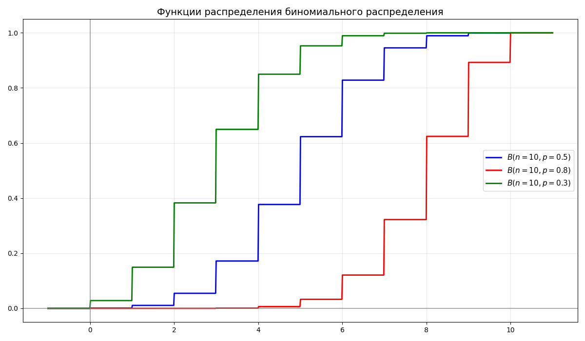
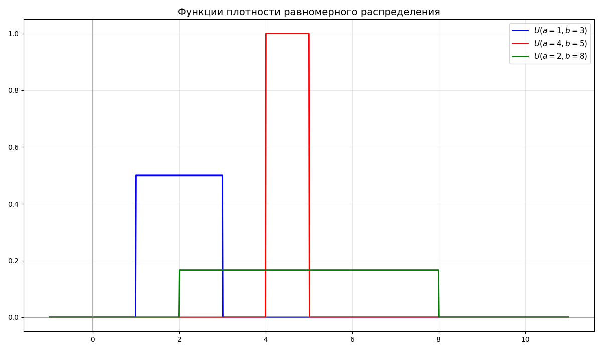
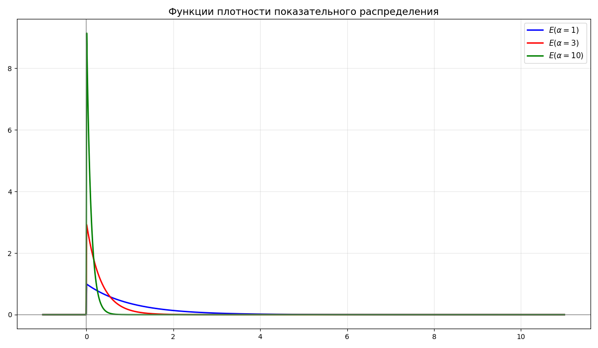
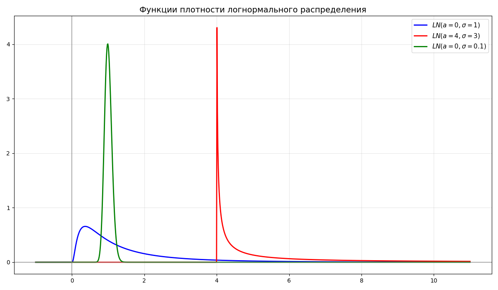
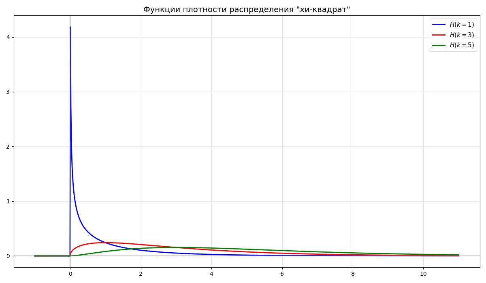

#  Машинное обучение

* [Машинное обучение](#%D0%BC%D0%B0%D1%88%D0%B8%D0%BD%D0%BD%D0%BE%D0%B5-%D0%BE%D0%B1%D1%83%D1%87%D0%B5%D0%BD%D0%B8%D0%B5)
  * [Лекция 1. Описательный анализ данных](#%D0%BB%D0%B5%D0%BA%D1%86%D0%B8%D1%8F-1.-%D0%BE%D0%BF%D0%B8%D1%81%D0%B0%D1%82%D0%B5%D0%BB%D1%8C%D0%BD%D1%8B%D0%B9-%D0%B0%D0%BD%D0%B0%D0%BB%D0%B8%D0%B7-%D0%B4%D0%B0%D0%BD%D0%BD%D1%8B%D1%85)
  * [Лекция 2. Статистические гипотезы](#%D0%BB%D0%B5%D0%BA%D1%86%D0%B8%D1%8F-2.-%D1%81%D1%82%D0%B0%D1%82%D0%B8%D1%81%D1%82%D0%B8%D1%87%D0%B5%D1%81%D0%BA%D0%B8%D0%B5-%D0%B3%D0%B8%D0%BF%D0%BE%D1%82%D0%B5%D0%B7%D1%8B)
  * [Лекция 3. Методы понижения размерности, метод главных компонент](#%D0%BB%D0%B5%D0%BA%D1%86%D0%B8%D1%8F-3.-%D0%BC%D0%B5%D1%82%D0%BE%D0%B4%D1%8B-%D0%BF%D0%BE%D0%BD%D0%B8%D0%B6%D0%B5%D0%BD%D0%B8%D1%8F-%D1%80%D0%B0%D0%B7%D0%BC%D0%B5%D1%80%D0%BD%D0%BE%D1%81%D1%82%D0%B8%2C-%D0%BC%D0%B5%D1%82%D0%BE%D0%B4-%D0%B3%D0%BB%D0%B0%D0%B2%D0%BD%D1%8B%D1%85-%D0%BA%D0%BE%D0%BC%D0%BF%D0%BE%D0%BD%D0%B5%D0%BD%D1%82)
    * [Метод главных компонент](#%D0%BC%D0%B5%D1%82%D0%BE%D0%B4-%D0%B3%D0%BB%D0%B0%D0%B2%D0%BD%D1%8B%D1%85-%D0%BA%D0%BE%D0%BC%D0%BF%D0%BE%D0%BD%D0%B5%D0%BD%D1%82)
  * [Лекция 4. Нелинейные методы уменьшения размерности](#%D0%BB%D0%B5%D0%BA%D1%86%D0%B8%D1%8F-4.-%D0%BD%D0%B5%D0%BB%D0%B8%D0%BD%D0%B5%D0%B9%D0%BD%D1%8B%D0%B5-%D0%BC%D0%B5%D1%82%D0%BE%D0%B4%D1%8B-%D1%83%D0%BC%D0%B5%D0%BD%D1%8C%D1%88%D0%B5%D0%BD%D0%B8%D1%8F-%D1%80%D0%B0%D0%B7%D0%BC%D0%B5%D1%80%D0%BD%D0%BE%D1%81%D1%82%D0%B8)
    * [Стохастическое вложение соседей с t-распределением](#%D1%81%D1%82%D0%BE%D1%85%D0%B0%D1%81%D1%82%D0%B8%D1%87%D0%B5%D1%81%D0%BA%D0%BE%D0%B5-%D0%B2%D0%BB%D0%BE%D0%B6%D0%B5%D0%BD%D0%B8%D0%B5-%D1%81%D0%BE%D1%81%D0%B5%D0%B4%D0%B5%D0%B9-%D1%81-t-%D1%80%D0%B0%D1%81%D0%BF%D1%80%D0%B5%D0%B4%D0%B5%D0%BB%D0%B5%D0%BD%D0%B8%D0%B5%D0%BC)
    * [Алгоритм UMAP](#%D0%B0%D0%BB%D0%B3%D0%BE%D1%80%D0%B8%D1%82%D0%BC-umap)
  * [Лекция 5. Метрики, метод k ближайших соседей](#%D0%BB%D0%B5%D0%BA%D1%86%D0%B8%D1%8F-5.-%D0%BC%D0%B5%D1%82%D1%80%D0%B8%D0%BA%D0%B8%2C-%D0%BC%D0%B5%D1%82%D0%BE%D0%B4-k-%D0%B1%D0%BB%D0%B8%D0%B6%D0%B0%D0%B9%D1%88%D0%B8%D1%85-%D1%81%D0%BE%D1%81%D0%B5%D0%B4%D0%B5%D0%B9)
    * [Метрики](#%D0%BC%D0%B5%D1%82%D1%80%D0%B8%D0%BA%D0%B8)
    * [Метод k ближайших соседей](#%D0%BC%D0%B5%D1%82%D0%BE%D0%B4-k-%D0%B1%D0%BB%D0%B8%D0%B6%D0%B0%D0%B9%D1%88%D0%B8%D1%85-%D1%81%D0%BE%D1%81%D0%B5%D0%B4%D0%B5%D0%B9)

##  Лекция 1. Описательный анализ данных

Пусть дана случайная величина $\xi$. Из курсов теории вероятности и математической статистики мы знаем, что:

* Функция распределения $F_\xi(x)$ - такая функция, что $F_\xi(x) = P(\xi < x)$ - вероятность попадания случайной величины в интервал $(-\infty;x)$

    Функция распределения может быть определена для дискретной и непрерывной распределений

* Функция плотности $f_\xi(x)$ - такая функция, что $\displaystyle f_\xi(x) = \int_{-\infty}^x F_\xi(y) dy$

    С помощью функции распределения и функции плотности можно вычислить вероятность попадания случайной величины в заданный отрезок: $\displaystyle P(a < \xi < b) = F_\xi(b) - F_\xi(a) = \int_a^b f_\xi(x) dx$

* Биномиальное распределение - дискретное распределение вероятностей случайной величины $X$, принимающей целочисленные значения $k = 0, 1, \dots, n$ с вероятностями $P(X = k) = C_n^k p^k (1 - p)^{n - k}$

    Биномиальное распределение обозначается как $B(n, p)$, где $n$ - число испытаний, $p$ - вероятность успеха

    

* Распределение Пуассона - дискретное распределение вероятностей случайной величины $\xi$ с параметром $\lambda$ и функцией распределения $F_\xi(k) = \frac{\lambda^k}{k!} e^\lambda$

    Распределение Пуассона обозначается как $\Pi(\lambda)$, где $\lambda > 0$

    

* Равномерное распределение $U(a, b)$ - непрерывное распределение, случайная величина $\xi$ которого имеет функцию плотности $$f_\xi(x) = \begin{cases}0, & x < 0 \\ \frac{1}{b - a}, & a \leq x \leq b \\ 0, & x > b\end{cases}$$

    

* Случайная величина $\xi$ имеет показательное распределение $E(\alpha)$, если функция плотности имеет вид $$f_\xi(x) = \begin{cases}0, & x < 0 \\ \alpha e^{-\alpha x}, & x \geq 0\end{cases}$$

    

* Случайная величина $\xi$ имеет нормальное распределение $N(a, \sigma^2)$, если функция плотности имеет вид $\displaystyle f_\xi(x) = \frac{1}{\sigma \sqrt{2\pi}} e^{-\frac{(x-a)^2}{2\sigma^2}}$, где $a$ - среднее, $\sigma$ - среднеквадратичное отклонение

    Из этого $\displaystyle F_\xi(x) = \frac{1}{\sigma \sqrt{2\pi}} \int_{-\infty}^x e^{-\frac{(t-a)^2}{2\sigma^2}} dt$

    

* Случайная величина $\xi$ имеет логарифмически-нормальное (логнормальное) распределение, если $\xi = e^\eta$, где $\eta \in N(a, \sigma^2)$

    

* Случайная величина $\chi^2$ имеет распределение "хи-квадрат" $H(n)$ со степенями свободы $n$, если $\chi^2 = X_1^2 + X_2^2 + \dots + X_n^2$ - сумма $n$ квадратов независимых стандартных нормальных величин

    

* Случайная величина $t_k$ имеет распределение Стьюдента $T(k)$ со степенями свободы $k$, если $\displaystyle t_k = \frac{X_0}{\frac{1}{k}(X_1^2 + X_2^2 + \dots + X_n^2)} = \frac{X_0}{\frac{\chi^2_k}{k}}$, где $X_0, \dots, X_n$ - независимые стандартные нормальные величины

    

* Случайная величина $f_{n,m}$ имеет распределение Фишера (или F-распределение) $F(n, m)$ со степенями свободы $n$ и $m$, если $\displaystyle f_{n,m} = \frac{\frac{\chi^2_n}{n}}{\frac{\chi^2_m}{m}}$, где $\chi^2_n$, $\chi^2_m$ - независимые случайные величины распределения "хи-квадрат"

    

* Математическое ожидание $E \xi$ - взвешенное по вероятности среднее значение случайной величины

    Для дискретного распределения $\displaystyle E \xi = \sum_{i = 1}^n p_i x_i$

    Для непрерывного распределения $\displaystyle E \xi = \int_{-\infty}^\infty x f_\xi(x) dx$

* Дисперсия $D \xi$ - математическое ожидание квадрата отклонения случайной величины от ее математического ожидания. В общем случае $D\xi = E(\xi - E\xi)^2 = E\xi^2 - (E\xi)^2$

    Для дискретного распределения $\displaystyle E \xi = \sum_{i = 1}^n p_i (x_i - E\xi)^2$

    Для непрерывного распределения $\displaystyle E \xi = \int_{-\infty}^\infty f_\xi(x) (x - E\xi)^2 dx$

* Среднеквадратическое отклонение $\sigma_\xi = \sqrt{D \xi}$ определяется как корень дисперсии

* Медиана $Me$ непрерывной случайной величины $\xi$ называется значение случайной величины $\xi$, такое что $P(\xi < Me) = P(\xi > Me) = \frac{1}{2}$

    Вместо среднего могут взять медиану, так как медиана меньше зависит от выбросов

    

* Мода - значение, вероятность которого выше всего. Если в выборке есть два или больше значения, вероятность которых равна и наибольшая, то они считаются модами

    Функция называется унимодальной, если четко выражена одна мода, иначе - многомодальной

    

* Размах - разность между максимальным и минимальным значением

* Генеральной совокупностью называются все результаты проведенных экспериментов

    Выборочной совокупностью (выборка) $X$ называются наблюдаемые данные экспериментов

    Выборка называется репрезентативной, если ее распределение совпадает с распределением генеральной совокупности

    Так как описать все проведенные эксперименты невозможно, берут небольшую выборку. Выборка выбирается так, чтобы она была репрезентативно, например, в проведении измерения роста людей нерепрезентативно брать 10 людей из Юго-Восточной Азии, так как они не представляют все население Земли

* Выборочным средним называется величина $\overline{X} = \frac{1}{n} \sum X_i$

* Выборочной дисперсией называется величина $D^* = \frac{1}{n} \sum (X_i - \overline{X})^2 = \frac{1}{n} \sum X_i^2 - \overline{X}^2$

* Исправленной выборочной дисперсией называется величина $S^2 = \frac{n}{n - 1} D^* = \frac{1}{n - 1} \sum (X_i - \overline{X})^2$

---

Машинное обучение - класс методов искусственного интеллекта, характерной чертой которых является не прямое решение задачи, а обучение за счёт применения решений множества сходных задач. Обучение основано на выявлении эмпирических закономерностей в данных

Перед тем как датасет (набор данных) применяется в обучении, его необходимо подготовить 

Данные могут быть:

* Числовыми - те, которые могут быть представлены числом, например, возраст, вес, рост. Числовые (или количественные) данные могут быть дискретными или непрерывными
* Качественным (или категориальными) - данные, которые представляют качества или категории. Бывают:
    * Номинальные - данные, которые невозможно отсортировать, например, страна проживания, пол
    * Порядковые - категории, которые представляют иерархический порядок, например, размер одежды, дворянские титулы

Чаще всего, формируя датасет, получается, что некоторых характеристик у объекта нет. Тогда можно прибегнуть к таким способам:

1. Удалить строки с неизвестной переменной или не принимать их во внимание
2. Заполнить средним/медианой/модой (обычно так делать не стоит)
3. Интерполяция 
4. Заполнение на основе соседних данных

Далее данные очищаются от выбросов (аутлаеров, от outlier) - группы значений, выделяющихся из общей выборки

Категориальные переменные принимают только определенный набор значений, которые в общем смысле нельзя сравнить. Методы машинного обучения работают с числовыми значениями, поэтому нужно превратить категориальную в числовую. 

Можно представить категориальную переменную в бинарный вектор. Например, цвета "красный", "зеленый", "синий" можно превратить в вектор из трех переменных: `is_red`, `is_green`, `is_blue`. Если цвет красный, то `is_red = 1`, `is_green = 0`, `is_blue = 0`

Если просто пронумеровать цвета, то в нашу переменную вносится порядок, что на самом деле не так

---

После данные нужно нормализовать. Нормализация (или масштабирование) данных - приведение их к единому масштабу. Начальные данные могут быть различными единицами измерения. Если не стандартизировать данные, модели машинного обучения станут слишком чувствительны к масштабу признаков, а не к их реальной важности

Методов нормализации существует много, разберем 3 основных:

1. Минимальная-максимальная нормализация

    [Минимальная-максимальная нормализация](https://en.wikipedia.org/wiki/Feature_scaling#Rescaling_(min-max_normalization)) - подход, при котором величины в выборке приводятся к диапазону $[0, 1]$. Такая нормализация полезна, если алгоритм принимает числа в некотором диапазоне

    $$x_{\text{норм}} = \frac{x - x_{\text{мин}}}{x_{\text{макс}} - x_{\text{мин}}}$$

2. Стандартизация

    [Стандартизация](https://en.wikipedia.org/wiki/Feature_scaling#Standardization_(Z-score_Normalization)) (или Z-масштабирование) преобразует выборка так, что бы среднее было равно 0, а дисперсия - 1:

    $$x_{\text{норм}} = \frac{x - \overline{x}}{\sigma_x}$$

    Выбросы очень сильно влияют на среднее значение выборки, так как изменяют выборочное среднее

3. Robust-масштабирование

    [Robust-масштабирование](https://en.wikipedia.org/wiki/Feature_scaling#Robust_Scaling) (от robust - устойчивый) - метод нормализации, похожий на стандартизацию. Вместо выборочного среднего robust-масштабирование использует устойчивую к выбросам медиану, а вместо отклонения - разницу между 25-ым и 75-ым квантилем

    $x_{\text{норм}} = \frac{x - \mathrm{median}(x)}{\mathrm{IQR}(x)}$, где $\mathrm{median}(x)$ - медиана, $\mathrm{IQR}(x)$ - разница между 25-ым и 75-ым квантилем

    Также формулу можно представить так: $x_{\text{норм}} = \frac{x - \mathrm{Q_2}(x)}{\mathrm{Q_3}(x) - \mathrm{Q_1}(x)}$, где $\mathrm{Q_1}(x), \mathrm{Q_2}(x), \mathrm{Q_3}(x)$ - квантили выборки уровней $0.25$, $0.5$, $0.75$ соответственно

Примеры работы этих методов:

---

После этого выборку можно наглядно представить в виде гистограммы. При построении гистограммы для ее лучшей читаемости следует помнить, что:

* Столбцы должны быть одинаковой ширины
* Не рекомендуется помещать более двух гистограмм на одной плоскости
* Гистограмма должна занимать все пространство графика
* Высоты столбцов для гистограмм разных выборок должны соответствовать одной оси ординат

---

Одним из способов визуализации распределения является [ящик с усами](https://ru.wikipedia.org/wiki/%D0%AF%D1%89%D0%B8%D0%BA_%D1%81_%D1%83%D1%81%D0%B0%D0%BC%D0%B8) (или box plot)

Ящик с усами представляет собой прямоугольник, высота которого равна разнице между 25-ым и 75-ым квантилем. Внутри прямоугольника изображается линий, обозначающая медиану

По сторонам прямоугольника располагаются отрезки, так называемые усы. Усы могут строиться как:

* Минимальное и максимальное значения в выборке
* Выборочное среднее $\pm$ стандартное отклонение
* $\text{25-ый квантиль} - 1.5 \cdot \text{разница между 25-ым и 75-ым квантилем}$, аналогично с 75-ым квантилем
* 9-ый и 91-ый квантили
* 2-ой и 98-ой квантили

За пределами усов могут располагать точки, обозначающие выбросы. Ящик с усами позволяет наглядно сравнить распределения:

##  Лекция 2. Статистические гипотезы

**Доверительный интервал** уровня $\alpha$ - диапазон значений такой, что вероятность попадания значения в него равна $1 - \alpha$. Интервалы бывают двухсторонними $(a; b)$ и односторонними $(a; +\infty)$

Например, при нормальном распределении почти все значения (99.73%) попадают в доверительный интервал $(a - 3\sigma; a + 3\sigma)$

**Статистической гипотезой** $H$ называется предположение о распределении наблюдаемой случайной величины. Обычно гипотезы формулируют в паре $H_0$ и $H_1$, где $H_0$ - основная гипотеза, а $H_1$ - альтернативная

Пример: среднее количество лет работы американца до выхода на пенсию равно 64. Нулевой гипотезой будет утверждение "матожидание распределения равно 34", то есть $H_0 \ : \ \mu = 64$

Гипотезы бывают:

* левосторонними (left-tailed)

    $$
    \begin{cases}
        H_0 \ : \ p \geq \alpha \\ 
        H_1 \ : \ p < \alpha \\ 
    \end{cases}
    $$

* правосторонними (right-tailed)

    $$
    \begin{cases}
        H_0 \ : \ p \leq \alpha \\ 
        H_1 \ : \ p > \alpha \\ 
    \end{cases}
    $$

* двусторонними (two-tailed)

    $$
    \begin{cases}
        H_0 \ : \ p = \alpha \\ 
        H_1 \ : \ p \neq \alpha \\ 
    \end{cases}
    $$

Гипотеза называется **простой**, если она однозначно определяет распределение. В другом случае гипотеза называется **сложной**, и она является объединением конечного или бесконечного числа гипотез

**Ошибка первого рода** состоит в том, что $H_0$ отклоняется, хотя она верна. 
Аналогично, **ошибка второго рода** состоит в том, что $H_1$ отклоняется (то есть $H_0$ принимается), хотя она верна

Вероятность $\alpha$ ошибки первого рода называется **уровнем значимости критерия**. Вероятность ошибки второго рода обозначаем $\beta$. **Мощностью критерия** называется вероятность $1 - \beta$ (вероятность
недопущения ошибки второго рода)

---

P-значение (P-value, от **p**robability) - это вероятность (при условии, что нулевая гипотеза верна) получить такое же или более экстремальное значение какой-либо статистики (например, математического ожидания)

Малое p-значение (обычно меньше 0.05) говорит о том, что наблюдаемые данные маловероятны при справедливости основной гипотезы. В таком случае часто отвергают нулевую гипотезу.  
Большое p-value означает, что данные согласуются с основной гипотезой, и оснований отвергать её нет

Пример: пусть есть стандартное нормальное распределение и выборка из него. Для выборки нашли среднее и получили $2$

Проверим гипотезу, что математическое ожидание выборки равно $0$:

$$
\begin{cases}
    H_0 \ : \ a = a_0 = 0, & \text{ если } |K| < t_\text{кр} \\ 
    H_1 \ : \ a \neq a_0, & \text{ если } |K| \geq t_\text{кр}
\end{cases}
$$

Здесь $K = \sqrt{n} \frac{\overline{x} - a_0}{\sigma}$ - критерий, а $t_\text{кр}$ - квантиль стандартного нормального распределения уровня $1 - \frac{\alpha}{2}$

Пусть размер выборки $n = 4$, тогда $K = 4$

Вероятность получить выборочное среднее, равное или большее $2$, при условии, что нулевая гипотеза верна (то есть $a = 0$), равна

$P(X \leq -K) + P(X \geq K) = 2 P(\|X\| \geq K) = 2 (\Phi(+\infty) - \Phi(K)) = 1 - 2 \Phi(K)$

Здесь $P(X \leq a)$ - вероятность того, что случайная величина $X \in N(0, 1)$ будет меньше или равна $a$, $\Phi(x) = \frac{1}{\sqrt{2\pi}} \int_0^x e^{-\frac{z^2}{2}} dz$ - функция Лапласа. Так как тест в гипотезе учитывает модуль, то мы считаем сумму интервалов с двух сторон

Полученное значение называют p-значением. В нашем случае оно равно $0.00008$ - данные маловероятны при такой принятой гипотезе

P-значение не показывает вероятность того, что гипотеза верна или неверна. Также p-значение не говорит о величине эффекта - оно только показывает, насколько данные редки при нулевой гипотезе, но не измеряет силу или практическую важность эффекта, так как зависит от статистики критерия, гипотезы и выборки. Поэтому сравнивать p-значения для разные выборок из разных задач не покажет, какая из них имеет меньшую вероятность на существование

---

Некоторые часто используемые гипотезы называются тестами:

* T-тест используется для проверки гипотезы о равенстве матожидания распределения выборки конкретному числу

    Пусть дана $\vec X = (X_1, \dots, X_n) \in N(a, \sigma^2)$ с неизвестным матожиданием и дисперсией. Поставим наш критерий $K = \sqrt{n} \frac{\overline{x} - a_0}{S}$, а гипотезу

    $$
    \begin{cases}
        H_0 \ : \ a = a_0 = 0, & \text{ если } |K| < t_\text{кр} \\ 
        H_1 \ : \ a \neq a_0, & \text{ если } |K| \geq t_\text{кр}
    \end{cases}
    $$

    где $t_\text{кр}$ - квантиль распределения Стьюдента $T_{n - 1}$ уровня $1 - \frac{\alpha}{2}$

    Также существует двухвыборочный T-тест (критерий Стьюдента): пусть $(X_1, \dots, X_n)$ и $(Y_1, \dots, Y_m)$ из нормальных распределений $X \in N(a_1, \sigma^2)$ и $Y \in N(a_2, \sigma^2)$

    Проверяется $H_0 : a_1 = a_2$ против $H_1 : a_1 \neq a_2$

    В качестве статистики возьмем $K = \frac{\overline x - \overline y}{S_p \sqrt{\frac{1}{n} + \frac{1}{m}}}$, где $S^2_p = \frac{(n - 1) S_X^2 + (m - 1) S_Y^2}{n + m - 2}$

    Если нулевая гипотеза верна, то при $a_1 = a_2$ получаем, что $K \in T_{n + m - 2}$, если верна альтернативная гипотеза, то $K \longrightarrow \infty$

    Критерий: $t_\alpha$ - квантиль $\|T_{n + m - 2}\|$ уровня $\alpha$

    $$
    \begin{cases}
        H_0 : a_1 = a_2, & \text{если } K < t_\alpha \\
        H_1 : a_1 \neq a_2, & \text{если } K \geq t_\alpha
    \end{cases}
    $$

* Критерий знаков используется для проверки гипотезы о медиане распределения выборки

    Пусть дана выборка $\vec X = (X_1, \dots, X_n)$, не предполагая нормальности распределения. Проверяется гипотеза о медиане $m$

    Считаем количество элементов, больших гипотетической медианы $m_0$: $$S = \text{\#}\{ i : X_i > m_0 \}$$

    При нулевой гипотезе $H_0 \ : \ m = m_0$, вероятность того, что наблюдение окажется выше или ниже медианы, равна $\frac{1}{2}$. Следовательно, статистика $S$ имеет биномиальное распределение: $S \in B(n, p = \frac{1}{2}).$

    $$
    \begin{cases}
        H_0 : m = m_0, & \text{если } 2 \cdot P(S \geq s_\text{набл}) > \alpha, \\
        H_1 : m \neq m_0, & \text{если } 2 \cdot P(S \geq s_\text{набл}) \leq \alpha,
    \end{cases}
    $$

    где $s_\text{набл}$ - наблюдаемое значение статистики.

    Для больших $n$ биномиальное распределение аппроксимируется нормальным: $S \approx N\left(\frac{n}{2}, \frac{n}{4}\right)$

    Тогда используем нормированную статистику $K = \frac{S - n/2}{\sqrt{n}/2}$, и решение гипотезы строится аналогично Z-тесту.

    Тогда продолжаем в том же стиле и добавим двухвыборочный критерий знаков:

    
    Аналогично двухвыборочный критерий знаков используется для проверки гипотезы о равенстве медиан двух связанных выборок

    Для двухмерной выборки $(X_1, Y_1), \, (X_2, Y_2), \, \dots, \, (X_n, Y_n)$ рассмотрим разности $D_i = X_i - Y_i$

    Нулевая гипотеза формулируется как $H_0 : \text{медиана распределения } D_i = 0$, то есть медианы выборок равны.

    В качестве статистики берём число положительных разностей: $$S = \text{\#}\{ i : D_i > 0 \}$$

    При $H_0$ вероятность знака разности равна $\frac{1}{2}$. Тогда $S \in B(n, \frac{1}{2})$

    $$
    \begin{cases}
        H_0 : \text{медианы равны}, & \text{если } 2 \cdot P(S \geq s_\text{набл}) > \alpha, \\
        H_1 : \text{медианы различаются}, & \text{если } 2 \cdot P(S \geq s_\text{набл}) \leq \alpha,
    \end{cases}
    $$

    где $s_\text{набл}$ - наблюдаемое значение статистики.

    Для больших $n$ можно использовать нормальную аппроксимацию: $K = \frac{S - n/2}{\sqrt{n}/2} \approx N(0,1)$

* Критерий Манна–Уитни (или U-критерий) применяется для проверки гипотезы о равенстве распределений двух независимых выборок

    Пусть имеются выборки $X_1, \dots, X_n, \quad Y_1, \dots, Y_m$ из распределений с одинаковой формой, но, возможно, разными сдвигами

    Формулируем гипотезы:

    $$
    \begin{cases}
        H_0 : F_X = F_Y \quad \text{(распределения совпадают)}, \\
        H_1 : F_X \neq F_Y \quad \text{(есть сдвиг по медиане)}
    \end{cases}
    $$

    Статистику строим по следующим правилам:

    1. Объединяем все $n+m$ наблюдений и присваиваем им ранги
    2. Считаем сумму рангов первой выборки: $R_X = \sum_{i=1}^n r(X_i)$
    3. Определяем статистику Манна-Уитни: $U = R_X - \frac{n(n+1)}{2}$

    При нулевой гипотезе $U$ имеет известное распределение с матожиданием $E U = \frac{nm}{2}, \quad D U = \frac{nm(n+m+1)}{12}$

    Для больших выборок берем статистику $Z = \frac{U - nm/2}{\sqrt{nm(n+m+1)/12}} \approx N(0,1)$

    $$
    \begin{cases}
        H_0 : F_X = F_Y, & \text{если } |Z| < z_{1-\frac{\alpha}{2}}, \\
        H_1 : F_X \neq F_Y, & \text{если } |Z| \geq z_{1-\frac{\alpha}{2}},
    \end{cases}
    $$

    где $z_{1-\frac{\alpha}{2}}$ - квантиль стандартного нормального распределения

---

Для определения связи между распределениями двух выборок существует понятие корреляции. Коэффициент корреляции $r$ - величина в диапазоне от -1 до 1, показывающая силу и направления связи

* Коэффициент линейной корреляции (или корреляции Пирсона) измеряет линейную зависимость между случайными величинами из двух выборок

    $r = \frac{\mathrm{cov}(X, Y)}{\sigma_x \sigma_y}$

* Так как связь может быть не строго линейной, существует коэффициент корреляции Спирмана

    Для случайной величины $(X_i, Y_i)$ из выборки отдельно считают ранг для $X_i$ и для $Y_i$, далее берется сумма разность рангов для случайных величин из выборки

    $\displaystyle \rho = 1 - \frac{6 \sum_i d^2}{n (n^2 - 1)}$, где $d_i$ - разность рангов

    Коэффициент корреляции Спирмана показывает монотонную зависимость и основана на рангах, поэтому устойчива к выбросам

##  Лекция 3. Методы понижения размерности, метод главных компонент

Зачастую данные нам данные имеют очень много переменных. Это может привести к "проклятью размерности":

* Точки становятся разряженными, так как 10-мерный куб заполнять тяжелее, чем 2-мерный квадрат
* Модель становится сложнее, так как нужно учитывать больше признаков
* Алгоритмы, такие как метод k ближайших соседей, становятся сложнее
* Расстояния становятся относительно близкими

    Если рассмотреть расстояние между двумя случайным точками $a$ и $b$ в $k$-мерном кубе $[0, 1]^k$ как случайную величину, то обнаружится, что

    * Матожидание для $(a_i - b_i)^2$ равно $\displaystyle E (a_i - b_i)^2 = \int_0^1 \int_0^1 (x - y)^2 dx dy = \int_0^1 \frac{(x - y)^3}{3} \Big\vert_{x = 0}^{x = 1} dy = \int_0^1 \left(\frac{(1 - y)^3}{3} + \frac{y^3}{3}\right) dy = -\frac{(1 - y)^4}{12} \Big\vert_0^1 + \frac{y^4}{12} \Big\vert_0^1 = \frac{1}{12} + \frac{1}{12} = \frac{1}{6}$

    * $\displaystyle E (a_i - b_i)^4 = \int_0^1 \int_0^1 (x - y)^4 dx dy = \int_0^1 \frac{(x - y)^5}{5} \Big\vert_{x = 0}^{x = 1} dy = \int_0^1 \left(\frac{(1 - y)^5}{5} + \frac{y^5}{5}\right) dy = \frac{1}{30} + \frac{1}{30} = \frac{1}{15}$

    * Дисперсия для $(a_i - b_i)^2$ равна $D (a_i - b_i)^2 = E (a_i - b_i)^4 - (E (a_i - b_i)^2)^2 = \frac{1}{15} - \frac{1}{36} = \frac{7}{180}$

    * Для $\displaystyle \sum_{i = 1}^k (a_i - b_i)^2$ матожидание равно $\frac{k}{6}$, дисперсия - $\frac{7k}{180}$

    * По центральной предельной теореме $\displaystyle \sum_{i = 1}^k (a_i - b_i)^2$ стремится к $N\left(\frac{k}{6}, \frac{7k}{180}\right)$, применяя дельта-метод, получаем, что у случайной величины $\displaystyle \sum_1^k (a_i - b_i)^2$ при $k \to \infty$ матожидание равно $\sqrt{\frac{k}{6}}$, а дисперсия $\left(\left(\sqrt{x}\right)^\prime_{\frac{k}{6}}\right)^2 \cdot \frac{7k}{180} = \frac{6}{4k} \frac{7k}{180} = \frac{7}{120}$

    То есть матожидание пропорционально размерности, а дисперсия - нет, поэтому средние расстояния между точками с высоком вероятностью оказываются в окрестности $\sqrt{\frac{k}{6}}$

Поэтому нужно уменьшить размерность, не разрушая структуру данных

Существуют несколько методов уменьшения размерности:

* Линейные: PCA, MDS и другие
* Нелинейные: t-SNE, UMAP и другие

###  Метод главных компонент

Метод главных компонент (Principal Component Analysis, PCA) строится на создании прямых (осей, или главных компонент), которые будут иметь наибольшее отклонение от других осей

Выбирается число этих компонент $n$ - зачастую $n = 2$, так как проще отобразить на графике - и ищутся столько прямых, дисперсия которых максимальна

Для этого:

1. Строится матрица ковариаций $D \vec X = \{\mathrm{cov} (X_i, X_j)\}_{i, j}$
2. Далее для нее находятся собственные числа $\lambda_i$ (такие, что $\lvert (D \vec X) - E \cdot \lambda \rvert = 0$)

    Найденные собственные числа показывают долю дисперсии по одной из компонент (умноженную на сумму всех собственных чисел)

3. Берутся $n$ наибольших собственных чисел, для них вычисляются собственные вектора $\vec b$ (такие, что $(D \vec X) \cdot \vec b = \lambda_i \vec b$, при этом $\vec b \neq 0$)

    Собственные вектора показывают направления главных компонент. Они сортируются по убыванию по собственному числу, первая компонента (PC1) - это вектор с наибольшим числом, вторая компонента (PC2) - после него и так далее

4. Далее формируется матрица проекций, где столбцы - выбранные собственные вектора. Далее вектор из выборки умножается на матрицу проекции и получается точка в новом пространстве

Заметим, что, так как метод главных компонент вычисляет прямые с наибольшим отклонением (то есть дисперсия) от точек, то переменные, имеющие больший диапазон в отличии от других, будут больше влиять на поиск компонент. Поэтому данных перед методом главных компонент нужно стандартизовать

Пример использования PCA: пусть имеется датасет студентов с параметрами `hours_studied` (среднее время обучения в часах за день), `practice_problems` (среднее количество решенных задач) и `sleep_hours` (среднее время сна в часах)

| Номер студента | `hours_studied` | `practice_problems` | `sleep_hours` |
|---:|----------------:|--------------------:|--------------:|
|  0 |         5.80159 |             6.10648 |       7.39829 |
|  1 |         5.16314 |             3.63228 |       9.85228 |
|  2 |         7.01063 |             4.53442 |       7.9865  |
|  3 |         4.65311 |             3.35642 |       6.94229 |
|  4 |         3.17847 |             3.18283 |       8.82254 |
|  5 |         4.92243 |             3.96921 |       6.77916 |
|  6 |         6.05997 |             3.72426 |       8.20886 |
|  7 |         7.23881 |             4.98804 |       6.04033 |
|  8 |         4.16849 |             2.9506  |       6.67181 |
|  9 |         4.4241  |             4.02976 |       8.19686 |

После стандартизации получаем такую матрицу ковариаций:

|                     | `hours_studied` | `practice_problems` | `sleep_hours` |
|:--------------------|----------------:|--------------------:|--------------:|
| `hours_studied`     |        1        |            0.65042  |     -0.274431 |
| `practice_problems` |        0.65042  |            1        |     -0.241426 |
| `sleep_hours`       |       -0.274431 |           -0.241426 |      1        |

Для нее находятся собственные числа `2.01551082`, `0.93050171` и `0.38732081`

Далее находятся собственные вектора:

|                     |     `PC1` |    `PC2` |      `PC3` |
|:--------------------|----------:|---------:|-----------:|
| `hours_studied`     |  0.649822 | 0.258358 |  0.71483   |
| `practice_problems` |  0.640601 | 0.320023 | -0.698008  |
| `sleep_hours`       | -0.409098 | 0.911502 |  0.0424537 |

Получаем матрицу проекций

|           |          |   |
|-----------|----------|---|
|  0.649822 | 0.258358 | 0 |
|  0.640601 | 0.320023 | 0 |
| -0.409098 | 0.911502 | 0 |

Далее умножаем вектора из датасета на матрицу, получаем 10 точек на плоскости:

> Код примера - [machlearn_pca_example.py](./examples/machlearn_pca_example.py)

---

Результат PCA часто используется для:

* Визуализации многомерных данных
* Ускорения обучения моделей за счет уменьшения числа признаков
* Подавления шума - последние компоненты часто содержат в основном шум
* Решение проблемы мультиколлинеарности - новые признаки ортогональны

Так как главные компоненты - линейные комбинации исходных признаков, метод главных компонент плохо подходит для нелинейных связей

Для визуализации лучше всего выбрать 2-3 компоненты

Для обучения лучше оставить как можно больше компонент. Для стандартизованных данных можно выбрать столько компонент, для которых собственные числа больше единицы (правило Кайзера) или пока доля объясненной дисперсии не составит не меньше порога (обычно 85%-95%)

##  Лекция 4. Нелинейные методы уменьшения размерности

###  Стохастическое вложение соседей с t-распределением

Стохастическое вложение соседей с t-распределением (t-distributed Stochastic Neighbor Embedding, t-SNE) - алгоритм, хорошо подходящий для визуализации данных в низкой размерности

Такой метод моделирует данные так, что близлежащие точки после алгоритма находятся рядом, а далеко стоящие с высокой вероятностью будут далеко друг от друга

Для этого:

1. Для каждой пары точек $x_i$ и $x_j$ вычисляется евклидово расстояние $d_{ij} = \|x_i - x_j\|$

2. Далее определяется вероятность того, что точка $x_j$ будет соседом точки $x_i$:

    $$p_{j|i} = \frac{e^{-\frac{d^2_{ij}}{2\sigma_i^2}}}{\sum_{k \neq i} e^{-\frac{d^2_{ik}}{2\sigma^2_i}}}$$

    То есть доля $F_\xi (d_{ij})$ от суммы $\sum_{k \neq i} F_\xi (d_{ik})$ для всех точек, где $\xi$ - случайная величина из $N(0, \sigma_i^2)$

3. Для метода задается параметр перплексии $\mathrm{Perp}$. От него определяется значение $\sigma_i$ такое, что $\mathrm{Perp}(P_i) = 2^{H(P_i)}$, где $H(P_i) = - \sum_{j\neq i} p_{j\|i} \log_2 p_{j\|i}$ - энтропия Шеннона

    В t-SNE функция перплексии $\mathrm{Perp}(P_i)$ устанавливается на какое-то число (оно называется `perplexity`, обычно от 1 до 100), благодаря которому можно вывести $\sigma_i$

    Чем больше перплексия, тем больше вероятность того, что некоторая точка будет соседом для другой точки

    При этом перплексия не должна быть больше $n - 1$, где $n$ - размер датасета

4. Совместная вероятность $p_{ij}$ определяется как $p_{ij} = \frac{p_{j\|i} + p_{i\|j}}{2n}$, при этом $p_{ii} = 0$

    Заметим, что $p_{j\|i} \neq p_{i\|j}$

5. Пусть точки $y_i$ и $y_j$ - отображения точек $x_i$ и $x_j$ на целевом пространстве низкой размерности. Тогда установим, что вероятность того, что $y_i$ и $y_j$ - соседи, равна 

    $$q_{ij} = \frac{(1 + \|y_i - y_j\|^2)^{-1}}{\sum_{k \neq l} (1 + \|y_k - y_l\|^2)^{-1}}$$

    При этом $q_{ii} = 0$

    Здесь берется функция плотности $F_t = \frac{\Gamma\left(\frac{n + 1}{2}\right) \left(1 + \frac{x^2}{n}\right)^{-\frac{n + 1}{2}}}{\sqrt{n\pi} \Gamma\left(\frac{n}{2}\right)}$ случайной величины $t$ из распределения Стьюдента $T_n$ при степени свободы $n = 1$, тогда

    $$q_{ij} = \frac{F_t(\|y_i - y_j\|)}{\sum_{k \neq l} F_t(\|y_k - y_l\|)}$$

6. Если вы дочитали до этого момента, то тут берется функция расстояния Кульбака-Лейблера (или сумма дивергенций Кульбака-Лейблера)

    $$\mathrm{KL}(P \| Q) = \sum_{i \neq j} p_{ij} \log \frac{p_{ij}}{q_{ij}},$$

    которая с помощью градиентного спуска (метод нахождения минимума многомерной функции) минимизируется по отношению к точкам $y_i$, которые изначально были установлены случайным образом (отсюда стохастический)

    Точки $y_i$ в ходе градиентного спуска "притягиваются" к своим местам

    Количеством итераций алгоритма t-SNE называется количество шагов градиентного спуска - чем больше, тем точнее. На больших датасетах берется 500-2000, для приблизительной быстрой оценки 250-500

Наконец-то, мы получили точки $y_i$, которые можно отобразить на плоскости

Распределение Стьюдента с одной степенью свободы имеет более тяжелые хвосты, чем нормальное распределение. Это позволяет близким точкам оставаться очень близкими,а далеким точкам быть очень далекими 

Алгоритмическая сложность вычисляется так:

* Вычисление попарных расстояний - $O(n^2 d)$
* Поиск $\sigma_i$ для каждой точки - $O(n^2 \log \mathrm{Perp})$
* Каждая итерация градиентного спуска - $O(n^2 k)$

где $d$ - размерность исходного пространства, $k$ - размерность целевого

---

Пример: есть датасет с 15 фруктами (яблоки и цитрусы), для них мы знаем кислотность, сладость и сочность

Алгоритм t-SNE с `perplexity=4` явно отделит их и расположит на плоскости:

При этом также явно можно заметить, что на проекции они кластеризовались по своим признакам

> Код примера - [machlearn_tsne_example.py](./examples/machlearn_tsne_example.py)

---

Другой пример - есть датасет с изображениями цифр от 0 до 9. Изображение состоит из сетки 8 на 8 (256 пикселей), где один пиксель - число от 0 до 1, обозначающий оттенок серого

Тогда можно понаблюдать, что происходит при разных `perplexity`:

При маленьком `perplexity` образуются маленькие кластеры, а при большом - они "слипаются"

---

Метод t-SNE используется для:

* Для визуализации
* Для кластеризации

Однако надо учитывать его недостатки:

* t-SNE вычислительно дорогой
* Не сохраняет глобальную структуру
* Чувствительный к значению `perplexity`

###  Алгоритм UMAP 

Алгоритм UMAP (Uniform Manifold Approximation and Projection) - алгоритм, похожий на t-SNE. Алгоритм UMAP был создан в 2018 году (статья - [\*тык\*](https://arxiv.org/pdf/1802.03426)) с целью получить более сильное математическое обоснование

Работает он так:

1. Даны параметры $k = \text{n\\_neighbors}$ - заданное число ближайших соседей у точки и $\text{min\\_dist}$ - минимальное расстояние между точками в целевом пространстве

2. Далее для каждое точки $x_i$ ищется $k$ ближайших соседей $T = \{t_1, \dots, t_k\}$, используя в качестве расстояния любимую метрику $\mathrm{dist}(x_i, t_i)$ (например, евклидово расстояние $$\mathrm{dist}(x_i, t_i) = \|x_i - t_i\|$$)

3. Теперь для каждой точки вычисляет расстояние до самого ближнего соседа $\displaystyle \rho_i = \min_{t \in T} \mathrm{dist}(x_i, t)$

    Также вычисляется $\sigma_i$ из уравнения $\displaystyle \sum_{t \in T} e^{-\frac{\mathrm{dist}(x_i, t) - \rho_i}{\sigma_i}} = \log_2 k$

4. Теперь строится взвешенный ориентированный граф, где вес ребра из точки $x_i$ в точку $x_j$ определяется как $v(x_i \to x_j) = e^{-\frac{\mathrm{dist}(x_i, x_j) - \rho_i}{\sigma_i}}$

5. Этот граф превращается в взвешенный неориентированный, тогда вес ребра из точки $x_i$ в точку $x_j$ определяется как $v_{ij} = v(x_i \to x_j) + v(x_j \to x_i) - v(x_i \to x_j) \cdot v(x_j \to x_i)$

6. После этого случайным образом создается новый граф в целевом пространстве меньшей размерности, с тем же количеством вершин, ребер и соответственными степенями вершин. В нем вес ребра считается как

    $$w_{ij} = \frac{1}{1 + a \cdot \mathrm{dist}(y_i, y_j)^{2b}}$$

    Параметры $a$ и $b$ подбираются так, что бы $\frac{1}{1 + a \cdot \text{min\textunderscore dist}^{2b}} = 0.5$, а значение производной $\frac{\partial w_{ij}}{\partial \mathrm{dist} (y_i, y_j)} = -1$ в точке $\mathrm{dist}(y_i, y_j) = \text{min\textunderscore dist}$

7. Теперь составляется функция расстояний Кульбака-Лейбнера

    $$\mathrm{KL}(P \| Q) = \sum_{i \neq j} v(x_i, x_j) \log \frac{v(x_i, x_j)}{w(y_i, y_j)} + (1 - v(x_i, x_j)) \log \left(\frac{1 - v(x_i, x_j)}{1 - w(x_i, x_j)}\right),$$

    которая с помощью стохастического градиентного спуска минимизируется

    Алгоритм градиентного спуска работает фиксированное число итераций (так называемых эпох)

Теперь мы получаем координаты точек $y_i$ в пространстве меньшей размерности

Алгоритмическая сложность UMAP вычисляется так:

* Нахождение ближайших соседей - $O(n^2)$ (с оптимизациями можно $O(n \log n)$)
* Построение графа - $O(nk)$
* Градиентный спуск - $O(Tnk)$, где $T$ - количество эпох

Получается $O(n \log n + Tnk)$

Алгоритм UMAP выходит быстрее на больших выборках данных (при $n > T$)

---

Пример: возьмем этот же датасет с 15 фруктами (яблоки и цитрусы). Алгоритм UMAP с `n_neighbors=5` и `min_dist=0.1` отделит фрукты с разными параметрами

На маленьких датасетах, как можно заметить, при правильно подобранных параметрах результат UMAP мало отличим от t-SNE

> Код примера - [machlearn_umap_example.py](./examples/machlearn_umap_example.py)

---

Посмотрим, что происходит при разных `n_neighbors` и `min_dist` на датасете с изображениями цифр:

Малое значение `n_neighbors` подчеркивает локальную структуру, а большое - связи между кластерами, то есть `n_neighbors` влияет на масштаб. Расстояние `min_dist` влияет на плотность кластера на графика

---

На практике параметры `n_neighbors` и `min_dist` определяются методом тыка, но хорошими начальными значениями являются $\text{n\\_neighbors} = \sqrt{n}$, $\text{min\\_dist} = 0.1$

Таким образом, алгоритм UMAP

1. Обладает высокой скоростью работы на больших наборах данных
2. Сохраняет глобальную структуру
3. Устойчив к разной плотности (что видно на примере выше)
4. Более универсален, в отличии от t-SNE

Также стоит учесть недостатки:

1. Чувствительность к параметрам, результаты сильно зависят от выбора `n_neighbors`
2. Случайность
3. Сложность интерпретации расстояний

##  Лекция 5. Метрики, метод k ближайших соседей

Во время обучения модели возникает компромисс отклонение-дисперсия (Bias-variance tradeoff): ошибку модели, то есть то, насколько ее предсказывание неверно от реального результата, можно поделить на три части:

* Смещение - погрешность оценки, возникающая в результате ошибочного предположения в алгоритме обучения
* Дисперсия - ошибка чувствительности к малым отклонениям в тренировочном наборе
* Шум - дополнительная ошибка, которую никак нельзя предсказать

Более простые, недообученные модели склонны иметь большое смещение, а более сложные, переобученные очень чувствительные к значениям переменных и не способны предсказывать общую закономерность

Поэтому данные делят на три части:

* Тренировочные данные (Train set) - это данные, на которых модель обучается, то есть подбирает свои параметры
* Тестовые данные (Test set) - это данные, на которых оценивается качество модели, которые модель не видела во время обучения
* Данные для проверки (Validation set) - для более точного подбора гиперпараметров модели путем их проверки на этих данных

    Гиперпараметры же находятся с помощью данных для проверки:

    * подбором
    * рандомом
    * техниками оптимизации

Главная цель - проверить, насколько модель обобщается на новые, невиданные данные. Это нужно, чтобы:

* Предотвратить переобучение - ситуацию, когда модель слишком хорошо запомнила тренировочные данные, но при этом плохо обобщает на новые данные (тестовые или реальные)

* Если проверять модель на тех же данных, на которых она обучалась, результат будет чрезмерно оптимистичным

* Модель может запомнить конкретные примеры, но не научится общим закономерностям

В том числе для предотвращения переобучения используется перекрестная проверка (K-Fold Cross Validation):

1. Выборка делится на `k` частей
2. Далее каждая из частей становится тестовыми данными, а остальные - тренировочными
3. Модель обучается на тренировочных, проверяется на тестовых, получаем `k` определенных метрик для `k` обученных моделей
4. Берется общее этих метрик (например, среднее арифметическое), чтобы оценить точность и эффективность с наиболее равномерным использованием имеющихся данных

Зачастую датасеты могут быть несбалансированными, то есть намного чаще обладать одним признаком А, нежели другим признаком B (например, список транзакций, где чаще всего будут успешные), что помешает обучению модели. Для решения этого есть такие методы:

1. Добавление примеров меньшего класса (Oversampling)

    Добавление примеров может привести к переобучению, если просто дублировать данные

    Самый известный метод добавления - SMOTE (о нем позже)

2. Уменьшение примеров большего класса (Undersampling)

    При уменьшении мы случайно удаляем часть примеров из преобладающего класса. При этом мы теряет часть информации из обучающего набора

3. Взвешивание классов: увеличиваем вес редкому классу в функции потерь

4. Изменение порога классификации

###  Метрики

Методы машинного обучения в основном решают две задачи:

* Классификация - предсказание принадлежности объекта к классу
* Регрессия - предсказание результата на основе неявной закономерности или корреляции

Чтобы понять, насколько хороша наша модель классификации, допустим, что наша модель выводит 0 или 1 в качестве результата, посчитаем, столько таких результатов:

* Истинно положительные (True Positive, TP) - такие, в которых модель права и выдала 1
* Истинно отрицательные (True Negative, TN) - такие, в которых модель права и выдала 0
* Ложноположительные (False Positive, FP) - такие, в которых модель ошиблась и выдала 1
* Ложноотрицательные (False Negative, FN) - такие, в которых модель ошиблась и выдала 0

Тогда составим следующие метрики:

* **Аккуратностью** (Accuracy) модели называют долю верно предсказанных результатов от всех: $\displaystyle \mathrm{Accuracy} = \frac{\mathrm{TP} + \mathrm{TN}}{\mathrm{TP} + \mathrm{TN} + \mathrm{FP} + \mathrm{FN}}$

    Аккуратность не работает, если классы не сбалансированы в выборке. Например, если в больнице 95 пациентов здоровы, 5 - больны, а модель предсказала, что все здоровы, то аккуратность будет равна 95%, хотя больных мы не нашли

    Аккуратность используется, когда все ошибки одинаково важны

* **Точностью** (Precision) модели называют долю истинно положительных от всех предсказанных положительных результатов: $\displaystyle \mathrm{Precision} = \frac{\mathrm{TP}}{\mathrm{TP} + \mathrm{FP}}$

    Точность полезна, когда мы хотим уменьшить число ложноположительных срабатываний, например, для фильтра спама

* **Запоминанием** (Recall) модели называют долю истинно положительных от всех действительно положительных результатов: $\displaystyle \mathrm{Recall} = \frac{\mathrm{TP}}{\mathrm{TP} + \mathrm{FN}}$

    Запоминание применяют для уменьшения ложноотрицательных результатов, например, в случае выставления медицинского диагноза

* **F-мера** (F-score или F1-score) модели называют гармоническое среднее от точности и запоминания: $\displaystyle F_1 = \frac{2}{\frac{1}{\mathrm{Precision}} + \frac{1}{\mathrm{Recall}}} = \frac{2 \mathrm{Precision} \cdot \mathrm{Recall}}{\mathrm{Precision} + \mathrm{Recall}} = \frac{2\mathrm{TP}}{2\mathrm{TP} + \mathrm{FN} + \mathrm{FP}}$

    F-мера используется, когда нужен компромисс между точностью и запоминанием. Если одна из метрик низкая, то она сильно занизит F-меру

Зачастую, модель возвращает не 0 или 1, а вероятность того, насколько принадлежит объект к классу. Если вероятность выше установленного порога $\alpha$, то считается, что объект принадлежит классу

* ROC-кривая (Receiver Operating Characteristic) показывает, насколько хорошо модель различает классы. Строится она так:

    1. Для каждого порога от 0 до 1 считаем, сколько раз мы угадали правильно и неправильно
    2. Вычисляем две метрики: 
        * частоту истинно положительных - $\displaystyle \mathrm{True\ Positive\ Rate} = \frac{\mathrm{TP}}{\mathrm{TP} + \mathrm{FN}}$
        * частоту ложноположительных - $\displaystyle \mathrm{False\ Positive\ Rate} = \frac{\mathrm{FP}}{\mathrm{FP} + \mathrm{TN}}$

    3. Отмечаем точки $(\mathrm{False\ Positive\ Rate}, \mathrm{True\ Positive\ Rate})$ на плоскости, соединяем их - получаем кривую от $(0, 0)$ до $(1, 1)$

    Полученная линия показывает, как меняется баланс между количеством ложных срабатываний и истинных попаданий

    Площадь под кривой (ROC-AUC, Area Under Curve) - метрика, измеряющая общую способность модели различать классы. Для модели, возвращающей случайные результаты, ROC-кривая представляет прямую из $(0, 0)$ до $(1, 1)$, если полученная кривая располагается выше линии $y = x$ (то есть площадь больше $0.5$), то модель предсказывает лучше, чем случайная модель

* PR-кривая (Precision-Recall) показывает баланс между точностью и запоминанием при разных порогах классификации. Аналогично, отмечаем точки $(\mathrm{Precision}, \mathrm{Recall})$ для каждого порога

    Площадь под кривой PR-AUC высока, если модель находит большинство положительных объектов и делает мало ложных срабатываний. Метрика PR-AUC полезна, если классы в выборке несбалансированны

---

Если модель решает задачу регрессии, то полезны другие метрики:

* Среднее значение абсолютных разностей (Mean Average Error) - $\displaystyle \mathrm{MAE} = \frac{1}{n} \sum_{i = 1}^{n} \vert y_i - y_i^\prime \vert$

    Метрика устойчива к выбросам

* Среднее значение квадратов разности (Mean Squared Error) - $\displaystyle \mathrm{MSE} = \frac{1}{n} \sum_{i = 1}^{n} (y_i - y_i^\prime)^2$

    Метрика сильно увеличивается, если разность большая

* Квадратный корень среднего значения квадратов разности (Rooted Mean Squared Error) - $\displaystyle \mathrm{RMSE} = \sqrt{\mathrm{MSE}} = \sqrt{\frac{1}{n} \sum_{i = 1}^{n} (y_i - y_i^\prime)^2}$

    Метрика в тех же единицах, что и $y_i$

* Коэффициент детерминации $\displaystyle R^2 = 1 - \frac{\sum (y_i - \hat y_i)^2}{\sum (y_i - \overline{y})^2}$ показывает, какая доля дисперсии $y_i$ объясняется моделью через признаки $x_i$

    Если $R^2 = 1$, то модель идеально объясняет все данные. Если $R^2 = 0$, то модель ничего не объясняет, а если $R^2 < 0$ (то есть $\sum (y_i - \hat y_i)^2 > \sum (y_i - \overline{y})^2$), то модель предсказывает хуже, чем модель, которая на каждый запрос выдает среднее $\overline{y_i}$

###  Метод k ближайших соседей

Метод $k$ ближайших соседей (K-Nearest Neighbors Method) - алгоритм для автоматической классификации объектов

Как он работает:

1. Отмечаем точки $x_i$ из нашей выборки на пространстве
2. Раскрашиваем их в соответствии с классом (для простоты у нас будут классы 1 и 0)
3. Далее отмечаем точку $A$, класс которой мы хотим предсказать
4. Вычисляем расстояния от точки $A$ до точек $x_i$. Это можно делать с помощью:

    * Евклидова расстояния $\displaystyle \mathrm{dist}(x, y) = \sqrt{\sum_{i} (x_i - y_i)^2}$

    * Метрики Манхэттена $\displaystyle \mathrm{dist}(x, y) = \sum_{i} \vert x_i - y_i \vert$ - лучше устойчива к выбросам в пространствах высокой размерности

    * Метрики Минковского $\displaystyle \mathrm{dist}(x, y) = \sqrt[p]{\sum_{i} (x_i - y_i)^p}$

    * Косинусного расстояния $\displaystyle \mathrm{dist}(x, y) = 1 - \frac{x \cdot y}{\| x \| \cdot \| y \|}$
  
5. Далее находим $k$ ближайших точек $x_i$ к точке $A$, используя выбранную метрику - назовем их $t_i$

6. Пусть $I(t_i, p)$ - индикатор принадлежности к классу $p$. Предсказываем, что точка $A$ принадлежит к классу 1, если среди ее $k$ ближайших соседей больше точек, принадлежащих к 1, чем к 0, то есть $\displaystyle \sum_{i = 1}^k I(t_i, 1) > \sum_{i = 1}^k I(t_i, 0)$

<!-- https://www.geogebra.org/calculator/xh73ajuw -->

Иногда простой подсчет соседей может не точно предсказывать. Тогда можем применить веса к каждой точке, например $w_i = \frac{k + 1 - i}{k}$ - вес точки линейно уменьшается от порядка в наборе ближайших точек, или $w_i = q^i$, где $q \in (0, 1)$

Однако лучше всего учитывать в весе расстояния до точки. Для этого определим ширину окна $h$ (если расстояние до точки за пределами окна, то считаем ее незначимой) и ядерную функцию $K(x)$

Тогда весом для точки считаем $\displaystyle w_i = K\left(\frac{\mathrm{dist}(A, t_i)}{h}\right)$, а в условии будет $\displaystyle \sum_{i = 1}^k K\left(\frac{\mathrm{dist}(A, t_i)}{h}\right) I(t_i, 1)$

В качестве ядерной функции могут быть:

* Равномерная функция (Uniform Kernel) $$K(x) = \begin{cases} \frac{1}{2}, & \vert x \vert \leq 1 \\ 0, & \vert x \vert \geq 1\end{cases}$$ - то есть все веса равны 1
* Треугольная функция (Triangle Kernel) $$K(x) = \begin{cases}1 - \vert x \vert, & \vert x \vert \leq 1 \\ 0, & \vert x \vert \geq 1\end{cases}$$
* Епанечникова (параболическая) функция $$K(x) = \begin{cases}\frac{3}{4} (1 - x^2), & \vert x \vert \leq 1 \\ 0, & \vert x \vert \geq 1\end{cases}$$

Помимо этого метод $k$-ближайших соседей может использоваться для нахождения регрессии. Тогда предсказанное значение $\hat y$ вычисляется как взвешенное среднее $\displaystyle \frac{\sum_{i = 1}^k w_i y_i}{\sum_{i = 1}^k w_i}$ для $k$ ближайших соседей

> Код примера - [machlearn_knn_regression.py](./examples/machlearn_knn_regression.py)

Преимущества метода $k$-ближайших соседей:

* Довольно простой в реализации
* Достаточно точный
* Подходит для классификации и регрессии

Недостатки:

* Неэффективный по памяти - нужно хранить всю выборку (а она может быть размером в несколько тысяч)
* Вычислительно дорогой - $O(nd)$ для вычисления расстояний ($n$ - размер выборки, $d$ - размер переменных), $O(n \log n)$ на сортировку 
* Чувствителен к масштабу измерений
* Метрическая близость должна совпадать с близостью по семантическому значению, то есть точки с одним классом должны располагаться рядом

---

Метод $k$ ближайших соседей позволяет расширить выборку точками, принадлежащих редкому классу - такая техника известна как SMOTE (Synthetic Minority Over-sampling Technique)

Для этого:

1. Для точки из редкого класса выбираются $k$ ближайших соседей из того же класса
2. Выбирается случайный сосед из этих $k$
3. Новая точка создается на отрезке между точкой и этим соседом

