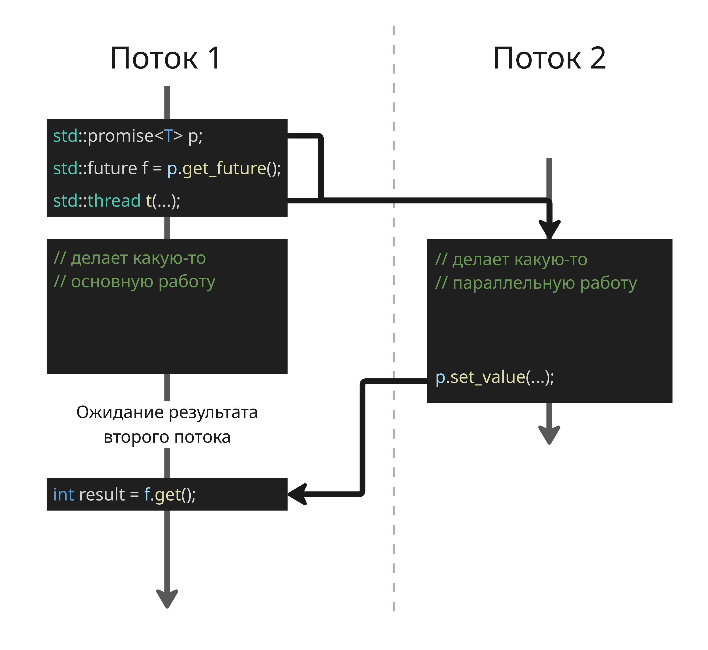

<!-- This file is generated by assets.build.markdown.superconspect_builder. All changes to it will be lost -->


# <a name="%D0%BF%D1%80%D0%BE%D0%B3%D1%80%D0%B0%D0%BC%D0%BC%D0%B8%D1%80%D0%BE%D0%B2%D0%B0%D0%BD%D0%B8%D0%B5-%D0%BD%D0%B0-c%2B%2B-%D1%81-%D1%8D%D0%BB%D0%B5%D0%BC%D0%B5%D0%BD%D1%82%D0%B0%D0%BC%D0%B8-%D0%BC%D0%BD%D0%BE%D0%B3%D0%BE%D0%BF%D0%BE%D1%82%D0%BE%D1%87%D0%BD%D0%BE%D1%81%D1%82%D0%B8"></a> Программирование на C++ с элементами многопоточности

* [Программирование на C++ с элементами многопоточности](#%D0%BF%D1%80%D0%BE%D0%B3%D1%80%D0%B0%D0%BC%D0%BC%D0%B8%D1%80%D0%BE%D0%B2%D0%B0%D0%BD%D0%B8%D0%B5-%D0%BD%D0%B0-c%2B%2B-%D1%81-%D1%8D%D0%BB%D0%B5%D0%BC%D0%B5%D0%BD%D1%82%D0%B0%D0%BC%D0%B8-%D0%BC%D0%BD%D0%BE%D0%B3%D0%BE%D0%BF%D0%BE%D1%82%D0%BE%D1%87%D0%BD%D0%BE%D1%81%D1%82%D0%B8)
  * [Лекция 1. Идиомы C++](#%D0%BB%D0%B5%D0%BA%D1%86%D0%B8%D1%8F-1.-%D0%B8%D0%B4%D0%B8%D0%BE%D0%BC%D1%8B-c%2B%2B)
    * [Идиома RAII](#%D0%B8%D0%B4%D0%B8%D0%BE%D0%BC%D0%B0-raii)
    * [Уникальный указатель `std::unique_ptr`](#%D1%83%D0%BD%D0%B8%D0%BA%D0%B0%D0%BB%D1%8C%D0%BD%D1%8B%D0%B9-%D1%83%D0%BA%D0%B0%D0%B7%D0%B0%D1%82%D0%B5%D0%BB%D1%8C-%60std%3A%3Aunique_ptr%60)
    * [Разделяемый указатель `std::shared_ptr` и слабый указатель `std::weak_ptr`](#%D1%80%D0%B0%D0%B7%D0%B4%D0%B5%D0%BB%D1%8F%D0%B5%D0%BC%D1%8B%D0%B9-%D1%83%D0%BA%D0%B0%D0%B7%D0%B0%D1%82%D0%B5%D0%BB%D1%8C-%60std%3A%3Ashared_ptr%60-%D0%B8-%D1%81%D0%BB%D0%B0%D0%B1%D1%8B%D0%B9-%D1%83%D0%BA%D0%B0%D0%B7%D0%B0%D1%82%D0%B5%D0%BB%D1%8C-%60std%3A%3Aweak_ptr%60)
    * [Функтор](#%D1%84%D1%83%D0%BD%D0%BA%D1%82%D0%BE%D1%80)
    * [Потоки](#%D0%BF%D0%BE%D1%82%D0%BE%D0%BA%D0%B8)
  * [Лекция 2. Примитивы синхронизации в C++](#%D0%BB%D0%B5%D0%BA%D1%86%D0%B8%D1%8F-2.-%D0%BF%D1%80%D0%B8%D0%BC%D0%B8%D1%82%D0%B8%D0%B2%D1%8B-%D1%81%D0%B8%D0%BD%D1%85%D1%80%D0%BE%D0%BD%D0%B8%D0%B7%D0%B0%D1%86%D0%B8%D0%B8-%D0%B2-c%2B%2B)
    * [Тип `std::atomic<T>`](#%D1%82%D0%B8%D0%BF-%60std%3A%3Aatomic%3Ct%3E%60)
    * [Тип `std::recursive_mutex`](#%D1%82%D0%B8%D0%BF-%60std%3A%3Arecursive_mutex%60)
    * [Тип `std::scoped_lock`](#%D1%82%D0%B8%D0%BF-%60std%3A%3Ascoped_lock%60)
    * [Spinlock](#spinlock)
    * [Петля событий](#%D0%BF%D0%B5%D1%82%D0%BB%D1%8F-%D1%81%D0%BE%D0%B1%D1%8B%D1%82%D0%B8%D0%B9)
    * [`std::condition_variable`](#%60std%3A%3Acondition_variable%60)

<!-- begin cppthread_2026_02_04.md -->
## <a name="%D0%BB%D0%B5%D0%BA%D1%86%D0%B8%D1%8F-1.-%D0%B8%D0%B4%D0%B8%D0%BE%D0%BC%D1%8B-c%2B%2B"></a> Лекция 1. Идиомы C++

### <a name="%D0%B8%D0%B4%D0%B8%D0%BE%D0%BC%D0%B0-raii"></a> Идиома RAII

С++ - язык с ручным управлением ресурсами, в нем нужно разработчику управлять выделением и освобождение памяти

Поэтому появилась идиома RAII (Resource Acquisition is Initialization) - "Получение ресурса есть инициализация"

Для некоторых объектов (например, для памяти, файловых дескрипторов) важно гарантировать освобождение ресурса при выходе из области видимости. Идиома утверждает, что ресурсы должны быть выделены, получены при инициализации (в конструкторе) и высвобождены в деструкторе

Принципу RAII соответствуют умные указатели `std::unique_ptr` и мьютексы `std::lock_guard`. В случае мьютексов код, не следующии RAII, выглядит так:

```cpp
{
    mutex1.lock()

    // критическая секция
    // здесь может быть return или throw

    mutex1.unlock()
}
```

Здесь нужно быть внимательным, чтобы `mutex1.unlock()` однозначно вызвался. `std::lock_guard` избавляет от этого:

```cpp
{
    std::lock_guard lck(mutex1);
    // конструктор делает mutex1.lock() 

    // критическая секция

    // деструктор делает mutex1.unlock()
}
```

Деструктор вызывается в любом случае при выходе из скоупа, поэтому мьютекс будет однозначно разблокирован

### <a name="%D1%83%D0%BD%D0%B8%D0%BA%D0%B0%D0%BB%D1%8C%D0%BD%D1%8B%D0%B9-%D1%83%D0%BA%D0%B0%D0%B7%D0%B0%D1%82%D0%B5%D0%BB%D1%8C-%60std%3A%3Aunique_ptr%60"></a> Уникальный указатель `std::unique_ptr`

Умные указатели `std::unique_ptr` и пара `std::shared_ptr`-`std::weak_ptr` также следуют идиоме RAII и используются для управления памяти

Уникальный указатель `std::unique_ptr` владеет объектом единолично. Копирование такое указателя запрещено, но разрешено перемещение

`std::unique_ptr` создается с помощью `std::make_unique`, а не через конструктор. Рассмотрим такой пример:

```cpp
Foo(new Bar(), std::unique_ptr(new Boo()));
```

Стандарт C++ не указывает, в каком порядке должны быть созданы объекты-аргументы, поэтому может случиться такая ситуация:

1. Создается `new Bar()`
2. Создается `new Boo()`, выделив память, конструктор которого вызывает исключение
3. Создается `std::unique_ptr(new Boo())`

Исключение перехватывается на уровне выше по стеку вызовов, но память, выделившаяся в конструкторе `new Bar()`, не освободиться, поэтому возникнет утечка памяти. Вместо этого лучше использовать `std::make_unique`:

```cpp
Foo(std::make_unique<Bar>(), std::make_unique<Boo>());
```

### <a name="%D1%80%D0%B0%D0%B7%D0%B4%D0%B5%D0%BB%D1%8F%D0%B5%D0%BC%D1%8B%D0%B9-%D1%83%D0%BA%D0%B0%D0%B7%D0%B0%D1%82%D0%B5%D0%BB%D1%8C-%60std%3A%3Ashared_ptr%60-%D0%B8-%D1%81%D0%BB%D0%B0%D0%B1%D1%8B%D0%B9-%D1%83%D0%BA%D0%B0%D0%B7%D0%B0%D1%82%D0%B5%D0%BB%D1%8C-%60std%3A%3Aweak_ptr%60"></a> Разделяемый указатель `std::shared_ptr` и слабый указатель `std::weak_ptr`

Разделяемый указатель `std::shared_ptr` используется, когда объект должен иметь несколько владельцев. Каждый разделяемый указатель увеличивает счетчик ссылок при создании и копировании, уменьшает при уничтожении, а когда счетчик становится равен нулю - объект уничтожается

Рекомендуется создавать `std::shared_ptr` с помощью `std::make_shared` по тем же причинам

Вместе с `std::shared_ptr` в комплекте идет тип слабого указателя. Слабый указатель `std::weak_ptr` создан для того, чтобы избавиться от кольцевых зависимостей

```cpp
struct B;

struct A {
    std::shared_ptr<B> b;
};

struct B {
    std::shared_ptr<A> a;
};
```

Если `A` и `B` ссылаются друг на друга через `std::shared_ptr`, счетчик ссылок никогда не станет нулем, и возникнет утечка памяти

Слабый указатель `weak_ptr` используется вместе с `shared_ptr`, но сам по себе ничего не хранит. Вместо этого можно вызвать метод `.lock()`, который вернет `shared_ptr`, если объект существует внутри, или `nullptr`, если он был уничтожен (то есть больше нет живых `std::shared_ptr`):

```cpp
std::shared_ptr<Foo> shptr = std::make_shared<Foo>();

// ...

std::weak_ptr<Foo> wptr = shptr;

if (auto sptr = wptr.lock()) {
    // объект еще существует
} else {
    // объект уже уничтожен
}
```

`std::shared_ptr` при создании через `std::make_shared` выделяет один непрерывный блок памяти c самим объектом, счетчиком разделяемых указателей и счетчиком слабых указателей. Это эффективнее по памяти и быстрее по времени

Если счетчик `std::shared_ptr` становится равен нулю, объект уничтожается, но управляющий блок (в котором хранятся счетчики) остается в памяти, пока существуют `std::weak_ptr`

Если подразумевается, что слабых указателей во время жизни программы будет много, то не рекомендуется использовать `std::make_shared`

Также копирование и уничтожение разделяемых указателей потокобезопасно, так как инкремент и декремент - атомарные операции

### <a name="%D1%84%D1%83%D0%BD%D0%BA%D1%82%D0%BE%D1%80"></a> Функтор

Также для создания программ на C++ полезны функторы

Функтор (functor) — это объект, который можно вызывать как функцию. Он реализует оператор `operator()`

Функторы реализуют паттерн «Команда» — объект, хранящий в себе функцию и ее состояние.

Пример:

```cpp
struct Add {
    int x;
    Add(int x) : x(x) {}

    int operator()(int y) const {
        return x + y;
    }
};

int main() {
    Add number(10);

    std::cout << number(5); // 15
}
```

### <a name="%D0%BF%D0%BE%D1%82%D0%BE%D0%BA%D0%B8"></a> Потоки

Зачастую количество выполняемых поток превышает число ядр процессора, что позволяет обрабатывать больше вычислений. Это достигается с помощью:

* Корутин

    Корутина (или сопрограмма) - программный модуль, сделанный таким образом, чтобы взаимодействовать с другими по принципу кооперативной многозадачности

    По сути корутины исполняются в пределах одного процессорного потока: корутина приостанавливает исполнения там, где она хочет, затем менеджер выбирает следующую корутину для исполнения

    Корутины бывает со стеком (stackful), если у каждой из них свой программный стек, и бесстековые (stackless), если у них общий стек с функцией, вызывающей корутины

    В стандарте C++20 корутины бесстековые, и тот вид, в которой они представлены, спорен, поэтому рекомендуется их использовать в связке с оборачивающей их библиотекой

* Hyper-Threading/Simultaneous Multithreading

    Hyper-Threading у процессоров Intel и Simultaneous Multithreading у процессоров AMD позволяет производить вычисления двух потоков на одном ядре

    Для этого в одном физическом ядре:

    * два или более наборов регистров, указателей команд и контроллеров прерываний
    * но совместные исполнительные блоки (ALU для целочисленной арифметики, FPU для работы с числами с плавающей точкой)
    * совместные блоки кеш-памяти L1, L2, L3
    * совместные блоки предсказания переходов

    С технологией Hyper-Threading есть два (или более) логических ядра, у которых один и тот же кеш и предиктор, но выполняются они разные вычисления (поэтому увеличивается число промахов в кеш)

    Константа `std::hardware_concurrency` покажет, сколько существует логических ядер процессора

* Потоки операционной системы

    В C++ потоки представлены объектом `std::thread`, который принимает любой вызываемый объект вместе с аргументами. Возвращаемое значение при этом игнорируется.

    ```cpp
    std::thread t([]{
        // код потока
    });
    ```

    Обычно этот функтор - это лямбда-функция, которая захватывает по ссылке флаг, означающий завершенность потока

    ```cpp
    std::atomic<bool> flag = true;

    std::thread t([&]{
        // работа потока
        flag = false;
    });

    while (flag) {
        // ожидание
    }

    t.join();
    ```

    В основной функции происходит ожидание этого флага

    В рамках процесса потоками, на уровне которых работает планировщик, память и другие ресурсы общие, поэтому можно производить действия над общими структурами

    ---

    Для лучшего управления потоками есть объекты `std::future` и `std::promise`. Объект `std::promise` представляет обещание передать в него значение, а `std::future` представляет будущее, из которого значение будет получено

    ```cpp
    std::promise<int> p;
    std::future<int> f = p.get_future();

    std::thread t([&]{
        p.set_value(42);
    });

    // делает какую-то параллельную работу

    int result = f.get(); // ждет результат
    t.join();
    ```

    

    Объект `std::async` еще сильнее упрощает работу: он создает поток, запускает функцию и возвращает `std::future` с результатом:

    ```cpp
    auto f = std::async([]{
        return 42;
    });

    int result = f.get();
    ```

    Для `std::async` есть политики запуска:

    ```cpp
    // обязательно создастся новый поток
    std::async(std::launch::async, func);
    // ленивый запуск, задача не начинает
    // выполнение в момент вызова, а в момент получения результата
    // и в этом же потоке
    std::async(std::launch::deferred, func);
    ```
<!-- end cppthread_2026_02_04.md -->

<!-- begin cppthread_2026_02_11.md -->
## <a name="%D0%BB%D0%B5%D0%BA%D1%86%D0%B8%D1%8F-2.-%D0%BF%D1%80%D0%B8%D0%BC%D0%B8%D1%82%D0%B8%D0%B2%D1%8B-%D1%81%D0%B8%D0%BD%D1%85%D1%80%D0%BE%D0%BD%D0%B8%D0%B7%D0%B0%D1%86%D0%B8%D0%B8-%D0%B2-c%2B%2B"></a> Лекция 2. Примитивы синхронизации в C++

В качестве объектов для синхронизации потоков используются классы:

- `std::mutex` - базовая реализация мьютекса. Обеспечивает взаимное исключение: только один поток может владеть мьютексом в каждый момент времени
- `std::lock_guard` - обёртка для мьютекса, реализующая принцип RAII. При создании объекта мьютекс захватывается, при уничтожении (выходе из области видимости) - освобождается автоматически

```cpp
std::mutex m;
int shared_counter = 0;

void increment() {
    std::lock_guard<std::mutex> lock(m); // lock() вызывается здесь
    ++shared_counter;
} // unlock() вызывается автоматически при разрушении lock
```

Семафоры и другие низкоуровневые примитивы, как правило, не используются в обычном прикладном коде - они появляются преимущественно в системном программировании или при реализации собственных примитивов синхронизации

---

Также существуют модификация мьютекса -- разделенный мьютекс. Разделенный мьютекс (или RW-mutex) `std::shared_mutex` работает аналогично обычному мьютексу, но допускает несколько одновременных блокировок для чтения и только одну для записи. Это полезно, когда операции чтения значительно преобладают над записью:

| Операция | Обёртка | Метод мьютекса |
|---|---|---|
| Запись (единичный доступ) | `std::unique_lock` | `lock()` |
| Чтение (совместный доступ) | `std::shared_lock` | `lock_shared()` |

Пример:

```cpp
std::shared_mutex rw_mutex;
std::map<int, std::string> data;

// Читать могут несколько потоков одновременно
std::string read(int key) {
    std::shared_lock lock(rw_mutex);
    return data.at(key);
}

// Писать может только один поток
void write(int key, std::string value) {
    std::unique_lock lock(rw_mutex);
    data[key] = std::move(value);
}
```

### <a name="%D1%82%D0%B8%D0%BF-%60std%3A%3Aatomic%3Ct%3E%60"></a> Тип `std::atomic<T>`

Рассмотрим простой счётчик, к которому обращаются два потока:

```cpp
int counter = 0;

void increment() {
    ++counter; // НЕ атомарная операция!
}
```

На уровне машинных инструкций `++counter` — это три отдельных шага:

```asm
lw      a5,-20(s0)    # прочитать значение counter из памяти в регистр
addi    a5,a5,1       # прибавить 1 к регистру  
sw      a5,-20(s0)    # записать результат обратно в память
```

Если два потока выполняют эти шаги одновременно, возникает гонка обновлений:

1. Поток A: `lw      a5,-20(s0)` - читает 0
2. Поток B: `lw      a5,-20(s0)` - читает 0
3. Поток A: `addi    a5,a5,1`, `sw      a5,-20(s0)` - пишет 1
4. Поток B: `addi    a5,a5,1`, `sw      a5,-20(s0)` - пишет 1, но должен быть 2

Тип `std::atomic<T>` позволяет выполнять такие операции над переменной атомарно без явного использования мьютекса:

```cpp
std::atomic<int> counter{0};

// Безопасно из нескольких потоков без мьютекса
void increment() {
    counter.fetch_add(1); // или просто ++counter
}
```

`std::atomic<T>` гарантирует, что все операции над переменной выполняются неделимо, без возможности вмешательства другого потока. Под капотом процессор использует специальные инструкции (например, `LOCK XADD`, `CMPXCHG` на x86-архитектуре) или шины памяти, которые делают операцию неделимой на аппаратном уровне - без блокировок и переключения контекста

Основные методы:

* Чтение и запись

    ```cpp
    std::atomic<int> x{0};

    x.store(42);                 // записать значение
    int val = x.load();          // прочитать значение
    int val2 = x;                // неявный вызов load()
    x = 42;                      // неявный вызов store()
    ```

    > `store` и `load` предпочтительнее неявных операторов — они явно сигнализируют, что работа идёт с атомарной переменной.

* Обмен

    ```cpp
    std::atomic<int> x{10};

    int old = x.exchange(99); // атомарно: записать 99, вернуть старое значение (10)
    ```

    Полезно, например, для атомарного сброса флага:

    ```cpp
    std::atomic<bool> flag{true};
    if (flag.exchange(false)) {
        // Только один поток войдёт сюда, даже при гонке
    }
    ```

* Сравнение и замена (Compare-and-swap, CAS) - ключевой механизм для алгоритмов без замков

    ```cpp
    bool compare_exchange_strong(T& expected, T desired);
    bool compare_exchange_weak(T& expected, T desired);
    ```

    Атомарно выполняется следующее:

    ```cpp
    if (x == expected) {
        x = desired;
        return true;
    } else {
        expected = x;  // обновляет expected текущим значением
        return false;
    }
    ```

    Разница между сильным и слабым сравнениями:
    * `compare_exchange_strong` - гарантирует успех, если `x == expected`
    * `compare_exchange_weak` - может ложно вернуть `false`, зато быстрее на некоторых архитектурах (RISC, ARM), используется в цикле

* Арифметические операции (только для целых чисел и указателей)

    ```cpp
    std::atomic<int> x{10};

    x.fetch_add(5);   // x = 15, возвращает старое значение (10)
    x.fetch_sub(3);   // x = 12, возвращает старое значение (15)
    x.fetch_and(0xF); // побитовое AND
    x.fetch_or(0x1);  // побитовое OR
    x.fetch_xor(0x3); // побитовое XOR

    // Операторы-сокращения (не возвращают старое значение):
    ++x; x++; --x; x--;
    x += 5; x -= 3;
    ```

---

Каждый метод `atomic` принимает опциональный параметр `std::memory_order`, который управляет тем, как компилятор и процессор могут переупорядочивать инструкции вокруг атомарной операции, например, ```x.store(1, std::memory_order_relaxed);```

| Memory Order | Смысл |
|---|---|
| `relaxed` | Никаких гарантий порядка - только атомарность самой операции, поэтому максимальная производительность |
| `acquire` | Все последующие операции с памятью в этом потоке выполнятся после этой загрузки, используется при `load` |
| `release` | Все предшествующие операции с памятью в этом потоке выполнятся до этой записи, используется при `store` |
| `acq_rel` | Комбинация `acquire` и `release`, используется для `exchange`, `fetch_add` |
| `seq_cst` | Полная последовательная согласованность. Самый безопасный, поэтому значение по умолчанию, но самый медленный |

**Типичный паттерн acquire/release** — передача данных между потоками без мьютекса:

```cpp
std::atomic<bool> ready{false};
int data = 0;

// Поток A (производитель)
void producer() {
    data = 42;                               // (1) запись данных
    ready.store(true, std::memory_order_release); // (2) публикуем флаг
    // release гарантирует, что (1) виден до (2)
}

// Поток B (потребитель)
void consumer() {
    while (!ready.load(std::memory_order_acquire)); // (3) ждём флага
    // acquire гарантирует, что после (3) мы видим (1)
    assert(data == 42); // всегда верно
}
```

Без `acquire` и `release` компилятор или процессор мог бы переставить инструкции так, что `data` читался бы до того, как производитель его записал

Если нет уверенности, какой порядок использовать, то лучше оставить значение по умолчанию `seq_cst`, так как оптимизировать такое стоит только тогда, когда есть реальная проблема производительности

### <a name="%D1%82%D0%B8%D0%BF-%60std%3A%3Arecursive_mutex%60"></a> Тип `std::recursive_mutex`

Обычный `std::mutex` вызовет взаимную блокировку, если один и тот же поток попытается заблокировать его дважды. `std::recursive_mutex` решает эту проблему - он позволяет одному потоку захватывать мьютекс несколько раз подряд (и должен освободить его столько же раз)

Типичный случай - это методы класса, которые вызывают друг друга, при этом каждый берёт блокировку:

```cpp
class SafeCollection {
    std::recursive_mutex m;
    std::vector<int> data;

public:
    void add(int x) {
        std::lock_guard lock(m);
        data.push_back(x);
    }

    void add_twice(int x) {
        std::lock_guard lock(m); // первый захват
        add(x);                  // второй захват того же мьютекса
        add(x);
    }
};
```

С обычным `std::mutex` вызов `add()` внутри `add_twice()` привёл бы к взаимной блокировке, так как поток попытался бы заблокировать уже захваченный им мьютекс

### <a name="%D1%82%D0%B8%D0%BF-%60std%3A%3Ascoped_lock%60"></a> Тип `std::scoped_lock`

`std::scoped_lock` - аналог `std::lock_guard`, но позволяет захватить несколько мьютексов одновременно, избегая взаимной блокировки:

```cpp
std::mutex m1, m2;

void transfer(Account& from, Account& to, int amount) {
    // Захватываем оба мьютекса атомарно
    std::scoped_lock lock(m1, m2);
    from.balance -= amount;
    to.balance   += amount;
}
```

Если бы два потока захватывали `m1` и `m2` в разном порядке по отдельности - была бы классическая взаимная блокировка, а тип `scoped_lock` этого не допускает

### <a name="spinlock"></a> Spinlock

Spinlock - это мьютекс, который при ожидании не усыпляет поток, а крутится в цикле. Он быстрее обычного мьютекса при очень коротких критических секциях, но сжигает процессорное время впустую при долгом ожидании

```cpp
#include <atomic>

class Spinlock {
    std::atomic_flag flag = ATOMIC_FLAG_INIT;
public:
    void lock()   { while (flag.test_and_set(std::memory_order_acquire)); }
    void unlock() { flag.clear(std::memory_order_release); }
};
```

### <a name="%D0%BF%D0%B5%D1%82%D0%BB%D1%8F-%D1%81%D0%BE%D0%B1%D1%8B%D1%82%D0%B8%D0%B9"></a> Петля событий

Поток, как правило, - тоже ресурс, выделяемый операционной системой. Его создание и освобождение занимают время, поэтому стараются переиспользовать потоки. Из-за этого есть один поток, который принимает задачи в очереди

Создаём поток; если есть разделяемый ресурс (очередь задач) — создаём мьютекс для доступа к нему. Вот как выглядит типичный event loop:

```cpp
std::queue<std::function<void()>> tasks;
std::mutex m;

Task t;
while (true) {
    {
        std::lock_guard l(m);
        if (!tasks.empty()) {
            t = std::move(tasks.front());
            tasks.pop();
        }
    } // мьютекс освобождается здесь

    if (t) {
        t();
        t = nullptr;
    }

    std::this_thread::sleep_for(std::chrono::nanoseconds(100));
}
```

Без паузы поток будет непрерывно захватывать и освобождать мьютекс в цикле, не давая другим потокам возможности в него войти, создавая процессорное голодание. Пауза в 100 нс — это компромисс: поток уступает процессор, но очень ненадолго.

### <a name="%60std%3A%3Acondition_variable%60"></a> `std::condition_variable`

`std::condition_variable` позволяет потоку заснуть до наступления условия и быть разбуженным другим потоком

```cpp
std::mutex m;
std::queue<std::function<void()>> tasks;
std::condition_variable cv;
bool done = false;

// Поток-потребитель
void worker() {
    while (true) {
        std::unique_lock lock(m); // condition_variable требует unique_lock

        // Засыпаем, пока очередь пуста (и не завершаем работу)
        cv.wait(lock, [] { return !tasks.empty() || done; });

        if (done && tasks.empty()) break;

        auto task = std::move(tasks.front());
        tasks.pop();
        lock.unlock(); // освобождаем мьютекс перед выполнением задачи

        task();
    }
}

// Поток-производитель
void enqueue(std::function<void()> task) {
    {
        std::lock_guard lock(m);
        tasks.push(std::move(task));
    }
    cv.notify_one(); // будим одного спящего потребителя
}
```

Ключевые методы:

| Метод | Описание |
|---|---|
| `cv.wait(lock, predicate)` | Засыпает, пока предикат не вернёт `true`. Атомарно освобождает мьютекс при засыпании и снова захватывает при пробуждении. |
| `cv.notify_one()` | Будит один ожидающий поток. |
| `cv.notify_all()` | Будит все ожидающие потоки. |

`condition_variable::wait` должен временно освободить мьютекс, пока поток спит - `lock_guard` этого не умеет, а `unique_lock` поддерживает ручное `lock()` и `unlock()`

Также важно заметить, что поток может проснуться без вызова `notify`. Именно поэтому `wait` принимает предикат - без него нужно писать цикл `while (!predicate()) cv.wait(lock);` вручную
<!-- end cppthread_2026_02_11.md -->

