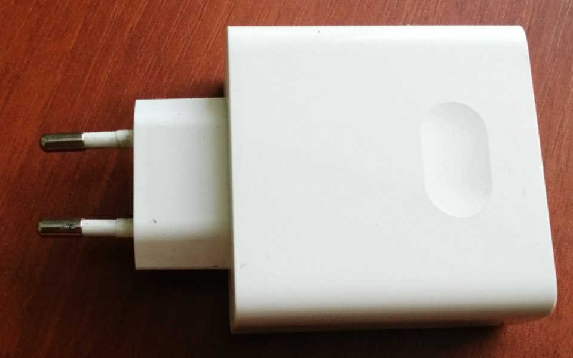
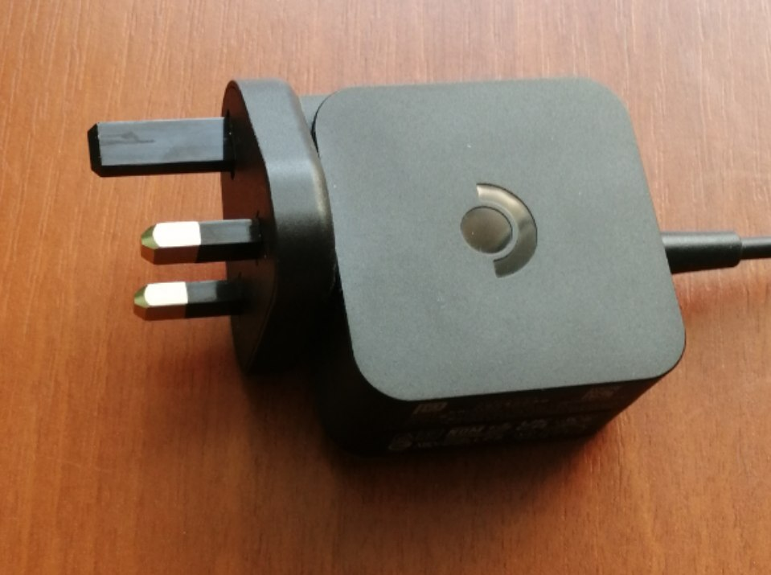

## Лекция 7. Структурные паттерны

<!-- Лектор - Круглов Г. Н. -->

На этой лекции разберем структурные паттерны, которые помогают в проектировании проектной модели

### Adapter

Адаптер позволяет использовать несовместимые вещи совместно. Для начала определимся с терминами:

Target (Цель) - целевой интерфейс, через который мы хотим взаимодействовать с объектом, изначально его не реализующий (европейская вилка )

Adaptee (Адаптируемый) - адаптируемый тип (британская вилка )

Adapter (Адаптер) - обёртка, реализующая целевой интерфейс, содержащая объект адаптируемого типа и перенаправляющая в него вызовы поведений целевого интерфейса (сам адаптер, кусок белого пластика, короче )

И с помощью этого мы хотим достичь полиморфизма между несовместимыми объектами. Пример: есть два типа логгеров, которые имеют разный интерфейс, и хотим к ним обращаться, как к одному:

```csharp
public class PostgresLogStorage
{
    public void Save(
        string message,
        DateTime timeStamp,
        int severity)
    {
        ...
    }
}
public class ElasticSearchLogStorage
{
    public void Save(ElasticLogMessage message)
    {
        ...
    }
}
public interface ILogStorage
{
    void Save(LogMessage message);
}

public class PostgresLogStorageAdapter : ILogStorage
{
    private readonly PostgresLogStorage _storage;
    public void Save(LogMessage message)
    {
        _storage.Save(
            message.Message,
            message.DateTime,
            message.Severity.AsInteger());
    }
}
public class ElasticLogStorageAdapter : ILogStorage
{
    private readonly ElasticSearchLogStorage _storage;
    public void Save(LogMessage message)
    {
        _storage.Save(message.AsElasticLogMessage());
    }
}
```

И вся прелесть адаптеров раскрывается в том случае, если эти логгеры из _разных_ библиотек — естественно, мы не можем менять их исходный код и подгонять интерфейсы друг под друга

Помимо этого адаптеры это:

* соблюдение [OCP](https://pelmesh619.github.io/itmo_conspects/oopcsharp/oopcsharp_superconspect.html#open%2Fclosed-principle) и [DIP](https://pelmesh619.github.io/itmo_conspects/oopcsharp/oopcsharp_superconspect.html#dependency-inversion-principle)
* изоляция объектной модели (то, чего мы достигаем при помощи абстракций)

А также с помощью адаптеров можно проводить адаптивный рефакторинг. Допустим такую ситуацию: все долгие годы мы юзали в проекте старый логгер, теперь пишем все асинхронно и нам нужен асинхронный логгер. Тогда сделаем все в 2 шага:

1. Меняем абстракцию - создаем крутой адаптер, интерфейс которого поддерживает и старую, и новую реализации, и используем этот адаптер в нашем коде
 
2. Меняем реализацию - засовываем в этот адаптер асинхронный логгер

Таким образом, мы получаем два этапа, которые легче тестировать по отдельности

> Adapter (Адаптер) - промежуточный тип, использующий объект одного типа, для реализации интерфейса другого типа

### Bridge

Допустим, что у нас есть абстракции сложное (низкоуровневые) и простые (верхнеуровневые). Тогда, чтобы через простую абстракцию использовать сложную создадим мост

> Bridge (Мост) - разделение объектной модели на абстракции разных уровней реализации абстракций более высокого уровня, использующие абстракции более низкого уровня и являются “мостом”

Пусть у нас будет сложное устройство "Телевизор":

```csharp
public interface IDevice
{
    public bool IsEnabled { get; set; }
    public int Channel { get; set; }
    public int Volume { get; set; }
}
```

простое устройство "Пультик":

```csharp
public interface IControl
{
    void ToggleEnabled();
    void ChannelForward();
    void ChannelBackward();
    void VolumeUp();
    void VolumeDown();
}
```

И мост:

```csharp
public class Control : IControl
{
    private readonly IDevice _device;
    public void ToggleEnabled()
        => _device.IsEnabled = !_device.IsEnabled;
    public void ChannelForward()
        => _device.Channel += 1;
    public void ChannelBackward()
        => _device.Channel -= 1;
    public void VolumeUp()
        => _device.Volume += 10;
    public void VolumeDown()
        => _device.Volume -= 10;
}
```

При помощи мосты мы можем разделить объектную модель на две иерархии - иерархию пультов и телевизоров

Можем заметить, что по сути мост - это адаптер, поэтому мост тоже соблюдает OCP и DIP. Отличие моста от адаптера в том, что мост проектируется изначально

### Composite

> Компоновщик - представление древовидной структуры объектов в виде одного композитного объекта

Допустим, что у нас есть куча объектов, реализующих один интерфейс, и мы хотим сделать со всеми ними какое-то действие:

```csharp
public interface IGraphicComponent
{
    void MoveBy(int x, int y);
    void Draw();
}
public class Circle : IGraphicComponent
{
    public void MoveBy(int x, int y) { ... }
    public void Draw() { ... }
}
public class Line : IGraphicComponent
{
    public void MoveBy(int x, int y) { ... }
    public void Draw() { ... }
}
```

Сделаем из них объект-композицию, который циклом проходится и выполняет это действие у всех объектов:

```csharp
public class GraphicComponentGroup : IGraphicComponent
{
    private readonly IReadOnlyCollection<IGraphicComponent> _components;
    public void MoveBy(int x, int y)
    {
        foreach (var component in _components)
            component.MoveBy(x, y);
    }
    public void Draw()
    {
        foreach (var component in _components)
            component.Draw();
    }
}
```

### Decorator

> Декоратор - тип-обёртка над объектом абстракции, которую он реализует, добавляя к поведению объекта новую логику

Допустим у нас есть абстракция какого-то абстрактного сервиса:

```csharp
public interface IService
{
    void DoStuff(DoStuffArgs args);
}
public class Service : IService
{
    public void DoStuff(DoStuffArgs args) { }
}
```

Ну и возникла потребность логгировать все, что делает сервис. Тогда для нашего decoratee, декорируемого объекта, сделаем декоратор, реализующий наш интерфейс и расширяющий функционал:


```csharp
public class LoggingServiceDecorator : IService
{
    private readonly IService _decoratee;
    private readonly ILogger _logger;
    public void DoStuff(DoStuffArgs args)
    {
        _logger.Log(ArgsToLogMessage(args));
        _decoratee.DoStuff(args);
    }
    private static string ArgsToLogMessage(DoStuffArgs args) { ... }
}
```


### Proxy

> Proxy (Заместитель) - тип-обёртка, реализующий логику контроля доступа к объекту, реализующему абстракцию,которую реализует он сам

Возьмем наш старый добрый сервис:

```csharp
public interface IService
{
    void DoOperation(OperationArgs args);
}
public class Service : IService
{
    public void DoOperation(OperationArgs args) { }
}
```

Рассмотрим несколько видов прокси:

* Виртуальный прокси (Virtual proxy):

    Если у нас есть какой-то прям тяжелый объект, который мы хотим инициализировать тогда, когда он нам прям нужен, то нам поможет виртуальный прокси:

    ```csharp
    public class VirtualServiceProxy : IService
    {
        private readonly Lazy<IService> _service = 
            new Lazy<IService>(() => new Service());
        public void DoOperation(OperationArgs args)
        {
            _service.Value.DoOperation(args);
        }
    }
    ```

* Защищающий прокси (Defensive proxy):

    Юзаем, если хотим ограничить доступ к объекту:

    ```csharp
    public class ServiceAuthorizationProxy : IService
    {
        private readonly IService _service;
        private readonly IUserInfoProvider _userInfoProvider;
        public void DoOperation(OperationArgs args)
        {
            if (_userInfoProvider.GetUserInfo().IsAuthenticated)
                _service.DoOperation(args);
        }
    }
    ```

* Кеширующий прокси (Caching proxy):

    Юзаем, если операция дорогая, и мы не хотим каждый раз заново вызывать ее

    ```csharp
    public class CachingServiceProxy : IService
    {
        private readonly IService _service;
        private readonly Dictionary<OperationArgs, OperationResult> _cache;
        public OperationResult DoOperation(OperationArgs args)
        {
            if (_cache.TryGetValue(args, out var result))
                return result;

            return _cache[args] = _service.DoOperation(args);
        }
    }
    ```

* Удаленный прокси (Remote proxy):

    Юзаем, если хотит работать с интерфейсом, который не лежит в программе (например, класс, оборачиющий http-вызовы)

Как можно заметить, прокси очень подозрительно похож на декоратор, НО:

* Декоратор обязан вызывать метод декорируемого типа, тогда как прокси может этого не делать (оборачиваемый объект может и не существовать)
* Декоратор расширяет логику, прокси контролирует объект
* Прокси - это агрегация/ассоциация, тогда как декоратор - это агрегация

<!-- тяп ляп зеленая галочка -->

### Facade

> Facade (Фасад) - оркестрация одной или набора сложных операция в каком-либо типе

Фасад рассматривался как контроллер в GRASP. Фасад 

* риск сделать класс-бог, который очень много в себя берет
* потеря абстракций засчёт переиспользования логики внутри фасада
* тяжесть рефакторинга и декомпозиции

Но фасад может быть полезен в request-response модели, например, как объектная обертка API вызовов


### Flyweight

> Flyweight (Легковес) - декомпозиция объектов, выделенные тяжелых и повторяющихся данных в отдельные модели для дальнейшего переиспользования

При помощи легковеса мы можем отделить тяжелый объект, чтобы каждый раз пользоваться им по ссылке и не создавать новый

```csharp
public record Particle(int X, int Y, byte[] Model);

public class ParticleFactory
{
    private readonly IAssetLoader _assetLoader;
    public Particle Create(string modelName)
    {
        var model = _assetLoader.Load(modelName);
        return new Particle(0, 0, model);
    }
}

public record ModelData(byte[] Value);

public record Particle(int X, int Y, ModelData Model);

public class ParticleFactory
{
    private readonly IAssetLoader _assetLoader;
    private readonly Dictionary<string, ModelData> _cache;
    public Particle Create(string modelName)
    {
        var model = _cache.TryGetValue(modelName, out var data)
            ? data
            : _cache[modelName] = 
                new ModelData(_assetLoader.Load(modelName));
        return new Particle(0, 0, model);
    }
}
```


