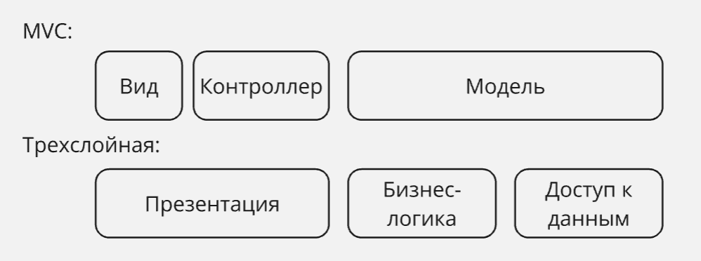
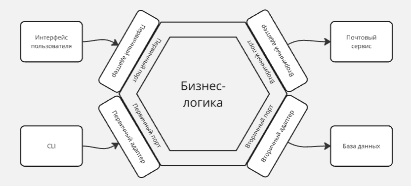

## Лекция 10. Многослойная архитектура

<!-- Лектор - Макаревич Р. Д. -->

> Архитектура приложения - способ структурирования программных компонентов приложения для управления сложностью

Задача состоит с том, чтобы качественно сделать декомпозицию компонентов, уменьшить их переиспользование, были низкое зацепление и высокая связность, а также существовала возможность расширять систему, добавляя реализации с минимальным эффектом на существующие решения

В итоге мы хотим разделить модули на роли: обрабатывающие данные согласно бизнес-логике, реализующие представление и посредник между ними

### MVX

**Model** содержит бизнес-логику, требует изменений, когда изменяются юзкейсы и бизнес-правила системы

**View** реализует представление системы (например: GUI, API), требует изменений, когда изменяется способ представления

**Controller** является посредником данных между Model и View, требует изменений, когда изменяется механизм взаимодействия Model и View

Вместо Controller может быть Presenter или другая угодная буква

Архитектура MVX поддерживает SRP и высокую связность, но также имеет высокое зацепление: чтобы изменить, например, модуль представления, нужно изменить контроллер

### Трехслойная архитектура

Трехслойная архитектура делится на три слоя:

**Presentation** ответственен за реализацию представления системы, за передачу запросов к системе в слой бизнес-логики

**Business logic** ответственен за реализацию бизнес-логики, для хранений данных использует слой доступа к данным

**Data access** ответственен за реализацию персистентности данных

В трехслойной архитектуре разделяют 2 типа моделей данных

В анимичной модели данных типы либо только хранят данные, либо только содержат логику

Богатая модель данных описывает полноценные объекты, логика находится в типах, описывающих домен

### Гексагональная архитектура

В гексагональной архитектуре у компонента бизнес-логики есть порты:

Первичный порт (Input port, также Primary, Driving) - принимает данные

Вторичный порт (Output port, также Secondary, Driven) - отправляют и хранят данные компонентам, которые ждут отклик от приложения, суммарно их можно разделить на получателей и репозитории

Гексагональная архитектура позволяет сделать бизнес-логику независимой от вспомогательных реализаций

Важно: не имеет ничего общего с шестиугольниками

### Луковая архитектура

Луковая (также "чистая", "clean") архитектура основывается на гексагональной, но в отличии от нее компонент с бизнес-логикой разделяется на части Domain Services и Domain Model

Доменные модели - определения бизнес-правил

Доменные сервисы - определения юзкейсов

Архитектура выделяет слой приложения - связующее звено между инфраструктурными абстракциями и доменом

