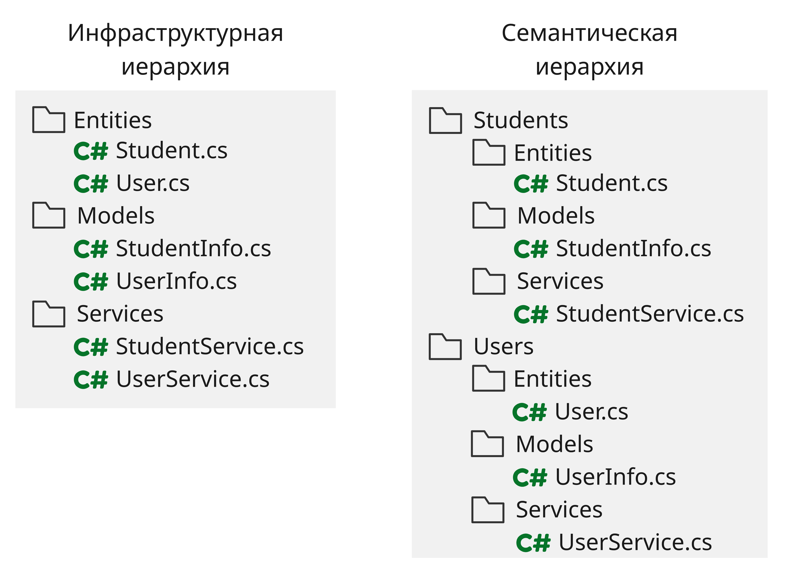

# <a name="%D0%BE%D0%B1%D1%8A%D0%B5%D0%BA%D1%82%D0%BD%D0%BE-%D0%BE%D1%80%D0%B8%D0%B5%D0%BD%D1%82%D0%B8%D1%80%D0%BE%D0%B2%D0%B0%D0%BD%D0%BD%D0%BE%D0%B5-%D0%BF%D1%80%D0%BE%D0%B3%D1%80%D0%B0%D0%BC%D0%BC%D0%B8%D1%80%D0%BE%D0%B2%D0%B0%D0%BD%D0%B8%D0%B5"></a> Объектно-ориентированное программирование


* [Объектно-ориентированное программирование](#%D0%BE%D0%B1%D1%8A%D0%B5%D0%BA%D1%82%D0%BD%D0%BE-%D0%BE%D1%80%D0%B8%D0%B5%D0%BD%D1%82%D0%B8%D1%80%D0%BE%D0%B2%D0%B0%D0%BD%D0%BD%D0%BE%D0%B5-%D0%BF%D1%80%D0%BE%D0%B3%D1%80%D0%B0%D0%BC%D0%BC%D0%B8%D1%80%D0%BE%D0%B2%D0%B0%D0%BD%D0%B8%D0%B5)
  * [Лекция 1. Основы ООП](#%D0%BB%D0%B5%D0%BA%D1%86%D0%B8%D1%8F-1.-%D0%BE%D1%81%D0%BD%D0%BE%D0%B2%D1%8B-%D0%BE%D0%BE%D0%BF)
    * [Концепции ООП](#%D0%BA%D0%BE%D0%BD%D1%86%D0%B5%D0%BF%D1%86%D0%B8%D0%B8-%D0%BE%D0%BE%D0%BF)
    * [Выводы](#%D0%B2%D1%8B%D0%B2%D0%BE%D0%B4%D1%8B)
  * [Лекция 2. Проектирование модели](#%D0%BB%D0%B5%D0%BA%D1%86%D0%B8%D1%8F-2.-%D0%BF%D1%80%D0%BE%D0%B5%D0%BA%D1%82%D0%B8%D1%80%D0%BE%D0%B2%D0%B0%D0%BD%D0%B8%D0%B5-%D0%BC%D0%BE%D0%B4%D0%B5%D0%BB%D0%B8)
    * [Иммутабельность](#%D0%B8%D0%BC%D0%BC%D1%83%D1%82%D0%B0%D0%B1%D0%B5%D0%BB%D1%8C%D0%BD%D0%BE%D1%81%D1%82%D1%8C)
    * [Find/Get](#find%2Fget)
    * [Обработка ошибок](#%D0%BE%D0%B1%D1%80%D0%B0%D0%B1%D0%BE%D1%82%D0%BA%D0%B0-%D0%BE%D1%88%D0%B8%D0%B1%D0%BE%D0%BA)
    * [Domain Driven Design](#domain-driven-design)
      * [Value Object](#value-object)
      * [Файловая структура](#%D1%84%D0%B0%D0%B9%D0%BB%D0%BE%D0%B2%D0%B0%D1%8F-%D1%81%D1%82%D1%80%D1%83%D0%BA%D1%82%D1%83%D1%80%D0%B0)
  * [Лекция 3. Принципы SOLID](#%D0%BB%D0%B5%D0%BA%D1%86%D0%B8%D1%8F-3.-%D0%BF%D1%80%D0%B8%D0%BD%D1%86%D0%B8%D0%BF%D1%8B-solid)
    * [Single responsibility principle](#single-responsibility-principle)
    * [Open/closed principle](#open%2Fclosed-principle)
    * [Liskov substitution principle](#liskov-substitution-principle)
    * [Interface segregation principle](#interface-segregation-principle)
    * [Dependency inversion principle](#dependency-inversion-principle)
  * [Лекция 4. GRASP](#%D0%BB%D0%B5%D0%BA%D1%86%D0%B8%D1%8F-4.-grasp)
    * [Informational expert - Информационный эксперт](#informational-expert---%D0%B8%D0%BD%D1%84%D0%BE%D1%80%D0%BC%D0%B0%D1%86%D0%B8%D0%BE%D0%BD%D0%BD%D1%8B%D0%B9-%D1%8D%D0%BA%D1%81%D0%BF%D0%B5%D1%80%D1%82)
    * [Creator - Создатель](#creator---%D1%81%D0%BE%D0%B7%D0%B4%D0%B0%D1%82%D0%B5%D0%BB%D1%8C)
    * [Controller - Контроллер](#controller---%D0%BA%D0%BE%D0%BD%D1%82%D1%80%D0%BE%D0%BB%D0%BB%D0%B5%D1%80)
    * [Low coupling - Слабое зацепление](#low-coupling---%D1%81%D0%BB%D0%B0%D0%B1%D0%BE%D0%B5-%D0%B7%D0%B0%D1%86%D0%B5%D0%BF%D0%BB%D0%B5%D0%BD%D0%B8%D0%B5)
    * [High cohesion - Сильная связность](#high-cohesion---%D1%81%D0%B8%D0%BB%D1%8C%D0%BD%D0%B0%D1%8F-%D1%81%D0%B2%D1%8F%D0%B7%D0%BD%D0%BE%D1%81%D1%82%D1%8C)
    * [Indirection - Перенаправление](#indirection---%D0%BF%D0%B5%D1%80%D0%B5%D0%BD%D0%B0%D0%BF%D1%80%D0%B0%D0%B2%D0%BB%D0%B5%D0%BD%D0%B8%D0%B5)
    * [Polymorphism - Полиморфизм](#polymorphism---%D0%BF%D0%BE%D0%BB%D0%B8%D0%BC%D0%BE%D1%80%D1%84%D0%B8%D0%B7%D0%BC)
    * [Protected variations - Устойчивость к изменениям](#protected-variations---%D1%83%D1%81%D1%82%D0%BE%D0%B9%D1%87%D0%B8%D0%B2%D0%BE%D1%81%D1%82%D1%8C-%D0%BA-%D0%B8%D0%B7%D0%BC%D0%B5%D0%BD%D0%B5%D0%BD%D0%B8%D1%8F%D0%BC)
    * [Pure fabrication - Чистая выдумка](#pure-fabrication---%D1%87%D0%B8%D1%81%D1%82%D0%B0%D1%8F-%D0%B2%D1%8B%D0%B4%D1%83%D0%BC%D0%BA%D0%B0)


Все презентации к лекциям можно найти по ссылке [github.com/is-oop-y27](https://github.com/is-oop-y27)

## <a name="%D0%BB%D0%B5%D0%BA%D1%86%D0%B8%D1%8F-1.-%D0%BE%D1%81%D0%BD%D0%BE%D0%B2%D1%8B-%D0%BE%D0%BE%D0%BF"></a> Лекция 1. Основы ООП

В самом начале развития Computer Science код выглядел как-то так:

```asm
VAR i
SET i 1
PRINT i
INC i
JIFLS i 10 2
```

Это было очень неудобно, поэтому придумали **структурное программирование**:

```cs
for (var i = 1; i < 10; i++) 
{
    Console.WriteLine(i);
}
```

Но при увеличении кода стало неудобно и это, поэтому придумали функции и **процедурное программирование** - разбиение кода на маленькие независимые участки. Но вскоре появилась надобность разделять бизнес-логику, данные и сохранять инвариант данных

> Инвариант данных - набор корректных состояний данных, определяемый набором бизнес-требований к этим данным

Поэтому появилась парадигма **объектно-ориентированное программирование**

### <a name="%D0%BA%D0%BE%D0%BD%D1%86%D0%B5%D0%BF%D1%86%D0%B8%D0%B8-%D0%BE%D0%BE%D0%BF"></a> Концепции ООП

* **Инкапсуляция** - объединение данных и их поведения
* **Сокрытие** - управление доступа к полям класса, тем самым сохранение инварианта
* **Композиция** - объединение различного поведения в один объект

Агрегация - объект получает уже созданные данные
Ассоциация - объект сам управляет циклом жизни своих данных (выделяет и освобождает память для них)

* **Полиморфизм**

Концепция полиморфизма заключается в более абстрактном понимании объектов 

> Полиморфизм подтипов - отделение абстракции от реализации, позволяющее пользователю прозрачно использовать различные реализации поведений

Примером абстракции может быть объект для доступа к базе данных - мы можем создать классы для доступа к базам данным SQL и NoSQL, которые имеют одни и те же публичные методы с одинаковыми аргументами - и тогда мы приходим к понятию интерфейса, который описывает методы у классов

> Реализация (наследование поведений): в C# реализовывать интерфейсы могут как классы, так и структуры. Говорят, что тип реализует интерфейс (класс `Point` реализует интерфейс `IPoint`)

> Наследование реализаций: используются классы, в C# одна структура не может быть унаследована от другой, либо от класса. Говорят, что класс является наследником другого класса, либо же его подклассом (класс `Cat` является наследником класса `Animal`)

При этом наследники могут переопределять методы класса/интерфейса и определять новые

> Объект - набор атрибутов и поведений, реализаций и данные которого сокрыты от конечного пользователя объекта. Также абстракция, представляющая какой-то объект моделируемой предметной области

### <a name="%D0%B2%D1%8B%D0%B2%D0%BE%D0%B4%D1%8B"></a> Выводы

* Парадигма ООП представляет собой концепцию объединения данных и логики, их обрабатывающей
* Сокрытие принуждает пользователей использовать поведения, соответствующие бизнес-правилам
* Локализация изменений данных позволяет упростить поддержание их инварианта


## <a name="%D0%BB%D0%B5%D0%BA%D1%86%D0%B8%D1%8F-2.-%D0%BF%D1%80%D0%BE%D0%B5%D0%BA%D1%82%D0%B8%D1%80%D0%BE%D0%B2%D0%B0%D0%BD%D0%B8%D0%B5-%D0%BC%D0%BE%D0%B4%D0%B5%D0%BB%D0%B8"></a> Лекция 2. Проектирование модели

### <a name="%D0%B8%D0%BC%D0%BC%D1%83%D1%82%D0%B0%D0%B1%D0%B5%D0%BB%D1%8C%D0%BD%D0%BE%D1%81%D1%82%D1%8C"></a> Иммутабельность

> Иммутабельность (immutable) - свойство данных, не подразумевающее изменения в ООП, которое используется в виде сокрытия мутабельных данных, значения которых не требуют изменений

Мутабельность данных усложняет систему, повышая количество допускаемых состояний, из-за чего система становится менее предсказуемой

Пример - группа студентов. У группы студентов может быть идентификатор, имя и список студентов, и очевидно, что идентификатор и имя у группы в дальнейшем никак не изменится. Если не применять к данным иммутабельность, то получим:

```csharp
public class StudentGroup 
{ 
    public long Id { get; set; } 
    
    public string Name { get; set; } 
    
    public List<long> StudentIds { get; set; } 
    
    public void AddStudent(long studentId)     
    { 
        if (StudentIds.Contains(studentId) is false) 
            StudentIds.Add(studentId);     
    } 
}
```

Но мы можем сделать эти поля только для чтения при помощи модификатора `readonly`:

```csharp
public class StudentGroup { 
    private readonly HashSet<long> _studentsIds; // ну еще лист на хешсетик поменяли 
    
    public StudentGroup(long id, string name)     
    { 
        Id = id; 
        Name = name; 
        _studentsIds = new HashSet<long>();     
    } 
    
    public long Id { get; } 
    
    public string Name { get; set; } 
    
    public IReadOnlyCollection<long> StudentIds => _studentsIds; 
    
    public void AddStudent(long studentId)     
    { 
        _studentsIds.Add(studentId);     
    } 
} 
```

В итоге мы поставили ограничение, что айди и имя группы мы можем только инициализировать.

### <a name="find%2Fget"></a> Find/Get

Если же у нас есть метод, который возвращает какой-то `X`, то неплохо было бы определиться, что будет происходить, если метод не нашел `X`. Тогда можно действовать так:

* выбрасывать исключение
* возвращать `null`

Тогда соответственно будем именовать методы `Get__By__`, если метод будет возвращать ошибку, и `Find__By__`, если метод возвращает `null`. Пример:

```csharp
public record Post(long Id, string Title, string Content); 

public class User { 
    private readonly List<Post> _posts; 
    
    public User(IEnumerable<Post> posts)     
    { 
        _posts = posts.ToList();     
    } 
    
    public Post GetPostById(long postId)     
    { 
        return _posts.Single(x => x.Id.Equals(postId));     
    } 
    
    public Post? FindPostByTitle(string title)     
    { 
        return _posts.SingleOrDefault(x => x.Title.Equals(title));   
    } 
}
```

При этом использование статического полиморфизма (перегрузки методов) вместо методов с суффиксами `By__` снижает читаемость и расширяемость:

```csharp
public Post? FindPost(long postId) 
{ 
    return _posts.Single(x => x.Id.Equals(postId)); 
} 
public Post? FindPost(string title) 
{ 
    return _posts.SingleOrDefault(x => x.Title.Equals(title)); 
} 
```


### <a name="%D0%BE%D0%B1%D1%80%D0%B0%D0%B1%D0%BE%D1%82%D0%BA%D0%B0-%D0%BE%D1%88%D0%B8%D0%B1%D0%BE%D0%BA"></a> Обработка ошибок

При использовании исключений могут возникнуть следующие ситуации:

* исключения не отражены в сигнатуре метода
* поиск конкретного типа исключения и ситуации, когда оно кидается, приводят к протекшей абстракции
* неудачное выполнение операции != исключительная ситуация

> Протекшая абстракция - абстракция, для работы с которой, необходимо иметь знание о деталях ее реализации

Вместо исключений можно возвращать `bool`, который означает успех операции:

```csharp
if (long.TryParse("123", out long number)) 
{
    Console.WriteLine(number);
}
```

Но, если нам нужно более 2 значений, чтобы передать, что именно пошло не так, можно воспользоваться Result Types:

```csharp
public abstract record AddStudentResult 
{ 
    private AddStudentResult() { } 
    public sealed record Success : AddStudentResult; 
    public sealed record AlreadyMember : AddStudentResult; 
    public sealed record StudentLimitReached(int Limit) : AddStudentResult; 
} 
```

В итоге мы можем возвращать `AddStudentResult`:

```csharp
public AddStudentResult AddStudent(long studentId) 
{ 
    if (_studentsIds.Count.Equals(MaxStudentCount)) 
        return new AddStudentResult.StudentLimitReached(MaxStudentCount); 
        
    if (_studentsIds.Add(studentId) is false) 
        return new AddStudentResult.AlreadyMember(); 
    
    return new AddStudentResult.Success(); 
} 
```

И после этого уже проверять наш Result Type:

```csharp
if (result is AddStudentResult.AlreadyMember) 
{ 
    Console.WriteLine("Student is already member of specified group"); 
    return; 
} 
if (result is AddStudentResult.StudentLimitReached err) 
{ 
    var message = $"Cannot add student to specified group, maximum student count of {err.Limit} already reached"; 
    Console.WriteLine(message); 
    return; 
} 
if (result is not AddStudentResult.Success) 
{ 
    Console.WriteLine("Operation finished unexpectedly"); 
    return; 
} 

Console.WriteLine("Student successfully added"); 
```

В итоге это выходит:

* дешевле и быстрее исключений (тип результата хранится на стеке, а исключение на куче)
* более информативно перечислений и булевого значения
* возвращаемый результат более понятный


### <a name="domain-driven-design"></a> Domain Driven Design

Domain driven design - проектирование, ориентированное на нужную нам предметную область. 
Здесь рассмотрим паттерны, которые применяются в DDD

#### <a name="value-object"></a> Value Object

Приведем пример: 

```csharp
public class Account 
{ 
    public decimal Balance { get; private set; } 
    
    public void Withdraw(decimal value)     
    { 
        if (value < 0) 
            throw new ArgumentException("Value cannot be negative", nameof(value)); 
            
        Balance -= value;     
    } 
} 
```

Здесь можно сделать обертку вокруг `decimal value`, которая будет заниматься валидацией данных:

```csharp
public struct Money 
{ 
    public Money(decimal value)     
    { 
        if (value < 0)         
        { 
            throw new ArgumentException("Value cannot be negative", nameof(value));         
        } 
        Value = value;     
    } 
    public decimal Value { get; } 
    public static Money operator -(Money left, Money right)     
    { 
        var value = left.Value - right.Value; 
        return new Money(value);     
    } 
} 
public class Account 
{ 
    public Money Balance { get; private set; } 
    public void Withdraw(Money value)     
    { 
        Balance -= value;     
    } 
} 
```

И в этом случае деньги будут "value object"

#### <a name="%D1%84%D0%B0%D0%B9%D0%BB%D0%BE%D0%B2%D0%B0%D1%8F-%D1%81%D1%82%D1%80%D1%83%D0%BA%D1%82%D1%83%D1%80%D0%B0"></a> Файловая структура

Также структура файлов проекта должна быть семантической, а не инфраструктурной для упрощенного поиска той или иной сущности




## <a name="%D0%BB%D0%B5%D0%BA%D1%86%D0%B8%D1%8F-3.-%D0%BF%D1%80%D0%B8%D0%BD%D1%86%D0%B8%D0%BF%D1%8B-solid"></a> Лекция 3. Принципы SOLID

### <a name="single-responsibility-principle"></a> Single responsibility principle

Принцип единственной ответственности (SRP) гласит, что класс должен быть ответственным только за одну сущность

Например: делать класс, который создает отчеты и для Excel, и в .pdf - плохо, так как в них могут быть методы с одинаковыми названиями, но с разной логикой, этот класс будет труднее изменять. 

```csharp
public record OperationResult(...);

public class ReportGenerator
{
    public void GenerateExcelReport(OperationResult result)    
    {
        ...    
    }
    public void GeneratePdfReport(OperationResult result)    
    {
        ...
    }
}
```

Поэтому лучше сделать интерфейс генераторов отчета, от которого наследуются классы генераторов в Excel и pdf

```csharp
public record OperationResult(...);
public interface IReportGenerator
{
    void GenerateReport(OperationResult result);
}
public class ExcelReportGenerator : IReportGenerator
{
    public void GenerateReport(OperationResult result)    
    {
        ...
    }
}
public class PdfReportGenerator : IReportGenerator
{
    public void GenerateReport(OperationResult result)    
    {
        ...
    }
}

```

**Преимущества несоблюдения**:

 * простота: нет необходимости в абстракциях, низкий порог вхождения
 * переиспользование логики: часто логика в типах не соблюдающих SRP имеет общие части, вызвать приватный метод типа в нескольких местах проще, чем реализовывать грамотную декомпозицию

**Последствия несоблюдения**:

* сильная связанность реализации различных бизнес требований; от простого: загрязнённый контекст для анализатора; до тяжёлого: усложнение тестирования 
* усложнённая кастомизация отдельных реализаций - изменения в общем коде могут поломать другие решения

> **Single Responsibility Principle** - проектирование типов, таким образом, что они имеют единственную причину для изменения


### <a name="open%2Fclosed-principle"></a> Open/closed principle 

Принцип открытости и закрытости гласит, что программные сущности должны быть открытыми для расширения и закрытыми для изменения

Пример несоблюдения OCP:

```csharp
public enum BinaryOperation
{
    Summation,
    Subtraction,
}
public class BinaryOperand
{
    private readonly int _left;
    private readonly int _right;
    
    public int Evaluate(BinaryOperation operation)    
    {
        return switch operation {
            BinaryOperation.Summation !=>_left + _right
            BinaryOperation.Subtraction !=>_left - _right,        
        };   
    }
}
```

В этом примере калькулятор использует перечисления для определения оператора и оператор `switch`, чтобы возвращать нужный результат. В итоге, чтобы добавить операцию умножения, нужно изменить инструкции в операторе `switch`. Поэтому более расширяемым будет такой код:

```csharp
public interface IBinaryOperation
{
    int Evaluate(int left, int right);
}
public class Summation : IBinaryOperation
{
    public int Evaluate(int left, int right) => left + right;
}
public class Subtraction : IBinaryOperation
{
    public int Evaluate(int left, int right) => left - right;
}
public sealed class BinaryOperand
{
    private readonly int _left;
    private readonly int _right;
    
    public int Evaluate(IBinaryOperation operation) => operation.Evaluate(_left, _right);
}
```

Создаем интерфейс операции, классы конкретных операторов с их реализацией, и передаем объекты классов в класс `BinaryOperand`

> **Open/Closed Principle** - проектирование типов, таким образом, что их логику можно расширять, не изменяя их исходный код; тип должен быть открытым для расширения, но закрытым для изменений

### <a name="liskov-substitution-principle"></a> Liskov substitution principle

Принцип подстановки Лисков гласит, что при замене похожих объектов логика программы не должна нарушаться

Например: создадим классы для обычной птицы, пингвина и летучей мыши, чтобы заставить их мигрировать:

```csharp
public record Coordinate(int X, int Y);

public class Creature{
    public void Die()    
    {
        Console.WriteLine("I am dead now");    
    }
}

public class Bird : Creature
{
    public virtual void FlyTo(Coordinate coordinate)    
    {        
        Console.WriteLine("I am flying");    
    }
}

public class Penguin : Bird
{
    public override void FlyTo(Coordinate coordinate)    
    {
        Die();  // it cannot fly :(   
    }
}

public class Bat : Creature
{
    public void FlyTo(Coordinate coordinate)    
    {
        Console.WriteLine("I bat and am flying");    
    }
}

void StartMigration(IEnumerable<Creature> creatures, Coordinate coordinate)
{
    foreach (var creature in creatures)    
    {
        if (creature is Bird bird)        
        {
            bird.FlyTo(coordinate);        
        }
        if (creature is Bat bat)        
        {            
            bat.FlyTo(coordinate);        
        }
    }
}
```

В этом случае, летучая мышь не является птицей, но летать и мигрировать она умеет, поэтому в функции миграции нам пришлось отдельно переопределять поведение для летучей мыши, так как она не является наследником птицы. Поэтому лучше сделать отдельный интерфейс для летающий существ:

```csharp
public record Coordinate(int X, int Y);
public interface ICreature
{
    void Die();
}
public interface IFlyingCreature : ICreature
{
    void FlyTo(Coordinate coordinate);
}
public class CreatureBase : ICreature
{
    public void Die()    
    {
        Console.WriteLine("I am dead now");    
    }
}
public class Bird : CreatureBase { }
public class Penguin : Bird { }
public class Colibri : Bird, IFlyingCreature
{
    public void FlyTo(Coordinate coordinate)    
    {
        Console.WriteLine("I am colibri and I'm flying");    
    }
}
public class Bat : CreatureBase, IFlyingCreature
{
    public void FlyTo(Coordinate coordinate)    
    {
        Console.WriteLine("I am bat and I'm flying");    
    }
}

void StartMigration(IEnumerable<IFlyingCreature> creatures, Coordinate coordinate)
{
    foreach (var creature in creatures)    
    {
        creature.FlyTo(coordinate);  
    }
}

```

В итоге, получаем, что для летучей мыши не нужны дополнительный if


> **Liskov Substitution Principle** - проектирование иерархий типов, таким образом, что логика дочерних типов не нарушает инвариант и интерфейс родительских типов


### <a name="interface-segregation-principle"></a> Interface segregation principle

Принцип разделения интерфейса является аналогом SRP для интерфейсов - когда абстракции начинают выполнять больше одной задачи, их реализации тоже начинают брать более одной ответственности.

Поэтому лучше делать не так:

```csharp
public interface ICanAllDevice
{
    void Print();
    void PlayMusic();
    void BakeBread();
}
```

А так:

```csharp
public interface IPrinter
{
    void Print();
}
public interface IMusicPlayer
{
    void Play();
}
public interface IBakery
{
    void BakeBread();
}
```

> **Interface segregation principle** - проектирование маленьких абстракций, которые ответственны за свой конкретный функционал, а не одной всеобъемлющей, содержащий много различного


### <a name="dependency-inversion-principle"></a> Dependency inversion principle

Принцип зависимости инверсий гласит, что реализации должны зависеть только от интерфейсов.

Например: пусть будет консольный логгер для клиента, сделаем зависимость клиента от методов логгер, тогда, когда мы захотим сделать второй логгер, файловый, то придется изменять логику клиента. В этом случае лучше сделать прослойку, состоящую из интерфейса логгера - мы избавляемся от сильной связанности между типами, улучшаем расширяемость типов и упрощаем тестирование

> **Dependency inversion principle** - проектирование типов, таким образом, что одни реализации не зависят от других напрямую


## <a name="%D0%BB%D0%B5%D0%BA%D1%86%D0%B8%D1%8F-4.-grasp"></a> Лекция 4. GRASP

GRASP (General Responsibility Assignment Software Principles) -  общие принципы распределения ответственности в ПО

GRASP основывается на мыслях из SOLID, в него входят 9 принципов

### <a name="informational-expert---%D0%B8%D0%BD%D1%84%D0%BE%D1%80%D0%BC%D0%B0%D1%86%D0%B8%D0%BE%D0%BD%D0%BD%D1%8B%D0%B9-%D1%8D%D0%BA%D1%81%D0%BF%D0%B5%D1%80%D1%82"></a> Informational expert - Информационный эксперт

> Информация должна отбрабатываться там, где она содержится

Приведем пример заказа и создателя чека:

```csharp
public record OrderItem(
    int Id,
    decimal Price,
    int Quantity);
public class Order
{
    private readonly List<OrderItem> _items;
    public Order()
    {
        _items = new List<OrderItem>();
    }
    public IReadOnlyCollection<OrderItem> Items => _items;
}
public record Receipt(
    decimal TotalCost,
    DateTime Timestamp);
public class ReceiptService
{
    public Receipt CalculateReceipt(Order customer)
    {
        var totalCost = customer.Items
            .Sum(order => order.Price * order.Quantity);
        var timestamp = DateTime.Now;
        return new Receipt(totalCost, timestamp);
    }
}
```

В этом примере при составлении чека мы подсчитываем стоимость позиции заказа - `order => order.Price * order.Quantity`

Почему не использовать информационного эксперта:

* это нарушение SRP 
* проблемы с переиспользованием: либо много одинакового кода, либо нелогичная связь между сущностями
* усложнённое тестирование

Исправим пример:

```csharp
public record OrderItem(
    int Id,
    decimal Price,
    int Quantity)
{
    public decimal Cost => Price * Quantity;
}
public class Order
{
    private readonly List<OrderItem> _items;
    public Order()
    {
        _items = new List<OrderItem>();
    }
    public IReadOnlyCollection<OrderItem> Items => _items;
    public decimal TotalCost => _items.Sum(x => x.Cost);
}

public record Receipt(
    decimal TotalCost,
    DateTime Timestamp);
    
public class ReceiptService
{
    public Receipt CalculateReceipt(Order customer)
    {
        var totalCost = customer.TotalCost;
        var timestamp = DateTime.Now;
        return new Receipt(totalCost, timestamp);
    }
}
```

Здесь объект заказа сам подсчитывает стоимость заказа - на нем лежит эта ответственность

### <a name="creator---%D1%81%D0%BE%D0%B7%D0%B4%D0%B0%D1%82%D0%B5%D0%BB%D1%8C"></a> Creator - Создатель

> Ответственность за создание используемых объектов должна лежать на типах, их использующих

Приведем пример: здесь сервис заказа создает позицию заказа, которая передается в объект заказа

```csharp
public class Order
{
    private readonly List<OrderItem> _items;

    public Order AddItem(OrderItem item)
    {
        _items.Add(item);
        return this;
    }
}

public class OrderService
{
    public Order CreateDefaultOrder()
    {
        var order = new Order()
            .AddItem(new OrderItem(1, 100, 1))
            .AddItem(new OrderItem(2, 1000, 3));
        return order;
    }
}
```

Можно это исправить так: передадим аргументы к позиции заказа, чтобы в объекте заказа он создавался

```csharp
public class Order
{
    private readonly List<OrderItem> _items;
    public Order AddItem(
        int id,
        decimal price,
        int quantity)
    {
        _items.Add(new OrderItem(id, price, quantity));
        return this;
    }
}
public class OrderService
{
    public Order CreateDefaultOrder()
    {
    var order = new Order()
        .AddItem(1, 100, 1)
        .AddItem(2, 1000, 3);
    return order;
    }
}
```

Недостатки Creator:

* Появляется неявная зависимость между конструктором и методом создания: если мы захотим в OrderItem добавить новый аргумент, будет больно везде изменять
* Необходимость обладания всеми данными может привести к нарушению SRP создателем
* Пересборка объектов плохо влияет производительность

### <a name="controller---%D0%BA%D0%BE%D0%BD%D1%82%D1%80%D0%BE%D0%BB%D0%BB%D0%B5%D1%80"></a> Controller - Контроллер

Контроллер - переходник между моделями бизнес-логики и моделями представления. 

Различают 3 вида контроллеров:
   
1. Use-case Controller - инкапсулирует один метод (чаще всего мало и неудобно)

2. Use-case Group Controller - инкапсурирует группу методов из одного класса

3. Facade Controller - инкапсулирует набор методов из разных классов (чаще всего громоздко)

### <a name="low-coupling---%D1%81%D0%BB%D0%B0%D0%B1%D0%BE%D0%B5-%D0%B7%D0%B0%D1%86%D0%B5%D0%BF%D0%BB%D0%B5%D0%BD%D0%B8%D0%B5"></a> Low coupling - Слабое зацепление

> Coupling (зацепление) - мера зависимости модулей друг между другом

Сильное зацепление (High coupling) - это плохо

Например: есть класс `DataProvider`, методы которого выводят температуру в конкретном месте и используемую сборщиком мусора память. Логически эти данные не связаны, поэтому лучше всего ослабить их зацепление - создать 2 отдельных класса для вывода температуры и для вывода памяти

### <a name="high-cohesion---%D1%81%D0%B8%D0%BB%D1%8C%D0%BD%D0%B0%D1%8F-%D1%81%D0%B2%D1%8F%D0%B7%D0%BD%D0%BE%D1%81%D1%82%D1%8C"></a> High cohesion - Сильная связность

> Cohesion (связность) - мера логической соотнесенности логики в рамках модуля

Слабая связность (Low cohesion) - это плохо

Пример: сделаем класс `DataMonitor`, который отображает нужную метрику от `DataProvider` в зависимости от переданного `enum MetricType`; так как мы работаем с перечислением, то не избежать использования `switch`, а значит код будет трудно расширять - нарушается OCP. 

В этом случае создадим интерфейс для `DataProvider`, реализации которого будут использоваться в `DataMonitor`

### <a name="indirection---%D0%BF%D0%B5%D1%80%D0%B5%D0%BD%D0%B0%D0%BF%D1%80%D0%B0%D0%B2%D0%BB%D0%B5%D0%BD%D0%B8%D0%B5"></a> Indirection - Перенаправление

> Object Indirection (Объектное перенаправление) - любое взаимодействие с данными, поведениями, модулями, реализованное не напрямую, а через какой-либо агрегирующий их объект

> Interface Segregetion (Разделение интерфейса) - любое взаимодействие с данными, поведениями, модулями, реализованное не напрямую, а через какой-либо интерфейс
 
Перенаправление тесно связано с ISP и DIP. Принцип перенаправления используется в архитектуре Model-View-Controller: бизнес-логика из Model общается с сущностями представления View через контроллер Controller

### <a name="polymorphism---%D0%BF%D0%BE%D0%BB%D0%B8%D0%BC%D0%BE%D1%80%D1%84%D0%B8%D0%B7%D0%BC"></a> Polymorphism - Полиморфизм

пу-пу-пу🦆


### <a name="protected-variations---%D1%83%D1%81%D1%82%D0%BE%D0%B9%D1%87%D0%B8%D0%B2%D0%BE%D1%81%D1%82%D1%8C-%D0%BA-%D0%B8%D0%B7%D0%BC%D0%B5%D0%BD%D0%B5%D0%BD%D0%B8%D1%8F%D0%BC"></a> Protected variations - Устойчивость к изменениям

Protected variations подразумевает о поиске условий, при которых инвариант объекта может сломаться; в этом случае применяется сокрытие и вытеснение доступа к полям через интерфейс

### <a name="pure-fabrication---%D1%87%D0%B8%D1%81%D1%82%D0%B0%D1%8F-%D0%B2%D1%8B%D0%B4%D1%83%D0%BC%D0%BA%D0%B0"></a> Pure fabrication - Чистая выдумка

Pure fabrication (Чистая выдумка) подразумевает создание выдуманной сущности, которая не входит в моделирование бизнес-логики. Чаще всего это инфраструктурные модули (логгер, доступ к базе данных, т.д.). Такие типы не рекомендуется вносить в доменную модель


