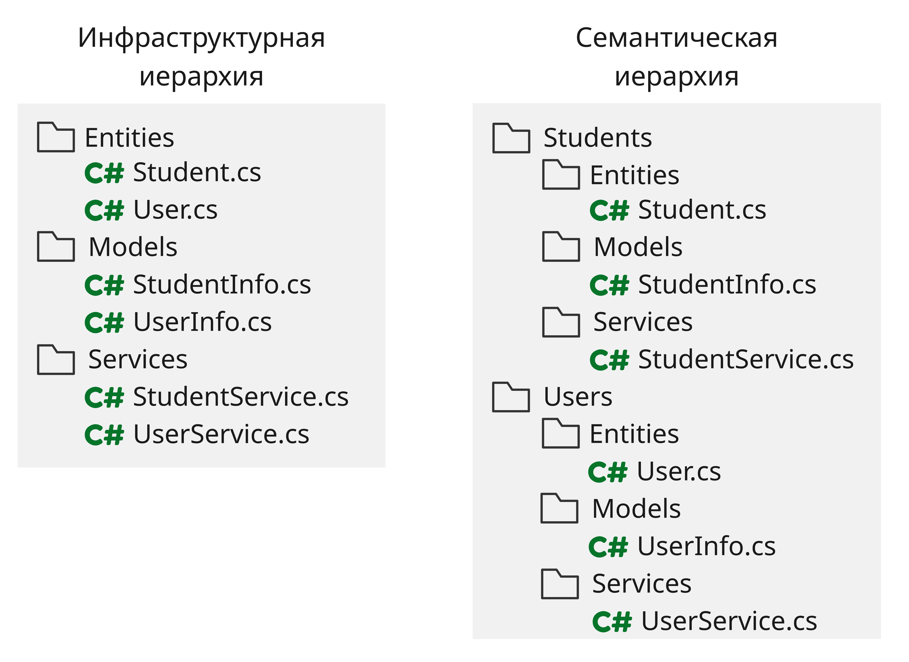
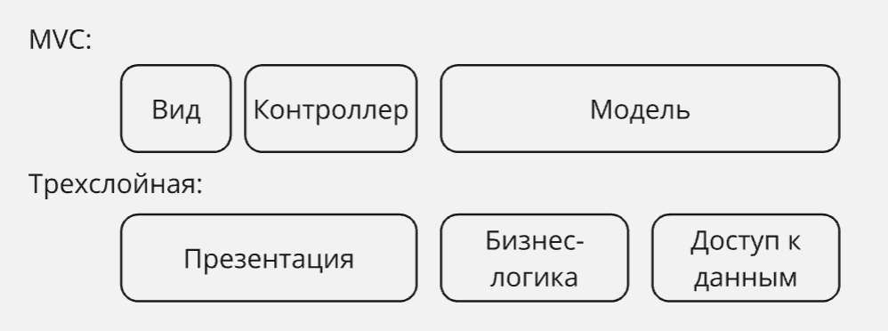
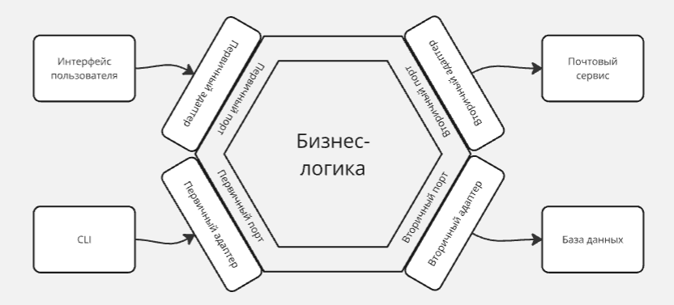

<!-- This file is generated by assets.build.markdown.superconspect_builder. All changes to it will be lost -->


# <a name="%D0%BE%D0%B1%D1%8A%D0%B5%D0%BA%D1%82%D0%BD%D0%BE-%D0%BE%D1%80%D0%B8%D0%B5%D0%BD%D1%82%D0%B8%D1%80%D0%BE%D0%B2%D0%B0%D0%BD%D0%BD%D0%BE%D0%B5-%D0%BF%D1%80%D0%BE%D0%B5%D0%BA%D1%82%D0%B8%D1%80%D0%BE%D0%B2%D0%B0%D0%BD%D0%B8%D0%B5-%D0%B8-%D0%BF%D1%80%D0%BE%D0%B3%D1%80%D0%B0%D0%BC%D0%BC%D0%B8%D1%80%D0%BE%D0%B2%D0%B0%D0%BD%D0%B8%D0%B5"></a> Объектно-ориентированное проектирование и программирование

* [Объектно-ориентированное проектирование и программирование](#%D0%BE%D0%B1%D1%8A%D0%B5%D0%BA%D1%82%D0%BD%D0%BE-%D0%BE%D1%80%D0%B8%D0%B5%D0%BD%D1%82%D0%B8%D1%80%D0%BE%D0%B2%D0%B0%D0%BD%D0%BD%D0%BE%D0%B5-%D0%BF%D1%80%D0%BE%D0%B5%D0%BA%D1%82%D0%B8%D1%80%D0%BE%D0%B2%D0%B0%D0%BD%D0%B8%D0%B5-%D0%B8-%D0%BF%D1%80%D0%BE%D0%B3%D1%80%D0%B0%D0%BC%D0%BC%D0%B8%D1%80%D0%BE%D0%B2%D0%B0%D0%BD%D0%B8%D0%B5)
  * [Лекция 1. Основы ООП](#%D0%BB%D0%B5%D0%BA%D1%86%D0%B8%D1%8F-1.-%D0%BE%D1%81%D0%BD%D0%BE%D0%B2%D1%8B-%D0%BE%D0%BE%D0%BF)
  * [Лекция 2. Проектирование модели](#%D0%BB%D0%B5%D0%BA%D1%86%D0%B8%D1%8F-2.-%D0%BF%D1%80%D0%BE%D0%B5%D0%BA%D1%82%D0%B8%D1%80%D0%BE%D0%B2%D0%B0%D0%BD%D0%B8%D0%B5-%D0%BC%D0%BE%D0%B4%D0%B5%D0%BB%D0%B8)
    * [Иммутабельность](#%D0%B8%D0%BC%D0%BC%D1%83%D1%82%D0%B0%D0%B1%D0%B5%D0%BB%D1%8C%D0%BD%D0%BE%D1%81%D1%82%D1%8C)
    * [Методы `Find`/`Get`](#%D0%BC%D0%B5%D1%82%D0%BE%D0%B4%D1%8B-%60find%60%2F%60get%60)
    * [Обработка ошибок](#%D0%BE%D0%B1%D1%80%D0%B0%D0%B1%D0%BE%D1%82%D0%BA%D0%B0-%D0%BE%D1%88%D0%B8%D0%B1%D0%BE%D0%BA)
    * [Предметно-ориентированное проектирование](#%D0%BF%D1%80%D0%B5%D0%B4%D0%BC%D0%B5%D1%82%D0%BD%D0%BE-%D0%BE%D1%80%D0%B8%D0%B5%D0%BD%D1%82%D0%B8%D1%80%D0%BE%D0%B2%D0%B0%D0%BD%D0%BD%D0%BE%D0%B5-%D0%BF%D1%80%D0%BE%D0%B5%D0%BA%D1%82%D0%B8%D1%80%D0%BE%D0%B2%D0%B0%D0%BD%D0%B8%D0%B5)
  * [Лекция 3. Принципы SOLID](#%D0%BB%D0%B5%D0%BA%D1%86%D0%B8%D1%8F-3.-%D0%BF%D1%80%D0%B8%D0%BD%D1%86%D0%B8%D0%BF%D1%8B-solid)
    * [Принцип единственной ответственности](#%D0%BF%D1%80%D0%B8%D0%BD%D1%86%D0%B8%D0%BF-%D0%B5%D0%B4%D0%B8%D0%BD%D1%81%D1%82%D0%B2%D0%B5%D0%BD%D0%BD%D0%BE%D0%B9-%D0%BE%D1%82%D0%B2%D0%B5%D1%82%D1%81%D1%82%D0%B2%D0%B5%D0%BD%D0%BD%D0%BE%D1%81%D1%82%D0%B8)
    * [Принцип открытости/закрытости](#%D0%BF%D1%80%D0%B8%D0%BD%D1%86%D0%B8%D0%BF-%D0%BE%D1%82%D0%BA%D1%80%D1%8B%D1%82%D0%BE%D1%81%D1%82%D0%B8%2F%D0%B7%D0%B0%D0%BA%D1%80%D1%8B%D1%82%D0%BE%D1%81%D1%82%D0%B8)
    * [Принцип подстановки Лисков](#%D0%BF%D1%80%D0%B8%D0%BD%D1%86%D0%B8%D0%BF-%D0%BF%D0%BE%D0%B4%D1%81%D1%82%D0%B0%D0%BD%D0%BE%D0%B2%D0%BA%D0%B8-%D0%BB%D0%B8%D1%81%D0%BA%D0%BE%D0%B2)
    * [Принцип разделения интерфейса](#%D0%BF%D1%80%D0%B8%D0%BD%D1%86%D0%B8%D0%BF-%D1%80%D0%B0%D0%B7%D0%B4%D0%B5%D0%BB%D0%B5%D0%BD%D0%B8%D1%8F-%D0%B8%D0%BD%D1%82%D0%B5%D1%80%D1%84%D0%B5%D0%B9%D1%81%D0%B0)
    * [Принцип зависимости инверсий](#%D0%BF%D1%80%D0%B8%D0%BD%D1%86%D0%B8%D0%BF-%D0%B7%D0%B0%D0%B2%D0%B8%D1%81%D0%B8%D0%BC%D0%BE%D1%81%D1%82%D0%B8-%D0%B8%D0%BD%D0%B2%D0%B5%D1%80%D1%81%D0%B8%D0%B9)
  * [Лекция 4. Шаблоны GRASP](#%D0%BB%D0%B5%D0%BA%D1%86%D0%B8%D1%8F-4.-%D1%88%D0%B0%D0%B1%D0%BB%D0%BE%D0%BD%D1%8B-grasp)
    * [Информационный эксперт](#%D0%B8%D0%BD%D1%84%D0%BE%D1%80%D0%BC%D0%B0%D1%86%D0%B8%D0%BE%D0%BD%D0%BD%D1%8B%D0%B9-%D1%8D%D0%BA%D1%81%D0%BF%D0%B5%D1%80%D1%82)
    * [Создатель](#%D1%81%D0%BE%D0%B7%D0%B4%D0%B0%D1%82%D0%B5%D0%BB%D1%8C)
    * [Контроллер](#%D0%BA%D0%BE%D0%BD%D1%82%D1%80%D0%BE%D0%BB%D0%BB%D0%B5%D1%80)
    * [Слабое зацепление](#%D1%81%D0%BB%D0%B0%D0%B1%D0%BE%D0%B5-%D0%B7%D0%B0%D1%86%D0%B5%D0%BF%D0%BB%D0%B5%D0%BD%D0%B8%D0%B5)
    * [Сильная связность](#%D1%81%D0%B8%D0%BB%D1%8C%D0%BD%D0%B0%D1%8F-%D1%81%D0%B2%D1%8F%D0%B7%D0%BD%D0%BE%D1%81%D1%82%D1%8C)
    * [Перенаправление](#%D0%BF%D0%B5%D1%80%D0%B5%D0%BD%D0%B0%D0%BF%D1%80%D0%B0%D0%B2%D0%BB%D0%B5%D0%BD%D0%B8%D0%B5)
    * [Полиморфизм](#%D0%BF%D0%BE%D0%BB%D0%B8%D0%BC%D0%BE%D1%80%D1%84%D0%B8%D0%B7%D0%BC)
    * [Устойчивость к изменениям](#%D1%83%D1%81%D1%82%D0%BE%D0%B9%D1%87%D0%B8%D0%B2%D0%BE%D1%81%D1%82%D1%8C-%D0%BA-%D0%B8%D0%B7%D0%BC%D0%B5%D0%BD%D0%B5%D0%BD%D0%B8%D1%8F%D0%BC)
    * [Чистая выдумка](#%D1%87%D0%B8%D1%81%D1%82%D0%B0%D1%8F-%D0%B2%D1%8B%D0%B4%D1%83%D0%BC%D0%BA%D0%B0)
  * [Лекция 5. Порождающие паттерны](#%D0%BB%D0%B5%D0%BA%D1%86%D0%B8%D1%8F-5.-%D0%BF%D0%BE%D1%80%D0%BE%D0%B6%D0%B4%D0%B0%D1%8E%D1%89%D0%B8%D0%B5-%D0%BF%D0%B0%D1%82%D1%82%D0%B5%D1%80%D0%BD%D1%8B)
    * [Фабричный метод](#%D1%84%D0%B0%D0%B1%D1%80%D0%B8%D1%87%D0%BD%D1%8B%D0%B9-%D0%BC%D0%B5%D1%82%D0%BE%D0%B4)
    * [Абстрактная фабрика](#%D0%B0%D0%B1%D1%81%D1%82%D1%80%D0%B0%D0%BA%D1%82%D0%BD%D0%B0%D1%8F-%D1%84%D0%B0%D0%B1%D1%80%D0%B8%D0%BA%D0%B0)
    * [Строитель](#%D1%81%D1%82%D1%80%D0%BE%D0%B8%D1%82%D0%B5%D0%BB%D1%8C)
    * [Прототип](#%D0%BF%D1%80%D0%BE%D1%82%D0%BE%D1%82%D0%B8%D0%BF)
    * [Одиночка](#%D0%BE%D0%B4%D0%B8%D0%BD%D0%BE%D1%87%D0%BA%D0%B0)
  * [Лекция 6. Воркшоп 2](#%D0%BB%D0%B5%D0%BA%D1%86%D0%B8%D1%8F-6.-%D0%B2%D0%BE%D1%80%D0%BA%D1%88%D0%BE%D0%BF-2)
  * [Лекция 7. Структурные паттерны](#%D0%BB%D0%B5%D0%BA%D1%86%D0%B8%D1%8F-7.-%D1%81%D1%82%D1%80%D1%83%D0%BA%D1%82%D1%83%D1%80%D0%BD%D1%8B%D0%B5-%D0%BF%D0%B0%D1%82%D1%82%D0%B5%D1%80%D0%BD%D1%8B)
    * [Адаптер](#%D0%B0%D0%B4%D0%B0%D0%BF%D1%82%D0%B5%D1%80)
    * [Мост](#%D0%BC%D0%BE%D1%81%D1%82)
    * [Компоновщик](#%D0%BA%D0%BE%D0%BC%D0%BF%D0%BE%D0%BD%D0%BE%D0%B2%D1%89%D0%B8%D0%BA)
    * [Декоратор](#%D0%B4%D0%B5%D0%BA%D0%BE%D1%80%D0%B0%D1%82%D0%BE%D1%80)
    * [Заместитель](#%D0%B7%D0%B0%D0%BC%D0%B5%D1%81%D1%82%D0%B8%D1%82%D0%B5%D0%BB%D1%8C)
    * [Фасад](#%D1%84%D0%B0%D1%81%D0%B0%D0%B4)
    * [Легковес](#%D0%BB%D0%B5%D0%B3%D0%BA%D0%BE%D0%B2%D0%B5%D1%81)
  * [Лекция 8. Воркшоп 3](#%D0%BB%D0%B5%D0%BA%D1%86%D0%B8%D1%8F-8.-%D0%B2%D0%BE%D1%80%D0%BA%D1%88%D0%BE%D0%BF-3)
  * [Лекция 9. Поведенческие паттерны. Воркшоп 4](#%D0%BB%D0%B5%D0%BA%D1%86%D0%B8%D1%8F-9.-%D0%BF%D0%BE%D0%B2%D0%B5%D0%B4%D0%B5%D0%BD%D1%87%D0%B5%D1%81%D0%BA%D0%B8%D0%B5-%D0%BF%D0%B0%D1%82%D1%82%D0%B5%D1%80%D0%BD%D1%8B.-%D0%B2%D0%BE%D1%80%D0%BA%D1%88%D0%BE%D0%BF-4)
    * [Шаблонный метод](#%D1%88%D0%B0%D0%B1%D0%BB%D0%BE%D0%BD%D0%BD%D1%8B%D0%B9-%D0%BC%D0%B5%D1%82%D0%BE%D0%B4)
    * [Стратегия](#%D1%81%D1%82%D1%80%D0%B0%D1%82%D0%B5%D0%B3%D0%B8%D1%8F)
    * [Цепочка обязанностей](#%D1%86%D0%B5%D0%BF%D0%BE%D1%87%D0%BA%D0%B0-%D0%BE%D0%B1%D1%8F%D0%B7%D0%B0%D0%BD%D0%BD%D0%BE%D1%81%D1%82%D0%B5%D0%B9)
    * [Наблюдатель](#%D0%BD%D0%B0%D0%B1%D0%BB%D1%8E%D0%B4%D0%B0%D1%82%D0%B5%D0%BB%D1%8C)
    * [Команда](#%D0%BA%D0%BE%D0%BC%D0%B0%D0%BD%D0%B4%D0%B0)
    * [Посетитель](#%D0%BF%D0%BE%D1%81%D0%B5%D1%82%D0%B8%D1%82%D0%B5%D0%BB%D1%8C)
    * [Снимок](#%D1%81%D0%BD%D0%B8%D0%BC%D0%BE%D0%BA)
    * [Состояние](#%D1%81%D0%BE%D1%81%D1%82%D0%BE%D1%8F%D0%BD%D0%B8%D0%B5)
    * [Итератор](#%D0%B8%D1%82%D0%B5%D1%80%D0%B0%D1%82%D0%BE%D1%80)
  * [Лекция 10. Многослойная архитектура](#%D0%BB%D0%B5%D0%BA%D1%86%D0%B8%D1%8F-10.-%D0%BC%D0%BD%D0%BE%D0%B3%D0%BE%D1%81%D0%BB%D0%BE%D0%B9%D0%BD%D0%B0%D1%8F-%D0%B0%D1%80%D1%85%D0%B8%D1%82%D0%B5%D0%BA%D1%82%D1%83%D1%80%D0%B0)
    * [Архитектура "Модель-Представление-Контроллер"](#%D0%B0%D1%80%D1%85%D0%B8%D1%82%D0%B5%D0%BA%D1%82%D1%83%D1%80%D0%B0-%22%D0%BC%D0%BE%D0%B4%D0%B5%D0%BB%D1%8C-%D0%BF%D1%80%D0%B5%D0%B4%D1%81%D1%82%D0%B0%D0%B2%D0%BB%D0%B5%D0%BD%D0%B8%D0%B5-%D0%BA%D0%BE%D0%BD%D1%82%D1%80%D0%BE%D0%BB%D0%BB%D0%B5%D1%80%22)
    * [Трехслойная архитектура](#%D1%82%D1%80%D0%B5%D1%85%D1%81%D0%BB%D0%BE%D0%B9%D0%BD%D0%B0%D1%8F-%D0%B0%D1%80%D1%85%D0%B8%D1%82%D0%B5%D0%BA%D1%82%D1%83%D1%80%D0%B0)
    * [Гексагональная архитектура](#%D0%B3%D0%B5%D0%BA%D1%81%D0%B0%D0%B3%D0%BE%D0%BD%D0%B0%D0%BB%D1%8C%D0%BD%D0%B0%D1%8F-%D0%B0%D1%80%D1%85%D0%B8%D1%82%D0%B5%D0%BA%D1%82%D1%83%D1%80%D0%B0)
    * [Луковая архитектура](#%D0%BB%D1%83%D0%BA%D0%BE%D0%B2%D0%B0%D1%8F-%D0%B0%D1%80%D1%85%D0%B8%D1%82%D0%B5%D0%BA%D1%82%D1%83%D1%80%D0%B0)
  * [Лекция 11. Воркшоп 5](#%D0%BB%D0%B5%D0%BA%D1%86%D0%B8%D1%8F-11.-%D0%B2%D0%BE%D1%80%D0%BA%D1%88%D0%BE%D0%BF-5)

<!-- begin oopcsharp_2024_09_07.md -->
Все презентации к лекциям можно найти по ссылке [github.com/is-oop-y27](https://github.com/is-oop-y27)

## <a name="%D0%BB%D0%B5%D0%BA%D1%86%D0%B8%D1%8F-1.-%D0%BE%D1%81%D0%BD%D0%BE%D0%B2%D1%8B-%D0%BE%D0%BE%D0%BF"></a> Лекция 1. Основы ООП

<!-- Лектор - Макаревич Р. Д. -->

В самом начале развития компьютерных наук и программирования код выглядел как-то так:

```asm
VAR i
SET i 1
PRINT i
INC i
JIFLS i 10 2
```

Писать на языке ассемблера было очень неудобно, поэтому придумали **структурное программирование**:

```cs
for (var i = 1; i < 10; i++) 
{
    Console.WriteLine(i);
}
```

Но при увеличении кода стало неудобно и это, поэтому придумали функции и **процедурное программирование** - разбиение кода на маленькие независимые участки. Но вскоре появилась надобность разделять бизнес-логику, данные и сохранять **инвариант данных** - набор корректных состояний данных, определяемый набором бизнес-требований к этим данным

Поэтому появилась парадигма **объектно-ориентированное программирование**

---

Выделяют 3 основных концепции ООП:

* **Инкапсуляция** - объединение данных и их поведения в один класс

    **Сокрытие** - управление доступа к полям класса, тем самым сохранение инварианта

    Стоит заметить, что _сокрытие_ не является основной концепцией ООП, так как _сокрытие_ необязательно в языках с объектно-ориентированной парадигмой, например, Python

* **Полиморфизм** - это отделение абстракции от реализации, позволяющее пользователю прозрачно использовать различные реализации поведений

    Концепция полиморфизма заключается в более абстрактном понимании объектов

    Примером абстракции может быть объект для доступа к базе данных - мы можем создать классы для доступа к базам данным SQL и NoSQL, которые имеют одни и те же публичные методы с одинаковыми аргументами - и тогда мы приходим к понятию интерфейса, который описывает одинаковые методы у классов, имеющих разную логику, но одинаковое поведение

* **Наследование**

    **Реализация интерфейса** (то есть наследование поведений) - это механизм, при котором класс предоставляет конкретную реализацию всех методов, свойств и событий, объявленных в интерфейсе. Интерфейс задаёт только контракт (какие данные должен метод принять и какие вернуть), но не содержит реализации

    В C# реализовывать интерфейсы могут как классы, так и структуры. Если класс `Point` реализует интерфейс `IPoint`, то говорят, что тип реализует интерфейс

    **Наследование реализаций** - это механизм, при котором один класс (его называют дочерним или производным) наследует поля, свойства, методы и другую реализацию от другого класса (его называют родительским или базовым). Производный класс может дополнять или переопределять поведение базового класса

    Также говорят, что класс является наследником другого класса, либо же его подклассом, например, класс `Cat` является наследником класса `Animal`

    **Объект** - набор атрибутов и поведений, реализаций и данные которого сокрыты от конечного пользователя объекта. Также объект - это абстракция, представляющая какой-то объект моделируемой предметной области

Также выделяют _композицию_, _агрегацию_ и _ассоциацию_:

* **Композиция** - отношение между объектами, когда владеемые объекты не могут семантически быть за пределами владеющего объекта. Например: автомобиль и его детали - двигатель, двери, руль и так далее
* **Агрегация** - _сильное_ отношение между объектами, когда один объект владеет другим объектом, но не управляет его жизненным циклом, при этом связь получается односторонняя. Пример: департамент и его сотрудник - департамент владеет сотрудником, но при этом сотрудник может перейти в другой департамент
* **Ассоциация** - _слабое_ отношение между объектами, которые делятся информацией и сами управляют своим жизненным циклом. Например: машина и водитель, читатель блога и пост в блоге. Ассоциация может быть двухсторонней, например, подписка друг на друга в соцсетях

> Источники: <https://www.infoworld.com/article/2243500/exploring-association-aggregation-and-composition-in-oop.html>, <https://itsobes.com/ru/it/v-chem-raznica-mezhdu-agregaciej-kompoziciej-i-associaciej/>, <https://www.geeksforgeeks.org/association-composition-aggregation-java/>

---

Таким образом, подведем итоги:

* Парадигма ООП представляет собой концепцию объединения данных и логики, их обрабатывающей
* Сокрытие принуждает пользователей использовать поведения, соответствующие бизнес-правилам
* Локализация изменений данных позволяет упростить поддержание их инварианта
<!-- end oopcsharp_2024_09_07.md -->

<!-- begin oopcsharp_2024_09_14.md -->
## <a name="%D0%BB%D0%B5%D0%BA%D1%86%D0%B8%D1%8F-2.-%D0%BF%D1%80%D0%BE%D0%B5%D0%BA%D1%82%D0%B8%D1%80%D0%BE%D0%B2%D0%B0%D0%BD%D0%B8%D0%B5-%D0%BC%D0%BE%D0%B4%D0%B5%D0%BB%D0%B8"></a> Лекция 2. Проектирование модели

<!-- Лектор - Круглов Г. Н. -->

### <a name="%D0%B8%D0%BC%D0%BC%D1%83%D1%82%D0%B0%D0%B1%D0%B5%D0%BB%D1%8C%D0%BD%D0%BE%D1%81%D1%82%D1%8C"></a> Иммутабельность

**Иммутабельность** (от immutable) или неизменяемость - свойство данных, не подразумевающее изменения в ООП, которое используется в виде сокрытия изменяемых данных, значения которых не требуют изменений

Изменчивость (или мутабельность) данных усложняет систему, повышая количество допускаемых состояний, из-за чего система становится менее предсказуемой

Пример - группа студентов. У группы студентов может быть идентификатор, имя и список студентов, и очевидно, что идентификатор и имя у группы в дальнейшем никак не изменится. Если не применять к данным иммутабельность, то получим:

```csharp
public class StudentGroup
{
    public long Id { get; private set; }

    public string Name { get; private set; }

    public List<long> StudentIds { get; set; }

    public void AddStudent(long studentId)
    {
        if (StudentIds.Contains(studentId) is false)
            StudentIds.Add(studentId);
    }
}
```

Но мы можем сделать эти поля только для чтения при помощи модификатора `readonly`:

```csharp
public class StudentGroup {
    private readonly HashSet<long> _studentsIds; // ну еще лист на хешсетик поменяли

    public StudentGroup(long id, string name)
    {
        Id = id;
        Name = name;
        _studentsIds = new HashSet<long>();
    }

    public long Id { get; }

    public string Name { get; set; }

    public IReadOnlyCollection<long> StudentIds => _studentsIds;

    public void AddStudent(long studentId)
    {
        _studentsIds.Add(studentId);
    }
}
```

В итоге мы поставили ограничение, что идентификатор и имя группы мы можем только инициализировать

### <a name="%D0%BC%D0%B5%D1%82%D0%BE%D0%B4%D1%8B-%60find%60%2F%60get%60"></a> Методы `Find`/`Get`

Если же у нас есть метод, который возвращает объект `X`, то неплохо было бы определиться, что будет происходить, если метод не нашел этот `X`. Тогда можно действовать так:

* выбрасывать исключение
* возвращать `null`

Тогда соответственно будем именовать методы `Get__By__`, если метод будет возвращать ошибку, и `Find__By__`, если метод возвращает `null`. Пример:

```csharp
public record Post(long Id, string Title, string Content);

public class User {
    private readonly List<Post> _posts;

    public User(IEnumerable<Post> posts)
    {
        _posts = posts.ToList();
    }

    public Post GetPostById(long postId)
    {
        return _posts.Single(x => x.Id.Equals(postId));
    }

    public Post? FindPostByTitle(string title)
    {
        return _posts.SingleOrDefault(x => x.Title.Equals(title));
    }
}
```

При этом использование статического полиморфизма (перегрузки методов) вместо методов с суффиксами `By__` снижает читаемость и расширяемость:

```csharp
public Post? FindPost(long postId)
{
    return _posts.Single(x => x.Id.Equals(postId));
}
public Post? FindPost(string title)
{
    return _posts.SingleOrDefault(x => x.Title.Equals(title));
}
```

### <a name="%D0%BE%D0%B1%D1%80%D0%B0%D0%B1%D0%BE%D1%82%D0%BA%D0%B0-%D0%BE%D1%88%D0%B8%D0%B1%D0%BE%D0%BA"></a> Обработка ошибок

При использовании исключений могут возникнуть следующие ситуации:

* исключения не отражены в сигнатуре метода
* поиск конкретного типа исключения и ситуации, когда оно кидается, приводят к утечке абстракции
* неудачное выполнение операции не означает исключительную ситуацию

**Утечка абстракции** (Leaky Abstraction) - это абстракция, для работы с которой, необходимо иметь знание о деталях ее реализации

Вместо исключений можно возвращать `bool`, который означает успех операции:

```csharp
if (long.TryParse("123", out long number))
{
    Console.WriteLine(number);
}
```

Но, если нам нужно более 2 значений, чтобы передать, что именно пошло не так, можно воспользоваться типом результата (Result type):

```csharp
public abstract record AddStudentResult
{
    private AddStudentResult() { }
    public sealed record Success : AddStudentResult;
    public sealed record AlreadyMember : AddStudentResult;
    public sealed record StudentLimitReached(int Limit) : AddStudentResult;
}
```

Здесь описаны 3 результата: успех, студент уже является участником группы и предел группы превышен. Также используются ключевые слова `record`, позволяющее упростить синтаксис кода, и `sealed`, гарантирующее, что от типа нельзя наследовать другой тип, обозначающий другой результат

В итоге мы можем возвращать `AddStudentResult`:

```csharp
public AddStudentResult AddStudent(long studentId)
{
    if (_studentsIds.Count.Equals(MaxStudentCount))
        return new AddStudentResult.StudentLimitReached(MaxStudentCount);

    if (_studentsIds.Add(studentId) is false)
        return new AddStudentResult.AlreadyMember();

    return new AddStudentResult.Success();
}
```

И после этого уже проверять наш тип результата:

```csharp
if (result is AddStudentResult.AlreadyMember)
{
    Console.WriteLine("Студент уже участник группы");
    return;
}
if (result is AddStudentResult.StudentLimitReached err)
{
    var message = $"Нельзя добавить студента, максимум в {err.Limit} студентов уже достигнут";
    Console.WriteLine(message);
    return;
}
if (result is not AddStudentResult.Success)
{
    Console.WriteLine("Операция завершилась с ошибкой");
    return;
}

Console.WriteLine("Студент успешно добавлен");
```

В итоге это выходит:

* дешевле и быстрее исключений (исключения ведут к "раскрутке стека", что нарушает поток управления)
* более информативно, чем перечисления и булевое значение
* возвращаемый результат более понятный

### <a name="%D0%BF%D1%80%D0%B5%D0%B4%D0%BC%D0%B5%D1%82%D0%BD%D0%BE-%D0%BE%D1%80%D0%B8%D0%B5%D0%BD%D1%82%D0%B8%D1%80%D0%BE%D0%B2%D0%B0%D0%BD%D0%BD%D0%BE%D0%B5-%D0%BF%D1%80%D0%BE%D0%B5%D0%BA%D1%82%D0%B8%D1%80%D0%BE%D0%B2%D0%B0%D0%BD%D0%B8%D0%B5"></a> Предметно-ориентированное проектирование

Предметно-ориентированное проектирование (Domain driven design, DDD) - проектирование, ориентированное на нужную нам предметную область (или домен), например, область, состоящая из студентов, предметов и преподавателей

При проектировании появляется модель - абстракция, которая упрощённо описывает предметную область, предметы в нем и их взаимоотношений

Рассмотрим паттерны, которые применяются в предметно-ориентированном проектировании:

* Объект со значением (Value Object)

    Приведем пример:

    ```csharp
    public class Account
    {
        public decimal Balance { get; private set; }

        public void Withdraw(decimal value)
        {
            if (value < 0)
                throw new ArgumentException("Значение не может быть отрицательным", nameof(value));

            Balance -= value;
        }
    }
    ```

    Здесь можно сделать обертку вокруг `decimal value`, которая будет заниматься валидацией данных:

    ```csharp
    public struct Money
    {
        public Money(decimal value)
        {
            if (value < 0)
            {
                throw new ArgumentException("Значение не может быть отрицательным", nameof(value));
            }
            Value = value;
        }
        public decimal Value { get; }
        public static Money operator -(Money left, Money right)
        {
            var value = left.Value - right.Value;
            return new Money(value);
        }
    }

    public class Account
    {
        public Money Balance { get; private set; }
        public void Withdraw(Money value)
        {
            Balance -= value;
        }
    }
    ```

    И в этом случае деньги будут объектом со значением, который не позволит отрицательное значение

* Файловая структура

    Также структура файлов проекта должна быть семантической, а не инфраструктурной для упрощенного поиска той или иной сущности

    

    Под семантикой подразумевается смысл того, что делает конкретный программный модуль. Поэтому вместо того, чтобы отделять сущности, модели и сервисы, намного более понятно разделять компоненты по тому, с каким объектом модели они взаимодействуют
<!-- end oopcsharp_2024_09_14.md -->

<!-- begin oopcsharp_2024_09_21.md -->
## <a name="%D0%BB%D0%B5%D0%BA%D1%86%D0%B8%D1%8F-3.-%D0%BF%D1%80%D0%B8%D0%BD%D1%86%D0%B8%D0%BF%D1%8B-solid"></a> Лекция 3. Принципы SOLID

<!-- Лектор - Круглов Г. Н. -->

Принципы SOLID были сформированы в статье Роберта Мартина "Design Principles and Design Patterns" ([источник](https://web.archive.org/web/20150906155800/http://www.objectmentor.com/resources/articles/Principles_and_Patterns.pdf)) в 2000 году, которые были предложены в ответ на деградацию программного обеспечения - процесс, в течение которого код становится трудно поддерживаемым

Аббревиатура SOLID состоит из первых букв названий соответствующих принципов:

* Single Responsibility Principle (SRP) - принцип единственной ответственности
* Open-Closed Principle (OCP) - принцип открытости/закрытости
* Liskov Substitution Principle (LSP) - принцип подстановки Лисков
* Interface Segregation Principle (ISP) - принцип разделения интерфейса
* Dependency Inversion Principle (DIP) - принцип инверсии зависимостей

### <a name="%D0%BF%D1%80%D0%B8%D0%BD%D1%86%D0%B8%D0%BF-%D0%B5%D0%B4%D0%B8%D0%BD%D1%81%D1%82%D0%B2%D0%B5%D0%BD%D0%BD%D0%BE%D0%B9-%D0%BE%D1%82%D0%B2%D0%B5%D1%82%D1%81%D1%82%D0%B2%D0%B5%D0%BD%D0%BD%D0%BE%D1%81%D1%82%D0%B8"></a> Принцип единственной ответственности

**Принцип единственной ответственности** (Single Responsibility Principle, SRP) гласит, что класс должен быть ответственным только за одну сущность и у класса должна быть только одна причина для изменения

Например: делать класс, который создает отчеты одновременно в форматах `.xlsx` для Excel и `.pdf` - плохо, так как в них могут быть методы с одинаковыми названиями, но с разной логикой, этот класс будет труднее изменять

```cs
public record OperationResult(...);

public class ReportGenerator
{
    public void GenerateExcelReport(OperationResult result)
    {
        ...
    }
    public void GeneratePdfReport(OperationResult result)
    {
        ...
    }
}
```

Поэтому лучше сделать интерфейс генераторов отчета, от которого наследуются классы генераторов отчетов в Excel и в PDF:

```cs
public record OperationResult(...);

public interface IReportGenerator
{
    void GenerateReport(OperationResult result);
}

public class ExcelReportGenerator : IReportGenerator
{
    public void GenerateReport(OperationResult result)
    {
        ...
    }
}
public class PdfReportGenerator : IReportGenerator
{
    public void GenerateReport(OperationResult result)
    {
        ...
    }
}
```

Преимущества такого подхода:

* Простота, потому что нет необходимости в абстракциях
* Переиспользование логики: часто логика в типах, не соблюдающих _принцип единственной ответственности_, имеет общие части, поэтому вызвать приватный метод класса в нескольких местах проще, чем реализовывать грамотную декомпозицию

При несоблюдении _принципа единственной ответственности_ появляются проблемы:

* Сильная связанность реализации различных бизнес требований, что приводит к усложнению тестирования
* Изменения в общем коде могут поломать другие решения

### <a name="%D0%BF%D1%80%D0%B8%D0%BD%D1%86%D0%B8%D0%BF-%D0%BE%D1%82%D0%BA%D1%80%D1%8B%D1%82%D0%BE%D1%81%D1%82%D0%B8%2F%D0%B7%D0%B0%D0%BA%D1%80%D1%8B%D1%82%D0%BE%D1%81%D1%82%D0%B8"></a> Принцип открытости/закрытости

**Принцип открытости/закрытости** (Open-Closed Principle, OCP) гласит, что программные сущности должны быть открытыми для расширения и закрытыми для модификации

По сути это значит, что новая логика, которая расширяет старый тип, должна быть создана путем создания новых типов, а не изменения существующих типов

Пример несоблюдения _принципа открытости/закрытости_:

```cs
public enum BinaryOperation
{
    Summation,
    Subtraction,
}

public class BinaryOperand
{
    private readonly int _left;
    private readonly int _right;

    public BinaryOperand(int left, int right)
    {
        _left = left;
        _right = right;
    }

    public int Evaluate(BinaryOperation operation) => operation switch
    {
        BinaryOperation.Summation => _left + _right,
        BinaryOperation.Subtraction => _left - _right,
    };
}
```

В этом примере калькулятор `BinaryOperand` использует перечисления `BinaryOperation` для определения оператора и ключевое слово `switch`, чтобы возвращать нужный результат. В итоге, чтобы добавить операцию умножения, нужно изменить инструкции в блоке `switch`. Поэтому более расширяемым будет такой код:

```cs
public interface IBinaryOperation
{
    int Evaluate(int left, int right);
}

public class Summation : IBinaryOperation
{
    public int Evaluate(int left, int right) => left + right;
}

public class Subtraction : IBinaryOperation
{
    public int Evaluate(int left, int right) => left - right;
}

public sealed class BinaryOperand
{
    private readonly int _left;
    private readonly int _right;

    public BinaryOperand(int left, int right)
    {
        _left = left;
        _right = right;
    }

    public int Evaluate(IBinaryOperation operation)
        => operation.Evaluate(_left, _right);
}
```

Здесь мы определяем интерфейс операции `IBinaryOperation`, классы конкретных операторов `Summation` и `Subtraction` с их реализацией и передаем объекты классов в класс `BinaryOperand`

### <a name="%D0%BF%D1%80%D0%B8%D0%BD%D1%86%D0%B8%D0%BF-%D0%BF%D0%BE%D0%B4%D1%81%D1%82%D0%B0%D0%BD%D0%BE%D0%B2%D0%BA%D0%B8-%D0%BB%D0%B8%D1%81%D0%BA%D0%BE%D0%B2"></a> Принцип подстановки Лисков

**Принцип подстановки Лисков** (Liskov Substitution Principle, LSP) гласит, что при замене похожих объектов логика программы не должна нарушаться

Например: создадим классы для обычной птицы, пингвина и летучей мыши, чтобы заставить их мигрировать:

```cs
public record Coordinate(int X, int Y);

public class Creature
{
    public void Die()
    {
        Console.WriteLine("Я мертв");
    }
}

public class Bird : Creature
{
    public virtual void FlyTo(Coordinate coordinate)
    {
        Console.WriteLine("Я летаю");
    }
}

public class Penguin : Bird
{
    public override void FlyTo(Coordinate coordinate)
    {
        Die();  // пингвины не летают :(
    }
}

public class Bat : Creature
{
    public void FlyTo(Coordinate coordinate)
    {
        Console.WriteLine("Я летучая мышь и летаю");
    }
}

void StartMigration(IEnumerable<Creature> creatures, Coordinate coordinate)
{
    foreach (var creature in creatures)
    {
        if (creature is Bird bird)
        {
            bird.FlyTo(coordinate);
        }
        if (creature is Bat bat)
        {
            bat.FlyTo(coordinate);
        }
    }
}
```

В этом случае, летучая мышь не является птицей, но летать и мигрировать она умеет, поэтому в функции миграции нам пришлось отдельно переопределять поведение для летучей мыши, так как она не является наследником птицы. Поэтому лучше сделать отдельный интерфейс для летающих существ `IFlyingCreature`:

```cs
public record Coordinate(int X, int Y);

public interface ICreature
{
    void Die();
}

public interface IFlyingCreature : ICreature
{
    void FlyTo(Coordinate coordinate);
}

public class CreatureBase : ICreature
{
    public void Die()
    {
        Console.WriteLine("Я мертв");
    }
}

public class Bird : CreatureBase {
    public virtual void FlyTo(Coordinate coordinate)
    {
        Console.WriteLine("Я летаю");
    }
}

public class Penguin : Bird { }

public class Hummingbird : Bird, IFlyingCreature
{
    public void FlyTo(Coordinate coordinate)
    {
        Console.WriteLine("Я колибри и летаю");
    }
}

public class Bat : CreatureBase, IFlyingCreature
{
    public void FlyTo(Coordinate coordinate)
    {
        Console.WriteLine("Я летучая мышь и летаю");
    }
}

void StartMigration(IEnumerable<IFlyingCreature> creatures, Coordinate coordinate)
{
    foreach (var creature in creatures)
    {
        creature.FlyTo(coordinate);
    }
}

```

В итоге, получаем, что для летучей мыши не нужен дополнительный условный блок, так как, как пингвин и колибри, летучая мышь реализовывает интерфейс `IFlyingCreature`

### <a name="%D0%BF%D1%80%D0%B8%D0%BD%D1%86%D0%B8%D0%BF-%D1%80%D0%B0%D0%B7%D0%B4%D0%B5%D0%BB%D0%B5%D0%BD%D0%B8%D1%8F-%D0%B8%D0%BD%D1%82%D0%B5%D1%80%D1%84%D0%B5%D0%B9%D1%81%D0%B0"></a> Принцип разделения интерфейса

**Принцип разделения интерфейса** (Interface Segregation Principle, ISP) рекомендует проектирование маленьких абстракций, которые ответственны за свой конкретный функционал, а не одной всеобъемлющей, содержащий много различного

_Принцип разделения интерфейса_ является аналогом _принципа единственной ответственности_ для интерфейсов - когда абстракции начинают выполнять больше одной задачи, их реализации тоже начинают брать более одной ответственности

Поэтому лучше делать не так:

```cs
public interface ICanAllDevice
{
    void Print();
    void PlayMusic();
    void BakeBread();
}
```

А так:

```cs
public interface IPrinter
{
    void Print();
}

public interface IMusicPlayer
{
    void Play();
}

public interface IBakery
{
    void BakeBread();
}
```

Такой подход позволяет уменьшить связность зависимостей

### <a name="%D0%BF%D1%80%D0%B8%D0%BD%D1%86%D0%B8%D0%BF-%D0%B7%D0%B0%D0%B2%D0%B8%D1%81%D0%B8%D0%BC%D0%BE%D1%81%D1%82%D0%B8-%D0%B8%D0%BD%D0%B2%D0%B5%D1%80%D1%81%D0%B8%D0%B9"></a> Принцип зависимости инверсий

**Принцип зависимости инверсий** (Dependency Inversion Principle) гласит, что реализации должны зависеть только от интерфейсов, а не от самих реализаций

Например: есть общий сервис `NotificationService`, отправляющий уведомления, который использует определенный отправитель для электронной почти и для SMS:

```cs
public class EmailSender
{
    public void Send(string message) => Console.WriteLine($"Email: {message}");
}

public class SmsSender
{
    public void Send(string message) => Console.WriteLine($"SMS: {message}");
}

public class NotificationService
{
    private readonly EmailSender _emailSender;
    private readonly SmsSender _smsSender;

    public NotificationService()
    {
        _emailSender = new EmailSender();
        _smsSender = new SmsSender();
    }

    public void NotifyByEmail(string message) => _emailSender.Send(message);
    public void NotifyBySms(string message) => _smsSender.Send(message);
}

var service = new NotificationService();
service.NotifyByEmail("Hello!");
service.NotifyBySms("Hello!");
```

Получаем, что `NotificationService` зависит от реализаций `EmailSender` и `SmsSender`, несмотря на то, что они выполняют одну цель - отправить сообщение методом `Send`. Поэтому лучше сделать интерфейс `IMessageSender`, реализации которого принимает `NotificationService`:

```cs
public interface IMessageSender
{
    void Send(string message);
}

public class EmailSender : IMessageSender
{
    public void Send(string message) => Console.WriteLine($"Email: {message}");
}

public class SmsSender : IMessageSender
{
    public void Send(string message) => Console.WriteLine($"SMS: {message}");
}

public class PushSender : IMessageSender
{
    public void Send(string message) => Console.WriteLine($"Push: {message}");
}

public class NotificationService
{
    private readonly IMessageSender _messageSender;

    public NotificationService(IMessageSender messageSender)
    {
        _messageSender = messageSender;
    }

    public void Notify(string message) => _messageSender.Send(message);
}

var emailService = new NotificationService(new EmailSender());
emailService.Notify("Hello by Email");

var smsService = new NotificationService(new SmsSender());
smsService.Notify("Hello by SMS");

var pushService = new NotificationService(new PushSender());
pushService.Notify("Hello by Push");
```

Такой подход позволяет избавиться от сильной связанности между типами, улучшить расширяемость типов и упростить тестирование
<!-- end oopcsharp_2024_09_21.md -->

<!-- begin oopcsharp_2024_09_28.md -->
## <a name="%D0%BB%D0%B5%D0%BA%D1%86%D0%B8%D1%8F-4.-%D1%88%D0%B0%D0%B1%D0%BB%D0%BE%D0%BD%D1%8B-grasp"></a> Лекция 4. Шаблоны GRASP

<!-- Лектор - Круглов Г. Н. -->

Шаблоны GRASP (General Responsibility Assignment Software Principles, Общие принципы распределения ответственности в ПО) - шаблоны, которые решают задачи назначения ответственности программных компонентов

Шаблоны были описаны Крэгом Ларманом в книге "Применение UML и шаблонов проектирования" в 1997 году. Каждый шаблон помогает решить конкретную задачу, возникающую при проектировании ПО, всего их девять:

1. Информационный эксперт (Information Expert)
2. Создатель (Creator)
3. Контроллер (Controller)
4. Слабое зацепление (Low Coupling)
5. Сильная связность (High Cohesion)
6. Перенаправление (Indirection)
7. Полиморфизм (Polymorphism)
8. Устойчивость к изменениям (Protected Variations)
9. Чистая выдумка (Pure Fabrication)

### <a name="%D0%B8%D0%BD%D1%84%D0%BE%D1%80%D0%BC%D0%B0%D1%86%D0%B8%D0%BE%D0%BD%D0%BD%D1%8B%D0%B9-%D1%8D%D0%BA%D1%81%D0%BF%D0%B5%D1%80%D1%82"></a> Информационный эксперт

**Информационный эксперт** (Information Expert) - это принцип, согласно которому обязанность (то есть действие с данными) назначается классу, который обладает всей необходимой информацией для её выполнения

Приведем пример заказа и создателя чека:

```csharp
public record OrderItem(int Id, decimal Price, int Quantity);

public class Order
{
    private readonly List<OrderItem> _items;

    public Order()
    {
        _items = new List<OrderItem>();
    }

    public IReadOnlyCollection<OrderItem> Items => _items;
}

public record Receipt(decimal TotalCost, DateTime Timestamp);

public class ReceiptService
{
    public Receipt CalculateReceipt(Order customer)
    {
        var totalCost = customer.Items
            .Sum(order => order.Price * order.Quantity);
        var timestamp = DateTime.Now;
        return new Receipt(totalCost, timestamp);
    }
}
```

В этом примере при составлении чека мы подсчитываем стоимость позиции заказа `order => order.Price * order.Quantity` внутри сервиса `ReceiptService`

Здесь нет _информационного эксперта_ (обязанность расчета суммы переложена на `ReceiptService`, а не на тех, кто обладает информацией), и из-за этого появляются проблемы:

* Нарушается принцип единственной ответственности
* Появляется либо много одинакового кода (например, если появится другой `ReceiptService`), либо нелогичная связь между сущностями
* Усложнённое тестирование

Исправим пример:

```csharp
public record OrderItem(int Id, decimal Price, int Quantity)
{
    public decimal Cost => Price * Quantity;
}

public class Order
{
    private readonly List<OrderItem> _items;
    public Order()
    {
        _items = new List<OrderItem>();
    }
    public IReadOnlyCollection<OrderItem> Items => _items;
    public decimal TotalCost => _items.Sum(x => x.Cost);
}

public record Receipt(decimal TotalCost, DateTime Timestamp);

public class ReceiptService
{
    public Receipt CalculateReceipt(Order customer)
    {
        var totalCost = customer.TotalCost;
        var timestamp = DateTime.Now;
        return new Receipt(totalCost, timestamp);
    }
}
```

Здесь объект заказа `Order` подсчитывает сумму заказа и формирует объект чека `Receipt`. Объекты `Order` и `OrderItem` выступают в качестве _информационных экспертов_ - каждый знает то, что им нужно для выполнения конкретного метода

### <a name="%D1%81%D0%BE%D0%B7%D0%B4%D0%B0%D1%82%D0%B5%D0%BB%D1%8C"></a> Создатель

**Создатель** (Creator) - шаблон, который решает проблему ответственности за создание используемых объектов. Если объект класса `B` содержит, активно использует объекты класса `A`, а также обладает всеми данными для их создания, то объект класса `B` должен быть _создателем_ объектов класса `A`

Приведем пример: здесь сервис заказа `OrderService` создает позицию заказа `OrderItem`, которая передается в объект заказа `Order`

```csharp
public class Order
{
    private readonly List<OrderItem> _items;

    public Order AddItem(OrderItem item)
    {
        _items.Add(item);
        return this;
    }
}

public class OrderService
{
    public Order CreateDefaultOrder()
    {
        var order = new Order()
            .AddItem(new OrderItem(1, 100, 1))
            .AddItem(new OrderItem(2, 1000, 3));
        return order;
    }
}
```

Можно это исправить так: передадим аргументы к позиции заказа, чтобы в объекте заказа он создавался

```csharp
public class Order
{
    private readonly List<OrderItem> _items;

    public Order AddItem(int id, decimal price, int quantity)
    {
        _items.Add(new OrderItem(id, price, quantity));
        return this;
    }
}

public class OrderService
{
    public Order CreateDefaultOrder()
    {
    var order = new Order()
        .AddItem(1, 100, 1)
        .AddItem(2, 1000, 3);
    return order;
    }
}
```

Недостатки _создателя_:

* Появляется неявная зависимость между конструктором `OrderItem` и методом создания `AddItem`: если мы захотим в `OrderItem` добавить новый аргумент, то будет трудно везде изменять метод
* Если _создателю_ требуются данные, которые не являются его естественной ответственностью, это может привести к нарушению _принципа единственной ответственности_

### <a name="%D0%BA%D0%BE%D0%BD%D1%82%D1%80%D0%BE%D0%BB%D0%BB%D0%B5%D1%80"></a> Контроллер

**Контроллер** (Controller) - переходник между моделями бизнес-логики и моделями представления. _Контроллер_ помогают пользователю через представление (то есть пользовательский интерфейс) совершать некоторые действия - их называют сценариями использования (Use Case) - над объектами данных

Сам _контроллер_ не выполняет действия, он их делегирует конкретным исполнителям (их чаще всего называются сервисами)

Различают 3 вида _контроллеров_:

* Контроллер сценариев (Use Case Controller) или интерактор (Interactor) - инкапсулирует один сценарий (чаще всего мало и неудобно)
* Контроллер группы сценариев (Use Case Group Controller) - он инкапсурирует группу составных сценариев
* Фасад (Facade Controller) - этот контроллер инкапсулирует набор сценариев из разных классов, чаще всего громоздко, но упрощая внешний интерфейс взаимодействия

### <a name="%D1%81%D0%BB%D0%B0%D0%B1%D0%BE%D0%B5-%D0%B7%D0%B0%D1%86%D0%B5%D0%BF%D0%BB%D0%B5%D0%BD%D0%B8%D0%B5"></a> Слабое зацепление

**Зацеплением** (Coupling) считается мера зависимости разных модулей друг между другом

**Слабое зацепление** (Low Coupling) - принцип, согласно которому класс должен иметь как можно меньше зависимостей от других классов. Чем меньше класс знает о внутреннем устройстве других, тем проще его переиспользовать, тестировать и модифицировать

Сильное зацепление (High coupling) приводит к тому, что изменение одного класса тянет за собой цепочку изменений в зависимых классах, а также усложняет изолированное тестирование

Например: есть класс `DataProvider`, методы которого выводят температуру воздуха в комнате и используемую сборщиком мусора память в чипе микроконтроллера. Логически эти данные никак не связаны, поэтому лучше всего ослабить их зацепление - создать 2 отдельных класса для вывода температуры и для вывода памяти

### <a name="%D1%81%D0%B8%D0%BB%D1%8C%D0%BD%D0%B0%D1%8F-%D1%81%D0%B2%D1%8F%D0%B7%D0%BD%D0%BE%D1%81%D1%82%D1%8C"></a> Сильная связность

**Связность** (Cohesion) - это мера логической соотнесенности логики в рамках модуля

**Сильная связность** (или высокая связность, High Cohesion) - принцип, согласно которому все элементы внутри класса (то есть методы, поля, свойства) должны быть тесно связаны друг с другом и служить одной чётко определённой цели. Класс с высокой связностью делает одну вещь и делает её хорошо

Низкая связность (Low cohesion) возникает, когда класс содержит несвязанные друг с другом обязанности

Например: сделаем класс `DataMonitor`, который отображает нужную метрику от `DataProvider` в зависимости от переданного `enum MetricType`; так как мы работаем с перечислением, то не избежать использования `switch`, а значит код будет трудно расширять - нарушается _принцип открытости/закрытости_

В этом случае лучше будет создать интерфейс для `DataProvider`, реализации которого будут использоваться в `DataMonitor`

### <a name="%D0%BF%D0%B5%D1%80%D0%B5%D0%BD%D0%B0%D0%BF%D1%80%D0%B0%D0%B2%D0%BB%D0%B5%D0%BD%D0%B8%D0%B5"></a> Перенаправление

**Перенаправление** (Indirection) - принцип, согласно которому взаимодействие между двумя компонентами организуется через промежуточный объект-посредник, чтобы избежать прямого сильного зацепления. Посредник же берёт на себя ответственность за координацию, уменьшая зависимость между исходными компонентами

_Перенаправление_ тесно связано с _принципами разделения интерфейса_ и _инверсии зависимостей_. Принцип _перенаправления_ используется в архитектуре Модель-Представление-Контроллер (Model-View-Controller, MVC): бизнес-логика из модели общается с сущностями представления через посредник-контроллер

Из-за этого повышается гибкость и тестируемость системы, но дополнительный уровень усложняет понимание кода

### <a name="%D0%BF%D0%BE%D0%BB%D0%B8%D0%BC%D0%BE%D1%80%D1%84%D0%B8%D0%B7%D0%BC"></a> Полиморфизм

**Полиморфизм** (Polymorphism) - принцип, согласно которому поведение системы может варьироваться в зависимости от типа объекта, при этом сам код обращается к единому интерфейсу. _Полиморфизм_ позволяет избежать громоздких условных конструкций `if`/`switch` и делегирует выбор конкретного поведения самим объектам. Вместо того чтобы проверять тип объекта и вручную выбирать нужное действие, объявляется абстрактный метод или метод интерфейса, в реализации которого в конкретных классах описано желаемое поведение


### <a name="%D1%83%D1%81%D1%82%D0%BE%D0%B9%D1%87%D0%B8%D0%B2%D0%BE%D1%81%D1%82%D1%8C-%D0%BA-%D0%B8%D0%B7%D0%BC%D0%B5%D0%BD%D0%B5%D0%BD%D0%B8%D1%8F%D0%BC"></a> Устойчивость к изменениям

**Устойчивость к изменениям** (Protected Variations) - это способность системы оставаться работоспособной и легко модифицируемой при появлении новых требований или изменении существующих. Система с высокой устойчивостью к изменениям требует минимальных правок в уже написанном коде при добавлении новой функциональности

Эта характеристика чаще всего не достигается сама по себе, а является следствием применения других принципов: _слабого зацепления_, _сильной связности_, _перенаправления_ и _информационного эксперта_

### <a name="%D1%87%D0%B8%D1%81%D1%82%D0%B0%D1%8F-%D0%B2%D1%8B%D0%B4%D1%83%D0%BC%D0%BA%D0%B0"></a> Чистая выдумка

**Чистая выдумка** (Pure fabrication) подразумевает создание выдуманной сущности, которая не входит в моделирование бизнес-логики. Чаще всего это инфраструктурные модули, например, сервис для доступа к базе данных (их называют объектами доступа в данным, Data Access Object)

Такие типы уменьшают зацепление и повышают связность
<!-- end oopcsharp_2024_09_28.md -->

<!-- begin oopcsharp_2024_10_05.md -->
## <a name="%D0%BB%D0%B5%D0%BA%D1%86%D0%B8%D1%8F-5.-%D0%BF%D0%BE%D1%80%D0%BE%D0%B6%D0%B4%D0%B0%D1%8E%D1%89%D0%B8%D0%B5-%D0%BF%D0%B0%D1%82%D1%82%D0%B5%D1%80%D0%BD%D1%8B"></a> Лекция 5. Порождающие паттерны

<!-- Лектор - Круглов Г. Н. -->

В ходе разработки возникают классы, объекты которых создаются уж слишком тяжело и громоздко. Для этих случаев
разрабатывают другие методы/объекты, за которыми лежит ответственность за их созданием

Такие объекты следуют порождающим паттернам (Creational Patterns) или порождающим шаблонам

### <a name="%D1%84%D0%B0%D0%B1%D1%80%D0%B8%D1%87%D0%BD%D1%8B%D0%B9-%D0%BC%D0%B5%D1%82%D0%BE%D0%B4"></a> Фабричный метод

**Фабричный метод** (Factory Method) - метод, который определяет общий интерфейс для создания объектов в родительском классе, позволяя дочерним классам изменять тип создаваемых объектов

Фабричный метод позволяет разделить логику и создания объектов на иерархию типов

Пример: у нас есть объект заказа (`Order`), хранящий различные позиции (`OrderItem`); мы хотим передавать этот заказ в калькулятор платежа (`PaymentCalculator`), применять всякие скидки и купоны, и возвращать готовый платеж наличными (`CashPayment`) с просчитанным значением:

```csharp
public record OrderItem(decimal Price, int Amount)
{
    public decimal Cost => Price * Amount;
}

public record Order(IEnumerable<OrderItem> Items)
{
    public decimal TotalCost => Items.Sum(x => x.Cost);
}

public record CashPayment(decimal Amount);

public class PaymentCalculator
{
    public CashPayment Calculate(Order order)
    {
        var totalCost = order.TotalCost;

        // применить скидки и купоны
        ...

        return new CashPayment(totalCost);
    }
}
```

Здесь мы хотим ввести возможность оплаты не только наличными, но и банковской картой, поэтому создаем объект `BankPayment` (от интерфейса `IPayment`) и различные калькуляторы для них

```csharp
public interface IPayment
{
    decimal Amount { get; }
}

public record CashPayment(decimal Amount) : IPayment;
public record BankPayment(
    decimal Amount,
    string ReceiverAccountId) : IPayment;

public abstract class PaymentCalculator
{
    public IPayment Calculate(Order order)
    {
        var totalCost = order.TotalCost;

        // применить скидки и купоны
        ...

        return CreatePayment(totalCost);
    }

    protected abstract IPayment CreatePayment(decimal amount);
}

public class CashPaymentCalculator : PaymentCalculator
{
    protected override IPayment CreatePayment(decimal amount)
        => new CashPayment(amount);
}

public class BankPaymentCalculator : PaymentCalculator
{
    private readonly string _currentReceiverAccountId;

    public BankPaymentCalculator(string currentReceiverAccountId)
    {
        _currentReceiverAccountId = currentReceiverAccountId;
    }
    protected override IPayment CreatePayment(decimal amount)
    {
        return new BankPayment(amount, _currentReceiverAccountId);
    }
}
```

Здесь же можно выделить в паттерне фабричного метода две сущности:

* создатель (creator) - содержит логику создания объектов-наследников
* продукт (product) - содержит бизнес-логику

В данном примере продукт - это реализация интерфейса `IPayment`, а создатель - метод `CreatePayment` в абстрактном классе `PaymentCalculator`.
Фабричный метод применяется для переиспользования логики создания на наборе типов. Но при этом фабричный метод считается _антипаттерном_ из-за следующих недостатков:

* Сильная связность реализаций: из-за наследования переиспользования логики в конкретных создателях невозможно; в примере мы не можем имплементировать реализации метода `Calculate` для разных типов
* Неявное нарушение _принципа единственной ответственности_: хотя логика создания и бизнес-логика разделены по классах, конечный объект имеет две ответственности

### <a name="%D0%B0%D0%B1%D1%81%D1%82%D1%80%D0%B0%D0%BA%D1%82%D0%BD%D0%B0%D1%8F-%D1%84%D0%B0%D0%B1%D1%80%D0%B8%D0%BA%D0%B0"></a> Абстрактная фабрика

**Абстрактная фабрика** (или просто **фабрика**, Abstract Factory) - объект, который позволяет создавать семейства связанных объектов, не привязываясь к конкретным классам создаваемых объектов

Это позволяет вынести логику создания объектов в отдельные типы, объекты-фабрики которых будут ответственны только за это

При использовании фабричного метода возникает такая проблема: мы хотим использовать логику создания не только в пределах нашего `PaymentCalculator`, но и где-то еще - приходится переиспользовать логику. Поэтому здравой идеей будет вынести логику из фабричного метода в отдельный класс - фабрику:

```csharp
public interface IPaymentFactory
{
    IPayment Create(decimal amount);
}

public class CashPaymentFactory : IPaymentFactory
{
    public IPayment Create(decimal amount) => new CashPayment(amount);
}

public class BankPaymentFactory : IPaymentFactory
{
    private readonly string _currentReceiverAccountId;
    public BankPaymentFactory(string currentReceiverAccountId)
    {
        _currentReceiverAccountId = currentReceiverAccountId;
    }
    public IPayment Create(decimal amount)
    {
        return new BankPayment(amount, _currentReceiverAccountId);
    }
}

public interface IPaymentCalculator
{
    IPayment Calculate(Order order);
}

public class PaymentCalculator : IPaymentCalculator
{
    private readonly IPaymentFactory _paymentFactory;
    public PaymentCalculator(IPaymentFactory paymentFactory)
    {
        _paymentFactory = paymentFactory;
    }
    public IPayment Calculate(Order order)
    {
        var totalCost = order.TotalCost;

        // применить скидки и купоны
        ...

        return _paymentFactory.Create(totalCost);
    }
}
```

Здесь все фабрики с разными логикам создания нашего `Payment` реализуются от интерфейса `IPaymentFactory`. Поэтому мы можем какой-нибудь другой калькулятор `FixedPaymentCalculator`, который этим пользуется:

```csharp
public class FixedPaymentCalculator : IPaymentCalculator
{
    private readonly decimal _fixedPrice;
    private readonly IPaymentFactory _paymentFactory;

    public FixedPaymentCalculator(decimal fixedPrice, IPaymentFactory paymentFactory)
    {
        _fixedPrice = fixedPrice;
        _paymentFactory = paymentFactory;
    }
    public IPayment Calculate(Order order)
    {
        var totalCost = order.Items.Sum(item =>_fixedPrice * item.Amount);

        // применить скидки и купоны
        ...

        return _paymentFactory.Create(totalCost);
    }
}
```

При этом заметить следующие преимущества у абстрактной фабрики:

* Настоящее соблюдение _принципа единственной ответственности_, ведь в такой реализации нет прямой связанности между реализациями
* Соблюдение _принципа открытости/закрытости_: мы можем добавить в систему новые виды платежей и реализовать фабрики для них, тем самым расширить логику, не меняя реализацию калькуляторов

### <a name="%D1%81%D1%82%D1%80%D0%BE%D0%B8%D1%82%D0%B5%D0%BB%D1%8C"></a> Строитель

**Строитель** (или билдер, Builder) - объект, при помощи которого мы можем создать более сложный и составной объект. В строителе мы можем разбить логику сбора аргументов на методы, уменьшить мутабельность, задавать некоторые значения по умолчанию

Примером работы строителя может являться процесс создания пиццы: в строителе мы можем принять такие типы, как соус, начинка, топпинги, чтобы строитель сам собрал нам пиццу

Разделяют 2 вида строителей:

* **Удобный строитель** (Convenience Builder) позволяет упрощено создавать объектов с большим конструктором
* **Строитель с сохранением состояния** (Stateful Constructor Builder) используется как конструктор, имеющий состояние, что помогает проверять данные на этапе создания объекта

С помощью удобного строителя мы упрощаем создание объектов с гигантским конструктором, предполагая, что некоторые аргумент можем сделать по умолчанию. Пример:

```csharp
class Service
{
    public Service(IDependency1? one, IDependency2 two, IDependency3 three)   { ... }
    ...
}
internal interface IDependency3 { ... }
internal interface IDependency2 { ... }
internal interface IDependency1 { ... }

class ServiceBuilder
{
    private IDependency1? _one;
    private IDependency2? _two;
    private IDependency3? _three;
    public ServiceBuilder()
    {
        _one = null;
        _two = new Dependency2();
        _three = new Dependency3();
    }
    public ServiceBuilder WithOne(IDependency1 one) { ... }
    public ServiceBuilder WithTwo(IDependency2 two) { ... }
    public ServiceBuilder WithThree(IDependency3 three) { ... }
    public Service Build()
    {
        return new Service(
            _one,
            _two ?? throw new InvalidOperationException(),
            _three ?? throw new InvalidOperationException());
    }
}
```

С помощью строителя с сохранением состояния мы можем принимать аргументы через методы строителя. В итоге вместо такого вызова конструктора:

```csharp
var model = new Model(arg1, arg2, arg3, arg4, arg5);
```

мы получаем:

```csharp
var builder = new ModelBuilder()
    .AddArg1(arg1)
    .AddArg2(arg2)
    .AddArg3(arg3)
    .AddArg4(arg4)
    .AddArg5(arg5);

var model = new builder.Build();
```

Пример такого строителя (здесь он вложен в сам класс, чтобы он мог пользоваться приватным конструктором):

```csharp
public class Model
{
    private Model(IReadOnlyCollection<Data> data, ...)
    {
        Data = data;
        ...
    }

    public IReadOnlyCollection<Data> Data { get; }

    public static ModelBuilder Builder => new ModelBuilder();

    public class ModelBuilder
    {
        private readonly List<Data> _data;
        ...

        public ModelBuilder AddData(Data data)
        {
            _data.Add(data);
            return this;
        }
        public Model Build()
        {
            return new Model(_data, ...);
        }
    }
}
```

Конечно же, строитель может реализовывать интерфейс, чтобы иметь возможность создавать разные модели и осуществить полиморфизм:

```csharp
public interface IModelBuilder {
    ...

    Model Build();
}

public class ConcreteBuilderA : IModelBuilder
{
    ...

    public Model Build() { ... }
}
public class ConcreteBuilderB : IModelBuilder
{
    ...

    public Model Build() { ... }
}
```

Заметим, что строитель - это инфраструктурный код, неприоритетный при проектировании

Здесь же можем к строителю внедрить директора:

```csharp
public static class BuilderDirector
{
    public static Builder DirectNumeric(
        this Builder builder,
        int count)
    {
        var enumerable = Enumerable.Range(0, count);
        foreach (var i in enumerable)
        {
            var data = new DataA(i);
            builder = builder.WithDataA(data);
        }
        return builder;
    }
}

public interface IBuilderDirector
{
    Builder Direct(Builder builder);
}

public class InstanceDirector : IBuilderDirector
{
    private readonly int _size;
    private IEnumerable<Model> _prototypes;
    ...
    public Builder Direct(Builder builder) { ... }
}
```

Директор определяет порядок вызова строительных шагов для производства той или иной конфигурации продуктов

<!-- не понял, че тут происходит -->

Или же можно сделать цепочку из интерфейсов для получения данных:

```csharp
public interface IAddressBuilder
{
    ISubjectBuilder WithAddress(string address);
}
public interface ISubjectBuilder
{
    IEmailBuilder WithSubject(string subject);
}
public interface IEmailBuilder
{
    IEmailBuilder WithBody(string body);
    Email Build();
}
public class Email
{
    public static IAddressBuilder Builder => new EmailBuilder();

    public class EmailBuilder : IAddressBuilder, ISubjectBuilder, IEmailBuilder {
        ...
    }
}

var email = Email.Builder
 .WithAddress("aboba@email.com")
 .WithSubject("subject")
 .Build();
```

Здесь мы принуждаем к порядку сбора данных: адрес -> тема -> тело письма

### <a name="%D0%BF%D1%80%D0%BE%D1%82%D0%BE%D1%82%D0%B8%D0%BF"></a> Прототип

**Прототип** (Prototype) позволяет копировать объекты, не вдаваясь в подробности их реализации, что упрощает копирование объекта. Почему не пользоваться просто конструктором:

* Логика копирования может быть необходима в нескольких местах
* Данные могут быть сокрыты, модифицированы в конструкторе
* Объект находится в иерархии, и он может использоваться как интерфейс или родительский тип, поэтому при копировании конкретный тип не известен

Примитивный прототип может быть таким:

```csharp
public class Prototype
{
    private readonly IReadOnlyCollection<int> _relatedEntityIds;
    public Prototype(IReadOnlyCollection<int> relatedEntityIds)
    {
        _relatedEntityIds = relatedEntityIds;
    }
    public Prototype Clone()
    {
        return new Prototype(_relatedEntityIds);
    }
}
```

Заметим, что здесь в методе `Clone` передаем ссылку на коллекцию, то есть не копируем ее. Такое копирование называется поверхностным. Сделаем прототип с глубокой копией:

```csharp
public class WrappedValue
{
    public int Value { get; set; }
    public WrappedValue Clone()
        => new WrappedValue{ Value = Value };
}
public class DeepCopyPrototype
{
    private readonly List<WrappedValue> _values;
    public DeepCopyPrototype(List<WrappedValue> values)
    {
        _values = values;
    }
    public DeepCopyPrototype Clone()
    {
        List<WrappedValue> values = _values.Select(x => x.Clone()).ToList();
        return new DeepCopyPrototype(values);
    }
}
```

Теперь внедрим прототип в иерархию классов:

```csharp
public abstract class Prototype
{
    public void DoSomeStuff() { ... }
    public abstract Prototype Clone();
}
public class ClassPrototype : Prototype
{
    public void DoOtherStuff() { ... }
    public override Prototype Clone() => new ClassPrototype();
}
```

Пример использования может быть таким:

```csharp
public class Scenario
{
    public static Prototype CloneAndDoSomeStuff(Prototype prototype)
    {
        var clone = prototype.Clone();
        clone.DoSomeStuff();
        return clone;
    }
    public static void TopLevelScenario()
    {
        var prototype = new ClassPrototype();
        Prototype clone = CloneAndDoSomeStuff(prototype);

        clone.DoOtherStuff();
    }
}
```

Здесь строка `clone.DoOtherStuff();` вызовется с ошибкой, так как у базового класса нет метода `DoOtherStuff()`. Попробуем сделать прототип при помощи интерфейса:

```csharp
public interface IPrototype
{
    IPrototype Clone();
    void DoSomeStuff();
}
public class InterfacePrototype : IPrototype
{
    IPrototype IPrototype.Clone() => Clone();

    public InterfacePrototype Clone() => new InterfacePrototype();
    public void DoSomeStuff() { ... }
    public void DoOtherStuff() { ... }
}
```

И точно такой же сценарий работы:

```csharp
public class Scenario
{
    public static IPrototype CloneAndDoSomeStuff(IPrototype prototype)
    {
        var clone = prototype.Clone();
        clone.DoSomeStuff();

        return clone;
    }
    public static void TopLevelScenario()
    {
        var prototype = new InterfacePrototype();
        IPrototype clone = CloneAndDoSomeStuff(prototype);

        clone.DoOtherStuff();
    }
}
```

Здесь опять же в `clone.DoOtherStuff();` возникнет ошибка - мы ничего не знаем про класс-наследник. В этом случае мы можем преобразовать тип интерфейса к известному нами типу:

```csharp
InterfacePrototype clone = (InterfacePrototype)CloneAndDoSomeStuff(prototype);
```

Но решим это при помощи рекурсивного параметр-типа - параметр-типа, ссылающегося на себя. Реализуем это при помощи дженериков в C#

```csharp
public interface IPrototype<T> where T : IPrototype<T>
{
    T Clone();
    void DoSomeStuff();
}
public class Prototype : IPrototype<Prototype>
{
    public Prototype Clone() => new Prototype();
    public void DoSomeStuff() { ... }
    public void DoOtherStuff() { ... }
}
```

Тот же самый сценарий:

```csharp
public class Scenario
{
    public static T CloneAndDoSomeStuff<T>(T prototype) where T : IPrototype<T>
    {
        var clone = prototype.Clone();
        clone.DoSomeStuff();

        return clone;
    }
    public static void TopLevelScenario()
    {
        var prototype = new Prototype();
        Prototype clone = CloneAndDoSomeStuff(prototype);

        clone.DoOtherStuff();
    }
}
```

И здесь метод `Clone` возвращает именно тип наследника

### <a name="%D0%BE%D0%B4%D0%B8%D0%BD%D0%BE%D1%87%D0%BA%D0%B0"></a> Одиночка

**Одиночка** (или синглтон, Singleton) - объект, для которого мы гарантируем, что одновременно не может существовать больше одного экземпляра. Синглтоном может быть, например, глобальный кеш. Пример:

```csharp
public class Singleton
{
    private static readonly object _lock = new();
    private static Singleton? _instance;
    private Singleton() { }
    public static Singleton Instance
    {
        get
        {
            if (_instance is not null)
                return _instance;
            lock (_lock)   // с помощью lock гарантируем, что
            {              // код ниже выполнится только в одном потоке
                if (_instance is not null)
                    return _instance;

                return _instance = new Singleton();
            }
        }
    }
}
```

Также существует реализация через встроенный объект `Lazy`:

```csharp
public class Singleton
{
    private static readonly Lazy<Singleton> _instance;
    static Singleton()
    {
        _instance = new Lazy<Singleton>(()
            => new Singleton(), LazyThreadSafetyMode.ExecutionAndPublication);
    }
    private Singleton() { }
    public static Singleton Instance => _instance.Value;
}
```

Одиночка считается антипаттерном по этим причинам:

* Тестирование: из-за приватного конструктора мы не можем его контролировать в тестах
* Внедрение зависимостей: приватный конструктор не дает возможности передавать ему значения
* Время жизни объекта нельзя явно контролировать
* Объект можно получить из любого места приложения без какого-либо контроля
<!-- end oopcsharp_2024_10_05.md -->

<!-- begin oopcsharp_2024_10_12.md -->
## <a name="%D0%BB%D0%B5%D0%BA%D1%86%D0%B8%D1%8F-6.-%D0%B2%D0%BE%D1%80%D0%BA%D1%88%D0%BE%D0%BF-2"></a> Лекция 6. Воркшоп 2

<!-- Лектор - Круглов Г. Н. -->

> На этой лекции был второй воркшоп[^whysecond], на котором рассматривался пример предметной области и его решения, соблюдающего принципы, сказанные на лекциях ранее, и применяющего порождающие паттерны. Здесь же будут некоторые комментарии того, что происходило на воркшопе

[^whysecond]: Первый воркшоп, посвященный основам C#, не проводился

> Код с воркшопа можно посмотреть здесь: <https://github.com/is-oop-y27/workshop-2/tree/master-12-10-2024>

Перед нами стоят такие требования:

* Реализовать систему создания статей и их красивого вывода
* Статья состоит из названия, параграфов, может иметь автора
* Параграф же состоит из заголовка, абзацев, может иметь заключение (футер)
* Мы хотим задавать разное форматирование для всего параграфа
* Мы хотим редактировать статьи после их создания
* Мы хотим выводить красиво статьи в консоль

Сразу же выделим сущности "Текст" (со строкой и с форматированием), "Параграф" (с заголовком, несколькими "Текстами" и с опциональным заключением) и "Статья" (с названием)

Лучше всего начинать с абстракций, которые меньше всего зависят от других, поэтому создадим общий [интерфейс](https://github.com/is-oop-y27/workshop-2/blob/master-12-10-2024/src/Articles/IRenderable.cs) `IRenderable` для объектов, которые мы будем отображать в консоль, с методом `Render`, возвращающий строку

Теперь сделаем [интерфейс для отрисовщиков](https://github.com/is-oop-y27/workshop-2/blob/master-12-10-2024/src/Articles/IDrawer.cs) `IDrawer`, принимающий реализацию интерфейса `IRenderable`. Сделаем [реализацию](https://github.com/is-oop-y27/workshop-2/blob/master-12-10-2024/src/Articles/Drawers/ConsoleDrawer.cs) `ConsoleDrawer`, который просто вызывает метод `Render` и выводит строку в консоль классическим методом.

Теперь сделаем [интерфейс](https://github.com/is-oop-y27/workshop-2/blob/master-12-10-2024/src/Articles/IText.cs) `IText` с рекурсивным дженериком:

```csharp
public interface IText<T> : IRenderable
    where T : IText<T>
{
    T Clone();

    T AddModifier(IRenderableModifier modifier);
}
```

Рекурсивный дженерик нам нужен, чтобы возвращать копию с исходным типов (подробнее об этом в паттерне ["Прототип"](https://pelmesh619.github.io/itmo_conspects/oopcsharp/oopcsharp_superconspect.html#prototype))

Создадим [реализацию](https://github.com/is-oop-y27/workshop-2/blob/master-12-10-2024/src/Articles/Renderables/Text.cs) `Text`

Так как текст мы хотим форматировать, сделаем [интерфейс для модификатора](https://github.com/is-oop-y27/workshop-2/blob/master-12-10-2024/src/Articles/IRenderableModifier.cs) `IRenderableModifier` с методом `Modify`, который принимает строку и возвращает ее отформатированный вариант

Форматировать текст в консоль будем при помощи библиотеки Crayon, сделаем [модификатор для цвета](https://github.com/is-oop-y27/workshop-2/blob/master-12-10-2024/src/Articles/Modifiers/ColorModifier.cs) `ColorModifier` и [модификатор для жирного текста](https://github.com/is-oop-y27/workshop-2/blob/master-12-10-2024/src/Articles/Modifiers/BoldModifier.cs) `BoldModifier`

Теперь дополним наш класс `Text` до такой имплементации:

```csharp
public class Text : IText<Text>
{
    private readonly List<IRenderableModifier> _modifiers;

    public Text(string value)
    {
        Value = value;
        _modifiers = [];
    }

    private Text(string value, IEnumerable<IRenderableModifier> modifiers)
    {
        Value = value;
        _modifiers = modifiers.ToList();
    }

    public string Value { get; set; }

    public Text Clone()
        => new(Value, _modifiers);

    public string Render()
    {
        return _modifiers.Aggregate(
            Value,
            (v, m) => m.Modify(v));
    }

    public Text AddModifier(IRenderableModifier modifier)
    {
        _modifiers.Add(modifier);
        return this;
    }
}
```

Немного комментариев: здесь мы сделали приватный конструктор для метода клонирования и неполный публичный

Сделаем [интерфейс для параграфа](https://github.com/is-oop-y27/workshop-2/blob/master-12-10-2024/src/Articles/IParagraph.cs) `IParagraph` и саму [реализацию](https://github.com/is-oop-y27/workshop-2/blob/master-12-10-2024/src/Articles/Paragraphs/Paragraph.cs) `Paragraph`. В ней довольно тривиально реализовываем конструктор и метод `Render`

Также сделаем другую [реализацию/обертку](https://github.com/is-oop-y27/workshop-2/blob/master-12-10-2024/src/Articles/Paragraphs/StyledParagraph.cs) `StyledParagraph` для применения модификаторов на весь параграф

Объект параграф довольно-таки громоздкий - 3 атрибута, один из которых список, поэтому сделаем для него строитель. Наш строитель будет состоять из [2 интерфейсов](https://github.com/is-oop-y27/workshop-2/blob/master-12-10-2024/src/Articles/Paragraphs/IParagraphBuilder.cs): `IParagraphHeaderSelector` и `IParagraphBuilder` (лучшей практикой является разделение этих интерфейсов на два отдельных файла). Таким образом мы отделили метод `WithHeader` от `AddSection` и `WithFooter`

Сделаем [абстрактную реализацию](https://github.com/is-oop-y27/workshop-2/blob/master-12-10-2024/src/Articles/Paragraphs/Builders/ParagraphBuilderBase.cs) `ParagraphBuilderBase` - в нем через методы мы собираем данные. Аналогично сделаем реализацию строителя [обычного параграфа](https://github.com/is-oop-y27/workshop-2/blob/master-12-10-2024/src/Articles/Paragraphs/Builders/DefaultParagraphBuilder.cs) `DefaultParagraphBuilder` и [стилизованного параграфа](https://github.com/is-oop-y27/workshop-2/blob/master-12-10-2024/src/Articles/Paragraphs/Builders/StyledParagraphBuilder.cs) `StyledParagraphBuilder`, который передает модификаторы в `StyledParagraph`

Теперь самое вкусное: сделаем [интерфейс фабрики строителя параграфа](https://github.com/is-oop-y27/workshop-2/blob/master-12-10-2024/src/Articles/Paragraphs/IParagraphBuilderFactory.cs) с методом `Create`, возвращающим нужный строитель, но в виде интерфейса `IParagraphHeaderSelector`, чтобы принудить пользователя ввести обязательно заголовок параграфа и не дает собрать параграф

Теперь накатим реализации [обычной фабрики](https://github.com/is-oop-y27/workshop-2/blob/master-12-10-2024/src/Articles/Paragraphs/Factories/DefaultParagraphBuilderFactory.cs) `DefaultParagraphBuilderFactory` и [стилизованной фабрики](https://github.com/is-oop-y27/workshop-2/blob/master-12-10-2024/src/Articles/Paragraphs/Factories/StyledParagraphBuilderFactory.cs) `StyledParagraphBuilderFactory` - в ней мы передаем модификатор, в последствии фабрика передает его в строитель:

```csharp
public class StyledParagraphBuilderFactory : IParagraphBuilderFactory
{
    private readonly IRenderableModifier _modifier;

    public StyledParagraphBuilderFactory(IRenderableModifier modifier)
    {
        _modifier = modifier;
    }

    public IParagraphHeaderSelector Create()
    {
        return new StyledParagraphBuilder(_modifier);
    }
}
```

Перейдем к созданию статей: сделаем [интерфейс](https://github.com/is-oop-y27/workshop-2/blob/master-12-10-2024/src/Articles/Articles/IArticle.cs) `IArticle`, который наследуется от `IRenderable` и `IArticleBuilderDirector` - директора строителя. [Интерфейс директора строителя](https://github.com/is-oop-y27/workshop-2/blob/master-12-10-2024/src/Articles/Articles/IArticleBuilderDirector.cs) `IArticleBuilderDirector` дает нам метод `Direct` принимающий и возвращающий строитель статьи (о нем позже)

Создадим [интерфейс строителя](https://github.com/is-oop-y27/workshop-2/blob/master-12-10-2024/src/Articles/Articles/IArticleBuilder.cs) с методами `WithName`, `AddParagraph`, `WithAuthor` и `Build` и тривиальную [реализацию](https://github.com/is-oop-y27/workshop-2/blob/master-12-10-2024/src/Articles/Articles/ArticleBuilder.cs) `ArticleBuilder`

Сделаем [реализацию статьи](https://github.com/is-oop-y27/workshop-2/blob/master-12-10-2024/src/Articles/Articles/Article.cs) `Article` с уже понятными конструктором и методом `Render`, и методом `Direct`, который берет созданный извне строитель, передает ему данные текущей статьи и возвращает обратно - таким образом делает копию статьи в строителе:

```csharp
    public IArticleBuilder Direct(IArticleBuilder builder)
    {
        builder = builder.WithName(_name);

        if (_author is not null)
        {
            builder = builder.WithAuthor(_author);
        }

        builder = _paragraphs.Aggregate(
            builder,
            (b, p) => b.AddParagraph(p));

        return builder;
    }
```
<!-- end oopcsharp_2024_10_12.md -->

<!-- begin oopcsharp_2024_10_19.md -->
## <a name="%D0%BB%D0%B5%D0%BA%D1%86%D0%B8%D1%8F-7.-%D1%81%D1%82%D1%80%D1%83%D0%BA%D1%82%D1%83%D1%80%D0%BD%D1%8B%D0%B5-%D0%BF%D0%B0%D1%82%D1%82%D0%B5%D1%80%D0%BD%D1%8B"></a> Лекция 7. Структурные паттерны

<!-- Лектор - Круглов Г. Н. -->

На этой лекции разберем структурные паттерны (Structural Patterns), которые помогают в проектировании проектной модели

### <a name="%D0%B0%D0%B4%D0%B0%D0%BF%D1%82%D0%B5%D1%80"></a> Адаптер

**Адаптер** (Adapter) - промежуточный тип, использующий объект одного типа, для реализации интерфейса другого типа

Для применения паттерна "_Адаптер_" обычно есть цель (Target), которая представляет целевой интерфейс, через который мы хотим взаимодействовать с объектом, изначально его не реализующий. Далее должен быть адаптируемый тип (Adaptee) с другим интерфейсом, который мы хотим использовать через целевой интерфейс с помощью _адаптера_ - обертки, реализующей целевой интерфейс, содержащей объект адаптируемого типа и перенаправляющей в него вызовы поведений целевого интерфейса

Яркий пример применения _адаптера_ - это различие форматов розетки и вилки во всем мире. Так, например, британский стандарт использует три прямоугольных штыря - один для фазы, другой для нейтрали, а третий для заземления. Чтобы подключить британскую вилку (она является адаптируемым типом) к европейской розетке, которая принимает европейские вилки, состоящей из двух цилиндрических штырей (это целевой интерфейс), нужен адаптер - кусок пластика с металлическим контактами, которые изогнуты так, чтобы подключать британскую вилку к европейской розетке

С помощью _адаптера_ можно достичь полиморфизма между несовместимыми объектами. Например: есть два типа логгеров, которые имеют разный интерфейс, но нужно к ним обращаться одинаково:

```csharp
public class PostgresLogStorage
{
    public void Save(
        string message,
        DateTime timeStamp,
        int severity)
    {
        ...
    }
}
public class ElasticSearchLogStorage
{
    public void Save(ElasticLogMessage message)
    {
        ...
    }
}
public interface ILogStorage
{
    void Save(LogMessage message);
}

public class PostgresLogStorageAdapter : ILogStorage
{
    private readonly PostgresLogStorage _storage;
    public void Save(LogMessage message)
    {
        _storage.Save(
            message.Message,
            message.DateTime,
            message.Severity.AsInteger());
    }
}
public class ElasticLogStorageAdapter : ILogStorage
{
    private readonly ElasticSearchLogStorage _storage;
    public void Save(LogMessage message)
    {
        _storage.Save(message.AsElasticLogMessage());
    }
}
```

И вся прелесть _адаптеров_ раскрывается в том случае, если эти логгеры из _разных_ библиотек - естественно, мы не можем менять их исходный код и исправлять интерфейсы друг под друга

Помимо этого адаптеры это:

* соблюдение _принципов открытости/закрытости_ и _инверсии зависимостей_
* изоляция объектной модели (то, чего мы достигаем при помощи абстракций)

Помимо этого с помощью _адаптеров_ можно проводить адаптивный рефакторинг. Допустим, что есть такая ситуация: все долгие годы мы использовали в проекте старый синхронный логгер, теперь все процессы в коде асинхронные, и нам нужен асинхронный логгер. Тогда сделаем все в 2 шага:

1. Меняем абстракцию - создаем крутой _адаптер_, интерфейс которого поддерживает и старую, и новую реализации, и используем этот адаптер в нашем коде
2. Меняем реализацию - подставляем в этот _адаптер_ асинхронный логгер

Таким образом, мы получаем два этапа, которые легче тестировать по отдельности

### <a name="%D0%BC%D0%BE%D1%81%D1%82"></a> Мост

Допустим, что у нас есть абстракции сложные (низкоуровневые) и простые (верхнеуровневые). Тогда, чтобы через простую абстракцию использовать сложную, создадим _мост_

**Мост** (Bridge) - это объект, который разделяет один или несколько классов на две отдельные иерархии, позволяя изменять их независимо друг от друга

Пусть у нас будет сложное устройство "Телевизор":

```csharp
public interface IDevice
{
    public bool IsEnabled { get; set; }
    public int Channel { get; set; }
    public int Volume { get; set; }
}
```

И простое устройство "Пульт управления":

```csharp
public interface IControl
{
    void ToggleEnabled();
    void ChannelForward();
    void ChannelBackward();
    void VolumeUp();
    void VolumeDown();
}
```

Мост между ними будет выглядеть так:

```csharp
public class Control : IControl
{
    private readonly IDevice _device;
    public void ToggleEnabled()
        => _device.IsEnabled = !_device.IsEnabled;
    public void ChannelForward()
        => _device.Channel += 1;
    public void ChannelBackward()
        => _device.Channel -= 1;
    public void VolumeUp()
        => _device.Volume += 10;
    public void VolumeDown()
        => _device.Volume -= 10;
}
```

При помощи _моста_ мы можем разделить объектную модель на две иерархии - иерархию пультов и телевизоров

Можем заметить, что _мост_ похож на адаптер тем, что тоже соблюдает _принципы открытости/закрытости_ и _инверсии зависимостей_. Отличие _моста_ от адаптера в том, что _мост_ разделяет абстракцию и реализацию, а _адаптер_ меняет интерфейс. Также как правило _мост_ проектируется изначально

### <a name="%D0%BA%D0%BE%D0%BC%D0%BF%D0%BE%D0%BD%D0%BE%D0%B2%D1%89%D0%B8%D0%BA"></a> Компоновщик

**Компоновщик** (Composite) - это представление древовидной структуры объектов в виде одного композитного объекта

Допустим, что у нас есть куча объектов, реализующих один интерфейс, и мы хотим сделать со всеми ними какое-то действие:

```csharp
public interface IGraphicComponent
{
    void MoveBy(int x, int y);
    void Draw();
}
public class Circle : IGraphicComponent
{
    public void MoveBy(int x, int y) { ... }
    public void Draw() { ... }
}
public class Line : IGraphicComponent
{
    public void MoveBy(int x, int y) { ... }
    public void Draw() { ... }
}
```

Сделаем из них объект-_компоновщик_ `GraphicComponentGroup`, который циклом проходится и выполняет это действие у всех объектов:

```csharp
public class GraphicComponentGroup : IGraphicComponent
{
    private readonly IReadOnlyCollection<IGraphicComponent> _components;
    public void MoveBy(int x, int y)
    {
        foreach (var component in _components)
            component.MoveBy(x, y);
    }
    public void Draw()
    {
        foreach (var component in _components)
            component.Draw();
    }
}
```

### <a name="%D0%B4%D0%B5%D0%BA%D0%BE%D1%80%D0%B0%D1%82%D0%BE%D1%80"></a> Декоратор

**Декоратор** (Decorator) - это тип-обёртка над объектом абстракции, которую он реализует, добавляя к поведению объекта новую логику

Допустим у нас есть абстракция какого-то абстрактного сервиса:

```csharp
public interface IService
{
    void DoStuff(DoStuffArgs args);
}
public class Service : IService
{
    public void DoStuff(DoStuffArgs args) { }
}
```

В последствии возникла потребность журналировать все, что делает сервис. Тогда для нашего декорируемого типа (Decoratee), сделаем _декоратор_ `LoggingServiceDecorator`, реализующий наш интерфейс и расширяющий функционал:

```csharp
public class LoggingServiceDecorator : IService
{
    private readonly IService _decoratee;
    private readonly ILogger _logger;
    public void DoStuff(DoStuffArgs args)
    {
        _logger.Log(ArgsToLogMessage(args));
        _decoratee.DoStuff(args);
    }
    private static string ArgsToLogMessage(DoStuffArgs args) { ... }
}
```

### <a name="%D0%B7%D0%B0%D0%BC%D0%B5%D1%81%D1%82%D0%B8%D1%82%D0%B5%D0%BB%D1%8C"></a> Заместитель

**Заместитель** (или прокси, Proxy) - тип-обёртка, реализующий логику контроля доступа к объекту, реализующему абстракцию, которую реализует он сам

Возьмем для примера обычный сервис, реализующий интерфейс:

```csharp
public interface IService
{
    void DoOperation(OperationArgs args);
}
public class Service : IService
{
    public void DoOperation(OperationArgs args) { }
}
```

Рассмотрим несколько видов _заместителей_:

* Виртуальный _прокси_ (Virtual proxy)

    Если у нас есть какой-то прям тяжелый объект, который мы хотим инициализировать тогда, когда он нам прям нужен, то нам поможет виртуальный _прокси_:

    ```csharp
    public class VirtualServiceProxy : IService
    {
        private readonly Lazy<IService> _service =
            new Lazy<IService>(() => new Service());
        public void DoOperation(OperationArgs args)
        {
            _service.Value.DoOperation(args);
        }
    }
    ```

* Защищающий _прокси_ (Defensive proxy)

    Используется, если нужно ограничить доступ к объекту:

    ```csharp
    public class ServiceAuthorizationProxy : IService
    {
        private readonly IService _service;
        private readonly IUserInfoProvider _userInfoProvider;
        public void DoOperation(OperationArgs args)
        {
            if (_userInfoProvider.GetUserInfo().IsAuthenticated)
                _service.DoOperation(args);
        }
    }
    ```

* Кеширующий _прокси_ (Caching proxy)

    Используется, если выполнение операции обходится дорого, и мы не хотим каждый раз заново вызывать ее:

    ```csharp
    public class CachingServiceProxy : IService
    {
        private readonly IService _service;
        private readonly Dictionary<OperationArgs, OperationResult> _cache;
        public OperationResult DoOperation(OperationArgs args)
        {
            if (_cache.TryGetValue(args, out var result))
                return result;

            return _cache[args] = _service.DoOperation(args);
        }
    }
    ```

* Удаленный _прокси_ (Remote proxy)

    Используется, если нужно работать с интерфейсом, который не лежит в программе (это может быть классом, который оборачивает HTTP-вызовы)

Как можно заметить, _прокси_ очень подозрительно похож на _декоратор_, однако:

* _Декоратор_ обязан вызывать метод декорируемого типа, тогда как _прокси_ может этого не делать (оборачиваемый объект может и не существовать)
* _Декоратор_ расширяет логику, _прокси_ же контролирует объект
* _Прокси_ - это агрегация или ассоциация, тогда как _декоратор_ - это агрегация

<!-- тяп ляп зеленая галочка -->

### <a name="%D1%84%D0%B0%D1%81%D0%B0%D0%B4"></a> Фасад

**Фасад** (Facade) - оркестрация одной или несколько сложных операций в каком-либо типе

_Фасад_ рассматривался как контроллер в шаблонах GRASP. _Фасад_ лучше не использовать для описания бизнес-логики, потому что существуют:

* риск сделать "божественный класс", который берет очень много на себя ответственности
* шанс появления потери абстракций засчёт переиспользования логики внутри фасада
* тяжесть рефакторинга и декомпозиции этого фасад в будущем

Но фасад может быть полезен в модели "запрос-ответ", например, как объектная обертка вызовов API (Application Programming Interface, интерфейс программирования приложения)

### <a name="%D0%BB%D0%B5%D0%B3%D0%BA%D0%BE%D0%B2%D0%B5%D1%81"></a> Легковес

**Легковес** (Flyweight) - декомпозиция объектов, выделенные тяжелых и повторяющихся данных в отдельные модели для дальнейшего переиспользования

При помощи _легковеса_ мы можем отделить тяжелый объект, чтобы каждый раз пользоваться им по ссылке и не создавать новый

Допустим, что есть программа, моделирующая поведение частиц `Particle`, которые имеют определенные данные:

```csharp
public record Particle(int X, int Y, byte[] Model);

public class ParticleFactory
{
    private readonly IAssetLoader _assetLoader;
    public Particle Create(string modelName)
    {
        var model = _assetLoader.Load(modelName);
        return new Particle(0, 0, model);
    }
}
```

Вместо создания множества копий значения `Model` можно всего лишь хранить ссылки на них в кеше _легковеса_ `ParticleFactory`:

```cs
public record ModelData(byte[] Value);

public record Particle(int X, int Y, ModelData Model);

public class ParticleFactory
{
    private readonly IAssetLoader _assetLoader;
    private readonly Dictionary<string, ModelData> _cache;
    public Particle Create(string modelName)
    {
        var model = _cache.TryGetValue(modelName, out var data)
            ? data
            : _cache[modelName] =
                new ModelData(_assetLoader.Load(modelName));
        return new Particle(0, 0, model);
    }
}
```
<!-- end oopcsharp_2024_10_19.md -->

<!-- begin oopcsharp_2024_10_26.md -->
## <a name="%D0%BB%D0%B5%D0%BA%D1%86%D0%B8%D1%8F-8.-%D0%B2%D0%BE%D1%80%D0%BA%D1%88%D0%BE%D0%BF-3"></a> Лекция 8. Воркшоп 3

<!-- Лектор - Круглов Г. Н. -->

> На этом воркшопе будут примеры использования структурных паттернов. Код воркшопа: <https://github.com/is-oop-y27/workshop-3>

Техническое задание: на основе модели создания статей из второго воркшопа сделать поддержку математических выражений.

Математические выражении могут содержать константы, переменные, бинарные операции (сложение, вычитание, умножение, деление), а также при данных значениях переменных уметь вычисляться.

Заметим, что любое выражение можно представить в виде бинарного дерева.

Сделаем в проекте второго воркшопа папку `Expressions`, где будет независимая от моделей статей реализация выражений. В ней создадим интерфейс `IExpression` с двумя методами:

* `string Format()` для преобразования объекта выражения в строку
* `ExpressionEvaluationResult Evaluate(IExpressionEvaluationContext context)` для вычисления выражения

Для вычисления выражения сделаем объект контекста, в котором будем производить вычисления.  
Контекст `IExpressionEvaluationContext` содержит в себе имена переменных и их значения.  
Внутри [контекст вычисления выражения](https://github.com/is-oop-y27/workshop-3/blob/master/src/Expressions/Expressions/ExpressionEvaluationContext.cs)
будет содержать словарь. У контекста сделаем метод, возвращающий тип результата со значением переменной.
Для него же сделаем _строитель_.

Операнды выражения в нашей модели являются либо константными значениями, либо переменными. Для констант сделаем
класс `ConstantExpression`, реализующий `IExpressionValue`, наследующийся от `IExpression`. У константного значения
сделаем свойство `Value`

Для `VariableExpression`, реализующий `IExpression`, сделаем метод `Evalute`, который достает значение из словаря контекста

Чтобы применять арифметические операторы к выражениям, сделаем `BinaryOperatorExpression`, принимающий два `IExpression` и
`IBinaryOperator`. Реализации `IBinaryOperator` будут хранить в себе логику обработки двух выражений. По сути `IBinaryOperator` является поведенческим паттерном "_Стратегия_". При вычислении `BinaryOperatorExpression` будет пытаться вычислить значения у своих детей; при успехе он применит операцию к полученным значениям.

Теперь сделаем `Articles.Extensions` для того, чтобы связать модели статей и матвыражений

Сделаем класс `ExpressionRenderable` - он будет _мостом_ между интерфейсами `IRenderable` и `IExpression`. При вызове `Render` объект будет возвращать текстовое представление выражения.

Также сделаем _декоратор_ `StyledExpressionDecorator` - он реализует интерфейс `IExpression` и содержит в себе модификатор для текста, при вызове метода `Format` он будет возвращать форматированный текст. Аналогично сделаем для интерфейса `IExpressionValue`
<!-- end oopcsharp_2024_10_26.md -->

<!-- begin oopcsharp_2024_11_09.md -->
## <a name="%D0%BB%D0%B5%D0%BA%D1%86%D0%B8%D1%8F-9.-%D0%BF%D0%BE%D0%B2%D0%B5%D0%B4%D0%B5%D0%BD%D1%87%D0%B5%D1%81%D0%BA%D0%B8%D0%B5-%D0%BF%D0%B0%D1%82%D1%82%D0%B5%D1%80%D0%BD%D1%8B.-%D0%B2%D0%BE%D1%80%D0%BA%D1%88%D0%BE%D0%BF-4"></a> Лекция 9. Поведенческие паттерны. Воркшоп 4

<!-- Лектор - Круглов Г. Н. -->

> На этом воркшопе будут рассматриваться поведенческие паттерны. Рассматриваемый код доступен в этом репозитории: <https://github.com/is-oop-y27/workshop-4>

### <a name="%D1%88%D0%B0%D0%B1%D0%BB%D0%BE%D0%BD%D0%BD%D1%8B%D0%B9-%D0%BC%D0%B5%D1%82%D0%BE%D0%B4"></a> Шаблонный метод

**Шаблонный метод** (Template Method) - паттерн, позволяющий подклассам переопределять поведение, не меняя сигнатуры метода

Проблема: у нас в методе есть кусочек кода, который мы хотим параметризировать - изменять для разных обстоятельств этот кусочек кода.

Пример: у нас есть куча сотрудников, у которых есть количество выполненных задач и количество отработанных часов, хотим иметь возможность делать сортировку по этим параметрам. Сделаем интерфейс `IEmployeeEvaluator`

```csharp
public interface IEmployeeEvaluator
{
    Employee FindBestEmployee(IEnumerable<RatedEmployee> employees);
}
```

И абстрактный класс `EmployeeEvaluatorBase`:

```csharp
public abstract class EmployeeEvaluatorBase : IEmployeeEvaluator
{
    public Employee FindBestEmployee(IEnumerable<RatedEmployee> employees)
    {
        IEnumerable<RatedEmployee> sorted = Sort(employees);
        return sorted.First().Employee;
    }

    protected abstract IEnumerable<RatedEmployee> Sort(
        IEnumerable<RatedEmployee> employees);
}
```

Здесь `Sort` - _шаблонный метод_. Для различных реализаций мы можем переопределять этот защищенный метод, который используется в методе абстрактного класса.

```csharp
public class TaskEmployeeEvaluator : EmployeeEvaluatorBase
{
    protected override IEnumerable<RatedEmployee> Sort(
        IEnumerable<RatedEmployee> employees)
    {
        return employees.OrderByDescending(x => x.Rating.TaskCompletedCount);
    }
}

public class HoursEmployeeEvaluator : EmployeeEvaluatorBase
{
    protected override IEnumerable<RatedEmployee> Sort(IEnumerable<RatedEmployee> employees)
    {
        return employees.OrderByDescending(x => x.Rating.HoursWorked);
    }
}
```

Как можем заметить, шаблонный метод подозрительно похож на _фабричный метод_, у него такие же недостатки:

* Неявное нарушение _принципа единственной ответственности_
* Сильная связность из-за наследования

При этом фабричный метод - паттерн порождающий, а шаблонный - поведенческий. Полный код примера с шаблонным методом - <https://github.com/is-oop-y27/workshop-4/tree/master/src/1_TemplateMethod>

### <a name="%D1%81%D1%82%D1%80%D0%B0%D1%82%D0%B5%D0%B3%D0%B8%D1%8F"></a> Стратегия

**Стратегия** (Strategy) - паттерн, в котором схожие алгоритмы помещаются в классы, которые можно взаимозаменять во время исполнения программы

Проблема та же, что и с шаблонным методом - параметризуем задачу; отличие в том, что в шаблонном методе используем наследование, а в стратегии - композицию

Возьмем тот же пример: сортировка сотрудников. Здесь вынесем метод `Sort` в классы `EmployeeSorter`, которые будем передавать в `EmployeeEvaluator`:

```csharp
var sorter = new TaskEmployeeSorter();

var evaluator = new EmployeeEvaluator(sorter);

Employee bestEmployee = evaluator.FindBestEmployee(ratedEmployees);
```

Помимо этого этот `sorter` можно использовать в двух или более местах.

В целом, стратегией можно называть любую выделенную абстракцию. Код стратегии: <https://github.com/is-oop-y27/workshop-4/tree/master/src/2_Strategy>

### <a name="%D1%86%D0%B5%D0%BF%D0%BE%D1%87%D0%BA%D0%B0-%D0%BE%D0%B1%D1%8F%D0%B7%D0%B0%D0%BD%D0%BD%D0%BE%D1%81%D1%82%D0%B5%D0%B9"></a> Цепочка обязанностей

**Цепочка обязанностей** (Chain of responsibility) - паттерн, позволяющий передавать запрос по цепи через обработчики, которые решают, что с запросом делать

Проблема: нужно более гибкое и динамическое подобие условного блока `switch`. Для этого сделаем обработчики - объекты, которые принимают какое-то значение и решают, обрабатывать ли их, передавать следующим обработчикам или прекратить передачу

Пример цепочки обязанностей - парсинг аргументов. Пускаем по цепочке обработчиков слово из командной строки: если это какое-то имя аргумента, начинающееся с дефиса, то парсим следующее слово, иначе передаем другому обработчику в цепочке:

```csharp
public class OutputRunner : IOutputRunner
{
    private readonly IParameterHandler _handler;

    public OutputRunner(IParameterHandler handler)
    {
        _handler = handler;
    }

    public void Run(IEnumerable<string> args)
    {
        using IEnumerator<string> request = args.GetEnumerator();
        ITextModifier? modifier = null;

        while (request.MoveNext())
        {
            ITextModifier? nextModifier = _handler.Handle(request);

            if (nextModifier is not null)
            {
                modifier = new AggregateModifier(modifier, nextModifier);
            }
        }

        var text = "Hello world!";
        text = modifier?.Modify(text) ?? text;

        Console.WriteLine(text);
    }
}
```

В итоге, каждый обработчик ответственен за одну какую-то штуку. Код пример цепочки: <https://github.com/is-oop-y27/workshop-4/tree/master/src/3_ResponsibilityChain>

### <a name="%D0%BD%D0%B0%D0%B1%D0%BB%D1%8E%D0%B4%D0%B0%D1%82%D0%B5%D0%BB%D1%8C"></a> Наблюдатель

**Наблюдатель** (Observer) - паттерн, который позволяет наблюдать одним объектам за события, которые генерирует другой объект

Чаще всего есть есть сущность, которая производит какие-то события (такой объект называют издателем), и сущности, которые хотят отслеживать эти события (такие объекты называют наблюдателями или подписчиками)

Пример: есть годовалый ребенок, о чьих события родители хотели бы знать. В этом случае ребенок - издатель событий, а родители - подписчики. Другой пример: чатик и сообщения, в этом случае чат - это издатель, а пользователи - подписчики:

```csharp
public interface IChatObserver
{
    void OnChatMessageReceived(ChatUserMessage message);
}

public class Chat
{
    private readonly List<IChatObserver> _observers = [];

    public Chat(long id, string name)
    {
        Id = id;
        Name = name;
    }

    public long Id { get; }

    public string Name { get; }

    public void SendMessage(UserMessage message)
    {
        foreach (IChatObserver observer in _observers)
        {
            observer.OnChatMessageReceived(new ChatUserMessage(
                this,
                message));
        }
    }

    public void AddObserver(IChatObserver observer)
    {
        _observers.Add(observer);
    }
}
```

Обычно перед началом отправки событий подписчики должны изъявить желание получать события с помощью вызова метода `AddObserver`

Код издателя-подписчика: <https://github.com/is-oop-y27/workshop-4/tree/master/src/4_Observer>

### <a name="%D0%BA%D0%BE%D0%BC%D0%B0%D0%BD%D0%B4%D0%B0"></a> Команда

**Команда** (Command) - объект, хранящий поведение, что позволяет его хранить, передавать, ставить в очередь или производить отмену действия

Вместо того, чтобы вызывать метод, мы создаем объект, метод которого выполняет нужное нам действие. В итоге с такими объектами появляется больше возможностей, чем с обычными методами: их мы можем вызывать, когда и как захотим, например, фильтровать команды, логгировать, устранять дубликаты.

Пример использования команд: список задач, где _команда_ - это изменение состояния списка. В этом случае для каждой _команды_ мы можем определить обратную к ней и откатывать состояние списка задач

Пример использования команд в веб-приложении: <https://github.com/is-oop-y27/workshop-4/tree/master/src/5_Command>

### <a name="%D0%BF%D0%BE%D1%81%D0%B5%D1%82%D0%B8%D1%82%D0%B5%D0%BB%D1%8C"></a> Посетитель

**Посетитель** (или визитор, Visitor) - паттерн, позволяющий добавлять в программу новые операции, не изменяя изначальные классы объектов

Не всегда какая-то дополнительная логика хорошо привязана к объектной модели. С помощью посетителя можно добавлять дополнительные операции, не модифицируя наш объект

Например: делаем вывод дерева файловой системы. Для этого сделаем посетитель, реализующий этот интерфейс с методами посещения файла и директории:

```csharp
public interface IFileSystemComponentVisitor
{
    void Visit(FileFileSystemComponent component);

    void Visit(DirectoryFileSystemComponent component);
}
```

В реализации `ConsoleVisitor` сделаем вывод имени файла/директории

А в самих объектах, представляющих файлы и директории, сделаем метод `Accept(IFileSystemComponentVisitor visitor)`:

```csharp
public void Accept(IFileSystemComponentVisitor visitor)
{
    visitor.Visit(this);
}
```

Этот метод дает объекту понять, что его посетили, и дает свой тип посетителю. Тем самым вот так мы можем пройтись по всем директории и файлам в них:

```csharp
var factory = new FileSystemComponentFactory();
IFileSystemComponent component = factory.Create("sample_folder");

var visitor = new ConsoleVisitor();

component.Accept(visitor);
```

Код примера: <https://github.com/is-oop-y27/workshop-4/blob/master/src/6_Visitor>

### <a name="%D1%81%D0%BD%D0%B8%D0%BC%D0%BE%D0%BA"></a> Снимок

**Снимок** (Snapshot или Memento) - паттерн, позволяющий сохранить состояние объектов

В паттерне "_Снимок_" есть 2 сущности:

* Инициатор (Originator) - сущность, снимки которой мы хотим сохранять
* Смотритель (Caretaker) - сущность, которая хранит снимки

По сути _снимок_ - это просто копия всех полей инициатора в конкретный момент времени. Благодаря этому, мы можем вернуть инициатор к какому-то предыдущему состоянию из прошлого. Например:

```csharp
var caretaker = new TextFieldHistory(new TextField());

caretaker.UpdateValue("1");
TextFieldSnapshot snapshot = caretaker.UpdateValue("2");

Console.WriteLine(string.Join("\n", caretaker.History.Select(x => x.ToString())));

Console.WriteLine(caretaker.Value);
caretaker.Restore(snapshot);
Console.WriteLine(caretaker.Value);
```

Здесь смотритель хранит в себе _снимки_ инициатора и может изменять его через свой метод, возвращающий _снимок_. Код из примера: <https://github.com/is-oop-y27/workshop-4/tree/master/src/7_Snapshot>

Но в каком-то случае использования, если изменяемый объект тяжелый, а изменения маленькие, то лучше использовать _команды_

### <a name="%D1%81%D0%BE%D1%81%D1%82%D0%BE%D1%8F%D0%BD%D0%B8%D0%B5"></a> Состояние

**Состояние** (State) - паттерн, позволяющий объектам менять поведение в зависимости от своего состояния

Паттерн "_Состояние_" просто описывает конечная машина состояний (finite state machine) - объекты представляются как состояния, а переходы между ними как методы, возвращающие тип результат, показывающий, есть такой переход или нет

Машина состояний на примере состояний лабораторной работы:

```csharp
var submission = new Submission(new ActiveSubmissionStateHandler());

submission.Complete();
submission.Ban();

SubmissionActionResult result = submission.Complete();
Console.WriteLine(result);
```

Код примера: <https://github.com/is-oop-y27/workshop-4/blob/master/src/8_State>

### <a name="%D0%B8%D1%82%D0%B5%D1%80%D0%B0%D1%82%D0%BE%D1%80"></a> Итератор

**Итератор** (Iterator) - паттерн, позволяющий обходить элементы составных объектов, не раскрывая их внутреннего представления

В C# итерируемые объекты реализованы через интерфейс `IEnumerable` и метод `GetEnumerator`, который возвращает _итератор_ - реализацию интерфейса `IEnumerator`:

* с методом `GetNext()` - подвинуть _итератор_ вперед
* со свойство `Current` - получить значение по _итератору_
* и с методом `Reset()` - сбросить _итератор_ к начальному значению

Применяя это к примеру файловой системы выше, с помощью методов расширения:

```csharp
public static class FileSystemComponentExtensions
{
    public static IEnumerator<IFileSystemComponent> EnumerateBreadth(this IFileSystemComponent component)
        => new FileSystemBreadthIterator(component);

    public static IEnumerator<IFileSystemComponent> EnumerateDepth(this IFileSystemComponent component)
        => new FileSystemDepthIterator(component);
}
```

А реализации _итераторов_ (в данном случае сделаем _итераторы_ обходов в глубину и в ширину) мы можем сделать так:

```csharp
var factory = new FileSystemComponentFactory();
IFileSystemComponent component = factory.Create("sample_folder");

using IEnumerator<IFileSystemComponent> breadthIterator = component.EnumerateBreadth();

while (breadthIterator.MoveNext())
{
    Console.WriteLine(breadthIterator.Current.Name);
}
```

Код примера _итератора_: <https://github.com/is-oop-y27/workshop-4/tree/master/src/9_Iterator>
<!-- end oopcsharp_2024_11_09.md -->

<!-- begin oopcsharp_2024_11_16.md -->
## <a name="%D0%BB%D0%B5%D0%BA%D1%86%D0%B8%D1%8F-10.-%D0%BC%D0%BD%D0%BE%D0%B3%D0%BE%D1%81%D0%BB%D0%BE%D0%B9%D0%BD%D0%B0%D1%8F-%D0%B0%D1%80%D1%85%D0%B8%D1%82%D0%B5%D0%BA%D1%82%D1%83%D1%80%D0%B0"></a> Лекция 10. Многослойная архитектура

<!-- Лектор - Макаревич Р. Д. -->

Архитектура приложения - это способ структурирования программных компонентов приложения для управления сложностью

Задача состоит с том, чтобы качественно сделать декомпозицию компонентов, уменьшить их переиспользование, были низкое зацепление и высокая связность, а также существовала возможность расширять систему, добавляя реализации с минимальным эффектом на существующие решения

В итоге мы хотим разделить модули на роли: обрабатывающие данные согласно бизнес-логике, реализующие представление и посредник между ними

### <a name="%D0%B0%D1%80%D1%85%D0%B8%D1%82%D0%B5%D0%BA%D1%82%D1%83%D1%80%D0%B0-%22%D0%BC%D0%BE%D0%B4%D0%B5%D0%BB%D1%8C-%D0%BF%D1%80%D0%B5%D0%B4%D1%81%D1%82%D0%B0%D0%B2%D0%BB%D0%B5%D0%BD%D0%B8%D0%B5-%D0%BA%D0%BE%D0%BD%D1%82%D1%80%D0%BE%D0%BB%D0%BB%D0%B5%D1%80%22"></a> Архитектура "Модель-Представление-Контроллер"

Простым решением является архитектура "Модель-Представление-Контроллер" (Model-View-Controller, MVC), состоящая из 3 компонентов:

* **Модель** (Model) содержит бизнес-логику, требует изменений, когда изменяются случаи использования и бизнес-правила системы
* **Представление** (View) реализует представление системы, то есть сам пользовательский интерфейс (например, GUI или API), требует изменений, когда изменяется способ представления
* **Контроллер** (Controller) является посредником данных между _моделью_ и _представлением_, требует изменений, когда изменяется механизм взаимодействия _модели_ и _представления_

Вместо _контроллера_ может быть _презентатор_ (тогда получается MVP, Model-View-Presenter) или другой компонент, выполняющий больше или меньше функций

Архитектура MVC соответствует _принципу единственной ответственности_ и имеет высокую связность, но также имеет высокое зацепление: чтобы изменить, например, модуль _представления_, нужно изменить _контроллер_


### <a name="%D1%82%D1%80%D0%B5%D1%85%D1%81%D0%BB%D0%BE%D0%B9%D0%BD%D0%B0%D1%8F-%D0%B0%D1%80%D1%85%D0%B8%D1%82%D0%B5%D0%BA%D1%82%D1%83%D1%80%D0%B0"></a> Трехслойная архитектура

Трехслойная архитектура (или трехуровневая, Three-tier architecture) делит программные модули на три слоя:

* Слой **презентации** (Presentation) ответственен за реализацию представления системы, за передачу запросов к системе в слой бизнес-логики
* Слой **бизнес-логики** (Business logic) ответственен за реализацию бизнес-логики, для хранений данных использует слой доступа к данным
* Слой **доступа к данным** (Data access) ответственен за реализацию персистентности данных

В трехслойной архитектуре разделяют 2 типа моделей данных:

* В _анемичной_ модели данных типы либо только хранят данные, либо только содержат логику
* _Богатая_ же модель данных описывает полноценные объекты, логика находится в типах, описывающих домен



### <a name="%D0%B3%D0%B5%D0%BA%D1%81%D0%B0%D0%B3%D0%BE%D0%BD%D0%B0%D0%BB%D1%8C%D0%BD%D0%B0%D1%8F-%D0%B0%D1%80%D1%85%D0%B8%D1%82%D0%B5%D0%BA%D1%82%D1%83%D1%80%D0%B0"></a> Гексагональная архитектура

В гексагональной (или шестиугольной) архитектуре (Hexagonal architecture) у компонента бизнес-логики есть порты двух типов:

* Первичный порт (Input port, также Primary, Driving) - принимает данные
* Вторичный порт (Output port, также Secondary, Driven) - отправляют и хранят данные компонентам, которые ждут отклик от приложения, суммарно их можно разделить на получателей и репозитории

Гексагональная архитектура позволяет сделать бизнес-логику независимой от вспомогательных реализаций



Важно подметить, что архитектура не имеет ничего общего с шестиугольниками

### <a name="%D0%BB%D1%83%D0%BA%D0%BE%D0%B2%D0%B0%D1%8F-%D0%B0%D1%80%D1%85%D0%B8%D1%82%D0%B5%D0%BA%D1%82%D1%83%D1%80%D0%B0"></a> Луковая архитектура

Луковая (также "чистая", Clean Architecture) архитектура основывается на гексагональной, но в отличии от нее компонент с бизнес-логикой разделяется на части с доменными сервисами (Domain Services) и доменными моделями (Domain Model)

* Доменные модели - определения бизнес-правил
* Доменные сервисы - определения сценариев использования

Архитектура выделяет слой приложения - связующее звено между инфраструктурными абстракциями и доменом


<!-- end oopcsharp_2024_11_16.md -->

<!-- begin oopcsharp_2024_11_23.md -->
## <a name="%D0%BB%D0%B5%D0%BA%D1%86%D0%B8%D1%8F-11.-%D0%B2%D0%BE%D1%80%D0%BA%D1%88%D0%BE%D0%BF-5"></a> Лекция 11. Воркшоп 5

<!-- Лектор - Макаревич Р. Д. -->

> На пятом воркшопе разбирался код абстрактного магазина, спроектированного по трехслойной архитектуре. Код воркшопа: <https://github.com/is-oop-y27/workshop-5/>

Проект с воркшопа использует анемичную модель данных. Если взглянуть на структуру проекта, то мы увидим это:

```tree
📂src
    📂Application
        📂Workshop5.Application
            📂Extensions
                📄ServiceCollectionExtensions.cs
            📂Shops
                📄ShopService.cs
            📂Users
                📄CurrentUserManager.cs
                📄UserService.cs
            📄Workshop5.Application.csproj
        📂Workshop5.Application.Abstractions
            📂Repositories
                📄IShopRepository.cs
                📄IUserRepository.cs
            📄Workshop5.Application.Abstractions.csproj
        📂Workshop5.Application.Contracts
            📂Shops
                📄IShopService.cs
            📂Users
                📄ICurrentUserService.cs
                📄IUserService.cs
                📄LoginResult.cs
            📄Workshop5.Application.Contracts.csproj
        📂Workshop5.Application.Models
            📂Products
                📄Product.cs
                📄ProductCategory.cs
            📂Shops
                📄Shop.cs
            📂Users
                📄User.cs
                📄UserRole.cs
            📄Workshop5.Application.Models.csproj
    📂Infrastructure
        📂Workshop5.Infrastructure.DataAccess
            📂Extensions
                📄ServiceCollectionExtensions.cs
                📄ServiceScopeExtensions.cs
            📂Migrations
                📄01_Initial.cs
            📂Plugins
                📄MappingPlugin.cs
            📂Repositories
                📄ShopRepository.cs
                📄UserRepository.cs
            📄Workshop5.Infrastructure.DataAccess.csproj
    📂Presentation
        📂Workshop5.Presentation.Console
            📄ChainLinkBase.cs
            📂Extensions
                📄ServiceCollectionExtensions.cs
            📄IChainLink.cs
            📄IScenario.cs
            📄IScenarioProvider.cs
            📄ScenarioRunner.cs
            📂Scenarios
                📂AddShopProduct
                    📄AddShopProductScenario.cs
                📂Login
                    📄LoginScenario.cs
                    📄LoginScenarioProvider.cs
            📄Workshop5.Presentation.Console.csproj
    📂Workshop5
        📄Program.cs
        📄Workshop5.csproj
```

Основной код разделен на три папки: `Infrastructure`, `Presentation` и `Application`. Как можем заметить, все типы в бизнес-логике `Application` разделены на 3 вида:

* Классы типа `record`, хранящие данные: `User`, `Shop`, `Product`, `ProductCategory`
* Интерфейсы сервисов, реализации которых хранят логику: `ICustomerUserService`, `IUserService`, `IShopService`
* Интерфейсы репозиториев для доступа к базе данных

Здесь мы приходим к концепции внедрения зависимостей (Dependency Injection, подробнее на [learn.microsoft.com](https://learn.microsoft.com/en-us/dotnet/core/extensions/dependency-injection-basics)).

Идея: сделаем коллекцию сервисов, положим туда наших сервисов, построим ее и получим поставщика сервисов - далее в любом месте нашего проекта мы сможем доставать из поставщика услуг нужные нам сервисы, не заботясь о их инициализации.

В .NET внедрение зависимостей реализовано с помощью пакета `Microsoft.Extensions.DependencyInjection`. Пример его работы:

```csharp
// Сделаем сервисы вывода в консоль
public interface IMyConsole {
    void Write(string output);
};

public class MyConsole {
    void Write(string output) {
        Console.WriteLine(output);
    }
};

// Сделаем сервис вывода имени
public class MyAnotherService(IMyConsole console)
{
    public void SayMyName(string name)
    {
        console.WriteLine(name);
        console.WriteLine("> You're god damn right!");
    }
}

// Создаем коллекцию
var services = new ServiceCollection();

// Добавляем сервисы
services.AddSingleton<IMyConsole, MyConsole>();
services.AddSingleton<MyAnotherService>();

// Билдим поставщик сервисов
var serviceProvider = services.BuildServiceProvider();
```

Теперь, получая поставщик сервисов, мы можем запросить какой-либо сервис через метод:

* `GetService<T>()`, который возвращает сервис типа `T?`
* `GetRequiredService<T>()`, который возвращает сервис типа `T` или вызывает исключение

Теперь участники архитектуры будут доставать из этого контейнера нужным им интерфейс сервиса.

Также у сервисов есть циклы жизни, которые устанавливаются непосредственно до сборки провайдера:

* Временный сервис (Transient) - каждый раз при вызове `GetService` создается новый объект сервиса

* Ограниченный областью сервис (Scoped) - сервис живет в рамках одной явно установленной области жизни (scope)

    ```csharp
    // начало скоупа
    var scope = provider.CreateScope();

    // вызов сервиса
    T t = scope.ServiceProvider.GetRequiredService<T>();

    // вызов того же сервиса
    T t2 = scope.ServiceProvider.GetRequiredService<T>();

    // конец скоупа
    scode.Dispose();
    ```

    Сервисы, возвращенные непосредственно через провайдера, живут в глобальной области, которая заканчивается с удалением провайдера

* Сервис-одиночка (Singleton) - единственный объект сервиса на контейнер (как в примере выше)

Самая главное преимущество этого провайдера - внедрение зависимостей. Для примера выше такой код:

```csharp
serviceProvider.GetRequiredService<MyAnotherService>().SayMyName("Walter White");
```

выведет в консоль текст, несмотря на то, что конструктор `MyAnotherService` требует сервис `IMyConsole` - поставщик сервисов догадался об этом и засунул вместо `IMyConsole` добавленный нами ранее `MyConsole`.

При помощи расширений в C# мы можем добавить расширение для `ServiceCollection`, которое пачкой добавляет нужные нам сервисы для нашего проекта, например, `Workshop5.Application/Extensions/ServiceCollectionExtensions`:

```csharp
public static class ServiceCollectionExtensions
{
    public static IServiceCollection AddApplication(this IServiceCollection collection)
    {
        collection.AddScoped<IUserService, UserService>();
        collection.AddScoped<IShopService, ShopService>();

        collection.AddScoped<CurrentUserManager>();
        // Здесь мы добавили в качестве аргумента метода фабрику 
        // по созданию реализации интерфейса ICurrentUserService
        collection.AddScoped<ICurrentUserService>(
            p => p.GetRequiredService<CurrentUserManager>());

        return collection;
    }
}
```

---

<!-- [на этом этапе я перестал слушать (каюсь), поэтому мельком прокомментирую код] -->

Рассмотрим слой `Infrastructure`. В файле [`Infrastructure/Workshop5.Infrastructure.DataAccess/Migrations/01_Initial.cs`](https://github.com/is-oop-y27/workshop-5/blob/master/src/Infrastructure/Workshop5.Infrastructure.DataAccess/Migrations/01_Initial.cs) происходит миграция базы данных. При помощи библиотеки `Itmo.Dev.Platform.Postgres` мы устанавливаем то, как будет создана (и удалена) наша база данных через SQL-запросы

Здесь же в слое `Infrastructure` представлены реализации репозиториев, которые связывают слои `Application` и `Infrastructure` и содержит SQL-запросы к БД для получения данных и преобразования этих данных в объекты домена

Далее при помощи расширений мы можем добавить репозитории и другие сервисы в провайдер сервисов

---

В слое `Presentation` мы реализуем представление в консоль при помощи пакета `Spectre.Console`

Поведение представления реализуем с помощью сценариев (данный воркшоп реализует сценарии входа в систему и частично выбора магазина). Далее `ScenarioRunner` предлагает выбрать нужный сценарий пользователю через умную консоль из `Spectre.Console` и запускает его

<!-- почему-то явно видно, что воркшоп не дописан, раз есть IChainLink и ChainLinkBase, хотя уже год прошел😡😡😡 -->

<!-- лол 👆, привет из 2026 -->

---

В итоге [точка входа](https://github.com/is-oop-y27/workshop-5/blob/master/src/Workshop5/Program.cs) нашей программы выглядит так:

```csharp
var collection = new ServiceCollection();

collection
    // Добавляем сервисы из Application
    .AddApplication()
    // Добавляем сервисы из Infrastructure и настраиваем подключение
    // к базе данных
    .AddInfrastructureDataAccess(configuration =>
    {
        configuration.Host = "localhost";
        configuration.Port = 6432;
        configuration.Username = "postgres";
        configuration.Password = "postgres";
        configuration.Database = "postgres";
        configuration.SslMode = "Prefer";
    })
    // Добавляем сервисы из Presentation
    .AddPresentationConsole();

// Собираем провайдер и создаем область жизни
var provider = collection.BuildServiceProvider();
using var scope = provider.CreateScope();

// Синхронный метод, делающий миграцию из `Itmo.Dev.Platform.Postgres`
scope.UseInfrastructureDataAccess();

// Достаем ScenarioRunner
var scenarioRunner = scope.ServiceProvider
    .GetRequiredService<ScenarioRunner>();

// Запускаем цикл, в котором выполняются выбранные пользователем сценарии
while (true)
{
    scenarioRunner.Run();
    AnsiConsole.Clear();
}
```
<!-- end oopcsharp_2024_11_23.md -->

