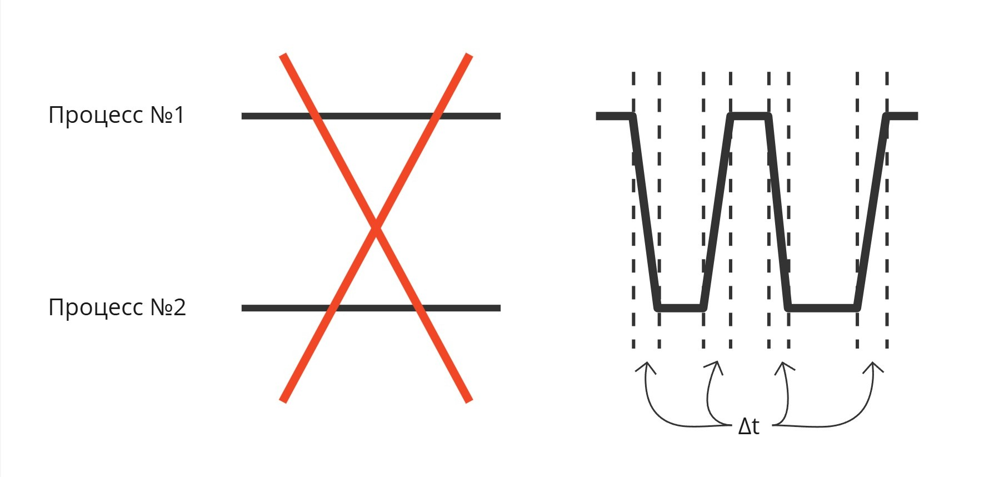
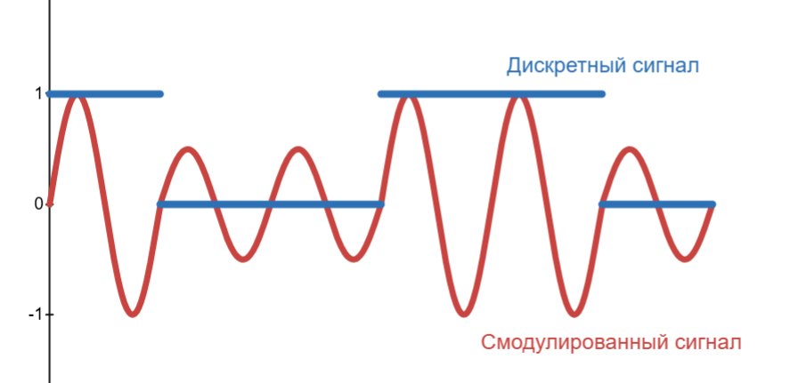

## Лекция 2. Мультипрограммность

### Мультипрограммные операционные системы

Дальше появляется потребность больше чем в одной программе в вычислительной машине. Давайте расположим все программы последовательно в оперативной памяти

_Первая проблема_, которая возникает - распределение процессорного времени. Даже с увеличением количества ядер конкуренция процессов не уменьшается

Если мы хотим переключить одну программу на другую, то как минимум нам нужно научиться сохранять регистровый контекст. Если просто изменить регистр IP, то логика программы сломается

Тогда выделим в памяти диспетчера массив, в котором будем хранить регистровый контекст. Такое переключение процессов называется диспетчеризацией

Но как решать, когда нужно переключать диспетчеризацию?

Первым решением стала _кооперативная многозадачность_. Ее идея заключалась во вставке между инструкциями программ инструкцию вызова диспетчера, который дальше решает, какой процесс заслуживает внимание

Но программы имеет свойство ветвиться и зацикливаться, поэтому не явно, когда вызывать диспетчеризацию так, чтобы она вызывалась периодически по времени. Более того - можно добиться того, что диспетчер не будет вызываться, поэтому от кооперативной многозадачности отказались

Вторым решением стало аппаратное внедрение таймера к процессору, который прерывает процессор и вызывает диспетчер, чтобы изменить выполняющуюся программу, так называемая _вытесняющая многозадачность_

Надо понимать, что процессы не выполняются параллельно. Какое-то процессорное время отводится одному процессу, какое-то другому. Часть времени уходит на переключение между ним (сохранение регистрового контекста, загрузка регистрового контекста другого процесса)

<!-- Появляется проблема, как именно переключать процессы и как делить процессорное время -->

_Вторая проблема_: как делить оперативную память между процессами. Решением до сих пор является виртуальная память

> **Виртуальная память** - абстракция, позволяющая при создании или компиляции программы отсчитывать адреса от виртуального нуля, а при запуске или исполнении заменять их на физические

В общем смысле виртуальная память - это таблица, в которой указатели из виртуального адресного пространства соотносятся к указателям на физическую память. Создание такой таблички - нетривиальная задача (о ней рассказано в [лекции 13](https://pelmesh619.github.io/itmo_conspects/opersys/opersys_superconspect.html#%D0%BB%D0%B5%D0%BA%D1%86%D0%B8%D1%8F-13.-%D0%BC%D0%B5%D1%82%D0%BE%D0%B4%D1%8B-%D0%B2%D1%8B%D0%B4%D0%B5%D0%BB%D0%B5%D0%BD%D0%B8%D1%8F-%D0%BF%D0%B0%D0%BC%D1%8F%D1%82%D0%B8))

_Третьей проблемой_ стала проблема защиты памяти

Заметим, что в нашей абстракции программы могут повлиять друг на друга (изменить данные или инструкцию по адресу) случайно или намеренно. Поэтому надо сделать так, чтобы программа не могла лезть в чужую область памяти. Защита памяти реализуется аппаратно и частично связано с созданием виртуальной памяти

В нашей системе диспетчер знает, какой процесс активен и сколько выделено ему памяти, поэтому при поступлении запроса к доступу к чужому куску памяти вызывает диспетчер, который способен подать сигнал прерывания "нарушение доступа" (Access Violation) наглому процессу

Но тогда ломается линковка - подпрограммы не могут узнать свои параметры. Поэтому создается костыль - привилегированный режим

> **Привилегированный режим** - режим исполнения кода, при котором игнорируется защита памяти

Теперь при вызове подпрограммы происходит это:

* Исходная программа кладет в свой стек номер подпрограммы и аргументы для нее
* Вызывается инструкция, при выполнении которой исполнение передается диспетчеру, память уходит в привилегированный режим
* Диспетчер достает из стека значения и кладет в стек подпрограммы
* После выполнения подпрограммы диспетчер кладет возвращенное значение в стек исходной программы

Теперь диспетчер будем называть _ядром_. В данном случае ядро является посредником данных между программами. А инструкция, которая передало управление ядру, называется системный вызовом

> **Системный вызов** (system call, syscall) - обращение пользовательской программы к ядру операционной системы
с просьбой выполнить привилегированную операцию или предоставить некоторый системный ресурс

_Четвертая проблема_ - задача планирования ресурсов. Представим супермаркет, в котором кассы стоят возле каждого отдела. У каждого покупателя есть строгий путь, проходящий через отделы

Перед планировщиком стоит задача оптимально расставить этих покупателей, чтобы они вышли из магазина довольными за оптимальное время. Такая задача перестановки по сути является системой дифференциальных уравнений, аналитически которую решить нам не представляется возможным

_Пятая проблема_ - универсальный доступ к хранилищу

Существует потребность доступа данных на хранилище ко многим процессам. В это время появляется концепция файло-каталожной системы: файлы (набор байтов) и каталоги (набор файлов и каталогов)

Ядро регулирует доступом к файлам в хранилище, следовательно, может ставить блокировки на изменение/чтение файлов для других процессов в случае, если какой-то процесс открыл этот файл

_Шестая проблема_ - обеспечение коммуникации между программами

Из-за защиты памяти программы могут общаться только через ядро. Если обе программы попробуют одновременно что-то напечатать на принтере, то на выходе выйдет белиберда. Поэтому ядро должно регулировать использование ресурсов компьютера

В этот момент появился термин операционной системы. Заметим, что каждая программа в нашем компьютере имеет свою область виртуальной памяти, свое хранилище в виде открытого файла, свое процессорное время. Абстракции для каждой программы создали виртуальную машину вокруг них, которые уже работают наподобие простейшей машины фон Неймана. А операционная система занимается оркестрацией этих виртуальных машин

В 1963 году был создан суперкомпьютер B5000, в которой присутствовала операционная система MCP (Main Control Program)

Начинается 3 этап развития - сетевые операционные системы

### Сетевые операционные системы

В 1960-ых компьютеры стояли дорого и требовали дорогого обслуживания. В то время нанимали программиста из другого города, тот писал код на бумажке, приезжал к компьютеру, передавал бумажку, код с которой переписывали лаборанты на перфокарты

Тут появилась концепция удаленной связи. В Америке 60-ых была очень развита телефонная связь. Конечно же, код могли передавать при помощи голоса, но это было медленно. Поэтому пришли к модуляции сигнала - изменении параметров несущего сигнала при помощи сигнала, который мы хотим передать

Пример: наш сигнал - это 100110, а несущий сигнал - это синусоида. Тогда мы можем изменить амплитуду синусоиды так, что бы она совпадала с аплитудой нашего сигнала:

Здесь 1 верхний пик - это 1 бит, однако для надежности можно сделать, например, 4 пика на 1 бит. Такая модуляция называется амплитудной (Amplitude Modulation, AM)

Другой вариант - менять частоту при постоянной амплитуде. Получаем частотную модуляцию (Frequency Modulation, FM):

Появилось устройство, которое подключается к телефону, модулирует сигнал, передает по телефонной линии, где на другом конце такое же устройство его демодулировало в сигнал, понятный процессору. Такое устройство получило название _модем_. Через модемы подключались удаленные экраны и клавиатуры

Но если параллельно подключаются к компьютеру много программистов, как распределять процессорное время им. Появляется понятие учетной записи и логина

Через модемы компьютеры могли общаться между собой, создавая кластеры

---

Четвертым этапом стало появление универсальных операционных систем

При проектировании компьютера стандартов архитектур не было, поэтому архитектура и операционная система
создавалась уникально для каждого компьютера. Инструкции для компьютеров также писались индивидуально

Надо было абстрагировать код для использования на других компьютерах. Эту проблему решили в AT&T
