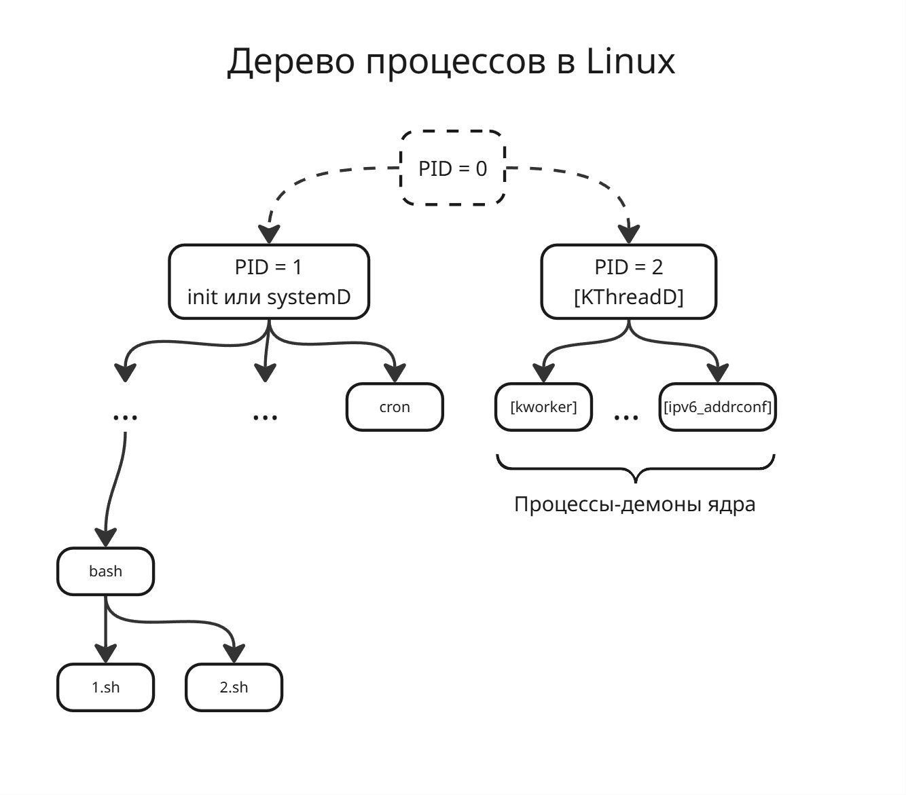

## Лекция 7. Процессы

Основная задача операционной системы - управление пользовательского программного обеспечения

> Процесс (Process) - совокупность набора исполняемых команд, ассоциированных с ним ресурсов и контекста исполнения, находящиеся под управлением операционной системы

Несмотря на то, что мы можем запустить какую-то программу несколько раз одновременно, считаться одним процессом они не будут. Они используют разные ресурсы - память, сетевые порты и другое, а также контекст исполнения (стек памяти в пространстве ядра, обработчики сигналов, регистровый контекст и так далее)

Процесс находится _исключительно_ под управлением операционной системы. Можно всего лишь переопределить приоритет процесса, чтобы на его исполнения уходило больше процессорного времени

С развитием многоядерных процессоров появилось понятие потока

> Поток (Thread) - набор исполняемых команд и контекста исполнения, разделяющий общие ресурсы с другими потоками этого процесса и находящийся под управления операционной системы

Исполнение потоков регулируется механизмами вытесняющей многозадачности

По факту процесс в Linux является потоком, а процесс - контейнером ресурсов

В этой ситуации возникает вопрос, как же соблюдать целостность данных? Мы изолировали процессы, чтобы они не могли влиять друг на друга, а теперь мы сделали потоки, разделяющие одну память внутри процесса. Также возникает проблема синхронизации потоков, для решения которой появились такие инструменты ОС, как мьютексы и семафоры

Со временем появилось понятие легковесного потока

> Легковесный поток (Flyweight Thread или Fiber) - набор исполняемых команд в контексте управления некоторого потока

Операционная система обычно ничего не знает про легковесный поток, они для ОС прозрачны. Чаще всего они являются инструментом языка программирования

После этого появляется понятие задания/контрольной группы. Они задают ограничения ресурсов для группы процессов 

> Объект задания (Job) в Windows - именуемый, защищаемый, совместно используемый объект, управляющий атрибутами процессов, связанных с ними (например, размер рабочего набора и приоритет процесса или завершение всех процессов, связанных с заданием) ([\*тык\*](https://learn.microsoft.com/ru-ru/windows/win32/procthread/job-objects))

> Контрольная группа (cgroup) в Linux - группа процессов, для которой механизмами ядра наложена изоляция и установлены ограничения на некоторые вычислительные ресурсы ([\*тык\*](https://ru.wikipedia.org/wiki/%D0%9A%D0%BE%D0%BD%D1%82%D1%80%D0%BE%D0%BB%D1%8C%D0%BD%D0%B0%D1%8F_%D0%B3%D1%80%D1%83%D0%BF%D0%BF%D0%B0_(Linux)))

Что должна уметь подсистема управления процессов:

* Создать процесс
* Обеспечить ресурсами
* Изолировать друг от друга
* Планировать
* Диспетчеризовать
* Синхронизировать
* Завершить

---

Процесс с точки зрения операционной системы - структура данных. В Linux данные о процессах хранятся в статичном массиве

Также процесс должен порождаться другим процессом. В Linux процессы образуют дерево процессов, на самом деле даже два. В одном дереве корень - это процесс с PID = 1, а второе - PID = 2

Второй процесс - это так называемый `[KThreadD]`, от Kernel Thread Daemon. Это демон (фоновый процесс, общение с которым возможно через сигналы или сокеты), от которого порождаются потоки ядра

Первый процесс - это процесс `init` или `systemD`. От первого процесса порождаются все другие процессы

Сами первый и второй процессы являются детьми процесса с PID = 0, но по факту такого процесса не существует

В Linux процессы порождаются клонированием через системные вызовы `fork` и `exec*`:

* `fork` копирует все данные процесса, в том числе обработчики сигналов, адресное пространство памяти и так далее. 

    Из-за этого созданный процесс не может получить больше прав, чем его родителем

* `exec*` заменяет код родительской программы на нужный код программы

    На самом деле `exec*` - семейство системных вызовов ([\*тык\*](https://www.man7.org/linux/man-pages/man3/exec.3.html)), которые получает разный формат параметров

Очевидно, что пространство процесса может быть огромным. При этом мы тратим время на копирования данных, которые могут и не пригодится. Поэтому используется copy-on-demand (копирование по требованию): страницы из пространства памяти родителя становится доступным только для чтения, а когда какой-либо процесс хочет изменить их, то страничка памяти копируется

Зачем же операционная система хранит процессы в виде дерева? Дело в том, что если программа завершается неудачно (то есть с ненулевым кодом выхода), то какой-то процесс должен это обработать. Поэтому при завершении дочернего процесса родительский процесс получает сигнал `SIGCHILD`. После этого родитель должен при помощи системного вызова получить код выхода. Далее данные об умершем процессе удаляются из таблицы процессов

Ядро получит прерывание от процессора, ядро поймет, какой процесс вызвал это прерывание. Ядро отправит связанный с ошибкой сигнал этому процессу. Обработчик сигнала этого процесса по умолчанию убивает процесс, но можно его переопределить так, чтобы он, например, перед этим выгружал дамп памяти

Но что, если родитель завершает свою работу, когда его ребенок живой? Тогда процесс становится осиротевшим - его родителем теперь становится `init`/`systemD`

Но если родитель не может прочитать код выхода своего ребенка (например, если он приостановлен), то ребенок становится зомби-процессом. Зомби-процессы опасны тем, что занимают строчку в таблице процессов, а ее размер ограничен (в Linux 2^16). Если зомби-процессы заполонили все свободные места, то случается так называемый зомби-апокалипсис - состояние, когда зомби-процессов настолько много, что нельзя создать новый 

Системный вызов `clone` позволяет создавать новый поток. `clone` принимает вектор параметров, который определяет, что общего должны иметь родитель и ребенок. Также `clone` позволяет создавать сестринские потоки - то есть ребенок наследуется не от родителя, а от родителя родителя

В Windows вместо клонирования диспетчер процессов создает новые процессы. Для создания нового процесса старый процесс просит диспетчер создать новый. Диспетчер создает новый процесс и возвращает старому вектор атрибутов процесса, включая PID. При этом на старом процессе лежит ответственность за наблюдением новом (в частности, обработка за кодом выхода). Однако в Windows процессы все также можно представить в виде дерева. Также в Windows возможно переопределить родителя для процесса (в том числе сделать родителей поток какого-либо другого процесса)

