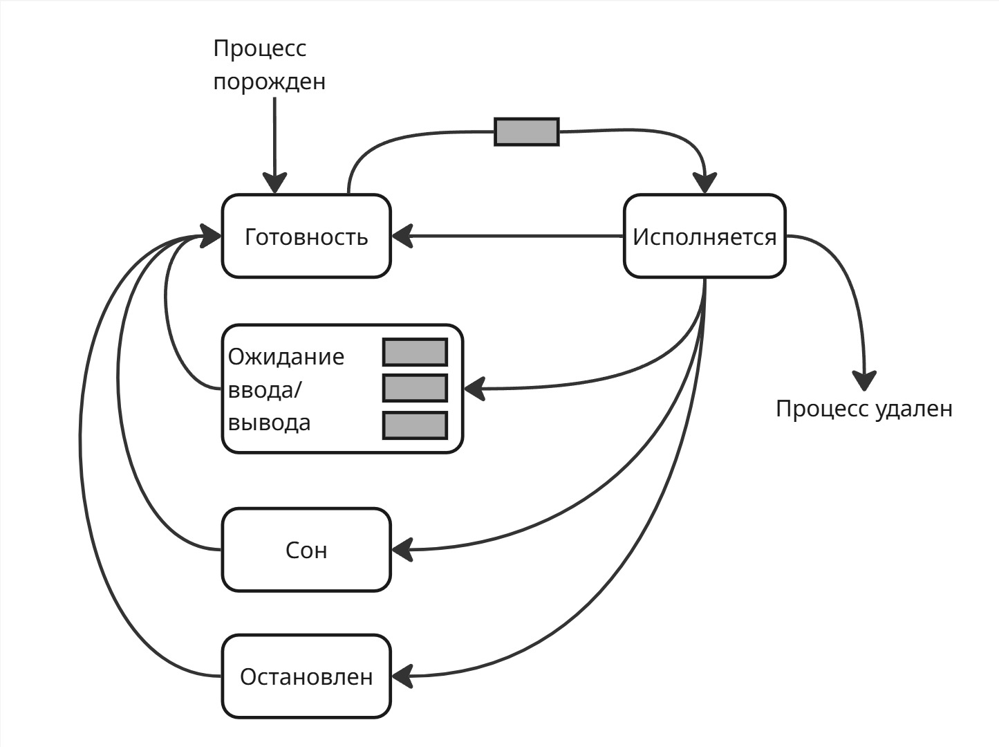

## Лекция 8. Управление процессами

Важно понимать, что так как количество потоков у процессора ограничено десятками, а процессов в операционной системе может быть тысячи, то в ожидании находится большинство процессов, а исполняются только малое количество.

Тогда можем сразу выделить два состояния процесса: "**ожидание**" и "**исполнение**"

В ожидание процесс может попасть из-за вытеснения или для ожидания потока ввода/вывода. Чтобы выйти из ожидания, процессы стоят в очереди, пока их не выберет диспетчер. Тогда конечный автомат состояний может выглядеть так:

Такая модель получила название двухуровневой (Two-State Process Model)

Однако если процесс ждет какого-то ввода и стал первым в очереди, то в состоянии исполнения он не сможет выполняться и уйдет опять в ожидание

Поэтому состояние ожидание разделилось на "**готовность**" (Ready или Runnable) и "**ожидание ввода/вывода**" (Wait) 

В переходе из "готовности" в "исполнение" есть одна очередь, а из "ожидания ввода/вывода" несколько очередей для разных устройств ввода/вывода. Из "ожидания ввода/вывода" процесс переходит в готовность

Такая трехуровневая система (Three-State Process Model) реализована в каждой операционной системе. Заметим, что операционная система не может инициализировать дальнейшую работу процесса, который ждет ввод/вывод, иначе сломается поток управления. Поэтому "ожидание ввода/вывода" называют непрерываемым сном (Disk Sleep или Uninterruptible Sleep)

Со временем появились процессы-демоны, такие как веб-приложения. Веб-приложение обычно ничего полезного не делают, пока к ним не придет запрос от пользователя. Поэтому они могут находится в отдельном состоянии, чтобы каждый раз не дергаться между "готовностью" и "исполнением"

Для этого сделали новое состояние - "**сон**" (или прерываемый сон, Interruptible Sleep)

Когда создавался процесс с веб-сервером, операционная система дала ему сокет с сетевым портом. Когда приходит пакет, операционная система вначале обрабатывает заголовок пакет, спрашивает брандмауер, а после этого узнает, какому процессу принадлежит порт, по которому пришел пакет, посылает сигнал процессу, который выводит его из сна. После обработки пакета процесс уходит обратно в сон

После этого появилось состояние "**остановлен**". В него попадают процессы, которые получили сигнал `SIGSTOP` (этот сигнал, наряду с `SIGKILL`, является сигналом, для которого нельзя переопределить обработчик)

Из состояния "остановлен" можно выйти только при сигнале `SIGCONT` в готовность. Запущенный в терминале процесс можно перевести в остановленное состояние, если нажать Ctrl+Z

Зачем он нужен? Например, если транзакции (создающие процессы), блокирующие некоторые данные, вошли в кольцевую зависимость, то другие транзакции могут из-за них тоже заблокироваться. В этом случае можно остановить процесс с транзакцией, чтобы другие начали работать

Также нам нужно состояние для завершения процесса. В Unix и Unix-like любой процесс перед завершением переходит в "**зомби-состояние**" (Zombie). В Windows он переходит в состояние "**завершение**" (Terminated), в ходе которого операционная система высвобождает ресурсы процесса

Также появилось состояние "**исключение**". В состояние "исключение" попадает процесс при поимки исключения. Из него процесс может перейти в "готовность" - операционная система дает ему второй шанс. Если после нескольких переходов процесс не исправился, то он завершается. 

Все выше указанные состояния используются для диспетчеризации процессов

Для планирования процессов в операционных системах используют 4 уровня планирования:

* Краткосрочное
* Среднесрочное
* Долгосрочное
* Планирование очередей ввода и вывода

_Краткосрочный_ уровень используется прямо в диспетчеризации процессов. В нем задача - выбрать следующий для исполнений процесс (то есть определить, что делать в следующую ~1 мс)

Уровень _очередей ввода и вывода_ используется для планирования процессов внутри состояния "ожидания ввода/вывода"

Для _среднесрочного_ уровня добавляются два состояния "**готовность вне RAM**" и "**ожидание ввода/вывода вне RAM**" (также их называют Suspended and Ready, Suspended and Waiting, Swapped out and Ready, Swapped out and Waiting)

Если у процесса низкий приоритет и из "готовности" он доберется в "исполнение" через долгое время (порядка минут), то его целесообразнее перенести в файл подкачки. Таким образом, освобождается память для более быстрых процессов. Также до и после состояний "готовность вне RAM" и "ожидание ввода/вывода вне RAM" стоят синхронизированные очереди процессов

Для _долгосрочного_ планирования добавляется состояние "**рождение**" (New или Initialized). В переходе из состояния "рождение" в состояние "готовность" есть очередь из процессов. Состояние "рождение" играет роль очереди перед прибором - оно делает поток поступающих процессов разреженный, таким образом, делая нагрузку более равномерной

Пятерку "готовность", "исполнение", "ожидание", "рождение", "завершение" называют пятиуровневой моделью (Five-State Process Model)

Помимо них, в Windows используются состояния Standby (в нем процессы непосредственно перед исполнением) и Transition (в нем процессы, стек ядра которых были выгружены из памяти), а состояние Wait является более обширным понятием 

---

Теперь нужно разобраться, какие процессы пропускать вперед по очереди, а какие нет. Для того, чтобы измерять эффективность процесса, введем три показателя:

* Полное время исполнения (от рождения до завершения) в среднем
* Среднее время ожидания (сколько времени процесс не является продуктивным)
* Время отклика (за какой промежуток времени можно получить результат операции)

