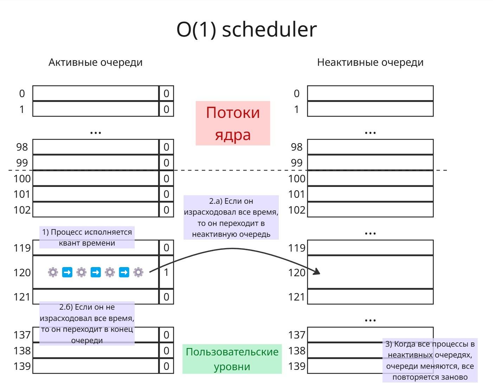

## Лекция 10. Планировщики в Windows и Linux

4 требования, которые должен соблюдать планировщик:

* Поддержка внешних приоритетов
* Соблюдался критерий эффективности: процессор в ходе работы не простаивался, использование многоядерности
* Минимизирование накладные расходы на работу планировщика
* Избегание тупиков

Например: процесс во второй очереди использует ресурс R, появляется процесс в первой очереди, который начинает исполнятся и хочет ресурс R. Процесс во второй очереди не выполняется, потому что есть процесс в первой очереди, а процесс в первой очереди не выполняется, потому что ждет освобождение ресурса R

Разберем планировщики в операционных системах Windows и Linux

В классической модели Windows есть 32 очереди - с 0-ой по 31-ую

В 0-ой очереди живет системный процесс (Zero Page Thread), который ищет ненужные после работы процессов страницы памяти и заменяет байты на них нулями. Сделано это для безопасности, чтобы другие процессы не могли украсть данные старых процессов

Пользовательские процессы обитают в очередях с 1-ой по 15-ую. Процессы "реального времени" обитают в очередях с 16-ого по 31-ую - сейчас там работают процессы ядра, работа которых критически важна для ОС

Есть классы приоритетов процессов, их 6:

1. Реального времени (Realtime) - `24`
2. Высокий (High) - `13`
3. Выше среднего (Above normal) - `10`
4. Обычный (Normal) - `8`
5. Ниже среднего (Below Normal) - `6`
6. Низкий (Idle) - `4`

При присвоении класса приоритета процесс переводится в очередь с соответствующим номером. Приоритет процесса можно изменить, однако крайне не рекомендуется повышать приоритет пользовательского процесса до приоритета реального времени - таким образом, процесс может вызвать голодание процессов ядра

Кроме этого есть уровни насыщения потоков: 

* Time Critical - `+15`
* Highest - `+2`
* Above normal - `+1`
* Normal - `+0`
* Below Normal - `-1`
* Lowest - `-2`
* Idle - `-15`

С помощью них можно регулировать очередь одного потока внутри процесса, чтобы добиваться синхронизации потоков. Однако уровни насыщения не позволяют выйти пользовательским процессам в зону процессов реального времени и наоборот

Внутри каждой очереди работает алгоритм Round Robin с 12 тиками таймера

В Windows интерактивные процессы получают на 12 тиков таймера повышение приоритета в зависимости от действия (например, работа с клавиатурой, вывод аудио) - это позволяет сделать программы, работающие с пользователем, плавнее и быстрее

Если процесс 4 секунды находится в состоянии "готовность", то он сразу переводится в 15 очередь, и ему дается 2 раза по 12 тиков в Round Robin - таким образом, решается проблема голодающих процессов

---

За всю историю в Linux было множество планировщиков процессов. В версиях ядра с 2.4 до 2.6 был планировщик "O(n) scheduler", который требовал больше времени в зависимости от количества процессов. Далее Инго Молнар для версии ядра 2.6 написал планировщик "O(1) scheduler"

Работал он так: есть 140 очередей для процессов. Первые 100 очередей - очереди процессов "реального времени" (потоки ядра). Грубо говоря, в каждой очереди обитает один поток ядра. Последние 40 очередей - для пользовательских процессов с разными значениями nice

Также есть 140 "неактивных" очередей

В каждой очереди работает First-Come First-Served. Для каждой очереди храним бит, обозначающий, есть ли в этой очереди процесс. Внутри очереди процессы образуют связный список

Процессор найдет первую очередь, для которой бит равен 1. Далее ему дается квант времени на исполнение
Если процесс не израсходует свой квант времени (то есть ушел в ожидание), то он возвращается в эту же очередь в конец, и когда до него дойдет очередь, он будет иметь для исполнении оставшееся время

Если процесс израсходовал квант времени, то он после исполнения переходит в неактивную очередь. 

Как только все процессы попали в неактивные очереди, очереди меняются местами

При попадании процесса в неактивную очередь для него вычисляется коэффициент интерактивности. Далее при переключении очередей планировщик может изменить приоритет процессов, исходя из этих коэффициентов

Если процесс в ходе работы имеет высокий приоритет и является интерактивным, то он может после исполнения в течение кванта перейти в конец активной очередь вместо того, что бы попасть в неактивную

Однако, процесс под конец своего кванта может создать потомка - он готовым перейдет в ту же очередь, что и родитель. Таким образом, можно злоупотреблять системой. Поэтому при рождении нового процесса, родитель и потомок делят оставшийся квант времени пополам

Далее Молнаром был создан Completely Fair Scheduler (Полностью справедливый планировщик)

В нем у каждого процесса есть 2 параметра: 

* "execution time" - время исполнения процесса
* "max execution time" - время исполнения процесса, если бы ему не пришлось ждать других процессов (по сути время ожидания, деленное на количество процессов)

"execution time" растет, когда процесс исполняется, а "max execution time" растет, когда процесс ждет в состоянии "готовность"

Cделаем очередь, которая будет упорядочена по "execution time". Очередь эта реализована в виде красно-черного дерева - таким образом, самый левый узел будет с наименьшим "execution time". Тогда:

1. Выбираем самый левый узел-процесс
2. Даем ему исполнятся, пока время его исполнения не достигнет "max execution time"
3. Процесс вставляется в дерево
4. Цикл запускается заново

Приоритеты реализованы так: для процессов с высоким приоритетом "max execution time" добавляется условно в 10 раз больше, чем по факту, а для процессов с низким - в 10 раз меньше

Больше про CFS: [https://developer.ibm.com/tutorials/l-completely-fair-scheduler/](https://developer.ibm.com/tutorials/l-completely-fair-scheduler/)
