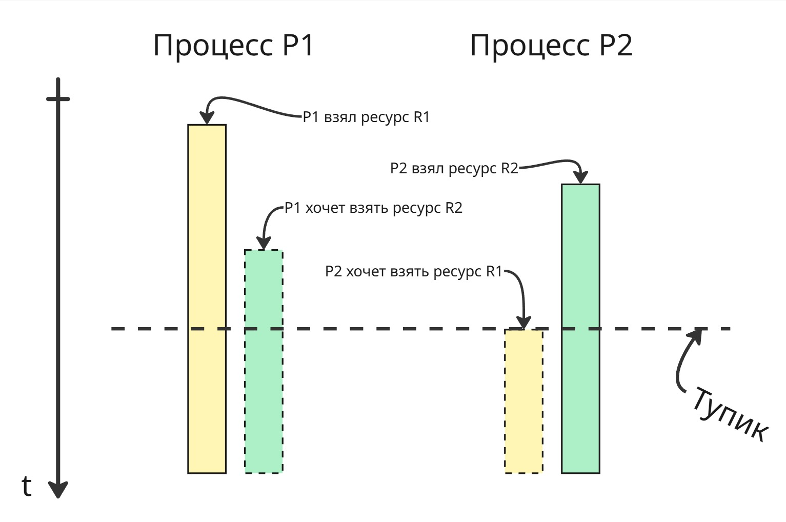
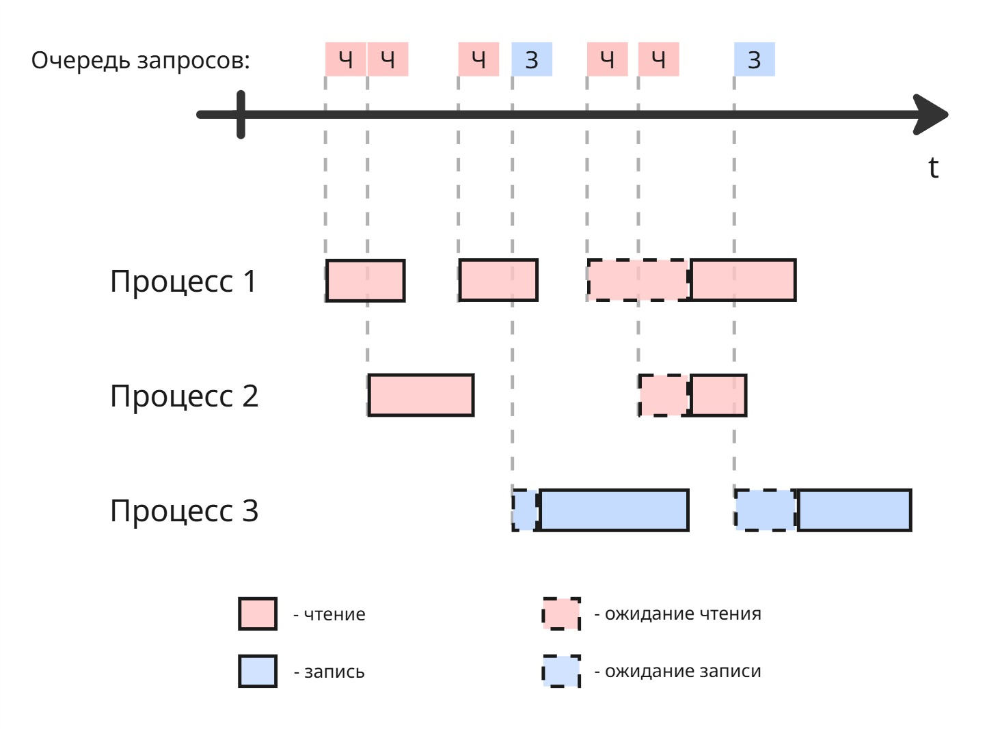

## Лекция 12. Синхронизация процессов, часть 2

### Тупик

> Множество процессов находится в _тупиковой_ ситуации, если каждый процесс из этого множества ожидает события, который может вызвать только другой процесс этого множества

Пример: на картинке

* процесс P1 взял ресурс R1
* процесс P2 взял ресурс R2
* процесс P1 хочет взять ресурс R2, поэтому сидит и ждет, пока он освободится
* процесс P2 хочет взять ресурс R1, поэтому тоже сидит и ждет, пока очухается P1

Сам тупик возник, когда процесс P2 хочет взять ресурс, занятый другим процессом, который ожидает ресурс, занятый процессом P2

Единственное место, где мы можем предотвратить тупик - место, где процесс P2 занимает ресурс R2. Но мы не можем предсказать, понадобится ли процессу P1 ресурс R2. После изобретения семафоров Дейкстра понял, что ими тупиковую ситуацию не решить. После этого он сформулировал [задачу об обедающих философов](https://ru.wikipedia.org/wiki/%D0%97%D0%B0%D0%B4%D0%B0%D1%87%D0%B0_%D0%BE%D0%B1_%D0%BE%D0%B1%D0%B5%D0%B4%D0%B0%D1%8E%D1%89%D0%B8%D1%85_%D1%84%D0%B8%D0%BB%D0%BE%D1%81%D0%BE%D1%84%D0%B0%D1%85). Звучит она так:

Есть круглый стол, вокруг этого стола сидят 5 философов. Перед каждым философом есть тарелка с бесконечным запасом спагетти, которые надо есть только двумя вилками. Всего есть 5 вилок, и они расположены между тарелками

У философов есть 3 последовательных состояния: размышление, голодание (в ходе которого ему нужно заполучить 2 вилки) и процесс принятия пищи. Философ принимает пищу тогда и только тогда, когда успел захватить 2 вилки, окружающие его тарелку

Если алгоритм для философа будет таким:

1. Голодать, пока занята левая вилка. Если она свободна, то взять ее
2. Голодать, пока занята правая вилка. Если она свободна, то взять ее
3. Есть
4. Положить левую вилку
5. Положить правую вилку
6. Размышлять

то все они могут одновременно взять левую вилку и войти в тупик. Такой тупик получил название "[взаимная блокировка](https://ru.wikipedia.org/wiki/%D0%92%D0%B7%D0%B0%D0%B8%D0%BC%D0%BD%D0%B0%D1%8F_%D0%B1%D0%BB%D0%BE%D0%BA%D0%B8%D1%80%D0%BE%D0%B2%D0%BA%D0%B0)" (или же deadlock)

Если в алгоритм изменить пункт 2:

2. Попробовать взять правую вилку. Если не удалось взять правую, то вернуть левую, перейти в пункт 1

то при одновременном взятии левых вилок случится динамическая взаимоблокировка (или livelock) - философы совершают действия, однако прогресс не растет

Тогда можно подождать перед повторным взятием левой вилки. Промежуток ожидания может быть случайным - это, конечно, уменьшит вероятность попадания тупика, однако это не даст полных гарантий

Относительно простым решением является добавление официанта в систему: он следит за вилками, просит подождать философов, когда они начинают голодать, и выдает вилки

Через некоторое время после Дейкстры исследователи Эдвард Коффман, Мелани Элфик и Ари Шошани выпустили [статью](https://dl.acm.org/doi/pdf/10.1145/356586.356588), в которой определили, что тупик возникает тогда и только тогда, когда выполняются все 4 условия (так называемые условия Коффмана):

1. Взаимная блокировка ("_Mutual Exclusion_") - каждый ресурс в данный момент времени или отдан ровно одному процессу, или доступен
2. Удержание и ожидание ("_Hold and Wait_" или "_Wait for_") - процесс, удерживая ресурс, может запрашивать и ожидать другой ресурс
3. Неперераспределяемость (или Отсутствие принудительной выгрузки ресурса, "_No preemption_") - только сам процесс может отдать ресурс, нельзя принудительно его забрать
4. Кольцевое ожидание (или Циклическое ожидание, "_Circular Wait_") - существует кольцевая цепь процессов, в которой каждый процесс ожидает ресурс, заблокированный следующим процессом в этой цепи

---

Методы борьбы с тупиками:

1. Обнаружение тупика

    Попытка обнаружить тупик до его появления кажется невыполнимой. Можно создать модель, которая априорно на основе статистики обнаруживает вероятные места появления тупиков, однако это не даст полных гарантий

    Можно попытаться через некоторое время ожидать, что некоторые процессы находятся в ожидании некого ресурса длительное время

    Даже если мы найдем какой-то процесс, создавший тупик, его нельзя просто-напросто убить

2. Предотвращение тупиков

    Общего решения предотвращения тупиков нет, но есть множество частных. Чтобы возник тупик, должны выполняться все 4 условия, значит, мы можем нарушить всего лишь одно какое-либо из них

    * Управляемая очередь - нарушение взаимной блокировки

        Множество ресурсов не являются очень интерактивными, например, принтер. Поэтому можно сделать очередь запросов перед принтером. Работать она будет так:

        * Один процесс, например, Microsoft Word, послал запрос на печать документа
        * Этот документ срендерился и отправился в очередь
        * Далее, другой процесс, например, Фотографии, послал запрос на печать фотографии
        * Несмотря на то, что принтер занят документом, фотография отправился в очередь
        * В конце принтер распечатал последовательно документ и фотографию

        Таким образом, 2 процесса смогли воспользоваться одним ресурсов в одно время. Такой подход получил название [спулинг](https://en.wikipedia.org/wiki/Spooling)

    * Блокировка всех ресурсов - нарушение удержания и ожидания

        Другим методом можно заставлять процесс делать блокировки всех ему нужных ресурсов перед их использованием, например, с помощью двухфазного блокирования:

        * Процесс просит заблокировать все нужные ему ресурсы
        * Если какой-то из них был уже заблокирован, то процесс снимает свои блокировки, ждет какое-то время и пытается заново

        Однако

        * нельзя точно знать, какие ресурсы понадобятся процессу
        * ресурсы простаивают, пока находятся в блокировке, а процесс им не пользуется

    * Принудительное освобождение ресурсов - нарушение неперераспределяемости

        Можно сделать так, что бы ОС могла переводить процесс в состояние сна и отбирать у него ресурсы, необходимые для разрешения тупика, и направить их нуждающемуся процессу. Однако в зависимости от характера ресурса это может привести к нецелостности данных

    * Нумерация ресурсов - нарушение кольцевого ожидания

        Нарушить кольцевое ожидание легко - можно запретить процессу брать больше одного ресурса. Но такое решение очень ограничивает систему

        Можно пронумеровать все ресурсы и сделать правило: процессу разрешается заблокировать ресурс только с теми номерами, которые больше максимального номера захваченного процессом ресурса. Правило нумерации или взятия ресурса могут быть другими

        Далее ресурсы через некоторое время можно перенумеровать, чтобы избежать голодания

        В реальных системах ресурсов столь много, что систематизировать их и предусмотреть все варианты не представляется возможным

3. Игнорирование тупиков

    Самое простое решение - это проигнорировать тупик. Вполне вероятно, что тупик может разрешиться со временем. Или же, как сделано в Windows, предлагать пользователю принудительно закрыть зависший процесс

### Голодание

Голодание - неограниченно долгое ожидание процесса какого-то ресурса

Допустим, у нас есть файл. Для него есть операции чтения и записи. Мы не можем делать несколько операций записи подряд - возникает проблема потерянного обновления, нарушение целостности. Но мы можем делать несколько чтений одновременно. Тогда может сложиться такая картина:

Процесс 3 ждет, пока процессы 1 и 2 закончат чтение файла. Но процессы 1 и 2 начинают чтение до того, как пройдет ожидание процесса 3. В этом случае процесс 3 голодает

Решением может быть созданием очереди. Если в нем мы встречаем несколько последовательных запросов на чтение, то их разрешаем делать параллельно:

Можно сделать 2 очереди. Если в очереди чтения запрос выполняется больше заданного промежутка времени, то даем выполниться запросу из другой очереди

### Выделение памяти

По мере развития компьютерной техники появились следующие типы памяти:

| Память | Размер | Время доступа к данным |
|--------|--------|----------|
| Регистры процессора | Байты | 0.1 нс |
| Кеш L1 | Килобайты | 0.5 нс |
| Кеш L2 | Мегабайты | 5 нс |
| ... | ... | ... |
| RAM | Гигабайты | 50 нс |
| HDD | Терабайты | 5 мс |

Создать большое хранилище с быстрой скоростью доступа физически невозможно. 
Поэтому возникает идея, чтобы то, что часто используется, лежало на уровне выше, а редко используемое - на уровне ниже. Возникают подходы кеширования данных и подкачки страниц на диск

С появлением мультипрограммности появилась также виртуальная память

При написании кода мы создаем переменные. Имена переменных представляют собой символьные адреса памяти. Далее транслятор при компиляции рассчитывает виртуальные адреса для символьных адресов

Для перевода из виртуального адрес в физический адрес используются перемещающий загрузчик и динамическое вычисление

**Перемещающий загрузчик** может при запуске исполняемого файла (а он знает, где лежат инструкции в памяти) заменить виртуальные адреса в памяти. Недостатки: если нужно переместить программу с другое место памяти будет сложно - надо будет перерасчитывать заново все адреса и изменять в программе

**Динамическое вычисление** работает так: при обращении по адресу виртуальный адрес заменяется на физический. Тогда нужно хранить где-то этот маппинг в памяти или правила вычисления адреса

Появились принципы управления памяти
