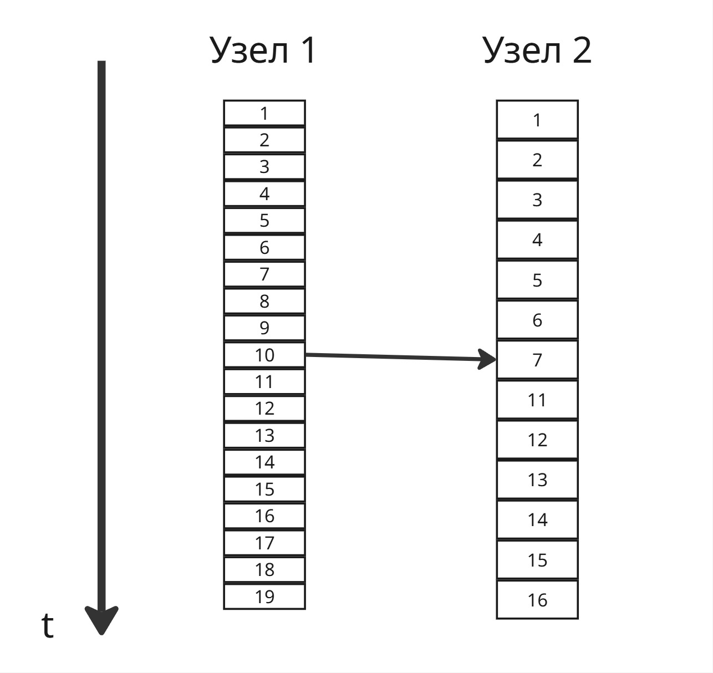
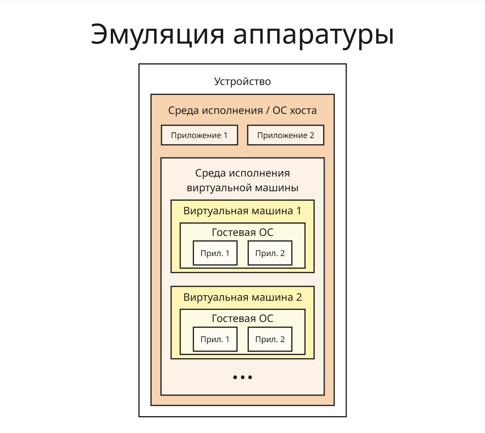
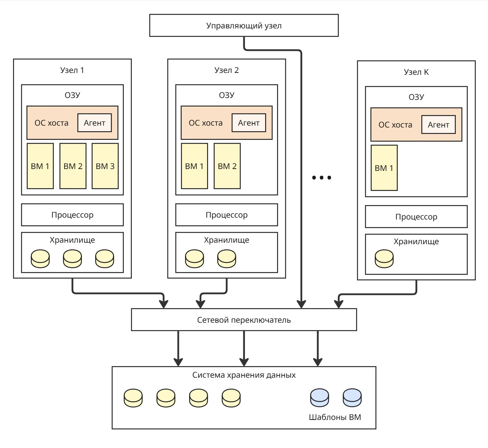

## Лекция 15. Распределенные операционные системы

Создание мощного вычислительного узла становится очень дорогой и сложной задачей. Поэтому становится актуальным создание распределенной операционной системы, которые решают 3 проблемы:

1. Естественные ограничения производительности вычислительного узла
2. Повышение надежности за счет дупликации
3. Поддержка географической распределенности

В распределенных системах отсутствует опора на центральный узел - таким образом, повышается надежность кластера. Из отсутствия центрального узла следует, что в системе нет централизованных компонентов (например, балансировщика), централизованных данных, централизованных алгоритмов, требующих полную информацию о системе

Узлы должны принимать решения на основе доступных ими локально данных, а выход из строя одного узла не должен препятствовать принятию решения

Распределенные ОС должны соблюдать эти принципы прозрачности:

1. Прозрачность расположения - не знаем, где расположен узел, в котором исполняется наш процесс
2. Прозрачность миграции - не знаем, какие данные мигрировали, их текущее местоположение
3. Прозрачность размножения - операционная система может делать копии ресурсов (например, потоков, страниц памяти), а процесс не должен знать, сколько их и с какими он работает прямо сейчас
4. Прозрачность параллелизма - процесс не знает, на каких узлах, в каких ядрах исполняются его потоки
5. Прозрачность конкуренции - процесс не знает, что он конкурирует с кем-то за ресурсы

Распределять процессорное время - очень легко, всего лишь нужно передать нужному узлу регистровый контекст. Однако просто переслать регистровый контекст недостаточно - нужно передать еще и страницы памяти, принадлежащие процессу

Поэтому нужно сделать механизм общей распределенной памяти - DSM (Distributed Shared Memory). Тут есть 4 подхода:

1. Использовать центральный сервер памяти

    При запросе в память происходит сетевой запрос в сервер памяти, который ищет, в каком узле находятся запрашиваемые данные, забирает их оттуда и возвращает исходному

    Никаких проблем с поиском, но нужно быстрое подключение. Также сервер памяти становится узким горлышком системы

2. Миграция страниц

    Если страницы вне границы ОЗУ узла (доступ к ним вызывает отказ страницы), узел посылает запрос на поиск этой страницы у других узлов, и происходит обмен страниц. Это справедливо для страниц, принадлежащих одному узлу

    Если страница общая для узлов, то надо обновить таблицу страниц в каждом узле, к тому же за нее могут бороться несколько узлов сразу. Такая проблема известна как трешинг; ее решение - сделать мораторий на перемещение страниц, однако возникает вопрос, насколько длительным он должен быть: если таймаут большой, то велика вероятность, что страница не будет использоваться, если маленький - то трешинг вернется

3. Размножение для чтения

    Если страница нужно только для чтения, то ее можно просто скопировать с одного узла на нужный узел

    Для этого можно отправить запрос страницы на соседний ближайший узел. Если у соседнего узла нет ее, то он отправляет запрос на другой узел - получается обход графа в ширину. 

    Правки внести в страницу тяжело - сложно соблюдать целостность данных в кластере, приходим к проблема из CAP-теоремы

4. Полное размножение

    В этом подходе при доступе к странице мы ее копируем себе на узел. Если мы хотим внести изменения в нее, то посылаем запрос другим узлам, содержащим эту страницу 

    При таком подходе мы верим, что подключение узлов обладает большой скоростью передачи данных и вероятность получения уже устаревших данных крайне мала. Однако тут возникает вопрос реальности времени: если мы получили два запроса на изменение страницы, то как определить, какой из них был последним, с учетом сетевой задержки. Сетевую задержку между узлами оценить очень трудно из-за сложности факторов, влияющих на нее, поэтому мы не сможем добиться идеальной синхронизации времени на узлах

    В 1978 этой проблемой занялся американский математик Лампорт. Он предложил перейти от астрономическому времени к логическому, которое определяется последовательностью событий

    Пусть у нас есть 2 узла, отсчитывающих время в тактах. Так как аппаратно они могут различаться, такты они подсчитывают с разной скоростью
    
    Заметим, что время приема сообщения не может быть раньше, чем посылка. Когда два узла должны синхронизироваться, один отправляет сообщение с временем посылки, второй помечает 

    Если пришло сообщение, в котором указано время посылки большее, чем на сервере приема, то сервер приема ставит время посылки сообщения, прибавленное на 1 тик

    Если пришло сообщение с меньшим временем посылки, то считаем, что все хорошо, и ничего не меняем, добавляем один тик

    Если узел отправил сообщение с временем посылки, совпадающим с временем прием, то можно каждому узлу прибавлять дробное число (так называемая приоритизация узлов)

    В этой системе часы узлов подгоняются под тот узел, у которого часы быстрее

    

---

Другой проблемой является хранилище памяти. В этом случае есть 2 подхода:

1. Модель загрузки/разгрузки: загрузка файла с узла на нужным нам узел
2. Удаленный доступ: перенаправление системного вызова доступа к файлу на узел, на котором он есть

Файл может:

1. Иметь составное имя, в котором будут присутствовать имя сервера, на котором лежит файл
2. Хранится в каталоге, являющемся точкой монтирования, чтобы упростить поиск

Однако в таком случае файлы должны быть равномерно распределены по узлам. Если востребованные файлы лежат на одном узле, то получается центральный узел, чего мы хотим избежать в распределенных системах

---

Сложности распределенных операционных систем привели к тому, что сейчас нет универсального решения

### Технологии виртуализации

Виртуализация (абстрагирование набора вычислительных ресурсов от аппаратное реализации) преследовала эти 5 целей:

1. Поддержка устаревших программ и операционных систем
2. Повышение отказоустойчивости и надежности путем изоляции процессов
3. Создание сред для тестирования и разработки ПО для специфичного АО
4. Консолидация серверов - возможность запуска серверов на одной вычислительной машине
5. Повышение управляемости и надежности сетевой архитектуры

Разберем несколько подходов виртуализации

1. Эмуляция аппаратуры

    Пусть у нас есть устройство (так называемый хост) с операционной системой на котором мы хотим запускать код, совместимый с другим устройством, на котором работает так называемая гостевая операционная система

    Зная архитектуру устройства и устройство работы гостевой ОС, мы можем сделать перевод инструкций кода (в том числе системные вызовы для гостевой ОС) в инструкции, которые работают на нашем устройстве и нашей ОС, таким образом, эмулируя аппаратное обеспечение. Эмулятор в таком случае работает на ОС хоста как обычный процесс, используя выделенную ему память для гостевой ОС и файл в памяти хоста для файловой системы гостевой ОС

    Преимущество такого подхода: зная, как работает аппаратура (или при помощи реверс-инжиниринга), можно добиться полной совместимости

    Недостаток: такая прослойка сильно снижает производительность

    

2. Полная виртуализация

    На устройстве стоит гипервизор (или менеджер виртуальных машин), который сам по себе является усеченной операционной системой. Через него запущена ОС хоста и сколько угодно гостевых ОС. Процессорное время и другие ресурсы между ними гипервизор распределяет через алгоритм Round Robin, а на ОС хоста стоит специальное приложение, которое управляет гостевыми ОС

    Все инструкции исполняться напрямую процессором. В этом случае гостевая ОС должна быть совместима с железом, поэтому пропадает надобность в слое эмуляции, что повышает производительность

    Все взаимодействия с памятью и другими ресурсами перенаправляются через гипервизор. Однако на гостевой ОС могут отсутствовать необходимые драйверы устройств. Гипервизор содержит базовые драйверы, однако, если какого-то нет, то он перенаправляет обработку действия к ОС хоста, на которой этот драйвер есть

    Проблема заключается в том, что гипервизор является прослойком между гостевыми ОС и ОС хоста для общения с устройствами

3. Паравиртуализация

    Для паравиртуализации изменяется ядро операционной системы так, что добавляется шина виртуальных машин (VM Bus). Эта шина представляет собой хранилище событий для общения гостевых ОС и ОС хоста, что позволяется миновать гипервизор

    Гостевая ОС должна уметь общаться через эту шину. Если она не поддерживает такую возможность, то общение происходит через гипервизор

    

4. Виртуализация уровня ядра ОС (Контейнеризация)

    Если процессы запускаются на одной операционной системе, то смысл держать ее код несколько раз в оперативной памяти для виртуальных машин

    Поэтому появляется идея создания контейнеров, в которых будут исполнятся приложения. Контейнер ограничивает пространство имен: процесс в контейнере не будет знать информацию о других процессах, его дерево процессов будет ограничено процессами контейнера, корнем которого будет процесс контейнера

    Контейнер определяет контрольную группу (cgroup, понятие из Linux; в Windows подобным является работа, job), которая ограничивает максимальное процессорное время, потребление оперативной памяти для процессов и так далее

    Таким образом:

    * процессы изолированы
    * уменьшаем количество потребляемой памяти
    * однако сбой процесса, который приведет к сбою всей ОС, затронет и другие выполняемые процессы
    
    Эти контейнеры можно перемещать между устройствами, однако контейнер, собранный для одного ядра, не может выполняться в другом ядре

    

### Облачные технологии

Вернемся к проблемам, которые решают распределенные операционные системы. Пусть у нас есть K узлов, связанных по сети. Для переноса процесса с одного узла на другой нужно его создать на ОС второго узла, заново выделить все ресурсы, скопировать страницы, данные из хранилища процесса

Если использовать полную виртуализацию или паравиртуализацию на узлах, то у нас появляется возможность переносить виртуальную машину целиком из оперативной памяти одного узла в оперативную память другого. Так можно перенести виртуальную машину из нагруженного узла в более свободный

Как правило, виртуальная машина весит порядка гигабайт, поэтому ее перенос из ОЗУ не составляет труда. Другое дело - перенос диска виртуальной машины, который может занимать терабайт. Тогда в нашей системе мы можем сделать отдельный компонент - систему хранения данных.

Все данные для процессов переносим в СХД, а в локальных хранилищах мы можем хранить файлы операционных систем для виртуальных машин, чтобы не нагружать сеть

Перенос виртуальной машины получил название "живая миграция"

Другой компонент, управляющий узел, управляет переносами виртуальных машин, принимает решения на основе состояний узлов, то есть нагруженность процессора, количество свободной памяти и так далее

Состояния других узлов управляющий узел может узнавать разными способами:

1. Поллинг (polling) - опрос вычислительных узлов. Это нагружает сеть, создавая трафик, и дает дополнительную нагрузку на узлы
2. Агенты - фоновые процессы в операционной системе хоста, которые отправляют через протокол (например, AMQP) сообщения управляющему узлу. Эти сообщения могут иметь разное содержание и отправляться при разных условиях, например, при 80% занятого ОЗУ

Управляющий узел также может принимать решения о консервации узлов (переводе их в спящий режим) при пониженной нагрузке на систему

В СХД могут лежать готовые шаблоны для быстрого запуска виртуальных машин. При запросе управляющий узел копирует шаблон в свободный узел и запускает виртуальную машину

Также возможна миграция контейнеров, однако это намного сложнее из-за того, что процессы контейнера нужно перерегистрировать в ОС прибытия и других факторов

Если клиент хочет подключиться к виртуальной машине, используя рабочий стол, могут возникнуть трудности с передачей изображения рабочего стола. Стриминг картинки в хорошем качестве для нескольких клиентов может создать очень большую нагрузку на сеть. Поэтому используют протокол SPICE - он делит изображение на кусочки и отправляет активно только те, которые чаще всего обновляются

