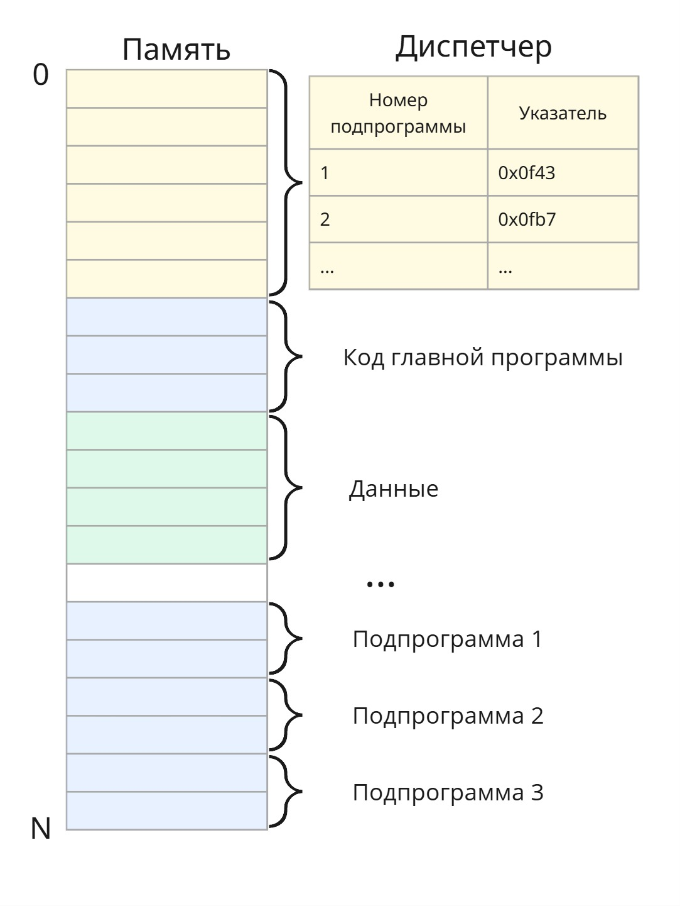
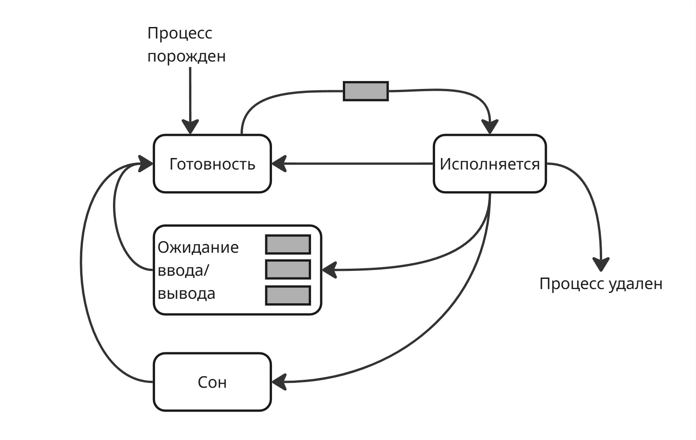
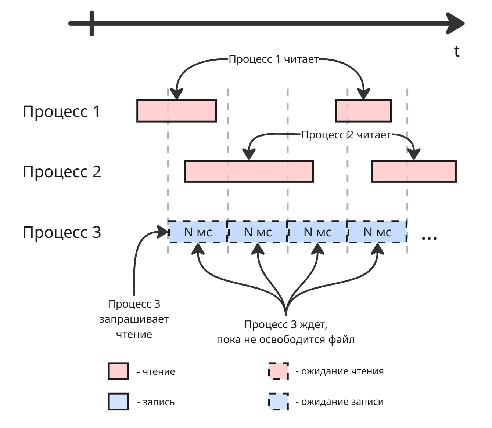

# <a name="%D0%BE%D0%BF%D0%B5%D1%80%D0%B0%D1%86%D0%B8%D0%BE%D0%BD%D0%BD%D1%8B%D0%B5-%D1%81%D0%B8%D1%81%D1%82%D0%B5%D0%BC%D1%8B"></a> Операционные системы


* [Операционные системы](#%D0%BE%D0%BF%D0%B5%D1%80%D0%B0%D1%86%D0%B8%D0%BE%D0%BD%D0%BD%D1%8B%D0%B5-%D1%81%D0%B8%D1%81%D1%82%D0%B5%D0%BC%D1%8B)
  * [Лекция 1. Ранние операционные системы](#%D0%BB%D0%B5%D0%BA%D1%86%D0%B8%D1%8F-1.-%D1%80%D0%B0%D0%BD%D0%BD%D0%B8%D0%B5-%D0%BE%D0%BF%D0%B5%D1%80%D0%B0%D1%86%D0%B8%D0%BE%D0%BD%D0%BD%D1%8B%D0%B5-%D1%81%D0%B8%D1%81%D1%82%D0%B5%D0%BC%D1%8B)
    * [Диспетчеры](#%D0%B4%D0%B8%D1%81%D0%BF%D0%B5%D1%82%D1%87%D0%B5%D1%80%D1%8B)
  * [Лекция 2. Мультипрограммность](#%D0%BB%D0%B5%D0%BA%D1%86%D0%B8%D1%8F-2.-%D0%BC%D1%83%D0%BB%D1%8C%D1%82%D0%B8%D0%BF%D1%80%D0%BE%D0%B3%D1%80%D0%B0%D0%BC%D0%BC%D0%BD%D0%BE%D1%81%D1%82%D1%8C)
    * [Мультипрограммные операционные системы](#%D0%BC%D1%83%D0%BB%D1%8C%D1%82%D0%B8%D0%BF%D1%80%D0%BE%D0%B3%D1%80%D0%B0%D0%BC%D0%BC%D0%BD%D1%8B%D0%B5-%D0%BE%D0%BF%D0%B5%D1%80%D0%B0%D1%86%D0%B8%D0%BE%D0%BD%D0%BD%D1%8B%D0%B5-%D1%81%D0%B8%D1%81%D1%82%D0%B5%D0%BC%D1%8B)
    * [Сетевые операционные системы](#%D1%81%D0%B5%D1%82%D0%B5%D0%B2%D1%8B%D0%B5-%D0%BE%D0%BF%D0%B5%D1%80%D0%B0%D1%86%D0%B8%D0%BE%D0%BD%D0%BD%D1%8B%D0%B5-%D1%81%D0%B8%D1%81%D1%82%D0%B5%D0%BC%D1%8B)
  * [Лекция 3. История Unix и других универсальных ОС](#%D0%BB%D0%B5%D0%BA%D1%86%D0%B8%D1%8F-3.-%D0%B8%D1%81%D1%82%D0%BE%D1%80%D0%B8%D1%8F-unix-%D0%B8-%D0%B4%D1%80%D1%83%D0%B3%D0%B8%D1%85-%D1%83%D0%BD%D0%B8%D0%B2%D0%B5%D1%80%D1%81%D0%B0%D0%BB%D1%8C%D0%BD%D1%8B%D1%85-%D0%BE%D1%81)
  * [Лекция 4. Архитектура ОС, часть 1](#%D0%BB%D0%B5%D0%BA%D1%86%D0%B8%D1%8F-4.-%D0%B0%D1%80%D1%85%D0%B8%D1%82%D0%B5%D0%BA%D1%82%D1%83%D1%80%D0%B0-%D0%BE%D1%81%2C-%D1%87%D0%B0%D1%81%D1%82%D1%8C-1)
    * [Функциональная архитектура](#%D1%84%D1%83%D0%BD%D0%BA%D1%86%D0%B8%D0%BE%D0%BD%D0%B0%D0%BB%D1%8C%D0%BD%D0%B0%D1%8F-%D0%B0%D1%80%D1%85%D0%B8%D1%82%D0%B5%D0%BA%D1%82%D1%83%D1%80%D0%B0)
  * [Лекция 5. Архитектура ОС, часть 2](#%D0%BB%D0%B5%D0%BA%D1%86%D0%B8%D1%8F-5.-%D0%B0%D1%80%D1%85%D0%B8%D1%82%D0%B5%D0%BA%D1%82%D1%83%D1%80%D0%B0-%D0%BE%D1%81%2C-%D1%87%D0%B0%D1%81%D1%82%D1%8C-2)
    * [Информационная архитектура](#%D0%B8%D0%BD%D1%84%D0%BE%D1%80%D0%BC%D0%B0%D1%86%D0%B8%D0%BE%D0%BD%D0%BD%D0%B0%D1%8F-%D0%B0%D1%80%D1%85%D0%B8%D1%82%D0%B5%D0%BA%D1%82%D1%83%D1%80%D0%B0)
    * [Системная архитектура](#%D1%81%D0%B8%D1%81%D1%82%D0%B5%D0%BC%D0%BD%D0%B0%D1%8F-%D0%B0%D1%80%D1%85%D0%B8%D1%82%D0%B5%D0%BA%D1%82%D1%83%D1%80%D0%B0)
  * [Лекция 6. Архитектура ОС, часть 3](#%D0%BB%D0%B5%D0%BA%D1%86%D0%B8%D1%8F-6.-%D0%B0%D1%80%D1%85%D0%B8%D1%82%D0%B5%D0%BA%D1%82%D1%83%D1%80%D0%B0-%D0%BE%D1%81%2C-%D1%87%D0%B0%D1%81%D1%82%D1%8C-3)
    * [Монолитная архитектура](#%D0%BC%D0%BE%D0%BD%D0%BE%D0%BB%D0%B8%D1%82%D0%BD%D0%B0%D1%8F-%D0%B0%D1%80%D1%85%D0%B8%D1%82%D0%B5%D0%BA%D1%82%D1%83%D1%80%D0%B0)
    * [Многослойная монолитная архитектура](#%D0%BC%D0%BD%D0%BE%D0%B3%D0%BE%D1%81%D0%BB%D0%BE%D0%B9%D0%BD%D0%B0%D1%8F-%D0%BC%D0%BE%D0%BD%D0%BE%D0%BB%D0%B8%D1%82%D0%BD%D0%B0%D1%8F-%D0%B0%D1%80%D1%85%D0%B8%D1%82%D0%B5%D0%BA%D1%82%D1%83%D1%80%D0%B0)
    * [Микроядерная архитектура](#%D0%BC%D0%B8%D0%BA%D1%80%D0%BE%D1%8F%D0%B4%D0%B5%D1%80%D0%BD%D0%B0%D1%8F-%D0%B0%D1%80%D1%85%D0%B8%D1%82%D0%B5%D0%BA%D1%82%D1%83%D1%80%D0%B0)
    * [Другие архитектуры](#%D0%B4%D1%80%D1%83%D0%B3%D0%B8%D0%B5-%D0%B0%D1%80%D1%85%D0%B8%D1%82%D0%B5%D0%BA%D1%82%D1%83%D1%80%D1%8B)
  * [Лекция 7. Процессы](#%D0%BB%D0%B5%D0%BA%D1%86%D0%B8%D1%8F-7.-%D0%BF%D1%80%D0%BE%D1%86%D0%B5%D1%81%D1%81%D1%8B)
  * [Лекция 8. Управление процессами](#%D0%BB%D0%B5%D0%BA%D1%86%D0%B8%D1%8F-8.-%D1%83%D0%BF%D1%80%D0%B0%D0%B2%D0%BB%D0%B5%D0%BD%D0%B8%D0%B5-%D0%BF%D1%80%D0%BE%D1%86%D0%B5%D1%81%D1%81%D0%B0%D0%BC%D0%B8)
  * [Лекция 9. Планировщик процессов](#%D0%BB%D0%B5%D0%BA%D1%86%D0%B8%D1%8F-9.-%D0%BF%D0%BB%D0%B0%D0%BD%D0%B8%D1%80%D0%BE%D0%B2%D1%89%D0%B8%D0%BA-%D0%BF%D1%80%D0%BE%D1%86%D0%B5%D1%81%D1%81%D0%BE%D0%B2)
  * [Лекция 10. Планировщики в Windows и Linux](#%D0%BB%D0%B5%D0%BA%D1%86%D0%B8%D1%8F-10.-%D0%BF%D0%BB%D0%B0%D0%BD%D0%B8%D1%80%D0%BE%D0%B2%D1%89%D0%B8%D0%BA%D0%B8-%D0%B2-windows-%D0%B8-linux)
  * [Лекция 11. Синхронизация процессов, часть 1](#%D0%BB%D0%B5%D0%BA%D1%86%D0%B8%D1%8F-11.-%D1%81%D0%B8%D0%BD%D1%85%D1%80%D0%BE%D0%BD%D0%B8%D0%B7%D0%B0%D1%86%D0%B8%D1%8F-%D0%BF%D1%80%D0%BE%D1%86%D0%B5%D1%81%D1%81%D0%BE%D0%B2%2C-%D1%87%D0%B0%D1%81%D1%82%D1%8C-1)
  * [Лекция 12. Синхронизация процессов, часть 2](#%D0%BB%D0%B5%D0%BA%D1%86%D0%B8%D1%8F-12.-%D1%81%D0%B8%D0%BD%D1%85%D1%80%D0%BE%D0%BD%D0%B8%D0%B7%D0%B0%D1%86%D0%B8%D1%8F-%D0%BF%D1%80%D0%BE%D1%86%D0%B5%D1%81%D1%81%D0%BE%D0%B2%2C-%D1%87%D0%B0%D1%81%D1%82%D1%8C-2)
    * [Тупик](#%D1%82%D1%83%D0%BF%D0%B8%D0%BA)
    * [Голодание](#%D0%B3%D0%BE%D0%BB%D0%BE%D0%B4%D0%B0%D0%BD%D0%B8%D0%B5)
    * [Выделение памяти](#%D0%B2%D1%8B%D0%B4%D0%B5%D0%BB%D0%B5%D0%BD%D0%B8%D0%B5-%D0%BF%D0%B0%D0%BC%D1%8F%D1%82%D0%B8)
  * [Лекция 13. Методы выделения памяти](#%D0%BB%D0%B5%D0%BA%D1%86%D0%B8%D1%8F-13.-%D0%BC%D0%B5%D1%82%D0%BE%D0%B4%D1%8B-%D0%B2%D1%8B%D0%B4%D0%B5%D0%BB%D0%B5%D0%BD%D0%B8%D1%8F-%D0%BF%D0%B0%D0%BC%D1%8F%D1%82%D0%B8)
    * [Одинаковые фиксированные разделы](#%D0%BE%D0%B4%D0%B8%D0%BD%D0%B0%D0%BA%D0%BE%D0%B2%D1%8B%D0%B5-%D1%84%D0%B8%D0%BA%D1%81%D0%B8%D1%80%D0%BE%D0%B2%D0%B0%D0%BD%D0%BD%D1%8B%D0%B5-%D1%80%D0%B0%D0%B7%D0%B4%D0%B5%D0%BB%D1%8B)
    * [Фиксированные разделы разного размера](#%D1%84%D0%B8%D0%BA%D1%81%D0%B8%D1%80%D0%BE%D0%B2%D0%B0%D0%BD%D0%BD%D1%8B%D0%B5-%D1%80%D0%B0%D0%B7%D0%B4%D0%B5%D0%BB%D1%8B-%D1%80%D0%B0%D0%B7%D0%BD%D0%BE%D0%B3%D0%BE-%D1%80%D0%B0%D0%B7%D0%BC%D0%B5%D1%80%D0%B0)
    * [Динамические разделы](#%D0%B4%D0%B8%D0%BD%D0%B0%D0%BC%D0%B8%D1%87%D0%B5%D1%81%D0%BA%D0%B8%D0%B5-%D1%80%D0%B0%D0%B7%D0%B4%D0%B5%D0%BB%D1%8B)
    * [Страничный обмен](#%D1%81%D1%82%D1%80%D0%B0%D0%BD%D0%B8%D1%87%D0%BD%D1%8B%D0%B9-%D0%BE%D0%B1%D0%BC%D0%B5%D0%BD)
    * [Сегментно-страничная организация](#%D1%81%D0%B5%D0%B3%D0%BC%D0%B5%D0%BD%D1%82%D0%BD%D0%BE-%D1%81%D1%82%D1%80%D0%B0%D0%BD%D0%B8%D1%87%D0%BD%D0%B0%D1%8F-%D0%BE%D1%80%D0%B3%D0%B0%D0%BD%D0%B8%D0%B7%D0%B0%D1%86%D0%B8%D1%8F)
  * [Лекция 14. Файловая система](#%D0%BB%D0%B5%D0%BA%D1%86%D0%B8%D1%8F-14.-%D1%84%D0%B0%D0%B9%D0%BB%D0%BE%D0%B2%D0%B0%D1%8F-%D1%81%D0%B8%D1%81%D1%82%D0%B5%D0%BC%D0%B0)
  * [Лекция 15. Распределенные операционные системы](#%D0%BB%D0%B5%D0%BA%D1%86%D0%B8%D1%8F-15.-%D1%80%D0%B0%D1%81%D0%BF%D1%80%D0%B5%D0%B4%D0%B5%D0%BB%D0%B5%D0%BD%D0%BD%D1%8B%D0%B5-%D0%BE%D0%BF%D0%B5%D1%80%D0%B0%D1%86%D0%B8%D0%BE%D0%BD%D0%BD%D1%8B%D0%B5-%D1%81%D0%B8%D1%81%D1%82%D0%B5%D0%BC%D1%8B)
    * [Технологии виртуализации](#%D1%82%D0%B5%D1%85%D0%BD%D0%BE%D0%BB%D0%BE%D0%B3%D0%B8%D0%B8-%D0%B2%D0%B8%D1%80%D1%82%D1%83%D0%B0%D0%BB%D0%B8%D0%B7%D0%B0%D1%86%D0%B8%D0%B8)
    * [Облачные технологии](#%D0%BE%D0%B1%D0%BB%D0%B0%D1%87%D0%BD%D1%8B%D0%B5-%D1%82%D0%B5%D1%85%D0%BD%D0%BE%D0%BB%D0%BE%D0%B3%D0%B8%D0%B8)
  * [X. Программа экзамена 2024/2025](#x.-%D0%BF%D1%80%D0%BE%D0%B3%D1%80%D0%B0%D0%BC%D0%BC%D0%B0-%D1%8D%D0%BA%D0%B7%D0%B0%D0%BC%D0%B5%D0%BD%D0%B0-2024%2F2025)


Основная идея курса - показать концепции, применяемые в операционных системах, и ответить, почему не существует идеальной операционной системы

Пример - алгоритмы. Рассматривая асимптотики алгоритмов, мы допускаем, что наш алгоритм работает в идеальной среде. Однако в реальной жизни процесс с алгоритмом может быть остановлен, прерван операционной системой

## <a name="%D0%BB%D0%B5%D0%BA%D1%86%D0%B8%D1%8F-1.-%D1%80%D0%B0%D0%BD%D0%BD%D0%B8%D0%B5-%D0%BE%D0%BF%D0%B5%D1%80%D0%B0%D1%86%D0%B8%D0%BE%D0%BD%D0%BD%D1%8B%D0%B5-%D1%81%D0%B8%D1%81%D1%82%D0%B5%D0%BC%D1%8B"></a> Лекция 1. Ранние операционные системы

Операционная система - сложная композиция подсистем. Рассмотрим историю возникновения механизмов операционной системы

Однако зачем нам операционная система и как мы пришли к ее возникновению?

Физик Джон фон Нейман, изучая численные методы решения уравнений на ЭВМ, пришел к такой архитектуре:


и сформулировал принципы его архитектуры:

1. Однородность памяти: и инструкции, и данные хранятся в одной ячейке памяти RAM (Random Access Memory)

2. Линейность памяти: байты расположены последовательно

3. Двоичное кодирование: и инструкции, и данные кодируются в двоичном виде

4. Программное управление: регистр IP (Instruction Pointer - указатель на текущую программу) определяет, какая команда выполнится следующей - никто внешне не управляет программой, поэтому говорят "поток команд".  
Программа останавливается, когда наткнется на инструкцию "Останов" либо на инструкцию, выполнение которой невозможно

В этой архитектуре не было надобности в операционной системе. Позже выяснили, что в одной узле нужно больше одной программы (Software) и нужно больше аппаратных ресурсов (Hardware)

В архитектуре фон Неймана одной программе отдавались все процессорные ресурсы, однако сейчас это не так. Нужна оболочка, которая будет уметь _эффективно_ и _справедливо_ распределять ресурсы программам

Представим "супермаркет" фон Неймана: один однопоточный кассир и 3 покупателя - с большой тележкой, с маленькой корзинкой и несчастный студент с бутылкой воды. Время обслуживания их всех не зависит от перестановки покупателей. Однако нам, как хозяину магазина, выгодно, чтобы в очереди стояло как можно меньше людей

Поэтому мы нанимаем охранника, который будет перемещать студента с водичкой вперед. Тогда, если 1000 студентов с водичкой зайдут, то покупатель с большой тележкой никогда отсюда не выйдет - получается несправедливо

Распределение ресурсов вычислительным процессам имеет бэкграунд из истории общества: если давать все ресурсы сильным, то слабые вымрут, разнообразие исчезнет. Если все раздавать одинаковое количество ресурсов, то конкуренция исчезнет. Поэтому зарождается понятие "государства", которое задает правила и гарантирует их соблюдение. Операционная система, монополизируя власть и насилие, является абстракцией между пользователями и ПО+АО

> Операционная система - это базовое системное программное обеспечение, управляющее работой вычислительного узла и реализующее универсальный интерфейс между аппаратным обеспечением, программным обеспечением и пользователем

Первым этапом развития были программы-диспетчеры

### <a name="%D0%B4%D0%B8%D1%81%D0%BF%D0%B5%D1%82%D1%87%D0%B5%D1%80%D1%8B"></a> Диспетчеры

В 40-50 годах ЭВМ были нужны преимущественно для вычислительной физики

В ходе программирования выяснилось, что очень много кода пришлось дублировать. Появилась идея библиотек - подпрограмм, которые можно переиспользовать

Чтобы использовать эти подпрограммы, надо иметь в виду адрес вектора параметров, адрес на начало подпрограммы и указатель на инструкцию после вызова этой подпрограммы. Однако изменение подпрограммы вызовет много боли: приходится все подпрограммы ниже сдвигать, указатель на подпрограммы менять везде и т. д.

Тогда начало памяти займет код диспетчера, в табличке которого хранятся номера программ и указатели на начало подпрограмм. Теперь наш диспетчер занимается "автоматизацией загрузки и линковки"



В ходе развития программ появились потребности обработки массивов памяти, например, осветление картинки. Чтобы осветлить картинку, нужно изменить каждый пиксель на некоторое значение

Картинка слишком большая, поэтому приходится либо кусками вручную ее обрабатывать, либо постоянно выгружать/загружать. Поэтому процессор занят тем, что гоняет картинку между ПЗУ и ОЗУ, а на саму обработку уходит очень мало процессорного времени

Поэтому делаем такую штуку, как контроллер. Контроллер работает с хранилищем и оперативной памятью параллельно с процессором, а работает он по команде процессора. Таким образом, мы получили "оптимизацию с устройствами ввода/вывода/хранения"


Однако мы не можем прогнозировать время его выполнения. Поэтому, чтобы дать знать процессору, что контроллер завершил свою работу, контроллер посылает сигнал "прерывание"

> Прерывание - сигнал, поступающий в центральный процессор от внешнего устройства, прерывающий текущий поток команд и передающий управление обработчику этого прерывания

В тривиальном случае "прерыванием" может быть поменянный бит в ОЗУ, который отслеживается процессором

Теперь рассмотрим "однопрограммную пакетную обработку"

Программы становятся совсем большими, их начали делить на модули, которые пишут разные люди. Их очень много, поэтому хранить их в оперативке нельзя.  
Поэтому можно часть модулей хранить на долговременной памяти и подгружать их по требованию - получаем динамическую библиотеку. Программа-диспетчер сама решает, какие модули и как часто подгружать

Потом появляется планировщик, который определяет, какие модули и как часто подгружать

---

Второй этап: Мультипрограммные операционные системы

Допустим, что на нашем узле есть две программы: обрабатывающая картинку и вычислительную задачу. Процессор в первой программе большую часть ждет, пока контроллер думает, поэтому мы можем заставить его работать на вторую программу

Появляется проблема: как управлять ресурсами процессора? Вследствие этого диспетчер начинает обрастать дополнительным функционалом

## <a name="%D0%BB%D0%B5%D0%BA%D1%86%D0%B8%D1%8F-2.-%D0%BC%D1%83%D0%BB%D1%8C%D1%82%D0%B8%D0%BF%D1%80%D0%BE%D0%B3%D1%80%D0%B0%D0%BC%D0%BC%D0%BD%D0%BE%D1%81%D1%82%D1%8C"></a> Лекция 2. Мультипрограммность

### <a name="%D0%BC%D1%83%D0%BB%D1%8C%D1%82%D0%B8%D0%BF%D1%80%D0%BE%D0%B3%D1%80%D0%B0%D0%BC%D0%BC%D0%BD%D1%8B%D0%B5-%D0%BE%D0%BF%D0%B5%D1%80%D0%B0%D1%86%D0%B8%D0%BE%D0%BD%D0%BD%D1%8B%D0%B5-%D1%81%D0%B8%D1%81%D1%82%D0%B5%D0%BC%D1%8B"></a> Мультипрограммные операционные системы

Дальше появляется потребность больше чем в одной программе в вычислительной машине. Давайте расположим все программы последовательно в оперативной памяти

_Первая проблема_, которая возникает - распределение процессорного времени. Даже с увеличением количества ядер конкуренция процессов не уменьшается

Если мы хотим переключить одну программу на другую, то как минимум нам нужно научиться сохранять регистровый контекст. Если просто изменить регистр IP, то логика программы сломается

Тогда выделим в памяти диспетчера массив, в котором будем хранить регистровый контекст. Такое переключение процессов называется диспетчеризацией

Но как решать, когда нужно переключать диспетчеризацию?

Первым решением стала _кооперативная многозадачность_. Ее идея заключалась во вставке между инструкциями программ инструкцию вызова диспетчера, который дальше решает, какой процесс заслуживает внимание

Но программы имеет свойство ветвиться и зацикливаться, поэтому не явно, когда вызывать диспетчеризацию так, чтобы она вызывалась периодически по времени. Более того - можно добиться того, что диспетчер не будет вызываться, поэтому от кооперативной многозадачности отказались

Вторым решением стало аппаратное внедрение таймера к процессору, который прерывает процессор и вызывает диспетчер, чтобы изменить выполняющуюся программу, так называемая _вытесняющая многозадачность_


Надо понимать, что процессы не выполняются параллельно. Какое-то процессорное время отводится одному процессу, какое-то другому. Часть времени уходит на переключение между ним (сохранение регистрового контекста, загрузка регистрового контекста другого процесса)


<!-- Появляется проблема, как именно переключать процессы и как делить процессорное время -->

_Вторая проблема_: как делить оперативную память между процессами. Решением до сих пор является виртуальная память

> **Виртуальная память** - абстракция, позволяющая при создании или компиляции программы отсчитывать адреса от виртуального нуля, а при запуске или исполнении заменять их на физические

В общем смысле виртуальная память - это таблица, в которой указатели из виртуального адресного пространства соотносятся к указателям на физическую память. Создание такой таблички - нетривиальная задача (о ней рассказано в [лекции 13](https://pelmesh619.github.io/itmo_conspects/opersys/opersys_superconspect.html#%D0%BB%D0%B5%D0%BA%D1%86%D0%B8%D1%8F-13.-%D0%BC%D0%B5%D1%82%D0%BE%D0%B4%D1%8B-%D0%B2%D1%8B%D0%B4%D0%B5%D0%BB%D0%B5%D0%BD%D0%B8%D1%8F-%D0%BF%D0%B0%D0%BC%D1%8F%D1%82%D0%B8))

_Третьей проблемой_ стала проблема защиты памяти

Заметим, что в нашей абстракции программы могут повлиять друг на друга (изменить данные или инструкцию по адресу) случайно или намеренно. Поэтому надо сделать так, чтобы программа не могла лезть в чужую область памяти. Защита памяти реализуется аппаратно и частично связано с созданием виртуальной памяти

В нашей системе диспетчер знает, какой процесс активен и сколько выделено ему памяти, поэтому при поступлении запроса к доступу к чужому куску памяти вызывает диспетчер, который способен подать сигнал прерывания "нарушение доступа" (Access Violation) наглому процессу

Но тогда ломается линковка - подпрограммы не могут узнать свои параметры. Поэтому создается костыль - привилегированный режим

> **Привилегированный режим** - режим исполнения кода, при котором игнорируется защита памяти

Теперь при вызове подпрограммы происходит это:

* Исходная программа кладет в свой стек номер подпрограммы и аргументы для нее
* Вызывается инструкция, при выполнении которой исполнение передается диспетчеру, память уходит в привилегированный режим
* Диспетчер достает из стека значения и кладет в стек подпрограммы
* После выполнения подпрограммы диспетчер кладет возвращенное значение в стек исходной программы

Теперь диспетчер будем называть _ядром_. В данном случае ядро является посредником данных между программами. А инструкция, которая передало управление ядру, называется системный вызовом

> **Системный вызов** (system call, syscall) - обращение пользовательской программы к ядру операционной системы
с просьбой выполнить привилегированную операцию или предоставить некоторый системный ресурс

_Четвертая проблема_ - задача планирования ресурсов. Представим супермаркет, в котором кассы стоят возле каждого отдела. У каждого покупателя есть строгий путь, проходящий через отделы

Перед планировщиком стоит задача оптимально расставить этих покупателей, чтобы они вышли из магазина довольными за оптимальное время. Такая задача перестановки по сути является системой дифференциальных уравнений, аналитически которую решить нам не представляется возможным

_Пятая проблема_ - универсальный доступ к хранилищу

Существует потребность доступа данных на хранилище ко многим процессам. В это время появляется концепция файло-каталожной системы: файлы (набор байтов) и каталоги (набор файлов и каталогов)

Ядро регулирует доступом к файлам в хранилище, следовательно, может ставить блокировки на изменение/чтение файлов для других процессов в случае, если какой-то процесс открыл этот файл

_Шестая проблема_ - обеспечение коммуникации между программами

Из-за защиты памяти программы могут общаться только через ядро. Если обе программы попробуют одновременно что-то напечатать на принтере, то на выходе выйдет белиберда. Поэтому ядро должно регулировать использование ресурсов компьютера

В этот момент появился термин операционной системы. Заметим, что каждая программа в нашем компьютере имеет свою область виртуальной памяти, свое хранилище в виде открытого файла, свое процессорное время. Абстракции для каждой программы создали виртуальную машину вокруг них, которые уже работают наподобие простейшей машины фон Неймана. А операционная система занимается оркестрацией этих виртуальных машин

В 1963 году был создан суперкомпьютер B5000, в которой присутствовала операционная система MCP (Main Control Program)

Начинается 3 этап развития - сетевые операционные системы

### <a name="%D1%81%D0%B5%D1%82%D0%B5%D0%B2%D1%8B%D0%B5-%D0%BE%D0%BF%D0%B5%D1%80%D0%B0%D1%86%D0%B8%D0%BE%D0%BD%D0%BD%D1%8B%D0%B5-%D1%81%D0%B8%D1%81%D1%82%D0%B5%D0%BC%D1%8B"></a> Сетевые операционные системы

В 1960-ых компьютеры стояли дорого и требовали дорогого обслуживания. В то время нанимали программиста из другого города, тот писал код на бумажке, приезжал к компьютеру, передавал бумажку, код с которой переписывали лаборанты на перфокарты

Тут появилась концепция удаленной связи. В Америке 60-ых была очень развита телефонная связь. Конечно же, код могли передавать при помощи голоса, но это было медленно. Поэтому пришли к модуляции сигнала - изменении параметров несущего сигнала при помощи сигнала, который мы хотим передать

Пример: наш сигнал - это 100110, а несущий сигнал - это синусоида. Тогда мы можем изменить амплитуду синусоиды так, что бы она совпадала с аплитудой нашего сигнала:


Здесь 1 верхний пик - это 1 бит, однако для надежности можно сделать, например, 4 пика на 1 бит. Такая модуляция называется амплитудной (Amplitude Modulation, AM)

Другой вариант - менять частоту при постоянной амплитуде. Получаем частотную модуляцию (Frequency Modulation, FM):


Появилось устройство, которое подключается к телефону, модулирует сигнал, передает по телефонной линии, где на другом конце такое же устройство его демодулировало в сигнал, понятный процессору. Такое устройство получило название _модем_. Через модемы подключались удаленные экраны и клавиатуры, благодаря чему программист из города Тусон, штат Аризона, находящегося на расстоянии 40 км от границы Мексики, мог управлять компьютером, находящимся в Бостоне, штат Массачусетс


Но, если параллельно подключаются к компьютеру много программистов, появляется проблема, как распределять процессорное время им. Появляются понятия учетной записи и логина (от **log**ical **in**come, логический вход)

Через модемы компьютеры могли общаться между собой, создавая вычислительные кластеры

---

Четвертым этапом стало появление универсальных операционных систем

При проектировании компьютера стандартов архитектур не было, поэтому архитектура и операционная система
создавалась уникально для каждого компьютера. Инструкции для компьютеров также писались индивидуально

Надо было абстрагировать код для использования на других компьютерах. Эту проблему решили в AT&T

## <a name="%D0%BB%D0%B5%D0%BA%D1%86%D0%B8%D1%8F-3.-%D0%B8%D1%81%D1%82%D0%BE%D1%80%D0%B8%D1%8F-unix-%D0%B8-%D0%B4%D1%80%D1%83%D0%B3%D0%B8%D1%85-%D1%83%D0%BD%D0%B8%D0%B2%D0%B5%D1%80%D1%81%D0%B0%D0%BB%D1%8C%D0%BD%D1%8B%D1%85-%D0%BE%D1%81"></a> Лекция 3. История Unix и других универсальных ОС

Четвертый этап начался с потребности создания универсальной операционной системы

До создания таковой каждый компьютер имел свою архитектуру и свою операционную систему. А значит код разрабатывался для компьютера индивидуально

Специалисты в компании AT&T в лаборатории Bell Labs в конце 60-ых совместно с Массачусетским институтом технологий, разрабатывая суперкомпьютер, написали операционную систему Multics (Multiplexed Information and Computing Service).

После этого с целью разработки универсальной системы Кен Томпсон, Деннис Ритчи и Брайан Керниган разрабатывают операционную систему UNICS (Uniplexed Information and Computing Service). Позднее название меняется на созвучное Unix.

Unix Edition 1 вышла в 3 ноября 1971 года и была написана на ассемблере. Далее на основе этой операционной системы был создан язык B, интерпретатор которого был написан на ассемблере. После этого ядро Unix переписывается на B, выходит Edition 2 в 1972 году.

Используя язык B, они пишут компилятор языка C, который встраивается в Edition 2. Используя язык C операционная система Unix опять переписывается и компилируется в Unix Edition 3

В 1979 выходит Edition 7 с Bourne Shell (или просто Shell) - предком современного Bash

В 1985 выходит последняя публичная редакция Edition 8

Эти ранние версии Unix теперь известны как Research Unix

По антимонопольному соглашению, заключенному в 1956 году между Департаментом юстиции США и AT&T, AT&T не могла заниматься никаким другим бизнесом, кроме бизнеса в сфере телекоммуникаций. Поэтому в 1974 году код Unix попадает в Университет Калифорнии в Беркли, где в конце 1970-ых Билл Джой разрабатывает форк BSD (Berkeley Software Distribution). Позднее из нее выходят FreeBSD, NetBSD, OpenBSD, Dragonfly BSD и другие.

Именно с выхода BSD появляется лицензия BSD License, которая не ставила никаких ограничений в использовании лицензированного ее ПО

Параллельно с этим в Bell Labs разрабатывают коммерческие версии Unix. В 1977 году выходит Programmer's Workbench (PWB/Unix). Незадолго до [распада Bell System](https://en.wikipedia.org/wiki/Breakup_of_the_Bell_System) выходит Unix System V в 1983 году. Другие компании лицензируют ее и появляются:

* AIX - операционная система от IBM

* IRIX - операционная система от Silicon Graphics (SGI) для компьютерной анимации

* HP-UX - серверная система от HP

Другой технический университет, Стэнфордский, решил заиметь свою операционную систему, создает свое коммерческое предприятие Stanford University Networks (SUN, позднее Sun Microsystems), и на основе BSD создается SunOS в 1982

Стэнфордский университет решает заново переписать код, используя код коммерческой Unix System V - появляется Solaris. До наших времен дожил его потомок OpenSolaris

Также Microsoft создают свой форк BSD и Research Unix в 1980, называют Xenix

В конце 80-ых в Америке начались компьютеризация и рассвет операционных систем. Как правило это все были форки BSD, рассчитанные на обычного потребителя. 

В это время в 1985 появляется компания NeXT Computer, основанная очень небезызвестной личностью. В 1989 выходит их операционная система NeXTSTEP, Apple поглощает NeXT в 1997, преобразует NeXTSTEP в открытую операционную систему Darwin, которая по сей день развивается и является основой для macOS (ранее Mac OS X и OS X)

Из-за чересчур свободной BSD лицензии начинается патентная война. Например, патент на архивирующий алгоритм LZW, который наиболее оптимально сжимает данные, приводит к замедлению индустрии. 

Лицензии того времени приводили к тому, что open-source код можно было сделать проприетарным

В 1983 году в Массачусетском институте технологий профессор Ричард Столлман становится идеологом движения за свободное программное обеспечение. Он выпускает манифест свободного программного обеспечения, в которого написаны 4 свободы свободного ПО:

> Свобода запускать программу в любых целях (свобода 0).  
> Свобода изучения работы программы и адаптация её к вашим нуждам (свобода 1). Доступ к исходным текстам является необходимым условием.  
> Свобода распространять копии, так что вы можете помочь вашему товарищу (свобода 2).  
> Свобода улучшать программу и публиковать ваши улучшения, так что всё общество выиграет от этого (свобода 3). Доступ к исходным текстам является необходимым условием.

Чтобы регулировать интеллектуальную собственность, появились понятия авторского права и копирайта - запрет что-либо делать с собственностью без явного разрешения автора

Ричард Столлман придумывает копилефт - понятие, означающее, что проект, использующий код с копилефтной лицензией, должен наследовать ее, таким образом оставаясь в общественной собственности. Создается лицензия GPL (General Public License)

Чтобы создать поистине открытую систему, создается проект GNU (рекурсивный акроним от Gnu is Not Unix). Для этого пишется с нуля компилятор GCC (GNU C Compiler), переписываются все библиотеки. Все, что ему оставалось сделать, - ядро будущей ОС

В Хельсинском университете студент Линус Торвальдс увлекается операционными системами. Через знакомых он получает книгу Эндрю Таненбаума. В то время Таненбаум создал Minix - микроядерная Unix-подобная система, которая использовалась в обучении проектирования ОС. В своих книгах Таненбаум пропагандирует, что монолитная архитектура ОС и процессорная архитектура x86 - это тупиковые идеи. 

Весь код своей операционной системы Линус пишет с нуля, вдохновляясь Minix. Эта операционная система распространяется по европейским университетам, а потом попадает и в MIT к Таненбауму.  
Эндрю Таненбаум в новостной группе по операционным системам говорит, что Linux устарел. В ходе [спора](https://ru.wikipedia.org/wiki/%D0%A1%D0%BF%D0%BE%D1%80_%D0%A2%D0%B0%D0%BD%D0%B5%D0%BD%D0%B1%D0%B0%D1%83%D0%BC%D0%B0_%E2%80%94_%D0%A2%D0%BE%D1%80%D0%B2%D0%B0%D0%BB%D1%8C%D0%B4%D1%81%D0%B0) Столлман узнает о Линусе и пишет письмо ему, приглашая в его команду GNU. В итоге операционная система получает название GNU/Linux

Linux начинает свое развитие и появляются многочисленные дистрибутивы, такие как Ubuntu, Debian, Fedora, Arch Linux и другие

Оставшимся игроком остался Microsoft. Microsoft основал свой бизнес на продаже только программного обеспечения. В это время рынок компьютера для домохозяйств не был занят.

Microsoft распространяли свою операционную систему MS-DOS через набор дискет и книжечку, как ими пользоваться. 

Apple в это время начинает развитие оконного интерфейса. После этого в Linux создается X Window System

Microsoft создают оболочку, отрисовывающую оконный интерфейс, для DOS и называют ее Windows. В Windows 3.1 появляется сетевой интерфейс

Microsoft приняли решение, что графическая оболочка должна быть интегрирована в ядро системы - появляется Windows 95. 

В это время в 1993 выходит Windows NT 3.1 Advanced Server. К выходу Windows 2000 появилось разделение на клиентские (Workstation) и серверные (Server) системы

Из Windows 2000 Workstation появились Windows XP, Windows 7, Windows 10, Windows 11. А серверные Windows развивались отдельно: Windows 2003 Server, Windows 2008 Server, Windows 2012 Server и так далее


## <a name="%D0%BB%D0%B5%D0%BA%D1%86%D0%B8%D1%8F-4.-%D0%B0%D1%80%D1%85%D0%B8%D1%82%D0%B5%D0%BA%D1%82%D1%83%D1%80%D0%B0-%D0%BE%D1%81%2C-%D1%87%D0%B0%D1%81%D1%82%D1%8C-1"></a> Лекция 4. Архитектура ОС, часть 1 

Архитектура ПО очень схожа с архитектурой зданий и домов - поиск компромиссов

Операционные системы пишутся годами - за эти годы может смениться множество команд. Поэтому важно, что бы соблюдался единый и консистентный подход к проектированию.

Яркий пример - собор Саграда Фамилия в Барселоне. Взявшийся за него в конце XIX века архитектор Антонио Гауди, придумавший уникальные архитектурные решения (в частности, подгонка каждого каменного блока), не успел его достроить, из-за чего собор почти сто лет стоит незавершенным

Сейчас выделяют 5 уровней архитектур:

* **Функциональная** - группировка функций, которые предоставляет ОС
* **Информационная** - выделение объектов, связей между ними и их жизненный цикл
* **Системная** - выбор процессорной архитектуры, внедрение сторонних компонентов, API
* **Программная** - организация кода
* **Архитектура данных** - используемые в разработке структуры данных

На этой лекции будет разбираться функциональная архитектура

### <a name="%D1%84%D1%83%D0%BD%D0%BA%D1%86%D0%B8%D0%BE%D0%BD%D0%B0%D0%BB%D1%8C%D0%BD%D0%B0%D1%8F-%D0%B0%D1%80%D1%85%D0%B8%D1%82%D0%B5%D0%BA%D1%82%D1%83%D1%80%D0%B0"></a> Функциональная архитектура

Определим цель операционной системы: обеспечение производительности, надежности и безопасности аппаратного обеспечения, программного обеспечения, данных и интерфейсов

Выделим метафункции ОС:

1. Управление разработкой и исполнением пользовательского ПО

    1. Высокоуровневый API для разработки ПО

        Например, раньше, чтобы разработчикам открыть файл, приходилось класть в стек аргументов имя файлов, параметры открытия, вызывать системный вызов, проверять на ошибки и т.д.. Сейчас же стандартные библиотеки для языков программирования оборачивают этот процесс простым вызовом метода `open`

    2. Управление исполнением программы

        Например, когда пользователь два раза щелкает на ярлычок, в это время операционная система находит путь исполняемого файла по ярлыку, сама выделяет оперативную память процессу открываем ярлык, загружает инструкции в память, выполняет их и так далее. И все эти процессы происходят абсолютно прозрачно для нас

    3. Обнаружение и обработка ошибок

        Давным-давно ошибки вызывали прерывание процессора, который прекращал исполнение инструкций.  
        Теперь же процесс не умирает, а помещается в состояние "exception", при котором делается дамп памяти процесса, с помощью которого можно вычислить баг

    4. Высокоуровневый доступ к устройствам ввода-вывода

        Это работа компьютерных мышек, клавиатур, веб-камер, принтеров и т.п.

    5. Управление хранилищем

        Пример: имеем диск с файловой системой NTFS (или EXT4) и флешка с FAT32. Нужно перенести каталог с файлам. Хранилища у нас с совсем разными структурами, поэтому ОС нужно уметь работать с ними прозрачно

    6. Мониторинг использования ресурсов

        Чтобы операционной системе построить график использования процессора, нужно использовать этот же самый процессор, поэтому нужны специальные алгоритмы

2. Оптимизация использования ресурсов

    1. Механизм для решения многокритериальных задач

        Ранняя аналогия с супермаркетом была одномерная, но в компьютере таких касс несколько. Нужно, чтобы были:

        * всегда занятой процессор
        * всегда занятая память
        * всегда занятой диск

        И другие компоненты. Для этого используют суперкритерий (другое название - свертка):

        

        Здесь `k_i` - критерий оптимальности использования какого-то ресурса, а `α`, `β`, `γ` - веса этих критериев. Цель - максимизировать `k` с крышечкой. Далее алгоритм думает, как распределять ресурсы

        В местах, где имеет место быть критическим процессам, помимо суперкритерия может использоваться условный критерий:

        

    2. Цикл Деминга (Цикл PDCA)

        Цикл PDCA состоит в следующем:

        

        * Plan - планирование действия
        * Do - действие
        * Check - проверка текущего состояния
        * Act (или Adjuct) - корректировка направления

        На основе него работает планировка задач. Например, если при рендеринге видео, запустить билд проекта, то скорость рендеринга сначала сильно уменьшится, но потом будет постепенно увеличиваться

3. Поддержка администрирования и эксплуатации

    1. Диагностика - средства, которые в автономическом режиме прогнозируют и анализируют отказ компонентов

    2. Восстановление - автоматизация восстановления

        Например, при неправильном извлечении диска, данные в редких случаях могут быть неправильно записаны, но журналирование файловой системы может восстановить данные по логам

4. Поддержка развития операционной системы

    1. Обновление - архитектурно должны быть заложены механизмы обновления ОС, чтобы не производить повторную компиляцию ядра при каждом обновлении

    2. Кастомизация - способность изменять функционал под требуемые нужды (например, изменение ядра при помощи модулей)

## <a name="%D0%BB%D0%B5%D0%BA%D1%86%D0%B8%D1%8F-5.-%D0%B0%D1%80%D1%85%D0%B8%D1%82%D0%B5%D0%BA%D1%82%D1%83%D1%80%D0%B0-%D0%BE%D1%81%2C-%D1%87%D0%B0%D1%81%D1%82%D1%8C-2"></a> Лекция 5. Архитектура ОС, часть 2

### <a name="%D0%B8%D0%BD%D1%84%D0%BE%D1%80%D0%BC%D0%B0%D1%86%D0%B8%D0%BE%D0%BD%D0%BD%D0%B0%D1%8F-%D0%B0%D1%80%D1%85%D0%B8%D1%82%D0%B5%D0%BA%D1%82%D1%83%D1%80%D0%B0"></a> Информационная архитектура

Информационный уровень фокусируется на определении объектов (например, процессы, файлы, структуры данных), взаимосвязей между ними и жизненного цикла этих объектов.

1. Управление процессами

    Процесс - специальный объект в ОС, представляющий собой структуру в оперативной памяти. 
    В Linux процессы хранятся в массиве

    Управление процессами строится на двух объектах: **дескриптор процесса** (или PCB, Process Control Block) и **очередь**

    Дескриптор хранит информацию 

    * об идентификации процесса (PID - Process ID, UID - User ID, PPID - Parent Process ID и другие)
    * о ресурсах (выделенные странички в памяти, сокеты и другие)
    * об истории (для использования планировщиком)

    Очереди же используются для равномерной нагрузки процессора. В теории массового обслуживания, одном из разделов математики, исследуют системы массового обслуживания - в нашем случае, это компьютер или так называемый прибор. Прибору поступает потом требований (задач), задающихся набором характеристик. Поток требований может быть сгущенными или разряженными. Прибор обрабатывает эти требования, при этом время, за которое он их обработает - случайная величина

    Если прибор занят одним требованием и не может удовлетворить другое, то другое попадает в очередь
    На выходе поток требований получается равномерный, который определяется производительностью прибора

    

    Очередь, сглаживающая поток требований, является фильтром Калмана и используется для равномерного поступления процессов в исполнение процессором

2. Управление памятью

    Управление памятью же стоит на **виртуальной памяти** и **защите памяти**

    Об этом уже было сказано раньше. Виртуальная память - это концепция, позволяющая операционной системе создавать абстракцию адресного пространства, которая отделяет физическую память от логических адресов, используемых программами

    Защита памяти - это управление правами доступа к некоторым участкам памяти для процессов

3. Управление файлами

    Файловую систему представляют две сущности: **файл** и **каталог**

    Традиционное определение говорит, что файл - это именованная область данных.  
    В Linux же файл - это универсальный интерфейс для доступа к данным

    В Windows же каталог и файл - отдельные сущности, а в Linux все - это файл.

    В Linux файл может храниться в двух каталогах одновременно - файл определяется при помощи идентификатора, называемого айнодом, и в Linux можно создать два файла с разными именами и в разных каталогах с одним айнодом (так называемая жесткая ссылка)

4. Управление внешними устройствами

    Ядро должно знать, с каким железом должно работать. Вместо того, чтобы в ядре писать код для работы со всеми железяками, придумали **драйверы** - модули, соединяющие операционную систему и аппаратное обеспечение

    Лет 20 назад драйвера вручную линковали с ядром, а затем его компилировали

    Потом Microsoft, входя в игровую индустрию с разнообразными контроллерами, захотела сделать драйверы более удобными для пользователей. Такая фича стала называться **"Plug-And-Play"**: при подключении устройство отправляло по проводу свой идентификатор, операционная система считывала его, из своей базы данных доставало нужный драйвер и включало его

5. Защита данных и администрирования

    Здесь же используются объекты **учетной записи** (с концепцией идентификации, аутентификации и авторизации) и **аудит**, журналирование с анализом и поиском аномалий (подробнее см. курс баз данных)

6. Пользовательский интерфейс

    В качестве пользовательского интерфейса выступают **CLI** и **GUI**

    CLI (Command Line Interface) - интерфейс командной строки. GUI (Graphical User Interface) - графический интерфейс пользователя

    В Linux основным является CLI, а в Windows - GUI в качестве нативного для ядра

### <a name="%D1%81%D0%B8%D1%81%D1%82%D0%B5%D0%BC%D0%BD%D0%B0%D1%8F-%D0%B0%D1%80%D1%85%D0%B8%D1%82%D0%B5%D0%BA%D1%82%D1%83%D1%80%D0%B0"></a> Системная архитектура

Системная архитектура описывает то, как организован код операционной системы. 

Код ядра:

* выполняется в привилегированном режиме (без защиты памяти)
* является резидентом - то есть весь код находится в оперативной памяти в одних и тех же адресах (не использует виртуализацию, что улучшает производительность)

Получается, что ядро со всеми драйверами может занять всю оперативную память. Поэтому нужно принимать решения, что включать в ядро. Со временем выработалось 5 принципов построения архитектуры ОС:

1. Модульная организация кода
2. Функциональная избыточность - закладываем больше функционала, чем нужно обычному пользователю
3. Функциональная избирательность - закладываем возможность отключить ненужные компоненты
4. Параметрическая универсальность - не хардкодить константы
5. Иерархическая вычислительная система

## <a name="%D0%BB%D0%B5%D0%BA%D1%86%D0%B8%D1%8F-6.-%D0%B0%D1%80%D1%85%D0%B8%D1%82%D0%B5%D0%BA%D1%82%D1%83%D1%80%D0%B0-%D0%BE%D1%81%2C-%D1%87%D0%B0%D1%81%D1%82%D1%8C-3"></a> Лекция 6. Архитектура ОС, часть 3

Основная проблема, стоящая перед системной архитектурой, - какой код вносить в ядро и какой код выносить

Первая концепция, которая появилась, - **монолитная архитектура** ядра

### <a name="%D0%BC%D0%BE%D0%BD%D0%BE%D0%BB%D0%B8%D1%82%D0%BD%D0%B0%D1%8F-%D0%B0%D1%80%D1%85%D0%B8%D1%82%D0%B5%D0%BA%D1%82%D1%83%D1%80%D0%B0"></a> Монолитная архитектура

В "монолите" выделяют 3 слоя:

1. **Главная программа** принимает системные вызовы. Главная программа знает, какой процесс его вызвал, что за системный вызов и аргументы вызова, а после передает вызов в нужный сервис
2. **Сервисы** выполняют определенный вызов, используя утилиты. Если сервис не может совершить операцию (например, мало оперативной памяти), то вызов передается обратно в главную программу
3. **Утилиты** - часть ядра, задействующая аппаратное обеспечение (по факту драйвера)


После этого появилась **многослойная монолитная архитектура**

### <a name="%D0%BC%D0%BD%D0%BE%D0%B3%D0%BE%D1%81%D0%BB%D0%BE%D0%B9%D0%BD%D0%B0%D1%8F-%D0%BC%D0%BE%D0%BD%D0%BE%D0%BB%D0%B8%D1%82%D0%BD%D0%B0%D1%8F-%D0%B0%D1%80%D1%85%D0%B8%D1%82%D0%B5%D0%BA%D1%82%D1%83%D1%80%D0%B0"></a> Многослойная монолитная архитектура

В многослойной монолитной архитектуре слоев стало больше:

1. **Аппаратное обеспечение**
2. **Аппаратная поддержка ядра** определяется чипсетом и кодом в микроконтроллерах на материнской плате
3. **Машинно-зависимые модули** (HAL - Hardware Abstraction Layer, драйвера или модули ядра) абстрагируют код ядра от аппаратного обеспечения
4. **Базовые механизмы ядра** - базовые детерминированные алгоритмы
5. **Менеджер ресурсов** - стохастические алгоритмы, принимающие решения по организации ресурсов
6. **Системные вызовы и API**

Круги отражают размер кода соответствующего уровня, например, аппаратная поддержка ядра - микрокод на чипсете, занимающий порядка килобайта, тогда как менеджер ресурсов может занимать уже мегабайты


Ядро становилось все больше и больше, а оперативная память не увеличивалась такими большими темпами - поэтому ядро стало занимать все большую часть памяти

Второй проблемой стала задача построения распределенных систем. Если разместить на двух узлах операционные системы, то они должны разделять пул ресурсов, а также иметь одного менеджера для согласованности решений. Поэтому было принято решение вынести менеджера ресурсов за пределы ядра

Появляется **микроядерная архитектура**

### <a name="%D0%BC%D0%B8%D0%BA%D1%80%D0%BE%D1%8F%D0%B4%D0%B5%D1%80%D0%BD%D0%B0%D1%8F-%D0%B0%D1%80%D1%85%D0%B8%D1%82%D0%B5%D0%BA%D1%82%D1%83%D1%80%D0%B0"></a> Микроядерная архитектура

В микроядерной архитектура можно выделить условно три слоя: АО, ПО в режиме ядра (привилегированном), ПО в пользовательском режиме. Базовые механизмы ядра, обработчики системных вызовов и HAL остаются в пределах ядра, а другие сервисы (такие как сервера памяти, дисков, библиотеки, API и т. д.) существуют как процессы внутри пользовательского режима

Пример: приложение хочет выделить память на куче, приложение вызывает вызов API, который переводит его библиотеке, которая переводит его серверу памяти и т. д. - между всеми этими переходами стоит ядро


В микроядерной архитектуре модули на уровне пользовательского режима можно вынести в подкачку на диск. Но вместо этого мы получили десятки переключений процессов и использование виртуализации


Также возникают проблемы с надежностью, например, выгрузка сервера диска в файл подкачки на диск. В это время ядро с монолитной архитектурой весит намного больше ядра микроядерного

Надо понимать, что нет лучшего решения между монолитной и микроядерной архитектурами - все это поиск компромисса

### <a name="%D0%B4%D1%80%D1%83%D0%B3%D0%B8%D0%B5-%D0%B0%D1%80%D1%85%D0%B8%D1%82%D0%B5%D0%BA%D1%82%D1%83%D1%80%D1%8B"></a> Другие архитектуры

**Модульная архитектура**

Для Linux пришли к модульной архитектуре: компоненты ядра независимы и соединены между собой очередями запросов. Во время переключения компонентов запросы скапливаются в очередь, а при подключении новый компонент отрабатывает эти запросы. Таким образом, модули можно менять прямо в рантайме


> Собирают биолога, математика и физика и просят их придумать что-нибудь, чтобы всегда выигрывать на бегах. Через месяц они снова собираются и рассказывают «о проделанной работе». Биолог:  
    — За месяц я вывел породу лошадей, которые отличаются необыкновенной скоростью и почти всегда выигрывают. Для того, чтобы довести ее до ума мне нужно еще пару месяцев.  
    Математик:  
    — Я почти разработал теорию, которая описывает вероятность выигрыша в каждом конкретном забеге, теперь мне еще нужно примерно полгода, $1000 и помощник для того чтобы проверить ее на практике, а также снизить статистические погрешности.  
    Физик:  
    — Для того, чтобы продолжить работу мне нужен $1000000, хорошо укомплектованная лаборатория, штат сотрудников и еще где-то лет десять. Но зато у меня уже готова теория победы жидкого сферического коня в вакууме.

**Наноядерная архитектура**

В наноядерной архитектуре ядро разделяют "поперек" слоев. В них может быть, например, упрощенный менеджер ресурсов или набор только необходимых драйверов

Наноядерная архитектура применяется в системах виртуализации

**Экзоядерная архитектура**

В экзоядерной архитектуре машинно-зависимые модули выносят наружу ядра (а именно в библиотеки с пользовательским режимом), а менеджер ресурсов внутри, чтобы он работал без виртуализации

**Гибридная архитектура**

В гибридной архитектуре предполагается, что модули ядра можно оставлять в ядре, можно делать вокруг них обертку для их виртуализации и вынести в пользовательский режим

## <a name="%D0%BB%D0%B5%D0%BA%D1%86%D0%B8%D1%8F-7.-%D0%BF%D1%80%D0%BE%D1%86%D0%B5%D1%81%D1%81%D1%8B"></a> Лекция 7. Процессы

Основная задача операционной системы - управление пользовательского программного обеспечения

> Процесс (Process) - совокупность набора исполняемых команд, ассоциированных с ним ресурсов и контекста исполнения, находящиеся под управлением операционной системы

Несмотря на то, что мы можем запустить какую-то программу несколько раз одновременно, считаться одним процессом они не будут. Они используют разные ресурсы - память, сетевые порты и другое, а также контекст исполнения (стек памяти в пространстве ядра, обработчики сигналов, регистровый контекст и так далее)

Процесс находится _исключительно_ под управлением операционной системы. Можно всего лишь переопределить приоритет процесса, чтобы на его исполнения уходило больше процессорного времени

С развитием многоядерных процессоров появилось понятие потока

> Поток (Thread) - набор исполняемых команд и контекста исполнения, разделяющий общие ресурсы с другими потоками этого процесса и находящийся под управления операционной системы

Исполнение потоков регулируется механизмами вытесняющей многозадачности

По факту процесс в Linux является потоком, а процесс - контейнером ресурсов

В этой ситуации возникает вопрос, как же соблюдать целостность данных? Мы изолировали процессы, чтобы они не могли влиять друг на друга, а теперь мы сделали потоки, разделяющие одну память внутри процесса. Также возникает проблема синхронизации потоков, для решения которой появились такие инструменты ОС, как мьютексы и семафоры

Со временем появилось понятие легковесного потока

> Легковесный поток (Flyweight Thread или Fiber) - набор исполняемых команд в контексте управления некоторого потока

Операционная система обычно ничего не знает про легковесный поток, они для ОС прозрачны. Чаще всего они являются инструментом языка программирования

После этого появляется понятие задания/контрольной группы. Они задают ограничения ресурсов для группы процессов 

> Объект задания (Job) в Windows - именуемый, защищаемый, совместно используемый объект, управляющий атрибутами процессов, связанных с ними (например, размер рабочего набора и приоритет процесса или завершение всех процессов, связанных с заданием) ([\*тык\*](https://learn.microsoft.com/ru-ru/windows/win32/procthread/job-objects))

> Контрольная группа (cgroup) в Linux - группа процессов, для которой механизмами ядра наложена изоляция и установлены ограничения на некоторые вычислительные ресурсы ([\*тык\*](https://ru.wikipedia.org/wiki/%D0%9A%D0%BE%D0%BD%D1%82%D1%80%D0%BE%D0%BB%D1%8C%D0%BD%D0%B0%D1%8F_%D0%B3%D1%80%D1%83%D0%BF%D0%BF%D0%B0_(Linux)))


Что должна уметь подсистема управления процессов:

* Создать процесс
* Обеспечить ресурсами
* Изолировать друг от друга
* Планировать
* Диспетчеризовать
* Синхронизировать
* Завершить

---

Процесс с точки зрения операционной системы - структура данных. В Linux данные о процессах хранятся в статичном массиве

Также процесс должен порождаться другим процессом. В Linux процессы образуют дерево процессов, на самом деле даже два. В одном дереве корень - это процесс с PID = 1, а второе - PID = 2

Второй процесс - это так называемый `[KThreadD]`, от Kernel Thread Daemon. Это демон (фоновый процесс, общение с которым возможно через сигналы или сокеты), от которого порождаются потоки ядра

Первый процесс - это процесс `init` или `systemD`. От первого процесса порождаются все другие процессы

Сами первый и второй процессы являются детьми процесса с PID = 0, но по факту такого процесса не существует


В Linux процессы порождаются клонированием через системные вызовы `fork` и `exec*`:

* `fork` копирует все данные процесса, в том числе обработчики сигналов, адресное пространство памяти и так далее. 

    Из-за этого созданный процесс не может получить больше прав, чем его родителем

* `exec*` заменяет код родительской программы на нужный код программы

    На самом деле `exec*` - семейство системных вызовов ([\*тык\*](https://www.man7.org/linux/man-pages/man3/exec.3.html)), которые получает разный формат параметров

Очевидно, что пространство процесса может быть огромным. При этом мы тратим время на копирования данных, которые могут и не пригодится. Поэтому используется copy-on-demand (копирование по требованию): страницы из пространства памяти родителя становится доступным только для чтения, а когда какой-либо процесс хочет изменить их, то страничка памяти копируется

Зачем же операционная система хранит процессы в виде дерева? Дело в том, что если программа завершается неудачно (то есть с ненулевым кодом выхода), то какой-то процесс должен это обработать. Поэтому при завершении дочернего процесса родительский процесс получает сигнал `SIGCHILD`. После этого родитель должен при помощи системного вызова получить код выхода. Далее данные об умершем процессе удаляются из таблицы процессов

Ядро получит прерывание от процессора, ядро поймет, какой процесс вызвал это прерывание. Ядро отправит связанный с ошибкой сигнал этому процессу. Обработчик сигнала этого процесса по умолчанию убивает процесс, но можно его переопределить так, чтобы он, например, перед этим выгружал дамп памяти

Но что, если родитель завершает свою работу, когда его ребенок живой? Тогда процесс становится осиротевшим - его родителем теперь становится `init`/`systemD`

Но если родитель не может прочитать код выхода своего ребенка (например, если он приостановлен), то ребенок становится зомби-процессом. Зомби-процессы опасны тем, что занимают строчку в таблице процессов, а ее размер ограничен (в Linux 2^16). Если зомби-процессы заполонили все свободные места, то случается так называемый зомби-апокалипсис - состояние, когда зомби-процессов настолько много, что нельзя создать новый 

Системный вызов `clone` позволяет создавать новый поток. `clone` принимает вектор параметров, который определяет, что общего должны иметь родитель и ребенок. Также `clone` позволяет создавать сестринские потоки - то есть ребенок наследуется не от родителя, а от родителя родителя

В Windows вместо клонирования диспетчер процессов создает новые процессы. Для создания нового процесса старый процесс просит диспетчер создать новый. Диспетчер создает новый процесс и возвращает старому вектор атрибутов процесса, включая PID. При этом на старом процессе лежит ответственность за наблюдением новом (в частности, обработка за кодом выхода). Однако в Windows процессы все также можно представить в виде дерева. Также в Windows возможно переопределить родителя для процесса (в том числе сделать родителей поток какого-либо другого процесса)

## <a name="%D0%BB%D0%B5%D0%BA%D1%86%D0%B8%D1%8F-8.-%D1%83%D0%BF%D1%80%D0%B0%D0%B2%D0%BB%D0%B5%D0%BD%D0%B8%D0%B5-%D0%BF%D1%80%D0%BE%D1%86%D0%B5%D1%81%D1%81%D0%B0%D0%BC%D0%B8"></a> Лекция 8. Управление процессами

Важно понимать, что так как количество потоков у процессора ограничено десятками, а процессов в операционной системе может быть тысячи, то в ожидании находится большинство процессов, а исполняются только малое количество.

Тогда можем сразу выделить два состояния процесса: "**ожидание**" и "**исполнение**"

В ожидание процесс может попасть из-за вытеснения или для ожидания потока ввода/вывода. Чтобы выйти из ожидания, процессы стоят в очереди, пока их не выберет диспетчер. Тогда конечный автомат состояний может выглядеть так:


Такая модель получила название двухуровневой (Two-State Process Model)

Однако если процесс ждет какого-то ввода и стал первым в очереди, то в состоянии исполнения он не сможет выполняться и уйдет опять в ожидание

Поэтому состояние ожидание разделилось на "**готовность**" (Ready или Runnable) и "**ожидание ввода/вывода**" (Wait) 

В переходе из "готовности" в "исполнение" есть одна очередь, а из "ожидания ввода/вывода" несколько очередей для разных устройств ввода/вывода. Из "ожидания ввода/вывода" процесс переходит в готовность


Такая трехуровневая система (Three-State Process Model) реализована в каждой операционной системе. Заметим, что операционная система не может инициализировать дальнейшую работу процесса, который ждет ввод/вывод, иначе сломается поток управления. Поэтому "ожидание ввода/вывода" называют непрерываемым сном (Disk Sleep или Uninterruptible Sleep)

Со временем появились процессы-демоны, такие как веб-приложения. Веб-приложение обычно ничего полезного не делают, пока к ним не придет запрос от пользователя. Поэтому они могут находится в отдельном состоянии, чтобы каждый раз не дергаться между "готовностью" и "исполнением"

Для этого сделали новое состояние - "**сон**" (или прерываемый сон, Interruptible Sleep)



Когда создавался процесс с веб-сервером, операционная система дала ему сокет с сетевым портом. Когда приходит пакет, операционная система вначале обрабатывает заголовок пакет, спрашивает брандмауер, а после этого узнает, какому процессу принадлежит порт, по которому пришел пакет, посылает сигнал процессу, который выводит его из сна. После обработки пакета процесс уходит обратно в сон

После этого появилось состояние "**остановлен**". В него попадают процессы, которые получили сигнал `SIGSTOP` (этот сигнал, наряду с `SIGKILL`, является сигналом, для которого нельзя переопределить обработчик)

Из состояния "остановлен" можно выйти только при сигнале `SIGCONT` в готовность. Запущенный в терминале процесс можно перевести в остановленное состояние, если нажать Ctrl+Z

Зачем он нужен? Например, если транзакции (создающие процессы), блокирующие некоторые данные, вошли в кольцевую зависимость, то другие транзакции могут из-за них тоже заблокироваться. В этом случае можно остановить процесс с транзакцией, чтобы другие начали работать


Также нам нужно состояние для завершения процесса. В Unix и Unix-like любой процесс перед завершением переходит в "**зомби-состояние**" (Zombie). В Windows он переходит в состояние "**завершение**" (Terminated), в ходе которого операционная система высвобождает ресурсы процесса

Также появилось состояние "**исключение**". В состояние "исключение" попадает процесс при поимки исключения. Из него процесс может перейти в "готовность" - операционная система дает ему второй шанс. Если после нескольких переходов процесс не исправился, то он завершается. 


Все выше указанные состояния используются для диспетчеризации процессов

Для планирования процессов в операционных системах используют 4 уровня планирования:

* Краткосрочное
* Среднесрочное
* Долгосрочное
* Планирование очередей ввода и вывода

_Краткосрочный_ уровень используется прямо в диспетчеризации процессов. В нем задача - выбрать следующий для исполнений процесс (то есть определить, что делать в следующую ~1 мс)

Уровень _очередей ввода и вывода_ используется для планирования процессов внутри состояния "ожидания ввода/вывода"

Для _среднесрочного_ уровня добавляются два состояния "**готовность вне RAM**" и "**ожидание ввода/вывода вне RAM**" (также их называют Suspended and Ready, Suspended and Waiting, Swapped out and Ready, Swapped out and Waiting)

Если у процесса низкий приоритет и из "готовности" он доберется в "исполнение" через долгое время (порядка минут), то его целесообразнее перенести в файл подкачки. Таким образом, освобождается память для более быстрых процессов. Также до и после состояний "готовность вне RAM" и "ожидание ввода/вывода вне RAM" стоят синхронизированные очереди процессов

Для _долгосрочного_ планирования добавляется состояние "**рождение**" (New или Initialized). В переходе из состояния "рождение" в состояние "готовность" есть очередь из процессов. Состояние "рождение" играет роль очереди перед прибором - оно делает поток поступающих процессов разреженный, таким образом, делая нагрузку более равномерной

Пятерку "готовность", "исполнение", "ожидание", "рождение", "завершение" называют пятиуровневой моделью (Five-State Process Model)


Помимо них, в Windows используются состояния Standby (в нем процессы непосредственно перед исполнением) и Transition (в нем процессы, стек ядра которых были выгружены из памяти), а состояние Wait является более обширным понятием 

---

Теперь нужно разобраться, какие процессы пропускать вперед по очереди, а какие нет. Для того, чтобы измерять эффективность процесса, введем три показателя:

* Полное время исполнения (от рождения до завершения) в среднем
* Среднее время ожидания (сколько времени процесс не является продуктивным)
* Время отклика (за какой промежуток времени можно получить результат операции)

## <a name="%D0%BB%D0%B5%D0%BA%D1%86%D0%B8%D1%8F-9.-%D0%BF%D0%BB%D0%B0%D0%BD%D0%B8%D1%80%D0%BE%D0%B2%D1%89%D0%B8%D0%BA-%D0%BF%D1%80%D0%BE%D1%86%D0%B5%D1%81%D1%81%D0%BE%D0%B2"></a> Лекция 9. Планировщик процессов

Каким должен быть алгоритм планирования?

1. Алгоритм планирования должен быть предсказуемым
2. Алгоритм планирования должен быть масштабируемым
3. Алгоритм планирования должен быть оптимальным - то есть не занимать планированием больше процессорных циклов, чем сами процессы

Пусть есть последовательность процессов `<p_0, p_1, ..., p_n>`. Тогда перед алгоритмом планирования стоит задача найти такую перестановку процессов, чтобы критерий `K` был наилучшим

Поэтому нужно ввести параметры, которые характеризуют процесс и которые будут использоваться в вычислении критерия. Параметры можно разделить на 4 группы:

* Статические параметры системы - например, размер оперативной памяти, размер файла подкачки
* Динамические параметры системы - установленный предел на использование процессора и подобное
* Статические параметры процесса - квоты для контрольной группы, права процесса и так далее
* Динамические параметры процесса - состояние процесса, текущий приоритет и тому подобное

А для самого процесса можно выделить 2 значения:

* CPU burst - время, в ходе которого процесс непрерывно использовал ресурсы процессора

* I/O burst - время, которое процесс ожидает операции ввода/вывода

Реальные значения CPU burst и I/O burst мы не знаем, мы можем только оценить их

Алгоритмы планирования делиться на два типа:

* Невытесняющие - даем процессу работать столько, сколько его CPU-burst

* Вытесняющие - алгоритм, передающие управление другим процессам, не давая им закончить

Разберем некоторые из них:

1. Первым пришел - первым обслужен (First-Come First-Served, FCFS) 

    В этом подходе мы обрабатываем процессы в порядке их поступления

    Пусть есть три процесса. Обозначим за 🔄 - процесс исполняется, 💤 - процесс ожидает, ✅ - процесс выполнился.

    Тогда будет уделять процессорное время первому появившемуся процессу

    | Процесс | CPU burst | |
    |-|-|-|
    | p_0 | 13 | 🔄🔄🔄🔄🔄🔄🔄🔄🔄🔄🔄🔄🔄✅ |
    | p_1 | 4 | 💤💤💤💤💤💤💤💤💤💤💤💤💤🔄🔄🔄🔄✅ |
    | p_2 | 1 | 💤💤💤💤💤💤💤💤💤💤💤💤💤💤💤💤💤🔄✅ |

    Суммарное время выполнения - `T = 18` тактов.  
    Среднее полное время выполнения `tau_полн = (13 + 17 + 18) / 3 = 16`.  
    Среднее время ожидания `tau_ожид = (0 + 13 + 17) / 3 = 10`

    Теперь сделаем нашу очередь в другую сторону:

    | Процесс | CPU burst | |
    |-|-|-|
    | p_2 | 1 | 🔄✅ |
    | p_1 | 4 | 💤🔄🔄🔄🔄✅ |
    | p_0 | 13 | 💤💤💤💤💤🔄🔄🔄🔄🔄🔄🔄🔄🔄🔄🔄🔄🔄✅ |

    Здесь среднее полное время выполнения `tau_полн = (18 + 5 + 1) / 3 = 8`, а ожидания - `tau_ожид = (5 + 1 + 0) / 3 = 2`

    Как можно заметить, среднее время выполнения и время ожидания - сократилось. В этом и недостаток метода: эффективность зависит от перестановки процессов в очереди

2. Циклический (Round Robin, RR)

    В этом алгоритме мы устанавливаем временной отрезок (так называемый квант времени), например, `k = 4`. Процессы образуют собой кольцевую очередь. Round Robin дает каждому процессу исполнится этот временной отрезок, а дальше исполнение переходит к следующему в очереди

    | Процесс | CPU burst | |
    |-|-|-|
    | p_0 | 13 | 🔄🔄🔄🔄💤💤💤💤💤🔄🔄🔄🔄🔄🔄🔄🔄🔄✅ |
    | p_1 | 4  | 💤💤💤💤🔄🔄🔄🔄✅ |
    | p_2 | 1  | 💤💤💤💤💤💤💤💤🔄✅ |

    Среднее полное время `tau_полн = (18 + 8 + 9) / 3 = 11.7`, ожидания - `tau_ожид = (5 + 4 + 8) / 3 = 5.7`

    Если развернуть очередь, то среднее полное время и время ожидания не улучшиться по сравнению с тем, что было в FCFS, но при этом время в худшей перестановке процессов значительно улучшилась

    Теперь пусть `k = 1`:

    | Процесс | CPU burst | |
    |-|-|-|
    | p_0 | 13 | 🔄💤💤🔄💤🔄💤🔄💤🔄🔄🔄🔄🔄🔄🔄🔄✅ |
    | p_1 | 4  | 💤🔄💤💤🔄💤🔄💤🔄✅ |
    | p_2 | 1  | 💤💤🔄✅ |

    Среднее полное время `tau_полн = (18 + 9 + 3) / 3 = 10`, ожидания - `tau_ожид = (5 + 5 + 2) / 3 = 4`. Таким образом, при уменьшении кванта времени время на исполнение и ожидание уменьшается. Однако алгоритм Round Robin требует некоторое время на переключение процессов, поэтому при `k = 1` среднее время исполнения и ожидания достигает локального максимума

    Заметим, что при `k = ∞` алгоритм вырождается в FCFS

    Тогда существует такое `k'`, время с которым будет минимальным - при этом такое `k'` зависит от CPU burst процессов в очереди, поэтому такое `k'` предсказать нельзя

    При этом при появлении нового процесса нельзя предсказать оптимальное место его вставки в кольцевую очередь

    Несмотря на это, Round Robin используются в гипервизорах и виртуальных машинах

3. Кратчайший процесс первым (Shortest Job First, SJF)

    Кратчайший процесс первым - выбираем к исполнению кратчайший процесс, предпологая, что мы знаем его CPU burst.

    При кванте времени `k = 2` получаем:

    | Процесс | CPU burst | Время появления процесса | |
    |-|-|-|-|
    | p_0 | 6 | 0 | 💤💤💤💤💤💤💤🔄🔄🔄🔄🔄🔄✅ |
    | p_1 | 2 | 2 | ◾️◾️🔄🔄✅ |
    | p_2 | 7 | 6 | ◾️◾️◾️◾️◾️◾️💤💤💤💤💤💤💤🔄🔄🔄🔄🔄🔄🔄✅ |
    | p_3 | 5 | 0 | 🔄🔄💤💤🔄🔄🔄✅ | 

    Shortest Job First - эффективный, но несправедливый алгоритм

4. Гарантированное планирование

    Данный алгоритм был придуман в Массачусетском институте технологий

    Пусть `N` - количество процессов, `T_i` - время сессии, `tau_i` - время исполнения. По справедливости каждому процессы мы должны дать `tau_i = T_i / N`. 
    
    Тогда коэффициент справедливости равен `R_i = tau_i * N / T_i` - чем ближе он к 1, тем более справедливая система. Если для процесса `R_i < 1`, то значит, что он обделен времени.

    Определим квант времени `k`. 

    1. Находим процесс с минимальным коэффициентом справедливости (то есть наиболее обделенный процесс)
    2. Даем ему `k` тактов исполнится
    3. Далее, если его `R_i` все еще наименьшее среди остальных, то даем ему еще `k` тактов и так далее. Иначе ищем новый процесс

    Данный алгоритм оказался неустойчивым ко взлому, например, можно создать программу, которая первые несколько часов будет в состоянии сна, а после пробуждения будет получать все процессорное время 

5. Многоуровневые очереди (или приоритетное планирование)

    | Номер очереди | Процессы |
    |-|-|
    | I | ⚙️⚙️ |
    | II | ⚙️⚙️⚙️ |
    | III | |
    | IV | ⚙️ |
    | ... | |
    | M | ⚙️⚙️ |

    Мы ранжируемы процессы в очереди. Внутри очереди процессы крутятся, например, по алгоритму Round Robin

    Сначала даем выполниться процессам из очереди I, если она пуста, то из II. Если пуста II, то исполнение переходит к процессам из III и так далее. Но если появляется процесс в очереди выше, то исполнение переходит к нему

    В 1967 году в Массачусетстком институте технологий запустили суперкомпьютер IBM 7094. Через 6 лет сделали дамп памяти и обнаружили 2 процесса, которые кто-то запустил в 1967, и до них очередь так и не дошла

    Такие процессы стали называться "голодающими"

    Теперь нужно придумать механизм лифта, который будет поднимать и опускать нужные процессы

6. Многоуровневые очереди с обратной связью

    Для каждой очереди введем квант времени

    | Номер очереди | Квант времени | Процессы |
    |-|-|-|
    | I | 4 | ⚙️⚙️ |
    | II | 8 | ⚙️⚙️⚙️ |
    | III | 16 | |
    | IV | 32 | ⚙️ |
    | ... | | |
    | M | 2^(M + 1) | ⚙️⚙️ |

    Теперь:
    
    * если процесс ушел в ожидание заранее (то есть использовал меньше времени, чем ему дали), то он переходит в лучшую очередь - такой процесс считается более интерактивным. 
    * если процесс израсходовал все данные ему такты, то он переходит в очередь хуже

    И это по сути SJF, но за `O(1)` и при неизвестных CPU burst процессов

## <a name="%D0%BB%D0%B5%D0%BA%D1%86%D0%B8%D1%8F-10.-%D0%BF%D0%BB%D0%B0%D0%BD%D0%B8%D1%80%D0%BE%D0%B2%D1%89%D0%B8%D0%BA%D0%B8-%D0%B2-windows-%D0%B8-linux"></a> Лекция 10. Планировщики в Windows и Linux

4 требования, которые должен соблюдать планировщик:

* Поддержка внешних приоритетов
* Соблюдался критерий эффективности: процессор в ходе работы не простаивался, использование многоядерности
* Минимизирование накладные расходы на работу планировщика
* Избегание тупиков

Например: процесс во второй очереди использует ресурс R, появляется процесс в первой очереди, который начинает исполнятся и хочет ресурс R. Процесс во второй очереди не выполняется, потому что есть процесс в первой очереди, а процесс в первой очереди не выполняется, потому что ждет освобождение ресурса R

Разберем планировщики в операционных системах Windows и Linux

В классической модели Windows есть 32 очереди - с 0-ой по 31-ую

В 0-ой очереди живет системный процесс (Zero Page Thread), который ищет ненужные после работы процессов страницы памяти и заменяет байты на них нулями. Сделано это для безопасности, чтобы другие процессы не могли украсть данные старых процессов

Пользовательские процессы обитают в очередях с 1-ой по 15-ую. Процессы "реального времени" обитают в очередях с 16-ого по 31-ую - сейчас там работают процессы ядра, работа которых критически важна для ОС

Есть классы приоритетов процессов, их 6:

1. Реального времени (Realtime) - `24`
2. Высокий (High) - `13`
3. Выше среднего (Above normal) - `10`
4. Обычный (Normal) - `8`
5. Ниже среднего (Below Normal) - `6`
6. Низкий (Idle) - `4`

При присвоении класса приоритета процесс переводится в очередь с соответствующим номером. Приоритет процесса можно изменить, однако крайне не рекомендуется повышать приоритет пользовательского процесса до приоритета реального времени - таким образом, процесс может вызвать голодание процессов ядра

Кроме этого есть уровни насыщения потоков:

* Time Critical - `+15`
* Highest - `+2`
* Above normal - `+1`
* Normal - `+0`
* Below Normal - `-1`
* Lowest - `-2`
* Idle - `-15`

С помощью них можно регулировать очередь одного потока внутри процесса, чтобы добиваться синхронизации потоков. Однако уровни насыщения не позволяют выйти пользовательским процессам в зону процессов реального времени и наоборот

Внутри каждой очереди работает алгоритм Round Robin с 12 тиками таймера

В Windows интерактивные процессы получают на 12 тиков таймера повышение приоритета в зависимости от действия (например, работа с клавиатурой, вывод аудио) - это позволяет сделать программы, работающие с пользователем, плавнее и быстрее

Если процесс 4 секунды находится в состоянии "готовность", то он сразу переводится в 15 очередь, и ему дается 2 раза по 12 тиков в Round Robin - таким образом, решается проблема голодающих процессов


---

За всю историю в Linux было множество планировщиков процессов. В версиях ядра с 2.4 до 2.6 был планировщик "O(n) scheduler", который требовал больше времени в зависимости от количества процессов. Далее Инго Молнар для версии ядра 2.6 написал планировщик "O(1) scheduler"

Работал он так: есть 140 очередей для процессов. Первые 100 очередей - очереди процессов "реального времени" (потоки ядра). Грубо говоря, в каждой очереди обитает один поток ядра. Последние 40 очередей - для пользовательских процессов с разными значениями nice

Также есть 140 "неактивных" очередей

В каждой очереди работает First-Come First-Served. Для каждой очереди храним бит, обозначающий, есть ли в этой очереди процесс. Внутри очереди процессы образуют связный список

Процессор найдет первую очередь, для которой бит равен 1. Далее ему дается квант времени на исполнение
Если процесс не израсходует свой квант времени (то есть ушел в ожидание), то он возвращается в эту же очередь в конец, и когда до него дойдет очередь, он будет иметь для исполнении оставшееся время

Если процесс израсходовал квант времени, то он после исполнения переходит в неактивную очередь

Как только все процессы попали в неактивные очереди, очереди меняются местами

При попадании процесса в неактивную очередь для него вычисляется коэффициент интерактивности. Далее при переключении очередей планировщик может изменить приоритет процессов, исходя из этих коэффициентов

Если процесс в ходе работы имеет высокий приоритет и является интерактивным, то он может после исполнения в течение кванта перейти в конец активной очередь вместо того, что бы попасть в неактивную

Однако, процесс под конец своего кванта может создать потомка - он готовым перейдет в ту же очередь, что и родитель. Таким образом, можно злоупотреблять системой. Поэтому при рождении нового процесса, родитель и потомок делят оставшийся квант времени пополам


Далее Молнаром был создан Completely Fair Scheduler (Полностью справедливый планировщик)

В нем у каждого процесса есть 2 параметра:

* "execution time" - время исполнения процесса
* "max execution time" - время исполнения процесса, если бы ему не пришлось ждать других процессов (по сути время ожидания, деленное на количество процессов)

"execution time" растет, когда процесс исполняется, а "max execution time" растет, когда процесс ждет в состоянии "готовность"

Cделаем очередь, которая будет упорядочена по "execution time". Очередь эта реализована в виде красно-черного дерева - таким образом, самый левый узел будет с наименьшим "execution time". Тогда:

1. Выбираем самый левый узел-процесс
2. Даем ему исполнятся, пока время его исполнения не достигнет "max execution time"
3. Процесс вставляется в дерево
4. Цикл запускается заново

Приоритеты реализованы так: для процессов с высоким приоритетом "max execution time" добавляется условно в 10 раз больше, чем по факту, а для процессов с низким - в 10 раз меньше

Больше про CFS: [https://developer.ibm.com/tutorials/l-completely-fair-scheduler/](https://developer.ibm.com/tutorials/l-completely-fair-scheduler/)

## <a name="%D0%BB%D0%B5%D0%BA%D1%86%D0%B8%D1%8F-11.-%D1%81%D0%B8%D0%BD%D1%85%D1%80%D0%BE%D0%BD%D0%B8%D0%B7%D0%B0%D1%86%D0%B8%D1%8F-%D0%BF%D1%80%D0%BE%D1%86%D0%B5%D1%81%D1%81%D0%BE%D0%B2%2C-%D1%87%D0%B0%D1%81%D1%82%D1%8C-1"></a> Лекция 11. Синхронизация процессов, часть 1

Есть такие ресурсы, которые могут использоваться только одним процессом. Например, принтер: если принтером воспользуются 2 процесса, то на выходе получится белиберда

Будем называть критической секцией код процесса, в котором он использует неразделяемый ресурс. Перед критической секцией находится пролог - код, предупреждающий, что процесс хочет использовать. После критической секцией находится эпилог - код, говорящий, что ресурс свободен

Задача синхронизации процессов - обеспечение целостности системы во времени. Для этого надо соблюсти 4 условия:

* Взаимоисключение - нельзя, что бы неразделяемым ресурсом пользовались несколько процессов. Более формально: в критической секции одного и того же ресурса не должно находиться более 1 процесса

* Прогресс - должна быть невозможна ситуация, когда ресурс свободен, есть хотя бы один процесс, готовый его использовать, но особенности алгоритма синхронизации не позволяют его использовать

* Отсутствие голодания - должна быть невозможна ситуация, когда процесс неограничено долго ждет ресурс, предоставляемый в это время другим процессом

* Отсутствие тупиков (о тупиках позже)

Тривиальным решением этих проблем является переход к однопрограммному управлению. Поэтому в прологе можно отправить системный вызов, говорящий процессору игнорировать любые прерывания - таким образом, процесс может свободно использовать ресурс. Однако в этом случае мы лишаемся обработки ошибок

Однопрограммное управление используется ядром для диспетчеризации процессов, чтобы поддерживать целостность данных во время переходов

Далее разберем механизмы синхронизации для двух процессов

1. Замок (или глобальная блокирующая переменная) 

    ```
    // замок
    shared int lock = 0;

    // код процесса
    p_i() {
        ...

        // пролог
        while (lock);
        lock = 1;

        { criticalSection }

        // эпилог
        lock = 0;
        
        ...
    }
    ```

    В прологе процесс находится в цикле, пока замок равен 1 (то есть ресурс занят). Когда замок освобождается, процесс его закрывает, исполняет критическую секцию и высвобождает замок

    Однако, пролог является не атомарной операцией: если между `while (lock);` и `lock = 1;` произойдет переключение процесса, то потеряется целостность

2. Строгое чередование

    Здесь вместо того, чтобы хранить, занят ли ресурс или нет, мы хранит номер процесса, который его занял

    ```
    shared int turn = 0;
    p_i() {
        ...
        while (turn != i);

        { criticalSection }

        turn = 1 - i;
        ...
    }
    ```

    Явный недостаток: порядок процессов трудно изменить. Также, если процессу 2 надо войти в критическую секцию, а процессу 1 не надо, но при этом сейчас его очередь, то процесс 2 будет ждать, из-за чего нарушится прогресс

3. Флаги готовности

    Здесь мы храним флаги для процесса, обозначающие готовность воспользоваться ресурсом

    ```
    shared int ready[2] = {0, 0};

    p_i() {
        ...
        ready[i] = 1;
        while (ready[i - 1]);
        { criticalSection }
        ready[i] = 0;
        ...
    }
    ```

    Здесь, если переключение процессов возникнет перед `while (ready[i - 1]);`, то может случиться так, что оба процесса отметили `ready[i]`, значит, выхода из цикла нет - процессы вошли в тупик

4. Алгоритм вежливости (или алгоритм Петерсона)

    Здесь процесс спрашивает другие процессы, готовы ли они принять ресурсы. Если все из них готовы принять, то первый "спросивший" процесс пользуется ресурс 

    ```
    shared int ready[2] = {0, 0};
    shared int turn;

    p_i() {
        ...
        ready[i] = 1;
        turn = 1 - i;
        while (ready[1 - i] && turn != i);
        { criticalSection }
        ready[i] = 0;
    }
    ```

    Его проблема в том, что он не предсказуем: в эту кольцевую очередь могут добавиться еще процессы, тогда время опроса увеличится

    <!-- переписать, фигня вышла -->
    Алгоритм был создан по аналогии с этикетом входа 2 людей в одну дверь: сначала 1-ый должен пропустить 2-ого, а 2-ой 1-ого, после этого дальше уступать не имеет смысла, поэтому должен пройти 1-ый


5. Аппаратная поддержка взаимоисключения (или Spinlock)

    ```
    shared int lock = 0;

    p_i() {
        ...

        while (test_and_set(&lock));

        { criticalSection }
        lock = 0;
        
        ...
    }
    ```

    Здесь, чтобы исключить проблему с переключением процессов, вводится функция `test_and_set`, которая атомарно проверяет значение переменной, и устанавливает ее значение равным 1, если оно равно 0

6. Семафоры

    Назовем семафором целую неотрицательную переменную, над которой разрешим две атомарные операции:

    ```
    // Дождаться, когда она будет положительной, тогда уменьшить ее на 1
    p(S): while S == 0: wait
    S = S - 1
    ```

    ```
    // Увеличить ее на 1
    v(S): S = S + 1
    ```

    Тогда, если у нас есть продюсер, производитель данных, и консьюмер, потребляющих их через какой-то буфер, то их параллельное взаимодействие можно описать так:

    ```
    Semaphore mutex = 1;
    // На сколько байтов буфер пустой
    Semaphore empty = N;
    // На сколько байтов заполнен буфер
    Semaphore full = 0;

    Producer() {
    while (true) {
        produceData();
        p(empty);
        p(mutex);
        putData();
        v(mutux);
        v(full);
    }
    }

    Consumer() {
    while (true) {
        p(full);
        p(mutex);
        getData();
        v(mutex);
        v(empty);
        consumeData();
    }
    }
    ```

    Основную сложность представляет то, как узнать, заполнен ли буфер чем-либо или нет. Для этого есть семафоры `empty` и `full`

    Здесь мьютексом обозначается двоичный семафор, и используется он, чтобы гарантировать, что буфер читает/пишет один процесс. Сейчас слово мьютекс используют в смысле двоичного семафора, у которого есть опеределенный владелец, который может его высвобождать

## <a name="%D0%BB%D0%B5%D0%BA%D1%86%D0%B8%D1%8F-12.-%D1%81%D0%B8%D0%BD%D1%85%D1%80%D0%BE%D0%BD%D0%B8%D0%B7%D0%B0%D1%86%D0%B8%D1%8F-%D0%BF%D1%80%D0%BE%D1%86%D0%B5%D1%81%D1%81%D0%BE%D0%B2%2C-%D1%87%D0%B0%D1%81%D1%82%D1%8C-2"></a> Лекция 12. Синхронизация процессов, часть 2

### <a name="%D1%82%D1%83%D0%BF%D0%B8%D0%BA"></a> Тупик

> Множество процессов находится в _тупиковой_ ситуации, если каждый процесс из этого множества ожидает события, который может вызвать только другой процесс этого множества

Пример: на картинке

* процесс P1 взял ресурс R1
* процесс P2 взял ресурс R2
* процесс P1 хочет взять ресурс R2, поэтому сидит и ждет, пока он освободится
* процесс P2 хочет взять ресурс R1, поэтому тоже сидит и ждет, пока очухается P1


Сам тупик возник, когда процесс P2 хочет взять ресурс, занятый другим процессом, который ожидает ресурс, занятый процессом P2

Единственное место, где мы можем предотвратить тупик - место, где процесс P2 занимает ресурс R2. Но мы не можем предсказать, понадобится ли процессу P1 ресурс R2. После изобретения семафоров Дейкстра понял, что ими тупиковую ситуацию не решить. После этого он сформулировал [задачу об обедающих философов](https://ru.wikipedia.org/wiki/%D0%97%D0%B0%D0%B4%D0%B0%D1%87%D0%B0_%D0%BE%D0%B1_%D0%BE%D0%B1%D0%B5%D0%B4%D0%B0%D1%8E%D1%89%D0%B8%D1%85_%D1%84%D0%B8%D0%BB%D0%BE%D1%81%D0%BE%D1%84%D0%B0%D1%85). Звучит она так:

Есть круглый стол, вокруг этого стола сидят 5 философов. Перед каждым философом есть тарелка с бесконечным запасом спагетти, которые надо есть только двумя вилками. Всего есть 5 вилок, и они расположены между тарелками


У философов есть 3 последовательных состояния: размышление, голодание (в ходе которого ему нужно заполучить 2 вилки) и процесс принятия пищи. Философ принимает пищу тогда и только тогда, когда успел захватить 2 вилки, окружающие его тарелку

Если алгоритм для философа будет таким:

1. Голодать, пока занята левая вилка. Если она свободна, то взять ее
2. Голодать, пока занята правая вилка. Если она свободна, то взять ее
3. Есть
4. Положить левую вилку
5. Положить правую вилку
6. Размышлять

то все они могут одновременно взять левую вилку и войти в тупик. Такой тупик получил название "[взаимная блокировка](https://ru.wikipedia.org/wiki/%D0%92%D0%B7%D0%B0%D0%B8%D0%BC%D0%BD%D0%B0%D1%8F_%D0%B1%D0%BB%D0%BE%D0%BA%D0%B8%D1%80%D0%BE%D0%B2%D0%BA%D0%B0)" (или же deadlock)

Если в алгоритм изменить пункт 2:

2. Попробовать взять правую вилку. Если не удалось взять правую, то вернуть левую, перейти в пункт 1

то при одновременном взятии левых вилок случится динамическая взаимоблокировка (или livelock) - философы совершают действия, однако прогресс не растет


Тогда можно подождать перед повторным взятием левой вилки. Промежуток ожидания может быть случайным - это, конечно, уменьшит вероятность попадания тупика, однако это не даст полных гарантий

Относительно простым решением является добавление официанта в систему: он следит за вилками, просит подождать философов, когда они начинают голодать, и выдает вилки

Через некоторое время после Дейкстры исследователи Эдвард Коффман, Мелани Элфик и Ари Шошани выпустили [статью](https://dl.acm.org/doi/pdf/10.1145/356586.356588), в которой определили, что тупик возникает тогда и только тогда, когда выполняются все 4 условия (так называемые условия Коффмана):

1. Взаимная блокировка ("_Mutual Exclusion_") - каждый ресурс в данный момент времени или отдан ровно одному процессу, или доступен
2. Удержание и ожидание ("_Hold and Wait_" или "_Wait for_") - процесс, удерживая ресурс, может запрашивать и ожидать другой ресурс
3. Неперераспределяемость (или Отсутствие принудительной выгрузки ресурса, "_No preemption_") - только сам процесс может отдать ресурс, нельзя принудительно его забрать
4. Кольцевое ожидание (или Циклическое ожидание, "_Circular Wait_") - существует кольцевая цепь процессов, в которой каждый процесс ожидает ресурс, заблокированный следующим процессом в этой цепи

---

Методы борьбы с тупиками:

1. Обнаружение тупика

    Попытка обнаружить тупик до его появления кажется невыполнимой. Можно создать модель, которая априорно на основе статистики обнаруживает вероятные места появления тупиков, однако это не даст полных гарантий

    Можно попытаться через некоторое время ожидать, что некоторые процессы находятся в ожидании некого ресурса длительное время

    Даже если мы найдем какой-то процесс, создавший тупик, его нельзя просто-напросто убить

2. Предотвращение тупиков

    Общего решения предотвращения тупиков нет, но есть множество частных. Чтобы возник тупик, должны выполняться все 4 условия, значит, мы можем нарушить всего лишь одно какое-либо из них

    * Управляемая очередь - нарушение взаимной блокировки

        Множество ресурсов не являются очень интерактивными, например, принтер. Поэтому можно сделать очередь запросов перед принтером. Работать она будет так:

        * Один процесс, например, Microsoft Word, послал запрос на печать документа
        * Этот документ срендерился и отправился в очередь
        * Далее, другой процесс, например, Фотографии, послал запрос на печать фотографии
        * Несмотря на то, что принтер занят документом, фотография отправился в очередь
        * В конце принтер распечатал последовательно документ и фотографию

        Таким образом, 2 процесса смогли воспользоваться одним ресурсов в одно время. Такой подход получил название [спулинг](https://en.wikipedia.org/wiki/Spooling)

    * Блокировка всех ресурсов - нарушение удержания и ожидания

        Другим методом можно заставлять процесс делать блокировки всех ему нужных ресурсов перед их использованием, например, с помощью двухфазного блокирования:

        * Процесс просит заблокировать все нужные ему ресурсы
        * Если какой-то из них был уже заблокирован, то процесс снимает свои блокировки, ждет какое-то время и пытается заново

        Однако

        * нельзя точно знать, какие ресурсы понадобятся процессу
        * ресурсы простаивают, пока находятся в блокировке, а процесс им не пользуется

    * Принудительное освобождение ресурсов - нарушение неперераспределяемости

        Можно сделать так, что бы ОС могла переводить процесс в состояние сна и отбирать у него ресурсы, необходимые для разрешения тупика, и направить их нуждающемуся процессу. Однако в зависимости от характера ресурса это может привести к нецелостности данных

    * Нумерация ресурсов - нарушение кольцевого ожидания

        Нарушить кольцевое ожидание легко - можно запретить процессу брать больше одного ресурса. Но такое решение очень ограничивает систему

        Можно пронумеровать все ресурсы и сделать правило: процессу разрешается заблокировать ресурс только с теми номерами, которые больше максимального номера захваченного процессом ресурса. Правило нумерации или взятия ресурса могут быть другими

        Далее ресурсы через некоторое время можно перенумеровать, чтобы избежать голодания

        В реальных системах ресурсов столь много, что систематизировать их и предусмотреть все варианты не представляется возможным

3. Игнорирование тупиков

    Самое простое решение - это проигнорировать тупик. Вполне вероятно, что тупик может разрешиться со временем. Или же, как сделано в Windows, предлагать пользователю принудительно закрыть зависший процесс


### <a name="%D0%B3%D0%BE%D0%BB%D0%BE%D0%B4%D0%B0%D0%BD%D0%B8%D0%B5"></a> Голодание

Голодание - неограниченно долгое ожидание процесса какого-то ресурса

Допустим, у нас есть файл. Для него есть операции чтения и записи. Мы не можем делать несколько операций записи подряд - возникает проблема потерянного обновления, нарушение целостности. Но мы можем делать несколько чтений одновременно. Тогда может сложиться такая картина:



Процесс 3 ждет, пока процессы 1 и 2 закончат чтение файла. Но процессы 1 и 2 начинают чтение до того, как пройдет ожидание процесса 3. В этом случае процесс 3 голодает

Решением может быть созданием очереди. Если в нем мы встречаем несколько последовательных запросов на чтение, то их разрешаем делать параллельно:


Можно сделать 2 очереди. Если в очереди чтения запрос выполняется больше заданного промежутка времени, то даем выполниться запросу из другой очереди

### <a name="%D0%B2%D1%8B%D0%B4%D0%B5%D0%BB%D0%B5%D0%BD%D0%B8%D0%B5-%D0%BF%D0%B0%D0%BC%D1%8F%D1%82%D0%B8"></a> Выделение памяти

По мере развития компьютерной техники появились следующие типы памяти:

| Память | Размер | Время доступа к данным |
|--------|--------|----------|
| Регистры процессора | Байты | 0.1 нс |
| Кеш L1 | Килобайты | 0.5 нс |
| Кеш L2 | Мегабайты | 5 нс |
| ... | ... | ... |
| RAM | Гигабайты | 50 нс |
| HDD | Терабайты | 5 мс |

Создать большое хранилище с быстрой скоростью доступа физически невозможно. 
Поэтому возникает идея, чтобы то, что часто используется, лежало на уровне выше, а редко используемое - на уровне ниже. Возникают подходы кеширования данных и подкачки страниц на диск

С появлением мультипрограммности появилась также виртуальная память

При написании кода мы создаем переменные. Имена переменных представляют собой символьные адреса памяти. Далее транслятор при компиляции рассчитывает виртуальные адреса для символьных адресов

Для перевода из виртуального адрес в физический адрес используются перемещающий загрузчик и динамическое вычисление

**Перемещающий загрузчик** может при запуске исполняемого файла (а он знает, где лежат инструкции в памяти) заменить виртуальные адреса в памяти. Недостатки: если нужно переместить программу с другое место памяти будет сложно - надо будет перерасчитывать заново все адреса и изменять в программе

**Динамическое вычисление** работает так: при обращении по адресу виртуальный адрес заменяется на физический. Тогда нужно хранить где-то этот маппинг в памяти или правила вычисления адреса


Появились принципы управления памяти

## <a name="%D0%BB%D0%B5%D0%BA%D1%86%D0%B8%D1%8F-13.-%D0%BC%D0%B5%D1%82%D0%BE%D0%B4%D1%8B-%D0%B2%D1%8B%D0%B4%D0%B5%D0%BB%D0%B5%D0%BD%D0%B8%D1%8F-%D0%BF%D0%B0%D0%BC%D1%8F%D1%82%D0%B8"></a> Лекция 13. Методы выделения памяти

Существует множество методов выделения памяти процессу. Процесс же можно воспользоваться этой памятью благодаря адресам, указывающим на какой-то участок памяти.
Сейчас принято в языках программирования по адресу возвращать байт, то есть 8 бит, данных - побайтовая адресация (Byte Addressing). Однако раньше это была адресация по слову (Word Addressing) - word, единица данных, выбранная для архитектуры системы; в те времена это было повсеместно 2 байта

Методы выделения памяти делятся на методы, не использующие подкачку, и методы, использующие ее

Подкачка (paging или swapping) - механизм использования жесткого диска для выгрузки нерелевантных данных из оперативной памяти в раздел подкачки (чаще всего находящийся на жестком диске)

### <a name="%D0%BE%D0%B4%D0%B8%D0%BD%D0%B0%D0%BA%D0%BE%D0%B2%D1%8B%D0%B5-%D1%84%D0%B8%D0%BA%D1%81%D0%B8%D1%80%D0%BE%D0%B2%D0%B0%D0%BD%D0%BD%D1%8B%D0%B5-%D1%80%D0%B0%D0%B7%D0%B4%D0%B5%D0%BB%D1%8B"></a> Одинаковые фиксированные разделы

Самым глупым решением является разбиение физической памяти на разделы, равного объема.

Мы можем разбить память на разделы равного размера. Можем каждому процессу присвоить раздел с номером его PID - таким образом, можно будет очень быстро вычислять адрес памяти процесса

Явный недостаток: процессы разные, могут использовать разное количество памяти - маленькие процессы не используют всю выделенную память, а большим процессам ее может не хватать

С таким выделением памяти появился overlaying - подкачка, реализованная процессом. Процесс сам решает в какой момент времени и какие данные ему перемещать на файл в диске

### <a name="%D1%84%D0%B8%D0%BA%D1%81%D0%B8%D1%80%D0%BE%D0%B2%D0%B0%D0%BD%D0%BD%D1%8B%D0%B5-%D1%80%D0%B0%D0%B7%D0%B4%D0%B5%D0%BB%D1%8B-%D1%80%D0%B0%D0%B7%D0%BD%D0%BE%D0%B3%D0%BE-%D1%80%D0%B0%D0%B7%D0%BC%D0%B5%D1%80%D0%B0"></a> Фиксированные разделы разного размера

Можно сделать разделы разного раздела - тогда для появившегося процесса мы будем пытаться искать ему свободный раздел минимального возможного размера. Размер этот можно определять на этапе компиляции

Недостаток: если все маленькие разделы заняты, то маленькие процессы будут лезть в большие разделы, из-за чего они будут заняты для больших процессов

Тогда для каждого раздела можно сделать очередь из создавшихся процессов. Однако это может вызвать голодание - долгие маленькие процессы могут не давать исполняться быстрым маленьким. Для очередей можно сделать лифт: если процесс сидит долго в очереди, то можно его перенести в очередь большего раздела

Такой подход применяется в облачных виртуальных серверах - память на серверах дробится на разделы, которые даются виртуальной машине. А специальный регистр серверных процессоров хранит смещение раздела, поэтому обращение к памяти в разделе ничего не стоит

### <a name="%D0%B4%D0%B8%D0%BD%D0%B0%D0%BC%D0%B8%D1%87%D0%B5%D1%81%D0%BA%D0%B8%D0%B5-%D1%80%D0%B0%D0%B7%D0%B4%D0%B5%D0%BB%D1%8B"></a> Динамические разделы

Зная, сколько памяти нужно процессу, мы можем последовательно выделять им память в физической памяти. Тогда, по мере работы операционной системы, процессы будут умирать, оставляя за собой свободное место. В итоге может оказаться так, что для нового большого процесса суммарно свободное место есть - однако его нельзя выделить непрерывным куском. С увеличением числа завершенных процессов память становится похожей на штрих-код. Такое явление называется _фрагментацией_ памяти

Фрагментацию можно решать перемещением данных так, чтобы они образовывали непрерывную область (процесс дефрагментации). По мере дефрагментации мы должны будем заново пересчитать адреса в инструкциях процессов. Тогда возникают проблемы:

* Когда вызывать дефрагментацию?

    Здесь есть два подхода:

    * По возмущению

        Когда хочет родится процесс, а места ему нет, то мы последовательно блокируем и перемещаем существующие процесс. Блокировка процесса нужна, чтобы не нарушать целостность данных (заблокировали один процесс перенесли)

        В этом случае сервер будет быстро работать 15 минут, а другие 5 минут остановиться и будет считать адреса

    * В фоновом режиме периодически

        При этом подходе сервер будет работать не на всю производительность

* Как ее производить?
    
    Алгоритм дефрагментации может включать в себя динамическое программирование: наша задача состоит в том, что бы за минимальное перемещение процессов в памяти получить блоки максимально возможного размера. В этом случае задачу нельзя решить в фоновом режиме, так как входные условия (то есть процессы) меняются по времени

Динамическое перемещение используется во внутренних системах управления (то есть микроконтроллерах, embedded) - все процессы известны, их потребляемая память тоже, поэтому задача решается легко


---

Методы выделения без подкачки требуют, что бы процессы знали, сколько им нужно памяти. Поэтому в таких системах становится невозможным использование динамической памяти

Появляются методы выделения памяти, использующие подкачку

### <a name="%D1%81%D1%82%D1%80%D0%B0%D0%BD%D0%B8%D1%87%D0%BD%D1%8B%D0%B9-%D0%BE%D0%B1%D0%BC%D0%B5%D0%BD"></a> Страничный обмен

Давайте процессу давать не один раздел, а несколько. Назовем их страницами. При обращении к памяти по адресу операционная система сама будет решать, в каком порядке нужно склеивать страницы, чтобы получить данные

Пусть в нашей системе есть `n`-битный процессор; здесь `n` - размер шины памяти. Тогда доступное нам число адресов памяти - это `N = 2^n` (для 32-битного процессора ~4 ГБ - максимальный возможный объем для таких систем; в 64-битных процессорах чаще всего используются 48-битные адреса, то есть ~256 ТБ)

Тогда в нашем распоряжении есть `N` адресов. Часть из них, а именно от `0` до `K`, существует как физические адреса на оперативной памяти объема `K` байт. Оставшаяся часть - это раздел подкачки на вторичном хранилище; в полном объеме она может быть и не представлена физически на диске, и обычно ее объем ограничен

Раздел подкачки по сути является отдельной файловой системой, которую реализовывает сама операционная система. Это позволяет предотвратить нежелательно чтение раздела, тем самым повышая безопасность

Эта память разбивается на страницы размера `M` (для удобства и быстродействия `M` - степень двойки)

У каждого процесса будет своя виртуальная память от `0` до `N`. Эта виртуальная память разбивается тоже на страницы размера `M`. В Linux по умолчанию размер одной страницы - 4096 байтов

Теперь нужно сопоставить номер страницы в виртуальной памяти процесса к номеру страницы в оперативной памяти. Такой маппинг делается с помощью таблицы страниц (page table). В нашем случае, если `n = 32`, а `M = 4096`, то для каждого адреса последние `12 = log2 M` бит будут указывать на адрес данных в конкретной странице, а оставшиеся `20` бит указывать на номер виртуальной страницы. Таблица страниц тогда будет массивом 4-байтных целых чисел

По этому номеру виртуальной страницы, как по индексу, мы можем получить нужную строку в таблице страниц. В таблице страниц последние `20` бит будут указывать на номер страницы в физическом адресном пространстве. Тогда вычисление физического указателя происходит так:

1. Берется адрес в виртуальном пространстве процесса
2. С помощью специального регистра, в котором хранится указатель на таблицу страниц процесса, и первых 20 бит адреса мы получаем строку (4-байтное число) в таблице страниц
3. Последние 20 бит этой строки указывают на страницу в физическом пространстве
4. Новый адрес получается как конкатенация этих 20 бит и последних 12 бит изначального адреса


Для такого подхода существует множество оптимизаций. Из 4 байт для строки мы использовали только 20 бит для указателя на страницу. Оставшиеся биты можно использовать для флагов оптимизации:

1. Если памяти в ОЗУ не осталось, то операционная система будет выделять страницы, находящиеся в разделе подкачки. Так как раздел подкачки находится на медленном диске, то доступ будет медленным, поэтому нужно сделать подмену страниц

    По умолчанию, если обратиться к странице, которая находится за пределами физического адресного пространства, то возникнет прерывание отказа страницы (page fault). Операционная система обрабатывает это прерывание и делает и подмену страниц. В Linux подмену страниц делает демон [kswapd0]

    Поимка прерывание - это очень долго, поэтому можно сделать флаг `P` (от Present, или `M` от Memory). Если он равен 1, то страница находится в ОЗУ, а если 0, то можно без прерывания сразу сделать подмену

2. А с какими страницами делать подмену? Как понять, что страница больше не нужна в ОЗУ.

    Для этого есть флаг `A` (Accessed). Если к странице обратились на чтение или запись, то он становится 1. Следовательно, страницы с 0 можно свободно перемещать на диске, однако это не гарантирует, что ими не воспользуются в ближайшее время. Если же все страницы оказались с 1, то их флаги обнуляют

    Более хитрое решение включает в себя цепной список из страниц для каждого процесса. Если был произведен доступ к страницы, то она переходит в конец списка. Таким образом, в начале останется самая невостребованная страница. Вместо списка можно использовать более хитрую структуру данных

3. Когда совершается подмена, то можно ненужную страницу не заменять на нужную на диске, а положить рядом

    Тогда введем флаг `D` (от Dirty, или `W` от Write), который равен 1, если в таблицу была осуществлена запись. Теперь действуем так:

    * Выгрузили страницу A с ОЗУ на раздел подкачки рядом с B
    * Загрузили страницу B на ОЗУ
    * Если записи в страницу B не было, то значит ее можно не записывать на диск - так как она уже там есть и с тех пор никак не изменилась

4. Каскадное вычисление

    Одна строчка в таблице подкачке обычно размером 4 байта. Несложно догадаться, что размер такой таблицы страниц будет 2^20 * 4 байт = 4 МБ. Такая таблица будет строиться для каждого процесса, значит, если процессов будет 100, то примерно полгигабайта будет тратиться на таблицы

    Тогда разделим 20-битный номер страницы на 2 части по 10 бит. Первая часть - это индекс в корневой таблице страниц. С помощью нее мы можем получить номер страницы, где хранится другая таблица страница. В ней при помощи вторых 10 бит мы можем получить номер страницы в физическом пространстве

    Тогда каждая такая таблица будет весить 4 КБ

    В Linux, например, таких уровней не 2, а 4

Важно, что флаги, размер страницы, структура таблицы страниц может быть другими в зависимости от операционной системы и архитектуры процессора

### <a name="%D1%81%D0%B5%D0%B3%D0%BC%D0%B5%D0%BD%D1%82%D0%BD%D0%BE-%D1%81%D1%82%D1%80%D0%B0%D0%BD%D0%B8%D1%87%D0%BD%D0%B0%D1%8F-%D0%BE%D1%80%D0%B3%D0%B0%D0%BD%D0%B8%D0%B7%D0%B0%D1%86%D0%B8%D1%8F"></a> Сегментно-страничная организация

Обычно виртуальная память процесса организована так:


Поэтому в памяти хранятся не 2, а 6 страниц по 4 килобайта (1 - корневая таблица страниц, 2 - локальная таблица страниц, 3 - статичные переменные, 4 - верх стека, 5 - верх кучи, 6 - верх mmap)

Придумали и аппаратно реализовали TLB кеш (translation lookaside buffer, буфер ассоциативной трансляции). По сути это табличка размером 64 строки, где ключ - это номер виртуальной страницы, а значение номер физической страницы.

С помощью специальной инструкции процессора можно быстро получить значение по ключу в этом кеше, чтобы достать номер физической страницы, либо узнать, что ее там нет

Таким образом, можно не обращаться к таблице страниц, а узнавать адрес прямо через кеш

Если процесс меняется, то кеш можно либо удалить (что неэффективно в дальнейшем), либо сохранять кеш вместе с регистровым контекстом (что медленно, так как смена регистра используется очень часто)

## <a name="%D0%BB%D0%B5%D0%BA%D1%86%D0%B8%D1%8F-14.-%D1%84%D0%B0%D0%B9%D0%BB%D0%BE%D0%B2%D0%B0%D1%8F-%D1%81%D0%B8%D1%81%D1%82%D0%B5%D0%BC%D0%B0"></a> Лекция 14. Файловая система

Основная проблема оперативной памяти - ее линейность. Сущности, которые мы хотим моделировать, представляют собой зачастую иерархическую структуру. Поэтому те методы, что мы использовали для оперативной памяти, нельзя применить для хранилищ - с машинными указателями человеку работать плохо, тогда как мы хотим работать с человекочитаемыми именами файлов

Сейчас распространено множество форматов постоянных запоминающих устройств:

* HDD (Hard Drive Disk) - жесткий диск. Внутри него крутятся с огромной скоростью диски, на которых записаны данные, поэтому, чтобы к ним обратиться, нужно знать:

    1. номер пластины (и номер головки, если запись идет на две стороны диска)
    2. кольцевая дорожка на пластине (так называемый цилиндр)
    3. сектор на этом цилиндре

* SSD (Solid State Disk) - твердотельный накопитель, использующий полупроводники. В SSD-диске память делится на блоки, которые делятся на странице

* CD / DVD / Blu-ray диск, которые хранят данные на спиральной кривой, к которой можно обратиться линейно

* RAID, NAS и другие хранилища

Связь между ОС и устройством образуется при помощи контроллера на устройстве и драйвера устройства на ОС. С помощью них к диску можно обращаться как к линейно адресуемому устройству

Первый слой абстракции - блочное устройство. В Linux блочные устройства представлены как `/dev/sda`, `/dev/sdb` и так далее. Блочные устройства разделены на блоки - единицы обмена данными между ОС и физическим устройством. Контроллер на диске и драйвер делают так, чтобы при обращении к блоку возвращались нужные данные, несмотря на физическую адресацию диска

Далее блочное устройство разделяется на разделы. При инициализации диска в начале блочного устройства есть специальные разделы:

* Master Boot Record (MBR) для загрузки операционной системы
* Partition Table - таблица, хранящая структуру разделов на диске

Раздел же представляется как набор блоков. Разделы именуются в формате `/dev/sda1`. На этом разделе создается файловая система


Задача файловой системы преобразовать символьные имена файлов типа `/home/user/text.txt` в адреса блоков, на которых данные расположены на блочном устройстве. В Linux также есть виртуальная файловая система, реализация которой может преобразовать символьное имя в какое-то действие

Как же сопоставить набор имен файлов с набором блоков?

---

1. **Непрерывная последовательность блоков**

    Пусть размер блока - 1024 байт, а файл весит 2500 байт. Тогда файл будет занимать 3 блока.

    В этом случае мы можем сделать таблицу подобного вида:

    | Имя файла | Номер первого блока | Размер файла |
    |-|-|-|
    | `file.txt` | 8 | 2500 |

    Плюсы: это просто и быстро

    Минусы: диск очень сильно подвержен фрагментации - явлению, когда после продолжительной работы суммарно место на диске есть, но непрерывного участка для хранения нового файла нет

    Такая система используется в файловой системе компакт-дисков (CDFS). В конце записывается TOC (Table of Contents, таблица с содержанием). При удалении и добавлении новых файлов создается новый TOC в конце спирали. При первом чтении дисковод идет по спирали и ищет этот TOC. В случае, когда спираль кончается, то можно стереть все данные с диска и записать их непрерывно

    

2. **Связный список**

    Решим проблему с фрагментацией: будет хранить в конце блока ссылку на следующий блок. Таким образом, блоки могут располагать произвольно.

    У такого подхода множество недостатков:

    * Размер блока становится некратным `2^k` (либо 1020 для данных + 4 для указателя, либо 1024 для данных + 4 для указателя)

    * Если потеряется какой-либо блок, то потеряются все последующие блоки

    * Только последовательное чтение - для перехода в случайный блок файла нужно прочитать все блоки перед ним

    Однако такой подход используется: при создании файловой системы создается связный список для пустого пространства диска. В пустом пространстве такие недостатки не существенны, поэтому можно отслеживать, какие блоки свободны

    

3. **Таблица размещения файлов**

    Можно хранить этот связный список в отдельном месте в виде линейного массива:

    | `NULL` | `NULL` | `5` | `10` | `EOF` | `6` | `8` | ... |
    |-|-|-|-|-|-|-|-|

    Здесь `NULL` - это пустой блок, а `EOF` - конец файла. Таким образом, в блоках не хранятся указатели на следующие блоки

    При создании файла в списке ищется максимальное количество подряд идущих пустых блоков

    Такая таблица получается название File Allocation Table (FAT)

    Преимущество: файловая система все еще очень примитивная

    Недостатки:

    * таблицы нужно держать в памяти
    * если потеряется блок с таблицей, то данные потом никак не восстановить

    Когда диски стали большими, то разделы стали разбивать на группы блоков, у каждой из которой есть свой FAT

    Помимо этого можно делать несколько копий таблицы - если какая-то из них не совпадает с остальными, то алгоритм решает, какую таблицу считать валидной

    

4. **Индексные дескрипторы**

    В таком подходе файл сопоставлен индексному дескриптору (i-node). Индексный дескриптор - структура, которая хранит атрибуты файла и блоки, на которых он расположен. Каталог же представляет собой файл, содержащий таблицу с именем файла в каталоге и соответствующий ему i-node

    Рассмотрим индексные дескрипторы на примере файловой системы ext2 (от Extended File System). В ext2 при создании в начале раздела создаются специальные участки: суперблок, block bitmap, i-node bitmap и участок для хранения индексных дескрипторов

    По умолчанию размер блока в ext2 - 4096 байт, а i-node в ext2 имеет размер в 128 байт, первая часть из которых - атрибуты файла, такие как его имя, дата создания, количество жестких ссылок. Вторая часть - это карта размещения, массив из 15 элементов.

    Первые 12 элементов в массиве - номера блоков, на которых расположены файл. Если файл весит больше, чем `12 * 4096 = 48` Кб, то для этого используется 13-ый элемент

    Ненулевой 13-ый элемент хранит в себе номер блока, в котором хранятся номера последующих блоков файла, то есть следующие `1024 * 4096 = 4` Мб файла (так называемая косвенная адресация)

    Если файла весит больше, чем 4 Мб и 48 Кб, то ненулевой 14-ый элемент массива предоставляет двойную адресацию: повторяем заклинание два раза, получаем 1048 тысяч элементов и файл размером до 4 Гб

    Аналогично ненулевой 15-ый элемент дает тройную косвенную адресацию и файл до 4 Тб

    Свободные блоки помечаются в block bitmap (битовый массив), а свободные дескрипторы помечаются в i-nodes bitmap.Суперблок хранит статистическую информацию

    

    В ext3 добавилось журналирование на уровне файловой системы. Доступно 3 уровня:

    * Journal - самый медленный, но самый надежный журнал. Может быть на другом диске для большей надежности. Сначала в журнал пишутся блоки данных, потом они копируются в нужное место, и изменяется i-node
    * Ordered - то же самое, но записываем только метаданные файла, что быстрее
    * Writeback - сначала пишем весь файл, а потом изменяем все метаданные в i-node и журнале

    На основе ext3 была создана NTFS (New Technology File System), где i-node хранятся в файле, что решает проблему с ограниченностью участков, где хранятся i-node. В Windows этот файл называется `$MFT` (Master File Table)

    Далее появилась ext4. Когда появились распределенные системы, стала важна точность до микросекунд. Когда файлы стали десятки гигабайт - то тройная косвенная адресация стала проблемой медленного доступа к данным.

    ext4 должна была решить эти проблемы и не потерять совместимость с ext2. Поэтому в ext4 появился расширенный i-node, который весит 512 байт. В изначальных 128 байт хранятся младшие биты атрибутов, а в других 384 байтах опционально хранятся старшие биты и дополнительные данные

    Кроме того, в ext4 ввели поддержку экстентов: в i-node могут вместо указателей на блоки храниться 4 экстента. Экстент хранит номер первого блока и количество блоков последовательно, что снижает дефрагментацию.
    Если файл весит больше, то экстент вместо блоков хранит указатель на другой экстент. Экстенты представляют собой дерево, которое балансируется для поддержки производительности

    При этом есть оптимизация: в конце файла выделяется дополнительно немного места для небольших изменений в конце

    Если количество файлов в каталоге чересчур большое, то поиск файла в каталоге может быть медленным (а он линейный). Тогда создается хеш-индекс файлов для каталога

## <a name="%D0%BB%D0%B5%D0%BA%D1%86%D0%B8%D1%8F-15.-%D1%80%D0%B0%D1%81%D0%BF%D1%80%D0%B5%D0%B4%D0%B5%D0%BB%D0%B5%D0%BD%D0%BD%D1%8B%D0%B5-%D0%BE%D0%BF%D0%B5%D1%80%D0%B0%D1%86%D0%B8%D0%BE%D0%BD%D0%BD%D1%8B%D0%B5-%D1%81%D0%B8%D1%81%D1%82%D0%B5%D0%BC%D1%8B"></a> Лекция 15. Распределенные операционные системы

Создание мощного вычислительного узла становится очень дорогой и сложной задачей. Поэтому становится актуальным создание распределенной операционной системы, которые решают 3 проблемы:

1. Естественные ограничения производительности вычислительного узла
2. Повышение надежности за счет дупликации
3. Поддержка географической распределенности

В распределенных системах отсутствует опора на центральный узел - таким образом, повышается надежность кластера. Из отсутствия центрального узла следует, что в системе нет централизованных компонентов (например, балансировщика), централизованных данных, централизованных алгоритмов, требующих полную информацию о системе

Узлы должны принимать решения на основе доступных ими локально данных, а выход из строя одного узла не должен препятствовать принятию решения

Распределенные ОС должны соблюдать эти принципы прозрачности:

1. Прозрачность расположения - не знаем, где расположен узел, в котором исполняется наш процесс
2. Прозрачность миграции - не знаем, какие данные мигрировали, их текущее местоположение
3. Прозрачность размножения - операционная система может делать копии ресурсов (например, потоков, страниц памяти), а процесс не должен знать, сколько их и с какими он работает прямо сейчас
4. Прозрачность параллелизма - процесс не знает, на каких узлах, в каких ядрах исполняются его потоки
5. Прозрачность конкуренции - процесс не знает, что он конкурирует с кем-то за ресурсы

Распределять процессорное время - очень легко, всего лишь нужно передать нужному узлу регистровый контекст. Однако просто переслать регистровый контекст недостаточно - нужно передать еще и страницы памяти, принадлежащие процессу

Поэтому нужно сделать механизм общей распределенной памяти - DSM (Distributed Shared Memory). Тут есть 4 подхода:

1. Использовать центральный сервер памяти

    При запросе в память происходит сетевой запрос в сервер памяти, который ищет, в каком узле находятся запрашиваемые данные, забирает их оттуда и возвращает исходному

    Никаких проблем с поиском, но нужно быстрое подключение. Также сервер памяти становится узким горлышком системы

2. Миграция страниц

    Если страницы вне границы ОЗУ узла (доступ к ним вызывает отказ страницы), узел посылает запрос на поиск этой страницы у других узлов, и происходит обмен страниц. Это справедливо для страниц, принадлежащих одному узлу

    Если страница общая для узлов, то надо обновить таблицу страниц в каждом узле, к тому же за нее могут бороться несколько узлов сразу. Такая проблема известна как трешинг; ее решение - сделать мораторий на перемещение страниц, однако возникает вопрос, насколько длительным он должен быть: если таймаут большой, то велика вероятность, что страница не будет использоваться, если маленький - то трешинг вернется

3. Размножение для чтения

    Если страница нужно только для чтения, то ее можно просто скопировать с одного узла на нужный узел

    Для этого можно отправить запрос страницы на соседний ближайший узел. Если у соседнего узла нет ее, то он отправляет запрос на другой узел - получается обход графа в ширину

    Правки внести в страницу тяжело - сложно соблюдать целостность данных в кластере, приходим к проблема из CAP-теоремы

4. Полное размножение

    В этом подходе при доступе к странице мы ее копируем себе на узел. Если мы хотим внести изменения в нее, то посылаем запрос другим узлам, содержащим эту страницу

    При таком подходе мы верим, что подключение узлов обладает большой скоростью передачи данных и вероятность получения уже устаревших данных крайне мала. Однако тут возникает вопрос реальности времени: если мы получили два запроса на изменение страницы, то как определить, какой из них был последним, с учетом сетевой задержки. Сетевую задержку между узлами оценить очень трудно из-за сложности факторов, влияющих на нее, поэтому мы не сможем добиться идеальной синхронизации времени на узлах

    В 1978 этой проблемой занялся американский математик Лампорт. Он предложил перейти от астрономическому времени к логическому, которое определяется последовательностью событий

    Пусть у нас есть 2 узла, отсчитывающих время в тактах. Так как аппаратно они могут различаться, такты они подсчитывают с разной скоростью

    Заметим, что время приема сообщения не может быть раньше, чем посылка. Когда два узла должны синхронизироваться, один отправляет сообщение с временем посылки, второй помечает

    Если пришло сообщение, в котором указано время посылки большее, чем на сервере приема, то сервер приема ставит время посылки сообщения, прибавленное на 1 тик

    Если пришло сообщение с меньшим временем посылки, то считаем, что все хорошо, и ничего не меняем, добавляем один тик

    Если узел отправил сообщение с временем посылки, совпадающим с временем прием, то можно каждому узлу прибавлять дробное число (так называемая приоритизация узлов)

    В этой системе часы узлов подгоняются под тот узел, у которого часы быстрее

    

---

Другой проблемой является хранилище памяти. В этом случае есть 2 подхода:

1. Модель загрузки/разгрузки: загрузка файла с узла на нужным нам узел
2. Удаленный доступ: перенаправление системного вызова доступа к файлу на узел, на котором он есть

Файл может:

1. Иметь составное имя, в котором будут присутствовать имя сервера, на котором лежит файл
2. Хранится в каталоге, являющемся точкой монтирования, чтобы упростить поиск

Однако в таком случае файлы должны быть равномерно распределены по узлам. Если востребованные файлы лежат на одном узле, то получается центральный узел, чего мы хотим избежать в распределенных системах

---

Сложности распределенных операционных систем привели к тому, что сейчас нет универсального решения

### <a name="%D1%82%D0%B5%D1%85%D0%BD%D0%BE%D0%BB%D0%BE%D0%B3%D0%B8%D0%B8-%D0%B2%D0%B8%D1%80%D1%82%D1%83%D0%B0%D0%BB%D0%B8%D0%B7%D0%B0%D1%86%D0%B8%D0%B8"></a> Технологии виртуализации

Виртуализация (абстрагирование набора вычислительных ресурсов от аппаратное реализации) преследовала эти 5 целей:

1. Поддержка устаревших программ и операционных систем
2. Повышение отказоустойчивости и надежности путем изоляции процессов
3. Создание сред для тестирования и разработки ПО для специфичного АО
4. Консолидация серверов - возможность запуска серверов на одной вычислительной машине
5. Повышение управляемости и надежности сетевой архитектуры

Разберем несколько подходов виртуализации

1. Эмуляция аппаратуры

    Пусть у нас есть устройство (так называемый хост) с операционной системой на котором мы хотим запускать код, совместимый с другим устройством, на котором работает так называемая гостевая операционная система

    Зная архитектуру устройства и устройство работы гостевой ОС, мы можем сделать перевод инструкций кода (в том числе системные вызовы для гостевой ОС) в инструкции, которые работают на нашем устройстве и нашей ОС, таким образом, эмулируя аппаратное обеспечение. Эмулятор в таком случае работает на ОС хоста как обычный процесс, используя выделенную ему память для гостевой ОС и файл в памяти хоста для файловой системы гостевой ОС

    Преимущество такого подхода: зная, как работает аппаратура (или при помощи реверс-инжиниринга), можно добиться полной совместимости

    Недостаток: такая прослойка сильно снижает производительность

    

2. Полная виртуализация

    На устройстве стоит гипервизор (или менеджер виртуальных машин), который сам по себе является усеченной операционной системой. Через него запущена ОС хоста и сколько угодно гостевых ОС. Процессорное время и другие ресурсы между ними гипервизор распределяет через алгоритм Round Robin, а на ОС хоста стоит специальное приложение, которое управляет гостевыми ОС

    Все инструкции исполняться напрямую процессором. В этом случае гостевая ОС должна быть совместима с железом, поэтому пропадает надобность в слое эмуляции, что повышает производительность

    Все взаимодействия с памятью и другими ресурсами перенаправляются через гипервизор. Однако на гостевой ОС могут отсутствовать необходимые драйверы устройств. Гипервизор содержит базовые драйверы, однако, если какого-то нет, то он перенаправляет обработку действия к ОС хоста, на которой этот драйвер есть

    Проблема заключается в том, что гипервизор является прослойком между гостевыми ОС и ОС хоста для общения с устройствами

3. Паравиртуализация

    Для паравиртуализации изменяется ядро операционной системы так, что добавляется шина виртуальных машин (VM Bus). Эта шина представляет собой хранилище событий для общения гостевых ОС и ОС хоста, что позволяется миновать гипервизор

    Гостевая ОС должна уметь общаться через эту шину. Если она не поддерживает такую возможность, то общение происходит через гипервизор

    

4. Виртуализация уровня ядра ОС (Контейнеризация)

    Если процессы запускаются на одной операционной системе, то смысл держать ее код несколько раз в оперативной памяти для виртуальных машин

    Поэтому появляется идея создания контейнеров, в которых будут исполнятся приложения. Контейнер ограничивает пространство имен: процесс в контейнере не будет знать информацию о других процессах, его дерево процессов будет ограничено процессами контейнера, корнем которого будет процесс контейнера

    Контейнер определяет контрольную группу (cgroup, понятие из Linux; в Windows подобным является работа, job), которая ограничивает максимальное процессорное время, потребление оперативной памяти для процессов и так далее

    Таким образом:

    * процессы изолированы
    * уменьшаем количество потребляемой памяти
    * однако сбой процесса, который приведет к сбою всей ОС, затронет и другие выполняемые процессы

    Эти контейнеры можно перемещать между устройствами, однако контейнер, собранный для одного ядра, не может выполняться в другом ядре

    

### <a name="%D0%BE%D0%B1%D0%BB%D0%B0%D1%87%D0%BD%D1%8B%D0%B5-%D1%82%D0%B5%D1%85%D0%BD%D0%BE%D0%BB%D0%BE%D0%B3%D0%B8%D0%B8"></a> Облачные технологии

Вернемся к проблемам, которые решают распределенные операционные системы. Пусть у нас есть K узлов, связанных по сети. Для переноса процесса с одного узла на другой нужно его создать на ОС второго узла, заново выделить все ресурсы, скопировать страницы, данные из хранилища процесса

Если использовать полную виртуализацию или паравиртуализацию на узлах, то у нас появляется возможность переносить виртуальную машину целиком из оперативной памяти одного узла в оперативную память другого. Так можно перенести виртуальную машину из нагруженного узла в более свободный

Как правило, виртуальная машина весит порядка гигабайт, поэтому ее перенос из ОЗУ не составляет труда. Другое дело - перенос диска виртуальной машины, который может занимать терабайт. Тогда в нашей системе мы можем сделать отдельный компонент - систему хранения данных.

Все данные для процессов переносим в СХД, а в локальных хранилищах мы можем хранить файлы операционных систем для виртуальных машин, чтобы не нагружать сеть

Перенос виртуальной машины получил название "живая миграция"

Другой компонент, управляющий узел, управляет переносами виртуальных машин, принимает решения на основе состояний узлов, то есть нагруженность процессора, количество свободной памяти и так далее

Состояния других узлов управляющий узел может узнавать разными способами:

1. Поллинг (polling) - опрос вычислительных узлов. Это нагружает сеть, создавая трафик, и дает дополнительную нагрузку на узлы
2. Агенты - фоновые процессы в операционной системе хоста, которые отправляют через протокол (например, AMQP) сообщения управляющему узлу. Эти сообщения могут иметь разное содержание и отправляться при разных условиях, например, при 80% занятого ОЗУ

Управляющий узел также может принимать решения о консервации узлов (переводе их в спящий режим) при пониженной нагрузке на систему

В СХД могут лежать готовые шаблоны для быстрого запуска виртуальных машин. При запросе управляющий узел копирует шаблон в свободный узел и запускает виртуальную машину


Также возможна миграция контейнеров, однако это намного сложнее из-за того, что процессы контейнера нужно перерегистрировать в ОС прибытия и других факторов

Если клиент хочет подключиться к виртуальной машине, используя рабочий стол, могут возникнуть трудности с передачей изображения рабочего стола. Стриминг картинки в хорошем качестве для нескольких клиентов может создать очень большую нагрузку на сеть. Поэтому используют протокол SPICE - он делит изображение на кусочки и отправляет активно только те, которые чаще всего обновляются

## <a name="x.-%D0%BF%D1%80%D0%BE%D0%B3%D1%80%D0%B0%D0%BC%D0%BC%D0%B0-%D1%8D%D0%BA%D0%B7%D0%B0%D0%BC%D0%B5%D0%BD%D0%B0-2024%2F2025"></a> X. Программа экзамена 2024/2025

1. Функции и механизмы ОС, появившиеся на этапе программ-диспетчеров, предшественников операционных систем.
2. Функции и механизмы ОС, появившиеся на этапе мультипрограммных операционных систем.
3. Функции и механизмы, появившиеся на этапах сетевых и мобильных (универсальных) операционных систем.
4. Задачи и механизмы, реализуемые в рамках функции операционной системы по обеспечению интерфейса между пользовательскими приложениями и аппаратным обеспечением вычислительного узла.
5. Принципы организации эффективного использования ресурсов компьютера. Критерии эффективности. Подходы к решению многокритериальной задачи.
6. Виды архитектур ядер операционных систем. Общая характеристика каждого вида, достоинства и недостатки.
7. Монолитная архитектура операционной системы. Подробное описание компонентов (слоев), их назначение и взаимодействие между собой. Достоинства и недостатки монолитной архитектуры ядра.
8. Концепция многослойного ядра операционной системы. Подробное описание слоев, их назначение.
9. Микроядерная архитектура операционной системы. Подробное описание компонентов, их назначение и взаимодействие между собой. Достоинства и недостатки микроядерной архитектуры ядра.
10. Понятия процесса, потока, нити, задания. Их определения, назначение и различия между собой.
11. Функции подсистемы управления процессами. Краткая характеристика каждой функции.
12. Методы создания процессов в различных операционных системах. Структуры данных о процессах.
13. Модель жизненного цикла процесса: состояния процесса, правила переходов между состояниями.
14. Виды планирования и их место в жизненном цикле процесса.
15. Критерии эффективности и свойства методов планирования процессов, параметры планирования процессов.
16. Методы планирования без внешнего управления приоритетами (FCFS, RR, SJF), гарантированное планирование. Описание каждого метода, их достоинства и недостатки.
17. Приоритетное планирование с внешним управлением приоритетами, многоуровневые очереди. Описание методов, их достоинства и недостатки.
18. Организация планирования процессов в ОС семейства Microsoft Windows.
19. Принципы работы планировщиков O(1) и CFS в операционных системах GNU/Linux.
20. Взаимодействие процессов. Условия взаимоисключения и прогресса. Понятие критической секции. Голодание процессов.
21. Алгоритмы реализации взаимоисключений. Формальное описание алгоритмов, их недостатки.
22. Семафоры Дейкстра. Решение проблемы «производитель-потребитель» с помощью семафоров.
23. Проблемы взаимодействующих процессов. Проблема обедающих философов, проблема писателей и читателей.
24. Тупики. Условия возникновения и методы борьбы с тупиками.
25. Принципы управления памятью вычислительной системы. Виртуальная память и преобразование адресов.
26. Методы распределения оперативной памяти без использования внешней памяти.
27. Страничная организация виртуальной памяти. Вычисление физических адресов при страничной организации виртуальной памяти.
28. Методы оптимизации потребления ресурсов при страничной организации виртуальной памяти. Сегментно-страничная организация виртуальной памяти.
29. Методы организации хранения данных в файловых системах: непрерывная последовательность блоков, связный список, таблица размещения файлов.
30. Методы организации хранения данных в файловых системах: индексные дескрипторы.
31. Журналируемые файловые системы. Назначение и виды журналов.
32. Обоснование необходимости и принципы построения распределенных ОС. 
33. Алгоритмы управления памятью в распределенных ОС. Их преимущества и недостатки.
34. Методы управление файлами и каталогами в распределенных ОС. Их преимущества и недостатки.
35. Синхронизация времени в распределенных системах. Метод Лампорта для синхронизации времени.
36. Технологии виртуализации. Виды виртуализации: эмуляция аппаратуры, полная виртуализация, паравиртуализация, виртуализация уровня ядра операционной системы. Их достоинства и недостатки.
37. Архитектура облачных систем. Основные компоненты, их назначение и способы взаимодействия.

