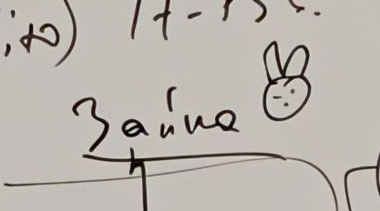

## Лекция 8

<!-- Лектор - Мавринский И. И. -->

Вторая половина XX века начинается с осознания того, что то, что входило в субъект, - рассуждение, желания, самочувствие, внимание - легко управляемые вещи

Возникают 2 проблемы: о чем мы говорим, когда заходит речь о субъективности, и как находить способы критиковать и сопротивляться управления

Одна из ключевых концепций XX века - анализ техники как способа мышления и устройства мира

Мартин Хайдеггер написал статью "Вопрос о технике", которая лежит в основе многих анализов. В этой статье Хайдеггер предлагать начинать оттуда, где мы находимся, - повседневность. 

Как мы представляем себе технику? Как средство для достижения цели

Тогда откуда берутся цели? Логично, что цели ставит субъект, который впоследствии производит объект, который решает поставленную цель

Такая картина сложилась в XVII веке во времена классической науки, начался научно-технический прогресс, в котором изобретения использовали законы из классических наук для реализации целей

Хорошо, мы сделали некоторое число открытий, которое позволяет создать станок для штамповки металла. Как только мы начали печатать монеты, мы поменяли экономическую структуру, создавая две стратегии:

* Если денег не хватает, то можно их напечатать
* Если денег не хватает, то можно произвести то, что можно продать

Если деньги печатать, то появляются различные явления экономики, такие как инфляция, рынок, обмен валют, финансовые кризисы и так далее

То есть средство (в этом случае монеты) содержит в себе нечто большее, чем объект исключительно для достижения цели. Таким образом, средство становится источником новых целей, в том числе новых проблем. Например, программа по выращиванию хлопка в СССР превратилась в осушение Аральского моря и близлежащей экосистемы

Получается, что одни цели прямо или косвенно начинают производить другие цели

Понятие цели появилось изначально у Аристотеля в контексте того, что цель - это причина. В современности мы связываем цель с средством, а причину с следствием. Причинно-следственные связи описываются в науке, в которой характеризуется поведение объектов, а цели и средства связаны с рациональностью субъекта

У Аристотеля нет понятий средства и следствия. Аристотель, живя в III веке до нашей эры, говорил о вещах, а не о процессах, как Декарт и Бэкон. Например, чтобы появился стол, нужны:

* Материал для стола (материальная причина)
* Форма - описание стола, что у него 4 ножки и плоская столешница (формальная причина)
* Движение, то есть умение и возможность сделать стол (действующая причина)
* И цель создать стол, буквально, зачем стол делать? (целевая причина)

Эти 4 пункта называют классами причин. Причины понимаются как условия существования вещи. Причина с греческого дословно переводится как "вина", "ответственность за существование"

То есть цель и причина описывают вещи. Переход к средству и следствию дает процессы

---

Техника являются вещью и сама представляет источник целей. Огромное количество вещей трансформируется 

Например, водяная мельница в реке подстраивается под природу, а гидроэлектростанция приспосабливает природу, то есть природа становится ресурсом

Другой пример - атомная электростанция. Ее нельзя остановить, ее постоянно нужно обслуживать, поэтому в случае с АЭС не техника обслуживает субъекта, а субъект обслуживает технику. То есть субъект, человек, становится ресурсом

Мы не можем больше утверждать, что техника - это средство для достижения цели

Также в производстве у нас есть много видов ресурсов для поддержания безопасности. Мы начинаем производить тревогу

Например, Кант определял счастье как эмпирическое состояние, соответствующее воле человека, тому, что он хочет. Маркетологи и психологи же предлагают негативную повестку: прорабатывание травм, угроз, нехватки чего-либо

Представление о счастье сдвигается не к полноте, а к постоянному исправлению недостатков 

Но правда ли есть тревога?

Помимо реальности физической, ментальной есть еще реальность психическая. Можно внушить травму, которая якобы произошла несколько лет назад и которая задает порядок психической реальности

Язык начинает анализироваться через понятие означающего. В зависимости от специалиста, к которому человек пойдет при плохом состоянии, меняется состояние и способы борьбы. То, как явления обозначаются, запускает то, как с ним работать

Так появляется мода на болезни

Если на уровне вещей шла речь о существовании (онтология), то в XVII веке интересует то, как нами познаются объекты (гносеология), а в современности то, как фиксируются означающиеся в языке

Мы начинаем работать не столько с вещами, сколько с дискурсами

Так появляются однонаправленные тренды, управляемые интерпретации. Мы начинаем работать с языком, по-другому работать с вещами

Современность живёт в режиме, где нельзя всё успеть и завершить, можно лишь прекратить

В XXI веке возникает ключевой вопрос: можно ли использовать власть означающегося не для производства тревоги, а для того, чтобы вернуть человеку способность самостоятельно мыслить?

